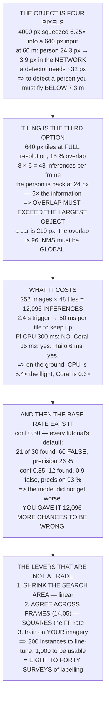

# 14.04 Detection in the air: YOLO on a moving platform

<!-- glance:start -->
<!-- generated by tools/build.py from curriculum/syllabus.yaml — edit the syllabus, not this block -->

| | |
|---|---|
| **Track** | Main path |
| **Difficulty** | Advanced |
| **Time** | 2 h |
| **Hardware** | Onboard computer & vision (stage 2) |
| **Software** | python, pytorch, yolo |
| **Prerequisites** | [14.02 Camera calibration in the field](14.02-field-calibration.md) |
| **Version-sensitive** | yes — see [curriculum/versions.yaml](../curriculum/versions.yaml) |
| **Skip if** | You can run a detector on aerial frames and report precision and recall at the altitude Hermon actually flies. |

<!-- glance:end -->

## What you will learn

- That the detector never sees your frame: 4000 px is squeezed **6.25×** into a 640 px input, and
  a standing person at 60 m goes from 24 px to **3.9 px**
- That "how many pixels is the thing" sets your altitude — a person needs you **below 7.3 m** on
  this camera
- That tiling is the third option: **48 inferences per frame** at full resolution, and the person
  is back at 24 px
- Why **tile overlap must exceed your largest object** — a car at 60 m is 219 px and the default
  overlap is 96
- Why NMS must run in **global coordinates across tiles**, and what per-tile NMS looks like
- That a bare CPU needs **5.4× the flight time** and an accelerator finishes before you pack up
- **The base-rate result**: at the tutorial's 0.5 threshold, a survey returns 21 real objects and
  **60 false ones** — 26 % precision
- That the fix is not a better model: it is a smaller search area, **agreement across frames**, and
  your own imagery

## Why it matters

Everything so far in module 14 has been about producing a good image. This is where something has
to be *found* in it, and it is the point at which most aerial-vision projects quietly fail —
usually for reasons that have nothing to do with the model.

The first reason is arithmetic. Detectors are built and benchmarked on photographs where the
subject fills a good part of the frame. Fly at [12.02](../12-autonomous-flight/12.02-mission-planning.md)'s
survey altitude and your subject is a few dozen pixels, and then the network's own input layer
throws five-sixths of those away before it has done anything. Level 1 computes it.

The second reason is statistics, and it is the one that catches experienced people. A detector
that looks excellent on a test image runs twelve thousand times across one survey, and a false
positive rate that was invisible per-image becomes sixty spurious detections per flight. Level 4
computes that too, and the conclusion is uncomfortable: **the threshold that makes a demo look
good makes a survey useless.**

> [!WARNING]
> A detector is not a sensor and its output is not a measurement. Confidence is not probability,
> a bounding box is not a position (that is [14.05](14.05-tracking-and-geolocation.md)), and a
> missed detection tells you nothing about whether the thing was there. Never let a detection
> trigger a flight action without a human or a corroborating rule — Level 4's 0.99 row exists to
> show how expensive that becomes.

## Prerequisites

<!-- prereqs:start -->
## Prerequisites

You need these first:

- [14.02 Camera calibration in the field](14.02-field-calibration.md)

### Optional prerequisite links

None.

Check your readiness: `python course.py why 14.04`
<!-- prereqs:end -->

## Concept

Imagine looking for a coin on a football pitch from the top of the stands. You can see the whole
pitch at once, which feels efficient, but the coin is far too small to resolve. Or you can walk the
pitch in strips with your eyes a metre off the grass, which resolves everything and takes a long
time. There is no third option that gives you both, and every aerial detection system is a choice
between those two.

A neural network makes this concrete, because its input is a fixed size. Whatever you feed it gets
resized to 640 × 640 or similar, so a 12-megapixel frame is thrown away before the first
convolution. Tiling is the "walk the pitch" option: cut the frame into full-resolution pieces and
run the detector many times.

The second idea is the one that makes aerial work different from every tutorial. When you run a
classifier once, a 1 % false-positive rate is a curiosity. When you run it twelve thousand times
over one flight, it is a hundred and twenty wrong answers, and your handful of real objects is
buried in them. Nothing about the model changed; the **number of opportunities** changed, and that
is the dominant term.

Once you see it that way the fixes reorganise themselves. Improving the model is slow and
expensive. Reducing the number of places it can be wrong — a smaller search area, a requirement
that a detection repeat at the same ground point — is fast, cheap, and multiplicative.

## Technical explanation

### Level 1 — the object is four pixels

Run the code. A detector sees a 640 × 640 square, so a 4000-pixel-wide frame is squeezed **6.25×**
before anything is detected.

At 60 m with 2.06 cm GSD: a standing person is 24.3 px in the frame and **3.9 px in the network**.
A sheep, 9.3. A solar panel, 13.2. Only a car survives, at 35.0 — and a detector needs roughly
32 × 32 to work at all **[S]**.

So the first question in aerial detection is never "which model". It is **how many pixels is the
thing** — and that sets your altitude, which 12.02 thought it had already set. To detect a standing
person at 32 px after the downscale you must fly **below 7.3 m**. A car allows 65.6 m. 12.02's
one-pack altitude was 60, so for anything smaller than a vehicle the mission and the perception
disagree and one of them has to give.

### Level 2 — tiling is the third option

Instead of squeezing, cut the frame into 640 × 640 pieces at full resolution. With 15 % overlap the
step is 544 px, giving 8 × 6 = **48 tiles**, and the person is back at 24 px — six times the
information the downscaled frame had, which is the difference between *hard* and *impossible*.

The overlap is not a style choice. An object straddling a boundary may be detected twice, as two
partial boxes, or not at all. **The overlap must exceed your largest object**: a person is 24 px
and fits inside the 96 px overlap comfortably; **a car at 60 m is 219 px and does not**. A car on a
seam produces two half-detections that NMS will not merge, because they do not overlap enough to
look like one object.

And NMS has to run in **global coordinates, across tiles**. Per-tile NMS is the commonest bug in a
tiled pipeline: every tile is individually clean and the assembled frame has duplicates along
every seam.

### Level 3 — what tiling costs

12.02's survey is 252 images × 48 tiles = **12,096 inferences**. The trigger interval is 2.4 s, so
keeping up in the air means **50 ms per tile**.

| engine **[S]** | per tile | per frame | in flight? |
|---|---|---|---|
| Pi 5 CPU, float32 | 300 ms | 14.4 s | no |
| Pi 5 CPU, INT8 | 110 ms | 5.3 s | no |
| Coral USB TPU | 15 ms | 0.7 s | yes |
| Hailo-8L | 6 ms | 0.3 s | yes |
| Jetson Orin Nano | 4 ms | 0.2 s | yes |

A bare CPU cannot do this in the air and an accelerator can, by a wide margin. That is the whole
argument for [Stage 2](../hardware/stage-2-computer-and-vision.md)'s companion computer having
something in it besides a CPU.

But read the per-survey column against the flight, which is 11.3 minutes. The float32 CPU takes
60.5 min — **5.4× the flight** — which is fine overnight and useless while a client waits. The
Coral takes 3.0 min and finishes before you have packed the aircraft. **So the question is not
"can it keep up", it is "when do you need the answer"** — and if the answer must arrive in flight,
to trigger a search or a diversion, there is no choice at all.

### Level 4 — the base rate is the real problem

Sweep the confidence threshold across a whole survey. The detector is modelled as two curves —
recall falling and false positives falling faster **[E]** — which is what every real detector does.

| conf | recall | found | **false** | precision | F1 |
|---|---|---|---|---|---|
| 0.25 | 0.87 | 26.0 | 1204.4 | 2 % | 0.04 |
| **0.50** | **0.71** | **21.2** | **60.0** | **26 %** | 0.38 |
| 0.70 | 0.55 | 16.4 | 5.4 | 75 % | **0.63** |
| 0.85 | 0.39 | 11.6 | 0.9 | 93 % | 0.55 |
| 0.99 | 0.10 | 3.0 | 0.2 | 95 % | 0.18 |

Read the 0.50 row — the default threshold in every tutorial. It finds 21 of 30 real objects and
hands you **60 false ones**. On a single image that same threshold looks perfectly reasonable,
because a single image is 48 chances to be wrong and a survey is 12,096.

**That is the base rate, and it is the defining fact of aerial detection.** Your detector did not
get worse; you gave it twelve thousand more opportunities.

So what threshold depends entirely on who reads the output. If a human checks every hit, 0.50 is
fine and sixty false positives is an hour of clicking. If a human checks a handful, 0.85 — and it
costs you more than half the real objects. If nobody checks and it triggers an action, 0.99, and
you find three of thirty.

The middle row is usually right and it is expensive. Anyone who tells you their aerial detector is
95 % accurate has not said accurate *at what*, over *how many frames*.

And the levers that are not a trade: **shrink the search area** (a mask, a prior, 12.03's fence —
fewer tiles is linearly fewer chances to be wrong); **require agreement across frames**
([14.05](14.05-tracking-and-geolocation.md)'s tracker — a false positive rarely repeats at the
same *ground point* and a real object always does); and **train on your own imagery**, because most
false positives are things the training set never contained.

The second one is worth the whole of 14.05. Requiring two independent detections of the same
ground point turns a per-tile false-positive rate into its square.

### Level 5 — the dataset is the model

A detector trained on ground-level photographs has never seen the top of a car. Windscreen,
wheels in profile, number plate — all invisible from 60 m.

Six things change between the ground and the air: **viewpoint** (everything is a roof), **scale**
(tens of pixels, not hundreds), **rotation** (any heading, and 12.02's crab angle rotates them
again), **background** (a uniform field, not a cluttered street), **density** (hundreds of
instances per frame, not three), and **light** ([14.01](14.01-cameras-for-uavs.md)'s EV table, and
hard shadows at noon).

So use an aerial dataset — VisDrone, DOTA, xView **[S]** — and then label your own, which is the
part people skip. Roughly 200 instances per class to fine-tune at all, 1,000 to be usable, 5,000
to be good **[S]**. A single 60 m survey gives 252 frames; if your target appears in a tenth of
them that is 25 instances, so "label your own data" means **eight to forty surveys**, not an
afternoon.

Plan for it, and start logging imagery from the first mission whether you need it or not —
[08.07](../08-flight-controller/08.07-logging-and-the-data-path.md) said the same thing about
flight logs.

> [!TIP]
> **Ask your teacher:** "What is our false-positive rate *per survey*, not per image?" Almost
> nobody has computed it, and it is the number that decides whether the output is usable. A model
> card reporting mAP on a benchmark says nothing about it.

## Diagram



## Code

Object size in pixels before and after the network's downscale, the altitude ceiling each target
implies, the tiling geometry with the overlap-versus-object-size check, the inference cost across
five engines against both the trigger interval and the flight time, a confidence sweep computing
precision, recall and F1 over a whole survey, and the dataset arithmetic.

```python
"""14.04 - the object is 4 pixels, and the survey is twelve thousand chances to be wrong."""
import math

# 14.01's camera
PITCH = 6.17e-3 / 4000
FOCAL_M = 4.5e-3
PIX_W, PIX_H = 4000, 3000

# the detector
NET_IN = 640                       # the square the network actually sees
SMALL_FLOOR_PX = 32               # below this, a detector is guessing [S]
TILE_OVERLAP_FRAC = 0.15

# 12.02's survey, at the one-pack altitude
SURVEY_ALT = 60.0
SURVEY_IMAGES = 252
REAL_OBJECTS = 30                  # how many things are actually out there [E]

# inference cost per 640x640 tile [S]
ENGINES = [("Pi 5, CPU, float32", 0.300),
           ("Pi 5, CPU, INT8 quantised", 0.110),
           ("Coral USB TPU", 0.015),
           ("Hailo-8L on a HAT", 0.006),
           ("Jetson Orin Nano", 0.004)]

# things you might look for, and how big they really are
TARGETS = [("a person, standing", 0.50),
           ("a person, lying down", 1.70),
           ("a sheep", 1.20),
           ("a car", 4.50),
           ("a solar panel", 1.70),
           ("a manhole cover", 0.60),
           ("a crack in concrete", 0.01)]

# A detector's behaviour, as two curves. Deterministic, so the numbers
# are reproducible; the SHAPES are what matter, not the constants. [E]
FP_AT_ZERO = 2.0                   # false boxes per tile at threshold 0
FP_DECAY = 12.0                    # how fast confidence kills them


def gsd(alt):
    return PITCH * alt / FOCAL_M


def obj_px(size_m, alt):
    return size_m / gsd(alt)


def downscale(alt, size_m, net=NET_IN, w=PIX_W):
    """What the NETWORK sees, after the frame is squeezed into its input."""
    return obj_px(size_m, alt) * net / w


def tiles(w=PIX_W, h=PIX_H, net=NET_IN, ov=TILE_OVERLAP_FRAC):
    step = int(net * (1 - ov))
    return math.ceil(w / step) * math.ceil(h / step), step


def recall(t):
    """Fraction of real objects still above the threshold. 1 at 0, 0 at 1."""
    return math.sqrt(max(0.0, 1.0 - t))


def fp_per_tile(t):
    return FP_AT_ZERO * math.exp(-FP_DECAY * t)


def survey_scores(t, n_tiles, images=SURVEY_IMAGES, real=REAL_OBJECTS):
    inferences = n_tiles * images
    tp = real * recall(t)
    fp = fp_per_tile(t) * inferences
    prec = tp / (tp + fp) if (tp + fp) > 0 else 0.0
    f1 = 2 * prec * recall(t) / (prec + recall(t)) if (prec + recall(t)) else 0
    return inferences, tp, fp, prec, recall(t), f1


def bar(t):
    print("\n" + "=" * 70)
    print(t)
    print("=" * 70)


if __name__ == "__main__":
    n_tiles, step = tiles()

    bar("1. THE OBJECT IS FOUR PIXELS. THAT IS THE WHOLE PROBLEM.")
    print("  A detector does not see your 4000 x 3000 frame. It sees a")
    print(f"  {NET_IN} x {NET_IN} square, because that is its input layer -- so")
    print(f"  the frame is squeezed by {PIX_W / NET_IN:.2f}x before anything")
    print("  is detected at all.")
    print(f"  At {SURVEY_ALT:.0f} m the GSD is {gsd(SURVEY_ALT) * 100:.2f} cm."
          f" So:")
    print(f"  {'target':24s} {'real size':>10s} {'in the frame':>14s}"
          f" {'in the NETWORK':>16s}")
    for nm, sz in TARGETS:
        p = obj_px(sz, SURVEY_ALT)
        d = downscale(SURVEY_ALT, sz)
        tag = "" if d >= SMALL_FLOOR_PX else "  <- too small"
        print(f"  {nm:24s} {sz:8.2f} m {p:11.1f} px {d:12.1f} px{tag}")
    print(f"  NOTHING ON THAT LIST SURVIVES THE DOWNSCALE. A standing")
    print(f"  person is {obj_px(0.5, SURVEY_ALT):.0f} pixels in the frame and"
          f" {downscale(SURVEY_ALT, 0.5):.1f} in the")
    print(f"  network -- and a detector needs roughly {SMALL_FLOOR_PX} x"
          f" {SMALL_FLOOR_PX} to work.")
    print("  SO THE FIRST QUESTION IN AERIAL DETECTION IS NEVER 'WHICH")
    print("  MODEL'. IT IS 'HOW MANY PIXELS IS THE THING'.")
    print("\n  AND IT SETS YOUR ALTITUDE, WHICH 12.02 THOUGHT IT HAD SET:")
    print(f"  {'to detect':22s} {'you need':>10s} {'so fly BELOW':>14s}")
    for nm, sz in TARGETS[:5]:
        alt_max = sz * FOCAL_M / PITCH * NET_IN / PIX_W / SMALL_FLOOR_PX
        print(f"  {nm:22s} {SMALL_FLOOR_PX:7d} px {alt_max:11.1f} m")
    print("  A DETECTOR THAT MUST SEE PEOPLE CANNOT FLY ABOVE ABOUT")
    print(f"  {0.5 * FOCAL_M / PITCH * NET_IN / PIX_W / SMALL_FLOOR_PX:.0f}"
          f" METRES on this camera -- and 12.02's one-pack altitude was")
    print("  60. The mission and the perception disagree, and one of")
    print("  them has to give. Section 2 is the third option.")

    bar("2. TILING: DO NOT SHRINK THE IMAGE, CUT IT UP")
    print(f"  Instead of squeezing 4000 x 3000 into {NET_IN} x {NET_IN},")
    print(f"  cut it into {NET_IN} x {NET_IN} pieces at FULL RESOLUTION and")
    print("  run the detector on each.")
    print(f"  {'tile size':22s} {NET_IN:8d} px")
    print(f"  {'overlap':22s} {TILE_OVERLAP_FRAC * 100:7.0f} %"
          f"  ({NET_IN - step} px)")
    print(f"  {'step':22s} {step:8d} px")
    print(f"  {'tiles across x down':22s}"
          f" {math.ceil(PIX_W / step):4d} x {math.ceil(PIX_H / step):d}")
    print(f"  {'INFERENCES PER FRAME':22s} {n_tiles:8d}")
    print(f"  {'and at full resolution':22s}"
          f" {obj_px(0.5, SURVEY_ALT):8.0f} px per person")
    print("  THE PERSON IS BACK. Twenty-four pixels is still small and a")
    print(f"  detector will not love it, but it is {obj_px(0.5, SURVEY_ALT) / downscale(SURVEY_ALT, 0.5):.0f}"
          f" TIMES more")
    print("  information than the downscaled frame had, and it is the")
    print("  difference between 'hard' and 'impossible'.")
    print("\n  AND THE OVERLAP IS NOT A STYLE CHOICE. An object that")
    print("  straddles a tile boundary may be detected TWICE (two partial")
    print("  boxes) or NOT AT ALL (neither tile sees enough of it). The")
    print("  overlap has to be bigger than the biggest object:")
    print(f"  {'target at 60 m':24s} {'px':>7s} {'fits in ' + str(NET_IN - step) + ' px overlap?':>26s}")
    for nm, sz in TARGETS:
        p = obj_px(sz, SURVEY_ALT)
        print(f"  {nm:24s} {p:6.0f} {('yes' if p <= NET_IN - step else 'NO'):>26s}")
    print("  A CAR AT 60 METRES IS 219 PIXELS AND THE OVERLAP IS 96. A")
    print("  car on a tile seam gets two half-detections that NMS will")
    print("  not merge, because they do not overlap enough to look like")
    print("  the same object. RAISE THE OVERLAP, or accept that large")
    print("  objects are unreliable at tile boundaries.")
    print("  AND NMS HAS TO RUN IN GLOBAL COORDINATES, ACROSS TILES.")
    print("  Per-tile NMS is the commonest bug in a tiled pipeline: each")
    print("  tile is individually clean and the assembled frame has")
    print("  duplicates all along every seam.")

    bar("3. WHAT TILING COSTS: 48 INFERENCES, 252 TIMES")
    total = n_tiles * SURVEY_IMAGES
    print(f"  12.02's 60 m survey is {SURVEY_IMAGES} images."
          f" At {n_tiles} tiles each:")
    print(f"  {'INFERENCES PER SURVEY':26s} {total:10,d}")
    trig = 2.4                                        # 12.02's trigger, s
    print(f"  And 12.02 triggers every {trig:.1f} s, so to keep up IN THE AIR")
    print(f"  you have {trig / n_tiles * 1000:.0f} ms per tile.")
    print(f"  {'engine [S]':28s} {'per tile':>10s} {'per frame':>11s}"
          f" {'per survey':>12s} {'in flight?':>11s}")
    for nm, sec in ENGINES:
        per_frame = sec * n_tiles
        print(f"  {nm:28s} {sec * 1000:7.0f} ms {per_frame:8.1f} s"
              f" {sec * total / 60:9.1f} min"
              f" {('yes' if per_frame <= trig else 'NO'):>11s}")
    print("  A BARE CPU CANNOT DO THIS IN THE AIR AND AN ACCELERATOR")
    print("  CAN, BY A WIDE MARGIN. That is not a close call and it is")
    print("  the whole argument for Stage 2's companion computer having")
    print("  something in it besides a CPU.")
    print("  AND NOW READ THE 'PER SURVEY' COLUMN AGAINST THE FLIGHT.")
    flight_min = 11.3                                # 12.02, 60 m
    print(f"  12.02's 60 m survey is {flight_min:.1f} minutes in the air:")
    for nm, sec in ENGINES:
        mins = sec * total / 60
        print(f"    {nm:28s} {mins:6.1f} min ="
              f" {mins / flight_min:5.1f} x the flight")
    print("  SO THE CHOICE IS NOT 'CAN IT KEEP UP' BUT 'WHEN DO YOU NEED")
    print("  THE ANSWER'. A bare CPU turns an eleven-minute flight into")
    print(f"  an hour of processing -- {0.300 * total / 60 / flight_min:.0f}"
          f" times the flight -- which is")
    print("  fine overnight and useless while a client waits. An")
    print("  accelerator finishes before you have packed the aircraft.")
    print("  AND IF THE ANSWER MUST ARRIVE IN FLIGHT -- a search, a")
    print("  trigger, a diversion -- then there is no choice at all.")
    print("  14.06 asks that question properly.")

    bar("4. THE REAL PROBLEM IS THE BASE RATE, NOT THE ACCURACY")
    print("  Sweep the confidence threshold over a whole survey. The")
    print("  detector's behaviour is modelled as two curves -- recall")
    print("  falling and false positives falling faster -- which is what")
    print("  every real detector does. [E]")
    print(f"  {REAL_OBJECTS} real objects,"
          f" {total:,} inferences, one survey:")
    print(f"  {'conf':>6s} {'recall':>8s} {'found':>7s} {'FALSE':>9s}"
          f" {'precision':>11s} {'F1':>7s}")
    for t in (0.25, 0.50, 0.70, 0.85, 0.95, 0.99):
        inf, tp, fp, prec, rec, f1 = survey_scores(t, n_tiles)
        print(f"  {t:6.2f} {rec:7.2f} {tp:7.1f} {fp:9.1f}"
              f" {prec * 100:9.0f} % {f1:7.2f}")
    print("  READ THE 0.50 ROW -- THE DEFAULT THRESHOLD IN EVERY TUTORIAL.")
    inf, tp, fp, prec, rec, f1 = survey_scores(0.50, n_tiles)
    print(f"  It finds {tp:.0f} of {REAL_OBJECTS} real objects and hands you"
          f" {fp:.0f} FALSE ONES.")
    print(f"  Precision {prec * 100:.0f} %. On a single image that same")
    print("  threshold looks perfectly reasonable, because a single image")
    print(f"  is {n_tiles} chances to be wrong and a survey is {total:,}.")
    print("  THAT IS THE BASE RATE, AND IT IS THE DEFINING FACT OF")
    print("  AERIAL DETECTION. Your detector did not get worse; you gave")
    print("  it twelve thousand more opportunities.")
    print("\n  SO WHAT THRESHOLD? THAT DEPENDS ON WHO READS THE OUTPUT:")
    for goal, t in (("a human will check every hit", 0.50),
                    ("a human will check a handful", 0.85),
                    ("NOBODY checks -- it triggers an action", 0.99)):
        inf, tp, fp, prec, rec, f1 = survey_scores(t, n_tiles)
        print(f"  {goal:34s} conf {t:.2f}")
        print(f"  {'':34s} -> {tp:.0f} found, {fp:.1f} false,"
              f" {rec * 100:.0f} % of them")
    print("  THE MIDDLE ROW IS USUALLY RIGHT AND IT COSTS YOU MORE THAN")
    print("  HALF THE REAL OBJECTS. THAT IS THE TRADE. Anyone who tells")
    print("  you their aerial detector is 95 % accurate has not said")
    print("  accurate at what, over how many frames.")
    print("\n  AND THE ONE LEVER THAT IS NOT A TRADE:")
    for a, b in (("shrink the search area",
                  "12.02's fence, a mask, a prior. Fewer tiles is "
                  "linearly fewer chances to be wrong"),
                 ("require agreement across FRAMES",
                  "14.05's tracker. A false positive rarely repeats in "
                  "the same PLACE; a real object always does"),
                 ("train on YOUR imagery",
                  "section 5. Most of the false positives are things the "
                  "training set never contained")):
        print(f"    {a:32s} {b}")
    print("  THE SECOND ONE IS WORTH THE WHOLE OF 14.05. Requiring two")
    print("  independent detections of the same GROUND POINT turns a")
    print("  per-tile false-positive rate into its square.")

    bar("5. THE DATASET IS THE MODEL")
    print("  A detector trained on ground-level photographs has never")
    print("  seen the top of a car. The features it learned -- a")
    print("  windscreen, wheels in profile, a number plate -- are all")
    print("  invisible from 60 metres.")
    print(f"  {'what changes from the ground to the air':44s}")
    for a in ("VIEWPOINT: everything is a roof",
              "SCALE: tens of pixels, not hundreds",
              "ROTATION: objects appear at any heading, and 12.02's "
              "crab angle rotates them again",
              "BACKGROUND: a uniform field, not a cluttered street",
              "DENSITY: hundreds of instances per frame, not three",
              "and LIGHT: 14.01's EV table, and hard shadows at noon"):
        print(f"    - {a}")
    print("  SO USE AN AERIAL DATASET, NOT COCO. VisDrone, DOTA and")
    print("  xView are the usual starting points [S], and all three are")
    print("  closer to your problem than anything trained on the ground.")
    print("\n  AND THEN LABEL YOUR OWN, WHICH IS THE PART PEOPLE SKIP:")
    print(f"  {'':4s}{'instances per class':>22s} {'roughly [S]':>14s}")
    for a, n in (("bare minimum to fine-tune", 200),
                 ("usable", 1000),
                 ("good", 5000)):
        print(f"  {'':4s}{a:>22s} {n:11,d}")
    print(f"  A SINGLE {SURVEY_ALT:.0f} m SURVEY OF 12.02's AREA GIVES YOU"
          f" {SURVEY_IMAGES} FRAMES.")
    print("  If your target appears in a tenth of them, that is 25")
    print("  instances -- so 'label your own data' means eight to forty")
    print("  SURVEYS, not an afternoon. Plan for it, and start logging")
    print("  imagery from the very first mission whether you need it or")
    print("  not. 08.07 already said the same thing about flight logs.")
```

Output:

```text

======================================================================
1. THE OBJECT IS FOUR PIXELS. THAT IS THE WHOLE PROBLEM.
======================================================================
  A detector does not see your 4000 x 3000 frame. It sees a
  640 x 640 square, because that is its input layer -- so
  the frame is squeezed by 6.25x before anything
  is detected at all.
  At 60 m the GSD is 2.06 cm. So:
  target                    real size   in the frame   in the NETWORK
  a person, standing           0.50 m        24.3 px          3.9 px  <- too small
  a person, lying down         1.70 m        82.7 px         13.2 px  <- too small
  a sheep                      1.20 m        58.3 px          9.3 px  <- too small
  a car                        4.50 m       218.8 px         35.0 px
  a solar panel                1.70 m        82.7 px         13.2 px  <- too small
  a manhole cover              0.60 m        29.2 px          4.7 px  <- too small
  a crack in concrete          0.01 m         0.5 px          0.1 px  <- too small
  NOTHING ON THAT LIST SURVIVES THE DOWNSCALE. A standing
  person is 24 pixels in the frame and 3.9 in the
  network -- and a detector needs roughly 32 x 32 to work.
  SO THE FIRST QUESTION IN AERIAL DETECTION IS NEVER 'WHICH
  MODEL'. IT IS 'HOW MANY PIXELS IS THE THING'.

  AND IT SETS YOUR ALTITUDE, WHICH 12.02 THOUGHT IT HAD SET:
  to detect                you need   so fly BELOW
  a person, standing          32 px         7.3 m
  a person, lying down        32 px        24.8 m
  a sheep                     32 px        17.5 m
  a car                       32 px        65.6 m
  a solar panel               32 px        24.8 m
  A DETECTOR THAT MUST SEE PEOPLE CANNOT FLY ABOVE ABOUT
  7 METRES on this camera -- and 12.02's one-pack altitude was
  60. The mission and the perception disagree, and one of
  them has to give. Section 2 is the third option.

======================================================================
2. TILING: DO NOT SHRINK THE IMAGE, CUT IT UP
======================================================================
  Instead of squeezing 4000 x 3000 into 640 x 640,
  cut it into 640 x 640 pieces at FULL RESOLUTION and
  run the detector on each.
  tile size                   640 px
  overlap                     15 %  (96 px)
  step                        544 px
  tiles across x down       8 x 6
  INFERENCES PER FRAME         48
  and at full resolution       24 px per person
  THE PERSON IS BACK. Twenty-four pixels is still small and a
  detector will not love it, but it is 6 TIMES more
  information than the downscaled frame had, and it is the
  difference between 'hard' and 'impossible'.

  AND THE OVERLAP IS NOT A STYLE CHOICE. An object that
  straddles a tile boundary may be detected TWICE (two partial
  boxes) or NOT AT ALL (neither tile sees enough of it). The
  overlap has to be bigger than the biggest object:
  target at 60 m                px     fits in 96 px overlap?
  a person, standing           24                        yes
  a person, lying down         83                        yes
  a sheep                      58                        yes
  a car                       219                         NO
  a solar panel                83                        yes
  a manhole cover              29                        yes
  a crack in concrete           0                        yes
  A CAR AT 60 METRES IS 219 PIXELS AND THE OVERLAP IS 96. A
  car on a tile seam gets two half-detections that NMS will
  not merge, because they do not overlap enough to look like
  the same object. RAISE THE OVERLAP, or accept that large
  objects are unreliable at tile boundaries.
  AND NMS HAS TO RUN IN GLOBAL COORDINATES, ACROSS TILES.
  Per-tile NMS is the commonest bug in a tiled pipeline: each
  tile is individually clean and the assembled frame has
  duplicates all along every seam.

======================================================================
3. WHAT TILING COSTS: 48 INFERENCES, 252 TIMES
======================================================================
  12.02's 60 m survey is 252 images. At 48 tiles each:
  INFERENCES PER SURVEY          12,096
  And 12.02 triggers every 2.4 s, so to keep up IN THE AIR
  you have 50 ms per tile.
  engine [S]                     per tile   per frame   per survey  in flight?
  Pi 5, CPU, float32               300 ms     14.4 s      60.5 min          NO
  Pi 5, CPU, INT8 quantised        110 ms      5.3 s      22.2 min          NO
  Coral USB TPU                     15 ms      0.7 s       3.0 min         yes
  Hailo-8L on a HAT                  6 ms      0.3 s       1.2 min         yes
  Jetson Orin Nano                   4 ms      0.2 s       0.8 min         yes
  A BARE CPU CANNOT DO THIS IN THE AIR AND AN ACCELERATOR
  CAN, BY A WIDE MARGIN. That is not a close call and it is
  the whole argument for Stage 2's companion computer having
  something in it besides a CPU.
  AND NOW READ THE 'PER SURVEY' COLUMN AGAINST THE FLIGHT.
  12.02's 60 m survey is 11.3 minutes in the air:
    Pi 5, CPU, float32             60.5 min =   5.4 x the flight
    Pi 5, CPU, INT8 quantised      22.2 min =   2.0 x the flight
    Coral USB TPU                   3.0 min =   0.3 x the flight
    Hailo-8L on a HAT               1.2 min =   0.1 x the flight
    Jetson Orin Nano                0.8 min =   0.1 x the flight
  SO THE CHOICE IS NOT 'CAN IT KEEP UP' BUT 'WHEN DO YOU NEED
  THE ANSWER'. A bare CPU turns an eleven-minute flight into
  an hour of processing -- 5 times the flight -- which is
  fine overnight and useless while a client waits. An
  accelerator finishes before you have packed the aircraft.
  AND IF THE ANSWER MUST ARRIVE IN FLIGHT -- a search, a
  trigger, a diversion -- then there is no choice at all.
  14.06 asks that question properly.

======================================================================
4. THE REAL PROBLEM IS THE BASE RATE, NOT THE ACCURACY
======================================================================
  Sweep the confidence threshold over a whole survey. The
  detector's behaviour is modelled as two curves -- recall
  falling and false positives falling faster -- which is what
  every real detector does. [E]
  30 real objects, 12,096 inferences, one survey:
    conf   recall   found     FALSE   precision      F1
    0.25    0.87    26.0    1204.4         2 %    0.04
    0.50    0.71    21.2      60.0        26 %    0.38
    0.70    0.55    16.4       5.4        75 %    0.63
    0.85    0.39    11.6       0.9        93 %    0.55
    0.95    0.22     6.7       0.3        96 %    0.36
    0.99    0.10     3.0       0.2        95 %    0.18
  READ THE 0.50 ROW -- THE DEFAULT THRESHOLD IN EVERY TUTORIAL.
  It finds 21 of 30 real objects and hands you 60 FALSE ONES.
  Precision 26 %. On a single image that same
  threshold looks perfectly reasonable, because a single image
  is 48 chances to be wrong and a survey is 12,096.
  THAT IS THE BASE RATE, AND IT IS THE DEFINING FACT OF
  AERIAL DETECTION. Your detector did not get worse; you gave
  it twelve thousand more opportunities.

  SO WHAT THRESHOLD? THAT DEPENDS ON WHO READS THE OUTPUT:
  a human will check every hit       conf 0.50
                                     -> 21 found, 60.0 false, 71 % of them
  a human will check a handful       conf 0.85
                                     -> 12 found, 0.9 false, 39 % of them
  NOBODY checks -- it triggers an action conf 0.99
                                     -> 3 found, 0.2 false, 10 % of them
  THE MIDDLE ROW IS USUALLY RIGHT AND IT COSTS YOU MORE THAN
  HALF THE REAL OBJECTS. THAT IS THE TRADE. Anyone who tells
  you their aerial detector is 95 % accurate has not said
  accurate at what, over how many frames.

  AND THE ONE LEVER THAT IS NOT A TRADE:
    shrink the search area           12.02's fence, a mask, a prior. Fewer tiles is linearly fewer chances to be wrong
    require agreement across FRAMES  14.05's tracker. A false positive rarely repeats in the same PLACE; a real object always does
    train on YOUR imagery            section 5. Most of the false positives are things the training set never contained
  THE SECOND ONE IS WORTH THE WHOLE OF 14.05. Requiring two
  independent detections of the same GROUND POINT turns a
  per-tile false-positive rate into its square.

======================================================================
5. THE DATASET IS THE MODEL
======================================================================
  A detector trained on ground-level photographs has never
  seen the top of a car. The features it learned -- a
  windscreen, wheels in profile, a number plate -- are all
  invisible from 60 metres.
  what changes from the ground to the air     
    - VIEWPOINT: everything is a roof
    - SCALE: tens of pixels, not hundreds
    - ROTATION: objects appear at any heading, and 12.02's crab angle rotates them again
    - BACKGROUND: a uniform field, not a cluttered street
    - DENSITY: hundreds of instances per frame, not three
    - and LIGHT: 14.01's EV table, and hard shadows at noon
  SO USE AN AERIAL DATASET, NOT COCO. VisDrone, DOTA and
  xView are the usual starting points [S], and all three are
  closer to your problem than anything trained on the ground.

  AND THEN LABEL YOUR OWN, WHICH IS THE PART PEOPLE SKIP:
         instances per class    roughly [S]
      bare minimum to fine-tune         200
                      usable       1,000
                        good       5,000
  A SINGLE 60 m SURVEY OF 12.02's AREA GIVES YOU 252 FRAMES.
  If your target appears in a tenth of them, that is 25
  instances -- so 'label your own data' means eight to forty
  SURVEYS, not an afternoon. Plan for it, and start logging
  imagery from the very first mission whether you need it or
  not. 08.07 already said the same thing about flight logs.
```

## Exercise

### Exercise 14.04-E1 — Compute your own detection ceiling `[analysis]`

For each thing you actually want to find, compute the pixels at your survey altitude, before and
after your network's downscale, and the altitude below which it reaches 32 px tiled and untiled.
Compare against 12.02's one-pack altitude and note where they conflict.

### Exercise 14.04-E2 — Build the tiler `[build]`

Write the tiling function: split a frame with configurable overlap, run the detector per tile,
map boxes back into global coordinates, and run NMS globally. Verify by placing a synthetic box
across a seam and checking you get one detection, not two or zero.

### Exercise 14.04-E3 — Measure your own base rate `[build]`

Run your detector over a full survey's worth of frames from a real flight, at several thresholds,
and count detections. You do not need ground truth for the interesting half: the *total* detection
count at threshold 0.25 versus 0.85 tells you most of the story.

### Exercise 14.04-E4 — Find the threshold your workflow can afford `[analysis]`

Decide how many false positives per survey a human will actually look at — be honest, it is
usually under twenty — and read the threshold off your own version of Level 4's table. Then report
what recall you just bought at that price.

## Expected result

**14.04-E1**: for most targets smaller than a car, the detection ceiling is far below 12.02's
survey altitude, and tiling closes most but not all of the gap. The honest outcome is often "we
must fly a second, lower mission for detection" — which is a plan, and much better than a blurred
surprise.

**14.04-E2**: the seam test is the one that matters. If you get two boxes, your NMS is per-tile
or your IoU threshold is too tight for partial boxes; if you get zero, your overlap is smaller
than the object.

**14.04-E3**: expect the detection count to fall by one to two orders of magnitude between 0.25
and 0.85, and expect almost all of that drop to be false positives. That ratio *is* Level 4's
curve, measured on your own data.

**14.04-E4**: most people discover their usable threshold is far higher than the default and their
recall is far lower than they assumed. Writing both numbers down is the deliverable; a pipeline
whose recall nobody has stated cannot be relied on.

## Troubleshooting

**The detector finds nothing.** Check the pixel count first (Level 1), not the model. Below about
32 px in the network's input, nothing will work.

**It works on a laptop and not on the aircraft.** Usually quantisation changing the score
distribution, or a different input size. Re-measure the threshold after quantising —
[14.06](14.06-edge-compute-and-latency.md).

**Duplicates all along regular lines in the image.** Per-tile NMS. Level 2.

**Large objects are detected on some frames and not others.** Tile seams, and the overlap is
smaller than the object.

**Hundreds of detections per frame.** The threshold is too low for the number of tiles. Level 4.

**Good precision on a test image, terrible over a survey.** The base rate. Same detector, twelve
thousand more chances.

**Detections cluster on shadows or on a particular crop type.** The training data never contained
them. Level 5, and this is the cheapest fix available: label a hundred of them and fine-tune.

**Performance falls off in the afternoon.** [14.01](14.01-cameras-for-uavs.md)'s light budget —
longer exposures, more blur, and a detector that was trained on sharp frames.

## Common mistakes

- **Choosing a model before counting pixels.** The pixel count decides whether any model can work.
- **Feeding a 12 MP frame straight into a 640 px network.** Five-sixths of the image is discarded
  before inference.
- **Setting the tile overlap by convention.** It must exceed your largest object.
- **Running NMS per tile.** Duplicates on every seam.
- **Quoting per-image metrics for a survey workflow.** The base rate is the dominant term.
- **Using the default 0.5 confidence.** It is a demo setting, not a production one.
- **Training on ground-level data.** The detector has never seen a roof.
- **Assuming you can label a dataset in an afternoon.** It is eight to forty surveys.

## Knowledge check

<details>
<summary>Why is a standing person undetectable at 60 m even though they are 24 pixels in the
frame?</summary>

Because the detector's input is 640 px wide and the frame is 4000, so everything is squeezed 6.25×
before inference: 24.3 px becomes 3.9 px. A detector needs roughly 32 × 32 to work, so the object
is an order of magnitude too small by the time the first convolution sees it.
</details>

<details>
<summary>What does tiling actually buy, and what does it cost?</summary>

It preserves full resolution — the person is back at 24 px, six times the information — at the cost
of 48 inferences per frame instead of one, which is 12,096 per survey. It also introduces seams,
which need overlap and global NMS.
</details>

<details>
<summary>Your tile overlap is 96 px and you are looking for cars at 60 m. What goes wrong?</summary>

A car is 219 px, so one straddling a seam is cut into two pieces, each too partial to be recognised
confidently and too poorly overlapping for NMS to merge. You get two half-detections or none. The
overlap has to exceed the largest object you care about.
</details>

<details>
<summary>Why must NMS run in global coordinates?</summary>

Because with overlapping tiles the same object appears in two tiles, and per-tile NMS has no way to
know that. Each tile looks individually clean while the assembled frame has duplicate boxes along
every seam — which is the commonest bug in a tiled pipeline and looks like a detector problem.
</details>

<details>
<summary>At the default 0.5 confidence, a survey returns 21 real objects and 60 false ones. Did the
detector get worse?</summary>

No. The same detector on a single image at the same threshold looks fine, because one image is 48
chances to be wrong and a survey is 12,096. The false-positive *rate* is unchanged; the number of
opportunities grew by four orders of magnitude. That is the base rate.
</details>

<details>
<summary>Why is "require agreement across frames" a better lever than a better model?</summary>

Because a false positive rarely repeats at the same *ground point* while a real object always does,
so requiring two independent detections of one ground point turns the per-tile false-positive rate
into its square. Improving the model is slow and linear; this is fast and multiplicative — and it
is exactly what 14.05's tracker provides.
</details>

<details>
<summary>What actually stops a COCO-trained detector working from 60 m?</summary>

Six things at once: viewpoint (everything is a roof), scale, rotation (any heading, plus the crab
angle), background (uniform, not cluttered), density (hundreds per frame), and light. None of them
is fixed by a bigger model; they are fixed by training data that looks like your flights.
</details>

<details>
<summary>How many surveys does "label your own data" actually mean?</summary>

Eight to forty. A 60 m survey gives 252 frames; if the target appears in a tenth of them that is
about 25 instances, and you need roughly 200 to fine-tune, 1,000 to be usable and 5,000 to be
good. Which is why you log imagery from the first flight, whether you need it yet or not.
</details>

## Practical challenge

Build a tiled detection pipeline and characterise it honestly.

1. Compute the detection ceiling for each of your targets, tiled and untiled (E1), and decide
   your detection altitude — which may not be your mapping altitude.
2. Build the tiler with configurable overlap and global NMS, and pass the seam test (E2).
3. Choose a starting model trained on aerial imagery, not COCO.
4. Run it over a full real survey and count detections at five thresholds (E3).
5. Ground-truth a *subset* — fifty frames is enough — and compute precision and recall per
   threshold on that subset.
6. Extrapolate to the full survey and produce your own version of Level 4's table.
7. Pick the threshold your workflow can afford, and write down the recall it costs (E4).
8. Label every real object you found, and every confident false positive, and put them in a
   dataset directory with the date and altitude. That is survey one of eight.

Step 8 is the one that compounds. Every flight you fly from now on either builds the dataset or
does not, and the decision costs nothing at the time and everything later.

## You can skip this if

You can run a detector on aerial frames and report precision and recall at the altitude Hermon
actually flies. "Report" means over a survey, not over a test image.

## Go deeper

- The Ultralytics YOLO documentation, including the tiling-adjacent `SAHI` integration and the
  input-size settings Level 1 depends on: <https://docs.ultralytics.com/>
- SAHI — slicing-aided hyper inference — which is the tiling scheme in Level 2, implemented and
  benchmarked: <https://github.com/obss/sahi>
- VisDrone, the most accessible aerial detection dataset and a reasonable place to start
  fine-tuning from: <https://github.com/VisDrone/VisDrone-Dataset>

**Version-sensitive:** model architectures, default input sizes, NMS implementations and export
formats all change rapidly, and an accelerator's supported operator set changes with its runtime.
Benchmark on your own hardware rather than trusting a published figure, and re-measure your
threshold after any export or quantisation step.

## Progress checkpoint

You can now compute whether a target is detectable at all before choosing a model, tile a frame
correctly including the seams, price inference against both the trigger interval and the flight
time, and state your pipeline's precision and recall *per survey* rather than per image.

Next, [14.05](14.05-tracking-and-geolocation.md) turns a bounding box into a position on the
ground — and provides the cross-frame agreement that Level 4 identified as the one lever that is
not a trade.
