# 14.05 From detection to a track, and from a pixel to a ground coordinate

<!-- glance:start -->
<!-- generated by tools/build.py from curriculum/syllabus.yaml — edit the syllabus, not this block -->

| | |
|---|---|
| **Track** | Main path |
| **Difficulty** | Advanced |
| **Time** | 1 h 45 min |
| **Hardware** | Onboard computer & vision (stage 2) |
| **Software** | python, opencv |
| **Prerequisites** | [14.04 Detection in the air: YOLO on a moving platform](14.04-detection-in-the-air.md)<br>[13.04 Coordinates for operators: WGS84, UTM, ENU — and EGNOS](../13-navigation-gnss/13.04-coordinates-for-operators.md) |
| **Skip if** | You can turn a bounding box plus aircraft pose into a ground coordinate with a stated error budget. |

<!-- glance:end -->

## What you will learn

- The whole geolocation chain — pixel, ray, body, NED, ground plane — and the check that it
  closes against 14.01's footprint
- That the error budget is **7.03 m** and the camera contributes **0.6 cm**: geolocation accuracy
  is a **navigation problem, not a vision problem**
- Why a height error moves nothing at nadir and **4.73 m at the frame edge**
- That **99.7 % of the budget is a bias**, and a Kalman filter cannot remove a bias
- Which quantities the bias **cancels in** — velocity, relative geometry, cross-frame agreement —
  and which it does not
- Why the association gate is **2.8 m, not 21**, and what happens when you get that backwards
- That requiring **two detections of one ground point** takes false tracks from about one per
  survey to essentially zero — 14.04's promised lever, delivered

## Why it matters

[14.04](14.04-detection-in-the-air.md) left you with a bounding box and two unsolved problems: the
box is not a position, and the false-positive rate over a survey is ruinous. Both are solved here,
and both are solved by the same piece of arithmetic — turning a pixel into a point on the ground.

The result that matters most is the error budget, because it is the opposite of what people
expect. Module 14 has spent three lessons making the camera good: a measured pixel pitch, a
sub-pixel calibration, a damped mount. All of that contributes **six millimetres** to the final
answer. The seven metres come from the aircraft's own position and from not knowing the shape of
the ground.

That reframes the whole subject. If someone asks how to make your geolocation better, the answer
is [13.03](../13-navigation-gnss/13.03-rtk-and-ppk.md) and a terrain model, not a better lens —
and this lesson is where RTK finally earns the case that 13.03 could not make on its own.

> [!WARNING]
> A geolocated detection is an estimate with a stated error, and the error is metres. Never hand
> one to somebody — a client, a search team, an emergency service — without the number attached.
> "There is a person at this coordinate" and "there is a person within about seven metres of this
> coordinate, and I have not verified it" are different statements, and only one of them is true.

## Prerequisites

<!-- prereqs:start -->
## Prerequisites

You need these first:

- [14.04 Detection in the air: YOLO on a moving platform](14.04-detection-in-the-air.md)
- [13.04 Coordinates for operators: WGS84, UTM, ENU — and EGNOS](../13-navigation-gnss/13.04-coordinates-for-operators.md)

### Optional prerequisite links

None.

Check your readiness: `python course.py why 14.05`
<!-- prereqs:end -->

## Concept

Point a laser pointer at the floor from a balcony. Where the dot lands depends on four things:
where you are standing, how high the balcony is, which way you are pointing, and the shape of the
floor. Get any one wrong and the dot is somewhere else.

Geolocation is that, with the laser replaced by a pixel. Every pixel in the frame defines a ray
out of the camera; the ray gets rotated into the world by the camera's mounting and the aircraft's
attitude; and then it is intersected with a surface. The surface is the part people forget, and it
is the part that is usually least well known.

The second idea is the one that reorganises everything, and it is [13.02](../13-navigation-gnss/13.02-error-sources.md)'s
distinction arriving in a new place. Some of these errors change every frame — the attitude
wobbles, the detector's box centre jitters. Others do not: your GNSS position is the same
kilometre-scale mistake for the whole flight, and the ground does not move at all. The first kind
averages away. **The second kind does not, ever**, and almost all of the budget is the second kind.

Which sounds fatal until you notice what a common error does *not* spoil. If every target in the
frame is displaced by the same seven metres, the distance between them is right, their speeds are
right, and whether a detection repeats at the same place is right. The absolute answer is poor and
almost everything you actually wanted is fine.

## Technical explanation

### Level 1 — a pixel is a ray, and the ground is a plane

Five steps: pixel to a normalised ray using [14.02](14.02-field-calibration.md)'s $f_x, c_x, c_y$;
undistort using its $k$ and $p$ coefficients; camera axes to body axes using its mount transform;
body to NED using the autopilot's attitude; and intersect with the ground plane.

The code implements it and checks that it closes. A level aircraft at 60 m puts the frame centre
at nadir, the mid-right edge at **41.1 m east**, and the corner at 51.4 m. 14.01 said the
footprint is 82 × 61 m, and half of 82 is 41. The two routes agree, which is the only reason to
trust either.

### Level 2 — the error budget, and it is not the camera

Perturb one input at a time at the frame centre, level, 60 m:

| source | σ | ground error | from |
|---|---|---|---|
| GNSS horizontal position | 4.80 m | **4.80 m** | 13.02: HDOP 1.06 × UERE 4.50 |
| terrain, unknown relief | 5.00 m | **5.00 m** | 12.02's site had 40 m of it |
| camera-to-body angle | 1.00° | 1.05 m | 14.02, if you eyeballed it |
| attitude, roll and pitch | 0.50° | 0.52 m | 06.05's EKF |
| GNSS / baro altitude | 6.90 m | 0.00 m | at nadir it moves nothing — Level 3 |
| calibration reprojection | 0.30 px | **0.01 m** | 14.02 |
| **root-sum-square** | | **7.03 m** | |

Read the order. The two largest terms are the aircraft's own position and the terrain. The
camera's contribution — 14.02's beautifully calibrated 0.30 px — is **0.6 cm**, over a thousand
times smaller than the total.

**So geolocation accuracy is a navigation problem, not a vision problem.** A better camera buys
nothing. RTK attacks the biggest term directly, and that is the case for it that
[13.03](../13-navigation-gnss/13.03-rtk-and-ppk.md) could not make on its own.

The angles are not negligible either: half a degree of attitude is 0.52 m and a degree of mount
error is 1.05 m — [14.02](14.02-field-calibration.md)'s result, arriving where it was always going
to matter.

### Level 3 — off-nadir, and why altitude suddenly counts

At the frame centre a height error moves nothing: the ray points straight down, so a wrong height
slides the point *along* the ray and it lands in the same place. Away from the centre it does not.

| across the frame | off-nadir | 6.9 m of height | 0.5° of pitch |
|---|---|---|---|
| 0 % | 0.0° | 0.00 m | 0.52 m |
| 50 % | 18.9° | 2.37 m | 0.52 m |
| **100 %** | **34.4°** | **4.73 m** | 0.52 m |

At the edge of the frame, 13.02's vertical error alone is **4.73 m**. And 13.02 also said VDOP is
permanently worse than HDOP, so this is not bad luck — it is the geometry of every GNSS fix,
arriving at the edge of every frame.

Which gives the operational rule: **geolocate from near the centre of the frame.** If a target
matters, fly so it passes through the middle, and discard detections in the outer quarter — which
is also where 14.02's distortion was worst. The frame has a good part and you know where it is.

### Level 4 — split the budget: what changes, and what does not

Over the thirty seconds a target is in view, which of those six errors actually changes?

**Constant:** GNSS horizontal position (4.80 m — it drifts slowly), terrain (5.00 m — the ground
does not move), camera-to-body angle (1.05 m — it is bolted on). **Root-sum-square: 7.01 m.**

**Changing:** attitude (0.52 m), calibration (0.01), detector box centre (0.10). **Root-sum-square:
0.53 m.**

All but half a metre of the budget is a bias — **99.7 % of it by variance** — and a Kalman filter
cannot remove a bias. It averages noise, and a bias survives averaging perfectly. That is
[13.02](../13-navigation-gnss/13.02-error-sources.md)'s multipath argument arriving in a different
module.

### Level 5 — track in ground coordinates, and know what it buys

A tracker that associates *boxes* must model the camera's motion, the target's motion and the
aircraft's attitude at once, in a frame that is itself moving. A tracker that associates *ground
points* does not: the target's motion is all that is left, and a constant-velocity model is
actually true. **Geolocate first, then track.**

Run it twice on a target at 1.55 m/s, sampled every 2.4 s:

| | RMS raw | RMS tracked | late tracked | speed |
|---|---|---|---|---|
| white noise only | 0.66 m | 0.64 m | **0.48 m** | 1.51 m/s |
| with a 12.6 m bias drawn | 12.68 m | 12.79 m | 12.50 m | **1.55 m/s** |

With white noise alone the tracker earns its keep. With the bias in, the tracked error floors at
the bias and never improves, because there is nothing left to average. **Both runs recover the
speed correctly**, and that is the point: a common bias moves every measurement the same way, so
it cancels in any difference.

- **Absolute position of a target** — limited by the bias. RTK or PPK is the only fix.
- **Velocity and heading** — the bias cancels. Accurate, and usually what was wanted.
- **Distance between two targets** — cancels. Good to the white noise.
- **Whether a target moved between two passes** — cancels if the passes are minutes apart, *not*
  if they are days apart: a new GNSS bias each flight.
- **14.04's cross-frame agreement** — unaffected.

So a tracker buys you identity, velocity, relative geometry and false-positive rejection. **It
does not buy you absolute accuracy**, and expecting it to is the commonest disappointment in this
part of the subject.

It also takes time: the first few frames are no better than a raw fix because the filter does not
yet know the velocity. About five frames — **12 seconds** at 12.02's trigger interval.

### Level 6 — the gate is not what you expect

The obvious association gate is three sigma of Level 2's budget: **21.09 m**. And it is wrong,
because Level 4 showed the budget is almost all a bias common to every detection in the frame. The
bias moves the whole scene together and cannot make one target look like another.

What matters for association is only what differs between a track's *prediction* and the new
*measurement*: the manoeuvre over one interval (0.29 m), the velocity uncertainty times dt
(0.72 m), and the per-frame white noise (0.53 m) — 0.94 m combined, so a **2.8 m gate**.

Targets five metres apart are fine. **Sheep in a flock can be tracked individually**, even though
every one of their absolute positions is seven metres wrong in the same direction.

That distinction is the whole value of Level 4: use the **total** budget when you report a
position to somebody, and the **white** part when you decide which blob is which. Getting it
backwards gives you either a tracker that swaps every target with its neighbour, or one that
starts a new track every frame — and both look like a broken detector.

### Level 7 — the lever 14.04 promised

12.02 flew 80 % forward overlap, so every ground point appears in about five consecutive frames. A
real object is detected in most of them at the same ground point; a false positive is not, because
it came from a different patch of pixels each time.

At 14.04's 0.85-threshold false-positive rate, requiring **one** hit gives 0.907 expected false
tracks per survey. Requiring **two** gives 5.6 × 10⁻⁸ — essentially zero — and costs almost no
recall, because a real object is seen five times and only has to be found twice.

That is the lever, and it is free. No better model, no more data, no faster hardware — only Level
1's ray, which you were going to compute anyway.

> [!TIP]
> **Ask your teacher:** "Is the error I quote the same one I use to associate tracks?" It should
> not be. One is seven metres and one is under three, and the difference is whether the error is
> common to the whole frame.

## Diagram

```mermaid
flowchart TB
    R["PIXEL → RAY → GROUND<br/>fx, cx, cy (14.02) · undistort · mount · attitude · plane<br/>60 m level: centre at nadir, mid-edge at 41.1 m<br/>=> 14.01 said the footprint is 82 m wide. IT CLOSES."]

    B["THE BUDGET, AND IT IS NOT THE CAMERA<br/>GNSS position 4.80 m · TERRAIN 5.00 m<br/>mount angle 1.05 · attitude 0.52 · CALIBRATION 0.006<br/>RSS = 7.03 m<br/>=> GEOLOCATION IS A NAVIGATION PROBLEM"]
    O["AND OFF-NADIR MAKES IT WORSE<br/>6.9 m of height error: 0.00 m at the centre,<br/>2.37 m halfway, 4.73 m AT THE EDGE<br/>=> geolocate from the MIDDLE of the frame"]

    S["SPLIT IT: 7.01 m BIAS, 0.53 m NOISE<br/>GNSS + terrain + mount DO NOT CHANGE in 30 s<br/>attitude + calibration + box centre DO<br/>=> 99.7 % IS BIAS, AND A KALMAN FILTER CANNOT REMOVE ONE"]

    T["SO TRACK IN GROUND COORDINATES<br/>white only: 0.66 → 0.48 m. With bias: floors at the bias.<br/>BOTH recover speed to 1.55 m/s<br/>=> a bias CANCELS in velocity, in relative distance,<br/>and in cross-frame agreement. Not in absolute position."]

    G["WHICH SETS THE GATE AT 2.8 m, NOT 21<br/>prediction 0.78 + white 0.53 → 0.94 σ<br/>=> targets 5 m apart ARE separable<br/>report the TOTAL, associate with the WHITE"]

    A["AND 14.04's LEVER, DELIVERED<br/>80 % overlap → 5 looks at every ground point<br/>1 hit required: 0.91 false tracks per survey<br/>2 hits required: 5.6e-8<br/>=> free, and it needs no better model"]

    R --> B --> O --> S --> T --> G --> A
```



## Code

The full pixel-to-ground chain with a closure check against 14.01's footprint, a one-at-a-time
error budget, the off-nadir sensitivity to height, the budget split into bias and noise, a
constant-velocity Kalman tracker run with and without the bias, the association gate computed from
the right term, and the cross-frame agreement arithmetic — all in pure Python.

```python
"""14.05 - a pixel to a ground point, and why the camera is not the problem."""
import math

# 14.01 / 14.02's camera
PITCH = 6.17e-3 / 4000
FOCAL_M = 4.5e-3
FX = FOCAL_M / PITCH
PIX_W, PIX_H = 4000, 3000
CX, CY = PIX_W / 2, PIX_H / 2

SURVEY_ALT = 60.0
GSD = PITCH * SURVEY_ALT / FOCAL_M

# What the aircraft knows about itself, one sigma. All from earlier lessons.
ERRORS = [
    ("GNSS horizontal position", 4.8, "13.02: HDOP 1.06 x UERE 4.50"),
    ("GNSS / baro ALTITUDE", 6.9, "13.02: VDOP 1.53 x UERE. Always worse"),
    ("attitude, roll and pitch", 0.5, "06.05's EKF, in DEGREES [E]"),
    ("camera-to-body angle", 1.0, "14.02, in DEGREES, if you eyeballed it"),
    ("calibration reprojection", 0.30, "14.02, in PIXELS"),
    ("terrain, unknown relief", 5.0, "12.02's site had 40 m of it"),
]

# the tracker
DT = 2.4                         # 12.02's trigger interval
Q_ACC = 0.10                     # process noise: how hard the target can turn
TRACK_STEPS = 14


def dcm(roll, pitch, yaw):
    """Body-to-NED rotation, from Euler angles in DEGREES. 06.01's convention."""
    cr, sr = math.cos(math.radians(roll)), math.sin(math.radians(roll))
    cp, sp = math.cos(math.radians(pitch)), math.sin(math.radians(pitch))
    cy, sy = math.cos(math.radians(yaw)), math.sin(math.radians(yaw))
    return [
        [cp * cy, sr * sp * cy - cr * sy, cr * sp * cy + sr * sy],
        [cp * sy, sr * sp * sy + cr * cy, cr * sp * sy - sr * cy],
        [-sp, sr * cp, cr * cp],
    ]


def mv(M, v):
    return [sum(M[i][j] * v[j] for j in range(3)) for i in range(3)]


def pixel_to_ground(u, v, alt, roll=0.0, pitch=0.0, yaw=0.0,
                    mount_roll=0.0, mount_pitch=0.0, mount_yaw=0.0,
                    ground_z=0.0):
    """The whole chain: pixel -> camera ray -> body -> NED -> ground plane.

    Camera axes are x right, y down, z along the optical axis. A NADIR
    camera with its top edge toward the nose maps camera (x, y, z) to
    body (-y, x, z), and mount_* are the ERRORS in that alignment.
    Returns (north, east) metres from the aircraft, or None for the sky."""
    xn, yn = (u - CX) / FX, (v - CY) / FX
    ray_body = mv(dcm(mount_roll, mount_pitch, mount_yaw), [-yn, xn, 1.0])
    ray_ned = mv(dcm(roll, pitch, yaw), ray_body)
    if ray_ned[2] <= 1e-9:
        return None
    t = (alt - ground_z) / ray_ned[2]
    return ray_ned[0] * t, ray_ned[1] * t


def ground_error(perturb, u=CX, v=CY, alt=SURVEY_ALT):
    """How far the ground point moves when ONE input is wrong."""
    base = pixel_to_ground(u, v, alt)
    got = pixel_to_ground(u, v, alt + perturb.get('alt', 0.0),
                          roll=perturb.get('roll', 0.0),
                          pitch=perturb.get('pitch', 0.0),
                          mount_pitch=perturb.get('mount', 0.0))
    if base is None or got is None:
        return float('nan')
    d = math.hypot(got[0] - base[0], got[1] - base[1])
    return d + perturb.get('direct', 0.0)


# ------------------------------------------------------------ the tracker
def kf_step(x, P, z, dt=DT, r=4.8, q=Q_ACC):
    """One predict/update of a 2-D constant-velocity filter. State [n,e,vn,ve]."""
    # predict
    xp = [x[0] + x[2] * dt, x[1] + x[3] * dt, x[2], x[3]]
    q2 = q * q
    dt2, dt3, dt4 = dt * dt, dt ** 3, dt ** 4
    Qm = [[dt4 / 4 * q2, 0, dt3 / 2 * q2, 0],
          [0, dt4 / 4 * q2, 0, dt3 / 2 * q2],
          [dt3 / 2 * q2, 0, dt2 * q2, 0],
          [0, dt3 / 2 * q2, 0, dt2 * q2]]
    F = [[1, 0, dt, 0], [0, 1, 0, dt], [0, 0, 1, 0], [0, 0, 0, 1]]
    FP = [[sum(F[i][k] * P[k][j] for k in range(4)) for j in range(4)]
          for i in range(4)]
    Pp = [[sum(FP[i][k] * F[j][k] for k in range(4)) + Qm[i][j]
           for j in range(4)] for i in range(4)]
    # update, measuring position only
    for i in (0, 1):
        s = Pp[i][i] + r * r
        k = [Pp[j][i] / s for j in range(4)]
        y = z[i] - xp[i]
        xp = [xp[j] + k[j] * y for j in range(4)]
        Pp = [[Pp[a][b] - k[a] * Pp[i][b] for b in range(4)] for a in range(4)]
    return xp, Pp


def lcg(seed=12345):
    x = seed
    while True:
        x = (1103515245 * x + 12345) % (2 ** 31)
        yield x / (2 ** 31)


def gauss(rng, sigma):
    """Box-Muller, from a plain LCG. Deterministic, so the run reproduces."""
    u1, u2 = max(next(rng), 1e-12), next(rng)
    return sigma * math.sqrt(-2 * math.log(u1)) * math.cos(2 * math.pi * u2)


def bar(t):
    print("\n" + "=" * 70)
    print(t)
    print("=" * 70)


if __name__ == "__main__":
    bar("1. A PIXEL IS A RAY, AND THE GROUND IS A PLANE")
    print("  Four rotations and one intersection. That is all it is:")
    for i, t in enumerate([
            "pixel -> normalised ray, using 14.02's fx, cx, cy",
            "undistort it, using 14.02's k1..k3, p1, p2",
            "camera axes -> BODY axes, using 14.02's mount transform",
            "body -> NED, using the autopilot's roll, pitch, yaw",
            "intersect with the ground plane at the aircraft's height"], 1):
        print(f"  {i}. {t}")
    print("  AND THE FIRST CHECK IS THAT IT CLOSES. Project the frame")
    print(f"  corners of a level aircraft at {SURVEY_ALT:.0f} m:")
    print(f"  {'pixel':22s} {'north':>10s} {'east':>10s} {'from nadir':>12s}")
    for nm, u, v in (("centre", CX, CY),
                     ("mid-right edge", PIX_W, CY),
                     ("mid-top edge", CX, 0),
                     ("corner", PIX_W, 0)):
        g = pixel_to_ground(u, v, SURVEY_ALT)
        print(f"  {nm:22s} {g[0]:8.1f} m {g[1]:8.1f} m"
              f" {math.hypot(*g):9.1f} m")
    fw = 6.17e-3 * SURVEY_ALT / FOCAL_M
    print(f"  14.01 SAID THE FOOTPRINT IS {fw:.0f} x"
          f" {4.55e-3 * SURVEY_ALT / FOCAL_M:.0f} m AND THE MID-EDGE")
    print(f"  LANDS AT {abs(pixel_to_ground(PIX_W, CY, SURVEY_ALT)[1]):.1f} m"
          f" -- half of it. The two routes agree, which is")
    print("  the only reason to trust either.")

    bar("2. THE ERROR BUDGET, AND IT IS NOT THE CAMERA")
    print("  Perturb one input at a time and measure how far the ground")
    print("  point moves. At the FRAME CENTRE, a level aircraft, 60 m:")
    print(f"  {'source':28s} {'sigma':>10s} {'ground error':>14s}"
          f" {'where it came from'}")
    contribs = []
    for nm, sig, src in ERRORS:
        if "ALTITUDE" in nm:
            e = 0.0            # at nadir, height error does NOT move the point
        elif "horizontal" in nm:
            e = sig
        elif "attitude" in nm or "camera-to-body" in nm:
            key = 'pitch' if 'attitude' in nm else 'mount'
            e = ground_error({key: sig})
        elif "reprojection" in nm:
            e = sig * GSD
        else:
            e = sig            # terrain, straight into the height
        contribs.append((nm, sig, e))
        unit = "deg" if ("attitude" in nm or "camera-to" in nm) else (
            "px" if "reprojection" in nm else "m")
        print(f"  {nm:28s} {sig:7.2f} {unit:>3s} {e:11.2f} m   {src}")
    tot = math.sqrt(sum(e * e for _, _, e in contribs))
    print(f"  {'ROOT-SUM-SQUARE':28s} {'':10s} {tot:11.2f} m")
    print("  READ THE ORDER. The two largest terms are THE AIRCRAFT'S")
    print("  OWN POSITION and THE TERRAIN. The camera's contribution --")
    print(f"  14.02's beautifully calibrated 0.30 px -- is"
          f" {0.30 * GSD * 100:.1f} cm, which")
    print(f"  is {tot / (0.30 * GSD):.0f} times smaller than the total.")
    print("  SO GEOLOCATION ACCURACY IS A NAVIGATION PROBLEM, NOT A")
    print("  VISION PROBLEM. A better camera buys nothing. 13.03's RTK")
    print("  attacks the biggest term directly, and THAT is the case for")
    print("  buying it that 13.03 could not make on its own.")
    print("  AND THE ANGLES ARE NOT NEGLIGIBLE EITHER: half a degree of")
    print(f"  attitude is {ground_error({'pitch': 0.5}):.2f} m and a degree of"
          f" mount error is")
    print(f"  {ground_error({'mount': 1.0}):.2f} m -- which is 14.02's result,"
          f" arriving where it")
    print("  was always going to matter.")

    bar("3. OFF-NADIR MAKES EVERYTHING WORSE, AND ALTITUDE MOST OF ALL")
    print("  At the frame CENTRE a height error moves nothing: the ray")
    print("  points straight down, so getting the height wrong slides")
    print("  the point along the ray and it lands in the same place.")
    print("  AWAY FROM THE CENTRE IT DOES NOT:")
    print(f"  {'pixel across':>14s} {'off-nadir':>10s} {'6.9 m of height':>17s}"
          f" {'0.5 deg of pitch':>18s}")
    for frac in (0.0, 0.25, 0.5, 0.75, 1.0):
        u = CX + frac * (PIX_W / 2)
        g0 = pixel_to_ground(u, CY, SURVEY_ALT)
        off = math.degrees(math.atan2(math.hypot(*g0), SURVEY_ALT))
        g1 = pixel_to_ground(u, CY, SURVEY_ALT + 6.9)
        dh = math.hypot(g1[0] - g0[0], g1[1] - g0[1])
        da = ground_error({'pitch': 0.5}, u=u, v=CY)
        print(f"  {frac * 100:11.0f} % {off:8.1f} d {dh:14.2f} m"
              f" {da:15.2f} m")
    print("  AT THE EDGE OF THE FRAME, 13.02's VERTICAL ERROR ALONE IS")
    print(f"  {math.hypot(*[a - b for a, b in zip(pixel_to_ground(PIX_W, CY, SURVEY_ALT + 6.9), pixel_to_ground(PIX_W, CY, SURVEY_ALT))]):.1f}"
          f" METRES. And 13.02 also told you that VDOP is")
    print("  permanently worse than HDOP, so this is not bad luck -- it")
    print("  is the geometry of every GNSS fix, arriving at the edge of")
    print("  every frame.")
    print("  WHICH GIVES THE OPERATIONAL RULE: GEOLOCATE FROM NEAR THE")
    print("  CENTRE OF THE FRAME. If a target matters, fly so it passes")
    print("  through the middle, and throw away the detections in the")
    print("  outer quarter -- which is also where 14.02's distortion was")
    print("  worst. The frame has a good part and you know where it is.")

    bar("4. SPLIT THE BUDGET: WHAT CHANGES, AND WHAT DOES NOT")
    print("  13.02 made the distinction and section 2's table hid it.")
    print("  Over the thirty seconds a target is in view, which of those")
    print("  six errors actually CHANGES from frame to frame?")
    print(f"  {'source':28s} {'sigma':>9s} {'over 30 s':>22s}")
    bias_terms, white_terms = [], []
    split = [("GNSS horizontal position", 4.80, False,
              "drifts slowly. Effectively CONSTANT"),
             ("terrain, unknown relief", 5.00, False,
              "the ground does not move. CONSTANT"),
             ("camera-to-body angle", 1.05, False,
              "bolted on. CONSTANT"),
             ("attitude, roll and pitch", 0.52, True,
              "changes every frame as the aircraft corrects"),
             ("calibration reprojection", 0.01, True, "per-measurement"),
             ("detection box centre", 0.10, True,
              "the detector's own jitter [E]")]
    for nm, sig, white, note in split:
        (white_terms if white else bias_terms).append(sig)
        print(f"  {nm:28s} {sig:6.2f} m {note:>22s}")
    bias = math.sqrt(sum(s * s for s in bias_terms))
    white = math.sqrt(sum(s * s for s in white_terms))
    print(f"  {'COMMON BIAS (root-sum-square)':28s} {bias:6.2f} m")
    print(f"  {'WHITE NOISE':28s} {white:6.2f} m")
    print(f"  ALL BUT {white:.2f} METRES OF THE BUDGET IS A BIAS THAT DOES")
    print(f"  NOT CHANGE --"
          f" {bias / math.sqrt(bias * bias + white * white) * 100:.1f} %"
          f" of it, by variance.")
    print("  AND A KALMAN FILTER CANNOT REMOVE A BIAS. It averages")
    print("  noise, and a bias survives averaging perfectly -- which is")
    print("  13.02's multipath argument arriving in a different module.")

    bar("5. SO TRACK IN GROUND COORDINATES, AND KNOW WHAT IT BUYS")
    print("  A tracker that associates BOXES has to model the camera's")
    print("  motion, the target's motion and the aircraft's attitude at")
    print("  once, in a frame that is itself moving. A tracker that")
    print("  associates GROUND POINTS does not: the target's motion is")
    print("  all that is left, and a constant-velocity model is TRUE.")
    print("  GEOLOCATE FIRST, THEN TRACK. Always.")
    print(f"\n  Run it twice -- once with the white noise only, once with")
    print(f"  the {bias:.1f} m bias added -- on a target moving 1.55 m/s,")
    print(f"  sampled every {DT:.1f} s:")

    def run(sigma_white, bias_m, seed):
        rng = lcg(seed)
        bn = gauss(rng, bias_m) if bias_m else 0.0
        be = gauss(rng, bias_m) if bias_m else 0.0
        t = [0.0, 0.0, 1.5, 0.4]
        x = [t[0] + bn, t[1] + be, 0.0, 0.0]
        s0 = math.sqrt(sigma_white ** 2 + bias_m ** 2)
        P = [[s0 * s0, 0, 0, 0], [0, s0 * s0, 0, 0],
             [0, 0, 25.0, 0], [0, 0, 0, 25.0]]
        raws, errs, sps = [], [], []
        for _ in range(TRACK_STEPS):
            t = [t[0] + t[2] * DT, t[1] + t[3] * DT, t[2], t[3]]
            z = [t[0] + bn + gauss(rng, sigma_white),
                 t[1] + be + gauss(rng, sigma_white)]
            raws.append(math.hypot(z[0] - t[0], z[1] - t[1]))
            x, P = kf_step(x, P, z, r=s0)
            errs.append(math.hypot(x[0] - t[0], x[1] - t[1]))
            sps.append(math.hypot(x[2], x[3]))
        return raws, errs, sps, math.hypot(bn, be)

    print(f"  {'':22s} {'RMS raw':>10s} {'RMS tracked':>13s}"
          f" {'late tracked':>14s} {'speed':>9s}")
    for nm, bm in (("white noise only", 0.0), ("with the bias", bias)):
        raws, errs, sps, drawn = run(white, bm, 2468)
        nm = nm if bm == 0 else f"with a {drawn:.1f} m bias drawn"
        half = len(errs) // 2
        rr = math.sqrt(sum(a * a for a in raws) / len(raws))
        re = math.sqrt(sum(a * a for a in errs) / len(errs))
        rl = math.sqrt(sum(a * a for a in errs[half:]) / (len(errs) - half))
        print(f"  {nm:22s} {rr:7.2f} m {re:10.2f} m {rl:11.2f} m"
              f" {sps[-1]:6.2f} m/s")
    print(f"  WITH WHITE NOISE ALONE THE TRACKER EARNS ITS KEEP. WITH")
    print("  THE BIAS IN, THE TRACKED ERROR FLOORS AT THE BIAS AND NEVER")
    print("  IMPROVES, because there is nothing left to average.")
    print("  BOTH RUNS RECOVER THE SPEED CORRECTLY, AND THAT IS THE")
    print("  POINT. A common bias moves every measurement the same way,")
    print("  so it CANCELS in any difference:")
    for a, b in (("absolute position of a target",
                  "limited by the bias. 13.03's RTK/PPK is the only fix"),
                 ("VELOCITY and heading",
                  "the bias cancels. Accurate, and usually what was "
                  "wanted"),
                 ("the DISTANCE between two targets",
                  "cancels. Good to the white noise"),
                 ("whether a target MOVED between two passes",
                  "cancels, if the passes are minutes apart. Not if they "
                  "are days apart -- a new GNSS bias each flight"),
                 ("14.04's cross-frame agreement",
                  "unaffected. A false positive fails to repeat "
                  "regardless of where the bias put it")):
        print(f"    {a:38s} {b}")
    print("  SO A TRACKER BUYS YOU IDENTITY, VELOCITY, RELATIVE GEOMETRY")
    print("  AND FALSE-POSITIVE REJECTION. IT DOES NOT BUY YOU ABSOLUTE")
    print("  ACCURACY, and expecting it to is the commonest")
    print("  disappointment in this part of the subject.")
    print("  AND NOTE IT TAKES TIME EITHER WAY: the first few frames are")
    print("  no better than a raw fix, because the filter does not yet")
    print(f"  know the velocity. About five frames -- {5 * DT:.0f} seconds at")
    print("  12.02's trigger interval -- before a track is worth having.")

    bar("6. ASSOCIATION, AND THE GATE THAT IS NOT WHAT YOU EXPECT")
    print("  Every frame you must decide which detection belongs to")
    print("  which track. The gate is a radius: inside it is a")
    print("  candidate, outside it starts a new track.")
    print("  THE OBVIOUS GATE IS THREE SIGMA OF SECTION 2's BUDGET:")
    print(f"  {'total geolocation sigma':30s} {tot:8.2f} m")
    print(f"  {'3-sigma of that':30s} {3 * tot:8.2f} m")
    print("  AND IT IS WRONG, because section 4 just showed that almost")
    print("  all of that budget is a BIAS COMMON TO EVERY DETECTION IN")
    print("  THE FRAME. The bias moves the whole scene together, so it")
    print("  cannot make one target look like another. What matters for")
    print("  ASSOCIATION is only what differs between a track's")
    print("  PREDICTION and the new MEASUREMENT:")
    sig_v = 0.30                    # velocity sigma after convergence [E]
    sig_pred = math.hypot(0.5 * Q_ACC * DT * DT, sig_v * DT)
    sig_assoc = math.hypot(sig_pred, white)
    gate = 3 * sig_assoc
    print(f"  {'manoeuvre over one interval':30s}"
          f" {0.5 * Q_ACC * DT * DT:8.2f} m   (0.5 q dt^2)")
    print(f"  {'velocity uncertainty x dt':30s} {sig_v * DT:8.2f} m")
    print(f"  {'per-frame WHITE noise':30s} {white:8.2f} m   (section 4)")
    print(f"  {'prediction + measurement':30s} {sig_assoc:8.2f} m")
    print(f"  {'THE GATE (3 sigma)':30s} {gate:8.2f} m")
    print(f"  {'targets separated by':>22s} {'vs the gate':>14s}"
          f" {'trackable?':>12s}")
    for sep in (1, 3, 5, 10, 30):
        amb = sep < gate
        print(f"  {sep:19d} m {('inside -- ambiguous' if amb else 'outside'):>14s}"
              f" {('NO' if amb else 'yes'):>12s}")
    print(f"  SO THE GATE IS {gate:.1f} METRES, NOT {3 * tot:.0f}, AND TARGETS"
          f" FIVE METRES")
    print("  APART ARE FINE. Sheep in a flock CAN be tracked")
    print("  individually -- their identities are separable even though")
    print("  every one of their absolute positions is seven metres wrong")
    print("  IN THE SAME DIRECTION.")
    print("  THAT DISTINCTION IS THE WHOLE VALUE OF SECTION 4. Use the")
    print("  TOTAL budget when you report a position to somebody, and")
    print("  the WHITE part when you decide which blob is which.")
    print("  GETTING IT BACKWARDS GIVES YOU EITHER A TRACKER THAT SWAPS")
    print("  EVERY TARGET WITH ITS NEIGHBOUR (gate too wide) OR ONE THAT")
    print("  STARTS A NEW TRACK EVERY FRAME (gate too narrow), AND BOTH")
    print("  LOOK LIKE A BROKEN DETECTOR.")
    print("\n  AND WHEN THE GATE STILL IS NOT ENOUGH:")
    for a, b in (("use APPEARANCE as well as position",
                  "colour, size, orientation. Cheap, and it fails when "
                  "the targets are genuinely identical"),
                 ("fly lower or slower",
                  "a shorter interval shrinks the prediction term, which "
                  "is the biggest one in the gate"),
                 ("tighten q if the target cannot manoeuvre",
                  "a parked car, a solar panel. Free accuracy"),
                 ("accept a GROUP track",
                  "count the flock, do not name the sheep. Often what "
                  "was actually wanted")):
        print(f"    {a:36s} {b}")

    bar("7. AND THE THING 14.04 ASKED FOR: AGREEMENT ACROSS FRAMES")
    fwd_overlap = 0.80
    n_sees = 1 / (1 - fwd_overlap)
    print(f"  12.02 flew {fwd_overlap * 100:.0f} % forward overlap, so every"
          f" ground point")
    print(f"  appears in about {n_sees:.0f} consecutive frames.")
    print("  A REAL OBJECT IS DETECTED IN MOST OF THEM, AT THE SAME")
    print("  GROUND POINT. A FALSE POSITIVE IS NOT, because it came from")
    print("  a different patch of pixels each time.")
    print(f"  {'require':>10s} {'per-look FP p':>15s}"
          f" {'P(false track)':>16s} {'per survey':>12s}")
    p = 7.5e-5                                      # 14.04 at conf 0.85
    tiles_total = 12096
    for need in (1, 2, 3):
        # probability that a given ground point picks up `need` hits in 5 looks
        from math import comb
        q = sum(comb(5, j) * p ** j * (1 - p) ** (5 - j)
                for j in range(need, 6))
        print(f"  {need:7d} hits {p:15.1e} {q:14.1e}"
              f" {q * tiles_total / n_sees:13.3f}")
    print("  REQUIRING TWO HITS AT ONE GROUND POINT TAKES THE EXPECTED")
    print("  FALSE TRACKS PER SURVEY FROM ABOUT ONE TO ESSENTIALLY ZERO,")
    print("  AND COSTS YOU ALMOST NO RECALL, because a real object is")
    print("  seen five times and only has to be found twice.")
    print("  THAT IS THE LEVER 14.04 PROMISED, AND IT IS FREE. It needs")
    print("  no better model, no more data and no faster hardware -- only")
    print("  section 1's ray, which you were going to compute anyway.")
```

Output:

```text

======================================================================
1. A PIXEL IS A RAY, AND THE GROUND IS A PLANE
======================================================================
  Four rotations and one intersection. That is all it is:
  1. pixel -> normalised ray, using 14.02's fx, cx, cy
  2. undistort it, using 14.02's k1..k3, p1, p2
  3. camera axes -> BODY axes, using 14.02's mount transform
  4. body -> NED, using the autopilot's roll, pitch, yaw
  5. intersect with the ground plane at the aircraft's height
  AND THE FIRST CHECK IS THAT IT CLOSES. Project the frame
  corners of a level aircraft at 60 m:
  pixel                       north       east   from nadir
  centre                      0.0 m      0.0 m       0.0 m
  mid-right edge              0.0 m     41.1 m      41.1 m
  mid-top edge               30.9 m      0.0 m      30.9 m
  corner                     30.9 m     41.1 m      51.4 m
  14.01 SAID THE FOOTPRINT IS 82 x 61 m AND THE MID-EDGE
  LANDS AT 41.1 m -- half of it. The two routes agree, which is
  the only reason to trust either.

======================================================================
2. THE ERROR BUDGET, AND IT IS NOT THE CAMERA
======================================================================
  Perturb one input at a time and measure how far the ground
  point moves. At the FRAME CENTRE, a level aircraft, 60 m:
  source                            sigma   ground error where it came from
  GNSS horizontal position        4.80   m        4.80 m   13.02: HDOP 1.06 x UERE 4.50
  GNSS / baro ALTITUDE            6.90   m        0.00 m   13.02: VDOP 1.53 x UERE. Always worse
  attitude, roll and pitch        0.50 deg        0.52 m   06.05's EKF, in DEGREES [E]
  camera-to-body angle            1.00 deg        1.05 m   14.02, in DEGREES, if you eyeballed it
  calibration reprojection        0.30  px        0.01 m   14.02, in PIXELS
  terrain, unknown relief         5.00   m        5.00 m   12.02's site had 40 m of it
  ROOT-SUM-SQUARE                                7.03 m
  READ THE ORDER. The two largest terms are THE AIRCRAFT'S
  OWN POSITION and THE TERRAIN. The camera's contribution --
  14.02's beautifully calibrated 0.30 px -- is 0.6 cm, which
  is 1139 times smaller than the total.
  SO GEOLOCATION ACCURACY IS A NAVIGATION PROBLEM, NOT A
  VISION PROBLEM. A better camera buys nothing. 13.03's RTK
  attacks the biggest term directly, and THAT is the case for
  buying it that 13.03 could not make on its own.
  AND THE ANGLES ARE NOT NEGLIGIBLE EITHER: half a degree of
  attitude is 0.52 m and a degree of mount error is
  1.05 m -- which is 14.02's result, arriving where it
  was always going to matter.

======================================================================
3. OFF-NADIR MAKES EVERYTHING WORSE, AND ALTITUDE MOST OF ALL
======================================================================
  At the frame CENTRE a height error moves nothing: the ray
  points straight down, so getting the height wrong slides
  the point along the ray and it lands in the same place.
  AWAY FROM THE CENTRE IT DOES NOT:
    pixel across  off-nadir   6.9 m of height   0.5 deg of pitch
            0 %      0.0 d           0.00 m            0.52 m
           25 %      9.7 d           1.18 m            0.52 m
           50 %     18.9 d           2.37 m            0.52 m
           75 %     27.2 d           3.55 m            0.52 m
          100 %     34.4 d           4.73 m            0.52 m
  AT THE EDGE OF THE FRAME, 13.02's VERTICAL ERROR ALONE IS
  4.7 METRES. And 13.02 also told you that VDOP is
  permanently worse than HDOP, so this is not bad luck -- it
  is the geometry of every GNSS fix, arriving at the edge of
  every frame.
  WHICH GIVES THE OPERATIONAL RULE: GEOLOCATE FROM NEAR THE
  CENTRE OF THE FRAME. If a target matters, fly so it passes
  through the middle, and throw away the detections in the
  outer quarter -- which is also where 14.02's distortion was
  worst. The frame has a good part and you know where it is.

======================================================================
4. SPLIT THE BUDGET: WHAT CHANGES, AND WHAT DOES NOT
======================================================================
  13.02 made the distinction and section 2's table hid it.
  Over the thirty seconds a target is in view, which of those
  six errors actually CHANGES from frame to frame?
  source                           sigma              over 30 s
  GNSS horizontal position       4.80 m drifts slowly. Effectively CONSTANT
  terrain, unknown relief        5.00 m the ground does not move. CONSTANT
  camera-to-body angle           1.05 m    bolted on. CONSTANT
  attitude, roll and pitch       0.52 m changes every frame as the aircraft corrects
  calibration reprojection       0.01 m        per-measurement
  detection box centre           0.10 m the detector's own jitter [E]
  COMMON BIAS (root-sum-square)   7.01 m
  WHITE NOISE                    0.53 m
  ALL BUT 0.53 METRES OF THE BUDGET IS A BIAS THAT DOES
  NOT CHANGE -- 99.7 % of it, by variance.
  AND A KALMAN FILTER CANNOT REMOVE A BIAS. It averages
  noise, and a bias survives averaging perfectly -- which is
  13.02's multipath argument arriving in a different module.

======================================================================
5. SO TRACK IN GROUND COORDINATES, AND KNOW WHAT IT BUYS
======================================================================
  A tracker that associates BOXES has to model the camera's
  motion, the target's motion and the aircraft's attitude at
  once, in a frame that is itself moving. A tracker that
  associates GROUND POINTS does not: the target's motion is
  all that is left, and a constant-velocity model is TRUE.
  GEOLOCATE FIRST, THEN TRACK. Always.

  Run it twice -- once with the white noise only, once with
  the 7.0 m bias added -- on a target moving 1.55 m/s,
  sampled every 2.4 s:
                            RMS raw   RMS tracked   late tracked     speed
  white noise only          0.66 m       0.64 m        0.48 m   1.51 m/s
  with a 12.6 m bias drawn   12.68 m      12.79 m       12.50 m   1.55 m/s
  WITH WHITE NOISE ALONE THE TRACKER EARNS ITS KEEP. WITH
  THE BIAS IN, THE TRACKED ERROR FLOORS AT THE BIAS AND NEVER
  IMPROVES, because there is nothing left to average.
  BOTH RUNS RECOVER THE SPEED CORRECTLY, AND THAT IS THE
  POINT. A common bias moves every measurement the same way,
  so it CANCELS in any difference:
    absolute position of a target          limited by the bias. 13.03's RTK/PPK is the only fix
    VELOCITY and heading                   the bias cancels. Accurate, and usually what was wanted
    the DISTANCE between two targets       cancels. Good to the white noise
    whether a target MOVED between two passes cancels, if the passes are minutes apart. Not if they are days apart -- a new GNSS bias each flight
    14.04's cross-frame agreement          unaffected. A false positive fails to repeat regardless of where the bias put it
  SO A TRACKER BUYS YOU IDENTITY, VELOCITY, RELATIVE GEOMETRY
  AND FALSE-POSITIVE REJECTION. IT DOES NOT BUY YOU ABSOLUTE
  ACCURACY, and expecting it to is the commonest
  disappointment in this part of the subject.
  AND NOTE IT TAKES TIME EITHER WAY: the first few frames are
  no better than a raw fix, because the filter does not yet
  know the velocity. About five frames -- 12 seconds at
  12.02's trigger interval -- before a track is worth having.

======================================================================
6. ASSOCIATION, AND THE GATE THAT IS NOT WHAT YOU EXPECT
======================================================================
  Every frame you must decide which detection belongs to
  which track. The gate is a radius: inside it is a
  candidate, outside it starts a new track.
  THE OBVIOUS GATE IS THREE SIGMA OF SECTION 2's BUDGET:
  total geolocation sigma            7.03 m
  3-sigma of that                   21.09 m
  AND IT IS WRONG, because section 4 just showed that almost
  all of that budget is a BIAS COMMON TO EVERY DETECTION IN
  THE FRAME. The bias moves the whole scene together, so it
  cannot make one target look like another. What matters for
  ASSOCIATION is only what differs between a track's
  PREDICTION and the new MEASUREMENT:
  manoeuvre over one interval        0.29 m   (0.5 q dt^2)
  velocity uncertainty x dt          0.72 m
  per-frame WHITE noise              0.53 m   (section 4)
  prediction + measurement           0.94 m
  THE GATE (3 sigma)                 2.82 m
    targets separated by    vs the gate   trackable?
                    1 m inside -- ambiguous           NO
                    3 m        outside          yes
                    5 m        outside          yes
                   10 m        outside          yes
                   30 m        outside          yes
  SO THE GATE IS 2.8 METRES, NOT 21, AND TARGETS FIVE METRES
  APART ARE FINE. Sheep in a flock CAN be tracked
  individually -- their identities are separable even though
  every one of their absolute positions is seven metres wrong
  IN THE SAME DIRECTION.
  THAT DISTINCTION IS THE WHOLE VALUE OF SECTION 4. Use the
  TOTAL budget when you report a position to somebody, and
  the WHITE part when you decide which blob is which.
  GETTING IT BACKWARDS GIVES YOU EITHER A TRACKER THAT SWAPS
  EVERY TARGET WITH ITS NEIGHBOUR (gate too wide) OR ONE THAT
  STARTS A NEW TRACK EVERY FRAME (gate too narrow), AND BOTH
  LOOK LIKE A BROKEN DETECTOR.

  AND WHEN THE GATE STILL IS NOT ENOUGH:
    use APPEARANCE as well as position   colour, size, orientation. Cheap, and it fails when the targets are genuinely identical
    fly lower or slower                  a shorter interval shrinks the prediction term, which is the biggest one in the gate
    tighten q if the target cannot manoeuvre a parked car, a solar panel. Free accuracy
    accept a GROUP track                 count the flock, do not name the sheep. Often what was actually wanted

======================================================================
7. AND THE THING 14.04 ASKED FOR: AGREEMENT ACROSS FRAMES
======================================================================
  12.02 flew 80 % forward overlap, so every ground point
  appears in about 5 consecutive frames.
  A REAL OBJECT IS DETECTED IN MOST OF THEM, AT THE SAME
  GROUND POINT. A FALSE POSITIVE IS NOT, because it came from
  a different patch of pixels each time.
     require   per-look FP p   P(false track)   per survey
        1 hits         7.5e-05        3.7e-04         0.907
        2 hits         7.5e-05        5.6e-08         0.000
        3 hits         7.5e-05        4.2e-12         0.000
  REQUIRING TWO HITS AT ONE GROUND POINT TAKES THE EXPECTED
  FALSE TRACKS PER SURVEY FROM ABOUT ONE TO ESSENTIALLY ZERO,
  AND COSTS YOU ALMOST NO RECALL, because a real object is
  seen five times and only has to be found twice.
  THAT IS THE LEVER 14.04 PROMISED, AND IT IS FREE. It needs
  no better model, no more data and no faster hardware -- only
  section 1's ray, which you were going to compute anyway.
```

## Exercise

### Exercise 14.05-E1 — Close your own loop `[build]`

Implement the chain with your own calibration and verify it against your own footprint: project
the frame corners at a known altitude and check the width matches
[14.01](14.01-cameras-for-uavs.md)'s. Then project a *known* ground point back into the image and
check the pixel.

### Exercise 14.05-E2 — Build your own budget `[analysis]`

Replace the code's six terms with yours: your measured HDOP × UERE, your site's actual relief,
your measured mount angle from 14.02. Report the total and the ranking, and say which one you
would attack first.

### Exercise 14.05-E3 — Prove the bias is a bias `[build]`

Geolocate a fixed, identifiable ground feature from twenty consecutive frames of one flight.
Compute the scatter and the mean offset from its surveyed position. The scatter is your white
noise; the offset is your bias. Then do it again on a different day and compare the offsets.

### Exercise 14.05-E4 — Track something, and check the velocity `[build]`

Geolocate and track a moving object with a known speed — a vehicle on a road at a known limit, or
a person walking a measured line. Compare the tracked speed against the truth, and the tracked
absolute position against a surveyed point. Expect one to be good and the other not.

## Expected result

**14.05-E1**: the footprint should agree to within the calibration's own accuracy. If it does not,
the usual cause is a mount transform with the wrong sign or a camera-axis convention mismatch —
which is why projecting a known point *back* is the check that finds it.

**14.05-E2**: most people find terrain is their largest term and they had not thought about it at
all. The GNSS term is usually second. Neither is fixed by anything in module 14.

**14.05-E3**: expect a scatter under a metre and an offset of several metres, and expect the
offset to be *different* on a different day while the scatter is the same. That is the entire
bias-versus-noise distinction, measured on your own aircraft, and it is the most convincing
version of Level 4 available.

**14.05-E4**: the speed should be good to a few per cent and the absolute position should be
metres out. If both are bad, look for an attitude or timing misalignment — a pose paired with the
wrong frame shows up as a velocity error too.

## Troubleshooting

**The projected points are mirrored or rotated 90°.** Camera-axis convention. The code maps camera
(x, y, z) to body (−y, x, z) for a nadir camera with its top edge toward the nose; yours may
differ.

**Everything is right at the centre and wrong at the edges.** Either you skipped the undistortion
step, or your height is wrong — Level 3 shows both symptoms look similar.

**Positions are consistently offset in one direction.** A bias: mount angle, GNSS, or a terrain
height that is wrong by a constant. E3 separates them.

**Positions jump between frames.** White noise, or an attitude timestamp that does not match the
image timestamp. At 5 m/s a 200 ms timing error is a metre.

**The tracker swaps identities constantly.** Gate too wide — you used Level 2's total instead of
Level 6's white term.

**The tracker starts a new track every frame.** Gate too narrow, or the prediction term is
underestimated because `q` is too small for how the target actually moves.

**Speed estimates are wildly high.** Usually the filter is still converging (give it five frames),
or the geolocation is jumping because of the timing issue above.

## Common mistakes

- **Trying to improve geolocation with a better camera.** It contributes 0.6 cm of 7 m.
- **Ignoring terrain.** It is one of the two largest terms and the one nobody budgets for.
- **Geolocating from the frame edge.** Height error goes from nothing to 4.73 m.
- **Expecting a Kalman filter to remove the bias.** It cannot, ever.
- **Tracking in pixel space.** It forces you to model everything at once.
- **Using the total budget as the association gate.** Twenty-one metres swaps every neighbour.
- **Quoting a geolocated position without its error.** It is an estimate, in metres.
- **Assuming the bias is the same on two different days.** It is not, and repeat-pass comparisons
  depend on it.

## Knowledge check

<details>
<summary>What are the five steps from a pixel to a ground coordinate, and what is the check that
you got them right?</summary>

Pixel to normalised ray; undistort; camera axes to body axes via the mount transform; body to NED
via the aircraft's attitude; intersect with the ground plane. The check is closure: project the
frame edges and confirm the footprint matches 14.01's independent calculation — 41.1 m to the
mid-edge against an 82 m footprint.
</details>

<details>
<summary>Your calibration is 0.30 px RMS. How much of the 7.03 m budget is that?</summary>

About 0.6 cm — over a thousand times smaller than the total. The budget is dominated by the
aircraft's own GNSS position (4.80 m) and the unknown terrain (5.00 m). Geolocation accuracy is a
navigation problem, and no camera improves it.
</details>

<details>
<summary>Why does a 6.9 m altitude error move the ground point by nothing at the frame centre and
4.73 m at the edge?</summary>

At nadir the ray points straight down, so a wrong height slides the point along the ray and it
lands in the same horizontal place. Off-nadir the ray is slanted, so the horizontal error grows as
the tangent of the off-nadir angle — 34.4° at the frame edge of this camera.
</details>

<details>
<summary>Which of the six error terms average away over thirty seconds, and which do not?</summary>

Attitude, calibration and detector jitter change every frame and average away — 0.53 m together.
GNSS position, terrain and mount angle do not change at all — 7.01 m together, 99.7 % of the
variance. A Kalman filter removes the first kind and is powerless against the second.
</details>

<details>
<summary>The tracked absolute error floors at the bias and never improves, yet the speed estimate
is correct. Why?</summary>

Because a common bias displaces every measurement identically, so it survives in the position and
cancels in every difference — velocity, heading, inter-target distance, and cross-frame agreement.
The tracker gives you identity, motion and relative geometry; only RTK or PPK gives you the
absolute number.
</details>

<details>
<summary>Why is the association gate 2.8 m rather than 21 m?</summary>

Because association compares a track's prediction with a new measurement, and the 7 m bias is
common to both — it cannot make one target look like another. What is left is the manoeuvre over
one interval (0.29 m), the velocity uncertainty times dt (0.72 m) and the per-frame white noise
(0.53 m): 0.94 m, so a 3σ gate of 2.8 m.
</details>

<details>
<summary>Can sheep three metres apart be tracked individually from 60 m?</summary>

Yes — marginally at 3 m and comfortably at 5. Their identities are separable because the gate is
2.8 m, even though every one of their absolute positions is about seven metres wrong in the same
direction. Report the total budget; associate with the white part.
</details>

<details>
<summary>How does requiring two detections of the same ground point help, and what does it
cost?</summary>

With 80 % forward overlap each ground point is seen about five times, and a false positive rarely
repeats at the same *place*. Requiring two hits takes expected false tracks from 0.907 per survey
to 5.6 × 10⁻⁸. It costs almost no recall, because a real object is seen five times and only has to
be found twice — which is the lever 14.04 identified and could not deliver on its own.
</details>

## Practical challenge

Build the geolocation and tracking pipeline, and characterise it with real numbers.

1. Implement the chain and pass E1's closure and back-projection checks.
2. Build your own error budget (E2) and rank the terms for your own site and aircraft.
3. Add a terrain source — SRTM at minimum, a rangefinder if you have one
   ([05.05](../05-sensors/05.05-flow-and-rangefinders.md)) — and recompute the budget with it.
4. Measure your bias and your white noise on a fixed feature over twenty frames (E3), on two
   different days.
5. Implement the tracker in ground coordinates, with the gate from Level 6 rather than Level 2.
6. Implement 14.04's two-hit rule and measure how many false tracks per survey survive it.
7. Track something with a known speed and report the velocity error and the position error
   separately (E4).
8. Write the pipeline's spec sheet: absolute accuracy, relative accuracy, minimum separable
   target spacing, minimum track length before a velocity is trustworthy, and false tracks per
   survey.

Step 8 is what you give a client, and every line of it is a number this lesson computed. A vision
pipeline without that sheet is a demo.

## You can skip this if

You can turn a bounding box plus aircraft pose into a ground coordinate with a stated error
budget. "Stated" means the six terms, ranked, with yours measured rather than assumed.

## Go deeper

- OpenCV's `solvePnP` and projection documentation, which is the same geometry in the other
  direction and a useful cross-check for E1:
  <https://docs.opencv.org/4.x/d9/d0c/group__calib3d.html>
- ArduPilot's `LANDING_TARGET` and camera-trigger logging, which is how a pose gets paired with an
  image well enough for the timing not to dominate:
  <https://ardupilot.org/copter/docs/common-camera-shutter-with-servo.html>
- Any standard treatment of multi-target tracking will cover gating, global nearest neighbour and
  the joint-probabilistic alternatives; the gating arithmetic in Level 6 is the part worth getting
  right before reaching for a sophisticated associator.

## Progress checkpoint

You can now turn a pixel into a ground coordinate and prove the chain closes, state where the
error actually comes from and rank it, separate the part that averages from the part that never
will, track in the right coordinate frame, set an association gate from the right term, and
deliver 14.04's false-positive lever.

Next, [14.06](14.06-edge-compute-and-latency.md) asks what the whole pipeline costs in
milliseconds and watts — and which stage you would cut first when it does not fit.
