# 14.06 Thermal, depth, edge compute and the latency budget

<!-- glance:start -->
<!-- generated by tools/build.py from curriculum/syllabus.yaml — edit the syllabus, not this block -->

| | |
|---|---|
| **Track** | Main path |
| **Difficulty** | Advanced |
| **Time** | 1 h 30 min |
| **Hardware** | Onboard computer & vision (stage 2) |
| **Software** | python, docker |
| **Prerequisites** | [14.05 From detection to a track, and from a pixel to a ground coordinate](14.05-tracking-and-geolocation.md) |
| **Skip if** | You can measure the end-to-end latency of Hermon's vision pipeline and say which stage you would cut first. |

<!-- glance:end -->

## What you will learn

- That a thermal core's GSD is **3.8× worse** and its footprint **62 % as wide** — and that you buy
  it for contrast, not resolution
- That a person is **6 thermal pixels at 60 m**, so a thermal person-finder flies at **12 m**
- That stereo depth error grows as the **square of range**: 0.6 m at 10 m and **21 m at 60** — an
  obstacle sensor, never a survey sensor
- That a **₪300 rangefinder beats a ₪2,000 RTK** on 14.05's budget, and that fitting both leaves
  the **mount angle** dominating
- That quantisation shifts the score distribution, so **14.04's threshold is invalid** afterwards
- The full camera-to-motors chain: **437 ms, 2.19 m at 5 m/s**, of which inference is 66 %
- That **12.03's stopping distance costs 2.3× what the pipeline does** — measure before you
  optimise
- That the enclosure hits **76 °C on the bench and 43 °C in flight**, which is exactly backwards
  from how you will test it

## Why it matters

Module 14 has built a pipeline. This lesson asks what it costs — in milliseconds, in watts, in
shekels and in degrees — and which parts you would give up first.

Two of the answers are genuinely surprising. The first is that the cheapest sensor in the module
buys the most accuracy: a laser rangefinder removes more of
[14.05](14.05-tracking-and-geolocation.md)'s error than RTK does, for a sixth of the price,
because nobody budgets for terrain and everybody budgets for GNSS. The second is thermal: the box
runs *hotter on your desk than in the air*, so every test you are inclined to run is the wrong one.

And there is a discipline point underneath. Optimising a pipeline is satisfying and it is usually
premature. Level 5 prices the whole chain against the thing it is competing with — the aircraft's
own braking distance — and the arithmetic says the brakes cost more than the software. Knowing
that before you spend a week on inference latency is worth the whole lesson.

> [!WARNING]
> A throttled processor does not report an error. It gets slower, the pipeline's latency grows,
> and everything downstream keeps working with stale answers. Log the SoC temperature and the
> per-frame time on every flight, alongside
> [08.07](../08-flight-controller/08.07-logging-and-the-data-path.md)'s flight log. A system that
> degrades silently is more dangerous than one that fails, because you will keep trusting it.

## Prerequisites

<!-- prereqs:start -->
## Prerequisites

You need these first:

- [14.05 From detection to a track, and from a pixel to a ground coordinate](14.05-tracking-and-geolocation.md)

### Optional prerequisite links

None.

Check your readiness: `python course.py why 14.06`
<!-- prereqs:end -->

## Concept

Every sensor answers one question well and the rest badly, and the skill is matching the question
to the sensor rather than buying the most expensive one. A thermal camera cannot resolve detail
and can see a warm body through foliage at midnight. A stereo camera measures distance beautifully
at two metres and not at all at sixty. A single-beam rangefinder gives you one number and gives it
to you with astonishing accuracy, at any range, for almost nothing.

The second idea is that a pipeline's cost is a chain, and a chain has exactly one place worth
optimising: whichever link is longest, until it isn't. Everything else is effort spent making an
already-small number smaller. And the chain does not end at your code — it ends at the motors,
which take thirty milliseconds no matter what you do, and at the aircraft's physics, which take
seconds.

The third idea is thermal, in the other sense. A processor dissipating eight watts in a sealed
plastic box has to get that heat out somehow, and how well it does depends entirely on the air
moving past it. Which means the same hardware behaves differently on a bench, on a pad, in a
hover and in a cruise — and the ranking is not the one you would guess.

## Technical explanation

### Level 1 — thermal trades resolution for contrast

A 640 × 512 long-wave core with 12 µm pixels behind a 9.1 mm lens **[S]** gives a GSD of **7.91 cm
at 60 m** against the visible camera's 2.06 — **3.8× worse** — and a footprint of 51 m against
82 m, **62 % as wide**. Both at once, because thermal detectors have large pixels and not many of
them: the physics of long-wave detection, not a market choice.

So [12.02](../12-autonomous-flight/12.02-mission-planning.md)'s grid gets more expensive: 21 lines
instead of 14 for the same area. And [14.04](14.04-detection-in-the-air.md)'s arithmetic is worse
still — **a person is 6 thermal pixels at 60 m**, so reaching the 32-pixel floor means flying at
**12 m**.

Then why buy one? Because of *what* it sees. A person in vegetation is invisible to the visible
camera at any resolution and obvious in thermal. At night, [14.01](14.01-cameras-for-uavs.md)'s EV
table ran out at dusk and thermal does not care about light at all. A hot bearing, a loose joint, a
shorted cell — the inspection cases, where the target *is* the temperature. Damp and insulation
loss, through evaporative cooling. An animal against cold ground at dawn.

**Thermal is not a better camera. It is a different question**, and it is right exactly when the
answer depends on temperature rather than shape.

### Level 2 — stereo depth is an indoor sensor

$$\sigma_z = \frac{z^2 \, \sigma_d}{f_x \, B}$$

With a 50 mm baseline, $f_x = 335$ px and 0.10 px of disparity precision **[S]**: 0.6 cm at 0.5 m,
2 cm at 2 m, 15 cm at 5 m, **0.60 m at 10 m**, 2.39 m at 20, and **21.49 m at 60** — larger than
the altitude it is trying to measure.

Stereo is an obstacle sensor, not a survey sensor, and the square law is why. To double the useful
range you must double the baseline (twice as wide, and
[11.04](../11-first-flights/11.04-flying-in-wind.md) charges 0.223 W per gram), double the focal
length (halving the field of view), or halve the disparity noise (texture-dependent and not yours
to choose). **All three are linear and the error is quadratic.** You cannot win; you can only fly
closer.

### Level 3 — the rangefinder is the best value in the module

[14.05](14.05-tracking-and-geolocation.md)'s budget had two terms over four metres, and one of
them is **terrain** — not knowing how far the ground is. A laser rangefinder measures exactly
that, to 5 cm, out to about 50 m **[S]**.

| configuration | budget | improvement | cost |
|---|---|---|---|
| 14.05, as it stood | 7.03 m | — | — |
| **+ laser rangefinder** | **4.94 m** | **30 %** | **~₪300** |
| + RTK instead | 5.14 m | 27 % | ~₪2,000 |
| + both | 1.18 m | 83 % | ~₪2,300 |

**The rangefinder beats the RTK for a sixth of the money.** That is not a trick of the numbers —
14.05 ranked terrain *above* GNSS, and nobody budgets for terrain, so nobody buys the cheap thing
that fixes it.

And with both fitted, the largest remaining term is **the mount angle, 1.05 m** — one degree from
[14.02](14.02-field-calibration.md), fixable with a protractor and an afternoon. The chain closes
back on itself: buy the rangefinder, measure the mount, and only then consider the RTK.

Note the ceiling, though: 50 m, and 12.02's survey flies at 60. So the rangefinder helps the
landing ([12.05](../12-autonomous-flight/12.05-auto-takeoff-land-precision.md)), the low inspection
and the terrain-following leg — and does nothing at survey altitude, where you still need SRTM or
a DEM.

### Level 4 — quantisation changes the model, not just the speed

INT8 is 4× smaller, 2–3× faster on a CPU, the only format most accelerators run, and typically
costs under 1 % of mAP **[S]**. It is also **a different set of weights with a different score
distribution**, and that is what matters here.

14.04 chose a confidence threshold of 0.85 by computing precision over 12,096 inferences. Quantise
and that threshold is a number from a different distribution — and the base rate magnifies the
shift: a 0.05 downward shift in scores raises the false-positive rate **1.82×**, taking false
tracks per survey from 0.91 to 1.65.

Nothing in a quantisation report mentions this, because mAP is computed by sweeping the threshold
and is *invariant* to exactly this shift. **Re-measure your threshold after quantising. Every
time.** It is one run of 14.04's sweep and it is not optional.

### Level 5 — the whole chain, in milliseconds

Camera to motors, every stage with a source:

| stage | ms | cumulative | aircraft moves |
|---|---|---|---|
| exposure (14.01) | 4 | 4 | 0.02 m |
| sensor readout (14.01) | 30 | 34 | 0.17 m |
| transfer to the SoC | 15 | 49 | 0.24 m |
| decode and colour | 20 | 69 | 0.35 m |
| tile and preprocess | 25 | 94 | 0.47 m |
| **INFERENCE** (48 × 6 ms) | **288** | 382 | 1.91 m |
| NMS, global (14.04) | 4 | 386 | 1.93 m |
| geolocation + track (14.05) | 2 | 388 | 1.94 m |
| decide (12.06) | 1 | 389 | 1.95 m |
| MAVLink to the FC (08.05) | 10 | 399 | 2.00 m |
| FC reacts (08.07) | 8 | 407 | 2.04 m |
| motors (02.09) | 30 | **437** | **2.19 m** |

Inference is **66 %** of the chain, so the first thing you cut is always the number of tiles — and
14.04 already told you how: shrink the search area. Halving the tiles saves 144 ms; skipping JPEG
decode saves 20; a global shutter saves 29.

Then ask what the latency is *for*. For a survey it does not matter at all: 2.19 m of travel
between seeing and deciding is irrelevant when the deliverable is a map. For "stop when you see
it" it matters — and it is not the biggest term:

- pipeline latency: **2.19 m**
- [12.03](../12-autonomous-flight/12.03-geofence.md)'s stopping distance at 5 m/s: **5.00 m**
- total overshoot: **7.19 m**

**The aircraft's own brakes cost 2.3× what the pipeline does.** Optimising inference from 288 ms
to 100 ms saves 0.94 m out of 7.19. Measure before you optimise.

### Level 6 — the box gets hot, exactly when it matters

Eight watts of compute in a 100 × 70 × 30 mm enclosure with 242 cm² of surface, on a 35 °C Israeli
afternoon:

- **still air** (bench convection, ~8 W/m²K **[E]**): **41 K rise → 76 °C**
- **in 5 m/s of airflow** (~40 W/m²K **[E]**): **8 K rise → 43 °C**
- throttles at: 80 °C **[S]**

**In still air the box is at the throttling point and in flight it is comfortable — which is
exactly backwards from how you will test it.** Every bench test, every hour on the desk, every
pre-flight sitting armed on the pad is still air. The flight, the case you were worried about, is
the one the airframe cools for free.

So the test that matters is a **hover**, not a cruise: prop wash only, no forward speed. That and
"armed on the pad" are the realistic worst cases, and neither of them is what people film.

And when it throttles it does not tell you. The 6 ms tile becomes 12, the chain stretches from
437 ms to 725, the aircraft moves 3.6 m instead of 2.2, and nothing reports an error.

> [!TIP]
> **Ask your teacher:** "What is our slowest stage, and what is it competing with?" Most people
> know the first half. The second half — that the stopping distance is more than double the whole
> pipeline — is what stops a week being spent in the wrong place.

## Diagram

```mermaid
flowchart TB
    T["THERMAL: RESOLUTION FOR CONTRAST<br/>12 µm pitch, 640 px → GSD 7.91 cm (3.8× worse)<br/>footprint 51 m (62 %) → 21 survey lines, not 14<br/>a person is 6 PIXELS at 60 m → fly at 12 m<br/>=> buy it for foliage, night, and hot things. Not detail."]

    D["STEREO DEPTH: σ_z = z²·σ_d /(fx·B)<br/>0.60 m at 10 m · 2.39 m at 20 · 21.49 m AT 60<br/>every fix is LINEAR and the error is QUADRATIC<br/>=> an obstacle sensor. Never a survey sensor."]

    L["THE RANGEFINDER IS THE BEST VALUE HERE<br/>14.05's budget 7.03 m<br/>+ rangefinder (₪300): 4.94 m, −30 %<br/>+ RTK instead (₪2,000): 5.14 m, −27 %<br/>+ BOTH: 1.18 m, and THE MOUNT ANGLE now dominates<br/>=> nobody budgets for terrain, so nobody buys the cheap fix"]

    Q["QUANTISATION IS A DIFFERENT MODEL<br/>4× smaller, 2–3× faster, <1 % mAP<br/>…and a DIFFERENT SCORE DISTRIBUTION<br/>a 0.05 shift → 1.82× the false positives<br/>=> mAP is invariant to it. RE-MEASURE THE THRESHOLD."]

    C["THE CHAIN: 437 ms = 2.19 m at 5 m/s<br/>INFERENCE is 288 ms — 66 % of it<br/>readout 30 · decode 20 · MAVLink 10 · MOTORS 30<br/>=> cut TILES first. Everything else is small."]
    B["…AND IT IS NOT THE BIGGEST TERM<br/>pipeline 2.19 m · 12.03 STOPPING DISTANCE 5.00 m<br/>total overshoot 7.19 m<br/>=> the brakes cost 2.3× the software. MEASURE FIRST."]

    H["THE BOX RUNS HOT ON THE BENCH<br/>8 W, 242 cm², 35 °C ambient<br/>still air: +41 K → 76 °C. Throttles at 80.<br/>in 5 m/s: +8 K → 43 °C<br/>=> TEST HOVERING, NOT CRUISING.<br/>and log the temperature — throttling is SILENT"]

    T --> D --> L --> Q --> C --> B --> H
```



## Code

The thermal core against the visible camera in GSD, footprint, survey lines and detectable pixels;
the stereo depth square law across six ranges; 14.05's budget recomputed with a rangefinder, with
RTK, and with both; the score-shift sensitivity of a quantised model's false-positive rate; the
full twelve-stage latency chain with four candidate cuts and the stopping-distance comparison; and
the enclosure thermal rise in still and moving air.

```python
"""14.06 - the other sensors, the whole latency chain, and the box that overheats."""
import math

# 14.01's visible camera, for comparison
VIS_PITCH = 6.17e-3 / 4000
VIS_FOCAL = 4.5e-3
VIS_W = 4000

# a thermal core, 640x512 class [S]
TH_PITCH = 12e-6
TH_FOCAL = 9.1e-3
TH_W, TH_H = 640, 512

# a stereo depth camera, D435 class [S]
ST_BASELINE = 0.050            # m
ST_FX = 335.0                  # px, for 640x480 at ~87 deg HFOV
ST_DISP_PX = 0.10              # disparity precision [E]

# a laser rangefinder [S]
LRF_SIGMA = 0.05               # m, range-independent
LRF_MAX = 50.0                 # m

# 14.05's budget, term by term
BUDGET = [("GNSS horizontal", 4.80), ("terrain", 5.00),
          ("mount angle", 1.05), ("attitude", 0.52),
          ("calibration", 0.01), ("box centre", 0.10)]

SURVEY_ALT = 60.0
SPEED = 5.0
N_TILES = 48                   # 14.04

# the latency chain, in seconds. Sources named. [S] unless stated.
CHAIN = [
    ("exposure", 0.004, "14.01's one-pixel limit at 60 m, 5 m/s"),
    ("sensor readout", 0.030, "14.01: a rolling shutter IS 30 ms"),
    ("transfer to the SoC", 0.015, "MIPI or USB3, a 12 MP frame"),
    ("decode and colour", 0.020, "if the camera hands you JPEG"),
    ("tile and preprocess", 0.025, f"{N_TILES} crops, resize, normalise"),
    ("INFERENCE", 0.288, f"{N_TILES} tiles x 6 ms on an accelerator"),
    ("NMS, global", 0.004, "14.04: across tiles, not per tile"),
    ("geolocation + track", 0.002, "14.05, and it is nothing"),
    ("decide", 0.001, "12.06's state machine, one tick"),
    ("MAVLink to the FC", 0.010, "08.05, over the serial link"),
    ("FC reacts", 0.008, "08.07's 8.04 ms software chain"),
    ("MOTORS", 0.030, "02.09's 30 ms time constant"),
]

# the enclosure
SOC_W = 8.0                    # W dissipated by the compute [S]
BOX = (0.100, 0.070, 0.030)    # m
H_STILL = 8.0                  # W/m^2K, natural convection [E]
H_FLOWING = 40.0               # W/m^2K, in 5 m/s of prop wash [E]
T_AMBIENT = 35.0               # a normal Israeli summer afternoon
T_THROTTLE = 80.0              # SoC case temperature at which it slows [S]


def gsd(pitch, focal, alt):
    return pitch * alt / focal


def depth_sigma(z, b=ST_BASELINE, fx=ST_FX, dd=ST_DISP_PX):
    return z * z * dd / (fx * b)


def rss(vals):
    return math.sqrt(sum(v * v for v in vals))


def budget_with(**overrides):
    return rss([overrides.get(nm, v) for nm, v in BUDGET])


def box_area(dims=BOX):
    a, b, c = dims
    return 2 * (a * b + a * c + b * c)


def rise(w=SOC_W, h=H_STILL, area=None):
    return w / ((area or box_area()) * h)


def bar(t):
    print("\n" + "=" * 70)
    print(t)
    print("=" * 70)


if __name__ == "__main__":
    bar("1. THERMAL: YOU TRADE RESOLUTION FOR CONTRAST")
    tg = gsd(TH_PITCH, TH_FOCAL, SURVEY_ALT)
    vg = gsd(VIS_PITCH, VIS_FOCAL, SURVEY_ALT)
    print(f"  {'':22s} {'visible (14.01)':>17s} {'thermal [S]':>14s}")
    for nm, a, b in (("pixel pitch",
                      f"{VIS_PITCH * 1e6:.2f} um", f"{TH_PITCH * 1e6:.1f} um"),
                     ("pixels across", f"{VIS_W}", f"{TH_W}"),
                     ("focal length", f"{VIS_FOCAL * 1000:.1f} mm",
                      f"{TH_FOCAL * 1000:.1f} mm"),
                     ("GSD at 60 m", f"{vg * 100:.2f} cm",
                      f"{tg * 100:.2f} cm"),
                     ("footprint width", f"{VIS_W * vg:.0f} m",
                      f"{TH_W * tg:.0f} m")):
        print(f"  {nm:22s} {a:>17s} {b:>14s}")
    print(f"  THE THERMAL GSD IS {tg / vg:.1f} TIMES WORSE AND THE FOOTPRINT")
    print(f"  IS {TH_W * tg / (VIS_W * vg) * 100:.0f} % AS WIDE. Both at once,"
          f" because a thermal")
    print("  sensor has twelve-micron pixels and not many of them --")
    print("  the physics of a long-wave detector, not a market choice.")
    print("\n  SO 12.02's GRID GETS MORE EXPENSIVE:")
    for nm, g, w in (("visible", vg, VIS_W), ("thermal", tg, TH_W)):
        fp = w * g
        spacing = fp * 0.30
        lines = math.ceil(300 / spacing) + 1
        print(f"  {nm:10s} footprint {fp:5.0f} m, spacing {spacing:5.1f} m,"
              f" {lines:3d} lines for 12.02's area")
    print("  AND THE DETECTION ARITHMETIC IS WORSE STILL (14.04):")
    print(f"  {'target':22s} {'visible px':>12s} {'thermal px':>12s}")
    for nm, sz in (("a person", 0.5), ("a car", 4.5), ("a sheep", 1.2)):
        print(f"  {nm:22s} {sz / vg:9.0f} px {sz / tg:9.0f} px")
    print(f"  A PERSON IS {0.5 / tg:.0f} THERMAL PIXELS AT 60 METRES. Nothing")
    print("  detects that. To reach 14.04's 32-pixel floor you must fly")
    print(f"  at {0.5 * TH_FOCAL / TH_PITCH / 32:.0f} METRES.")
    print("\n  SO WHY BUY ONE? BECAUSE OF WHAT IT SEES, NOT HOW WELL:")
    for a, b in (("a person in vegetation",
                  "invisible to the visible camera at ANY resolution, "
                  "and obvious in thermal"),
                 ("at night, with no illumination",
                  "14.01's EV table ran out at dusk. Thermal does not "
                  "care about light at all"),
                 ("a hot bearing, a loose joint, a shorted cell",
                  "the inspection cases. The target IS the temperature"),
                 ("water, damp, insulation loss",
                  "evaporative cooling makes it visible"),
                 ("an animal against cold ground",
                  "counting livestock at dawn, which is also when they "
                  "are standing still")):
        print(f"    {a:38s} {b}")
    print("  THERMAL IS NOT A BETTER CAMERA. IT IS A DIFFERENT QUESTION,")
    print("  and it is the right sensor exactly when the answer depends")
    print("  on temperature rather than on shape.")

    bar("2. DEPTH: A STEREO CAMERA IS AN INDOOR SENSOR")
    print("  Stereo depth error grows as the SQUARE of range:")
    print("      sigma_z = z^2 . sigma_disparity / (fx . baseline)")
    print(f"  With a {ST_BASELINE * 1000:.0f} mm baseline, fx = {ST_FX:.0f} px"
          f" and {ST_DISP_PX:.2f} px of")
    print("  disparity precision:")
    print(f"  {'range':>8s} {'depth sigma':>13s} {'as a fraction':>15s}"
          f" {'useful for'}")
    for z, use in ((0.5, "a gripper"), (2.0, "indoor obstacle avoidance"),
                   (5.0, "flying slowly near things"),
                   (10.0, "marginal"), (20.0, "no"), (60.0, "NO")):
        s = depth_sigma(z)
        print(f"  {z:6.1f} m {s:10.2f} m {s / z * 100:13.1f} %   {use}")
    print(f"  AT 60 METRES A STEREO CAMERA'S DEPTH ERROR IS"
          f" {depth_sigma(60):.0f} METRES,")
    print("  which is larger than the altitude it is trying to measure.")
    print("  STEREO IS AN OBSTACLE SENSOR, NOT A SURVEY SENSOR, and the")
    print("  square law is why -- not the model, not the software.")
    print(f"  {'to double the useful range you must':38s}")
    for a, b in (("double the baseline", "which makes it twice as wide, "
                  "and 11.04 charges you 0.223 W per gram"),
                 ("double the focal length",
                  "which halves the field of view"),
                 ("halve the disparity noise",
                  "which is texture-dependent and not yours to choose")):
        print(f"    {a:26s} {b}")
    print("  ALL THREE ARE LINEAR AND THE ERROR IS QUADRATIC. YOU CANNOT")
    print("  WIN THIS ONE; YOU CAN ONLY FLY CLOSER.")

    bar("3. THE RANGEFINDER IS THE BEST VALUE IN THIS MODULE")
    base = budget_with()
    with_lrf = budget_with(terrain=LRF_SIGMA)
    with_rtk = budget_with(**{"GNSS horizontal": 0.02})
    with_both = budget_with(terrain=LRF_SIGMA, **{"GNSS horizontal": 0.02})
    print("  14.05's budget had two terms over four metres. One of them")
    print("  is TERRAIN -- not knowing how far the ground is -- and a")
    print(f"  laser rangefinder measures exactly that, to {LRF_SIGMA * 100:.0f}"
          f" cm, out to")
    print(f"  about {LRF_MAX:.0f} m [S].")
    print(f"  {'configuration':34s} {'budget':>9s} {'improvement':>13s}"
          f" {'cost':>10s}")
    for nm, val, cost in (("14.05, as it stood", base, "-"),
                          ("+ laser rangefinder", with_lrf, "~300 ILS"),
                          ("+ RTK instead (13.03)", with_rtk, "~2,000 ILS"),
                          ("+ BOTH", with_both, "~2,300 ILS")):
        print(f"  {nm:34s} {val:6.2f} m"
              f" {(1 - val / base) * 100:11.0f} % {cost:>10s}")
    print("  THE RANGEFINDER BEATS THE RTK, FOR A SIXTH OF THE MONEY.")
    print("  That is not a trick of the numbers -- 14.05 ranked terrain")
    print("  ABOVE GNSS and nobody budgets for terrain, so nobody buys")
    print("  the cheap thing that fixes it.")
    print("  AND WITH BOTH FITTED, LOOK WHAT DOMINATES:")
    for nm, v in BUDGET:
        v2 = LRF_SIGMA if nm == "terrain" else (
            0.02 if nm == "GNSS horizontal" else v)
        print(f"    {nm:22s} {v2:6.2f} m")
    print("  THE MOUNT ANGLE. One degree, from 14.02, which you can fix")
    print("  with a protractor and an afternoon. The chain closes back")
    print("  on itself: buy the rangefinder, then measure the mount, and")
    print("  only then consider the RTK.")
    print(f"  {'':4s}AND NOTE THE RANGEFINDER'S CEILING: {LRF_MAX:.0f} m.")
    print(f"  {'':4s}12.02's survey flies at {SURVEY_ALT:.0f}. So it helps the"
          f" LANDING")
    print("      (12.05), the low inspection and the terrain-following")
    print("      leg -- and does nothing at survey altitude, where you")
    print("      still need SRTM or a DEM.")

    bar("4. QUANTISATION: FASTER, SMALLER, AND A DIFFERENT MODEL")
    print("  14.04's table had a Pi CPU at 300 ms in float32 and 110 ms")
    print("  in INT8. That is not a compiler flag -- it is a different")
    print("  set of weights, and it behaves differently:")
    for a, b in (("4x smaller", "weights at 8 bits instead of 32. It "
                  "fits in cache, which is most of the speed-up"),
                 ("2-3x faster on a CPU",
                  "and it is the ONLY format most accelerators run"),
                 ("typically under 1 % of mAP",
                  "on a benchmark, with a good calibration set [S]"),
                 ("A DIFFERENT SCORE DISTRIBUTION",
                  "and THAT is what matters here")):
        print(f"    {a:30s} {b}")
    print("  14.04 CHOSE A CONFIDENCE THRESHOLD OF 0.85 BY COMPUTING")
    print("  PRECISION OVER 12,096 INFERENCES. Quantise the model and")
    print("  that threshold is a number from a different distribution.")
    print("  THE SCORES SHIFT AND THE BASE RATE MAGNIFIES THE SHIFT:")
    print(f"  {'if quantising shifts scores by':32s} {'FP rate x':>11s}"
          f" {'false tracks/survey':>21s}")
    p0, tiles_total = 7.5e-5, 12096
    for shift, mult in ((0.00, 1.0), (-0.01, 1.13), (-0.02, 1.27),
                        (-0.05, 1.82), (-0.10, 3.32)):
        p = p0 * mult
        print(f"  {shift:30.2f}   {mult:9.2f} x {p * tiles_total:19.2f}")
    print("  A SHIFT OF FIVE HUNDREDTHS IN THE SCORES NEARLY DOUBLES THE")
    print("  FALSE POSITIVES, and nothing in the quantisation report")
    print("  mentions it, because mAP is computed by sweeping the")
    print("  threshold and is INVARIANT to exactly this shift.")
    print("  SO: RE-MEASURE YOUR THRESHOLD AFTER QUANTISING. Every time.")
    print("  It is one run of 14.04's sweep and it is not optional.")

    bar("5. THE WHOLE CHAIN, IN MILLISECONDS")
    print("  Camera to motors, every stage, with its source:")
    print(f"  {'stage':24s} {'ms':>8s} {'cumulative':>12s}"
          f" {'aircraft moves':>16s}")
    cum = 0.0
    for nm, sec, src in CHAIN:
        cum += sec
        print(f"  {nm:24s} {sec * 1000:6.0f} {cum * 1000:9.0f} ms"
              f" {cum * SPEED:13.2f} m")
    print(f"  {'TOTAL':24s} {cum * 1000:6.0f} ms")
    print(f"  {'and at 5 m/s that is':24s} {cum * SPEED:6.2f} m")
    infer = [s for n, s, _ in CHAIN if n == "INFERENCE"][0]
    print(f"  INFERENCE IS {infer / cum * 100:.0f} % OF THE WHOLE CHAIN, and"
          f" everything")
    print("  else together is the other third. So the FIRST thing you")
    print("  cut is always the number of tiles -- and 14.04 already told")
    print("  you how: shrink the search area.")
    print(f"  {'cut':30s} {'saves':>9s} {'new total':>12s} {'moves':>9s}")
    cuts = [("nothing", 0.0), ("half the tiles (a mask)", infer / 2),
            ("a quarter of the tiles", infer * 0.75),
            ("skip JPEG decode (raw)", 0.020),
            ("a global shutter (14.01)", 0.030 - 0.001)]
    for nm, saved in cuts:
        t = cum - saved
        print(f"  {nm:30s} {saved * 1000:6.0f} ms {t * 1000:9.0f} ms"
              f" {t * SPEED:6.2f} m")
    print("  AND NOW ASK WHAT THE LATENCY IS FOR. For a SURVEY it does")
    print(f"  not matter at all: {cum * SPEED:.1f} m of travel between seeing")
    print("  and deciding is irrelevant when the deliverable is a map.")
    print("  FOR 'STOP WHEN YOU SEE IT' IT MATTERS AND IT IS NOT THE")
    print("  BIGGEST TERM:")
    stop = SPEED ** 2 / (2 * 2.5)
    print(f"  {'pipeline latency':28s} {cum * SPEED:8.2f} m")
    print(f"  {'12.03 STOPPING DISTANCE':28s} {stop:8.2f} m")
    print(f"  {'total overshoot':28s} {cum * SPEED + stop:8.2f} m")
    print(f"  THE AIRCRAFT'S OWN BRAKES COST {stop / (cum * SPEED):.1f} TIMES"
          f" WHAT THE")
    print("  PIPELINE DOES. Optimising inference from 288 ms to 100 ms")
    print(f"  saves {0.188 * SPEED:.2f} m out of {cum * SPEED + stop:.2f}."
          f" MEASURE BEFORE YOU OPTIMISE.")

    bar("6. AND THE BOX GETS HOT, EXACTLY WHEN IT MATTERS")
    area = box_area()
    still = T_AMBIENT + rise(h=H_STILL)
    flowing = T_AMBIENT + rise(h=H_FLOWING)
    print(f"  {'compute dissipates':30s} {SOC_W:8.1f} W  [S]")
    print(f"  {'enclosure surface':30s} {area * 1e4:8.0f} cm2"
          f"  ({BOX[0] * 1000:.0f}x{BOX[1] * 1000:.0f}x{BOX[2] * 1000:.0f} mm)")
    print(f"  {'ambient, Israeli afternoon':30s} {T_AMBIENT:8.0f} C")
    print(f"  {'rise, STILL air':30s} {rise(h=H_STILL):8.0f} K"
          f"  -> {still:.0f} C")
    print(f"  {'rise, in 5 m/s of airflow':30s} {rise(h=H_FLOWING):8.0f} K"
          f"  -> {flowing:.0f} C")
    print(f"  {'throttles at':30s} {T_THROTTLE:8.0f} C  [S]")
    print("  IN STILL AIR THE BOX IS PAST THE THROTTLING POINT AND IN")
    print("  FLIGHT IT IS COMFORTABLE. WHICH IS EXACTLY BACKWARDS FROM")
    print("  HOW YOU WILL TEST IT.")
    print("  Every bench test, every 'let it run for an hour on the")
    print("  desk', every pre-flight sitting armed on the pad -- all")
    print("  still air. And the flight, which is the case you were")
    print("  worried about, is the one the airframe cools for free.")
    print("\n  SO THE TEST THAT MATTERS IS A HOVER, NOT A CRUISE:")
    for a, b in (("on the bench", "worst case. If it survives an hour "
                  "here it survives anything"),
                 ("armed on the pad, props turning",
                  "some prop wash, no forward speed. The realistic "
                  "pre-flight case"),
                 ("HOVERING", "prop wash only. THIS is the flight case "
                  "to instrument"),
                 ("cruising at 5 m/s",
                  "the easiest case, and the one people film")):
        print(f"    {a:34s} {b}")
    print("  AND WHEN IT DOES THROTTLE, IT DOES NOT TELL YOU. It gets")
    print(f"  slower -- 14.04's 6 ms tile becomes 12 -- so section 5's")
    print(f"  chain stretches from {cum * 1000:.0f} ms to"
          f" {(cum + infer) * 1000:.0f}, the aircraft")
    print(f"  moves {(cum + infer) * SPEED:.1f} m instead of {cum * SPEED:.1f},"
          f" and nothing anywhere")
    print("  reports an error. LOG THE SOC TEMPERATURE AND THE PER-FRAME")
    print("  TIME, on every flight, next to 08.07's flight log. A")
    print("  pipeline that slows down silently is worse than one that")
    print("  fails, because you will trust its output.")
```

Output:

```text

======================================================================
1. THERMAL: YOU TRADE RESOLUTION FOR CONTRAST
======================================================================
                           visible (14.01)    thermal [S]
  pixel pitch                      1.54 um        12.0 um
  pixels across                       4000            640
  focal length                      4.5 mm         9.1 mm
  GSD at 60 m                      2.06 cm        7.91 cm
  footprint width                     82 m           51 m
  THE THERMAL GSD IS 3.8 TIMES WORSE AND THE FOOTPRINT
  IS 62 % AS WIDE. Both at once, because a thermal
  sensor has twelve-micron pixels and not many of them --
  the physics of a long-wave detector, not a market choice.

  SO 12.02's GRID GETS MORE EXPENSIVE:
  visible    footprint    82 m, spacing  24.7 m,  14 lines for 12.02's area
  thermal    footprint    51 m, spacing  15.2 m,  21 lines for 12.02's area
  AND THE DETECTION ARITHMETIC IS WORSE STILL (14.04):
  target                   visible px   thermal px
  a person                      24 px         6 px
  a car                        219 px        57 px
  a sheep                       58 px        15 px
  A PERSON IS 6 THERMAL PIXELS AT 60 METRES. Nothing
  detects that. To reach 14.04's 32-pixel floor you must fly
  at 12 METRES.

  SO WHY BUY ONE? BECAUSE OF WHAT IT SEES, NOT HOW WELL:
    a person in vegetation                 invisible to the visible camera at ANY resolution, and obvious in thermal
    at night, with no illumination         14.01's EV table ran out at dusk. Thermal does not care about light at all
    a hot bearing, a loose joint, a shorted cell the inspection cases. The target IS the temperature
    water, damp, insulation loss           evaporative cooling makes it visible
    an animal against cold ground          counting livestock at dawn, which is also when they are standing still
  THERMAL IS NOT A BETTER CAMERA. IT IS A DIFFERENT QUESTION,
  and it is the right sensor exactly when the answer depends
  on temperature rather than on shape.

======================================================================
2. DEPTH: A STEREO CAMERA IS AN INDOOR SENSOR
======================================================================
  Stereo depth error grows as the SQUARE of range:
      sigma_z = z^2 . sigma_disparity / (fx . baseline)
  With a 50 mm baseline, fx = 335 px and 0.10 px of
  disparity precision:
     range   depth sigma   as a fraction useful for
     0.5 m       0.00 m           0.3 %   a gripper
     2.0 m       0.02 m           1.2 %   indoor obstacle avoidance
     5.0 m       0.15 m           3.0 %   flying slowly near things
    10.0 m       0.60 m           6.0 %   marginal
    20.0 m       2.39 m          11.9 %   no
    60.0 m      21.49 m          35.8 %   NO
  AT 60 METRES A STEREO CAMERA'S DEPTH ERROR IS 21 METRES,
  which is larger than the altitude it is trying to measure.
  STEREO IS AN OBSTACLE SENSOR, NOT A SURVEY SENSOR, and the
  square law is why -- not the model, not the software.
  to double the useful range you must   
    double the baseline        which makes it twice as wide, and 11.04 charges you 0.223 W per gram
    double the focal length    which halves the field of view
    halve the disparity noise  which is texture-dependent and not yours to choose
  ALL THREE ARE LINEAR AND THE ERROR IS QUADRATIC. YOU CANNOT
  WIN THIS ONE; YOU CAN ONLY FLY CLOSER.

======================================================================
3. THE RANGEFINDER IS THE BEST VALUE IN THIS MODULE
======================================================================
  14.05's budget had two terms over four metres. One of them
  is TERRAIN -- not knowing how far the ground is -- and a
  laser rangefinder measures exactly that, to 5 cm, out to
  about 50 m [S].
  configuration                         budget   improvement       cost
  14.05, as it stood                   7.03 m           0 %          -
  + laser rangefinder                  4.94 m          30 %   ~300 ILS
  + RTK instead (13.03)                5.14 m          27 % ~2,000 ILS
  + BOTH                               1.18 m          83 % ~2,300 ILS
  THE RANGEFINDER BEATS THE RTK, FOR A SIXTH OF THE MONEY.
  That is not a trick of the numbers -- 14.05 ranked terrain
  ABOVE GNSS and nobody budgets for terrain, so nobody buys
  the cheap thing that fixes it.
  AND WITH BOTH FITTED, LOOK WHAT DOMINATES:
    GNSS horizontal          0.02 m
    terrain                  0.05 m
    mount angle              1.05 m
    attitude                 0.52 m
    calibration              0.01 m
    box centre               0.10 m
  THE MOUNT ANGLE. One degree, from 14.02, which you can fix
  with a protractor and an afternoon. The chain closes back
  on itself: buy the rangefinder, then measure the mount, and
  only then consider the RTK.
      AND NOTE THE RANGEFINDER'S CEILING: 50 m.
      12.02's survey flies at 60. So it helps the LANDING
      (12.05), the low inspection and the terrain-following
      leg -- and does nothing at survey altitude, where you
      still need SRTM or a DEM.

======================================================================
4. QUANTISATION: FASTER, SMALLER, AND A DIFFERENT MODEL
======================================================================
  14.04's table had a Pi CPU at 300 ms in float32 and 110 ms
  in INT8. That is not a compiler flag -- it is a different
  set of weights, and it behaves differently:
    4x smaller                     weights at 8 bits instead of 32. It fits in cache, which is most of the speed-up
    2-3x faster on a CPU           and it is the ONLY format most accelerators run
    typically under 1 % of mAP     on a benchmark, with a good calibration set [S]
    A DIFFERENT SCORE DISTRIBUTION and THAT is what matters here
  14.04 CHOSE A CONFIDENCE THRESHOLD OF 0.85 BY COMPUTING
  PRECISION OVER 12,096 INFERENCES. Quantise the model and
  that threshold is a number from a different distribution.
  THE SCORES SHIFT AND THE BASE RATE MAGNIFIES THE SHIFT:
  if quantising shifts scores by     FP rate x   false tracks/survey
                            0.00        1.00 x                0.91
                           -0.01        1.13 x                1.03
                           -0.02        1.27 x                1.15
                           -0.05        1.82 x                1.65
                           -0.10        3.32 x                3.01
  A SHIFT OF FIVE HUNDREDTHS IN THE SCORES NEARLY DOUBLES THE
  FALSE POSITIVES, and nothing in the quantisation report
  mentions it, because mAP is computed by sweeping the
  threshold and is INVARIANT to exactly this shift.
  SO: RE-MEASURE YOUR THRESHOLD AFTER QUANTISING. Every time.
  It is one run of 14.04's sweep and it is not optional.

======================================================================
5. THE WHOLE CHAIN, IN MILLISECONDS
======================================================================
  Camera to motors, every stage, with its source:
  stage                          ms   cumulative   aircraft moves
  exposure                      4         4 ms          0.02 m
  sensor readout               30        34 ms          0.17 m
  transfer to the SoC          15        49 ms          0.24 m
  decode and colour            20        69 ms          0.35 m
  tile and preprocess          25        94 ms          0.47 m
  INFERENCE                   288       382 ms          1.91 m
  NMS, global                   4       386 ms          1.93 m
  geolocation + track           2       388 ms          1.94 m
  decide                        1       389 ms          1.95 m
  MAVLink to the FC            10       399 ms          2.00 m
  FC reacts                     8       407 ms          2.04 m
  MOTORS                       30       437 ms          2.19 m
  TOTAL                       437 ms
  and at 5 m/s that is       2.19 m
  INFERENCE IS 66 % OF THE WHOLE CHAIN, and everything
  else together is the other third. So the FIRST thing you
  cut is always the number of tiles -- and 14.04 already told
  you how: shrink the search area.
  cut                                saves    new total     moves
  nothing                             0 ms       437 ms   2.19 m
  half the tiles (a mask)           144 ms       293 ms   1.47 m
  a quarter of the tiles            216 ms       221 ms   1.11 m
  skip JPEG decode (raw)             20 ms       417 ms   2.08 m
  a global shutter (14.01)           29 ms       408 ms   2.04 m
  AND NOW ASK WHAT THE LATENCY IS FOR. For a SURVEY it does
  not matter at all: 2.2 m of travel between seeing
  and deciding is irrelevant when the deliverable is a map.
  FOR 'STOP WHEN YOU SEE IT' IT MATTERS AND IT IS NOT THE
  BIGGEST TERM:
  pipeline latency                 2.19 m
  12.03 STOPPING DISTANCE          5.00 m
  total overshoot                  7.19 m
  THE AIRCRAFT'S OWN BRAKES COST 2.3 TIMES WHAT THE
  PIPELINE DOES. Optimising inference from 288 ms to 100 ms
  saves 0.94 m out of 7.19. MEASURE BEFORE YOU OPTIMISE.

======================================================================
6. AND THE BOX GETS HOT, EXACTLY WHEN IT MATTERS
======================================================================
  compute dissipates                  8.0 W  [S]
  enclosure surface                   242 cm2  (100x70x30 mm)
  ambient, Israeli afternoon           35 C
  rise, STILL air                      41 K  -> 76 C
  rise, in 5 m/s of airflow             8 K  -> 43 C
  throttles at                         80 C  [S]
  IN STILL AIR THE BOX IS PAST THE THROTTLING POINT AND IN
  FLIGHT IT IS COMFORTABLE. WHICH IS EXACTLY BACKWARDS FROM
  HOW YOU WILL TEST IT.
  Every bench test, every 'let it run for an hour on the
  desk', every pre-flight sitting armed on the pad -- all
  still air. And the flight, which is the case you were
  worried about, is the one the airframe cools for free.

  SO THE TEST THAT MATTERS IS A HOVER, NOT A CRUISE:
    on the bench                       worst case. If it survives an hour here it survives anything
    armed on the pad, props turning    some prop wash, no forward speed. The realistic pre-flight case
    HOVERING                           prop wash only. THIS is the flight case to instrument
    cruising at 5 m/s                  the easiest case, and the one people film
  AND WHEN IT DOES THROTTLE, IT DOES NOT TELL YOU. It gets
  slower -- 14.04's 6 ms tile becomes 12 -- so section 5's
  chain stretches from 437 ms to 725, the aircraft
  moves 3.6 m instead of 2.2, and nothing anywhere
  reports an error. LOG THE SOC TEMPERATURE AND THE PER-FRAME
  TIME, on every flight, next to 08.07's flight log. A
  pipeline that slows down silently is worse than one that
  fails, because you will trust its output.
```

## Exercise

### Exercise 14.06-E1 — Price a thermal mission `[analysis]`

For a target you actually care about, compute the thermal detection altitude, the resulting
footprint and line spacing, and the flight time and packs for 12.02's area. Compare against the
visible-light mission and decide whether the thermal answer is worth two flights.

### Exercise 14.06-E2 — Rebuild 14.05's budget with what you own `[analysis]`

Take your own measured terms and recompute the budget with a rangefinder, with RTK, and with both.
Rank the purchases by metres removed per shekel, and find the configuration where the mount angle
becomes the largest term.

### Exercise 14.06-E3 — Measure your own chain `[build]`

Instrument every stage of your pipeline with timestamps and produce your own version of Level 5's
table from real data, not estimates. Then compute the aircraft's travel and compare it with
12.03's stopping distance at your speed.

### Exercise 14.06-E4 — Find your throttling point `[build]`

Run your pipeline at full load on the bench with the enclosure closed, logging SoC temperature and
per-frame time, until it throttles or an hour passes. Then repeat with the aircraft hovering.
Record both curves.

> [!CAUTION]
> E4's hover test runs a heat-soaked processor on a flying aircraft. Do it over open ground with a
> spotter, keep the flight short enough that the battery is not also the limiting factor, and
> remember that a companion computer rebooting mid-flight can take the payload link with it —
> know what the aircraft does if the payload goes away, which is [12.04](../12-autonomous-flight/12.04-rtl-and-the-failsafe-tree.md)'s
> question again.

## Expected result

**14.06-E1**: the thermal mission almost always needs a lower altitude, more lines and more packs,
and the answer is usually "two separate flights for two separate questions" rather than one
compromise altitude. That is a plan, and it is much better than discovering it afterwards.

**14.06-E2**: expect the rangefinder to win on value and expect the mount angle to surface as the
limiting term sooner than you think. If your terrain term is small because your site is genuinely
flat, the ranking changes and RTK wins — which is exactly why you compute it rather than assume it.

**14.06-E3**: expect your measured chain to be longer than the estimate, usually because of a
buffering or copy step nobody counted. Expect inference to still dominate, and expect the
stopping distance to still dominate inference.

**14.06-E4**: expect the bench to throttle and the hover not to, and expect the difference to be
large. If your bench case *does not* throttle, your enclosure is better than the model assumes and
you should record why — vents, a heat spreader, a larger box.

## Troubleshooting

**Thermal images look uniformly grey.** Usually the scene genuinely has little thermal contrast,
or the automatic gain is spanning a wide range because something very hot is in frame. Neither is
a fault.

**Thermal detections fail after a flat calibration cycle.** Most uncooled cores shutter
periodically to re-calibrate, dropping frames. Know when yours does it and do not trigger a
detection across the gap.

**Depth is noisy on smooth surfaces.** Stereo needs texture. Tarmac, water and painted walls
return nothing, and no parameter fixes it.

**The rangefinder reads the maximum constantly.** Out of range, or pointed at something that does
not reflect — water, or a surface at a glancing angle.

**Detection accuracy dropped after deploying to the aircraft.** Quantisation. Level 4, and
re-measure the threshold.

**Latency is fine on the bench and poor in the air.** Thermal throttling, or the companion
computer sharing a link with something else. Level 6 and the logs.

**Frame times slowly increase during a flight.** Throttling, almost certainly. That is exactly
what it looks like, and it is why the per-frame time belongs in the log.

## Common mistakes

- **Buying a thermal camera for resolution.** Its GSD is four times worse.
- **Expecting stereo depth to work at altitude.** The error is quadratic in range.
- **Buying RTK before a rangefinder.** Less accuracy removed, six times the price.
- **Fitting a rangefinder and expecting it to help at 60 m.** It tops out around 50.
- **Quantising and keeping the old threshold.** The score distribution moved.
- **Optimising inference before measuring the whole chain.** The brakes cost more.
- **Testing the enclosure in a cruise.** The airflow makes it easy; hovering does not.
- **Not logging the SoC temperature.** Throttling is silent and it stretches your latency.

## Knowledge check

<details>
<summary>A thermal core has a worse GSD *and* a smaller footprint than the visible camera. Why
both?</summary>

Because it has large pixels (12 µm against 1.54) *and* few of them (640 against 4000). The pitch
sets the GSD at 7.91 cm; the pitch times the count sets the footprint at 51 m. Both follow from
long-wave detector physics, not from the price of the unit.
</details>

<details>
<summary>What do you actually buy a thermal camera for?</summary>

Contrast that the visible camera cannot produce at any resolution: a warm body in vegetation, a
scene at night, a hot bearing, evaporative cooling from damp, an animal against cold ground. The
target is the temperature. If the answer depends on shape, the visible camera is better at every
altitude.
</details>

<details>
<summary>Why can a stereo depth camera not be made to work at 60 m?</summary>

Because the error is quadratic in range — 21.49 m at 60 m with a 50 mm baseline — while every
available fix is linear: doubling the baseline, doubling the focal length, or halving the
disparity noise. You would need an impractical combination to cancel a square law, so stereo stays
an obstacle sensor.
</details>

<details>
<summary>Why does a ₪300 rangefinder beat a ₪2,000 RTK on 14.05's budget?</summary>

Because 14.05 ranked terrain (5.00 m) slightly above GNSS position (4.80 m), and the rangefinder
removes the terrain term almost entirely. The budget falls from 7.03 m to 4.94 with the
rangefinder and to 5.14 with RTK. Nobody budgets for terrain, so nobody buys the cheap fix.
</details>

<details>
<summary>With both a rangefinder and RTK fitted, what is the largest remaining error, and what
does that tell you to do?</summary>

The camera-to-body mount angle, at 1.05 m for one degree. It tells you to go back to
[14.02](14.02-field-calibration.md) and measure the mount properly, which costs a protractor and
an afternoon — and it means the sensible purchase order is rangefinder, then mount measurement,
then RTK.
</details>

<details>
<summary>Why must you re-measure your confidence threshold after quantising?</summary>

Because quantisation produces a different set of weights with a different score distribution, and
14.04's threshold was chosen against the old one. A downward score shift of 0.05 raises the
false-positive rate 1.82×. mAP does not catch it, because mAP sweeps the threshold and is
invariant to exactly this shift.
</details>

<details>
<summary>Your pipeline takes 437 ms. Should you optimise it?</summary>

Probably not first. At 5 m/s that is 2.19 m of travel, against 12.03's 5.00 m stopping distance —
the aircraft's own brakes cost 2.3× what the software does. Cutting inference from 288 ms to 100
saves 0.94 m out of 7.19 m of total overshoot. Measure the whole chain, including the physics,
before optimising any part of it.
</details>

<details>
<summary>Why is a bench test of the enclosure the wrong test, and what is the right one?</summary>

It is the wrong test because still air is the *worst* case: 41 K of rise to 76 °C, past the
throttling point, while 5 m/s of airflow gives only 8 K. The right test is a **hover** — prop wash
only, no forward speed — which is the realistic in-flight worst case and the one nobody films.
</details>

## Practical challenge

Produce the pipeline's cost sheet — the companion document to
[14.05](14.05-tracking-and-geolocation.md)'s spec sheet.

1. Instrument every stage and measure the real chain (E3), on the hardware you fly.
2. Compute the aircraft's travel during it, and compare with the stopping distance at every speed
   you fly.
3. Identify the longest stage and the cheapest way to halve it. Then decide whether halving it is
   worth anything, with a number.
4. Rebuild 14.05's budget with what you own and what you might buy (E2), and write the purchase
   order down.
5. Run the bench and hover thermal tests (E4) and record the throttling point and the time to
   reach it.
6. Add SoC temperature and per-frame time to the telemetry you log on every flight.
7. Decide whether a thermal camera answers a question you actually have, and if so price the
   separate mission (E1).
8. Write the sheet: latency by stage, total, travel, temperature limits, power draw, endurance
   cost at 11.04's 0.223 W/g, and the purchase order with metres-per-shekel.

The purchase order in step 4 is the part that pays. Almost everyone in this field buys in the
wrong order, because the expensive thing feels like the serious thing — and the arithmetic
disagrees.

## You can skip this if

You can measure the end-to-end latency of Hermon's vision pipeline and say which stage you would
cut first. "Measure" means timestamps on your own hardware, and "which stage" includes knowing
whether cutting it buys anything.

## Go deeper

- ONNX Runtime and TensorRT quantisation guides, which explain the calibration step that decides
  how much the score distribution moves: <https://onnxruntime.ai/docs/performance/model-optimizations/quantization.html>
- ArduPilot's rangefinder documentation, including the parameters and the altitude sources it can
  feed: <https://ardupilot.org/copter/docs/common-rangefinder-landingpage.html>
- The Raspberry Pi and Jetson thermal-management documents, for the actual throttling thresholds
  and the behaviour above them:
  <https://www.raspberrypi.com/documentation/computers/raspberry-pi.html>

**Version-sensitive:** accelerator runtimes, supported operator sets, quantisation tooling and SoC
throttling thresholds all change with firmware and driver releases. Re-measure latency and
re-validate your threshold after any update, and treat published benchmark figures as a starting
point rather than a specification.

## Progress checkpoint

You can now choose between a thermal core, a stereo camera and a rangefinder on the question each
answers rather than the price, rank sensor purchases by metres of error removed per shekel,
measure and interpret an end-to-end latency chain against the aircraft's own physics, and test an
enclosure in the condition that actually stresses it.

That completes module 14. Next, module 15 takes the companion computer this module has been
loading up and treats it as a system in its own right — what runs on it, how it talks to the
autopilot, and what happens when it stops.
