# 15.01 The architecture: flight controller plus companion computer

<!-- glance:start -->
<!-- generated by tools/build.py from curriculum/syllabus.yaml — edit the syllabus, not this block -->

| | |
|---|---|
| **Track** | Main path |
| **Difficulty** | Advanced |
| **Time** | 1 h 30 min |
| **Hardware** | Onboard computer & vision (stage 2) |
| **Software** | none |
| **Prerequisites** | [14.06 Thermal, depth, edge compute and the latency budget](../14-vision-perception/14.06-edge-compute-and-latency.md)<br>[08.07 Logging, and the full path from sensor sample to motor command](../08-flight-controller/08.07-logging-and-the-data-path.md) |
| **Skip if** | You can draw the line between what must run on the FC and what may run on the companion, and defend it. |

<!-- glance:end -->

## What you will learn

- That the boundary is a deadline and it is **2.5 milliseconds**, and that plain Linux misses it
  by **3,200 % at the worst**
- That a real-time kernel fixes the timing and **not the SD card, the page fault, the OOM killer
  or 14.06's silent throttling**
- That every companion task has a deadline **175× looser or more** — so the split is not about
  capability
- The decision procedure, with an override: **anything that must survive the companion dying
  cannot live on the companion**, deadline notwithstanding
- That the onboard UART is **46× the radio link**, so bandwidth was never the constraint — but a
  slow link makes latency **unbounded**, not merely large
- That the companion's **180 g costs 4.5× what its 8 W does**
- That the one failure a shared power rail creates is **the aircraft falling**, and it costs a BEC
  to design away
- Why "still running, but wrong" has **no failsafe** unless you build one

## Why it matters

Module 14 loaded the companion computer with a vision pipeline, a tracker and an accelerator.
This module makes it fly the aircraft — and before any of that, someone has to decide what the
companion is *allowed* to be responsible for.

That decision is usually made by accident, by whoever writes the first script, and it is usually
made on the wrong basis: "the Pi is much faster than the flight controller, so put it on the Pi."
The Pi *is* much faster. It is also running a general-purpose operating system with a filesystem,
virtual memory, a USB stack and a thermal throttle, any of which can stop your process for tens of
milliseconds without telling you.

Getting this wrong is not a performance problem. It is the difference between a companion computer
that can crash harmlessly and one whose crash is a crash.

> [!WARNING]
> The single most dangerous mistake in this lesson is sharing a power rail. A companion computer
> pulls several amps for a few milliseconds when it boots, and if the flight controller's supply
> sags with it the FC brown-out resets — which in flight is a disarm. Use a separate BEC, sized
> for the peak and not the average, with nothing shared but ground.

## Prerequisites

<!-- prereqs:start -->
## Prerequisites

You need these first:

- [14.06 Thermal, depth, edge compute and the latency budget](../14-vision-perception/14.06-edge-compute-and-latency.md)
- [08.07 Logging, and the full path from sensor sample to motor command](../08-flight-controller/08.07-logging-and-the-data-path.md)

### Optional prerequisite links

None.

Check your readiness: `python course.py why 15.01`
<!-- prereqs:end -->

## Concept

A hospital has a nurse at the bedside and a consultant on the phone. The nurse is less qualified
and cannot be interrupted; the consultant knows far more and may be twenty minutes away. Nobody
resolves this by giving the consultant the defibrillator.

That is the architecture, and the reason it exists is not expertise but **latency guarantees**. A
flight controller runs one program on bare metal with a fixed loop and no surprises. It is much
less capable and it will never, ever be forty milliseconds late — and forty milliseconds late, at
400 Hz, is sixteen missed control cycles.

The second idea follows from the first and is easy to miss. If the companion can fail, then
anything you put on it can fail — including the logic that was supposed to notice the failure. So
the split is not only "what is fast enough"; it is "what must still work when the clever half has
gone". Failsafes, the geofence, the battery monitor, the arming checks: every one of them stays on
the dumb half, and every one of them is something the companion could do better.

The third idea is that the failure you have to design for is not a crash. A crashed process is
easy — it stops, a timeout fires, the aircraft does something sensible. The hard failure is a
process that keeps running and keeps answering, slowly or wrongly, while everything downstream
believes it.

## Technical explanation

### Level 1 — the boundary is 2.5 milliseconds

Everything the flight controller does has a period. The gyro read and rate loop, the attitude
loop, the EKF prediction and the motor output all run at **400 Hz — 2.50 ms** — and being late
means the aircraft falls over.

Now what can a Linux userspace process promise about its own timing? **[S]** Median 0.10 ms, which
is 4 % of the budget. 99th percentile 2.0 ms — **80 %**. 99.9th percentile 12 ms — **480 %**. Worst
seen under load, 80 ms: **3,200 %**.

A real-time kernel fixes that column (0.02 / 0.06 / 0.12 / 0.5 ms) and fixes nothing else: an SD
card blocking for 200 ms during wear levelling, a page fault that costs a disk read, a USB
accelerator resetting its endpoint, the OOM killer choosing your process, and
[14.06](../14-vision-perception/14.06-edge-compute-and-latency.md)'s thermal throttling, which is
silent.

**None of those is a scheduling problem and all of them are fatal at 2.5 ms.** That is the
boundary — not "Linux is slow" but "Linux has failure modes a rate loop cannot survive".

### Level 2 — what the companion's deadlines actually are

14.06's whole vision chain has a 437 ms deadline — **175× the rate loop**.
[12.06](../12-autonomous-flight/12.06-missions-from-python.md)'s state machine ticks at 1 s, 400×.
The tracker at 2.4 s. Logging at ten seconds.

An 80 ms scheduling hiccup is 18 % of the tightest of those, which is survivable, and 3,200 % of a
rate-loop period, which is not. **The split is not about capability** — the Pi is far more powerful
than the flight controller. It is about which deadlines you can miss and survive.

### Level 3 — the decision procedure, and the override

For each function: what is the deadline, what happens if you miss it, and **must it still work
after the companion dies?**

| function | deadline | deadline says | survive? | actually |
|---|---|---|---|---|
| stabilise the aircraft | 2 ms | FC | yes | FC |
| fly a waypoint list | 100 ms | FC | yes | FC |
| run a detector | 500 ms | companion | no | companion |
| georeference a detection | 1000 ms | companion | no | companion |
| **reach the ground station** | 1000 ms | companion | **yes** | **FC** ← overridden |
| **record a flight log** | 10000 ms | companion | **yes** | **FC** ← overridden |
| **decide to abort** | 200 ms | companion | **yes** | **FC** ← overridden |

Three rows are overridden and the last is the point. "Decide to abort" looks like companion work —
it is a decision, it needs context, it is exactly what 12.06's state machine was built for. And it
lives on the FC, because [12.04](../12-autonomous-flight/12.04-rtl-and-the-failsafe-tree.md)'s
ladder must fire *when the companion is the thing that failed*.

**The deadline is the first test and not the last one.** Failsafes, the geofence, RTL, the battery
monitor and the arming checks all stay on the FC even where the companion could do them better.

### Level 4 — the serial link

The companion talks to the FC over a UART, and that link is not the radio:

| baud | bytes/s | vs 09.04's radio | one message | 08.07's stream set |
|---|---|---|---|---|
| 9600 | 960 | 0.5× | 291.7 ms | **184 %** |
| 57600 | 5,760 | 2.9× | 48.6 ms | 31 % |
| 115200 | 11,520 | 5.7× | 24.3 ms | 15 % |
| **921600** | **92,160** | **45.7×** | **3.0 ms** | **2 %** |

At 921600 the onboard link is **46× the radio** and 08.07's whole stream set is 2 % of it.
Bandwidth was never the constraint.

Latency is — and here the honest number is small. Going from 57600 to 921600 saves 46 ms out of
14.06's 476 ms chain, which is **23 cm of travel**. Take it, because it is free, but it is not
where your latency lives.

The real reason to run fast is the first row. At 9600 the stream set alone is **184 % of the
link**, so messages queue — and a queued message is not late by 292 ms, it is late by however long
the queue is. **That** is unbounded, and that is what actually bites.

### Level 5 — power, isolation, and what the companion really costs

| | endurance | lost |
|---|---|---|
| no companion | 23.6 min | — |
| its 8 W alone | 22.8 min | 0.8 min |
| **its 180 g alone** | **20.0 min** | **3.6 min** |
| both | 19.4 min | 4.2 min |

**The mass costs 4.5× what the power does.** Eight watts is 3.5 % of the hover and nobody should
care; 180 grams is [11.04](../11-first-flights/11.04-flying-in-wind.md)'s exchange rate and
everybody should. So do not buy a smaller processor to save power — buy a lighter one, a lighter
enclosure, or accept the minute.

Then the part that is not about averages. A Pi-class board draws its eight watts as a series of
transients — a core waking, a USB device enumerating, an SD write — and it boots by pulling several
amps for a few milliseconds. Share a regulator with the flight controller and the FC sees the rail
sag, may brown-out reset, and a brown-out reset in flight is a disarm and a fall. **And it happens
on boot**, which is exactly when you are on the pad with the props armed.

The rule: a separate BEC sized for the peak; common ground and nothing else shared; the FC's own
supply untouched by anything downstream; and if the companion must be power-cycled in flight, it
must be possible without touching the FC.

### Level 6 — failure domains

| when this fails | it takes down | and then |
|---|---|---|
| the companion's SD card corrupts | the autonomy stack | the FC flies on; 15.04's timeout fires |
| **the companion browns out on inrush** | **the stack and, if shared, the FC** | **the aircraft falls** |
| the vision pipeline segfaults | detections only | the FC flies on; the mission stalls |
| **the accelerator overheats** | inference slows (14.06) | **nothing reports it. Silent** |
| the serial cable works loose | all companion command | a timeout, then 12.04's ladder |
| the FC itself fails | everything | there is no recovery |

Only two rows do not simply carry on — the shared power rail and the FC itself — and one of those
you design away for the price of a BEC. **Every other row is survivable because of the split. That
is what the architecture buys: not performance, containment.**

The fourth row is the one that will catch you. A throttled accelerator does not fail — it slows,
silently, and every downstream consumer keeps working with stale answers. **There is no failsafe
for "still running, but wrong."** You have to build one: a heartbeat carrying a timestamp, checked
at the other end, which is [15.05](15.05-behaviour-trees-and-watchdogs.md)'s watchdog.

And the test for all of it is physical and takes two minutes: props off, everything running, pull
the serial cable, pull the companion's power, watch the FC's rail on a scope while the companion
boots, then repeat with props on and the aircraft restrained.
[15.06](15.06-deployment-and-first-autonomous-flight.md) makes that a gate.

> [!TIP]
> **Ask your teacher:** "If I unplug the Pi right now, in flight, what happens?" If the answer is
> not immediate and specific, that is the finding — and the cable-pull test is a two-minute
> experiment that turns it into a fact.

## Diagram

```mermaid
flowchart TB
    D["THE BOUNDARY IS A DEADLINE: 2.50 ms<br/>rate loop, attitude, EKF predict, motors — all 400 Hz<br/>plain Linux jitter: 2.0 ms at p99 (80 %), 80 ms worst (3,200 %)<br/>PREEMPT_RT fixes the SCHEDULER and not the SD card,<br/>the page fault, the OOM killer, or 14.06's silent throttling"]

    L["THE COMPANION'S DEADLINES ARE 175× LOOSER<br/>14.06's vision chain 437 ms · 12.06's tick 1 s · logging 10 s<br/>=> an 80 ms hiccup is 18 % of the tightest one<br/>THE SPLIT IS NOT ABOUT CAPABILITY"]

    O["…AND THERE IS AN OVERRIDE<br/>deadline says 'companion' for: the GCS link,<br/>the flight log, and DECIDE TO ABORT<br/>=> ALL THREE LIVE ON THE FC<br/>ANYTHING THAT MUST SURVIVE THE COMPANION DYING<br/>CANNOT BE ON THE COMPANION"]

    S["THE UART IS 46× THE RADIO AT 921600<br/>08.07's whole stream set is 2 % of it<br/>57600 → 921600 saves 46 ms of 476 = 23 cm. Take it, but…<br/>=> at 9600 the stream is 184 % OF THE LINK and<br/>the latency stops being large and becomes UNBOUNDED"]

    P["THE MASS COSTS 4.5× THE POWER<br/>8 W: 0.8 min. 180 g: 3.6 min. Both: 4.2 min of 23.6<br/>=> buy a LIGHTER one, not a lower-power one<br/>AND A SEPARATE BEC. Inrush on a shared rail<br/>brown-outs the FC — on the pad, armed."]

    F["FAILURE DOMAINS: only TWO are fatal<br/>shared power rail (design it away) and the FC itself<br/>everything else is CONTAINED by the split<br/>=> and the accelerator row is SILENT: 'still running, but wrong'<br/>has no failsafe until 15.05 builds one"]

    D --> L --> O --> S --> P --> F
```



## Code

The flight controller's loop periods against measured Linux scheduling jitter with and without a
real-time kernel, the companion's own deadlines as a ratio, the responsibility table with its
survive-the-companion override, the UART sized in bandwidth and latency against 09.04's radio and
08.07's stream set, the endurance cost of the companion split into mass and power, and the failure
domains with the physical test.

```python
"""15.01 - where the line goes, and why Linux cannot be on the wrong side of it."""
import math

# the flight controller's own deadlines (07.02, 07.04, 06.05)
LOOPS = [
    ("gyro read + rate loop", 400.0, "the aircraft falls over"),
    ("attitude loop", 400.0, "the aircraft falls over, slower"),
    ("EKF predict", 400.0, "the state estimate diverges"),
    ("position / velocity loop", 100.0, "it drifts, then 12.04 fires"),
    ("EKF fusion", 50.0, "the estimate degrades"),
    ("motor output", 400.0, "02.09's 30 ms actuator is starved"),
]

# what a non-realtime Linux userspace process actually delivers [S]
JITTER = [("median", 0.10), ("99th percentile", 2.0),
          ("99.9th percentile", 12.0), ("worst seen, under load", 80.0)]
JITTER_RT = [("median", 0.02), ("99th percentile", 0.06),
             ("99.9th percentile", 0.12), ("worst seen, under load", 0.5)]

# the companion's own work, from module 14 and 12.06
TASKS = [
    ("14.06's vision pipeline", 0.437, "a detection arrives late"),
    ("12.06's state machine tick", 1.000, "a decision is a second late"),
    ("14.05's tracker update", 2.400, "one frame's association"),
    ("logging to disk", 10.0, "nothing, until the disk fills"),
    ("a ground-station telemetry burst", 1.0, "a stale display"),
    ("re-planning a mission", 30.0, "you wait"),
]

# the links
UART_BAUDS = [9600, 57600, 115200, 460800, 921600]
BITS_PER_BYTE = 10               # 8N1
MAVLINK_MSG_B = 280              # a big one, MAVLink2 with signing [E]
RADIO_BPS = 2016.0               # 09.04
STREAM_BPS = 1766.0              # 08.07's chosen set

# power and mass
HOVER_W = 226.0
ENDURANCE_MIN = 23.6
COMPANION_W = 8.0                # 14.06
COMPANION_G = 180.0              # Pi 5 + accelerator + enclosure [E]
W_PER_G = 0.223                  # 11.04
USABLE_WH = 88.8

# failure domains
DOMAINS = [
    ("the companion's SD card corrupts",
     "the whole autonomy stack", "the FC flies on. 15.04's timeout fires"),
    ("the companion browns out on inrush",
     "the stack AND, if shared, THE FC", "THE AIRCRAFT FALLS. Section 4"),
    ("the vision pipeline segfaults",
     "detections only", "the FC flies on; the mission stalls"),
    ("the USB accelerator overheats",
     "inference slows (14.06)", "NOTHING reports it. Silent"),
    ("the serial cable works loose",
     "all companion command", "15.04's timeout, then 12.04's ladder"),
    ("the FC's SD card corrupts",
     "logging", "it keeps flying. 08.07"),
    ("the FC itself fails",
     "EVERYTHING", "there is no recovery. This is why the split exists"),
]

# functions, and the decision procedure for where each one lives
FUNCTIONS = [
    # name, deadline (s), consequence, must it survive the companion dying?
    ("stabilise the aircraft", 0.0025, "it falls out of the sky", True),
    ("hold position", 0.010, "it drifts", True),
    ("fly a waypoint list", 0.100, "a sloppy corner", True),
    ("decide the next waypoint", 1.0, "a second of hover", False),
    ("run a detector", 0.500, "a late detection", False),
    ("georeference a detection", 1.0, "a late answer", False),
    ("re-plan around an obstacle", 2.0, "a pause", False),
    ("reach the ground station", 1.0, "a stale display", True),
    ("record a flight log", 10.0, "nothing", True),
    ("record imagery", 10.0, "nothing, until the disk fills", False),
    ("DECIDE TO ABORT", 0.200, "12.04's ladder is late", True),
]


def jitter_vs(hz, jitter_ms):
    return jitter_ms / (1000.0 / hz)


def uart_bps(baud):
    return baud / BITS_PER_BYTE


def msg_ms(baud, nbytes=MAVLINK_MSG_B):
    return nbytes * BITS_PER_BYTE / baud * 1000.0


def endurance_with(extra_w=0.0, extra_g=0.0):
    p = HOVER_W + extra_w + extra_g * W_PER_G
    return ENDURANCE_MIN * HOVER_W / p


def bar(t):
    print("\n" + "=" * 70)
    print(t)
    print("=" * 70)


if __name__ == "__main__":
    bar("1. THE BOUNDARY IS A DEADLINE, AND IT IS 2.5 MILLISECONDS")
    print("  Everything the flight controller does has a period, and")
    print("  missing it has a consequence:")
    print(f"  {'loop':26s} {'rate':>8s} {'period':>9s} {'if it is late'}")
    for nm, hz, cons in LOOPS:
        print(f"  {nm:26s} {hz:6.0f} Hz {1000 / hz:6.2f} ms  {cons}")
    fastest = min(1000 / hz for _, hz, _ in LOOPS)
    print(f"  THE TIGHTEST IS {fastest:.2f} MILLISECONDS. Now look at what a")
    print("  Linux userspace process can promise about its own timing:")
    print(f"  {'scheduling jitter':26s} {'plain Linux':>13s}"
          f" {'vs 2.5 ms':>11s} {'PREEMPT_RT':>12s} {'vs 2.5 ms':>11s}")
    for (nm, j), (_, jr) in zip(JITTER, JITTER_RT):
        print(f"  {nm:26s} {j:10.2f} ms {j / fastest * 100:9.0f} %"
              f" {jr:9.2f} ms {jr / fastest * 100:9.0f} %")
    print("  PLAIN LINUX BLOWS THE BUDGET AT THE 99TH PERCENTILE AND")
    print("  MISSES IT BY THIRTY TIMES AT THE WORST. That is not a")
    print("  tuning problem -- it is what a general-purpose scheduler")
    print("  with virtual memory, a filesystem and an SD card is for.")
    print("  A REAL-TIME KERNEL FIXES THE TIMING AND NOT THE REST:")
    for a in ("an SD card that blocks for 200 ms while it does wear "
              "levelling",
              "a page fault that costs a disk read",
              "a USB accelerator resetting its endpoint",
              "the OOM killer choosing your process",
              "and 14.06's THERMAL THROTTLING, which is silent"):
        print(f"    - {a}")
    print("  NONE OF THOSE IS A SCHEDULING PROBLEM AND ALL OF THEM ARE")
    print("  FATAL AT 2.5 MILLISECONDS. THAT is the boundary: not")
    print("  'Linux is slow' but 'Linux has failure modes a rate loop")
    print("  cannot survive'.")

    bar("2. SO WHAT CAN LIVE ON THE COMPANION? LOOK AT THE DEADLINES")
    print("  The companion's own work has deadlines three orders of")
    print("  magnitude looser:")
    print(f"  {'task':34s} {'deadline':>10s} {'vs 2.5 ms':>11s}"
          f" {'if late'}")
    for nm, dl, cons in TASKS:
        print(f"  {nm:34s} {dl * 1000:7.0f} ms {dl / 0.0025:9.0f} x  {cons}")
    print("  EVEN THE TIGHTEST -- 14.06's WHOLE VISION CHAIN -- HAS A")
    print(f"  DEADLINE {0.437 / 0.0025:.0f} TIMES LOOSER THAN THE RATE LOOP."
          f" An 80 ms")
    print("  scheduling hiccup is 18 % of it, which is survivable, and")
    print("  it is 3,200 % of a rate-loop period, which is not.")
    print("  SO THE SPLIT IS NOT ABOUT CAPABILITY. The Pi is far more")
    print("  powerful than the flight controller. IT IS ABOUT WHICH")
    print("  DEADLINES YOU CAN MISS AND SURVIVE.")

    bar("3. THE DECISION PROCEDURE, APPLIED")
    print("  For every function: what is the deadline, and what happens")
    print("  if you miss it? Then the answer is forced.")
    print(f"  {'function':28s} {'deadline':>9s} {'the deadline says':>18s}"
          f" {'survive?':>9s} {'ACTUALLY':>10s}")
    for nm, dl, cons, must in FUNCTIONS:
        says = "FC" if dl <= 0.100 else "companion"
        real = "FC" if (dl <= 0.100 or must) else "companion"
        flag = "  <-- OVERRIDDEN" if real != says else ""
        print(f"  {nm:28s} {dl * 1000:6.0f} ms {says:>18s}"
              f" {('YES' if must else 'no'):>9s} {real:>10s}{flag}")
    print("  THREE ROWS ARE OVERRIDDEN AND THE LAST ONE IS THE POINT.")
    print("  'DECIDE TO ABORT' looks like companion work -- it is a")
    print("  decision, it needs context, it is exactly what 12.06's state")
    print("  machine was built for. AND IT LIVES ON THE FC, because")
    print("  12.04's ladder must fire when the companion is the thing")
    print("  that failed.")
    print("  SO THE DEADLINE IS THE FIRST TEST AND NOT THE LAST ONE:")
    print("  ANYTHING THAT MUST STILL WORK AFTER THE COMPANION DIES")
    print("  CANNOT BE ON THE COMPANION. Failsafes, geofence, RTL, the")
    print("  battery monitor and the arming checks all stay on the FC")
    print("  even when the companion could do them better.")

    bar("4. THE SERIAL LINK: BAUD RATE IS A LATENCY DECISION")
    print("  The companion talks to the FC over a UART. That link is")
    print("  NOT the radio -- it is short, private and fast:")
    print(f"  {'baud':>9s} {'bytes/s':>10s} {'vs 09.04 radio':>16s}"
          f" {'one message':>13s} {'08.07 stream':>14s}")
    for b in UART_BAUDS:
        bps = uart_bps(b)
        print(f"  {b:9d} {bps:9.0f} {bps / RADIO_BPS:13.1f} x"
              f" {msg_ms(b):10.1f} ms {STREAM_BPS / bps * 100:12.0f} %")
    print(f"  AT 921600 THE ONBOARD LINK IS"
          f" {uart_bps(921600) / RADIO_BPS:.0f} TIMES THE RADIO AND")
    print(f"  08.07's WHOLE STREAM SET IS {STREAM_BPS / uart_bps(921600) * 100:.0f} %"
          f" OF IT. Bandwidth is")
    print("  not the constraint here and it never was.")
    print("  LATENCY IS. 14.06's chain allowed 10 ms for 'MAVLink to the")
    print(f"  FC', and at 57600 baud ONE MESSAGE TAKES {msg_ms(57600):.0f} ms:")
    for b in (57600, 115200, 921600):
        extra = msg_ms(b) - 10.0
        tot = 0.437 + extra / 1000
        print(f"    at {b:6d} baud: chain {tot * 1000:4.0f} ms,"
              f" {tot * 5.0:5.2f} m at 5 m/s")
    print("  AND NOW BE HONEST ABOUT THE SIZE OF IT: going from 57600")
    print("  to 921600 saves 46 ms out of 476, which is 23 CENTIMETRES")
    print("  of travel. 14.06's rule applies to this lesson too -- it is")
    print("  free, so take it, but it is not where your latency lives.")
    print("  THE REASON TO RUN FAST IS THE OTHER ONE: at 9600 the stream")
    print(f"  set alone is {STREAM_BPS / uart_bps(9600) * 100:.0f} % OF THE LINK,"
          f" so messages queue, and a")
    print("  QUEUED message is not late by 292 ms, it is late by however")
    print("  long the queue is. THAT is unbounded, and it is what")
    print("  actually bites.")
    print("  SO USE THE FASTEST BAUD BOTH ENDS AGREE ON, and remember")
    print("  08.03 counted the UARTs: the companion needs one, and it")
    print("  needs one with DMA if you are also running 08.07's stream")
    print("  set down the same wire.")

    bar("5. POWER: ISOLATION IS NOT OPTIONAL, AND IT IS NOT EXPENSIVE")
    e0 = ENDURANCE_MIN
    e_pwr = endurance_with(extra_w=COMPANION_W)
    e_mass = endurance_with(extra_g=COMPANION_G)
    e_both = endurance_with(extra_w=COMPANION_W, extra_g=COMPANION_G)
    print("  First, what the companion costs, so the argument is about")
    print("  a real number:")
    print(f"  {'':34s} {'endurance':>11s} {'lost':>9s}")
    for nm, e in (("no companion", e0),
                  (f"its {COMPANION_W:.0f} W alone", e_pwr),
                  (f"its {COMPANION_G:.0f} g alone", e_mass),
                  ("BOTH", e_both)):
        print(f"  {nm:34s} {e:8.1f} min {e0 - e:7.1f} min")
    print(f"  THE MASS COSTS {(e0 - e_mass) / (e0 - e_pwr):.0f} TIMES WHAT THE"
          f" POWER DOES. Eight watts is")
    print(f"  {COMPANION_W / HOVER_W * 100:.1f} % of the hover and nobody"
          f" should care; 180 grams is")
    print("  11.04's exchange rate and everybody should.")
    print("  SO DO NOT BUY A SMALLER PROCESSOR TO SAVE POWER. Buy a")
    print("  lighter one, or a lighter enclosure, or accept the minute.")
    print("\n  NOW THE PART THAT IS NOT ABOUT AVERAGES. A Pi-class board")
    print("  draws its 8 watts as a series of TRANSIENTS -- a core")
    print("  waking, a USB device enumerating, an SD write -- and it")
    print("  boots by pulling several amps for a few milliseconds.")
    print("  IF THAT SHARES A REGULATOR WITH THE FLIGHT CONTROLLER:")
    for a, b in (("the FC sees the rail sag", "and may brown-out reset"),
                 ("a brown-out reset in flight", "is a disarm and a fall"),
                 ("and it happens on BOOT",
                  "which is exactly when you are on the pad with the "
                  "props armed")):
        print(f"    {a:32s} {b}")
    print("  THE RULE IS SIMPLE AND ABSOLUTE:")
    for i, t in enumerate([
            "a SEPARATE BEC for the companion, sized for its peak and "
            "not its average",
            "common ground, and nothing else shared",
            "the FC's own supply untouched by anything downstream",
            "and if the companion needs to be power-cycled in flight, "
            "it must be able to be, WITHOUT touching the FC"], 1):
        print(f"  {i}. {t}")
    print("  04.03's wiring lesson drew this; this is the reason.")

    bar("6. FAILURE DOMAINS: DRAW THEM, THEN TEST THEM")
    print(f"  {'when this fails':36s} {'it takes down':26s} {'and then'}")
    for a, b, c in DOMAINS:
        print(f"  {a:36s} {b:26s} {c}")
    print("  READ THE SECOND ROW AND THE LAST ROW TOGETHER. The only")
    print("  two entries where the aircraft does not simply carry on")
    print("  are the SHARED POWER RAIL and the FC ITSELF -- and one of")
    print("  those you can design away for the price of a BEC.")
    print("  EVERY OTHER ROW IS SURVIVABLE BECAUSE OF THE SPLIT. That")
    print("  is what the architecture buys: not performance, CONTAINMENT.")
    print("\n  AND THE FOURTH ROW IS THE ONE THAT WILL CATCH YOU. A")
    print("  throttled accelerator (14.06) does not fail -- it slows,")
    print("  silently, and every downstream consumer keeps working with")
    print("  stale answers. THERE IS NO FAILSAFE FOR 'STILL RUNNING,")
    print("  BUT WRONG'. You have to build one: a heartbeat with a")
    print("  timestamp, checked by the FC, which is 15.05's watchdog.")
    print("\n  THE TEST FOR ALL OF IT IS PHYSICAL AND TAKES TWO MINUTES:")
    for i, t in enumerate([
            "aircraft on the bench, props OFF, everything running",
            "PULL THE SERIAL CABLE. The FC should keep flying its mode "
            "and announce the loss",
            "PULL THE COMPANION'S POWER. Same",
            "watch the FC's rail on a scope while the companion boots",
            "and then do all three again with the props ON and the "
            "aircraft restrained (04.06)"], 1):
        print(f"  {i}. {t}")
    print("  15.06 calls this the cable-pull test and makes it a gate.")
    print("  It is the cheapest test in this module and it is the one")
    print("  that finds a shared ground, a missing timeout and an")
    print("  autostart script that panics on a missing device.")
```

Output:

```text

======================================================================
1. THE BOUNDARY IS A DEADLINE, AND IT IS 2.5 MILLISECONDS
======================================================================
  Everything the flight controller does has a period, and
  missing it has a consequence:
  loop                           rate    period if it is late
  gyro read + rate loop         400 Hz   2.50 ms  the aircraft falls over
  attitude loop                 400 Hz   2.50 ms  the aircraft falls over, slower
  EKF predict                   400 Hz   2.50 ms  the state estimate diverges
  position / velocity loop      100 Hz  10.00 ms  it drifts, then 12.04 fires
  EKF fusion                     50 Hz  20.00 ms  the estimate degrades
  motor output                  400 Hz   2.50 ms  02.09's 30 ms actuator is starved
  THE TIGHTEST IS 2.50 MILLISECONDS. Now look at what a
  Linux userspace process can promise about its own timing:
  scheduling jitter            plain Linux   vs 2.5 ms   PREEMPT_RT   vs 2.5 ms
  median                           0.10 ms         4 %      0.02 ms         1 %
  99th percentile                  2.00 ms        80 %      0.06 ms         2 %
  99.9th percentile               12.00 ms       480 %      0.12 ms         5 %
  worst seen, under load          80.00 ms      3200 %      0.50 ms        20 %
  PLAIN LINUX BLOWS THE BUDGET AT THE 99TH PERCENTILE AND
  MISSES IT BY THIRTY TIMES AT THE WORST. That is not a
  tuning problem -- it is what a general-purpose scheduler
  with virtual memory, a filesystem and an SD card is for.
  A REAL-TIME KERNEL FIXES THE TIMING AND NOT THE REST:
    - an SD card that blocks for 200 ms while it does wear levelling
    - a page fault that costs a disk read
    - a USB accelerator resetting its endpoint
    - the OOM killer choosing your process
    - and 14.06's THERMAL THROTTLING, which is silent
  NONE OF THOSE IS A SCHEDULING PROBLEM AND ALL OF THEM ARE
  FATAL AT 2.5 MILLISECONDS. THAT is the boundary: not
  'Linux is slow' but 'Linux has failure modes a rate loop
  cannot survive'.

======================================================================
2. SO WHAT CAN LIVE ON THE COMPANION? LOOK AT THE DEADLINES
======================================================================
  The companion's own work has deadlines three orders of
  magnitude looser:
  task                                 deadline   vs 2.5 ms if late
  14.06's vision pipeline                437 ms       175 x  a detection arrives late
  12.06's state machine tick            1000 ms       400 x  a decision is a second late
  14.05's tracker update                2400 ms       960 x  one frame's association
  logging to disk                      10000 ms      4000 x  nothing, until the disk fills
  a ground-station telemetry burst      1000 ms       400 x  a stale display
  re-planning a mission                30000 ms     12000 x  you wait
  EVEN THE TIGHTEST -- 14.06's WHOLE VISION CHAIN -- HAS A
  DEADLINE 175 TIMES LOOSER THAN THE RATE LOOP. An 80 ms
  scheduling hiccup is 18 % of it, which is survivable, and
  it is 3,200 % of a rate-loop period, which is not.
  SO THE SPLIT IS NOT ABOUT CAPABILITY. The Pi is far more
  powerful than the flight controller. IT IS ABOUT WHICH
  DEADLINES YOU CAN MISS AND SURVIVE.

======================================================================
3. THE DECISION PROCEDURE, APPLIED
======================================================================
  For every function: what is the deadline, and what happens
  if you miss it? Then the answer is forced.
  function                      deadline  the deadline says  survive?   ACTUALLY
  stabilise the aircraft            2 ms                 FC       YES         FC
  hold position                    10 ms                 FC       YES         FC
  fly a waypoint list             100 ms                 FC       YES         FC
  decide the next waypoint       1000 ms          companion        no  companion
  run a detector                  500 ms          companion        no  companion
  georeference a detection       1000 ms          companion        no  companion
  re-plan around an obstacle     2000 ms          companion        no  companion
  reach the ground station       1000 ms          companion       YES         FC  <-- OVERRIDDEN
  record a flight log           10000 ms          companion       YES         FC  <-- OVERRIDDEN
  record imagery                10000 ms          companion        no  companion
  DECIDE TO ABORT                 200 ms          companion       YES         FC  <-- OVERRIDDEN
  THREE ROWS ARE OVERRIDDEN AND THE LAST ONE IS THE POINT.
  'DECIDE TO ABORT' looks like companion work -- it is a
  decision, it needs context, it is exactly what 12.06's state
  machine was built for. AND IT LIVES ON THE FC, because
  12.04's ladder must fire when the companion is the thing
  that failed.
  SO THE DEADLINE IS THE FIRST TEST AND NOT THE LAST ONE:
  ANYTHING THAT MUST STILL WORK AFTER THE COMPANION DIES
  CANNOT BE ON THE COMPANION. Failsafes, geofence, RTL, the
  battery monitor and the arming checks all stay on the FC
  even when the companion could do them better.

======================================================================
4. THE SERIAL LINK: BAUD RATE IS A LATENCY DECISION
======================================================================
  The companion talks to the FC over a UART. That link is
  NOT the radio -- it is short, private and fast:
       baud    bytes/s   vs 09.04 radio   one message   08.07 stream
       9600       960           0.5 x      291.7 ms          184 %
      57600      5760           2.9 x       48.6 ms           31 %
     115200     11520           5.7 x       24.3 ms           15 %
     460800     46080          22.9 x        6.1 ms            4 %
     921600     92160          45.7 x        3.0 ms            2 %
  AT 921600 THE ONBOARD LINK IS 46 TIMES THE RADIO AND
  08.07's WHOLE STREAM SET IS 2 % OF IT. Bandwidth is
  not the constraint here and it never was.
  LATENCY IS. 14.06's chain allowed 10 ms for 'MAVLink to the
  FC', and at 57600 baud ONE MESSAGE TAKES 49 ms:
    at  57600 baud: chain  476 ms,  2.38 m at 5 m/s
    at 115200 baud: chain  451 ms,  2.26 m at 5 m/s
    at 921600 baud: chain  430 ms,  2.15 m at 5 m/s
  AND NOW BE HONEST ABOUT THE SIZE OF IT: going from 57600
  to 921600 saves 46 ms out of 476, which is 23 CENTIMETRES
  of travel. 14.06's rule applies to this lesson too -- it is
  free, so take it, but it is not where your latency lives.
  THE REASON TO RUN FAST IS THE OTHER ONE: at 9600 the stream
  set alone is 184 % OF THE LINK, so messages queue, and a
  QUEUED message is not late by 292 ms, it is late by however
  long the queue is. THAT is unbounded, and it is what
  actually bites.
  SO USE THE FASTEST BAUD BOTH ENDS AGREE ON, and remember
  08.03 counted the UARTs: the companion needs one, and it
  needs one with DMA if you are also running 08.07's stream
  set down the same wire.

======================================================================
5. POWER: ISOLATION IS NOT OPTIONAL, AND IT IS NOT EXPENSIVE
======================================================================
  First, what the companion costs, so the argument is about
  a real number:
                                       endurance      lost
  no companion                           23.6 min     0.0 min
  its 8 W alone                          22.8 min     0.8 min
  its 180 g alone                        20.0 min     3.6 min
  BOTH                                   19.5 min     4.1 min
  THE MASS COSTS 4 TIMES WHAT THE POWER DOES. Eight watts is
  3.5 % of the hover and nobody should care; 180 grams is
  11.04's exchange rate and everybody should.
  SO DO NOT BUY A SMALLER PROCESSOR TO SAVE POWER. Buy a
  lighter one, or a lighter enclosure, or accept the minute.

  NOW THE PART THAT IS NOT ABOUT AVERAGES. A Pi-class board
  draws its 8 watts as a series of TRANSIENTS -- a core
  waking, a USB device enumerating, an SD write -- and it
  boots by pulling several amps for a few milliseconds.
  IF THAT SHARES A REGULATOR WITH THE FLIGHT CONTROLLER:
    the FC sees the rail sag         and may brown-out reset
    a brown-out reset in flight      is a disarm and a fall
    and it happens on BOOT           which is exactly when you are on the pad with the props armed
  THE RULE IS SIMPLE AND ABSOLUTE:
  1. a SEPARATE BEC for the companion, sized for its peak and not its average
  2. common ground, and nothing else shared
  3. the FC's own supply untouched by anything downstream
  4. and if the companion needs to be power-cycled in flight, it must be able to be, WITHOUT touching the FC
  04.03's wiring lesson drew this; this is the reason.

======================================================================
6. FAILURE DOMAINS: DRAW THEM, THEN TEST THEM
======================================================================
  when this fails                      it takes down              and then
  the companion's SD card corrupts     the whole autonomy stack   the FC flies on. 15.04's timeout fires
  the companion browns out on inrush   the stack AND, if shared, THE FC THE AIRCRAFT FALLS. Section 4
  the vision pipeline segfaults        detections only            the FC flies on; the mission stalls
  the USB accelerator overheats        inference slows (14.06)    NOTHING reports it. Silent
  the serial cable works loose         all companion command      15.04's timeout, then 12.04's ladder
  the FC's SD card corrupts            logging                    it keeps flying. 08.07
  the FC itself fails                  EVERYTHING                 there is no recovery. This is why the split exists
  READ THE SECOND ROW AND THE LAST ROW TOGETHER. The only
  two entries where the aircraft does not simply carry on
  are the SHARED POWER RAIL and the FC ITSELF -- and one of
  those you can design away for the price of a BEC.
  EVERY OTHER ROW IS SURVIVABLE BECAUSE OF THE SPLIT. That
  is what the architecture buys: not performance, CONTAINMENT.

  AND THE FOURTH ROW IS THE ONE THAT WILL CATCH YOU. A
  throttled accelerator (14.06) does not fail -- it slows,
  silently, and every downstream consumer keeps working with
  stale answers. THERE IS NO FAILSAFE FOR 'STILL RUNNING,
  BUT WRONG'. You have to build one: a heartbeat with a
  timestamp, checked by the FC, which is 15.05's watchdog.

  THE TEST FOR ALL OF IT IS PHYSICAL AND TAKES TWO MINUTES:
  1. aircraft on the bench, props OFF, everything running
  2. PULL THE SERIAL CABLE. The FC should keep flying its mode and announce the loss
  3. PULL THE COMPANION'S POWER. Same
  4. watch the FC's rail on a scope while the companion boots
  5. and then do all three again with the props ON and the aircraft restrained (04.06)
  15.06 calls this the cable-pull test and makes it a gate.
  It is the cheapest test in this module and it is the one
  that finds a shared ground, a missing timeout and an
  autostart script that panics on a missing device.
```

## Exercise

### Exercise 15.01-E1 — Measure your own jitter `[build]`

Run `cyclictest` (or a short Python loop that records the period of a 400 Hz timer) on your
companion, idle and then under the load your pipeline actually creates. Report the median, the
99th percentile and the worst case, and compare with Level 1's table.

### Exercise 15.01-E2 — Classify your own functions `[analysis]`

List every function in your autonomy stack, assign each a deadline and a consequence, and apply
Level 3's two tests. Find at least one that the deadline puts on the companion and the override
moves to the FC.

### Exercise 15.01-E3 — Scope the rail `[build]`

Put a scope on the flight controller's 5 V rail and boot the companion. Measure the sag in
millivolts and its duration. Then do it again with a separate BEC and compare.

### Exercise 15.01-E4 — The cable-pull test `[build]`

Props off, aircraft powered, autonomy running. Pull the serial cable and record what the FC says
and does. Pull the companion's power and do the same. Write both outcomes down — they are the two
rows of your failure-domain table you can actually verify today.

> [!CAUTION]
> E3 and E4 involve a powered aircraft. Props off for both, and if you later repeat E4 with props
> on, the aircraft must be physically restrained per
> [04.06](../04-frame-and-assembly/04.06-preflight-and-airworthiness.md), with everyone behind the
> plane of rotation. Pulling a cable on an armed aircraft is exactly the kind of test that finds a
> mode change you did not expect.

## Expected result

**15.01-E1**: an idle Pi-class board typically shows a sub-millisecond median and a 99th
percentile of a few milliseconds; under your vision load, expect the tail to grow by an order of
magnitude. The tail is the number that matters and it is the one nobody quotes.

**15.01-E2**: most stacks have at least one failsafe-adjacent function sitting on the companion
because it was convenient. Finding it is the exercise; moving it is the work.

**15.01-E3**: a shared rail typically sags tens to hundreds of millivolts for a few milliseconds
on boot. Whether that reaches your FC's brown-out threshold depends on the board, which is exactly
why you measure it rather than reason about it.

**15.01-E4**: on a well-configured aircraft, both pulls produce an announced loss and continued
flight in the current mode. If either produces silence, you have found a missing timeout; if
either produces a reboot, you have found a shared rail.

## Troubleshooting

**The companion's timing is fine on the bench and bad in the air.** Thermal throttling (14.06) or
a USB device renegotiating. Log the SoC temperature.

**MAVLink messages arrive in bursts.** The link is saturated and the queue is draining. Level 4 —
raise the baud rate or cut the stream set.

**The FC reboots when the companion boots.** Shared rail. Level 5, and E3 measures it.

**The FC reports a serial failsafe intermittently.** A marginal cable or connector, or a baud-rate
mismatch that only shows under load. Check both ends agree, then check the physical connection —
this is the commonest cause and the least interesting one.

**Everything works until you enable logging.** SD card writes block. That is Level 1's point and
it is why logging belongs on a separate thread with a queue, not inline.

**The aircraft flies fine but the companion sees stale attitude.** Time synchronisation, which is
[15.03](15.03-mavlink-ros-bridge.md)'s problem, and it looks exactly like a latency problem.

## Common mistakes

- **Putting control on the companion because it is faster.** Faster on average; unbounded at the
  tail.
- **Assuming a real-time kernel makes Linux safe for a rate loop.** It fixes the scheduler and not
  the SD card, the USB stack or the thermal throttle.
- **Putting a failsafe on the companion.** It must fire when the companion is what failed.
- **Sharing a power rail.** The one failure mode that is actually fatal.
- **Choosing a low-power board to save endurance.** The mass costs 4.5× the power.
- **Running the serial link slowly because "it is only telemetry".** A saturated link makes
  latency unbounded.
- **Having no heartbeat.** A slow process is indistinguishable from a healthy one without a
  timestamp.
- **Never doing the cable-pull test.** Two minutes, and it finds three different classes of bug.

## Knowledge check

<details>
<summary>Why can a flight controller's rate loop not run on Linux, even with a real-time
kernel?</summary>

Because the budget is 2.50 ms and plain Linux misses it by up to 3,200 % at the tail. A real-time
kernel fixes the *scheduler* — but not an SD card blocking 200 ms for wear levelling, a page
fault, a USB endpoint reset, the OOM killer, or thermal throttling. Those are not scheduling
problems and all of them are fatal at 2.5 ms.
</details>

<details>
<summary>The vision pipeline's deadline is 437 ms and the rate loop's is 2.5 ms. What does that
ratio tell you?</summary>

That an 80 ms scheduling hiccup is 18 % of one and 3,200 % of the other. The split is therefore not
about which processor is more capable — the Pi is far more capable — but about which deadlines can
be missed and survived.
</details>

<details>
<summary>"Decide to abort" has a 200 ms deadline, which puts it on the companion. Why does it live
on the FC?</summary>

Because the override matters more than the deadline: it must still work when the companion is the
thing that failed. 12.04's ladder exists precisely for failures that include the autonomy stack,
so failsafes, geofence, RTL, the battery monitor and arming checks all stay on the FC even where
the companion could do them better.
</details>

<details>
<summary>The onboard UART at 921600 carries 46× what the radio does. So why does the baud rate
matter at all?</summary>

Not for bandwidth — 08.07's stream set is 2 % of it. Raising the baud saves only 46 ms of a 476 ms
chain, about 23 cm of travel. The real reason is the bottom of the range: at 9600 the stream set is
184 % of the link, so messages queue, and a queued message's lateness is unbounded rather than
merely large.
</details>

<details>
<summary>Your companion draws 8 W and weighs 180 g. Which costs more endurance, and by how
much?</summary>

The mass, by 4.5×: 3.6 minutes against 0.8, out of 23.6. Eight watts is 3.5 % of the hover power
and effectively free; 180 g at 11.04's 0.223 W/g is not. Optimise the mass and the enclosure, not
the processor's power draw.
</details>

<details>
<summary>What is the one companion failure that is fatal to the aircraft, and what does it cost to
prevent?</summary>

Brown-out on a shared power rail. The companion pulls several amps for milliseconds on boot; if
the FC's supply sags it may brown-out reset, and in flight that is a disarm. Preventing it costs a
separate BEC sized for the peak, with only ground shared.
</details>

<details>
<summary>Why is a throttled accelerator worse than a crashed one?</summary>

Because a crash stops, a timeout fires and the aircraft does something sensible. Throttling keeps
running and keeps answering — slower, with stale results — and nothing reports it. There is no
built-in failsafe for "still running, but wrong"; you have to build a heartbeat carrying a
timestamp, which is 15.05's watchdog.
</details>

<details>
<summary>What does the cable-pull test actually find?</summary>

A missing setpoint timeout (the FC does nothing when commands stop), a shared power rail (the FC
reboots), and an autostart script that panics on a missing device (the companion does not come
back). Three classes of bug, two minutes, props off.
</details>

## Practical challenge

Draw, justify and test Hermon's architecture.

1. Write the responsibility table for your own stack, with a deadline and a consequence for every
   function, and apply both tests (E2).
2. Measure your companion's scheduling jitter idle and under load (E1), and check that nothing you
   placed on it needs a tighter guarantee than the tail you measured.
3. Draw the power tree: which regulator feeds what, and where the grounds meet. Mark every place
   two domains touch.
4. Scope the FC rail during a companion boot (E3), with and without isolation.
5. Choose and set the serial baud rate, and verify both ends agree by measuring the actual message
   rate rather than reading the configuration.
6. Write the failure-domain table for your own build, including what the aircraft does in each row.
7. Run the cable-pull test for every row you can (E4), and put a date next to each — the same rule
   [12.04](../12-autonomous-flight/12.04-rtl-and-the-failsafe-tree.md) applied to failsafes.
8. Write the architecture down as one page and keep it with the aircraft.

Step 6's table is the deliverable and step 7 is what makes it true. A failure-domain table nobody
has tested is a diagram.

## You can skip this if

You can draw the line between what must run on the FC and what may run on the companion, and
defend it. "Defend it" means with a deadline, a consequence and a survive-the-companion test for
every function — not a convention.

## Go deeper

- ArduPilot's companion-computer documentation, including the serial setup, the recommended baud
  rates and the supported boards:
  <https://ardupilot.org/dev/docs/companion-computers.html>
- The `cyclictest` tool and the Linux Foundation's real-time documentation, which is where E1's
  methodology comes from: <https://wiki.linuxfoundation.org/realtime/documentation/howto/tools/cyclictest/start>
- ArduPilot's `SERIALn_` parameters and the protocol assignments, which is how you give the
  companion its own port without disturbing 08.07's stream set:
  <https://ardupilot.org/copter/docs/parameters.html>

## Progress checkpoint

You can now place any function on the right side of the boundary with a deadline and an override
test, size the serial link for latency rather than bandwidth, price the companion in minutes of
endurance, isolate its power for the one failure that matters, and draw and test a failure-domain
table.

Next, [15.02](15.02-ros2-for-hermon.md) fills the companion up — the graph, the QoS settings a
flying vehicle needs, and what DDS does when the link is intermittent.
