# 15.02 ROS 2 for Hermon (delta from the robotics course)

<!-- glance:start -->
<!-- generated by tools/build.py from curriculum/syllabus.yaml — edit the syllabus, not this block -->

| | |
|---|---|
| **Track** | Main path |
| **Difficulty** | Advanced |
| **Time** | 1 h 30 min |
| **Hardware** | Onboard computer & vision (stage 2) |
| **Software** | ros2 |
| **Prerequisites** | [15.01 The architecture: flight controller plus companion computer](15.01-companion-architecture.md) |
| **Version-sensitive** | yes — see [curriculum/versions.yaml](../curriculum/versions.yaml) |
| **Skip if** | You can lay out Hermon's ROS 2 graph with QoS settings appropriate to a flying, intermittently connected vehicle. |

<!-- glance:end -->

## What you will learn

- That a single-threaded executor at **24 % duty cycle** still makes the setpoint callback miss
  **eight deadlines** every 2.4 s — utilisation is not the metric, **blocking time is**
- The two-line fix, and why it is not "optimise the vision"
- That the default QoS profile is **actively harmful** on an aircraft's fast topics, because a
  retransmitted sample is a **stale** sample
- Why depth 1 is not a small queue but "always give me the newest"
- That `TRANSIENT_LOCAL` on `/tf_static` is the difference between a stack that survives a node
  restart and one that must be rebooted in the field
- That your picture downlink is **one 320 × 240 thumbnail every 92 seconds** — which settles the
  architecture
- That DDS discovery is **1,056 kB of burst** on a twelve-node graph, over the one transport WiFi
  handles worst
- That processes are failure domains inside the companion, and composing costs **15 MB/s of
  copying at 12.02's trigger rate**

## Why it matters

You already know ROS 2 from the robotics course. This lesson is only the delta — what changes when
the robot is airborne, intermittently connected, and carrying a control loop that will hand the
aircraft to a failsafe if you are late.

Three things change, and all three catch people who are experienced on the ground. The executor,
because a ground robot's callbacks are usually uniform and an aircraft's are not — 437 ms of vision
next to a 50 ms setpoint. The QoS, because the default profile was chosen for a LAN and reliability
on a control topic delivers *old* commands. And the link, because a wired robot's bandwidth is
effectively infinite and yours is 250 bytes a second.

None of this is difficult. All of it is invisible until the aircraft drops into `LOITER` on a test
flight and the log says the companion stopped commanding.

> [!WARNING]
> Two aircraft on the default `ROS_DOMAIN_ID` at the same field will discover each other's nodes.
> Set the domain deliberately, per airframe, and confirm it on the aircraft rather than in a
> launch file you think is being used. A node subscribing to another aircraft's setpoints is a
> failure mode with no error message.

## Prerequisites

<!-- prereqs:start -->
## Prerequisites

You need these first:

- [15.01 The architecture: flight controller plus companion computer](15.01-companion-architecture.md)

### Optional prerequisite links

None.

Check your readiness: `python course.py why 15.02`
<!-- prereqs:end -->

## Concept

Imagine a kitchen with one chef and one hob. Most orders take a minute; one takes seven. The chef
is idle three-quarters of the evening, and every table that ordered during those seven minutes
waits seven minutes. The kitchen is not busy and the service is broken.

That is the single-threaded executor, and it is the first surprise. The measure that feels right —
*how loaded is the processor* — tells you nothing, because the failure is not throughput. It is
that one long callback owns the only thread while a short, frequent, safety-relevant one waits.

The second idea is about what "reliable" means when the data is perishable. A reliable transport
retransmits until delivery, which is exactly right for a mission command and exactly wrong for a
velocity setpoint: by the time the retransmission arrives, the command it carries describes a world
that has moved on. **On a control topic, a dropped message is self-correcting and a delayed message
is not.**

The third is the link. A ground robot's ROS graph sits on a wire and you stop thinking about
bandwidth. Hermon's downlink is a quarter of a kilobyte per second after
[08.07](../08-flight-controller/08.07-logging-and-the-data-path.md)'s telemetry, which is not a
constraint to be optimised around — it is a constraint that decides where every piece of
processing happens.

## Technical explanation

### Level 1 — the executor, at 24 % duty and eight missed deadlines

Run the code. Six callbacks: the 437 ms vision pipeline every 2.4 s, a 50 ms offboard setpoint, a
telemetry publish, a tracker update, a log flush and a watchdog heartbeat. Total duty cycle
**24.4 %** — the processor is 76 % idle.

And the blocking table:

| victim | its period | blocked by | missed | late by |
|---|---|---|---|---|
| **offboard setpoint** | 50 ms | 437 ms | **8** | 437 ms ← breaks |
| telemetry publish | 100 ms | 437 ms | 4 | 437 ms ← breaks |
| **watchdog heartbeat** | 200 ms | 437 ms | 2 | 437 ms ← breaks |

The setpoint callback misses eight cycles and arrives 437 ms late, every 2.4 seconds.
[15.04](15.04-offboard-control.md)'s setpoint timeout fires, the aircraft falls back to `LOITER`,
and the log says the companion stopped commanding — which is true, and which looks nothing like a
vision bug.

The fix is two lines and it is not "optimise the vision": a `MultiThreadedExecutor`, and one
`MutuallyExclusiveCallbackGroup` **per rate** — control in one group, vision in another. Within a
group callbacks stay serial, which is what you want. Use `ReentrantCallbackGroup` only where you
genuinely want the same callback running twice at once, which on an aircraft is almost never. And
choose the thread count rather than accepting the core count, which is 4 on a Pi and something
else on your laptop.

With control in its own group, the duty cycle is still 24 %. **Only the blocking changed.**

### Level 2 — QoS is a consequence argument

Every tutorial uses the default profile: `RELIABLE`, depth 10. On an aircraft that is actively
harmful for the topics that matter most.

| topic | reliability | depth | durability | why |
|---|---|---|---|---|
| `/mavros/imu/data` | BEST_EFFORT | 1 | VOLATILE | a late IMU sample is worse than none |
| `/setpoint/velocity` | BEST_EFFORT | 1 | VOLATILE | 15.04 re-sends at 20 Hz anyway |
| `/mission/command` | RELIABLE | 10 | **TRANSIENT_LOCAL** | must arrive, and late joiners must see it |
| `/detections` | RELIABLE | 20 | VOLATILE | losing one costs a real object; queueing is cheap at 0.4 Hz |
| `/camera/image_raw` | BEST_EFFORT | 1 | VOLATILE | huge; never reliable, never off-board |
| `/tf_static` | RELIABLE | 1 | **TRANSIENT_LOCAL** | published once, and that is the trap |

The argument for `BEST_EFFORT` on fast topics is not that reliability is expensive. It is that a
retransmitted sample is a stale sample. Price it: a 20 Hz topic, `RELIABLE`, depth 10, through a
one-second stall delivers **ten messages in a burst, the oldest 500 ms stale**. At depth 1 it
delivers one, 50 ms stale.

**Depth 1 is not a small queue. It is "always give me the newest and throw the rest away"** —
which is what a control loop has always wanted and what a queue cannot provide.

And `TRANSIENT_LOCAL` is the one that saves your afternoon. `/tf_static` is published once at
startup; a node that starts a second later — because
[15.06](15.06-deployment-and-first-autonomous-flight.md)'s systemd unit ordered it that way —
never sees it, and every transform fails with an error that says nothing useful.

### Level 3 — the downlink is 250 bytes per second

| | |
|---|---|
| the 917 MHz link ([09.04](../09-telemetry-datalink/09.04-telemetry-917.md)) | 2,016 B/s |
| 08.07's stream set already using | 1,766 B/s |
| **left for everything else** | **250 B/s** |
| a full frame, JPEG at 10:1 | 3.60 MB — **4.0 hours** |
| a 320 × 240 thumbnail | 23,040 B — **92 s** |
| a 640 × 480 thumbnail | 92,160 B — 369 s |

One 320 × 240 thumbnail every ninety-two seconds is your entire picture downlink. Cut the
telemetry to a quarter and it becomes one every fifteen — still not video, and you have just given
up the stream set you wanted.

Which settles the architecture. **Images never leave the aircraft in flight**; they go to the SD
card and you collect them after. **Detections leave, as numbers** —
[14.05](../14-vision-perception/14.05-tracking-and-geolocation.md)'s ground coordinate is about 40
bytes, so you can send six a second. A thumbnail of a *confirmed* detection, on request, when a
human asks. And a separate 2.4 GHz link only if you truly need video, which
[09.05](../09-telemetry-datalink/09.05-spectrum-and-regulation.md) has to approve and which does
not reach as far.

### Level 4 — DDS over the air

DDS finds peers by multicast, and WiFi multicast is sent at the lowest basic rate and is not
acknowledged. The one mechanism the whole system depends on is the one the radio handles worst.

Steady-state announcement traffic is trivial: 2,000 B/s and 0.27 % airtime for twelve
participants. **The problem is the SEDP burst** — twelve participants with twenty endpoints each
exchange **1,056 kB** of endpoint descriptions, all at once, every time the graph changes. Restart
one node and everybody re-discovers, over unacknowledged multicast, at the slowest rate.

So keep the DDS graph on the aircraft: everything onboard in one `ROS_DOMAIN_ID`, with the ground
station *not* in it. The ground link is MAVLink, which [15.03](15.03-mavlink-ros-bridge.md)
bridges — MAVLink was designed for a bad link and DDS was designed for a LAN. If you must run DDS
across the link, use a discovery server or a static peer list and turn multicast off entirely.

And set `ROS_DOMAIN_ID` deliberately. The default is 0 and everybody's default is 0.

### Level 5 — processes are failure domains

[15.01](15.01-companion-architecture.md) drew the boundary between the FC and the companion.
Inside the companion, the boundary is the **process**, and ROS 2 lets you choose: one node per
process (a segfault kills that node, and every image is serialised and copied), composed into one
process (a segfault kills them all, and intra-process transport is zero-copy), or somewhere
between.

The copying is real: a 36 MB frame at 12.02's 0.42 Hz trigger is **15 MB/s**, which a Pi does not
notice, and at 10 Hz it is 360 MB/s, which it very much does.

So: **compose the things that share big data, separate the things that must survive each other.**
On Hermon, the camera driver and the detector go in one process because they share frames; the
safety-relevant nodes — 15.05's watchdog, 15.04's setpoint publisher — go in their own, because
15.01's whole argument was containment.

One last thing, which is not a ROS problem and will look like one: **the clock**. ROS time, system
time and the flight controller's time are three different clocks, and `use_sim_time` makes a
fourth in SITL. 15.03 synchronises them; the warning here is only that a node mixing two of them
produces transforms that are silently wrong, and the error looks exactly like latency.

> [!TIP]
> **Ask your teacher:** "What executor are we using, and which callback group is the setpoint in?"
> If the answer is "the default", Level 1's table is describing your aircraft.

## Diagram

```mermaid
flowchart TB
    E["THE EXECUTOR: 24 % DUTY, 8 MISSED DEADLINES<br/>one thread, one callback at a time<br/>vision 437 ms blocks a 50 ms setpoint → 8 cycles, 437 ms late<br/>=> 15.04's timeout fires and the log blames the companion<br/>UTILISATION IS NOT THE METRIC. BLOCKING TIME IS."]
    F["THE FIX IS TWO LINES<br/>MultiThreadedExecutor + one MutuallyExclusive group PER RATE<br/>duty cycle unchanged at 24 % — only the BLOCKING changed"]

    Q["QoS BY CONSEQUENCE, NOT BY DEFAULT<br/>RELIABLE depth 10 through a 1 s stall = 10 messages,<br/>the oldest 500 ms STALE<br/>=> fast topics: BEST_EFFORT, DEPTH 1<br/>commands: RELIABLE + TRANSIENT_LOCAL for late joiners<br/>/tf_static without TRANSIENT_LOCAL = a field reboot"]

    L["THE DOWNLINK IS 250 B/s<br/>2,016 (09.04) − 1,766 (08.07) = 250<br/>one 320×240 thumbnail = 92 SECONDS<br/>=> IMAGES NEVER LEAVE. Detections do, at 40 bytes each."]

    D["DDS DISCOVERY IS THE PART THAT BITES<br/>SPDP steady state: 2 kB/s, 0.27 % airtime — fine<br/>SEDP burst, 12 nodes × 20 endpoints: 1,056 kB AT ONCE<br/>over UNACKNOWLEDGED multicast at the BASIC rate<br/>=> keep DDS onboard. Bridge with MAVLink. SET THE DOMAIN ID."]

    P["PROCESSES ARE FAILURE DOMAINS<br/>composed: zero-copy, and one segfault kills all<br/>separate: containment, and 15 MB/s of copying at 0.42 Hz<br/>=> compose what shares BIG DATA,<br/>separate what must SURVIVE the other"]

    E --> F --> Q --> L --> D --> P
```



## Code

Six real callbacks with their periods, work and deadlines; the duty cycle against the blocking
time and the missed-deadline count for each victim; eight topics with their QoS decided by
consequence; the staleness a reliable queue delivers through a stall; the downlink budget against
three thumbnail sizes; DDS discovery traffic and the SEDP burst across four graph sizes; and the
cost of composing versus separating processes.

```python
"""15.02 - ROS 2 on a thing that flies: the executor, the QoS, and the downlink."""
import math

# 09.04's link and 08.07's stream set
RADIO_BPS = 2016.0
STREAM_BPS = 1766.0

# 14.01's camera, and 12.02's trigger
FRAME_W, FRAME_H = 4000, 3000
JPEG_RATIO = 10.0                # [E]
TRIGGER_S = 2.4

# the executor's callbacks: (name, period s, work s, deadline s)
CALLBACKS = [
    ("vision pipeline", TRIGGER_S, 0.437, 2.400),
    ("offboard setpoint", 0.050, 0.002, 0.050),
    ("telemetry publish", 0.100, 0.001, 0.200),
    ("tracker update", TRIGGER_S, 0.010, 2.400),
    ("log flush", 1.000, 0.005, 10.0),
    ("watchdog heartbeat", 0.200, 0.0005, 0.200),
]

# QoS, decided by CONSEQUENCE and not by habit
TOPICS = [
    ("/mavros/imu/data", 200.0, "BEST_EFFORT", 1, "VOLATILE",
     "a late IMU sample is WORSE than none. Never queue it"),
    ("/setpoint/velocity", 20.0, "BEST_EFFORT", 1, "VOLATILE",
     "15.04 re-sends at 20 Hz. A retransmit would deliver a stale one"),
    ("/mission/command", 0.1, "RELIABLE", 10, "TRANSIENT_LOCAL",
     "must arrive, and a node starting late must SEE it"),
    ("/detections", 0.42, "RELIABLE", 20, "VOLATILE",
     "losing one costs 14.04 a real object. Queue is cheap at 0.4 Hz"),
    ("/camera/image_raw", 0.42, "BEST_EFFORT", 1, "VOLATILE",
     "huge. Never reliable, never queued, never off-board"),
    ("/diagnostics", 1.0, "RELIABLE", 10, "VOLATILE",
     "you want the history when something breaks"),
    ("/tf", 50.0, "BEST_EFFORT", 100, "VOLATILE",
     "the buffer IS the depth. 15.03's frames need history"),
    ("/tf_static", 0.0, "RELIABLE", 1, "TRANSIENT_LOCAL",
     "published once. TRANSIENT_LOCAL or late joiners never see it"),
]

# DDS discovery [S]
SPDP_PERIOD_S = 3.0
SPDP_BYTES = 500
SEDP_BYTES_PER_ENDPOINT = 400
WIFI_MCAST_MBPS = 6.0            # multicast goes at the BASIC rate


def thumb_bytes(w, h, ratio=JPEG_RATIO):
    return w * h * 3 / ratio


def blocking_misses(slow_s, fast_period_s):
    return int(slow_s / fast_period_s)


def util(cbs):
    return sum(w / p for _, p, w, _ in cbs if p > 0)


def worst_blocking(cbs, victim):
    """Longest single callback that is not the victim -- single-threaded."""
    return max(w for nm, p, w, d in cbs if nm != victim)


def discovery_bps(participants, endpoints_each):
    spdp = participants * SPDP_BYTES / SPDP_PERIOD_S
    # every participant sends its endpoint list to every other, once
    sedp = (participants * (participants - 1) * endpoints_each
            * SEDP_BYTES_PER_ENDPOINT)
    return spdp, sedp


def bar(t):
    print("\n" + "=" * 70)
    print(t)
    print("=" * 70)


if __name__ == "__main__":
    bar("1. THE EXECUTOR: 24 % BUSY AND EIGHT MISSED DEADLINES")
    print("  ROS 2's default executor is SINGLE-THREADED. It takes one")
    print("  ready callback, runs it to completion, and takes the next.")
    print("  That is fine on a robot with uniform callbacks and it is")
    print("  not fine here, because 14.06's vision chain is 437 ms and")
    print("  15.04's setpoint is every 50.")
    print(f"  {'callback':24s} {'period':>9s} {'work':>8s}"
          f" {'deadline':>10s} {'duty':>8s}")
    for nm, p, w, d in CALLBACKS:
        print(f"  {nm:24s} {p * 1000:6.0f} ms {w * 1000:5.0f} ms"
              f" {d * 1000:7.0f} ms {w / p * 100:6.1f} %")
    u = util(CALLBACKS)
    print(f"  {'TOTAL DUTY CYCLE':24s} {'':9s} {'':8s} {'':10s}"
          f" {u * 100:6.1f} %")
    print(f"  THE PROCESSOR IS {(1 - u) * 100:.0f} % IDLE and the aircraft"
          f" is about to lose")
    print("  control authority. UTILISATION IS NOT THE METRIC.")
    print("  BLOCKING TIME IS.")
    print(f"  {'victim':24s} {'its period':>11s} {'blocked by':>11s}"
          f" {'missed':>8s} {'late by':>10s}")
    for nm, p, w, d in CALLBACKS:
        blk = worst_blocking(CALLBACKS, nm)
        miss = blocking_misses(blk, p)
        flag = "  <-- BREAKS" if blk > d else ""
        print(f"  {nm:24s} {p * 1000:8.0f} ms {blk * 1000:8.0f} ms"
              f" {miss:8d} {blk * 1000:7.0f} ms{flag}")
    print("  THE SETPOINT CALLBACK MISSES EIGHT CYCLES AND ARRIVES")
    print("  437 ms LATE, EVERY 2.4 SECONDS. 15.04's setpoint timeout is")
    print("  going to fire, the aircraft is going to fall back to")
    print("  LOITER, and the log will say the companion stopped")
    print("  commanding -- which is true, and which looks nothing like")
    print("  a vision bug.")
    print("\n  THE FIX IS TWO LINES AND IT IS NOT 'OPTIMISE THE VISION':")
    for a, b in (("MultiThreadedExecutor",
                  "so a long callback does not own the only thread"),
                 ("MutuallyExclusiveCallbackGroup, one per RATE",
                  "control in one group, vision in another. Within a "
                  "group, still serial -- which is what you want"),
                 ("ReentrantCallbackGroup only where you mean it",
                  "it allows the SAME callback to run twice at once. "
                  "Almost never what you want on an aircraft"),
                 ("and a thread count you CHOSE",
                  "the default is the core count, which on a Pi is 4 "
                  "and on your laptop is not")):
        print(f"    {a:44s} {b}")
    print("  WITH CONTROL IN ITS OWN GROUP, THE 437 ms CALLBACK RUNS ON")
    print("  ANOTHER THREAD AND THE SETPOINT KEEPS ITS 50 ms. The duty")
    print(f"  cycle is still {u * 100:.0f} %; only the BLOCKING changed.")

    bar("2. QoS IS A CONSEQUENCE ARGUMENT, NOT A PREFERENCE")
    print("  Every ROS 2 tutorial uses the default profile. The default")
    print("  is RELIABLE with depth 10, and on an aircraft that is")
    print("  actively harmful for the topics that matter most.")
    print(f"  {'topic':24s} {'Hz':>7s} {'reliability':>12s} {'depth':>6s}"
          f" {'durability':>17s}")
    for nm, hz, rel, depth, dur, why in TOPICS:
        print(f"  {nm:24s} {hz:7.1f} {rel:>12s} {depth:6d} {dur:>17s}")
        print(f"  {'':24s} {why}")
    print("  THE ARGUMENT FOR BEST_EFFORT ON THE FAST TOPICS IS NOT")
    print("  'RELIABILITY IS EXPENSIVE'. IT IS THAT A RETRANSMITTED")
    print("  SAMPLE IS A STALE SAMPLE, AND A STALE SAMPLE IS WORSE THAN")
    print("  A MISSING ONE.")
    print("  Price it. A 20 Hz setpoint topic, RELIABLE, depth 10,")
    print("  through a one-second stall:")
    for hz, depth in ((20, 10), (20, 1), (200, 10), (200, 1)):
        stalled = 1.0
        queued = min(int(hz * stalled), depth)
        print(f"    {hz:3d} Hz, depth {depth:2d}: {queued:2d} messages"
              f" delivered in a burst, the oldest"
              f" {min(stalled, depth / hz) * 1000:5.0f} ms stale")
    print("  DEPTH 1 IS NOT A SMALL QUEUE. IT IS 'ALWAYS GIVE ME THE")
    print("  NEWEST AND THROW THE REST AWAY', which is what a control")
    print("  loop has always wanted and what a queue cannot provide.")
    print("\n  AND TRANSIENT_LOCAL IS THE ONE THAT SAVES YOUR AFTERNOON.")
    print("  /tf_static is published ONCE, at startup. A node that")
    print("  starts a second later -- because 15.06's systemd unit")
    print("  ordered it that way -- never sees it, and every transform")
    print("  fails with an error that says nothing useful.")
    print("  TRANSIENT_LOCAL keeps the last message for LATE JOINERS,")
    print("  and it is the difference between a stack that survives a")
    print("  node restart and one that must be rebooted in the field.")

    bar("3. THE DOWNLINK IS 250 BYTES PER SECOND")
    print("  This is the number that decides the whole node layout, and")
    print("  it comes from 09.04 and 08.07 rather than from ROS:")
    left = RADIO_BPS - STREAM_BPS
    print(f"  {'the 917 MHz link (09.04)':34s} {RADIO_BPS:8.0f} B/s")
    print(f"  {'08.07 stream set already using':34s} {STREAM_BPS:8.0f} B/s")
    print(f"  {'LEFT FOR EVERYTHING ELSE':34s} {left:8.0f} B/s")
    full = FRAME_W * FRAME_H * 3
    print(f"  {'a full frame, raw':34s} {full / 1e6:8.1f} MB")
    print(f"  {'the same, JPEG at 10:1':34s}"
          f" {thumb_bytes(FRAME_W, FRAME_H) / 1e6:8.2f} MB")
    print(f"  {'time to send ONE, at ' + f'{left:.0f}' + ' B/s':34s}"
          f" {thumb_bytes(FRAME_W, FRAME_H) / left / 3600:8.1f} hours")
    print(f"  {'thumbnail':>14s} {'JPEG bytes':>12s} {'at 250 B/s':>13s}"
          f" {'if you cut telemetry to 500':>29s}")
    for w, h in ((320, 240), (640, 480), (1280, 960)):
        b = thumb_bytes(w, h)
        print(f"  {f'{w}x{h}':>14s} {b:10.0f} B {b / left:10.1f} s"
              f" {b / (RADIO_BPS - 500):26.1f} s")
    t320 = thumb_bytes(320, 240) / left
    print(f"  ONE 320x240 THUMBNAIL EVERY {t320:.0f} SECONDS IS YOUR ENTIRE")
    print("  PICTURE DOWNLINK. Cut the telemetry to a quarter and it")
    print(f"  becomes one every {thumb_bytes(320, 240) / (RADIO_BPS - 500):.0f}"
          f" -- which is still not video, and")
    print("  you have just given up the stream set you wanted.")
    print("  THERE IS NO VERSION OF THIS WHERE YOU STREAM PICTURES OFF")
    print("  HERMON ON THE 917 MHz LINK.")
    print("  WHICH SETTLES THE ARCHITECTURE:")
    for a, b in (("images NEVER leave the aircraft in flight",
                  "they go to the SD card and you collect them after"),
                 ("DETECTIONS leave, as numbers",
                  "14.05's ground coordinate is about 40 bytes. You can "
                  "send six a second"),
                 ("a THUMBNAIL of a confirmed detection, on request",
                  "30 s each, and only when a human asks"),
                 ("and a SEPARATE 2.4 GHz link if you truly need video",
                  "which 09.05 has to approve, and which does not reach "
                  "as far")):
        print(f"    {a:44s} {b}")
    print("  IF YOU HAVE A WiFi LINK IT CHANGES THE BANDWIDTH AND NOT")
    print("  THE PRINCIPLE: 09.01's Fresnel arithmetic still applies, at")
    print("  2.4 GHz the zone is smaller but the link budget is worse,")
    print("  and a video stream that drops out is a video stream you")
    print("  cannot plan around.")

    bar("4. DDS OVER THE AIR: DISCOVERY IS THE PART THAT BITES")
    print("  DDS finds peers by MULTICAST, and WiFi multicast is sent")
    print(f"  at the lowest basic rate ({WIFI_MCAST_MBPS:.0f} Mbps typically)"
          f" and is NOT")
    print("  acknowledged. So the one mechanism the whole system depends")
    print("  on is the one the radio handles worst.")
    print(f"  {'participants':>13s} {'endpoints ea':>14s} {'SPDP':>10s}"
          f" {'SEDP burst':>13s} {'airtime':>10s}")
    for n, e in ((4, 5), (8, 10), (12, 20), (20, 30)):
        spdp, sedp = discovery_bps(n, e)
        air = spdp * 8 / (WIFI_MCAST_MBPS * 1e6) * 100
        print(f"  {n:13d} {e:14d} {spdp:7.0f} B/s"
              f" {sedp / 1e3:10.0f} kB {air:9.2f} %")
    print("  THE STEADY-STATE ANNOUNCEMENT TRAFFIC IS TRIVIAL. THE")
    print("  PROBLEM IS THE SEDP BURST: twelve participants with twenty")
    print(f"  endpoints each exchange"
          f" {discovery_bps(12, 20)[1] / 1e3:.0f} kB of endpoint")
    print("  descriptions, ALL AT ONCE, EVERY TIME THE GRAPH CHANGES.")
    print("  Restart one node and everybody re-discovers.")
    print("  AND OVER AN INTERMITTENT LINK THAT BURST IS WHERE IT")
    print("  BREAKS -- unacknowledged multicast, at the slowest rate,")
    print("  exactly when the link is worst.")
    print("\n  SO: KEEP THE DDS GRAPH ON THE AIRCRAFT.")
    for a, b in (("everything onboard in ONE ROS_DOMAIN_ID",
                  "and the ground station NOT in it"),
                 ("the ground link is MAVLink, not DDS",
                  "which 15.03 bridges. MAVLink was designed for a bad "
                  "link; DDS was designed for a LAN"),
                 ("if you must run DDS across the link",
                  "use a discovery server or a static peer list, and "
                  "turn multicast off entirely"),
                 ("set ROS_DOMAIN_ID deliberately",
                  "two aircraft on the default domain at the same field "
                  "will discover each other, and that is a very bad day")):
        print(f"    {a:42s} {b}")
    print("  THE LAST ONE IS NOT THEORETICAL. The default domain is 0")
    print("  and everybody's default is 0.")

    bar("5. NODE LAYOUT: PROCESSES ARE FAILURE DOMAINS")
    print("  15.01 drew failure domains between the FC and the")
    print("  companion. INSIDE the companion, the boundary is the")
    print("  PROCESS, and ROS 2 lets you choose:")
    print(f"  {'layout':30s} {'a segfault kills':24s} {'image copy'}")
    for a, b, c in (("one node per process", "that node", "serialise + copy"),
                    ("composed into one process",
                     "EVERY node in it", "zero-copy, if intra-process"),
                    ("composed, in two processes",
                     "half of them", "copy across the boundary only")):
        print(f"  {a:30s} {b:24s} {c}")
    print("  THE TRADE IS REAL AND THE NUMBERS ARE NOT CLOSE:")
    img = full / 1e6
    for hz, nm in ((0.42, "12.02's trigger rate"), (10.0, "a video pipeline")):
        print(f"    at {hz:5.2f} Hz ({nm}): {img * hz:6.1f} MB/s of copying")
    print("  AT 12.02's TRIGGER RATE THE COPYING IS 15 MB/s, WHICH A PI")
    print("  DOES NOT NOTICE. At video rate it is 360 MB/s, which it")
    print("  very much does.")
    print("  SO THE RULE IS: COMPOSE THE THINGS THAT SHARE BIG DATA,")
    print("  SEPARATE THE THINGS THAT MUST SURVIVE EACH OTHER.")
    print("  On Hermon that means the camera driver and the detector in")
    print("  one process (they share frames), and the SAFETY-RELEVANT")
    print("  nodes -- 15.05's watchdog, 15.04's setpoint publisher -- in")
    print("  their own, because 15.01's whole argument was containment.")
    print("\n  AND ONE THING THAT IS NOT A ROS PROBLEM AND WILL LOOK")
    print("  LIKE ONE: THE CLOCK. ROS time, system time and the flight")
    print("  controller's time are three different clocks. In SITL,")
    print("  use_sim_time makes a fourth. 15.03 synchronises them; this")
    print("  lesson's warning is only that a node which mixes two of")
    print("  them produces transforms that are silently wrong, and the")
    print("  error looks exactly like latency.")
```

Output:

```text

======================================================================
1. THE EXECUTOR: 24 % BUSY AND EIGHT MISSED DEADLINES
======================================================================
  ROS 2's default executor is SINGLE-THREADED. It takes one
  ready callback, runs it to completion, and takes the next.
  That is fine on a robot with uniform callbacks and it is
  not fine here, because 14.06's vision chain is 437 ms and
  15.04's setpoint is every 50.
  callback                    period     work   deadline     duty
  vision pipeline            2400 ms   437 ms    2400 ms   18.2 %
  offboard setpoint            50 ms     2 ms      50 ms    4.0 %
  telemetry publish           100 ms     1 ms     200 ms    1.0 %
  tracker update             2400 ms    10 ms    2400 ms    0.4 %
  log flush                  1000 ms     5 ms   10000 ms    0.5 %
  watchdog heartbeat          200 ms     0 ms     200 ms    0.2 %
  TOTAL DUTY CYCLE                                         24.4 %
  THE PROCESSOR IS 76 % IDLE and the aircraft is about to lose
  control authority. UTILISATION IS NOT THE METRIC.
  BLOCKING TIME IS.
  victim                    its period  blocked by   missed    late by
  vision pipeline              2400 ms       10 ms        0      10 ms
  offboard setpoint              50 ms      437 ms        8     437 ms  <-- BREAKS
  telemetry publish             100 ms      437 ms        4     437 ms  <-- BREAKS
  tracker update               2400 ms      437 ms        0     437 ms
  log flush                    1000 ms      437 ms        0     437 ms
  watchdog heartbeat            200 ms      437 ms        2     437 ms  <-- BREAKS
  THE SETPOINT CALLBACK MISSES EIGHT CYCLES AND ARRIVES
  437 ms LATE, EVERY 2.4 SECONDS. 15.04's setpoint timeout is
  going to fire, the aircraft is going to fall back to
  LOITER, and the log will say the companion stopped
  commanding -- which is true, and which looks nothing like
  a vision bug.

  THE FIX IS TWO LINES AND IT IS NOT 'OPTIMISE THE VISION':
    MultiThreadedExecutor                        so a long callback does not own the only thread
    MutuallyExclusiveCallbackGroup, one per RATE control in one group, vision in another. Within a group, still serial -- which is what you want
    ReentrantCallbackGroup only where you mean it it allows the SAME callback to run twice at once. Almost never what you want on an aircraft
    and a thread count you CHOSE                 the default is the core count, which on a Pi is 4 and on your laptop is not
  WITH CONTROL IN ITS OWN GROUP, THE 437 ms CALLBACK RUNS ON
  ANOTHER THREAD AND THE SETPOINT KEEPS ITS 50 ms. The duty
  cycle is still 24 %; only the BLOCKING changed.

======================================================================
2. QoS IS A CONSEQUENCE ARGUMENT, NOT A PREFERENCE
======================================================================
  Every ROS 2 tutorial uses the default profile. The default
  is RELIABLE with depth 10, and on an aircraft that is
  actively harmful for the topics that matter most.
  topic                         Hz  reliability  depth        durability
  /mavros/imu/data           200.0  BEST_EFFORT      1          VOLATILE
                           a late IMU sample is WORSE than none. Never queue it
  /setpoint/velocity          20.0  BEST_EFFORT      1          VOLATILE
                           15.04 re-sends at 20 Hz. A retransmit would deliver a stale one
  /mission/command             0.1     RELIABLE     10   TRANSIENT_LOCAL
                           must arrive, and a node starting late must SEE it
  /detections                  0.4     RELIABLE     20          VOLATILE
                           losing one costs 14.04 a real object. Queue is cheap at 0.4 Hz
  /camera/image_raw            0.4  BEST_EFFORT      1          VOLATILE
                           huge. Never reliable, never queued, never off-board
  /diagnostics                 1.0     RELIABLE     10          VOLATILE
                           you want the history when something breaks
  /tf                         50.0  BEST_EFFORT    100          VOLATILE
                           the buffer IS the depth. 15.03's frames need history
  /tf_static                   0.0     RELIABLE      1   TRANSIENT_LOCAL
                           published once. TRANSIENT_LOCAL or late joiners never see it
  THE ARGUMENT FOR BEST_EFFORT ON THE FAST TOPICS IS NOT
  'RELIABILITY IS EXPENSIVE'. IT IS THAT A RETRANSMITTED
  SAMPLE IS A STALE SAMPLE, AND A STALE SAMPLE IS WORSE THAN
  A MISSING ONE.
  Price it. A 20 Hz setpoint topic, RELIABLE, depth 10,
  through a one-second stall:
     20 Hz, depth 10: 10 messages delivered in a burst, the oldest   500 ms stale
     20 Hz, depth  1:  1 messages delivered in a burst, the oldest    50 ms stale
    200 Hz, depth 10: 10 messages delivered in a burst, the oldest    50 ms stale
    200 Hz, depth  1:  1 messages delivered in a burst, the oldest     5 ms stale
  DEPTH 1 IS NOT A SMALL QUEUE. IT IS 'ALWAYS GIVE ME THE
  NEWEST AND THROW THE REST AWAY', which is what a control
  loop has always wanted and what a queue cannot provide.

  AND TRANSIENT_LOCAL IS THE ONE THAT SAVES YOUR AFTERNOON.
  /tf_static is published ONCE, at startup. A node that
  starts a second later -- because 15.06's systemd unit
  ordered it that way -- never sees it, and every transform
  fails with an error that says nothing useful.
  TRANSIENT_LOCAL keeps the last message for LATE JOINERS,
  and it is the difference between a stack that survives a
  node restart and one that must be rebooted in the field.

======================================================================
3. THE DOWNLINK IS 250 BYTES PER SECOND
======================================================================
  This is the number that decides the whole node layout, and
  it comes from 09.04 and 08.07 rather than from ROS:
  the 917 MHz link (09.04)               2016 B/s
  08.07 stream set already using         1766 B/s
  LEFT FOR EVERYTHING ELSE                250 B/s
  a full frame, raw                      36.0 MB
  the same, JPEG at 10:1                 3.60 MB
  time to send ONE, at 250 B/s            4.0 hours
       thumbnail   JPEG bytes    at 250 B/s   if you cut telemetry to 500
         320x240      23040 B       92.2 s                       15.2 s
         640x480      92160 B      368.6 s                       60.8 s
        1280x960     368640 B     1474.6 s                      243.2 s
  ONE 320x240 THUMBNAIL EVERY 92 SECONDS IS YOUR ENTIRE
  PICTURE DOWNLINK. Cut the telemetry to a quarter and it
  becomes one every 15 -- which is still not video, and
  you have just given up the stream set you wanted.
  THERE IS NO VERSION OF THIS WHERE YOU STREAM PICTURES OFF
  HERMON ON THE 917 MHz LINK.
  WHICH SETTLES THE ARCHITECTURE:
    images NEVER leave the aircraft in flight    they go to the SD card and you collect them after
    DETECTIONS leave, as numbers                 14.05's ground coordinate is about 40 bytes. You can send six a second
    a THUMBNAIL of a confirmed detection, on request 30 s each, and only when a human asks
    and a SEPARATE 2.4 GHz link if you truly need video which 09.05 has to approve, and which does not reach as far
  IF YOU HAVE A WiFi LINK IT CHANGES THE BANDWIDTH AND NOT
  THE PRINCIPLE: 09.01's Fresnel arithmetic still applies, at
  2.4 GHz the zone is smaller but the link budget is worse,
  and a video stream that drops out is a video stream you
  cannot plan around.

======================================================================
4. DDS OVER THE AIR: DISCOVERY IS THE PART THAT BITES
======================================================================
  DDS finds peers by MULTICAST, and WiFi multicast is sent
  at the lowest basic rate (6 Mbps typically) and is NOT
  acknowledged. So the one mechanism the whole system depends
  on is the one the radio handles worst.
   participants   endpoints ea       SPDP    SEDP burst    airtime
              4              5     667 B/s         24 kB      0.09 %
              8             10    1333 B/s        224 kB      0.18 %
             12             20    2000 B/s       1056 kB      0.27 %
             20             30    3333 B/s       4560 kB      0.44 %
  THE STEADY-STATE ANNOUNCEMENT TRAFFIC IS TRIVIAL. THE
  PROBLEM IS THE SEDP BURST: twelve participants with twenty
  endpoints each exchange 1056 kB of endpoint
  descriptions, ALL AT ONCE, EVERY TIME THE GRAPH CHANGES.
  Restart one node and everybody re-discovers.
  AND OVER AN INTERMITTENT LINK THAT BURST IS WHERE IT
  BREAKS -- unacknowledged multicast, at the slowest rate,
  exactly when the link is worst.

  SO: KEEP THE DDS GRAPH ON THE AIRCRAFT.
    everything onboard in ONE ROS_DOMAIN_ID    and the ground station NOT in it
    the ground link is MAVLink, not DDS        which 15.03 bridges. MAVLink was designed for a bad link; DDS was designed for a LAN
    if you must run DDS across the link        use a discovery server or a static peer list, and turn multicast off entirely
    set ROS_DOMAIN_ID deliberately             two aircraft on the default domain at the same field will discover each other, and that is a very bad day
  THE LAST ONE IS NOT THEORETICAL. The default domain is 0
  and everybody's default is 0.

======================================================================
5. NODE LAYOUT: PROCESSES ARE FAILURE DOMAINS
======================================================================
  15.01 drew failure domains between the FC and the
  companion. INSIDE the companion, the boundary is the
  PROCESS, and ROS 2 lets you choose:
  layout                         a segfault kills         image copy
  one node per process           that node                serialise + copy
  composed into one process      EVERY node in it         zero-copy, if intra-process
  composed, in two processes     half of them             copy across the boundary only
  THE TRADE IS REAL AND THE NUMBERS ARE NOT CLOSE:
    at  0.42 Hz (12.02's trigger rate):   15.1 MB/s of copying
    at 10.00 Hz (a video pipeline):  360.0 MB/s of copying
  AT 12.02's TRIGGER RATE THE COPYING IS 15 MB/s, WHICH A PI
  DOES NOT NOTICE. At video rate it is 360 MB/s, which it
  very much does.
  SO THE RULE IS: COMPOSE THE THINGS THAT SHARE BIG DATA,
  SEPARATE THE THINGS THAT MUST SURVIVE EACH OTHER.
  On Hermon that means the camera driver and the detector in
  one process (they share frames), and the SAFETY-RELEVANT
  nodes -- 15.05's watchdog, 15.04's setpoint publisher -- in
  their own, because 15.01's whole argument was containment.

  AND ONE THING THAT IS NOT A ROS PROBLEM AND WILL LOOK
  LIKE ONE: THE CLOCK. ROS time, system time and the flight
  controller's time are three different clocks. In SITL,
  use_sim_time makes a fourth. 15.03 synchronises them; this
  lesson's warning is only that a node which mixes two of
  them produces transforms that are silently wrong, and the
  error looks exactly like latency.
```

## Exercise

### Exercise 15.02-E1 — Reproduce the blocking `[build]`

Write two ROS 2 nodes: one with a 500 ms `sleep` in a timer callback, one with a 20 Hz timer that
records the actual interval between its invocations. Run them in one single-threaded executor,
plot the intervals, and then switch to a multi-threaded executor with separate callback groups.

### Exercise 15.02-E2 — Audit your own QoS `[analysis]`

List every topic in your graph with its rate, and for each one answer: what happens if a message
is lost, and what happens if a message arrives 500 ms late? Choose reliability and depth from the
answers, not from the default.

### Exercise 15.02-E3 — Measure the discovery burst `[build]`

Capture traffic on the DDS ports while starting your stack, and measure the total bytes exchanged
before the graph settles. Then restart one node and measure again.

### Exercise 15.02-E4 — Size your own downlink `[analysis]`

Work out what you actually need to see on the ground during a flight, in bytes per second, and
compare it with what is left after your telemetry. Then decide what gets computed onboard rather
than sent.

## Expected result

**15.02-E1**: the single-threaded run should show intervals clustering at 50 ms with periodic
excursions to roughly 500, exactly as Level 1 predicts. The multi-threaded run should show a flat
50 ms. The plot is more convincing than the table.

**15.02-E2**: expect at least one control-adjacent topic to be on the default reliable profile. The
question "what happens if it arrives 500 ms late" is the one that changes people's minds.

**15.02-E3**: expect tens to hundreds of kilobytes for a modest graph and expect a node restart to
cost most of it again. If your measured burst is much smaller than Level 4's estimate, you have
fewer endpoints than assumed — count them.

**15.02-E4**: almost everyone finds their real requirement is a handful of numbers and a
progress bar, which fits comfortably. The people who find they need video discover they need a
second radio, and they are better off knowing before the flight.

## Troubleshooting

**The setpoint timeout fires intermittently and the vision pipeline looks fine.** Level 1. Check
the executor before checking anything else.

**A node misses the first few messages after startup.** Durability. The publisher was `VOLATILE`
and the subscriber joined late — Level 2.

**Transforms fail with "frame does not exist" and the frame clearly does.** `/tf_static` without
`TRANSIENT_LOCAL`, and the listener started after the broadcaster.

**Publisher and subscriber exist but nothing is delivered.** Incompatible QoS. A `BEST_EFFORT`
publisher cannot satisfy a `RELIABLE` subscriber, and ROS 2 will tell you only if you look for the
incompatibility event.

**The graph takes tens of seconds to form.** Discovery over a lossy link. Level 4 — put the graph
on the aircraft.

**Nodes from another machine appear in your graph.** Same `ROS_DOMAIN_ID`. Set it per airframe.

**Timestamps go backwards or transforms extrapolate wildly.** Mixed clocks. Level 5's closing
note, and [15.03](15.03-mavlink-ros-bridge.md) fixes it properly.

## Common mistakes

- **Judging the executor by CPU utilisation.** 24 % busy and eight missed deadlines.
- **Using the default QoS on a control topic.** Reliability delivers stale commands.
- **Treating depth 1 as a small queue.** It is a different semantics, and the right one.
- **Forgetting `TRANSIENT_LOCAL` on static transforms and latched commands.** Node restart order
  becomes load-bearing.
- **Running DDS across the radio link.** Unacknowledged multicast at the basic rate.
- **Leaving `ROS_DOMAIN_ID` at 0.** Two aircraft, one graph.
- **Sending images to the ground.** Ninety-two seconds each, and that is the thumbnail.
- **Composing everything into one process for performance.** One segfault, no autonomy.

## Knowledge check

<details>
<summary>The processor is 76 % idle and the setpoint callback misses eight deadlines. How?</summary>

Because a single-threaded executor runs one callback to completion before starting the next. The
437 ms vision callback owns the only thread, and a 50 ms setpoint timer cannot run during it —
8 missed invocations, the last 437 ms late. Utilisation measures throughput; the failure is
blocking.
</details>

<details>
<summary>What is the two-line fix, and what does it not change?</summary>

A `MultiThreadedExecutor` plus one `MutuallyExclusiveCallbackGroup` per rate — control in one
group, vision in another. It does not change the duty cycle, which stays at 24 %. It changes only
which callbacks can block which.
</details>

<details>
<summary>Why is `RELIABLE` the wrong choice for a velocity setpoint?</summary>

Because a retransmission delivers an old command. Through a one-second stall at 20 Hz with depth
10, you receive ten messages in a burst and the oldest describes the world half a second ago. The
setpoint is re-sent at 20 Hz anyway, so a dropped message is self-correcting while a delayed one is
not.
</details>

<details>
<summary>What does `TRANSIENT_LOCAL` do, and which topic will bite you without it?</summary>

It keeps the last message available for subscribers that join after it was published. `/tf_static`
is published once at startup, so any node starting later never receives it and every transform
fails — with an error message that does not mention durability. Latched mission commands have the
same problem.
</details>

<details>
<summary>How long does it take to send one 320 × 240 thumbnail down the 917 MHz link?</summary>

Ninety-two seconds, from 23 kB at the 250 B/s left after 08.07's stream set. A full JPEG frame is
four hours. Which is why images stay on the aircraft and only 14.05's forty-byte ground
coordinates go down.
</details>

<details>
<summary>DDS discovery is 2,000 B/s in steady state. Why is it still a problem over a radio
link?</summary>

Because the steady state is not the problem — the SEDP burst is. Twelve participants with twenty
endpoints each exchange 1,056 kB at once, every time the graph changes, over unacknowledged
multicast sent at the radio's lowest basic rate. Restart one node and it happens again.
</details>

<details>
<summary>When should ROS 2 nodes be composed into one process, and when not?</summary>

Compose what shares big data — the camera driver and the detector, where intra-process transport
avoids 15 MB/s of copying at the trigger rate. Separate what must survive the other: the watchdog
and the setpoint publisher, because a segfault in a composed process takes every node in it, and
15.01's whole argument was containment.
</details>

<details>
<summary>Why is a mixed clock worse than a slow one?</summary>

Because it is silent. A node that stamps with system time while another uses ROS time produces
transforms that are wrong by the offset between them, with no error anywhere — and the symptom,
positions that lag or lead reality, looks exactly like latency, so you spend a week optimising a
pipeline that was never slow.
</details>

## Practical challenge

Lay out Hermon's ROS 2 graph and prove each of this lesson's four claims on your own hardware.

1. Draw the graph: every node, every topic, and which process each node lives in.
2. For each topic, write the rate, the reliability, the depth and the durability, with the
   consequence argument next to it (E2).
3. Reproduce the executor blocking and then fix it, with a plot of both (E1).
4. Assign callback groups deliberately and document which group each callback is in.
5. Measure the discovery burst on startup and on a single-node restart (E3).
6. Set `ROS_DOMAIN_ID` per airframe and verify it on the aircraft, not in the launch file.
7. Size the downlink against what you actually need to see (E4), and move everything else onboard.
8. Mark every process boundary on the graph with what a segfault there would take down — the
   inside-the-companion version of [15.01](15.01-companion-architecture.md)'s failure-domain
   table.

Step 8 is the one that makes the layout a design rather than an accident. Most graphs are laid out
by which node was written first.

## You can skip this if

You can lay out Hermon's ROS 2 graph with QoS settings appropriate to a flying, intermittently
connected vehicle. "Appropriate" means each choice has a consequence argument behind it.

## Go deeper

- The ROS 2 QoS documentation, including the compatibility matrix that explains why a publisher
  and subscriber can both exist and never connect:
  <https://docs.ros.org/en/rolling/Concepts/Intermediate/About-Quality-of-Service-Settings.html>
- The executors and callback-group documentation, which is where Level 1's fix is specified:
  <https://docs.ros.org/en/rolling/Concepts/Intermediate/About-Executors.html>
- The DDS discovery and middleware configuration guide, including discovery servers and disabling
  multicast: <https://docs.ros.org/en/rolling/Installation/DDS-Implementations.html>

**Version-sensitive:** QoS defaults, executor implementations and the available DDS vendors all
differ between ROS 2 distributions, and the middleware is chosen at runtime by `RMW_IMPLEMENTATION`.
Check the behaviour on your own distribution and middleware rather than trusting a tutorial written
for another.

## Progress checkpoint

You can now diagnose an executor blocking problem from its symptom, choose QoS from consequences
rather than defaults, size a downlink and let it decide the architecture, keep a DDS graph where
DDS works, and place process boundaries where the failure domains should be.

Next, [15.03](15.03-mavlink-ros-bridge.md) connects this graph to the flight controller — the
topic mapping, the NED-versus-ENU conversion that catches everybody once, and the time
synchronisation this lesson just warned about.
