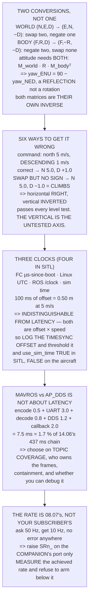

# 15.03 Bridging MAVLink and ROS 2

<!-- glance:start -->
<!-- generated by tools/build.py from curriculum/syllabus.yaml — edit the syllabus, not this block -->

| | |
|---|---|
| **Track** | Main path |
| **Difficulty** | Advanced |
| **Time** | 1 h 45 min |
| **Hardware** | Onboard computer & vision (stage 2) |
| **Software** | ros2, mavros, ardupilot |
| **Prerequisites** | [15.02 ROS 2 for Hermon (delta from the robotics course)](15.02-ros2-for-hermon.md)<br>[08.05 MAVLink: the protocol of drones](../08-flight-controller/08.05-mavlink.md) |
| **Version-sensitive** | yes — see [curriculum/versions.yaml](../curriculum/versions.yaml) |
| **Skip if** | You can publish a setpoint from a ROS 2 node and see the aircraft respond in SITL, with the frame conversion correct. |

<!-- glance:end -->

## What you will learn

- That there are **two frame conversions, not one** — world NED↔ENU and body FRD↔FLU — and that
  they are different matrices
- That `yaw_ENU = 90° − yaw_NED` is a **reflection, not a rotation**: the sign flips as well as the
  offset
- That both matrices are **their own inverse**, so the conversion and its inverse are one function
- The six plausible mistakes and what each does in the air — including the one that is **half
  right** and passes every level test
- That **the vertical axis is the one nobody tests**, and it is the one that climbs instead of
  descending
- That a **100 ms clock offset is 0.5 m** and is indistinguishable from latency from the symptom
  alone
- That the whole MAVROS bridge costs **7.5 ms — 1.7 % of 14.06's chain** — so it is not a latency
  decision
- That a ROS topic's rate is set by **what 08.07 configured**, not by your subscriber, and nothing
  reports the mismatch

## Why it matters

This is where the two halves of the aircraft are wired together, and it is where a specific,
famous class of bug lives: the frame conversion that is almost right.

The failure mode is unusual and worth naming in advance. A wrong conversion does not produce an
error, a warning, or a refusal. It produces an aircraft that flies — smoothly, confidently, under
full control — in the wrong direction. And the commonest version of the mistake gets the
horizontal exactly right, so it passes every test you would think to run, and fails the first time
you ask the aircraft to come down.

The second reason is diagnostic. Three of this lesson's failure modes — a bad conversion, a clock
offset and a stream rate that is lower than you asked for — all present as something else. The
first looks like a tuning problem, the second looks like latency, and the third looks like a slow
control loop. Each has a specific measurement that identifies it, and this lesson is where you
learn which measurement.

> [!WARNING]
> Test the vertical axis before the first outdoor flight, in SITL, deliberately. Command a
> descent and confirm the aircraft descends. The sign error in Level 2's second row produces an
> aircraft that climbs when told to land — and because the horizontal is correct, everything up to
> that moment looks perfect.

## Prerequisites

<!-- prereqs:start -->
## Prerequisites

You need these first:

- [15.02 ROS 2 for Hermon (delta from the robotics course)](15.02-ros2-for-hermon.md)
- [08.05 MAVLink: the protocol of drones](../08-flight-controller/08.05-mavlink.md)

### Optional prerequisite links

None.

Check your readiness: `python course.py why 15.03`
<!-- prereqs:end -->

## Concept

Two people describe the same room. One says "three metres north, two east, and it is on the
floor". The other says "two metres right, three forward, and it is at ground level". Both are
correct, both are useful, and translating between them is easy right up to the moment you do it
without noticing that "down" in one is "up" in the other.

Aviation and robotics made different, equally reasonable choices. Aviation uses north-east-down,
because an altimeter counts downward from an aircraft and a compass starts at north. Robotics uses
east-north-up, because a right-handed frame with z upward is what the mathematics prefers. Neither
is wrong and there is no prospect of either changing.

The part people miss is that this is **two** conversions. The world frame and the body frame are
separately defined and separately different, and the matrices are not the same shape: one swaps
two axes and negates the third, the other negates two and swaps none. An attitude needs both, in
the right order, and applying the wrong one gives you an aircraft that is right some of the time.

The second idea is about clocks. A transform is a statement about where something was *at a
moment*, and three different clocks are involved: the flight controller's, Linux's, and ROS's.
Getting the offset wrong does not break anything visibly — it moves everything by (offset ×
speed), which is exactly what latency does.

## Technical explanation

### Level 1 — two frame pairs, not one

| | ArduPilot | ROS |
|---|---|---|
| world x, y, z | north, east, **down** | east, north, **up** |
| body x, y, z | forward, **right**, **down** | forward, **left**, **up** |
| yaw zero | north | east |
| yaw positive | clockwise | counter-clockwise |

**World:** (N, E, D) → (E, N, −D). **Body:** (F, R, D) → (F, −R, −D). The first swaps two axes and
negates the third; the second negates two and swaps none.

An attitude needs both at once:

$$R_{\text{ENU,FLU}} = M_{\text{world}} \, R_{\text{NED,FRD}} \, M_{\text{body}}^{T}$$

Run the code. The identity $\text{yaw}_{\text{ENU}} = 90° - \text{yaw}_{\text{NED}}$ **falls out of
the matrix** rather than being asserted, which is the only way to trust it — and note that it is a
**reflection, not a rotation**: the sign of the yaw flips as well as the offset. Anyone who
remembers only "subtract 90" gets the direction of every turn backwards.

And both matrices are their own inverse — the round trip closes to exactly zero over vectors and
attitudes — so **the conversion function and its inverse are the same function**. Write it once,
test it once, never write it again.

### Level 2 — what each wrong conversion does in the air

Command: fly north at 5 m/s, descending at 1 m/s. In ROS ENU that is `(0, +5, −1)`, because y is
north and z is up.

| what you did | N | E | D | the aircraft |
|---|---|---|---|---|
| **correct**: (x,y,z) → (y,x,−z) | 5.0 | 0.0 | 1.0 | flies north, descending |
| **swapped the axes, forgot the sign** | **5.0** | **0.0** | **−1.0** | **flies north, CLIMBING** |
| negated z, forgot to swap | 0.0 | 5.0 | 1.0 | flies east, descending |
| did nothing at all | 0.0 | 5.0 | −1.0 | flies east, climbing |
| used the **body** matrix on a **world** vector | 0.0 | −5.0 | 1.0 | flies west, descending |
| negated everything | −5.0 | 0.0 | −1.0 | flies south, climbing |

**Row two is the one that will happen to you, and it is the most dangerous because it is half
right.** The horizontal is correct and the vertical is inverted, so every level command works
perfectly and the first descent climbs. On a survey that is an aircraft that will not come down;
on an approach it is worse.

And it will pass your first tests. If you test by commanding north, east, south and west — all
level — rows one and two are indistinguishable. **The vertical axis is the one nobody tests**, and
it is the one that puts the aircraft into the ceiling instead of the ground.

So the test is not "does it fly". It is: command north and watch the *compass*, not the map;
command east, then south, then west, all four; **command down and confirm it descends**; command a
yaw rate and confirm the direction; and do every one of them in
[10.04](../10-simulation/10.04-ardupilot-sitl.md)'s SITL first.

### Level 3 — three clocks, and SITL makes a fourth

The flight controller stamps in its own microseconds since boot. Linux stamps in UTC. ROS stamps
in whatever `/clock` says. MAVLink's `TIMESYNC` estimates the offset between the first two, and
everything downstream trusts it.

| offset error | at 5 m/s | tf entries at 50 Hz |
|---|---|---|
| 10 ms | 0.05 m | 0.5 |
| **100 ms** | **0.50 m** | 5.0 |
| 500 ms | 2.50 m | 25.0 |

A hundred milliseconds of clock error is half a metre at survey speed, and it presents as latency —
the reported position lagging reality — so you will go and optimise
[14.06](../14-vision-perception/14.06-edge-compute-and-latency.md)'s pipeline, which was never the
problem.

**And you cannot tell them apart from the symptom**, because both are (offset × speed): a clock
100 ms out and a pipeline 100 ms slow produce exactly the same 0.5 m lag and both grow the same way
with speed. So measure the clock directly — log the `TIMESYNC` offset as a number, put a threshold
on it, and you have separated two indistinguishable failures for the price of one log field.

And the SITL trap, which is worse because it is silent: at `--speedup 10` the simulated clock runs
ten times wall time, so a node calling `time.time()` computes every rate ten times wrong.
`use_sim_time` must be true for every node in SITL — and false on the aircraft, because a node
waiting for a `/clock` topic that nobody publishes does not error, it simply never ticks.

### Level 4 — MAVROS or native DDS is not a latency question

**MAVROS** is mature, exposes roughly 120 topics and has a plugin for everything you need; it is a
separate process with a MAVLink encode/decode and a translation layer that has its own opinions
about frames. **AP_DDS** is in the firmware with no translation hop; it is newer, has fewer topics,
and the topic set changes between releases **[S]**.

People choose on latency, so price it: MAVLink encode 0.5 ms, the UART at 921600 3.0 ms, MAVROS
decode 0.8 ms, DDS publish and subscribe 1.2 ms, your callback 2.0 ms — **7.5 ms total, 1.7 % of
14.06's chain**. Removing MAVROS entirely would save you two millimetres of travel.

So choose on what actually differs: does it expose the topic you need (MAVROS almost certainly
does); who maintains your frame conversions (MAVROS does Level 1 for you, which is a gift and a
place for a version-dependent surprise); is it another process that can die
([15.01](15.01-companion-architecture.md)'s containment argument); and can you debug it — MAVROS's
translation is inspectable, while a firmware-side bug needs a firmware build.

### Level 5 — the stream-rate trap

A ROS topic's rate is not set by the subscriber. It is set by what the flight controller is
streaming, which [08.07](../08-flight-controller/08.07-logging-and-the-data-path.md) configured and
MAVROS merely relays.

| ROS topic | you want | you get |
|---|---|---|
| `/mavros/imu/data` | 50 Hz | **10 Hz** |
| `/mavros/local_position/pose` | 50 Hz | **10 Hz** |
| `/mavros/global_position/global` | 10 Hz | **5 Hz** |

**You ask for 50, you get 10, and nothing reports it.** Your control loop runs at the rate of its
slowest input and you find out by measuring, never by reading a parameter.

Raising it is not free — 08.07 chose those rates against 09.04's 2,016 B/s — but
[15.01](15.01-companion-architecture.md) showed the companion's UART is 46× that. So raise the
rate on the **companion's serial port only**: `SERIALn_` and `SRn_` are per-port, so the radio
keeps 08.07's set and the companion gets what it needs. Then **measure the achieved rate per topic
at startup** and refuse to arm if it is below what your loop assumes — which is
[15.05](15.05-behaviour-trees-and-watchdogs.md)'s precondition. And log it, because a rate that
silently halves mid-flight is 14.06's throttling arriving through a different door.

> [!TIP]
> **Ask your teacher:** "Have we ever commanded a descent through the bridge?" Not a landing —
> ArduPilot's own `LAND` does not go through your conversion. A *commanded* descent, in offboard.
> A surprising number of stacks have never been asked.

## Diagram



## Code

Both frame matrices with a round-trip test over vectors and attitudes, the yaw identity derived
rather than asserted, six plausible conversion mistakes applied to one real command with what the
aircraft does in each case, the clock-offset table in metres and tf entries, the bridge's latency
priced against 14.06's chain, and the stream-rate mismatch.

```python
"""15.03 - NED to ENU, FRD to FLU, and what each wrong one does in the air."""
import math

# the two frame pairs, as matrices. Both are their own inverse.
M_WORLD = [[0, 1, 0],            # NED -> ENU: x_e = E, y_e = N, z_e = -D
           [1, 0, 0],
           [0, 0, -1]]
M_BODY = [[1, 0, 0],             # FRD -> FLU: forward, -right, -down
          [0, -1, 0],
          [0, 0, -1]]

SPEED = 5.0                      # 12.02's survey speed
TF_HZ = 50.0

# MAVROS vs AP_DDS, the honest current state [S]
BRIDGES = [
    ("MAVROS", "mature, ~120 topics, every plugin you need",
     "a separate process, a MAVLink encode/decode, and a translation "
     "layer that has its own opinions about frames"),
    ("AP_DDS (native)", "in the firmware, no translation hop",
     "fewer topics, newer, and the topic set changes between releases"),
]

# the latency each adds, against 14.06's 437 ms chain [S]
HOPS = [("MAVLink encode on the FC", 0.0005),
        ("UART at 921600 (15.01)", 0.0030),
        ("MAVROS decode", 0.0008),
        ("DDS publish + subscribe", 0.0012),
        ("your node's callback", 0.0020)]
CHAIN_S = 0.437

# the stream-rate trap: what you ask for vs what 08.07 configured
STREAMS = [
    ("/mavros/imu/data", "RAW_IMU / SCALED_IMU2", 50, 10),
    ("/mavros/local_position/pose", "LOCAL_POSITION_NED", 50, 10),
    ("/mavros/global_position/global", "GLOBAL_POSITION_INT", 10, 5),
    ("/mavros/battery", "BATTERY_STATUS", 1, 1),
    ("/mavros/state", "HEARTBEAT", 1, 1),
]


def mv(M, v):
    return [sum(M[i][j] * v[j] for j in range(3)) for i in range(3)]


def mm(A, B):
    return [[sum(A[i][k] * B[k][j] for k in range(3)) for j in range(3)]
            for i in range(3)]


def transpose(A):
    return [[A[j][i] for j in range(3)] for i in range(3)]


def dcm_ned(roll, pitch, yaw):
    """Body(FRD)-to-world(NED), Euler in degrees. 06.01's convention."""
    cr, sr = math.cos(math.radians(roll)), math.sin(math.radians(roll))
    cp, sp = math.cos(math.radians(pitch)), math.sin(math.radians(pitch))
    cy, sy = math.cos(math.radians(yaw)), math.sin(math.radians(yaw))
    return [[cp * cy, sr * sp * cy - cr * sy, cr * sp * cy + sr * sy],
            [cp * sy, sr * sp * sy + cr * cy, cr * sp * sy - sr * cy],
            [-sp, sr * cp, cr * cp]]


def attitude_ned_to_enu(R_ned_frd):
    """The WHOLE conversion: change the world frame AND the body frame."""
    return mm(mm(M_WORLD, R_ned_frd), transpose(M_BODY))


def yaw_of(R):
    return math.degrees(math.atan2(R[1][0], R[0][0]))


def bar(t):
    print("\n" + "=" * 70)
    print(t)
    print("=" * 70)


if __name__ == "__main__":
    bar("1. TWO FRAME PAIRS, NOT ONE, AND THAT IS THE WHOLE TRAP")
    print("  ArduPilot lives in NED with an FRD body. ROS lives in ENU")
    print("  with an FLU body. Those are TWO INDEPENDENT conversions and")
    print("  they are NOT the same matrix:")
    print(f"  {'':16s} {'ArduPilot':>18s} {'ROS':>18s}")
    for nm, a, b in (("world x", "NORTH", "EAST"),
                     ("world y", "EAST", "NORTH"),
                     ("world z", "DOWN", "UP"),
                     ("body x", "forward", "forward"),
                     ("body y", "RIGHT", "LEFT"),
                     ("body z", "DOWN", "UP"),
                     ("yaw zero", "north", "east"),
                     ("yaw positive", "clockwise", "counter-clockwise")):
        print(f"  {nm:16s} {a:>18s} {b:>18s}")
    print("  WORLD:  (N, E, D) -> (E, N, -D)")
    print("  BODY:   (F, R, D) -> (F, -R, -U)  i.e. (F, -R, -D)")
    print("  THE FIRST SWAPS TWO AXES AND NEGATES THE THIRD. THE SECOND")
    print("  NEGATES TWO AND SWAPS NONE. Using one where the other")
    print("  belongs is the single commonest bug in this subject, and it")
    print("  produces an aircraft that flies, confidently, sideways.")
    print("\n  AND AN ATTITUDE NEEDS BOTH AT ONCE:")
    print("      R_enu_flu = M_world . R_ned_frd . M_body^T")
    print(f"  {'NED yaw':>10s} {'ENU yaw':>10s} {'90 - NED':>10s} {'ok?':>6s}")
    for y in (0.0, 45.0, 90.0, 180.0, 270.0, -30.0):
        R = dcm_ned(0, 0, y)
        ye = yaw_of(attitude_ned_to_enu(R))
        expect = ((90.0 - y + 180) % 360) - 180
        ok = abs(((ye - expect + 180) % 360) - 180) < 1e-9
        print(f"  {y:8.1f} d {ye:8.1f} d {expect:8.1f} d"
              f" {('yes' if ok else 'NO'):>6s}")
    print("  THE IDENTITY yaw_ENU = 90 - yaw_NED FALLS OUT OF THE MATRIX")
    print("  RATHER THAN BEING ASSERTED, which is the only way to trust")
    print("  it. And note it is a REFLECTION, not a rotation: the sign")
    print("  of the yaw flips as well as the offset. Anybody who")
    print("  remembers only 'subtract 90' gets the direction of every")
    print("  turn backwards.")
    print("\n  THE ROUND TRIP, WHICH IS THE TEST THAT MATTERS:")
    worst = 0.0
    for v in ([1, 0, 0], [0, 1, 0], [0, 0, 1], [3, -4, 5], [0.1, 0.2, -0.3]):
        back = mv(M_WORLD, mv(M_WORLD, v))
        worst = max(worst, max(abs(a - b) for a, b in zip(v, back)))
    for y in (0.0, 37.0, 123.0, -95.0):
        R = dcm_ned(10, -5, y)
        back = mm(mm(M_WORLD, attitude_ned_to_enu(R)), M_BODY)
        worst = max(worst, max(abs(back[i][j] - R[i][j])
                               for i in range(3) for j in range(3)))
    print(f"  worst round-trip error over vectors AND attitudes:"
          f" {worst:.2e}")
    print("  BOTH MATRICES ARE THEIR OWN INVERSE, so the conversion")
    print("  function and its inverse are the SAME FUNCTION. Write it")
    print("  once, test it once, and never write it again.")

    bar("2. WHAT EACH WRONG CONVERSION DOES IN THE AIR")
    print("  Command: FLY NORTH AT 5 m/s, DESCENDING AT 1 m/s.")
    print("  In ROS ENU that is a velocity of (0, +5, -1) -- y is north")
    print("  and z is UP, so a descent is negative.")
    print("  Now apply each plausible mistake and see what the aircraft")
    print("  is actually told to do:")
    cmd_enu = [0.0, SPEED, -1.0]
    cases = [
        ("correct: (x,y,z)_enu -> (y,x,-z)_ned",
         [cmd_enu[1], cmd_enu[0], -cmd_enu[2]]),
        ("swapped the axes, forgot the sign",
         [cmd_enu[1], cmd_enu[0], cmd_enu[2]]),
        ("negated z, forgot to swap",
         [cmd_enu[0], cmd_enu[1], -cmd_enu[2]]),
        ("did nothing at all",
         [cmd_enu[0], cmd_enu[1], cmd_enu[2]]),
        ("used the BODY matrix on a WORLD vector",
         mv(M_BODY, cmd_enu)),
        ("negated everything",
         [-cmd_enu[1], -cmd_enu[0], cmd_enu[2]]),
    ]
    print(f"  {'what you did':40s} {'N':>6s} {'E':>6s} {'D':>6s}"
          f"  {'the aircraft'}")
    for nm, ned in cases:
        n, e, d = ned
        if abs(n) > 0.1 and abs(e) < 0.1:
            what = "flies NORTH" if n > 0 else "flies SOUTH"
        elif abs(e) > 0.1 and abs(n) < 0.1:
            what = "flies EAST" if e > 0 else "flies WEST"
        else:
            what = "flies diagonally"
        if abs(d) > 0.1:
            what += ", DESCENDING" if d > 0 else ", CLIMBING"
        print(f"  {nm:40s} {n:6.1f} {e:6.1f} {d:6.1f}  {what}")
    print("  ROW TWO IS THE ONE THAT WILL HAPPEN TO YOU, AND IT IS THE")
    print("  MOST DANGEROUS BECAUSE IT IS HALF RIGHT. The horizontal is")
    print("  correct and the vertical is inverted, so every level")
    print("  command works perfectly and the first DESCENT CLIMBS. On a")
    print("  survey that is an aircraft that will not come down; on an")
    print("  approach it is worse.")
    print("  AND IT WILL PASS YOUR FIRST TESTS. If you test by")
    print("  commanding north, east, south and west -- all level -- rows")
    print("  one and two are indistinguishable. THE VERTICAL AXIS IS THE")
    print("  ONE NOBODY TESTS, and it is the one that puts the aircraft")
    print("  into the ceiling instead of the ground.")
    print("  WHICH IS WHY THE TEST IS NOT 'DOES IT FLY'. IT IS:")
    for a in ("command NORTH and watch the compass, not the map",
              "command EAST, then SOUTH, then WEST -- all four",
              "command DOWN and confirm it descends",
              "command a YAW RATE and confirm the direction",
              "and do every one of them in SITL first (10.04)"):
        print(f"    - {a}")

    bar("3. TIME: THREE CLOCKS, AND SITL MAKES A FOURTH")
    print("  The flight controller stamps in its own microseconds since")
    print("  boot. Linux stamps in UTC. ROS stamps in whatever /clock")
    print("  says. MAVLink's TIMESYNC estimates the offset between the")
    print("  first two, and everything downstream trusts it.")
    print(f"  {'offset error':>14s} {'at 5 m/s':>12s} {'tf entries':>13s}"
          f" {'what it looks like'}")
    for off in (0.001, 0.010, 0.050, 0.100, 0.500):
        print(f"  {off * 1000:11.0f} ms {off * SPEED:9.2f} m"
              f" {off * TF_HZ:12.1f}  "
              f"{'invisible' if off < 0.02 else 'LATENCY, apparently'}")
    print("  A HUNDRED MILLISECONDS OF CLOCK ERROR IS HALF A METRE OF")
    print("  POSITION ERROR AT SURVEY SPEED, and it presents as latency")
    print("  -- the aircraft's reported position lagging reality -- so")
    print("  you will go and optimise 14.06's pipeline, which was never")
    print("  the problem.")
    print("  AND YOU CANNOT TELL THEM APART FROM THE SYMPTOM, BECAUSE")
    print("  BOTH ARE (offset x speed): a clock 100 ms out and a")
    print("  pipeline 100 ms slow produce exactly the same 0.5 m lag,")
    print("  and both grow the same way when you fly faster.")
    print("  SO MEASURE THE CLOCK DIRECTLY. Log the TIMESYNC offset as")
    print("  a number, put a threshold on it, and you have separated")
    print("  two indistinguishable failures for the price of one field.")
    print("\n  AND THE SITL TRAP, WHICH IS WORSE BECAUSE IT IS SILENT:")
    for sp in (1, 5, 10, 56):
        print(f"    --speedup {sp:3d}: sim time runs {sp}x wall time."
              f" A node using")
        print(f"                  wall time computes every rate"
              f" {sp}x wrong")
    print("  10.04's speed-up is the whole point of SITL and it breaks")
    print("  any node that calls time.time() instead of the ROS clock.")
    print("  SET use_sim_time TRUE FOR EVERY NODE IN SITL, and then")
    print("  remember to set it FALSE on the aircraft -- because a node")
    print("  waiting for a /clock topic that nobody publishes does not")
    print("  error, it simply never ticks.")

    bar("4. MAVROS OR NATIVE DDS? NOT A LATENCY QUESTION")
    for nm, pro, con in BRIDGES:
        print(f"  {nm}")
        print(f"    for:     {pro}")
        print(f"    against: {con}")
    print("  PEOPLE CHOOSE ON LATENCY. PRICE IT FIRST:")
    tot = 0.0
    print(f"  {'hop':32s} {'ms':>8s} {'of 14.06 chain':>16s}")
    for nm, s in HOPS:
        tot += s
        print(f"  {nm:32s} {s * 1000:6.2f} {s / CHAIN_S * 100:14.2f} %")
    print(f"  {'TOTAL BRIDGE OVERHEAD':32s} {tot * 1000:6.2f}"
          f" {tot / CHAIN_S * 100:14.2f} %")
    print(f"  THE WHOLE BRIDGE IS {tot * 1000:.1f} MILLISECONDS --"
          f" {tot / CHAIN_S * 100:.1f} % OF")
    print("  14.06's CHAIN, AND ONE PER CENT OF 12.03's STOPPING")
    print("  DISTANCE. Removing MAVROS entirely would save you two")
    print("  millimetres of travel.")
    print("  SO CHOOSE ON THE THINGS THAT ACTUALLY DIFFER:")
    for a, b in (("does it expose the topic you need?",
                  "MAVROS almost certainly does. AP_DDS may not yet"),
                 ("who maintains your frame conversions?",
                  "MAVROS does section 1 for you -- which is a gift "
                  "and a place for a version-dependent surprise"),
                 ("is it another process that can die?",
                  "15.01's containment argument, and MAVROS is one "
                  "more thing in the failure table"),
                 ("can you debug it?",
                  "MAVROS's translation is documented and inspectable; "
                  "a firmware-side bug needs a firmware build")):
        print(f"    {a:38s} {b}")

    bar("5. THE STREAM-RATE TRAP: YOU GET WHAT 08.07 CONFIGURED")
    print("  A ROS topic's rate is not set by the subscriber. It is set")
    print("  by what the flight controller is STREAMING, which 08.07")
    print("  configured and which MAVROS merely relays.")
    print(f"  {'ROS topic':34s} {'MAVLink':>22s} {'you want':>9s}"
          f" {'you get':>8s} {'?':>4s}")
    for t, m, want, got in STREAMS:
        flag = "!!" if got < want else "ok"
        print(f"  {t:34s} {m:>22s} {want:7d} Hz {got:6d} Hz {flag:>4s}")
    print("  YOU ASK FOR 50 Hz, YOU GET 10, AND NOTHING REPORTS IT.")
    print("  Your control loop runs at the rate of its slowest input and")
    print("  you find out by measuring, never by reading a parameter.")
    print("  AND RAISING IT IS NOT FREE -- 08.07 chose those rates")
    print("  against 09.04's 2,016 B/s, and 15.01 pointed out the")
    print("  companion's UART is 46 times that. SO:")
    for a, b in (("raise the rate on the COMPANION's serial port only",
                  "SERIALn_ and SRn_ are per-port. The radio keeps "
                  "08.07's set; the companion gets what it needs"),
                 ("measure the ACHIEVED rate, per topic, at startup",
                  "and refuse to arm if it is below what your loop "
                  "assumes. 15.05's precondition"),
                 ("and log it",
                  "a rate that silently halves mid-flight is 14.06's "
                  "throttling arriving through a different door")):
        print(f"    {a:44s} {b}")
```

Output:

```text

======================================================================
1. TWO FRAME PAIRS, NOT ONE, AND THAT IS THE WHOLE TRAP
======================================================================
  ArduPilot lives in NED with an FRD body. ROS lives in ENU
  with an FLU body. Those are TWO INDEPENDENT conversions and
  they are NOT the same matrix:
                            ArduPilot                ROS
  world x                       NORTH               EAST
  world y                        EAST              NORTH
  world z                        DOWN                 UP
  body x                      forward            forward
  body y                        RIGHT               LEFT
  body z                         DOWN                 UP
  yaw zero                      north               east
  yaw positive              clockwise  counter-clockwise
  WORLD:  (N, E, D) -> (E, N, -D)
  BODY:   (F, R, D) -> (F, -R, -U)  i.e. (F, -R, -D)
  THE FIRST SWAPS TWO AXES AND NEGATES THE THIRD. THE SECOND
  NEGATES TWO AND SWAPS NONE. Using one where the other
  belongs is the single commonest bug in this subject, and it
  produces an aircraft that flies, confidently, sideways.

  AND AN ATTITUDE NEEDS BOTH AT ONCE:
      R_enu_flu = M_world . R_ned_frd . M_body^T
     NED yaw    ENU yaw   90 - NED    ok?
       0.0 d     90.0 d     90.0 d    yes
      45.0 d     45.0 d     45.0 d    yes
      90.0 d      0.0 d      0.0 d    yes
     180.0 d    -90.0 d    -90.0 d    yes
     270.0 d   -180.0 d   -180.0 d    yes
     -30.0 d    120.0 d    120.0 d    yes
  THE IDENTITY yaw_ENU = 90 - yaw_NED FALLS OUT OF THE MATRIX
  RATHER THAN BEING ASSERTED, which is the only way to trust
  it. And note it is a REFLECTION, not a rotation: the sign
  of the yaw flips as well as the offset. Anybody who
  remembers only 'subtract 90' gets the direction of every
  turn backwards.

  THE ROUND TRIP, WHICH IS THE TEST THAT MATTERS:
  worst round-trip error over vectors AND attitudes: 0.00e+00
  BOTH MATRICES ARE THEIR OWN INVERSE, so the conversion
  function and its inverse are the SAME FUNCTION. Write it
  once, test it once, and never write it again.

======================================================================
2. WHAT EACH WRONG CONVERSION DOES IN THE AIR
======================================================================
  Command: FLY NORTH AT 5 m/s, DESCENDING AT 1 m/s.
  In ROS ENU that is a velocity of (0, +5, -1) -- y is north
  and z is UP, so a descent is negative.
  Now apply each plausible mistake and see what the aircraft
  is actually told to do:
  what you did                                  N      E      D  the aircraft
  correct: (x,y,z)_enu -> (y,x,-z)_ned        5.0    0.0    1.0  flies NORTH, DESCENDING
  swapped the axes, forgot the sign           5.0    0.0   -1.0  flies NORTH, CLIMBING
  negated z, forgot to swap                   0.0    5.0    1.0  flies EAST, DESCENDING
  did nothing at all                          0.0    5.0   -1.0  flies EAST, CLIMBING
  used the BODY matrix on a WORLD vector      0.0   -5.0    1.0  flies WEST, DESCENDING
  negated everything                         -5.0   -0.0   -1.0  flies SOUTH, CLIMBING
  ROW TWO IS THE ONE THAT WILL HAPPEN TO YOU, AND IT IS THE
  MOST DANGEROUS BECAUSE IT IS HALF RIGHT. The horizontal is
  correct and the vertical is inverted, so every level
  command works perfectly and the first DESCENT CLIMBS. On a
  survey that is an aircraft that will not come down; on an
  approach it is worse.
  AND IT WILL PASS YOUR FIRST TESTS. If you test by
  commanding north, east, south and west -- all level -- rows
  one and two are indistinguishable. THE VERTICAL AXIS IS THE
  ONE NOBODY TESTS, and it is the one that puts the aircraft
  into the ceiling instead of the ground.
  WHICH IS WHY THE TEST IS NOT 'DOES IT FLY'. IT IS:
    - command NORTH and watch the compass, not the map
    - command EAST, then SOUTH, then WEST -- all four
    - command DOWN and confirm it descends
    - command a YAW RATE and confirm the direction
    - and do every one of them in SITL first (10.04)

======================================================================
3. TIME: THREE CLOCKS, AND SITL MAKES A FOURTH
======================================================================
  The flight controller stamps in its own microseconds since
  boot. Linux stamps in UTC. ROS stamps in whatever /clock
  says. MAVLink's TIMESYNC estimates the offset between the
  first two, and everything downstream trusts it.
    offset error     at 5 m/s    tf entries what it looks like
            1 ms      0.01 m          0.1  invisible
           10 ms      0.05 m          0.5  invisible
           50 ms      0.25 m          2.5  LATENCY, apparently
          100 ms      0.50 m          5.0  LATENCY, apparently
          500 ms      2.50 m         25.0  LATENCY, apparently
  A HUNDRED MILLISECONDS OF CLOCK ERROR IS HALF A METRE OF
  POSITION ERROR AT SURVEY SPEED, and it presents as latency
  -- the aircraft's reported position lagging reality -- so
  you will go and optimise 14.06's pipeline, which was never
  the problem.
  AND YOU CANNOT TELL THEM APART FROM THE SYMPTOM, BECAUSE
  BOTH ARE (offset x speed): a clock 100 ms out and a
  pipeline 100 ms slow produce exactly the same 0.5 m lag,
  and both grow the same way when you fly faster.
  SO MEASURE THE CLOCK DIRECTLY. Log the TIMESYNC offset as
  a number, put a threshold on it, and you have separated
  two indistinguishable failures for the price of one field.

  AND THE SITL TRAP, WHICH IS WORSE BECAUSE IT IS SILENT:
    --speedup   1: sim time runs 1x wall time. A node using
                  wall time computes every rate 1x wrong
    --speedup   5: sim time runs 5x wall time. A node using
                  wall time computes every rate 5x wrong
    --speedup  10: sim time runs 10x wall time. A node using
                  wall time computes every rate 10x wrong
    --speedup  56: sim time runs 56x wall time. A node using
                  wall time computes every rate 56x wrong
  10.04's speed-up is the whole point of SITL and it breaks
  any node that calls time.time() instead of the ROS clock.
  SET use_sim_time TRUE FOR EVERY NODE IN SITL, and then
  remember to set it FALSE on the aircraft -- because a node
  waiting for a /clock topic that nobody publishes does not
  error, it simply never ticks.

======================================================================
4. MAVROS OR NATIVE DDS? NOT A LATENCY QUESTION
======================================================================
  MAVROS
    for:     mature, ~120 topics, every plugin you need
    against: a separate process, a MAVLink encode/decode, and a translation layer that has its own opinions about frames
  AP_DDS (native)
    for:     in the firmware, no translation hop
    against: fewer topics, newer, and the topic set changes between releases
  PEOPLE CHOOSE ON LATENCY. PRICE IT FIRST:
  hop                                    ms   of 14.06 chain
  MAVLink encode on the FC           0.50           0.11 %
  UART at 921600 (15.01)             3.00           0.69 %
  MAVROS decode                      0.80           0.18 %
  DDS publish + subscribe            1.20           0.27 %
  your node's callback               2.00           0.46 %
  TOTAL BRIDGE OVERHEAD              7.50           1.72 %
  THE WHOLE BRIDGE IS 7.5 MILLISECONDS -- 1.7 % OF
  14.06's CHAIN, AND ONE PER CENT OF 12.03's STOPPING
  DISTANCE. Removing MAVROS entirely would save you two
  millimetres of travel.
  SO CHOOSE ON THE THINGS THAT ACTUALLY DIFFER:
    does it expose the topic you need?     MAVROS almost certainly does. AP_DDS may not yet
    who maintains your frame conversions?  MAVROS does section 1 for you -- which is a gift and a place for a version-dependent surprise
    is it another process that can die?    15.01's containment argument, and MAVROS is one more thing in the failure table
    can you debug it?                      MAVROS's translation is documented and inspectable; a firmware-side bug needs a firmware build

======================================================================
5. THE STREAM-RATE TRAP: YOU GET WHAT 08.07 CONFIGURED
======================================================================
  A ROS topic's rate is not set by the subscriber. It is set
  by what the flight controller is STREAMING, which 08.07
  configured and which MAVROS merely relays.
  ROS topic                                         MAVLink  you want  you get    ?
  /mavros/imu/data                    RAW_IMU / SCALED_IMU2      50 Hz     10 Hz   !!
  /mavros/local_position/pose            LOCAL_POSITION_NED      50 Hz     10 Hz   !!
  /mavros/global_position/global        GLOBAL_POSITION_INT      10 Hz      5 Hz   !!
  /mavros/battery                            BATTERY_STATUS       1 Hz      1 Hz   ok
  /mavros/state                                   HEARTBEAT       1 Hz      1 Hz   ok
  YOU ASK FOR 50 Hz, YOU GET 10, AND NOTHING REPORTS IT.
  Your control loop runs at the rate of its slowest input and
  you find out by measuring, never by reading a parameter.
  AND RAISING IT IS NOT FREE -- 08.07 chose those rates
  against 09.04's 2,016 B/s, and 15.01 pointed out the
  companion's UART is 46 times that. SO:
    raise the rate on the COMPANION's serial port only SERIALn_ and SRn_ are per-port. The radio keeps 08.07's set; the companion gets what it needs
    measure the ACHIEVED rate, per topic, at startup and refuse to arm if it is below what your loop assumes. 15.05's precondition
    and log it                                   a rate that silently halves mid-flight is 14.06's throttling arriving through a different door
```

## Exercise

### Exercise 15.03-E1 — Write the conversion once and prove it `[build]`

Implement the world and body conversions as one function each, verify the round trip closes to
machine precision, and verify the yaw identity numerically across a full turn. Then write the unit
test that would have caught Level 2's second row.

### Exercise 15.03-E2 — Break it on purpose in SITL `[build]`

In SITL, introduce each of Level 2's six errors in turn and fly the same commanded velocity.
Record what the aircraft does. You are building the intuition that makes the symptom diagnosable
in the field.

### Exercise 15.03-E3 — Measure your clock offset `[build]`

Log the `TIMESYNC` offset over a full flight and plot it. Note the value at startup, whether it
settles, and how much it moves. Then compute what that offset costs in metres at your survey
speed.

### Exercise 15.03-E4 — Measure every topic's real rate `[build]`

Write a node that measures the achieved rate of every topic your stack subscribes to, over ten
seconds, and prints it next to what your code assumes. Run it on the aircraft, not in SITL.

> [!CAUTION]
> E2 deliberately commands an aircraft with a known-wrong conversion. Do it **only in SITL**.
> Reproducing these errors on a real aircraft means commanding a climb when you intended a descent,
> next to [12.03](../12-autonomous-flight/12.03-geofence.md)'s ceiling, and there is nothing to
> learn from it that SITL does not teach for free.

## Expected result

**15.03-E1**: exact zero on the round trip, because the matrices are involutory and the arithmetic
is exact in these cases. The unit test should assert the *sign* of the vertical component, which is
the one that matters.

**15.03-E2**: rows one and two are indistinguishable in level flight and obvious the moment you
command a descent — which is the whole lesson, seen rather than read.

**15.03-E3**: expect the offset to settle within a few seconds and then drift slowly. A value that
jumps, or that never settles, means the FC and the companion disagree about something more basic
than time — usually a MAVLink version or a second system on the link.

**15.03-E4**: expect at least one topic to be slower than your code assumes. That is the normal
outcome, and finding it costs ten seconds and a script.

## Troubleshooting

**The aircraft flies at right angles to the command.** The axis swap is missing. Level 2, rows
three and four.

**The aircraft flies correctly horizontally and climbs when told to descend.** Level 2, row two.
The sign on the vertical.

**Everything works in SITL and not on the aircraft.** Check `use_sim_time` first — it is the single
commonest cause, and the symptom is that nothing ticks.

**Transforms extrapolate into the future.** Clock offset. Level 3, and `TIMESYNC` is the
measurement.

**Position lags reality by a constant amount.** Either latency or a clock offset, and they are
indistinguishable without logging the offset.

**A topic exists but publishes slowly.** Level 5 — the stream rate on that serial port, not the
subscriber's QoS.

**MAVROS connects and then times out.** Usually a baud mismatch or a second consumer on the same
port. [15.01](15.01-companion-architecture.md)'s UART budget.

**Attitude is right in yaw and wrong in roll sign.** You applied the world matrix to a body
quantity, or transposed the wrong one. Level 1, and the round-trip test catches it.

## Common mistakes

- **Using one conversion for both frames.** They are different matrices.
- **Remembering "subtract 90" for yaw.** It is a reflection; the sign flips too.
- **Testing only horizontally.** Rows one and two are identical in level flight.
- **Assuming a wrong conversion produces an error.** It produces confident, wrong flight.
- **Writing the conversion twice, once per direction.** Both matrices are their own inverse.
- **Choosing MAVROS or AP_DDS on latency.** It is 1.7 % of the chain.
- **Trusting a topic's rate because you asked for it.** The FC decides; measure.
- **Leaving `use_sim_time` true on the aircraft.** The stack starts and never ticks.

## Knowledge check

<details>
<summary>Why are there two conversions rather than one?</summary>

Because the world frame and the body frame are separately defined and separately different.
ArduPilot's world is NED and its body is FRD; ROS's world is ENU and its body is FLU. The world
conversion swaps two axes and negates the third; the body conversion negates two and swaps none.
An attitude needs both: `M_world · R · M_bodyᵀ`.
</details>

<details>
<summary>Why is "yaw_ENU = 90 − yaw_NED" more subtle than it looks?</summary>

Because it is a reflection, not a rotation — the sign of the yaw flips as well as the offset, since
ArduPilot measures clockwise from north and ROS measures counter-clockwise from east. Remembering
only the 90° offset gets the direction of every turn backwards.
</details>

<details>
<summary>You command north at 5 m/s descending at 1 m/s, and the aircraft flies north and climbs.
What did you do?</summary>

Swapped the horizontal axes correctly and forgot to negate the vertical: `(x,y,z) → (y,x,z)`
instead of `(y,x,−z)`. It is the most dangerous error because it is half right — every level
command works perfectly and the first descent inverts.
</details>

<details>
<summary>Why do rows one and two of Level 2's table pass the same tests?</summary>

Because a level test never exercises the vertical axis. Commanding north, east, south and west at
constant altitude produces identical behaviour from both. The only test that separates them is a
commanded descent, which is exactly the test people leave until the aircraft is outdoors.
</details>

<details>
<summary>Why can a clock offset not be distinguished from pipeline latency by its symptom?</summary>

Because both produce a position error of (offset × speed) and both grow the same way with speed. A
clock 100 ms out and a pipeline 100 ms slow both lag by 0.50 m at 5 m/s. The only separation is to
log the `TIMESYNC` offset directly and threshold it.
</details>

<details>
<summary>What does `--speedup 10` do to a node that calls `time.time()`?</summary>

Makes every rate it computes ten times wrong, silently. The simulated clock runs ten times wall
time, so a node using wall time measures ten simulated seconds as one. `use_sim_time` must be true
for every node in SITL — and false on the aircraft, where nothing publishes `/clock` and the node
would simply never tick.
</details>

<details>
<summary>The whole MAVROS bridge costs 7.5 ms. What does that mean for the MAVROS-versus-AP_DDS
decision?</summary>

That it is not a latency decision: 7.5 ms is 1.7 % of 14.06's 437 ms chain, about two millimetres
of travel. Choose on topic coverage, on who maintains the frame conversions, on whether it is
another process that can die (15.01's containment), and on whether you can debug it.
</details>

<details>
<summary>You subscribe at 50 Hz and receive 10. Where is the rate set, and how do you fix it
without giving up telemetry?</summary>

It is set by the flight controller's stream rates, which 08.07 configured — not by your
subscriber's QoS, and nothing reports the mismatch. `SERIALn_` and `SRn_` are per-port, so raise the
rate on the companion's port only; the radio keeps 08.07's set and the companion gets what it
needs. Then measure the achieved rate and refuse to arm below it.
</details>

## Practical challenge

Build the bridge, prove every conversion, and make the rates a precondition.

1. Write the world and body conversions as single functions with round-trip and yaw-identity tests
   (E1), and put them in one module that nothing else duplicates.
2. Stand up MAVROS (or AP_DDS) against SITL, and list every topic you will use with its message
   type and its real rate.
3. Fly the six-direction test in SITL — north, east, south, west, **up and down** — and confirm
   each one.
4. Break the conversion six ways on purpose and record the behaviour (E2). Keep the notes; they are
   your field diagnosis table.
5. Log the `TIMESYNC` offset and set a threshold on it (E3).
6. Set `use_sim_time` correctly in both configurations, and write down which launch file does what.
7. Raise the stream rates on the companion's serial port only, leaving 08.07's radio set alone.
8. Write the startup rate check (E4) and wire it into the arming precondition that
   [15.05](15.05-behaviour-trees-and-watchdogs.md) will formalise.

Step 4's notes are the deliverable most people skip and the one that pays. When an aircraft flies
sideways at a field one day, the difference between ten minutes and an afternoon is having already
seen what each error looks like.

## You can skip this if

You can publish a setpoint from a ROS 2 node and see the aircraft respond in SITL, with the frame
conversion correct. "Correct" includes the vertical axis, tested by commanding a descent.

## Go deeper

- The MAVROS documentation and its frame-conventions notes, which specify exactly what the bridge
  converts for you and what it does not: <https://github.com/mavlink/mavros>
- ArduPilot's native DDS support, including the current topic list and how it is enabled:
  <https://ardupilot.org/dev/docs/ros2.html>
- REP 103 and REP 105, the ROS conventions for units, axis orientation and coordinate frames —
  which is where ENU and FLU are specified: <https://www.ros.org/reps/rep-0103.html>

**Version-sensitive:** MAVROS's topic names and its frame handling have changed across releases,
AP_DDS's topic set changes with the firmware, and the ROS 2 distribution affects both. Verify the
conversion behaviour on your own versions with E1's tests rather than trusting a code snippet.

## Progress checkpoint

You can now convert between the two frame conventions with a function you have tested rather than
trusted, recognise each wrong conversion from what the aircraft does, separate a clock offset from
latency by measurement, choose a bridge for the right reasons, and treat a topic's rate as
something to be verified.

Next, [15.04](15.04-offboard-control.md) uses this bridge to actually command the aircraft —
velocity and position setpoints, the streaming requirement, and what happens the instant your
stream stops.
