# 15.04 Offboard control: commanding attitude, velocity and position

<!-- glance:start -->
<!-- generated by tools/build.py from curriculum/syllabus.yaml — edit the syllabus, not this block -->

| | |
|---|---|
| **Track** | Main path |
| **Difficulty** | Advanced |
| **Time** | 1 h 45 min |
| **Hardware** | Onboard computer & vision (stage 2) |
| **Software** | ros2, ardupilot, sitl |
| **Prerequisites** | [15.03 Bridging MAVLink and ROS 2](15.03-mavlink-ros-bridge.md)<br>[07.05 Velocity and position loops — and flight modes as control configuration](../07-control/07.05-velocity-position-and-modes.md) |
| **Skip if** | You can fly a closed-loop offboard velocity command in SITL and have it revert safely when your stream stops. |

<!-- glance:end -->

## What you will learn

- That a setpoint is **open-ended**, so `GUID_TIMEOUT` is not a safety feature but **a distance** —
  20 m at survey speed, 107 m at 11.02's fast case
- That the timeout is **not** what sets your stream rate: even 1 Hz clears a 3 s timeout with 1.6 s
  to spare
- That the real argument is the **zero-order hold**, and it scales as **dt²** — 2.5 cm at 10 Hz on
  a 5 m turn, 250 cm at 1 Hz
- That on a straight line **any rate is exact**, which is why nobody notices until they turn
- The four setpoint types as a ladder, and **what each one bypasses** — climb as little of it as
  the job needs
- That the **geofence sits below GUIDED**, which is what makes offboard safe to practise
- That a **yaw rate is open-ended too**: 90 °/s for a 3 s timeout is 270° of turn
- That the pilot's mode switch is **11× faster than the autonomy**, and that re-entering GUIDED is
  a human action

## Why it matters

Everything until now has been the companion *observing*. This is the lesson where it starts
*commanding*, and the shape of the danger changes completely.

The specific thing that changes is that a setpoint has no end in it. A waypoint mission is a list
that finishes; a velocity setpoint is "keep going north" and it means exactly that. If the process
that said it stops saying it — a segfault, a pulled cable,
[15.02](15.02-ros2-for-hermon.md)'s blocked executor — the aircraft has been given an instruction
that nothing in the command itself will ever retract.

ArduPilot handles that with a timeout, and the timeout is where most of this lesson lives. It is
not a checkbox. It is three seconds of flight, which at survey speed is twenty metres, and it has
to be inside [12.03](../12-autonomous-flight/12.03-geofence.md)'s fence margin before you take off.

> [!WARNING]
> Before any offboard flight, confirm that flicking the mode switch takes the aircraft back —
> at any point in the mission, with the companion under full load, and with the companion unable
> to put it back. A stack that helpfully re-enters GUIDED after a human took over will do so
> exactly when the human took over because something was wrong.

## Prerequisites

<!-- prereqs:start -->
## Prerequisites

You need these first:

- [15.03 Bridging MAVLink and ROS 2](15.03-mavlink-ros-bridge.md)
- [07.05 Velocity and position loops — and flight modes as control configuration](../07-control/07.05-velocity-position-and-modes.md)

### Optional prerequisite links

None.

Check your readiness: `python course.py why 15.04`
<!-- prereqs:end -->

## Concept

There are two kinds of instruction you can give something that moves. "Go to the far corner" ends
when it gets there. "Walk north" ends when you say stop — and if you are hit by a bus, it does not
end at all.

Every problem in offboard control comes from that distinction. A position setpoint is the first
kind: bounded, self-terminating, and dull. A velocity setpoint is the second: responsive, precise,
and dependent on you continuing to exist. The flight controller cannot tell the difference between
"still commanding north" and "stopped existing while commanding north", so it uses a timer, and the
timer is the only thing standing between a dead process and an aircraft that keeps going.

The second idea is a ladder. Position setpoints go through every limit the course has built —
path planning, speed, acceleration, the fence. Velocity setpoints skip the path planner. Attitude
setpoints skip almost everything and make you the flight control system, on a machine
[15.01](15.01-companion-architecture.md) measured at eighty milliseconds of worst-case jitter.
**Climb as little of that ladder as the job requires.**

The third is that the pilot must always win, and must win quickly. That property is not a
courtesy — it is the reason offboard control is safe to practise at all, and it works because the
mode switch is handled by the same bare-metal loop that never gets to be late.

## Technical explanation

### Level 1 — the timeout is a distance

`GUID_TIMEOUT` defaults to **3 seconds [S]**. After the last setpoint, the aircraft coasts, then
stops:

| speed | coasts | then stops in | total | which is |
|---|---|---|---|---|
| 2.0 m/s | 6.0 m | 0.8 m | 6.8 m | a careful inspection |
| **5.0 m/s** | **15.0 m** | **5.0 m** | **20.0 m** | 12.02's survey |
| 10.0 m/s | 30.0 m | 20.0 m | 50.0 m | 03.09's cruise |
| 16.8 m/s | 50.4 m | 56.4 m | **106.8 m** | 11.02's fast case |

At survey speed the aircraft travels **twenty metres after the commander died**. That is not a
failure of the timeout — it is the timeout working — and it is why
[12.03](../12-autonomous-flight/12.03-geofence.md)'s `FENCE_MARGIN` has to be at least 20 m if you
fly offboard at this speed.

You can shorten it, at a price. Against 15.02's 437 ms of executor blocking at a 10 Hz stream:
0.5 s leaves **−0.04 s** of margin and fires on every vision frame; 1.0 s leaves 0.46 s and is
comfortable. **One second is the sensible floor.** Below that you are not making the aircraft
safer, you are making it drop out of GUIDED every time the Pi coughs.

### Level 2 — the stream rate, and where 20 Hz actually comes from

**Argument one, which turns out not to be the reason.** At 1 Hz, one gap plus 15.02's blocking is
1,437 ms against a 3 s timeout — **1.6 s of margin**. Even the slowest plausible rate clears the
timeout comfortably. So the timeout is not what sets the rate, and "20 Hz" gets repeated without a
reason attached.

**Argument two, which is.** A setpoint is a zero-order hold: between updates the aircraft flies the
last vector in a straight line while your intended path curves away from it, by $v^2 dt^2 / 2R$.

| rate | on a 20 m circle | on a 5 m circle | on a straight line |
|---|---|---|---|
| 1 Hz | 62.5 cm | **250.0 cm** | 0.0 cm |
| 5 Hz | 2.5 cm | 10.0 cm | 0.0 cm |
| **10 Hz** | 0.6 cm | **2.5 cm** | 0.0 cm |
| 50 Hz | 0.02 cm | 0.1 cm | 0.0 cm |

**On a straight line any rate is exact** — a zero-order hold of a constant is the constant. The
rate only matters when the command is *changing*, and then it matters as **dt squared**.

At 10 Hz a five-metre turn costs 2.5 cm of path error, three hundred times inside
[14.05](../14-vision-perception/14.05-tracking-and-geolocation.md)'s geolocation budget. At 1 Hz it
is 2.5 metres, which is not. So: **10 Hz if you ever turn, 2 Hz if you only ever go straight, and
20 Hz because it is free and round.** Above the FC's own 100 Hz position loop it is wasted — you
are filling a buffer that is read at its own rate, which is 15.02's queue problem in a new place.

### Level 3 — four setpoint types, as a ladder

**Position (x, y, z)** goes through the full [07.05](../07-control/07.05-velocity-position-and-modes.md)
stack — path, `WPNAV_SPEED`, acceleration, jerk — and bypasses nothing. Slow to respond, because it
plans a path to get there, and almost impossible to hurt yourself with.

**Velocity (vx, vy, vz)** goes through the velocity loop with its acceleration limit and bypasses
the **path planner**. You are the path now. That is the whole point of it — you wanted a path the
planner would not fly — and it also means nothing is checking that your path is sane.

**Acceleration** bypasses the velocity loop too; you are now the velocity controller.

**Attitude and thrust** bypasses everything above the rate loop and **makes you the flight control
system**, on a Linux box with 80 ms of worst-case jitter commanding a loop that needs 2.5. Do not.

And what still applies, whatever you send: **12.03's geofence — yes**, because the fence sits
*below* GUIDED rather than above it; `ANGLE_MAX` — yes; 12.04's failsafe ladder — yes, every branch
outranks you; the arming checks — yes; and **RC override by mode switch — always**.

The first and last of those are what make offboard safe to practise. A runaway setpoint hits the
fence and the fence's action fires, and the pilot's switch outranks everything.

### Level 4 — yaw is a separate argument

Send **no yaw field** and the FC keeps doing whatever it was doing — usually holding the heading it
had when GUIDED was entered, so your camera points wherever you happened to be facing when you
flipped the switch. Send a **yaw angle** and it is a destination that completes. Send a **yaw
rate** and it is open-ended in exactly the sense of Level 1:

| yaw rate | turns before the timeout | which is |
|---|---|---|
| 10 °/s | 30° | a nudge |
| 45 °/s | 135° | a quarter turn |
| **90 °/s** | **270°** | more than half a turn |

**Prefer a yaw angle over a yaw rate.** An angle is a destination and it completes; a rate is a
velocity and it does not — the same distinction as position versus velocity, one axis over.

### Level 5 — takeover, and the eleven-to-one ratio

The one thing that must be true of every offboard flight: the pilot can take it back, instantly,
without asking anything on the companion.

- **the pilot flicks the switch:** one RC frame at 50 Hz (20 ms) + the FC processing it (20 ms) =
  **40 ms**
- **the companion decides something:** 14.06's chain (437 ms) + 15.03's bridge (7.5) = **444.5 ms**

**The pilot is eleven times faster than the autonomy**, and that is not an accident — the mode
switch is handled by the same bare-metal loop 15.01 said could never be late.

So the takeover test is mandatory: the mode switch is on a channel the pilot can find without
looking; flicking it works at any point in the mission, tested in SITL; it works when the companion
is *saturated*, with the vision pipeline flat out; **the companion never re-enters GUIDED by
itself**; and the pilot knows what the aircraft does the instant it leaves GUIDED —
[11.02](../11-first-flights/11.02-manual-modes.md)'s mode table, and the throttle position matters.

The fourth is the one that gets written wrong. **Re-entering GUIDED is a human action. Always.**

> [!TIP]
> **Ask your teacher:** "How far does the aircraft go if I kill the companion right now?" It is
> `GUID_TIMEOUT × speed + v²/2a`, it is twenty metres at survey speed, and it has to be inside the
> fence margin. Most people have never computed it.

## Diagram

```mermaid
flowchart TB
    T["A SETPOINT IS OPEN-ENDED<br/>'fly north at 5 m/s' has no end in it<br/>GUID_TIMEOUT 3 s → coast 15 m + stop 5 m = 20 m<br/>at 16.8 m/s: 106.8 m<br/>=> THE TIMEOUT IS A DISTANCE, and it must fit inside<br/>12.03's FENCE_MARGIN"]
    F["AND 1 s IS THE FLOOR<br/>0.5 s leaves −0.04 s against 15.02's 437 ms blocking<br/>=> below 1 s you drop out of GUIDED every vision frame"]

    R["THE RATE IS NOT SET BY THE TIMEOUT<br/>even 1 Hz clears a 3 s timeout with 1.6 s to spare<br/>THE ZERO-ORDER HOLD SETS IT: error = v²dt²/2R<br/>5 m turn — 1 Hz: 250 cm · 10 Hz: 2.5 cm · straight line: 0<br/>=> 10 Hz if you turn, and above 100 Hz is wasted"]

    L["THE LADDER — CLIMB AS LITTLE AS THE JOB NEEDS<br/>POSITION: every 07.05 limit applies. Bypasses nothing.<br/>VELOCITY: bypasses the PATH PLANNER — you are the path<br/>ACCELERATION: bypasses the velocity loop too<br/>ATTITUDE: you are now the flight control system. DO NOT."]
    S["…AND WHAT NEVER GOES AWAY<br/>12.03's FENCE sits BELOW guided, not above<br/>ANGLE_MAX · 12.04's ladder · the arming checks<br/>=> which is what makes offboard safe to PRACTISE"]

    Y["YAW IS OPEN-ENDED TOO<br/>no field: whatever it was doing when you switched<br/>angle: a destination, it completes<br/>RATE: 90°/s × 3 s timeout = 270° OF TURN<br/>=> prefer an ANGLE"]

    P["THE PILOT IS 11× FASTER<br/>RC frame 20 ms + FC mode change 20 ms = 40 ms<br/>vs the companion's 437 + 7.5 = 444.5 ms<br/>=> test it SATURATED, and RE-ENTERING GUIDED<br/>IS A HUMAN ACTION"]

    T --> F --> R --> L --> S --> Y --> P
```



## Code

The timeout priced as coast plus stopping distance at four speeds and six timeout values, the
stream-rate margin against 15.02's blocking, the zero-order-hold path error across six rates and
two turn radii, the four setpoint types with what each bypasses, the list of limits that survive
offboard, the yaw-rate timeout arithmetic, and the pilot-versus-autonomy latency comparison.

```python
"""15.04 - the setpoint is open-ended, so the timeout is a distance."""
import math

SPEED = 5.0                      # 12.02's survey speed
WPNAV_ACCEL = 2.5
GUID_TIMEOUT = 3.0               # ArduPilot GUID_TIMEOUT default, s [S]
ANGLE_MAX = 30.0
G = 9.81

# the chain from 14.06 and 15.03
COMPANION_CHAIN = 0.437
BRIDGE = 0.0075
RC_FRAME_HZ = 50.0               # 09.02's ELRS, at the low setting
FC_MODE_SWITCH = 0.020           # [E]

# the four setpoint types, and what each one bypasses
SETPOINTS = [
    ("POSITION (x, y, z)",
     "the full 07.05 stack: path, WPNAV_SPEED, accel, jerk",
     "nothing. Every limit still applies",
     "slow to respond -- it plans a path to get there"),
    ("VELOCITY (vx, vy, vz)",
     "07.05's velocity loop, with its accel limit",
     "the PATH PLANNER. You are the path now",
     "responsive, and it will fly into things happily"),
    ("ACCELERATION",
     "07.04's attitude loop only",
     "the VELOCITY loop too. You are the velocity controller",
     "for people who have read 07.05 twice"),
    ("ATTITUDE + THRUST",
     "07.03's rate loop only",
     "EVERYTHING above the rate loop",
     "you are now the whole flight control system. Do not."),
]

# what still applies, whatever setpoint you send
STILL_APPLIES = [
    ("12.03's geofence", "yes", "the fence is below GUIDED, not above it"),
    ("ANGLE_MAX", "yes", "07.02's lean limit is in the attitude loop"),
    ("WPNAV_ACCEL", "position and velocity only",
     "an acceleration setpoint is asking to exceed it"),
    ("12.04's failsafe ladder", "yes",
     "battery, EKF, RC, GCS -- all of them outrank you"),
    ("the arming checks", "yes", "you cannot offboard your way past them"),
    ("RC override by mode switch", "ALWAYS", "section 5"),
]

# yaw, which is a separate argument every time
YAW_MODES = [
    ("no yaw field set", "the FC keeps doing whatever it was doing",
     "which in GUIDED is usually HOLD. Fine, and never what you meant"),
    ("yaw angle", "point this way, and get there at ACRO_Y_RATE",
     "good for a camera. A big yaw change is a long slew (11.03: 4 s)"),
    ("yaw RATE", "turn at this rate, forever, until told otherwise",
     "the open-ended one. If your stream stops mid-turn it keeps turning"),
    ("yaw = heading of the velocity", "you compute it and send an angle",
     "what a survey wants, and what 12.02's crab angle complicates"),
]


def timeout_distance(v, t=GUID_TIMEOUT, a=WPNAV_ACCEL):
    """How far past the commander's death the aircraft gets."""
    coast = v * t
    stop = v * v / (2 * a)
    return coast, stop, coast + stop


def zoh_error(v, dt, radius):
    """Path error from holding one velocity vector across a curve."""
    return v * v * dt * dt / (2 * radius)


def stream_margin(hz, block_s, timeout=GUID_TIMEOUT):
    """Gap left by one blocked callback, against the timeout."""
    gap = block_s + 1.0 / hz
    return gap, timeout - gap


def bar(t):
    print("\n" + "=" * 70)
    print(t)
    print("=" * 70)


if __name__ == "__main__":
    bar("1. A SETPOINT IS OPEN-ENDED, SO THE TIMEOUT IS A DISTANCE")
    print("  'Fly north at five metres a second' has no end in it. If")
    print("  the thing that said it stops saying it -- a segfault, a")
    print("  pulled cable, 15.02's blocked executor -- the aircraft has")
    print("  been given a command it will obey until something stops it.")
    print(f"  ArduPilot stops it after GUID_TIMEOUT, default"
          f" {GUID_TIMEOUT:.0f} s [S].")
    print(f"  {'speed':>8s} {'coasts':>9s} {'then stops in':>15s}"
          f" {'TOTAL':>9s} {'which is'}")
    for v, what in ((2.0, "a careful inspection"),
                    (5.0, "12.02's survey"),
                    (10.0, "03.09's cruise"),
                    (16.8, "11.02's fast case")):
        c, s, t = timeout_distance(v)
        print(f"  {v:6.1f}m/s {c:7.1f} m {s:12.1f} m {t:7.1f} m   {what}")
    c, s, t = timeout_distance(SPEED)
    print(f"  AT SURVEY SPEED THE AIRCRAFT TRAVELS {t:.0f} METRES AFTER THE")
    print("  COMMANDER DIED. That is not a failure of the timeout -- it")
    print("  is the timeout working, and it is why 12.03's FENCE_MARGIN")
    print(f"  has to be at least {t:.0f} m if you fly offboard at this speed.")
    print("  THE TIMEOUT IS NOT A SAFETY FEATURE YOU CAN IGNORE. IT IS A")
    print("  DISTANCE YOU HAVE TO PLAN FOR.")
    print("\n  AND YOU CAN SHORTEN IT, AT A PRICE:")
    print(f"  {'GUID_TIMEOUT':>13s} {'total travel':>14s}"
          f" {'margin at 10 Hz':>17s} {'and'}")
    for to in (0.3, 0.5, 1.0, 2.0, 3.0, 5.0):
        _, _, tt = timeout_distance(SPEED, t=to)
        gap, margin = stream_margin(10, 0.437, timeout=to)
        risk = ("FIRES ON EVERY VISION FRAME" if margin < 0 else
                "one more hiccup and it fires" if margin < 0.3 else
                "comfortable")
        print(f"  {to:11.1f} s {tt:11.1f} m {margin:14.2f} s   {risk}")
    print("  ONE SECOND IS THE SENSIBLE FLOOR, BECAUSE 15.02's BLOCKED")
    print("  EXECUTOR WAS 437 ms AND A NETWORK HICCUP IS ANOTHER HUNDRED.")
    print("  Below that you are not making the aircraft safer, you are")
    print("  making it drop out of GUIDED every time the Pi coughs.")

    bar("2. SO THE STREAM RATE HAS A FLOOR, AND IT IS NOT 20 Hz")
    print("  Everyone streams setpoints at 20 Hz. Here is where that")
    print("  actually comes from, and it is two separate arguments.")
    print("\n  ARGUMENT ONE: THE TIMEOUT MUST NOT FIRE ON A HICCUP.")
    print(f"  {'stream rate':>12s} {'one gap':>9s} {'+ 15.02 blocking':>18s}"
          f" {'margin to timeout':>19s}")
    for hz in (1, 2, 5, 10, 20, 50):
        gap, margin = stream_margin(hz, 0.437)
        print(f"  {hz:9d} Hz {1000 / hz:6.0f} ms {gap * 1000:15.0f} ms"
              f" {margin:16.2f} s")
    print(f"  EVEN 1 Hz CLEARS A 3-SECOND TIMEOUT WITH"
          f" {stream_margin(1, 0.437)[1]:.1f} SECONDS TO")
    print("  SPARE. So the timeout is NOT what sets the rate. Almost")
    print("  nobody knows that, and it is why '20 Hz' gets repeated")
    print("  without a reason attached.")
    print("\n  ARGUMENT TWO, WHICH IS THE REAL ONE: A SETPOINT IS A")
    print("  ZERO-ORDER HOLD. Between updates the aircraft flies the")
    print("  LAST vector, in a straight line, while your intended path")
    print("  curves away from it:")
    print(f"  {'rate':>7s} {'dt':>8s} {'on a 20 m circle':>18s}"
          f" {'on a 5 m circle':>17s} {'on a straight line':>19s}")
    for hz in (1, 2, 5, 10, 20, 50):
        dt = 1.0 / hz
        print(f"  {hz:4d} Hz {dt * 1000:6.0f} ms"
              f" {zoh_error(SPEED, dt, 20.0) * 100:15.1f} cm"
              f" {zoh_error(SPEED, dt, 5.0) * 100:14.1f} cm"
              f" {0.0:16.1f} cm")
    print("  ON A STRAIGHT LINE, ANY RATE IS EXACT -- a zero-order hold")
    print("  of a constant is the constant. THE RATE ONLY MATTERS WHEN")
    print("  THE COMMAND IS CHANGING, and then it matters as dt SQUARED.")
    print("  AT 10 Hz A FIVE-METRE TURN COSTS 2.5 cm OF PATH ERROR,")
    print("  which is inside 14.05's 7 m geolocation budget by a factor")
    print("  of three hundred. AT 1 Hz IT IS 2.5 METRES, which is not.")
    print("  SO: 10 Hz IF YOU EVER TURN, 2 Hz IF YOU ONLY EVER GO")
    print("  STRAIGHT, AND 20 Hz BECAUSE IT IS FREE AND ROUND.")
    print("  ABOVE THE FC's OWN POSITION LOOP (100 Hz) IT IS WASTED --")
    print("  you are filling a buffer the controller reads at its own")
    print("  rate, which is 15.02's queue problem in a new place.")

    bar("3. FOUR SETPOINT TYPES, AND WHAT EACH ONE BYPASSES")
    for nm, uses, bypasses, note in SETPOINTS:
        print(f"  {nm}")
        print(f"    goes through: {uses}")
        print(f"    BYPASSES:     {bypasses}")
        print(f"    so:           {note}")
    print("  THE LIST IS A LADDER AND YOU SHOULD CLIMB AS LITTLE OF IT")
    print("  AS THE JOB NEEDS. A position setpoint is boring, slow and")
    print("  almost impossible to hurt yourself with, because every")
    print("  limit module 07 built is still between you and the motors.")
    print("  A VELOCITY SETPOINT REMOVES THE PATH PLANNER AND THAT IS")
    print("  THE WHOLE POINT OF IT -- you wanted to fly a path the")
    print("  planner would not. It also means nothing is checking that")
    print("  your path is sane.")
    print("  AN ATTITUDE SETPOINT MAKES YOU THE FLIGHT CONTROLLER, on a")
    print("  Linux box that 15.01 measured at 80 ms of worst-case")
    print("  jitter, commanding a loop that needs 2.5. DO NOT.")
    print("\n  AND WHAT STILL APPLIES, WHATEVER YOU SEND:")
    print(f"  {'':30s} {'applies?':>22s}")
    for a, b, c in STILL_APPLIES:
        print(f"  {a:30s} {b:>22s}")
        print(f"  {'':30s} {c}")
    print("  THE FIRST AND LAST ROWS ARE THE ONES THAT MAKE OFFBOARD")
    print("  SAFE TO PRACTISE. The fence sits BELOW guided mode, so a")
    print("  runaway setpoint hits 12.03's boundary and 12.03's action")
    print("  fires -- and the pilot's mode switch outranks everything.")

    bar("4. YAW IS A SEPARATE ARGUMENT AND IT CATCHES EVERYONE")
    for a, b, c in YAW_MODES:
        print(f"  {a:30s} {b}")
        print(f"  {'':30s} {c}")
    print("  THE THIRD ROW IS THE DANGEROUS ONE AND IT IS DANGEROUS FOR")
    print("  EXACTLY THE REASON SECTION 1 GAVE: A YAW RATE IS ALSO AN")
    print("  OPEN-ENDED COMMAND. Send 'turn right at 30 degrees a")
    print(f"  second', stop streaming, and the aircraft turns"
          f" {30 * GUID_TIMEOUT:.0f} degrees")
    print("  before the timeout catches it -- most of a full circle at")
    print("  a higher rate.")
    print(f"  {'yaw rate':>10s} {'turns before timeout':>22s} {'which is'}")
    for r in (10, 30, 45, 90):
        turned = r * GUID_TIMEOUT
        what = ("a nudge" if turned < 60 else
                "a quarter turn" if turned < 120 else
                "MORE THAN HALF A TURN")
        print(f"  {r:8d}d/s {turned:19.0f} d   {what}")
    print("  SO PREFER A YAW ANGLE OVER A YAW RATE. An angle is a")
    print("  DESTINATION and it completes; a rate is a velocity and it")
    print("  does not. That is the same distinction as position versus")
    print("  velocity in section 3, one axis over.")
    print("  AND THE FIRST ROW IS THE ONE THAT WASTES AN AFTERNOON: if")
    print("  you send no yaw field at all, the aircraft does whatever it")
    print("  was doing, which is usually holding the heading it had when")
    print("  GUIDED was entered. Your camera points wherever you happened")
    print("  to be facing when you flipped the switch.")

    bar("5. TAKEOVER: THE PILOT IS ELEVEN TIMES FASTER THAN YOU")
    pilot = 1.0 / RC_FRAME_HZ + FC_MODE_SWITCH
    auto = COMPANION_CHAIN + BRIDGE
    print("  The one thing that must be true of every offboard flight:")
    print("  THE PILOT CAN TAKE IT BACK, INSTANTLY, WITHOUT ASKING")
    print("  ANYTHING ON THE COMPANION. Price both paths:")
    print(f"  {'the pilot flicks the mode switch':38s}")
    print(f"    {'one RC frame at ' + f'{RC_FRAME_HZ:.0f}' + ' Hz':32s}"
          f" {1000 / RC_FRAME_HZ:6.1f} ms")
    print(f"    {'FC processes the mode change':32s}"
          f" {FC_MODE_SWITCH * 1000:6.1f} ms")
    print(f"    {'TOTAL':32s} {pilot * 1000:6.1f} ms")
    print(f"  {'the companion decides something':38s}")
    print(f"    {'14.06 chain':32s} {COMPANION_CHAIN * 1000:6.1f} ms")
    print(f"    {'15.03 bridge':32s} {BRIDGE * 1000:6.1f} ms")
    print(f"    {'TOTAL':32s} {auto * 1000:6.1f} ms")
    print(f"  THE PILOT IS {auto / pilot:.0f} TIMES FASTER THAN THE AUTONOMY,")
    print("  and that is not an accident -- it is because the mode")
    print("  switch is handled by the same bare-metal loop 15.01 said")
    print("  could never be late.")
    print("  SO THE TAKEOVER TEST IS SIMPLE AND IT IS MANDATORY:")
    for i, t in enumerate([
            "the mode switch is on a channel the pilot can find WITHOUT "
            "LOOKING (11.02: position 1 is STABILIZE)",
            "flicking it works at ANY point in the mission, in SITL, "
            "tested",
            "and it works when the companion is SATURATED -- run the "
            "vision pipeline flat out and then flick it",
            "the companion NEVER re-enters GUIDED by itself. A human "
            "puts it back",
            "and the pilot knows what the aircraft does the instant it "
            "leaves GUIDED: 11.02's mode table, and the throttle "
            "position matters"], 1):
        print(f"  {i}. {t}")
    print("  THE FOURTH IS THE ONE THAT GETS WRITTEN WRONG. A companion")
    print("  that helpfully re-arms GUIDED after the pilot took over has")
    print("  just taken the aircraft back off a human who was using it,")
    print("  and it will do so exactly when the human took over because")
    print("  something was wrong.")
    print("  RE-ENTERING GUIDED IS A HUMAN ACTION. ALWAYS.")
```

Output:

```text

======================================================================
1. A SETPOINT IS OPEN-ENDED, SO THE TIMEOUT IS A DISTANCE
======================================================================
  'Fly north at five metres a second' has no end in it. If
  the thing that said it stops saying it -- a segfault, a
  pulled cable, 15.02's blocked executor -- the aircraft has
  been given a command it will obey until something stops it.
  ArduPilot stops it after GUID_TIMEOUT, default 3 s [S].
     speed    coasts   then stops in     TOTAL which is
     2.0m/s     6.0 m          0.8 m     6.8 m   a careful inspection
     5.0m/s    15.0 m          5.0 m    20.0 m   12.02's survey
    10.0m/s    30.0 m         20.0 m    50.0 m   03.09's cruise
    16.8m/s    50.4 m         56.4 m   106.8 m   11.02's fast case
  AT SURVEY SPEED THE AIRCRAFT TRAVELS 20 METRES AFTER THE
  COMMANDER DIED. That is not a failure of the timeout -- it
  is the timeout working, and it is why 12.03's FENCE_MARGIN
  has to be at least 20 m if you fly offboard at this speed.
  THE TIMEOUT IS NOT A SAFETY FEATURE YOU CAN IGNORE. IT IS A
  DISTANCE YOU HAVE TO PLAN FOR.

  AND YOU CAN SHORTEN IT, AT A PRICE:
   GUID_TIMEOUT   total travel   margin at 10 Hz and
          0.3 s         6.5 m          -0.24 s   FIRES ON EVERY VISION FRAME
          0.5 s         7.5 m          -0.04 s   FIRES ON EVERY VISION FRAME
          1.0 s        10.0 m           0.46 s   comfortable
          2.0 s        15.0 m           1.46 s   comfortable
          3.0 s        20.0 m           2.46 s   comfortable
          5.0 s        30.0 m           4.46 s   comfortable
  ONE SECOND IS THE SENSIBLE FLOOR, BECAUSE 15.02's BLOCKED
  EXECUTOR WAS 437 ms AND A NETWORK HICCUP IS ANOTHER HUNDRED.
  Below that you are not making the aircraft safer, you are
  making it drop out of GUIDED every time the Pi coughs.

======================================================================
2. SO THE STREAM RATE HAS A FLOOR, AND IT IS NOT 20 Hz
======================================================================
  Everyone streams setpoints at 20 Hz. Here is where that
  actually comes from, and it is two separate arguments.

  ARGUMENT ONE: THE TIMEOUT MUST NOT FIRE ON A HICCUP.
   stream rate   one gap   + 15.02 blocking   margin to timeout
          1 Hz   1000 ms            1437 ms             1.56 s
          2 Hz    500 ms             937 ms             2.06 s
          5 Hz    200 ms             637 ms             2.36 s
         10 Hz    100 ms             537 ms             2.46 s
         20 Hz     50 ms             487 ms             2.51 s
         50 Hz     20 ms             457 ms             2.54 s
  EVEN 1 Hz CLEARS A 3-SECOND TIMEOUT WITH 1.6 SECONDS TO
  SPARE. So the timeout is NOT what sets the rate. Almost
  nobody knows that, and it is why '20 Hz' gets repeated
  without a reason attached.

  ARGUMENT TWO, WHICH IS THE REAL ONE: A SETPOINT IS A
  ZERO-ORDER HOLD. Between updates the aircraft flies the
  LAST vector, in a straight line, while your intended path
  curves away from it:
     rate       dt   on a 20 m circle   on a 5 m circle  on a straight line
     1 Hz   1000 ms            62.5 cm          250.0 cm              0.0 cm
     2 Hz    500 ms            15.6 cm           62.5 cm              0.0 cm
     5 Hz    200 ms             2.5 cm           10.0 cm              0.0 cm
    10 Hz    100 ms             0.6 cm            2.5 cm              0.0 cm
    20 Hz     50 ms             0.2 cm            0.6 cm              0.0 cm
    50 Hz     20 ms             0.0 cm            0.1 cm              0.0 cm
  ON A STRAIGHT LINE, ANY RATE IS EXACT -- a zero-order hold
  of a constant is the constant. THE RATE ONLY MATTERS WHEN
  THE COMMAND IS CHANGING, and then it matters as dt SQUARED.
  AT 10 Hz A FIVE-METRE TURN COSTS 2.5 cm OF PATH ERROR,
  which is inside 14.05's 7 m geolocation budget by a factor
  of three hundred. AT 1 Hz IT IS 2.5 METRES, which is not.
  SO: 10 Hz IF YOU EVER TURN, 2 Hz IF YOU ONLY EVER GO
  STRAIGHT, AND 20 Hz BECAUSE IT IS FREE AND ROUND.
  ABOVE THE FC's OWN POSITION LOOP (100 Hz) IT IS WASTED --
  you are filling a buffer the controller reads at its own
  rate, which is 15.02's queue problem in a new place.

======================================================================
3. FOUR SETPOINT TYPES, AND WHAT EACH ONE BYPASSES
======================================================================
  POSITION (x, y, z)
    goes through: the full 07.05 stack: path, WPNAV_SPEED, accel, jerk
    BYPASSES:     nothing. Every limit still applies
    so:           slow to respond -- it plans a path to get there
  VELOCITY (vx, vy, vz)
    goes through: 07.05's velocity loop, with its accel limit
    BYPASSES:     the PATH PLANNER. You are the path now
    so:           responsive, and it will fly into things happily
  ACCELERATION
    goes through: 07.04's attitude loop only
    BYPASSES:     the VELOCITY loop too. You are the velocity controller
    so:           for people who have read 07.05 twice
  ATTITUDE + THRUST
    goes through: 07.03's rate loop only
    BYPASSES:     EVERYTHING above the rate loop
    so:           you are now the whole flight control system. Do not.
  THE LIST IS A LADDER AND YOU SHOULD CLIMB AS LITTLE OF IT
  AS THE JOB NEEDS. A position setpoint is boring, slow and
  almost impossible to hurt yourself with, because every
  limit module 07 built is still between you and the motors.
  A VELOCITY SETPOINT REMOVES THE PATH PLANNER AND THAT IS
  THE WHOLE POINT OF IT -- you wanted to fly a path the
  planner would not. It also means nothing is checking that
  your path is sane.
  AN ATTITUDE SETPOINT MAKES YOU THE FLIGHT CONTROLLER, on a
  Linux box that 15.01 measured at 80 ms of worst-case
  jitter, commanding a loop that needs 2.5. DO NOT.

  AND WHAT STILL APPLIES, WHATEVER YOU SEND:
                                               applies?
  12.03's geofence                                  yes
                                 the fence is below GUIDED, not above it
  ANGLE_MAX                                         yes
                                 07.02's lean limit is in the attitude loop
  WPNAV_ACCEL                    position and velocity only
                                 an acceleration setpoint is asking to exceed it
  12.04's failsafe ladder                           yes
                                 battery, EKF, RC, GCS -- all of them outrank you
  the arming checks                                 yes
                                 you cannot offboard your way past them
  RC override by mode switch                     ALWAYS
                                 section 5
  THE FIRST AND LAST ROWS ARE THE ONES THAT MAKE OFFBOARD
  SAFE TO PRACTISE. The fence sits BELOW guided mode, so a
  runaway setpoint hits 12.03's boundary and 12.03's action
  fires -- and the pilot's mode switch outranks everything.

======================================================================
4. YAW IS A SEPARATE ARGUMENT AND IT CATCHES EVERYONE
======================================================================
  no yaw field set               the FC keeps doing whatever it was doing
                                 which in GUIDED is usually HOLD. Fine, and never what you meant
  yaw angle                      point this way, and get there at ACRO_Y_RATE
                                 good for a camera. A big yaw change is a long slew (11.03: 4 s)
  yaw RATE                       turn at this rate, forever, until told otherwise
                                 the open-ended one. If your stream stops mid-turn it keeps turning
  yaw = heading of the velocity  you compute it and send an angle
                                 what a survey wants, and what 12.02's crab angle complicates
  THE THIRD ROW IS THE DANGEROUS ONE AND IT IS DANGEROUS FOR
  EXACTLY THE REASON SECTION 1 GAVE: A YAW RATE IS ALSO AN
  OPEN-ENDED COMMAND. Send 'turn right at 30 degrees a
  second', stop streaming, and the aircraft turns 90 degrees
  before the timeout catches it -- most of a full circle at
  a higher rate.
    yaw rate   turns before timeout which is
        10d/s                  30 d   a nudge
        30d/s                  90 d   a quarter turn
        45d/s                 135 d   MORE THAN HALF A TURN
        90d/s                 270 d   MORE THAN HALF A TURN
  SO PREFER A YAW ANGLE OVER A YAW RATE. An angle is a
  DESTINATION and it completes; a rate is a velocity and it
  does not. That is the same distinction as position versus
  velocity in section 3, one axis over.
  AND THE FIRST ROW IS THE ONE THAT WASTES AN AFTERNOON: if
  you send no yaw field at all, the aircraft does whatever it
  was doing, which is usually holding the heading it had when
  GUIDED was entered. Your camera points wherever you happened
  to be facing when you flipped the switch.

======================================================================
5. TAKEOVER: THE PILOT IS ELEVEN TIMES FASTER THAN YOU
======================================================================
  The one thing that must be true of every offboard flight:
  THE PILOT CAN TAKE IT BACK, INSTANTLY, WITHOUT ASKING
  ANYTHING ON THE COMPANION. Price both paths:
  the pilot flicks the mode switch      
    one RC frame at 50 Hz              20.0 ms
    FC processes the mode change       20.0 ms
    TOTAL                              40.0 ms
  the companion decides something       
    14.06 chain                       437.0 ms
    15.03 bridge                        7.5 ms
    TOTAL                             444.5 ms
  THE PILOT IS 11 TIMES FASTER THAN THE AUTONOMY,
  and that is not an accident -- it is because the mode
  switch is handled by the same bare-metal loop 15.01 said
  could never be late.
  SO THE TAKEOVER TEST IS SIMPLE AND IT IS MANDATORY:
  1. the mode switch is on a channel the pilot can find WITHOUT LOOKING (11.02: position 1 is STABILIZE)
  2. flicking it works at ANY point in the mission, in SITL, tested
  3. and it works when the companion is SATURATED -- run the vision pipeline flat out and then flick it
  4. the companion NEVER re-enters GUIDED by itself. A human puts it back
  5. and the pilot knows what the aircraft does the instant it leaves GUIDED: 11.02's mode table, and the throttle position matters
  THE FOURTH IS THE ONE THAT GETS WRITTEN WRONG. A companion
  that helpfully re-arms GUIDED after the pilot took over has
  just taken the aircraft back off a human who was using it,
  and it will do so exactly when the human took over because
  something was wrong.
  RE-ENTERING GUIDED IS A HUMAN ACTION. ALWAYS.
```

## Exercise

### Exercise 15.04-E1 — Compute your own timeout distance `[analysis]`

For every speed you fly offboard, compute the coast, the stopping distance and the total, and
check each one against your fence margin from [12.03](../12-autonomous-flight/12.03-geofence.md).
If any exceeds it, either lower the speed or widen the fence — and write down which you chose.

### Exercise 15.04-E2 — Kill the stream in SITL `[build]`

Fly a velocity setpoint in SITL, then stop publishing. Measure how far the aircraft travels before
it stops, and compare with Level 1's prediction. Then do it again with a yaw rate set and measure
how far it turns.

### Exercise 15.04-E3 — Find your own rate floor `[build]`

Command a circular path at several stream rates and measure the actual path error against the
intended circle. Compare with Level 2's `v²dt²/2R`, and find the rate at which the error drops
below something you care about.

### Exercise 15.04-E4 — The saturated takeover test `[build]`

In SITL, with the vision pipeline running flat out and the executor loaded, flick the mode switch
at a random point in an offboard mission. Measure the time from the switch to the aircraft
responding, and confirm nothing puts it back into GUIDED.

> [!CAUTION]
> Take every one of these to SITL first and then to the field only with a briefed pilot, hands on
> the sticks, the fence set per E1, and a mode switch tested that day. An offboard flight is the
> one case where the aircraft is being commanded by something that cannot be reasoned with, and
> [11.01](../11-first-flights/11.01-first-flight.md)'s abort criteria apply with the companion
> added to the list.

## Expected result

**15.04-E1**: for most people the survey-speed number (20 m) is comfortably inside a sensible
fence and the fast-flight number (107 m) is not. That is the finding, and the fix is usually to cap
the offboard speed rather than to widen the fence.

**15.04-E2**: expect the measured distance to be slightly *more* than predicted, because the
timeout is detected on a tick and the deceleration ramps. The yaw case usually surprises people
more than the translation case.

**15.04-E3**: expect the error to fall as dt² exactly, and expect the knee to be around 5–10 Hz for
any turn you would actually fly. If your measured error does not scale as dt², something else is
dominating — probably the FC's own acceleration limit.

**15.04-E4**: the takeover should be effectively instant and identical under load, because it never
touches the companion. If it is not, the mode switch is being routed through software that it
should not be.

## Troubleshooting

**The aircraft drops out of GUIDED intermittently.** The stream stalled for longer than
`GUID_TIMEOUT`. 15.02's executor is the usual cause; check the blocking before the network.

**GUIDED is refused when commanded.** Usually a pre-arm or mode-entry condition — GPS, EKF, or
the aircraft not being armed. The FC will say which; read the message rather than retrying.

**The aircraft responds sluggishly to velocity setpoints.** It is obeying `WPNAV_ACCEL`, which
Level 3 says still applies. If you want faster, change the parameter rather than the setpoint type.

**The aircraft drifts off the commanded path on turns.** Level 2's zero-order hold. Raise the
rate, or command position rather than velocity.

**The camera points the wrong way through the whole mission.** Level 4's first row — no yaw field,
so it held whatever heading it had at mode entry.

**The aircraft keeps turning after the mission ends.** A yaw rate that was never cancelled. Send an
angle instead.

**The pilot took over and it went back into GUIDED.** Your stack re-enters automatically. Remove
that, entirely.

## Common mistakes

- **Treating `GUID_TIMEOUT` as a parameter rather than a distance.** It is twenty metres at survey
  speed.
- **Setting the timeout below one second.** It fires on 15.02's normal blocking.
- **Streaming at 20 Hz because everybody does.** The reason is the zero-order hold, and on a
  straight line any rate is exact.
- **Reaching for attitude setpoints.** You have become the flight control system, on a
  general-purpose OS.
- **Assuming the fence does not apply in GUIDED.** It sits below it, which is why practising is
  safe.
- **Using a yaw rate.** Open-ended, and 90 °/s is 270° before the timeout.
- **Sending no yaw field and expecting nadir.** It holds the heading from mode entry.
- **Re-entering GUIDED automatically.** It takes the aircraft off a human who took it for a
  reason.

## Knowledge check

<details>
<summary>Why does GUIDED mode need a timeout at all?</summary>

Because a velocity setpoint is open-ended — "keep going north" has no end in it — and the flight
controller cannot distinguish "still commanding" from "stopped existing while commanding". The
timer is the only thing that retracts a command whose author has died.
</details>

<details>
<summary>How far does the aircraft travel after the commander dies at 5 m/s, and what does that
number constrain?</summary>

Twenty metres: 15 m of coasting through the 3 s timeout plus 5 m of stopping at `WPNAV_ACCEL`. It
constrains 12.03's `FENCE_MARGIN`, which must be at least that much if you fly offboard at this
speed — and at 16.8 m/s the figure is 107 m.
</details>

<details>
<summary>Why is one second the sensible floor for `GUID_TIMEOUT`?</summary>

Because 15.02's blocked executor is 437 ms and a network hiccup is another hundred. At 0.5 s the
margin is −0.04 s at a 10 Hz stream, so the aircraft drops out of GUIDED on every vision frame. A
shorter timeout does not make the aircraft safer, it makes it unusable.
</details>

<details>
<summary>If even 1 Hz clears the timeout, why stream at 10 or 20?</summary>

Because of the zero-order hold. Between setpoints the aircraft flies the last vector in a straight
line while the intended path curves away, by `v²dt²/2R` — 250 cm at 1 Hz on a 5 m turn against
2.5 cm at 10 Hz. On a straight line any rate is exact, which is why nobody notices until they turn.
</details>

<details>
<summary>What does a velocity setpoint bypass that a position setpoint does not?</summary>

The path planner. A position setpoint goes through the whole 07.05 stack; a velocity setpoint skips
the planning and keeps the velocity and acceleration limits. That is exactly the point of it — you
wanted a path the planner would not fly — and it also means nothing checks that your path is sane.
</details>

<details>
<summary>Does the geofence apply in GUIDED?</summary>

Yes. The fence sits *below* GUIDED rather than above it, so a runaway setpoint hits 12.03's
boundary and 12.03's action fires. That, plus the RC mode switch outranking everything, is what
makes offboard control safe to practise at all.
</details>

<details>
<summary>Why prefer a yaw angle to a yaw rate?</summary>

Because an angle is a destination and completes, while a rate is open-ended in exactly the sense of
Level 1. A 90 °/s rate with a 3 s timeout turns 270° before anything stops it — more than half a
circle — and if the stream died mid-turn nothing retracts the instruction until then.
</details>

<details>
<summary>How much faster is a pilot's mode switch than the companion's decision loop, and why does
the ratio exist?</summary>

Eleven times: 40 ms (one RC frame plus the FC processing it) against 444.5 ms (14.06's chain plus
15.03's bridge). The ratio exists because the mode switch is handled by the same bare-metal loop
15.01 said could never be late, while the companion is a general-purpose machine with a vision
pipeline in front of it.
</details>

## Practical challenge

Fly a closed-loop offboard mission in SITL and make it fail safely on purpose.

1. Compute your timeout distance at every speed you will use, and set the fence margin from it
   (E1).
2. Choose `GUID_TIMEOUT` deliberately, against your measured executor blocking, and write down the
   margin.
3. Write the setpoint publisher at a rate you derived from Level 2 rather than copied, with the
   working shown in a comment.
4. Use **position** setpoints first, and only move to velocity when you can say what the path
   planner was preventing.
5. Send an explicit yaw angle on every setpoint, every time.
6. Kill the publisher mid-flight and measure the travel (E2), with and without a yaw rate.
7. Run the saturated takeover test (E4), and confirm the stack does not put itself back.
8. Write the offboard section of the preflight brief: the speed, the timeout, the resulting
   distance, the fence margin it needs, and the mode switch position — and check the switch that
   day.

Step 8 belongs next to [12.02](../12-autonomous-flight/12.02-mission-planning.md)'s spoken brief.
The only new line is "if the computer dies now, the aircraft goes twenty metres that way" — and
being able to say it is the whole point of this lesson.

## You can skip this if

You can fly a closed-loop offboard velocity command in SITL and have it revert safely when your
stream stops. "Safely" means you have measured the distance it travelled and it is inside your
fence.

## Go deeper

- ArduPilot's guide to commanding the vehicle in GUIDED mode from a companion computer, including
  every setpoint message and its fields:
  <https://ardupilot.org/dev/docs/copter-commands-in-guided-mode.html>
- The MAVLink `SET_POSITION_TARGET_LOCAL_NED` message definition, and in particular its type mask,
  which is how you say which fields you mean:
  <https://mavlink.io/en/messages/common.html#SET_POSITION_TARGET_LOCAL_NED>
- ArduPilot's `GUID_*` parameters, including the timeout and the options that change what GUIDED
  accepts: <https://ardupilot.org/copter/docs/parameters.html>

**Version-sensitive:** `GUID_TIMEOUT`, the accepted setpoint types and the type-mask semantics have
all changed across ArduPilot releases, and MAVROS's plugins map them differently by version. Verify
against your own firmware in SITL, including the timeout, before flying it.

## Progress checkpoint

You can now price a setpoint timeout as a distance and fit it inside a fence, derive a stream rate
from the zero-order hold rather than from convention, choose a setpoint type by what it bypasses,
command yaw deliberately, and prove that the pilot can take the aircraft back under load.

Next, [15.05](15.05-behaviour-trees-and-watchdogs.md) puts a structure around all of this — the
mission as a tree with an abort at every node, and the watchdog that proves the companion is alive
rather than merely running.
