# 15.05 Mission logic: behaviour trees, state machines and watchdogs

<!-- glance:start -->
<!-- generated by tools/build.py from curriculum/syllabus.yaml — edit the syllabus, not this block -->

| | |
|---|---|
| **Track** | Main path |
| **Difficulty** | Advanced |
| **Time** | 1 h 45 min |
| **Hardware** | none |
| **Software** | python, ros2 |
| **Prerequisites** | [15.04 Offboard control: commanding attitude, velocity and position](15.04-offboard-control.md)<br>[12.06 Writing your own mission logic in Python](../12-autonomous-flight/12.06-missions-from-python.md) |
| **Skip if** | You can express Hermon's capstone mission as a behaviour tree with an abort branch at every node, and a watchdog that proves itself. |

<!-- glance:end -->

## What you will learn

- The argument for a behaviour tree, as arithmetic: 12.06's nine states against 12.04's eight
  aborts is **72 transitions or 17 nodes**
- That the deeper property is re-evaluation — a tree **checks its preconditions every tick**, which
  is exactly the bug 12.06 had to hand-write around
- The four node types, and why putting a `Fallback` at the root is the whole design
- That adding a sixth fault costs **one branch**, not nine transitions
- Why a heartbeat that says only "I am here" detects **exactly one failure**, and the four fields
  that catch the rest
- That **a frozen loop with a live timer looks perfectly healthy** to a naive watchdog
- That the watchdog timeout is **ordered, not chosen**: 0.72 s < watchdog < 3.0 s
- That graceful degradation is a ladder — the detector dying and the camera dying look the same and
  have opposite answers

## Why it matters

[12.06](../12-autonomous-flight/12.06-missions-from-python.md) built a mission as a state machine
with one guard above it, and that worked because there was one guard. This lesson is what happens
when you add [12.04](../12-autonomous-flight/12.04-rtl-and-the-failsafe-tree.md)'s full ladder, and
the answer is that the structure has to change — not for elegance, but because the number of
hand-written edges becomes the thing you get wrong.

The second half is the watchdog, and it is the piece [15.01](15.01-companion-architecture.md)
promised and could not deliver. Its argument ended on the failure with no failsafe: **still
running, but wrong**. A companion that has thermally throttled, deadlocked behind a stalled sensor,
or lost its clock is still publishing, still connected, and still trusted by everything downstream.
Detecting that is not free and it is not hard — it is four fields in one message.

And the last piece is the one that saves flights. "Abort" is one word for a dozen situations, and
treating them identically throws away missions that were perfectly recoverable.

> [!NOTE]
> This lesson needs no hardware. The code is a complete behaviour-tree implementation and a
> four-check watchdog in pure Python, run against five injected faults and six watchdog failures.
> Everything here can be exercised on a laptop before it ever reaches SITL.

## Prerequisites

<!-- prereqs:start -->
## Prerequisites

You need these first:

- [15.04 Offboard control: commanding attitude, velocity and position](15.04-offboard-control.md)
- [12.06 Writing your own mission logic in Python](../12-autonomous-flight/12.06-missions-from-python.md)

### Optional prerequisite links

None.

Check your readiness: `python course.py why 15.05`
<!-- prereqs:end -->

## Concept

Think about a checklist versus a set of rules. A checklist is a sequence: do this, then this, then
this. It is easy to read and it has one flaw — it assumes nothing goes wrong between the steps. So
people annotate it: "if the weather changes, stop"; "if the passenger is unwell, stop". Written on
a checklist, each of those annotations has to appear next to *every* step.

A behaviour tree inverts that. The stopping conditions go at the top, are checked before the
checklist on every pass, and the checklist itself stays clean. The cases are identical; the number
of places you have to write them is not.

The second idea is what "alive" means. A process publishing a heartbeat proves that a thread is
running and a timer is firing. It proves nothing about whether the work is happening, whether the
inputs are arriving, or whether the answers are current. Those are separate questions and each one
needs its own field in the message — and a watchdog that asks only the first will pass a system in
which everything that matters has stopped.

The third is that failures are not equal. Losing a detector and losing a camera look identical from
the outside — a topic goes quiet — and one of them means "carry on and process the imagery later"
while the other means "the deliverable is gone, come home".

## Technical explanation

### Level 1 — why a tree, in edges

12.06 had nine states. 12.04 had eight abort conditions. A state machine that checks every abort
from every state needs **72 transitions plus the nine nominal ones**; a behaviour tree needs
**seventeen nodes** — nine for the mission and eight branches at the root.

The edges are the part you hand-write and get wrong. A behaviour tree does not have fewer cases; it
has the same cases, written once at the top instead of once per state.

And the second property matters more than the first. **A state machine checks its guard on
entry**, or wherever you remembered to write it. **A behaviour tree re-evaluates from the root
every tick**, so a precondition that becomes false mid-action is noticed without you writing
anything — which is precisely 12.06's bug, the guard that had to run in every state and the latch
that stopped it re-running.

### Level 2 — four node types, and the root is a Fallback

`Condition` returns SUCCESS or FAILURE — it asks. `Action` returns SUCCESS, FAILURE or RUNNING —
it does. `Sequence` requires all children to succeed — it is AND. `Fallback` takes the first child
that does not fail — it is OR.

That is the whole language, and the design is one structural choice: **the root is a `Fallback` and
the aborts are its first children**. That is why the aborts are checked before the mission, on
every tick, forever.

Run the code. The nominal tick walks past three abort conditions that all return FAILURE, enters
the mission, passes four preconditions, and starts the takeoff action as RUNNING.

### Level 3 — the same tree, with faults

Five faults, and **not one line of the mission changes**:

- **position lost** → the first abort branch fires: land immediately
- **battery below reserve** → the second: RTL
- **detector dead** → the degrade branch: fly the survey, record only
- **topic rate too low** ([15.03](15.03-mavlink-ros-bridge.md)'s trap) → the preflight sequence
  fails and the mission never starts
- **companion heartbeat bad** → the same

The last two are worth pausing on. They are *preconditions*, so the mission simply does not begin —
15.03's stream-rate trap becomes a refusal to arm rather than a control loop running at a quarter
of its design rate.

Adding a sixth fault means adding **one branch at the root** rather than nine transitions.

### Level 4 — a heartbeat that says only "I am here"

| the heartbeat carries | catches |
|---|---|
| nothing — just "I am here" | the process is dead, **and nothing else** |
| + a timestamp | the publisher is alive and the clock is stuck |
| + a sequence number | **the loop stopped iterating** |
| + the age of the data | the loop runs and the **input** stopped |
| + the work rate | **14.06's thermal throttling** |

The first row is what ninety per cent of heartbeats are, and it detects exactly one failure. A
thread publishing on a timer is alive while the pipeline behind it is stopped, deadlocked, or
producing yesterday's answer.

The code runs four checks against six situations:

| fault | the watchdog says |
|---|---|
| healthy | healthy |
| process gone | no heartbeat |
| **publisher alive, clock stuck** | **stale by 2.50 s** |
| **loop frozen, timer still firing** | **sequence frozen** |
| camera unplugged | input stale (6.0 s) |
| 14.06 throttling | slow (3.0 Hz) |

**The third and fourth rows are the interesting ones. Both have a heartbeat arriving.** A naive
watchdog passes both, and in both the thing you care about has stopped.

### Level 5 — the timeout is ordered, not chosen

Your watchdog is not the only timer, and it must fire **before** the flight controller's — or the
FC acts first, your abort branch never ticks, and the log says the companion stopped commanding
with no companion error anywhere.

| | |
|---|---|
| 15.02's executor blocking | 437 ms |
| 15.01's worst-case jitter | 80 ms |
| one tick at 5 Hz | 200 ms |
| **floor: the longest legitimate gap** | **717 ms** |
| **ceiling: 15.04's `GUID_TIMEOUT`** | **3,000 ms** |

So the watchdog lives between **0.72 s and 3.0 s**, and 1.0 s is a reasonable choice with 283 ms of
margin above the floor and two seconds below the FC.

Get the order wrong and the symptom is baffling: longer than `GUID_TIMEOUT` and the FC drops to
`LOITER` first; shorter than the floor and it fires on normal executor blocking every vision frame,
and you learn to ignore it; equal, and it is a race whose winner changes between flights.

Note what is *not* in that inequality. [09.03](../09-telemetry-datalink/09.03-failsafe-when-the-link-drops.md)'s
RC failsafe detects in 1.207 s, shorter than `GUID_TIMEOUT`, and that is fine — it fires on a
different event. **Your watchdog only has to beat the timer that watches the same thing it does.**

### Level 6 — graceful degradation is a ladder

| when this fails | you lose | so |
|---|---|---|
| the detector dies | detections | fly the survey, record, process on the ground |
| **the camera dies** | **detections and imagery** | **the survey IS the imagery. Abort** |
| the accelerator throttles | detection *rate* | fly slower, or widen the trigger interval |
| the companion dies entirely | all autonomy | 15.04's timeout, then 12.04's ladder |
| GNSS degrades | position | 13.05: flow and inertial. Fly home |
| the link drops | the operator | 12.04's RC failsafe; an AUTO mission may continue |

Read the first two rows together. The detector dying costs nothing that cannot be recovered on the
ground — [14.04](../14-vision-perception/14.04-detection-in-the-air.md) showed the CPU can process
the imagery afterwards in five times the flight time. **The camera dying is different**, because
for a survey the imagery *is* the deliverable. Same-looking failure, opposite decision.

So every degraded mode needs three answers: what capability is gone; is the deliverable still
achievable without it; and is the aircraft still *safe* without it — which is a different question
and the one that outranks the other two.

In the tree, each of those is one `Fallback` branch ordered by severity — which is 12.04's ladder,
in a data structure instead of an if-chain, re-evaluated every tick.

> [!TIP]
> **Ask your teacher:** "If our companion deadlocked right now, how long until something notices?"
> The answer should be a number under a second, and it should come from a watchdog rather than
> from the flight controller — because by the time the FC notices, your degraded mode is no longer
> available.

## Diagram

```mermaid
flowchart TB
    E["WHY A TREE: COUNT THE EDGES<br/>12.06's 9 states × 12.04's 8 aborts = 72 TRANSITIONS<br/>the same cases as 17 NODES<br/>=> and a tree RE-EVALUATES EVERY TICK, which was 12.06's bug"]

    N["FOUR NODE TYPES, ONE DESIGN CHOICE<br/>Condition (asks) · Action (does)<br/>Sequence = AND · Fallback = OR<br/>=> THE ROOT IS A FALLBACK AND THE ABORTS ARE ITS FIRST CHILDREN"]

    F["FIVE FAULTS, ZERO LINES OF MISSION CHANGED<br/>position lost → land · battery → RTL<br/>detector dead → DEGRADE, record only<br/>topic rate low, heartbeat bad → the mission NEVER STARTS<br/>=> a sixth fault is ONE BRANCH, not nine transitions"]

    H["A HEARTBEAT NEEDS FOUR FIELDS<br/>'I am here' detects EXACTLY ONE FAILURE<br/>+ timestamp → clock stuck · + SEQUENCE → loop frozen<br/>+ data age → input stopped · + rate → 14.06's throttling<br/>=> a frozen loop with a live timer looks HEALTHY without them"]

    T["THE TIMEOUT IS ORDERED, NOT CHOSEN<br/>437 (blocking) + 80 (jitter) + 200 (tick) = 717 ms FLOOR<br/>15.04's GUID_TIMEOUT = 3,000 ms CEILING<br/>=> 0.72 s < watchdog < 3.0 s. Pick 1.0.<br/>too long: the FC acts first and your branch never ticks"]

    D["DEGRADATION IS A LADDER<br/>detector dies → carry on, process on the ground<br/>CAMERA dies → the survey IS the imagery. ABORT.<br/>same-looking failure, opposite decision<br/>=> what is gone? is the deliverable reachable? IS IT SAFE?"]

    E --> N --> F --> H --> T --> D
```



## Code

A complete behaviour tree — Condition, Action, Sequence, Fallback — with 12.06's mission expressed
in it, ticked nominally and against five injected faults with the full trace printed; the
edge-count comparison; a four-check watchdog run against six failure situations including two that
a naive watchdog passes; the timeout ordering derived from 15.01, 15.02 and 15.04; and the
degradation ladder.

```python
"""15.05 - a behaviour tree you can run, and a watchdog that proves itself."""
import math

SUCCESS, FAILURE, RUNNING = "SUCCESS", "FAILURE", "RUNNING"

# 12.06's states, and 12.04's abort conditions
N_STATES = 9
N_ABORTS = 8

# the timing chain this watchdog has to fit inside
EXEC_BLOCK = 0.437               # 15.02
JITTER = 0.080                   # 15.01's worst-case Linux jitter
GUID_TIMEOUT = 3.0               # 15.04
LADDER_RC = 1.207                # 09.03's RC failsafe detection
TICK_HZ = 5.0

# what a heartbeat must carry, and what each field catches
HEARTBEAT = [
    ("nothing -- just 'I am here'", "the process is dead",
     "and NOTHING else. A thread can publish this while the work is "
     "stopped"),
    ("+ a TIMESTAMP", "the publisher is alive, the CLOCK is stuck",
     "or 15.03's clock offset drifted"),
    ("+ a SEQUENCE number", "the loop stopped iterating",
     "a thread that publishes on a timer looks healthy without this"),
    ("+ the AGE OF THE DATA", "the loop runs and the INPUT stopped",
     "the camera unplugged, the topic went quiet (15.03's rate trap)"),
    ("+ the WORK RATE", "14.06's THERMAL THROTTLING",
     "everything alive, everything fresh, everything SLOW"),
]

# graceful degradation: what each failure removes, and what is left
DEGRADE = [
    ("the detector dies", "detections",
     "fly the survey, record the imagery, process it on the ground"),
    ("the camera dies", "detections AND imagery",
     "fly the survey anyway? No -- the survey IS the imagery. ABORT"),
    ("the accelerator throttles", "detection RATE",
     "fly slower, or widen the trigger interval (12.02)"),
    ("the companion dies entirely", "all autonomy",
     "15.04's timeout, then 12.04's ladder. The FC flies it"),
    ("GNSS degrades", "position",
     "13.05: flow and inertial. Fly home, do not continue"),
    ("the link drops", "the operator",
     "12.04's RC failsafe. The mission may CONTINUE if it was AUTO"),
]


# ------------------------------------------------------- the tree
class Node:
    def __init__(self, name):
        self.name = name

    def tick(self, bb, trace, depth=0):
        raise NotImplementedError


class Condition(Node):
    def __init__(self, name, fn):
        super().__init__(name)
        self.fn = fn

    def tick(self, bb, trace, depth=0):
        r = SUCCESS if self.fn(bb) else FAILURE
        trace.append((depth, "?" + self.name, r))
        return r


class Action(Node):
    def __init__(self, name, fn):
        super().__init__(name)
        self.fn = fn

    def tick(self, bb, trace, depth=0):
        r = self.fn(bb)
        trace.append((depth, "!" + self.name, r))
        return r


class Sequence(Node):
    """ALL children must succeed. Stops at the first that does not."""

    def __init__(self, name, *kids):
        super().__init__(name)
        self.kids = kids

    def tick(self, bb, trace, depth=0):
        trace.append((depth, "-> " + self.name, ""))
        for k in self.kids:
            r = k.tick(bb, trace, depth + 1)
            if r != SUCCESS:
                return r
        return SUCCESS


class Fallback(Node):
    """The FIRST child that does not fail wins. This is where aborts live."""

    def __init__(self, name, *kids):
        super().__init__(name)
        self.kids = kids

    def tick(self, bb, trace, depth=0):
        trace.append((depth, "?? " + self.name, ""))
        for k in self.kids:
            r = k.tick(bb, trace, depth + 1)
            if r != FAILURE:
                return r
        return FAILURE


# ------------------------------------------------------- the watchdog
class Watchdog:
    """Four checks, because 'is it publishing' answers only one question."""

    def __init__(self, timeout, max_data_age, min_rate):
        self.timeout = timeout
        self.max_data_age = max_data_age
        self.min_rate = min_rate
        self.last_seq = None
        self.last_seq_time = 0.0

    def check(self, now, hb):
        if hb is None:
            return "NO HEARTBEAT -- the process is gone"
        if now - hb["stamp"] > self.timeout:
            return f"STALE by {now - hb['stamp']:.2f} s -- publisher or clock"
        if self.last_seq is not None and hb["seq"] == self.last_seq:
            if now - self.last_seq_time > self.timeout:
                return "SEQUENCE FROZEN -- the loop stopped iterating"
        else:
            self.last_seq, self.last_seq_time = hb["seq"], now
        if hb["data_age"] > self.max_data_age:
            return f"INPUT STALE ({hb['data_age']:.1f} s) -- the sensor"
        if hb["rate"] < self.min_rate:
            return f"SLOW ({hb['rate']:.1f} Hz) -- 14.06's throttling"
        return None


def bar(t):
    print("\n" + "=" * 70)
    print(t)
    print("=" * 70)


# ------------------------------------------------------- the mission
def build_tree():
    """12.06's mission, as a tree. The aborts are in ONE place."""
    def ok_pos(bb):
        return bb["pos_ok"]

    def ok_batt(bb):
        return bb["batt"] > bb["reserve"]

    def ok_companion(bb):
        return bb["companion_ok"]

    def ok_rates(bb):
        return bb["topic_hz"] >= bb["min_hz"]

    def do(name, done_key):
        def f(bb):
            if bb.get(done_key):
                return SUCCESS
            bb[done_key] = True
            return RUNNING
        return Action(name, f)

    mission = Sequence(
        "MISSION",
        Sequence("preflight",
                 Condition("position is healthy", ok_pos),
                 Condition("battery above reserve", ok_batt),
                 Condition("companion heartbeat good", ok_companion),
                 Condition("topic rates meet the loop", ok_rates)),
        do("arm and take off", "took_off"),
        do("fly the survey", "surveyed"),
        do("return and land", "landed"),
    )
    return Fallback(
        "ROOT",
        Sequence("ABORT: land here",
                 Condition("position LOST", lambda bb: not bb["pos_ok"]),
                 Action("land immediately", lambda bb: SUCCESS)),
        Sequence("ABORT: come home",
                 Condition("battery BELOW reserve",
                           lambda bb: bb["batt"] <= bb["reserve"]),
                 Action("RTL", lambda bb: SUCCESS)),
        Sequence("DEGRADE: no detections",
                 Condition("detector is dead",
                           lambda bb: not bb["detector_ok"]),
                 Action("fly the survey, record only",
                        lambda bb: RUNNING)),
        mission,
    )


def run(bb, label, show=True):
    tree = build_tree()
    trace = []
    r = tree.tick(bb, trace)
    if show:
        for d, nm, res in trace:
            print(f"  {'  ' * d}{nm:38s} {res}")
    return r, trace


if __name__ == "__main__":
    bar("1. WHY A TREE AND NOT 12.06's STATE MACHINE: COUNT THE EDGES")
    print("  12.06 built a state machine and put ONE guard above it,")
    print("  which worked because there was ONE guard. Add 12.04's")
    print("  ladder properly and the arithmetic turns against you:")
    print(f"  {'states (12.06)':30s} {N_STATES:6d}")
    print(f"  {'abort conditions (12.04)':30s} {N_ABORTS:6d}")
    print(f"  {'state machine: transitions':30s}"
          f" {N_STATES * N_ABORTS + N_STATES:6d}")
    print(f"  {'behaviour tree: NODES':30s}"
          f" {N_STATES + N_ABORTS:6d}")
    print(f"  SEVENTY-TWO EDGES AGAINST SEVENTEEN NODES, and the edges")
    print("  are the part you hand-write and get wrong. A behaviour")
    print("  tree does not have fewer cases -- it has the SAME cases,")
    print("  written ONCE at the top instead of once per state.")
    print("  AND THE SECOND PROPERTY MATTERS MORE THAN THE FIRST:")
    for a, b in (("a state machine checks its guard ON ENTRY",
                  "or wherever you remembered to write it"),
                 ("a behaviour tree RE-EVALUATES EVERY TICK",
                  "from the root, so a precondition that becomes false "
                  "mid-action is noticed without you writing anything"),
                 ("which is exactly 12.06's bug",
                  "the guard that had to run in every state, and the "
                  "latch that stopped it re-running")):
        print(f"    {a:44s} {b}")

    bar("2. THE TREE, RUNNING")
    print("  Four node types and that is the whole language:")
    for a, b in (("Condition", "returns SUCCESS or FAILURE. Asks."),
                 ("Action", "returns SUCCESS, FAILURE or RUNNING. Does."),
                 ("Sequence", "ALL children must succeed. AND."),
                 ("Fallback", "the FIRST that does not fail wins. OR.")):
        print(f"    {a:12s} {b}")
    print("  THE ROOT IS A FALLBACK AND THE ABORTS ARE ITS FIRST")
    print("  CHILDREN. That single structural choice is why the aborts")
    print("  are checked before the mission, on every tick, forever.")
    print("\n  NOMINAL:")
    bb = dict(pos_ok=True, batt=0.9, reserve=0.25, companion_ok=True,
              topic_hz=20.0, min_hz=10.0, detector_ok=True)
    r, _ = run(bb, "nominal")
    print(f"  -> {r}")

    bar("3. THE SAME TREE, WITH FAULTS")
    faults = [
        ("position lost", dict(pos_ok=False)),
        ("battery below reserve", dict(batt=0.20)),
        ("detector dead", dict(detector_ok=False)),
        ("topic rate too low (15.03)", dict(topic_hz=4.0)),
        ("companion heartbeat bad", dict(companion_ok=False)),
    ]
    for nm, patch in faults:
        bb = dict(pos_ok=True, batt=0.9, reserve=0.25, companion_ok=True,
                  topic_hz=20.0, min_hz=10.0, detector_ok=True)
        bb.update(patch)
        print(f"\n  --- {nm} ---")
        r, trace = run(bb, nm)
        acted = [nm2 for _, nm2, res in trace
                 if nm2.startswith("!") and res in (SUCCESS, RUNNING)]
        print(f"  -> {r}   did: {acted[-1][1:] if acted else 'nothing'}")
    print("\n  NOT ONE LINE OF THE MISSION CHANGED. The faults are")
    print("  handled by nodes that were already there, and adding a")
    print("  sixth fault means adding ONE branch at the root rather")
    print("  than nine transitions.")
    print("  AND NOTE THE FOURTH AND FIFTH CASES: they are PREFLIGHT")
    print("  conditions, so the mission simply never starts. 15.03's")
    print("  stream-rate trap becomes a refusal to arm instead of a")
    print("  control loop running at a quarter of its design rate.")

    bar("4. A HEARTBEAT THAT ONLY SAYS 'I AM HERE' IS NEARLY USELESS")
    print("  15.01 ended on the failure that has no failsafe: STILL")
    print("  RUNNING, BUT WRONG. Here is what each field of a heartbeat")
    print("  actually buys you:")
    print(f"  {'the heartbeat carries':28s} {'catches':38s}")
    for a, b, c in HEARTBEAT:
        print(f"  {a:28s} {b:38s}")
        print(f"  {'':28s} {c}")
    print("  THE FIRST ROW IS WHAT NINETY PER CENT OF HEARTBEATS ARE,")
    print("  AND IT DETECTS EXACTLY ONE FAILURE. A thread publishing on")
    print("  a timer is alive while the pipeline behind it is stopped,")
    print("  deadlocked, or producing yesterday's answer.")
    print("\n  SO: FOUR CHECKS, AND HERE THEY ARE AGAINST FOUR FAULTS.")
    print("  Each case gets a FRESH watchdog whose previous view was")
    print("  sequence 100 at t = 8.0 s, so the cases do not contaminate")
    print("  each other -- which is itself a lesson about stateful")
    print("  checks.")
    cases = [
        ("healthy", dict(stamp=9.9, seq=105, data_age=0.3, rate=20.0)),
        ("process gone", None),
        ("publisher alive, clock stuck",
         dict(stamp=7.5, seq=101, data_age=0.3, rate=20.0)),
        ("loop frozen, timer still firing",
         dict(stamp=9.9, seq=100, data_age=0.3, rate=20.0)),
        ("camera unplugged",
         dict(stamp=9.9, seq=102, data_age=6.0, rate=20.0)),
        ("14.06 throttling",
         dict(stamp=9.9, seq=103, data_age=0.3, rate=3.0)),
    ]
    print(f"  {'fault':34s} {'the watchdog says'}")
    for nm, hb in cases:
        wd = Watchdog(timeout=1.0, max_data_age=3.0, min_rate=8.0)
        wd.last_seq, wd.last_seq_time = 100, 8.0
        verdict = wd.check(10.0, hb)
        print(f"  {nm:34s} {verdict or 'healthy'}")
    print("  THE THIRD AND FOURTH ROWS ARE THE INTERESTING ONES. BOTH")
    print("  HAVE A HEARTBEAT ARRIVING. A naive watchdog passes both,")
    print("  and in both the thing you care about has stopped.")

    bar("5. THE TIMEOUT IS ORDERED, NOT CHOSEN")
    print("  Your watchdog is not the only timer. It has to fire BEFORE")
    print("  the flight controller's, or the FC acts first and your")
    print("  graceful degradation never runs:")
    floor = EXEC_BLOCK + JITTER + 1.0 / TICK_HZ
    print(f"  {'15.02 executor blocking':32s} {EXEC_BLOCK * 1000:8.0f} ms")
    print(f"  {'15.01 worst-case jitter':32s} {JITTER * 1000:8.0f} ms")
    print(f"  {'one tick at ' + f'{TICK_HZ:.0f}' + ' Hz':32s}"
          f" {1000 / TICK_HZ:8.0f} ms")
    print(f"  {'FLOOR: the longest LEGITIMATE gap':32s} {floor * 1000:8.0f} ms")
    print(f"  {'CEILING: 15.04 GUID_TIMEOUT':32s}"
          f" {GUID_TIMEOUT * 1000:8.0f} ms")
    print(f"  SO THE WATCHDOG TIMEOUT LIVES BETWEEN"
          f" {floor:.2f} s AND {GUID_TIMEOUT:.1f} s,")
    print(f"  and {1.0:.1f} s is a reasonable choice with"
          f" {(1.0 - floor) * 1000:.0f} ms of margin above the")
    print("  floor and two seconds below the FC.")
    print("  GET THE ORDER WRONG AND THE SYMPTOM IS BAFFLING:")
    for a, b in (("watchdog LONGER than GUID_TIMEOUT",
                  "the FC drops to LOITER first, your abort branch "
                  "never ticks, and the log says the companion stopped "
                  "commanding -- with no companion error anywhere"),
                 ("watchdog SHORTER than the floor",
                  "it fires on 15.02's normal executor blocking, every "
                  "vision frame, and you learn to ignore it"),
                 ("watchdog and GUID_TIMEOUT equal",
                  "a race, and the winner changes between flights")):
        print(f"    {a:38s} {b}")
    print("  WRITE THE ORDERING DOWN AS AN INEQUALITY AND CHECK IT")
    print("  AFTER EVERY PARAMETER CHANGE:")
    print(f"      {floor:.2f} s  <  watchdog  <  {GUID_TIMEOUT:.1f} s")
    print("  AND NOTE WHAT IS NOT IN THAT INEQUALITY. 09.03's RC")
    print(f"  failsafe detects in {LADDER_RC:.3f} s, which is SHORTER than")
    print("  GUID_TIMEOUT -- and that is fine, because it fires on a")
    print("  different event. Losing the RC link is not losing the")
    print("  companion, and 12.04's ladder resolves the case where both")
    print("  happen at once. YOUR WATCHDOG ONLY HAS TO BEAT THE TIMER")
    print("  THAT WATCHES THE SAME THING IT DOES.")

    bar("6. GRACEFUL DEGRADATION IS A LADDER, NOT A SWITCH")
    print("  'Abort' is one word for a dozen different situations, and")
    print("  treating them all the same throws away flights that were")
    print("  fine:")
    print(f"  {'when this fails':30s} {'you lose':22s} {'so'}")
    for a, b, c in DEGRADE:
        print(f"  {a:30s} {b:22s} {c}")
    print("  READ ROWS ONE AND TWO TOGETHER. The detector dying costs")
    print("  you nothing that cannot be recovered on the ground -- the")
    print("  imagery is still being recorded and 14.04 said the CPU")
    print("  could process it afterwards in five times the flight time.")
    print("  THE CAMERA DYING IS DIFFERENT, because for a survey the")
    print("  imagery IS the deliverable. Same-looking failure, opposite")
    print("  decision.")
    print("  SO EVERY DEGRADED MODE NEEDS THE SAME THREE ANSWERS:")
    for i, t in enumerate([
            "what capability is gone?",
            "is the DELIVERABLE still achievable without it?",
            "and is the aircraft still SAFE without it? -- which is a "
            "different question, and the one that outranks the other two"], 1):
        print(f"  {i}. {t}")
    print("  IN THE TREE, EACH OF THOSE IS ONE FALLBACK BRANCH, ORDERED")
    print("  BY SEVERITY -- which is 12.04's ladder, in a data structure")
    print("  instead of an if-chain, and re-evaluated every tick.")
```

Output:

```text

======================================================================
1. WHY A TREE AND NOT 12.06's STATE MACHINE: COUNT THE EDGES
======================================================================
  12.06 built a state machine and put ONE guard above it,
  which worked because there was ONE guard. Add 12.04's
  ladder properly and the arithmetic turns against you:
  states (12.06)                      9
  abort conditions (12.04)            8
  state machine: transitions         81
  behaviour tree: NODES              17
  SEVENTY-TWO EDGES AGAINST SEVENTEEN NODES, and the edges
  are the part you hand-write and get wrong. A behaviour
  tree does not have fewer cases -- it has the SAME cases,
  written ONCE at the top instead of once per state.
  AND THE SECOND PROPERTY MATTERS MORE THAN THE FIRST:
    a state machine checks its guard ON ENTRY    or wherever you remembered to write it
    a behaviour tree RE-EVALUATES EVERY TICK     from the root, so a precondition that becomes false mid-action is noticed without you writing anything
    which is exactly 12.06's bug                 the guard that had to run in every state, and the latch that stopped it re-running

======================================================================
2. THE TREE, RUNNING
======================================================================
  Four node types and that is the whole language:
    Condition    returns SUCCESS or FAILURE. Asks.
    Action       returns SUCCESS, FAILURE or RUNNING. Does.
    Sequence     ALL children must succeed. AND.
    Fallback     the FIRST that does not fail wins. OR.
  THE ROOT IS A FALLBACK AND THE ABORTS ARE ITS FIRST
  CHILDREN. That single structural choice is why the aborts
  are checked before the mission, on every tick, forever.

  NOMINAL:
  ?? ROOT                                
    -> ABORT: land here                    
      ?position LOST                         FAILURE
    -> ABORT: come home                    
      ?battery BELOW reserve                 FAILURE
    -> DEGRADE: no detections              
      ?detector is dead                      FAILURE
    -> MISSION                             
      -> preflight                           
        ?position is healthy                   SUCCESS
        ?battery above reserve                 SUCCESS
        ?companion heartbeat good              SUCCESS
        ?topic rates meet the loop             SUCCESS
      !arm and take off                      RUNNING
  -> RUNNING

======================================================================
3. THE SAME TREE, WITH FAULTS
======================================================================

  --- position lost ---
  ?? ROOT                                
    -> ABORT: land here                    
      ?position LOST                         SUCCESS
      !land immediately                      SUCCESS
  -> SUCCESS   did: land immediately

  --- battery below reserve ---
  ?? ROOT                                
    -> ABORT: land here                    
      ?position LOST                         FAILURE
    -> ABORT: come home                    
      ?battery BELOW reserve                 SUCCESS
      !RTL                                   SUCCESS
  -> SUCCESS   did: RTL

  --- detector dead ---
  ?? ROOT                                
    -> ABORT: land here                    
      ?position LOST                         FAILURE
    -> ABORT: come home                    
      ?battery BELOW reserve                 FAILURE
    -> DEGRADE: no detections              
      ?detector is dead                      SUCCESS
      !fly the survey, record only           RUNNING
  -> RUNNING   did: fly the survey, record only

  --- topic rate too low (15.03) ---
  ?? ROOT                                
    -> ABORT: land here                    
      ?position LOST                         FAILURE
    -> ABORT: come home                    
      ?battery BELOW reserve                 FAILURE
    -> DEGRADE: no detections              
      ?detector is dead                      FAILURE
    -> MISSION                             
      -> preflight                           
        ?position is healthy                   SUCCESS
        ?battery above reserve                 SUCCESS
        ?companion heartbeat good              SUCCESS
        ?topic rates meet the loop             FAILURE
  -> FAILURE   did: nothing

  --- companion heartbeat bad ---
  ?? ROOT                                
    -> ABORT: land here                    
      ?position LOST                         FAILURE
    -> ABORT: come home                    
      ?battery BELOW reserve                 FAILURE
    -> DEGRADE: no detections              
      ?detector is dead                      FAILURE
    -> MISSION                             
      -> preflight                           
        ?position is healthy                   SUCCESS
        ?battery above reserve                 SUCCESS
        ?companion heartbeat good              FAILURE
  -> FAILURE   did: nothing

  NOT ONE LINE OF THE MISSION CHANGED. The faults are
  handled by nodes that were already there, and adding a
  sixth fault means adding ONE branch at the root rather
  than nine transitions.
  AND NOTE THE FOURTH AND FIFTH CASES: they are PREFLIGHT
  conditions, so the mission simply never starts. 15.03's
  stream-rate trap becomes a refusal to arm instead of a
  control loop running at a quarter of its design rate.

======================================================================
4. A HEARTBEAT THAT ONLY SAYS 'I AM HERE' IS NEARLY USELESS
======================================================================
  15.01 ended on the failure that has no failsafe: STILL
  RUNNING, BUT WRONG. Here is what each field of a heartbeat
  actually buys you:
  the heartbeat carries        catches                               
  nothing -- just 'I am here'  the process is dead                   
                               and NOTHING else. A thread can publish this while the work is stopped
  + a TIMESTAMP                the publisher is alive, the CLOCK is stuck
                               or 15.03's clock offset drifted
  + a SEQUENCE number          the loop stopped iterating            
                               a thread that publishes on a timer looks healthy without this
  + the AGE OF THE DATA        the loop runs and the INPUT stopped   
                               the camera unplugged, the topic went quiet (15.03's rate trap)
  + the WORK RATE              14.06's THERMAL THROTTLING            
                               everything alive, everything fresh, everything SLOW
  THE FIRST ROW IS WHAT NINETY PER CENT OF HEARTBEATS ARE,
  AND IT DETECTS EXACTLY ONE FAILURE. A thread publishing on
  a timer is alive while the pipeline behind it is stopped,
  deadlocked, or producing yesterday's answer.

  SO: FOUR CHECKS, AND HERE THEY ARE AGAINST FOUR FAULTS.
  Each case gets a FRESH watchdog whose previous view was
  sequence 100 at t = 8.0 s, so the cases do not contaminate
  each other -- which is itself a lesson about stateful
  checks.
  fault                              the watchdog says
  healthy                            healthy
  process gone                       NO HEARTBEAT -- the process is gone
  publisher alive, clock stuck       STALE by 2.50 s -- publisher or clock
  loop frozen, timer still firing    SEQUENCE FROZEN -- the loop stopped iterating
  camera unplugged                   INPUT STALE (6.0 s) -- the sensor
  14.06 throttling                   SLOW (3.0 Hz) -- 14.06's throttling
  THE THIRD AND FOURTH ROWS ARE THE INTERESTING ONES. BOTH
  HAVE A HEARTBEAT ARRIVING. A naive watchdog passes both,
  and in both the thing you care about has stopped.

======================================================================
5. THE TIMEOUT IS ORDERED, NOT CHOSEN
======================================================================
  Your watchdog is not the only timer. It has to fire BEFORE
  the flight controller's, or the FC acts first and your
  graceful degradation never runs:
  15.02 executor blocking               437 ms
  15.01 worst-case jitter                80 ms
  one tick at 5 Hz                      200 ms
  FLOOR: the longest LEGITIMATE gap      717 ms
  CEILING: 15.04 GUID_TIMEOUT          3000 ms
  SO THE WATCHDOG TIMEOUT LIVES BETWEEN 0.72 s AND 3.0 s,
  and 1.0 s is a reasonable choice with 283 ms of margin above the
  floor and two seconds below the FC.
  GET THE ORDER WRONG AND THE SYMPTOM IS BAFFLING:
    watchdog LONGER than GUID_TIMEOUT      the FC drops to LOITER first, your abort branch never ticks, and the log says the companion stopped commanding -- with no companion error anywhere
    watchdog SHORTER than the floor        it fires on 15.02's normal executor blocking, every vision frame, and you learn to ignore it
    watchdog and GUID_TIMEOUT equal        a race, and the winner changes between flights
  WRITE THE ORDERING DOWN AS AN INEQUALITY AND CHECK IT
  AFTER EVERY PARAMETER CHANGE:
      0.72 s  <  watchdog  <  3.0 s
  AND NOTE WHAT IS NOT IN THAT INEQUALITY. 09.03's RC
  failsafe detects in 1.207 s, which is SHORTER than
  GUID_TIMEOUT -- and that is fine, because it fires on a
  different event. Losing the RC link is not losing the
  companion, and 12.04's ladder resolves the case where both
  happen at once. YOUR WATCHDOG ONLY HAS TO BEAT THE TIMER
  THAT WATCHES THE SAME THING IT DOES.

======================================================================
6. GRACEFUL DEGRADATION IS A LADDER, NOT A SWITCH
======================================================================
  'Abort' is one word for a dozen different situations, and
  treating them all the same throws away flights that were
  fine:
  when this fails                you lose               so
  the detector dies              detections             fly the survey, record the imagery, process it on the ground
  the camera dies                detections AND imagery fly the survey anyway? No -- the survey IS the imagery. ABORT
  the accelerator throttles      detection RATE         fly slower, or widen the trigger interval (12.02)
  the companion dies entirely    all autonomy           15.04's timeout, then 12.04's ladder. The FC flies it
  GNSS degrades                  position               13.05: flow and inertial. Fly home, do not continue
  the link drops                 the operator           12.04's RC failsafe. The mission may CONTINUE if it was AUTO
  READ ROWS ONE AND TWO TOGETHER. The detector dying costs
  you nothing that cannot be recovered on the ground -- the
  imagery is still being recorded and 14.04 said the CPU
  could process it afterwards in five times the flight time.
  THE CAMERA DYING IS DIFFERENT, because for a survey the
  imagery IS the deliverable. Same-looking failure, opposite
  decision.
  SO EVERY DEGRADED MODE NEEDS THE SAME THREE ANSWERS:
  1. what capability is gone?
  2. is the DELIVERABLE still achievable without it?
  3. and is the aircraft still SAFE without it? -- which is a different question, and the one that outranks the other two
  IN THE TREE, EACH OF THOSE IS ONE FALLBACK BRANCH, ORDERED
  BY SEVERITY -- which is 12.04's ladder, in a data structure
  instead of an if-chain, and re-evaluated every tick.
```

## Exercise

### Exercise 15.05-E1 — Count your own edges `[analysis]`

List your mission's states and your abort conditions, and compute both numbers. Then find the
transitions you have *not* written — the state-and-abort pairs your code does not currently handle.

### Exercise 15.05-E2 — Express your capstone as a tree `[build]`

Take the mission you intend to fly and write it as a behaviour tree using the code's four node
types. The test is that every abort appears exactly once, at the root, ordered by severity.

### Exercise 15.05-E3 — Break the naive watchdog `[build]`

Write a heartbeat publisher that carries only "I am here", then deliberately deadlock the work
behind it. Confirm the naive watchdog reports healthy. Then add the four fields and confirm each
one catches its own failure.

### Exercise 15.05-E4 — Derive your own timeout inequality `[analysis]`

Measure your executor blocking and your jitter, choose your tick rate, and compute the floor. Read
your `GUID_TIMEOUT` for the ceiling. Write the inequality down and check it against your configured
watchdog timeout.

## Expected result

**15.05-E1**: almost everyone finds unwritten pairs, and almost always the same kind — an abort
that is handled during cruise and not during takeoff or landing, because those states were written
first and last.

**15.05-E2**: the tree is usually shorter than the state machine it replaces, and the surprise is
how much of the original code was transition bookkeeping rather than mission logic.

**15.05-E3**: the naive watchdog passes the deadlock cleanly, which is the point of doing it. The
sequence-number check is usually the one that surprises people by how little it costs and how much
it catches.

**15.05-E4**: a typical floor is 0.6–0.9 s and a typical ceiling is 3 s, leaving a comfortable
window. If your floor exceeds your ceiling, either the executor is blocking far more than it should
(15.02) or `GUID_TIMEOUT` has been shortened without checking this.

## Troubleshooting

**The tree ticks but nothing progresses.** An Action returning RUNNING forever. Check that it can
reach SUCCESS — a tree cannot advance past a permanent RUNNING.

**An abort fires and then the mission resumes.** Correct behaviour if the condition cleared, and
usually not what you want. Add a latch inside the abort branch — 12.06's `aborted` flag, one level
down.

**A precondition passes at takeoff and fails later with no effect.** You wrote it inside the
mission sequence rather than at the root. Preconditions that must hold *throughout* belong in a
root branch.

**The watchdog fires constantly.** The timeout is below Level 5's floor. Measure the blocking
before lowering anything else.

**The watchdog never fires and the FC does.** The timeout is above `GUID_TIMEOUT`. Your degraded
mode is unreachable.

**Everything reports healthy and the aircraft behaves badly.** The heartbeat has one field. Level
4, rows three and four.

**A degraded mode aborts a recoverable mission.** You have one abort for every failure. Level 6 —
ask what capability is actually gone.

## Common mistakes

- **Adding aborts state by state.** 72 edges, and you will miss some.
- **Checking preconditions only on entry.** A tree re-evaluates; a state machine does not unless
  you make it.
- **Putting the mission at the root.** The aborts must be checked first, which means a `Fallback`
  above everything.
- **Publishing a bare heartbeat.** It detects one failure out of five.
- **Choosing the watchdog timeout by feel.** It is bounded above and below by numbers you already
  measured.
- **Letting the FC's timeout fire before yours.** Your graceful degradation never runs.
- **Treating every failure as an abort.** The detector and the camera are not the same case.
- **Not latching an abort.** 12.06's livelock, in a new data structure.

## Knowledge check

<details>
<summary>Why does a behaviour tree beat a state machine for a mission with eight abort
conditions?</summary>

Because the state machine needs every abort wired from every state — nine states by eight aborts,
plus the nominal transitions, is 81 hand-written edges — while the tree needs seventeen nodes, with
each abort written once at the root. The cases are identical; the number of places you can get them
wrong is not.
</details>

<details>
<summary>What is the deeper advantage, beyond the edge count?</summary>

Re-evaluation. A tree ticks from the root every cycle, so a precondition that becomes false
mid-action is noticed automatically. A state machine checks its guards on entry, or wherever you
remembered to put them — which is exactly 12.06's bug and the reason it needed a hand-written
guard plus a latch.
</details>

<details>
<summary>Why is the root a `Fallback` rather than a `Sequence`?</summary>

Because a `Fallback` takes the first child that does not fail, so putting the abort branches first
means they are evaluated before the mission on every tick. With a `Sequence` at the root the
mission would have to succeed before anything else ran, which is backwards.
</details>

<details>
<summary>The topic rate is below what the control loop needs. What does the tree do, and why is
that better than the alternative?</summary>

The preflight `Sequence` fails, so the mission never starts. That turns 15.03's stream-rate trap —
where you ask for 50 Hz, get 10, and nothing reports it — into a refusal to arm, instead of a
control loop silently running at a quarter of its design rate.
</details>

<details>
<summary>A heartbeat is arriving every 200 ms and the system is deadlocked. Which field would have
caught it?</summary>

The sequence number. A thread publishing on a timer keeps the message flowing with fresh
timestamps while the work loop is stopped, so only a counter incremented *by the work* reveals it.
The timestamp catches a stuck clock, the data age catches a stopped input, and the rate catches
14.06's throttling — four different failures, four fields.
</details>

<details>
<summary>Why is the watchdog timeout bounded below as well as above?</summary>

Below by the longest legitimate gap — 15.02's 437 ms of executor blocking plus 15.01's 80 ms of
jitter plus one tick, so 717 ms — because anything shorter fires on normal operation and gets
ignored. Above by 15.04's 3 s `GUID_TIMEOUT`, because if the FC acts first your degraded mode never
runs.
</details>

<details>
<summary>09.03's RC failsafe fires in 1.207 s, which is inside the window. Is that a problem?</summary>

No, because it watches a different event. Losing the RC link is not losing the companion, and
12.04's ladder resolves the case where both happen. A watchdog only has to beat the timer that
watches the same thing it does.
</details>

<details>
<summary>The detector dies and the camera dies. Why are these opposite decisions?</summary>

Because the question is what the deliverable needs. Losing the detector costs only in-flight
detections; the imagery is still recorded and 14.04 showed it can be processed on the ground in
five times the flight time. Losing the camera removes the imagery, and for a survey the imagery is
the deliverable — so one is a degraded mode and the other is an abort.
</details>

## Practical challenge

Replace your mission logic with a tree and give it a watchdog that proves itself.

1. Count your edges both ways (E1) and find the pairs you have not written.
2. Rewrite the mission as a tree (E2), with every abort at the root, ordered by
   [12.04](../12-autonomous-flight/12.04-rtl-and-the-failsafe-tree.md)'s severity.
3. Move every precondition that must hold *throughout* out of the mission and into a root branch.
4. Define the heartbeat message with all four fields, and publish it from the *work loop* rather
   than from a timer.
5. Implement the four-check watchdog and break it deliberately four ways (E3).
6. Derive and write down the timeout inequality (E4), and put it in the parameter documentation
   next to `GUID_TIMEOUT`.
7. Build the degradation ladder for your own failures, with the three questions answered for each.
8. Run the whole thing in SITL against every fault, and record which branch fired for each.

Step 4 is the one that decides whether any of this works. A heartbeat published by a timer is a
statement that a timer is running; a heartbeat published at the end of the work loop is a statement
that the work happened.

## You can skip this if

You can express Hermon's capstone mission as a behaviour tree with an abort branch at every node,
and a watchdog that proves itself. "Proves itself" means you have made it catch a deadlock, not
just a crash.

## Go deeper

- `py_trees` and `py_trees_ros`, the standard behaviour-tree libraries for ROS 2, including
  blackboards and visualisation: <https://py-trees.readthedocs.io/>
- BehaviorTree.CPP and Groot, if you want the tree defined in XML and inspected live while it
  ticks: <https://www.behaviortree.dev/>
- ArduPilot's `GUID_TIMEOUT` and the companion-computer failsafe parameters, which are the ceiling
  in Level 5's inequality: <https://ardupilot.org/copter/docs/parameters.html>

**Version-sensitive:** behaviour-tree library APIs, and in particular the semantics of RUNNING and
of reactive versus non-reactive sequences, differ between libraries and between versions of the
same library. Verify the tick semantics against the implementation you use rather than against this
lesson's minimal one.

## Progress checkpoint

You can now justify a behaviour tree with an edge count rather than a preference, place aborts and
preconditions where they are re-evaluated, build a heartbeat that distinguishes four kinds of
failure, bound a watchdog timeout from both sides, and tell a degraded mode from an abort.

Next, [15.06](15.06-deployment-and-first-autonomous-flight.md) puts all of it on the aircraft:
starting on power-up, surviving the cable-pull test, and the first flight in which the computer
flies.
