# 15.06 Deployment, and the first computer-piloted flight

<!-- glance:start -->
<!-- generated by tools/build.py from curriculum/syllabus.yaml — edit the syllabus, not this block -->

| | |
|---|---|
| **Track** | Main path |
| **Difficulty** | Advanced |
| **Time** | 2 h |
| **Hardware** | Onboard computer & vision (stage 2) |
| **Software** | docker, ros2, ardupilot |
| **Prerequisites** | [15.05 Mission logic: behaviour trees, state machines and watchdogs](15.05-behaviour-trees-and-watchdogs.md) |
| **Skip if** | Hermon's autonomy stack starts itself on power-up, survives a cable-pull test, and has flown a computer-commanded pattern. |

<!-- glance:end -->

## What you will learn

- That the boot budget is **78 seconds warm and 13.5 minutes cold**, and the difference is entirely
  13.01's navigation message — not your software
- That everything you control is **30 seconds of it**, so the operational rule is "power up first,
  then set up"
- Why `systemd` rather than a script, and the one field nobody sets — `RestartSec=0` gives **six
  thousand restarts a minute** that look exactly like a running process
- That bagging the image topic costs **10.3 GB against 907 MB of JPEG files** — a factor of eleven,
  for free
- That **nothing comes off over the radio**: 12.6 MB of bag is fourteen hours at 250 B/s
- The eight-test cable-pull matrix, as a gate with a date on each row
- **Seven flights to autonomy**, 21.3 minutes and 72 Wh, of which the mission is half
- Why step 3 — the stack running and *not* commanding — is the one nobody does and the one that
  finds things

## Why it matters

Everything in this module has worked on a desk. This lesson is the part where it has to work at
six in the morning, in a field, with the laptop in the car and one battery already on charge.

Almost all of the failures at that point are deployment failures rather than software failures: a
unit that started in the wrong order, a container that could not reach a registry, a disk that
filled, a log you cannot copy off, a process that has been crash-looping for ten minutes and looks
perfectly healthy. None of them is interesting and all of them cost a flying day.

And then there is the flight itself. [11.01](../11-first-flights/11.01-first-flight.md) built up to
the first hover in seven steps because the first hover is the moment the aircraft can hurt you.
The first *computer-piloted* flight deserves the same treatment for the same reason, and Level 5
prices the whole ladder at less than one pack.

> [!WARNING]
> The first flight in which software commands the aircraft is a first flight. Brief it as one:
> 11.01's abort card with the companion added, a spotter who knows what "take it" means,
> [15.04](15.04-offboard-control.md)'s takeover tested *that day*, and
> [12.03](../12-autonomous-flight/12.03-geofence.md)'s fence with 15.04's twenty-metre timeout
> distance inside it.

## Prerequisites

<!-- prereqs:start -->
## Prerequisites

You need these first:

- [15.05 Mission logic: behaviour trees, state machines and watchdogs](15.05-behaviour-trees-and-watchdogs.md)

### Optional prerequisite links

None.

Check your readiness: `python course.py why 15.06`
<!-- prereqs:end -->

## Concept

There is a category of engineering work that is invisible when it succeeds and ruinous when it
fails, and deployment is most of it. Nobody has ever been impressed by a service that started. But
a service that did not start, at a site an hour from home, with a client waiting, is the whole
day — and the reason is almost never the code you were thinking about.

The useful frame is that a deployed system has a handful of properties which have nothing to do
with what it computes: does it start by itself; does it start in the right order; does it restart
when it should and *stop* when restarting is not helping; is its output recoverable; and can you
tell, from outside, whether it is working.

The second idea is about the first flight. Handing an aircraft to software is the same kind of
step as taking off for the first time, and it wants the same treatment: a ladder of small,
cheap, reversible experiments, each of which answers exactly one question, with the expensive one
last.

And there is one rung of that ladder people always skip — running the software while it commands
*nothing*. It answers a question that sounds too obvious to ask and frequently turns out to have
an interesting answer.

## Technical explanation

### Level 1 — the boot budget, and the satellites own it

| stage | seconds | share |
|---|---|---|
| power on to Linux userspace | 25.0 | 32 % |
| ROS graph discovery, onboard | 1.0 | 1 % |
| MAVROS connect + 1,320 params | 4.0 | 5 % |
| GNSS **warm** start | 18.0 | 23 % |
| EKF settles and origin sets | 30.0 | 38 % |
| **warm total** | **78.0 s** | |
| **cold total** | **810 s = 13.5 min** | |

The same aircraft is ready in **78 seconds or 13.5 minutes**, and the difference is entirely
[13.01](../13-navigation-gnss/13.01-gnss-fundamentals.md)'s navigation message. Everything you
control — Linux, ROS, MAVROS, the parameters — is **30 seconds of it**.

So the operational rule is not "make the stack boot faster". It is **power the aircraft up first,
then set up everything else**: by the time you have briefed, walked the site and checked the fence,
the satellites have caught up.

Three things are still worth optimising because they are invisible until they are not. MAVROS's
parameter fetch is 1,320 parameters ([08.04](../08-flight-controller/08.04-firmware-and-parameters.md))
— half a second streamed back-to-back at 921600 and **four seconds as a request per parameter**, so
cache them. ROS discovery is a second onboard and tens of seconds over WiFi
([15.02](15.02-ros2-for-hermon.md)). And a slow SD card doubles the Linux boot *and* causes
[15.01](15.01-companion-architecture.md)'s blocking.

### Level 2 — `systemd`, and the field nobody sets

A script in `rc.local` starts, and gives you no restart, no ordering, no log capture, no resource
limit, and root. `systemd` gives you all five plus `Type=notify`. Docker gives you those plus a
**pinned userspace** — the aircraft runs the versions you tested rather than the versions `apt` had
that morning — at the cost of a build, a registry and 200 MB of card.

The reason is not elegance. At six in the morning with the laptop in the car you need four things:
that it **restarted**, so a transient did not end the day; in the right **order**, so nothing raced
the FC's serial port; with its output **captured**, so you can read it afterwards; and with a
**limit**, so a memory leak does not take the compute with it.

And the field nobody sets is the restart delay:

| `RestartSec` | restarts/min | what you see |
|---|---|---|
| **0.0 s** | **6,000** | **a crash loop that hides the failure** |
| 1.0 s | 60 | a crash loop that hides the failure |
| 5.0 s | 12 | you can read the journal |
| 30.0 s | 2 | slow enough to notice, fast enough to recover |

With `RestartSec=0` a process that dies on startup restarts six thousand times a minute, fills the
journal, and **looks exactly like a process that is running**. Set it to a few seconds, and set
`StartLimitBurst` so a genuinely broken unit *stops* and says so.

And use `Type=notify` or a ready file. "The unit started" is not "the node is subscribed and the
graph is complete", and [15.05](15.05-behaviour-trees-and-watchdogs.md)'s preconditions need the
second one.

A container that cannot reach a registry at 06:00 is a container that does not start. **Pull before
you drive.**

### Level 3 — you cannot bag the images

| topic | Hz | bytes | B/s |
|---|---|---|---|
| `/tf` | 50 | 200 | 10,000 |
| `/mavros/imu/data` | 50 | 100 | 5,000 |
| `/mavros/local_position/pose` | 50 | 60 | 3,000 |
| `/camera/image_raw` | 0.42 | 36,000,000 | **15,120,000** |
| **everything except images** | | | **18,584** |

Over [12.02](../12-autonomous-flight/12.02-mission-planning.md)'s 11.3-minute survey: the bag
without images is **12.6 MB**; with images it is **10.26 GB**; and the same pictures written as
JPEG files are **907 MB**. A factor of eleven, for free, because a bag stores raw frames and a file
stores a compressed one.

So **bag everything except images, and write images as files** with the timestamp in the name. The
bag is then 13 MB, which fits anywhere.

And the copy is the part that bites. At 15.02's 250 B/s downlink, the 12.6 MB bag is **fourteen
hours** and the survey's imagery is a thousand. **Nothing comes off over the radio.** Plan for a
card reader, an ethernet cable or a ground-side WiFi link — and make the log directory *one place,
named by flight*, so collecting it is a single copy rather than archaeology in a car park.

### Level 4 — the cable-pull matrix, as a gate

Props off, aircraft powered, full stack running:

1. **Pull the serial cable** — the FC announces the loss and keeps flying its mode; MAVROS
   reconnects on replug.
2. **Pull the companion's power** — the same, and the stack returns by itself on restore.
3. **Pull power mid-boot** — the card survives and it boots again. If it does not, you need a
   read-only root.
4. **Pull the SD card while running** — everything dies, which is why the FC holds the failsafes.
5. **Fill the disk** — the bag stops, the stack keeps flying, and the watchdog says so.
6. **Kill the vision node** — 15.05's degrade branch, not an abort.
7. **Kill the setpoint publisher** — 15.04's `GUID_TIMEOUT`, twenty metres.
8. **Saturate the CPU and flick the mode switch** — the pilot wins in 40 ms.

Every one is two minutes and props-off, and together they are the entire difference between a stack
that has been tested and one that has been written. **Put a date next to each**, the way
[12.04](../12-autonomous-flight/12.04-rtl-and-the-failsafe-tree.md) required for every failsafe, and
re-run them after any deployment change — because a unit that now starts in a different order is a
different aircraft.

### Level 5 — seven flights to autonomy

| # | step | min | Wh |
|---|---|---|---|
| 1 | SITL, end to end, every fault injected | 0.0 | 0.0 |
| 2 | bench: full stack, props off, disarmed | 0.0 | 0.0 |
| **3** | **hover in LOITER, stack running but NOT commanding** | 2.0 | 6.8 |
| 4 | hover in GUIDED, stack commanding **zero** velocity | 2.0 | 6.8 |
| 5 | one commanded translation, 10 m, then stop | 2.0 | 6.8 |
| 6 | a commanded box, 20 m sides | 4.0 | 13.5 |
| 7 | the mission, thumb on the switch | 11.3 | 38.2 |
| | **total** | **21.3** | **72.1** |

Twenty-one minutes and 72 Wh — **0.8 packs** — and the mission itself is half of it. The first
four steps cost 14 Wh between them and remove almost every way this can go wrong.

**Step 3 is the one people skip**: the stack running but not commanding, in `LOITER`, to answer one
question — does anything change when the companion is alive? It should not. If the aircraft flies
differently with the stack up, you have a problem that will be much harder to find once it is also
commanding.

Before step 4: 11.01's abort card with the companion added; 15.04's takeover test done *that day*;
12.03's fence with the twenty-metre timeout distance inside it; 15.05's watchdog running with its
timeout verified; a spotter who knows what "take it" means; and the answer to "what does it do if
the Pi dies right now", which by now you can say in one sentence.

### Level 6 — field debugging when the laptop is in the car

Build these in, because afterwards is too late. **`STATUSTEXT` to the ground station** — MAVLink
carries it, the GCS displays it, it costs about 50 bytes, one line per state change. **15.05's
heartbeat, displayed** rather than merely checked, so a human can watch the loop rate fall. **A
physical LED or buzzer**, the only channel that works with no link at all. **A `tmux` session,
always**, so an SSH drop over flaky WiFi does not kill what you were debugging. **A persistent
journal**, because the default on many images is volatile and a reboot erases exactly the boot you
wanted to read. And **one log directory per flight** holding the bag, the JPEGs, the journal, the
FC's `.bin` ([08.07](../08-flight-controller/08.07-logging-and-the-data-path.md)) and a text file
saying what you changed.

That last one is the one that pays. A month from now the question is "what was different about
that flight", and the answer is only recoverable if you wrote it down —
[11.06](../11-first-flights/11.06-emergencies-and-the-logbook.md)'s logbook argument, applied to
software.

> [!TIP]
> **Ask your teacher:** "How do you know the stack is ready, without a laptop?" If the answer is
> "I SSH in", that is not an answer for a field — and a `STATUSTEXT` line plus an LED pattern
> costs an afternoon and works every time.

## Diagram

```mermaid
flowchart TB
    B["THE BOOT BUDGET — THE SATELLITES OWN IT<br/>Linux 25 s · ROS 1 s · MAVROS+params 4 s<br/>GNSS warm 18 s · EKF 30 s = 78 s<br/>COLD: 13.5 MINUTES, all of it 13.01's nav message<br/>=> POWER UP FIRST, THEN SET UP"]

    S["systemd, AND THE FIELD NOBODY SETS<br/>restart · ordering · capture · limits · Type=notify<br/>RestartSec=0 → 6,000 restarts/min<br/>=> which LOOKS EXACTLY LIKE A RUNNING PROCESS<br/>Docker adds a PINNED USERSPACE. Pull before you drive."]

    L["YOU CANNOT BAG THE IMAGES<br/>bag without images: 18.6 kB/s → 12.6 MB per survey<br/>bag WITH images: 10.26 GB<br/>the same pictures as JPEG files: 907 MB<br/>=> and at 250 B/s the 12.6 MB bag is FOURTEEN HOURS.<br/>NOTHING COMES OFF OVER THE RADIO."]

    C["THE CABLE-PULL MATRIX, AS A GATE<br/>serial · power · power MID-BOOT · SD card<br/>FILL THE DISK · kill vision · kill setpoints · saturate + switch<br/>=> two minutes each, props off, WITH A DATE ON EACH ROW"]

    F["SEVEN FLIGHTS, 21.3 min, 72 Wh = 0.8 PACKS<br/>SITL → bench → LOITER not commanding → GUIDED at ZERO<br/>→ one translation → a box → the mission<br/>=> STEP 3 IS THE ONE NOBODY DOES:<br/>does anything change when the companion is merely ALIVE?"]

    D["FIELD DEBUGGING WITH NO LAPTOP<br/>STATUSTEXT · the heartbeat DISPLAYED · an LED<br/>tmux · a PERSISTENT journal<br/>=> and ONE log directory per flight, with a note<br/>saying what you changed"]

    B --> S --> L --> C --> F --> D
```



## Code

The boot budget warm and cold with each stage's share, the three ways to start a service and what
each gives you, the restart-rate table, a ROS bag priced per topic with and without images against
JPEG files and against the downlink, the eight-test cable-pull matrix, and the seven-flight ladder
costed in minutes and watt-hours.

```python
"""15.06 - boot, logs, the cable-pull gate, and seven flights to autonomy."""
import math

# 12.02's survey, and the aircraft
SURVEY_S = 11.3 * 60
SURVEY_IMAGES = 252
FRAME_MB = 36.0                  # 4000x3000x3
JPEG_RATIO = 10.0
HOVER_W, CRUISE_W = 226.0, 203.0
USABLE_WH = 88.8
ENDURANCE_MIN = 23.6

# boot, stage by stage [S] unless noted
BOOT = [
    ("power on to Linux userspace", 25.0, "a Pi 5 from a good SD card"),
    ("ROS graph discovery, onboard", 1.0, "15.02's SEDP, over loopback"),
    ("MAVROS connect + 1,320 params", 4.0, "08.04's parameter count"),
    ("GNSS warm start", 18.0, "13.01: ephemeris only, 900 bits at 50 bps"),
    ("EKF settles and origin sets", 30.0, "06.05 [E]"),
]
GNSS_COLD = 12.5 * 60            # 13.01's full almanac

# what a ROS bag costs, per topic
BAG = [
    ("/tf", 50.0, 200, True),
    ("/mavros/imu/data", 50.0, 100, True),
    ("/mavros/local_position/pose", 50.0, 60, True),
    ("/diagnostics", 1.0, 500, True),
    ("/detections", 0.42, 200, True),
    ("/camera/image_raw", 0.42, 36_000_000, False),
]

# the three ways to start a thing, and what each actually gives you
STARTERS = [
    ("a script in rc.local", "it starts",
     "no restart, no ordering, no log capture, no resource limit. "
     "And it runs as root"),
    ("systemd", "restart, ordering, limits, journald, and Type=notify",
     "you must write the unit correctly, and RestartSec matters"),
    ("Docker (or podman)", "the same, PLUS a pinned userspace",
     "an image to build, a registry to reach, and 200 MB of SD card"),
]

# the seven flights, after 11.01's seven
FLIGHTS = [
    ("SITL, end to end, every fault injected", 0.0, "free"),
    ("bench: full stack, props OFF, FC in STABILIZE, disarmed", 0.0,
     "the cable-pull matrix"),
    ("hover in LOITER, stack RUNNING but not commanding", 2.0,
     "does anything change? It should not"),
    ("hover in GUIDED, stack commanding ZERO velocity", 2.0,
     "the takeover test, saturated (15.04)"),
    ("ONE commanded translation, 10 m, then stop", 2.0,
     "15.03's six directions, including DOWN"),
    ("a commanded box, 20 m sides", 4.0,
     "15.04's zero-order hold, at the corners"),
    ("the mission, with the pilot's thumb on the switch", 11.3,
     "and 15.05's tree ticking the whole time"),
]


def boot_total(cold=False):
    t = sum(s for _, s, _ in BOOT)
    if cold:
        t += GNSS_COLD - 18.0
    return t


def bag_rate():
    small = sum(hz * b for _, hz, b, keep in BAG if keep)
    big = sum(hz * b for _, hz, b, keep in BAG if not keep)
    return small, big


def energy(minutes, watts=CRUISE_W):
    return watts * minutes * 60 / 3600.0


def bar(t):
    print("\n" + "=" * 70)
    print(t)
    print("=" * 70)


if __name__ == "__main__":
    bar("1. THE BOOT BUDGET, AND THE SATELLITES OWN IT")
    print("  Power on to 'ready to arm', stage by stage:")
    print(f"  {'stage':38s} {'seconds':>9s} {'share':>7s}")
    warm = boot_total()
    for nm, s, src in BOOT:
        print(f"  {nm:38s} {s:8.1f} {s / warm * 100:6.0f} %")
        print(f"  {'':38s}          {src}")
    print(f"  {'WARM START TOTAL':38s} {warm:8.1f} s")
    cold = boot_total(cold=True)
    print(f"  {'COLD START TOTAL':38s} {cold:8.1f} s"
          f"   = {cold / 60:.1f} MINUTES")
    print(f"  THE SAME AIRCRAFT IS READY IN {warm:.0f} SECONDS OR"
          f" {cold / 60:.1f} MINUTES,")
    print("  and the difference is entirely 13.01's navigation message.")
    print("  Everything you control -- Linux, ROS, MAVROS, the")
    print(f"  parameters -- is {sum(s for nm, s, _ in BOOT if 'GNSS' not in nm and 'EKF' not in nm):.0f}"
          f" seconds of it.")
    print("  SO THE OPERATIONAL RULE IS NOT 'MAKE THE STACK BOOT")
    print("  FASTER'. IT IS: POWER THE AIRCRAFT UP FIRST, THEN SET UP")
    print("  EVERYTHING ELSE. By the time you have briefed, walked the")
    print("  site and checked the fence, the satellites have caught up.")
    print("\n  AND ONE THING THAT IS WORTH OPTIMISING, BECAUSE IT IS")
    print("  INVISIBLE UNTIL IT IS NOT:")
    for a, b in (("MAVROS's parameter fetch",
                  "1,320 params (08.04). Streamed back-to-back at "
                  "921600 that is half a second; done as a request per "
                  "parameter it is four. Cache them."),
                 ("ROS discovery",
                  "a second onboard (15.02). Over WiFi, tens of "
                  "seconds, and sometimes never"),
                 ("the SD card",
                  "a slow card doubles the Linux boot AND causes "
                  "15.01's blocking. Buy an A2 card and test it")):
        print(f"    {a:28s} {b}")

    bar("2. START IT WITH systemd, AND SET THE ONE FIELD NOBODY SETS")
    for a, b, c in STARTERS:
        print(f"  {a:26s} gives you: {b}")
        print(f"  {'':26s} costs:     {c}")
    print("  THE REASON IS NOT ELEGANCE. It is that at six in the")
    print("  morning in a field, with the laptop in the car, you need")
    print("  four things and a script gives you none of them:")
    for a in ("it RESTARTED, so a transient did not end the day",
              "in the right ORDER, so nothing raced the FC's serial port",
              "with its output CAPTURED, so you can read it afterwards",
              "and with a LIMIT, so a memory leak does not take the "
              "aircraft's compute with it"):
        print(f"    - {a}")
    print("\n  AND THE FIELD NOBODY SETS IS THE RESTART LIMIT:")
    print(f"  {'Restart=always, RestartSec':>28s} {'crashes/min':>13s}"
          f" {'what you see'}")
    for sec in (0.0, 0.1, 1.0, 5.0, 30.0):
        per_min = 60.0 / max(sec, 0.01)
        what = ("a crash LOOP that hides the failure" if per_min > 30 else
                "you can read the journal" if per_min > 2 else
                "slow enough to notice, fast enough to recover")
        print(f"  {sec:26.1f} s {per_min:12.0f} {what}")
    print("  WITH RestartSec=0 A PROCESS THAT DIES ON STARTUP RESTARTS")
    print("  SIX THOUSAND TIMES A MINUTE, FILLS THE JOURNAL, AND LOOKS")
    print("  EXACTLY LIKE A PROCESS THAT IS RUNNING. Set RestartSec to a")
    print("  few seconds and StartLimitBurst so that a genuinely broken")
    print("  unit STOPS and says so.")
    print("  AND USE Type=notify OR A READY FILE. 'The unit started' is")
    print("  not 'the node is subscribed and the graph is complete', and")
    print("  15.05's preconditions need the second one.")
    print("\n  DOCKER IS systemd PLUS A PINNED USERSPACE, and that is a")
    print("  real thing to want: the aircraft runs the versions you")
    print("  tested rather than the versions apt had that morning.")
    print("  IT IS ALSO A BUILD, A REGISTRY AND 200 MB OF CARD, and a")
    print("  container that cannot reach a registry at 06:00 is a")
    print("  container that does not start. PULL BEFORE YOU DRIVE.")

    bar("3. YOU CANNOT BAG THE IMAGES")
    small, big = bag_rate()
    print(f"  {'topic':30s} {'Hz':>7s} {'bytes':>12s} {'B/s':>12s}")
    for nm, hz, b, keep in BAG:
        print(f"  {nm:30s} {hz:7.2f} {b:12,d} {hz * b:12,.0f}")
    print(f"  {'everything EXCEPT images':30s} {'':7s} {'':12s}"
          f" {small:12,.0f}")
    print(f"  {'images alone':30s} {'':7s} {'':12s} {big:12,.0f}")
    print(f"  OVER 12.02's {SURVEY_S / 60:.1f}-MINUTE SURVEY:")
    print(f"  {'the bag, without images':34s}"
          f" {small * SURVEY_S / 1e6:10.1f} MB")
    print(f"  {'the bag, WITH images':34s}"
          f" {(small + big) * SURVEY_S / 1e9:10.2f} GB")
    print(f"  {'the images as JPEG FILES':34s}"
          f" {SURVEY_IMAGES * FRAME_MB / JPEG_RATIO:10.0f} MB")
    ratio = (small + big) * SURVEY_S / (SURVEY_IMAGES * FRAME_MB / JPEG_RATIO * 1e6)
    print(f"  BAGGING THE IMAGE TOPIC COSTS"
          f" {(small + big) * SURVEY_S / 1e9:.1f} GIGABYTES AND WRITING")
    print(f"  THE SAME PICTURES AS JPEG FILES COSTS"
          f" {SURVEY_IMAGES * FRAME_MB / JPEG_RATIO:.0f} MEGABYTES --")
    print(f"  a factor of {ratio:.0f}, for free, because a bag stores RAW")
    print("  frames and a file stores a compressed one.")
    print("  SO: BAG EVERYTHING EXCEPT IMAGES, AND WRITE IMAGES AS")
    print("  FILES WITH THE TIMESTAMP IN THE NAME. The bag is then")
    print(f"  {small * SURVEY_S / 1e6:.0f} MB, which fits anywhere and which you can")
    print("  actually copy off in the field.")
    print("\n  AND THE COPY IS THE PART THAT BITES. 15.02 measured the")
    print("  downlink at 250 B/s:")
    for nm, mb in (("the bag", small * SURVEY_S / 1e6),
                   ("one JPEG", FRAME_MB / JPEG_RATIO),
                   ("the whole survey's imagery",
                    SURVEY_IMAGES * FRAME_MB / JPEG_RATIO)):
        secs = mb * 1e6 / 250
        print(f"    {nm:28s} {mb:8.1f} MB ="
              f" {secs / 3600:8.1f} hours over the radio")
    print("  NOTHING COMES OFF OVER THE RADIO. Plan for a card reader,")
    print("  an ethernet cable, or a WiFi link on the ground -- and")
    print("  make the log directory ONE place, named by flight, so that")
    print("  collecting it is a single copy and not an archaeology")
    print("  exercise in a car park.")

    bar("4. THE CABLE-PULL MATRIX, AS A GATE")
    print("  15.01 introduced this and 15.06 makes it a gate. Props")
    print("  OFF, aircraft powered, full stack running, and then:")
    tests = [
        ("pull the SERIAL cable", "the FC announces the loss and keeps "
         "flying its mode; MAVROS reconnects when you plug it back"),
        ("pull the COMPANION's power", "the same, and the stack comes "
         "back by itself on restore"),
        ("pull power MID-BOOT", "the card survives and it boots again. "
         "If it does not, you need a read-only root"),
        ("pull the SD card while running", "everything dies. This is why "
         "the FC holds the failsafes (15.01)"),
        ("FILL THE DISK", "the bag stops, the stack keeps flying, and "
         "the watchdog says so (15.05)"),
        ("kill the vision node", "15.05's degrade branch, not an abort"),
        ("kill the setpoint publisher", "15.04's GUID_TIMEOUT, 20 m"),
        ("saturate the CPU and flick the mode switch",
         "the pilot wins in 40 ms (15.04)"),
    ]
    for i, (a, b) in enumerate(tests, 1):
        print(f"  {i}. {a}")
        print(f"     expect: {b}")
    print("  EVERY ONE OF THOSE IS TWO MINUTES AND PROPS-OFF, AND")
    print("  TOGETHER THEY ARE THE ENTIRE DIFFERENCE BETWEEN A STACK")
    print("  THAT HAS BEEN TESTED AND ONE THAT HAS BEEN WRITTEN.")
    print("  PUT A DATE NEXT TO EACH, the way 12.04 required for every")
    print("  failsafe branch, and re-run the lot after any deployment")
    print("  change -- because a systemd unit that now starts in a")
    print("  different order is a different aircraft.")

    bar("5. SEVEN FLIGHTS TO AUTONOMY, AND WHAT THEY COST")
    print("  11.01 built up to the first hover in seven flights. This")
    print("  is the same ladder for the first computer-piloted one:")
    print(f"  {'#':>2s} {'step':52s} {'min':>6s} {'Wh':>7s}")
    tot_min = tot_wh = 0.0
    for i, (nm, mins, note) in enumerate(FLIGHTS, 1):
        wh = energy(mins)
        tot_min += mins
        tot_wh += wh
        print(f"  {i:2d} {nm:52s} {mins:5.1f} {wh:6.1f}")
        print(f"     {note}")
    print(f"  {'TOTAL':>2s} {'':52s} {tot_min:5.1f} {tot_wh:6.1f}")
    print(f"  {tot_min:.1f} MINUTES AND {tot_wh:.0f} Wh --"
          f" {tot_wh / USABLE_WH:.1f} PACKS, AND THE")
    print("  MISSION ITSELF IS HALF OF IT. The first four steps cost")
    print(f"  {energy(sum(m for _, m, _ in FLIGHTS[:4])):.0f} Wh"
          f" between them and remove almost every way this")
    print("  can go wrong.")
    print("  AND THE ORDER IS NOT NEGOTIABLE. Step 3 is the one people")
    print("  skip: the stack RUNNING but NOT COMMANDING, in LOITER, to")
    print("  answer one question -- does anything change when the")
    print("  companion is alive? It should not. If the aircraft flies")
    print("  differently with the stack up, you have a problem that")
    print("  will be much harder to find once it is also commanding.")
    print("\n  AND THE THING TO HAVE READY BEFORE STEP 4:")
    for a in ("11.01's abort card, with the companion added to it",
              "15.04's takeover test done THAT DAY",
              "12.03's fence, with 15.04's 20 m timeout distance inside it",
              "15.05's watchdog running and its timeout verified",
              "a spotter who knows what 'take it' means",
              "and the answer to 'what does it do if the Pi dies right "
              "now' -- which by now you can say in one sentence"):
        print(f"    - {a}")

    bar("6. FIELD DEBUGGING WHEN THE LAPTOP IS IN THE CAR")
    print("  The stack is running, something is wrong, and your only")
    print("  channels are a ground station at 250 B/s and whatever you")
    print("  built in. So build these in:")
    for a, b in (("STATUSTEXT to the ground station",
                  "MAVLink carries it, the GCS displays it, and it "
                  "costs about 50 bytes. One line per state change"),
                 ("15.05's heartbeat, DISPLAYED",
                  "not just checked -- put the four fields on the GCS "
                  "so a human can see the loop rate falling"),
                 ("a physical LED or a buzzer",
                  "the only channel that works with no link at all. "
                  "One pattern for 'stack ready', one for 'degraded'"),
                 ("a tmux or screen session, ALWAYS",
                  "so an SSH drop over a flaky WiFi does not kill the "
                  "thing you were debugging"),
                 ("journalctl with a persistent journal",
                  "the default on many images is volatile, so a reboot "
                  "erases exactly the boot you wanted to read"),
                 ("and ONE log directory per flight",
                  "the bag, the JPEGs, the journal, the FC's .bin "
                  "(08.07) and a text file with the date and what you "
                  "changed")):
        print(f"    {a:34s} {b}")
    print("  THE LAST ONE IS THE ONE THAT PAYS. A month from now the")
    print("  question will be 'what was different about that flight',")
    print("  and the answer is only recoverable if you wrote it down at")
    print("  the time -- which is 11.06's logbook argument, applied to")
    print("  software instead of airframes.")
```

Output:

```text

======================================================================
1. THE BOOT BUDGET, AND THE SATELLITES OWN IT
======================================================================
  Power on to 'ready to arm', stage by stage:
  stage                                    seconds   share
  power on to Linux userspace                25.0     32 %
                                                  a Pi 5 from a good SD card
  ROS graph discovery, onboard                1.0      1 %
                                                  15.02's SEDP, over loopback
  MAVROS connect + 1,320 params               4.0      5 %
                                                  08.04's parameter count
  GNSS warm start                            18.0     23 %
                                                  13.01: ephemeris only, 900 bits at 50 bps
  EKF settles and origin sets                30.0     38 %
                                                  06.05 [E]
  WARM START TOTAL                           78.0 s
  COLD START TOTAL                          810.0 s   = 13.5 MINUTES
  THE SAME AIRCRAFT IS READY IN 78 SECONDS OR 13.5 MINUTES,
  and the difference is entirely 13.01's navigation message.
  Everything you control -- Linux, ROS, MAVROS, the
  parameters -- is 30 seconds of it.
  SO THE OPERATIONAL RULE IS NOT 'MAKE THE STACK BOOT
  FASTER'. IT IS: POWER THE AIRCRAFT UP FIRST, THEN SET UP
  EVERYTHING ELSE. By the time you have briefed, walked the
  site and checked the fence, the satellites have caught up.

  AND ONE THING THAT IS WORTH OPTIMISING, BECAUSE IT IS
  INVISIBLE UNTIL IT IS NOT:
    MAVROS's parameter fetch     1,320 params (08.04). Streamed back-to-back at 921600 that is half a second; done as a request per parameter it is four. Cache them.
    ROS discovery                a second onboard (15.02). Over WiFi, tens of seconds, and sometimes never
    the SD card                  a slow card doubles the Linux boot AND causes 15.01's blocking. Buy an A2 card and test it

======================================================================
2. START IT WITH systemd, AND SET THE ONE FIELD NOBODY SETS
======================================================================
  a script in rc.local       gives you: it starts
                             costs:     no restart, no ordering, no log capture, no resource limit. And it runs as root
  systemd                    gives you: restart, ordering, limits, journald, and Type=notify
                             costs:     you must write the unit correctly, and RestartSec matters
  Docker (or podman)         gives you: the same, PLUS a pinned userspace
                             costs:     an image to build, a registry to reach, and 200 MB of SD card
  THE REASON IS NOT ELEGANCE. It is that at six in the
  morning in a field, with the laptop in the car, you need
  four things and a script gives you none of them:
    - it RESTARTED, so a transient did not end the day
    - in the right ORDER, so nothing raced the FC's serial port
    - with its output CAPTURED, so you can read it afterwards
    - and with a LIMIT, so a memory leak does not take the aircraft's compute with it

  AND THE FIELD NOBODY SETS IS THE RESTART LIMIT:
    Restart=always, RestartSec   crashes/min what you see
                         0.0 s         6000 a crash LOOP that hides the failure
                         0.1 s          600 a crash LOOP that hides the failure
                         1.0 s           60 a crash LOOP that hides the failure
                         5.0 s           12 you can read the journal
                        30.0 s            2 slow enough to notice, fast enough to recover
  WITH RestartSec=0 A PROCESS THAT DIES ON STARTUP RESTARTS
  SIX THOUSAND TIMES A MINUTE, FILLS THE JOURNAL, AND LOOKS
  EXACTLY LIKE A PROCESS THAT IS RUNNING. Set RestartSec to a
  few seconds and StartLimitBurst so that a genuinely broken
  unit STOPS and says so.
  AND USE Type=notify OR A READY FILE. 'The unit started' is
  not 'the node is subscribed and the graph is complete', and
  15.05's preconditions need the second one.

  DOCKER IS systemd PLUS A PINNED USERSPACE, and that is a
  real thing to want: the aircraft runs the versions you
  tested rather than the versions apt had that morning.
  IT IS ALSO A BUILD, A REGISTRY AND 200 MB OF CARD, and a
  container that cannot reach a registry at 06:00 is a
  container that does not start. PULL BEFORE YOU DRIVE.

======================================================================
3. YOU CANNOT BAG THE IMAGES
======================================================================
  topic                               Hz        bytes          B/s
  /tf                              50.00          200       10,000
  /mavros/imu/data                 50.00          100        5,000
  /mavros/local_position/pose      50.00           60        3,000
  /diagnostics                      1.00          500          500
  /detections                       0.42          200           84
  /camera/image_raw                 0.42   36,000,000   15,120,000
  everything EXCEPT images                                  18,584
  images alone                                          15,120,000
  OVER 12.02's 11.3-MINUTE SURVEY:
  the bag, without images                  12.6 MB
  the bag, WITH images                    10.26 GB
  the images as JPEG FILES                  907 MB
  BAGGING THE IMAGE TOPIC COSTS 10.3 GIGABYTES AND WRITING
  THE SAME PICTURES AS JPEG FILES COSTS 907 MEGABYTES --
  a factor of 11, for free, because a bag stores RAW
  frames and a file stores a compressed one.
  SO: BAG EVERYTHING EXCEPT IMAGES, AND WRITE IMAGES AS
  FILES WITH THE TIMESTAMP IN THE NAME. The bag is then
  13 MB, which fits anywhere and which you can
  actually copy off in the field.

  AND THE COPY IS THE PART THAT BITES. 15.02 measured the
  downlink at 250 B/s:
    the bag                          12.6 MB =     14.0 hours over the radio
    one JPEG                          3.6 MB =      4.0 hours over the radio
    the whole survey's imagery      907.2 MB =   1008.0 hours over the radio
  NOTHING COMES OFF OVER THE RADIO. Plan for a card reader,
  an ethernet cable, or a WiFi link on the ground -- and
  make the log directory ONE place, named by flight, so that
  collecting it is a single copy and not an archaeology
  exercise in a car park.

======================================================================
4. THE CABLE-PULL MATRIX, AS A GATE
======================================================================
  15.01 introduced this and 15.06 makes it a gate. Props
  OFF, aircraft powered, full stack running, and then:
  1. pull the SERIAL cable
     expect: the FC announces the loss and keeps flying its mode; MAVROS reconnects when you plug it back
  2. pull the COMPANION's power
     expect: the same, and the stack comes back by itself on restore
  3. pull power MID-BOOT
     expect: the card survives and it boots again. If it does not, you need a read-only root
  4. pull the SD card while running
     expect: everything dies. This is why the FC holds the failsafes (15.01)
  5. FILL THE DISK
     expect: the bag stops, the stack keeps flying, and the watchdog says so (15.05)
  6. kill the vision node
     expect: 15.05's degrade branch, not an abort
  7. kill the setpoint publisher
     expect: 15.04's GUID_TIMEOUT, 20 m
  8. saturate the CPU and flick the mode switch
     expect: the pilot wins in 40 ms (15.04)
  EVERY ONE OF THOSE IS TWO MINUTES AND PROPS-OFF, AND
  TOGETHER THEY ARE THE ENTIRE DIFFERENCE BETWEEN A STACK
  THAT HAS BEEN TESTED AND ONE THAT HAS BEEN WRITTEN.
  PUT A DATE NEXT TO EACH, the way 12.04 required for every
  failsafe branch, and re-run the lot after any deployment
  change -- because a systemd unit that now starts in a
  different order is a different aircraft.

======================================================================
5. SEVEN FLIGHTS TO AUTONOMY, AND WHAT THEY COST
======================================================================
  11.01 built up to the first hover in seven flights. This
  is the same ladder for the first computer-piloted one:
   # step                                                    min      Wh
   1 SITL, end to end, every fault injected                 0.0    0.0
     free
   2 bench: full stack, props OFF, FC in STABILIZE, disarmed   0.0    0.0
     the cable-pull matrix
   3 hover in LOITER, stack RUNNING but not commanding      2.0    6.8
     does anything change? It should not
   4 hover in GUIDED, stack commanding ZERO velocity        2.0    6.8
     the takeover test, saturated (15.04)
   5 ONE commanded translation, 10 m, then stop             2.0    6.8
     15.03's six directions, including DOWN
   6 a commanded box, 20 m sides                            4.0   13.5
     15.04's zero-order hold, at the corners
   7 the mission, with the pilot's thumb on the switch     11.3   38.2
     and 15.05's tree ticking the whole time
  TOTAL                                                       21.3   72.1
  21.3 MINUTES AND 72 Wh -- 0.8 PACKS, AND THE
  MISSION ITSELF IS HALF OF IT. The first four steps cost
  14 Wh between them and remove almost every way this
  can go wrong.
  AND THE ORDER IS NOT NEGOTIABLE. Step 3 is the one people
  skip: the stack RUNNING but NOT COMMANDING, in LOITER, to
  answer one question -- does anything change when the
  companion is alive? It should not. If the aircraft flies
  differently with the stack up, you have a problem that
  will be much harder to find once it is also commanding.

  AND THE THING TO HAVE READY BEFORE STEP 4:
    - 11.01's abort card, with the companion added to it
    - 15.04's takeover test done THAT DAY
    - 12.03's fence, with 15.04's 20 m timeout distance inside it
    - 15.05's watchdog running and its timeout verified
    - a spotter who knows what 'take it' means
    - and the answer to 'what does it do if the Pi dies right now' -- which by now you can say in one sentence

======================================================================
6. FIELD DEBUGGING WHEN THE LAPTOP IS IN THE CAR
======================================================================
  The stack is running, something is wrong, and your only
  channels are a ground station at 250 B/s and whatever you
  built in. So build these in:
    STATUSTEXT to the ground station   MAVLink carries it, the GCS displays it, and it costs about 50 bytes. One line per state change
    15.05's heartbeat, DISPLAYED       not just checked -- put the four fields on the GCS so a human can see the loop rate falling
    a physical LED or a buzzer         the only channel that works with no link at all. One pattern for 'stack ready', one for 'degraded'
    a tmux or screen session, ALWAYS   so an SSH drop over a flaky WiFi does not kill the thing you were debugging
    journalctl with a persistent journal the default on many images is volatile, so a reboot erases exactly the boot you wanted to read
    and ONE log directory per flight   the bag, the JPEGs, the journal, the FC's .bin (08.07) and a text file with the date and what you changed
  THE LAST ONE IS THE ONE THAT PAYS. A month from now the
  question will be 'what was different about that flight',
  and the answer is only recoverable if you wrote it down at
  the time -- which is 11.06's logbook argument, applied to
  software instead of airframes.
```

## Exercise

### Exercise 15.06-E1 — Measure your own boot `[build]`

Instrument every stage from power-on to "ready to arm" on your own aircraft, warm and cold, and
produce your own version of Level 1's table. Then find the largest thing you actually control.

### Exercise 15.06-E2 — Write the unit properly `[build]`

Write the `systemd` unit with `Restart=on-failure`, a sensible `RestartSec`, `StartLimitBurst`,
correct ordering against the serial device, a memory limit, and `Type=notify` or a ready file.
Then kill the process and watch what happens.

### Exercise 15.06-E3 — Size and collect your logs `[build]`

Record a full flight's worth of data, measure the bag size with and without images, and time how
long it takes to copy off by your chosen method. Then build the one-directory-per-flight layout
and use it.

### Exercise 15.06-E4 — Run the matrix and date it `[build]`

Run all eight cable-pull tests, record the actual behaviour against the expected, and put a date
next to each. Any row where the behaviour differs is a finding and belongs in
[15.01](15.01-companion-architecture.md)'s failure-domain table.

> [!CAUTION]
> Every test in E4 is props-off. When you later repeat tests 7 and 8 with props fitted, restrain
> the aircraft per [04.06](../04-frame-and-assembly/04.06-preflight-and-airworthiness.md), stand
> behind the plane of rotation, and remember that killing a setpoint publisher on a restrained
> aircraft still commands motors — the timeout ends the command, and the fifteen metres of
> coasting it was going to do happen against the restraint instead.

## Expected result

**15.06-E1**: expect the EKF and the GNSS to dominate and the software to be a small minority. If
your Linux boot is over about forty seconds, the SD card is the usual reason and it is worth
fixing for 15.01's sake as much as for this.

**15.06-E2**: killing the process should produce one restart, logged, after your `RestartSec`.
Killing it repeatedly should eventually produce a *stopped* unit with a clear message rather than
an endless loop.

**15.06-E3**: expect a bag in the tens of megabytes without images and a directory approaching a
gigabyte with the JPEGs, and expect the copy to be the slow part. Most people discover their
current layout spreads one flight's data across four directories.

**15.06-E4**: expect at least one row to behave differently from your expectation. That is the
entire value of the exercise, and it is cheaper to find on a bench than in the air.

## Troubleshooting

**The stack works when you SSH in and not on boot.** Environment. A login shell sources things a
service does not; put everything the unit needs in the unit.

**The unit starts before the serial device exists.** Ordering. Bind it to the device unit rather
than to a time delay.

**The journal is full of one message.** A crash loop. Level 2, and `RestartSec`.

**The container will not start in the field.** It is pulling. Pull before you drive, and pin by
digest rather than by tag.

**The disk filled mid-flight.** The image topic went into the bag. Level 3.

**You cannot find last week's logs.** One directory per flight, named by date and time, from the
first flight onward.

**The aircraft flies differently with the stack running.** Level 5's step 3 has just earned its
place. Look for a node publishing something the FC consumes — a rogue setpoint, a parameter write,
or a stream-rate change.

**Everything works and you cannot tell.** No `STATUSTEXT`, no LED. Level 6.

## Common mistakes

- **Optimising the software boot.** It is 30 seconds of 78, and the satellites own the rest.
- **Starting the stack from a script.** No restart, no ordering, no capture, no limit.
- **`RestartSec=0`.** Six thousand restarts a minute that look like health.
- **Bagging the image topic.** Ten gigabytes instead of nine hundred megabytes.
- **Planning to pull logs over the radio.** Fourteen hours for the small one.
- **Running the cable-pull tests once, without dates.** A deployment change invalidates them.
- **Skipping step 3.** The cheapest flight on the ladder and the one that finds surprises.
- **No out-of-band status.** If you need a laptop to know whether it is working, you do not know
  in a field.

## Knowledge check

<details>
<summary>Your stack boots in 78 seconds. How much of that can you actually improve?</summary>

About 30 seconds — Linux, ROS discovery and the MAVROS parameter fetch. The other 48 are the GNSS
warm start and the EKF settling, and on a cold start the GNSS alone is 12.5 minutes. The
operational answer is to power the aircraft up first and do everything else while it catches up.
</details>

<details>
<summary>Why is `RestartSec=0` worse than no restart at all?</summary>

Because a process that dies on startup restarts six thousand times a minute, fills the journal, and
presents as a running service. No restart at least fails visibly. Set `RestartSec` to a few seconds
and `StartLimitBurst` so a genuinely broken unit stops and says so.
</details>

<details>
<summary>What does `Type=notify` buy over `Type=simple`?</summary>

The difference between "the process was launched" and "the node is subscribed and the graph is
complete". 15.05's preconditions depend on the second, and ordering a dependent unit against the
first is a race that usually works and occasionally does not.
</details>

<details>
<summary>Why does bagging images cost eleven times what writing JPEG files costs?</summary>

Because a bag records the raw message — 36 MB per frame — while a file records a compressed one at
about 3.6 MB. Over a 252-image survey that is 10.26 GB against 907 MB, for exactly the same
pictures.
</details>

<details>
<summary>How long does it take to copy a 12.6 MB bag over the telemetry link?</summary>

Fourteen hours, at 15.02's 250 B/s. Which is the whole point: nothing comes off over the radio, so
plan for a card reader, an ethernet cable or a ground-side WiFi link — and put one flight's data in
one directory so the copy is a single operation.
</details>

<details>
<summary>What does "fill the disk" test, and why is it in the matrix?</summary>

Whether a full disk stops the aircraft or merely stops the logging. The correct behaviour is that
the bag stops, the stack keeps flying, and 15.05's watchdog reports it — and the only way to know
which you have is to fill it deliberately, on a bench, before it happens on a long flight.
</details>

<details>
<summary>What question does step 3 of the flight ladder answer?</summary>

Whether anything changes when the companion is merely *alive* — running, subscribed, publishing,
but commanding nothing. The answer should be no. If the aircraft flies differently, something in
the stack is reaching the flight controller unintentionally, and that is vastly easier to find
before the stack is also commanding setpoints.
</details>

<details>
<summary>You are in a field with no laptop. How do you know the stack is ready?</summary>

A `STATUSTEXT` line on the ground station at each state change (about 50 bytes), 15.05's heartbeat
fields displayed rather than only checked, and an LED or buzzer pattern that works with no link at
all. Requiring an SSH session to answer the question is requiring a laptop, and the laptop is in
the car.
</details>

## Practical challenge

Deploy the stack properly and fly the ladder.

1. Measure your boot budget warm and cold (E1), and write the number into the preflight brief:
   "power on at T−15".
2. Write the `systemd` units — one per process boundary from
   [15.02](15.02-ros2-for-hermon.md) — with restart, ordering, limits and readiness (E2).
3. Decide on Docker or not, with a reason, and if yes pin by digest and pull before travelling.
4. Configure logging: bag everything except images, images as timestamped files, one directory per
   flight (E3).
5. Add `STATUSTEXT`, the displayed heartbeat and an LED pattern (Level 6).
6. Run the eight-test matrix and date every row (E4).
7. Fly steps 1 to 6 of the ladder, in order, recording what each one answered.
8. Fly step 7 — the mission — with the pilot briefed, the fence set, the takeover tested that day,
   and the whole of 15.05's tree ticking.

Step 8 is the one that goes in the logbook, and the entry worth writing is not "flew the mission".
It is the list of things steps 1 to 6 caught, because that list is the argument for doing it this
way next time.

## You can skip this if

Hermon's autonomy stack starts itself on power-up, survives a cable-pull test, and has flown a
computer-commanded pattern. "Survives" means all eight rows of the matrix, with dates.

## Go deeper

- The `systemd.service` and `systemd.unit` manual pages, which are the authoritative source for
  `Restart`, `RestartSec`, `StartLimitBurst`, ordering and `Type=notify`:
  <https://man7.org/linux/man-pages/man5/systemd.service.5.html>
- The ROS 2 bag documentation, including storage formats, per-topic recording and compression:
  <https://docs.ros.org/en/rolling/Tutorials/Beginner-CLI-Tools/Recording-And-Playing-Back-Data/Recording-And-Playing-Back-Data.html>
- ArduPilot's companion-computer setup pages, which cover the serial device naming and the
  permissions a service needs to reach it:
  <https://ardupilot.org/dev/docs/companion-computers.html>

**Version-sensitive:** container runtimes, ROS 2 bag storage plugins and `systemd`'s defaults for
journal persistence all differ between releases and distributions. Verify the behaviour on the
image you actually fly, and re-run the cable-pull matrix after any base-image change.

## Progress checkpoint

You can now account for every second of your boot and know which of them you own, start the stack
so that it restarts sensibly and stops when restarting will not help, size and collect logs that
can actually leave the aircraft, run and date a failure matrix, and fly a ladder that puts the
expensive flight last.

That completes module 15. Next, module 16 turns to the payload the aircraft has been carrying —
what it does, how it is mounted and powered, and what happens when it is released.
