# 16.01 Testing a flying machine: why it is different

<!-- glance:start -->
<!-- generated by tools/build.py from curriculum/syllabus.yaml — edit the syllabus, not this block -->

| | |
|---|---|
| **Track** | Main path |
| **Difficulty** | Intermediate |
| **Time** | 1 h |
| **Hardware** | none |
| **Software** | none |
| **Prerequisites** | [15.06 Deployment, and the first computer-piloted flight](../15-onboard-autonomy/15.06-deployment-and-first-autonomous-flight.md)<br>[11.06 Emergencies, precision landings, and the pilot's logbook](../11-first-flights/11.06-emergencies-and-the-logbook.md) |
| **Skip if** | You can write a test card that changes one thing at a time and defines the abort before the flight. |

<!-- glance:end -->

## What you will learn

- That a flight-test iteration is **131 minutes against a software loop's 2.2** — sixty times — and
  that this invalidates every habit you have
- That **batteries are the bottleneck**: the third pack is worth **5.3 extra flights a day for
  ₪443**, and past four packs it buys nothing
- Why 07.03's 108-point sweep is **ten days of flying or three minutes of SITL**, and what flights
  are actually for
- That the single-variable rule is **a bet with odds**, and that it flips at about **p = 0.7**
- Why it survives anyway: the expectation is not the risk, and the changes are not independent
- The envelope as **five axes and 85 steps**, and why you expand only the ones the mission needs
- That the rule making build-up work is not the step size but **every step must be recoverable
  from**
- The seven-line test card, and a go/no-go that is **a lookup rather than a judgement**

## Why it matters

You have spent fifteen modules building something, and most of that was software engineering —
edit, run, read, fix, in seconds. This module is about the discipline that replaces it, and the
reason for the change is a single number: **a flight-test iteration costs sixty times what a
software iteration costs.**

That changes everything downstream. You cannot try things; you have to know things. You cannot
bisect casually, because each bisection step is two hours. You cannot leave the abort decision
until you see what happens, because by then the aircraft is fifty metres away and you have one
second. And you cannot afford to waste a flight on a question a simulation would have answered —
which is what [10.01](../10-simulation/10.01-why-simulate.md) was arguing all along, from the
other side.

There is also a piece of good news buried in the arithmetic. The binding constraint is not skill
or weather; it is battery charge time, and three batteries nearly triple your experiments per day
for less than the price of a gimbal.

> [!WARNING]
> Everything in this module assumes the aircraft can hurt you and that the test is the moment it
> is most likely to. Every flight in this lesson's framework carries
> [11.01](../11-first-flights/11.01-first-flight.md)'s abort card, a briefed spotter, and a
> go/no-go decided at a desk rather than at the field. A test flight with no written abort
> criteria is not a test; it is a flight you are going to describe afterwards.

## Prerequisites

<!-- prereqs:start -->
## Prerequisites

You need these first:

- [15.06 Deployment, and the first computer-piloted flight](../15-onboard-autonomy/15.06-deployment-and-first-autonomous-flight.md)
- [11.06 Emergencies, precision landings, and the pilot's logbook](../11-first-flights/11.06-emergencies-and-the-logbook.md)

### Optional prerequisite links

None.

Check your readiness: `python course.py why 16.01`
<!-- prereqs:end -->

## Concept

Imagine debugging a program where every run costs two hours, destroys the machine if it crashes,
and can only be done in daylight when the weather is suitable. You would stop guessing almost
immediately. You would read the code more carefully, reason further ahead, and write down your
prediction before you pressed run — not out of virtue, but because the cost of being wrong makes
carefulness cheaper than iteration.

That is flight test, and everything in this module is a consequence of the exchange rate. The
disciplines that look like bureaucracy — cards, briefs, matrices, go/no-go criteria — are all
attempts to move work from the expensive place to the cheap one.

The second idea is build-up, and it is not the same as being careful. Being careful is a mood.
Build-up is a specific procedure: expand one axis of the envelope at a time, in small steps, and
arrange each step so that if it goes wrong you can still recover. That last clause is where most
of the value is and where most people are casual — testing the wind limit at the far end of the
field is testing it with the recovery removed.

The third is that the decision to stop must be made before you can see the thing you are deciding
about. At the field, tired, with the light going, a judgement is exactly what you cannot trust. A
threshold written at a desk is.

## Technical explanation

### Level 1 — the iteration is two hours

A software change costs about **2.2 minutes**: edit, run, read, decide. A flight-test change costs
brief and set up (10), fly (11.3), read the log (20) and charge the pack (90) — **131.3 minutes**.
Sixty times.

And the batteries are the bottleneck, not the flying:

| packs | min/flight | flights in 8 h | vs one pack |
|---|---|---|---|
| 1 | 131.3 | 3.7 | 1.0× |
| 2 | 90.0 | 5.3 | 1.5× |
| **3** | **45.0** | **10.7** | **2.9×** |
| 4 | 41.3 | 11.6 | 3.2× |
| 6 | 41.3 | 11.6 | 3.2× |

**The third battery is worth 5.3 extra flights a day for ₪443** —
[Stage 5](../hardware/stage-5-precision-landing.md)'s spares list already put it on the page.
Beyond four packs the flying itself becomes the limit at 41 minutes of brief, flight and log per
iteration, and more batteries buy nothing.

### Level 2 — which is why 10.01's argument was not aesthetic

[07.03](../07-control/07.03-rate-loops.md) swept 108 gain combinations. At 10.7 flights a day that
is **10.1 days** at one point per flight, 2.5 days at four points per flight, or **three minutes
in SITL**.

**A parameter sweep is not a flight-test activity.** It is a simulation activity whose *answer*
gets one confirming flight, and that is the single biggest lever on how much you can learn about
this aircraft.

The flights are for what SITL cannot tell you: anything mechanical, electrical or thermal; the
real vibration spectrum ([07.07](../07-control/07.07-filtering-and-methodic-tuning.md),
[14.01](../14-vision-perception/14.01-cameras-for-uavs.md)'s jello); the real wind, light and
ground; and whether the human procedures work. That is 10.01's ten-of-twenty-five count, from the
other side.

### Level 3 — the single-variable rule is a bet

"Change one thing at a time" is the first rule anybody learns and almost nobody defends. With *k*
changes you can test them individually — *k* flights, always — or bundle them into one flight and
bisect if it fails, costing $1 + (1-p^k)\,k$ flights where *p* is your confidence in each change.

| k | p | one at a time | all at once | which wins |
|---|---|---|---|---|
| 3 | 0.95 | 3.0 | **1.4** | bundle |
| 3 | 0.85 | 3.0 | **2.2** | bundle |
| 3 | 0.70 | 3.0 | 3.0 | — |
| 3 | 0.50 | **3.0** | 3.6 | one at a time |
| 5 | 0.70 | **5.0** | 5.2 | one at a time |

**The rule flips around p = 0.7**, and that is an honest result: if you are confident in every
change, bundling is cheaper in expectation, and most people bundle for exactly this reason and are
usually right.

And then the reasons the rule survives anyway. **The expectation is not the risk** — a failed
bundle is not one wasted flight, it can be a broken aircraft, and then the cost is a week.
**Bisection assumes the changes are independent**, and two parameters that interact produce a
failure neither reproduces alone. And **the *p* in that table is your estimate of your own work**,
which is the number people are worst at.

So the rule, properly stated, is not "always one". It is: **bundle anything that cannot damage the
aircraft; change one thing at a time for anything that can.** A logging format, a report layout, a
ground-station preference — bundle them. A control gain, a filter, a failsafe threshold, a mass, a
prop — one at a time, with the old value written on the card first.

### Level 4 — build-up, and the rule that makes it work

| axis | from | to | steps at 15 % | the limit |
|---|---|---|---|---|
| forward speed | 2.0 | 16.8 | 16 | 11.02's full stick |
| altitude | 5 | 120 | 23 | 18.05's ceiling |
| wind | 1 | 12 | 18 | 11.04's power limit |
| all-up mass | 1.45 | 2.31 | 4 | 11.01's mass scale |
| distance from the pilot | 20 | 500 | 24 | 09.05's VLOS bound |
| **total** | | | **85** | |

Eighty-five steps is **eight days at three packs**, with one axis moving at a time and nothing
going wrong. Which is why you do not expand every axis — you expand the ones the *mission* needs
and leave the rest. [12.02](../12-autonomous-flight/12.02-mission-planning.md)'s survey needs
5 m/s, 60 m and 8 m/s of wind, and nothing in it requires full stick.

And the rule that makes build-up work is not the step size. It is **every step must be recoverable
from**: expand speed *at altitude*, so a wobble has room to be caught; expand altitude *in calm*,
so one variable moves; expand wind *close*, so a failure drifts toward you and not away; expand
mass *on a short flight*, re-running 11.01's hover test first; and expand distance *last*, because
[09.01](../09-telemetry-datalink/09.01-rf-and-link-budget.md)'s link and
[12.04](../12-autonomous-flight/12.04-rtl-and-the-failsafe-tree.md)'s RTL both scale with it.

Read the third one twice. Testing the wind limit at the far end of the field is testing it with the
recovery removed.

### Level 5 — the card, and the go/no-go

A test card is one page with seven things on it: the **one thing being changed**, with its old and
new values; **what you expect**, as a number rather than "it should be better"; **what would
surprise you**, written down beforehand; **the abort criteria**, 11.01's nine plus any new ones;
**the go/no-go**; **who does what**; and **the file name the log will have**, so the card and the
log can be paired a month later.

The third line is what makes it a test rather than a flight. "What would surprise me" written
before is a prediction; noticed afterwards it is a story.

And the go/no-go is decided at the desk:

| condition | threshold | type |
|---|---|---|
| wind | below 8 m/s measured, 11.04's lean gauge | a number |
| light | above EV 11 for imagery, 14.01 | a number |
| GNSS | 3D fix, 10+ sats, HDOP under 1.5 | a number |
| the fence | margin covers 15.04's 20 m | a number |
| the crew | pilot, spotter, note-taker, briefed | yes/no |
| the card | written, with abort criteria on it | yes/no |

Every row is either a number you measure or a box you tick, and that is deliberate. At the field,
tired, with the light going and a client waiting, a judgement is exactly what you cannot trust —
and a lookup is. The cost of writing it down is ten minutes at a desk; the cost of not writing it
down is the one flight where you decide, at 17:40, that the wind is probably fine.

> [!TIP]
> **Ask your teacher:** "What would surprise you about this flight?" If nobody can answer before
> the flight, it is not a test — and the answer, written down, is what turns a log full of data
> into a result.

## Diagram

```mermaid
flowchart TB
    C["THE ITERATION IS 131 MINUTES<br/>brief 10 + fly 11.3 + log 20 + CHARGE 90<br/>against a software loop's 2.2 min<br/>=> SIXTY TIMES. You cannot try things; you must KNOW them."]
    B["AND THE BATTERIES ARE THE BOTTLENECK<br/>1 pack: 3.7 flights/day · 2: 5.3 · 3: 10.7 · 4: 11.6<br/>=> THE THIRD PACK IS 5.3 FLIGHTS A DAY FOR ₪443<br/>past four, the flying is the limit and packs buy nothing"]

    S["SO A SWEEP IS NOT A FLIGHT-TEST ACTIVITY<br/>07.03's 108 points = 10.1 DAYS of flying, or 3 MINUTES of SITL<br/>=> flights are for what SITL cannot know:<br/>mechanical, electrical, thermal, vibration, wind, light,<br/>and whether the PROCEDURES work"]

    V["THE SINGLE-VARIABLE RULE IS A BET<br/>k changes: k flights, or 1 + (1−pᵏ)·k<br/>p 0.95 → bundle (1.4 vs 3.0) · p 0.50 → one at a time<br/>IT FLIPS AT p ≈ 0.7<br/>=> and it survives because the EXPECTATION IS NOT THE RISK:<br/>BUNDLE what cannot damage the aircraft. ONE AT A TIME what can."]

    E["FIVE ENVELOPE AXES, 85 STEPS, 8 DAYS<br/>speed 16 · altitude 23 · wind 18 · mass 4 · distance 24<br/>=> expand only what the MISSION needs<br/>AND EVERY STEP MUST BE RECOVERABLE FROM:<br/>speed at ALTITUDE · wind CLOSE · distance LAST"]

    G["THE CARD, AND A GO/NO-GO THAT IS A LOOKUP<br/>one change · a NUMBER you expect · WHAT WOULD SURPRISE YOU<br/>the aborts · the crew · the log's filename<br/>=> every go/no-go row is a number or a tick,<br/>because at 17:40 a judgement is what you cannot trust"]

    C --> B --> S --> V --> E --> G
```



## Code

The software loop against the flight-test loop, the flights-per-day curve against battery count
with the third-pack delta, 07.03's sweep priced in days against SITL's minutes, the expected-cost
comparison of testing one change at a time versus bundling across three values of *k* and four
confidences, the five-axis envelope with its step count, the test card's seven fields, and the
go/no-go table.

```python
"""16.01 - the iteration cost, and why the single-variable rule is a BET."""
import math

FLIGHT_MIN = 11.3                # 12.02's survey
CHARGE_MIN = 90.0                # a 5000 mAh 6S at 1C-ish [E]
ANALYSIS_MIN = 20.0              # 16.03's log read, done properly
BRIEF_MIN = 10.0                 # 12.02's spoken brief + the card
DAY_MIN = 8 * 60
PACK_ILS = 443.0                 # hardware/stage-5's third battery

SWEEP_POINTS = 108               # 07.03's gain sweep
ENVELOPE_STEP = 0.15             # expand by 15 % a step [S]

# the software loop, for comparison
SOFTWARE = [("edit", 0.5), ("run", 0.2), ("read the output", 1.0),
            ("decide", 0.5)]

# what an envelope actually has axes in
ENVELOPE = [
    ("forward speed", 2.0, 16.8, "11.02's full stick"),
    ("altitude", 5.0, 120.0, "18.05's ceiling"),
    ("wind", 1.0, 12.0, "11.04's power limit"),
    ("all-up mass", 1.45, 2.31, "11.01's MOT_THST_HOVER scale"),
    ("distance from the pilot", 20.0, 500.0, "09.05's VLOS bound"),
]

# the test card, field by field
CARD = [
    ("the ONE thing being changed", "and its old value and its new one"),
    ("what you expect to happen", "a NUMBER, not 'it should be better'"),
    ("what would surprise you", "written down BEFORE, so you notice it"),
    ("the abort criteria", "11.01's nine, plus any new to this test"),
    ("the go / no-go conditions", "section 5. Each one a number"),
    ("who does what", "pilot, spotter, note-taker. 12.02's brief"),
    ("and the FILE NAME the log will have",
     "so the card and the log can be paired a month later (15.06)"),
]


def cycle_min(packs, flight=FLIGHT_MIN, charge=CHARGE_MIN,
              analysis=ANALYSIS_MIN, brief=BRIEF_MIN):
    """Minutes per flight in the steady state, with `packs` batteries."""
    ground = brief + analysis
    if packs <= 1:
        return flight + charge + ground
    # while one flies, packs-1 charge
    return max(flight + ground, charge / (packs - 1))


def flights_per_day(packs):
    return DAY_MIN / cycle_min(packs)


def expected_cycles_one_at_a_time(k):
    return float(k)


def expected_cycles_all_at_once(k, p):
    """One flight, plus a bisection if it fails. Bisection ~ k flights."""
    p_all = p ** k
    return 1.0 + (1.0 - p_all) * k


def envelope_steps(lo, hi, step=ENVELOPE_STEP):
    """How many 15 % increments from lo to hi. Multiplicative, not linear."""
    if lo <= 0:
        raise ValueError("an envelope axis cannot start at zero")
    return math.ceil(math.log(hi / lo) / math.log(1 + step))


def bar(t):
    print("\n" + "=" * 70)
    print(t)
    print("=" * 70)


if __name__ == "__main__":
    bar("1. THE ITERATION IS TWO HOURS, NOT TWO SECONDS")
    sw = sum(s for _, s in SOFTWARE)
    print("  A software change costs:")
    for nm, s in SOFTWARE:
        print(f"    {nm:22s} {s:5.1f} min")
    print(f"    {'TOTAL':22s} {sw:5.1f} min")
    print("  A flight-test change costs:")
    for nm, s in (("brief and set up", BRIEF_MIN), ("fly", FLIGHT_MIN),
                  ("read the log (16.03)", ANALYSIS_MIN),
                  ("charge the pack", CHARGE_MIN)):
        print(f"    {nm:22s} {s:5.1f} min")
    one = cycle_min(1)
    print(f"    {'TOTAL, one pack':22s} {one:5.1f} min")
    print(f"  THAT IS {one / sw:.0f} TIMES THE SOFTWARE LOOP, and it is why")
    print("  every habit you have from software is wrong here. You")
    print("  cannot try things. You have to KNOW things.")
    print("\n  AND THE BATTERIES ARE THE BOTTLENECK, NOT THE FLYING:")
    print(f"  {'packs':>7s} {'minutes per flight':>20s} {'flights in 8 h':>16s}"
          f" {'vs one pack':>13s}")
    base = flights_per_day(1)
    for n in (1, 2, 3, 4, 6):
        print(f"  {n:7d} {cycle_min(n):17.1f} {flights_per_day(n):15.1f}"
              f" {flights_per_day(n) / base:11.1f} x")
    print(f"  THE THIRD BATTERY IS WORTH"
          f" {flights_per_day(3) - flights_per_day(2):.1f} EXTRA FLIGHTS A DAY")
    print(f"  FOR {PACK_ILS:.0f} SHEKELS. Nothing else in this course buys")
    print("  that much testing for that little money, and stage 5's")
    print("  spares list already put it on the page.")
    print(f"  BEYOND FOUR PACKS THE FLYING ITSELF BECOMES THE LIMIT --")
    print(f"  {FLIGHT_MIN + BRIEF_MIN + ANALYSIS_MIN:.0f} minutes of brief,"
          f" flight and log per iteration -- and")
    print("  more batteries buy nothing.")

    bar("2. WHICH IS WHY 10.01's ARGUMENT WAS NOT AN AESTHETIC ONE")
    f3 = flights_per_day(3)
    print(f"  07.03 swept {SWEEP_POINTS} gain combinations. At"
          f" {f3:.1f} flights a day:")
    print(f"  {'one point per flight':30s}"
          f" {SWEEP_POINTS / f3:8.1f} days")
    print(f"  {'four points per flight':30s}"
          f" {SWEEP_POINTS / 4 / f3:8.1f} days")
    print(f"  {'in SITL (10.01)':30s} {3.0:8.1f} minutes")
    print("  A PARAMETER SWEEP IS NOT A FLIGHT-TEST ACTIVITY. It is a")
    print("  simulation activity whose ANSWER gets one confirming")
    print("  flight -- and that is the single biggest lever on how much")
    print("  you can learn about this aircraft.")
    print("  THE FLIGHTS ARE FOR THE THINGS SITL CANNOT TELL YOU:")
    for a in ("anything mechanical, electrical or thermal",
              "the real vibration spectrum (07.07, 14.01's jello)",
              "the real wind (11.04), the real light (14.01), the real "
              "ground (13.02's multipath)",
              "and whether the human procedures work",
              "which is 10.01's 10-of-25 count, from the other side"):
        print(f"    - {a}")

    bar("3. THE SINGLE-VARIABLE RULE IS A BET, AND IT HAS ODDS")
    print("  'Change one thing at a time' is the first rule anybody")
    print("  learns and almost nobody defends. Here is the arithmetic.")
    print("  You have k changes. Either test them one at a time, or")
    print("  bundle them and bisect if the bundle fails:")
    print(f"  {'k':>3s} {'p(each works)':>14s} {'one at a time':>15s}"
          f" {'all at once':>13s} {'which wins':>12s}")
    for k in (2, 3, 5):
        for p in (0.95, 0.85, 0.70, 0.50):
            a = expected_cycles_one_at_a_time(k)
            b = expected_cycles_all_at_once(k, p)
            win = "bundle" if b < a else "ONE AT A TIME"
            print(f"  {k:3d} {p:13.2f} {a:12.1f} f {b:10.1f} f {win:>12s}")
    print("  THE RULE FLIPS AROUND p = 0.7, AND THAT IS AN HONEST")
    print("  RESULT: if you are confident in every change, bundling is")
    print("  cheaper in expectation. Most people bundle for exactly")
    print("  this reason and are usually right.")
    print("\n  AND THEN THE REASON THE RULE SURVIVES ANYWAY:")
    for a, b in (("the expectation is not the risk",
                  "a failed bundle is not one wasted flight. It can be "
                  "a broken aircraft, and then the cost is not a cycle, "
                  "it is a week"),
                 ("bisection assumes the changes are INDEPENDENT",
                  "they are not. Two parameters that interact produce a "
                  "failure that neither one alone reproduces"),
                 ("and you only get to be confident ONCE",
                  "the p in that table is your estimate of your own "
                  "work, and it is the number people are worst at")):
        print(f"    {a:38s} {b}")
    print("  SO THE RULE, PROPERLY STATED, IS NOT 'ALWAYS ONE'. IT IS:")
    print("  BUNDLE ANYTHING THAT CANNOT DAMAGE THE AIRCRAFT.")
    print("  CHANGE ONE THING AT A TIME FOR ANYTHING THAT CAN.")
    print("  A logging format, a report layout, a ground-station")
    print("  preference: bundle them. A control gain, a filter, a")
    print("  failsafe threshold, a mass, a prop: one at a time, and")
    print("  write the old value on the card first.")

    bar("4. BUILD-UP: EVERY STEP MUST BE RECOVERABLE FROM")
    print("  An envelope has more axes than people expect, and each one")
    print("  is expanded separately:")
    print(f"  {'axis':26s} {'from':>8s} {'to':>8s} {'steps at 15 %':>14s}"
          f" {'the limit'}")
    tot = 0
    for nm, lo, hi, why in ENVELOPE:
        n = envelope_steps(lo, hi)
        tot += n
        print(f"  {nm:26s} {lo:8.2f} {hi:8.2f} {n:14d}   {why}")
    print(f"  {'TOTAL, one axis at a time':26s} {'':8s} {'':8s} {tot:14d}")
    print(f"  {tot} STEPS IS {tot / flights_per_day(3):.1f} DAYS AT THREE"
          f" PACKS, and that is with")
    print("  one axis moving at a time and nothing going wrong.")
    print("  WHICH IS WHY YOU DO NOT EXPAND EVERY AXIS. You expand the")
    print("  ones the MISSION needs and you leave the rest where they")
    print("  are -- 12.02's survey needs 5 m/s, 60 m and 8 m/s of wind,")
    print("  and nothing in it requires 11.02's full stick.")
    print("\n  AND THE RULE THAT MAKES BUILD-UP WORK IS NOT THE STEP")
    print("  SIZE. IT IS: EVERY STEP MUST BE RECOVERABLE FROM.")
    for a, b in (("expand speed at ALTITUDE",
                  "so a wobble has room to be caught"),
                 ("expand altitude in CALM",
                  "so one variable moves"),
                 ("expand wind CLOSE",
                  "so a failure drifts toward you and not away"),
                 ("expand mass on a SHORT flight",
                  "11.01's hover test, re-run, before anything else"),
                 ("and expand DISTANCE last",
                  "because 09.01's link and 12.04's RTL both scale with "
                  "it, and both have to be right first")):
        print(f"    {a:34s} {b}")
    print("  READ THE THIRD ONE TWICE. Testing the wind limit at the")
    print("  far end of the field is testing it with the recovery")
    print("  removed.")

    bar("5. THE CARD, AND THE GO / NO-GO THAT IS DECIDED IN ADVANCE")
    print("  A test card is one page and it has seven things on it:")
    for a, b in CARD:
        print(f"    {a:36s} {b}")
    print("  THE THIRD LINE IS THE ONE THAT MAKES IT A TEST RATHER")
    print("  THAN A FLIGHT. 'What would surprise me' written BEFORE is")
    print("  a prediction; noticed afterwards it is a story.")
    print("\n  AND THE GO / NO-GO IS DECIDED AT THE DESK, NOT THE FIELD:")
    gono = [
        ("wind", "below 8 m/s measured, 11.04's lean gauge", "a number"),
        ("light", "above EV 11 for imagery, 14.01", "a number"),
        ("battery", "above 95 % and within 0.05 V cell-to-cell", "a number"),
        ("GNSS", "3D fix, 10+ sats, HDOP under 1.5 (13.02)", "a number"),
        ("the fence", "loaded, and the margin covers 15.04's 20 m",
         "a number"),
        ("the crew", "pilot, spotter, note-taker, all briefed",
         "a yes or no"),
        ("the aircraft", "04.06's preflight, signed", "a yes or no"),
        ("and the CARD", "written, with the abort criteria on it",
         "a yes or no"),
    ]
    print(f"  {'condition':12s} {'threshold':46s} {'type'}")
    for a, b, c in gono:
        print(f"  {a:12s} {b:46s} {c}")
    print("  EVERY ROW IS EITHER A NUMBER YOU MEASURE OR A BOX YOU")
    print("  TICK, AND THAT IS DELIBERATE. At the field, tired, with")
    print("  the light going and a client waiting, a judgement is")
    print("  exactly the thing you cannot trust -- and a lookup is.")
    print("  THE COST OF WRITING IT DOWN IS TEN MINUTES AT A DESK. The")
    print("  cost of not writing it down is the one flight where you")
    print("  decide, at 17:40, that the wind is probably fine.")
```

Output:

```text

======================================================================
1. THE ITERATION IS TWO HOURS, NOT TWO SECONDS
======================================================================
  A software change costs:
    edit                     0.5 min
    run                      0.2 min
    read the output          1.0 min
    decide                   0.5 min
    TOTAL                    2.2 min
  A flight-test change costs:
    brief and set up        10.0 min
    fly                     11.3 min
    read the log (16.03)    20.0 min
    charge the pack         90.0 min
    TOTAL, one pack        131.3 min
  THAT IS 60 TIMES THE SOFTWARE LOOP, and it is why
  every habit you have from software is wrong here. You
  cannot try things. You have to KNOW things.

  AND THE BATTERIES ARE THE BOTTLENECK, NOT THE FLYING:
    packs   minutes per flight   flights in 8 h   vs one pack
        1             131.3             3.7         1.0 x
        2              90.0             5.3         1.5 x
        3              45.0            10.7         2.9 x
        4              41.3            11.6         3.2 x
        6              41.3            11.6         3.2 x
  THE THIRD BATTERY IS WORTH 5.3 EXTRA FLIGHTS A DAY
  FOR 443 SHEKELS. Nothing else in this course buys
  that much testing for that little money, and stage 5's
  spares list already put it on the page.
  BEYOND FOUR PACKS THE FLYING ITSELF BECOMES THE LIMIT --
  41 minutes of brief, flight and log per iteration -- and
  more batteries buy nothing.

======================================================================
2. WHICH IS WHY 10.01's ARGUMENT WAS NOT AN AESTHETIC ONE
======================================================================
  07.03 swept 108 gain combinations. At 10.7 flights a day:
  one point per flight               10.1 days
  four points per flight              2.5 days
  in SITL (10.01)                     3.0 minutes
  A PARAMETER SWEEP IS NOT A FLIGHT-TEST ACTIVITY. It is a
  simulation activity whose ANSWER gets one confirming
  flight -- and that is the single biggest lever on how much
  you can learn about this aircraft.
  THE FLIGHTS ARE FOR THE THINGS SITL CANNOT TELL YOU:
    - anything mechanical, electrical or thermal
    - the real vibration spectrum (07.07, 14.01's jello)
    - the real wind (11.04), the real light (14.01), the real ground (13.02's multipath)
    - and whether the human procedures work
    - which is 10.01's 10-of-25 count, from the other side

======================================================================
3. THE SINGLE-VARIABLE RULE IS A BET, AND IT HAS ODDS
======================================================================
  'Change one thing at a time' is the first rule anybody
  learns and almost nobody defends. Here is the arithmetic.
  You have k changes. Either test them one at a time, or
  bundle them and bisect if the bundle fails:
    k  p(each works)   one at a time   all at once   which wins
    2          0.95          2.0 f        1.2 f       bundle
    2          0.85          2.0 f        1.6 f       bundle
    2          0.70          2.0 f        2.0 f ONE AT A TIME
    2          0.50          2.0 f        2.5 f ONE AT A TIME
    3          0.95          3.0 f        1.4 f       bundle
    3          0.85          3.0 f        2.2 f       bundle
    3          0.70          3.0 f        3.0 f       bundle
    3          0.50          3.0 f        3.6 f ONE AT A TIME
    5          0.95          5.0 f        2.1 f       bundle
    5          0.85          5.0 f        3.8 f       bundle
    5          0.70          5.0 f        5.2 f ONE AT A TIME
    5          0.50          5.0 f        5.8 f ONE AT A TIME
  THE RULE FLIPS AROUND p = 0.7, AND THAT IS AN HONEST
  RESULT: if you are confident in every change, bundling is
  cheaper in expectation. Most people bundle for exactly
  this reason and are usually right.

  AND THEN THE REASON THE RULE SURVIVES ANYWAY:
    the expectation is not the risk        a failed bundle is not one wasted flight. It can be a broken aircraft, and then the cost is not a cycle, it is a week
    bisection assumes the changes are INDEPENDENT they are not. Two parameters that interact produce a failure that neither one alone reproduces
    and you only get to be confident ONCE  the p in that table is your estimate of your own work, and it is the number people are worst at
  SO THE RULE, PROPERLY STATED, IS NOT 'ALWAYS ONE'. IT IS:
  BUNDLE ANYTHING THAT CANNOT DAMAGE THE AIRCRAFT.
  CHANGE ONE THING AT A TIME FOR ANYTHING THAT CAN.
  A logging format, a report layout, a ground-station
  preference: bundle them. A control gain, a filter, a
  failsafe threshold, a mass, a prop: one at a time, and
  write the old value on the card first.

======================================================================
4. BUILD-UP: EVERY STEP MUST BE RECOVERABLE FROM
======================================================================
  An envelope has more axes than people expect, and each one
  is expanded separately:
  axis                           from       to  steps at 15 % the limit
  forward speed                  2.00    16.80             16   11.02's full stick
  altitude                       5.00   120.00             23   18.05's ceiling
  wind                           1.00    12.00             18   11.04's power limit
  all-up mass                    1.45     2.31              4   11.01's MOT_THST_HOVER scale
  distance from the pilot       20.00   500.00             24   09.05's VLOS bound
  TOTAL, one axis at a time                                85
  85 STEPS IS 8.0 DAYS AT THREE PACKS, and that is with
  one axis moving at a time and nothing going wrong.
  WHICH IS WHY YOU DO NOT EXPAND EVERY AXIS. You expand the
  ones the MISSION needs and you leave the rest where they
  are -- 12.02's survey needs 5 m/s, 60 m and 8 m/s of wind,
  and nothing in it requires 11.02's full stick.

  AND THE RULE THAT MAKES BUILD-UP WORK IS NOT THE STEP
  SIZE. IT IS: EVERY STEP MUST BE RECOVERABLE FROM.
    expand speed at ALTITUDE           so a wobble has room to be caught
    expand altitude in CALM            so one variable moves
    expand wind CLOSE                  so a failure drifts toward you and not away
    expand mass on a SHORT flight      11.01's hover test, re-run, before anything else
    and expand DISTANCE last           because 09.01's link and 12.04's RTL both scale with it, and both have to be right first
  READ THE THIRD ONE TWICE. Testing the wind limit at the
  far end of the field is testing it with the recovery
  removed.

======================================================================
5. THE CARD, AND THE GO / NO-GO THAT IS DECIDED IN ADVANCE
======================================================================
  A test card is one page and it has seven things on it:
    the ONE thing being changed          and its old value and its new one
    what you expect to happen            a NUMBER, not 'it should be better'
    what would surprise you              written down BEFORE, so you notice it
    the abort criteria                   11.01's nine, plus any new to this test
    the go / no-go conditions            section 5. Each one a number
    who does what                        pilot, spotter, note-taker. 12.02's brief
    and the FILE NAME the log will have  so the card and the log can be paired a month later (15.06)
  THE THIRD LINE IS THE ONE THAT MAKES IT A TEST RATHER
  THAN A FLIGHT. 'What would surprise me' written BEFORE is
  a prediction; noticed afterwards it is a story.

  AND THE GO / NO-GO IS DECIDED AT THE DESK, NOT THE FIELD:
  condition    threshold                                      type
  wind         below 8 m/s measured, 11.04's lean gauge       a number
  light        above EV 11 for imagery, 14.01                 a number
  battery      above 95 % and within 0.05 V cell-to-cell      a number
  GNSS         3D fix, 10+ sats, HDOP under 1.5 (13.02)       a number
  the fence    loaded, and the margin covers 15.04's 20 m     a number
  the crew     pilot, spotter, note-taker, all briefed        a yes or no
  the aircraft 04.06's preflight, signed                      a yes or no
  and the CARD written, with the abort criteria on it         a yes or no
  EVERY ROW IS EITHER A NUMBER YOU MEASURE OR A BOX YOU
  TICK, AND THAT IS DELIBERATE. At the field, tired, with
  the light going and a client waiting, a judgement is
  exactly the thing you cannot trust -- and a lookup is.
  THE COST OF WRITING IT DOWN IS TEN MINUTES AT A DESK. The
  cost of not writing it down is the one flight where you
  decide, at 17:40, that the wind is probably fine.
```

## Exercise

### Exercise 16.01-E1 — Price your own iteration `[analysis]`

Time your own brief, flight, log read and charge, and compute your real cycle time and
flights-per-day curve. Then decide, with the number in front of you, how many batteries you should
own.

### Exercise 16.01-E2 — Find what you are flight-testing that SITL could answer `[analysis]`

List everything you plan to test in the next month and mark each one as SITL-answerable or not.
Then count the days you just saved, using your own flights-per-day figure.

### Exercise 16.01-E3 — Write one card, properly `[build]`

Take the next change you intend to make and write the seven-line card for it, including the
predicted number and what would surprise you. Then fly it and compare.

### Exercise 16.01-E4 — Plan an envelope expansion `[analysis]`

Pick the one axis your mission actually needs expanded, list the steps at 15 %, and for each step
write down how you would recover if it went wrong. Any step where you cannot answer that is a step
to reorder.

## Expected result

**16.01-E1**: most people's charge time is the dominant term and most people own two batteries.
The curve's knee is at three, and the argument for a fourth is weak — which is a useful thing to
know before buying one.

**16.01-E2**: expect at least half the list to be SITL-answerable, and expect the surprises to be
in both directions — things you assumed needed flying that do not, and things you assumed SITL
covered that it does not.

**16.01-E3**: the useful part is the prediction. If you cannot state a number you expect, you do
not yet understand the change well enough to test it, and that is worth finding out at the desk.

**16.01-E4**: expect the recovery answer to be uncomfortable for at least one step, usually near
the top of the range, and expect the fix to be a different *arrangement* — more altitude, less
distance, calmer air — rather than a smaller step.

## Troubleshooting

**Every flight raises three new questions.** Normal, and it is why the card names one variable.
Write the others down and schedule them.

**You cannot tell whether the change helped.** You did not predict a number beforehand. Level 5's
second line.

**The test worked and you cannot reproduce it.** Something else changed too — the wind, the mass,
the battery state, the temperature. That is why the card records conditions and not just the
variable.

**You ran out of daylight after three flights.** Batteries, almost certainly. Level 1.

**The aircraft was damaged by a test.** Check whether the step was recoverable from, not whether it
was small. Level 4.

**The log does not answer the question.** The logging was not set up for this test.
[16.03](16.03-reading-flight-logs.md) is about reading logs; part of the card's job is to make
sure the right thing is being recorded.

**The go/no-go was argued about at the field.** It was not written as a number. Rewrite it.

## Common mistakes

- **Bringing software iteration habits.** Sixty times the cost, and the aircraft can break.
- **Owning two batteries.** The third nearly doubles your day.
- **Flight-testing a parameter sweep.** Ten days versus three minutes.
- **Bundling a change that can damage the aircraft.** The expectation is not the risk.
- **Expanding several envelope axes at once.** You cannot attribute the result.
- **Expanding wind at the far end of the field.** The recovery has been removed.
- **Writing the prediction after the flight.** That is a story, not a test.
- **Deciding go/no-go at the field.** Tired, in poor light, with someone waiting.

## Knowledge check

<details>
<summary>How much more expensive is a flight-test iteration than a software one, and what follows
from that?</summary>

About sixty times — 131 minutes against 2.2. What follows is that guessing stops being viable: you
reason further ahead, predict before you fly, and move every question you can to somewhere cheaper,
which is what 10.01's simulation argument was for.
</details>

<details>
<summary>Why is the third battery the best-value purchase in this module?</summary>

Because charge time, not flight time, sets the cycle. One pack gives 3.7 flights a day, two give
5.3, and three give 10.7 — an extra 5.3 flights for ₪443. A fourth adds 0.9 and a fifth adds
nothing, because at four packs the brief-fly-log cycle becomes the limit.
</details>

<details>
<summary>Why should 07.03's gain sweep never be flown?</summary>

Because 108 points at 10.7 flights a day is 10.1 days of flying, and the same sweep is three
minutes in SITL. Flights are for what simulation cannot know — mechanical, electrical and thermal
behaviour, the real vibration spectrum, the real environment, and whether the human procedures
work.
</details>

<details>
<summary>When is bundling several changes into one flight actually cheaper?</summary>

When your confidence in each change is above about 0.7. At p = 0.95 with three changes, bundling
costs 1.4 flights in expectation against 3.0 for one-at-a-time; at p = 0.50 it costs 3.6. The rule
flips at roughly p = 0.7.
</details>

<details>
<summary>So why does the single-variable rule survive?</summary>

Because the expectation is not the risk — a failed bundle can be a broken aircraft, costing a week
rather than a cycle — because bisection assumes independence that interacting parameters do not
have, and because *p* is your estimate of your own work. Hence: bundle what cannot damage the
aircraft, and change one thing at a time for anything that can.
</details>

<details>
<summary>Why does the envelope have 85 steps, and what do you do about it?</summary>

Because it has five axes — speed, altitude, wind, mass and distance — and expanding each by 15 %
increments from its safe value to its limit takes 16 to 24 steps. Eight days at three packs. The
answer is not to expand faster; it is to expand only the axes the mission needs and leave the rest
where they are.
</details>

<details>
<summary>What is the rule that makes build-up work, and give the example that catches people.</summary>

Every step must be recoverable from. The example is wind: testing the wind limit at the far end of
the field means a failure drifts *away* from you, so the recovery has been removed before the test
began. Expand wind close, speed at altitude, and distance last.
</details>

<details>
<summary>Why must the go/no-go be numbers decided at a desk?</summary>

Because at the field — tired, in falling light, with someone waiting — a judgement is exactly the
thing you cannot trust, and a lookup is. Writing it down costs ten minutes; not writing it down
costs the one flight where you decide at 17:40 that the wind is probably fine.
</details>

## Practical challenge

Build the test discipline you will use for the rest of the course.

1. Price your own iteration and plot flights-per-day against batteries (E1). Buy accordingly.
2. Sort your planned tests into SITL-answerable and not (E2), and put the SITL ones in
   [10.04](../10-simulation/10.04-ardupilot-sitl.md) where they belong.
3. Write a card template with the seven fields and the log filename convention, and keep it with
   the aircraft.
4. Write the go/no-go table with your own thresholds, every row a number or a tick.
5. For each change you plan, classify it: can it damage the aircraft? Bundle or isolate
   accordingly.
6. Pick one envelope axis the mission needs and plan the expansion, with a recovery for every step
   (E4).
7. Fly three cards in a row and keep every one, whether the flight worked or not.
8. After the third, read all three cards together and note what you would change about the *cards*
   rather than about the aircraft.

Step 8 is the one that compounds. The cards are a tool and the tool gets better, and a month of
flying with a card that asks the right questions is worth considerably more than a month with one
that does not.

## You can skip this if

You can write a test card that changes one thing at a time and defines the abort before the
flight. "Defines" means with numbers, on paper, before you leave the desk.

## Go deeper

- The US Naval Test Pilot School's flight-test manuals are the canonical source for build-up and
  envelope expansion, and the reasoning transfers directly to small unmanned aircraft:
  <https://www.navair.navy.mil/nawcad/usntps>
- ASTM F3298, the standard specification for design, construction and verification of small
  unmanned aircraft, which formalises much of what this lesson argues:
  <https://www.astm.org/f3298-19.html>
- ArduPilot's own tuning process documentation, which is a worked example of build-up applied to
  control gains: <https://ardupilot.org/copter/docs/tuning-process-instructions.html>

## Progress checkpoint

You can now price a flight-test iteration and know what your bottleneck is, decide which questions
belong in simulation, defend the single-variable rule as a bet rather than a superstition, plan an
envelope expansion where every step is recoverable, and write a card whose go/no-go is a lookup.

Next, [16.02](16.02-test-matrices.md) turns "what should I test" into a matrix you can finish —
including the trick that made 07.03's sweep tractable in the first place.
