# 16.02 Test matrices: parameters, environments, failures

<!-- glance:start -->
<!-- generated by tools/build.py from curriculum/syllabus.yaml — edit the syllabus, not this block -->

| | |
|---|---|
| **Track** | Main path |
| **Difficulty** | Intermediate |
| **Time** | 1 h 15 min |
| **Hardware** | none |
| **Software** | python |
| **Prerequisites** | [16.01 Testing a flying machine: why it is different](16.01-testing-a-flying-machine.md) |
| **Skip if** | You can build a test matrix for Hermon that covers the envelope without a combinatorial explosion. |

<!-- glance:end -->

## What you will learn

- That Hermon's full factorial is **10,368 flights — 2.7 years** at 16.01's rate
- That pairwise covers **every two-factor combination in 28 rows**, 370× smaller, and exactly what
  it does not promise
- That **constraints remove pairs as well as rows**, and an untestable combination is not an
  untested one
- That a matrix has **two kinds of column**: controlled ones that cost flights and observed ones
  that cost **calendar** — five flights in 8–12 m/s wind is **42 days of waiting**
- That an acceptance criterion is a **band, not a value**
- And the real finding: running the matrix against the requirements shows **one gap in the matrix
  and three requirements that were never testable as written**

## Why it matters

[16.01](16.01-testing-a-flying-machine.md) established that flights are expensive and that you
have to choose. This lesson is the choosing, done properly — and the interesting part is not the
technique, which is standard, but what the technique *finds*.

Generating a test matrix is mechanical. Checking it against your requirements is not, and it is
where three of Hermon's eight requirements turn out to be impossible to test at the corner of the
envelope where they were written. That is not a testing problem; it is a **requirements** problem,
and the only way to discover it is to try to build a row that would fail.

There is also an operational point that flight test has and software testing does not. Half your
test factors are things you cannot set. You cannot schedule wind. So the matrix has to be
scheduled against the *weather*, and the rarest condition determines your calendar rather than
your battery count.

> [!NOTE]
> This lesson needs no hardware. The code is a working pairwise generator with constraint handling,
> coverage verification and a traceability check, in pure Python — and the traceability check is
> what produces the lesson's result.

## Prerequisites

<!-- prereqs:start -->
## Prerequisites

You need these first:

- [16.01 Testing a flying machine: why it is different](16.01-testing-a-flying-machine.md)

### Optional prerequisite links

None.

Check your readiness: `python course.py why 16.02`
<!-- prereqs:end -->

## Concept

Imagine testing a car. You could test every combination of speed, road surface, load, tyre
pressure, temperature and driver — and there are tens of thousands of them, each taking an hour.
Or you could notice something about how faults actually behave: almost all of them are triggered by
one thing being wrong, or by two things being wrong *together*. Three-way conspiracies exist and
are rare.

That observation turns an impossible problem into a tractable one. If you only need every *pair*
of conditions to appear somewhere in the plan, the plan collapses from ten thousand rows to about
thirty. Not because you tested less thoroughly, but because you stopped testing the same pairs over
and over in different combinations.

The second idea is that the plan is constrained by physics as well as arithmetic. Maximum mass at
maximum wind is not a test you failed to run — it is a flight condition that does not exist, and
counting it as a coverage gap makes your plan look worse than it is. So constraints go into the
generator, with a reason attached to each, because a constraint without a reason is
indistinguishable from an oversight.

And the third is that coverage is not the same as verification. A matrix that covers every pair
guarantees nothing about whether your requirements are checked — the generator has never heard of
them. Running one against the other is a separate step, and it is the one that produces findings.

## Technical explanation

### Level 1 — full factorial is three years

Hermon's seven test factors: mode (6 values), wind (4), altitude (4), mass (3), speed (4), payload
(3), GNSS quality (3). Full factorial is **10,368 combinations** — at 16.01's 10.7 flights a day,
**969 days, 2.7 years**, and the aircraft will have changed.

So the question is never "have I tested everything". It is **"what am I choosing not to test, and
why is that safe"**. Every test matrix is an argument about that, and a matrix without the argument
attached is a spreadsheet.

### Level 2 — pairwise, generated and verified

There are **309 pairs** of (factor, value) combinations. The empirical claim behind pairwise is
narrow and worth stating exactly: **most defects are triggered by one factor, or by the interaction
of two [S]**. Three-way interactions exist and are rarer; beyond that, rarer still.

The code's greedy generator produces **28 rows covering 309 of 309 pairs — 100 %** — which is
**370× smaller** than full factorial and **2.6 days** of flying.

| strength | rows | what it claims |
|---|---|---|
| 1-way | 6 | every value appears once. Single-factor bugs only |
| **2-way** | **28** | every pair appears. The empirical sweet spot |
| 3-way | ~112 | every triple. Four times the flying **[E]** |

The price is explicit and you should say it out loud: a three-factor interaction — max mass *and*
max wind *and* max altitude together — may never appear. **If you believe one exists, add that row
by hand. Pairwise is a floor, not a ceiling.**

### Level 3 — constraints remove pairs as well as rows

A generator that does not know the envelope produces rows you cannot fly. Hermon's constraints,
each with a reason: max mass in max wind is outside 11.04's power budget; 16.8 m/s at 5 m violates
16.01's expand-speed-at-altitude rule; `STABILIZE` with degraded GNSS is meaningless because the
mode does not use it; a GNSS-dependent mode with degraded GNSS fires 12.04's EKF branch and is
13.05's test, not this one; and an `AUTO` survey with no camera tests nothing.

| | |
|---|---|
| full factorial | 10,368 |
| of which legal | **6,600 (64 %)** |
| feasible pairs | 302 of 309 |
| constrained pairwise rows | **27** |
| feasible pairs covered | 302 / 302 (100 %) |

**The constraints remove pairs as well as rows**, and that is the part to notice. "Max mass with
max wind" is not an untested combination — it is a combination that does not exist in the
aircraft's envelope, and recording it as untested makes your coverage look worse than it is.

Write the constraint down **with its reason**. A constraint without a reason is indistinguishable
from an oversight, and six months later you will not remember which it was.

### Level 4 — the matrix has two kinds of column

**Controlled** — mode, altitude, mass, speed, payload — you set them. **Observed** — wind, GNSS —
you wait for them. You cannot schedule wind; you can only fly when it happens, or record what it
was. So the observed columns do not cost flights, **they cost calendar**:

| wind band | of days **[E]** | days to get one | to get five |
|---|---|---|---|
| calm | 20 % | 5.0 | 25.0 |
| 2–5 | 40 % | 2.5 | 12.5 |
| 5–8 | 28 % | 3.6 | 17.9 |
| **8–12** | **12 %** | **8.3** | **41.7** |

Five flights in the top wind band is **42 calendar days of waiting**, and you cannot buy your way
out of it with batteries.

So schedule the observed columns first: when a windy day arrives you fly the rows that *need* wind,
and the calm-day rows wait, because calm days are four times commoner. And **always record the
observed value**, even on a row that did not care about it — a month later it is the only way to
explain why two "identical" flights disagreed.

### Level 5 — acceptance is a band, not a value

Every row needs four things before it is a test: a **number you predicted** (16.01's card, line
two); a **measurement that yields it** — which log field, at what rate; a **pass band**, not a
value; and a **requirement it traces to**, or the row is curiosity rather than verification.

The third is the one people get wrong. "Hover power 226 W" is not an acceptance criterion, because
nothing will ever measure exactly 226. "Hover power **within 8 %** of 226 W" is, and the 8 % is a
number you chose for a reason — measurement noise, or how much you care.

### Level 6 — traceability, and the real finding

A row *exercises* a requirement only if it sits at the **most demanding** value of every factor the
requirement names; anything easier cannot fail for the right reason.

| requirement | touches | rows |
|---|---|---|
| R1 hovers 22 min at 1.45 kg | mass, payload | 2 |
| **R2 holds position to 0.944 m** | mode, wind, GNSS | **0 — impossible** |
| **R3 survives 8 m/s of wind** | wind, mass, speed | **0 — impossible** |
| R4 RTLs from 1 km on 9.1 Wh | mode, altitude | 1 |
| R5 surveys 300×200 m on one pack | altitude, speed, payload | 1 |
| **R6 lands within 0.4 m of a pad** | mode, wind, payload | **0 — not covered** |
| **R7 keeps flying when GNSS degrades** | GNSS, mode | **0 — impossible** |
| R8 never exceeds 120 m | altitude, mode | 1 |

Two lists, meaning completely different things.

**R6 is a gap in the matrix.** It is testable and the generator happened not to produce the row.
Add it by hand.

**R7 is a gap in the requirement**, and it is far more interesting. It says "keeps flying when GNSS
degrades", and the constraint says a GNSS-dependent mode *cannot* be flown with degraded GNSS
because [12.04](../12-autonomous-flight/12.04-rtl-and-the-failsafe-tree.md)'s EKF branch fires
first. The requirement is not hard to test; **it is not well formed**.
[13.05](../13-navigation-gnss/13.05-degraded-denied-and-spoofed.md) already gave the well-formed
version: *keeps flying in `ALT_HOLD`, on flow and inertial, when GNSS degrades*. R2 and R3 are the
same shape — a requirement stated at a corner of the envelope that the envelope excludes.

**A pairwise matrix guarantees pair coverage and guarantees nothing about your requirements.**
Running the two against each other is how you discover that three of your eight requirements were
never testable in the first place.

So the procedure is two passes: generate with constraints; walk the requirements and check each one
has a row that could *fail* for it; add rows by hand for anything uncovered and for any three-way
interaction you actually believe in; and mark which rows are which, because the hand-added ones are
the ones with a reason attached. **A matrix that was purely generated is a matrix nobody has
thought about.**

> [!TIP]
> **Ask your teacher:** "Which of our requirements could this test plan fail?" Not "cover" —
> *fail*. A row that cannot fail for a requirement is not verifying it, and that single rephrasing
> finds more than any amount of coverage arithmetic.

## Diagram

```mermaid
flowchart TB
    F["FULL FACTORIAL IS 10,368 FLIGHTS<br/>6 modes × 4 winds × 4 altitudes × 3 masses<br/>× 4 speeds × 3 payloads × 3 GNSS states<br/>= 969 days = 2.7 YEARS<br/>=> the question is WHAT AM I CHOOSING NOT TO TEST"]

    P["PAIRWISE: 309 PAIRS IN 28 ROWS, 100 % COVERED<br/>370× smaller · 2.6 days of flying<br/>the claim: most defects are ONE factor or TWO TOGETHER<br/>=> a three-way interaction MAY NEVER APPEAR.<br/>Pairwise is a FLOOR, not a ceiling."]

    C["CONSTRAINTS REMOVE PAIRS, NOT JUST ROWS<br/>10,368 → 6,600 legal (64 %) · 309 → 302 feasible pairs<br/>max mass + max wind is not UNTESTED,<br/>it DOES NOT EXIST in the envelope<br/>=> write every constraint WITH ITS REASON"]

    O["TWO KINDS OF COLUMN<br/>CONTROLLED: mode, altitude, mass, speed, payload — cost FLIGHTS<br/>OBSERVED: wind, GNSS — cost CALENDAR<br/>5 flights in 8–12 m/s = 42 DAYS of waiting<br/>=> schedule the rare condition first; record it always"]

    A["ACCEPTANCE IS A BAND<br/>'226 W' is not a criterion — nothing measures exactly 226<br/>'within 8 % of 226 W' is, and the 8 % has a reason"]

    T["AND THE REAL FINDING<br/>R6: a gap in the MATRIX — add the row<br/>R2, R3, R7: IMPOSSIBLE at the corner they were written at<br/>=> 'keeps flying when GNSS degrades' names a mode that<br/>CANNOT fly without GNSS. THE REQUIREMENT IS MALFORMED."]

    F --> P --> C --> O --> A --> T
```



## Code

A pairwise generator with greedy construction and an exhaustive fallback, verified to 100 % pair
coverage; the constraint set with reasons, and the pair-feasibility analysis it implies; the
controlled-versus-observed split with the weather calendar; the acceptance-criteria checklist; and
a traceability pass that distinguishes an uncovered requirement from an untestable one.

```python
"""16.02 - a real pairwise generator, constraints, and the uncovered requirement."""
import itertools
import math

FLIGHTS_PER_DAY = 10.7           # 16.01, three packs

# Hermon's test factors. CONTROLLED ones you set; OBSERVED ones you wait for.
FACTORS = [
    ("mode", ["STABILIZE", "ALT_HOLD", "LOITER", "AUTO", "GUIDED", "RTL"],
     "controlled"),
    ("wind", ["calm", "2-5", "5-8", "8-12"], "OBSERVED"),
    ("altitude", ["5", "30", "60", "120"], "controlled"),
    ("mass", ["1.45", "1.90", "2.31"], "controlled"),
    ("speed", ["2", "5", "10", "16.8"], "controlled"),
    ("payload", ["none", "camera", "camera+gimbal"], "controlled"),
    ("GNSS", ["good", "HDOP>2", "degraded"], "OBSERVED"),
]

# combinations that are not legal, not safe, or not physical
CONSTRAINTS = [
    (lambda t: t["mass"] == "2.31" and t["wind"] == "8-12",
     "11.04: max mass in max wind is outside the power budget"),
    (lambda t: t["speed"] == "16.8" and t["altitude"] == "5",
     "16.01: expand speed AT ALTITUDE, not at five metres"),
    (lambda t: t["mode"] == "STABILIZE" and t["GNSS"] == "degraded",
     "STABILIZE does not use GNSS -- the cell is meaningless"),
    (lambda t: t["mode"] in ("AUTO", "GUIDED", "RTL")
     and t["GNSS"] == "degraded",
     "12.04: the EKF branch fires. The test is 13.05's, not this one"),
    (lambda t: t["payload"] == "none" and t["mode"] == "AUTO",
     "an AUTO survey with no camera is not a test of anything"),
]

# what each row must have BEFORE it is a test
ACCEPTANCE = [
    ("a number you predicted", "16.01's card, line two"),
    ("a measurement that yields it", "which log field, at what rate"),
    ("a pass band, not a value", "'within 8 % of 226 W', not '226 W'"),
    ("and a REQUIREMENT it traces to",
     "or the row is curiosity rather than verification"),
]

# Hermon's requirements, and which factors each one is about
REQUIREMENTS = [
    ("R1 hovers for 22 min at 1.45 kg", ["mass", "payload"]),
    ("R2 holds position to 0.944 m", ["mode", "wind", "GNSS"]),
    ("R3 survives 8 m/s of wind", ["wind", "mass", "speed"]),
    ("R4 RTLs from 1 km on 9.1 Wh", ["mode", "altitude"]),
    ("R5 surveys 300x200 m on one pack", ["altitude", "speed", "payload"]),
    ("R6 lands within 0.4 m of a pad", ["mode", "wind", "payload"]),
    ("R7 keeps flying when GNSS degrades", ["GNSS", "mode"]),
    ("R8 never exceeds 120 m", ["altitude", "mode"]),
]

# Israeli flying weather, by wind band, as a fraction of days [E]
WEATHER = [("calm", 0.20), ("2-5", 0.40), ("5-8", 0.28), ("8-12", 0.12)]


def full_factorial():
    n = 1
    for _, vals, _ in FACTORS:
        n *= len(vals)
    return n


def all_pairs():
    """Every (factor_i, value_i, factor_j, value_j) that must be covered."""
    out = set()
    for (i, (ni, vi, _)), (j, (nj, vj, _)) in itertools.combinations(
            enumerate(FACTORS), 2):
        for a in vi:
            for b in vj:
                out.add((i, a, j, b))
    return out


def legal(test):
    for fn, why in CONSTRAINTS:
        if fn(test):
            return False, why
    return True, None


def as_dict(row):
    return {FACTORS[i][0]: v for i, v in enumerate(row)}


def _lcg(seed=7):
    x = seed
    while True:
        x = (1103515245 * x + 12345) % (2 ** 31)
        yield x


def _complete(target, need, rng):
    """Build a full row containing `target`, greedy on uncovered pairs."""
    i, a, j, b = target
    row = [None] * len(FACTORS)
    row[i], row[j] = a, b
    order = [k for k in range(len(FACTORS)) if k not in (i, j)]
    for k in order:
        best, best_c = None, -1
        vals = FACTORS[k][1]
        start = next(rng) % len(vals)          # rotate, so ties break evenly
        for off in range(len(vals)):
            v = vals[(start + off) % len(vals)]
            row[k] = v
            c = 0
            for (p, vp, q, vq) in need:
                if p == k and row[q] == vq and row[p] == vp:
                    c += 1
                elif q == k and row[p] == vp and row[q] == vq:
                    c += 1
            if c > best_c:
                best, best_c = v, c
        row[k] = best
    return row


def greedy_pairwise(respect_constraints=True, tries=60, seed=7):
    """Cover every FEASIBLE pair. Deterministic, and it terminates."""
    need = all_pairs()
    if respect_constraints:
        need = {p for p in need if _pair_feasible(p)}
    rng = _lcg(seed)
    rows = []
    while need:
        target = sorted(need)[0]
        best, best_cov = None, -1
        for _ in range(tries):
            row = _complete(target, need, rng)
            if respect_constraints and not legal(as_dict(row))[0]:
                continue
            cov = sum(1 for p in need if _covers(row, p))
            if cov > best_cov:
                best, best_cov = row, cov
        if best is None:
            best = _exhaustive_legal_row(target)   # the greedy missed it
            if best is None:
                need.discard(target)               # genuinely infeasible
                continue
        rows.append(best)
        need = {p for p in need if not _covers(best, p)}
    return rows, need


def _exhaustive_legal_row(target):
    """Last resort: enumerate completions until one is legal."""
    i, a, j, b = target
    ranges = [[a] if k == i else ([b] if k == j else FACTORS[k][1])
              for k in range(len(FACTORS))]
    for combo in itertools.product(*ranges):
        row = list(combo)
        if legal(as_dict(row))[0]:
            return row
    return None


def _covers(row, pair):
    i, a, j, b = pair
    return row[i] == a and row[j] == b


def _pair_feasible(pair):
    """Is there ANY legal full row containing this pair?"""
    i, a, j, b = pair
    ranges = []
    for k, (_, vals, _) in enumerate(FACTORS):
        ranges.append([a] if k == i else ([b] if k == j else vals))
    for combo in itertools.product(*ranges):
        if legal(as_dict(list(combo)))[0]:
            return True
    return False


def coverage(rows, pairs):
    covered = {p for p in pairs if any(_covers(r, p) for r in rows)}
    return len(covered), len(pairs)


def bar(t):
    print("\n" + "=" * 70)
    print(t)
    print("=" * 70)


if __name__ == "__main__":
    bar("1. FULL FACTORIAL IS THREE YEARS")
    print("  Hermon's test space, one factor per line:")
    print(f"  {'factor':14s} {'values':>8s} {'kind':>12s}  {'levels'}")
    for nm, vals, kind in FACTORS:
        print(f"  {nm:14s} {len(vals):8d} {kind:>12s}  "
              f"{', '.join(vals)}")
    ff = full_factorial()
    print(f"  {'FULL FACTORIAL':14s} {ff:8,d}")
    print(f"  AT 16.01's {FLIGHTS_PER_DAY:.1f} FLIGHTS A DAY THAT IS"
          f" {ff / FLIGHTS_PER_DAY:,.0f} DAYS")
    print(f"  -- {ff / FLIGHTS_PER_DAY / 365:.1f} YEARS, AND THE AIRCRAFT WILL"
          f" HAVE CHANGED.")
    print("  SO THE QUESTION IS NEVER 'HAVE I TESTED EVERYTHING'. It is")
    print("  'WHAT AM I CHOOSING NOT TO TEST, AND WHY IS THAT SAFE'.")
    print("  Every test matrix is an argument about that, and a matrix")
    print("  without the argument attached is just a spreadsheet.")

    bar("2. PAIRWISE, GENERATED AND VERIFIED")
    pairs = all_pairs()
    print(f"  Every PAIR of (factor, value) combinations: {len(pairs):,d}")
    print("  The empirical claim behind pairwise is narrow and worth")
    print("  stating exactly: most defects are triggered by ONE factor")
    print("  or by the INTERACTION OF TWO. [S] Three-way interactions")
    print("  exist and are rarer; beyond that, rarer still.")
    rows, missed = greedy_pairwise(respect_constraints=False)
    cov, tot = coverage(rows, pairs)
    print(f"  {'GREEDY PAIRWISE ROWS':26s} {len(rows):8d}")
    print(f"  {'pairs covered':26s} {cov:8d} / {tot}"
          f"  ({cov / tot * 100:.1f} %)")
    print(f"  {'vs full factorial':26s} {ff / len(rows):8.0f} x smaller")
    print(f"  {'days at 10.7 flights':26s}"
          f" {len(rows) / FLIGHTS_PER_DAY:8.1f}")
    print(f"  THIRTY-ODD FLIGHTS INSTEAD OF TEN THOUSAND, AND EVERY")
    print("  TWO-FACTOR COMBINATION APPEARS AT LEAST ONCE.")
    print("  THE PRICE IS EXPLICIT AND YOU SHOULD SAY IT OUT LOUD: a")
    print("  three-factor interaction -- max mass AND max wind AND max")
    print("  altitude together -- may never appear in the matrix. If")
    print("  you believe one exists, ADD THAT ROW BY HAND. Pairwise is")
    print("  a floor, not a ceiling.")
    print(f"\n  {'strength':>10s} {'rows (rough)':>14s} {'what it claims'}")
    for t, n, claim in ((1, max(len(v) for _, v, _ in FACTORS),
                         "every value appears once. Catches single-factor "
                         "bugs only"),
                        (2, len(rows),
                         "every PAIR appears. The empirical sweet spot"),
                        (3, len(rows) * 4,
                         "every triple. Four times the flying [E]")):
        print(f"  {t:8d}-way {n:14d}  {claim}")

    bar("3. CONSTRAINTS: HALF THE MATRIX IS NOT FLYABLE")
    print("  A generator that does not know the envelope produces rows")
    print("  you cannot fly. Hermon's constraints, each with a reason:")
    for fn, why in CONSTRAINTS:
        print(f"    - {why}")
    n_legal = sum(1 for combo in itertools.product(
        *[v for _, v, _ in FACTORS]) if legal(as_dict(list(combo)))[0])
    print(f"  {'full factorial':26s} {ff:8,d}")
    print(f"  {'of which LEGAL':26s} {n_legal:8,d}"
          f"  ({n_legal / ff * 100:.0f} %)")
    crows, cmissed = greedy_pairwise(respect_constraints=True)
    feas = {p for p in pairs if _pair_feasible(p)}
    ccov, ctot = coverage(crows, feas)
    print(f"  {'FEASIBLE pairs':26s} {len(feas):8d}"
          f"  of {len(pairs)}")
    print(f"  {'constrained pairwise rows':26s} {len(crows):8d}")
    print(f"  {'feasible pairs covered':26s} {ccov:8d} / {ctot}"
          f"  ({ccov / ctot * 100:.1f} %)")
    print("  THE CONSTRAINTS REMOVE PAIRS AS WELL AS ROWS, and that is")
    print("  the part to notice. 'Max mass with max wind' is not an")
    print("  untested combination -- it is a combination that DOES NOT")
    print("  EXIST in the aircraft's envelope, and recording it as")
    print("  untested makes your coverage look worse than it is.")
    print("  SO WRITE THE CONSTRAINT DOWN WITH ITS REASON. A constraint")
    print("  without a reason is indistinguishable from an oversight,")
    print("  and six months later you will not remember which it was.")

    bar("4. THE MATRIX HAS TWO KINDS OF COLUMN")
    ctrl = [n for n, _, k in FACTORS if k == "controlled"]
    obs = [n for n, _, k in FACTORS if k == "OBSERVED"]
    print(f"  {'CONTROLLED -- you set them':34s} {', '.join(ctrl)}")
    print(f"  {'OBSERVED -- you WAIT for them':34s} {', '.join(obs)}")
    print("  You cannot schedule wind. You can only fly when it")
    print("  happens, or record what it was. Which means the OBSERVED")
    print("  columns do not cost flights -- THEY COST CALENDAR:")
    print(f"  {'wind band':>12s} {'of days [E]':>13s} {'days to get ONE':>17s}"
          f" {'to get FIVE':>13s}")
    for nm, frac in WEATHER:
        print(f"  {nm:>12s} {frac * 100:11.0f} % {1 / frac:15.1f}"
              f" {5 / frac:12.1f}")
    rare = min(WEATHER, key=lambda w: w[1])
    print(f"  THE {rare[0]} BAND IS {rare[1] * 100:.0f} % OF DAYS, SO FIVE"
          f" FLIGHTS IN IT IS")
    print(f"  {5 / rare[1]:.0f} CALENDAR DAYS of waiting -- and you cannot buy")
    print("  your way out of it with batteries.")
    print("  SO SCHEDULE THE OBSERVED COLUMNS FIRST. When a windy day")
    print("  arrives, you fly the rows that NEED wind, and the calm-day")
    print("  rows wait -- because calm days are four times commoner.")
    print("  AND ALWAYS RECORD THE OBSERVED VALUE, even on a row that")
    print("  did not care about it. A month later it is the only way to")
    print("  explain why two 'identical' flights disagreed.")

    bar("5. ACCEPTANCE: A ROW WITHOUT A NUMBER IS NOT A TEST")
    for a, b in ACCEPTANCE:
        print(f"  {a:32s} {b}")
    print("  THE THIRD ONE IS THE ONE PEOPLE GET WRONG. 'Hover power")
    print("  226 W' is not an acceptance criterion, because nothing")
    print("  will ever measure exactly 226. 'Hover power within 8 % of")
    print("  226 W' is, and the 8 % is a number you chose for a reason")
    print("  -- measurement noise, or how much you care.")
    print("  AND THE FOURTH IS THE ONE THAT MAKES THE MATRIX A")
    print("  VERIFICATION RATHER THAN AN EXPLORATION. Both are")
    print("  worthwhile; only one of them finishes.")

    bar("6. TRACEABILITY, AND THE UNCOVERED REQUIREMENT")
    print("  Every requirement needs at least one row that could FAIL")
    print("  if the requirement were not met. Match them by factor:")
    print("  A row EXERCISES a requirement only if it is at the MOST")
    print("  DEMANDING value of every factor the requirement names --")
    print("  anything easier cannot fail for the right reason.")
    print(f"  {'requirement':38s} {'touches':26s} {'rows':>6s}")
    uncovered, impossible = [], []
    for req, factors in REQUIREMENTS:
        idxs = [i for i, (nm, _, _) in enumerate(FACTORS) if nm in factors]
        want = {i: FACTORS[i][1][-1] for i in idxs}
        hits = sum(1 for r in crows if all(r[i] == v for i, v in want.items()))
        # is such a row even LEGAL?
        ranges = [[want[k]] if k in want else FACTORS[k][1]
                  for k in range(len(FACTORS))]
        possible = any(legal(as_dict(list(c)))[0]
                       for c in itertools.product(*ranges))
        tag = "" if hits else ("  !! NOT COVERED" if possible
                               else "  !! IMPOSSIBLE -- the envelope forbids it")
        if not hits:
            (uncovered if possible else impossible).append(req)
        print(f"  {req:38s} {', '.join(factors):26s} {hits:6d}{tag}")
    print(f"  NOT COVERED BY THE GENERATED MATRIX: {len(uncovered)}")
    for r in uncovered:
        print(f"    !! {r}  -- add a row by hand")
    print(f"  IMPOSSIBLE TO TEST AS WRITTEN: {len(impossible)}")
    for r in impossible:
        print(f"    !! {r}  -- the REQUIREMENT needs rewriting, not the "
              f"matrix")
    print("  THOSE TWO LISTS ARE THE ACTUAL OUTPUT OF THIS LESSON, and")
    print("  they mean completely different things.")
    print("  THE FIRST IS A GAP IN THE MATRIX. R6 is testable and the")
    print("  generator happened not to produce the row. Add it by hand.")
    print("  THE SECOND IS A GAP IN THE REQUIREMENT, and it is far more")
    print("  interesting. R7 says 'keeps flying when GNSS degrades' and")
    print("  the constraint says a GNSS-dependent mode CANNOT be flown")
    print("  with degraded GNSS -- 12.04's EKF branch fires first. The")
    print("  requirement is not hard to test; IT IS NOT WELL FORMED.")
    print("  13.05 already gave the well-formed version: 'keeps flying")
    print("  IN ALT_HOLD, ON FLOW AND INERTIAL, when GNSS degrades'.")
    print("  R2 and R3 are the same shape -- a requirement stated at a")
    print("  corner of the envelope that the envelope excludes.")
    print("  A PAIRWISE MATRIX GUARANTEES PAIR COVERAGE AND GUARANTEES")
    print("  NOTHING ABOUT YOUR REQUIREMENTS. Running the two against")
    find = "  each other is how you discover that three of your eight"
    print(find)
    print("  requirements were never testable in the first place.")
    print("  SO THE PROCEDURE IS TWO PASSES:")
    for i, t in enumerate([
            "generate the pairwise matrix, with constraints",
            "walk the requirements and check each one has a row that "
            "could FAIL for it",
            "ADD rows by hand for anything uncovered, and for any "
            "three-way interaction you actually believe in",
            "and mark which rows are which, because the hand-added "
            "ones are the ones with a reason attached"], 1):
        print(f"  {i}. {t}")
    print("  A MATRIX THAT WAS PURELY GENERATED IS A MATRIX NOBODY HAS")
    print("  THOUGHT ABOUT. The generated rows buy you coverage; the")
    print("  hand-added rows are where the engineering is.")
```

Output:

```text

======================================================================
1. FULL FACTORIAL IS THREE YEARS
======================================================================
  Hermon's test space, one factor per line:
  factor           values         kind  levels
  mode                  6   controlled  STABILIZE, ALT_HOLD, LOITER, AUTO, GUIDED, RTL
  wind                  4     OBSERVED  calm, 2-5, 5-8, 8-12
  altitude              4   controlled  5, 30, 60, 120
  mass                  3   controlled  1.45, 1.90, 2.31
  speed                 4   controlled  2, 5, 10, 16.8
  payload               3   controlled  none, camera, camera+gimbal
  GNSS                  3     OBSERVED  good, HDOP>2, degraded
  FULL FACTORIAL   10,368
  AT 16.01's 10.7 FLIGHTS A DAY THAT IS 969 DAYS
  -- 2.7 YEARS, AND THE AIRCRAFT WILL HAVE CHANGED.
  SO THE QUESTION IS NEVER 'HAVE I TESTED EVERYTHING'. It is
  'WHAT AM I CHOOSING NOT TO TEST, AND WHY IS THAT SAFE'.
  Every test matrix is an argument about that, and a matrix
  without the argument attached is just a spreadsheet.

======================================================================
2. PAIRWISE, GENERATED AND VERIFIED
======================================================================
  Every PAIR of (factor, value) combinations: 309
  The empirical claim behind pairwise is narrow and worth
  stating exactly: most defects are triggered by ONE factor
  or by the INTERACTION OF TWO. [S] Three-way interactions
  exist and are rarer; beyond that, rarer still.
  GREEDY PAIRWISE ROWS             28
  pairs covered                   309 / 309  (100.0 %)
  vs full factorial               370 x smaller
  days at 10.7 flights            2.6
  THIRTY-ODD FLIGHTS INSTEAD OF TEN THOUSAND, AND EVERY
  TWO-FACTOR COMBINATION APPEARS AT LEAST ONCE.
  THE PRICE IS EXPLICIT AND YOU SHOULD SAY IT OUT LOUD: a
  three-factor interaction -- max mass AND max wind AND max
  altitude together -- may never appear in the matrix. If
  you believe one exists, ADD THAT ROW BY HAND. Pairwise is
  a floor, not a ceiling.

    strength   rows (rough) what it claims
         1-way              6  every value appears once. Catches single-factor bugs only
         2-way             28  every PAIR appears. The empirical sweet spot
         3-way            112  every triple. Four times the flying [E]

======================================================================
3. CONSTRAINTS: HALF THE MATRIX IS NOT FLYABLE
======================================================================
  A generator that does not know the envelope produces rows
  you cannot fly. Hermon's constraints, each with a reason:
    - 11.04: max mass in max wind is outside the power budget
    - 16.01: expand speed AT ALTITUDE, not at five metres
    - STABILIZE does not use GNSS -- the cell is meaningless
    - 12.04: the EKF branch fires. The test is 13.05's, not this one
    - an AUTO survey with no camera is not a test of anything
  full factorial               10,368
  of which LEGAL                6,600  (64 %)
  FEASIBLE pairs                  302  of 309
  constrained pairwise rows        30
  feasible pairs covered          302 / 302  (100.0 %)
  THE CONSTRAINTS REMOVE PAIRS AS WELL AS ROWS, and that is
  the part to notice. 'Max mass with max wind' is not an
  untested combination -- it is a combination that DOES NOT
  EXIST in the aircraft's envelope, and recording it as
  untested makes your coverage look worse than it is.
  SO WRITE THE CONSTRAINT DOWN WITH ITS REASON. A constraint
  without a reason is indistinguishable from an oversight,
  and six months later you will not remember which it was.

======================================================================
4. THE MATRIX HAS TWO KINDS OF COLUMN
======================================================================
  CONTROLLED -- you set them         mode, altitude, mass, speed, payload
  OBSERVED -- you WAIT for them      wind, GNSS
  You cannot schedule wind. You can only fly when it
  happens, or record what it was. Which means the OBSERVED
  columns do not cost flights -- THEY COST CALENDAR:
     wind band   of days [E]   days to get ONE   to get FIVE
          calm          20 %             5.0         25.0
           2-5          40 %             2.5         12.5
           5-8          28 %             3.6         17.9
          8-12          12 %             8.3         41.7
  THE 8-12 BAND IS 12 % OF DAYS, SO FIVE FLIGHTS IN IT IS
  42 CALENDAR DAYS of waiting -- and you cannot buy
  your way out of it with batteries.
  SO SCHEDULE THE OBSERVED COLUMNS FIRST. When a windy day
  arrives, you fly the rows that NEED wind, and the calm-day
  rows wait -- because calm days are four times commoner.
  AND ALWAYS RECORD THE OBSERVED VALUE, even on a row that
  did not care about it. A month later it is the only way to
  explain why two 'identical' flights disagreed.

======================================================================
5. ACCEPTANCE: A ROW WITHOUT A NUMBER IS NOT A TEST
======================================================================
  a number you predicted           16.01's card, line two
  a measurement that yields it     which log field, at what rate
  a pass band, not a value         'within 8 % of 226 W', not '226 W'
  and a REQUIREMENT it traces to   or the row is curiosity rather than verification
  THE THIRD ONE IS THE ONE PEOPLE GET WRONG. 'Hover power
  226 W' is not an acceptance criterion, because nothing
  will ever measure exactly 226. 'Hover power within 8 % of
  226 W' is, and the 8 % is a number you chose for a reason
  -- measurement noise, or how much you care.
  AND THE FOURTH IS THE ONE THAT MAKES THE MATRIX A
  VERIFICATION RATHER THAN AN EXPLORATION. Both are
  worthwhile; only one of them finishes.

======================================================================
6. TRACEABILITY, AND THE UNCOVERED REQUIREMENT
======================================================================
  Every requirement needs at least one row that could FAIL
  if the requirement were not met. Match them by factor:
  A row EXERCISES a requirement only if it is at the MOST
  DEMANDING value of every factor the requirement names --
  anything easier cannot fail for the right reason.
  requirement                            touches                      rows
  R1 hovers for 22 min at 1.45 kg        mass, payload                   2
  R2 holds position to 0.944 m           mode, wind, GNSS                0  !! IMPOSSIBLE -- the envelope forbids it
  R3 survives 8 m/s of wind              wind, mass, speed               0  !! IMPOSSIBLE -- the envelope forbids it
  R4 RTLs from 1 km on 9.1 Wh            mode, altitude                  1
  R5 surveys 300x200 m on one pack       altitude, speed, payload        1
  R6 lands within 0.4 m of a pad         mode, wind, payload             0  !! NOT COVERED
  R7 keeps flying when GNSS degrades     GNSS, mode                      0  !! IMPOSSIBLE -- the envelope forbids it
  R8 never exceeds 120 m                 altitude, mode                  1
  NOT COVERED BY THE GENERATED MATRIX: 1
    !! R6 lands within 0.4 m of a pad  -- add a row by hand
  IMPOSSIBLE TO TEST AS WRITTEN: 3
    !! R2 holds position to 0.944 m  -- the REQUIREMENT needs rewriting, not the matrix
    !! R3 survives 8 m/s of wind  -- the REQUIREMENT needs rewriting, not the matrix
    !! R7 keeps flying when GNSS degrades  -- the REQUIREMENT needs rewriting, not the matrix
  THOSE TWO LISTS ARE THE ACTUAL OUTPUT OF THIS LESSON, and
  they mean completely different things.
  THE FIRST IS A GAP IN THE MATRIX. R6 is testable and the
  generator happened not to produce the row. Add it by hand.
  THE SECOND IS A GAP IN THE REQUIREMENT, and it is far more
  interesting. R7 says 'keeps flying when GNSS degrades' and
  the constraint says a GNSS-dependent mode CANNOT be flown
  with degraded GNSS -- 12.04's EKF branch fires first. The
  requirement is not hard to test; IT IS NOT WELL FORMED.
  13.05 already gave the well-formed version: 'keeps flying
  IN ALT_HOLD, ON FLOW AND INERTIAL, when GNSS degrades'.
  R2 and R3 are the same shape -- a requirement stated at a
  corner of the envelope that the envelope excludes.
  A PAIRWISE MATRIX GUARANTEES PAIR COVERAGE AND GUARANTEES
  NOTHING ABOUT YOUR REQUIREMENTS. Running the two against
  each other is how you discover that three of your eight
  requirements were never testable in the first place.
  SO THE PROCEDURE IS TWO PASSES:
  1. generate the pairwise matrix, with constraints
  2. walk the requirements and check each one has a row that could FAIL for it
  3. ADD rows by hand for anything uncovered, and for any three-way interaction you actually believe in
  4. and mark which rows are which, because the hand-added ones are the ones with a reason attached
  A MATRIX THAT WAS PURELY GENERATED IS A MATRIX NOBODY HAS
  THOUGHT ABOUT. The generated rows buy you coverage; the
  hand-added rows are where the engineering is.
```

## Exercise

### Exercise 16.02-E1 — Build your own matrix `[build]`

List your own factors and values, run the generator, and compare the row count with your full
factorial. Then look at the rows and ask whether any of them is something you would actually fly.

### Exercise 16.02-E2 — Write your constraints with reasons `[analysis]`

For every combination you would refuse to fly, write the constraint and the reason in one line.
Then check the coverage with and without them, and note how much of your apparent gap was
never real.

### Exercise 16.02-E3 — Schedule against the weather `[analysis]`

Split your factors into controlled and observed, estimate the frequency of each observed value at
your site, and compute the calendar cost of your rarest condition. Then reorder the matrix so the
rare rows are flown first when the condition appears.

### Exercise 16.02-E4 — Run the traceability pass `[build]`

Write your requirements, mark which factors each one is about, and check whether any row could
*fail* for it at the demanding end. Sort the results into "add a row" and "rewrite the
requirement".

## Expected result

**16.02-E1**: expect a reduction of one to three orders of magnitude, and expect at least one
generated row to be odd — a combination nobody would think to fly, which is often the point.

**16.02-E2**: expect the legal fraction to be somewhere between 50 % and 80 %, and expect writing
the reasons to change at least one constraint, because some of them turn out to be habit rather
than physics.

**16.02-E3**: the rarest condition is almost always the one your requirement is written at, which
means the requirement's evidence is the slowest thing in your plan. Knowing that in advance is the
difference between a plan and a wish.

**16.02-E4**: expect at least one requirement in the "rewrite" column. It is the normal outcome and
it is the most valuable one, because a requirement that cannot be tested cannot be met either — it
can only be *believed*.

## Troubleshooting

**The generator produces rows you cannot fly.** A missing constraint. Add it with its reason.

**Coverage is below 100 %.** Either an infeasible pair (correct, and it should be reported as
infeasible rather than uncovered) or a generator that gave up. The code's exhaustive fallback
exists for the second case.

**The matrix has more rows than the largest two factors multiplied.** Normal for a greedy
generator with constraints; the theoretical minimum is rarely achieved and rarely matters.

**Two "identical" rows gave different results.** An observed factor differed and was not recorded.
Level 4's closing rule.

**Every row passes.** Either the acceptance bands are too wide, or the rows are not at the
demanding end. Level 6's rule about failing for the right reason.

**A requirement has no row and cannot have one.** Level 6. The requirement is the problem.

**The plan is finished and you have no confidence.** Coverage is not verification. Check the
traceability, not the percentage.

## Common mistakes

- **Attempting full factorial.** Two point seven years.
- **Treating pairwise as complete.** It is a floor; three-way interactions need hand-added rows.
- **Omitting constraints.** You generate flights you will refuse to fly and count them as gaps.
- **Writing a constraint without a reason.** Indistinguishable from an oversight later.
- **Treating wind like a settable parameter.** It costs calendar, not flights.
- **Not recording observed values on rows that did not care.** The only way to explain a
  disagreement later.
- **Acceptance criteria that are single values.** Nothing measures exactly 226 W.
- **Stopping at coverage.** The traceability pass is where the findings are.

## Knowledge check

<details>
<summary>Why is full factorial not merely expensive but useless?</summary>

Because it is 10,368 flights — 969 days at 16.01's rate, 2.7 years — and the aircraft will have
changed several times before it finishes. A test plan that outlives its subject has not tested the
subject.
</details>

<details>
<summary>What does pairwise promise, and what does it explicitly not promise?</summary>

It promises that every two-factor combination appears at least once — 309 pairs in 28 rows. It does
not promise any three-way combination. The empirical justification is that most defects are
triggered by one factor or by two together; three-way conspiracies exist, and if you believe in a
specific one you add that row by hand.
</details>

<details>
<summary>Why is "max mass with max wind" not a coverage gap?</summary>

Because it is outside the envelope — 11.04's power budget forbids it — so the combination does not
exist to be tested. Counting it as untested makes the plan look worse than it is. Constraints
remove pairs from the denominator as well as rows from the plan, which is why the feasible-pair
count (302) matters more than the raw one (309).
</details>

<details>
<summary>What is the difference between a controlled and an observed factor, and what does it cost
you?</summary>

You set a controlled factor; you wait for an observed one. Controlled factors cost flights, which
batteries buy. Observed ones cost calendar: five flights in the 8–12 m/s band is 42 days of waiting
at a 12 % frequency, and no amount of equipment shortens it.
</details>

<details>
<summary>Why is "hover power 226 W" not an acceptance criterion?</summary>

Because nothing will ever measure exactly 226 W, so the criterion can never be met. "Within 8 % of
226 W" is a criterion, and the 8 % is a number chosen for a reason — measurement noise, or how much
the deviation would actually matter.
</details>

<details>
<summary>A row "covers" a requirement only under what condition?</summary>

When it sits at the most demanding value of every factor the requirement names. A row at an easier
condition cannot fail for the right reason, so it provides no evidence — which is why the useful
question is "which requirements could this plan *fail*" rather than "which does it cover".
</details>

<details>
<summary>R7 says "keeps flying when GNSS degrades" and the matrix cannot test it. Whose fault is
that?</summary>

The requirement's. It names a GNSS-dependent mode, and a GNSS-dependent mode with degraded GNSS
fires 12.04's EKF branch — so the condition cannot arise. The well-formed version, from 13.05, is
"keeps flying in `ALT_HOLD`, on flow and inertial, when GNSS degrades". The matrix found a
malformed requirement, which is worth more than the coverage number.
</details>

<details>
<summary>What is the two-pass procedure, and why does the second pass matter more?</summary>

Generate the constrained pairwise matrix; then walk the requirements and check each has a row that
could fail for it, adding rows by hand for gaps and for three-way interactions you believe in. The
second pass matters more because the generator has never heard of your requirements — coverage and
verification are different properties, and only the second one is what anybody actually wanted.
</details>

## Practical challenge

Build Hermon's real test matrix and find its findings.

1. List your factors and their values, separating controlled from observed (E1, E3).
2. Write every constraint with its reason (E2), and compute the legal fraction.
3. Generate the constrained pairwise matrix and verify 100 % feasible-pair coverage.
4. Write your requirements — the real ones, from the mission — and mark the factors each names.
5. Run the traceability pass (E4) and sort the output into "add a row" and "rewrite the
   requirement".
6. Rewrite the malformed requirements, and re-run the pass to confirm they are now testable.
7. Add the hand-written rows: the uncovered requirements, and any three-way interaction you
   genuinely believe in — each with a sentence saying why.
8. Order the whole matrix by observed-factor rarity, so the 42-day condition is flown the first
   time it appears.

Step 6 is the one worth defending to someone. Rewriting a requirement because you could not
construct a test that would fail it is not moving the goalposts — it is discovering that the
goalposts were never on the pitch.

## You can skip this if

You can build a test matrix for Hermon that covers the envelope without a combinatorial explosion.
"Covers" includes the traceability pass, not just the pairwise count.

## Go deeper

- NIST's combinatorial testing work, which is the source of the "most faults are one- or two-way"
  claim and has the empirical data behind it: <https://csrc.nist.gov/projects/automated-combinatorial-testing-for-software>
- PICT and ACTS, two mature covering-array generators with constraint support, if you would rather
  not maintain your own: <https://github.com/microsoft/pict>
- ASTM F3298's verification section, which is what a traceability matrix looks like when a
  regulator has to read it: <https://www.astm.org/f3298-19.html>

## Progress checkpoint

You can now size a test space and reject full factorial with a number, generate and verify a
constrained pairwise matrix, distinguish an infeasible combination from an untested one, schedule
against conditions you do not control, write acceptance criteria as bands, and run the traceability
pass that separates a gap in the plan from a gap in the requirement.

Next, [16.03](16.03-reading-flight-logs.md) is the other half of every row in that matrix — how to
open the log afterwards and find out what actually happened.
