# 16.03 Reading flight logs: a methodology

<!-- glance:start -->
<!-- generated by tools/build.py from curriculum/syllabus.yaml — edit the syllabus, not this block -->

| | |
|---|---|
| **Track** | Main path |
| **Difficulty** | Advanced |
| **Time** | 2 h |
| **Hardware** | none |
| **Software** | python, mavlogdump |
| **Prerequisites** | [16.02 Test matrices: parameters, environments, failures](16.02-test-matrices.md)<br>[08.07 Logging, and the full path from sensor sample to motor command](../08-flight-controller/08.07-logging-and-the-data-path.md)<br>[06.06 EKF health: innovations, variances, and reading it from a log](../06-state-estimation/06.06-ekf-health-and-logs.md) |
| **Skip if** | You can open an unfamiliar log and, within 20 minutes, say what the aircraft did and what was wrong with it. |

<!-- glance:end -->

## What you will learn

- The five checks, in a fixed order, that fit in **twenty minutes** — and why you **never start
  with the question you came for**
- That desired-versus-actual has **four signatures with four different fixes**, and a classifier
  that separates them
- Why the ordering of that classifier matters: **a low gain also produces a mean error**, so
  testing for trim first misreads it
- That `VIBE` thresholds are useful and **the clip count is the number that matters** — a clip is a
  *wrong* number, not a noisy one
- That the log **measures your motor rpm**, to within one DFT bin, with no sensor for it
- …and that the same measurement tells you whether 07.07's throttle-tracking notch is working —
  the tone moves **80 Hz** between hover and full throttle
- The anomaly-hunting technique: find the **step**, then ask **what else stepped at the same
  instant**
- That the channels which did *not* move are as diagnostic as the ones that did

## Why it matters

[16.01](16.01-testing-a-flying-machine.md) put twenty minutes of log analysis into every
131-minute iteration. This lesson is what happens in those twenty minutes, and doing it well is
worth more than any single piece of equipment in this course — because the log is the only witness
to a flight, and most of what the aircraft knows about itself is in it and nowhere else.

The specific skill is a habit rather than a technique. Everybody can open a log and stare at the
moment something went wrong. What separates a fast diagnosis from a lost afternoon is running the
*same four checks first, every time*, before the interesting part. They cost thirteen minutes and
they answer the question more often than the question does.

And there is a second reason, which is that the log measures things you have no instrument for.
Your motor rpm, your airframe's resonances, whether a filter is tracking, whether an event was
mechanical or electrical. None of those has a sensor. All of them are in the log.

> [!NOTE]
> This lesson needs no aircraft. The code generates realistic log traces — attitude tracking with
> four named defects, a gyro trace at three different motor speeds, and a six-channel anomaly — and
> analyses them with a DFT and a change-point detector written from scratch, so everything here can
> be run and modified before you touch a real `.bin`.

## Prerequisites

<!-- prereqs:start -->
## Prerequisites

You need these first:

- [16.02 Test matrices: parameters, environments, failures](16.02-test-matrices.md)
- [08.07 Logging, and the full path from sensor sample to motor command](../08-flight-controller/08.07-logging-and-the-data-path.md)
- [06.06 EKF health: innovations, variances, and reading it from a log](../06-state-estimation/06.06-ekf-health-and-logs.md)

### Optional prerequisite links

None.

Check your readiness: `python course.py why 16.03`
<!-- prereqs:end -->

## Concept

A doctor who suspects a broken wrist still takes the pulse. Not because the pulse is likely to be
the answer, but because the order of examination is a way of not missing things — and because
knowing what a *normal* pulse feels like on this patient is what makes the abnormal one
recognisable.

Reading a log works the same way. The instinct is to go straight to the second the aircraft
lurched, which finds exactly the thing you already suspected. The discipline is to run the same
four checks first — what mode, what tracking, what vibration, what power — and only then look at
the moment. Four times out of five, one of the four has already explained it.

The second idea is that the log is not a record of what happened. It is a record of what each part
of the aircraft *believed* was happening, and the differences between those beliefs are where the
information is. The controller's desired attitude against the measured one. The barometer's
altitude against the GNSS's. The current the ESCs drew against the power the model predicted.
**An anomaly is a disagreement, not a value.**

And the third is that a single channel tells you *that* something happened while correlated
channels tell you *what*. Vibration alone is a number. Vibration, attitude error and current all
stepping at the same instant is a mechanical event, and no amount of tuning will address it.

## Technical explanation

### Level 1 — five checks, in order

| check | min | why it comes first |
|---|---|---|
| 1. what **mode** was it in, and when | 2 | half of "the aircraft did something strange" is a mode you did not know it was in |
| 2. **desired vs actual**, every axis | 5 | the single most informative plot in any log |
| 3. **`VIBE`**, and the **clip** counters | 3 | a clip is a *wrong* number, not a noisy one |
| 4. voltage, current, and the budget | 3 | 11.05's three independent numbers, and whether they agree |
| 5. **and only now**, the question you came for | 7 | because four times in five, 1–4 already answered it |

Twenty minutes, and **the order is the whole method**. The temptation is to open the log, find the
moment you care about, and stare at it — which finds the thing you already suspected and nothing
else. Running the same four checks first costs thirteen minutes and builds the thing you actually
need: a sense of what normal looks like on *this* aircraft.

### Level 2 — desired vs actual, four signatures

Every control loop logs what it wanted and what it got: `ATT.DesRoll` against `ATT.Roll`,
`RATE.RDes` against `RATE.R`. The **shape** of the error says which loop is wrong.

| defect | mean | rms | gain | lag | hi/lo | verdict |
|---|---|---|---|---|---|---|
| healthy | 0.00° | 0.07° | 0.99 | 0 ms | 0.56 | healthy |
| gain too low | 0.00° | 1.70° | **0.70** | 0 ms | 0.00 | gain too low |
| phase lag | 0.00° | 2.53° | 0.90 | **45 ms** | 0.00 | phase lag |
| oscillating | 0.00° | 1.77° | 1.00 | 0 ms | **46,667** | oscillating |
| trim offset | **3.00°** | 3.00° | 1.00 | 0 ms | 0.00 | trim / CG |

Four different afternoons:

- **Gain too low** — the actual is a *scaled* copy of the desired. Raise
  [07.03](../07-control/07.03-rate-loops.md)'s P. Ten minutes.
- **Phase lag** — the actual is the desired, *late*. That is a **filter**, and raising the gain
  makes it worse: [07.07](../07-control/07.07-filtering-and-methodic-tuning.md)'s whole argument.
- **Oscillating** — energy in the error at a frequency the desired does not contain. The loop is
  unstable *there*, and Level 4 finds where.
- **Trim offset** — a *constant* error. Not a gain at all —
  [04.02](../04-frame-and-assembly/04.02-mass-and-center-of-mass.md)'s centre of mass, or a bent
  arm.

The second and fourth are the ones people misdiagnose as the first, and both get worse when you do.

And note the comment in the classifier: **the order of the tests matters.** A low gain also
produces a non-zero mean error, so checking for trim before checking the gain reports a perfectly
ordinary tuning problem as a mechanical one. The test order is oscillation, then lag, then gain,
then trim.

### Level 3 — `VIBE`, and the number that actually matters

| VIBE (m/s²) | verdict |
|---|---|
| 0–15 | good |
| 15–30 | marginal — fix it before tuning |
| 30–60 | bad — the EKF is being lied to |
| over 60 | the aircraft is shaking itself apart |

Those are useful and they are not the important field. **The important field is `CLIP0/1/2`, and
it is binary.** [05.06](../05-sensors/05.06-noise-bias-and-calibration.md) put the accelerometer
range at ±16 g; a clip means a sample hit the rail, so the EKF did not receive a *noisy* number, it
received a **wrong** one — and it has no way to know.

Zero is the only acceptable value. A handful means something specific happened and you should find
it in time. Hundreds is a resonance ([04.04](../04-frame-and-assembly/04.04-mounting-and-vibration.md),
[14.03](../14-vision-perception/14.03-gimbals-and-stabilisation.md)'s mount). Thousands means the
EKF has been fed nonsense all flight.

**A log with clips is not a log you can tune from.** Fix the mechanics first, then fly again,
because every gain you set against clipped data is a gain set against a lie. And note *where* the
clips are in time: all at once is an event; spread through the flight is a resonance; only during
the climb is [14.06](../14-vision-perception/14.06-edge-compute-and-latency.md)'s
throttle-dependent case.

### Level 4 — the log knows your rpm

A gyro trace contains the airframe's whole vibration spectrum. One DFT and the motors tell you
their speed:

| motor rpm | shaft tone | DFT peak | error | vs the notch |
|---|---|---|---|---|
| 5,060 | 84.3 Hz | 84.4 Hz | +0.0 | +0.4 Hz |
| 7,000 | 116.7 Hz | 116.4 Hz | −0.3 | +32.4 Hz |
| 9,836 | 163.9 Hz | 164.1 Hz | +0.1 | **+80.1 Hz** |

The peak lands within a bin of rpm/60 every time — the bin is **0.78 Hz** at 400 Hz over 512
samples. **So the log measures something you have no sensor for.**

And now compare it with the notch. 07.07 set `INS_HNTCH` at 84 Hz for the hover tone, and at full
throttle the tone is at 164 — **eighty hertz away** — which is exactly why 07.07 wanted a
throttle-tracking notch rather than a fixed one. This is the measurement that tells you whether the
tracking is actually working: **run the FFT at hover and at full throttle and check that the peak
moved and the notch moved with it.**

### Level 5 — find the step, then find what else stepped

When you do not know what is wrong, do not look for the fault. Look for the **moment**, then ask
which other channels changed at that moment.

| channel | step at sample | size | in sigma |
|---|---|---|---|
| **`VIBE.VibeZ`** | **381** | +9.02 | 2.1 |
| **`ATT.ErrRP`** | **381** | +1.90 | 2.1 |
| **`CURR.Curr`** | **381** | +3.20 | 2.1 |
| `GPS.HDOP` | 497 | +0.01 | 0.5 |
| `BARO.Alt` | 145 | −0.03 | 0.6 |
| `RCIN.C3` | 142 | −1.65 | 0.7 |

Three channels stepped at the same sample and three did not, **and that is the diagnosis.**
Vibration up, attitude error up, current up — together, at one instant — is a **mechanical event**:
a prop strike, a fastener letting go, a motor bearing. It is not a tuning problem and no gain will
fix it.

And the channels that did *not* move matter just as much. `HDOP` flat rules out
[13.02](../13-navigation-gnss/13.02-error-sources.md). `RCIN` flat rules out the pilot. `BARO` flat
says the aircraft held height *through* it, which tells you the controller was still working.

**A single channel tells you something happened. Correlated channels tell you what.** So the habit
worth building is not "plot the channel I suspect" — it is "plot everything, coarsely, and look for
the vertical line", which takes one minute and is the reason check 5 comes last.

> [!TIP]
> **Ask your teacher:** "What does a good log look like on this aircraft?" If nobody can answer, the
> first useful thing to do is read three *uneventful* logs — because an anomaly is only visible
> against a baseline, and nobody builds the baseline while something is wrong.

## Diagram

```mermaid
flowchart TB
    O["FIVE CHECKS, IN ORDER — 20 MINUTES<br/>1. what MODE, and when (2)<br/>2. DESIRED vs ACTUAL (5)<br/>3. VIBE and the CLIP counters (3)<br/>4. voltage, current, the budget (3)<br/>5. AND ONLY NOW your question (7)<br/>=> NEVER START WITH THE QUESTION YOU CAME FOR"]

    D["FOUR SIGNATURES, FOUR DIFFERENT AFTERNOONS<br/>gain 0.70, no lag → RAISE P (07.03)<br/>gain 0.90, 45 ms LAG → A FILTER (07.07) — P makes it worse<br/>hi/lo 46,667 → UNSTABLE at a frequency<br/>mean 3.00° → TRIM / CG (04.02), not a gain<br/>=> and test the GAIN before the TRIM, or a low gain reads as one"]

    V["VIBE IS USEFUL. CLIP IS THE NUMBER.<br/>0–15 good · 15–30 marginal · 30–60 the EKF is lied to<br/>but a CLIP is a WRONG sample, not a noisy one (05.06's ±16 g)<br/>=> zero is the only acceptable count<br/>and WHERE in time: an event, a resonance, or a throttle case"]

    F["THE LOG MEASURES YOUR RPM<br/>DFT of the gyro: 5,060 → 84.4 Hz · 9,836 → 164.1 Hz<br/>within one 0.78 Hz bin, every time<br/>=> the tone moves 80 Hz from hover to full throttle,<br/>which is what 07.07's THROTTLE-TRACKING notch is for.<br/>Run it at both and check the notch MOVED."]

    A["FIND THE STEP, THEN WHAT ELSE STEPPED<br/>VIBE ↑ + ATT.ErrRP ↑ + CURR ↑ at sample 381<br/>HDOP, BARO, RCIN flat<br/>=> a MECHANICAL EVENT. No gain fixes it.<br/>and the flat channels rule out the pilot, GNSS and the controller"]

    O --> D --> V --> F --> A
```



## Code

Synthetic attitude traces with four named tracking defects and a classifier that separates them by
gain, lag, mean and spectral ratio — with the test order that stops a low gain reading as a trim
error; ArduPilot's `VIBE` bands and the clip-count argument; a from-scratch DFT recovering motor
rpm from a gyro trace at three throttle settings and comparing it with the notch; and a
change-point detector run across six channels to separate a correlated event from uncorrelated
noise.

```python
"""16.03 - the same five checks, in the same order, on a log you generate."""
import math

FS = 400.0                       # 08.07's logging rate for ATT/RATE
N = 512
SHAFT_HZ = 84.3                  # 07.07's hover tone
F_CMD = 2 * FS / N               # 2 whole cycles in the window
F_OSC = 14 * FS / N              # and 14, for the unstable case
NOTCH_HZ = 84.0
CLIP_G = 16.0                    # 05.06's accelerometer range

# the five checks, in order, with what each costs and what it rules out
CHECKS = [
    ("1. what mode was it in, and when", 2.0,
     "half of all 'the aircraft did something strange' is a mode you "
     "did not know it was in (11.02)"),
    ("2. DESIRED vs ACTUAL, every axis", 5.0,
     "the single most informative plot in any log. Section 2"),
    ("3. VIBE, and the CLIP counters", 3.0,
     "a clip is not noise, it is a WRONG number (05.06). Section 3"),
    ("4. voltage, current, and the budget", 3.0,
     "11.05's three independent numbers, and whether they agree"),
    ("5. and ONLY NOW, the question you came for", 7.0,
     "because four of the last five times, checks 1-4 already "
     "answered it"),
]

# ArduPilot's VIBE thresholds [S]
VIBE = [(15.0, "good"), (30.0, "marginal -- fix it before tuning"),
        (60.0, "bad -- the EKF is being lied to"),
        (1e9, "the aircraft is shaking itself apart")]


# ------------------------------------------------------------ a synthetic log
def lcg(seed=11):
    x = seed
    while True:
        x = (1103515245 * x + 12345) % (2 ** 31)
        yield x / (2 ** 31) - 0.5


def make_att(kind, n=N, fs=FS, seed=11):
    """DesRoll and Roll, with ONE named defect in the tracking."""
    rng = lcg(seed)
    t = [i / fs for i in range(n)]
    des = [8.0 * math.sin(2 * math.pi * F_CMD * ti) for ti in t]
    act = []
    for i, ti in enumerate(t):
        n_ = 0.15 * next(rng)
        if kind == "healthy":
            a = des[i] * 0.99 + n_
        elif kind == "gain too low":
            a = des[i] * 0.70 + n_
        elif kind == "phase lag":
            a = 8.0 * math.sin(2 * math.pi * F_CMD * ti - 0.45) + n_
        elif kind == "oscillating":
            a = des[i] + 2.5 * math.sin(2 * math.pi * F_OSC * ti) + n_
        elif kind == "trim offset":
            a = des[i] + 3.0 + n_
        else:
            a = des[i]
        act.append(a)
    return t, des, act


def classify(t, des, act):
    """Which loop is wrong? Four signatures, four different fixes."""
    n = len(des)
    err = [a - d for d, a in zip(des, act)]
    mean_err = sum(err) / n
    rms_err = math.sqrt(sum(e * e for e in err) / n)
    # gain: least-squares slope of actual on desired
    sdd = sum(d * d for d in des)
    sda = sum(d * a for d, a in zip(des, act))
    gain = sda / sdd if sdd else 0.0
    # lag: cross-correlation peak, in samples
    best_lag, best_c = 0, -1e18
    for lag in range(0, 40):
        c = sum(des[i] * act[i + lag] for i in range(n - lag))
        if c > best_c:
            best_c, best_lag = c, lag
    # oscillation: energy in the error above 5 Hz
    hi = band_energy(err, 5.0, FS / 2)
    lo = band_energy(err, 0.0, 5.0)
    osc = hi / (lo + 1e-9)
    # ORDER MATTERS. A low gain also produces a mean error, so the
    # gain test has to run before the trim test or it is misread as one.
    if osc > 1.0:
        verdict = "OSCILLATING -- the loop is unstable. 07.03's gains"
    elif best_lag > 2:
        verdict = "PHASE LAG -- a filter, not a gain. 07.07"
    elif gain < 0.9:
        verdict = "GAIN TOO LOW -- 07.03's P term"
    elif abs(mean_err) > 1.0:
        verdict = "TRIM / CG OFFSET -- 04.02, not a gain"
    else:
        verdict = "healthy"
    return dict(mean=mean_err, rms=rms_err, gain=gain,
                lag_ms=best_lag / FS * 1000, osc=osc, verdict=verdict)


def dft_mag(x, fs=FS):
    """A plain DFT. O(N^2) and fine for 512 samples."""
    n = len(x)
    out = []
    for k in range(n // 2):
        re = sum(x[i] * math.cos(-2 * math.pi * k * i / n) for i in range(n))
        im = sum(x[i] * math.sin(-2 * math.pi * k * i / n) for i in range(n))
        out.append((k * fs / n, 2 * math.sqrt(re * re + im * im) / n))
    return out


def band_energy(x, lo, hi, fs=FS):
    return sum(m * m for f, m in dft_mag(x, fs) if lo <= f < hi)


def make_gyro(rpm, n=N, fs=FS, seed=23, amp=0.9):
    """A gyro trace with the shaft tone at whatever rpm the motors ran."""
    rng = lcg(seed)
    f = rpm / 60.0
    return [amp * math.sin(2 * math.pi * f * i / fs)
            + 0.35 * math.sin(2 * math.pi * 2 * f * i / fs)
            + 0.5 * next(rng) for i in range(n)]


def peak_of(spec, fmin=5.0):
    return max((m, f) for f, m in spec if f >= fmin)


# ------------------------------------------------------ change-point hunting
def changepoint(x, win=40):
    """Where does the mean shift most? Returns (index, size of shift)."""
    best_i, best_d = None, 0.0
    for i in range(win, len(x) - win):
        a = sum(x[i - win:i]) / win
        b = sum(x[i:i + win]) / win
        if abs(b - a) > abs(best_d):
            best_i, best_d = i, b - a
    return best_i, best_d


def bar(t):
    print("\n" + "=" * 70)
    print(t)
    print("=" * 70)


if __name__ == "__main__":
    bar("1. FIVE CHECKS, IN ORDER, AND NEVER START WITH THE QUESTION")
    tot = 0.0
    for nm, mins, why in CHECKS:
        tot += mins
        print(f"  {nm:42s} {mins:4.0f} min")
        print(f"     {why}")
    print(f"  {'TOTAL':42s} {tot:4.0f} min")
    print("  TWENTY MINUTES, AND THE ORDER IS THE WHOLE METHOD. The")
    print("  temptation is always to open the log, find the moment you")
    print("  care about, and stare at it. That finds the thing you")
    print("  already suspected and nothing else.")
    print("  RUNNING THE SAME FOUR CHECKS FIRST, EVERY TIME, COSTS")
    print("  THIRTEEN MINUTES AND ANSWERS THE QUESTION MORE OFTEN THAN")
    print("  THE QUESTION DOES -- because a bad log is usually bad in a")
    print("  way that shows up in one of them.")
    print("  AND IT BUILDS THE THING YOU ACTUALLY NEED, WHICH IS A")
    print("  SENSE OF WHAT NORMAL LOOKS LIKE ON THIS AIRCRAFT.")

    bar("2. DESIRED vs ACTUAL: FOUR SIGNATURES, FOUR DIFFERENT FIXES")
    print("  Every control loop logs what it WANTED and what it GOT --")
    print("  ATT.DesRoll against ATT.Roll, RATE.RDes against RATE.R.")
    print("  The error's SHAPE says which loop is wrong:")
    print(f"  {'defect':16s} {'mean':>7s} {'rms':>7s} {'gain':>6s}"
          f" {'lag':>8s} {'hi/lo':>7s}  {'the verdict'}")
    for kind in ("healthy", "gain too low", "phase lag", "oscillating",
                 "trim offset"):
        t, des, act = make_att(kind)
        r = classify(t, des, act)
        print(f"  {kind:16s} {r['mean']:6.2f}d {r['rms']:6.2f}d"
              f" {r['gain']:6.2f} {r['lag_ms']:6.1f}ms {r['osc']:7.2f}"
              f"  {r['verdict']}")
    print("  READ THE FOUR ROWS AS FOUR DIFFERENT AFTERNOONS:")
    for a, b in (("gain too low", "the actual is a SCALED copy of the "
                  "desired. Raise 07.03's P. Ten minutes"),
                 ("phase lag", "the actual is the desired, LATE. That is "
                  "a FILTER, and raising the gain makes it worse. "
                  "07.07's whole argument"),
                 ("oscillating", "energy in the error at a frequency the "
                  "desired does not contain. The loop is unstable "
                  "THERE, and section 4 finds where"),
                 ("trim offset", "a CONSTANT error. Not a gain at all -- "
                  "04.02's centre of mass, or a bent arm")):
        print(f"    {a:16s} {b}")
    print("  THE SECOND AND FOURTH ARE THE ONES PEOPLE MISDIAGNOSE AS")
    print("  THE FIRST, and both get worse when you do.")

    bar("3. VIBE: THE NUMBER THAT MATTERS IS THE CLIP COUNT")
    print(f"  {'VIBE (m/s2)':>14s} {'verdict'}")
    prev = 0.0
    for thr, verdict in VIBE:
        lo = prev
        prev = thr
        label = f"{lo:.0f}-{thr:.0f}" if thr < 1e8 else f"over {lo:.0f}"
        print(f"  {label:>14s} {verdict}")
    print("  THOSE ARE USEFUL AND THEY ARE NOT THE IMPORTANT FIELD.")
    print(f"  THE IMPORTANT FIELD IS CLIP0/1/2, and it is BINARY.")
    print(f"  05.06 put the accelerometer range at +/-{CLIP_G:.0f} g. A clip")
    print("  means a sample HIT THE RAIL -- so the EKF did not receive a")
    print("  noisy number, it received a WRONG one, and it has no way")
    print("  to know.")
    print(f"  {'clip events in a flight':30s} {'what it means'}")
    for n_, what in ((0, "clean. This is the only acceptable value"),
                     (5, "something specific happened. Find it in time"),
                     (100, "a resonance. 04.04, and 14.03's mount"),
                     (5000, "the EKF has been fed nonsense all flight")):
        print(f"  {n_:30d} {what}")
    print("  A LOG WITH CLIPS IS NOT A LOG YOU CAN TUNE FROM. Fix the")
    print("  mechanics first -- balance, damping, a loose arm -- and")
    print("  then fly again, because every gain you set against clipped")
    print("  data is a gain set against a lie.")
    print("  AND NOTE WHERE THE CLIPS ARE IN TIME. All at once is an")
    print("  event; spread through the flight is a resonance; only")
    print("  during the climb is 14.06's throttle-dependent case.")

    bar("4. THE LOG KNOWS YOUR RPM, EVEN IF YOU NEVER MEASURED IT")
    print("  A gyro trace contains the airframe's whole vibration")
    print("  spectrum. One DFT and the motors tell you their speed:")
    print(f"  {'motor rpm':>10s} {'shaft tone':>12s} {'DFT peak':>11s}"
          f" {'error':>8s} {'vs the notch':>14s}")
    for rpm in (5060, 7000, 9836):
        g = make_gyro(rpm)
        spec = dft_mag(g)
        mag, f = peak_of(spec)
        expect = rpm / 60.0
        off = f - NOTCH_HZ
        print(f"  {rpm:10d} {expect:9.1f} Hz {f:8.1f} Hz"
              f" {f - expect:+7.1f} {off:+11.1f} Hz")
    print(f"  THE PEAK LANDS WITHIN A BIN OF rpm/60 EVERY TIME --")
    print(f"  {FS / N:.2f} Hz per bin at {FS:.0f} Hz over {N} samples.")
    print("  SO THE LOG MEASURES SOMETHING YOU HAVE NO SENSOR FOR.")
    print("  AND NOW COMPARE IT WITH THE NOTCH. 07.07 set INS_HNTCH at")
    print(f"  {NOTCH_HZ:.0f} Hz for the hover tone, and at full throttle the")
    print(f"  tone is at {9836 / 60:.0f} -- {9836 / 60 - NOTCH_HZ:+.0f} Hz away,")
    print("  which is why 07.07 wanted the THROTTLE-TRACKING notch")
    print("  rather than a fixed one. This is the measurement that")
    print("  tells you whether the tracking is actually working.")
    print("  RUN THE FFT AT HOVER AND AT FULL THROTTLE AND CHECK THE")
    print("  PEAK MOVED AND THE NOTCH MOVED WITH IT.")

    bar("5. ANOMALY HUNTING: FIND THE STEP, THEN FIND WHAT ELSE STEPPED")
    print("  When you do not know what is wrong, do not look for the")
    print("  fault. Look for the MOMENT -- and then ask which other")
    print("  channels changed at that moment.")
    n = 600
    ev = 380
    rng = lcg(31)
    chans = {
        "VIBE.VibeZ": [6.0 + 0.4 * next(rng) + (9.0 if i > ev else 0.0)
                       for i in range(n)],
        "ATT.ErrRP": [0.3 + 0.1 * next(rng) + (1.9 if i > ev else 0.0)
                      for i in range(n)],
        "CURR.Curr": [11.0 + 0.5 * next(rng) + (3.2 if i > ev else 0.0)
                      for i in range(n)],
        "GPS.HDOP": [0.9 + 0.05 * next(rng) for i in range(n)],
        "BARO.Alt": [30.0 + 0.2 * next(rng) for i in range(n)],
        "RCIN.C3": [1500 + 8 * next(rng) for i in range(n)],
    }
    print(f"  {'channel':14s} {'step at sample':>16s} {'size':>10s}"
          f" {'in sigma':>10s}")
    found = []
    for nm, x in chans.items():
        i, d = changepoint(x)
        mu = sum(x) / len(x)
        sd = math.sqrt(sum((v - mu) ** 2 for v in x) / len(x))
        sig = abs(d) / (sd + 1e-9)
        if sig > 1.0:
            found.append((nm, i, d, sig))
        print(f"  {nm:14s} {i:16d} {d:+9.2f} {sig:9.1f}")
    print(f"  THREE CHANNELS STEPPED AT THE SAME SAMPLE AND THREE DID")
    print("  NOT, AND THAT IS THE DIAGNOSIS:")
    for nm, i, d, sig in found:
        print(f"    {nm:14s} at {i}, {d:+.2f}")
    print("  VIBRATION UP, ATTITUDE ERROR UP, CURRENT UP -- TOGETHER,")
    print("  AT ONE INSTANT -- IS A MECHANICAL EVENT. A prop strike, a")
    print("  fastener letting go, a motor bearing. It is not a tuning")
    print("  problem and no gain will fix it.")
    print("  AND THE CHANNELS THAT DID NOT MOVE MATTER JUST AS MUCH.")
    print("  HDOP flat rules out 13.02. RCIN flat rules out the pilot.")
    print("  BARO flat says the aircraft held height THROUGH it, which")
    print("  tells you the controller was still working.")
    print("\n  THE TECHNIQUE GENERALISES AND IT IS THE WHOLE OF SECTION")
    print("  5: A SINGLE CHANNEL TELLS YOU SOMETHING HAPPENED.")
    print("  CORRELATED CHANNELS TELL YOU WHAT.")
    print("  So the habit worth building is not 'plot the channel I")
    print("  suspect'. It is 'plot everything, coarsely, and look for")
    print("  the vertical line' -- which takes one minute and is the")
    print("  reason check 5 comes last.")
```

Output:

```text

======================================================================
1. FIVE CHECKS, IN ORDER, AND NEVER START WITH THE QUESTION
======================================================================
  1. what mode was it in, and when              2 min
     half of all 'the aircraft did something strange' is a mode you did not know it was in (11.02)
  2. DESIRED vs ACTUAL, every axis              5 min
     the single most informative plot in any log. Section 2
  3. VIBE, and the CLIP counters                3 min
     a clip is not noise, it is a WRONG number (05.06). Section 3
  4. voltage, current, and the budget           3 min
     11.05's three independent numbers, and whether they agree
  5. and ONLY NOW, the question you came for    7 min
     because four of the last five times, checks 1-4 already answered it
  TOTAL                                        20 min
  TWENTY MINUTES, AND THE ORDER IS THE WHOLE METHOD. The
  temptation is always to open the log, find the moment you
  care about, and stare at it. That finds the thing you
  already suspected and nothing else.
  RUNNING THE SAME FOUR CHECKS FIRST, EVERY TIME, COSTS
  THIRTEEN MINUTES AND ANSWERS THE QUESTION MORE OFTEN THAN
  THE QUESTION DOES -- because a bad log is usually bad in a
  way that shows up in one of them.
  AND IT BUILDS THE THING YOU ACTUALLY NEED, WHICH IS A
  SENSE OF WHAT NORMAL LOOKS LIKE ON THIS AIRCRAFT.

======================================================================
2. DESIRED vs ACTUAL: FOUR SIGNATURES, FOUR DIFFERENT FIXES
======================================================================
  Every control loop logs what it WANTED and what it GOT --
  ATT.DesRoll against ATT.Roll, RATE.RDes against RATE.R.
  The error's SHAPE says which loop is wrong:
  defect              mean     rms   gain      lag   hi/lo  the verdict
  healthy           -0.00d   0.07d   0.99    0.0ms    0.56  healthy
  gain too low      -0.00d   1.70d   0.70    0.0ms    0.00  GAIN TOO LOW -- 07.03's P term
  phase lag         -0.00d   2.53d   0.90   45.0ms    0.00  PHASE LAG -- a filter, not a gain. 07.07
  oscillating       -0.00d   1.77d   1.00    0.0ms 46666.66  OSCILLATING -- the loop is unstable. 07.03's gains
  trim offset        3.00d   3.00d   1.00    0.0ms    0.00  TRIM / CG OFFSET -- 04.02, not a gain
  READ THE FOUR ROWS AS FOUR DIFFERENT AFTERNOONS:
    gain too low     the actual is a SCALED copy of the desired. Raise 07.03's P. Ten minutes
    phase lag        the actual is the desired, LATE. That is a FILTER, and raising the gain makes it worse. 07.07's whole argument
    oscillating      energy in the error at a frequency the desired does not contain. The loop is unstable THERE, and section 4 finds where
    trim offset      a CONSTANT error. Not a gain at all -- 04.02's centre of mass, or a bent arm
  THE SECOND AND FOURTH ARE THE ONES PEOPLE MISDIAGNOSE AS
  THE FIRST, and both get worse when you do.

======================================================================
3. VIBE: THE NUMBER THAT MATTERS IS THE CLIP COUNT
======================================================================
     VIBE (m/s2) verdict
            0-15 good
           15-30 marginal -- fix it before tuning
           30-60 bad -- the EKF is being lied to
         over 60 the aircraft is shaking itself apart
  THOSE ARE USEFUL AND THEY ARE NOT THE IMPORTANT FIELD.
  THE IMPORTANT FIELD IS CLIP0/1/2, and it is BINARY.
  05.06 put the accelerometer range at +/-16 g. A clip
  means a sample HIT THE RAIL -- so the EKF did not receive a
  noisy number, it received a WRONG one, and it has no way
  to know.
  clip events in a flight        what it means
                               0 clean. This is the only acceptable value
                               5 something specific happened. Find it in time
                             100 a resonance. 04.04, and 14.03's mount
                            5000 the EKF has been fed nonsense all flight
  A LOG WITH CLIPS IS NOT A LOG YOU CAN TUNE FROM. Fix the
  mechanics first -- balance, damping, a loose arm -- and
  then fly again, because every gain you set against clipped
  data is a gain set against a lie.
  AND NOTE WHERE THE CLIPS ARE IN TIME. All at once is an
  event; spread through the flight is a resonance; only
  during the climb is 14.06's throttle-dependent case.

======================================================================
4. THE LOG KNOWS YOUR RPM, EVEN IF YOU NEVER MEASURED IT
======================================================================
  A gyro trace contains the airframe's whole vibration
  spectrum. One DFT and the motors tell you their speed:
   motor rpm   shaft tone    DFT peak    error   vs the notch
        5060      84.3 Hz     84.4 Hz    +0.0        +0.4 Hz
        7000     116.7 Hz    116.4 Hz    -0.3       +32.4 Hz
        9836     163.9 Hz    164.1 Hz    +0.1       +80.1 Hz
  THE PEAK LANDS WITHIN A BIN OF rpm/60 EVERY TIME --
  0.78 Hz per bin at 400 Hz over 512 samples.
  SO THE LOG MEASURES SOMETHING YOU HAVE NO SENSOR FOR.
  AND NOW COMPARE IT WITH THE NOTCH. 07.07 set INS_HNTCH at
  84 Hz for the hover tone, and at full throttle the
  tone is at 164 -- +80 Hz away,
  which is why 07.07 wanted the THROTTLE-TRACKING notch
  rather than a fixed one. This is the measurement that
  tells you whether the tracking is actually working.
  RUN THE FFT AT HOVER AND AT FULL THROTTLE AND CHECK THE
  PEAK MOVED AND THE NOTCH MOVED WITH IT.

======================================================================
5. ANOMALY HUNTING: FIND THE STEP, THEN FIND WHAT ELSE STEPPED
======================================================================
  When you do not know what is wrong, do not look for the
  fault. Look for the MOMENT -- and then ask which other
  channels changed at that moment.
  channel          step at sample       size   in sigma
  VIBE.VibeZ                  381     +9.02       2.1
  ATT.ErrRP                   381     +1.90       2.1
  CURR.Curr                   381     +3.20       2.1
  GPS.HDOP                    497     +0.01       0.5
  BARO.Alt                    145     -0.03       0.6
  RCIN.C3                     142     -1.65       0.7
  THREE CHANNELS STEPPED AT THE SAME SAMPLE AND THREE DID
  NOT, AND THAT IS THE DIAGNOSIS:
    VIBE.VibeZ     at 381, +9.02
    ATT.ErrRP      at 381, +1.90
    CURR.Curr      at 381, +3.20
  VIBRATION UP, ATTITUDE ERROR UP, CURRENT UP -- TOGETHER,
  AT ONE INSTANT -- IS A MECHANICAL EVENT. A prop strike, a
  fastener letting go, a motor bearing. It is not a tuning
  problem and no gain will fix it.
  AND THE CHANNELS THAT DID NOT MOVE MATTER JUST AS MUCH.
  HDOP flat rules out 13.02. RCIN flat rules out the pilot.
  BARO flat says the aircraft held height THROUGH it, which
  tells you the controller was still working.

  THE TECHNIQUE GENERALISES AND IT IS THE WHOLE OF SECTION
  5: A SINGLE CHANNEL TELLS YOU SOMETHING HAPPENED.
  CORRELATED CHANNELS TELL YOU WHAT.
  So the habit worth building is not 'plot the channel I
  suspect'. It is 'plot everything, coarsely, and look for
  the vertical line' -- which takes one minute and is the
  reason check 5 comes last.
```

## Exercise

### Exercise 16.03-E1 — Run the five checks on three good logs `[build]`

Take three uneventful flights and run checks 1–4 on each, writing down the numbers. You are not
looking for a fault; you are building the baseline that makes a fault visible.

### Exercise 16.03-E2 — Classify your own tracking `[build]`

Extract `ATT.DesRoll`/`ATT.Roll` and `RATE.RDes`/`RATE.R` from a real log and run the classifier.
Compare its verdict with what you believed about the tune.

### Exercise 16.03-E3 — Measure your rpm from the log `[build]`

Take a gyro trace at hover and one at high throttle, run the DFT on each, and find the peak. Check
that both match rpm/60 and that your notch frequency moved between them.

### Exercise 16.03-E4 — Find the step in an unfamiliar log `[build]`

Get a log from someone else — a forum post, a colleague, a crash report — and find the moment,
using only the change-point technique. Then read the story and see whether you agreed.

## Expected result

**16.03-E1**: expect the three good logs to look boringly similar, and expect one number to differ
more than you thought it would. That number is the one worth watching.

**16.03-E2**: on a reasonably tuned aircraft, expect a gain near 1, a lag of a few milliseconds and
a small mean. A lag of tens of milliseconds means the filters are costing you phase, which is
07.07's 67° against 14°.

**16.03-E3**: expect the peaks to fall within a couple of bins of rpm/60 and to move by tens of
hertz between hover and full throttle. If the notch did not move with them, the throttle-tracking
mode is not configured the way you think.

**16.03-E4**: the change-point technique usually finds the moment within a second or two, and the
correlated-channel test usually distinguishes mechanical from control from environmental. The
cases it does not resolve are the interesting ones.

## Troubleshooting

**The log is missing the channel you need.** The logging bitmask.
[08.07](../08-flight-controller/08.07-logging-and-the-data-path.md), and part of
[16.01](16.01-testing-a-flying-machine.md)'s card is making sure the right thing is recorded.

**`RATE` is logged at a lower rate than you expected.** Also the bitmask, and it changes what a DFT
can resolve — Nyquist is half the logging rate, not half the loop rate.

**The DFT peak is at the wrong frequency.** Check the sample rate you assumed against the log's
actual timestamps. A wrong rate scales every frequency.

**Desired and actual are both perfect and the aircraft flew badly.** Look one loop up. A perfect
rate loop on a bad attitude command is the attitude loop's problem, and a perfect attitude on a bad
position command is 07.05's.

**Vibration is fine and the EKF is unhappy.** Check the clips, not the levels. Level 3.

**Every channel steps at the same moment and one of them is the mode.** Then the mode change is the
cause and not a symptom — Level 1's first check, arriving late.

**Two channels step but not at the same sample.** The order tells you the causal direction, if the
logging rates are high enough to resolve it. Check the rates before believing the order.

## Common mistakes

- **Starting with the question you came for.** It finds what you already suspected.
- **Never reading a good log.** An anomaly is only visible against a baseline.
- **Reading the `VIBE` level and ignoring the clip count.** One is noise, the other is a wrong
  number.
- **Diagnosing a phase lag as a low gain.** Raising P makes a lag worse.
- **Diagnosing a trim offset as a low gain.** It is mechanical.
- **Tuning from a log that contains clips.** Every gain is set against a lie.
- **Plotting one channel at a time.** A single channel tells you *that*; correlated ones tell you
  *what*.
- **Assuming the notch is tracking.** Measure the tone at two throttle settings.

## Knowledge check

<details>
<summary>Why is the order of the five checks the whole method?</summary>

Because going straight to the moment you care about finds only what you already suspected. The
first four checks cost thirteen minutes, answer the question about four times in five, and build a
sense of what normal looks like on this aircraft — which is what makes the abnormal recognisable
next time.
</details>

<details>
<summary>The actual roll is a clean 0.70× copy of the desired, with no lag. What is wrong and what
do you do?</summary>

The gain is too low — 07.03's P term. It is the ten-minute fix. The important part is what it is
*not*: there is no lag, so it is not a filter, and the mean error is zero, so it is not trim.
</details>

<details>
<summary>The actual roll matches the desired but arrives 45 ms late. Why is raising the gain the
wrong response?</summary>

Because the lag is phase, not amplitude — it comes from the filters, which is 07.07's whole
argument. Raising the gain on a loop with phase lag reduces the margin and pushes it toward the
oscillating case, so the fix makes the aircraft worse rather than better.
</details>

<details>
<summary>Why must the classifier test the gain before it tests for trim?</summary>

Because a low gain also produces a non-zero mean error. Testing for trim first reports an ordinary
tuning problem as a mechanical one — a wasted afternoon with a spirit level. The order is
oscillation, lag, gain, then trim.
</details>

<details>
<summary>Your `VIBE` levels are 12 m/s² and the log shows 400 clips. Is the aircraft fine?</summary>

No. The level says the *typical* vibration is good; the clips say individual samples hit the ±16 g
rail, so the EKF received wrong numbers rather than noisy ones and could not tell. Four hundred of
them is a resonance. Fix the mechanics before tuning anything.
</details>

<details>
<summary>How does the log tell you your motor rpm, and to what precision?</summary>

The gyro trace contains the shaft tone at rpm/60, and a DFT finds it — within one bin, which is
0.78 Hz at a 400 Hz logging rate over 512 samples. No rpm sensor is involved, and the same
measurement at two throttle settings tells you whether the notch is tracking.
</details>

<details>
<summary>The shaft tone is 84 Hz at hover and 164 Hz at full throttle. What does that tell you
about the notch?</summary>

That a fixed notch at 84 Hz is eighty hertz away from the tone in the climb, and therefore doing
nothing there. It is the measurement behind 07.07's argument for a throttle-tracking notch — and
running the FFT at both throttle settings is how you verify the tracking is actually configured and
working.
</details>

<details>
<summary>Vibration, attitude error and current all step at the same sample; HDOP, baro and RC do
not. What happened?</summary>

A mechanical event — a prop strike, a fastener, a bearing. The three that moved are all downstream
of something physical changing; the three that did not rule out GNSS, the pilot, and a controller
failure, and the flat baro says it held height through the event. No gain will fix this.
</details>

## Practical challenge

Build the log-reading habit and the baseline it depends on.

1. Set the logging bitmask so every channel the five checks need is recorded, at a rate that lets
   a DFT resolve the shaft tone (08.07).
2. Run checks 1–4 on three uneventful flights and record the numbers (E1). That is your baseline.
3. Write the classifier — gain, lag, mean, spectral ratio, in that test order — and run it on your
   own `ATT` and `RATE` channels (E2).
4. Check the clip counters on every one of those logs. If any is non-zero, stop and fix the
   mechanics.
5. Run the DFT at hover and at high throttle, and confirm the notch moved with the tone (E3).
6. Write a one-page log-review sheet with the five checks and your baseline numbers next to each.
7. Use it on the next ten flights, whether anything was wrong or not.
8. After the tenth, note which check has caught the most and which has caught nothing — and do not
   delete the second one.

Step 8's temptation is to drop the check that never fires. It never fires because it is the one you
have been keeping right, and dropping it is how it stops being right.

## You can skip this if

You can open an unfamiliar log and, within 20 minutes, say what the aircraft did and what was wrong
with it. "Within 20 minutes" means with a method, not with luck.

## Go deeper

- ArduPilot's log-analysis documentation, including the message definitions for every channel this
  lesson uses: <https://ardupilot.org/copter/docs/common-downloading-and-analyzing-data-logs-in-mission-planner.html>
- `pymavlink`'s `mavlogdump` and the `DFReader` class, which is how you get a dataflash log into
  Python: <https://github.com/ArduPilot/pymavlink>
- ArduPilot's vibration-analysis and FFT guidance, including the built-in in-flight FFT that can do
  Level 4's measurement for you: <https://ardupilot.org/copter/docs/common-imu-fft.html>

**Version-sensitive:** log message names, field names and the meaning of the logging bitmask have
changed across ArduPilot releases, and some channels are only present when a feature is enabled.
Check the message definitions for your own firmware before writing a parser against them.

## Progress checkpoint

You can now run a fixed five-check review in twenty minutes, tell four tracking defects apart from
the shape of the error, read a clip counter as the different kind of number it is, recover motor
rpm and verify a notch from a gyro trace, and separate a mechanical event from a control problem by
which channels moved together.

Next, [16.04](16.04-failure-injection-and-ci.md) stops waiting for failures to happen and starts
causing them — in SITL, on a schedule, with a suite that tells you when the behaviour changed.
