# 16.04 Failure injection, and regression tests in SITL

<!-- glance:start -->
<!-- generated by tools/build.py from curriculum/syllabus.yaml — edit the syllabus, not this block -->

| | |
|---|---|
| **Track** | Main path |
| **Difficulty** | Advanced |
| **Time** | 1 h 45 min |
| **Hardware** | none |
| **Software** | sitl, python, docker |
| **Prerequisites** | [16.03 Reading flight logs: a methodology](16.03-reading-flight-logs.md)<br>[10.05 Gazebo, sim-to-real, and a regression matrix that runs overnight](../10-simulation/10.05-gazebo-and-regression-ci.md) |
| **Skip if** | You can kill a motor, a GPS and a datalink in SITL on a schedule and have the suite tell you when behaviour regressed. |

<!-- glance:end -->

## What you will learn

- The nine failures SITL will inject for you, and that **7 of 12.04's 8 ladder branches** can be
  fired on demand
- That a motor-failure test asserts **the unhappy ending you designed for**, not a recovery — the
  aircraft is turning at **188 °/s one second in**
- That a ten-scenario suite is **two minutes per commit against 22 hours of flying**
- The flaky-test arithmetic: **95 % reliable × 20 tests = a clean run 36 % of the time**
- That **retrying is how a real intermittent bug becomes invisible** — two retries report a genuine
  5 % failure once in eight thousand runs
- That the regression band is **set by the suite size**: 20 tests need 3σ, 500 need 3.9σ
- And the consequence: **your suite cannot see a regression smaller than its band**, so determinism
  buys quiet *and* sensitivity

## Why it matters

[16.03](16.03-reading-flight-logs.md) taught you to read what happened. This lesson stops waiting
for things to happen and causes them — which is the only way to get
[12.04](../12-autonomous-flight/12.04-rtl-and-the-failsafe-tree.md)'s date next to every failsafe
branch, and to get a *new* date after every change rather than once when the aircraft was built.

The mechanics are easy: each injection is a parameter write, and SITL reaches almost the whole
ladder. What is hard, and what most of this lesson is about, is making the resulting suite **tell
the truth**. A suite that fails two runs in three for no reason has trained you to ignore it, and
the standard fix — retrying until it passes — is precisely the mechanism by which a real
intermittent fault becomes undetectable.

And there is a result at the end that ties the two together. The threshold that keeps your suite
quiet is set by how many tests you have, and the smallest regression it can detect is set by that
threshold. **Quietness and sensitivity are the same problem**, and the only thing that improves
both is determinism.

> [!NOTE]
> This lesson needs no aircraft and no flying. Everything is SITL plus arithmetic, and the code
> runs standalone — the injection catalogue, the motor-failure dynamics from hermon-numbers, the
> suite economics, the flake and retry probabilities, and the band-versus-suite-size relationship.

## Prerequisites

<!-- prereqs:start -->
## Prerequisites

You need these first:

- [16.03 Reading flight logs: a methodology](16.03-reading-flight-logs.md)
- [10.05 Gazebo, sim-to-real, and a regression matrix that runs overnight](../10-simulation/10.05-gazebo-and-regression-ci.md)

### Optional prerequisite links

None.

Check your readiness: `python course.py why 16.04`
<!-- prereqs:end -->

## Concept

A fire drill is not a test of whether the building burns down. It is a test of whether people leave
by the right door, in the right time, and whether the alarm can be heard in the basement. Nobody
sets fire to the building.

Failure injection is the same idea, and the same discipline applies: you do not test that the
failure is survivable, you test that the *response* is the one you designed. Losing a motor on a
quadcopter is not survivable — [11.06](../11-first-flights/11.06-emergencies-and-the-logbook.md)
was blunt about that — and there is still a perfectly good test to write, because the failure you
designed for is "it descends near here" and the failure you are guarding against is "it departs the
area under partial thrust".

The second idea is about trust, and it is statistical. A test suite is a machine for producing a
single bit — did anything change — and that bit is only useful if it is almost always zero when
nothing changed. Twenty tests that are individually 95 % reliable produce a clean run about a third
of the time, which means the bit is noise. Within a fortnight nobody looks at it, and you are
paying to run something you ignore.

And the third idea is the one that resolves the temptation. When a test is flaky, retrying it makes
the suite quiet. It also makes every genuinely intermittent fault invisible, because a real fault
and a flake look identical to a retry.

## Technical explanation

### Level 1 — what SITL will break for you

`SIM_ENGINE_FAIL` takes one motor to zero. `SIM_GPS_DISABLE` stops the receiver; `SIM_GPS_GLITCH`
steps the position. `SIM_RC_FAIL` drops the RC link. `SIM_BARO_DISABLE` and `SIM_MAG_FAIL` remove a
sensor each. `SIM_BATT_VOLTAGE` drives the pack down through
[11.05](../11-first-flights/11.05-battery-discipline.md)'s thresholds. `SIM_WIND_SPD` and
`SIM_WIND_DIR` give you [11.04](../11-first-flights/11.04-flying-in-wind.md)'s envelope. And
killing the companion process gives you [15.04](../15-onboard-autonomy/15.04-offboard-control.md)'s
`GUID_TIMEOUT`. **[S]**

Every one is a parameter write. No hardware, no risk, no battery.

Against 12.04's ladder, **seven of eight branches can be fired on demand** — only "crash detected"
cannot be injected, because you can produce it but not request it. 12.04 asked for a date next to
every branch; this is how you get one, and how you get a new one after every change.

### Level 2 — the motor failure, which is not a recovery test

Losing one motor unbalances the yaw torque by exactly one motor's reaction:

| | |
|---|---|
| one motor's reaction torque | 0.0733 N·m |
| $I_{zz}$ (hermon-numbers) | 0.02236 kg·m² |
| yaw acceleration | 3.28 rad/s² = **188 °/s²** |

After 0.5 s it is turning at 94 °/s; **after one second, 188 °/s**; after three, 563 — faster than
the yaw controller can read.

So the assertion is not "it recovers". It is: **it does not fly away** (horizontal travel under
30 m from the failure point); **the descent is a descent, not a fall** (the three remaining motors
still make thrust); **it disarms on impact**, so the props stop; and **the log says what happened** —
[16.03](16.03-reading-flight-logs.md)'s correlated step in current, vibration and attitude error at
one instant.

And that is a perfectly good test. **A test does not have to assert a happy ending; it has to
assert that the unhappy ending is the one you designed for and not a worse one.** The failing
version — the regression you are guarding against — is an aircraft that spins up, gains airspeed
and departs the area under partial thrust, and it is invisible without the test.

### Level 3 — the suite, and what it costs

A full [12.02](../12-autonomous-flight/12.02-mission-planning.md) mission is 11.3 minutes real and
**12.1 seconds** at [10.04](../10-simulation/10.04-ardupilot-sitl.md)'s 56× ceiling. Ten scenarios
is **2.0 minutes serial, 0.5 on four cores** — against **21.9 hours** of flying, and the flying
version cannot inject half of Level 1 anyway.

Every row asserts a number or a named behaviour: energy within 8 % of 46.2 Wh; RTL with home within
5 m; a 30 m GPS glitch rejected with position error under 2 m; GPS lost entirely **lands and does
not attempt RTL**; a fence breach stopping within 12.03's margin; GUIDED timing out in 3 s.

"It handled it gracefully" is not an assertion. [16.02](16.02-test-matrices.md)'s acceptance rule —
a **band**, not a value — applies here exactly as it did to a flight.

### Level 4 — the flaky-test arithmetic

| per-test reliability | 10 tests | 20 | 50 | 100 |
|---|---|---|---|---|
| 0.999 | 99.0 % | 98.0 % | 95.1 % | 90.5 % |
| 0.99 | 90.4 % | 81.8 % | 60.5 % | 36.6 % |
| **0.95** | 59.9 % | **35.8 %** | 7.7 % | 0.6 % |
| 0.90 | 34.9 % | 12.2 % | 0.5 % | 0.0 % |

At 95 % and twenty tests, **a clean run happens 36 % of the time**. Two runs in three fail for no
reason, and within a fortnight nobody reads the result. **A suite that cries wolf is worse than no
suite**, because it costs the same to run and it has trained you to ignore it.

Three responses, and one is a trap. **Make it deterministic** — seed the simulator, fix the wind,
fix the start time, exactly as [10.03](../10-simulation/10.03-sensor-noise-and-wind.md) seeded its
noise. *This is the only real fix.* **Quarantine** the flaky one into a list that runs and does not
gate — honest, visible, and it must carry a date. Or **retry until it passes**, which is Level 5.

### Level 5 — why retrying makes a real bug invisible

Take a genuine intermittent failure: a bug that fires 5 % of the time.

| retries | P(suite reports it) | P(it reaches the field) |
|---|---|---|
| 0 | 5.0000 % | 95.00 % |
| 1 | 0.2500 % | 99.75 % |
| **2** | **0.0125 %** | 99.99 % |
| 3 | 0.0006 % | 100.00 % |

**With two retries a genuine 5 % bug is reported once in eight thousand runs.** You have not fixed
the flakiness; you have built a machine for not noticing intermittent faults — which is exactly the
category [04.06](../04-frame-and-assembly/04.06-preflight-and-airworthiness.md) and 11.06 spent
their time warning about.

If you must retry: **record the retry count and alarm on it.** A test that needed a retry *passed*
and is also a finding, and the number of retries per week is the health metric — not the pass rate.

### Level 6 — the band is set by the suite size

A regression test asserts that a number did not move. How far is "moved"? Too tight and it is
Level 4's flake; too loose and it detects nothing. The suite size decides:

| tests | band for a 95 % quiet run |
|---|---|
| 5 | 2.57σ |
| **20** | **3.02σ** |
| 100 | 3.47σ |
| 500 | 3.88σ |

A twenty-test suite needs roughly **three-sigma** bands and a five-hundred-test suite needs four.
That is not a choice — it is what keeps the whole suite quiet when nothing is wrong.

And now the consequence nobody likes:

| metric | run-to-run σ | 3σ band | smallest regression visible |
|---|---|---|---|
| 10.03's hold error (0.944 m) | 0.08 | 0.24 | **0.24 m** |
| 12.02's survey energy (46.2 Wh) | 1.20 | 3.60 | 3.60 Wh |
| 11.05's endurance (23.6 min) | 0.40 | 1.20 | 1.20 min |
| 14.05's geolocation (7.03 m) | 0.35 | 1.05 | 1.05 m |

**Your suite cannot see a regression smaller than its band.** A change that costs 0.2 m of hold
accuracy passes every time, and the only way to see it is to **reduce the run-to-run variance** —
which is Level 4's determinism, arriving from the other direction.

**So the two problems are one problem.** A deterministic suite is quiet *and* sensitive; a noisy
one is neither, and no amount of threshold tuning fixes it.

> [!TIP]
> **Ask your teacher:** "What is our suite's smallest detectable regression?" It is three times the
> run-to-run standard deviation of each metric, and almost nobody has measured that — which means
> almost nobody knows what their suite is blind to.

## Diagram

```mermaid
flowchart TB
    I["SITL INJECTS ALMOST THE WHOLE LADDER<br/>SIM_ENGINE_FAIL · GPS_DISABLE · GPS_GLITCH · RC_FAIL<br/>BARO_DISABLE · MAG_FAIL · BATT_VOLTAGE · WIND_SPD<br/>+ killing the companion<br/>=> 7 OF 12.04's 8 BRANCHES, on demand, per commit"]

    M["THE MOTOR TEST ASSERTS THE UNHAPPY ENDING<br/>0.0733 N·m / 0.02236 kg·m² = 188 °/s²<br/>→ 188 °/s after ONE SECOND, 563 after three<br/>=> assert: does NOT fly away · descent bounded ·<br/>DISARMS on impact · the log shows a correlated step"]

    C["TEN SCENARIOS: 2.0 MIN SERIAL, 0.5 ON FOUR CORES<br/>against 21.9 HOURS flown<br/>…and flying cannot inject half of them<br/>=> every row asserts a NUMBER or a NAMED BEHAVIOUR"]

    F["95 % RELIABLE × 20 TESTS = 36 % CLEAN RUNS<br/>two runs in three fail for no reason<br/>=> a suite that cries wolf is WORSE than no suite<br/>DETERMINISM is the only real fix. Quarantine is honest."]

    R["AND RETRYING IS THE TRAP<br/>a genuine 5 % bug, with 2 retries:<br/>reported 0.0125 % of the time — once in EIGHT THOUSAND runs<br/>=> if you must retry, ALARM ON THE RETRY COUNT"]

    B["THE BAND IS SET BY THE SUITE SIZE<br/>20 tests → 3.02σ · 100 → 3.47σ · 500 → 3.88σ<br/>and 3σ on 10.03's hold error = 0.24 m<br/>=> YOUR SUITE CANNOT SEE A SMALLER REGRESSION THAN ITS BAND<br/>so quiet and sensitive are ONE problem: determinism"]

    I --> M --> C --> F --> R --> B
```



## Code

The injection catalogue mapped against 12.04's ladder with the coverage count; the one-motor-out
yaw dynamics from hermon-numbers with the assertion list that follows; the suite's cost in SITL
against the cost flown, with every row's assertion; the clean-run probability across five
reliabilities and four suite sizes; the retry arithmetic on a genuine 5 % fault; and the
band-versus-suite-size relationship with its consequence for four of the course's own metrics.

```python
"""16.04 - inject the failure, and the arithmetic of a suite that lies to you."""
import math

# the aircraft, from hermon-numbers
Q_PER_T = 0.0206
T_HOVER = 3.556
IZZ = 0.02236
SPEEDUP = 56.0                   # 10.04's ceiling
MISSION_S = 11.3 * 60
FLIGHT_CYCLE_MIN = 131.3         # 16.01, one pack

# SITL's injectable failures, and which of 12.04's branches each reaches [S]
INJECTIONS = [
    ("SIM_ENGINE_FAIL", "one motor to zero thrust", "none -- there is no "
     "motor-failure branch. 11.06", "section 2"),
    ("SIM_GPS_DISABLE", "the receiver stops reporting", "EKF failsafe",
     "12.04's branch 2, and 13.05's fallback"),
    ("SIM_GPS_GLITCH", "a position step", "EKF rejection, then failsafe",
     "13.05: the EKF catches jumps and not drifts"),
    ("SIM_RC_FAIL", "the RC link stops", "RC failsafe",
     "09.03's 1.207 s, then 12.04"),
    ("SIM_BARO_DISABLE", "the barometer stops", "EKF / altitude",
     "12.04: losing the baro removes every automatic action"),
    ("SIM_MAG_FAIL", "the compass stops", "EKF yaw",
     "the aircraft loses heading, not position"),
    ("SIM_BATT_VOLTAGE", "drive the pack voltage down", "battery LOW / CRIT",
     "12.04's branches 3 and 4, and 11.05's thresholds"),
    ("SIM_WIND_SPD / DIR", "a steady wind, and gusts", "none directly",
     "11.04's envelope, and 10.03's gust model"),
    ("(the companion)", "kill the process, pull the socket",
     "GUID_TIMEOUT", "15.04's 20 m, and 15.05's watchdog"),
]

# 12.04's ladder, and whether SITL can reach it
LADDER = [
    ("crash detected", False, "you can produce it, not inject it"),
    ("EKF failsafe", True, "SIM_GPS_DISABLE or SIM_GPS_GLITCH"),
    ("battery CRITICAL", True, "SIM_BATT_VOLTAGE"),
    ("battery LOW", True, "SIM_BATT_VOLTAGE"),
    ("GCS failsafe", True, "stop the ground station"),
    ("RC failsafe", True, "SIM_RC_FAIL"),
    ("fence breach", True, "fly at it. 12.03"),
    ("terrain data lost", True, "remove the terrain files"),
]

# a regression suite, and what each row ASSERTS
SUITE = [
    ("nominal survey", "energy within 8 % of 46.2 Wh (12.02)"),
    ("RC loss at the far corner", "RTL, and home within 5 m"),
    ("battery low mid-survey", "RTL before the reserve is spent (11.05)"),
    ("GPS glitch, 30 m step", "rejected; position error under 2 m"),
    ("GPS lost entirely", "lands; does NOT attempt RTL (12.04)"),
    ("fence breach at 5 m/s", "stops within 12.03's margin"),
    ("companion killed mid-mission", "GUIDED times out in 3 s (15.04)"),
    ("one motor to zero", "descends; lands within 30 m. Section 2"),
    ("15 m/s wind", "completes, or aborts on the energy check"),
    ("baro disabled", "EKF failsafe, and it LANDS"),
]


def phi(x):
    return 0.5 * (1 + math.erf(x / math.sqrt(2)))


def clean_run_prob(p, n):
    return p ** n


def band_sigma_for(n, target=0.95):
    """How many sigma must a regression band be, for n tests, to be quiet?"""
    per_test = 1.0 - target ** (1.0 / n)
    lo, hi = 0.5, 8.0
    for _ in range(80):
        mid = (lo + hi) / 2
        if 2 * (1 - phi(mid)) > per_test:
            lo = mid
        else:
            hi = mid
    return (lo + hi) / 2


def yaw_accel_one_motor_out():
    """Losing one motor unbalances the yaw torque by exactly one motor's."""
    q = Q_PER_T * T_HOVER
    return q / IZZ


def sitl_seconds(mission_s=MISSION_S, speedup=SPEEDUP):
    return mission_s / speedup


def bar(t):
    print("\n" + "=" * 70)
    print(t)
    print("=" * 70)


if __name__ == "__main__":
    bar("1. WHAT SITL WILL BREAK FOR YOU")
    print(f"  {'parameter':22s} {'what it does':32s} {'reaches'}")
    for nm, what, branch, note in INJECTIONS:
        print(f"  {nm:22s} {what:32s} {branch}")
        print(f"  {'':22s} {'':32s} ({note})")
    print("  EVERY ONE OF THOSE IS A PARAMETER WRITE. No hardware, no")
    print("  risk, no battery, and it runs while you are typing.")
    print("\n  AND AGAINST 12.04's LADDER, THE COVERAGE IS ALMOST TOTAL:")
    n_ok = sum(1 for _, ok, _ in LADDER if ok)
    print(f"  {'branch':24s} {'injectable?':>13s}  {'how'}")
    for nm, ok, how in LADDER:
        print(f"  {nm:24s} {('YES' if ok else 'no'):>13s}  {how}")
    print(f"  {n_ok} OF {len(LADDER)} BRANCHES CAN BE FIRED ON DEMAND.")
    print("  12.04 asked for a DATE next to every branch. This is how")
    print("  you get one, and how you get a new one after every change,")
    print("  instead of once when you first built the aircraft.")

    bar("2. THE MOTOR FAILURE, WHICH IS NOT A RECOVERY TEST")
    a = yaw_accel_one_motor_out()
    print("  11.06 was blunt: a quadcopter has no motor-failure")
    print("  recovery, only a choice of where it lands. So what is the")
    print("  test asserting? Start with what actually happens.")
    q = Q_PER_T * T_HOVER
    lbl = "one motor" + chr(39) + "s reaction torque"
    print(f"  {lbl:32s} {q:8.4f} N.m")
    print(f"  {'Izz (hermon-numbers)':32s} {IZZ:8.5f} kg.m2")
    print(f"  {'so yaw acceleration':32s} {a:8.2f} rad/s2")
    print(f"  {'which is':32s} {math.degrees(a):8.0f} deg/s2")
    print(f"  {'yaw rate':>10s} {'after':>10s}")
    for t in (0.25, 0.5, 1.0, 2.0, 3.0):
        print(f"  {math.degrees(a) * t:8.0f} d/s {t:8.2f} s")
    print(f"  ONE SECOND AFTER THE MOTOR STOPS THE AIRCRAFT IS TURNING")
    print(f"  AT {math.degrees(a):.0f} DEGREES A SECOND, and by three seconds it")
    print("  is spinning faster than the yaw controller can read.")
    print("  SO THE ASSERTION IS NOT 'IT RECOVERS'. IT IS:")
    for a2, b in (("it does not FLY AWAY",
                   "horizontal travel under 30 m from the failure point"),
                  ("the descent is a DESCENT, not a fall",
                   "vertical speed bounded -- the three remaining motors "
                   "still make thrust"),
                  ("it DISARMS on impact",
                   "12.05's crash detector, so the props stop"),
                  ("and the LOG says what happened",
                   "16.03's correlated step: current, vibration, "
                   "attitude error, all at one instant")):
        print(f"    {a2:36s} {b}")
    print("  AND THAT IS A PERFECTLY GOOD TEST. A test does not have to")
    print("  assert a happy ending; it has to assert that the UNHAPPY")
    print("  ending is the one you designed for and not a worse one.")
    print("  THE FAILING VERSION OF THIS TEST -- the one you are")
    print("  guarding against -- is an aircraft that spins up, gains")
    print("  airspeed and departs the area under partial thrust. THAT")
    print("  is the regression, and it is invisible without the test.")

    bar("3. THE SUITE, AND WHAT IT COSTS")
    one = sitl_seconds()
    print(f"  {'a full 12.02 mission':30s} {MISSION_S / 60:7.1f} min real")
    lbl2 = "at 10.04" + chr(39) + f"s {SPEEDUP:.0f}x speedup"
    print(f"  {lbl2:30s} {one:7.1f} s")
    print(f"  {'the suite below':30s} {len(SUITE):7d} scenarios")
    print(f"  {'total, serial':30s}"
          f" {len(SUITE) * one / 60:7.1f} min")
    print(f"  {'on four cores':30s}"
          f" {len(SUITE) * one / 60 / 4:7.1f} min")
    print(f"  {'the same suite, FLOWN':30s}"
          f" {len(SUITE) * FLIGHT_CYCLE_MIN / 60:7.1f} hours")
    print(f"  TWO MINUTES PER COMMIT AGAINST"
          f" {len(SUITE) * FLIGHT_CYCLE_MIN / 60:.0f} HOURS OF FLYING, and")
    print("  the flying version cannot inject half of section 1 anyway.")
    print("\n  AND HERE IS WHAT EACH ROW ASSERTS, WHICH IS THE PART THAT")
    print("  MAKES IT A SUITE AND NOT A DEMO:")
    for nm, assertion in SUITE:
        print(f"    {nm:34s} {assertion}")
    print("  NOTICE THAT EVERY ONE IS A NUMBER OR A NAMED BEHAVIOUR.")
    print("  'It handled it gracefully' is not an assertion. 16.02's")
    print("  acceptance rule -- a BAND, not a value -- applies here")
    print("  exactly as it did to a flight.")

    bar("4. THE FLAKY-TEST ARITHMETIC, WHICH IS BRUTAL")
    print("  A SITL scenario that passes 95 % of the time feels fine.")
    print("  Now run twenty of them:")
    print(f"  {'per-test reliability':>21s} {'10 tests':>10s} {'20':>9s}"
          f" {'50':>9s} {'100':>9s}")
    for p in (0.999, 0.99, 0.98, 0.95, 0.90):
        print(f"  {p:20.3f} " + " ".join(
            f"{clean_run_prob(p, n) * 100:8.1f}%" for n in (10, 20, 50, 100)))
    print("  AT 95 % AND TWENTY TESTS, A CLEAN RUN HAPPENS 36 % OF THE")
    print("  TIME. Which means two runs in three fail for no reason,")
    print("  and within a fortnight nobody reads the result.")
    print("  A SUITE THAT CRIES WOLF IS WORSE THAN NO SUITE, because it")
    print("  costs the same to run and it has trained you to ignore it.")
    print("\n  THE THREE RESPONSES, AND ONE OF THEM IS A TRAP:")
    for a2, b in (("make it DETERMINISTIC",
                   "seed the simulator, fix the wind, fix the start "
                   "time. 10.03 already seeded its noise; do the same "
                   "here. THIS IS THE ONLY REAL FIX"),
                  ("QUARANTINE the flaky one",
                   "move it to a list that runs and does not gate. "
                   "Honest, visible, and it must have a date on it"),
                  ("RETRY until it passes",
                   "the trap. Section 5")):
        print(f"    {a2:26s} {b}")

    bar("5. WHY RETRYING IS HOW A REAL BUG BECOMES INVISIBLE")
    print("  Retrying feels like flake management. Here is what it does")
    print("  to a REAL intermittent failure -- a bug that genuinely")
    print("  fires 5 % of the time:")
    print(f"  {'retries':>9s} {'P(suite reports it)':>21s}"
          f" {'P(it reaches the field)':>25s}")
    for r in (0, 1, 2, 3, 5):
        p_report = 0.05 ** (r + 1)
        print(f"  {r:9d} {p_report * 100:19.4f}%"
              f" {(1 - p_report) * 100:23.2f}%")
    print("  WITH TWO RETRIES A GENUINE 5 % BUG IS REPORTED ONCE IN")
    print("  EIGHT THOUSAND RUNS. You have not fixed the flakiness; you")
    print("  have built a machine for not noticing intermittent faults,")
    print("  which is the exact category 04.06 and 11.06 spent their")
    print("  time warning about.")
    print("  IF YOU MUST RETRY: RECORD THE RETRY COUNT AND ALARM ON IT.")
    print("  A test that needed a retry PASSED and is also a finding,")
    print("  and the number of retries per week is the health metric --")
    print("  not the pass rate.")

    bar("6. THE REGRESSION BAND IS SET BY THE SUITE SIZE")
    print("  A regression test asserts that a NUMBER did not move. How")
    print("  far is 'moved'? Too tight and it is section 4's flake; too")
    print("  loose and it detects nothing. The suite size decides:")
    print(f"  {'tests in the suite':>20s} {'band, for a 95 % quiet run':>28s}")
    for n in (5, 10, 20, 50, 100, 500):
        print(f"  {n:20d} {band_sigma_for(n):25.2f} sigma")
    print("  A TWENTY-TEST SUITE NEEDS ROUGHLY THREE-SIGMA BANDS AND A")
    print("  FIVE-HUNDRED-TEST SUITE NEEDS FOUR. That is not a choice --")
    print("  it is what keeps the whole suite quiet when nothing is")
    print("  wrong.")
    print("\n  AND NOW THE CONSEQUENCE NOBODY LIKES:")
    print(f"  {'metric':30s} {'run-to-run sigma':>18s}"
          f" {'3-sigma band':>14s} {'smallest regression seen':>26s}")
    for nm, sig in (("10.03's hold error (0.944 m)", 0.08),
                    ("12.02's survey energy (46.2 Wh)", 1.2),
                    ("11.05's endurance (23.6 min)", 0.4),
                    ("14.05's geolocation (7.03 m)", 0.35)):
        print(f"  {nm:30s} {sig:15.2f} {3 * sig:13.2f} {3 * sig:25.2f}")
    print("  YOUR SUITE CANNOT SEE A REGRESSION SMALLER THAN ITS BAND.")
    print("  A change that costs 0.2 m of hold accuracy passes, every")
    print("  time, and the only way to see it is to REDUCE THE")
    print("  RUN-TO-RUN VARIANCE -- which is section 4's determinism,")
    print("  arriving from the other direction.")
    print("  SO THE TWO PROBLEMS ARE ONE PROBLEM. A deterministic suite")
    print("  is quiet AND sensitive; a noisy one is neither, and no")
    print("  amount of threshold tuning fixes it.")
```

Output:

```text

======================================================================
1. WHAT SITL WILL BREAK FOR YOU
======================================================================
  parameter              what it does                     reaches
  SIM_ENGINE_FAIL        one motor to zero thrust         none -- there is no motor-failure branch. 11.06
                                                          (section 2)
  SIM_GPS_DISABLE        the receiver stops reporting     EKF failsafe
                                                          (12.04's branch 2, and 13.05's fallback)
  SIM_GPS_GLITCH         a position step                  EKF rejection, then failsafe
                                                          (13.05: the EKF catches jumps and not drifts)
  SIM_RC_FAIL            the RC link stops                RC failsafe
                                                          (09.03's 1.207 s, then 12.04)
  SIM_BARO_DISABLE       the barometer stops              EKF / altitude
                                                          (12.04: losing the baro removes every automatic action)
  SIM_MAG_FAIL           the compass stops                EKF yaw
                                                          (the aircraft loses heading, not position)
  SIM_BATT_VOLTAGE       drive the pack voltage down      battery LOW / CRIT
                                                          (12.04's branches 3 and 4, and 11.05's thresholds)
  SIM_WIND_SPD / DIR     a steady wind, and gusts         none directly
                                                          (11.04's envelope, and 10.03's gust model)
  (the companion)        kill the process, pull the socket GUID_TIMEOUT
                                                          (15.04's 20 m, and 15.05's watchdog)
  EVERY ONE OF THOSE IS A PARAMETER WRITE. No hardware, no
  risk, no battery, and it runs while you are typing.

  AND AGAINST 12.04's LADDER, THE COVERAGE IS ALMOST TOTAL:
  branch                     injectable?  how
  crash detected                      no  you can produce it, not inject it
  EKF failsafe                       YES  SIM_GPS_DISABLE or SIM_GPS_GLITCH
  battery CRITICAL                   YES  SIM_BATT_VOLTAGE
  battery LOW                        YES  SIM_BATT_VOLTAGE
  GCS failsafe                       YES  stop the ground station
  RC failsafe                        YES  SIM_RC_FAIL
  fence breach                       YES  fly at it. 12.03
  terrain data lost                  YES  remove the terrain files
  7 OF 8 BRANCHES CAN BE FIRED ON DEMAND.
  12.04 asked for a DATE next to every branch. This is how
  you get one, and how you get a new one after every change,
  instead of once when you first built the aircraft.

======================================================================
2. THE MOTOR FAILURE, WHICH IS NOT A RECOVERY TEST
======================================================================
  11.06 was blunt: a quadcopter has no motor-failure
  recovery, only a choice of where it lands. So what is the
  test asserting? Start with what actually happens.
  one motor's reaction torque        0.0733 N.m
  Izz (hermon-numbers)              0.02236 kg.m2
  so yaw acceleration                  3.28 rad/s2
  which is                              188 deg/s2
    yaw rate      after
        47 d/s     0.25 s
        94 d/s     0.50 s
       188 d/s     1.00 s
       375 d/s     2.00 s
       563 d/s     3.00 s
  ONE SECOND AFTER THE MOTOR STOPS THE AIRCRAFT IS TURNING
  AT 188 DEGREES A SECOND, and by three seconds it
  is spinning faster than the yaw controller can read.
  SO THE ASSERTION IS NOT 'IT RECOVERS'. IT IS:
    it does not FLY AWAY                 horizontal travel under 30 m from the failure point
    the descent is a DESCENT, not a fall vertical speed bounded -- the three remaining motors still make thrust
    it DISARMS on impact                 12.05's crash detector, so the props stop
    and the LOG says what happened       16.03's correlated step: current, vibration, attitude error, all at one instant
  AND THAT IS A PERFECTLY GOOD TEST. A test does not have to
  assert a happy ending; it has to assert that the UNHAPPY
  ending is the one you designed for and not a worse one.
  THE FAILING VERSION OF THIS TEST -- the one you are
  guarding against -- is an aircraft that spins up, gains
  airspeed and departs the area under partial thrust. THAT
  is the regression, and it is invisible without the test.

======================================================================
3. THE SUITE, AND WHAT IT COSTS
======================================================================
  a full 12.02 mission              11.3 min real
  at 10.04's 56x speedup            12.1 s
  the suite below                     10 scenarios
  total, serial                      2.0 min
  on four cores                      0.5 min
  the same suite, FLOWN             21.9 hours
  TWO MINUTES PER COMMIT AGAINST 22 HOURS OF FLYING, and
  the flying version cannot inject half of section 1 anyway.

  AND HERE IS WHAT EACH ROW ASSERTS, WHICH IS THE PART THAT
  MAKES IT A SUITE AND NOT A DEMO:
    nominal survey                     energy within 8 % of 46.2 Wh (12.02)
    RC loss at the far corner          RTL, and home within 5 m
    battery low mid-survey             RTL before the reserve is spent (11.05)
    GPS glitch, 30 m step              rejected; position error under 2 m
    GPS lost entirely                  lands; does NOT attempt RTL (12.04)
    fence breach at 5 m/s              stops within 12.03's margin
    companion killed mid-mission       GUIDED times out in 3 s (15.04)
    one motor to zero                  descends; lands within 30 m. Section 2
    15 m/s wind                        completes, or aborts on the energy check
    baro disabled                      EKF failsafe, and it LANDS
  NOTICE THAT EVERY ONE IS A NUMBER OR A NAMED BEHAVIOUR.
  'It handled it gracefully' is not an assertion. 16.02's
  acceptance rule -- a BAND, not a value -- applies here
  exactly as it did to a flight.

======================================================================
4. THE FLAKY-TEST ARITHMETIC, WHICH IS BRUTAL
======================================================================
  A SITL scenario that passes 95 % of the time feels fine.
  Now run twenty of them:
   per-test reliability   10 tests        20        50       100
                 0.999     99.0%     98.0%     95.1%     90.5%
                 0.990     90.4%     81.8%     60.5%     36.6%
                 0.980     81.7%     66.8%     36.4%     13.3%
                 0.950     59.9%     35.8%      7.7%      0.6%
                 0.900     34.9%     12.2%      0.5%      0.0%
  AT 95 % AND TWENTY TESTS, A CLEAN RUN HAPPENS 36 % OF THE
  TIME. Which means two runs in three fail for no reason,
  and within a fortnight nobody reads the result.
  A SUITE THAT CRIES WOLF IS WORSE THAN NO SUITE, because it
  costs the same to run and it has trained you to ignore it.

  THE THREE RESPONSES, AND ONE OF THEM IS A TRAP:
    make it DETERMINISTIC      seed the simulator, fix the wind, fix the start time. 10.03 already seeded its noise; do the same here. THIS IS THE ONLY REAL FIX
    QUARANTINE the flaky one   move it to a list that runs and does not gate. Honest, visible, and it must have a date on it
    RETRY until it passes      the trap. Section 5

======================================================================
5. WHY RETRYING IS HOW A REAL BUG BECOMES INVISIBLE
======================================================================
  Retrying feels like flake management. Here is what it does
  to a REAL intermittent failure -- a bug that genuinely
  fires 5 % of the time:
    retries   P(suite reports it)   P(it reaches the field)
          0              5.0000%                   95.00%
          1              0.2500%                   99.75%
          2              0.0125%                   99.99%
          3              0.0006%                  100.00%
          5              0.0000%                  100.00%
  WITH TWO RETRIES A GENUINE 5 % BUG IS REPORTED ONCE IN
  EIGHT THOUSAND RUNS. You have not fixed the flakiness; you
  have built a machine for not noticing intermittent faults,
  which is the exact category 04.06 and 11.06 spent their
  time warning about.
  IF YOU MUST RETRY: RECORD THE RETRY COUNT AND ALARM ON IT.
  A test that needed a retry PASSED and is also a finding,
  and the number of retries per week is the health metric --
  not the pass rate.

======================================================================
6. THE REGRESSION BAND IS SET BY THE SUITE SIZE
======================================================================
  A regression test asserts that a NUMBER did not move. How
  far is 'moved'? Too tight and it is section 4's flake; too
  loose and it detects nothing. The suite size decides:
    tests in the suite   band, for a 95 % quiet run
                     5                      2.57 sigma
                    10                      2.80 sigma
                    20                      3.02 sigma
                    50                      3.28 sigma
                   100                      3.47 sigma
                   500                      3.88 sigma
  A TWENTY-TEST SUITE NEEDS ROUGHLY THREE-SIGMA BANDS AND A
  FIVE-HUNDRED-TEST SUITE NEEDS FOUR. That is not a choice --
  it is what keeps the whole suite quiet when nothing is
  wrong.

  AND NOW THE CONSEQUENCE NOBODY LIKES:
  metric                           run-to-run sigma   3-sigma band   smallest regression seen
  10.03's hold error (0.944 m)              0.08          0.24                      0.24
  12.02's survey energy (46.2 Wh)            1.20          3.60                      3.60
  11.05's endurance (23.6 min)              0.40          1.20                      1.20
  14.05's geolocation (7.03 m)              0.35          1.05                      1.05
  YOUR SUITE CANNOT SEE A REGRESSION SMALLER THAN ITS BAND.
  A change that costs 0.2 m of hold accuracy passes, every
  time, and the only way to see it is to REDUCE THE
  RUN-TO-RUN VARIANCE -- which is section 4's determinism,
  arriving from the other direction.
  SO THE TWO PROBLEMS ARE ONE PROBLEM. A deterministic suite
  is quiet AND sensitive; a noisy one is neither, and no
  amount of threshold tuning fixes it.
```

## Exercise

### Exercise 16.04-E1 — Fire every branch `[build]`

For each of 12.04's eight branches, write the SITL injection that fires it and run it. Record what
the aircraft did against what 12.04 said it should. Put a date next to each.

### Exercise 16.04-E2 — Write the motor-failure assertions `[build]`

Inject `SIM_ENGINE_FAIL` at altitude and measure the horizontal travel, the descent rate and the
yaw rate against Level 2's prediction. Then write the assertions as numbers with bands.

### Exercise 16.04-E3 — Measure your own flakiness `[build]`

Run your suite twenty times with no changes and count clean runs. Compute the implied per-test
reliability, and find the specific tests that are not deterministic.

### Exercise 16.04-E4 — Find your smallest detectable regression `[analysis]`

For each metric your suite asserts, run it ten times and compute the run-to-run standard deviation.
Multiply by the band your suite size requires. That number is what your suite is blind below —
write it down next to the assertion.

## Expected result

**16.04-E1**: expect at least one branch to behave differently from 12.04's description, usually
because a parameter has drifted since it was set. That is the whole point of doing it per commit
rather than once.

**16.04-E2**: expect the measured yaw acceleration to be close to 188 °/s² and the horizontal
travel to depend strongly on what the aircraft was doing when the motor stopped — which is why the
assertion is a band and why the test should inject at more than one flight condition.

**16.04-E3**: most suites that have never been measured come out between 90 % and 98 % per test,
and the culprits are almost always time-dependent: a fixed sleep, an unseeded wind, a start
position that depends on the previous test.

**16.04-E4**: expect the numbers to be larger than you hoped. A suite that cannot see a 0.24 m
change in hold accuracy is not a bad suite — but knowing that it cannot is the difference between
trusting it appropriately and trusting it too much.

## Troubleshooting

**An injection does nothing.** Check the parameter name against your firmware version and check
that SITL was started with the right frame and model — some `SIM_*` parameters only exist for
certain vehicle types.

**The test passes in isolation and fails in the suite.** State leaking between tests. Restart the
simulator per scenario, or at minimum reset the parameters and the position.

**The suite passes on your machine and fails in CI.** Usually timing — CI is slower, so a fixed
sleep that was adequate locally is not. Wait for a *condition*, never for a duration.

**A test is flaky and you cannot find why.** Log the seed, the wind, the start time and the
simulator version for every run, then compare a passing run with a failing one. Flakiness is
almost always an input you did not know you had.

**The suite is green and a real bug reached the field.** Check the retry count first, then the band
width. Level 5 and Level 6 are the two ways a green suite lies.

**Adding a test made the suite red.** Level 4 — you have crossed a size threshold, and the per-test
reliability that was adequate at ten tests is not at twenty.

**Every metric drifts slowly over months.** That is a real signal and the bands are hiding it. Plot
the metric over time rather than only comparing against a threshold.

## Common mistakes

- **Testing that the failure is survivable.** Test that the response is the one you designed.
- **Asserting "it handled it gracefully".** Not a number, not a band, not a test.
- **Retrying flaky tests.** It hides real intermittent faults perfectly.
- **Not recording retry counts.** The retry *is* the finding.
- **Choosing the band by feel.** It is set by the suite size, and the suite size grows.
- **Not measuring run-to-run variance.** You do not know what your suite is blind to.
- **Waiting for a duration instead of a condition.** The commonest cause of CI-only failures.
- **Running the suite once when the aircraft was built.** 12.04 wanted a date, and dates expire.

## Knowledge check

<details>
<summary>How much of 12.04's failsafe ladder can SITL fire on demand?</summary>

Seven of the eight branches: EKF failsafe, battery low and critical, GCS loss, RC loss, fence
breach and terrain loss. Only "crash detected" cannot be injected — you can produce it, but not
request it. That is how 12.04's requirement for a date next to every branch becomes a per-commit
result rather than a one-off.
</details>

<details>
<summary>A quadcopter cannot recover from a motor failure. So what does the test assert?</summary>

That the unhappy ending is the designed one: horizontal travel under 30 m from the failure point, a
bounded descent rather than a fall, disarming on impact, and a log showing 16.03's correlated step.
The regression being guarded against is an aircraft that spins up, gains airspeed and departs the
area — which is invisible without the test.
</details>

<details>
<summary>Why is the yaw rate 188 °/s one second after the motor stops?</summary>

Because losing one motor unbalances the yaw torque by exactly that motor's reaction — 0.0206 ×
3.556 = 0.0733 N·m — and dividing by $I_{zz}$ of 0.02236 kg·m² gives 3.28 rad/s², which is
188 °/s². It is a constant acceleration, so the rate grows linearly until something saturates.
</details>

<details>
<summary>Twenty tests, each 95 % reliable. How often is the suite green with nothing wrong?</summary>

36 % of the time — 0.95²⁰. Two runs in three fail for no reason, which within a fortnight means
nobody reads the result. A suite that cries wolf is worse than no suite because it costs the same
to run and it has trained you to ignore it.
</details>

<details>
<summary>Why is retrying a flaky test worse than quarantining it?</summary>

Because a retry cannot distinguish a flake from a real intermittent fault. A bug that genuinely
fires 5 % of the time is reported 0.0125 % of the time with two retries — once in eight thousand
runs. Quarantining is honest and visible; retrying builds a machine for not noticing exactly the
class of fault that matters most.
</details>

<details>
<summary>If you must retry, what do you have to do as well?</summary>

Record the retry count and alarm on it. A test that needed a retry passed *and* is a finding, and
retries per week is the health metric — not the pass rate, which by construction is 100 %.
</details>

<details>
<summary>Why does a larger suite need a wider regression band?</summary>

Because the false-failure rate compounds. To keep a whole suite quiet 95 % of the time, each test's
false-failure probability must be under 1 − 0.95^(1/n): about 3σ at twenty tests and 3.9σ at five
hundred. The band is not a preference; it is what the suite size forces.
</details>

<details>
<summary>What is the relationship between suite quietness and suite sensitivity?</summary>

They are the same problem. The band is set by the suite size, and the band is also the smallest
regression you can detect — 3σ on a metric with 0.08 m of run-to-run scatter is 0.24 m of
blindness. The only lever that improves both is reducing the variance, which is determinism.
</details>

## Practical challenge

Build the suite and measure what it can actually see.

1. Write the injection for every one of 12.04's branches and fire each once (E1). Date them.
2. Write ten scenarios, each asserting a number or a named behaviour with a band.
3. Seed everything: the simulator, the wind, the start position, the start time. Remove every
   fixed sleep and replace it with a condition.
4. Run the suite twenty times unchanged and measure the clean-run rate (E3).
5. Compute the implied per-test reliability and fix the worst offender. Repeat.
6. Measure the run-to-run standard deviation of every asserted metric (E4).
7. Set every band from Level 6's suite-size rule, and write the smallest detectable regression
   next to each assertion.
8. Put the suite in CI, and add one more thing to its output: the **retry count**, which should be
   zero and which you should alarm on.

Step 7 is the deliverable nobody produces. A suite whose blind spots are written down is a suite
you can reason about; one whose thresholds were picked by feel is a suite that will one day be
green while the aircraft is worse.

## You can skip this if

You can kill a motor, a GPS and a datalink in SITL on a schedule and have the suite tell you when
behaviour regressed. "Tell you" includes knowing how small a regression it could have detected.

## Go deeper

- ArduPilot's SITL simulation parameters, which is the authoritative list of every `SIM_*` value
  and what it does: <https://ardupilot.org/dev/docs/using-sitl-for-ardupilot-testing.html>
- ArduPilot's own autotest framework, which is a large worked example of exactly this suite and is
  worth reading before writing your own: <https://github.com/ArduPilot/ardupilot/tree/master/Tools/autotest>
- Any treatment of statistical process control will give you the reasoning behind Level 6's bands;
  the three-sigma convention comes from the same place and for the same reason.

**Version-sensitive:** `SIM_*` parameter names, defaults and availability change between ArduPilot
releases, and the autotest framework's structure changes with them. Verify each injection against
your own firmware, and re-run the whole suite after any firmware update — which is the point.

## Progress checkpoint

You can now inject almost every failure the aircraft can suffer, write assertions that describe the
designed failure rather than a hoped-for recovery, price a suite against the flying it replaces,
compute whether your suite is telling the truth, recognise retrying as a way of not knowing, and
state how small a regression your suite could detect.

Next, [16.05](16.05-field-protocols-and-the-safety-case.md) takes everything this module has
measured and turns it into the document that says the aircraft is safe to fly — with the evidence
attached.
