# 16.05 Field protocols and Hermon's safety case

<!-- glance:start -->
<!-- generated by tools/build.py from curriculum/syllabus.yaml — edit the syllabus, not this block -->

| | |
|---|---|
| **Track** | Main path |
| **Difficulty** | Advanced |
| **Time** | 1 h 45 min |
| **Hardware** | First flight (Hermon core) (stage 1) |
| **Software** | none |
| **Prerequisites** | [16.04 Failure injection, and regression tests in SITL](16.04-failure-injection-and-ci.md) |
| **Optional prerequisites** | [FOP.01 The mission-planning process](../optional-foundations/civil-ops/FOP.01-mission-planning-process.md) |
| **Skip if** | You have a written safety case for Hermon with hazards, mitigations and the evidence that each mitigation works. |

<!-- glance:end -->

## What you will learn

- The bowtie as arithmetic: six threats, their barriers, and a residual of **one flight in 1,239**
- That **defence in depth is a claim about independence**, and on this aircraft almost every
  barrier runs on the same flight controller
- That common cause **destroys a strong defence and barely dents a weak one** — the best-protected
  threat gets **36× worse** at β = 0.3
- That the only barrier with β = 0 is the one that **does not involve the aircraft**
- Why the right-hand side matters more, and why claiming to mitigate everything makes the document
  unbelievable
- The three crew roles, and why **the pilot does not do the other two**
- That the minimum field for a 300 m survey is **470 m across**, derived from 12.03, 15.04 and
  11.02
- And the finding: walking the barriers turns up **one that has no evidence at all**, and removing
  it **doubles** the residual for that threat

## Why it matters

This is where everything the course has measured becomes a document somebody signs. Not because a
regulator demands it — though eventually one will — but because a safety case is the only artefact
that forces you to write down *what you are relying on*, and then to check whether the thing you
are relying on actually exists.

The arithmetic is the part that makes it honest. It is very easy to write "we have three
independent layers of protection" and much harder to write it when you have just computed that all
three run on the same processor and are therefore worth about one and a half. Level 2 does that
computation, and the result is uncomfortable in a specific and useful way.

And the traceability pass at the end has the same shape as
[16.02](16.02-test-matrices.md)'s: walk every barrier, ask what evidence backs it, and find the one
that is an aspiration. On Hermon that barrier is
[13.05](../13-navigation-gnss/13.05-degraded-denied-and-spoofed.md)'s non-GNSS fallback — which
13.05 itself warned about.

> [!WARNING]
> A safety case is a live document, not a deliverable. Every parameter change, every firmware
> update, every new payload and every new site invalidates some of its evidence. The version that
> matters is the one whose dates are newer than your last change — and the fastest way to make it
> false is to finish it.

## Prerequisites

<!-- prereqs:start -->
## Prerequisites

You need these first:

- [16.04 Failure injection, and regression tests in SITL](16.04-failure-injection-and-ci.md)

### Optional prerequisite links

New to any of these? Take the foundation lesson first; skip it if you already know it.

- [FOP.01 The mission-planning process](../optional-foundations/civil-ops/FOP.01-mission-planning-process.md)

Check your readiness: `python course.py why 16.05`
<!-- prereqs:end -->

## Concept

A bowtie is one page. In the middle, the knot, is the thing you are afraid of — for Hermon, *the
aircraft descends where it was not supposed to*. On the left, everything that could cause it, each
with the barriers that prevent it. On the right, everything that could follow, each with the
barriers that limit it.

The shape does the work. It forces you to separate "how often" from "how bad", which are different
questions with different answers, and it makes it obvious when a barrier appears on the left when
it belongs on the right.

The second idea is the one people get wrong, and it is arithmetic rather than judgement. Layered
barriers multiply — two at 90 % give 99 % — and that multiplication is a claim that the barriers
fail *independently*. Almost none of Hermon's do: the failsafe ladder, the fence, the battery
monitor and the EKF check all run on one processor, and one processor is one failure.

And the third is about what a safety case is *for*. It is not a document that proves the aircraft
is safe; nothing proves that. It is a document that states, precisely, what you are relying on, so
that somebody — usually you, in six months, after a change — can check whether those things are
still true.

## Technical explanation

### Level 1 — the bowtie, with numbers

| threat | P/flight **[E]** | barriers | residual | cut by |
|---|---|---|---|---|
| a motor or ESC fails | 2.0e−3 | 3 | 2.8e−4 | 7× |
| the pack is exhausted | 5.0e−3 | 3 | 1.5e−5 | 333× |
| the EKF loses position | 4.0e−3 | 3 | 1.2e−4 | 33× |
| the pilot loses orientation | 8.0e−3 | 3 | 2.4e−4 | 33× |
| a structural failure | 5.0e−4 | 2 | 1.5e−4 | 3× |
| the companion commands it badly | 2.0e−3 | 3 | **2.0e−6** | 1000× |
| **total, unmitigated** | **2.1e−2** | | | |
| **total, after barriers** | | | **8.1e−4** | |

**One flight in 1,239** is not a comforting number and it is an honest one. At
[16.01](16.01-testing-a-flying-machine.md)'s ten flights a day that is one event every six working
months — and the question a safety case actually answers is not "is it zero" but **"is the
consequence acceptable when it happens"**.

### Level 2 — barriers multiply only if they are independent

Two barriers at 90 % give 99 %. Three give 99.9 %. That is the whole appeal of defence in depth,
and **it assumes independence**. On this aircraft they are not independent:
[12.04](../12-autonomous-flight/12.04-rtl-and-the-failsafe-tree.md)'s ladder,
[12.03](../12-autonomous-flight/12.03-geofence.md)'s fence, the battery monitor and the EKF
failsafe **all run on the flight controller**, and
[15.01](../15-onboard-autonomy/15.01-companion-architecture.md) spent a whole lesson on why.

| β | meaning | total residual | vs independent |
|---|---|---|---|
| 0.00 | textbook independence | 8.1e−4 | 1× |
| 0.10 | a typical shared platform | 1.4e−3 | 2× |
| **0.30** | **everything on one FC** | **2.6e−3** | **3×** |
| 0.50 | one FC and one operator | 3.8e−3 | 5× |

The total is only three times worse, and **the total hides where the damage is**:

| threat | independent | β = 0.3 | worse by |
|---|---|---|---|
| a motor or ESC fails | 2.8e−4 | 5.2e−4 | 2× |
| a structural failure | 1.5e−4 | 1.9e−4 | 1× |
| the pack is exhausted | 1.5e−5 | 2.4e−4 | 16× |
| **the companion commands it badly** | **2.0e−6** | **7.1e−5** | **36×** |

**The well-protected threats are the ones that collapse.** "The companion commands it badly" had
three barriers at 80, 90 and 95 per cent and looked a thousand times safer than unmitigated; share
thirty per cent of their failures and it is thirty-six times worse.

That is the whole point: **common cause barely degrades a weak defence and destroys a strong one**,
because a strong defence was *entirely* a claim about independence.

Which gives the design rule that matters most here. **The most valuable barrier is the one on a
different box** — the pilot's mode switch, the physical extent of the field, and the people not
being under it. Two barriers on the same processor are worth about 1.3, not 10. And **the only
barrier with β = 0 is the one that does not involve the aircraft at all**, which is why "nobody
underneath" outranks every parameter in this course.

### Level 3 — the right-hand side

| consequence | mitigation | what does it |
|---|---|---|
| injury to a person | **90 %** | nobody under the aircraft — the only barrier that works every time |
| damage to property | 60 % | 12.03's fence, and the site survey |
| an airspace incursion | 95 % | the ceiling, 18.05's 120 m, and the fence |
| **loss of the aircraft** | **10 %** | almost nothing. This is the consequence you accept |

Read the last row. Losing the aircraft is barely mitigated **and that is correct** — it is the
consequence you have decided to accept, and saying so explicitly is what makes the other three rows
credible. **A safety case that claims to mitigate everything is a safety case nobody believes.**

And the first row is the only one that is nearly absolute, because it does not depend on the
aircraft working: if nobody is underneath, the aircraft cannot land on them, whatever else failed.

### Level 4 — the field: crew, and how big it has to be

**Pilot** — flies, watches the aircraft, nothing else; 11.01's nine abort criteria live in this
person's head. **Spotter** — watches the *sky* and the ground, not the aircraft;
[12.02](../12-autonomous-flight/12.02-mission-planning.md) said give the spotter a job, not an
audience. **Note-taker / GCS** — reads the telemetry, times the flight, writes the card.

One person cannot hold nine abort criteria, watch the sky, read
[11.05](../11-first-flights/11.05-battery-discipline.md)'s three battery numbers and write the
card. Every one of those had a lesson spent on it, and they arrive at the same moment.

And the field has a minimum size, which is arithmetic:

| | |
|---|---|
| the survey half-width (12.02) | 150.0 m |
| + 12.03's fence margin at 5 m/s | 6.0 m |
| + 15.04's `GUID_TIMEOUT` travel | 20.0 m |
| = the fence must be at least | 176.0 m |
| + full stick overshoots it by (12.03) | 59.2 m |
| **= the field half-width is at least** | **235.2 m** |

**Four hundred and seventy metres across, minimum, for a three-hundred-metre survey.** The extra is
not caution; it is the timeout, plus the margin, plus the distance the aircraft covers before
anything can stop it. If the field is smaller, the answer is **not** a tighter fence — it is a
lower speed, which shrinks every term at once.

The site survey itself is eight items, done once per site, and the second is the one people skip:
**the emergency landing area, chosen before and not the same one as the take-off point** — because
the take-off point is where the crew is standing.

### Level 5 — claim, argument, evidence

A safety case has three parts and the third is usually missing. **The claim**: "Hermon is safe to
fly a 300 × 200 m survey at this site, in under 8 m/s of wind." **The argument**: the bowtie —
these threats, these barriers, this residual, this consequence. **The evidence**: for every
barrier, a test card, a log or a SITL scenario, **with a date**.

So walk the barriers and ask what backs each one. Sixteen of Hermon's seventeen have something —
a 16.01 card, a flight log, a dated [16.04](16.04-failure-injection-and-ci.md) injection, a 15.06
takeover test. **One does not:**

> **13.05: flow + inertial fallback — NO EVIDENCE**, claimed as a 50 % barrier against losing
> position.

That is the same shape as 16.02's uncovered requirement, and 13.05 itself said it: *a fallback that
has only worked in simulation is a parameter, not a capability.* Until somebody flies it, the row
is an aspiration.

And removing it from the arithmetic is not cosmetic:

| | |
|---|---|
| the EKF threat **with** the unproven barrier | 1.2e−4 |
| and **without** it | 2.4e−4 |
| the difference | **2×** |

**A barrier you have not tested is worth exactly its evidence, which is none** — and removing it
doubles the residual for that threat. That is the correct number to put in the document until the
flight happens.

### Level 6 — the one page that gets signed

The airworthiness statement is the shortest document in this course and the only one with a
signature: **this aircraft**, by serial and configuration with this firmware and parameter file;
**has passed** 04.06's preflight and 16.04's regression suite on this date; **is limited to** this
envelope, site, wind, altitude and crew; **with these known limitations**, listed honestly —
including Level 5's untested barrier; **and these outstanding actions**, with owners and dates;
**signed and dated** by the person who will fly it.

Item four is what makes it worth signing. A statement with no limitations listed is a statement
nobody read carefully, and the first person to find the missing limitation will be the pilot, in
the air.

> [!TIP]
> **Ask your teacher:** "Which of our barriers would survive the flight controller resetting?" On
> most aircraft the honest answer is "the pilot's thumb and the size of the field", and that answer
> changes how you value everything else.

## Diagram

```mermaid
flowchart TB
    B["THE BOWTIE, WITH NUMBERS<br/>6 threats, unmitigated 2.1e−2 per flight<br/>after barriers: 8.1e−4 = ONE FLIGHT IN 1,239<br/>=> one event every six working months at 10 flights/day<br/>the question is not 'is it zero' but 'IS THE CONSEQUENCE OK'"]

    I["DEFENCE IN DEPTH IS A CLAIM ABOUT INDEPENDENCE<br/>the ladder, the fence, the battery monitor, the EKF check<br/>ALL RUN ON THE FLIGHT CONTROLLER<br/>β = 0.3 → total 3× worse, but per threat:<br/>the BEST-protected one gets 36× WORSE<br/>=> common cause destroys a STRONG defence, not a weak one"]

    V["SO THE VALUABLE BARRIER IS ON A DIFFERENT BOX<br/>the pilot's switch · the size of the field ·<br/>NOBODY BEING UNDERNEATH<br/>=> the only barrier with β = 0 is the one that does not<br/>involve the aircraft at all"]

    R["THE RIGHT-HAND SIDE IS THE ONE A REGULATOR READS<br/>injury 90 % (nobody underneath) · property 60 %<br/>airspace 95 % · LOSS OF THE AIRCRAFT: 10 %<br/>=> and that last row being honest is what makes the others believable"]

    F["THE FIELD IS ARITHMETIC<br/>150 survey + 6 fence margin + 20 timeout = 176 m fence<br/>+ 59.2 m of full-stick overshoot<br/>=> 235 m half-width, 470 m ACROSS, for a 300 m survey<br/>and if the field is smaller, LOWER THE SPEED"]

    E["CLAIM · ARGUMENT · EVIDENCE<br/>16 of 17 barriers have a dated card, log or SITL run<br/>ONE DOES NOT: 13.05's flow + inertial fallback<br/>=> removing it DOUBLES that threat's residual<br/>a barrier you have not tested is worth its evidence: NONE"]

    B --> I --> V --> R --> F --> E
```



## Code

The bowtie as data — six threats with per-barrier effectiveness and a named evidence source — with
the residual computed, a β-factor common-cause model applied per threat and in total, the
consequence side with its mitigations, the crew roles, the minimum field size derived from three
earlier lessons, and a traceability walk that finds the barrier with nothing behind it and prices
its removal.

```python
"""16.05 - a bowtie with numbers, and the mitigation with no evidence behind it."""
import math

# the aircraft's own numbers, for the field geometry
TIMEOUT_M = 20.0                 # 15.04, at survey speed
FENCE_MARGIN_M = 6.0             # 12.03, AUTO at 5 m/s
FULL_STICK_M = 59.2              # 12.03, at 11.02's full stick
RTL_M = 5.0                      # 12.04, home accuracy
SURVEY_HALF_M = 150.0            # 12.02's 300 m area

# THE TOP EVENT, and the threats that reach it.
# (threat, P per flight [E], [(barrier, effectiveness, evidence)])
THREATS = [
    ("a motor or ESC fails", 2.0e-3, [
        ("04.06 preflight: spin every motor", 0.30, "16.01 card"),
        ("11.06: fly over open ground", 0.60, "field protocol"),
        ("16.04: the descent is bounded and it disarms", 0.50,
         "SITL scenario, dated"),
    ]),
    ("the pack is exhausted", 5.0e-3, [
        ("11.05: three independent numbers", 0.80, "flight logs"),
        ("12.04: battery LOW -> RTL", 0.85, "16.04 injection, dated"),
        ("12.04: battery CRITICAL -> LAND", 0.90, "16.04 injection"),
    ]),
    ("the EKF loses position", 4.0e-3, [
        ("13.02: site survey, horizon profile", 0.40, "16.05 site card"),
        ("12.04: EKF failsafe -> LAND", 0.90, "16.04 injection, dated"),
        ("13.05: flow + inertial fallback", 0.50, "NO EVIDENCE"),
    ]),
    ("the pilot loses orientation", 8.0e-3, [
        ("11.03: nose-in practice", 0.50, "logbook"),
        ("11.06: two first actions", 0.60, "logbook"),
        ("12.04: RTL on a switch", 0.85, "16.04 injection"),
    ]),
    ("a structural failure", 5.0e-4, [
        ("04.06: preflight torque check", 0.50, "16.01 card"),
        ("16.03: vibration and clip trend", 0.40, "log review sheet"),
    ]),
    ("the companion commands it badly", 2.0e-3, [
        ("15.04: GUID_TIMEOUT", 0.80, "16.04 injection, dated"),
        ("12.03: the fence sits BELOW guided", 0.90, "16.04 injection"),
        ("15.04: the pilot is 11x faster", 0.95, "15.06 takeover test"),
    ]),
]

# and the consequences, with what limits each
CONSEQUENCES = [
    ("injury to a person", 0.90, "nobody under the aircraft. The field "
     "protocol, and it is the only barrier that works every time"),
    ("damage to property", 0.60, "12.03's fence, and the site survey"),
    ("an airspace incursion", 0.95, "12.03's ceiling, 18.05's 120 m, and "
     "the fence"),
    ("loss of the aircraft", 0.10, "almost nothing. This is the "
     "consequence you accept"),
]

# crew roles, and the workload argument
ROLES = [
    ("PILOT", "flies, and watches the aircraft. Nothing else",
     "11.01's abort criteria live in this person's head"),
    ("SPOTTER", "watches the SKY and the ground, not the aircraft",
     "12.02: give the spotter a JOB, not an audience"),
    ("NOTE-TAKER / GCS", "reads the telemetry, times the flight, writes",
     "16.01's card, and 16.03's log filename"),
]

# the site survey, item by item
SITE = [
    ("the take-off and landing area", "flat, clear, 2 rotor diameters"),
    ("the EMERGENCY landing area", "chosen BEFORE, and not the same one"),
    ("people, roads, livestock, power lines", "marked on the plan (12.02)"),
    ("the horizon profile, 8 sectors", "13.02's canyon arithmetic"),
    ("the RTL path", "12.04: a straight line that avoids nothing"),
    ("where the sun is at the planned time", "14.01's EV, and glare"),
    ("the wind, measured", "11.04's lean gauge, not a forecast"),
    ("and who else is flying here", "the question nobody asks"),
]


def residual(p, barriers, beta=0.0):
    """P(threat reaches the top event) after its barriers.

    beta is the COMMON-CAUSE fraction: how much of each barrier's failure
    is shared with the others. beta = 0 is the textbook independent case."""
    q = 1.0
    for _, eff, _ in barriers:
        q *= (1.0 - eff)
    if beta > 0 and len(barriers) > 1:
        # the standard beta-factor form: with probability beta, ONE shared
        # cause takes every barrier out at once, so the independent product
        # is replaced by a single barrier's failure probability.
        q_single = sum(1.0 - eff for _, eff, _ in barriers) / len(barriers)
        q = beta * q_single + (1.0 - beta) * q
    return p * q


def bar(t):
    print("\n" + "=" * 70)
    print(t)
    print("=" * 70)


if __name__ == "__main__":
    bar("1. THE BOWTIE: THREATS, ONE TOP EVENT, CONSEQUENCES")
    print("  A bowtie is one page and it has exactly three parts.")
    print("  THE KNOT is the thing you are afraid of:")
    print("      'THE AIRCRAFT DESCENDS WHERE IT WAS NOT SUPPOSED TO'")
    print("  On the LEFT, everything that could cause it, each with the")
    print("  barriers that PREVENT it. On the RIGHT, everything that")
    print("  could follow, each with the barriers that LIMIT it.")
    print("  The discipline is that EVERY BARRIER IS A REAL THING WITH")
    print("  EVIDENCE BEHIND IT, and section 5 is where that is checked.")
    print(f"\n  {'threat':32s} {'P/flight':>10s} {'barriers':>9s}"
          f" {'residual':>11s} {'cut by':>9s}")
    tot_raw = tot_res = 0.0
    for nm, p, bars in THREATS:
        r = residual(p, bars)
        tot_raw += p
        tot_res += r
        print(f"  {nm:32s} {p:10.1e} {len(bars):9d} {r:11.1e}"
              f" {p / r:8.0f}x")
    print(f"  {'TOTAL, unmitigated':32s} {tot_raw:10.1e}")
    print(f"  {'TOTAL, after barriers':32s} {'':10s} {'':9s}"
          f" {tot_res:11.1e}")
    print(f"  {'which is one flight in':32s}"
          f" {1 / tot_res:10.0f}")
    print(f"  ONE FLIGHT IN {1 / tot_res:,.0f} IS NOT A COMFORTING NUMBER AND IT")
    print("  IS AN HONEST ONE. At 16.01's ten flights a day it is one")
    print(f"  event every {1 / tot_res / 10 / 20:.0f} working months, and the")
    print("  question a safety case actually answers is not 'is it")
    print("  zero' but 'is the CONSEQUENCE acceptable when it happens'.")

    bar("2. BARRIERS MULTIPLY -- BUT ONLY IF THEY ARE INDEPENDENT")
    print("  Two barriers at 90 % give 99 %. Three give 99.9 %. That is")
    print("  the whole appeal of defence in depth, and it assumes the")
    print("  barriers fail INDEPENDENTLY.")
    print("  ON THIS AIRCRAFT THEY DO NOT. Look at what most of them")
    print("  have in common:")
    for a in ("12.04's ladder runs ON THE FLIGHT CONTROLLER",
              "12.03's fence runs ON THE FLIGHT CONTROLLER",
              "the battery monitor runs ON THE FLIGHT CONTROLLER",
              "the EKF failsafe runs ON THE FLIGHT CONTROLLER",
              "and 15.01 spent a whole lesson explaining why"):
        print(f"    - {a}")
    print("  SO A COMMON-CAUSE FRACTION IS NOT A REFINEMENT HERE, IT IS")
    print("  THE MAIN TERM. Beta is the share of each barrier's failure")
    print("  that is shared with the others:")
    print(f"  {'beta':>8s} {'meaning':30s} {'total residual':>16s}"
          f" {'vs independent':>16s}")
    base = sum(residual(p, b, 0.0) for _, p, b in THREATS)
    for beta, meaning in ((0.00, "textbook independence"),
                          (0.05, "careful, separate systems"),
                          (0.10, "a typical shared platform"),
                          (0.30, "everything on one FC"),
                          (0.50, "one FC and one operator")):
        t = sum(residual(p, b, beta) for _, p, b in THREATS)
        print(f"  {beta:8.2f} {meaning:30s} {t:16.1e}"
              f" {t / base:14.0f}x")
    t30 = sum(residual(p, b, 0.30) for _, p, b in THREATS)
    print(f"  AT BETA = 0.3 THE TOTAL IS {t30 / base:.0f} TIMES SECTION 1's"
          f" NUMBER, and")
    print("  section 1's number is the one everybody quotes.")
    print("  BUT THE TOTAL HIDES WHERE THE DAMAGE IS. Look per threat:")
    print(f"  {'threat':32s} {'independent':>12s} {'beta=0.3':>11s}"
          f" {'worse by':>10s}")
    for nm, p, bars in THREATS:
        r0 = residual(p, bars, 0.0)
        r3 = residual(p, bars, 0.30)
        print(f"  {nm:32s} {r0:12.1e} {r3:11.1e} {r3 / r0:9.0f}x")
    print("  THE WELL-PROTECTED THREATS ARE THE ONES THAT COLLAPSE.")
    print("  'The companion commands it badly' had three barriers at 80,")
    print("  90 and 95 per cent and looked a thousand times safer than")
    print("  unmitigated; share thirty per cent of their failures and it")
    print("  is thirty-six times worse than the independent number.")
    print("  THAT IS THE WHOLE POINT: COMMON CAUSE DOES NOT DEGRADE A")
    print("  WEAK DEFENCE MUCH AND IT DESTROYS A STRONG ONE, because a")
    print("  strong defence was ENTIRELY a claim about independence.")
    print("  WHICH GIVES THE ONE DESIGN RULE THAT MATTERS MOST HERE:")
    for a, b in (("the most valuable barrier is the one on a DIFFERENT "
                  "box", "the pilot's mode switch (15.04), the physical "
                  "fence of the FIELD, and the people not being under it"),
                 ("two barriers on the same processor are worth about "
                  "1.3", "not 10. Count them honestly"),
                 ("and the ONLY barrier with beta = 0 is the one that "
                  "does not involve the aircraft at all",
                  "which is why 'nobody underneath' outranks every "
                  "parameter in this course")):
        print(f"    {a}")
        print(f"      -> {b}")

    bar("3. THE RIGHT-HAND SIDE, WHICH IS THE ONE THAT MATTERS")
    print("  The left side reduces how OFTEN. The right side reduces")
    print("  how BAD, and that is the side a regulator reads first.")
    print(f"  {'consequence':26s} {'mitigation':>12s} {'what does it'}")
    for nm, eff, how in CONSEQUENCES:
        print(f"  {nm:26s} {eff * 100:10.0f} % {how}")
    print("  READ THE LAST ROW. LOSING THE AIRCRAFT IS BARELY MITIGATED")
    print("  AND THAT IS CORRECT -- it is the consequence you have")
    print("  decided to accept, and saying so explicitly is what makes")
    print("  the other three rows credible.")
    print("  A SAFETY CASE THAT CLAIMS TO MITIGATE EVERYTHING IS A")
    print("  SAFETY CASE NOBODY BELIEVES.")
    print("  AND THE FIRST ROW IS THE ONLY ONE THAT IS NEARLY ABSOLUTE,")
    print("  because it does not depend on the aircraft working: if")
    print("  nobody is underneath, the aircraft cannot land on them,")
    print("  whatever else has failed.")

    bar("4. THE FIELD: CREW, AND HOW BIG IT HAS TO BE")
    print("  THREE ROLES, AND THE PILOT DOES NOT DO THE OTHER TWO:")
    for a, b, c in ROLES:
        print(f"    {a:16s} {b}")
        print(f"    {'':16s} {c}")
    print("  ONE PERSON CANNOT HOLD 11.01's NINE ABORT CRITERIA, WATCH")
    print("  THE SKY, READ 11.05's THREE BATTERY NUMBERS AND WRITE THE")
    print("  CARD. Every one of those is a thing this course spent a")
    print("  lesson on, and they arrive at the same moment.")
    print("\n  AND THE FIELD HAS A MINIMUM SIZE, WHICH IS ARITHMETIC:")
    print(f"  {'the survey half-width (12.02)':40s} {SURVEY_HALF_M:8.1f} m")
    print(f"  {'+ 12.03 fence margin at 5 m/s':40s}"
          f" {FENCE_MARGIN_M:8.1f} m")
    print(f"  {'+ 15.04 GUID_TIMEOUT travel':40s} {TIMEOUT_M:8.1f} m")
    print(f"  {'= the fence must be at least':40s}"
          f" {SURVEY_HALF_M + FENCE_MARGIN_M + TIMEOUT_M:8.1f} m")
    print(f"  {'and full stick overshoots it by (12.03)':40s}"
          f" {FULL_STICK_M:8.1f} m")
    print(f"  {'so the FIELD half-width is at least':40s}"
          f" {SURVEY_HALF_M + FENCE_MARGIN_M + TIMEOUT_M + FULL_STICK_M:8.1f} m")
    print(f"  THAT IS {2 * (SURVEY_HALF_M + FENCE_MARGIN_M + TIMEOUT_M + FULL_STICK_M):.0f} METRES ACROSS, MINIMUM, FOR A")
    print(f"  {2 * SURVEY_HALF_M:.0f}-METRE SURVEY. The extra is not caution; it is")
    print("  15.04's timeout plus 12.03's margin plus the distance the")
    print("  aircraft covers before anything can stop it.")
    print("  IF THE FIELD IS SMALLER, THE ANSWER IS NOT A TIGHTER FENCE.")
    print("  IT IS A LOWER SPEED -- which shrinks every term at once.")
    print("\n  AND THE SITE SURVEY, WHICH IS DONE ONCE PER SITE:")
    for a, b in SITE:
        print(f"    {a:42s} {b}")
    print("  THE SECOND LINE IS THE ONE PEOPLE SKIP. 'Where does it go")
    print("  if everything fails' has an answer at every site and it is")
    print("  never the take-off point, because the take-off point is")
    print("  where the crew is standing.")

    bar("5. THE SAFETY CASE IS A CLAIM, AN ARGUMENT, AND EVIDENCE")
    print("  Three parts, and the third is the one that is usually")
    print("  missing:")
    for a, b in (("the CLAIM", "'Hermon is safe to fly a 300x200 m "
                  "survey at this site, in under 8 m/s of wind'"),
                 ("the ARGUMENT", "the bowtie: these threats, these "
                  "barriers, this residual, this consequence"),
                 ("the EVIDENCE", "for EVERY barrier: a test card, a "
                  "log, a SITL scenario -- WITH A DATE")):
        print(f"    {a:16s} {b}")
    print("  SO WALK THE BARRIERS AND ASK WHAT BACKS EACH ONE:")
    missing = []
    print(f"  {'barrier':46s} {'evidence'}")
    for nm, p, bars in THREATS:
        for b, eff, ev in bars:
            flag = "  <-- NOTHING" if ev == "NO EVIDENCE" else ""
            if ev == "NO EVIDENCE":
                missing.append((nm, b))
            print(f"  {b:46s} {ev}{flag}")
    print(f"  BARRIERS WITH NO EVIDENCE: {len(missing)}")
    for t, b in missing:
        print(f"    !! {b}")
        print(f"       (claimed against: {t})")
    print("  THAT IS THE OUTPUT OF THIS LESSON AND IT IS THE SAME SHAPE")
    print("  AS 16.02's UNCOVERED REQUIREMENT. 13.05's flow-and-inertial")
    print("  fallback is claimed as a 50 % barrier against losing")
    print("  position, and 13.05 itself said a fallback that has only")
    print("  worked in simulation is a parameter, not a capability.")
    print("  UNTIL SOMEBODY FLIES IT, THAT ROW IS AN ASPIRATION, AND")
    print("  THE HONEST SAFETY CASE EITHER REMOVES THE BARRIER FROM THE")
    print("  ARITHMETIC OR GOES AND FLIES IT.")
    no_ev = residual(4.0e-3, [b for b in THREATS[2][2]
                              if b[2] != "NO EVIDENCE"])
    with_ev = residual(4.0e-3, THREATS[2][2])
    print(f"  {'EKF threat WITH the unproven barrier':40s} {with_ev:10.1e}")
    print(f"  {'and WITHOUT it':40s} {no_ev:10.1e}")
    print(f"  {'the difference':40s} {no_ev / with_ev:9.0f}x")
    print("  A BARRIER YOU HAVE NOT TESTED IS WORTH EXACTLY ITS")
    print("  EVIDENCE, WHICH IS NONE -- and removing it doubles the")
    print("  residual for that threat. That is the correct number to")
    print("  put in the document until the flight happens.")

    bar("6. AND THE ONE PAGE THAT GETS SIGNED")
    print("  The airworthiness statement is the shortest document in")
    print("  this course and the only one with a signature on it:")
    for i, t in enumerate([
            "this aircraft, by serial number and configuration "
            "(04.05), with this firmware version and this parameter "
            "file (08.04)",
            "has passed 04.06's preflight and 16.04's regression suite "
            "on this date",
            "is limited to: this envelope (16.01), this site, this "
            "wind, this altitude, this crew",
            "with these known limitations, listed honestly -- including "
            "section 5's untested barrier",
            "and these outstanding actions, with owners and dates",
            "signed, and dated, by the person who will fly it"], 1):
        print(f"  {i}. {t}")
    print("  ITEM FOUR IS WHAT MAKES IT WORTH SIGNING. A statement with")
    print("  no limitations listed is a statement nobody read carefully,")
    print("  and the first person to find the missing limitation will")
    print("  be the pilot, in the air.")
    print("  AND THE SIGNATURE MATTERS BECAUSE OF WHO SIGNS: the person")
    print("  who will be standing in the field. 18.05's Part 107 puts")
    print("  the responsibility on the remote pilot in command, and")
    print("  this page is where that responsibility becomes a specific,")
    print("  dated, bounded thing rather than a general anxiety.")
```

Output:

```text

======================================================================
1. THE BOWTIE: THREATS, ONE TOP EVENT, CONSEQUENCES
======================================================================
  A bowtie is one page and it has exactly three parts.
  THE KNOT is the thing you are afraid of:
      'THE AIRCRAFT DESCENDS WHERE IT WAS NOT SUPPOSED TO'
  On the LEFT, everything that could cause it, each with the
  barriers that PREVENT it. On the RIGHT, everything that
  could follow, each with the barriers that LIMIT it.
  The discipline is that EVERY BARRIER IS A REAL THING WITH
  EVIDENCE BEHIND IT, and section 5 is where that is checked.

  threat                             P/flight  barriers    residual    cut by
  a motor or ESC fails                2.0e-03         3     2.8e-04        7x
  the pack is exhausted               5.0e-03         3     1.5e-05      333x
  the EKF loses position              4.0e-03         3     1.2e-04       33x
  the pilot loses orientation         8.0e-03         3     2.4e-04       33x
  a structural failure                5.0e-04         2     1.5e-04        3x
  the companion commands it badly     2.0e-03         3     2.0e-06     1000x
  TOTAL, unmitigated                  2.1e-02
  TOTAL, after barriers                                     8.1e-04
  which is one flight in                 1239
  ONE FLIGHT IN 1,239 IS NOT A COMFORTING NUMBER AND IT
  IS AN HONEST ONE. At 16.01's ten flights a day it is one
  event every 6 working months, and the
  question a safety case actually answers is not 'is it
  zero' but 'is the CONSEQUENCE acceptable when it happens'.

======================================================================
2. BARRIERS MULTIPLY -- BUT ONLY IF THEY ARE INDEPENDENT
======================================================================
  Two barriers at 90 % give 99 %. Three give 99.9 %. That is
  the whole appeal of defence in depth, and it assumes the
  barriers fail INDEPENDENTLY.
  ON THIS AIRCRAFT THEY DO NOT. Look at what most of them
  have in common:
    - 12.04's ladder runs ON THE FLIGHT CONTROLLER
    - 12.03's fence runs ON THE FLIGHT CONTROLLER
    - the battery monitor runs ON THE FLIGHT CONTROLLER
    - the EKF failsafe runs ON THE FLIGHT CONTROLLER
    - and 15.01 spent a whole lesson explaining why
  SO A COMMON-CAUSE FRACTION IS NOT A REFINEMENT HERE, IT IS
  THE MAIN TERM. Beta is the share of each barrier's failure
  that is shared with the others:
      beta meaning                          total residual   vs independent
      0.00 textbook independence                   8.1e-04              1x
      0.05 careful, separate systems               1.1e-03              1x
      0.10 a typical shared platform               1.4e-03              2x
      0.30 everything on one FC                    2.6e-03              3x
      0.50 one FC and one operator                 3.8e-03              5x
  AT BETA = 0.3 THE TOTAL IS 3 TIMES SECTION 1's NUMBER, and
  section 1's number is the one everybody quotes.
  BUT THE TOTAL HIDES WHERE THE DAMAGE IS. Look per threat:
  threat                            independent    beta=0.3   worse by
  a motor or ESC fails                  2.8e-04     5.2e-04         2x
  the pack is exhausted                 1.5e-05     2.4e-04        16x
  the EKF loses position                1.2e-04     5.6e-04         5x
  the pilot loses orientation           2.4e-04     1.0e-03         4x
  a structural failure                  1.5e-04     1.9e-04         1x
  the companion commands it badly       2.0e-06     7.1e-05        36x
  THE WELL-PROTECTED THREATS ARE THE ONES THAT COLLAPSE.
  'The companion commands it badly' had three barriers at 80,
  90 and 95 per cent and looked a thousand times safer than
  unmitigated; share thirty per cent of their failures and it
  is thirty-six times worse than the independent number.
  THAT IS THE WHOLE POINT: COMMON CAUSE DOES NOT DEGRADE A
  WEAK DEFENCE MUCH AND IT DESTROYS A STRONG ONE, because a
  strong defence was ENTIRELY a claim about independence.
  WHICH GIVES THE ONE DESIGN RULE THAT MATTERS MOST HERE:
    the most valuable barrier is the one on a DIFFERENT box
      -> the pilot's mode switch (15.04), the physical fence of the FIELD, and the people not being under it
    two barriers on the same processor are worth about 1.3
      -> not 10. Count them honestly
    and the ONLY barrier with beta = 0 is the one that does not involve the aircraft at all
      -> which is why 'nobody underneath' outranks every parameter in this course

======================================================================
3. THE RIGHT-HAND SIDE, WHICH IS THE ONE THAT MATTERS
======================================================================
  The left side reduces how OFTEN. The right side reduces
  how BAD, and that is the side a regulator reads first.
  consequence                  mitigation what does it
  injury to a person                 90 % nobody under the aircraft. The field protocol, and it is the only barrier that works every time
  damage to property                 60 % 12.03's fence, and the site survey
  an airspace incursion              95 % 12.03's ceiling, 18.05's 120 m, and the fence
  loss of the aircraft               10 % almost nothing. This is the consequence you accept
  READ THE LAST ROW. LOSING THE AIRCRAFT IS BARELY MITIGATED
  AND THAT IS CORRECT -- it is the consequence you have
  decided to accept, and saying so explicitly is what makes
  the other three rows credible.
  A SAFETY CASE THAT CLAIMS TO MITIGATE EVERYTHING IS A
  SAFETY CASE NOBODY BELIEVES.
  AND THE FIRST ROW IS THE ONLY ONE THAT IS NEARLY ABSOLUTE,
  because it does not depend on the aircraft working: if
  nobody is underneath, the aircraft cannot land on them,
  whatever else has failed.

======================================================================
4. THE FIELD: CREW, AND HOW BIG IT HAS TO BE
======================================================================
  THREE ROLES, AND THE PILOT DOES NOT DO THE OTHER TWO:
    PILOT            flies, and watches the aircraft. Nothing else
                     11.01's abort criteria live in this person's head
    SPOTTER          watches the SKY and the ground, not the aircraft
                     12.02: give the spotter a JOB, not an audience
    NOTE-TAKER / GCS reads the telemetry, times the flight, writes
                     16.01's card, and 16.03's log filename
  ONE PERSON CANNOT HOLD 11.01's NINE ABORT CRITERIA, WATCH
  THE SKY, READ 11.05's THREE BATTERY NUMBERS AND WRITE THE
  CARD. Every one of those is a thing this course spent a
  lesson on, and they arrive at the same moment.

  AND THE FIELD HAS A MINIMUM SIZE, WHICH IS ARITHMETIC:
  the survey half-width (12.02)               150.0 m
  + 12.03 fence margin at 5 m/s                 6.0 m
  + 15.04 GUID_TIMEOUT travel                  20.0 m
  = the fence must be at least                176.0 m
  and full stick overshoots it by (12.03)      59.2 m
  so the FIELD half-width is at least         235.2 m
  THAT IS 470 METRES ACROSS, MINIMUM, FOR A
  300-METRE SURVEY. The extra is not caution; it is
  15.04's timeout plus 12.03's margin plus the distance the
  aircraft covers before anything can stop it.
  IF THE FIELD IS SMALLER, THE ANSWER IS NOT A TIGHTER FENCE.
  IT IS A LOWER SPEED -- which shrinks every term at once.

  AND THE SITE SURVEY, WHICH IS DONE ONCE PER SITE:
    the take-off and landing area              flat, clear, 2 rotor diameters
    the EMERGENCY landing area                 chosen BEFORE, and not the same one
    people, roads, livestock, power lines      marked on the plan (12.02)
    the horizon profile, 8 sectors             13.02's canyon arithmetic
    the RTL path                               12.04: a straight line that avoids nothing
    where the sun is at the planned time       14.01's EV, and glare
    the wind, measured                         11.04's lean gauge, not a forecast
    and who else is flying here                the question nobody asks
  THE SECOND LINE IS THE ONE PEOPLE SKIP. 'Where does it go
  if everything fails' has an answer at every site and it is
  never the take-off point, because the take-off point is
  where the crew is standing.

======================================================================
5. THE SAFETY CASE IS A CLAIM, AN ARGUMENT, AND EVIDENCE
======================================================================
  Three parts, and the third is the one that is usually
  missing:
    the CLAIM        'Hermon is safe to fly a 300x200 m survey at this site, in under 8 m/s of wind'
    the ARGUMENT     the bowtie: these threats, these barriers, this residual, this consequence
    the EVIDENCE     for EVERY barrier: a test card, a log, a SITL scenario -- WITH A DATE
  SO WALK THE BARRIERS AND ASK WHAT BACKS EACH ONE:
  barrier                                        evidence
  04.06 preflight: spin every motor              16.01 card
  11.06: fly over open ground                    field protocol
  16.04: the descent is bounded and it disarms   SITL scenario, dated
  11.05: three independent numbers               flight logs
  12.04: battery LOW -> RTL                      16.04 injection, dated
  12.04: battery CRITICAL -> LAND                16.04 injection
  13.02: site survey, horizon profile            16.05 site card
  12.04: EKF failsafe -> LAND                    16.04 injection, dated
  13.05: flow + inertial fallback                NO EVIDENCE  <-- NOTHING
  11.03: nose-in practice                        logbook
  11.06: two first actions                       logbook
  12.04: RTL on a switch                         16.04 injection
  04.06: preflight torque check                  16.01 card
  16.03: vibration and clip trend                log review sheet
  15.04: GUID_TIMEOUT                            16.04 injection, dated
  12.03: the fence sits BELOW guided             16.04 injection
  15.04: the pilot is 11x faster                 15.06 takeover test
  BARRIERS WITH NO EVIDENCE: 1
    !! 13.05: flow + inertial fallback
       (claimed against: the EKF loses position)
  THAT IS THE OUTPUT OF THIS LESSON AND IT IS THE SAME SHAPE
  AS 16.02's UNCOVERED REQUIREMENT. 13.05's flow-and-inertial
  fallback is claimed as a 50 % barrier against losing
  position, and 13.05 itself said a fallback that has only
  worked in simulation is a parameter, not a capability.
  UNTIL SOMEBODY FLIES IT, THAT ROW IS AN ASPIRATION, AND
  THE HONEST SAFETY CASE EITHER REMOVES THE BARRIER FROM THE
  ARITHMETIC OR GOES AND FLIES IT.
  EKF threat WITH the unproven barrier        1.2e-04
  and WITHOUT it                              2.4e-04
  the difference                                   2x
  A BARRIER YOU HAVE NOT TESTED IS WORTH EXACTLY ITS
  EVIDENCE, WHICH IS NONE -- and removing it doubles the
  residual for that threat. That is the correct number to
  put in the document until the flight happens.

======================================================================
6. AND THE ONE PAGE THAT GETS SIGNED
======================================================================
  The airworthiness statement is the shortest document in
  this course and the only one with a signature on it:
  1. this aircraft, by serial number and configuration (04.05), with this firmware version and this parameter file (08.04)
  2. has passed 04.06's preflight and 16.04's regression suite on this date
  3. is limited to: this envelope (16.01), this site, this wind, this altitude, this crew
  4. with these known limitations, listed honestly -- including section 5's untested barrier
  5. and these outstanding actions, with owners and dates
  6. signed, and dated, by the person who will fly it
  ITEM FOUR IS WHAT MAKES IT WORTH SIGNING. A statement with
  no limitations listed is a statement nobody read carefully,
  and the first person to find the missing limitation will
  be the pilot, in the air.
  AND THE SIGNATURE MATTERS BECAUSE OF WHO SIGNS: the person
  who will be standing in the field. 18.05's Part 107 puts
  the responsibility on the remote pilot in command, and
  this page is where that responsibility becomes a specific,
  dated, bounded thing rather than a general anxiety.
```

## Exercise

### Exercise 16.05-E1 — Draw your own bowtie `[analysis]`

One top event, every threat you can name, every barrier you actually have. Put a probability on
each threat and an effectiveness on each barrier — guesses are fine, and writing them down is what
makes them arguable.

### Exercise 16.05-E2 — Find your common causes `[analysis]`

For each pair of barriers, ask what single failure would take both. Count how many of yours share
the flight controller, the battery, the pilot's attention or the same person's judgement. Then
recompute with β = 0.3.

### Exercise 16.05-E3 — Measure your field `[build]`

Compute your minimum field half-width from your own survey size, fence margin and timeout, and then
go and measure the field you actually use. If it is smaller, compute the speed that makes it fit.

### Exercise 16.05-E4 — The evidence walk `[analysis]`

List every barrier and the evidence behind it, with a date. Sort into "dated evidence", "evidence
older than my last change" and "nothing". Price the removal of everything in the third column.

## Expected result

**16.05-E1**: expect the total to land somewhere between one in a hundred and one in ten thousand
flights, and expect the ranking of threats to surprise you — the pilot usually comes out higher
than the hardware.

**16.05-E2**: expect most barriers to share the flight controller. The useful output is the short
list that does not: the pilot's switch, the field's size, the people's position, and anything
mechanical.

**16.05-E3**: a great many people fly 300 m surveys from 200 m fields, and the fix is almost always
to lower `WPNAV_SPEED` rather than to move. Both are valid; only one is free.

**16.05-E4**: expect at least one barrier with nothing behind it and at least two with evidence
older than your last firmware change. The second category is the one that quietly stops being true.

## Troubleshooting

**The numbers look absurdly good.** Check independence first — Level 2 — and then check whether any
barrier is claimed twice under different names.

**The numbers look absurdly bad.** Check whether the threat probabilities are per *flight* or per
*hour*, and whether you have double-counted a threat that another barrier already removes.

**Every mitigation points at the same log.** Then it is one piece of evidence, not five, and the
independence argument applies to evidence as well as to barriers.

**The safety case was true last month.** A firmware update, a parameter change or a new payload
invalidates evidence. That is why every row has a date.

**Nobody will sign the statement.** Usually because the limitations section is honest and somebody
has just noticed what it says. That is the document working.

**The field is too small and lowering the speed makes the survey too long.** Then the site is wrong
for the job, and saying so before the flight is the entire point of a site survey.

**A regulator asks for a hazard you did not list.** Add it, with its barriers and its evidence. A
bowtie is never finished; it is only current.

## Common mistakes

- **Multiplying barrier effectiveness without checking independence.** It is the main term here.
- **Counting two barriers on one processor as two.** They are worth about 1.3.
- **Claiming to mitigate everything.** The honest "we accept losing the aircraft" is what makes the
  rest credible.
- **Putting a consequence barrier on the threat side.** They reduce different things.
- **The pilot also taking the notes.** Nine abort criteria and a stopwatch do not share a head.
- **Sizing the field to the survey.** Add the margin, the timeout and the overshoot.
- **Claiming a barrier you have never tested.** It is worth its evidence.
- **Finishing the safety case.** It is current or it is false.

## Knowledge check

<details>
<summary>What are the three parts of a bowtie, and what does the shape force you to do?</summary>

Threats with preventive barriers on the left, the top event in the middle, consequences with
mitigating barriers on the right. It forces you to separate *how often* from *how bad* — two
questions with different answers — and it makes it obvious when a barrier is on the wrong side.
</details>

<details>
<summary>Why is a residual of one flight in 1,239 an acceptable answer?</summary>

Because the question a safety case answers is not "is the probability zero" — it never is — but
"is the consequence acceptable when it happens". At ten flights a day that is an event every six
working months, and what makes it tolerable is the right-hand side: nobody underneath, a fence, and
an accepted loss of the aircraft.
</details>

<details>
<summary>Three barriers at 80, 90 and 95 per cent. What are they worth if they share 30 % of their
failures?</summary>

Thirty-six times less than the independent arithmetic says. The independent product is 0.001 of the
threat getting through; with β = 0.3 it is 0.036, because a single shared cause replaces the
product with one barrier's failure probability. The strong defence was almost entirely a claim
about independence.
</details>

<details>
<summary>Why does common cause hurt a strong defence more than a weak one?</summary>

Because a weak defence's independent product is already large, so the shared-cause term adds little
to it. A strong defence's product is tiny, so the shared-cause term — which does not shrink with
more barriers — dominates completely. Adding a fourth barrier on the same processor barely moves
the number.
</details>

<details>
<summary>Which barrier on Hermon has β = 0, and what follows from that?</summary>

The ones that do not involve the aircraft: the pilot's mode switch on a different box, the physical
extent of the field, and nobody being under it. It follows that those outrank every parameter in
the course, because they are the only ones whose effectiveness survives the flight controller
resetting.
</details>

<details>
<summary>Why does the safety case say "loss of the aircraft" is only 10 % mitigated?</summary>

Because it is honestly the consequence you have decided to accept, and saying so is what makes the
other three rows credible. A document that claims to mitigate everything is one nobody believes —
and stating the accepted loss explicitly is how the reader knows the rest was thought about.
</details>

<details>
<summary>How wide must the field be for a 300 m survey, and where does the extra come from?</summary>

470 m across — a 235 m half-width. It is 150 m of survey, plus 6 m of 12.03's fence margin, plus
20 m of 15.04's `GUID_TIMEOUT` travel, plus 59.2 m of full-stick overshoot past the fence. If the
field is smaller, lower the speed: it shrinks the margin, the timeout distance and the overshoot at
once.
</details>

<details>
<summary>One barrier has no evidence. What do you do with it?</summary>

Remove it from the arithmetic until it has some — which doubles the residual for that threat, from
1.2e−4 to 2.4e−4. A barrier you have not tested is worth exactly its evidence, and 13.05 already
said that a fallback which has only worked in simulation is a parameter rather than a capability.
The alternative is to go and fly it.
</details>

## Practical challenge

Write Hermon's safety case, and make every row of it true.

1. Draw the bowtie: one top event, every threat, every barrier, with numbers (E1).
2. Do the common-cause pass and recompute at β = 0.3 (E2). Note which threats collapse.
3. List the barriers that survive the flight controller resetting. That short list is your real
   safety argument.
4. Fill in the right-hand side, including the consequence you accept.
5. Measure your field and compute the speed it supports (E3).
6. Write the site survey for your actual site, including the emergency landing area.
7. Do the evidence walk (E4) and either produce the missing evidence or remove the barrier from the
   arithmetic and update the residual.
8. Write the airworthiness statement, list the limitations honestly, and sign it.

Step 7 is the one that decides whether this is a document or a decoration. Every barrier you keep
without evidence is a number you are quoting to yourself, and the person it will mislead is
standing in the field holding the transmitter.

## You can skip this if

You have a written safety case for Hermon with hazards, mitigations and the evidence that each
mitigation works. "Evidence" means dated, and newer than your last change.

## Go deeper

- The UK CAA's guidance on operational safety cases for UAS, which is the clearest published
  example of the claim-argument-evidence structure applied to small aircraft:
  <https://www.caa.co.uk/drones/>
- JARUS's SORA methodology, which is the international framework most regulators now derive their
  UAS risk assessments from: <http://jarus-rpas.org/publications/>
- CGE's material on bowtie methodology, for the structure itself and the barrier-degradation
  concepts Level 2 uses: <https://www.cgerisk.com/knowledgebase/The_bowtie_method>

**Version-sensitive:** regulatory frameworks for unmanned operations change frequently and differ
between jurisdictions; the structure in this lesson is durable, but the specific evidence a
regulator will accept is not. Confirm the current requirements before relying on any of this for a
permission.

## Progress checkpoint

You can now build a bowtie with numbers in it, price the independence assumption your barriers
depend on, distinguish the barriers that survive a flight-controller reset, state the consequence
you accept, size a field from three earlier lessons, and walk the evidence until every barrier is
either backed or removed.

That completes module 16. Next, module 17 takes the aircraft you have now tested and asks what it
takes to operate it repeatedly — the payloads, the people and the process around a working
machine.
