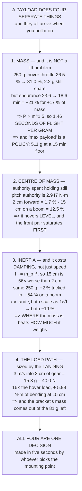

# 17.01 The payload problem: mass, centre of mass, and what it costs you

<!-- glance:start -->
<!-- generated by tools/build.py from curriculum/syllabus.yaml — edit the syllabus, not this block -->

| | |
|---|---|
| **Track** | Main path |
| **Difficulty** | Intermediate |
| **Time** | 1 h 15 min |
| **Hardware** | Payload & delivery pod (stage 4) |
| **Software** | python |
| **Prerequisites** | [16.05 Field protocols and Hermon's safety case](../16-testing-analysis/16.05-field-protocols-and-the-safety-case.md)<br>[04.02 The mass budget and the centre of mass](../04-frame-and-assembly/04.02-mass-and-center-of-mass.md) |
| **Skip if** | You can compute what a 250 g pod costs Hermon in hover current, endurance and thrust margin, and where it must hang. |

<!-- glance:end -->

## What you will learn

- That a 250 g pod costs Hermon **5.0 minutes of 23.6** and only **4.5 points of hover throttle**
  — **thrust margin is not what limits your payload**
- The number to carry in your head: **1.46 seconds of endurance per gram**, and why the linear rule
  overstates by 21 %
- That "maximum payload" is **a policy, not a property**: name the endurance floor and the mass
  falls out — **511 g at 15 minutes**
- That after 15.01's companion and the pod itself there are **81 g left for the mount**
- That a pod 15 cm forward spends **12.5 % of pitch authority holding still**, and spends it
  **asymmetrically**
- That the same 250 g is **+2 % or +54 % of pitch inertia** depending on the bracket, and that
  inertia costs **damping** as well as bandwidth
- That a draining spray tank moves the aircraft **23 % in inertia across one sortie**
- And the design case: the mount carries **40 N at landing, 16× its hover load**

## Why it matters

Everybody sizing a payload asks "can it lift it", and on a 3.78 : 1 aircraft the answer is almost
always yes, by a margin so wide that it stops being the interesting question. Hermon can hover with
over a kilogram of pod at less than half throttle. It just cannot do it for very long, or steer
very well afterwards.

So the three real questions are how much flight time the mass costs, how much control authority the
*position* costs, and whether the bracket that holds it survives the landing. This lesson answers
all three in numbers, and the numbers are the constraints the rest of module 17 works inside: 17.02
has to hold 40 N and release in 100 ms, 17.03 has a mass that drains away mid-flight, and 17.04 has
the transient when it leaves.

The pattern to notice is that all three penalties are **one decision**, made in about five seconds
by whoever decides where the pod goes.

> [!WARNING]
> A payload that comes loose in flight is the worst failure in this course: an unbalanced aircraft
> with a tethered mass swinging under it is not controllable, and the debris is uncontained. Size
> the mount for the landing case in section 6, torque-check it in 04.06's preflight, and never fly
> a pod whose bracket you have not load-tested on the bench.

## Prerequisites

<!-- prereqs:start -->
## Prerequisites

You need these first:

- [16.05 Field protocols and Hermon's safety case](../16-testing-analysis/16.05-field-protocols-and-the-safety-case.md)
- [04.02 The mass budget and the centre of mass](../04-frame-and-assembly/04.02-mass-and-center-of-mass.md)

### Optional prerequisite links

None.

Check your readiness: `python course.py why 17.01`
<!-- prereqs:end -->

## Concept

A payload does three separate things to an aircraft, and they are easy to confuse because they all
arrive at once when you bolt the thing on.

It **adds mass**, which the motors must lift. That is the penalty everyone thinks about, and on
this class of aircraft it is almost entirely an endurance penalty rather than a lift one, because
hover power goes as mass to the power of one and a half while thrust goes as mass to the power of
one. The motors barely notice; the pack notices a great deal.

It **moves the centre of mass**, which the controller must then hold against, permanently, with
differential thrust. That does not tilt the aircraft — a pure moment needs no tilt — but it does
spend control authority before you have asked for anything, and it spends it on one side.

And it **adds inertia**, as the square of how far the mass sits from the axis. This is the one that
scales badly: the same pod at 15 cm rather than 2 cm is fifty-six times worse for inertia, and the
aircraft that comes back is slower *and* less damped than the one you tuned.

Then there is the fourth thing, which is not about flying at all: something has to hold the payload
on, and the load it must hold is not the hover load. It is the landing load.

## Technical explanation

### Level 1 — what 250 g actually costs

| | bare | with pod | change |
|---|---|---|---|
| all-up mass | 1.45 kg | 1.70 kg | +17.2 % |
| thrust per motor, hover | 3.56 N | 4.17 N | +17.2 % |
| hover throttle | 26.5 % | 31.0 % | |
| thrust-to-weight | 3.78 : 1 | 3.22 : 1 | −14.7 % |
| spare vertical accel | 2.78 g | 2.22 g | −20.0 % |
| hover power | 226 W | 287 W | +26.9 % |
| **hover endurance** | **23.6 min** | **18.6 min** | **−21.3 %** |

Read the bottom row against the top four. The thrust numbers barely move — hover throttle goes from
26.5 % to 31.0 %, and there are still **2.2 g of spare vertical acceleration** left. The aircraft is
nowhere near its lift.

**Endurance is where the 250 g goes: 5.0 minutes, 21 % of the flight, for 17 % of the mass.**
**Thrust margin is not what limits your payload.** The exponent is why: hover power scales as
mass^1.5, so the percentage penalty is always worse than the percentage of mass you added.

And the number to carry around:

```
dE/dm at 1.450 kg = −1.5 · E₀/m₀ = 1.46 seconds per gram
250 g by the linear rule = 6.1 min
the real, cubed-root answer = 5.0 min   (the linear rule overstates by 21 %)
```

About a second and a half of flight per gram, at this mass. Good enough for a sketch, and wrong by
21 % at a quarter-kilo — so do the sketch in your head and the real one before you buy.

### Level 2 — "maximum payload" is a policy

| endurance floor | all-up | payload | hover throttle |
|---|---|---|---|
| 20 min | 1.619 kg | 169 g | 29.6 % |
| 18 min | 1.737 kg | 287 g | 31.7 % |
| **15 min** | **1.961 kg** | **511 g** | **35.8 %** |
| 12 min | 2.276 kg | 826 g | 41.6 % |
| 10 min | 2.570 kg | 1,120 g | 46.9 % |

**Even at a ten-minute floor the hover throttle is only 47 %.** The propeller is never the
constraint on this airframe. The pack is, every time.

So maximum payload is not a property of the aircraft — it is the mass at which *you* decide the
flight has got too short. Take the 15-minute floor as this course's policy, because it leaves
12.04's RTL and 11.05's reserve intact, and the budget is:

| | |
|---|---|
| payload budget at a 15 min floor | 511 g |
| less 15.01's companion and its BEC | −180 g |
| less the pod itself | −250 g |
| **left for the mount and the release** | **81 g** |

**That is the number the whole module lives inside**, and it is tighter than it looks, because
Level 6 gives the mount a 40 N design load and a bracket that carries 40 N is not a cable tie.
**The mount is not free, and it is the part everybody forgets to weigh.**

### Level 3 — where it hangs, part one: the centre of mass

A pod does not hang at the centre of mass. It hangs where there is room, which on most airframes is
forward, clearing the landing gear and 14.01's camera. An offset *x* shifts the whole aircraft's CoM
by `m_p·x / m_total`, and gravity pulls on that lever: `M = m_total·g·dx`, held **forever** by
differential thrust.

Hermon's pitch authority with the pod aboard is `2 · arm · (T_max − T_hover)` = 2 × 0.1591 ×
(13.43 − 4.17) = **2.947 N·m**.

| mount position | CoM shift | moment | of authority |
|---|---|---|---|
| at the CoM, tucked in | 0.0 mm | 0.000 N·m | 0.0 % |
| 2 cm forward | 2.9 mm | 0.049 N·m | 1.7 % |
| 5 cm, clearing the gear | 7.4 mm | 0.123 N·m | 4.2 % |
| 10 cm, clearing the camera | 14.7 mm | 0.245 N·m | 8.3 % |
| **15 cm, on a boom** | **22.1 mm** | **0.368 N·m** | **12.5 %** |

It hovers level either way — a pure moment needs no tilt, and the front pair simply runs harder. The
cost is not attitude. It is that the authority is **spent before you ask for anything**, and spent
**asymmetrically**: the front pair saturates first, so the aircraft can pitch up harder than it can
pitch down.

At 15 cm you have given away an eighth of pitch authority to hold a payload still, and 11.04's wind
lean is asking for the rest. **Hang it at the CoM. 2 cm costs 1.7 %; 15 cm costs 12.5 %.**

### Level 4 — where it hangs, part two: inertia, and why it is worse

Mass goes up once. Inertia goes up as the **square** of the distance: `I += m_p·r²`. A pod 15 cm out
is not 7.5 times worse than one at 2 cm — it is **56 times** worse.

| mount position | Iyy | vs bare | bandwidth | damping |
|---|---|---|---|---|
| at the CoM, tucked in | 0.01372 | 102 % | 99 % | 99 % |
| 2 cm forward, 3 cm down | 0.01383 | 102 % | 99 % | 99 % |
| 5 cm forward, 8 cm down | 0.01572 | 116 % | 93 % | 93 % |
| 10 cm forward, 8 cm down | 0.01760 | 130 % | 88 % | 88 % |
| **15 cm, on a boom** | **0.02073** | **154 %** | **81 %** | **81 %** |

Both right-hand columns move together, and **the second one is the problem**. A PD attitude loop has
`ωn = √(Kp/I)` and `ζ = Kd / 2√(Kp·I)` — both scale as `1/√I`. So with 07.05's gains left alone,
more inertia does not only make the aircraft slower, it makes it **less damped by exactly the same
factor**. Slower you would notice and shrug at. Less damped is 16.03's oscillation signature, and it
arrives in wind rather than on the bench.

And notice which row is safe. Mass goes up 17 % either way; pitch inertia goes up **2 % tucked in
and 54 % on a boom**, for the *same payload*. **Where the mass is matters more than how much of it
there is** — and if you must use a boom, 07.05's gains are no longer the right gains.

### Level 5 — a tank is not a brick

17.03's spray tank is 500 g, twice the pod, and it behaves nothing like it, because **it leaves
during the flight**:

| tank | all-up | endurance | CoM shift | Iyy | hover throttle |
|---|---|---|---|---|---|
| 100 % full | 1.950 kg | 15.1 min | 23.1 mm | 0.01755 | 35.6 % |
| 75 % | 1.825 kg | 16.7 min | 18.5 mm | 0.01654 | 33.3 % |
| 50 % | 1.700 kg | 18.6 min | 13.2 mm | 0.01553 | 31.0 % |
| 25 % | 1.575 kg | 20.8 min | 7.1 mm | 0.01451 | 28.8 % |
| empty | 1.450 kg | 23.6 min | 0.0 mm | 0.01350 | 26.5 % |

**The aircraft that lands is not the aircraft that took off.** Over one sortie the pitch inertia
falls 23 % and the CoM climbs 23 mm, so a machine tuned full is sluggish and over-damped empty, and
a machine tuned empty **oscillates full**. Tune at the state you spend most of the flight in — about
half, for a spray job — and accept both ends knowingly.

That is the *slow* version of the problem. 17.03 does sloshing, which is the same mass moving fast,
and 17.04 does the step, which is all of it leaving at once.

### Level 6 — the load path: the design case is the landing

In hover the mount carries 2.5 N. Everybody sizes for that, and everybody is wrong, because the
mount's worst moment is the one where the aircraft stops suddenly and the pod does not. A landing
arrests the descent over the gear's deflection: `a = v²/2s`, and the load is `(a + g)·m_p`.

| landing | v | deflection | decel | load on mount |
|---|---|---|---|---|
| a good landing | 0.5 m/s | 3.0 cm | 0.4 g | 3.5 N |
| a firm one | 1.5 m/s | 3.0 cm | 3.8 g | 11.8 N |
| **11.02's first landings** | **3.0 m/s** | **3.0 cm** | **15.3 g** | **40.0 N** |
| a hard one, stiff gear | 3.0 m/s | 1.0 cm | 45.9 g | 115.0 N |
| 12.05's LAND from a hover | 2.0 m/s | 2.0 cm | 10.2 g | 27.5 N |

**Take 11.02's 3 m/s as the design case: 15.3 g, 40.0 N** — sixteen times the hover load, and the
number 17.02's release has to **hold** while still letting go in under 100 ms.

And an offset pod makes the bracket eat a moment as well: 0.80 N·m at 2 cm, 2.00 at 5 cm, **5.99
N·m at 15 cm**. Six newton-metres through a 3 mm plate and two M3 bolts is a real structure, and a
real structure has mass — of which Level 2 says there are 81 grams.

**So the load path closes the loop.** Mounting it far out costs authority, costs damping, *and*
costs the bracket mass that buys back the endurance you were protecting. The three penalties are the
same decision, made once, by whoever decides where the pod goes.

> [!TIP]
> **Ask your teacher:** "Weigh your bracket." Almost nobody has. The pod's mass is on the spec
> sheet and the bracket's is not, and on this budget the bracket is a quarter of what is left.

## Diagram



## Code

Hermon's payload arithmetic end to end: the mass/power/endurance penalty from momentum theory
anchored on the measured 226 W, the endurance-floor inversion that turns a policy into a mass
budget, the CoM offset as a fraction of pitch authority, the inertia table with its bandwidth and
damping scaling, a draining spray tank across one sortie, and the landing load path.

```python
"""17.01 -- what a payload costs Hermon: mass, centre of mass, inertia.

Pure stdlib. Every constant is Hermon's frozen number from references/
hermon-numbers.md; nothing here is invented for the lesson.

The question this answers is not 'can it lift it' -- it can lift a great
deal -- but 'what does carrying it cost, and where must it hang'.
"""

import math

G = 9.81

# ---- Hermon, frozen (references/hermon-numbers.md) ----------------------
MASS_KG = 1.450          # bare airframe, flight-ready, no payload
IXX = 0.01199            # kg m^2, roll
IYY = 0.01350            # kg m^2, pitch
IZZ = 0.02236            # kg m^2, yaw
ARM_M = 0.1591           # motor arm, centre to shaft
T_MAX_N = 13.43          # per motor, full throttle, 6S
T_HOVER_N = 3.556        # per motor at 1.450 kg
P_HOVER_W = 226.0        # electrical, hover
USABLE_WH = 88.8         # 6S 5000 mAh, 80 % usable
ENDUR_MIN = 23.6         # hover endurance at 1.450 kg
N_MOTORS = 4

COMPANION_G = 180.0      # 15.01: already spent
POD_G = 250.0            # the delivery pod this module builds

BAR = "=" * 70


def head(n, title):
    print()
    print(BAR)
    print("%d. %s" % (n, title))
    print(BAR)


# ------------------------------------------------------------------------
def hover_power(mass_kg):
    """Momentum theory: induced power goes as thrust^1.5, so as mass^1.5.

    Anchored on Hermon's MEASURED 226 W at 1.450 kg rather than on a disc
    area, so the constant carries every loss the measurement already had.
    """
    return P_HOVER_W * (mass_kg / MASS_KG) ** 1.5


def endurance_min(mass_kg):
    return USABLE_WH / hover_power(mass_kg) * 60.0


def mass_for_endurance(target_min):
    """Invert endurance_min: E/E0 = (m0/m)^1.5 -> m = m0 (E0/E)^(2/3)."""
    if target_min <= 0:
        raise ValueError("endurance floor must be positive")
    return MASS_KG * (ENDUR_MIN / target_min) ** (2.0 / 3.0)


# ========================================================================
head(1, "WHAT 250 g COSTS, AND WHERE THE COST ACTUALLY LANDS")

m_pod = MASS_KG + POD_G / 1000.0
print("  The pod is %.0f g on a %.0f g aircraft: a %.1f %% mass increase."
      % (POD_G, MASS_KG * 1000, POD_G / (MASS_KG * 1000) * 100))
print("  Here is every number it moves.")
print()

rows = [
    ("all-up mass", "kg", MASS_KG, m_pod),
    ("thrust per motor, hover", "N", T_HOVER_N, m_pod * G / N_MOTORS),
    ("hover throttle, of max", "%", T_HOVER_N / T_MAX_N * 100,
     m_pod * G / N_MOTORS / T_MAX_N * 100),
    ("thrust-to-weight", ":1", N_MOTORS * T_MAX_N / (MASS_KG * G),
     N_MOTORS * T_MAX_N / (m_pod * G)),
    ("spare vertical accel", "g", (N_MOTORS * T_MAX_N - MASS_KG * G) / MASS_KG / G,
     (N_MOTORS * T_MAX_N - m_pod * G) / m_pod / G),
    ("hover power", "W", P_HOVER_W, hover_power(m_pod)),
    ("hover endurance", "min", ENDUR_MIN, endurance_min(m_pod)),
]
print("  %-26s %-4s %9s %9s %9s" % ("", "", "bare", "with pod", "change"))
for name, unit, a, b in rows:
    print("  %-26s %-4s %9.2f %9.2f %+8.1f %%"
          % (name, unit, a, b, (b - a) / a * 100))

print()
print("  READ THE LAST TWO ROWS AGAINST THE FIRST FOUR.")
print("  The thrust numbers barely move: hover throttle goes from")
print("  %.1f %% to %.1f %%, and there are still %.1f g of spare"
      % (T_HOVER_N / T_MAX_N * 100, m_pod * G / N_MOTORS / T_MAX_N * 100,
         (N_MOTORS * T_MAX_N - m_pod * G) / m_pod / G))
print("  vertical acceleration. THE AIRCRAFT IS NOWHERE NEAR ITS LIFT.")
print("  ENDURANCE IS WHERE THE %.0f g GOES: %.1f min becomes %.1f,"
      % (POD_G, ENDUR_MIN, endurance_min(m_pod)))
print("  a loss of %.1f min, which is %.0f %% of the flight for %.0f %% of"
      % (ENDUR_MIN - endurance_min(m_pod),
         (ENDUR_MIN - endurance_min(m_pod)) / ENDUR_MIN * 100,
         POD_G / (MASS_KG * 1000) * 100))
print("  the mass. THRUST MARGIN IS NOT WHAT LIMITS YOUR PAYLOAD.")

# the derivative, which is the number to carry around
per_gram_s = 1.5 * ENDUR_MIN / (MASS_KG * 1000) * 60.0
print()
print("  AND THE NUMBER TO CARRY IN YOUR HEAD:")
print("    dE/dm at 1.450 kg  = -1.5 E0/m0 = %.2f seconds per gram"
      % per_gram_s)
print("    so %.0f g by the linear rule  = %.1f min"
      % (POD_G, POD_G * per_gram_s / 60.0))
print("    and the real, cubed-root answer = %.1f min"
      % (ENDUR_MIN - endurance_min(m_pod)))
print("  The linear rule OVERSTATES by %.0f %%, because the exponent is"
      % ((POD_G * per_gram_s / 60.0) / (ENDUR_MIN - endurance_min(m_pod))
         * 100 - 100))
print("  1.5 and not 1. It is still the right rule for a sketch: about a")
print("  second and a half of flight per gram, at this mass.")

# ========================================================================
head(2, "SO HOW MUCH CAN HERMON CARRY? THE ANSWER IS A POLICY, NOT A LIMIT")

print("  'Maximum payload' is not a property of the aircraft. It is the")
print("  mass at which YOU decide the flight has got too short. Pick the")
print("  floor and the mass follows:")
print()
print("  %-22s %10s %12s %12s" % ("endurance floor", "all-up", "payload",
                                  "hover thr."))
for floor in (20.0, 18.0, 15.0, 12.0, 10.0):
    m = mass_for_endurance(floor)
    print("  %-22s %8.3f kg %9.0f g %10.1f %%"
          % ("%.0f min" % floor, m, (m - MASS_KG) * 1000,
             m * G / N_MOTORS / T_MAX_N * 100))

FLOOR = 15.0
budget_g = (mass_for_endurance(FLOOR) - MASS_KG) * 1000
print()
print("  EVEN AT A TEN-MINUTE FLOOR THE HOVER THROTTLE IS ONLY %.0f %%."
      % (mass_for_endurance(10.0) * G / N_MOTORS / T_MAX_N * 100))
print("  Again: the propeller is not the constraint. The pack is.")
print()
print("  TAKE THE %.0f-MINUTE FLOOR AS THIS COURSE'S POLICY -- it leaves"
      % FLOOR)
print("  12.04's RTL and 11.05's reserve intact -- and the budget is:")
print()
print("    payload budget at a %.0f min floor      %6.0f g" % (FLOOR, budget_g))
print("    less 15.01's companion + its BEC       %6.0f g" % -COMPANION_G)
print("    less the pod itself                    %6.0f g" % -POD_G)
print("    %-38s %6.0f g" % ("LEFT FOR THE MOUNT AND THE RELEASE",
                             budget_g - COMPANION_G - POD_G))
print()
print("  THAT IS THE NUMBER THIS WHOLE MODULE HAS TO LIVE INSIDE, and it")
print("  is tighter than it looks: section 6 shows the mount has to carry")
print("  a landing load, and a bracket that carries a landing load is not")
print("  a cable tie. THE MOUNT IS NOT FREE, and it is the part everybody")
print("  forgets to weigh.")

# ========================================================================
head(3, "WHERE IT HANGS, PART ONE: THE CENTRE OF MASS")

print("  A pod does not hang at the centre of mass. It hangs where there")
print("  is room -- which on most airframes is forward, to clear the")
print("  landing gear and 14.01's camera.")
print()
print("  A payload offset x from the CoM shifts the whole aircraft's CoM")
print("  by m_p x / m_total, and gravity then pulls on a lever:")
print("      M = m_total g dx,   held FOREVER by differential thrust.")
print()

# available pitch moment: two motors up, two down, each by (T_MAX - T_hover)
t_hover_pod = m_pod * G / N_MOTORS
m_avail = 2 * ARM_M * (T_MAX_N - t_hover_pod)
print("  Hermon's pitch authority, with the pod aboard:")
print("    2 x arm x (T_max - T_hover) = 2 x %.4f x (%.2f - %.2f)"
      % (ARM_M, T_MAX_N, t_hover_pod))
print("                                = %.3f N m" % m_avail)
print()
print("  %-28s %9s %10s %12s" % ("mount position", "CoM shift", "moment",
                                 "of authority"))
for label, x_m in (("at the CoM, tucked in", 0.00),
                   ("2 cm forward", 0.02),
                   ("5 cm, clearing the gear", 0.05),
                   ("10 cm, clearing the camera", 0.10),
                   ("15 cm, on a boom", 0.15)):
    dx = POD_G / 1000.0 * x_m / m_pod
    mom = m_pod * G * dx
    print("  %-28s %7.1f mm %8.3f Nm %10.1f %%"
          % (label, dx * 1000, mom, mom / m_avail * 100))

print()
print("  IT HOVERS LEVEL EITHER WAY -- a pure moment needs no tilt, and")
print("  the front pair simply runs harder. The cost is not attitude, it")
print("  is that the authority is SPENT BEFORE YOU ASK FOR ANYTHING, and")
print("  it is spent ASYMMETRICALLY: the front pair saturates first, so")
print("  the aircraft can pitch up harder than it can pitch down.")
print()
print("  AT 15 cm YOU HAVE GIVEN AWAY %.0f %% OF PITCH AUTHORITY TO HOLD"
      % (m_pod * G * (POD_G / 1000.0 * 0.15 / m_pod) / m_avail * 100))
print("  A PAYLOAD STILL. And 11.04's wind lean is asking for the rest.")
print()
print("  THE DESIGN RULE: hang it at the CoM, in the vertical axis if you")
print("  must, and never on a boom. 2 cm costs %.1f %%; 15 cm costs %.0f %%."
      % (m_pod * G * (POD_G / 1000.0 * 0.02 / m_pod) / m_avail * 100,
         m_pod * G * (POD_G / 1000.0 * 0.15 / m_pod) / m_avail * 100))

# ========================================================================
head(4, "WHERE IT HANGS, PART TWO: INERTIA, AND WHY IT IS WORSE")

print("  Mass goes up once. Inertia goes up as the SQUARE of how far the")
print("  mass sits from the axis: I += m_p r^2. A pod 15 cm out is not")
print("  7.5 times worse than one 2 cm out, it is %.0f times worse."
      % ((0.15 / 0.02) ** 2))
print()
print("  %-28s %10s %10s %10s %10s"
      % ("mount position", "Iyy", "vs bare", "bandwidth", "damping"))
for label, x_m, z_m in (("at the CoM, tucked in", 0.00, 0.03),
                        ("2 cm forward, 3 cm down", 0.02, 0.03),
                        ("5 cm forward, 8 cm down", 0.05, 0.08),
                        ("10 cm forward, 8 cm down", 0.10, 0.08),
                        ("15 cm, on a boom", 0.15, 0.08)):
    # pitch inertia sees the x and z offsets
    d2 = x_m ** 2 + z_m ** 2
    iyy = IYY + POD_G / 1000.0 * d2
    # a PD attitude loop with UNCHANGED gains:
    #   wn = sqrt(Kp/I)      -> scales as 1/sqrt(I)
    #   zeta = Kd/2/sqrt(KpI)-> scales as 1/sqrt(I) as well
    scale = math.sqrt(IYY / iyy)
    print("  %-28s %8.5f %9.0f %% %8.0f %% %9.0f %%"
          % (label, iyy, iyy / IYY * 100, scale * 100, scale * 100))

print()
print("  BOTH COLUMNS MOVE TOGETHER, AND THE SECOND ONE IS THE PROBLEM.")
print("  With 07.05's gains left alone, more inertia does not only make")
print("  the aircraft slower -- it makes it LESS DAMPED by exactly the")
print("  same factor. Slower you would notice and shrug at. Less damped")
print("  is 16.03's oscillation signature, and it arrives in wind.")
print()
print("  AND NOTICE WHICH ROW IS SAFE: mass +%.0f %%, and pitch inertia"
      % (POD_G / (MASS_KG * 1000) * 100))
d2_tuck = 0.00 ** 2 + 0.03 ** 2
d2_boom = 0.15 ** 2 + 0.08 ** 2
print("  +%.0f %% when it is tucked in, +%.0f %% on a boom. SAME PAYLOAD."
      % ((POD_G / 1000.0 * d2_tuck) / IYY * 100,
         (POD_G / 1000.0 * d2_boom) / IYY * 100))
print("  WHERE THE MASS IS MATTERS MORE THAN HOW MUCH OF IT THERE IS.")
print()
print("  And if you must mount it out on a boom, 07.05's gains are no")
print("  longer the right gains. Retune, or expect 16.03's signature.")

# ========================================================================
TANK_FULL_G = 500.0
TANK_X, TANK_Z = 0.00, 0.09

head(5, "THE ONE THAT SURPRISES PEOPLE: A TANK IS NOT A BRICK")

print("  17.03's spray tank is %.0f g -- twice the pod -- and it behaves"
      % TANK_FULL_G)
print("  nothing like it, because it LEAVES DURING THE FLIGHT. Watch what a")
print("  draining tank does to the numbers you just tuned for:")
print()
print("  %-14s %8s %8s %9s %10s %10s"
      % ("tank", "all-up", "endur.", "CoM shift", "Iyy", "hover thr."))
for frac in (1.0, 0.75, 0.5, 0.25, 0.0):
    g = TANK_FULL_G * frac
    m = MASS_KG + g / 1000.0
    dz = g / 1000.0 * TANK_Z / m
    iyy = IYY + g / 1000.0 * (TANK_X ** 2 + TANK_Z ** 2)
    print("  %-14s %6.3f kg %6.1f min %7.1f mm %8.5f %9.1f %%"
          % ("%3.0f %% full" % (frac * 100), m, endurance_min(m),
             dz * 1000, iyy, m * G / N_MOTORS / T_MAX_N * 100))

print()
print("  THE AIRCRAFT THAT LANDS IS NOT THE AIRCRAFT THAT TOOK OFF.")
print("  Over one sortie the pitch inertia falls %.0f %% and the CoM"
      % ((1 - IYY / (IYY + TANK_FULL_G / 1000.0
                     * (TANK_X ** 2 + TANK_Z ** 2))) * 100))
print("  climbs %.0f mm, so a machine tuned full is over-damped and"
      % (TANK_FULL_G / 1000.0 * TANK_Z / (MASS_KG + TANK_FULL_G / 1000.0)
         * 1000))
print("  sluggish empty, and a machine tuned empty OSCILLATES full.")
print("  Tune it at the state you spend most of the flight in -- which")
print("  for a spray job is about half -- and accept both ends.")
print("  17.03 does the sloshing, which is the same mass moving FAST.")

# ========================================================================
head(6, "THE LOAD PATH: THE DESIGN CASE IS THE LANDING, NOT THE HOVER")

print("  In hover the mount carries %.1f N. Everybody sizes for that and"
      % (POD_G / 1000.0 * G))
print("  everybody is wrong, because the mount's worst moment is the one")
print("  where the aircraft stops suddenly and the pod does not.")
print()
print("  A landing arrests the descent over the gear's deflection:")
print("      a = v^2 / 2s,  and the load is (a + g) m_p")
print()
print("  %-24s %8s %9s %10s %12s"
      % ("landing", "v (m/s)", "s (cm)", "decel", "load on mount"))
for label, v, s_m in (("a good landing", 0.5, 0.030),
                      ("a firm one", 1.5, 0.030),
                      ("11.02's first landings", 3.0, 0.030),
                      ("a hard one, stiff gear", 3.0, 0.010),
                      ("12.05's LAND from a hover", 2.0, 0.020)):
    a = v * v / (2 * s_m)
    load = (a + G) * POD_G / 1000.0
    print("  %-24s %7.1f %8.1f %8.1f g %9.1f N"
          % (label, v, s_m * 100, a / G, load))

V_DES, S_DES = 3.0, 0.030
a_des = V_DES * V_DES / (2 * S_DES)
load_des = (a_des + G) * POD_G / 1000.0
print()
print("  TAKE 11.02's 3 m/s AS THE DESIGN CASE: %.1f g, %.1f N."
      % (a_des / G, load_des))
print("  That is %.0f times the hover load, and it is the number 17.02's"
      % (load_des / (POD_G / 1000.0 * G)))
print("  release has to HOLD -- while still letting go in under 100 ms.")
print()
print("  AND IF THE POD IS OFFSET, THE MOUNT ALSO EATS A MOMENT:")
for x_m in (0.02, 0.05, 0.15):
    print("    %4.0f cm forward -> %5.2f N m of bending at the bracket"
          % (x_m * 100, load_des * x_m))
print()
print("  %.2f N m through a 3 mm plate and two M3 bolts is a real"
      % (load_des * 0.15))
print("  structure, and a real structure has mass -- which section 2")
print("  just told you there is %.0f g of." % (budget_g - COMPANION_G - POD_G))
print()
print("  SO THE LOAD PATH CLOSES THE LOOP: mounting it far out costs")
print("  authority (section 3), costs damping (section 4) AND costs the")
print("  bracket mass that buys back the endurance you were protecting.")
print("  THE THREE PENALTIES ARE THE SAME DECISION, made once, at the")
print("  moment somebody decides where the pod goes.")

# ========================================================================
head(7, "THE ONE-PAGE ANSWER")

print("  Hermon, carrying a %.0f g pod mounted at the CoM:" % POD_G)
print()
print("    all-up                     %6.3f kg" % m_pod)
print("    hover throttle             %6.1f %%  (was %.1f)"
      % (m_pod * G / N_MOTORS / T_MAX_N * 100, T_HOVER_N / T_MAX_N * 100))
print("    endurance                  %6.1f min (was %.1f)"
      % (endurance_min(m_pod), ENDUR_MIN))
print("    pitch authority lost       %6.1f %%  (at 2 cm offset)"
      % (m_pod * G * (POD_G / 1000.0 * 0.02 / m_pod) / m_avail * 100))
print("    pitch inertia              %6.0f %%  of bare"
      % ((IYY + POD_G / 1000.0 * (0.02 ** 2 + 0.03 ** 2)) / IYY * 100))
print("    mount design load          %6.1f N   (%.1f g at 3 m/s)"
      % (load_des, a_des / G))
print("    left in the budget         %6.0f g   at a %.0f min floor"
      % (budget_g - COMPANION_G - POD_G, FLOOR))
print()
print("  AND THE FOUR SENTENCES THAT MATTER:")
print("   1. Thrust is not the constraint. The pack is: %.0f %% of the"
      % ((ENDUR_MIN - endurance_min(m_pod)) / ENDUR_MIN * 100))
print("      flight for %.0f %% of the mass, at %.1f s of endurance per gram."
      % (POD_G / (MASS_KG * 1000) * 100, per_gram_s))
print("   2. Payload capacity is a policy. Name the endurance floor first")
print("      and the mass falls out: %.0f g at %.0f min." % (budget_g, FLOOR))
print("   3. WHERE it hangs beats HOW MUCH it weighs. The same %.0f g is"
      % POD_G)
print("      +%.0f %% or +%.0f %% of pitch inertia depending on the bracket."
      % ((POD_G / 1000.0 * d2_tuck) / IYY * 100,
         (POD_G / 1000.0 * d2_boom) / IYY * 100))
print("   4. Size the mount for %.0f g, not for 1. The landing is the"
      % (a_des / G))
print("      design case, and 17.02 has to hold through it.")
```

Output:

```text

======================================================================
1. WHAT 250 g COSTS, AND WHERE THE COST ACTUALLY LANDS
======================================================================
  The pod is 250 g on a 1450 g aircraft: a 17.2 % mass increase.
  Here is every number it moves.

                                       bare  with pod    change
  all-up mass                kg        1.45      1.70    +17.2 %
  thrust per motor, hover    N         3.56      4.17    +17.2 %
  hover throttle, of max     %        26.48     31.04    +17.2 %
  thrust-to-weight           :1        3.78      3.22    -14.7 %
  spare vertical accel       g         2.78      2.22    -20.0 %
  hover power                W       226.00    286.90    +26.9 %
  hover endurance            min      23.60     18.57    -21.3 %

  READ THE LAST TWO ROWS AGAINST THE FIRST FOUR.
  The thrust numbers barely move: hover throttle goes from
  26.5 % to 31.0 %, and there are still 2.2 g of spare
  vertical acceleration. THE AIRCRAFT IS NOWHERE NEAR ITS LIFT.
  ENDURANCE IS WHERE THE 250 g GOES: 23.6 min becomes 18.6,
  a loss of 5.0 min, which is 21 % of the flight for 17 % of
  the mass. THRUST MARGIN IS NOT WHAT LIMITS YOUR PAYLOAD.

  AND THE NUMBER TO CARRY IN YOUR HEAD:
    dE/dm at 1.450 kg  = -1.5 E0/m0 = 1.46 seconds per gram
    so 250 g by the linear rule  = 6.1 min
    and the real, cubed-root answer = 5.0 min
  The linear rule OVERSTATES by 21 %, because the exponent is
  1.5 and not 1. It is still the right rule for a sketch: about a
  second and a half of flight per gram, at this mass.

======================================================================
2. SO HOW MUCH CAN HERMON CARRY? THE ANSWER IS A POLICY, NOT A LIMIT
======================================================================
  'Maximum payload' is not a property of the aircraft. It is the
  mass at which YOU decide the flight has got too short. Pick the
  floor and the mass follows:

  endurance floor            all-up      payload   hover thr.
  20 min                    1.619 kg       169 g       29.6 %
  18 min                    1.737 kg       287 g       31.7 %
  15 min                    1.961 kg       511 g       35.8 %
  12 min                    2.276 kg       826 g       41.6 %
  10 min                    2.570 kg      1120 g       46.9 %

  EVEN AT A TEN-MINUTE FLOOR THE HOVER THROTTLE IS ONLY 47 %.
  Again: the propeller is not the constraint. The pack is.

  TAKE THE 15-MINUTE FLOOR AS THIS COURSE'S POLICY -- it leaves
  12.04's RTL and 11.05's reserve intact -- and the budget is:

    payload budget at a 15 min floor         511 g
    less 15.01's companion + its BEC         -180 g
    less the pod itself                      -250 g
    LEFT FOR THE MOUNT AND THE RELEASE         81 g

  THAT IS THE NUMBER THIS WHOLE MODULE HAS TO LIVE INSIDE, and it
  is tighter than it looks: section 6 shows the mount has to carry
  a landing load, and a bracket that carries a landing load is not
  a cable tie. THE MOUNT IS NOT FREE, and it is the part everybody
  forgets to weigh.

======================================================================
3. WHERE IT HANGS, PART ONE: THE CENTRE OF MASS
======================================================================
  A pod does not hang at the centre of mass. It hangs where there
  is room -- which on most airframes is forward, to clear the
  landing gear and 14.01's camera.

  A payload offset x from the CoM shifts the whole aircraft's CoM
  by m_p x / m_total, and gravity then pulls on a lever:
      M = m_total g dx,   held FOREVER by differential thrust.

  Hermon's pitch authority, with the pod aboard:
    2 x arm x (T_max - T_hover) = 2 x 0.1591 x (13.43 - 4.17)
                                = 2.947 N m

  mount position               CoM shift     moment of authority
  at the CoM, tucked in            0.0 mm    0.000 Nm        0.0 %
  2 cm forward                     2.9 mm    0.049 Nm        1.7 %
  5 cm, clearing the gear          7.4 mm    0.123 Nm        4.2 %
  10 cm, clearing the camera      14.7 mm    0.245 Nm        8.3 %
  15 cm, on a boom                22.1 mm    0.368 Nm       12.5 %

  IT HOVERS LEVEL EITHER WAY -- a pure moment needs no tilt, and
  the front pair simply runs harder. The cost is not attitude, it
  is that the authority is SPENT BEFORE YOU ASK FOR ANYTHING, and
  it is spent ASYMMETRICALLY: the front pair saturates first, so
  the aircraft can pitch up harder than it can pitch down.

  AT 15 cm YOU HAVE GIVEN AWAY 12 % OF PITCH AUTHORITY TO HOLD
  A PAYLOAD STILL. And 11.04's wind lean is asking for the rest.

  THE DESIGN RULE: hang it at the CoM, in the vertical axis if you
  must, and never on a boom. 2 cm costs 1.7 %; 15 cm costs 12 %.

======================================================================
4. WHERE IT HANGS, PART TWO: INERTIA, AND WHY IT IS WORSE
======================================================================
  Mass goes up once. Inertia goes up as the SQUARE of how far the
  mass sits from the axis: I += m_p r^2. A pod 15 cm out is not
  7.5 times worse than one 2 cm out, it is 56 times worse.

  mount position                      Iyy    vs bare  bandwidth    damping
  at the CoM, tucked in         0.01372       102 %       99 %        99 %
  2 cm forward, 3 cm down       0.01383       102 %       99 %        99 %
  5 cm forward, 8 cm down       0.01572       116 %       93 %        93 %
  10 cm forward, 8 cm down      0.01760       130 %       88 %        88 %
  15 cm, on a boom              0.02073       154 %       81 %        81 %

  BOTH COLUMNS MOVE TOGETHER, AND THE SECOND ONE IS THE PROBLEM.
  With 07.05's gains left alone, more inertia does not only make
  the aircraft slower -- it makes it LESS DAMPED by exactly the
  same factor. Slower you would notice and shrug at. Less damped
  is 16.03's oscillation signature, and it arrives in wind.

  AND NOTICE WHICH ROW IS SAFE: mass +17 %, and pitch inertia
  +2 % when it is tucked in, +54 % on a boom. SAME PAYLOAD.
  WHERE THE MASS IS MATTERS MORE THAN HOW MUCH OF IT THERE IS.

  And if you must mount it out on a boom, 07.05's gains are no
  longer the right gains. Retune, or expect 16.03's signature.

======================================================================
5. THE ONE THAT SURPRISES PEOPLE: A TANK IS NOT A BRICK
======================================================================
  17.03's spray tank is 500 g -- twice the pod -- and it behaves
  nothing like it, because it LEAVES DURING THE FLIGHT. Watch what a
  draining tank does to the numbers you just tuned for:

  tank             all-up   endur. CoM shift        Iyy hover thr.
  100 % full      1.950 kg   15.1 min    23.1 mm  0.01755      35.6 %
   75 % full      1.825 kg   16.7 min    18.5 mm  0.01654      33.3 %
   50 % full      1.700 kg   18.6 min    13.2 mm  0.01553      31.0 %
   25 % full      1.575 kg   20.8 min     7.1 mm  0.01451      28.8 %
    0 % full      1.450 kg   23.6 min     0.0 mm  0.01350      26.5 %

  THE AIRCRAFT THAT LANDS IS NOT THE AIRCRAFT THAT TOOK OFF.
  Over one sortie the pitch inertia falls 23 % and the CoM
  climbs 23 mm, so a machine tuned full is over-damped and
  sluggish empty, and a machine tuned empty OSCILLATES full.
  Tune it at the state you spend most of the flight in -- which
  for a spray job is about half -- and accept both ends.
  17.03 does the sloshing, which is the same mass moving FAST.

======================================================================
6. THE LOAD PATH: THE DESIGN CASE IS THE LANDING, NOT THE HOVER
======================================================================
  In hover the mount carries 2.5 N. Everybody sizes for that and
  everybody is wrong, because the mount's worst moment is the one
  where the aircraft stops suddenly and the pod does not.

  A landing arrests the descent over the gear's deflection:
      a = v^2 / 2s,  and the load is (a + g) m_p

  landing                   v (m/s)    s (cm)      decel load on mount
  a good landing               0.5      3.0      0.4 g       3.5 N
  a firm one                   1.5      3.0      3.8 g      11.8 N
  11.02's first landings       3.0      3.0     15.3 g      40.0 N
  a hard one, stiff gear       3.0      1.0     45.9 g     115.0 N
  12.05's LAND from a hover     2.0      2.0     10.2 g      27.5 N

  TAKE 11.02's 3 m/s AS THE DESIGN CASE: 15.3 g, 40.0 N.
  That is 16 times the hover load, and it is the number 17.02's
  release has to HOLD -- while still letting go in under 100 ms.

  AND IF THE POD IS OFFSET, THE MOUNT ALSO EATS A MOMENT:
       2 cm forward ->  0.80 N m of bending at the bracket
       5 cm forward ->  2.00 N m of bending at the bracket
      15 cm forward ->  5.99 N m of bending at the bracket

  5.99 N m through a 3 mm plate and two M3 bolts is a real
  structure, and a real structure has mass -- which section 2
  just told you there is 81 g of.

  SO THE LOAD PATH CLOSES THE LOOP: mounting it far out costs
  authority (section 3), costs damping (section 4) AND costs the
  bracket mass that buys back the endurance you were protecting.
  THE THREE PENALTIES ARE THE SAME DECISION, made once, at the
  moment somebody decides where the pod goes.

======================================================================
7. THE ONE-PAGE ANSWER
======================================================================
  Hermon, carrying a 250 g pod mounted at the CoM:

    all-up                      1.700 kg
    hover throttle               31.0 %  (was 26.5)
    endurance                    18.6 min (was 23.6)
    pitch authority lost          1.7 %  (at 2 cm offset)
    pitch inertia                 102 %  of bare
    mount design load            40.0 N   (15.3 g at 3 m/s)
    left in the budget             81 g   at a 15 min floor

  AND THE FOUR SENTENCES THAT MATTER:
   1. Thrust is not the constraint. The pack is: 21 % of the
      flight for 17 % of the mass, at 1.5 s of endurance per gram.
   2. Payload capacity is a policy. Name the endurance floor first
      and the mass falls out: 511 g at 15 min.
   3. WHERE it hangs beats HOW MUCH it weighs. The same 250 g is
      +2 % or +54 % of pitch inertia depending on the bracket.
   4. Size the mount for 15 g, not for 1. The landing is the
      design case, and 17.02 has to hold through it.
```

## Exercise

### Exercise 17.01-E1 — Your own payload budget `[analysis]`

Take your aircraft's measured hover power, usable watt-hours and mass. Name an endurance floor you
will actually accept, invert it, and write down the payload budget. Subtract everything already
bolted on that was not in the original mass.

### Exercise 17.01-E2 — Weigh the bracket `[build]`

Design a mount for your payload at your chosen position, build it, and weigh it. Compare with what
E1 says is left. If it does not fit, the position is wrong before the design is.

### Exercise 17.01-E3 — The offset sweep `[analysis]`

Compute the pitch-authority cost of your payload at every mounting point the airframe physically
allows. Rank them. Then check whether the cheapest one collides with the camera, the gear or the
GPS mast — it usually does, and the trade is the lesson.

### Exercise 17.01-E4 — Fly it and read the log `[flight]`

Fly the same short pattern with and without the payload, and use 16.03's five checks on both logs.
Compare the pitch integrator's resting value, the attitude tracking error and the hover current.
The integrator is the one that shows the CoM.

## Expected result

**17.01-E1**: expect the budget to be smaller than you assumed and expect at least one item — a
companion, a bigger pack, a second GPS — to have already spent a third of it without anyone
recording the fact.

**17.01-E2**: a bracket stiff enough for a 15 g landing load is usually 40–90 g, which on Hermon's
81 g of headroom is most or all of it. That is the honest answer, and it is why carbon plate exists.

**17.01-E3**: expect the mechanically convenient position to be 8–15 cm forward and to cost 8–12 %
of pitch authority. Expect the cheap position to require moving something else.

**17.01-E4**: the pitch integrator's resting value is a direct measurement of your CoM offset, and
it is the fastest CoM check there is. Hover current should rise about 27 % for a 17 % mass increase;
if it rises much more, something else changed too.

## Troubleshooting

**The endurance loss is much worse than 1.5 s/g.** Check whether the payload also added drag — the
momentum-theory model is a hover model, and a pod in the propwash is a cruise penalty as well.

**Hover current did not rise as predicted.** Check the pack first: a tired pack sags under the new
current and the extra loss looks like extra mass. 11.05's three numbers separate them.

**It hovers nose-down with the pod aboard.** Then the controller is saturating or the integrator is
limited, because a balanced controller holds a CoM offset with differential thrust and stays level.
Check `ATC_RAT_PIT_IMAX`.

**It oscillates in pitch but not roll.** That is the inertia asymmetry from Level 4 — a fore-aft
mount adds to Iyy and barely touches Ixx. Retune pitch only.

**The mount cracked after a few landings.** It was sized for 2.5 N. Level 6's design case is 40 N,
and the failure is fatigue rather than a single overload, so it arrives on flight twenty.

**The aircraft flies fine full and badly empty** (or the reverse). That is Level 5. Tune at the
half-full state and accept both ends, or schedule gains on the tank level if your firmware can.

**The payload budget says the mount cannot exist.** Then the endurance floor is too high or the
payload is too heavy. Both are policies; change one deliberately rather than shaving the bracket.

## Common mistakes

- **Sizing for lift.** Hover throttle is 31 % with the pod. Lift was never the question.
- **Using the linear endurance rule at a large payload.** It overstates by 21 % at 250 g.
- **Treating "maximum payload" as a number the aircraft has.** Name the endurance floor first.
- **Forgetting the companion.** 180 g of the 511 is already gone before the pod exists.
- **Not weighing the bracket.** It is a quarter of what is left.
- **Mounting on a boom because there is room there.** 12.5 % of authority and +54 % of inertia.
- **Assuming inertia only costs speed.** It costs damping equally, and damping is what oscillates.
- **Sizing the mount for hover.** The landing is 16× worse.
- **Tuning a spray aircraft at one tank level.** It is a different aircraft at the other end.

## Knowledge check

<details>
<summary>Why does 17 % more mass cost 21 % of the endurance?</summary>

Because hover power goes as thrust to the power of 1.5 — momentum theory — while thrust goes as
mass to the power of 1. So the power penalty always exceeds the mass penalty: 226 W becomes 287 W,
a 27 % rise, and endurance falls 21 % from 23.6 to 18.6 minutes.
</details>

<details>
<summary>Hover throttle goes from 26.5 % to 31.0 %. What does that tell you?</summary>

That lift is not the constraint on this airframe, and it never was. Even at a ten-minute endurance
floor — 1,120 g of payload — hover throttle is still only 47 %. The pack limits the payload, not
the propellers, and sizing a payload against thrust-to-weight answers the wrong question.
</details>

<details>
<summary>What is the payload budget, and where does it go?</summary>

Name an endurance floor and the mass follows from `m = m₀ (E₀/E)^(2/3)`. At a 15-minute floor that
is 511 g. 15.01's companion and BEC already took 180 g and the pod is 250 g, which leaves **81 g
for the mount and the release** — and Level 6's bracket has to carry 40 N inside that.
</details>

<details>
<summary>A pod 15 cm forward: what does it cost, and does the aircraft tilt?</summary>

It shifts the CoM 22.1 mm, which gravity turns into a 0.368 N·m moment — **12.5 % of the 2.947 N·m
of pitch authority**, spent permanently. It does **not** tilt: a pure moment is held by differential
thrust with the aircraft level. The cost is that the front pair is closer to saturation, so pitch-up
authority and pitch-down authority are no longer equal.
</details>

<details>
<summary>Why is inertia the penalty that scales worst?</summary>

Because it goes as the square of the distance: `I += m_p·r²`. The same 250 g adds 2 % to pitch
inertia tucked at the CoM and 54 % on a 15 cm boom — a factor of fifty-six in the multiplier for a
factor of 7.5 in distance. Mass is a linear penalty you pay once; position is a squared one.
</details>

<details>
<summary>What does added inertia do to a PD attitude loop with unchanged gains?</summary>

Both `ωn = √(Kp/I)` and `ζ = Kd / 2√(Kp·I)` scale as `1/√I`, so a 54 % inertia rise costs 19 % of
bandwidth **and 19 % of damping**. The lost bandwidth you would notice and tolerate; the lost
damping is 16.03's oscillation signature, and it shows up in wind rather than on the bench.
</details>

<details>
<summary>What changes across one flight with a draining spray tank?</summary>

Everything the tune depends on. Pitch inertia falls 23 % from 0.01755 to 0.01350, the CoM climbs
23 mm, all-up goes 1.950 → 1.450 kg and endurance goes 15.1 → 23.6 min. Tuned full it is sluggish
empty; tuned empty it **oscillates full**. Tune at about half and accept both ends.
</details>

<details>
<summary>What load must the mount carry, and why is it not 2.5 N?</summary>

40 N — sixteen times the hover load. A 3 m/s landing arrested over 3 cm of gear deflection is
`v²/2s` = 15.3 g, and the pod's 250 g at 15.3 g is 40 N. An offset pod adds bending too: 5.99 N·m
at 15 cm. The design case is the landing, and 17.02's release has to hold through it while still
letting go in 100 ms.
</details>

## Practical challenge

Produce Hermon's payload specification, on one page, before anything is built.

1. Measure your own hover power and usable capacity — do not inherit 226 W and 88.8 Wh unless you
   measured them.
2. Choose an endurance floor and defend it against 12.04's RTL and 11.05's reserve. Invert it (E1).
3. Subtract everything already added since the frozen mass. Write down what is left.
4. Sweep the mounting positions the airframe allows and cost each one in pitch authority (E3).
5. Add the inertia column, and mark the row where 07.05's gains stop being valid.
6. Compute the landing load at your own worst landing speed, and the bending moment at your chosen
   offset.
7. Design and weigh the bracket (E2). If it does not fit in what is left, go back to step 4.
8. Fly the pattern with and without, and read both logs (E4).

Step 7 is where the loop closes and where most designs need a second pass. That is not a failure of
the design; it is the arithmetic telling you the mounting point was chosen for convenience.

## You can skip this if

You can compute what a 250 g pod costs Hermon in hover current, endurance and thrust margin, and
where it must hang. "Where" means with a number on the alternative.

## Go deeper

- ArduPilot's documentation on payload mounting, CoM and the parameters that hold a trim offset:
  <https://ardupilot.org/copter/docs/common-optional-hardware.html>
- Leishman's *Principles of Helicopter Aerodynamics* is the standard source for the momentum-theory
  result behind the mass^1.5 power law; the University of Maryland's rotorcraft pages summarise it:
  <https://en.wikipedia.org/wiki/Blade_element_momentum_theory>
- eCalc's multirotor calculator, for cross-checking a payload's endurance penalty against a
  different model of the same physics: <https://www.ecalc.ch/xcoptercalc.php>

## Progress checkpoint

You can now price a payload in seconds of endurance per gram, turn an endurance policy into a mass
budget, cost a mounting position in pitch authority and inertia separately, predict what a draining
tank does across a sortie, and size the mount for the landing rather than the hover.

Next, 17.02 takes the 40 N and the 100 ms from Level 6 and turns them into a release mechanism —
servo, magnet or pin — that cannot fire while disarmed.
