# 17.02 Release mechanisms: servo, magnet, pin

<!-- glance:start -->
<!-- generated by tools/build.py from curriculum/syllabus.yaml — edit the syllabus, not this block -->

| | |
|---|---|
| **Track** | Main path |
| **Difficulty** | Intermediate |
| **Time** | 1 h 30 min |
| **Hardware** | Payload & delivery pod (stage 4) |
| **Software** | ardupilot |
| **Prerequisites** | [17.01 The payload problem: mass, centre of mass, and what it costs you](17.01-payload-mass-and-com.md) |
| **Skip if** | You can design a release that holds 250 g through a hard landing and releases in under 100 ms, and cannot fire while disarmed. |

<!-- glance:end -->

## What you will learn

- That the question is not "what holds it" but **where the load goes while the mechanism is shut**
- That a 2.5 kg·cm servo that **cannot hold 80 N can release 80 N with 46× margin** — the geometry
  sets the requirement, not the servo
- That an EPM's rated force is a laboratory number: **a fingerprint of oil puts it below the design
  load**, and holding 80 N in service would need a **188 N** magnet that does not exist at 30 g
- That the 100 ms release budget is **the wrong requirement** — latency is a bias you release early
  for, and **jitter is the only part you cannot remove**
- That moving the output from 50 Hz to 333 Hz removes **7 cm of the 10 cm**, for free
- That a bare-steel pin puller **jams at a hard landing** because 23 N of friction beats a 10 N
  solenoid — and jams *intermittently*, after the landing that burred the pin
- That the default servo setup **fires in four of seven states, including at boot**
- And that **a bistable latch takes every power-related state to zero at once** — geometry, not
  firmware

## Why it matters

17.01 handed this lesson three numbers that pull against each other: hold 80 N, release in under
100 ms, and weigh less than 81 g. Most of the designs people build satisfy two of the three and
discover the missing one in the field.

What makes the problem tractable is realising that the force requirement and the release requirement
do not have to be met by the same part. Put the load through a steel pin and a nine-gram servo has
more margin than a gearbox twenty times its size — and once the load is out of the actuator, the
rest of the design is about the two failure modes nobody bench-tests: the jam that only happens
under load, and the release that fires when the power comes on.

The other thing this lesson does is take a popular answer apart. Electro-permanent magnets are the
obvious choice on paper and they lose here, for a reason that is worth internalising: **the rating
is measured on clean machined faces, and your aircraft does not have clean machined faces.**

> [!CAUTION]
> A release that can fire while disarmed is a dropped payload on the bench, with hands underneath.
> Fit the safety pin before anything is loaded into the pod, and leave it in until the aircraft is
> armed on the launch point. Level 7 shows that the default configuration fires in four of seven
> states, and the boot case is the one that catches people.

## Prerequisites

<!-- prereqs:start -->
## Prerequisites

You need these first:

- [17.01 The payload problem: mass, centre of mass, and what it costs you](17.01-payload-mass-and-com.md)

### Optional prerequisite links

None.

Check your readiness: `python course.py why 17.02`
<!-- prereqs:end -->

## Concept

Every release mechanism is an answer to one question: while the thing is shut, where does the load
go? If the answer is "through the actuator", the actuator has to be strong enough to hold the
landing load all flight, which makes it heavy, hot and slow. If the answer is "through a steel pin,
and the actuator merely slides the pin", the actuator only has to beat friction — and friction is a
geometry problem you can win by a factor of fifty.

The second idea is that hold force and release force are separate requirements met by separate
features. A hook's hold force comes from the pin's shear strength. Its release force comes from the
coefficient of friction on the latch face and the lever ratio. Changing the lever changes one and
not the other, which is why "which servo should I buy" is the wrong opening question.

The third is about time, and it repeats something 14.05 established about a completely different
problem. The 162 ms it takes to open a servo latch is a **constant**, and a constant delay is a
bias — 17.05 removes it by releasing early. What cannot be removed is the part that differs on every
drop. So the useful specification is not "under 100 ms" but "repeatable to 10 ms".

And the fourth is about the states you are not flying in. A mechanism is in some state during boot,
during a brownout, during a watchdog reset, and while sitting disarmed on the bench with somebody's
hand under it. The cheapest defence is not a parameter — it is a geometry that needs energy to
change state in either direction.

## Technical explanation

### Level 1 — why the actuator must not be in the load path

A hobby servo's torque is quoted in kg·cm, so its force at a 10 mm horn is just torque × g:

| servo | torque | force | vs 80 N design | verdict |
|---|---|---|---|---|
| 9 g micro | 1.8 kg·cm | 17.7 N | 0.22× | no |
| metal-gear 9 g | 2.5 kg·cm | 24.5 N | 0.31× | no |
| standard 20 g | 10.0 kg·cm | 98.1 N | 1.23× | holds |
| digital 25 g | 15.0 kg·cm | 147.2 N | 1.84× | holds |

Two of the four can produce the force. **None of them should hold it**, because a servo holding a
load is a servo *at stall*: full current, no motion, gears loaded, for the whole flight. It cooks,
and a cooked servo lets go later — on the bench, when nobody is looking at it.

So put a latch in the path and leave the servo only the friction: `F_servo = μ·L / lever`.

| latch geometry | μ | lever | servo force | margin |
|---|---|---|---|---|
| direct pull, no latch | 1.00 | 1:1 | 80.00 N | 0.3× |
| plain hook, steel on steel | 0.15 | 1:1 | 12.00 N | 2.0× |
| hook, 3:1 lever | 0.15 | 3:1 | 4.00 N | 6.1× |
| hook, 3:1, PTFE face | 0.06 | 3:1 | 1.60 N | 15.3× |
| **roller latch, 3:1** | **0.02** | **3:1** | **0.53 N** | **46.0×** |

**A 2.5 kg·cm servo that cannot hold 80 N can release 80 N with 46 times margin**, once the load
goes through a steel pin and the servo only has to slide it. That is the whole design, and it is why
"which servo should I buy" is the wrong question. **The geometry sets the requirement.** Get the
lever right and almost any servo will do; get it wrong and no servo will.

### Level 2 — the mechanisms side by side

| | hold N | mass g | hold mA | fire mA | travel ms | of design | of budget | power loss → |
|---|---|---|---|---|---|---|---|---|
| servo + hook | 120 | 16 | 8.0 | 350 | 120 | 1.5× | 20 % | HOLDS |
| fast servo + hook | 120 | 22 | 8.0 | 500 | 60 | 1.5× | 27 % | HOLDS |
| sprung servo latch | 120 | 18 | 8.0 | 350 | 120 | 1.5× | 22 % | **RELEASES** |
| EPM (OpenGrab v3) | 100 | 30 | 0.0 | 300 | 15 | 1.2× | 37 % | HOLDS |
| pin puller, 12 V | 90 | 25 | 0.0 | 1500 | 30 | 1.1× | 31 % | HOLDS |

Every row clears the force on paper. The columns that actually separate them are the last two, and
they are not the ones anybody compares in a forum thread.

**Holding current is a red herring as energy** — 8 mA for 18.6 minutes is 2.5 mAh of a 5,000 mAh
pack. It is not a red herring as *heat* in a stalled gearbox, which is Level 1's failure mode.

**Bistable** means no power, no state change: the mechanism needs energy to change state in either
direction. An over-centre hook is bistable **because the load holds it shut** — the load line passes
behind the pivot, so pulling harder closes it harder. A spring-return latch is the exact opposite,
and Level 6 prices that.

### Level 3 — the EPM's enemy is the gap, and paint is a gap

An electro-permanent magnet latches with a pulse and then holds with **no current at all**, which is
the nicest property in this lesson. Its weakness is that hold force collapses with the air gap
between the poles and the target plate: `F = F₀ / (1 + gap/g₀)²`, with g₀ ≈ 0.15 mm.

| what is between the faces | gap | hold | of design |
|---|---|---|---|
| machined, clean, bare steel | 0.00 mm | 100.0 N | 1.25× |
| a fingerprint of oil | 0.02 mm | 77.9 N | **0.97×** |
| anodising | 0.02 mm | 77.9 N | **0.97×** |
| one coat of paint | 0.08 mm | 42.5 N | **0.53×** |
| a grain of field dust | 0.20 mm | 18.4 N | **0.23×** |
| a plate bent 0.5 mm proud | 0.50 mm | 5.3 N | **0.07×** |

**Only the first row passes.** A fingerprint of oil is already under the design load, and one coat of
paint takes a 100 N magnet to 43 N.

So the rated force is a laboratory number. **Size on the service gap, not on the datasheet**: to
hold 80 N at a realistic 0.08 mm gap you need a magnet **rated 188 N**, 1.9× the one you were about
to buy, and there is no 188 N unit in the 30 g class.

And shear is worse still. The rating is *tension* — straight off the face. Sideways the magnet holds
only friction on its own normal force, μ ≈ 0.25 on steel: 100 N clean becomes **25 N in shear,
0.31× design**. So an EPM must be loaded in tension only, which means a pod that swings on landing
is a shear load nobody designed for. The fix is a mechanical **key** — a spigot that takes the shear
so the magnet only ever sees tension.

**The verdict, and it is not the popular one: for this pod the EPM is the wrong choice.** It is
beautiful in every column except the one that matters, and buying the margin costs more mass than
the 81 g budget has. It becomes right the moment the faces are bare machined steel, keyed in shear,
and **inspected every flight** — and that inspection is a line in 16.05's safety case, not an
assumption.

### Level 4 — latency is a bias, jitter is the error

| chain | cmd | loop | PWM | travel | total | at 5 m/s |
|---|---|---|---|---|---|---|
| servo @ 50 Hz PWM | 20.0 | 2.5 | 20.0 | 120.0 | **162.5 ms** | 0.81 m |
| servo @ 333 Hz PWM | 20.0 | 2.5 | 3.0 | 120.0 | 145.5 ms | 0.73 m |
| fast servo @ 333 Hz | 20.0 | 2.5 | 3.0 | 60.0 | 85.5 ms | 0.43 m |
| pin puller on a relay | 20.0 | 2.5 | 0.0 | 30.0 | 52.5 ms | 0.26 m |
| EPM on a relay | 20.0 | 2.5 | 0.0 | 15.0 | 37.5 ms | 0.19 m |

The slowest chain is 162 ms, 62 % over the 100 ms budget — **and it does not matter**, because it is
a constant. A constant delay is a **bias**, and 17.05 removes a bias by releasing early: release
0.81 m short of the target and the pod lands on it.

What you cannot release early for is the part that differs on every drop:

| source | ms | kind | at 5 m/s |
|---|---|---|---|
| PWM frame quantisation, 50 Hz | 20.0 | jitter | 10 cm |
| PWM frame quantisation, 333 Hz | 3.0 | jitter | 2 cm |
| a relay / GPIO output | 0.0 | jitter | 0 cm |
| 15.03's MAVLink hop | 4.0 | jitter | 2 cm |
| servo travel, this servo, drop to drop | 3.0 | jitter | 2 cm |
| servo travel, unit to unit | 12.0 | **bias** | 6 cm |
| **servo on 50 Hz PWM, rss** | **20.6** | jitter | **10 cm** |
| **servo on 333 Hz PWM, rss** | **5.8** | jitter | **3 cm** |
| EPM on a relay, rss | 4.5 | jitter | 2 cm |

Unit-to-unit spread is a bias too, as long as you calibrate **the aircraft you are going to fly**
rather than the model of servo. Measure yours and the 12 ms leaves the error budget entirely.

So the comparison that matters is 10 cm against 3 cm, not 162 ms against 86 ms — and **the fix is a
parameter, not a purchase**: taking the output from 50 Hz to 333 Hz removes 7 cm of the 10, and costs
nothing at all.

**The 100 ms budget is the wrong requirement**, written down by somebody who had not separated the
bias from the noise — 14.05's lesson again, on a completely different problem. The useful
requirement is *"the release delay must be repeatable to better than 10 ms"*, which is 5 cm at survey
speed and fits inside 17.05's budget. **How long it takes is your problem. How much it varies is the
aircraft's.**

### Level 5 — jam: the release must be tested at the load

Every mechanism here releases beautifully on the bench with nothing hanging on it. **The load is what
jams it**, because the load makes friction and friction opposes the motion you just asked for.

| mechanism | actuator force | friction at 80 N | friction at 115 N | verdict |
|---|---|---|---|---|
| **pin puller, bare steel** | 10.0 N | 16.00 N | 23.00 N | **JAMS** |
| pin puller, PTFE sleeve | 10.0 N | 4.80 N | 6.90 N | marginal |
| servo + hook, 3:1 | 24.5 N | 4.00 N | 5.75 N | OK |
| **servo + roller, 3:1** | 24.5 N | 0.53 N | 0.77 N | **OK** |
| EPM (no sliding part) | — | — | — | n/a |

The bare-steel pin puller is the one everybody builds first. It works on the bench and it jams under
a hard landing's 115 N, because 23 N of friction beats a 10 N solenoid.

**And it does not jam every time.** It jams on the flights *after* a hard landing has burred the pin,
which is the worst kind of fault: intermittent, load-dependent, and impossible to reproduce on the
unloaded bench where you will go looking for it.

The roller latch is the opposite end: μ = 0.02 means the friction at a hard landing is 0.77 N against
a 24.5 N servo — 32 times the margin, and it **grows with a better surface** rather than with a
bigger actuator.

The test that matters: hang 80 N on it and fire it twenty times, *including after a deliberate 3 m/s
drop onto the gear*. A release tested unloaded has been tested in the one condition it will never
be in.

### Level 6 — safe-arm: seven states, and the default fires in four

| configuration | states 1..7 | fires in |
|---|---|---|
| raw RC passthrough, sprung latch | X . . . X X X | **4 of 7** |
| RC passthrough + `SERVOn_TRIM` set | . . . . X X X | 3 of 7 |
| mission command + sprung latch | . . . . . X X | 2 of 7 |
| **mission command + bistable latch** | . . . . . . . | **0 of 7** |
| bistable + arm gate + safety pin | . . . . . . . | 0 of 7 |

1. battery in, FC booting
2. booted, disarmed, on the bench
3. armed, on the ground
4. armed, in flight, no command
5. RC failsafe in flight
6. FC watchdog reset in flight
7. brownout / power loss

Row one is the default setup and it **fires in four states, including at boot** — on the bench, with
your hand under it, because `SERVOn_TRIM` is whatever the parameter file happens to say and nobody
set it. That is a five-minute fix and it is row two, which still fires in three.

**The step that does the most work is row four.** A bistable latch takes every power-related state to
zero at once, because losing power cannot move a mechanism that needs energy to change state. No
parameter, no firmware, no logic. Geometry.

And that is 16.05's rule arriving from a different direction: the barrier worth having is the one
that does not depend on the flight controller being alive. Rows two and three are software barriers
running on the **same processor** as the fault they defend against — β = 1, in 16.05's arithmetic.
Row four is on a different box, and the different box is a hook.

Row five adds the arm gate and the pin anyway, because "0 of 7" is a claim about the seven states you
*listed*, and the pin is the barrier against the state you did not think of.

> [!TIP]
> **Ask your teacher:** "Power-cycle it with the load on." Almost every release mechanism has been
> power-cycled empty and loaded separately, never both at once — and both at once is exactly what
> happens when a battery connector taps on the way to the launch point.

## Diagram

```mermaid
flowchart TB
    Q["THE QUESTION IS NOT 'WHAT HOLDS IT'<br/>it is WHERE DOES THE LOAD GO WHILE IT IS SHUT<br/>hold 80 N · release on command · inside 81 g"]

    P["TAKE THE LOAD OUT OF THE ACTUATOR<br/>F_servo = μ·L / lever<br/>direct pull: 80 N needed, 0.3× margin<br/>roller latch 3:1: 0.53 N needed, 46× margin<br/>=> a 2.5 kg·cm servo that CANNOT HOLD 80 N<br/>RELEASES 80 N with 46× margin. GEOMETRY, not torque"]

    E["THE EPM LOSES, AND NOT FOR THE REASON PEOPLE EXPECT<br/>F = F₀/(1+gap/g₀)² — a fingerprint is 0.97× design<br/>one coat of paint: 100 N → 43 N · shear is 0.31×<br/>=> to hold 80 N in SERVICE you need a 188 N magnet<br/>=> the rating is a lab number. Size on the dirty case"]

    T["LATENCY IS A BIAS. JITTER IS THE ERROR.<br/>162 ms is a CONSTANT → release 0.81 m early, gone<br/>50 Hz PWM: 20.6 ms of jitter = 10 cm<br/>333 Hz PWM: 5.8 ms of jitter = 3 cm<br/>=> the fix is A PARAMETER, not a purchase<br/>=> spec REPEATABILITY (10 ms), not latency (100 ms)"]

    J["THE LOAD IS WHAT JAMS IT<br/>bare-steel pin: 23 N of friction vs a 10 N solenoid<br/>and it jams INTERMITTENTLY, after the landing that burred it<br/>=> test it AT THE LOAD, 20 times, after a 3 m/s drop"]

    S["SEVEN STATES, AND THE DEFAULT FIRES IN FOUR<br/>including AT BOOT, on the bench, hand underneath<br/>BISTABLE takes every power row to zero AT ONCE<br/>=> 16.05's rule again: the barrier that survives the FC dying<br/>=> and it is not firmware. It is a hook"]

    Q --> P --> E --> T --> J --> S
```



## Code

The release design end to end: servo torque converted honestly and then made irrelevant by the lever
arithmetic, five mechanisms compared on the columns that matter, the EPM's gap law and the rated
force it would actually take, the latency chain split into bias and jitter with the 333 Hz fix
priced, the friction-jam table at both landing loads, and the seven-state safe-arm walk.

```python
"""17.02 -- a release that holds 40 N and lets go in under 100 ms.

Pure stdlib. The hold force and the landing case come from 17.01; the
latency chain reuses 15.03's bridge and 15.01's loop numbers.

The two requirements fight each other, and every mechanism here is a
different answer to one question: WHERE DOES THE LOAD GO WHILE THE THING
IS SHUT?
"""

import math

G = 9.81

# ---- from 17.01 ---------------------------------------------------------
POD_G = 250.0
LAND_LOAD_N = 40.0        # 250 g at 15.3 g: 3 m/s into 3 cm of gear
HARD_LOAD_N = 115.0       # 17.01's stiff-gear row, 3 m/s into 1 cm
MOUNT_BUDGET_G = 81.0     # what is left after 15.01's companion and the pod
ENDUR_MIN = 18.6          # 17.01, with the pod aboard

SAFETY_FACTOR = 2.0
DESIGN_HOLD_N = LAND_LOAD_N * SAFETY_FACTOR

# ---- the latency chain (15.01, 15.03) -----------------------------------
CMD_MS = 20.0             # an RC frame, or 15.03's MAVLink hop
FC_LOOP_MS = 2.5          # 15.01's hard deadline
SURVEY_MS = 5.0           # m/s, 12.02's survey speed

RELEASE_BUDGET_MS = 100.0
REPEAT_SPEC_MS = 10.0     # what section 5 argues the spec should be

BAR = "=" * 70


def head(n, title):
    print()
    print(BAR)
    print("%d. %s" % (n, title))
    print(BAR)


def rss(*xs):
    return math.sqrt(sum(x * x for x in xs))


def cm_at_survey(ms):
    return ms / 1000.0 * SURVEY_MS * 100.0


# ========================================================================
head(1, "THE TWO REQUIREMENTS, AND WHY THEY FIGHT")

print("  17.01 handed this lesson three numbers that pull opposite ways:")
print()
print("    HOLD     %.1f N at landing, x%.0f safety = %.0f N design"
      % (LAND_LOAD_N, SAFETY_FACTOR, DESIGN_HOLD_N))
print("    RELEASE  in under %.0f ms, on command" % RELEASE_BUDGET_MS)
print("    MASS     the whole mechanism inside %.0f g" % MOUNT_BUDGET_G)
print()
print("  The hold is %.0f times the pod's own weight (%.1f N), and"
      % (DESIGN_HOLD_N / (POD_G / 1000.0 * G), POD_G / 1000.0 * G))
print("  anything strong enough to take %.0f N through a hard landing"
      % DESIGN_HOLD_N)
print("  tends to be slow, heavy, or to need a lot of force to open --")
print("  which is the same problem stated three ways.")
print()
print("  SO THE REAL QUESTION IS NOT 'WHAT HOLDS IT' BUT:")
print("      WHERE DOES THE LOAD GO WHILE THE MECHANISM IS SHUT?")
print("  Every good answer below takes the load OUT of the actuator.")
print("  Every bad one puts the actuator in the load path.")

# ========================================================================
head(2, "WHY THE ACTUATOR MUST NOT BE IN THE LOAD PATH")

print("  A hobby servo's torque is quoted in kg cm -- kilograms at one")
print("  centimetre of horn -- so its force at a 10 mm horn is just")
print("  torque x g. Convert it honestly:")
print()
print("  %-20s %10s %11s %12s %10s"
      % ("servo", "torque", "force", "vs design", "verdict"))
SERVOS = [
    ("9 g micro", 1.8, 9.0),
    ("metal-gear 9 g", 2.5, 13.0),
    ("standard 20 g", 10.0, 40.0),
    ("digital 25 g", 15.0, 55.0),
]
for name, kgcm, mass_g in SERVOS:
    f_n = kgcm * G
    print("  %-20s %7.1f kgcm %9.1f N %10.2f x %10s"
          % (name, kgcm, f_n, f_n / DESIGN_HOLD_N,
             "holds" if f_n >= DESIGN_HOLD_N else "NO"))

SERVO_F_N = 2.5 * G       # the metal-gear 9 g servo, the one we will use
print()
print("  TWO OF THE FOUR CAN PRODUCE THE FORCE. NONE OF THEM SHOULD HOLD")
print("  IT, because a servo holding a load is a servo AT STALL: full")
print("  current, no motion, gears loaded, for the whole flight. It")
print("  cooks, and a cooked servo lets go later, on the bench, when")
print("  nobody is looking at it.")
print()
print("  SO PUT A LATCH IN THE PATH AND LEAVE THE SERVO ONLY THE FRICTION:")
print("      F_servo = mu x L / lever")
print()
print("  %-28s %6s %8s %12s %10s"
      % ("latch geometry", "mu", "lever", "servo force", "margin"))
LATCHES = [
    ("direct pull, no latch", 1.00, 1.0),
    ("plain hook, steel on steel", 0.15, 1.0),
    ("hook, 3:1 lever", 0.15, 3.0),
    ("hook, 3:1, PTFE face", 0.06, 3.0),
    ("roller latch, 3:1", 0.02, 3.0),
]
for label, mu, lever in LATCHES:
    f_req = mu * DESIGN_HOLD_N / lever
    print("  %-28s %6.2f %6.0f:1 %9.2f N %9.1f x"
          % (label, mu, lever, f_req, SERVO_F_N / f_req))

f_hook3 = 0.15 * DESIGN_HOLD_N / 3.0
print()
print("  A 2.5 kg cm SERVO THAT CANNOT HOLD %.0f N CAN RELEASE %.0f N"
      % (DESIGN_HOLD_N, DESIGN_HOLD_N))
print("  WITH %.1f TIMES MARGIN, once the load goes through a steel pin"
      % (SERVO_F_N / f_hook3))
print("  and the servo only has to slide it.")
print()
print("  THAT IS THE WHOLE DESIGN, and it is why 'which servo should I")
print("  buy' is the wrong question. THE GEOMETRY SETS THE REQUIREMENT.")
print("  Get the lever right and almost any servo will do; get it wrong")
print("  and no servo will.")

# ========================================================================
head(3, "THE MECHANISMS, SIDE BY SIDE")

MECHS = [
    # name, hold N, mass g, hold mA, fire mA, travel ms, bistable
    ("servo + hook", 120.0, 16.0, 8.0, 350.0, 120.0, True),
    ("fast servo + hook", 120.0, 22.0, 8.0, 500.0, 60.0, True),
    ("sprung servo latch", 120.0, 18.0, 8.0, 350.0, 120.0, False),
    ("EPM (OpenGrab v3)", 100.0, 30.0, 0.0, 300.0, 15.0, True),
    ("pin puller, 12 V", 90.0, 25.0, 0.0, 1500.0, 30.0, True),
]

print("  %-20s %7s %7s %8s %8s %9s"
      % ("", "hold N", "mass g", "hold mA", "fire mA", "travel ms"))
for name, hold, mass, i_hold, i_fire, travel, bi in MECHS:
    print("  %-20s %7.0f %7.0f %8.1f %8.0f %9.0f"
          % (name, hold, mass, i_hold, i_fire, travel))

print()
print("  %-20s %10s %10s %16s"
      % ("", "of design", "of budget", "power loss ->"))
for name, hold, mass, i_hold, i_fire, travel, bi in MECHS:
    print("  %-20s %8.1f x %8.0f %% %16s"
          % (name, hold / DESIGN_HOLD_N, mass / MOUNT_BUDGET_G * 100,
             "HOLDS" if bi else "RELEASES"))

print()
print("  EVERY ROW CLEARS THE FORCE ON PAPER. The columns that actually")
print("  separate them are the last two, and they are not the ones")
print("  anybody compares in a forum thread.")
print()
print("  HOLDING CURRENT is a red herring as energy: %.0f mA for %.1f min"
      % (8.0, ENDUR_MIN))
print("  is %.1f mAh of a 5000 mAh pack. It is not a red herring as HEAT"
      % (8.0 * ENDUR_MIN / 60.0))
print("  in a stalled gearbox, which is section 2's failure mode.")
print()
print("  BISTABLE means no power, no state change -- the mechanism needs")
print("  ENERGY to change state, in either direction. An over-centre")
print("  hook is bistable BECAUSE THE LOAD HOLDS IT SHUT: the load line")
print("  passes behind the pivot, so pulling harder closes it harder.")
print("  A spring-return latch is the opposite, and section 7 prices it.")

# ========================================================================
head(4, "THE EPM'S ENEMY IS THE GAP, AND PAINT IS A GAP")

print("  An electro-permanent magnet latches with a pulse and then holds")
print("  with NO CURRENT AT ALL, which is the nicest property in this")
print("  lesson. Its weakness is that hold force collapses with the air")
print("  gap between the poles and the target plate:")
print()
F0, G0 = 100.0, 0.15
print("      F = F0 / (1 + gap/g0)^2,   g0 ~ %.2f mm for this geometry" % G0)
print()
print("  %-30s %8s %9s %11s" % ("what is between the faces", "gap mm",
                                "hold N", "of design"))
GAPS = [
    ("machined, clean, bare steel", 0.00),
    ("a fingerprint of oil", 0.02),
    ("anodising", 0.02),
    ("one coat of paint", 0.08),
    ("a grain of field dust", 0.20),
    ("a plate bent 0.5 mm proud", 0.50),
]
for label, gap in GAPS:
    f = F0 / (1 + gap / G0) ** 2
    flag = "" if f >= DESIGN_HOLD_N else "  <-- BELOW DESIGN"
    print("  %-30s %7.2f %8.1f %9.2f x%s"
          % (label, gap, f, f / DESIGN_HOLD_N, flag))

print()
print("  ONLY THE FIRST ROW PASSES. A fingerprint of oil -- %.1f N -- is"
      % (F0 / (1 + 0.02 / G0) ** 2))
print("  already under the %.0f N design load, and one coat of paint"
      % DESIGN_HOLD_N)
print("  takes a 100 N magnet to %.0f N."
      % (F0 / (1 + 0.08 / G0) ** 2))
print()
print("  SO THE RATED FORCE IS A LABORATORY NUMBER. SIZE ON THE SERVICE")
print("  GAP, NOT ON THE DATASHEET:")
SERVICE_GAP = 0.08
f0_req = DESIGN_HOLD_N * (1 + SERVICE_GAP / G0) ** 2
print("      to hold %.0f N at a realistic %.2f mm service gap you need"
      % (DESIGN_HOLD_N, SERVICE_GAP))
print("      a magnet RATED %.0f N -- %.1f times the one you were"
      % (f0_req, f0_req / F0))
print("      about to buy, and there is no %.0f N unit in the %.0f g class."
      % (f0_req, 30.0))
print()
print("  AND SHEAR IS WORSE STILL. The rating is TENSION -- straight off")
print("  the face. Sideways the magnet holds only friction on its own")
SHEAR_MU = 0.25
print("  normal force: F_shear = mu x F_tension, mu ~ %.2f on steel." % SHEAR_MU)
print("      %.0f N clean  ->  %.0f N in shear  ->  %.2f x design"
      % (F0, F0 * SHEAR_MU, F0 * SHEAR_MU / DESIGN_HOLD_N))
print("  %.0f N is under a third of the design load, so an EPM must be"
      % (F0 * SHEAR_MU))
print("  loaded in TENSION ONLY -- and a pod that swings on landing is a")
print("  shear load nobody designed for. The fix is a mechanical KEY: a")
print("  spigot that takes the shear so the magnet only sees tension.")
print()
print("  THE VERDICT, AND IT IS NOT THE POPULAR ONE: for THIS pod the")
print("  EPM is the wrong choice. It is beautiful in every column except")
print("  the one that matters -- hold force in service -- and buying the")
print("  margin costs more mass than the %.0f g budget has."
      % MOUNT_BUDGET_G)
print("  It becomes right the moment the faces are bare machined steel,")
print("  keyed in shear, and INSPECTED EVERY FLIGHT. That inspection is")
print("  a line in 16.05's safety case, not an assumption.")

# ========================================================================
head(5, "LATENCY IS A BIAS. JITTER IS THE ERROR.")

print("  Chain the delay from 'release now' to 'the pod is free':")
print()
CHAINS = [
    ("servo @ 50 Hz PWM", 20.0, 120.0),
    ("servo @ 333 Hz PWM", 3.0, 120.0),
    ("fast servo @ 333 Hz", 3.0, 60.0),
    ("pin puller on a relay", 0.0, 30.0),
    ("EPM on a relay", 0.0, 15.0),
]
print("  %-24s %6s %6s %6s %8s %9s %9s"
      % ("chain", "cmd", "loop", "PWM", "travel", "TOTAL", "at 5 m/s"))
for name, pwm, travel in CHAINS:
    tot = CMD_MS + FC_LOOP_MS + pwm + travel
    print("  %-24s %6.1f %6.1f %6.1f %8.1f %8.1f %7.2f m"
          % (name, CMD_MS, FC_LOOP_MS, pwm, travel, tot,
             tot / 1000.0 * SURVEY_MS))

worst = CMD_MS + FC_LOOP_MS + 20.0 + 120.0
chosen = CMD_MS + FC_LOOP_MS + 3.0 + 60.0
print()
print("  THE SLOWEST CHAIN IS %.0f ms, %.0f %% OVER THE %.0f ms BUDGET --"
      % (worst, worst / RELEASE_BUDGET_MS * 100 - 100, RELEASE_BUDGET_MS))
print("  AND IT DOES NOT MATTER, because it is a CONSTANT. A constant")
print("  delay is a BIAS, and 17.05 removes a bias by releasing early:")
print("      release %.2f m short of the target and the pod lands on it."
      % (worst / 1000.0 * SURVEY_MS))
print()
print("  WHAT YOU CANNOT RELEASE EARLY FOR IS THE PART THAT IS DIFFERENT")
print("  ON EVERY DROP. Split the sources honestly:")
print()
print("  %-34s %10s %10s %10s"
      % ("source", "ms", "kind", "at 5 m/s"))
SOURCES = [
    ("PWM frame quantisation, 50 Hz", 20.0, "jitter"),
    ("PWM frame quantisation, 333 Hz", 3.0, "jitter"),
    ("a relay / GPIO output", 0.0, "jitter"),
    ("15.03's MAVLink hop", 4.0, "jitter"),
    ("servo travel, THIS servo, drop to drop", 3.0, "jitter"),
    ("servo travel, unit to unit", 12.0, "BIAS"),
    ("EPM field collapse", 2.0, "jitter"),
]
for label, ms, kind in SOURCES:
    print("  %-38s %6.1f %8s %8.0f cm" % (label, ms, kind, cm_at_survey(ms)))

print()
print("  UNIT-TO-UNIT SPREAD IS A BIAS TOO, as long as you calibrate the")
print("  aircraft you are going to fly rather than the model of servo.")
print("  Measure YOUR mechanism and the 12 ms leaves the error budget.")
print()
j_50 = rss(20.0, 4.0, 3.0)
j_333 = rss(3.0, 4.0, 3.0)
j_epm = rss(0.0, 4.0, 2.0)
print("  %-38s %6.1f %8s %8.0f cm" % ("SERVO ON 50 Hz PWM, rss", j_50,
                                      "jitter", cm_at_survey(j_50)))
print("  %-38s %6.1f %8s %8.0f cm" % ("SERVO ON 333 Hz PWM, rss", j_333,
                                      "jitter", cm_at_survey(j_333)))
print("  %-38s %6.1f %8s %8.0f cm" % ("EPM ON A RELAY, rss", j_epm,
                                      "jitter", cm_at_survey(j_epm)))
print()
print("  THE COMPARISON THAT MATTERS IS %.0f cm AGAINST %.0f cm, NOT"
      % (cm_at_survey(j_50), cm_at_survey(j_333)))
print("  %.0f ms AGAINST %.0f ms -- AND THE FIX IS A PARAMETER, NOT A"
      % (worst, chosen))
print("  PURCHASE: taking the output from 50 Hz to 333 Hz removes")
print("  %.0f cm of the %.0f, and costs nothing at all."
      % (cm_at_survey(j_50) - cm_at_survey(j_333), cm_at_survey(j_50)))
print()
print("  SO THE 100 ms BUDGET IS THE WRONG REQUIREMENT, written down by")
print("  somebody who had not separated the bias from the noise -- which")
print("  is 14.05's lesson again, on a completely different problem.")
print()
print("  THE USEFUL REQUIREMENT: 'the release delay must be REPEATABLE")
print("  to better than %.0f ms', which is %.0f cm at survey speed and"
      % (REPEAT_SPEC_MS, cm_at_survey(REPEAT_SPEC_MS)))
print("  fits inside 17.05's error budget. HOW LONG IT TAKES IS YOUR")
print("  PROBLEM. HOW MUCH IT VARIES IS THE AIRCRAFT'S.")

# ========================================================================
head(6, "JAM: THE RELEASE MUST BE TESTED AT THE LOAD")

print("  Every mechanism here releases beautifully on the bench with")
print("  nothing hanging on it. THE LOAD IS WHAT JAMS IT, because the")
print("  load makes friction and friction opposes the motion you just")
print("  asked for.")
print()
print("  %-24s %9s %11s %11s %9s"
      % ("mechanism", "actuator", "friction", "friction", "verdict"))
print("  %-24s %9s %11s %11s %9s"
      % ("", "force N", "at %.0f N" % DESIGN_HOLD_N,
         "at %.0f N" % HARD_LOAD_N, ""))
JAM = [
    ("pin puller, bare steel", 10.0, 0.20, 1.0),
    ("pin puller, PTFE sleeve", 10.0, 0.06, 1.0),
    ("servo + hook, 3:1", SERVO_F_N, 0.15, 3.0),
    ("servo + roller, 3:1", SERVO_F_N, 0.02, 3.0),
    ("EPM (no sliding part)", 0.0, 0.00, 1.0),
]
for name, f_act, mu, lever in JAM:
    f_d = mu * DESIGN_HOLD_N / lever
    f_h = mu * HARD_LOAD_N / lever
    if mu == 0.0:
        verdict = "n/a"
    elif f_act > 2 * f_h:
        verdict = "OK"
    elif f_act > f_h:
        verdict = "MARGINAL"
    else:
        verdict = "JAMS"
    print("  %-24s %8.1f %10.2f %10.2f %10s"
          % (name, f_act, f_d, f_h, verdict))

print()
print("  THE BARE-STEEL PIN PULLER IS THE ONE EVERYBODY BUILDS FIRST.")
print("  It works on the bench and it JAMS under a hard landing's %.0f N,"
      % HARD_LOAD_N)
print("  because %.1f N of friction beats a %.0f N solenoid."
      % (0.20 * HARD_LOAD_N, 10.0))
print()
print("  AND IT DOES NOT JAM EVERY TIME. It jams on the flights AFTER a")
print("  hard landing has burred the pin -- which is the worst kind of")
print("  fault: intermittent, load-dependent, and impossible to")
print("  reproduce on the unloaded bench where you will go looking.")
print()
print("  THE ROLLER LATCH IS THE OPPOSITE END: mu %.2f means the friction"
      % 0.02)
print("  at a hard landing is %.2f N against a %.1f N servo: %.0f times"
      % (0.02 * HARD_LOAD_N / 3.0, SERVO_F_N,
         SERVO_F_N / (0.02 * HARD_LOAD_N / 3.0)))
print("  the margin, and it GROWS with a better surface rather")
print("  than with a bigger actuator.")
print()
print("  THE TEST THAT MATTERS: hang %.0f N on it and fire it twenty"
      % DESIGN_HOLD_N)
print("  times, INCLUDING after a deliberate 3 m/s drop onto the gear.")
print("  A release tested unloaded has been tested in the one condition")
print("  it will never be in.")

# ========================================================================
head(7, "SAFE-ARM: SEVEN STATES, AND THE DEFAULT FIRES IN FOUR")

print("  A release that can fire when you did not ask is worse than one")
print("  that will not fire when you do. Walk every state the aircraft")
print("  is ever in and ask what the output does:")
print()

STATES = [
    "battery in, FC booting",
    "booted, DISARMED, on the bench",
    "ARMED, on the ground",
    "ARMED, in flight, no command",
    "RC failsafe in flight",
    "FC watchdog reset in flight",
    "brownout / power loss",
]
CONFIGS = [
    ("raw RC passthrough, sprung latch",
     [True, False, False, False, True, True, True]),
    ("RC passthrough + SERVOn_TRIM set",
     [False, False, False, False, True, True, True]),
    ("mission command + sprung latch",
     [False, False, False, False, False, True, True]),
    ("mission command + BISTABLE latch",
     [False, False, False, False, False, False, False]),
    ("bistable + arm gate + safety pin",
     [False, False, False, False, False, False, False]),
]

print("  %-36s %-15s %s" % ("configuration", "states 1..7", "fires in"))
for name, fires in CONFIGS:
    marks = " ".join("X" if f else "." for f in fires)
    print("  %-36s %-15s %d of %d" % (name, marks, sum(fires), len(STATES)))

print()
for i, s in enumerate(STATES, 1):
    print("    %d. %s" % (i, s))

print()
print("  ROW ONE IS THE DEFAULT SETUP AND IT FIRES IN FOUR STATES,")
print("  INCLUDING AT BOOT -- on the bench, with your hand under it,")
print("  because SERVOn_TRIM is whatever the parameter file happens to")
print("  say and nobody set it. That is a five-minute fix and it is")
print("  row two, which still fires in three.")
print()
print("  THE STEP THAT DOES THE MOST WORK IS ROW FOUR. A BISTABLE LATCH")
print("  TAKES EVERY POWER-RELATED STATE TO ZERO AT ONCE, because losing")
print("  power cannot move a mechanism that needs energy to change")
print("  state. No parameter, no firmware, no logic. GEOMETRY.")
print()
print("  AND THAT IS 16.05's RULE ARRIVING FROM A DIFFERENT DIRECTION:")
print("  the barrier worth having is the one that does not depend on")
print("  the flight controller being alive. Rows two and three are")
print("  software barriers running on the SAME PROCESSOR as the fault")
print("  they defend against -- beta = 1, in 16.05's arithmetic. Row")
print("  four is on a different box, and the different box is a hook.")
print()
print("  ROW FIVE ADDS THE ARM GATE AND THE PIN ANYWAY, because '0 of 7'")
print("  is a claim about the seven states you LISTED, and the pin is")
print("  the barrier against the state you did not think of.")

# ========================================================================
head(8, "THE CHOICE, AND THE BENCH TEST THAT PROVES IT")

print("  For Hermon's %.0f g pod the answer is not the glamorous one:" % POD_G)
print()
print("    AN OVER-CENTRE ROLLER HOOK, closed by the load itself,")
print("    released by a 2.5 kg cm servo on a 333 Hz output, gated on")
print("    armed state, with a removable safety pin.")
print()
print("  It wins on the column the EPM loses on -- hold force IN SERVICE")
print("  -- because a steel hook does not care about paint, oil, dust or")
print("  a plate 0.5 mm proud, and every one of those halves a magnet.")
print()
print("    hold, and it does not degrade    %6.0f N   = %.1f x design"
      % (120.0, 120.0 / DESIGN_HOLD_N))
print("    servo force needed to release    %6.2f N   = %.0f x margin"
      % (0.02 * DESIGN_HOLD_N / 3.0,
         SERVO_F_N / (0.02 * DESIGN_HOLD_N / 3.0)))
print("    friction at a %.0f N hard landing  %6.2f N   = %.0f x margin"
      % (HARD_LOAD_N, 0.02 * HARD_LOAD_N / 3.0,
         SERVO_F_N / (0.02 * HARD_LOAD_N / 3.0)))
print("    release latency                  %6.1f ms  (a bias: release early)"
      % chosen)
print("    release JITTER, at 333 Hz        %6.1f ms  = %.0f cm at 5 m/s"
      % (j_333, cm_at_survey(j_333)))
print("    bistable: power loss ->          %6s" % "HOLDS")
print("    fires in                         %6d of 7 states" % 0)
print("    mass                             %6.0f g   = %.0f %% of the %.0f g"
      % (22.0, 22.0 / MOUNT_BUDGET_G * 100, MOUNT_BUDGET_G))
print()
print("  AND THE SIX-TEST BENCH PROTOCOL, WITH A DATE ON EVERY ROW --")
print("  16.05 will ask for exactly this, by name:")
TESTS = [
    ("hold %.0f N static, 10 min" % DESIGN_HOLD_N, "no creep, no slip"),
    ("fire under %.0f N, x20" % DESIGN_HOLD_N, "20 of 20, no jam"),
    ("fire after a 3 m/s drop onto the gear", "still releases"),
    ("power-cycle 20 times, loaded", "0 inadvertent releases"),
    ("RC failsafe, armed, on the bench", "0 releases"),
    ("measure the delay, x20", "sigma < %.0f ms" % REPEAT_SPEC_MS),
]
for i, (what, pass_) in enumerate(TESTS, 1):
    print("    %d. %-38s pass: %s" % (i, what, pass_))
print()
print("  TEST 6 IS THE ONE NOBODY RUNS, and it is the only one that")
print("  measures the number section 5 says is the real requirement.")
print("  Tests 1 to 5 tell you the mechanism works. Test 6 tells you")
print("  whether 17.05 can aim it.")
```

Output:

```text

======================================================================
1. THE TWO REQUIREMENTS, AND WHY THEY FIGHT
======================================================================
  17.01 handed this lesson three numbers that pull opposite ways:

    HOLD     40.0 N at landing, x2 safety = 80 N design
    RELEASE  in under 100 ms, on command
    MASS     the whole mechanism inside 81 g

  The hold is 33 times the pod's own weight (2.5 N), and
  anything strong enough to take 80 N through a hard landing
  tends to be slow, heavy, or to need a lot of force to open --
  which is the same problem stated three ways.

  SO THE REAL QUESTION IS NOT 'WHAT HOLDS IT' BUT:
      WHERE DOES THE LOAD GO WHILE THE MECHANISM IS SHUT?
  Every good answer below takes the load OUT of the actuator.
  Every bad one puts the actuator in the load path.

======================================================================
2. WHY THE ACTUATOR MUST NOT BE IN THE LOAD PATH
======================================================================
  A hobby servo's torque is quoted in kg cm -- kilograms at one
  centimetre of horn -- so its force at a 10 mm horn is just
  torque x g. Convert it honestly:

  servo                    torque       force    vs design    verdict
  9 g micro                1.8 kgcm      17.7 N       0.22 x         NO
  metal-gear 9 g           2.5 kgcm      24.5 N       0.31 x         NO
  standard 20 g           10.0 kgcm      98.1 N       1.23 x      holds
  digital 25 g            15.0 kgcm     147.2 N       1.84 x      holds

  TWO OF THE FOUR CAN PRODUCE THE FORCE. NONE OF THEM SHOULD HOLD
  IT, because a servo holding a load is a servo AT STALL: full
  current, no motion, gears loaded, for the whole flight. It
  cooks, and a cooked servo lets go later, on the bench, when
  nobody is looking at it.

  SO PUT A LATCH IN THE PATH AND LEAVE THE SERVO ONLY THE FRICTION:
      F_servo = mu x L / lever

  latch geometry                   mu    lever  servo force     margin
  direct pull, no latch          1.00      1:1     80.00 N       0.3 x
  plain hook, steel on steel     0.15      1:1     12.00 N       2.0 x
  hook, 3:1 lever                0.15      3:1      4.00 N       6.1 x
  hook, 3:1, PTFE face           0.06      3:1      1.60 N      15.3 x
  roller latch, 3:1              0.02      3:1      0.53 N      46.0 x

  A 2.5 kg cm SERVO THAT CANNOT HOLD 80 N CAN RELEASE 80 N
  WITH 6.1 TIMES MARGIN, once the load goes through a steel pin
  and the servo only has to slide it.

  THAT IS THE WHOLE DESIGN, and it is why 'which servo should I
  buy' is the wrong question. THE GEOMETRY SETS THE REQUIREMENT.
  Get the lever right and almost any servo will do; get it wrong
  and no servo will.

======================================================================
3. THE MECHANISMS, SIDE BY SIDE
======================================================================
                        hold N  mass g  hold mA  fire mA travel ms
  servo + hook             120      16      8.0      350       120
  fast servo + hook        120      22      8.0      500        60
  sprung servo latch       120      18      8.0      350       120
  EPM (OpenGrab v3)        100      30      0.0      300        15
  pin puller, 12 V          90      25      0.0     1500        30

                        of design  of budget    power loss ->
  servo + hook              1.5 x       20 %            HOLDS
  fast servo + hook         1.5 x       27 %            HOLDS
  sprung servo latch        1.5 x       22 %         RELEASES
  EPM (OpenGrab v3)         1.2 x       37 %            HOLDS
  pin puller, 12 V          1.1 x       31 %            HOLDS

  EVERY ROW CLEARS THE FORCE ON PAPER. The columns that actually
  separate them are the last two, and they are not the ones
  anybody compares in a forum thread.

  HOLDING CURRENT is a red herring as energy: 8 mA for 18.6 min
  is 2.5 mAh of a 5000 mAh pack. It is not a red herring as HEAT
  in a stalled gearbox, which is section 2's failure mode.

  BISTABLE means no power, no state change -- the mechanism needs
  ENERGY to change state, in either direction. An over-centre
  hook is bistable BECAUSE THE LOAD HOLDS IT SHUT: the load line
  passes behind the pivot, so pulling harder closes it harder.
  A spring-return latch is the opposite, and section 7 prices it.

======================================================================
4. THE EPM'S ENEMY IS THE GAP, AND PAINT IS A GAP
======================================================================
  An electro-permanent magnet latches with a pulse and then holds
  with NO CURRENT AT ALL, which is the nicest property in this
  lesson. Its weakness is that hold force collapses with the air
  gap between the poles and the target plate:

      F = F0 / (1 + gap/g0)^2,   g0 ~ 0.15 mm for this geometry

  what is between the faces        gap mm    hold N   of design
  machined, clean, bare steel       0.00    100.0      1.25 x
  a fingerprint of oil              0.02     77.9      0.97 x  <-- BELOW DESIGN
  anodising                         0.02     77.9      0.97 x  <-- BELOW DESIGN
  one coat of paint                 0.08     42.5      0.53 x  <-- BELOW DESIGN
  a grain of field dust             0.20     18.4      0.23 x  <-- BELOW DESIGN
  a plate bent 0.5 mm proud         0.50      5.3      0.07 x  <-- BELOW DESIGN

  ONLY THE FIRST ROW PASSES. A fingerprint of oil -- 77.9 N -- is
  already under the 80 N design load, and one coat of paint
  takes a 100 N magnet to 43 N.

  SO THE RATED FORCE IS A LABORATORY NUMBER. SIZE ON THE SERVICE
  GAP, NOT ON THE DATASHEET:
      to hold 80 N at a realistic 0.08 mm service gap you need
      a magnet RATED 188 N -- 1.9 times the one you were
      about to buy, and there is no 188 N unit in the 30 g class.

  AND SHEAR IS WORSE STILL. The rating is TENSION -- straight off
  the face. Sideways the magnet holds only friction on its own
  normal force: F_shear = mu x F_tension, mu ~ 0.25 on steel.
      100 N clean  ->  25 N in shear  ->  0.31 x design
  25 N is under a third of the design load, so an EPM must be
  loaded in TENSION ONLY -- and a pod that swings on landing is a
  shear load nobody designed for. The fix is a mechanical KEY: a
  spigot that takes the shear so the magnet only sees tension.

  THE VERDICT, AND IT IS NOT THE POPULAR ONE: for THIS pod the
  EPM is the wrong choice. It is beautiful in every column except
  the one that matters -- hold force in service -- and buying the
  margin costs more mass than the 81 g budget has.
  It becomes right the moment the faces are bare machined steel,
  keyed in shear, and INSPECTED EVERY FLIGHT. That inspection is
  a line in 16.05's safety case, not an assumption.

======================================================================
5. LATENCY IS A BIAS. JITTER IS THE ERROR.
======================================================================
  Chain the delay from 'release now' to 'the pod is free':

  chain                       cmd   loop    PWM   travel     TOTAL  at 5 m/s
  servo @ 50 Hz PWM          20.0    2.5   20.0    120.0    162.5    0.81 m
  servo @ 333 Hz PWM         20.0    2.5    3.0    120.0    145.5    0.73 m
  fast servo @ 333 Hz        20.0    2.5    3.0     60.0     85.5    0.43 m
  pin puller on a relay      20.0    2.5    0.0     30.0     52.5    0.26 m
  EPM on a relay             20.0    2.5    0.0     15.0     37.5    0.19 m

  THE SLOWEST CHAIN IS 162 ms, 62 % OVER THE 100 ms BUDGET --
  AND IT DOES NOT MATTER, because it is a CONSTANT. A constant
  delay is a BIAS, and 17.05 removes a bias by releasing early:
      release 0.81 m short of the target and the pod lands on it.

  WHAT YOU CANNOT RELEASE EARLY FOR IS THE PART THAT IS DIFFERENT
  ON EVERY DROP. Split the sources honestly:

  source                                     ms       kind   at 5 m/s
  PWM frame quantisation, 50 Hz            20.0   jitter       10 cm
  PWM frame quantisation, 333 Hz            3.0   jitter        2 cm
  a relay / GPIO output                     0.0   jitter        0 cm
  15.03's MAVLink hop                       4.0   jitter        2 cm
  servo travel, THIS servo, drop to drop    3.0   jitter        2 cm
  servo travel, unit to unit               12.0     BIAS        6 cm
  EPM field collapse                        2.0   jitter        1 cm

  UNIT-TO-UNIT SPREAD IS A BIAS TOO, as long as you calibrate the
  aircraft you are going to fly rather than the model of servo.
  Measure YOUR mechanism and the 12 ms leaves the error budget.

  SERVO ON 50 Hz PWM, rss                  20.6   jitter       10 cm
  SERVO ON 333 Hz PWM, rss                  5.8   jitter        3 cm
  EPM ON A RELAY, rss                       4.5   jitter        2 cm

  THE COMPARISON THAT MATTERS IS 10 cm AGAINST 3 cm, NOT
  162 ms AGAINST 86 ms -- AND THE FIX IS A PARAMETER, NOT A
  PURCHASE: taking the output from 50 Hz to 333 Hz removes
  7 cm of the 10, and costs nothing at all.

  SO THE 100 ms BUDGET IS THE WRONG REQUIREMENT, written down by
  somebody who had not separated the bias from the noise -- which
  is 14.05's lesson again, on a completely different problem.

  THE USEFUL REQUIREMENT: 'the release delay must be REPEATABLE
  to better than 10 ms', which is 5 cm at survey speed and
  fits inside 17.05's error budget. HOW LONG IT TAKES IS YOUR
  PROBLEM. HOW MUCH IT VARIES IS THE AIRCRAFT'S.

======================================================================
6. JAM: THE RELEASE MUST BE TESTED AT THE LOAD
======================================================================
  Every mechanism here releases beautifully on the bench with
  nothing hanging on it. THE LOAD IS WHAT JAMS IT, because the
  load makes friction and friction opposes the motion you just
  asked for.

  mechanism                 actuator    friction    friction   verdict
                             force N     at 80 N    at 115 N          
  pin puller, bare steel       10.0      16.00      23.00       JAMS
  pin puller, PTFE sleeve      10.0       4.80       6.90   MARGINAL
  servo + hook, 3:1            24.5       4.00       5.75         OK
  servo + roller, 3:1          24.5       0.53       0.77         OK
  EPM (no sliding part)         0.0       0.00       0.00        n/a

  THE BARE-STEEL PIN PULLER IS THE ONE EVERYBODY BUILDS FIRST.
  It works on the bench and it JAMS under a hard landing's 115 N,
  because 23.0 N of friction beats a 10 N solenoid.

  AND IT DOES NOT JAM EVERY TIME. It jams on the flights AFTER a
  hard landing has burred the pin -- which is the worst kind of
  fault: intermittent, load-dependent, and impossible to
  reproduce on the unloaded bench where you will go looking.

  THE ROLLER LATCH IS THE OPPOSITE END: mu 0.02 means the friction
  at a hard landing is 0.77 N against a 24.5 N servo: 32 times
  the margin, and it GROWS with a better surface rather
  than with a bigger actuator.

  THE TEST THAT MATTERS: hang 80 N on it and fire it twenty
  times, INCLUDING after a deliberate 3 m/s drop onto the gear.
  A release tested unloaded has been tested in the one condition
  it will never be in.

======================================================================
7. SAFE-ARM: SEVEN STATES, AND THE DEFAULT FIRES IN FOUR
======================================================================
  A release that can fire when you did not ask is worse than one
  that will not fire when you do. Walk every state the aircraft
  is ever in and ask what the output does:

  configuration                        states 1..7     fires in
  raw RC passthrough, sprung latch     X . . . X X X   4 of 7
  RC passthrough + SERVOn_TRIM set     . . . . X X X   3 of 7
  mission command + sprung latch       . . . . . X X   2 of 7
  mission command + BISTABLE latch     . . . . . . .   0 of 7
  bistable + arm gate + safety pin     . . . . . . .   0 of 7

    1. battery in, FC booting
    2. booted, DISARMED, on the bench
    3. ARMED, on the ground
    4. ARMED, in flight, no command
    5. RC failsafe in flight
    6. FC watchdog reset in flight
    7. brownout / power loss

  ROW ONE IS THE DEFAULT SETUP AND IT FIRES IN FOUR STATES,
  INCLUDING AT BOOT -- on the bench, with your hand under it,
  because SERVOn_TRIM is whatever the parameter file happens to
  say and nobody set it. That is a five-minute fix and it is
  row two, which still fires in three.

  THE STEP THAT DOES THE MOST WORK IS ROW FOUR. A BISTABLE LATCH
  TAKES EVERY POWER-RELATED STATE TO ZERO AT ONCE, because losing
  power cannot move a mechanism that needs energy to change
  state. No parameter, no firmware, no logic. GEOMETRY.

  AND THAT IS 16.05's RULE ARRIVING FROM A DIFFERENT DIRECTION:
  the barrier worth having is the one that does not depend on
  the flight controller being alive. Rows two and three are
  software barriers running on the SAME PROCESSOR as the fault
  they defend against -- beta = 1, in 16.05's arithmetic. Row
  four is on a different box, and the different box is a hook.

  ROW FIVE ADDS THE ARM GATE AND THE PIN ANYWAY, because '0 of 7'
  is a claim about the seven states you LISTED, and the pin is
  the barrier against the state you did not think of.

======================================================================
8. THE CHOICE, AND THE BENCH TEST THAT PROVES IT
======================================================================
  For Hermon's 250 g pod the answer is not the glamorous one:

    AN OVER-CENTRE ROLLER HOOK, closed by the load itself,
    released by a 2.5 kg cm servo on a 333 Hz output, gated on
    armed state, with a removable safety pin.

  It wins on the column the EPM loses on -- hold force IN SERVICE
  -- because a steel hook does not care about paint, oil, dust or
  a plate 0.5 mm proud, and every one of those halves a magnet.

    hold, and it does not degrade       120 N   = 1.5 x design
    servo force needed to release      0.53 N   = 46 x margin
    friction at a 115 N hard landing    0.77 N   = 32 x margin
    release latency                    85.5 ms  (a bias: release early)
    release JITTER, at 333 Hz           5.8 ms  = 3 cm at 5 m/s
    bistable: power loss ->           HOLDS
    fires in                              0 of 7 states
    mass                                 22 g   = 27 % of the 81 g

  AND THE SIX-TEST BENCH PROTOCOL, WITH A DATE ON EVERY ROW --
  16.05 will ask for exactly this, by name:
    1. hold 80 N static, 10 min               pass: no creep, no slip
    2. fire under 80 N, x20                   pass: 20 of 20, no jam
    3. fire after a 3 m/s drop onto the gear  pass: still releases
    4. power-cycle 20 times, loaded           pass: 0 inadvertent releases
    5. RC failsafe, armed, on the bench       pass: 0 releases
    6. measure the delay, x20                 pass: sigma < 10 ms

  TEST 6 IS THE ONE NOBODY RUNS, and it is the only one that
  measures the number section 5 says is the real requirement.
  Tests 1 to 5 tell you the mechanism works. Test 6 tells you
  whether 17.05 can aim it.
```

## Exercise

### Exercise 17.02-E1 — The lever sweep `[analysis]`

Take your own hold load and compute the actuator force needed at lever ratios from 1:1 to 5:1 and at
μ from 0.02 to 0.3. Find the cheapest combination that gives you 10× margin. It will be a surface
finish, not a servo.

### Exercise 17.02-E2 — Load-test the release `[build]`

Hang the design load on your mechanism and fire it twenty times. Record every one. Then drop the
aircraft onto its gear from 30 cm, and fire it twenty more. Compare.

### Exercise 17.02-E3 — Measure the jitter `[build]`

Command the release twenty times with a logging analyser or a high-frame-rate phone camera on the
mechanism. Compute the mean and the standard deviation. The mean is a bias you calibrate out; the σ
is your real specification.

### Exercise 17.02-E4 — The seven-state walk `[analysis]`

Write down the seven states for your own aircraft and test each one with the mechanism loaded and
your hand nowhere near it. Count how many it fires in. Then change one thing — the geometry — and
count again.

## Expected result

**17.02-E1**: expect a 3:1 lever with a roller or PTFE face to beat every servo upgrade available,
and to cost about two grams.

**17.02-E2**: expect the unloaded and loaded behaviours to differ, and expect the post-drop set to be
the one that finds the problem. A mechanism that fires 20/20 loaded and 20/20 after a drop is one you
can write into a safety case.

**17.02-E3**: on a 50 Hz output expect σ around 20 ms and a bimodal distribution — the frame
quantisation shows up as two clusters. On 333 Hz expect a single cluster near 6 ms.

**17.02-E4**: expect the boot state to be the surprise. Most people have never watched their release
output during the four seconds after a battery connection, and it is usually the only time it moves
on its own.

## Troubleshooting

**It releases at boot.** `SERVOn_TRIM` is at the release position. Set it to the held position, and
then fix it properly with a bistable geometry — the parameter is a patch, not a barrier.

**It fires on RC failsafe.** A passthrough channel takes the failsafe PWM. Drive the release from a
mission command or a scripted output, and gate it on armed state.

**It releases sometimes and not others.** Level 5. Look for a burr, a bent pin or a rubbing face,
and test at the load rather than on the bench.

**The servo buzzes all flight.** It is at stall, holding the load. Level 1: the load is in the wrong
place, and the fix is geometry, not a bigger servo.

**The EPM holds on the bench and dropped a pod in the field.** Level 3. Check the faces for paint,
anodising, oil or dust, and check whether the pod was ever loaded sideways.

**The drop lands long by a consistent amount.** That is the bias, and it is the easy case — measure
it once and release early by that distance.

**The drop scatters along track.** That is the jitter. Move the output to 333 Hz or a relay before
changing anything mechanical.

**Everything passes and the pod still came off on landing.** Check the shear path. A mechanism rated
in tension holds a fraction of that sideways, and a landing is sideways more often than not.

## Common mistakes

- **Sizing the actuator for the hold load.** Put the load in a pin and size for friction.
- **Letting a servo hold the load.** A stalled gearbox cooks and then lets go later.
- **Taking an EPM's rating at face value.** A fingerprint costs 22 N of it.
- **Loading a magnet in shear.** It holds 0.31× there. Key it.
- **Specifying release latency.** Specify repeatability; the latency is a bias.
- **Buying a faster servo before changing the PWM rate.** 7 cm is free.
- **Testing the release unloaded.** That is the one condition it will never be in.
- **Trusting a parameter to prevent a boot-time release.** Use a bistable geometry.
- **Counting "0 of 7" as complete.** It is a claim about the states you listed. Fit the pin.

## Knowledge check

<details>
<summary>Why is "which servo should I buy" the wrong question?</summary>

Because the geometry sets the requirement. With the load running through a steel pin and a 3:1 roller
latch, releasing 80 N needs 0.53 N of servo force, so a 2.5 kg·cm servo has 46× margin. With a direct
pull it needs the full 80 N and no hobby servo is close. The lever and the friction coefficient move
the requirement by a factor of 150; the servo choice moves it by a factor of 8.
</details>

<details>
<summary>Why should a servo never hold the load, even if it is strong enough?</summary>

Because holding a load is holding at stall: full current, no motion, loaded gears, for the whole
flight. The energy cost is trivial — 2.5 mAh of a 5,000 mAh pack — but the heat is not, and a cooked
servo releases later, on the bench, with nobody watching. Two of the four servos in Level 1 *can*
produce 80 N; none of them should be asked to hold it.
</details>

<details>
<summary>An EPM is rated 100 N. What does it hold on your aircraft?</summary>

Between 78 N and 5 N, depending on what is between the faces. `F = F₀/(1+gap/g₀)²` with g₀ ≈
0.15 mm, so a fingerprint of oil gives 77.9 N — already under the 80 N design load — and one coat of
paint gives 42.5 N. To have 80 N at a realistic 0.08 mm service gap you would need a magnet rated
188 N, which does not exist in the 30 g class.
</details>

<details>
<summary>Why must an EPM never carry a shear load?</summary>

Because the rating is tension, straight off the face. Sideways it holds only friction on its own
normal force — μ ≈ 0.25 — so 100 N of tension is 25 N in shear, 0.31× the design load. A pod that
swings on landing loads it sideways, so the fix is a mechanical key: a spigot that takes the shear
and leaves the magnet only tension.
</details>

<details>
<summary>The slowest release chain is 162 ms against a 100 ms budget. Why does that not matter?</summary>

Because it is a constant, and a constant delay is a bias: 17.05 releases 0.81 m short of the target
and the pod lands on it. What cannot be compensated is the part that differs on every drop. On a
50 Hz output that jitter is 20.6 ms — 10 cm at survey speed — and on 333 Hz it is 5.8 ms, or 3 cm.
The useful spec is repeatability to 10 ms, not latency under 100 ms.
</details>

<details>
<summary>Is servo unit-to-unit variation a bias or a jitter?</summary>

A bias, provided you calibrate the aircraft you actually fly rather than the model of servo. 12 ms of
spread between units becomes zero error the moment you measure your own mechanism twenty times and
release early by the mean. It only behaves as noise if you take the number off a datasheet.
</details>

<details>
<summary>Why is a bare-steel pin puller the worst of the five, and what makes its failure so bad?</summary>

Because friction under load beats the actuator: 23 N of friction at a 115 N hard landing against a
10 N solenoid. And it does not jam every time — it jams on the flights *after* a landing has burred
the pin, so the fault is intermittent, load-dependent and unreproducible on the unloaded bench where
you will go looking for it.
</details>

<details>
<summary>What does "bistable" buy you, and why is it worth more than a parameter?</summary>

It takes all three power-related states — boot, watchdog reset and brownout — to zero at once,
because a mechanism that needs energy to change state cannot change state when the power goes away.
`SERVOn_TRIM` and an arm gate are software barriers running on the same processor as the fault they
defend against, which is β = 1 in 16.05's arithmetic. A bistable hook is a barrier on a different
box, and the different box is a piece of steel.
</details>

## Practical challenge

Build Hermon's release, and prove it rather than assert it.

1. Compute your own design hold load from 17.01's landing case and a stated safety factor.
2. Sweep the lever and the friction coefficient (E1) and pick the geometry before the actuator.
3. Build the latch so that the load line passes behind the pivot — over-centre, closed by the load.
4. Wire the output to a 333 Hz channel or a relay, and gate it on armed state.
5. Load-test it twenty times at the design load, and twenty more after a drop (E2).
6. Measure the delay twenty times and report the mean and σ (E3).
7. Walk the seven states with the mechanism loaded (E4). Fit the safety pin regardless.
8. Write the six rows into 16.05's evidence table, with today's date.

Step 3 is the one that does the most and takes the least time. Everything after it is measurement.

## You can skip this if

You can design a release that holds 250 g through a hard landing and releases in under 100 ms, and
cannot fire while disarmed. "Cannot" means by geometry, not by parameter.

## Go deeper

- ArduPilot's servo and relay output documentation, including `SERVOn_FUNCTION`, output rates and the
  gripper driver: <https://ardupilot.org/copter/docs/common-gripper-landingpage.html>
- The OpenGrab EPM v3 documentation, for the electro-permanent magnet's real specifications and the
  gap and shear caveats: <https://docs.zubax.com/opengrab_epm_v3>
- A standard mechanical-design reference on latch geometry, over-centre mechanisms and friction in
  the load path — Shigley's *Mechanical Engineering Design* is the usual one; NASA's fastener and
  mechanism design guidance is free: <https://standards.nasa.gov/standard/NASA/NASA-STD-5017>

## Progress checkpoint

You can now put the load somewhere other than the actuator, price a latch by its geometry rather than
its servo, refuse an EPM for the right reason, specify release *repeatability* instead of release
latency, find the jam that only appears under load, and make the safe-arm case with geometry instead
of a parameter.

Next, 17.03 replaces the solid pod with a tank — the same mass, moving during the flight, and a
swath to cover with it.
