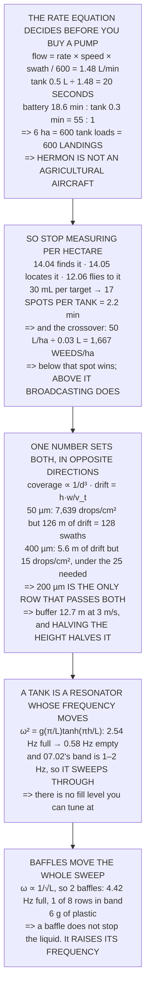

# 17.03 Spray and irrigation payloads: pumps, nozzles, and a moving centre of mass

<!-- glance:start -->
<!-- generated by tools/build.py from curriculum/syllabus.yaml — edit the syllabus, not this block -->

| | |
|---|---|
| **Track** | Main path |
| **Difficulty** | Intermediate |
| **Time** | 1 h 30 min |
| **Hardware** | Payload & delivery pod (stage 4) |
| **Software** | ardupilot |
| **Prerequisites** | [17.01 The payload problem: mass, centre of mass, and what it costs you](17.01-payload-mass-and-com.md) |
| **Skip if** | You can size a spray payload for a given swath and rate, and explain how the emptying tank changes the aircraft in flight. |

<!-- glance:end -->

## What you will learn

- The arithmetic that decides the whole lesson: **the battery lasts 18.6 minutes and the tank lasts
  20 seconds** — a ratio of 55 : 1
- That one tank covers **100 m²**, so 12.02's survey is **600 landings and 600 battery changes** for
  one pass
- That Hermon is therefore **not an agricultural aircraft**, and what it *is*: **17 spots per tank**
- The crossover nobody computes: spot treatment beats broadcasting **below 1,667 weeds per hectare**
  and loses above it
- That droplet size runs everything, and **only one row satisfies both coverage and drift**: 200 µm
  at 119 drops/cm² and 12.7 m
- That a very fine droplet in a light breeze drifts **126 m — 128 swaths** — which is a category
  error, not a margin
- That **the cheapest drift control is altitude**
- And the result that matters in flight: **a draining tank sweeps its slosh resonance straight
  through the control band**, and baffles move the whole sweep rather than chase it

## Why it matters

Spraying is the application people reach for first when they think of drones doing useful work, and
it is the one where the arithmetic is most brutal and least often done. The rate equation is fifty
years old, it does not care what is carrying the nozzle, and it answers "can this aircraft spray a
field" in one line — before anybody has bought a pump.

The answer for Hermon is no, decisively, and knowing that is worth more than a working sprayer,
because it points at the mission that *does* fit: spot treatment, which is the payoff for every
vision lesson in module 14. A 0.5-litre tank is useless per hectare and genuinely valuable per
target.

Then there are two pieces of physics that any liquid payload brings with it whatever the mission.
Droplet size is a single number that sets both coverage and drift in opposite directions, with
exactly one usable answer. And a tank is a resonator whose frequency **changes as it empties**,
which is a problem no solid payload has.

> [!WARNING]
> Agricultural chemicals are regulated, toxic and frequently require a licence to apply — and the
> drift figures in Level 4 mean the aircraft can put them well outside the field you are standing
> in. Check what applies where you fly before any chemical goes in the tank, use water for every
> test flight in this lesson, and treat the buffer distance as a hard boundary on the plan rather
> than a guideline.

## Prerequisites

<!-- prereqs:start -->
## Prerequisites

You need these first:

- [17.01 The payload problem: mass, centre of mass, and what it costs you](17.01-payload-mass-and-com.md)

### Optional prerequisite links

None.

Check your readiness: `python course.py why 17.03`
<!-- prereqs:end -->

## Concept

A spray payload is a rate problem before it is anything else. The agricultural rate equation —
`flow = rate × speed × swath / 600` — connects what you want on the crop to what the pump must
deliver, and dividing the tank by that flow gives the number that decides whether the aircraft is
viable at all. On a small multirotor that number is shockingly small, and it is small for a reason
that no amount of engineering will move: the tank scales with mass and the coverage scales with
area.

The way out is to stop measuring per hectare. If the payload is targeted rather than broadcast, the
consumption is per *target*, and a small tank holds a useful number of targets. That is a different
mission with a different economics, and there is a crossover density where it stops being the
better choice.

The second idea is the droplet. Coverage goes as one over diameter cubed, because a fixed volume of
liquid splits into vastly more small droplets than large ones. Drift goes the other way, as one over
the settling speed, which rises with diameter. Both are functions of the same number, they pull in
opposite directions, and the usable window is narrow.

And the third is the one that surprises people who have only carried solid payloads: the liquid has
its own resonance, that resonance depends on the depth, and the depth is changing throughout the
flight. You cannot tune for it. You can only move it.

## Technical explanation

### Level 1 — the arithmetic that decides what this lesson is about

Hermon's disc span is `2 × 0.1591 × √2 + 0.254` = 0.704 m, and a multirotor's swath is about 1.4×
that because the downwash carries the spray outward: **0.99 m**.

```
flow (L/min) = rate (L/ha) × speed (km/h) × swath (m) / 600
at 50 L/ha and 12.02's 5 m/s (18.0 km/h):
flow = 50 × 18.0 × 0.99 / 600 = 1.48 L/min
```

And Hermon's tank is 0.5 litres.

| | |
|---|---|
| the battery lasts | 18.6 min |
| **the tank lasts** | **0.3 min (20.3 s)** |
| ratio | **55 : 1** |

**One tank covers 100 square metres.** 12.02's 300 × 200 m survey is 6 ha, which is 600 tank loads —
and since you cannot refill in the air, **600 landings and 600 battery changes, for one pass over
one field**.

So Hermon is not an agricultural aircraft, and the arithmetic says so in one line. Machines that
spray fields carry 10 to 30 litres, weigh 25 kg and cost what a car costs, and **every one of them
exists because of that 55 : 1 ratio**.

Which is worth doing before buying a pump rather than after.

### Level 2 — so what is a 0.5 litre tank for? Spot treatment

Turn the problem around. Broadcast spraying loses because the rate is per **hectare**. Spot
treatment is per **target**, and the whole rest of this course has been building the thing that
finds targets:

| | |
|---|---|
| 14.04's detector finds the weed | on the image |
| 14.05 geolocates it | 7.03 m budget |
| 14.05's rangefinder tightens it | to ~1 m |
| 12.06's mission flies to it | and holds |
| this lesson sprays it | 30 mL |

0.5 L / 30 mL = **17 spots per tank**. At 3 s of hover per spot plus 25 m of transit at 5 m/s that
is 8 s each and **2.2 minutes for the tank**, which now sits *inside* the 18.6 minutes of battery
instead of 55 times outside it.

And there is an honest limit, worth knowing before selling anybody on it. Spot treatment uses 30 mL
per **weed**, whatever the field size; broadcasting uses 50 L per **hectare**, whatever the weeds.
They cross over at exactly one density:

```
50 L/ha ÷ 0.030 L per weed = 1,667 WEEDS PER HECTARE
```

Below that, the spot mission uses less chemical. Above it, broadcasting does, and every hour spent
hovering over individual plants is wasted. A lightly infested field runs 50–500 per hectare, so the
spot mission wins by 33 times down to 3 — **and a badly infested one does not**, which is a sentence
worth saying out loud to a customer who has not counted.

### Level 3 — droplet size: coverage

A nozzle's droplet size sets two things that pull opposite ways, and nothing else about the sprayer
matters as much. Settling speed comes from the drag law rather than from Stokes, because a 100 µm
droplet is already past Stokes' Re < 1:

| BCPC class | d (µm) | v_t (m/s) | Re | drops/cm² |
|---|---|---|---|---|
| very fine | 50 | 0.071 | 0.24 | 7,639 |
| fine | 100 | 0.249 | 1.65 | 955 |
| **medium** | **200** | **0.709** | **9.40** | **119** |
| coarse | 400 | 1.615 | 42.84 | **15** |
| very coarse | 600 | 2.428 | 96.57 | **4** |
| extremely coarse | 1,000 | 3.870 | 256.59 | **1** |

A contact herbicide needs roughly **25 droplets per cm²** to work; a systemic one is happy with 15.
Below that, the chemical is on the leaf in the wrong pattern and does nothing — and coarse, very
coarse and extremely coarse are all under it.

**Coverage goes as 1/d³**, which is brutal: doubling the droplet divides the count by eight.

### Level 4 — droplet size: drift, and it is not subtle

A droplet falls at v_t and the wind carries it sideways the whole time: `drift = h·w / v_t`. At 3 m
above the crop:

| droplet | v_t | 1 m/s | 3 m/s | 5 m/s |
|---|---|---|---|---|
| very fine (50 µm) | 0.071 | 42.1 m | **126.2 m** | 210.4 m |
| fine (100 µm) | 0.249 | 12.1 m | 36.2 m | 60.3 m |
| medium (200 µm) | 0.709 | 4.2 m | 12.7 m | 21.2 m |
| coarse (400 µm) | 1.615 | 1.9 m | 5.6 m | 9.3 m |
| very coarse (600 µm) | 2.428 | 1.2 m | 3.7 m | 6.2 m |
| extremely coarse (1,000 µm) | 3.870 | 0.8 m | 2.3 m | 3.9 m |

**A very fine droplet in a 3 m/s breeze drifts 126 metres** — 128 swaths sideways. It does not land
in the field at all, and it is most of the way across 16.05's 470 m of crewed ground. **Fine spray is
not a margin problem, it is a category error**: you are not spraying, you are releasing an aerosol
and hoping.

So the two columns meet in the middle, and exactly one row satisfies both:

| droplet | drops/cm² | drift @ 3 m/s | verdict |
|---|---|---|---|
| very fine (50 µm) | 7,639 | 126.2 m | drifts |
| fine (100 µm) | 955 | 36.2 m | drifts |
| **medium (200 µm)** | **119** | **12.7 m** | **BOTH** |
| coarse (400 µm) | 15 | 5.6 m | no cover |
| very coarse (600 µm) | 4 | 3.7 m | no cover |
| extremely coarse (1,000 µm) | 1 | 2.3 m | no cover |

**200 microns is the answer**, for the same reason it is on every sprayer ever built: it is the
coarsest droplet that still covers, and coarse is what does not drift.

And the number that goes in the site survey: at 200 µm and 3 m, the buffer to anything you must not
spray is **4.2 m at 1 m/s, 12.7 m at 3 m/s, 21.2 m at 5 m/s**. That is a line on 12.02's plan and a
row in 16.05's bowtie, not a rule of thumb. And it scales with height — fly at 1.5 m and it halves.
**The cheapest drift control is altitude.**

### Level 5 — slosh: the resonance sweeps through your control band

17.01 did the slow version: the tank empties, the CoM climbs, the inertia falls. This is the fast
version. The liquid's free surface has its own mode, `ω² = g(π/L)·tanh(πh/L)`, and it is not slow at
all. Hermon's tank is 120 × 70 × 100 mm and 07.02's attitude loop lives between 1.0 and 2.0 Hz:

| fill | depth | slosh | vs the band |
|---|---|---|---|
| 100 % | 100.0 mm | 2.54 Hz | above |
| 85 % | 85.0 mm | 2.52 Hz | above |
| 70 % | 70.0 mm | 2.49 Hz | above |
| 55 % | 55.0 mm | 2.41 Hz | above |
| 40 % | 40.0 mm | 2.25 Hz | above |
| **25 %** | **25.0 mm** | **1.93 Hz** | **\*\*\* IN BAND \*\*\*** |
| **10 %** | **10.0 mm** | **1.29 Hz** | **\*\*\* IN BAND \*\*\*** |
| 2 % | 2.0 mm | 0.58 Hz | below |

**There is no fill level you can tune at, because the tank does not stay at one.** It starts at
2.54 Hz, ends at 0.58 Hz, and on the way down it sweeps straight through the control band — two of
the eight rows are inside it.

That is 14.03's lesson arriving in a completely different part. An isolator is a resonator, and so
is a tank. You cannot choose a frequency that is always safe, because the frequency moves. What you
can do is **move the whole sweep**.

### Level 6 — baffles: move the sweep, do not chase it

The slosh frequency goes as 1/√L, so dividing the tank raises every point of the sweep at once:

| tank | L | full | empty | in band |
|---|---|---|---|---|
| no baffles | 120 mm | 2.54 Hz | 0.58 Hz | 2 of 8 |
| 1 baffle | 60 mm | 3.61 Hz | 1.17 Hz | 1 of 8 |
| **2 baffles** | **40 mm** | **4.42 Hz** | **1.74 Hz** | **1 of 8** |
| 4 baffles | 24 mm | 5.70 Hz | 2.89 Hz | 0 of 8 |

Two baffles put the full tank at 4.42 Hz, clear above the band, and the aircraft only meets the band
at the very end when there is almost nothing left to slosh. That is the whole fix, it weighs about
6 g of the 81 g budget, and it is two pieces of plastic.

**A baffle is not there to stop the liquid moving.** It is there to raise the frequency at which the
liquid moves, out of the band where the controller will argue with it. Stopping the liquid is
impossible; moving its resonance is two pieces of plastic.

The build sheet that follows:

| | |
|---|---|
| nozzle | 200 µm, one, under the CoM |
| flow | 1.48 L/min at the 50 L/ha equivalent |
| pump | diaphragm, 1.5× the flow so it can be throttled |
| tank | 500 mL, 2 baffles, filled from the top |
| spray height | 3.0 m, and the buffer is 12.7 m at 3 m/s |
| **the interlock** | **no flow unless ARMED and above 1 m** |

The last row is 17.02's safe-arm argument again, and it matters more here: a release drops one pod
once, and **a pump that runs on the ground empties the whole tank onto the crew's boots**.

> [!TIP]
> **Ask your teacher:** "What is your nozzle's actual volume median diameter at your actual
> pressure?" Nozzle charts are per pressure, and most people run a nozzle rated 200 µm at a pressure
> that makes it 120 µm — which Level 4 says triples the drift.

## Diagram



## Code

The spray payload end to end: the rate equation and the 55 : 1 verdict, the spot mission and its
weed-density crossover, an iterated Schiller–Naumann settling speed for droplets past Stokes'
range, the coverage and drift tables that intersect at one row, the slosh mode swept across fill
level against 07.02's control band, and the baffle count that moves the sweep clear of it.

```python
"""17.03 -- a spray payload: rate, swath, droplet size, drift, and slosh.

Pure stdlib. The tank is 17.01's 500 g one; the aircraft is Hermon.

The first section answers a question nobody asks before buying a pump,
and the answer decides what the rest of the lesson is about.
"""

import math

G = 9.81
RHO_W = 1000.0            # kg/m3, water
RHO_A = 1.20              # kg/m3, air at 20 C
MU_A = 1.81e-5            # Pa s, air

# ---- Hermon (17.01, references/hermon-numbers.md) -----------------------
ARM_M = 0.1591
PROP_D_M = 0.254          # 10 inch
ENDUR_POD_MIN = 18.6      # 17.01, carrying 500 g
SURVEY_MS = 5.0           # 12.02's survey speed

TANK_L = 0.50             # litres -- 17.01's 500 g payload, as water
TANK_LEN_M = 0.12         # the long axis of the tank
TANK_WID_M = 0.07
TANK_DEPTH_M = 0.10

# 07.02's attitude loop, as a band rather than a single number
CTRL_LO_HZ = 1.0
CTRL_HI_HZ = 2.0

BAR = "=" * 70


def head(n, title):
    print()
    print(BAR)
    print("%d. %s" % (n, title))
    print(BAR)


# ------------------------------------------------------------------------
def terminal_velocity(d_m):
    """Settling speed of a water droplet in still air.

    Stokes is only valid below Re ~ 1, and a 100 um droplet is already
    past that, so iterate on the Schiller-Naumann drag law instead. Pure
    fixed-point iteration; it converges in a handful of steps for every
    size in this lesson.
    """
    if d_m <= 0:
        raise ValueError("droplet diameter must be positive")
    v = RHO_W * d_m * d_m * G / (18.0 * MU_A)     # Stokes, as a first guess
    for _ in range(200):
        re = RHO_A * v * d_m / MU_A
        if re < 1e-6:
            cd = 1e6
        else:
            cd = 24.0 / re * (1.0 + 0.15 * re ** 0.687)
        v_new = math.sqrt(4.0 * RHO_W * G * d_m / (3.0 * RHO_A * cd))
        if abs(v_new - v) < 1e-9:
            v = v_new
            break
        v = 0.5 * (v + v_new)                      # damped, so it settles
    return v


def slosh_hz(fill_frac, length_m=TANK_LEN_M, depth_m=TANK_DEPTH_M):
    """First sloshing mode of a rectangular tank, liquid depth h.

    w^2 = g (pi/L) tanh(pi h / L). Below about 1 % fill the mode is not
    meaningful, so clamp rather than return a bogus small number.
    """
    h = max(fill_frac, 0.01) * depth_m
    k = math.pi / length_m
    w = math.sqrt(G * k * math.tanh(k * h))
    return w / (2.0 * math.pi)


def droplets_per_cm2(rate_l_ha, d_m):
    """How many droplets land on a square centimetre at this rate."""
    vol_per_cm2 = rate_l_ha * 1e-3 / 1e4 / 1e4     # m3 of liquid per cm2
    vol_drop = math.pi / 6.0 * d_m ** 3
    return vol_per_cm2 / vol_drop


# ========================================================================
head(1, "FIRST, THE ARITHMETIC THAT DECIDES WHAT THIS LESSON IS ABOUT")

span_m = 2 * ARM_M * math.sqrt(2) + PROP_D_M
swath_m = 1.4 * span_m
print("  Hermon's disc span, motor to motor plus a prop:")
print("    2 x %.4f x sqrt(2) + %.3f = %.3f m" % (ARM_M, PROP_D_M, span_m))
print("  and a multirotor's swath is about 1.4 x that, because the")
print("  downwash carries the spray outward:")
print("    SWATH = %.2f m" % swath_m)
print()

RATE_L_HA = 50.0
speed_kmh = SURVEY_MS * 3.6
flow_l_min = RATE_L_HA * speed_kmh * swath_m / 600.0
print("  The agricultural rate equation, which has not changed in fifty")
print("  years and does not care what is carrying the nozzle:")
print("      flow (L/min) = rate (L/ha) x speed (km/h) x swath (m) / 600")
print()
print("  At a modest %.0f L/ha and 12.02's %.0f m/s (%.1f km/h):"
      % (RATE_L_HA, SURVEY_MS, speed_kmh))
print("      flow = %.0f x %.1f x %.2f / 600 = %.2f L/min"
      % (RATE_L_HA, speed_kmh, swath_m, flow_l_min))
print()
tank_s = TANK_L / flow_l_min * 60.0
print("  AND HERMON'S TANK IS %.1f LITRES." % TANK_L)
print("      %.2f L / %.2f L/min = %.1f SECONDS OF SPRAYING."
      % (TANK_L, flow_l_min, tank_s))
print()
print("  %-38s %10s" % ("the battery lasts", "%.1f min" % ENDUR_POD_MIN))
print("  %-38s %10s" % ("the tank lasts", "%.1f min" % (tank_s / 60.0)))
print("  %-38s %10.0f : 1" % ("ratio", ENDUR_POD_MIN / (tank_s / 60.0)))
print()
area_per_tank = TANK_L / RATE_L_HA * 1e4
print("  ONE TANK COVERS %.0f SQUARE METRES." % area_per_tank)
survey_ha = 300.0 * 200.0 / 1e4
print("  12.02's %.0f x %.0f m survey is %.0f ha, which is %.0f TANK"
      % (300, 200, survey_ha, survey_ha * RATE_L_HA / TANK_L))
print("  LOADS -- and since you cannot refill in the air, %.0f LANDINGS"
      % math.ceil(survey_ha * RATE_L_HA / TANK_L))
print("  AND %.0f BATTERY CHANGES, for ONE PASS over one field."
      % math.ceil(survey_ha * RATE_L_HA / TANK_L))
print()
print("  SO: HERMON IS NOT AN AGRICULTURAL AIRCRAFT, AND THE ARITHMETIC")
print("  SAYS SO IN ONE LINE. Machines that spray fields carry %.0f to"
      % 10)
print("  30 litres, weigh 25 kg and cost what a car costs, and every one")
print("  of them exists because of the %.0f : 1 ratio above."
      % (ENDUR_POD_MIN / (tank_s / 60.0)))
print()
print("  WHICH IS WORTH DOING BEFORE BUYING A PUMP, NOT AFTER. The")
print("  question 'what do I need to spray a field' has a hard answer")
print("  and it is a different aircraft.")

# ========================================================================
head(2, "SO WHAT IS A 0.5 LITRE TANK ACTUALLY FOR? SPOT TREATMENT.")

SPOT_ML = 30.0
print("  Turn the problem around. Broadcast spraying loses because the")
print("  rate is per HECTARE. Spot treatment is per TARGET, and the")
print("  whole rest of this course has been building the thing that")
print("  finds targets.")
print()
print("  %-34s %14s" % ("14.04's detector finds the weed", "on the image"))
print("  %-34s %14s" % ("14.05 geolocates it", "7.03 m budget"))
print("  %-34s %14s" % ("14.05's rangefinder tightens it", "to ~1 m"))
print("  %-34s %14s" % ("12.06's mission flies to it", "and holds"))
print("  %-34s %14s" % ("this lesson sprays it", "%.0f mL" % SPOT_ML))
print()
spots = TANK_L * 1000.0 / SPOT_ML
print("  %.1f L / %.0f mL = %.0f SPOTS PER TANK." % (TANK_L, SPOT_ML, spots))
hover_s = 3.0
transit_m = 25.0
per_spot_s = hover_s + transit_m / SURVEY_MS
print("  At %.0f s of hover per spot plus %.0f m of transit at %.0f m/s,"
      % (hover_s, transit_m, SURVEY_MS))
print("  that is %.0f s each and %.1f min for the tank -- which now"
      % (per_spot_s, spots * per_spot_s / 60.0))
print("  SITS INSIDE the %.1f min of battery instead of %.0f times"
      % (ENDUR_POD_MIN, ENDUR_POD_MIN / (tank_s / 60.0)))
print("  outside it.")
print()
print("  AND THERE IS AN HONEST LIMIT TO IT, WHICH IS WORTH KNOWING")
print("  BEFORE YOU SELL ANYBODY ON IT. Spot treatment uses %.0f mL per"
      % SPOT_ML)
print("  WEED, whatever the field size. Broadcasting uses %.0f L per"
      % RATE_L_HA)
print("  HECTARE, whatever the weeds. So they cross over at one weed")
print("  density and one only:")
crossover = RATE_L_HA / (SPOT_ML / 1000.0)
print("      %.0f L/ha / %.3f L per weed = %.0f WEEDS PER HECTARE"
      % (RATE_L_HA, SPOT_ML / 1000.0, crossover))
print()
print("  BELOW %.0f weeds/ha the spot mission uses less chemical."
      % crossover)
print("  ABOVE it, broadcasting uses less, and every hour Hermon spends")
print("  hovering over individual plants is wasted.")
print("  A lightly infested field runs 50 to 500 per hectare, so the")
print("  spot mission wins by %.0f times down to %.0f -- and a badly"
      % (crossover / 50, crossover / 500))
print("  infested one does not, which is a sentence worth saying out")
print("  loud to a customer who has not counted.")
print()
print("  EVERY NUMBER FROM HERE ON IS FOR THE SPOT MISSION.")

# ========================================================================
head(3, "DROPLET SIZE: THE ONE TRADE THAT RUNS THE WHOLE DESIGN")

print("  A nozzle's droplet size sets two things that pull opposite ways,")
print("  and nothing else about the sprayer matters as much.")
print()
print("  Settling speed, from the drag law rather than from Stokes")
print("  (a 100 um droplet is already past Stokes' Re < 1):")
print()
SIZES = [
    ("very fine", 50e-6),
    ("fine", 100e-6),
    ("medium", 200e-6),
    ("coarse", 400e-6),
    ("very coarse", 600e-6),
    ("extremely coarse", 1000e-6),
]
print("  %-20s %8s %10s %10s %12s"
      % ("BCPC class", "d (um)", "v_t (m/s)", "Reynolds", "drops/cm2"))
for label, d in SIZES:
    v = terminal_velocity(d)
    re = RHO_A * v * d / MU_A
    print("  %-20s %8.0f %10.3f %10.2f %12.0f"
          % (label, d * 1e6, v, re, droplets_per_cm2(RATE_L_HA, d)))

print()
COVER_MIN = 25.0
print("  COVERAGE IS THE FIRST COLUMN THAT BITES. A contact herbicide")
print("  needs roughly %.0f droplets per square centimetre to work;" % COVER_MIN)
print("  a systemic one is happy with 15. Below that the chemical is on")
print("  the leaf in the wrong pattern and does nothing.")
print()
for label, d in SIZES:
    n = droplets_per_cm2(RATE_L_HA, d)
    if n < COVER_MIN:
        print("    %s (%.0f um) gives %.0f/cm2 -- UNDER the %.0f needed"
              % (label, d * 1e6, n, COVER_MIN))
print()
print("  AND COVERAGE GOES AS 1/d^3, which is brutal: doubling the")
print("  droplet divides the count by %.0f. From %.0f um to %.0f um is"
      % (8, 200, 400))
print("  a factor of %.1f in count for a factor of 2 in size."
      % (droplets_per_cm2(RATE_L_HA, 200e-6)
         / droplets_per_cm2(RATE_L_HA, 400e-6)))

# ========================================================================
head(4, "DRIFT: THE OTHER HALF OF THE TRADE, AND IT IS NOT SUBTLE")

H_SPRAY_M = 3.0
print("  A droplet falls at v_t and the wind carries it sideways the")
print("  whole time. Over a release height h in a wind w:")
print("      drift = h x w / v_t")
print()
print("  At %.0f m above the crop, which is as low as 12.03's fence and"
      % H_SPRAY_M)
print("  11.02's discipline will comfortably allow:")
print()
WINDS = [1.0, 3.0, 5.0]
print("  %-26s %9s %11s %11s %11s"
      % ("droplet", "v_t m/s", "1 m/s", "3 m/s", "5 m/s"))
for label, d in SIZES:
    v = terminal_velocity(d)
    cells = "".join("%9.1f m" % (H_SPRAY_M * w / v) for w in WINDS)
    print("  %-26s %9.3f%s" % ("%s (%.0f um)" % (label, d * 1e6), v, cells))

print()
v50 = terminal_velocity(50e-6)
d50_drift = H_SPRAY_M * 3.0 / v50
print("  A VERY FINE DROPLET IN A 3 m/s BREEZE DRIFTS %.0f METRES."
      % d50_drift)
print("  That is %.0f swaths sideways -- it does not land in the field"
      % (d50_drift / swath_m))
print("  at all, and it is most of the way across 16.05's %.0f m of"
      % 470)
print("  crewed ground. FINE SPRAY IS NOT A MARGIN PROBLEM. IT IS A")
print("  CATEGORY ERROR: you are not spraying, you are releasing an")
print("  aerosol and hoping.")
print()
print("  SO THE TWO COLUMNS MEET IN THE MIDDLE, AND THERE IS EXACTLY")
print("  ONE ROW THAT SATISFIES BOTH:")
print()
print("  %-26s %11s %13s %10s"
      % ("droplet", "drops/cm2", "drift @3 m/s", "verdict"))
for label, d in SIZES:
    n = droplets_per_cm2(RATE_L_HA, d)
    drift = H_SPRAY_M * 3.0 / terminal_velocity(d)
    ok_cov = n >= COVER_MIN
    ok_drift = drift <= 15.0
    if ok_cov and ok_drift:
        v = "BOTH"
    elif ok_cov:
        v = "drifts"
    elif ok_drift:
        v = "no cover"
    else:
        v = "neither"
    print("  %-26s %11.0f %11.1f m %10s"
          % ("%s (%.0f um)" % (label, d * 1e6), n, drift, v))

print()
print("  %.0f MICRONS IS THE ANSWER, and it is the answer for the same"
      % 200)
print("  reason on every sprayer ever built: it is the coarsest droplet")
print("  that still covers, and coarse is what does not drift.")
print()
print("  AND NOW THE NUMBER THAT GOES IN THE SITE SURVEY:")
print("    at %.0f um and %.0f m, the buffer to anything you must NOT"
      % (200, H_SPRAY_M))
for w in (1.0, 3.0, 5.0):
    print("      spray is %5.1f m in %.0f m/s of wind"
          % (H_SPRAY_M * w / terminal_velocity(200e-6), w))
print("  Which is a line on 12.02's plan and a row in 16.05's bowtie,")
print("  not a rule of thumb. AND IT SCALES WITH HEIGHT: fly at 1.5 m")
print("  and it halves. THE CHEAPEST DRIFT CONTROL IS ALTITUDE.")

# ========================================================================
head(5, "SLOSH: THE RESONANCE SWEEPS THROUGH YOUR CONTROL BAND")

print("  17.01 did the slow version -- the tank empties, the CoM climbs,")
print("  the inertia falls. This is the fast version: the liquid's free")
print("  surface has its own mode, and it is not slow at all.")
print()
print("  For a rectangular tank of length L and liquid depth h:")
print("      w^2 = g (pi/L) tanh(pi h / L)")
print()
print("  Hermon's tank is %.0f x %.0f x %.0f mm, and 07.02's attitude"
      % (TANK_LEN_M * 1000, TANK_WID_M * 1000, TANK_DEPTH_M * 1000))
print("  loop lives between %.1f and %.1f Hz. Watch what happens as it"
      % (CTRL_LO_HZ, CTRL_HI_HZ))
print("  drains:")
print()
print("  %-12s %10s %10s %14s" % ("fill", "depth mm", "slosh Hz", "vs the band"))
for frac in (1.00, 0.85, 0.70, 0.55, 0.40, 0.25, 0.10, 0.02):
    f = slosh_hz(frac)
    if f > CTRL_HI_HZ:
        where = "above"
    elif f < CTRL_LO_HZ:
        where = "below"
    else:
        where = "*** IN BAND ***"
    print("  %-12s %9.1f %10.2f %16s"
          % ("%3.0f %%" % (frac * 100), frac * TANK_DEPTH_M * 1000, f, where))

in_band = [f for f in (1.00, 0.85, 0.70, 0.55, 0.40, 0.25, 0.10, 0.02)
           if CTRL_LO_HZ <= slosh_hz(f) <= CTRL_HI_HZ]
print()
print("  THERE IS NO FILL LEVEL YOU CAN TUNE AT, BECAUSE THE TANK DOES")
print("  NOT STAY AT ONE. It starts at %.2f Hz, ends at %.2f Hz, and"
      % (slosh_hz(1.0), slosh_hz(0.02)))
print("  ON THE WAY DOWN IT SWEEPS STRAIGHT THROUGH THE CONTROL BAND --")
print("  %d of the 8 rows above are inside it." % len(in_band))
print()
print("  THAT IS 14.03's LESSON IN A COMPLETELY DIFFERENT PART: an")
print("  isolator is a resonator, and so is a tank. You cannot choose")
print("  a frequency that is always safe, because the frequency moves.")
print("  What you can do is MOVE THE WHOLE SWEEP.")

# ========================================================================
head(6, "BAFFLES: MOVE THE WHOLE SWEEP, DO NOT CHASE IT")

print("  The slosh frequency goes as 1/sqrt(L), so dividing the tank")
print("  with baffles raises every point of the sweep at once:")
print()
print("  %-24s %9s %10s %10s %12s"
      % ("tank", "L (mm)", "full Hz", "empty Hz", "in band?"))
for label, n_baff in (("no baffles", 1),
                      ("1 baffle", 2),
                      ("2 baffles", 3),
                      ("4 baffles", 5)):
    L = TANK_LEN_M / n_baff
    fs = [slosh_hz(f, L) for f in
          (1.00, 0.85, 0.70, 0.55, 0.40, 0.25, 0.10, 0.02)]
    hits = sum(1 for f in fs if CTRL_LO_HZ <= f <= CTRL_HI_HZ)
    print("  %-24s %9.0f %10.2f %10.2f %9d of 8"
          % (label, L * 1000, fs[0], fs[-1], hits))

print()
L2 = TANK_LEN_M / 3
print("  TWO BAFFLES PUT THE FULL TANK AT %.2f Hz -- CLEAR ABOVE THE"
      % slosh_hz(1.0, L2))
print("  BAND -- and the aircraft only meets the band at the very end,")
print("  when there is almost nothing left to slosh. That is the whole")
print("  fix, it weighs about %.0f g of the %.0f g budget, and it is"
      % (6, 81))
print("  two pieces of plastic.")
print()
print("  AND THE DESIGN RULE THAT GENERALISES: A BAFFLE IS NOT THERE TO")
print("  STOP THE LIQUID MOVING. It is there to raise the frequency at")
print("  which the liquid moves, out of the band where the controller")
print("  will argue with it. Stopping the liquid is impossible; moving")
print("  its resonance is two pieces of plastic.")
print()
print("  THE SIX THINGS THAT GO ON THE BUILD SHEET:")
sheet = [
    ("nozzle", "%.0f um, one, under the CoM" % 200),
    ("flow", "%.2f L/min at %.0f L/ha equivalent" % (flow_l_min, RATE_L_HA)),
    ("pump", "diaphragm, %.1f x the flow, so it can be throttled"
     % 1.5),
    ("tank", "%.0f mL, 2 baffles, filled from the top" % (TANK_L * 1000)),
    ("spray height", "%.1f m, and the buffer is %.1f m at 3 m/s"
     % (H_SPRAY_M, H_SPRAY_M * 3.0 / terminal_velocity(200e-6))),
    ("the interlock", "no flow unless ARMED and above 1 m"),
]
for k, v in sheet:
    print("    %-14s %s" % (k, v))
print()
print("  THE LAST ROW IS 17.02's SAFE-ARM ARGUMENT AGAIN, and it matters")
print("  more here: a release drops one pod once, and a pump that runs")
print("  on the ground empties the whole tank onto the crew's boots.")
```

Output:

```text

======================================================================
1. FIRST, THE ARITHMETIC THAT DECIDES WHAT THIS LESSON IS ABOUT
======================================================================
  Hermon's disc span, motor to motor plus a prop:
    2 x 0.1591 x sqrt(2) + 0.254 = 0.704 m
  and a multirotor's swath is about 1.4 x that, because the
  downwash carries the spray outward:
    SWATH = 0.99 m

  The agricultural rate equation, which has not changed in fifty
  years and does not care what is carrying the nozzle:
      flow (L/min) = rate (L/ha) x speed (km/h) x swath (m) / 600

  At a modest 50 L/ha and 12.02's 5 m/s (18.0 km/h):
      flow = 50 x 18.0 x 0.99 / 600 = 1.48 L/min

  AND HERMON'S TANK IS 0.5 LITRES.
      0.50 L / 1.48 L/min = 20.3 SECONDS OF SPRAYING.

  the battery lasts                        18.6 min
  the tank lasts                            0.3 min
  ratio                                          55 : 1

  ONE TANK COVERS 100 SQUARE METRES.
  12.02's 300 x 200 m survey is 6 ha, which is 600 TANK
  LOADS -- and since you cannot refill in the air, 600 LANDINGS
  AND 600 BATTERY CHANGES, for ONE PASS over one field.

  SO: HERMON IS NOT AN AGRICULTURAL AIRCRAFT, AND THE ARITHMETIC
  SAYS SO IN ONE LINE. Machines that spray fields carry 10 to
  30 litres, weigh 25 kg and cost what a car costs, and every one
  of them exists because of the 55 : 1 ratio above.

  WHICH IS WORTH DOING BEFORE BUYING A PUMP, NOT AFTER. The
  question 'what do I need to spray a field' has a hard answer
  and it is a different aircraft.

======================================================================
2. SO WHAT IS A 0.5 LITRE TANK ACTUALLY FOR? SPOT TREATMENT.
======================================================================
  Turn the problem around. Broadcast spraying loses because the
  rate is per HECTARE. Spot treatment is per TARGET, and the
  whole rest of this course has been building the thing that
  finds targets.

  14.04's detector finds the weed      on the image
  14.05 geolocates it                 7.03 m budget
  14.05's rangefinder tightens it           to ~1 m
  12.06's mission flies to it             and holds
  this lesson sprays it                       30 mL

  0.5 L / 30 mL = 17 SPOTS PER TANK.
  At 3 s of hover per spot plus 25 m of transit at 5 m/s,
  that is 8 s each and 2.2 min for the tank -- which now
  SITS INSIDE the 18.6 min of battery instead of 55 times
  outside it.

  AND THERE IS AN HONEST LIMIT TO IT, WHICH IS WORTH KNOWING
  BEFORE YOU SELL ANYBODY ON IT. Spot treatment uses 30 mL per
  WEED, whatever the field size. Broadcasting uses 50 L per
  HECTARE, whatever the weeds. So they cross over at one weed
  density and one only:
      50 L/ha / 0.030 L per weed = 1667 WEEDS PER HECTARE

  BELOW 1667 weeds/ha the spot mission uses less chemical.
  ABOVE it, broadcasting uses less, and every hour Hermon spends
  hovering over individual plants is wasted.
  A lightly infested field runs 50 to 500 per hectare, so the
  spot mission wins by 33 times down to 3 -- and a badly
  infested one does not, which is a sentence worth saying out
  loud to a customer who has not counted.

  EVERY NUMBER FROM HERE ON IS FOR THE SPOT MISSION.

======================================================================
3. DROPLET SIZE: THE ONE TRADE THAT RUNS THE WHOLE DESIGN
======================================================================
  A nozzle's droplet size sets two things that pull opposite ways,
  and nothing else about the sprayer matters as much.

  Settling speed, from the drag law rather than from Stokes
  (a 100 um droplet is already past Stokes' Re < 1):

  BCPC class             d (um)  v_t (m/s)   Reynolds    drops/cm2
  very fine                  50      0.071       0.24         7639
  fine                      100      0.249       1.65          955
  medium                    200      0.709       9.40          119
  coarse                    400      1.615      42.84           15
  very coarse               600      2.428      96.57            4
  extremely coarse         1000      3.870     256.59            1

  COVERAGE IS THE FIRST COLUMN THAT BITES. A contact herbicide
  needs roughly 25 droplets per square centimetre to work;
  a systemic one is happy with 15. Below that the chemical is on
  the leaf in the wrong pattern and does nothing.

    coarse (400 um) gives 15/cm2 -- UNDER the 25 needed
    very coarse (600 um) gives 4/cm2 -- UNDER the 25 needed
    extremely coarse (1000 um) gives 1/cm2 -- UNDER the 25 needed

  AND COVERAGE GOES AS 1/d^3, which is brutal: doubling the
  droplet divides the count by 8. From 200 um to 400 um is
  a factor of 8.0 in count for a factor of 2 in size.

======================================================================
4. DRIFT: THE OTHER HALF OF THE TRADE, AND IT IS NOT SUBTLE
======================================================================
  A droplet falls at v_t and the wind carries it sideways the
  whole time. Over a release height h in a wind w:
      drift = h x w / v_t

  At 3 m above the crop, which is as low as 12.03's fence and
  11.02's discipline will comfortably allow:

  droplet                      v_t m/s       1 m/s       3 m/s       5 m/s
  very fine (50 um)              0.071     42.1 m    126.2 m    210.4 m
  fine (100 um)                  0.249     12.1 m     36.2 m     60.3 m
  medium (200 um)                0.709      4.2 m     12.7 m     21.2 m
  coarse (400 um)                1.615      1.9 m      5.6 m      9.3 m
  very coarse (600 um)           2.428      1.2 m      3.7 m      6.2 m
  extremely coarse (1000 um)     3.870      0.8 m      2.3 m      3.9 m

  A VERY FINE DROPLET IN A 3 m/s BREEZE DRIFTS 126 METRES.
  That is 128 swaths sideways -- it does not land in the field
  at all, and it is most of the way across 16.05's 470 m of
  crewed ground. FINE SPRAY IS NOT A MARGIN PROBLEM. IT IS A
  CATEGORY ERROR: you are not spraying, you are releasing an
  aerosol and hoping.

  SO THE TWO COLUMNS MEET IN THE MIDDLE, AND THERE IS EXACTLY
  ONE ROW THAT SATISFIES BOTH:

  droplet                      drops/cm2  drift @3 m/s    verdict
  very fine (50 um)                 7639       126.2 m     drifts
  fine (100 um)                      955        36.2 m     drifts
  medium (200 um)                    119        12.7 m       BOTH
  coarse (400 um)                     15         5.6 m   no cover
  very coarse (600 um)                 4         3.7 m   no cover
  extremely coarse (1000 um)           1         2.3 m   no cover

  200 MICRONS IS THE ANSWER, and it is the answer for the same
  reason on every sprayer ever built: it is the coarsest droplet
  that still covers, and coarse is what does not drift.

  AND NOW THE NUMBER THAT GOES IN THE SITE SURVEY:
    at 200 um and 3 m, the buffer to anything you must NOT
      spray is   4.2 m in 1 m/s of wind
      spray is  12.7 m in 3 m/s of wind
      spray is  21.2 m in 5 m/s of wind
  Which is a line on 12.02's plan and a row in 16.05's bowtie,
  not a rule of thumb. AND IT SCALES WITH HEIGHT: fly at 1.5 m
  and it halves. THE CHEAPEST DRIFT CONTROL IS ALTITUDE.

======================================================================
5. SLOSH: THE RESONANCE SWEEPS THROUGH YOUR CONTROL BAND
======================================================================
  17.01 did the slow version -- the tank empties, the CoM climbs,
  the inertia falls. This is the fast version: the liquid's free
  surface has its own mode, and it is not slow at all.

  For a rectangular tank of length L and liquid depth h:
      w^2 = g (pi/L) tanh(pi h / L)

  Hermon's tank is 120 x 70 x 100 mm, and 07.02's attitude
  loop lives between 1.0 and 2.0 Hz. Watch what happens as it
  drains:

  fill           depth mm   slosh Hz    vs the band
  100 %            100.0       2.54            above
   85 %             85.0       2.52            above
   70 %             70.0       2.49            above
   55 %             55.0       2.41            above
   40 %             40.0       2.25            above
   25 %             25.0       1.93  *** IN BAND ***
   10 %             10.0       1.29  *** IN BAND ***
    2 %              2.0       0.58            below

  THERE IS NO FILL LEVEL YOU CAN TUNE AT, BECAUSE THE TANK DOES
  NOT STAY AT ONE. It starts at 2.54 Hz, ends at 0.58 Hz, and
  ON THE WAY DOWN IT SWEEPS STRAIGHT THROUGH THE CONTROL BAND --
  2 of the 8 rows above are inside it.

  THAT IS 14.03's LESSON IN A COMPLETELY DIFFERENT PART: an
  isolator is a resonator, and so is a tank. You cannot choose
  a frequency that is always safe, because the frequency moves.
  What you can do is MOVE THE WHOLE SWEEP.

======================================================================
6. BAFFLES: MOVE THE WHOLE SWEEP, DO NOT CHASE IT
======================================================================
  The slosh frequency goes as 1/sqrt(L), so dividing the tank
  with baffles raises every point of the sweep at once:

  tank                        L (mm)    full Hz   empty Hz     in band?
  no baffles                     120       2.54       0.58         2 of 8
  1 baffle                        60       3.61       1.17         1 of 8
  2 baffles                       40       4.42       1.74         1 of 8
  4 baffles                       24       5.70       2.89         0 of 8

  TWO BAFFLES PUT THE FULL TANK AT 4.42 Hz -- CLEAR ABOVE THE
  BAND -- and the aircraft only meets the band at the very end,
  when there is almost nothing left to slosh. That is the whole
  fix, it weighs about 6 g of the 81 g budget, and it is
  two pieces of plastic.

  AND THE DESIGN RULE THAT GENERALISES: A BAFFLE IS NOT THERE TO
  STOP THE LIQUID MOVING. It is there to raise the frequency at
  which the liquid moves, out of the band where the controller
  will argue with it. Stopping the liquid is impossible; moving
  its resonance is two pieces of plastic.

  THE SIX THINGS THAT GO ON THE BUILD SHEET:
    nozzle         200 um, one, under the CoM
    flow           1.48 L/min at 50 L/ha equivalent
    pump           diaphragm, 1.5 x the flow, so it can be throttled
    tank           500 mL, 2 baffles, filled from the top
    spray height   3.0 m, and the buffer is 12.7 m at 3 m/s
    the interlock  no flow unless ARMED and above 1 m

  THE LAST ROW IS 17.02's SAFE-ARM ARGUMENT AGAIN, and it matters
  more here: a release drops one pod once, and a pump that runs
  on the ground empties the whole tank onto the crew's boots.
```

## Exercise

### Exercise 17.03-E1 — Your own rate arithmetic `[analysis]`

Take your aircraft's swath, your intended speed and a rate from the chemical's own label. Compute
the flow, divide your tank by it, and compare with your endurance. Do this before buying anything.

### Exercise 17.03-E2 — Find your crossover `[analysis]`

Compute the weed density at which spot treatment stops beating broadcasting for your chemical and
your spot volume. Then go and count weeds in a 10 × 10 m square of a real field. Compare.

### Exercise 17.03-E3 — Measure the drift `[flight]`

Fly a single pass over water-sensitive paper laid out perpendicular to the wind at 2 m intervals,
with water only. Find where the deposit actually lands. Compare with Level 4's prediction at your
measured wind and height.

### Exercise 17.03-E4 — Find the slosh band `[flight]`

Fly a gentle pitch doublet at 100 %, 50 % and 20 % fill and read 16.03's tracking-error trace on
each. Find the fill level where the oscillation appears. Then fit baffles and repeat.

## Expected result

**17.03-E1**: expect the tank-to-battery ratio to be somewhere between 20 : 1 and 80 : 1 for any
multirotor under 5 kg, and to be the number that ends the conversation about broadcast spraying.

**17.03-E2**: expect real densities well under 1,667/ha in a managed field and well over it in a
neglected one. The interesting output is that the answer is a property of the *field*, not of the
aircraft.

**17.03-E3**: expect the measured drift to land within a factor of two of the prediction and to be
*further* than predicted, because the real droplet spectrum has a fine tail that the single-number
model does not. That tail is what drift-reduction nozzles exist to remove.

**17.03-E4**: expect the oscillation between 20 % and 35 % fill on an unbaffled tank, and expect it
to go away with two baffles. If it does not, check that the baffles actually reach the bottom —
liquid flows under a baffle that stops short.

## Troubleshooting

**The pump delivers less than its rating.** Head, hose diameter and nozzle back-pressure all take
their cut. Size at 1.5× and throttle down.

**Coverage is patchy at the right flow.** Check the nozzle's actual droplet spectrum at your
pressure, not its nominal rating — Level 3's 1/d³ makes a small error in diameter a large one in
count.

**The deposit lands short of the target.** That is release-to-ground time, the same bias 17.02
described: the droplet takes h/v_t to fall, and the aircraft is moving during it.

**Everything drifts more than predicted.** The fine tail of the spectrum. Use an air-induction or
drift-reduction nozzle, which trades a little coverage for the removal of that tail.

**The aircraft oscillates at one point in every flight.** Level 5. Note the fill level, fit baffles,
and confirm the frequency moved rather than the amplitude.

**Baffles did not help.** They probably do not reach the bottom, or they divide the wrong axis. The
sloshing axis is the long one.

**The pump runs when the aircraft is disarmed.** Same failure class as 17.02's release, with a worse
consequence: gate the pump on armed state *and* on altitude.

**The tank empties faster than the flow rate says.** Check for a siphon — a nozzle below the tank
with the pump off will drain the tank by gravity.

## Common mistakes

- **Buying the pump before doing the rate arithmetic.** It is one line and it decides everything.
- **Quoting a per-hectare rate for a per-target mission.** They are different economics.
- **Ignoring the crossover density.** Above 1,667/ha the spot mission is worse on every axis.
- **Choosing a fine nozzle for coverage.** 126 m of drift is not coverage.
- **Choosing an extremely coarse nozzle for drift.** 1 drop/cm² is not an application.
- **Treating the buffer as advice.** It is a number, and it scales with height.
- **Tuning the aircraft at one fill level.** The resonance moves through your band.
- **Fitting baffles that do not reach the bottom.** The liquid flows under them.
- **Leaving the pump ungated.** A tank onto the crew's boots is worse than a dropped pod.

## Knowledge check

<details>
<summary>What does the rate equation say about Hermon, and why does it end the argument?</summary>

`flow = 50 × 18.0 × 0.99 / 600` = 1.48 L/min, and a 0.5 L tank divided by that is **20.3 seconds**.
The battery lasts 18.6 minutes, so the ratio is 55 : 1. One tank covers 100 m², so 12.02's 6 ha
survey is 600 tank loads — 600 landings and 600 battery changes for one pass. No engineering moves
that; only a bigger aircraft does.
</details>

<details>
<summary>What is a 0.5 litre tank actually good for?</summary>

Spot treatment: 30 mL per target gives **17 spots per tank**, which at 8 s each is 2.2 minutes and
fits comfortably inside the battery. It also makes the whole of module 14 pay off — the detector
finds the target, 14.05 geolocates it, 12.06 flies to it, and this lesson sprays it.
</details>

<details>
<summary>When does spot treatment stop being the better choice?</summary>

At **1,667 weeds per hectare**: 50 L/ha divided by 0.030 L per weed. Below that density the spot
mission uses less chemical; above it, broadcasting does, and the hovering time is wasted. It is a
property of the field, not of the aircraft, so it has to be measured per job.
</details>

<details>
<summary>Why is 200 µm the answer, and what happens either side of it?</summary>

Because it is the only size that passes both tests. Coverage goes as 1/d³, so 400 µm gives 15
drops/cm² — under the 25 a contact herbicide needs. Drift goes as 1/v_t, so 100 µm drifts 36 m and
50 µm drifts 126 m at 3 m/s. 200 µm gives 119 drops/cm² and 12.7 m: the coarsest droplet that still
covers.
</details>

<details>
<summary>Why is a very fine spray "a category error rather than a margin problem"?</summary>

Because 126 m of drift is 128 swaths sideways — the material does not land in the field at all, and
it crosses most of 16.05's 470 m of crewed ground. No buffer distance recovers that; it is not a
spray that went slightly wrong, it is an aerosol release.
</details>

<details>
<summary>What is the cheapest drift control available?</summary>

Altitude. Drift is `h·w/v_t`, linear in height, so flying at 1.5 m instead of 3 m halves the buffer
from 12.7 m to 6.4 m at 3 m/s — no nozzle change, no chemical change, no equipment. Everything else
on the list costs coverage or money.
</details>

<details>
<summary>Why can you not tune an aircraft for a sloshing tank?</summary>

Because the slosh frequency depends on liquid depth and the depth changes all flight:
`ω² = g(π/L)tanh(πh/L)` gives 2.54 Hz full and 0.58 Hz nearly empty. 07.02's control band is 1–2 Hz,
so the resonance **sweeps straight through it** on the way down. There is no fill level to tune at
because the tank does not stay at one — the same shape as 14.03's isolator being a resonator.
</details>

<details>
<summary>What does a baffle actually do?</summary>

It raises the frequency, not the damping. ω ∝ 1/√L, so two baffles cut the effective length from
120 mm to 40 mm and take the full tank from 2.54 Hz to 4.42 Hz — clear above the band — so the
aircraft only meets the band at the very end when there is nothing left to slosh. You cannot stop
the liquid moving; you can move its resonance out of the band for about six grams of plastic.
</details>

## Practical challenge

Build and characterise the spot-spray payload.

1. Do the rate arithmetic for your aircraft and write down the tank-to-battery ratio (E1).
2. Decide the mission it supports, and compute your own crossover density (E2).
3. Choose the nozzle from the coverage-and-drift intersection, at *your* operating pressure.
4. Build the tank with baffles on the long axis, reaching the bottom, and weigh it against the
   budget.
5. Gate the pump on armed state and altitude, and test that gate before any liquid goes in.
6. Measure the drift with water-sensitive paper (E3) and write the buffer onto 12.02's plan.
7. Find the slosh band before and after baffles (E4).
8. Add the buffer, the interlock and the drift figure to 16.05's bowtie as a new threat and a new
   consequence.

Step 1 is the one that saves the most time, and it takes about ninety seconds.

## You can skip this if

You can size a spray payload for a given swath and rate, and explain how the emptying tank changes
the aircraft in flight. "How" means with a frequency, not an adjective.

## Go deeper

- The BCPC droplet-size classification and the spray-quality tables that Level 3's categories come
  from, published by the British Crop Production Council: <https://www.bcpc.org/>
- The University of Nebraska's Pesticide Application Technology Laboratory publishes measured
  droplet spectra and drift data for named nozzles, which is the right way to get your own numbers:
  <https://pat.unl.edu/>
- Ibrahim and Abramson's *Liquid Sloshing Dynamics* is the standard reference for the tank modes in
  Level 5; NASA's monograph on propellant slosh is the freely available equivalent:
  <https://ntrs.nasa.gov/citations/19700022255>

**Version-sensitive:** pesticide application rules, licensing and permitted drift buffers differ by
country and change regularly, and rules specific to unmanned application are newer than most of the
others. Confirm what applies where you fly before relying on any figure in this lesson operationally.

## Progress checkpoint

You can now decide in one line whether an aircraft can spray at all, reframe a small tank into the
mission it actually supports, compute the crossover where that reframing stops paying, pick a
droplet size from the intersection of coverage and drift, turn that into a buffer distance for the
plan, and recognise a sloshing tank as a resonance that moves rather than a mass that wobbles.

Next, 17.04 takes the solid pod back and asks what happens in the two seconds after it leaves.

