# 17.04 Release dynamics: the upset when the mass leaves

<!-- glance:start -->
<!-- generated by tools/build.py from curriculum/syllabus.yaml — edit the syllabus, not this block -->

| | |
|---|---|
| **Track** | Main path |
| **Difficulty** | Advanced |
| **Time** | 1 h 30 min |
| **Hardware** | Payload & delivery pod (stage 4) |
| **Software** | python |
| **Prerequisites** | [17.02 Release mechanisms: servo, magnet, pin](17.02-release-mechanisms.md)<br>[07.04 Attitude loops: holding an angle](../07-control/07.04-attitude-loops.md) |
| **Skip if** | You can predict and then measure Hermon's altitude and attitude transient at release, and keep it inside a stated limit. |

<!-- glance:end -->

## What you will learn

- That the controller believes **a throttle, not a mass**, so it only finds out by watching the
  aircraft climb
- That the balloon everybody fears is **15 cm** on Hermon, and why "the controller is fast" is not
  the reason
- That **the proportional term cannot act at the instant of release** — the velocity error is
  exactly zero — so the balloon is an integrator-unwind time with a proportional lid on it
- That feedforward takes 15 cm to **1 cm**, and that 17.02's 85.5 ms turns the residue into a **dip
  instead of a climb**
- That the feedforward is only as good as the mass in it: **20 % wrong is 0.34 m/s² of residual**
- **The number nobody mentions**: a 15 cm-offset release is **1,561 °/s², 8.3× a motor failure**
- That the right integrator action is not "reset" but **step it by exactly what you removed** — a
  blind zero throws away the wind trim and leaves 0.34° of lean
- And that after the step **the aircraft is a different aircraft**: a 500 g release raises the
  vertical loop gain 34 % and drops its damping 14 %

## Why it matters

A release is the only moment in a flight when the aircraft's mass properties change
discontinuously, and every controller in it was tuned on the assumption that they do not. What
happens in the next two seconds is entirely determined by things you already know — the payload's
mass, where it hung, and how long the mechanism takes — which makes this one of the few transients
in the whole course that is genuinely predictable in advance.

Which is the point. A disturbance you can predict is not a disturbance; it is a feedforward term
you have not written yet. The lesson's main result is that one line of arithmetic at the moment of
release does more than any amount of gain tuning, and that turning gains up to fight it is how you
buy an oscillation for the rest of the flight.

The second result is a reversal. The vertical transient is the one everybody worries about and on
this aircraft it is 15 centimetres. The pitch transient is the one nobody mentions and it is
**eight times a motor failure** — and it is set by where the pod hung, not by how heavy it was.

> [!WARNING]
> Every release test in this lesson changes the aircraft's mass in flight, and the first one on a
> new mechanism is the one most likely to misbehave. Do the whole ladder in Level 6 in order, over
> open ground, at an altitude that leaves recovery room, with the payload made of something soft.
> Never test a release for the first time at the low altitude a real drop uses.

## Prerequisites

<!-- prereqs:start -->
## Prerequisites

You need these first:

- [17.02 Release mechanisms: servo, magnet, pin](17.02-release-mechanisms.md)
- [07.04 Attitude loops: holding an angle](../07-control/07.04-attitude-loops.md)

### Optional prerequisite links

None.

Check your readiness: `python course.py why 17.04`
<!-- prereqs:end -->

## Concept

At the instant the pod leaves, nothing about the aircraft has changed except the mass. The thrust
is whatever it was a millisecond ago, because nothing has told it otherwise — and that is the heart
of the problem. A flight controller does not hold a model of your aircraft's mass. It holds a
learned *hover throttle*, and that number is now wrong by the payload's share.

The loop finds out the only way it can: by watching the aircraft climb. Which means the size of the
transient is set not by how fast the controller is but by how quickly the one term that can cancel
a constant offset — the integrator — can unwind. Proportional terms cannot cancel constants; they
can only trade them for a steady error, and at the instant of release there is no error at all for
them to see.

So the fix is not in the loop. The release command already exists and it already knows the payload
mass, so it can step the learned hover throttle at the same moment. That turns a disturbance into a
known input, and the only thing standing between you and a perfect cancellation is the gap between
commanding the release and the mass actually leaving — which 17.02 measured.

The same story runs one level up in pitch, with a much larger number, because the moment an offset
pod applies is also held by an integrator. And the rule that falls out of both is not "reset the
integrator" — it is *step it by exactly what you removed*, because the integrator is holding other
things too.

## Technical explanation

### Level 1 — the step, before any controller is involved

| | |
|---|---|
| mass before | 1.700 kg |
| mass after | 1.450 kg |
| hover throttle it had **learned** | 0.3104 |
| hover throttle it now **needs** | 0.2648 |
| excess thrust | 2.45 N |
| **initial upward acceleration** | **1.69 m/s² = 0.17 g** |

A sixth of gravity, upward, for as long as the controller takes to notice — and "notice" is the
whole question. The sensors see it immediately, so it is not a detection problem. It is a problem
about **what the controller believes**.

And what a flight controller believes is a **throttle, not a mass**. It learned 0.3104 in the hover
before the drop, and 0.3104 is now 2.45 N too much. Nothing in the loop knows the mass changed; the
loop only finds out by watching the aircraft climb.

### Level 2 — so how high does it go? Less than you think, for a reason

Simulating 07.04's vertical loop — a position P into a velocity PI into a throttle — with nothing
told about the release: **peak balloon 0.15 m, peak at 1.00 s**.

Fifteen centimetres. That is the honest answer and it is not the dramatic one. But *why* it is small
matters, because the reason is not "the controller is fast":

| | P | I | peak m | vs tuned |
|---|---|---|---|---|
| as tuned | 0.100 | 0.200 | 0.147 | 1.00× |
| P doubled | 0.200 | 0.200 | 0.093 | 0.63× |
| P halved | 0.050 | 0.200 | 0.212 | 1.44× |
| P ×4 | 0.400 | 0.200 | 0.059 | 0.40× |
| I doubled | 0.100 | 0.400 | 0.098 | 0.67× |
| I halved | 0.100 | 0.100 | 0.205 | 1.40× |
| I ×4 | 0.100 | 0.800 | 0.061 | 0.42× |

Both columns move it, and the P column moves it for a reason worth being precise about, because the
usual story is wrong. **The proportional term cannot act at the instant of release**: P acts on the
*velocity error*, and at that instant the velocity error is exactly zero. There is nothing for it to
see until the aircraft has already begun to climb.

P then limits how far the climb gets. But the thrust offset is **constant**, and a proportional term
cannot cancel a constant — it can only trade it for a steady error. **The only term that can remove
it is the integrator, and an integrator is slow by construction.**

So the balloon is an integrator-unwind time with a proportional lid on it. Turning either up to fix
it is how you get 07.05's oscillation for the rest of the flight — and both of them are fighting a
disturbance **that you commanded**.

### Level 3 — the fix is not a gain, it is telling the controller

Have the release command also step the learned hover throttle by the payload's share:

```
thr_hover -= m_pod · g / T_total = 0.0457
```

And now 17.02 arrives, because **the command and the event are not the same moment**. 17.02 measured
85.5 ms between them. Feed forward on the command and the aircraft is heavy *and* under-thrusted for
those 85.5 ms: it sags first, then climbs.

| | climb | dip | worst |
|---|---|---|---|
| no feedforward | 0.147 m | 0.000 m | **0.147 m** |
| feedforward at the **command** | 0.010 m | −0.019 m | **0.019 m** |
| feedforward at the **mass** (ideal) | 0.000 m | 0.000 m | **0.000 m** |
| feedforward, delay 50 % wrong | 0.005 m | −0.010 m | 0.010 m |

Even the naive version — firing at the command, 85.5 ms early — takes 15 cm down to 2 cm, and the
residue is a *dip* rather than a climb. Delaying it by 17.02's measured 85.5 ms removes it entirely.

**That is why 17.02's test 6 exists.** The feedforward's delay is a number you must measure on your
own mechanism, and it is the same measurement 17.05 needs for the release lead. Taken once.

The general shape is worth keeping: **a known disturbance is not a disturbance**. It is a
feedforward term you declined to write. Feedback exists for what you cannot predict, and the pod
leaving is the most predictable event in the flight — *because you commanded it*.

And the caveat that makes it honest — the feedforward is only as good as the mass you put into it:

| pod mass error | residual | residual accel | climb |
|---|---|---|---|
| 0 % | 0.00 N | 0.00 m/s² | 0.000 m |
| 10 % | 0.25 N | 0.17 m/s² | 0.015 m |
| 20 % | 0.49 N | 0.34 m/s² | 0.029 m |
| 50 % | 1.23 N | 0.85 m/s² | 0.074 m |
| 100 % | 2.45 N | 1.69 m/s² | 0.147 m |

**Weigh the pod.** The feedforward is the one place in this course where a kitchen scale is a
control gain.

### Level 4 — the pitch kick: the same story, with a much worse number

17.01 showed that an offset pod costs pitch authority to hold still. The pitch **integrator** is
what holds it — and at release the moment vanishes and the integrator does not. (The aircraft is
also holding 0.050 N·m of 11.04's wind lean throughout, which matters in a moment.)

| mount offset | moment | peak pitch | peak accel | vs 16.04 |
|---|---|---|---|---|
| at the CoM | 0.000 N·m | 0.01° | 0 °/s² | 0.0× |
| 2 cm forward | 0.049 N·m | 1.44° | 208 °/s² | 1.1× |
| 5 cm forward | 0.123 N·m | 3.58° | 520 °/s² | 2.8× |
| 10 cm forward | 0.245 N·m | 7.15° | 1,041 °/s² | 5.5× |
| **15 cm, on a boom** | **0.368 N·m** | **10.72°** | **1,561 °/s²** | **8.3×** |

**Releasing an offset payload is a harder transient than losing a motor** — and it is one you fire
deliberately, several times a flight, near the ground, on purpose.

The attitude *excursion* is modest, 10.7° at 15 cm, because 07.05's loop is fast and the moment is
gone. The *acceleration* is what shakes the airframe, the camera mount and 14.03's isolator, and it
is what 16.03's log will show.

The same fix works one level up — but not the obvious version of it:

| offset | unwind | **zero** it | **step** it | settled attitude |
|---|---|---|---|---|
| 2 cm forward | 208 °/s² | 212 °/s² | 0 °/s² | zero: 0.34° |
| 5 cm forward | 520 °/s² | 214 °/s² | 0 °/s² | zero: 0.34° |
| 15 cm, on a boom | 1,561 °/s² | 219 °/s² | 0 °/s² | step: −0.01° |

Only the last column kills it. A blind zero caps the kick at whatever the *wind* trim was worth —
about 215 °/s², whatever the offset — and does nothing at all at small offsets.

**Zeroing the integrator throws away everything it was holding.** The vertical integrator was
holding one thing, the payload's weight, so a computed step is exact. The pitch integrator is
holding the payload's moment **and** 11.04's wind **and** every build asymmetry, and a blind zero
discards all three: the aircraft stops kicking and starts **leaning**, 0.34° of steady error that
has to be re-integrated from scratch.

So the rule is the same in both axes and it is not "reset":

> **Step the integrator by exactly what you removed.** Vertical: `m_pod·g / T_total`. Pitch:
> `m_pod·g·dx`. Both are computed from numbers 17.01 already gave you, and both leave every *other*
> thing the integrator was doing untouched.

### Level 5 — after the step, the aircraft is a different aircraft

The transient ends and the problem does not, because 07.05's gains were tuned for one of these two
aircraft and it is now flying as the other. The vertical plant gain is thrust per mass, so losing
mass **raises** it:

| payload released | gain × | damping × |
|---|---|---|
| 100 g | 1.07× | 0.97× |
| 250 g | 1.17× | 0.92× |
| 500 g | 1.34× | 0.86× |
| 800 g | 1.55× | 0.80× |

A 500 g release raises the vertical loop gain 34 % and drops its damping 14 %. If the aircraft was
tuned loaded and was already near the edge, **the oscillation starts after the drop, not during
it** — which is why people blame the mechanism.

That is the pogo case, and 16.03's log tells the two apart in one glance: the transient is a single
step with a decay, and the pogo is a sustained oscillation that *begins* at the step and does not
decay. Same timestamp, completely different fault.

17.01's inertia arithmetic says the same about pitch: released from 2 cm, Iyy goes 0.01383 → 0.01350
(×1.02); released from 15 cm, 0.01935 → 0.01350 (**×1.43**). Tune loaded or tune empty, and know
which one you did.

### Level 6 — the envelope: what is recoverable

| release | pod | climb | dip | of the 6 m margin |
|---|---|---|---|---|
| 250 g, none | 250 g | 0.15 m | 0.00 m | 2 % |
| 250 g, FF at command | 250 g | 0.01 m | −0.02 m | 0 % |
| 250 g, FF measured | 250 g | 0.00 m | 0.00 m | 0 % |
| 500 g, none | 500 g | 0.29 m | 0.00 m | 5 % |
| **800 g, none** | 800 g | **0.47 m** | 0.00 m | **8 %** |
| 800 g, FF measured | 800 g | 0.00 m | 0.00 m | 0 % |

No row breaches anything, which is the honest answer: Hermon has 2.8 g of spare vertical
acceleration and a fast loop, and **the vertical transient was never going to be the danger**. So
read the lesson the way the numbers actually fall:

| | |
|---|---|
| the balloon everybody fears | 15 cm |
| an 800 g release, untreated | 47 cm |
| **the pitch kick nobody mentions** | **1,561 °/s² = 8.3× a motor failure** |

**The dangerous transient is in the axis nobody was watching**, and it is dangerous for a reason
17.01 already gave you: it is set by **where the pod hung, not by how heavy it was**. The 800 g
centred release is gentler than the 250 g one on a boom.

The release envelope is a ladder, 16.01-style, every step measured rather than assumed:

1. on the bench, aircraft tied down — the mechanism only
2. hover at 5 m, 100 g, no feedforward — **measure the balloon**
3. same, feedforward at the command — confirm the ratio
4. same, feedforward delayed to measured — confirm the dip is gone
5. hover at 5 m, 250 g, centred — compare with the model
6. hover at 5 m, 250 g, 10 cm offset — **measure the pitch kick**
7. 5 m/s pass, 250 g, centred — the mission case
8. 5 m/s pass, 250 g, at 3 m AGL — 17.05's real drop

**Step 2 before step 3 is the point.** Fit the feedforward first and you will never know what it
bought — and a number you have not measured is 16.05's barrier with no evidence.

> [!TIP]
> **Ask your teacher:** "What does your release command do besides move the servo?" On almost every
> aircraft the answer is "nothing", and Level 3 says one extra line in that handler is worth more
> than any tuning session.

## Diagram

```mermaid
flowchart TB
    S["THE CONTROLLER BELIEVES A THROTTLE, NOT A MASS<br/>learned 0.3104 for 1.700 kg · needs 0.2648 for 1.450<br/>excess 2.45 N = 1.69 m/s² = 0.17 g, UPWARD<br/>=> it finds out by WATCHING THE AIRCRAFT CLIMB"]

    W["AND THE BALLOON IS 15 cm, FOR A REASON<br/>P CANNOT ACT AT THE INSTANT: the velocity error is ZERO<br/>P is a lid; only I can cancel a CONSTANT, and I is slow<br/>=> the balloon is an INTEGRATOR-UNWIND TIME<br/>=> turning gains up buys an oscillation for the whole flight"]

    F["SO TELL IT: thr_hover -= m_pod·g/T_total<br/>15 cm → 1 cm at the command, → 0 at the measured delay<br/>and 17.02's 85.5 ms turns the residue into a DIP<br/>=> A KNOWN DISTURBANCE IS NOT A DISTURBANCE<br/>=> but 20 % of mass error is 0.34 m/s². WEIGH THE POD"]

    P["THE NUMBER NOBODY MENTIONS IS IN PITCH<br/>15 cm offset: 0.368 N·m vanishes → 1,561 °/s²<br/>= 8.3× 16.04's ONE-MOTOR-OUT FIGURE<br/>=> set by WHERE IT HUNG, not by how heavy it was<br/>=> 800 g centred is gentler than 250 g on a boom"]

    I["AND THE INTEGRATOR RULE IS NOT 'RESET'<br/>a blind zero also discards 11.04's wind trim: 0.34° of LEAN<br/>=> STEP IT BY EXACTLY WHAT YOU REMOVED<br/>vertical m_pod·g/T · pitch m_pod·g·dx"]

    A["AFTERWARDS IT IS A DIFFERENT AIRCRAFT<br/>500 g off: vertical gain ×1.34, damping ×0.86<br/>=> THE POGO STARTS AFTER THE DROP, and 16.03 tells it<br/>from the transient: one decays, the other does not"]

    S --> W --> F --> P --> I --> A
```



## Code

Both transients, simulated: an ArduPilot-shaped vertical loop with a learned hover throttle, a gain
sweep that separates the proportional lid from the integrator unwind, a feedforward fired at the
command and at 17.02's measured mass-release time, a pitch loop holding both an offset moment and a
wind bias with three different integrator actions at release, the post-release gain and damping
change, and the release envelope against 12.03's fence margin.

```python
"""17.04 -- the upset when the mass leaves.

Pure stdlib. Hermon's frozen numbers, 17.01's payload and offsets,
17.02's release. Two simulations, both deterministic:

  * the vertical loop, which balloons
  * the pitch loop, which kicks when the offset moment vanishes

The question both of them answer is the same one, and it is not the one
people expect: the transient is not about how FAST the controller is.
"""

import math

G = 9.81

# ---- Hermon, frozen -----------------------------------------------------
M_BARE = 1.450
IYY = 0.01350
ARM_M = 0.1591
T_MAX_N = 13.43
N_MOTORS = 4
T_TOTAL_N = N_MOTORS * T_MAX_N

POD_KG = 0.250
M_LOADED = M_BARE + POD_KG

DT = 0.002
T_END = 9.0
T_REL = 3.0               # release at 3 s -- long enough for BOTH loops
                          # to have settled, which the pitch one needs

# 17.02: the command reaches the mechanism, and then the mechanism
# takes its own time. The feedforward fires on the COMMAND.
REL_LATENCY_S = 0.0855    # 17.02: fast servo on a 333 Hz output

BAR = "=" * 70


def head(n, title):
    print()
    print(BAR)
    print("%d. %s" % (n, title))
    print(BAR)


def clamp(x, lo, hi):
    return lo if x < lo else (hi if x > hi else x)


# ========================================================================
# the vertical loop, ArduPilot-shaped: a learned hover throttle plus a
# velocity PI. The controller never learns the mass; it learns a THROTTLE.
# ========================================================================
KP_Z = 1.0                # m/s of velocity demand per m of position error
KP_VZ = 0.10              # throttle per m/s
KI_VZ = 0.20              # throttle per m/s per second
I_MAX = 0.30


def sim_vertical(m_before, m_after, ff_at=None, kp_vz=KP_VZ, ki_vz=KI_VZ,
                 latency_s=REL_LATENCY_S, ff_mass=None):
    """Hover, command the release at T_REL, watch the altitude.

    The COMMAND goes out at T_REL. The mass actually leaves latency_s
    later, because 17.02 measured that chain. ff_at is when (relative to
    the command) the feedforward step is applied, or None for no
    feedforward at all -- so ff_at=0 is the naive version and
    ff_at=latency_s is the one that matches the mechanism.

    Returns (peak climb, peak dip, time to the peak).
    """
    if ff_mass is None:
        ff_mass = m_before - m_after
    thr_hover = m_before * G / T_TOTAL_N     # learned in the hover before
    thr_h = thr_hover
    z, vz, i_term = 0.0, 0.0, 0.0
    z_sp = 0.0
    peak, dip, t_peak = 0.0, 0.0, 0.0
    # index-based, NOT time-compared: summing DT 1500 times does not land
    # exactly on T_REL, and a float compare silently skips the event.
    k_rel = int(round(T_REL / DT))
    k_mass = int(round((T_REL + latency_s) / DT))
    k_ff = None if ff_at is None else int(round((T_REL + ff_at) / DT))
    for k in range(int(T_END / DT)):
        t = k * DT
        m = m_before if k < k_mass else m_after
        if k_ff is not None and k == k_ff:
            thr_h = thr_hover - ff_mass * G / T_TOTAL_N
        vz_sp = clamp(KP_Z * (z_sp - z), -3.0, 3.0)
        err = vz_sp - vz
        i_term = clamp(i_term + ki_vz * err * DT, -I_MAX, I_MAX)
        thr = clamp(thr_h + kp_vz * err + i_term, 0.0, 1.0)
        az = thr * T_TOTAL_N / m - G
        vz += az * DT
        z += vz * DT
        if k >= k_rel:
            if z > peak:
                peak, t_peak = z, t - T_REL
            if z < dip:
                dip = z
    return peak, dip, t_peak


# ========================================================================
# the pitch loop. Before release an offset pod applies a constant moment
# and the integrator cancels it. At release the moment vanishes and the
# integrator is still there.
# ========================================================================
WN = 12.0                 # rad/s, 07.05's attitude loop
ZETA = 0.70
KP_TH = WN * WN * IYY
KD_TH = 2 * ZETA * WN * IYY
KI_TH = 0.5 * KP_TH


WIND_MOMENT_NM = 0.050    # 11.04's lean, as a constant pitch moment
# the pitch integrator against a wind bias takes much longer to
# settle than the vertical one, so give it its own timeline.
T_REL_P = 10.0
T_END_P = 18.0


def sim_pitch(offset_m, ki=KI_TH, i_action="unwind",
              wind_nm=WIND_MOMENT_NM):
    """Hold against an offset pod AND a steady wind, then drop the pod.

    i_action is what the release does to the pitch integrator:
      "unwind"  -- nothing; let it discover the change (the default)
      "zero"    -- blank it, which also throws away the WIND trim
      "step"    -- subtract exactly the pod's moment, keeping the wind

    Returns (peak attitude deg, peak angular accel deg/s2, settled
    attitude deg) -- and the third number is the one that separates
    "zero" from "step".
    """
    m_tot = M_LOADED
    dx = POD_KG * offset_m / m_tot          # 17.01's CoM shift
    m_off = m_tot * G * dx                  # the pod's moment, N m
    iyy_load = IYY + POD_KG * (offset_m ** 2 + 0.03 ** 2)
    th, thd, i_term = 0.0, 0.0, 0.0
    peak_dth, peak_th, settled = 0.0, 0.0, 0.0
    k_rel = int(round(T_REL_P / DT))
    k_settle = int(round((T_REL_P + 3.0) / DT))
    for k in range(int(T_END_P / DT)):
        released = k >= k_rel
        iyy = IYY if released else iyy_load
        dist = wind_nm + (0.0 if released else -m_off)
        if k == k_rel:
            if i_action == "zero":
                i_term = 0.0
            elif i_action == "step":
                i_term -= m_off
        i_term += ki * (0.0 - th) * DT
        m_ctrl = KP_TH * (0.0 - th) + KD_TH * (0.0 - thd) + i_term
        thdd = (m_ctrl + dist) / iyy
        thd += thdd * DT
        th += thd * DT
        if released:
            peak_th = max(peak_th, abs(th))
            peak_dth = max(peak_dth, abs(thdd))
        if k == k_settle:
            settled = th
    return (math.degrees(peak_th), math.degrees(peak_dth),
            math.degrees(settled))


# ========================================================================
head(1, "THE STEP: THE NUMBERS BEFORE ANY CONTROLLER IS INVOLVED")

thr_before = M_LOADED * G / T_TOTAL_N
thr_after = M_BARE * G / T_TOTAL_N
excess_n = T_TOTAL_N * (thr_before - thr_after)
a0 = excess_n / M_BARE

print("  At the instant the pod leaves, nothing about the aircraft has")
print("  changed except the mass. The thrust is whatever it was a")
print("  millisecond ago, because nothing has told it otherwise.")
print()
print("  %-34s %10.3f kg" % ("mass before", M_LOADED))
print("  %-34s %10.3f kg" % ("mass after", M_BARE))
print("  %-34s %10.4f" % ("hover throttle it had LEARNED", thr_before))
print("  %-34s %10.4f" % ("hover throttle it now NEEDS", thr_after))
print("  %-34s %10.2f N" % ("excess thrust", excess_n))
print("  %-34s %10.2f m/s2 = %.2f g"
      % ("initial upward acceleration", a0, a0 / G))
print()
print("  %.2f m/s2 IS A SIXTH OF GRAVITY, UPWARD, FOR AS LONG AS THE"
      % a0)
print("  CONTROLLER TAKES TO NOTICE. And 'notice' is the whole question:")
print("  the sensors see it immediately, so it is not a detection")
print("  problem. It is a problem about what the controller believes.")
print()
print("  WHAT THE CONTROLLER BELIEVES IS A THROTTLE, NOT A MASS.")
print("  It learned %.4f in the hover before the drop, and %.4f is"
      % (thr_before, thr_before))
print("  now %.2f N too much. Nothing in the loop knows the mass changed;"
      % excess_n)
print("  the loop only finds out by WATCHING THE AIRCRAFT CLIMB.")

# ========================================================================
head(2, "SO HOW HIGH DOES IT GO? LESS THAN YOU THINK, FOR A REASON")

peak, dip, t_peak = sim_vertical(M_LOADED, M_BARE)
print("  Simulating 07.04's vertical loop -- a position P into a velocity")
print("  PI into a throttle -- with nothing told about the release:")
print()
print("  %-34s %10.2f m" % ("PEAK BALLOON", peak))
print("  %-34s %10.2f s" % ("time to the peak", t_peak))
print()
print("  %.0f CENTIMETRES. THAT IS THE HONEST ANSWER AND IT IS NOT THE"
      % (peak * 100))
print("  DRAMATIC ONE -- the transient everybody worries about is the")
print("  small one on this aircraft, and section 4 has the big one.")
print("  But WHY it is small is worth the next twenty lines, because the")
print("  reason is not 'the controller is fast'.")
print()
print("  VARY THE TWO GAINS ONE AT A TIME AND SEE WHICH ONE THE BALLOON")
print("  ACTUALLY DEPENDS ON:")
print()
print("  %-24s %8s %8s %10s %10s" % ("", "P", "I", "peak m", "vs tuned"))
for label, kp, ki in (("as tuned", KP_VZ, KI_VZ),
                      ("P doubled", KP_VZ * 2, KI_VZ),
                      ("P halved", KP_VZ * 0.5, KI_VZ),
                      ("P x4", KP_VZ * 4, KI_VZ),
                      ("I doubled", KP_VZ, KI_VZ * 2),
                      ("I halved", KP_VZ, KI_VZ * 0.5),
                      ("I x4", KP_VZ, KI_VZ * 4)):
    pk = sim_vertical(M_LOADED, M_BARE, kp_vz=kp, ki_vz=ki)[0]
    print("  %-24s %8.3f %8.3f %9.3f %9.2f x"
          % (label, kp, ki, pk, pk / peak))

print()
print("  BOTH COLUMNS MOVE IT, and the P column moves it for a reason")
print("  worth being precise about, because the usual story is wrong.")
print("  THE PROPORTIONAL TERM CANNOT ACT AT THE INSTANT OF RELEASE:")
print("  P acts on the VELOCITY ERROR, and at that instant the velocity")
print("  error is exactly zero. There is nothing for it to see until")
print("  the aircraft has already begun to climb.")
print()
print("  P then limits how far the climb gets. But the thrust offset is")
print("  CONSTANT, and a proportional term cannot cancel a constant --")
print("  it can only trade it for a steady error. THE ONLY TERM THAT")
print("  CAN REMOVE IT IS THE INTEGRATOR, AND AN INTEGRATOR IS SLOW BY")
print("  CONSTRUCTION.")
print()
print("  SO THE BALLOON IS AN INTEGRATOR-UNWIND TIME WITH A")
print("  PROPORTIONAL LID ON IT. Turning either up to fix it is how you")
print("  get 07.05's oscillation for the whole rest of the flight -- and")
print("  both of them are fighting a disturbance THAT YOU COMMANDED.")

# ========================================================================
head(3, "THE FIX IS NOT A GAIN. IT IS TELLING THE CONTROLLER.")

print("  If the balloon is the controller not knowing, tell it. The")
print("  release command already exists; have it ALSO step the learned")
print("  hover throttle by the payload's share:")
print()
print("      thr_hover -= m_pod g / T_total = %.4f"
      % (POD_KG * G / T_TOTAL_N))
print()
print("  AND NOW 17.02 ARRIVES, because the command and the event are")
print("  NOT THE SAME MOMENT. 17.02 measured %.1f ms between them."
      % (REL_LATENCY_S * 1000))
print("  Feed forward on the command and the aircraft is heavy AND")
print("  under-thrusted for those %.1f ms: it SAGS first, then climbs."
      % (REL_LATENCY_S * 1000))
print()
print("  %-34s %10s %10s %10s"
      % ("", "climb m", "dip m", "worst m"))
for label, ff_at in (("no feedforward", None),
                     ("feedforward at the COMMAND", 0.0),
                     ("feedforward at the MASS (ideal)", REL_LATENCY_S),
                     ("feedforward, delay 50 % wrong", REL_LATENCY_S * 0.5)):
    pk, dp, _ = sim_vertical(M_LOADED, M_BARE, ff_at=ff_at)
    print("  %-34s %10.3f %10.3f %10.3f"
          % (label, pk, dp, max(pk, abs(dp))))

a, b, _ = sim_vertical(M_LOADED, M_BARE, ff_at=0.0)
pk_cmd = max(a, abs(b))
a, b, _ = sim_vertical(M_LOADED, M_BARE, ff_at=REL_LATENCY_S)
pk_ideal = max(a, abs(b))
print()
print("  EVEN THE NAIVE VERSION -- firing at the command, %.1f ms EARLY"
      % (REL_LATENCY_S * 1000))
print("  -- TAKES %.0f cm DOWN TO %.0f cm, and the residue is a DIP"
      % (peak * 100, pk_cmd * 100))
print("  rather than a climb. Delaying it by 17.02's measured %.1f ms"
      % (REL_LATENCY_S * 1000))
print("  takes it to %.1f cm." % (pk_ideal * 100))
print()
print("  THAT IS WHY 17.02's TEST 6 EXISTS. The feedforward's delay is a")
print("  number you must MEASURE on your own mechanism -- and it is the")
print("  same measurement 17.05 needs for the release lead, taken once.")
print()
print("  AND THE GENERAL SHAPE IS WORTH KEEPING: A KNOWN DISTURBANCE IS")
print("  NOT A DISTURBANCE. It is a feedforward term you declined to")
print("  write. Feedback exists for what you cannot predict, and the pod")
print("  leaving is the most predictable event in the whole flight --")
print("  BECAUSE YOU COMMANDED IT.")
print()
print("  THE CAVEAT THAT MAKES IT HONEST: the feedforward is only as good")
print("  as the mass you put into it.")
print()
print("  %-22s %12s %14s %10s"
      % ("pod mass error", "residual N", "residual accel", "climb m"))
for err_pct in (0, 10, 20, 50, 100):
    m_guess = POD_KG * (1 - err_pct / 100.0)
    resid_n = T_TOTAL_N * ((M_LOADED * G / T_TOTAL_N
                            - m_guess * G / T_TOTAL_N) - thr_after)
    pk = sim_vertical(M_LOADED, M_BARE, ff_at=REL_LATENCY_S,
                      ff_mass=m_guess)[0]
    print("  %-22s %11.2f %11.2f m/s2 %9.3f"
          % ("%.0f %%" % err_pct, resid_n, resid_n / M_BARE, pk))
print()
print("  WEIGH THE POD. THE FEEDFORWARD IS THE ONE PLACE IN THIS COURSE")
print("  WHERE A KITCHEN SCALE IS A CONTROL GAIN.")

# ========================================================================
head(4, "THE PITCH KICK: THE SAME STORY, WITH A MUCH WORSE NUMBER")

print("  17.01 showed that an offset pod costs pitch authority to hold")
print("  still. The pitch INTEGRATOR is what holds it -- and at release")
print("  the moment vanishes and the integrator does not.")
print()
print("  (The aircraft is also holding %.3f N m of 11.04's wind lean"
      % WIND_MOMENT_NM)
print("   throughout, which matters a great deal in a moment.)")
print()
print("  %-22s %10s %12s %13s %10s"
      % ("mount offset", "moment", "peak pitch", "peak accel", "vs 16.04"))
for label, off in (("at the CoM", 0.00),
                   ("2 cm forward", 0.02),
                   ("5 cm forward", 0.05),
                   ("10 cm forward", 0.10),
                   ("15 cm, on a boom", 0.15)):
    dx = POD_KG * off / M_LOADED
    mom = M_LOADED * G * dx
    pk_th, pk_dth, _ = sim_pitch(off)
    print("  %-22s %7.3f Nm %9.2f deg %10.0f d/s2 %8.1f x"
          % (label, mom, pk_th, pk_dth, pk_dth / 188.0))

pk15, ac15, _ = sim_pitch(0.15)
print()
print("  THE 15 cm ROW IS %.0f DEG/S^2, WHICH IS %.1f TIMES 16.04's"
      % (ac15, ac15 / 188.0))
print("  ONE-MOTOR-OUT FIGURE OF 188 DEG/S^2.")
print("  RELEASING AN OFFSET PAYLOAD IS A HARDER TRANSIENT THAN LOSING")
print("  A MOTOR -- and it is one you fire deliberately, several times")
print("  a flight, near the ground, on purpose.")
print()
print("  The attitude EXCURSION is modest -- %.1f degrees at 15 cm --"
      % pk15)
print("  because 07.05's loop is fast and the moment is gone. The")
print("  ACCELERATION is what shakes the airframe, the camera mount and")
print("  14.03's isolator, and it is what 16.03's log will show.")
print()
print("  AND THE SAME FIX WORKS ONE LEVEL UP -- BUT NOT THE OBVIOUS")
print("  VERSION OF IT. Three things the release could do to the pitch")
print("  integrator:")
print()
print("  %-20s %10s %10s %10s %12s"
      % ("offset", "unwind", "ZERO it", "STEP it", "settled att."))
for label, off in (("2 cm forward", 0.02),
                   ("5 cm forward", 0.05),
                   ("15 cm, on a boom", 0.15)):
    a_un = sim_pitch(off, i_action="unwind")[1]
    a_z, s_z = sim_pitch(off, i_action="zero")[1:]
    a_st, s_st = sim_pitch(off, i_action="step")[1:]
    print("  %-20s %7.0f d/s2 %6.0f d/s2 %6.0f d/s2   zero: %.2f deg"
          % (label, a_un, a_z, a_st, s_z))
print("  %-20s %7s %10s %10s   step: %.2f deg"
      % ("", "", "", "", sim_pitch(0.15, i_action="step")[2]))

print()
print("  ONLY THE LAST COLUMN KILLS IT. A blind zero HELPS at large")
print("  offsets and does nothing at small ones, because the integrator")
print("  it blanks was holding the wind as well -- and the last column")
print("  is where that shows up:")
print()
print("  ZEROING THE INTEGRATOR THROWS AWAY EVERYTHING IT WAS HOLDING.")
print("  The vertical integrator was holding ONE thing -- the payload's")
print("  weight -- so a computed step is exact. The pitch integrator is")
print("  holding the payload's moment AND 11.04's wind AND every build")
print("  asymmetry, and a blind zero discards all three. The aircraft")
print("  stops kicking and starts LEANING: %.2f degrees of steady"
      % abs(sim_pitch(0.15, i_action="zero")[2]))
print("  attitude error that has to be re-integrated from scratch.")
print()
print("  SO THE RULE IS THE SAME IN BOTH AXES AND IT IS NOT 'RESET':")
print("      STEP THE INTEGRATOR BY EXACTLY WHAT YOU REMOVED.")
print("  Vertical: m_pod g / T_total. Pitch: m_pod g dx. Both are")
print("  computed from numbers 17.01 already gave you, and both leave")
print("  every OTHER thing the integrator was doing untouched.")

# ========================================================================
head(5, "AFTER THE STEP THE AIRCRAFT IS A DIFFERENT AIRCRAFT")

print("  The transient ends and the problem does not, because 07.05's")
print("  gains were tuned for one of these two aircraft and now it is")
print("  flying as the other.")
print()
print("  The vertical plant gain is thrust per mass, so losing mass")
print("  RAISES it: every gain in the loop is effectively multiplied by")
print("  m_before/m_after.")
print()
print("  %-26s %10s %10s %10s"
      % ("payload released", "m after", "gain x", "damping x"))
for pod in (0.10, 0.25, 0.50, 0.80):
    m_a = M_BARE
    m_b = M_BARE + pod
    gain = m_b / m_a
    # a second-order loop: raising the plant gain raises wn by sqrt and
    # drops zeta by the same factor
    print("  %-26s %8.3f kg %9.2f x %9.2f x"
          % ("%.0f g" % (pod * 1000), m_a, gain, 1.0 / math.sqrt(gain)))

print()
print("  A %.0f g RELEASE RAISES THE VERTICAL LOOP GAIN %.0f %% AND DROPS"
      % (500, (M_BARE + 0.5) / M_BARE * 100 - 100))
print("  ITS DAMPING %.0f %%. If the aircraft was tuned loaded and was"
      % (100 - 100 / math.sqrt((M_BARE + 0.5) / M_BARE)))
print("  already near the edge, THE OSCILLATION STARTS AFTER THE DROP,")
print("  not during it -- which is why people blame the mechanism.")
print()
print("  THAT IS THE POGO CASE, and 16.03's log tells the two apart in")
print("  one glance: the transient is a single step with a decay, and")
print("  the pogo is a sustained oscillation that BEGINS at the step")
print("  and does not decay. Same timestamp, completely different fault.")
print()
print("  AND 17.01's INERTIA ARITHMETIC SAYS THE SAME THING ABOUT PITCH:")
for off in (0.02, 0.15):
    iyy_l = IYY + POD_KG * (off ** 2 + 0.03 ** 2)
    print("    released from %4.0f cm: Iyy %.5f -> %.5f, gain x%.2f"
          % (off * 100, iyy_l, IYY, iyy_l / IYY))
print("  So tune loaded or tune empty, and know which one you did.")

# ========================================================================
head(6, "THE ENVELOPE: WHAT RELEASE CONDITIONS ARE RECOVERABLE")

FENCE_MARGIN_M = 6.0
print("  16.01's rule was that every envelope step must be recoverable")
print("  from. For a release that means the excursion stays well inside")
print("  12.03's %.0f m of fence margin, and the aircraft is still"
      % FENCE_MARGIN_M)
print("  roughly where the mission thinks it is.")
print()
print("  %-28s %7s %9s %9s %11s"
      % ("release", "pod g", "climb", "dip", "of margin"))
for label, pod, ff in (("250 g, none", 0.250, None),
                       ("250 g, FF at command", 0.250, 0.0),
                       ("250 g, FF measured", 0.250, REL_LATENCY_S),
                       ("500 g, none", 0.500, None),
                       ("500 g, FF measured", 0.500, REL_LATENCY_S),
                       ("800 g, none", 0.800, None),
                       ("800 g, FF measured", 0.800, REL_LATENCY_S)):
    pk, dp, _ = sim_vertical(M_BARE + pod, M_BARE, ff_at=ff)
    worst = max(pk, abs(dp))
    print("  %-28s %7.0f %7.2f m %7.2f m %9.0f %%"
          % (label, pod * 1000, pk, dp, worst / FENCE_MARGIN_M * 100))

pk800 = sim_vertical(M_BARE + 0.8, M_BARE)[0]
kick15 = sim_pitch(0.15)[1]
print()
print("  NO ROW BREACHES ANYTHING, WHICH IS THE HONEST ANSWER: Hermon")
print("  has %.1f g of spare vertical acceleration and a fast loop, and"
      % ((T_TOTAL_N - M_BARE * G) / M_BARE / G))
print("  THE VERTICAL TRANSIENT WAS NEVER GOING TO BE THE DANGER.")
print()
print("  SO READ THE LESSON THE WAY THE NUMBERS ACTUALLY FALL:")
print("    the balloon everybody fears       %7.0f cm" % (peak * 100))
print("    an %.0f g release, untreated        %7.0f cm"
      % (800, pk800 * 100))
print("    THE PITCH KICK NOBODY MENTIONS    %7.0f deg/s2" % kick15)
print("                                      = %.1f x A MOTOR FAILURE"
      % (kick15 / 188.0))
print()
print("  THE DANGEROUS TRANSIENT IS IN THE AXIS NOBODY WAS WATCHING, and")
print("  it is dangerous for a reason 17.01 already gave you: IT IS SET")
print("  BY WHERE THE POD HUNG, NOT BY HOW HEAVY IT WAS. The 800 g")
print("  centred release is gentler than the 250 g one on a boom.")
print()
print("  THE RELEASE ENVELOPE IS A LADDER, 16.01-STYLE, EVERY STEP")
print("  MEASURED RATHER THAN ASSUMED:")
ladder = [
    ("on the bench, aircraft tied down", "the mechanism only"),
    ("hover at 5 m, 100 g, no feedforward", "measure the balloon"),
    ("same, feedforward at the command", "confirm the ratio"),
    ("same, feedforward delayed to measured", "confirm the dip is gone"),
    ("hover at 5 m, 250 g, centred", "compare with the model"),
    ("hover at 5 m, 250 g, 10 cm offset", "MEASURE THE PITCH KICK"),
    ("5 m/s pass, 250 g, centred", "the mission case"),
    ("5 m/s pass, 250 g, at 3 m AGL", "17.05's real drop"),
]
for n_, (step, what) in enumerate(ladder, 1):
    print("    %d. %-40s %s" % (n_, step, what))
print()
print("  STEP 2 BEFORE STEP 3 IS THE POINT. Fit the feedforward first")
print("  and you will never know what it bought -- and a number you have")
print("  not measured is 16.05's barrier with no evidence.")
```

Output:

```text

======================================================================
1. THE STEP: THE NUMBERS BEFORE ANY CONTROLLER IS INVOLVED
======================================================================
  At the instant the pod leaves, nothing about the aircraft has
  changed except the mass. The thrust is whatever it was a
  millisecond ago, because nothing has told it otherwise.

  mass before                             1.700 kg
  mass after                              1.450 kg
  hover throttle it had LEARNED          0.3104
  hover throttle it now NEEDS            0.2648
  excess thrust                            2.45 N
  initial upward acceleration              1.69 m/s2 = 0.17 g

  1.69 m/s2 IS A SIXTH OF GRAVITY, UPWARD, FOR AS LONG AS THE
  CONTROLLER TAKES TO NOTICE. And 'notice' is the whole question:
  the sensors see it immediately, so it is not a detection
  problem. It is a problem about what the controller believes.

  WHAT THE CONTROLLER BELIEVES IS A THROTTLE, NOT A MASS.
  It learned 0.3104 in the hover before the drop, and 0.3104 is
  now 2.45 N too much. Nothing in the loop knows the mass changed;
  the loop only finds out by WATCHING THE AIRCRAFT CLIMB.

======================================================================
2. SO HOW HIGH DOES IT GO? LESS THAN YOU THINK, FOR A REASON
======================================================================
  Simulating 07.04's vertical loop -- a position P into a velocity
  PI into a throttle -- with nothing told about the release:

  PEAK BALLOON                             0.15 m
  time to the peak                         1.00 s

  15 CENTIMETRES. THAT IS THE HONEST ANSWER AND IT IS NOT THE
  DRAMATIC ONE -- the transient everybody worries about is the
  small one on this aircraft, and section 4 has the big one.
  But WHY it is small is worth the next twenty lines, because the
  reason is not 'the controller is fast'.

  VARY THE TWO GAINS ONE AT A TIME AND SEE WHICH ONE THE BALLOON
  ACTUALLY DEPENDS ON:

                                  P        I     peak m   vs tuned
  as tuned                    0.100    0.200     0.147      1.00 x
  P doubled                   0.200    0.200     0.093      0.63 x
  P halved                    0.050    0.200     0.212      1.44 x
  P x4                        0.400    0.200     0.059      0.40 x
  I doubled                   0.100    0.400     0.098      0.67 x
  I halved                    0.100    0.100     0.205      1.40 x
  I x4                        0.100    0.800     0.061      0.42 x

  BOTH COLUMNS MOVE IT, and the P column moves it for a reason
  worth being precise about, because the usual story is wrong.
  THE PROPORTIONAL TERM CANNOT ACT AT THE INSTANT OF RELEASE:
  P acts on the VELOCITY ERROR, and at that instant the velocity
  error is exactly zero. There is nothing for it to see until
  the aircraft has already begun to climb.

  P then limits how far the climb gets. But the thrust offset is
  CONSTANT, and a proportional term cannot cancel a constant --
  it can only trade it for a steady error. THE ONLY TERM THAT
  CAN REMOVE IT IS THE INTEGRATOR, AND AN INTEGRATOR IS SLOW BY
  CONSTRUCTION.

  SO THE BALLOON IS AN INTEGRATOR-UNWIND TIME WITH A
  PROPORTIONAL LID ON IT. Turning either up to fix it is how you
  get 07.05's oscillation for the whole rest of the flight -- and
  both of them are fighting a disturbance THAT YOU COMMANDED.

======================================================================
3. THE FIX IS NOT A GAIN. IT IS TELLING THE CONTROLLER.
======================================================================
  If the balloon is the controller not knowing, tell it. The
  release command already exists; have it ALSO step the learned
  hover throttle by the payload's share:

      thr_hover -= m_pod g / T_total = 0.0457

  AND NOW 17.02 ARRIVES, because the command and the event are
  NOT THE SAME MOMENT. 17.02 measured 85.5 ms between them.
  Feed forward on the command and the aircraft is heavy AND
  under-thrusted for those 85.5 ms: it SAGS first, then climbs.

                                        climb m      dip m    worst m
  no feedforward                          0.147      0.000      0.147
  feedforward at the COMMAND              0.010     -0.019      0.019
  feedforward at the MASS (ideal)         0.000      0.000      0.000
  feedforward, delay 50 % wrong           0.005     -0.010      0.010

  EVEN THE NAIVE VERSION -- firing at the command, 85.5 ms EARLY
  -- TAKES 15 cm DOWN TO 2 cm, and the residue is a DIP
  rather than a climb. Delaying it by 17.02's measured 85.5 ms
  takes it to 0.0 cm.

  THAT IS WHY 17.02's TEST 6 EXISTS. The feedforward's delay is a
  number you must MEASURE on your own mechanism -- and it is the
  same measurement 17.05 needs for the release lead, taken once.

  AND THE GENERAL SHAPE IS WORTH KEEPING: A KNOWN DISTURBANCE IS
  NOT A DISTURBANCE. It is a feedforward term you declined to
  write. Feedback exists for what you cannot predict, and the pod
  leaving is the most predictable event in the whole flight --
  BECAUSE YOU COMMANDED IT.

  THE CAVEAT THAT MAKES IT HONEST: the feedforward is only as good
  as the mass you put into it.

  pod mass error           residual N residual accel    climb m
  0 %                           0.00        0.00 m/s2     0.000
  10 %                          0.25        0.17 m/s2     0.015
  20 %                          0.49        0.34 m/s2     0.029
  50 %                          1.23        0.85 m/s2     0.074
  100 %                         2.45        1.69 m/s2     0.147

  WEIGH THE POD. THE FEEDFORWARD IS THE ONE PLACE IN THIS COURSE
  WHERE A KITCHEN SCALE IS A CONTROL GAIN.

======================================================================
4. THE PITCH KICK: THE SAME STORY, WITH A MUCH WORSE NUMBER
======================================================================
  17.01 showed that an offset pod costs pitch authority to hold
  still. The pitch INTEGRATOR is what holds it -- and at release
  the moment vanishes and the integrator does not.

  (The aircraft is also holding 0.050 N m of 11.04's wind lean
   throughout, which matters a great deal in a moment.)

  mount offset               moment   peak pitch    peak accel   vs 16.04
  at the CoM               0.000 Nm      0.01 deg          0 d/s2      0.0 x
  2 cm forward             0.049 Nm      1.44 deg        208 d/s2      1.1 x
  5 cm forward             0.123 Nm      3.58 deg        520 d/s2      2.8 x
  10 cm forward            0.245 Nm      7.15 deg       1041 d/s2      5.5 x
  15 cm, on a boom         0.368 Nm     10.72 deg       1561 d/s2      8.3 x

  THE 15 cm ROW IS 1561 DEG/S^2, WHICH IS 8.3 TIMES 16.04's
  ONE-MOTOR-OUT FIGURE OF 188 DEG/S^2.
  RELEASING AN OFFSET PAYLOAD IS A HARDER TRANSIENT THAN LOSING
  A MOTOR -- and it is one you fire deliberately, several times
  a flight, near the ground, on purpose.

  The attitude EXCURSION is modest -- 10.7 degrees at 15 cm --
  because 07.05's loop is fast and the moment is gone. The
  ACCELERATION is what shakes the airframe, the camera mount and
  14.03's isolator, and it is what 16.03's log will show.

  AND THE SAME FIX WORKS ONE LEVEL UP -- BUT NOT THE OBVIOUS
  VERSION OF IT. Three things the release could do to the pitch
  integrator:

  offset                   unwind    ZERO it    STEP it settled att.
  2 cm forward             208 d/s2    212 d/s2      0 d/s2   zero: 0.34 deg
  5 cm forward             520 d/s2    214 d/s2      0 d/s2   zero: 0.34 deg
  15 cm, on a boom        1561 d/s2    219 d/s2      0 d/s2   zero: 0.34 deg
                                                       step: -0.01 deg

  ONLY THE LAST COLUMN KILLS IT. A blind zero HELPS at large
  offsets and does nothing at small ones, because the integrator
  it blanks was holding the wind as well -- and the last column
  is where that shows up:

  ZEROING THE INTEGRATOR THROWS AWAY EVERYTHING IT WAS HOLDING.
  The vertical integrator was holding ONE thing -- the payload's
  weight -- so a computed step is exact. The pitch integrator is
  holding the payload's moment AND 11.04's wind AND every build
  asymmetry, and a blind zero discards all three. The aircraft
  stops kicking and starts LEANING: 0.34 degrees of steady
  attitude error that has to be re-integrated from scratch.

  SO THE RULE IS THE SAME IN BOTH AXES AND IT IS NOT 'RESET':
      STEP THE INTEGRATOR BY EXACTLY WHAT YOU REMOVED.
  Vertical: m_pod g / T_total. Pitch: m_pod g dx. Both are
  computed from numbers 17.01 already gave you, and both leave
  every OTHER thing the integrator was doing untouched.

======================================================================
5. AFTER THE STEP THE AIRCRAFT IS A DIFFERENT AIRCRAFT
======================================================================
  The transient ends and the problem does not, because 07.05's
  gains were tuned for one of these two aircraft and now it is
  flying as the other.

  The vertical plant gain is thrust per mass, so losing mass
  RAISES it: every gain in the loop is effectively multiplied by
  m_before/m_after.

  payload released              m after     gain x  damping x
  100 g                         1.450 kg      1.07 x      0.97 x
  250 g                         1.450 kg      1.17 x      0.92 x
  500 g                         1.450 kg      1.34 x      0.86 x
  800 g                         1.450 kg      1.55 x      0.80 x

  A 500 g RELEASE RAISES THE VERTICAL LOOP GAIN 34 % AND DROPS
  ITS DAMPING 14 %. If the aircraft was tuned loaded and was
  already near the edge, THE OSCILLATION STARTS AFTER THE DROP,
  not during it -- which is why people blame the mechanism.

  THAT IS THE POGO CASE, and 16.03's log tells the two apart in
  one glance: the transient is a single step with a decay, and
  the pogo is a sustained oscillation that BEGINS at the step
  and does not decay. Same timestamp, completely different fault.

  AND 17.01's INERTIA ARITHMETIC SAYS THE SAME THING ABOUT PITCH:
    released from    2 cm: Iyy 0.01383 -> 0.01350, gain x1.02
    released from   15 cm: Iyy 0.01935 -> 0.01350, gain x1.43
  So tune loaded or tune empty, and know which one you did.

======================================================================
6. THE ENVELOPE: WHAT RELEASE CONDITIONS ARE RECOVERABLE
======================================================================
  16.01's rule was that every envelope step must be recoverable
  from. For a release that means the excursion stays well inside
  12.03's 6 m of fence margin, and the aircraft is still
  roughly where the mission thinks it is.

  release                        pod g     climb       dip   of margin
  250 g, none                      250    0.15 m    0.00 m         2 %
  250 g, FF at command             250    0.01 m   -0.02 m         0 %
  250 g, FF measured               250    0.00 m    0.00 m         0 %
  500 g, none                      500    0.29 m    0.00 m         5 %
  500 g, FF measured               500    0.00 m    0.00 m         0 %
  800 g, none                      800    0.47 m    0.00 m         8 %
  800 g, FF measured               800    0.00 m    0.00 m         0 %

  NO ROW BREACHES ANYTHING, WHICH IS THE HONEST ANSWER: Hermon
  has 2.8 g of spare vertical acceleration and a fast loop, and
  THE VERTICAL TRANSIENT WAS NEVER GOING TO BE THE DANGER.

  SO READ THE LESSON THE WAY THE NUMBERS ACTUALLY FALL:
    the balloon everybody fears            15 cm
    an 800 g release, untreated             47 cm
    THE PITCH KICK NOBODY MENTIONS       1561 deg/s2
                                      = 8.3 x A MOTOR FAILURE

  THE DANGEROUS TRANSIENT IS IN THE AXIS NOBODY WAS WATCHING, and
  it is dangerous for a reason 17.01 already gave you: IT IS SET
  BY WHERE THE POD HUNG, NOT BY HOW HEAVY IT WAS. The 800 g
  centred release is gentler than the 250 g one on a boom.

  THE RELEASE ENVELOPE IS A LADDER, 16.01-STYLE, EVERY STEP
  MEASURED RATHER THAN ASSUMED:
    1. on the bench, aircraft tied down         the mechanism only
    2. hover at 5 m, 100 g, no feedforward      measure the balloon
    3. same, feedforward at the command         confirm the ratio
    4. same, feedforward delayed to measured    confirm the dip is gone
    5. hover at 5 m, 250 g, centred             compare with the model
    6. hover at 5 m, 250 g, 10 cm offset        MEASURE THE PITCH KICK
    7. 5 m/s pass, 250 g, centred               the mission case
    8. 5 m/s pass, 250 g, at 3 m AGL            17.05's real drop

  STEP 2 BEFORE STEP 3 IS THE POINT. Fit the feedforward first
  and you will never know what it bought -- and a number you have
  not measured is 16.05's barrier with no evidence.
```

## Exercise

### Exercise 17.04-E1 — Predict, then measure `[flight]`

Compute your own expected balloon from your payload fraction and your PSC gains. Write it on the
test card *before* the flight, then fly step 2 of the ladder and compare. Being wrong is the useful
outcome.

### Exercise 17.04-E2 — Fit the feedforward `[build]`

Add the hover-throttle step to your release handler, using your measured pod mass and 17.02's
measured delay. Fly step 3 and step 4 and record all three numbers: no FF, FF at command, FF
delayed.

### Exercise 17.04-E3 — The offset sweep `[flight]`

Fly step 6 at two mounting offsets and read the peak pitch rate from the log each time. Confirm that
the ratio matches the ratio of the offsets, which is the model's only real prediction.

### Exercise 17.04-E4 — Transient or pogo? `[analysis]`

Take a log with a post-release oscillation and classify it using 16.03's method: does the
oscillation decay? Then predict which way the tune must move from Level 5's gain factor, and check.

## Expected result

**17.04-E1**: expect your prediction to be within a factor of two and to be on the low side, because
the real loop has rate limits and motor lag the model does not.

**17.04-E2**: expect the command-time feedforward to do most of the work and the delay correction to
be a refinement — 15 cm to 2 cm to 0. If the delayed version is *worse*, your measured delay is
wrong in sign or your release is slower than you thought.

**17.04-E3**: expect the peak pitch rate to scale linearly with offset. If it does not, the pod is
not where you think it is, or the integrator was not converged before release.

**17.04-E4**: expect most post-release oscillations to be pogo rather than transient, because a
transient that lasts more than about a second is not a transient.

## Troubleshooting

**The aircraft climbs much more than 15 cm.** Check the payload fraction first, and then whether the
hover throttle was learned *with* the payload — if `MOT_THST_HOVER` learned during a loaded hover,
the step is the full payload share; if it learned earlier, it is something else entirely.

**The feedforward made it worse.** The sign, or the timing. Firing it late is worse than not firing
it, because the aircraft climbs and then gets an extra throttle cut on top of the integrator's.

**The feedforward works in hover and not on a pass.** At speed the hover throttle is not the whole
picture; the lean angle adds to it. Apply the step in the same units the controller uses.

**The pitch kick is much worse than the table.** The pod is further out than you measured, or the
integrator had not converged before the drop. Check both; the second is common on short missions.

**Resetting the pitch integrator made it fly crooked.** Level 4. It discarded the wind trim. Step it
by the computed moment instead.

**It oscillates after the drop and not before.** Level 5: the gain went up and the damping came
down. Retune at the lighter mass, or accept the loaded tune and lower the gains.

**Everything is fine in SITL and wrong on the aircraft.** The mechanism's real delay and the real
pod mass are the two inputs the simulation cannot supply. Measure both.

## Common mistakes

- **Fixing a balloon with gains.** It buys an oscillation for the rest of the flight.
- **Believing P can prevent the transient.** The velocity error at release is zero.
- **Feeding forward at the command without measuring the delay.** 85.5 ms of sag.
- **Guessing the pod mass.** 20 % wrong is 0.34 m/s² of residual.
- **Watching only the vertical axis.** The pitch kick is 8.3× a motor failure.
- **Zeroing the pitch integrator.** It was holding the wind as well.
- **Mounting on a boom and worrying about mass.** The offset is what sets the kick.
- **Tuning loaded and flying empty without knowing it.** The gain is 17–55 % higher.
- **Calling a sustained post-release oscillation a transient.** It is a pogo, and a different fix.

## Knowledge check

<details>
<summary>What actually changes at the instant of release, and what does the controller know?</summary>

Only the mass. The thrust is whatever it was a millisecond earlier, because the controller holds a
learned **hover throttle** rather than a mass: 0.3104, learned for 1.700 kg, now 2.45 N too much for
1.450 kg. It has no way to know the mass changed except by watching the aircraft climb at 1.69 m/s².
</details>

<details>
<summary>Why can the proportional gain not prevent the balloon?</summary>

Because P acts on the velocity error, and at the instant of release the velocity error is exactly
zero — there is nothing for it to see until the aircraft has already begun to climb. And the thrust
offset is a *constant*, which a proportional term cannot cancel at all; it can only trade it for a
steady error. P is a lid on the balloon, not a cure.
</details>

<details>
<summary>What sets the size of the balloon, then?</summary>

The integrator-unwind time, with P as a lid on it. The integrator is the only term that can remove a
constant offset, and an integrator is slow by construction. Which is why the gain sweep shows both
columns moving the peak — and why turning either up to fix a one-second transient costs you 07.05's
oscillation for the whole flight.
</details>

<details>
<summary>Why does firing the feedforward at the release command leave a dip?</summary>

Because 17.02 measured 85.5 ms between the command and the mass actually leaving. Step the hover
throttle at the command and the aircraft is still carrying the pod but is now under-thrusted for
those 85.5 ms, so it sags 2 cm before climbing 1. Delaying the feedforward by the measured latency
removes both — which is exactly what 17.02's test 6 was for.
</details>

<details>
<summary>How accurately do you need to know the pod's mass?</summary>

Well enough that the residual is small: 10 % wrong leaves 0.25 N and 1.5 cm, 20 % leaves 0.49 N and
2.9 cm, and 100 % wrong — no feedforward at all — is the full 15 cm. A kitchen scale is genuinely a
control gain here, which is not a sentence that applies anywhere else in the course.
</details>

<details>
<summary>Which axis has the dangerous transient, and what sets its size?</summary>

Pitch. A 15 cm-offset release is **1,561 °/s²**, which is 8.3× 16.04's one-motor-out figure of 188 —
and unlike a motor failure it is fired deliberately, several times a flight, near the ground. It is
set by where the pod hung, not by how heavy it was: the 800 g centred release is gentler than the
250 g one on a boom.
</details>

<details>
<summary>Why is "reset the integrator at release" the wrong instruction?</summary>

Because the pitch integrator is holding the payload's moment *and* 11.04's wind trim *and* every
build asymmetry, and a blind zero discards all of them. It caps the kick at about 215 °/s² whatever
the offset, and leaves the aircraft leaning by 0.34° that has to be re-integrated. The right
instruction is **step it by exactly what you removed** — `m_pod·g·dx` in pitch, `m_pod·g/T_total` in
the vertical — which leaves everything else intact.
</details>

<details>
<summary>What is a pogo, and how does a log distinguish it from a transient?</summary>

After a 500 g release the vertical plant gain rises 34 % and the damping drops 14 %, so an aircraft
tuned loaded and already near the edge starts oscillating *after* the drop. In the log a transient
is a single step with a decay and a pogo is a sustained oscillation that begins at the step and does
not decay. Same timestamp, opposite fix: one needs feedforward, the other needs a retune.
</details>

## Practical challenge

Characterise Hermon's release transient and then make it disappear.

1. Compute the throttle step, the expected balloon and the expected pitch kick at your offset.
2. Write all three onto a 16.01 test card, before flying.
3. Fly ladder steps 1–2 and measure the balloon (E1).
4. Fit the feedforward at the command and fly step 3 (E2).
5. Delay it by 17.02's measured latency and fly step 4. Confirm the dip is gone.
6. Fly step 6 at two offsets and measure the pitch kick (E3).
7. Add the pitch integrator step and re-fly step 6. Confirm the settled attitude did not move.
8. Check the post-release tune at the lighter mass and decide, in writing, which mass you tuned for.

Step 8 is the one people skip, and Level 5 is what it costs.

## You can skip this if

You can predict and then measure Hermon's altitude and attitude transient at release, and keep it
inside a stated limit. "Stated" means written on a card before the flight, not after it.

## Go deeper

- ArduPilot's position-controller documentation, for the `PSC_*` parameters and the hover-throttle
  learning that Level 1's step acts on:
  <https://ardupilot.org/copter/docs/tuning.html>
- Åström and Murray's *Feedback Systems*, chapter on PID and feedforward — the freely available
  standard text for why a proportional term cannot cancel a constant disturbance:
  <https://www.cds.caltech.edu/~murray/amwiki/>
- ArduPilot's Lua scripting documentation, which is where a release handler that also steps the
  hover throttle actually lives: <https://ardupilot.org/copter/docs/common-lua-scripts.html>

## Progress checkpoint

You can now predict a release transient from the payload's mass and position, explain why
proportional gain cannot prevent it, cancel it with a feedforward timed to the mechanism's measured
delay, recognise that the pitch axis carries the dangerous number, step an integrator rather than
reset it, and tell a pogo from a transient in a log.

Next, 17.05 asks where the pod actually lands — ballistics, wind, and the release cue that turns all
of this into a point on the ground.
