# 17.05 Drop-point maths: ballistics, wind and the release cue

<!-- glance:start -->
<!-- generated by tools/build.py from curriculum/syllabus.yaml — edit the syllabus, not this block -->

| | |
|---|---|
| **Track** | Main path |
| **Difficulty** | Advanced |
| **Time** | 1 h 45 min |
| **Hardware** | Payload & delivery pod (stage 4) |
| **Software** | python |
| **Prerequisites** | [17.04 Release dynamics: the upset when the mass leaves](17.04-release-dynamics.md)<br>[01.10 Wind: the world moves around you](../01-flight-physics/01.10-wind.md)<br>[14.05 From detection to a track, and from a pixel to a ground coordinate](../14-vision-perception/14.05-tracking-and-geolocation.md) |
| **Optional prerequisites** | [FA.04 Wind vectors, trajectories and unit sanity](../optional-foundations/flight-aerodynamics/FA.04-wind-trajectories-and-units.md) |
| **Skip if** | You can compute a release point for a 250 g pod from altitude, ground speed and wind, and state the expected CEP. |

<!-- glance:end -->

## What you will learn

- That **"do I need drag" is a question about the height, not the pod**: 5 cm at 3 m, 24 % at
  18.05's ceiling
- The release lead — **4.29 m at survey speed** — and that **10 % of it is 17.02's mechanism**
- That 8 m/s of wind moves the pod **11 cm**, against 17.03's droplet's 12.7 m: a light payload is a
  wind problem and a heavy one is **a navigation problem**
- That **87 % of the drop's error variance is "where the target is"**, and the ballistics are under
  5 %
- That fixing the biggest term three times running just hands you **another position error**
- **The trap**: the surveyed-marker test gives CEP 0.23 m and the mission gives 8.87 m — the test is
  true and it is not the mission's number
- That a barometer is a **1.0 m lead error** and a rangefinder is 1 cm — and that a rangefinder
  measures **slant range over a canopy**
- And that a pre-computed release point is right at one speed and **2.53 m out at 8 m/s**

## Why it matters

This is the lesson where every earlier module gets spent at once. The pod is 17.01's, the delay is
17.02's, the transient is 17.04's, the target's position is 14.05's, the height is 13.04's problem
and the ground speed is 15.04's. What comes out is a single number — where the thing lands — and
the interesting part is which of those inputs actually decides it.

It is not the one people work on. The ballistics are two lines of school physics and they are
accurate to a few centimetres at a sensible drop height; the release mechanism contributes three
centimetres of irreducible error. **Eighty-seven per cent of the variance is the camera not knowing
where the target is**, which is 14.05's own conclusion arriving from a different direction.

And there is a trap in how you will measure it. Drop on a marker you put there with a tape measure
and the answer is 23 cm. Drop on a weed the detector found and it is nearly nine metres. Both
numbers are true, they differ by a factor of thirty-eight, and only one of them is the mission's.

> [!CAUTION]
> A released mass is uncontained and unrecoverable once it leaves: there is no abort after the
> command. Confirm the drop zone is clear before every release, keep the release lead pointing away
> from the crew and 16.05's field boundary, and remember that at 5 m/s the pod lands **4.29 m in
> front of where you fired** — which is further forward than people expect when they look up.

## Prerequisites

<!-- prereqs:start -->
## Prerequisites

You need these first:

- [17.04 Release dynamics: the upset when the mass leaves](17.04-release-dynamics.md)
- [01.10 Wind: the world moves around you](../01-flight-physics/01.10-wind.md)
- [14.05 From detection to a track, and from a pixel to a ground coordinate](../14-vision-perception/14.05-tracking-and-geolocation.md)

### Optional prerequisite links

New to any of these? Take the foundation lesson first; skip it if you already know it.

- [FA.04 Wind vectors, trajectories and unit sanity](../optional-foundations/flight-aerodynamics/FA.04-wind-trajectories-and-units.md)

Check your readiness: `python course.py why 17.05`
<!-- prereqs:end -->

## Concept

A released pod keeps the aircraft's velocity and then falls. That is the whole model, and in a
vacuum it is two lines: `t = √(2h/g)` and `throw = v·t`. The first real question is whether the air
changes that enough to care, and the answer turns out to be a statement about the drop height rather
than about the pod, because drag matters only once the fall speed approaches the pod's terminal
velocity.

The second question is what you aim at. You do not release over the target; you release short of it
by the distance the pod will travel while it falls, **plus** the distance the aircraft travels while
the mechanism opens. That second term is 17.02's latency, it is a bias, and it goes into the lead
where it disappears.

Then comes the part that decides the answer. A drop's accuracy is an error budget, and writing it
out in variance shares — rather than in metres — makes it obvious that almost none of it is about
the pod. It is about where the target is and where the aircraft is, which are both position
questions, and which is where the money should go.

And finally there is the trigger. A release point computed on the ground assumes the speed you
planned for; a lead computed in flight from the measured ground speed does not. The difference is
four lines of code and a couple of metres.

## Technical explanation

### Level 1 — start in a vacuum, then ask whether the air matters

| height | t vacuum | throw | t drag | throw | error |
|---|---|---|---|---|---|
| 1.5 m | 0.553 | 2.77 m | 0.556 | 2.74 m | 0.9 % |
| **3.0 m** | **0.782** | **3.91 m** | **0.788** | **3.86 m** | **1.4 %** |
| 5.0 m | 1.010 | 5.05 m | 1.021 | 4.96 m | 1.9 % |
| 10.0 m | 1.428 | 7.14 m | 1.456 | 6.93 m | 3.0 % |
| 30.0 m | 2.473 | 12.37 m | 2.604 | 11.57 m | 6.9 % |
| 60.0 m | 3.497 | 17.49 m | 3.856 | 15.54 m | 12.6 % |
| **120.0 m** | 4.946 | 24.73 m | 5.948 | **19.88 m** | **24.4 %** |

The pod's terminal velocity is **32 m/s**, which is why the top of the table is a vacuum problem and
the bottom of it is not. At 3 m — 17.03's spray height and a sensible drop height — drag costs
**5 cm**, smaller than every other term in Level 4. At 18.05's 120 m ceiling it costs a quarter of
the throw, and the vacuum answer is simply wrong.

**So "do I need drag" is not a question about the pod. It is a question about the height**, and it
is also an argument for dropping low: the low drop is more accurate *and* easier to model.

### Level 2 — the release lead, and 17.02's latency inside it

```
lead = v · t_fall  +  v · t_latency
```

| ground speed | t_fall | ballistic | 17.02 lag | total lead |
|---|---|---|---|---|
| 2 m/s | 0.786 | 1.55 m | 0.17 m | 1.72 m |
| 3 m/s | 0.787 | 2.32 m | 0.26 m | 2.58 m |
| **5 m/s** | **0.788** | **3.86 m** | **0.43 m** | **4.29 m** |
| 8 m/s | 0.790 | 6.13 m | 0.68 m | 6.81 m |
| 12 m/s | 0.794 | 9.10 m | 1.03 m | 10.13 m |

At survey speed the lead is 4.29 m, of which **43 cm — ten per cent — is the mechanism, not the
physics**.

That ten per cent is the whole reason 17.02 spent a section on bias against jitter. The latency is a
bias: it is in the lead, it is computed, it is gone. What is left is 17.02's jitter — 5.8 ms, or
3 cm at this speed — and that one is in Level 4's budget because it cannot be.

### Level 3 — a pod is not a droplet

17.03's 200 µm droplet drifted 12.7 m in a 3 m/s wind from this height. Same wind, same height,
completely different answer:

| wind | still air | in wind | difference |
|---|---|---|---|
| 0 m/s | 3.858 m | 3.858 m | 0 cm |
| 1 m/s | 3.858 m | 3.879 m | 2 cm |
| 3 m/s | 3.858 m | 3.912 m | 5 cm |
| 5 m/s | 3.858 m | 3.930 m | 7 cm |
| **8 m/s** | 3.858 m | 3.972 m | **11 cm** |

Eight metres per second of wind moves the pod eleven centimetres. The droplet moved twelve *metres*
in less than half that wind.

The difference is the ratio of weight to drag, and it is the same number both times: the droplet's
terminal velocity is 0.71 m/s and the pod's is 32. The droplet reaches the wind's speed almost
instantly; the pod has 0.79 s to be pushed and barely notices.

**So the wind is not a ballistics term here. It is a navigation term**: the wind moves *the
aircraft*, and 15.04's ground speed already contains that. Fly the ground track, use the ground
speed in the lead, and the wind has been handled.

Which is exactly backwards from 17.03, and both are correct. **A light payload is a wind problem and
a heavy one is a navigation problem**, and the number that decides which is the terminal velocity.

### Level 4 — the CEP budget, and what actually sets the accuracy

**Camera-only target, baro height, GPS:**

| term | 1σ | share |
|---|---|---|
| **14.05: where the target is** | **7.030 m** | **87 %** |
| where the aircraft is | 2.500 m | 11 % |
| height error → lead (×0.65) | 0.978 m | 2 % |
| ground-speed error → lead | 0.262 m | 0 % |
| 17.02 release jitter | 0.029 m | 0 % |
| 17.04 attitude at release | 0.050 m | 0 % |
| pod tumble / aero scatter | 0.150 m | 0 % |
| **CEP (50 %)** | | **8.87 m** |

Read the percentage column, not the metres. **Every ballistic term in this lesson put together is
under 5 %. The ballistics are not what limits a drop. 14.05 is.**

| configuration | CEP | dominated by |
|---|---|---|
| camera target, baro, GPS | 8.87 m | the target, 87 % |
| **+ 14.05's rangefinder on the target** | **3.19 m** | the aircraft, 85 % |
| **+ RTK** | **1.20 m** | the target again, 97 % |
| **a surveyed marker** | **0.23 m** | **the pod's tumble, 58 %** |

Notice what happens three times running: every time you fix the biggest term, **the biggest
remaining term is still a question about where something is**, and never about the pod. Row four is
the only place that stops — and row four is a marker you put there yourself with a tape measure.

**Which is exactly the condition you test under, and that is the trap.** Drop on a surveyed marker
and you are measuring the ballistics. Drop on a weed 14.05 found and you are measuring 14.05. The
test that says "CEP 0.23 m" is true, and it is not the mission's number, which is 8.87 m —
**thirty-eight times worse**.

So the order to spend money in is the order of the rows, and it is not the order anybody spends it
in:

| | cost | CEP |
|---|---|---|
| a rangefinder on the target | ~₪300 | 8.87 → 3.19 m |
| RTK | ~₪2,000 | 3.19 → 1.20 m |
| **a better release mechanism** | ~₪200 | **8.87 → 8.87 m** |

**The last row is the one people buy first.**

### Level 5 — the height: a barometer cannot do this

The lead depends on the height, so a height error is a lead error with a gain on it:
`d(lead)/dh = v/√(2gh)` = **0.652 m per m** at 5 m/s and 3 m.

| height source | σ | lead error |
|---|---|---|
| barometer, 11.05's drift | 1.50 m | **0.98 m** |
| barometer, well settled | 0.50 m | 0.33 m |
| GPS altitude (13.04) | 3.00 m | 1.96 m |
| **lidar rangefinder** | **0.02 m** | **0.01 m** |
| sonar over a crop | 0.10 m | 0.07 m |

A barometer is a metre of lead error and a rangefinder is a centimetre. That is Level 4's
row-one-to-row-two step, in one sensor.

But **a rangefinder measures slant range, not height**, and at the moment of release the aircraft is
leaning — into the wind, or into 17.04's own transient. `h = r·cos θ`:

| lean at release | cos | h error | lead error |
|---|---|---|---|
| level | 1.0000 | 0.00 m | 0.00 m |
| 5 m/s cruise | 0.9962 | 0.01 m | 0.01 m |
| into 8 m/s of wind | 0.9659 | 0.10 m | 0.07 m |
| a gust, or 17.04's kick | 0.9063 | 0.28 m | 0.18 m |

Small at 3 m, and it grows with the height it is measuring: at 30 m, 15° of lean is **1.02 m of
height**. The correction is one multiply and every firmware already has the attitude.

The trap is the one it does not have. **A rangefinder over a crop measures to the canopy, and the
pod is going to the ground.** That is 15.03's frame problem wearing a different hat — the number is
right, and it is a number about something else.

### Level 6 — the trigger: a computed point, or a computed lead?

**(A) Shift the waypoint.** Compute the lead on the ground, move the release waypoint that far short
of the target, and let 12.06's mission fire on arrival. Simple, offline, and it **assumes the speed
you planned for**.

**(B) Compute the lead in flight** from the measured ground speed, and fire when distance-to-target
drops below it. Four lines, and it assumes nothing.

Planned at 5 m/s the lead is 4.29 m. Now fly it at a different speed, as you will:

| actual speed | correct lead | (A) error | (B) error | (A) as % of the best CEP |
|---|---|---|---|---|
| 3 m/s | 2.58 m | +1.70 m | 0.00 m | 142 % |
| 4 m/s | 3.43 m | +0.85 m | 0.00 m | 71 % |
| 5 m/s | 4.29 m | 0.00 m | 0.00 m | 0 % |
| 6 m/s | 5.13 m | −0.84 m | 0.00 m | 70 % |
| **8 m/s** | 6.81 m | **−2.53 m** | 0.00 m | **211 %** |

A pre-computed release point is exactly right at one speed and wrong everywhere else. Three metres
per second off plan is 2.53 m of error — twice the best CEP this lesson can reach, thrown away to
save four lines of code:

```python
t_fall = sqrt(2 * h / g)          # h from the rangefinder, cos-corrected
lead   = v_ground * (t_fall + t_latency)
if dist_to_target <= lead and armed and above_min_alt:
    release()   # and 17.04's two integrator steps, in the same handler
```

**The fourth line is 17.04's, and putting it here is the point**: the release, the hover-throttle
step and the pitch-integrator step are *one event*. Three handlers in three places is three chances
for them to disagree about when it happened.

> [!TIP]
> **Ask your teacher:** "What is your drop CEP, and what were you aiming at when you measured it?"
> The second half of that question changes the answer by a factor of thirty-eight, and almost nobody
> records it alongside the number.

## Diagram

```mermaid
flowchart TB
    V["START IN A VACUUM: t = √(2h/g), throw = v·t<br/>drag at 3 m costs 5 cm (1.4 %)<br/>drag at 18.05's 120 m costs 4.85 m (24 %)<br/>=> 'DO I NEED DRAG' IS A QUESTION ABOUT THE HEIGHT<br/>=> and the low drop is both more accurate AND easier to model"]

    L["THE LEAD = v·t_fall + v·t_latency = 4.29 m at 5 m/s<br/>of which 43 cm — 10 % — is 17.02's MECHANISM<br/>=> the latency is a BIAS and it lives in the lead<br/>=> the 3 cm of jitter is what survives into the budget"]

    W["A POD IS NOT A DROPLET<br/>8 m/s of wind moves the pod 11 cm<br/>17.03's droplet moved 12.7 m in 3 m/s<br/>v_terminal 32 m/s against 0.71<br/>=> LIGHT PAYLOAD = WIND PROBLEM<br/>=> HEAVY PAYLOAD = NAVIGATION PROBLEM"]

    B["AND THE BUDGET SAYS NONE OF IT MATTERS<br/>87 % of the variance is WHERE THE TARGET IS<br/>fix it → the aircraft is 85 % · fix that → the target is 97 %<br/>every ballistic term together is under 5 %<br/>=> buy the ₪300 rangefinder, not the ₪200 mechanism"]

    T["THE TRAP IS HOW YOU MEASURE IT<br/>surveyed marker: CEP 0.23 m (58 % of it the pod's tumble)<br/>a weed 14.05 found: CEP 8.87 m<br/>=> BOTH TRUE, 38× APART<br/>=> record what you were aiming at, beside the number"]

    R["FIRE ON A COMPUTED LEAD, NOT A COMPUTED POINT<br/>a shifted waypoint is right at ONE speed<br/>3 m/s off plan = 2.53 m = 211 % of the best CEP<br/>=> 4 lines, from the MEASURED ground speed<br/>=> and 17.04's integrator steps go in the SAME handler"]

    V --> L --> W --> B --> T --> R
```



## Code

The drop solved end to end: a vacuum solution and an integrated quadratic-drag trajectory compared
across height, the release lead with 17.02's latency inside it, the wind's effect on a pod against
17.03's droplet, a four-configuration CEP budget printed in variance shares, the height-to-lead gain
with the slant-range correction, and the pre-computed release point priced against a lead computed
in flight.

```python
"""17.05 -- where the pod actually lands.

Pure stdlib. The pod is 17.01's 250 g one, the release is 17.02's, the
transient is 17.04's, and the target's position comes from 14.05.

Three questions, in the order that matters:
  * where does it land (ballistics, and does drag matter at all)
  * how well do you know that (a CEP budget, and what dominates it)
  * what do you actually fire on (a point, or a computed lead)
"""

import math

G = 9.81
RHO_A = 1.20

# ---- the pod (17.01) ----------------------------------------------------
POD_KG = 0.250
POD_CD = 0.80
POD_AREA_M2 = 0.0050      # 80 mm across, roughly

# ---- the aircraft -------------------------------------------------------
SURVEY_MS = 5.0           # 12.02
REL_LATENCY_S = 0.0855    # 17.02, fast servo on a 333 Hz output
REL_JITTER_S = 0.0058     # 17.02, the part you cannot calibrate out

# ---- what 14.05 knows about the target ----------------------------------
GEO_CAMERA_M = 7.03       # 14.05's full geolocation budget
GEO_RANGED_M = 1.00       # 14.05's rangefinder-tightened figure

DT = 0.0005
BAR = "=" * 70


def head(n, title):
    print()
    print(BAR)
    print("%d. %s" % (n, title))
    print(BAR)


# ------------------------------------------------------------------------
def fall_vacuum(h_m, v_ms):
    """No air at all: the textbook answer, and the one to start from."""
    if h_m <= 0:
        raise ValueError("release height must be positive")
    t = math.sqrt(2.0 * h_m / G)
    return t, v_ms * t


def fall_drag(h_m, v_ms, wind_ms=0.0):
    """Quadratic drag on the air-relative velocity, integrated.

    The pod starts with the aircraft's velocity and nothing else. Wind is
    a steady horizontal air mass; the pod only feels it through drag.
    """
    k = 0.5 * RHO_A * POD_CD * POD_AREA_M2 / POD_KG
    x, z, vx, vz = 0.0, h_m, v_ms, 0.0
    t = 0.0
    while z > 0.0 and t < 60.0:
        ax_rel = vx - wind_ms
        vrel = math.hypot(ax_rel, vz)
        ax = -k * vrel * ax_rel
        az = -k * vrel * vz - G
        vx += ax * DT
        vz += az * DT
        x += vx * DT
        z += vz * DT
        t += DT
    return t, x


def v_terminal():
    return math.sqrt(2.0 * POD_KG * G / (RHO_A * POD_CD * POD_AREA_M2))


def rss(*xs):
    return math.sqrt(sum(x * x for x in xs))


# ========================================================================
head(1, "START IN A VACUUM, THEN ASK WHETHER THE AIR MATTERS")

print("  A released pod keeps the aircraft's velocity and then falls.")
print("  In a vacuum that is two lines:")
print("      t = sqrt(2h/g),    throw = v t")
print()
print("  %-14s %10s %10s %10s %10s %10s"
      % ("height", "t vacuum", "throw", "t drag", "throw", "error"))
for h in (1.5, 3.0, 5.0, 10.0, 30.0, 60.0, 120.0):
    tv, xv = fall_vacuum(h, SURVEY_MS)
    td, xd = fall_drag(h, SURVEY_MS)
    print("  %-14s %9.3f %9.2f m %9.3f %9.2f m %8.1f %%"
          % ("%.1f m" % h, tv, xv, td, xd, (xv - xd) / xd * 100))

print()
print("  THE POD'S TERMINAL VELOCITY IS %.0f m/s, which is why the top"
      % v_terminal())
print("  of the table is a vacuum problem and the bottom of it is not.")
print()
tv3, xv3 = fall_vacuum(3.0, SURVEY_MS)
td3, xd3 = fall_drag(3.0, SURVEY_MS)
tv120, xv120 = fall_vacuum(120.0, SURVEY_MS)
td120, xd120 = fall_drag(120.0, SURVEY_MS)
print("  AT %.0f m -- 17.03's spray height and a sensible drop height --"
      % 3)
print("  DRAG COSTS %.1f %% OF THE THROW: %.2f m against %.2f m, which"
      % ((xv3 - xd3) / xd3 * 100, xv3, xd3))
print("  is %.0f cm and is smaller than every other term in section 4."
      % ((xv3 - xd3) * 100))
print("  AT 18.05's %.0f m CEILING IT COSTS %.0f %%, and there the"
      % (120, (xv120 - xd120) / xd120 * 100))
print("  vacuum answer is simply wrong.")
print()
print("  SO 'DO I NEED DRAG' IS NOT A QUESTION ABOUT THE POD. IT IS A")
print("  QUESTION ABOUT THE HEIGHT, and the crossover is around %.0f m:"
      % 30)
for h in (3.0, 10.0, 30.0, 60.0):
    tv, xv = fall_vacuum(h, SURVEY_MS)
    td, xd = fall_drag(h, SURVEY_MS)
    print("    at %5.0f m the vacuum answer is out by %5.2f m (%.0f %%)"
          % (h, xv - xd, (xv - xd) / xd * 100))
print("  WHICH IS ALSO AN ARGUMENT FOR DROPPING LOW: the low drop is")
print("  more accurate AND easier to model, and section 4 makes the")
print("  first half of that quantitative.")

# ========================================================================
head(2, "THE RELEASE LEAD, AND 17.02's LATENCY INSIDE IT")

H_DROP = 3.0
print("  You do not release over the target. You release short of it by")
print("  the distance the pod will travel while it falls -- plus the")
print("  distance the AIRCRAFT travels while the mechanism opens.")
print()
print("      lead = v x t_fall  +  v x t_latency")
print()
print("  %-14s %10s %11s %11s %11s"
      % ("ground speed", "t_fall", "ballistic", "17.02 lag", "TOTAL LEAD"))
for v in (2.0, 3.0, 5.0, 8.0, 12.0):
    td, xd = fall_drag(H_DROP, v)
    lag = v * REL_LATENCY_S
    print("  %-14s %9.3f %9.2f m %9.2f m %9.2f m"
          % ("%.0f m/s" % v, td, xd, lag, xd + lag))

td5, xd5 = fall_drag(H_DROP, SURVEY_MS)
lag5 = SURVEY_MS * REL_LATENCY_S
print()
print("  AT 12.02's SURVEY SPEED THE LEAD IS %.2f m, OF WHICH %.0f cm"
      % (xd5 + lag5, lag5 * 100))
print("  -- %.0f PER CENT -- IS THE MECHANISM, NOT THE PHYSICS."
      % (lag5 / (xd5 + lag5) * 100))
print()
print("  THAT %.0f %% IS THE WHOLE REASON 17.02 SPENT A SECTION ON THE"
      % (lag5 / (xd5 + lag5) * 100))
print("  DIFFERENCE BETWEEN BIAS AND JITTER. The latency is a bias: it")
print("  is in the lead, it is computed, it is gone. What is left is")
print("  17.02's jitter -- %.1f ms, or %.0f cm at this speed -- and"
      % (REL_JITTER_S * 1000, REL_JITTER_S * SURVEY_MS * 100))
print("  that one is in section 4's budget because it cannot be.")

# ========================================================================
head(3, "A POD IS NOT A DROPLET: WHAT THE WIND DOES, AND DOES NOT")

print("  17.03's 200 um droplet drifted %.1f m in a 3 m/s wind from"
      % 12.7)
print("  this height. The pod is the same wind, the same height, and a")
print("  completely different answer:")
print()
print("  %-16s %12s %12s %12s"
      % ("wind", "still air", "in wind", "difference"))
_, x_still = fall_drag(H_DROP, SURVEY_MS, wind_ms=0.0)
for w in (0.0, 1.0, 3.0, 5.0, 8.0):
    _, x_w = fall_drag(H_DROP, SURVEY_MS, wind_ms=w)
    print("  %-16s %10.3f m %10.3f m %10.0f cm"
          % ("%.0f m/s" % w, x_still, x_w, (x_w - x_still) * 100))

_, x8 = fall_drag(H_DROP, SURVEY_MS, wind_ms=8.0)
print()
print("  EIGHT METRES PER SECOND OF WIND MOVES THE POD %.0f CENTIMETRES."
      % ((x8 - x_still) * 100))
print("  The droplet moved %.1f METRES in less than half of that wind."
      % 12.7)
print()
print("  THE DIFFERENCE IS THE RATIO OF WEIGHT TO DRAG, and it is the")
print("  same number both times: a droplet's terminal velocity is")
print("  %.2f m/s and the pod's is %.0f. The droplet reaches the wind's"
      % (0.709, v_terminal()))
print("  speed almost instantly; the pod has %.2f s to be pushed and"
      % td5)
print("  barely notices.")
print()
print("  SO THE WIND IS NOT A BALLISTICS TERM HERE. IT IS A NAVIGATION")
print("  TERM: the wind moves THE AIRCRAFT, and 15.04's ground speed")
print("  already contains that. Fly the ground track, use the ground")
print("  speed in the lead, and the wind has been handled.")
print()
print("  WHICH IS EXACTLY BACKWARDS FROM 17.03, and both are correct.")
print("  A LIGHT PAYLOAD IS A WIND PROBLEM AND A HEAVY ONE IS A")
print("  NAVIGATION PROBLEM, and the number that decides which is the")
print("  terminal velocity.")

# ========================================================================
head(4, "THE CEP BUDGET: WHAT ACTUALLY SETS THE ACCURACY")

print("  Every term that moves the pod away from the target, as a 1-sigma")
print("  distance, on the low drop:")
print()


def budget(geo_m, h_sigma_m, pos_sigma_m, v_sigma_ms, label):
    """One error budget. Returns the terms and the CEP."""
    v = SURVEY_MS
    # d(lead)/dh = v / sqrt(2 g h)
    d_lead_dh = v / math.sqrt(2.0 * G * H_DROP)
    terms = [
        ("14.05: where the TARGET is", geo_m),
        ("where the AIRCRAFT is", pos_sigma_m),
        ("height error -> lead (x%.2f)" % d_lead_dh, h_sigma_m * d_lead_dh),
        ("ground-speed error -> lead", v_sigma_ms * (td5 + REL_LATENCY_S)),
        ("17.02 release jitter", REL_JITTER_S * v),
        ("17.04 attitude at release", 0.05),
        ("pod tumble / aero scatter", 0.15),
    ]
    sigma = rss(*[t[1] for t in terms])
    return terms, sigma, 1.1774 * sigma


GEO_SURVEYED_M = 0.05     # a marker you put there yourself, with a tape

for label, geo, h_s, p_s, v_s in (
        ("CAMERA-ONLY TARGET, BARO HEIGHT, GPS",
         GEO_CAMERA_M, 1.50, 2.50, 0.30),
        ("RANGEFINDER TARGET, RANGEFINDER HEIGHT, GPS",
         GEO_RANGED_M, 0.02, 2.50, 0.30),
        ("RANGEFINDER TARGET, RANGEFINDER HEIGHT, RTK",
         GEO_RANGED_M, 0.02, 0.05, 0.10),
        ("A SURVEYED MARKER, RANGEFINDER HEIGHT, RTK",
         GEO_SURVEYED_M, 0.02, 0.05, 0.10)):
    terms, sigma, cep = budget(geo, h_s, p_s, v_s, label)
    print("  %s" % label)
    for name, val in terms:
        share = (val / sigma) ** 2 * 100
        bar = "#" * int(round(share / 4))
        print("    %-32s %7.3f m %5.0f %%  %s" % (name, val, share, bar))
    print("    %-32s %7.3f m" % ("1-sigma, rss", sigma))
    print("    %-32s %7.3f m" % ("CEP (50 %)", cep))
    print()

t1, s1, c1 = budget(GEO_CAMERA_M, 1.50, 2.50, 0.30, "")
t2, s2, c2 = budget(GEO_RANGED_M, 0.02, 2.50, 0.30, "")
t3, s3, c3 = budget(GEO_RANGED_M, 0.02, 0.05, 0.10, "")
t4, s4, c4 = budget(GEO_SURVEYED_M, 0.02, 0.05, 0.10, "")
print("  READ THE PERCENT COLUMNS, NOT THE METRES.")
print()
print("  IN ROW ONE, %.0f %% OF THE VARIANCE IS 'WHERE THE TARGET IS'."
      % ((t1[0][1] / s1) ** 2 * 100))
print("  Every ballistic term in this lesson put together is under 5 %.")
print("  THE BALLISTICS ARE NOT WHAT LIMITS A DROP. 14.05 IS.")
print()
print("  ROW TWO IS WHAT 14.05's RANGEFINDER BUYS: CEP %.2f m becomes"
      % c1)
print("  %.2f m, a factor of %.1f, for a EUR 60 sensor -- and now the"
      % (c2, c1 / c2))
print("  budget has simply moved to the NEXT position error, 'where the")
print("  AIRCRAFT is', at %.0f %%." % ((t2[1][1] / s2) ** 2 * 100))
print()
print("  ROW THREE BUYS RTK AND THE TARGET IS BACK ON TOP AT %.0f %%."
      % ((t3[0][1] / s3) ** 2 * 100))
print("  NOTICE WHAT HAS HAPPENED THREE TIMES RUNNING: every time you")
print("  fix the biggest term, the biggest remaining term is STILL a")
print("  question about WHERE SOMETHING IS, and never about the pod.")
print()
print("  ROW FOUR IS THE ONLY ONE WHERE THAT STOPS -- a marker you put")
print("  there yourself with a tape measure. CEP %.2f m, and the"
      % c4)
print("  largest single term is at last one of this lesson's: the pod's")
print("  own tumble, at %.0f %%."
      % ((t4[6][1] / s4) ** 2 * 100))
print()
print("  WHICH IS EXACTLY THE CONDITION YOU TEST UNDER, AND THAT IS THE")
print("  TRAP. Drop on a surveyed marker and you are measuring the")
print("  ballistics. Drop on a weed 14.05 found and you are measuring")
print("  14.05. The test that says 'CEP %.2f m' is TRUE AND IT IS NOT"
      % c4)
print("  THE MISSION'S NUMBER, which is %.2f m, %.0f times worse."
      % (c1, c1 / c4))
print()
print("  SO THE ORDER TO SPEND MONEY IN IS THE ORDER OF THE ROWS, and it")
print("  is not the order anybody spends it in:")
print("    rangefinder on the target  EUR  60  ->  CEP %.2f -> %.2f m"
      % (c1, c2))
print("    RTK                        EUR 600  ->  CEP %.2f -> %.2f m"
      % (c2, c3))
print("    a better release mechanism EUR 200  ->  CEP %.2f -> %.2f m"
      % (c1, c1))
print("  THE LAST ROW IS THE ONE PEOPLE BUY FIRST.")

# ========================================================================
head(5, "THE HEIGHT: A BAROMETER CANNOT DO THIS, AND A LEAN MATTERS")

d_lead_dh = SURVEY_MS / math.sqrt(2.0 * G * H_DROP)
print("  The lead depends on the height, so a height error is a lead")
print("  error with a gain on it:")
print("      d(lead)/dh = v / sqrt(2 g h) = %.3f m per m, at %.0f m/s"
      % (d_lead_dh, SURVEY_MS))
print()
print("  %-30s %11s %12s" % ("height source", "sigma", "lead error"))
for label, sig in (("barometer, 11.05's drift", 1.50),
                   ("barometer, well settled", 0.50),
                   ("GPS altitude (13.04)", 3.00),
                   ("lidar rangefinder", 0.02),
                   ("sonar over a crop", 0.10)):
    print("  %-30s %9.2f m %10.2f m" % (label, sig, sig * d_lead_dh))

print()
print("  A BAROMETER IS A %.1f m LEAD ERROR AND A RANGEFINDER IS %.0f cm."
      % (1.50 * d_lead_dh, 0.02 * d_lead_dh * 100))
print("  That is section 4's row-one-to-row-two step, in one sensor.")
print()
print("  BUT A RANGEFINDER MEASURES SLANT RANGE, NOT HEIGHT, and at the")
print("  moment of release the aircraft is leaning -- into the wind, or")
print("  into 17.04's own transient:")
print()
print("      h = r cos(theta)")
print()
print("  %-24s %10s %12s %12s"
      % ("lean at release", "cos", "h error", "lead error"))
for label, deg in (("level", 0.0),
                   ("5 m/s cruise", 5.0),
                   ("into 8 m/s of wind", 15.0),
                   ("a gust, or 17.04's kick", 25.0)):
    th = math.radians(deg)
    h_err = H_DROP * (1.0 - math.cos(th))
    print("  %-24s %10.4f %10.2f m %10.2f m"
          % (label, math.cos(th), h_err, h_err * d_lead_dh))

print()
print("  UNCORRECTED, A %.0f-DEGREE LEAN IS %.0f cm OF HEIGHT AND %.0f cm"
      % (15, H_DROP * (1 - math.cos(math.radians(15))) * 100,
         H_DROP * (1 - math.cos(math.radians(15))) * d_lead_dh * 100))
print("  OF LEAD -- small at %.0f m, and it grows with the height it is"
      % H_DROP)
print("  measuring:")
for h in (3.0, 10.0, 30.0):
    dl = SURVEY_MS / math.sqrt(2.0 * G * h)
    e = h * (1 - math.cos(math.radians(15)))
    print("    at %5.0f m, 15 deg of lean is %5.2f m of height, %.2f m of lead"
          % (h, e, e * dl))
print()
print("  THE CORRECTION IS ONE MULTIPLY AND EVERY FIRMWARE ALREADY HAS")
print("  THE ATTITUDE. The trap is the one it does not have: a")
print("  rangefinder over a crop measures to the CANOPY, and the pod is")
print("  going to the GROUND. That is 15.03's frame problem wearing a")
print("  different hat -- the number is right and it is a number about")
print("  something else.")

# ========================================================================
head(6, "THE TRIGGER: A COMPUTED POINT, OR A COMPUTED LEAD?")

print("  Two ways to fire the release, and they are not equivalent.")
print()
print("  (A) SHIFT THE WAYPOINT. Compute the lead on the ground, move")
print("      the release waypoint that far short of the target, and let")
print("      12.06's mission fire on arrival. Simple, offline, and it")
print("      ASSUMES THE SPEED YOU PLANNED FOR.")
print()
print("  (B) COMPUTE THE LEAD IN FLIGHT from the MEASURED ground speed")
print("      and fire when distance-to-target drops below it. Four")
print("      lines, and it does not assume anything.")
print()
plan_v = SURVEY_MS
td_p, xd_p = fall_drag(H_DROP, plan_v)
lead_planned = xd_p + plan_v * REL_LATENCY_S
print("  Planned at %.0f m/s, the lead is %.2f m. Now fly it at a"
      % (plan_v, lead_planned))
print("  different speed, as you will, because of wind and 12.02's turns:")
print()
print("  %-16s %12s %12s %12s %10s"
      % ("actual speed", "correct lead", "(A) error", "(B) error", "(A) of CEP"))
for v in (3.0, 4.0, 5.0, 6.0, 8.0):
    td_a, xd_a = fall_drag(H_DROP, v)
    lead_correct = xd_a + v * REL_LATENCY_S
    err_a = lead_planned - lead_correct
    print("  %-16s %10.2f m %10.2f m %10.2f m %9.0f %%"
          % ("%.0f m/s" % v, lead_correct, err_a, 0.0, abs(err_a) / c3 * 100))

td_8, xd_8 = fall_drag(H_DROP, 8.0)
err8 = lead_planned - (xd_8 + 8.0 * REL_LATENCY_S)
print()
print("  A PRE-COMPUTED RELEASE POINT IS EXACTLY RIGHT AT ONE SPEED AND")
print("  WRONG EVERYWHERE ELSE. Three metres per second off plan is")
print("  %.2f m of error -- %.0f %% of the best CEP this lesson can"
      % (abs(err8), abs(err8) / c3 * 100))
print("  reach, thrown away to save four lines of code.")
print()
print("  AND (B) IS GENUINELY FOUR LINES:")
code = [
    "t_fall = sqrt(2 h / g)          # h from the rangefinder, cos-corrected",
    "lead   = v_ground * (t_fall + t_latency)",
    "if dist_to_target <= lead and armed and above_min_alt:",
    "    release()   # and 17.04's two integrator steps, in the same handler",
]
for line in code:
    print("      %s" % line)
print()
print("  THE FOURTH LINE IS 17.04's, AND PUTTING IT HERE IS THE POINT:")
print("  the release, the hover-throttle step and the pitch-integrator")
print("  step are ONE EVENT. Three handlers in three places is three")
print("  chances for them to disagree about when it happened.")

# ========================================================================
head(7, "THE ANSWER, ON ONE LINE EACH")

print("  Hermon, %.0f g pod, %.0f m, %.0f m/s, rangefinder height:"
      % (POD_KG * 1000, H_DROP, SURVEY_MS))
print()
print("    fall time                      %6.3f s" % td5)
print("    ballistic throw                %6.2f m" % xd5)
print("    17.02's latency adds           %6.2f m" % lag5)
print("    TOTAL LEAD                     %6.2f m" % (xd5 + lag5))
print("    drag correction to the throw   %6.0f cm  (at this height)"
      % ((xv3 - xd3) * 100))
print("    8 m/s of wind moves the pod    %6.0f cm" % ((x8 - x_still) * 100))
print("    CEP, camera target + baro      %6.2f m" % c1)
print("    CEP, ranged target + lidar     %6.2f m" % c2)
print("    CEP, and RTK as well           %6.2f m" % c3)
print()
print("  AND THE FOUR SENTENCES:")
print("   1. Drag is a HEIGHT question, not a pod question: %.0f cm at"
      % ((xv3 - xd3) * 100))
print("      %.0f m and %.0f %% at 18.05's ceiling."
      % (H_DROP, (xv120 - xd120) / xd120 * 100))
print("   2. The wind barely touches a pod (%.0f cm at 8 m/s) because its"
      % ((x8 - x_still) * 100))
print("      terminal velocity is %.0f m/s. It is a NAVIGATION term."
      % v_terminal())
print("   3. The CEP is %.0f %% 'where the target is', and stays a"
      % ((t1[0][1] / s1) ** 2 * 100))
print("      POSITION question at every level. Buy the rangefinder.")
print("   4. Compute the lead IN FLIGHT from measured ground speed. A")
print("      pre-computed point is right at one speed and %.2f m out at"
      % abs(err8))
print("      %.0f m/s." % 8)
```

Output:

```text

======================================================================
1. START IN A VACUUM, THEN ASK WHETHER THE AIR MATTERS
======================================================================
  A released pod keeps the aircraft's velocity and then falls.
  In a vacuum that is two lines:
      t = sqrt(2h/g),    throw = v t

  height           t vacuum      throw     t drag      throw      error
  1.5 m              0.553      2.77 m     0.556      2.74 m      0.9 %
  3.0 m              0.782      3.91 m     0.788      3.86 m      1.4 %
  5.0 m              1.010      5.05 m     1.021      4.96 m      1.9 %
  10.0 m             1.428      7.14 m     1.456      6.93 m      3.0 %
  30.0 m             2.473     12.37 m     2.604     11.57 m      6.9 %
  60.0 m             3.497     17.49 m     3.856     15.54 m     12.6 %
  120.0 m            4.946     24.73 m     5.948     19.88 m     24.4 %

  THE POD'S TERMINAL VELOCITY IS 32 m/s, which is why the top
  of the table is a vacuum problem and the bottom of it is not.

  AT 3 m -- 17.03's spray height and a sensible drop height --
  DRAG COSTS 1.4 % OF THE THROW: 3.91 m against 3.86 m, which
  is 5 cm and is smaller than every other term in section 4.
  AT 18.05's 120 m CEILING IT COSTS 24 %, and there the
  vacuum answer is simply wrong.

  SO 'DO I NEED DRAG' IS NOT A QUESTION ABOUT THE POD. IT IS A
  QUESTION ABOUT THE HEIGHT, and the crossover is around 30 m:
    at     3 m the vacuum answer is out by  0.05 m (1 %)
    at    10 m the vacuum answer is out by  0.21 m (3 %)
    at    30 m the vacuum answer is out by  0.79 m (7 %)
    at    60 m the vacuum answer is out by  1.95 m (13 %)
  WHICH IS ALSO AN ARGUMENT FOR DROPPING LOW: the low drop is
  more accurate AND easier to model, and section 4 makes the
  first half of that quantitative.

======================================================================
2. THE RELEASE LEAD, AND 17.02's LATENCY INSIDE IT
======================================================================
  You do not release over the target. You release short of it by
  the distance the pod will travel while it falls -- plus the
  distance the AIRCRAFT travels while the mechanism opens.

      lead = v x t_fall  +  v x t_latency

  ground speed       t_fall   ballistic   17.02 lag  TOTAL LEAD
  2 m/s              0.786      1.55 m      0.17 m      1.72 m
  3 m/s              0.787      2.32 m      0.26 m      2.58 m
  5 m/s              0.788      3.86 m      0.43 m      4.29 m
  8 m/s              0.790      6.13 m      0.68 m      6.81 m
  12 m/s             0.794      9.10 m      1.03 m     10.13 m

  AT 12.02's SURVEY SPEED THE LEAD IS 4.29 m, OF WHICH 43 cm
  -- 10 PER CENT -- IS THE MECHANISM, NOT THE PHYSICS.

  THAT 10 % IS THE WHOLE REASON 17.02 SPENT A SECTION ON THE
  DIFFERENCE BETWEEN BIAS AND JITTER. The latency is a bias: it
  is in the lead, it is computed, it is gone. What is left is
  17.02's jitter -- 5.8 ms, or 3 cm at this speed -- and
  that one is in section 4's budget because it cannot be.

======================================================================
3. A POD IS NOT A DROPLET: WHAT THE WIND DOES, AND DOES NOT
======================================================================
  17.03's 200 um droplet drifted 12.7 m in a 3 m/s wind from
  this height. The pod is the same wind, the same height, and a
  completely different answer:

  wind                still air      in wind   difference
  0 m/s                 3.858 m      3.858 m          0 cm
  1 m/s                 3.858 m      3.879 m          2 cm
  3 m/s                 3.858 m      3.912 m          5 cm
  5 m/s                 3.858 m      3.930 m          7 cm
  8 m/s                 3.858 m      3.972 m         11 cm

  EIGHT METRES PER SECOND OF WIND MOVES THE POD 11 CENTIMETRES.
  The droplet moved 12.7 METRES in less than half of that wind.

  THE DIFFERENCE IS THE RATIO OF WEIGHT TO DRAG, and it is the
  same number both times: a droplet's terminal velocity is
  0.71 m/s and the pod's is 32. The droplet reaches the wind's
  speed almost instantly; the pod has 0.79 s to be pushed and
  barely notices.

  SO THE WIND IS NOT A BALLISTICS TERM HERE. IT IS A NAVIGATION
  TERM: the wind moves THE AIRCRAFT, and 15.04's ground speed
  already contains that. Fly the ground track, use the ground
  speed in the lead, and the wind has been handled.

  WHICH IS EXACTLY BACKWARDS FROM 17.03, and both are correct.
  A LIGHT PAYLOAD IS A WIND PROBLEM AND A HEAVY ONE IS A
  NAVIGATION PROBLEM, and the number that decides which is the
  terminal velocity.

======================================================================
4. THE CEP BUDGET: WHAT ACTUALLY SETS THE ACCURACY
======================================================================
  Every term that moves the pod away from the target, as a 1-sigma
  distance, on the low drop:

  CAMERA-ONLY TARGET, BARO HEIGHT, GPS
    14.05: where the TARGET is         7.030 m    87 %  ######################
    where the AIRCRAFT is              2.500 m    11 %  ###
    height error -> lead (x0.65)       0.978 m     2 %  
    ground-speed error -> lead         0.262 m     0 %  
    17.02 release jitter               0.029 m     0 %  
    17.04 attitude at release          0.050 m     0 %  
    pod tumble / aero scatter          0.150 m     0 %  
    1-sigma, rss                       7.531 m
    CEP (50 %)                         8.867 m

  RANGEFINDER TARGET, RANGEFINDER HEIGHT, GPS
    14.05: where the TARGET is         1.000 m    14 %  ###
    where the AIRCRAFT is              2.500 m    85 %  #####################
    height error -> lead (x0.65)       0.013 m     0 %  
    ground-speed error -> lead         0.262 m     1 %  
    17.02 release jitter               0.029 m     0 %  
    17.04 attitude at release          0.050 m     0 %  
    pod tumble / aero scatter          0.150 m     0 %  
    1-sigma, rss                       2.710 m
    CEP (50 %)                         3.191 m

  RANGEFINDER TARGET, RANGEFINDER HEIGHT, RTK
    14.05: where the TARGET is         1.000 m    97 %  ########################
    where the AIRCRAFT is              0.050 m     0 %  
    height error -> lead (x0.65)       0.013 m     0 %  
    ground-speed error -> lead         0.087 m     1 %  
    17.02 release jitter               0.029 m     0 %  
    17.04 attitude at release          0.050 m     0 %  
    pod tumble / aero scatter          0.150 m     2 %  #
    1-sigma, rss                       1.018 m
    CEP (50 %)                         1.198 m

  A SURVEYED MARKER, RANGEFINDER HEIGHT, RTK
    14.05: where the TARGET is         0.050 m     6 %  ##
    where the AIRCRAFT is              0.050 m     6 %  ##
    height error -> lead (x0.65)       0.013 m     0 %  
    ground-speed error -> lead         0.087 m    20 %  #####
    17.02 release jitter               0.029 m     2 %  #
    17.04 attitude at release          0.050 m     6 %  ##
    pod tumble / aero scatter          0.150 m    58 %  ###############
    1-sigma, rss                       0.197 m
    CEP (50 %)                         0.231 m

  READ THE PERCENT COLUMNS, NOT THE METRES.

  IN ROW ONE, 87 % OF THE VARIANCE IS 'WHERE THE TARGET IS'.
  Every ballistic term in this lesson put together is under 5 %.
  THE BALLISTICS ARE NOT WHAT LIMITS A DROP. 14.05 IS.

  ROW TWO IS WHAT 14.05's RANGEFINDER BUYS: CEP 8.87 m becomes
  3.19 m, a factor of 2.8, for a EUR 60 sensor -- and now the
  budget has simply moved to the NEXT position error, 'where the
  AIRCRAFT is', at 85 %.

  ROW THREE BUYS RTK AND THE TARGET IS BACK ON TOP AT 97 %.
  NOTICE WHAT HAS HAPPENED THREE TIMES RUNNING: every time you
  fix the biggest term, the biggest remaining term is STILL a
  question about WHERE SOMETHING IS, and never about the pod.

  ROW FOUR IS THE ONLY ONE WHERE THAT STOPS -- a marker you put
  there yourself with a tape measure. CEP 0.23 m, and the
  largest single term is at last one of this lesson's: the pod's
  own tumble, at 58 %.

  WHICH IS EXACTLY THE CONDITION YOU TEST UNDER, AND THAT IS THE
  TRAP. Drop on a surveyed marker and you are measuring the
  ballistics. Drop on a weed 14.05 found and you are measuring
  14.05. The test that says 'CEP 0.23 m' is TRUE AND IT IS NOT
  THE MISSION'S NUMBER, which is 8.87 m, 38 times worse.

  SO THE ORDER TO SPEND MONEY IN IS THE ORDER OF THE ROWS, and it
  is not the order anybody spends it in:
    rangefinder on the target  EUR  60  ->  CEP 8.87 -> 3.19 m
    RTK                        EUR 600  ->  CEP 3.19 -> 1.20 m
    a better release mechanism EUR 200  ->  CEP 8.87 -> 8.87 m
  THE LAST ROW IS THE ONE PEOPLE BUY FIRST.

======================================================================
5. THE HEIGHT: A BAROMETER CANNOT DO THIS, AND A LEAN MATTERS
======================================================================
  The lead depends on the height, so a height error is a lead
  error with a gain on it:
      d(lead)/dh = v / sqrt(2 g h) = 0.652 m per m, at 5 m/s

  height source                        sigma   lead error
  barometer, 11.05's drift            1.50 m       0.98 m
  barometer, well settled             0.50 m       0.33 m
  GPS altitude (13.04)                3.00 m       1.96 m
  lidar rangefinder                   0.02 m       0.01 m
  sonar over a crop                   0.10 m       0.07 m

  A BAROMETER IS A 1.0 m LEAD ERROR AND A RANGEFINDER IS 1 cm.
  That is section 4's row-one-to-row-two step, in one sensor.

  BUT A RANGEFINDER MEASURES SLANT RANGE, NOT HEIGHT, and at the
  moment of release the aircraft is leaning -- into the wind, or
  into 17.04's own transient:

      h = r cos(theta)

  lean at release                 cos      h error   lead error
  level                        1.0000       0.00 m       0.00 m
  5 m/s cruise                 0.9962       0.01 m       0.01 m
  into 8 m/s of wind           0.9659       0.10 m       0.07 m
  a gust, or 17.04's kick      0.9063       0.28 m       0.18 m

  UNCORRECTED, A 15-DEGREE LEAN IS 10 cm OF HEIGHT AND 7 cm
  OF LEAD -- small at 3 m, and it grows with the height it is
  measuring:
    at     3 m, 15 deg of lean is  0.10 m of height, 0.07 m of lead
    at    10 m, 15 deg of lean is  0.34 m of height, 0.12 m of lead
    at    30 m, 15 deg of lean is  1.02 m of height, 0.21 m of lead

  THE CORRECTION IS ONE MULTIPLY AND EVERY FIRMWARE ALREADY HAS
  THE ATTITUDE. The trap is the one it does not have: a
  rangefinder over a crop measures to the CANOPY, and the pod is
  going to the GROUND. That is 15.03's frame problem wearing a
  different hat -- the number is right and it is a number about
  something else.

======================================================================
6. THE TRIGGER: A COMPUTED POINT, OR A COMPUTED LEAD?
======================================================================
  Two ways to fire the release, and they are not equivalent.

  (A) SHIFT THE WAYPOINT. Compute the lead on the ground, move
      the release waypoint that far short of the target, and let
      12.06's mission fire on arrival. Simple, offline, and it
      ASSUMES THE SPEED YOU PLANNED FOR.

  (B) COMPUTE THE LEAD IN FLIGHT from the MEASURED ground speed
      and fire when distance-to-target drops below it. Four
      lines, and it does not assume anything.

  Planned at 5 m/s, the lead is 4.29 m. Now fly it at a
  different speed, as you will, because of wind and 12.02's turns:

  actual speed     correct lead    (A) error    (B) error (A) of CEP
  3 m/s                  2.58 m       1.70 m       0.00 m       142 %
  4 m/s                  3.43 m       0.85 m       0.00 m        71 %
  5 m/s                  4.29 m       0.00 m       0.00 m         0 %
  6 m/s                  5.13 m      -0.84 m       0.00 m        70 %
  8 m/s                  6.81 m      -2.53 m       0.00 m       211 %

  A PRE-COMPUTED RELEASE POINT IS EXACTLY RIGHT AT ONE SPEED AND
  WRONG EVERYWHERE ELSE. Three metres per second off plan is
  2.53 m of error -- 211 % of the best CEP this lesson can
  reach, thrown away to save four lines of code.

  AND (B) IS GENUINELY FOUR LINES:
      t_fall = sqrt(2 h / g)          # h from the rangefinder, cos-corrected
      lead   = v_ground * (t_fall + t_latency)
      if dist_to_target <= lead and armed and above_min_alt:
          release()   # and 17.04's two integrator steps, in the same handler

  THE FOURTH LINE IS 17.04's, AND PUTTING IT HERE IS THE POINT:
  the release, the hover-throttle step and the pitch-integrator
  step are ONE EVENT. Three handlers in three places is three
  chances for them to disagree about when it happened.

======================================================================
7. THE ANSWER, ON ONE LINE EACH
======================================================================
  Hermon, 250 g pod, 3 m, 5 m/s, rangefinder height:

    fall time                       0.788 s
    ballistic throw                  3.86 m
    17.02's latency adds             0.43 m
    TOTAL LEAD                       4.29 m
    drag correction to the throw        5 cm  (at this height)
    8 m/s of wind moves the pod        11 cm
    CEP, camera target + baro        8.87 m
    CEP, ranged target + lidar       3.19 m
    CEP, and RTK as well             1.20 m

  AND THE FOUR SENTENCES:
   1. Drag is a HEIGHT question, not a pod question: 5 cm at
      3 m and 24 % at 18.05's ceiling.
   2. The wind barely touches a pod (11 cm at 8 m/s) because its
      terminal velocity is 32 m/s. It is a NAVIGATION term.
   3. The CEP is 87 % 'where the target is', and stays a
      POSITION question at every level. Buy the rangefinder.
   4. Compute the lead IN FLIGHT from measured ground speed. A
      pre-computed point is right at one speed and 2.53 m out at
      8 m/s.
```

## Exercise

### Exercise 17.05-E1 — Your own lead table `[analysis]`

Compute the lead for your pod, at your drop height, across the ground speeds you actually fly.
Include your own measured release latency from 17.02's test 6. Print it and tape it to the
transmitter.

### Exercise 17.05-E2 — Your own budget `[analysis]`

Write the CEP budget with your numbers: your target-location method, your height sensor, your
position solution. Print the variance shares. Then decide what to buy from the top of that list.

### Exercise 17.05-E3 — Drop on a marker `[flight]`

Lay out a tape measure, drop ten pods on a surveyed marker, and compute the CEP. Record the *mean*
offset separately from the spread — the mean is a bias you can correct, exactly as in 17.02.

### Exercise 17.05-E4 — Drop on a found target `[flight]`

Repeat E3 on a target located by 14.05's pipeline rather than by tape. Compare the two CEPs. The
ratio is your geolocation error, measured the hard way.

## Expected result

**17.05-E1**: expect the lead to be larger than intuition says — about four metres at walking pace —
and expect the latency term to be around a tenth of it.

**17.05-E2**: expect the top term to be where the target is unless you are dropping on a surveyed
marker. If your budget says the mechanism is the top term, check it: it almost never is.

**17.05-E3**: expect a CEP in the 0.2–0.5 m range and a **mean offset** of half a metre or more,
which is the un-calibrated part of your latency. Correct it and repeat; the spread will not move.

**17.05-E4**: expect the ratio to be between 10× and 40×. That number is the honest gap between your
test result and your mission result, and it belongs in 16.05's safety case.

## Troubleshooting

**Everything lands long by the same amount.** That is a bias — your latency estimate is too small,
or the release is slower than 17.02's bench figure. Measure the mean and subtract it.

**Everything lands short by the same amount.** The opposite, or your height is over-read. Check the
rangefinder against a tape at the drop height.

**The scatter is much larger than the budget predicts.** Suspect the pod, not the aircraft: a pod
that tumbles unpredictably is the one term in Level 4 that is genuinely aerodynamic. Add a fin or a
weight bias so it falls the same way every time.

**It is accurate in still air and poor in wind.** Your lead is using airspeed, or a planned speed,
rather than measured ground speed. Level 6.

**The rangefinder reads high over the crop.** It is measuring the canopy. Either add the canopy
height as a constant or accept the bias and record it.

**Drops from height are short of prediction.** Drag. Above about 30 m the vacuum answer is out by
7 % and rising. Use the integrated version, or drop lower.

**The test CEP looks wonderful and the mission does not.** Level 4's trap. You measured the
ballistics; the mission measures 14.05.

**The release fires but the aircraft balloons.** 17.04's feedforward is not in this handler. Put it
in the same one.

## Common mistakes

- **Using the vacuum answer at 60 m.** It is 13 % out and rising.
- **Adding drag terms at 3 m.** It is 5 cm and there are bigger terms everywhere.
- **Forgetting the latency in the lead.** It is 10 % of it.
- **Treating wind as a ballistics term for a heavy pod.** 11 cm at 8 m/s.
- **Treating wind as a navigation term for a light one.** 17.03's droplet went 12.7 m.
- **Buying a better mechanism to improve the CEP.** It changes 8.87 m to 8.87 m.
- **Quoting a test CEP as the mission CEP.** They differ by 38×.
- **Using a barometer for drop height.** A metre of lead error.
- **Using raw rangefinder range while leaning.** `h = r·cos θ`, one multiply.
- **Pre-computing the release point.** Right at one speed; 2.53 m out at 8 m/s.

## Knowledge check

<details>
<summary>When does drag matter, and what decides it?</summary>

The height, not the pod. At 3 m the vacuum answer is 1.4 % out — five centimetres — and smaller than
every other term in the budget. At 18.05's 120 m ceiling it is 24 % out, 4.85 m. The crossover is
around 30 m, and it is set by how close the fall speed gets to the pod's 32 m/s terminal velocity.
</details>

<details>
<summary>What is the release lead, and what fraction of it is the mechanism?</summary>

`lead = v·(t_fall + t_latency)` = 4.29 m at 5 m/s and 3 m, of which 43 cm — **ten per cent** — is
17.02's 85.5 ms of mechanism. That part is a bias: computing it into the lead removes it entirely.
What survives is 17.02's 5.8 ms of jitter, three centimetres, which cannot be calibrated away.
</details>

<details>
<summary>Why does an 8 m/s wind move a 250 g pod only 11 cm?</summary>

Because the pod's terminal velocity is 32 m/s, so in the 0.79 s of fall the wind's drag barely
accelerates it. 17.03's 200 µm droplet has a terminal velocity of 0.71 m/s and reaches the wind's
speed almost instantly, which is why it drifts 12.7 m. **A light payload is a wind problem and a
heavy one is a navigation problem** — the wind moves the aircraft, and the ground speed already
contains that.
</details>

<details>
<summary>What fraction of a drop's error is the ballistics?</summary>

Under five per cent. On a camera-located target, 87 % of the variance is "where the target is" and
11 % is "where the aircraft is". The release jitter, the attitude and the height together are a
rounding error. A drop's accuracy is a *position* problem, not a ballistics problem.
</details>

<details>
<summary>You fix the largest term. What happens?</summary>

The next-largest is another position error. A rangefinder on the target takes CEP from 8.87 m to
3.19 m and the budget becomes 85 % "where the aircraft is"; adding RTK takes it to 1.20 m and the
target is back on top at 97 %. Only on a surveyed marker — CEP 0.23 m, 58 % the pod's own tumble —
does a term from *this* lesson finally lead.
</details>

<details>
<summary>What is the trap in measuring your drop accuracy?</summary>

That the test configuration is the only one where the ballistics dominate. Drop on a tape-measured
marker and you get 0.23 m; drop on a target the detector found and you get 8.87 m. Both numbers are
true and they differ by **38×**. Record what you were aiming at beside the number, or the figure in
your safety case is about a condition you never fly in.
</details>

<details>
<summary>Why can a barometer not supply the drop height?</summary>

Because the lead's sensitivity to height is `v/√(2gh)` = 0.652 m per m at this height and speed, so
a barometer's 1.5 m of drift is a **0.98 m lead error** — larger than everything else in the budget
put together. A lidar rangefinder at 2 cm gives 1 cm. It is a ₪300 fix to a metre-scale problem.
</details>

<details>
<summary>Why is a pre-computed release point wrong, and what is the alternative?</summary>

Because it bakes in the speed you planned for. At 3 m/s off plan the lead should be 6.81 m and the
shifted waypoint fires at 4.29 — a 2.53 m error, twice the best CEP the aircraft can reach. The
alternative is four lines that compute `lead = v_ground·(t_fall + t_latency)` from the *measured*
speed and fire on distance-to-target — and that handler is also where 17.04's two integrator steps
belong, because they are one event.
</details>

## Practical challenge

Turn Hermon into something that can actually hit a point.

1. Measure your own release latency and jitter (17.02's test 6) if you have not.
2. Build the lead table for your pod and your speeds (E1).
3. Write the budget with your numbers and print the variance shares (E2).
4. Buy the top item on that list. Not the second one.
5. Fit the rangefinder, add the `cos θ` correction, and check it against a tape at drop height.
6. Implement the in-flight lead and put 17.04's integrator steps in the same handler.
7. Drop ten on a surveyed marker; separate the mean from the spread and correct the mean (E3).
8. Drop ten on a target the detector found, and record **both** CEPs in the safety case (E4).

Step 8 is the one that keeps the number honest. One CEP without the other is a claim about a
condition you do not fly in.

## You can skip this if

You can compute a release point for a 250 g pod from altitude, ground speed and wind, and state the
expected CEP. "State" means with the target-location method attached to it.

## Go deeper

- ArduPilot's `DO_SET_SERVO` / gripper mission commands and the Lua scripting interface, which is
  where an in-flight lead computation actually lives:
  <https://ardupilot.org/copter/docs/common-lua-scripts.html>
- The standard treatment of CEP and circular error statistics, including the 1.1774σ conversion used
  in Level 4: <https://www.nist.gov/pml/nist-technical-note-1297>
- Hoerner's *Fluid-Dynamic Drag* is the classic reference for the drag coefficients behind Level 1;
  NASA's Glenn Research Center pages give the same relationships in accessible form:
  <https://www1.grc.nasa.gov/beginners-guide-to-aeronautics/>

## Progress checkpoint

You can now decide whether drag belongs in your solution from the drop height alone, compute a
release lead that contains the mechanism's delay, tell a wind problem from a navigation problem by
terminal velocity, write a CEP budget that says what to buy next, correct a rangefinder for lean,
and fire on a lead computed in flight rather than a point computed on the ground.

Next, 17.06 builds it — the pod, the bracket, the wiring, the parameters and the drop-test series
that produces the evidence every one of these numbers has been promising.
