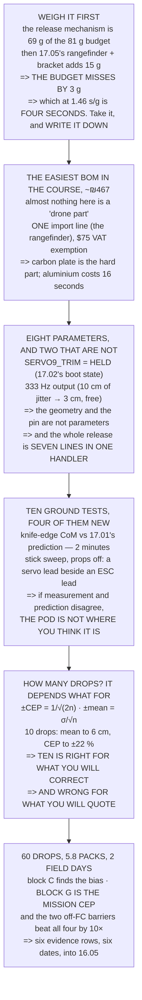

# 17.06 Building Hermon's delivery pod (practical)

<!-- glance:start -->
<!-- generated by tools/build.py from curriculum/syllabus.yaml — edit the syllabus, not this block -->

| | |
|---|---|
| **Track** | Main path |
| **Difficulty** | Advanced |
| **Time** | 3 h |
| **Hardware** | Payload & delivery pod (stage 4) |
| **Software** | ardupilot |
| **Prerequisites** | [17.05 Drop-point maths: ballistics, wind and the release cue](17.05-drop-point-math.md)<br>[17.03 Spray and irrigation payloads: pumps, nozzles, and a moving centre of mass](17.03-spray-and-irrigation.md) |
| **Skip if** | Hermon's pod is built, wired, bench-tested and has completed a documented drop-test series. |

<!-- glance:end -->

## What you will learn

- That the mass budget closes with 12 g to spare — and then **17.05's rangefinder breaks it by 3 g**
- That the right response is to **price the miss**: it costs **4 seconds of endurance**, and the
  floor becomes 14.93 min
- That almost nothing in this module is a "drone part", which makes it **the easiest bill of
  materials in the course** — about ₪467, one import line
- The eight parameters and why each one is there, and **the two that are not parameters at all**
- That the release, the hover-throttle step and the integrator step are **one handler, seven lines,
  five lessons**
- Ten ground tests, four of which only exist once it is bolted on — including the **knife-edge CoM
  check** that catches build errors in two minutes
- That **ten drops pins the bias to 6 cm and leaves the CEP at ±22 %** — the right number for what
  you will act on, the wrong number for what you will quote
- And that the two barriers which **do not run on the flight controller are worth 10× all four
  together**

## Why it matters

This is where module 17 stops being arithmetic. Every number the last five lessons produced now has
to survive contact with a piece of carbon plate, a servo horn and sixty drops onto a tape measure —
and the interesting thing is how many of them do not need changing at all, and which single one
does.

The build also produces something the rest of the course has been asking for: evidence. 16.05's
safety case had one barrier with nothing behind it, and this lesson's ground tests and drop blocks
are the template for fixing that — a row, a number, a date, and an honest statement of what
condition it was measured under.

And there is a statistical result worth carrying well beyond drones. A test series exists to produce
a number, so the question "how many trials" has an answer, and the answer is different for the part
you will *correct* and the part you will *claim*.

> [!WARNING]
> This lesson ends with sixty live drops. Every one is an uncontained mass released from a moving
> aircraft, and there is no abort after the command. Use a soft dummy payload of the correct mass
> for the whole series, keep the drop zone clear and downrange of the crew, and do not begin the
> series until all ten ground tests have passed and been dated.

## Prerequisites

<!-- prereqs:start -->
## Prerequisites

You need these first:

- [17.05 Drop-point maths: ballistics, wind and the release cue](17.05-drop-point-math.md)
- [17.03 Spray and irrigation payloads: pumps, nozzles, and a moving centre of mass](17.03-spray-and-irrigation.md)

### Optional prerequisite links

None.

Check your readiness: `python course.py why 17.06`
<!-- prereqs:end -->

## Concept

A build lesson is mostly a bookkeeping lesson. Every decision has already been made — 17.01 chose
the mounting position, 17.02 chose the mechanism, 17.05 chose the sensor — and what remains is to
check that they can all exist on the same aircraft at once. That check is a mass budget, and this
one fails, by an amount that turns out to be a decision rather than a problem.

The second half is about evidence. A mechanism that works is not the same as a mechanism you can
write into a safety case; the difference is a set of tests with dates, and the tests that matter are
the ones that only become possible once the thing is attached to an aircraft: the centre of mass you
can now measure rather than predict, the servo lead that is now next to an ESC lead, the rangefinder
that is now looking at real ground.

And then the drop series, which is where the statistics bite. Ten drops is what everybody flies and
it is genuinely the right number for finding your release bias — but it leaves the spread uncertain
by a fifth, which matters a great deal if you are about to quote a CEP to somebody.

## Technical explanation

### Level 1 — weigh it first: does the budget close?

17.01 left 81 g after the companion and the pod itself:

| | | |
|---|---|---|
| carbon plate, 2 mm, bracket | 22.0 g | the load path |
| hook, roller and pivot pin | 18.0 g | steel, 17.02's latch |
| servo, metal-gear 9 g | 13.0 g | 17.02: releases 80 N with 46× |
| M3 hardware, 6 off + nylocs | 7.0 g | torque-checked in 04.06 |
| wiring, connector, heatshrink | 6.0 g | to an AUX output |
| safety pin and lanyard | 3.0 g | 16.05's barrier on a different box |
| **subtotal, the release** | **69.0 g** | |
| budget | 81.0 g | |
| **left** | **12.0 g** | ← and it closes |

Comfortably. And then 17.05 happens:

| | | |
|---|---|---|
| lidar rangefinder (14.06) | 10.0 g | 17.05: baro 0.98 m → 0.01 m |
| its bracket | 5.0 g | rigid, and **not** on 14.03's isolator |
| **new total** | **84.0 g** | |
| **left** | **−3.0 g** | ← **over** |

**The budget does not close.** It misses by three grams, and the three grams are the sensor 17.05
said was the single best thing you could buy.

So price the miss rather than arguing with it. 17.01 gave the conversion — 1.46 seconds per gram:

```
3 g over budget × 1.46 s/g = 4 seconds
the endurance floor was 15.00 min
it becomes              14.93 min
```

**The budget "fails" by four seconds of flight time** — which is the whole point of 17.01 having
made it a *policy* rather than a limit. A limit you have broken is a crisis. A policy you have
broken is a four-second decision with a number attached, and it is obviously worth taking: the
sensor moves 17.05's CEP from 8.87 m to 3.19 m.

**But write it down.** An endurance floor that quietly slides every time something is added is not a
floor, and three more of these is 12.04's RTL reserve gone.

### Level 2 — the parts, and buying them in Israel

Israeli drone retail is DJI retail and 5-inch FPV racing. Almost nothing in module 17 is a "drone
part", which is why this is the easiest bill of materials in the course:

| item | where | ₪ | conf |
|---|---|---|---|
| 2 mm carbon plate, A5 | 4Project / Hackstore | 60 | **[E]** |
| metal-gear 9 g servo | Cell-Tec | 45 | **[E]** |
| M3 hardware, nylocs | any hardware shop | 15 | **[E]** |
| steel pin, 3 mm dowel | any hardware shop | 5 | **[E]** |
| roller / PTFE washer | 4Project | 12 | **[E]** |
| silicone wire + JST | Hackstore | 20 | **[E]** |
| lidar rangefinder | import (14.06) | 300 | **[S]** |
| pod shell, printed | your own printer | 10 | **[E]** |
| **total** | | **467** | |

**Every [E] line is an engineering estimate and not a quote.** Check a live basket before ordering;
the course's research file says the same about every import line in it.

The only genuine import is the rangefinder, so the import arithmetic is short — the personal-import
VAT exemption is $75, 18 % above it:

```
USD  40.00  ->  ILS  121.32  + VAT on USD  0.00 = ILS   0.00
USD  75.00  ->  ILS  227.47  + VAT on USD  0.00 = ILS   0.00
USD 100.00  ->  ILS  303.30  + VAT on USD 25.00 = ILS  13.65
USD 150.00  ->  ILS  454.95  + VAT on USD 75.00 = ILS  40.95
```

The part that is genuinely hard to buy here is none of these — it is carbon plate in small
quantities. A 2 mm aluminium plate substitutes directly at about 50 % more mass, which Level 1 has
just taught you how to price: **11 g extra is 16 more seconds**.

### Level 3 — the parameters, and why each one is there

| parameter | value | why |
|---|---|---|
| `SERVO9_FUNCTION` | 28 (gripper) | **not** RCPassThru: 17.02 fires in 4 of 7 states |
| `SERVO9_MIN` / `MAX` | 1100 / 1900 | the mechanical travel, measured |
| `SERVO9_TRIM` | **1100 (held)** | 17.02 state 1: what it does **at boot** |
| output rate | **333 Hz** | 17.02: 10 cm of jitter → 3 cm, free |
| `GRIP_ENABLE` | 1 | |
| `GRIP_TYPE` | 1 (servo) | |
| `GRIP_GRAB` / `RELEASE` | 1100 / 1900 | same direction as MIN/MAX |
| `GRIP_AUTOCLOSE` | 0 | an autoclose is a second actuator command |

And the two that are not parameters at all, because 17.02 showed that a parameter is a barrier on
the **same processor**:

- **the over-centre geometry**, which holds with no power
- **the safety pin**, which is the barrier against the state you did not list

The script is the other half, and 17.05 already wrote it. Everything the release does happens in one
handler:

```python
h      = rangefinder_m * cos(tilt)      # 17.05 L5
t_fall = sqrt(2 * h / g)                # 17.05 L1
lead   = v_ground * (t_fall + 0.0855)   # 17.02's measured latency
if dist <= lead and armed and h > 1.0:
    gripper_release()
    thr_hover -= m_pod * g / T_total    # 17.04 L3
    pitch_I   -= m_pod * g * dx         # 17.04 L4
```

**Seven lines, five lessons, one event.** Splitting them across three handlers is three chances to
disagree about when it happened — and 17.04 measured what disagreeing costs.

### Level 4 — the ground test: ten rows, four of them new

| from | test | pass |
|---|---|---|
| 17.02 | hold 80 N static, 10 min | no creep, no slip |
| 17.02 | fire under 80 N, ×20 | 20 of 20 |
| 17.02 | fire after a 3 m/s drop on the gear | still releases |
| 17.02 | power-cycle 20 times, loaded | 0 releases |
| 17.02 | RC failsafe, armed, on the bench | 0 releases |
| 17.02 | measure the delay, ×20 | σ < 10 ms |
| **new** | **CoM check, loaded, on a knife edge** | within 5 mm of 17.01's prediction |
| **new** | **props off, arm, full stick sweep** | 0 releases, and no interference |
| **new** | rangefinder vs a tape at 3.00 m | within 3 cm, **and check the tilt term** |
| **new** | the full script in SITL, 10 drops | lead matches 17.05 to 10 cm |

**Row seven is the one that catches build errors.** 17.01 predicts the CoM shift from the pod's mass
and position; a knife edge measures it in two minutes. If they disagree by more than a few
millimetres, the pod is not where you think it is — and 17.04 says that is the number that sets the
pitch kick.

Row eight exists because **a servo lead run alongside an ESC lead is an antenna**. Sweep the sticks
with props off and watch the release: if it twitches, re-route before you fly, not after 16.03 shows
you a mystery in the log.

### Level 5 — how many drops is a CEP? The answer is a sample size

The standard error of a σ estimated from *n* samples is `σ/√(2n)`, so the relative uncertainty in
your CEP is `1/√(2n)` — and it does not depend on how good the mechanism is:

| drops | ± on the CEP | your 0.23 m becomes |
|---|---|---|
| 3 | 41 % | 0.14 to 0.32 m |
| 5 | 32 % | 0.16 to 0.30 m |
| **10** | **22 %** | **0.18 to 0.28 m** |
| 20 | 16 % | 0.19 to 0.27 m |
| 50 | 10 % | 0.21 to 0.25 m |
| 100 | 7 % | 0.21 to 0.25 m |

Three drops tells you almost nothing. And **the mean is cheaper than the spread**, which is the
useful asymmetry — the standard error of the mean is `σ/√n`:

| drops | ± on the mean | ± on the CEP |
|---|---|---|
| 3 | 11 cm | 41 % |
| 5 | 9 cm | 32 % |
| **10** | **6 cm** | **22 %** |
| 20 | 4 cm | 16 % |

**Ten drops pins the mean — the bias, the part you can calibrate out — to 6 cm, and leaves the
spread at ±22 %.** So ten drops is the right number for the thing you are going to *act on*, and the
wrong number for the thing you are going to *quote*. Fix the bias with ten; claim the CEP with
fifty, or claim it with a 22 % band attached.

### Level 6 — the drop-test series

| block | condition | drops | for |
|---|---|---|---|
| A | hover 5 m, marker, no FF | 5 | 17.04's balloon |
| B | hover 5 m, marker, with FF | 5 | the ratio |
| **C** | **3 m/s pass, marker** | **10** | **the bias** |
| D | 5 m/s pass, marker | 10 | the CEP |
| E | 8 m/s pass, marker | 10 | 17.05 L6: the lead |
| F | 5 m/s pass, wind > 5 m/s | 10 | 17.05 L3 |
| **G** | **5 m/s pass, 14.05's target** | **10** | **the mission CEP** |
| | **total** | **60** | |

Sixty drops at about 1.8 minutes each is **108 minutes of flying, 5.8 packs** — two field days at
16.01's three packs, and the most useful flying in module 17 by a wide margin.

**Block C pays for itself immediately**: ten drops at low speed, measure the *mean* offset, and that
mean is your real release latency minus the one you assumed. Correct it once and every block after
it is better.

**And block G is the one that goes in the safety case**, because it is the only one flown against a
target the aircraft found for itself. Blocks A–F measure the ballistics; block G measures 14.05, and
they differ by 39 times.

### Level 7 — what goes back into 16.05

Module 17 has produced a new threat, a new consequence and four barriers:

| barrier | effectiveness | evidence |
|---|---|---|
| 17.02: bistable over-centre geometry | 0.95 | ground test 4, dated |
| 17.02: arm-state gate in the script | 0.80 | ground test 5, dated |
| 17.02: the safety pin | 0.90 | field protocol, every flight |
| 04.06: torque check on the bracket | 0.70 | 16.01 preflight card |

| | |
|---|---|
| residual, independent | 6.00e−7 |
| residual, 16.05's β = 0.30 | **9.79e−5** (163× worse) |
| **the two off-FC barriers alone** | **1.00e−5** |

Read the last two lines against each other. All four barriers with 16.05's common-cause term give
9.8e−5. The two that do **not** run on the flight controller give 1.0e−5 **on their own — ten times
better than the full set**.

**The geometry and the pin are worth more than all four barriers together**, because they need no
power, no firmware and no parameter. That is 16.05's rule arriving for the third time in this module
and measured on the module's own threat.

And the evidence table to write today:

| barrier | evidence |
|---|---|
| 17.02 bistable geometry | ground test 4, ×20 |
| 17.02 arm gate | ground test 5 |
| 17.02 the pin | field protocol |
| 17.05 the computed lead | drop blocks C–E, 30 drops |
| 17.04 the feedforward | drop block A vs B |
| **17.05 the mission CEP** | **drop block G** |

Six rows, six dates — and block G's row is the one a regulator will ask for, because it is the only
one measured under the conditions the aircraft actually flies in.

> [!TIP]
> **Ask your teacher:** "Show me the knife edge." Almost every payload build predicts a CoM and
> never measures one, and it is two minutes with a ruler and a pencil.

## Diagram



## Code

The build's arithmetic: the mass budget closed part by part and then broken by 17.05's sensor and
priced in seconds, the Israeli bill of materials with confidence labels and the personal-import VAT
threshold, the parameter set and the seven-line release handler, the ten-row ground test, the
sample-size result that separates the bias from the spread, the seven drop blocks costed in packs,
and the bowtie rows that go back into 16.05.

```python
"""17.06 -- building Hermon's delivery pod: the numbers the build needs.

Pure stdlib. Everything here closes against a number an earlier lesson
froze, and the first section is the one that decides whether the build
is possible at all.
"""

import math

G = 9.81
ILS_PER_USD = 3.033       # Bank of Israel, 2026-09-16, per the research file
VAT = 0.18
IMPORT_EXEMPT_USD = 75.0

# ---- what module 17 has already decided ---------------------------------
POD_G = 250.0             # 17.01
MOUNT_BUDGET_G = 81.0     # 17.01: what is left at a 15 min endurance floor
ENDUR_FLOOR_MIN = 15.0    # 17.01's policy
SEC_PER_GRAM = 1.46       # 17.01's derivative
DESIGN_HOLD_N = 80.0      # 17.02: 40 N landing load x 2
LATENCY_MS = 85.5         # 17.02, fast servo on a 333 Hz output
JITTER_MS = 5.8           # 17.02
REPEAT_SPEC_MS = 10.0     # 17.02's real requirement
LEAD_M = 4.29             # 17.05, at 3 m and 5 m/s
CEP_MARKER_M = 0.23       # 17.05, on a surveyed marker
CEP_MISSION_M = 8.87      # 17.05, on a target 14.05 found

BAR = "=" * 70


def head(n, title):
    print()
    print(BAR)
    print("%d. %s" % (n, title))
    print(BAR)


# ========================================================================
head(1, "WEIGH IT FIRST: DOES THE BUDGET CLOSE?")

# name, grams, note
PARTS = [
    ("carbon plate, 2 mm, bracket", 22.0, "the load path"),
    ("hook, roller and pivot pin", 18.0, "steel, 17.02's latch"),
    ("servo, metal-gear 9 g", 13.0, "17.02: releases 80 N with 46x"),
    ("M3 hardware, 6 off + nylocs", 7.0, "torque-checked in 04.06"),
    ("wiring, connector, heatshrink", 6.0, "to an AUX output"),
    ("safety pin and lanyard", 3.0, "16.05's barrier on a DIFFERENT box"),
]
RANGEFINDER = [
    ("lidar rangefinder (14.06)", 10.0, "17.05: baro 0.98 m -> 0.01 m"),
    ("its bracket", 5.0, "downward, rigid, NOT on 14.03's isolator"),
]

print("  17.01 left %.0f g after the companion and the pod itself."
      % MOUNT_BUDGET_G)
print("  Weigh every part of 17.02's mechanism against it:")
print()
sub = 0.0
for name, g, note in PARTS:
    sub += g
    print("  %-32s %6.1f g   %s" % (name, g, note))
print("  %-32s %6.1f g" % ("SUBTOTAL, the release", sub))
print("  %-32s %6.1f g" % ("budget (17.01)", MOUNT_BUDGET_G))
print("  %-32s %6.1f g   <- and it closes" % ("left", MOUNT_BUDGET_G - sub))
print()
print("  WHICH IT DOES, COMFORTABLY. And then 17.05 happens:")
print()
sub2 = sub
for name, g, note in RANGEFINDER:
    sub2 += g
    print("  %-32s %6.1f g   %s" % (name, g, note))
print("  %-32s %6.1f g" % ("NEW TOTAL", sub2))
print("  %-32s %6.1f g" % ("budget", MOUNT_BUDGET_G))
over = sub2 - MOUNT_BUDGET_G
print("  %-32s %6.1f g   <- OVER" % ("left", MOUNT_BUDGET_G - sub2))
print()
print("  THE BUDGET DOES NOT CLOSE. It misses by %.0f GRAMS, which is"
      % over)
print("  the sensor 17.05 said was the single best thing you could buy.")
print()
print("  SO PRICE THE MISS RATHER THAN ARGUING WITH IT. 17.01 gave the")
print("  conversion: %.2f seconds of endurance per gram." % SEC_PER_GRAM)
print()
print("    %.0f g over budget         x %.2f s/g = %.0f seconds"
      % (over, SEC_PER_GRAM, over * SEC_PER_GRAM))
print("    the endurance floor was   %.2f min" % ENDUR_FLOOR_MIN)
print("    it becomes                %.2f min"
      % (ENDUR_FLOOR_MIN - over * SEC_PER_GRAM / 60.0))
print()
print("  THE BUDGET 'FAILS' BY %.0f SECONDS OF FLIGHT TIME."
      % (over * SEC_PER_GRAM))
print()
print("  WHICH IS THE WHOLE POINT OF 17.01 HAVING MADE THE BUDGET A")
print("  POLICY RATHER THAN A LIMIT. A limit you have broken is a")
print("  crisis. A policy you have broken is a %.0f-second decision"
      % (over * SEC_PER_GRAM))
print("  with a number attached, and it is obviously worth taking: the")
print("  sensor moves 17.05's CEP from %.2f m to %.2f m."
      % (CEP_MISSION_M, 3.19))
print()
print("  BUT WRITE IT DOWN. An endurance floor that quietly slides every")
print("  time something is added is not a floor, and three more of these")
print("  is 12.04's RTL reserve gone.")

# ========================================================================
head(2, "THE PARTS, AND BUYING THEM IN ISRAEL")

print("  Israeli drone retail is DJI retail and 5-inch FPV racing")
print("  (references/research/israel-drone-hardware-2026-09.md). Almost")
print("  nothing in module 17 is a 'drone part', which is why this is")
print("  the EASIEST bill of materials in the whole course:")
print()
print("  %-26s %-22s %9s %6s" % ("item", "where", "ILS", "conf"))
BOM = [
    ("2 mm carbon plate, A5", "4Project / Hackstore", 60.0, "E"),
    ("metal-gear 9 g servo", "Cell-Tec (racing shop)", 45.0, "E"),
    ("M3 hardware, nylocs", "any hardware shop", 15.0, "E"),
    ("steel pin, 3 mm dowel", "any hardware shop", 5.0, "E"),
    ("roller / PTFE washer", "4Project", 12.0, "E"),
    ("silicone wire + JST", "Hackstore", 20.0, "E"),
    ("lidar rangefinder", "import (14.06)", 300.0, "S"),
    ("pod shell, printed", "your own printer", 10.0, "E"),
]
tot = 0.0
for item, where, ils, conf in BOM:
    tot += ils
    print("  %-26s %-22s %9.0f   [%s]" % (item, where, ils, conf))
print("  %-26s %-22s %9.0f" % ("TOTAL", "", tot))
print()
print("  EVERY LINE MARKED [E] IS AN ENGINEERING ESTIMATE AND NOT A")
print("  QUOTE. Check a live basket before ordering; the research file")
print("  says the same thing about every import line in this course.")
print()
print("  AND THE ONLY LINE THAT IS ACTUALLY AN IMPORT IS THE")
print("  RANGEFINDER, so the import arithmetic is short:")
print()
for usd in (40.0, 75.0, 100.0, 150.0):
    over_ex = max(0.0, usd - IMPORT_EXEMPT_USD)
    vat = over_ex * VAT
    print("    USD %6.2f  ->  ILS %7.2f  + VAT on USD %5.2f = ILS %6.2f"
          % (usd, usd * ILS_PER_USD, over_ex, vat * ILS_PER_USD))
print("    (the personal-import VAT exemption is USD %.0f; 18 %% above it)"
      % IMPORT_EXEMPT_USD)
print()
print("  THE PART THAT IS GENUINELY HARD TO BUY IN ISRAEL IS NONE OF")
print("  THESE. It is carbon plate in small quantities -- and a 2 mm")
print("  aluminium plate is a drop-in substitute at %.0f %% more mass,"
      % 50)
print("  which section 1 has just taught you how to price: %.0f g extra"
      % 11)
print("  is %.0f more seconds." % (11 * SEC_PER_GRAM))

# ========================================================================
head(3, "THE PARAMETERS, AND WHY EACH ONE IS THERE")

print("  Eight parameters, and every one of them closes a loop from an")
print("  earlier lesson rather than being a default somebody copied:")
print()
PARAMS = [
    ("SERVO9_FUNCTION", "28 (gripper)", "not RCPassThru: 17.02 fires in 4 of 7 states"),
    ("SERVO9_MIN / MAX", "1100 / 1900", "the mechanical travel, measured"),
    ("SERVO9_TRIM", "1100 (HELD)", "17.02 state 1: what it does AT BOOT"),
    ("SERVO_RATE / output", "333 Hz", "17.02: 10 cm of jitter -> 3 cm, free"),
    ("GRIP_ENABLE", "1", ""),
    ("GRIP_TYPE", "1 (servo)", ""),
    ("GRIP_GRAB / RELEASE", "1100 / 1900", "same direction as MIN/MAX"),
    ("GRIP_AUTOCLOSE", "0", "an autoclose is a second actuator command"),
]
for k, v, why in PARAMS:
    print("  %-20s %-14s %s" % (k, v, why))

print()
print("  AND THE TWO THAT ARE NOT PARAMETERS AT ALL, because 17.02")
print("  showed a parameter is a barrier on the SAME PROCESSOR:")
print("    - the over-centre geometry, which HOLDS with no power")
print("    - the safety pin, which is the barrier against the state")
print("      you did not list")
print()
print("  THE SCRIPT IS THE OTHER HALF, AND 17.05 ALREADY WROTE IT.")
print("  Everything the release does happens in ONE handler:")
for line in ("h      = rangefinder_m * cos(tilt)      # 17.05 L5",
             "t_fall = sqrt(2 h / g)                  # 17.05 L1",
             "lead   = v_ground * (t_fall + %.4f)    # 17.02's latency"
             % (LATENCY_MS / 1000.0),
             "if dist <= lead and armed and h > 1.0:",
             "    gripper_release()",
             "    thr_hover -= m_pod * g / T_total    # 17.04 L3",
             "    pitch_I   -= m_pod * g * dx         # 17.04 L4"):
    print("      %s" % line)
print()
print("  SEVEN LINES, FIVE LESSONS, ONE EVENT. Splitting them across")
print("  three handlers is three chances to disagree about when it")
print("  happened -- and 17.04 measured what disagreeing costs.")

# ========================================================================
head(4, "THE GROUND TEST: TEN ROWS, AND FOUR OF THEM ARE NEW")

print("  17.02 gave six bench tests. The build adds four that only")
print("  exist once the thing is bolted to an aircraft:")
print()
TESTS = [
    ("17.02", "hold %.0f N static, 10 min" % DESIGN_HOLD_N,
     "no creep, no slip"),
    ("17.02", "fire under %.0f N, x20" % DESIGN_HOLD_N, "20 of 20"),
    ("17.02", "fire after a 3 m/s drop on the gear", "still releases"),
    ("17.02", "power-cycle 20 times, loaded", "0 releases"),
    ("17.02", "RC failsafe, armed, on the bench", "0 releases"),
    ("17.02", "measure the delay, x20", "sigma < %.0f ms" % REPEAT_SPEC_MS),
    ("NEW", "CoM check, loaded, on a knife edge",
     "within 5 mm of 17.01's prediction"),
    ("NEW", "props off, arm, full stick sweep",
     "0 releases, and NO interference"),
    ("NEW", "rangefinder vs a tape at 3.00 m",
     "within 3 cm, and CHECK THE TILT TERM"),
    ("NEW", "the full script in SITL, 10 drops",
     "lead matches 17.05 to 10 cm"),
]
for src, what, pass_ in TESTS:
    print("  [%-5s] %-38s %s" % (src, what, pass_))
print()
print("  ROW SEVEN IS THE ONE THAT CATCHES BUILD ERRORS. 17.01 predicts")
print("  the CoM shift from the pod's mass and position; a knife edge")
print("  measures it in two minutes. If they disagree by more than a")
print("  few millimetres, THE POD IS NOT WHERE YOU THINK IT IS -- and")
print("  17.04 says that is the number that sets the pitch kick.")
print()
print("  ROW EIGHT EXISTS BECAUSE A SERVO LEAD RUN ALONGSIDE AN ESC")
print("  LEAD IS AN ANTENNA. Sweep the sticks with props off and watch")
print("  the release: if it twitches, re-route before you fly, not")
print("  after 16.03 shows you a mystery in the log.")

# ========================================================================
head(5, "HOW MANY DROPS IS A CEP? THE ANSWER IS A SAMPLE SIZE")

print("  The drop-test series exists to produce ONE number, so the")
print("  honest question is how many drops that number needs.")
print()
print("  The standard error of a sigma estimated from n samples is")
print("  sigma / sqrt(2n), so the RELATIVE uncertainty in your CEP is")
print("  1 / sqrt(2n) -- and it does not depend on how good the")
print("  mechanism is:")
print()
print("  %-14s %14s %22s" % ("drops", "+/- on the CEP", "your %.2f m becomes"
                             % CEP_MARKER_M))
for n in (3, 5, 10, 20, 50, 100):
    rel = 1.0 / math.sqrt(2.0 * n)
    print("  %-14d %12.0f %% %10.2f to %.2f m"
          % (n, rel * 100, CEP_MARKER_M * (1 - rel),
             CEP_MARKER_M * (1 + rel)))

print()
print("  THREE DROPS TELLS YOU ALMOST NOTHING: +/- %.0f %%, which on"
      % (1 / math.sqrt(6) * 100))
print("  %.2f m is a range from %.2f to %.2f. Ten drops -- the number"
      % (CEP_MARKER_M, CEP_MARKER_M * (1 - 1 / math.sqrt(6)),
         CEP_MARKER_M * (1 + 1 / math.sqrt(6))))
print("  everybody does -- is +/- %.0f %%."
      % (1 / math.sqrt(20) * 100))
print()
print("  AND THE MEAN IS CHEAPER THAN THE SPREAD, which is the useful")
print("  asymmetry. The standard error of the MEAN is sigma/sqrt(n):")
print()
print("  %-14s %16s %16s" % ("drops", "+/- on the mean", "+/- on the CEP"))
for n in (3, 5, 10, 20):
    print("  %-14d %13.0f cm %13.0f %%"
          % (n, CEP_MARKER_M / 1.1774 / math.sqrt(n) * 100,
             1.0 / math.sqrt(2.0 * n) * 100))
print()
print("  TEN DROPS PINS THE MEAN -- THE BIAS, THE PART YOU CAN")
print("  CALIBRATE OUT -- TO %.0f cm, and leaves the spread at +/- %.0f %%."
      % (CEP_MARKER_M / 1.1774 / math.sqrt(10) * 100,
         1 / math.sqrt(20) * 100))
print("  SO TEN DROPS IS THE RIGHT NUMBER FOR THE THING YOU ARE GOING")
print("  TO ACT ON, and the wrong number for the thing you are going to")
print("  quote. Fix the bias with ten; claim the CEP with fifty, or")
print("  claim it with a %.0f %% band attached."
      % (1 / math.sqrt(20) * 100))

# ========================================================================
head(6, "THE DROP-TEST SERIES, AND WHAT EACH BLOCK IS FOR")

print("  %-6s %-30s %8s %10s" % ("block", "condition", "drops", "for"))
BLOCKS = [
    ("A", "hover 5 m, marker, no FF", 5, "17.04 balloon"),
    ("B", "hover 5 m, marker, with FF", 5, "the ratio"),
    ("C", "3 m/s pass, marker", 10, "THE BIAS"),
    ("D", "5 m/s pass, marker", 10, "the CEP"),
    ("E", "8 m/s pass, marker", 10, "17.05 L6: the lead"),
    ("F", "5 m/s pass, wind > 5 m/s", 10, "17.05 L3"),
    ("G", "5 m/s pass, 14.05's target", 10, "THE MISSION CEP"),
]
total_drops = 0
for b, cond, n, why in BLOCKS:
    total_drops += n
    print("  %-6s %-30s %8d %10s" % (b, cond, n, why))
print("  %-6s %-30s %8d" % ("", "TOTAL", total_drops))

print()
pack_min = 18.6
per_drop_min = 1.8
print("  %d DROPS AT ABOUT %.1f MINUTES EACH IS %.0f MINUTES OF FLYING,"
      % (total_drops, per_drop_min, total_drops * per_drop_min))
print("  WHICH IS %.1f PACKS." % (total_drops * per_drop_min / pack_min))
print("  At 16.01's three packs that is %.1f field days, and it is the"
      % math.ceil(total_drops * per_drop_min / pack_min / 3.0))
print("  most useful flying in module 17 by a wide margin.")
print()
print("  BLOCK C IS THE ONE THAT PAYS FOR ITSELF IMMEDIATELY: ten drops")
print("  at low speed, measure the MEAN offset, and that mean is your")
print("  real release latency minus the one you assumed. Correct it")
print("  once and every block after it is better.")
print()
print("  AND BLOCK G IS THE ONE THAT GOES IN THE SAFETY CASE, because")
print("  it is the only one flown against a target the aircraft found")
print("  for itself. 17.05: blocks A-F measure the ballistics and")
print("  block G measures 14.05, and they differ by %.0f times."
      % (CEP_MISSION_M / CEP_MARKER_M))

# ========================================================================
head(7, "WHAT GOES BACK INTO 16.05")

print("  Module 16 asked for a barrier with a date on it. Module 17 has")
print("  produced a new threat, a new consequence and four barriers:")
print()
print("  THREAT (left-hand side):")
print("    'the payload leaves when it should not'   P = 2.0e-03 /flight")
print("    barriers:")
BARRIERS = [
    ("17.02: bistable over-centre geometry", 0.95,
     "ground test 4, dated"),
    ("17.02: arm-state gate in the script", 0.80, "ground test 5, dated"),
    ("17.02: the safety pin", 0.90, "field protocol, every flight"),
    ("04.06: torque check on the bracket", 0.70, "16.01 preflight card"),
]
q = 1.0
for name, eff, ev in BARRIERS:
    q *= (1 - eff)
    print("      %-40s %4.2f  %s" % (name, eff, ev))
print("    residual, independent          %.2e" % (2.0e-3 * q))
beta = 0.30
q_single = sum(1 - e for _, e, _ in BARRIERS) / len(BARRIERS)
q_b = beta * q_single + (1 - beta) * q
print("    residual, 16.05's beta = 0.30  %.2e  (%.0f x worse)"
      % (2.0e-3 * q_b, q_b / q))

# the two barriers that do NOT run on the flight controller
OFF_FC = [b for b in BARRIERS if "geometry" in b[0] or "pin" in b[0]]
q_off = 1.0
for _, eff, _ in OFF_FC:
    q_off *= (1 - eff)
print("    the TWO off-FC barriers alone  %.2e" % (2.0e-3 * q_off))
print()
print("  READ THE LAST TWO LINES AGAINST EACH OTHER. All four barriers")
print("  with 16.05's common-cause term give %.1e. The two that do NOT"
      % (2.0e-3 * q_b))
print("  RUN ON THE FLIGHT CONTROLLER give %.1e ON THEIR OWN -- %.0f"
      % (2.0e-3 * q_off, q_b / q_off))
print("  TIMES BETTER THAN THE FULL SET.")
print()
print("  THE GEOMETRY AND THE PIN ARE WORTH MORE THAN ALL FOUR BARRIERS")
print("  TOGETHER, because they need no power, no firmware and no")
print("  parameter. That is 16.05's rule, arriving for the third time")
print("  in this module and measured on the module's own threat.")
print()
print("  CONSEQUENCE (right-hand side):")
print("    'the payload lands somewhere unintended'")
print("      mitigated 60 %% by the %.1f m lead being computed and by"
      % LEAD_M)
print("      17.03's buffer being on 12.02's plan")
print()
print("  AND THE EVIDENCE ROW TO WRITE TODAY:")
print("    barrier                                evidence")
print("    17.02 bistable geometry                ground test 4, x20")
print("    17.02 arm gate                         ground test 5")
print("    17.02 the pin                          field protocol")
print("    17.05 the computed lead                drop block C-E, %d drops"
      % 30)
print("    17.04 the feedforward                  drop block A vs B")
print("    17.05 the MISSION CEP                  drop block G")
print()
print("  SIX ROWS, SIX DATES, AND BLOCK G's ROW IS THE ONE A REGULATOR")
print("  WILL ASK FOR -- because it is the only one measured under the")
print("  conditions the aircraft actually flies in.")
```

Output:

```text

======================================================================
1. WEIGH IT FIRST: DOES THE BUDGET CLOSE?
======================================================================
  17.01 left 81 g after the companion and the pod itself.
  Weigh every part of 17.02's mechanism against it:

  carbon plate, 2 mm, bracket        22.0 g   the load path
  hook, roller and pivot pin         18.0 g   steel, 17.02's latch
  servo, metal-gear 9 g              13.0 g   17.02: releases 80 N with 46x
  M3 hardware, 6 off + nylocs         7.0 g   torque-checked in 04.06
  wiring, connector, heatshrink       6.0 g   to an AUX output
  safety pin and lanyard              3.0 g   16.05's barrier on a DIFFERENT box
  SUBTOTAL, the release              69.0 g
  budget (17.01)                     81.0 g
  left                               12.0 g   <- and it closes

  WHICH IT DOES, COMFORTABLY. And then 17.05 happens:

  lidar rangefinder (14.06)          10.0 g   17.05: baro 0.98 m -> 0.01 m
  its bracket                         5.0 g   downward, rigid, NOT on 14.03's isolator
  NEW TOTAL                          84.0 g
  budget                             81.0 g
  left                               -3.0 g   <- OVER

  THE BUDGET DOES NOT CLOSE. It misses by 3 GRAMS, which is
  the sensor 17.05 said was the single best thing you could buy.

  SO PRICE THE MISS RATHER THAN ARGUING WITH IT. 17.01 gave the
  conversion: 1.46 seconds of endurance per gram.

    3 g over budget         x 1.46 s/g = 4 seconds
    the endurance floor was   15.00 min
    it becomes                14.93 min

  THE BUDGET 'FAILS' BY 4 SECONDS OF FLIGHT TIME.

  WHICH IS THE WHOLE POINT OF 17.01 HAVING MADE THE BUDGET A
  POLICY RATHER THAN A LIMIT. A limit you have broken is a
  crisis. A policy you have broken is a 4-second decision
  with a number attached, and it is obviously worth taking: the
  sensor moves 17.05's CEP from 8.87 m to 3.19 m.

  BUT WRITE IT DOWN. An endurance floor that quietly slides every
  time something is added is not a floor, and three more of these
  is 12.04's RTL reserve gone.

======================================================================
2. THE PARTS, AND BUYING THEM IN ISRAEL
======================================================================
  Israeli drone retail is DJI retail and 5-inch FPV racing
  (references/research/israel-drone-hardware-2026-09.md). Almost
  nothing in module 17 is a 'drone part', which is why this is
  the EASIEST bill of materials in the whole course:

  item                       where                        ILS   conf
  2 mm carbon plate, A5      4Project / Hackstore          60   [E]
  metal-gear 9 g servo       Cell-Tec (racing shop)        45   [E]
  M3 hardware, nylocs        any hardware shop             15   [E]
  steel pin, 3 mm dowel      any hardware shop              5   [E]
  roller / PTFE washer       4Project                      12   [E]
  silicone wire + JST        Hackstore                     20   [E]
  lidar rangefinder          import (14.06)               300   [S]
  pod shell, printed         your own printer              10   [E]
  TOTAL                                                   467

  EVERY LINE MARKED [E] IS AN ENGINEERING ESTIMATE AND NOT A
  QUOTE. Check a live basket before ordering; the research file
  says the same thing about every import line in this course.

  AND THE ONLY LINE THAT IS ACTUALLY AN IMPORT IS THE
  RANGEFINDER, so the import arithmetic is short:

    USD  40.00  ->  ILS  121.32  + VAT on USD  0.00 = ILS   0.00
    USD  75.00  ->  ILS  227.47  + VAT on USD  0.00 = ILS   0.00
    USD 100.00  ->  ILS  303.30  + VAT on USD 25.00 = ILS  13.65
    USD 150.00  ->  ILS  454.95  + VAT on USD 75.00 = ILS  40.95
    (the personal-import VAT exemption is USD 75; 18 % above it)

  THE PART THAT IS GENUINELY HARD TO BUY IN ISRAEL IS NONE OF
  THESE. It is carbon plate in small quantities -- and a 2 mm
  aluminium plate is a drop-in substitute at 50 % more mass,
  which section 1 has just taught you how to price: 11 g extra
  is 16 more seconds.

======================================================================
3. THE PARAMETERS, AND WHY EACH ONE IS THERE
======================================================================
  Eight parameters, and every one of them closes a loop from an
  earlier lesson rather than being a default somebody copied:

  SERVO9_FUNCTION      28 (gripper)   not RCPassThru: 17.02 fires in 4 of 7 states
  SERVO9_MIN / MAX     1100 / 1900    the mechanical travel, measured
  SERVO9_TRIM          1100 (HELD)    17.02 state 1: what it does AT BOOT
  SERVO_RATE / output  333 Hz         17.02: 10 cm of jitter -> 3 cm, free
  GRIP_ENABLE          1              
  GRIP_TYPE            1 (servo)      
  GRIP_GRAB / RELEASE  1100 / 1900    same direction as MIN/MAX
  GRIP_AUTOCLOSE       0              an autoclose is a second actuator command

  AND THE TWO THAT ARE NOT PARAMETERS AT ALL, because 17.02
  showed a parameter is a barrier on the SAME PROCESSOR:
    - the over-centre geometry, which HOLDS with no power
    - the safety pin, which is the barrier against the state
      you did not list

  THE SCRIPT IS THE OTHER HALF, AND 17.05 ALREADY WROTE IT.
  Everything the release does happens in ONE handler:
      h      = rangefinder_m * cos(tilt)      # 17.05 L5
      t_fall = sqrt(2 h / g)                  # 17.05 L1
      lead   = v_ground * (t_fall + 0.0855)    # 17.02's latency
      if dist <= lead and armed and h > 1.0:
          gripper_release()
          thr_hover -= m_pod * g / T_total    # 17.04 L3
          pitch_I   -= m_pod * g * dx         # 17.04 L4

  SEVEN LINES, FIVE LESSONS, ONE EVENT. Splitting them across
  three handlers is three chances to disagree about when it
  happened -- and 17.04 measured what disagreeing costs.

======================================================================
4. THE GROUND TEST: TEN ROWS, AND FOUR OF THEM ARE NEW
======================================================================
  17.02 gave six bench tests. The build adds four that only
  exist once the thing is bolted to an aircraft:

  [17.02] hold 80 N static, 10 min               no creep, no slip
  [17.02] fire under 80 N, x20                   20 of 20
  [17.02] fire after a 3 m/s drop on the gear    still releases
  [17.02] power-cycle 20 times, loaded           0 releases
  [17.02] RC failsafe, armed, on the bench       0 releases
  [17.02] measure the delay, x20                 sigma < 10 ms
  [NEW  ] CoM check, loaded, on a knife edge     within 5 mm of 17.01's prediction
  [NEW  ] props off, arm, full stick sweep       0 releases, and NO interference
  [NEW  ] rangefinder vs a tape at 3.00 m        within 3 cm, and CHECK THE TILT TERM
  [NEW  ] the full script in SITL, 10 drops      lead matches 17.05 to 10 cm

  ROW SEVEN IS THE ONE THAT CATCHES BUILD ERRORS. 17.01 predicts
  the CoM shift from the pod's mass and position; a knife edge
  measures it in two minutes. If they disagree by more than a
  few millimetres, THE POD IS NOT WHERE YOU THINK IT IS -- and
  17.04 says that is the number that sets the pitch kick.

  ROW EIGHT EXISTS BECAUSE A SERVO LEAD RUN ALONGSIDE AN ESC
  LEAD IS AN ANTENNA. Sweep the sticks with props off and watch
  the release: if it twitches, re-route before you fly, not
  after 16.03 shows you a mystery in the log.

======================================================================
5. HOW MANY DROPS IS A CEP? THE ANSWER IS A SAMPLE SIZE
======================================================================
  The drop-test series exists to produce ONE number, so the
  honest question is how many drops that number needs.

  The standard error of a sigma estimated from n samples is
  sigma / sqrt(2n), so the RELATIVE uncertainty in your CEP is
  1 / sqrt(2n) -- and it does not depend on how good the
  mechanism is:

  drops          +/- on the CEP    your 0.23 m becomes
  3                        41 %       0.14 to 0.32 m
  5                        32 %       0.16 to 0.30 m
  10                       22 %       0.18 to 0.28 m
  20                       16 %       0.19 to 0.27 m
  50                       10 %       0.21 to 0.25 m
  100                       7 %       0.21 to 0.25 m

  THREE DROPS TELLS YOU ALMOST NOTHING: +/- 41 %, which on
  0.23 m is a range from 0.14 to 0.32. Ten drops -- the number
  everybody does -- is +/- 22 %.

  AND THE MEAN IS CHEAPER THAN THE SPREAD, which is the useful
  asymmetry. The standard error of the MEAN is sigma/sqrt(n):

  drops           +/- on the mean   +/- on the CEP
  3                         11 cm            41 %
  5                          9 cm            32 %
  10                         6 cm            22 %
  20                         4 cm            16 %

  TEN DROPS PINS THE MEAN -- THE BIAS, THE PART YOU CAN
  CALIBRATE OUT -- TO 6 cm, and leaves the spread at +/- 22 %.
  SO TEN DROPS IS THE RIGHT NUMBER FOR THE THING YOU ARE GOING
  TO ACT ON, and the wrong number for the thing you are going to
  quote. Fix the bias with ten; claim the CEP with fifty, or
  claim it with a 22 % band attached.

======================================================================
6. THE DROP-TEST SERIES, AND WHAT EACH BLOCK IS FOR
======================================================================
  block  condition                         drops        for
  A      hover 5 m, marker, no FF              5 17.04 balloon
  B      hover 5 m, marker, with FF            5  the ratio
  C      3 m/s pass, marker                   10   THE BIAS
  D      5 m/s pass, marker                   10    the CEP
  E      8 m/s pass, marker                   10 17.05 L6: the lead
  F      5 m/s pass, wind > 5 m/s             10   17.05 L3
  G      5 m/s pass, 14.05's target           10 THE MISSION CEP
         TOTAL                                60

  60 DROPS AT ABOUT 1.8 MINUTES EACH IS 108 MINUTES OF FLYING,
  WHICH IS 5.8 PACKS.
  At 16.01's three packs that is 2.0 field days, and it is the
  most useful flying in module 17 by a wide margin.

  BLOCK C IS THE ONE THAT PAYS FOR ITSELF IMMEDIATELY: ten drops
  at low speed, measure the MEAN offset, and that mean is your
  real release latency minus the one you assumed. Correct it
  once and every block after it is better.

  AND BLOCK G IS THE ONE THAT GOES IN THE SAFETY CASE, because
  it is the only one flown against a target the aircraft found
  for itself. 17.05: blocks A-F measure the ballistics and
  block G measures 14.05, and they differ by 39 times.

======================================================================
7. WHAT GOES BACK INTO 16.05
======================================================================
  Module 16 asked for a barrier with a date on it. Module 17 has
  produced a new threat, a new consequence and four barriers:

  THREAT (left-hand side):
    'the payload leaves when it should not'   P = 2.0e-03 /flight
    barriers:
      17.02: bistable over-centre geometry     0.95  ground test 4, dated
      17.02: arm-state gate in the script      0.80  ground test 5, dated
      17.02: the safety pin                    0.90  field protocol, every flight
      04.06: torque check on the bracket       0.70  16.01 preflight card
    residual, independent          6.00e-07
    residual, 16.05's beta = 0.30  9.79e-05  (163 x worse)
    the TWO off-FC barriers alone  1.00e-05

  READ THE LAST TWO LINES AGAINST EACH OTHER. All four barriers
  with 16.05's common-cause term give 9.8e-05. The two that do NOT
  RUN ON THE FLIGHT CONTROLLER give 1.0e-05 ON THEIR OWN -- 10
  TIMES BETTER THAN THE FULL SET.

  THE GEOMETRY AND THE PIN ARE WORTH MORE THAN ALL FOUR BARRIERS
  TOGETHER, because they need no power, no firmware and no
  parameter. That is 16.05's rule, arriving for the third time
  in this module and measured on the module's own threat.

  CONSEQUENCE (right-hand side):
    'the payload lands somewhere unintended'
      mitigated 60 % by the 4.3 m lead being computed and by
      17.03's buffer being on 12.02's plan

  AND THE EVIDENCE ROW TO WRITE TODAY:
    barrier                                evidence
    17.02 bistable geometry                ground test 4, x20
    17.02 arm gate                         ground test 5
    17.02 the pin                          field protocol
    17.05 the computed lead                drop block C-E, 30 drops
    17.04 the feedforward                  drop block A vs B
    17.05 the MISSION CEP                  drop block G

  SIX ROWS, SIX DATES, AND BLOCK G's ROW IS THE ONE A REGULATOR
  WILL ASK FOR -- because it is the only one measured under the
  conditions the aircraft actually flies in.
```

## Exercise

### Exercise 17.06-E1 — Close your own budget `[build]`

Weigh every part of your mechanism on a kitchen scale, not from a datasheet. Compare with what 17.01
left you. If it does not close, price the miss in seconds before deciding anything.

### Exercise 17.06-E2 — Build it and knife-edge it `[build]`

Build the bracket and the latch, load the pod, and balance the whole aircraft on a knife edge at two
perpendicular orientations. Compare the measured CoM with 17.01's prediction.

### Exercise 17.06-E3 — Ten ground tests, with dates `[build]`

Run all ten. Write the date and the result on each row, including the ones that pass. A row with no
date is 16.05's barrier with no evidence.

### Exercise 17.06-E4 — Block C, and only block C `[flight]`

Fly the ten low-speed drops and compute the **mean** offset. Correct your latency estimate by it.
Then predict what block D will give, before flying it.

## Expected result

**17.06-E1**: expect the measured masses to exceed the datasheet ones by 10–30 %, chiefly in the
hardware and the wiring, and expect the budget to be tighter than the model says.

**17.06-E2**: expect agreement within a few millimetres. A larger disagreement usually means the
pod's own CoM is not at its geometric centre, which is worth knowing before 17.04's pitch kick finds
out for you.

**17.06-E3**: expect the RC-failsafe test and the stick sweep to be the two that surprise people.
Both are five minutes and both have caught real faults.

**17.06-E4**: expect a mean offset of 0.3–1.0 m long, and expect correcting it to improve every
later block. If the mean is near zero on the first try, check that your marker and your logged
position are in the same frame — 15.03's problem, again.

## Troubleshooting

**The budget will not close by more than a few grams.** Then something structural is wrong, not
something to shave. Re-read 17.01 Level 3: a mounting position further out needs a heavier bracket
*and* costs authority, so moving the pod inboard usually fixes both.

**The bracket flexes under the 80 N test.** 2 mm plate with a 6 N·m moment needs either a shorter
lever or a second shear path. Do not fix a stiffness problem with more bolts.

**The knife edge and the model disagree by a centimetre.** Weigh the pod's own CoM separately. A pod
with a battery at one end is not a point mass at its centre.

**The release twitches during the stick sweep.** Routing. Separate the servo lead from the ESC leads
and the VTX, and add a ferrite if it persists.

**The rangefinder disagrees with the tape by a fixed amount.** That is a mounting offset — measure
from the sensor's own reference plane, and add the constant in the script rather than in the
parameter.

**Block C's drops scatter as much as they are biased.** Then the pod is tumbling, which is the one
term in 17.05's budget that is genuinely the payload's fault. Weight one end.

**The mission CEP is far worse than block D.** Expected — 17.05 Level 4. That factor is 14.05's
geolocation error and it belongs in the safety case, not in a fix.

**SITL passes and the aircraft does not.** The two inputs SITL cannot supply are the real release
delay and the real pod mass. Both are ground tests, and both are on the list.

## Common mistakes

- **Using datasheet masses.** Weigh it. The budget is 81 g.
- **Shaving a bracket that carries 80 N.** Move the pod inboard instead.
- **Treating an exceeded budget as a crisis.** It is a four-second decision with a number on it.
- **Letting the endurance floor slide silently.** Three of these and 12.04's reserve is gone.
- **Leaving `SERVO9_TRIM` at a default.** That is what the output does at boot.
- **Leaving the output at 50 Hz.** 7 cm of jitter, for free.
- **Splitting the release across three handlers.** They are one event.
- **Predicting the CoM and never measuring it.** Two minutes with a knife edge.
- **Quoting a CEP from ten drops without the band.** It is ±22 %.
- **Quoting the marker CEP as the mission CEP.** They differ by 39×.

## Knowledge check

<details>
<summary>Does the mass budget close, and what do you do about it?</summary>

The release mechanism is 69 g of 17.01's 81 g, which closes with 12 g spare. Then 17.05's
rangefinder and its bracket add 15 g and it **misses by 3 g**. The answer is not to shave anything:
price it. At 1.46 s/g that is **four seconds of endurance**, taking the floor from 15.00 to 14.93
min, in exchange for CEP 8.87 m → 3.19 m. Take it — and write it down, because a floor that slides
silently is not a floor.
</details>

<details>
<summary>Why is this the easiest bill of materials in the course?</summary>

Because almost nothing in module 17 is a "drone part". Carbon plate, a 9 g servo, M3 hardware, a
dowel pin and some wire are all locally available; only the rangefinder is an import, so the $75
VAT-exemption arithmetic applies to one line. Total around ₪467, of which ₪300 is that one sensor.
</details>

<details>
<summary>Which two "parameters" are not parameters?</summary>

The over-centre geometry and the safety pin. 17.02 showed that a parameter is a barrier running on
the same processor as the fault it defends against, so `SERVO9_TRIM` and the arm gate are β = 1
against a flight-controller failure. The geometry holds with no power and the pin is the barrier
against the state you did not list.
</details>

<details>
<summary>Why does everything the release does belong in one handler?</summary>

Because the release, 17.04's hover-throttle feedforward and 17.04's pitch-integrator step are **one
event**, and the whole of 17.04 Level 3 was about what happens when the feedforward and the mass
disagree about timing by 85.5 ms. Three handlers in three places is three chances to disagree; seven
lines in one place is none.
</details>

<details>
<summary>What does the knife-edge test catch, and why is it worth two minutes?</summary>

A pod that is not where you think it is. 17.01 predicts the CoM shift from mass and position, and a
knife edge measures it directly; a disagreement of more than a few millimetres means the offset is
wrong — and 17.04 showed the offset is exactly what sets the pitch kick, which at 15 cm is 8.3× a
motor failure.
</details>

<details>
<summary>How many drops do you need, and for what?</summary>

Two different answers. The uncertainty in the CEP is `1/√(2n)`, so ten drops gives **±22 %**; the
uncertainty in the mean is `σ/√n`, so ten drops gives **±6 cm**. Ten is the right number for the
bias — the part you can calibrate out — and the wrong number for the spread you are about to quote.
For that, fly fifty or quote the band.
</details>

<details>
<summary>Why is block G the one that goes in the safety case?</summary>

Because it is the only block flown against a target the aircraft found for itself. Blocks A–F drop
on a surveyed marker and therefore measure the ballistics — CEP 0.23 m. Block G measures 14.05 —
CEP 8.87 m, **39 times worse**. Both are true, and only one describes the mission.
</details>

<details>
<summary>Which barriers actually protect against an inadvertent release?</summary>

The two that do not run on the flight controller. All four together with 16.05's β = 0.30 give a
residual of 9.8e−5; the bistable geometry and the safety pin **on their own** give 1.0e−5 — ten
times better than the full set. The arm gate and the trim parameter fail with the processor they run
on.
</details>

## Practical challenge

Build the pod, prove it, and hand 16.05 its evidence.

1. Weigh every part and close the budget, or price the miss in seconds (E1).
2. Cut and build the bracket and the over-centre latch; load-test the latch at 80 N on the bench.
3. Fit it, wire it to an AUX output, and set the eight parameters — `SERVO9_TRIM` first.
4. Write the seven-line handler, with 17.04's two integrator steps inside it.
5. Knife-edge the loaded aircraft and compare with 17.01's prediction (E2).
6. Run all ten ground tests and date every row (E3).
7. Fly blocks A–C; correct your latency from block C's mean (E4).
8. Fly D–G; record the marker CEP and the mission CEP **separately**, with the band on each.

Step 8's two numbers are the deliverable. One of them without the other is a claim about a condition
you do not fly in, which is exactly what 16.05 spent a lesson warning about.

## You can skip this if

Hermon's pod is built, wired, bench-tested and has completed a documented drop-test series.
"Documented" means dated, and with the target-location method recorded beside the CEP.

## Go deeper

- ArduPilot's gripper and payload-place documentation, which is the firmware side of Level 3:
  <https://ardupilot.org/copter/docs/common-gripper-landingpage.html>
- The course's own Israeli sourcing snapshot, for the vendor list in Level 2 and the import rules:
  [`references/research/israel-drone-hardware-2026-09.md`](../references/research/israel-drone-hardware-2026-09.md)
- NIST's engineering statistics handbook on the sampling distribution of the standard deviation,
  which is where Level 5's `1/√(2n)` comes from:
  <https://www.itl.nist.gov/div898/handbook/>

**Version-sensitive:** the parameter names and the gripper driver's behaviour change between
ArduPilot releases, and Israel's personal-import VAT threshold has moved several times recently.
Confirm both against current sources before ordering or flashing.

## Progress checkpoint

You have a pod that is built, weighed against a budget you know the price of breaking, wired to a
parameter set whose every line traces to a lesson, proven by ten dated ground tests, and
characterised by sixty drops that produce two honest CEPs rather than one flattering one.

That completes module 17. Next, module 18 leaves the aircraft alone for a while and asks what civil
drone work actually is — the operator's day, the airspace, and the FAA Part 107 path to a
certificate.
