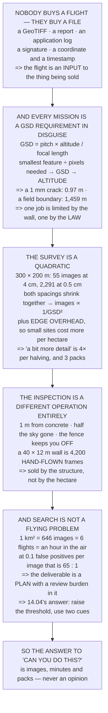

# 18.01 The civil missions: survey, inspection, delivery, monitoring, search

<!-- glance:start -->
<!-- generated by tools/build.py from curriculum/syllabus.yaml — edit the syllabus, not this block -->

| | |
|---|---|
| **Track** | Main path |
| **Difficulty** | Beginner |
| **Time** | 1 h |
| **Hardware** | none |
| **Software** | none |
| **Prerequisites** | [12.06 Writing your own mission logic in Python](../12-autonomous-flight/12.06-missions-from-python.md) |
| **Skip if** | You can describe five civil UAV missions and what the client actually receives at the end of each. |

<!-- glance:end -->

## What you will learn

- That **nobody buys a flight** — the deliverable is a file, and the flight is the short part of
  producing it
- That **every civil mission is a GSD requirement in disguise**, and the resolution fixes the
  altitude before anything else is decided
- That a 1 mm crack puts you **0.97 m from the structure** and a field boundary wants 1,459 m —
  above the legal ceiling
- That survey image count goes as **1/GSD²**: 55 images at 4 cm, **2,291 at 0.5 cm** on the same
  site
- That **edge overhead is why small sites cost more per hectare**, and it is the second thing nobody
  puts in a quote
- That an inspection is **4,200 hand-flown frames per wall face** against a survey's 55 automatic
  ones — the two prices have nothing to do with each other
- That search-and-rescue flying is easy and **the base rate is not**: 646 images per km², and 65
  things to look at for one person
- And which of Hermon's missions are **yes, no, or "the flying is the easy part"**

## Why it matters

This module leaves the aircraft alone and asks what the aircraft is *for*. The answer matters
commercially — a job you quote at the wrong rate is a job you lose money on — but it matters
technically first, because every mission arrives as a sentence in a client's words and has to leave
as a number of images, a number of minutes and a number of battery packs.

The conversion between those two is this lesson, and it runs through a single quantity. Resolution
sets altitude; altitude sets footprint; footprint and overlap set image count; image count sets
flight time and processing time and therefore the whole day. Get that chain right and "can you do
this?" becomes arithmetic.

Two of the answers are uncomfortable and both are worth having early. One mission is
**quadratically** more expensive than clients expect. One is not really a flying problem at all —
it is a reviewing problem, and the reviewing burden is what decides whether it is achievable.

## Prerequisites

<!-- prereqs:start -->
## Prerequisites

You need these first:

- [12.06 Writing your own mission logic in Python](../12-autonomous-flight/12.06-missions-from-python.md)

### Optional prerequisite links

None.

Check your readiness: `python course.py why 18.01`
<!-- prereqs:end -->

## Concept

A civil drone job has a shape that is easy to miss when you are the one flying. Somebody needs to
know something about a piece of the world, and the thing they receive at the end is a file: an
orthomosaic, a report, a coordinate, an application log. The aircraft is a way of collecting the
pixels that file is made of, and the pixels have a required size.

That required size — the ground sample distance — is the hinge. It comes from the smallest thing
the client needs to see, divided by the number of pixels it takes to see it. Once you have it, the
altitude follows from 14.01's three numbers, and the footprint, the flight lines, the image count
and the flight time all follow from the altitude.

The second idea is that the relationship is quadratic. Halving the GSD halves the line spacing
*and* halves the shot spacing, so image count quadruples. A client asking for "a bit more detail" is
asking for something that costs four times as much per halving, and nobody tells them.

And the third is that two of the five missions break the survey model entirely. Inspection needs a
GSD so fine that the aircraft is metres from a structure rather than hundreds of metres above a
field, which changes the navigation, the failure mode and the pricing. Search needs so many images
that the constraint is not collecting them but *reviewing* them.

## Technical explanation

### Level 1 — five missions, and what the client actually receives

| mission | the deliverable | what is actually handed over |
|---|---|---|
| aerial survey | an orthomosaic + a DSM, at a stated GSD | a GeoTIFF and a point cloud |
| infrastructure inspection | images of every defect, geo-tagged | a report with a photo per finding |
| agricultural spraying | a treated field, and a record of it | an application log |
| delivery | a package, at a place, at a time | a signature or a photo |
| search and rescue | a position, or a confident "not here" | a coordinate and a timestamp |

**None of them is a flight.** The flight is an input to a process whose output is a file, and 18.02
shows that it is also the short part of the day. And they have one more thing in common, which is
this lesson: every single one is a **resolution requirement** in disguise.

### Level 2 — every mission is a GSD requirement

`GSD = pitch × altitude / focal length` = 1.542 µm × h / 4.5 mm.

| altitude | GSD | footprint | a person (0.5 m) |
|---|---|---|---|
| 10 m | 0.34 cm | 14 × 10 m | 146 px |
| 30 m | 1.03 cm | 41 × 31 m | 49 px |
| 60 m | 2.06 cm | 82 × 62 m | 24 px |
| 120 m | 4.11 cm | 165 × 123 m | 12 px |

Now turn it round. Each mission states what it must *resolve*, and that fixes the altitude before
anything else is decided:

| what you must see | GSD needed | altitude | vs the ceiling |
|---|---|---|---|
| **a 1 mm crack, 3 px across** | 0.03 cm | **0.97 m** | OK |
| a roof tile, 10 px | 3.00 cm | 87.5 m | OK |
| a weed rosette, 10 px | 1.50 cm | 43.8 m | OK |
| a person, 10 px | 5.00 cm | 145.9 m | **above 18.05's limit** |
| a car, 20 px | 20.00 cm | 583.7 m | **above 18.05's limit** |
| **a field boundary, 2 px** | 50.00 cm | **1,459 m** | **above 18.05's limit** |

Two rows are the whole lesson. The crack needs you **0.97 metres from the structure**, which is not
a survey at all — Level 4. And the field boundary wants 1,459 m, so for the *coarsest* job in the
list you are limited by the **law** rather than by the camera, and the answer is more flight lines.

### Level 3 — the survey: image count goes as 1/GSD²

A 300 × 200 m site, 75 % forward and 65 % side overlap:

| altitude | GSD | lines | shots | **images** | path | flight |
|---|---|---|---|---|---|---|
| 120 m | 4.11 cm | 5 | 11 | **55** | 1.73 km | 5.8 min |
| 60 m | 2.06 cm | 8 | 21 | **168** | 2.60 km | 8.7 min |
| 30 m | 1.03 cm | 15 | 40 | **600** | 4.70 km | 15.7 min |
| 15 m | 0.51 cm | 29 | 79 | **2,291** | 8.90 km | 29.7 min |

Eight times lower is **42 times more images** and 5 times more flying, because both the line spacing
and the shot spacing shrink together.

The asymptotic law says 64× and the table says 42, and the gap is worth understanding: at 120 m the
footprint is a large fraction of the site, so the extra line and the extra shot at each edge are a
big share of the total. **Edge overhead is why small sites cost more per hectare than big ones**, and
it is the second thing nobody puts in a quote.

The first thing is the quadratic itself. A client who asks for "a bit more detail" is asking for
four times the data per halving, and the polite version of that conversation is a table like this
one with their site's dimensions in it.

And then the battery arrives. Hermon has 14.93 min after module 17, less 11.05's reserve — call it
11.2 min of useful survey:

| altitude | flight | flights | packs |
|---|---|---|---|
| 120 m | 5.8 min | 1 | 1 |
| 60 m | 8.7 min | 1 | 1 |
| 30 m | 15.7 min | 2 | 2 |
| **15 m** | 29.7 min | **3** | **3** |

The 120 m job is one pack and the 15 m job is three — and 16.01 said three packs is a working day's
worth of turnaround, so **the 15 m survey does not fit in a day**. That is a scheduling fact you
discover when quoting, not on site.

### Level 4 — the inspection is not a survey

Level 2 put the crack inspection at 0.97 m from the surface. Everything about the flight changes:

| | survey | inspection |
|---|---|---|
| the reference | GNSS above a field | **a structure one metre away** |
| 13.02's satellites | full sky | a wall takes half of it |
| 12.03's fence | keeps you **in** | must keep you **off** |
| the failure case | descend to the ground | **descend into the thing** |
| 14.03's stabilisation | smooths a survey | is the whole measurement |
| the pilot | watches a mission fly | flies it, one surface at a time |

And the arithmetic is brutal. At 0.97 m the frame covers 1.33 × 1.00 m. A 40 × 12 m wall face is
**4,200 images** at the same overlaps, flown by hand, one metre from concrete.

**So inspection is sold by the structure and survey by the hectare, and the two prices have nothing
to do with each other.** An operator who quotes an inspection at a survey rate has agreed to fly
4,200 hand-flown frames for the price of 55 automatic ones.

And 13.05 is why it is the hardest flying in this course: one metre from a wall, half the sky gone,
GNSS degraded, and the failure mode points *at* the thing you are inspecting.

### Level 5 — search: the area is easy and the base rate is not

A person at 10 px needs 145.9 m and the ceiling allows 120, so fly at 120 m and accept 12 px. One
square kilometre:

| | |
|---|---|
| GSD | 4.11 cm |
| lines × shots | 19 × 34 |
| **images** | **646** |
| flight time | 66.8 min |
| flights, at 11.2 useful min | 6 |

Six flights and about an hour in the air. **The flying is not the problem.** The problem is 14.04's
base rate at a new scale — every image is searched, by a person or by a detector, for one target
that is probably not in it:

| false positives per image | per km² | real targets | ratio |
|---|---|---|---|
| 0.01 | 6 | 1 | 6 : 1 |
| **0.10** | **65** | 1 | **65 : 1** |
| 1.00 | 646 | 1 | 646 : 1 |
| 5.00 | 3,230 | 1 | 3,230 : 1 |

At a tenth of a false positive per image — which would be an excellent detector — one square
kilometre produces **65 things to look at for one person who might be there**.

So the SAR deliverable is not "a detection". It is a search plan with a stated probability of
detection **and a stated review burden**, and the honest version of the second number decides
whether the first is achievable with the people you have. 14.04's answer applies unchanged: raise
the threshold, accept fewer detections, and use two independent cues.

### Level 6 — what Hermon can actually do

| mission | verdict | the binding number |
|---|---|---|
| aerial survey, 4 cm | **yes** | 55 images, 5.8 min, 1 pack |
| aerial survey, 0.5 cm | **no** | 2,291 images, 30 min, 3 packs |
| infrastructure inspection | with a pilot | 4,200 hand-flown frames per wall |
| agricultural spraying | **no** | 17.03: the tank lasts 20 s and the pack 18.6 min |
| spot treatment | **yes** | 17.03: 17 spots per tank, 2.2 min |
| delivery | yes, 250 g | 17.05: CEP 8.9 m on a found target |
| search and rescue | the flying, yes | 646 images to review per km² |

Four yeses, two noes and one "the flying is the easy part" — and **every verdict came from a number
frozen earlier in the course**, not from an opinion about what small drones are good at.

That is the skill this module is about: a client describes a job in words, and you answer in images,
minutes and packs.

> [!TIP]
> **Ask your teacher:** "What GSD did the client ask for?" Most of the time they did not ask for
> one — they described a thing they need to see. Converting that sentence into a number, in front of
> them, is the most valuable thing you can do in a first meeting.

## Diagram



## Code

The mission arithmetic: GSD and footprint from 14.01's camera, the inverse map from "what must I
see" to an altitude and a check against the legal ceiling, a lawnmower survey planner that produces
lines, images, path length and packs at four altitudes, the inspection geometry that falls out of a
0.03 cm GSD, and the search-and-rescue review burden at a square kilometre.

```python
"""18.01 -- the five civil missions, and what the client actually receives.

Pure stdlib. The camera is 14.01's, the aircraft is Hermon after module
17, and every mission in this lesson turns out to be the same question
asked at a different scale.
"""

import math

# ---- 14.01's camera -----------------------------------------------------
PITCH_M = 1.542e-6
FOCAL_M = 4.5e-3
SENSOR_W_M = 6.17e-3
SENSOR_H_M = 4.63e-3
PX_W, PX_H = 4000, 3000

# ---- Hermon, after module 17 --------------------------------------------
ENDUR_MIN = 14.93         # 17.06: the floor after the pod and the sensor
ENDUR_BARE_MIN = 23.6
SURVEY_MS = 5.0
CEILING_M = 120.0         # 18.05's Part 107 ceiling
CEP_MISSION_M = 8.87      # 17.05

# ---- the job ------------------------------------------------------------
SITE_W_M, SITE_H_M = 300.0, 200.0
OVERLAP_FWD = 0.75
OVERLAP_SIDE = 0.65

BAR = "=" * 70


def head(n, title):
    print()
    print(BAR)
    print("%d. %s" % (n, title))
    print(BAR)


def gsd_m(alt_m):
    """Ground sample distance: how much ground one pixel covers."""
    if alt_m <= 0:
        raise ValueError("altitude must be positive")
    return PITCH_M * alt_m / FOCAL_M


def alt_for_gsd(g_m):
    return g_m * FOCAL_M / PITCH_M


def footprint_m(alt_m):
    return (SENSOR_W_M * alt_m / FOCAL_M, SENSOR_H_M * alt_m / FOCAL_M)


def survey_plan(alt_m, w=SITE_W_M, h=SITE_H_M):
    """Images, lines and flight time for a lawnmower survey."""
    fw, fh = footprint_m(alt_m)          # fw across track, fh along track
    spacing = fw * (1.0 - OVERLAP_SIDE)
    shot_gap = fh * (1.0 - OVERLAP_FWD)
    lines = max(1, int(math.ceil(h / spacing)) + 1)
    shots = max(1, int(math.ceil(w / shot_gap)) + 1)
    path_m = lines * w + (lines - 1) * spacing
    return {
        "gsd": gsd_m(alt_m), "lines": lines, "shots": shots,
        "images": lines * shots, "spacing": spacing, "shot_gap": shot_gap,
        "path_m": path_m, "time_min": path_m / SURVEY_MS / 60.0,
    }


# ========================================================================
head(1, "FIVE MISSIONS, AND WHAT THE CLIENT ACTUALLY RECEIVES")

print("  Nobody buys a flight. They buy a file, and the file is what")
print("  the job is really about:")
print()
MISSIONS = [
    ("aerial survey", "an orthomosaic + a DSM, at a stated GSD",
     "a GeoTIFF and a point cloud"),
    ("infrastructure inspection", "images of every defect, geo-tagged",
     "a report with a photo per finding"),
    ("agricultural spraying", "a treated field, and a record of it",
     "an application log"),
    ("delivery", "a package, at a place, at a time",
     "a signature or a photo"),
    ("search and rescue", "a position, or a confident 'not here'",
     "a coordinate and a timestamp"),
]
print("  %-26s %-38s" % ("mission", "the deliverable"))
for name, deliverable, artefact in MISSIONS:
    print("  %-26s %-38s" % (name, deliverable))
print()
print("  %-26s %s" % ("mission", "what is actually handed over"))
for name, deliverable, artefact in MISSIONS:
    print("  %-26s %s" % (name, artefact))
print()
print("  READ THE SECOND TABLE AND NOTICE THAT NONE OF THEM IS A FLIGHT.")
print("  The flight is an input to a process whose output is a file,")
print("  and 18.02 will show that the flight is also the SHORT part of")
print("  the day.")
print()
print("  AND THEY HAVE SOMETHING ELSE IN COMMON, WHICH IS THIS LESSON:")
print("  every single one is a RESOLUTION requirement in disguise, and")
print("  the resolution decides the altitude, which decides everything.")

# ========================================================================
head(2, "EVERY MISSION IS A GSD REQUIREMENT")

print("  14.01 reduced the camera to three numbers, and the one that")
print("  matters operationally is:")
print()
print("      GSD = pitch x altitude / focal length")
print("          = %.3f um x h / %.1f mm" % (PITCH_M * 1e6, FOCAL_M * 1e3))
print()
print("  %-16s %10s %16s %16s"
      % ("altitude", "GSD", "footprint", "a person (0.5 m)"))
for alt in (10.0, 30.0, 60.0, 120.0):
    g = gsd_m(alt)
    fw, fh = footprint_m(alt)
    print("  %-16s %7.2f cm %8.0f x %-5.0f m %10.0f px"
          % ("%.0f m" % alt, g * 100, fw, fh, 0.5 / g))
print()
print("  NOW TURN IT ROUND. Each mission states what it must RESOLVE,")
print("  and that fixes the altitude before anything else is decided:")
print()
print("  %-30s %10s %12s %12s"
      % ("what you must see", "GSD needed", "altitude", "vs ceiling"))
NEEDS = [
    ("a 1 mm crack, 3 px across", 0.001 / 3),
    ("a roof tile, 10 px", 0.30 / 10),
    ("a weed rosette, 10 px", 0.15 / 10),
    ("a person, 10 px", 0.50 / 10),
    ("a car, 20 px", 4.00 / 20),
    ("a field boundary, 2 px", 1.00 / 2),
]
for label, g in NEEDS:
    alt = alt_for_gsd(g)
    flag = "OK" if alt <= CEILING_M else "ABOVE 18.05's LIMIT"
    print("  %-30s %8.2f cm %9.1f m %14s"
          % (label, g * 100, alt, flag))

print()
print("  TWO ROWS ARE THE WHOLE LESSON.")
print("  THE CRACK NEEDS YOU %.2f METRES FROM THE STRUCTURE -- which is"
      % alt_for_gsd(0.001 / 3))
print("  not a survey at all, and section 4 is about what it is instead.")
print("  THE FIELD BOUNDARY WANTS %.0f m, ABOVE THE CEILING -- so for"
      % alt_for_gsd(1.00 / 2))
print("  the coarsest job in the list you are limited by the LAW rather")
print("  than by the camera, and the answer is more flight lines.")

# ========================================================================
head(3, "THE SURVEY: IMAGE COUNT GOES AS ONE OVER GSD SQUARED")

print("  A %.0f x %.0f m site, %.0f %% forward and %.0f %% side overlap:"
      % (SITE_W_M, SITE_H_M, OVERLAP_FWD * 100, OVERLAP_SIDE * 100))
print()
print("  %-10s %8s %7s %7s %8s %9s %9s"
      % ("altitude", "GSD cm", "lines", "shots", "IMAGES", "path km",
         "flight"))
for alt in (120.0, 60.0, 30.0, 15.0):
    p = survey_plan(alt)
    print("  %-10s %8.2f %7d %7d %8d %9.2f %7.1f min"
          % ("%.0f m" % alt, p["gsd"] * 100, p["lines"], p["shots"],
             p["images"], p["path_m"] / 1000.0, p["time_min"]))

p120 = survey_plan(120.0)
p15 = survey_plan(15.0)
print()
print("  EIGHT TIMES LOWER IS %.0f TIMES MORE IMAGES AND %.0f TIMES MORE"
      % (p15["images"] / p120["images"], p15["time_min"] / p120["time_min"]))
print("  FLYING, because both the line spacing AND the shot spacing")
print("  shrink together: IMAGES GO AS ONE OVER GSD SQUARED.")
print()
print("  THE ASYMPTOTIC LAW SAYS %.0f TIMES AND THE TABLE SAYS %.0f,"
      % (64, p15["images"] / p120["images"]))
print("  and the gap is worth understanding: at %.0f m the footprint is"
      % 120.0)
print("  a large fraction of the site, so the extra line and the extra")
print("  shot at each edge are a big share of the total. EDGE OVERHEAD")
print("  IS WHY SMALL SITES COST MORE PER HECTARE THAN BIG ONES, and it")
print("  is the second thing nobody puts in a quote.")
print()
print("  WHICH IS THE NUMBER TO QUOTE ON, and almost nobody does. A")
print("  client who asks for 'a bit more detail' is asking for a")
print("  quadratic, and the polite version of that conversation is a")
print("  table like this one with their site's dimensions in it.")
print()
print("  AND NOW THE BATTERY ARRIVES. Hermon has %.1f min after module"
      % ENDUR_MIN)
print("  17, less 11.05's reserve -- call it %.1f min of useful survey:"
      % (ENDUR_MIN * 0.75))
useful = ENDUR_MIN * 0.75
print()
print("  %-10s %9s %10s %12s" % ("altitude", "flight", "flights", "packs"))
for alt in (120.0, 60.0, 30.0, 15.0):
    p = survey_plan(alt)
    n = math.ceil(p["time_min"] / useful)
    print("  %-10s %7.1f min %8d %12d" % ("%.0f m" % alt, p["time_min"],
                                          n, n))
print()
print("  THE %.0f m JOB IS ONE PACK AND THE %.0f m JOB IS %d."
      % (120.0, 15.0, math.ceil(p15["time_min"] / useful)))
print("  16.01 said three packs is a working day's worth of turnaround,")
print("  so THE 15 m SURVEY DOES NOT FIT IN A DAY -- and that is a")
print("  scheduling fact you discover when quoting, not on site.")

# ========================================================================
head(4, "THE INSPECTION IS NOT A SURVEY. IT IS A DIFFERENT OPERATION.")

crack_alt = alt_for_gsd(0.001 / 3)
print("  Section 2 put the crack inspection at %.2f m from the surface."
      % crack_alt)
print("  Everything about the flight changes at that distance:")
print()
ROWS = [
    ("the reference", "GNSS above a field", "a STRUCTURE one metre away"),
    ("13.02's satellites", "full sky", "a wall takes half of it"),
    ("12.03's fence", "keeps you IN", "must keep you OFF"),
    ("the failure case", "descend to the ground",
     "descend INTO the thing"),
    ("14.03's stabilisation", "smooths a survey",
     "is the whole measurement"),
    ("the pilot", "watches a mission fly",
     "flies it, one surface at a time"),
]
print("  %-22s %-24s %-24s" % ("", "survey", "inspection"))
for what, a, b in ROWS:
    print("  %-22s %-24s %-24s" % (what, a, b))

fw, fh = footprint_m(crack_alt)
area_per_shot = fw * fh
wall_w, wall_h = 40.0, 12.0
shots_wall = math.ceil(wall_w / (fw * (1 - OVERLAP_FWD))) * \
    math.ceil(wall_h / (fh * (1 - OVERLAP_SIDE)))
print()
print("  AND THE ARITHMETIC IS BRUTAL. At %.2f m the frame covers"
      % crack_alt)
print("  %.2f x %.2f m = %.2f square metres." % (fw, fh, area_per_shot))
print("  A %.0f x %.0f m wall face is %d IMAGES at the same overlaps,"
      % (wall_w, wall_h, shots_wall))
print("  flown by hand, one metre from concrete.")
print()
print("  SO INSPECTION IS SOLD BY THE STRUCTURE AND SURVEY BY THE")
print("  HECTARE, AND THE TWO PRICES HAVE NOTHING TO DO WITH EACH")
print("  OTHER. An operator who quotes an inspection at a survey rate")
print("  has agreed to fly %d hand-flown frames for the price of %d"
      % (shots_wall, survey_plan(120.0)["images"]))
print("  automatic ones.")
print()
print("  AND 13.05 IS WHY IT IS THE HARDEST FLYING IN THIS COURSE: one")
print("  metre from a wall, half the sky gone, GNSS degraded, and the")
print("  failure mode points AT the thing you are inspecting.")

# ========================================================================
head(5, "SEARCH: THE AREA IS EASY AND THE BASE RATE IS NOT")

SAR_KM2 = 1.0
alt_sar = alt_for_gsd(0.50 / 10)
alt_sar = min(alt_sar, CEILING_M)
p_sar = survey_plan(alt_sar, w=1000.0, h=1000.0)
print("  A person at 10 px needs %.1f m; the ceiling allows %.0f, so"
      % (alt_for_gsd(0.05), CEILING_M))
print("  fly at %.0f m and accept %.0f px on a person."
      % (alt_sar, 0.5 / gsd_m(alt_sar)))
print()
print("  ONE SQUARE KILOMETRE AT THAT ALTITUDE:")
print("    GSD                         %8.2f cm" % (gsd_m(alt_sar) * 100))
print("    lines x shots               %5d x %-5d" % (p_sar["lines"],
                                                      p_sar["shots"]))
print("    IMAGES                      %8d" % p_sar["images"])
print("    flight time                 %8.1f min" % p_sar["time_min"])
print("    flights, at %.1f useful min  %8d"
      % (useful, math.ceil(p_sar["time_min"] / useful)))
print()
print("  WHICH IS %d FLIGHTS AND ABOUT %.0f MINUTES IN THE AIR. THE"
      % (math.ceil(p_sar["time_min"] / useful), p_sar["time_min"]))
print("  FLYING IS NOT THE PROBLEM.")
print()
print("  THE PROBLEM IS 14.04's BASE RATE, AT A NEW SCALE. Every image")
print("  is searched, by a person or by a detector, for ONE target that")
print("  is probably not in it:")
print()
print("  %-28s %12s %14s %14s"
      % ("false positives per image", "per km2", "real targets", "ratio"))
for fp in (0.01, 0.1, 1.0, 5.0):
    total_fp = fp * p_sar["images"]
    print("  %-28s %12.0f %14d %12.0f : 1"
          % ("%.2f" % fp, total_fp, 1, total_fp))
print()
print("  AT A TENTH OF A FALSE POSITIVE PER IMAGE -- WHICH WOULD BE AN")
print("  EXCELLENT DETECTOR -- ONE SQUARE KILOMETRE PRODUCES %.0f"
      % (0.1 * p_sar["images"]))
print("  THINGS TO LOOK AT FOR ONE PERSON WHO MIGHT BE THERE.")
print()
print("  SO THE SAR DELIVERABLE IS NOT 'A DETECTION'. IT IS A SEARCH")
print("  PLAN WITH A STATED PROBABILITY OF DETECTION AND A STATED")
print("  REVIEW BURDEN -- and the honest version of the second number")
print("  is the one that decides whether the first is achievable with")
print("  the people you have.")
print()
print("  14.04's answer applies unchanged: raise the threshold, accept")
print("  fewer detections, and use TWO independent cues. A single")
print("  confident cue over %d images is a statement about arithmetic,"
      % p_sar["images"])
print("  not about the detector.")

# ========================================================================
head(6, "WHAT HERMON CAN ACTUALLY DO, AND WHAT IT CANNOT")

print("  %-26s %-16s %s" % ("mission", "verdict", "the binding number"))
VERDICTS = [
    ("aerial survey, 4 cm", "YES",
     "%d images, %.1f min, 1 pack" % (p120["images"], p120["time_min"])),
    ("aerial survey, 0.5 cm", "NO",
     "%d images, %.0f min, %d packs"
     % (p15["images"], p15["time_min"],
        math.ceil(p15["time_min"] / useful))),
    ("infrastructure inspection", "WITH A PILOT",
     "%d hand-flown frames per wall" % shots_wall),
    ("agricultural spraying", "NO",
     "17.03: the tank lasts 20 s and the pack 18.6 min"),
    ("spot treatment", "YES",
     "17.03: 17 spots per tank, 2.2 min"),
    ("delivery", "YES, 250 g",
     "17.05: CEP %.1f m on a found target" % CEP_MISSION_M),
    ("search and rescue", "THE FLYING, YES",
     "%d images to review per km2" % p_sar["images"]),
]
for name, v, why in VERDICTS:
    print("  %-26s %-16s %s" % (name, v, why))

print()
print("  FOUR YESES, TWO NOES AND ONE 'THE FLYING IS THE EASY PART'.")
print()
print("  AND EVERY VERDICT IN THAT COLUMN CAME FROM A NUMBER FROZEN")
print("  EARLIER IN THE COURSE, not from an opinion about what small")
print("  drones are good at. THAT IS THE SKILL THIS MODULE IS ABOUT:")
print("  a client describes a job in words, and you answer in images,")
print("  minutes and packs.")
print()
print("  THE ONE-LINE VERSION TO CARRY INTO 18.02:")
print("    * the deliverable is a FILE, never a flight")
print("    * every mission is a GSD requirement in disguise")
print("    * images go as 1/GSD^2, so 'a bit more detail' is a quadratic")
print("    * and the flying is the short, cheap, easy part of all of it")
```

Output:

```text

======================================================================
1. FIVE MISSIONS, AND WHAT THE CLIENT ACTUALLY RECEIVES
======================================================================
  Nobody buys a flight. They buy a file, and the file is what
  the job is really about:

  mission                    the deliverable                       
  aerial survey              an orthomosaic + a DSM, at a stated GSD
  infrastructure inspection  images of every defect, geo-tagged    
  agricultural spraying      a treated field, and a record of it   
  delivery                   a package, at a place, at a time      
  search and rescue          a position, or a confident 'not here' 

  mission                    what is actually handed over
  aerial survey              a GeoTIFF and a point cloud
  infrastructure inspection  a report with a photo per finding
  agricultural spraying      an application log
  delivery                   a signature or a photo
  search and rescue          a coordinate and a timestamp

  READ THE SECOND TABLE AND NOTICE THAT NONE OF THEM IS A FLIGHT.
  The flight is an input to a process whose output is a file,
  and 18.02 will show that the flight is also the SHORT part of
  the day.

  AND THEY HAVE SOMETHING ELSE IN COMMON, WHICH IS THIS LESSON:
  every single one is a RESOLUTION requirement in disguise, and
  the resolution decides the altitude, which decides everything.

======================================================================
2. EVERY MISSION IS A GSD REQUIREMENT
======================================================================
  14.01 reduced the camera to three numbers, and the one that
  matters operationally is:

      GSD = pitch x altitude / focal length
          = 1.542 um x h / 4.5 mm

  altitude                GSD        footprint a person (0.5 m)
  10 m                0.34 cm       14 x 10    m        146 px
  30 m                1.03 cm       41 x 31    m         49 px
  60 m                2.06 cm       82 x 62    m         24 px
  120 m               4.11 cm      165 x 123   m         12 px

  NOW TURN IT ROUND. Each mission states what it must RESOLVE,
  and that fixes the altitude before anything else is decided:

  what you must see              GSD needed     altitude   vs ceiling
  a 1 mm crack, 3 px across          0.03 cm       1.0 m             OK
  a roof tile, 10 px                 3.00 cm      87.5 m             OK
  a weed rosette, 10 px              1.50 cm      43.8 m             OK
  a person, 10 px                    5.00 cm     145.9 m ABOVE 18.05's LIMIT
  a car, 20 px                      20.00 cm     583.7 m ABOVE 18.05's LIMIT
  a field boundary, 2 px            50.00 cm    1459.1 m ABOVE 18.05's LIMIT

  TWO ROWS ARE THE WHOLE LESSON.
  THE CRACK NEEDS YOU 0.97 METRES FROM THE STRUCTURE -- which is
  not a survey at all, and section 4 is about what it is instead.
  THE FIELD BOUNDARY WANTS 1459 m, ABOVE THE CEILING -- so for
  the coarsest job in the list you are limited by the LAW rather
  than by the camera, and the answer is more flight lines.

======================================================================
3. THE SURVEY: IMAGE COUNT GOES AS ONE OVER GSD SQUARED
======================================================================
  A 300 x 200 m site, 75 % forward and 65 % side overlap:

  altitude     GSD cm   lines   shots   IMAGES   path km    flight
  120 m          4.11       5      11       55      1.73     5.8 min
  60 m           2.06       8      21      168      2.60     8.7 min
  30 m           1.03      15      40      600      4.70    15.7 min
  15 m           0.51      29      79     2291      8.90    29.7 min

  EIGHT TIMES LOWER IS 42 TIMES MORE IMAGES AND 5 TIMES MORE
  FLYING, because both the line spacing AND the shot spacing
  shrink together: IMAGES GO AS ONE OVER GSD SQUARED.

  THE ASYMPTOTIC LAW SAYS 64 TIMES AND THE TABLE SAYS 42,
  and the gap is worth understanding: at 120 m the footprint is
  a large fraction of the site, so the extra line and the extra
  shot at each edge are a big share of the total. EDGE OVERHEAD
  IS WHY SMALL SITES COST MORE PER HECTARE THAN BIG ONES, and it
  is the second thing nobody puts in a quote.

  WHICH IS THE NUMBER TO QUOTE ON, and almost nobody does. A
  client who asks for 'a bit more detail' is asking for a
  quadratic, and the polite version of that conversation is a
  table like this one with their site's dimensions in it.

  AND NOW THE BATTERY ARRIVES. Hermon has 14.9 min after module
  17, less 11.05's reserve -- call it 11.2 min of useful survey:

  altitude      flight    flights        packs
  120 m          5.8 min        1            1
  60 m           8.7 min        1            1
  30 m          15.7 min        2            2
  15 m          29.7 min        3            3

  THE 120 m JOB IS ONE PACK AND THE 15 m JOB IS 3.
  16.01 said three packs is a working day's worth of turnaround,
  so THE 15 m SURVEY DOES NOT FIT IN A DAY -- and that is a
  scheduling fact you discover when quoting, not on site.

======================================================================
4. THE INSPECTION IS NOT A SURVEY. IT IS A DIFFERENT OPERATION.
======================================================================
  Section 2 put the crack inspection at 0.97 m from the surface.
  Everything about the flight changes at that distance:

                         survey                   inspection              
  the reference          GNSS above a field       a STRUCTURE one metre away
  13.02's satellites     full sky                 a wall takes half of it 
  12.03's fence          keeps you IN             must keep you OFF       
  the failure case       descend to the ground    descend INTO the thing  
  14.03's stabilisation  smooths a survey         is the whole measurement
  the pilot              watches a mission fly    flies it, one surface at a time

  AND THE ARITHMETIC IS BRUTAL. At 0.97 m the frame covers
  1.33 x 1.00 m = 1.33 square metres.
  A 40 x 12 m wall face is 4200 IMAGES at the same overlaps,
  flown by hand, one metre from concrete.

  SO INSPECTION IS SOLD BY THE STRUCTURE AND SURVEY BY THE
  HECTARE, AND THE TWO PRICES HAVE NOTHING TO DO WITH EACH
  OTHER. An operator who quotes an inspection at a survey rate
  has agreed to fly 4200 hand-flown frames for the price of 55
  automatic ones.

  AND 13.05 IS WHY IT IS THE HARDEST FLYING IN THIS COURSE: one
  metre from a wall, half the sky gone, GNSS degraded, and the
  failure mode points AT the thing you are inspecting.

======================================================================
5. SEARCH: THE AREA IS EASY AND THE BASE RATE IS NOT
======================================================================
  A person at 10 px needs 145.9 m; the ceiling allows 120, so
  fly at 120 m and accept 12 px on a person.

  ONE SQUARE KILOMETRE AT THAT ALTITUDE:
    GSD                             4.11 cm
    lines x shots                  19 x 34   
    IMAGES                           646
    flight time                     66.8 min
    flights, at 11.2 useful min         6

  WHICH IS 6 FLIGHTS AND ABOUT 67 MINUTES IN THE AIR. THE
  FLYING IS NOT THE PROBLEM.

  THE PROBLEM IS 14.04's BASE RATE, AT A NEW SCALE. Every image
  is searched, by a person or by a detector, for ONE target that
  is probably not in it:

  false positives per image         per km2   real targets          ratio
  0.01                                    6              1            6 : 1
  0.10                                   65              1           65 : 1
  1.00                                  646              1          646 : 1
  5.00                                 3230              1         3230 : 1

  AT A TENTH OF A FALSE POSITIVE PER IMAGE -- WHICH WOULD BE AN
  EXCELLENT DETECTOR -- ONE SQUARE KILOMETRE PRODUCES 65
  THINGS TO LOOK AT FOR ONE PERSON WHO MIGHT BE THERE.

  SO THE SAR DELIVERABLE IS NOT 'A DETECTION'. IT IS A SEARCH
  PLAN WITH A STATED PROBABILITY OF DETECTION AND A STATED
  REVIEW BURDEN -- and the honest version of the second number
  is the one that decides whether the first is achievable with
  the people you have.

  14.04's answer applies unchanged: raise the threshold, accept
  fewer detections, and use TWO independent cues. A single
  confident cue over 646 images is a statement about arithmetic,
  not about the detector.

======================================================================
6. WHAT HERMON CAN ACTUALLY DO, AND WHAT IT CANNOT
======================================================================
  mission                    verdict          the binding number
  aerial survey, 4 cm        YES              55 images, 5.8 min, 1 pack
  aerial survey, 0.5 cm      NO               2291 images, 30 min, 3 packs
  infrastructure inspection  WITH A PILOT     4200 hand-flown frames per wall
  agricultural spraying      NO               17.03: the tank lasts 20 s and the pack 18.6 min
  spot treatment             YES              17.03: 17 spots per tank, 2.2 min
  delivery                   YES, 250 g       17.05: CEP 8.9 m on a found target
  search and rescue          THE FLYING, YES  646 images to review per km2

  FOUR YESES, TWO NOES AND ONE 'THE FLYING IS THE EASY PART'.

  AND EVERY VERDICT IN THAT COLUMN CAME FROM A NUMBER FROZEN
  EARLIER IN THE COURSE, not from an opinion about what small
  drones are good at. THAT IS THE SKILL THIS MODULE IS ABOUT:
  a client describes a job in words, and you answer in images,
  minutes and packs.

  THE ONE-LINE VERSION TO CARRY INTO 18.02:
    * the deliverable is a FILE, never a flight
    * every mission is a GSD requirement in disguise
    * images go as 1/GSD^2, so 'a bit more detail' is a quadratic
    * and the flying is the short, cheap, easy part of all of it
```

## Exercise

### Exercise 18.01-E1 — Convert a sentence into a number `[analysis]`

Take three real jobs described in a client's words — "check the roof", "map the site", "find the
leak" — and convert each into a GSD, an altitude, an image count and a pack count. Write down the
assumption you had to invent for each.

### Exercise 18.01-E2 — The quadratic conversation `[analysis]`

Build the Level 3 table for a real site you could fly. Then write the two sentences you would
actually say to a client who asks for twice the detail.

### Exercise 18.01-E3 — Price an inspection properly `[analysis]`

Pick a real structure, compute its surface area, and compute the frame count at the GSD its defects
need. Compare with what the same area would cost as a survey.

### Exercise 18.01-E4 — The review burden `[analysis]`

For a search area you might actually be asked to cover, compute the image count and then estimate
how long a human takes per image. Multiply. Decide whether the job is possible.

## Expected result

**18.01-E1**: expect the invented assumption to be "how many pixels does it take to see it", and
expect it to be the number that moves the answer most. Three pixels versus ten is a factor of three
in altitude and nine in images.

**18.01-E2**: expect the honest sentence to be "that is four times the data and three times the
flying" and expect it to be well received. Clients respond badly to surprises and well to tables.

**18.01-E3**: expect the inspection frame count to exceed the survey count by one to two orders of
magnitude for the same physical area, and expect the flying to be manual.

**18.01-E4**: at a generous two seconds per image, 646 images is 22 minutes of review per km² — and
at 5 seconds it is nearly an hour, which is longer than the flying. That crossover is the number to
know.

## Troubleshooting

**The altitude the GSD demands is above the legal ceiling.** Then the camera is not the constraint;
fly more lines at a legal altitude and accept the extra time, or use a longer lens.

**The altitude is below what the site allows** (trees, structures, 12.03's floor). The same problem
inverted — a longer lens buys GSD at a higher altitude, at the cost of footprint and therefore of
image count.

**The image count is too large to process.** Reduce the overlap before reducing the GSD: dropping
side overlap from 65 % to 60 % removes lines without touching resolution, at some risk to the
reconstruction.

**The client will not state a GSD.** They almost never will. Ask what the smallest thing they must
see is, and how they will know it when they see it.

**A survey quoted by the hectare loses money at small sites.** Edge overhead, Level 3. Quote a
minimum-site charge, not a lower per-hectare rate.

**The inspection quote is refused as too expensive.** It usually is, compared to a survey. The
honest answer is the frame count; the practical answer is to inspect the part of the structure that
matters rather than all of it.

**Search finds nothing and the client is unhappy.** A confident "not here" is a deliverable, and it
needs a stated probability of detection to be worth anything. Agree that number *before* flying.

## Common mistakes

- **Quoting a flight rather than a deliverable.** Nobody buys a flight.
- **Not converting the client's sentence into a GSD.** Everything else follows from it.
- **Assuming "more detail" is linear.** It is quadratic, both ways.
- **Ignoring edge overhead on small sites.** It is why the per-hectare rate lies.
- **Pricing an inspection like a survey.** 4,200 frames against 55.
- **Forgetting that the inspection GSD puts you a metre from concrete.** 13.05's problem.
- **Treating SAR as a flying problem.** The flying is an hour; the reviewing is the job.
- **Promising a detection.** Promise a search plan with a probability and a review burden.
- **Checking the battery last.** It is what turns a quote into a schedule.

## Knowledge check

<details>
<summary>What is the client actually buying?</summary>

A file. An orthomosaic and a point cloud, a report with a photo per finding, an application log, a
signature, or a coordinate with a timestamp. The flight is an input to the process that produces it,
and 18.02 shows it is the short part — so quoting, scheduling and risk all attach to the deliverable
rather than to the flying.
</details>

<details>
<summary>How do you convert a client's sentence into an altitude?</summary>

Find the smallest thing they must see, divide by the pixels it takes to see it, and that is the GSD.
Then `altitude = GSD × focal / pitch`. A 1 mm crack at 3 px is 0.03 cm GSD and **0.97 m**; a 15 cm
weed rosette at 10 px is 1.5 cm and 43.8 m. Everything else in the plan follows from that altitude.
</details>

<details>
<summary>Why is "a bit more detail" an expensive request?</summary>

Because halving the GSD halves the line spacing *and* the shot spacing, so images go as **1/GSD²**.
On a 300 × 200 m site, 4 cm is 55 images and 0.5 cm is 2,291 — and the flight goes from 5.8 minutes
on one pack to 29.7 minutes on three, which 16.01 says does not fit in a working day.
</details>

<details>
<summary>Why does a small site cost more per hectare than a large one?</summary>

Edge overhead. At 120 m the footprint is 165 × 123 m, a large fraction of a 300 × 200 m site, so the
extra line and extra shot needed at each edge are a big share of the total. That is why the
observed ratio in Level 3 is 42× rather than the asymptotic 64×, and why a per-hectare rate
undercharges for small jobs.
</details>

<details>
<summary>Why is an inspection a different operation from a survey?</summary>

Because the GSD its defects need puts the aircraft about a metre from the structure. The reference
becomes a wall rather than open ground, half the sky is gone so 13.02's GNSS degrades, 12.03's fence
has to keep you *off* rather than *in*, and the failure mode points at the thing you are inspecting.
And a 40 × 12 m wall face is 4,200 hand-flown frames against a survey's 55 automatic ones.
</details>

<details>
<summary>What limits search and rescue?</summary>

Not the flying. One square kilometre at 120 m is 646 images, six flights, about an hour in the air.
It is 14.04's base rate at scale: at a tenth of a false positive per image — an excellent detector —
that is **65 things to look at for one person who might be there**. The deliverable has to include
the review burden, or the probability of detection is a number nobody can act on.
</details>

<details>
<summary>Which missions can Hermon do, and why does the list look like that?</summary>

Survey at 4 cm, spot treatment, 250 g delivery and the *flying* part of search: yes. A 0.5 cm survey
and broadcast spraying: no. Inspection: yes, but hand-flown. Every verdict is a number frozen
earlier — 17.03's 55 : 1 tank ratio, 17.05's 8.87 m CEP, 16.01's three packs — rather than an
opinion about small drones.
</details>

<details>
<summary>A job needs 50 cm GSD over a wide area. What is the constraint?</summary>

The law, not the camera. 50 cm GSD wants 1,459 m of altitude and 18.05's ceiling is 120 m, so the
coarsest job on the list is the one where the aircraft is over-capable and the rule binds. The
answer is more flight lines at a legal altitude — more time and more images than the resolution
requirement implies.
</details>

## Practical challenge

Turn three real enquiries into three real quotes.

1. Collect three job descriptions in a client's own words, from anywhere.
2. For each, agree the smallest feature that must be visible and the pixels it needs (E1).
3. Compute the GSD, the altitude, and check it against the ceiling and the site.
4. Compute lines, images, path and flight time; then packs.
5. Add the edge overhead explicitly, and compare per-hectare with the whole-job price (E2).
6. If one of them is an inspection, price it by frame count and say so (E3).
7. If one of them is a search, compute the review burden and agree a probability of detection (E4).
8. Write each quote as images, minutes, packs and a named deliverable — never as "a flight".

Step 8 is the deliverable of this lesson. A quote in those units is one you can defend, schedule
against and repeat.

## You can skip this if

You can describe five civil UAV missions and what the client actually receives at the end of each.
"Receives" means the file, not the flight.

## Go deeper

- Pix4D's and Agisoft's documentation on flight planning, GSD and overlap — the standard practical
  references for Level 3's arithmetic: <https://support.pix4d.com/hc/en-us/articles/202557459>
- The USGS's guidance on UAS data acquisition for mapping, which states GSD and overlap
  requirements for deliverables that must meet a published accuracy standard:
  <https://www.usgs.gov/uas>
- The National Search and Rescue Committee's addendum on probability of detection and search
  effectiveness — the formal version of Level 5's review-burden argument:
  <https://www.dco.uscg.mil/Our-Organization/Assistant-Commandant-for-Response-Policy-CG-5R/Office-of-Search-and-Rescue-CG-SAR/>

## Progress checkpoint

You can now convert a client's sentence into a ground sample distance, turn that into an altitude
and check it against the ceiling, plan a survey down to images and packs, recognise when a job is an
inspection rather than a survey and price it accordingly, and state a search mission's review burden
alongside its flight time.

Next, 18.02 takes one of these jobs and walks the whole day around it — the crew, the client, the
insurance, and the discovery that the flying is about an hour of it.
