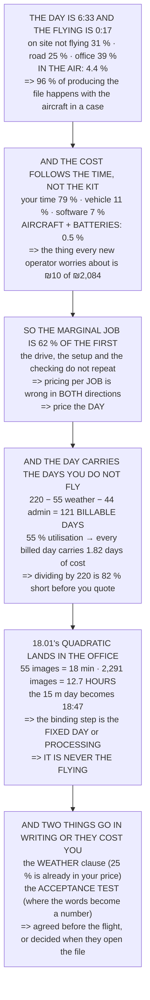

# 18.02 The operator's job: a day in the life

<!-- glance:start -->
<!-- generated by tools/build.py from curriculum/syllabus.yaml — edit the syllabus, not this block -->

| | |
|---|---|
| **Track** | Main path |
| **Difficulty** | Beginner |
| **Time** | 1 h |
| **Hardware** | none |
| **Software** | none |
| **Prerequisites** | [18.01 The civil missions: survey, inspection, delivery, monitoring, search](18.01-uav-missions.md) |
| **Skip if** | You can describe a paid flying day end to end, from the site survey to the invoice. |

<!-- glance:end -->

## What you will learn

- That **the flying is 4.4 % of the day** — 17 minutes of a 6:33 day, for one survey job
- That the aircraft and the batteries together are **0.5 % of what a day costs**, and your time is
  79 %
- That the marginal job at the same site is **62 % of the first**, so pricing per job rather than
  per day is wrong in both directions
- The **utilisation term nobody applies**: at 55 % billable days, every billed day carries 1.82
  days of cost
- That a second crew member is **17 % more, not 100 % more** — and what 16.05 says they buy
- That **a one-person operation has exactly one barrier against pilot error, and it is the pilot**
- Where 18.01's quadratic actually lands: the 0.5 cm survey is **12.7 hours of processing for 30
  minutes of flying**
- And the five things to agree in writing, of which **the acceptance test is the one that costs
  days**

## Why it matters

Every hour of this course so far has been about seventeen minutes of a working day. That is not a
criticism of the course — those seventeen minutes are where the aircraft can be destroyed and
people can be hurt, and they deserve the attention — but it does mean that somebody who has learned
only those seventeen minutes has learned about one twentieth of the job.

The rest is a drive, a set of checks, a pipeline and a conversation. It is where the money goes,
where the time goes, and where jobs are lost. And it has the same property the rest of the course
has: it is arithmetic, and doing the arithmetic once in advance makes the decisions obvious.

The two results worth internalising are that the things you worry about cost nothing, and the
things you do not think about cost everything. A crashed battery pack is four shekels of a
two-thousand-shekel day.

> [!NOTE]
> Every currency figure in this lesson is an **[E] engineering estimate** of a working practice, not
> a quoted price, and rates vary enormously by market and by client. The structure is what transfers
> — the proportions between the rows, and the terms that appear at all — so substitute your own
> numbers before quoting anything to anybody.

## Prerequisites

<!-- prereqs:start -->
## Prerequisites

You need these first:

- [18.01 The civil missions: survey, inspection, delivery, monitoring, search](18.01-uav-missions.md)

### Optional prerequisite links

None.

Check your readiness: `python course.py why 18.02`
<!-- prereqs:end -->

## Concept

A commercial flying day has a shape, and the shape is mostly fixed. The drive is the drive whatever
the job; the site survey, the setup, the brief and the pack-down are the same for a five-minute
flight and a twenty-five-minute one; the data check, the processing and the delivery happen
regardless. Only a small slice in the middle varies with the mission, and it is the slice everybody
thinks the job consists of.

That has three consequences. Pricing by the flight is wrong, because the flight is not the cost.
The second job at the same site is much cheaper than the first, because it skips the fixed parts.
And a job's feasibility is decided by the largest *fixed-adjacent* term — usually the drive, and for
high-resolution work the processing.

The second idea is about the days you do not fly. Wind, rain, cancelled access, quoting,
maintenance, training: a working year has far fewer billable days in it than a calendar suggests,
and every billable day has to carry the others. Dividing annual costs by the wrong denominator is
the most common way a small operation goes quietly broke.

And the third is about people. 16.05 established that a barrier on a different person is the only
kind whose common-cause factor is zero. On a commercial day that argument has a price attached to
it, and the price is much smaller than it feels.

## Technical explanation

### Level 1 — the day, in minutes

One survey job: 18.01's 55 images, 5.8 minutes in the air, one pack.

| | duration | clock |
|---|---|---|
| load the vehicle, check the kit | 25.0 | 8:00 |
| drive to site | 50.0 | 8:25 |
| arrive, park, find the contact | 15.0 | 9:15 |
| 16.05's site survey, 8 items | 20.0 | 9:30 |
| set up: GCS, aircraft, markers | 25.0 | 9:50 |
| crew brief, go/no-go (18.03) | 10.0 | 10:15 |
| **FLIGHT 1** | **5.8** | **10:25** |
| turnaround: swap, log, re-brief | 8.0 | 10:30 |
| **FLIGHT 2** | **5.8** | **10:38** |
| turnaround | 8.0 | 10:44 |
| **FLIGHT 3** (contingency / gap fill) | **5.8** | **10:52** |
| data check **on site**, before leaving | 15.0 | 10:58 |
| pack down | 20.0 | 11:13 |
| drive back | 50.0 | 11:33 |
| offload, charge, log the flights | 25.0 | 12:23 |
| process the imagery | 30.0 | 12:48 |
| QC the output against the brief | 30.0 | 13:18 |
| export, package, deliver, invoice | 25.0 | 13:48 |
| 16.03's log review + debrief | 20.0 | 14:13 |
| **end of day** | | **14:33** |

| | minutes | of the day |
|---|---|---|
| **in the air** | **17.4** | **4.4 %** |
| on site, not flying | 121.0 | 30.8 % |
| on the road | 100.0 | 25.4 % |
| in the office | 155.0 | 39.4 % |

**The flying is 4.4 per cent of the day** — 0:17 of a 6:33 day, and every one of those minutes is
the part this whole course has been about.

That is not a complaint, it is the job. An operator is paid for a file, and **96 % of the work of
producing one happens with the aircraft in a case**. The three skills that fill a day are driving,
checking and processing, and the only one a course can teach you is the third.

### Level 2 — what the day costs, and where people look for it

| | ₪ | of cost |
|---|---|---|
| your time, 6:33 at 250/h | 1,639.17 | **78.6 %** |
| vehicle, 90 km round trip | 225.00 | 10.8 % |
| processing software, per day | 150.00 | 7.2 % |
| liability insurance, per day | 60.00 | 2.9 % |
| **aircraft depreciation**, 17.4 air-min | **5.80** | **0.3 %** |
| **battery cycles**, 3 packs | **4.43** | **0.2 %** |
| **total** | **2,084.40** | |

Read the bottom two rows. The aircraft and the batteries — the things this entire course has been
about, and the things every new operator worries about — are **0.5 % of the cost of a day**.

Seventy-nine per cent of it is your time, and Level 1 says 96 % of your time is not flying. So the
cost of a job is dominated by the drive, the checking and the processing, which is why the second
job at the same site is so much cheaper:

| | |
|---|---|
| one job, one site | 6:33 |
| **a second job at the same site** | **4:03** |
| two sites, two days | 13:06 |

**The marginal job is 62 % of the first**, so an operator who prices per job rather than per *day*
is systematically wrong in both directions — too expensive for the second job and too cheap for a
one-job day.

### Level 3 — so what must the day be billed at?

Cost is not price. Price has to carry the days you do not fly, and there are more of those than
anybody plans for:

```
working days in a year                    220
less weather (11.04's wind limit)          55
less quoting, admin, maintenance           44
BILLABLE FLYING DAYS                      121
utilisation                                55 %
```

| margin | day price | per image | effective ₪/h |
|---|---|---|---|
| 0 % | 3,790 | 68.91 | 578 |
| 20 % | 4,548 | 82.69 | 694 |
| 40 % | 5,306 | 96.47 | 809 |
| 60 % | 6,064 | 110.25 | 925 |

**The utilisation term is the one nobody applies.** A 55 % utilisation means every billed day
carries **1.82 days of cost**, and an operator who divides annual costs by 220 instead of 121 is
82 % short before quoting anything.

And the "per image" column is there to be argued with. 18.01's 0.5 cm survey is 2,291 images instead
of 55 — 42 times as many — but it is **not** 42 times the day, because most of the day is fixed.
Level 5 works out what it actually multiplies.

### Level 4 — the crew, and what the second person buys

16.05 named three roles and said the pilot does not do the other two. A commercial day has to pay
for them:

| role | what they do | cost/day |
|---|---|---|
| PIC | flies. Nothing else | ₪1,639 |
| visual observer | watches the sky and the ground | ₪346 |
| GCS / notes | telemetry, timing, the card | ₪346 |

| crew | day cost | vs one |
|---|---|---|
| one person | 3,790 | 1.00× |
| **two people** | **4,419** | **1.17×** |
| three people | 5,048 | 1.33× |

**A second person is 17 % more, not 100 % more**, because they are only on site — they do not drive
twice or process twice.

And 16.05 priced what they buy. The spotter is a barrier **on a different person**, which is the
only kind whose common-cause factor is zero: the pilot being saturated, distracted or wrong is
exactly the failure the spotter is there for, and a second barrier inside the same head is worth
nothing.

So the honest framing is not "can I afford a spotter" but: **a one-person operation has exactly one
barrier against pilot error, and it is the pilot.** Price the second person at 17 % and decide
deliberately, once, in writing, per job type.

### Level 5 — the deliverable pipeline, and where 18.01's quadratic lands

Processing is roughly linear in image count, at very roughly 20 seconds per image for a dense
product on a laptop:

| altitude | GSD | images | processing | vs the flight |
|---|---|---|---|---|
| 120 m | 4.11 cm | 55 | 18 min | 3.2× |
| 60 m | 2.06 cm | 168 | 56 min | 6.4× |
| 30 m | 1.03 cm | 600 | 200 min | 12.7× |
| **15 m** | 0.51 cm | **2,291** | **764 min** | **25.7×** |

The 15 m survey is **12.7 hours of processing for 30 minutes of flying**, and 18.01 already said its
*flying* did not fit in a day either. **So the quadratic lands here, not in the air.** Level 1's day
has 30 minutes of processing in it; replace that with 764 and the day becomes 18:47, which is not a
day.

| job | the day | one day? | the binding step |
|---|---|---|---|
| 120 m survey (4.11 cm) | 6:21 | yes | the fixed day |
| 60 m survey (2.06 cm) | 6:59 | yes | the fixed day |
| 30 m survey (1.03 cm) | 9:23 | yes | the fixed day |
| **15 m survey (0.51 cm)** | **18:47** | **NO** | **processing** |

The binding step is the fixed day — the drive, the setup, the checking — on the easy jobs, and
processing on the hard one. **It is never the flying.** Which gives the operator's actual planning
rule:

1. convert the client's sentence to a GSD (18.01)
2. get the image count
3. multiply by your **own measured** seconds-per-image
4. add Level 1's fixed day
5. if it is over about ten hours, **it is two days — say so in the quote**, not on the second evening

### Level 6 — the client interface: five things to agree in writing

| | |
|---|---|
| the **deliverable** | format, GSD, coordinate system, and by when |
| the **acceptance test** | what "done" means, measurably |
| **site access** | who lets you in, and the contact's phone number |
| the **weather clause** | who pays for a wind day (11.04's limit) |
| a **negative result** | a "not here" and a no-fly day are both deliverables |

**Item four is the one that costs money.** Level 3 assumed a 25 % weather loss and it is in the
price of every day; if the contract makes *you* carry the wind day as well, you are paying for it
twice. And 11.04's limit is a number you *will* respect, which makes it a commercial term rather
than a technical one.

**Item two is the one that costs days.** "Done" has to be measurable before you fly: a GSD, a
coverage polygon, a count of findings. 18.01's lesson was that the client describes the job in
words; **the acceptance test is where the words become a number**, and if it is not written down it
becomes a number on the day they look at the file.

> [!TIP]
> **Ask your teacher:** "What is your seconds-per-image?" It is the single most useful number an
> operator can measure about their own pipeline, it takes one job to find, and almost nobody has it
> written down.

## Diagram



## Code

The whole day, costed: a minute-by-minute schedule with the air time separated out, the cost stack
that puts the aircraft at 0.3 %, the marginal-job arithmetic, a utilisation-corrected day price at
four margins, the crew options priced against 16.05's barrier argument, the processing pipeline that
turns 18.01's image counts into hours, and the five contract terms.

```python
"""18.02 -- a paid flying day, end to end, in minutes and shekels.

Pure stdlib. The job is 18.01's 300 x 200 m survey at 4 cm; the aircraft
is Hermon after module 17; the crew rules come from 16.05.

Every number here is an ESTIMATE of a working practice, not a quoted
price, and the lesson says so. What is not an estimate is the shape: the
flying is a very small part of the day, and the consumables are a very
small part of the cost.
"""

import math

# ---- 18.01's job --------------------------------------------------------
IMAGES_4CM = 55
IMAGES_05CM = 2291
FLIGHT_MIN = 5.8
PACKS = 3                 # 16.01's working set
TURNAROUND_MIN = 8.0      # 16.01: swap, log, re-brief

# ---- 17.06 / 11.05 ------------------------------------------------------
PACK_ILS = 443.0          # Sollan, verified in the research file
PACK_CYCLES = 300         # [E]
AIRCRAFT_ILS = 6000.0     # [E] the whole build, order of magnitude
AIRCRAFT_HOURS = 300.0    # [E] before a major rebuild

# ---- the day ------------------------------------------------------------
HOURLY_ILS = 250.0        # [E] what an operator's hour has to earn
VEHICLE_ILS_KM = 2.50     # [E]
SITE_KM = 45.0

BAR = "=" * 70


def head(n, title):
    print()
    print(BAR)
    print("%d. %s" % (n, title))
    print(BAR)


def hhmm(minutes):
    return "%d:%02d" % (int(minutes) // 60, int(minutes) % 60)


# ========================================================================
head(1, "THE DAY, IN MINUTES")

DAY = [
    ("load the vehicle, check the kit", 25, "office"),
    ("drive to site", 50, "road"),
    ("arrive, park, find the contact", 15, "site"),
    ("16.05's site survey, 8 items", 20, "site"),
    ("set up: GCS, aircraft, markers", 25, "site"),
    ("crew brief, go/no-go (18.03)", 10, "site"),
    ("FLIGHT 1", FLIGHT_MIN, "AIR"),
    ("turnaround: swap, log, re-brief", TURNAROUND_MIN, "site"),
    ("FLIGHT 2", FLIGHT_MIN, "AIR"),
    ("turnaround", TURNAROUND_MIN, "site"),
    ("FLIGHT 3 (contingency / gap fill)", FLIGHT_MIN, "AIR"),
    ("data check ON SITE, before leaving", 15, "site"),
    ("pack down", 20, "site"),
    ("drive back", 50, "road"),
    ("offload, charge, log the flights", 25, "office"),
    ("process the imagery", 30, "office"),
    ("QC the output against the brief", 30, "office"),
    ("export, package, deliver, invoice", 25, "office"),
    ("16.03's log review + debrief (18.03)", 20, "office"),
]

total = sum(d[1] for d in DAY)
air = sum(d[1] for d in DAY if d[2] == "AIR")
site = sum(d[1] for d in DAY if d[2] == "site")
road = sum(d[1] for d in DAY if d[2] == "road")
office = sum(d[1] for d in DAY if d[2] == "office")

t = 8 * 60.0
print("  One survey job. 18.01 says it is %d images, %.1f min in the air,"
      % (IMAGES_4CM, FLIGHT_MIN))
print("  one pack. Here is the whole day around it:")
print()
for what, mins, where in DAY:
    tag = "  <== " + where if where == "AIR" else ""
    print("  %-38s %5.1f min   %s%s" % (what, mins, hhmm(t), tag))
    t += mins
print("  %-38s %5s       %s" % ("END OF DAY", "", hhmm(t)))

print()
print("  %-26s %8s %10s" % ("", "minutes", "of the day"))
for label, mins in (("IN THE AIR", air), ("on site, not flying", site),
                    ("on the road", road), ("in the office", office)):
    print("  %-26s %8.1f %9.1f %%" % (label, mins, mins / total * 100))
print("  %-26s %8.1f" % ("TOTAL", total))

print()
print("  THE FLYING IS %.1f PER CENT OF THE DAY." % (air / total * 100))
print("  %s of a %s day, and every one of those minutes is the part"
      % (hhmm(air), hhmm(total)))
print("  the whole course has been about.")
print()
print("  THAT IS NOT A COMPLAINT, IT IS THE JOB. An operator is paid")
print("  for a file, and %.0f %% of the work of producing one happens"
      % (100 - air / total * 100))
print("  with the aircraft in a case. The three skills that actually")
print("  fill a day are DRIVING, CHECKING and PROCESSING -- and the")
print("  only one a course can teach you is the third.")

# ========================================================================
head(2, "WHAT THE DAY COSTS, AND WHERE PEOPLE LOOK FOR IT")

labour = total / 60.0 * HOURLY_ILS
vehicle = 2 * SITE_KM * VEHICLE_ILS_KM
packs = PACKS * PACK_ILS / PACK_CYCLES
aircraft = air / 60.0 * (AIRCRAFT_ILS / AIRCRAFT_HOURS)
software = 150.0          # [E] a month of processing software, per day
insurance = 60.0          # [E] annual liability, amortised per working day

print("  %-34s %10s %10s" % ("", "ILS", "of cost"))
COSTS = [
    ("your time, %s at %.0f/h" % (hhmm(total), HOURLY_ILS), labour),
    ("vehicle, %.0f km round trip" % (2 * SITE_KM), vehicle),
    ("processing software, per day", software),
    ("liability insurance, per day", insurance),
    ("aircraft depreciation, %.1f air-min" % air, aircraft),
    ("battery cycles, %d packs" % PACKS, packs),
]
cost_total = sum(c[1] for c in COSTS)
for label, ils in COSTS:
    print("  %-34s %10.2f %9.1f %%" % (label, ils, ils / cost_total * 100))
print("  %-34s %10.2f" % ("TOTAL", cost_total))

print()
print("  READ THE BOTTOM TWO ROWS. The aircraft and the batteries -- the")
print("  things this entire course has been about, and the things every")
print("  new operator worries about -- are %.1f %% of the cost of a day."
      % ((aircraft + packs) / cost_total * 100))
print()
print("  %.0f PER CENT OF IT IS YOUR TIME, and section 1 says %.0f %% of"
      % (labour / cost_total * 100, 100 - air / total * 100))
print("  YOUR TIME IS NOT FLYING. So the cost of a job is dominated by")
print("  the drive, the checking and the processing -- which is why the")
print("  second job at the same site is so much cheaper than the first.")
print()
print("  THE ARITHMETIC THAT FOLLOWS FROM THAT:")
second_job_min = total - (2 * 50 + 25 + 25)   # no second drive, no reload
print("    one job, one site                 %s" % hhmm(total))
print("    a SECOND job at the SAME site     %s" % hhmm(second_job_min))
print("    two sites, two days               %s" % hhmm(2 * total))
print("    two jobs, one site, one day       %s" % hhmm(second_job_min))
print("  THE MARGINAL JOB IS %.0f %% OF THE FIRST, so an operator who"
      % (second_job_min / total * 100))
print("  prices per job and not per DAY is systematically wrong in")
print("  both directions -- too expensive for the second job and too")
print("  cheap for a one-job day.")

# ========================================================================
head(3, "SO WHAT MUST THE DAY BE BILLED AT?")

MARGINS = (0.0, 0.20, 0.40, 0.60)
print("  Cost is not price. Price has to carry the days you do not fly,")
print("  and there are more of those than anybody plans for:")
print()
WEATHER_DAYS = 0.25       # [E] 11.04's wind limit, over a year
ADMIN_DAYS = 0.20         # [E] quoting, invoicing, training, maintenance
util = 1.0 - WEATHER_DAYS - ADMIN_DAYS
print("    working days in a year                 %6.0f" % 220)
print("    less weather (11.04's wind limit)      %6.0f" % (220 * WEATHER_DAYS))
print("    less quoting, admin, maintenance       %6.0f" % (220 * ADMIN_DAYS))
print("    BILLABLE FLYING DAYS                   %6.0f" % (220 * util))
print("    utilisation                            %6.0f %%" % (util * 100))
print()
print("  %-20s %12s %12s %12s"
      % ("margin", "day price", "per image", "effective /h"))
for m in MARGINS:
    price = cost_total / util * (1.0 + m)
    print("  %-20s %10.0f %12.2f %12.0f"
          % ("%.0f %%" % (m * 100), price, price / IMAGES_4CM,
             price / (total / 60.0)))

print()
print("  THE UTILISATION TERM IS THE ONE NOBODY APPLIES. A %.0f %%"
      % (util * 100))
print("  utilisation means every billed day carries %.2f days of cost,"
      % (1 / util))
print("  and an operator who divides annual costs by 220 instead of")
print("  %.0f is %.0f %% short before quoting anything."
      % (220 * util, (1 / util - 1) * 100))
print()
print("  AND THE 'PER IMAGE' COLUMN IS THERE TO BE ARGUED WITH. 18.01's")
print("  0.5 cm survey is %d images instead of %d -- %.0f times as many"
      % (IMAGES_05CM, IMAGES_4CM, IMAGES_05CM / IMAGES_4CM))
print("  -- but it is NOT %.0f times the day, because sections 1 and 2"
      % (IMAGES_05CM / IMAGES_4CM))
print("  say most of the day is fixed. Section 5 works out what it")
print("  actually multiplies.")

# ========================================================================
head(4, "THE CREW: WHO IS ON SITE, AND WHAT THE SECOND PERSON BUYS")

print("  16.05 named three roles and said the pilot does not do the")
print("  other two. A commercial day has to pay for them:")
print()
print("  %-16s %-30s %12s" % ("role", "what they do", "cost/day"))
ROLES = [
    ("PIC", "flies. Nothing else", HOURLY_ILS * total / 60.0),
    ("visual observer", "watches the sky and the ground",
     HOURLY_ILS * 0.6 * (site + air) / 60.0),
    ("GCS / notes", "telemetry, timing, the card",
     HOURLY_ILS * 0.6 * (site + air) / 60.0),
]
for name, what, ils in ROLES:
    print("  %-16s %-30s %12.0f" % (name, what, ils))
print()
one = cost_total / util
two = (cost_total + ROLES[1][2]) / util
three = (cost_total + ROLES[1][2] + ROLES[2][2]) / util
print("  %-24s %12s %12s" % ("crew", "day cost", "vs one"))
for label, c in (("one person", one), ("two people", two),
                 ("three people", three)):
    print("  %-24s %12.0f %11.2f x" % (label, c, c / one))

print()
print("  A SECOND PERSON IS %.0f %% MORE, NOT %.0f %% MORE, because they"
      % ((two / one - 1) * 100, 100))
print("  are only on site -- they do not drive twice or process twice.")
print()
print("  AND 16.05 PRICED WHAT THEY BUY. The spotter is a barrier on a")
print("  DIFFERENT PERSON, which is the only kind whose common-cause")
print("  factor is zero: the pilot being saturated, distracted or wrong")
print("  is exactly the failure the spotter is there for, and a second")
print("  barrier inside the same head is worth nothing.")
print()
print("  SO THE HONEST FRAMING IS NOT 'CAN I AFFORD A SPOTTER' BUT:")
print("  A ONE-PERSON OPERATION HAS ONE BARRIER AGAINST PILOT ERROR,")
print("  AND IT IS THE PILOT. Price the second person at %.0f %% and"
      % ((two / one - 1) * 100))
print("  decide deliberately, once, in writing, per job type.")

# ========================================================================
head(5, "THE DELIVERABLE PIPELINE, AND WHERE 18.01's QUADRATIC LANDS")

SEC_PER_IMAGE = 20.0      # [E] a laptop, dense reconstruction
print("  Processing time is roughly linear in image count on a laptop,")
print("  at very roughly %.0f seconds per image for a dense product:"
      % SEC_PER_IMAGE)
print()
print("  %-14s %9s %12s %12s %14s"
      % ("altitude", "GSD cm", "images", "processing", "vs the FLIGHT"))
JOBS = [(120.0, 4.11, 55, 5.8), (60.0, 2.06, 168, 8.7),
        (30.0, 1.03, 600, 15.7), (15.0, 0.51, 2291, 29.7)]
for alt, gsd, imgs, fl in JOBS:
    proc = imgs * SEC_PER_IMAGE / 60.0
    print("  %-14s %9.2f %12d %10.0f min %11.1f x"
          % ("%.0f m" % alt, gsd, imgs, proc, proc / fl))

proc15 = 2291 * SEC_PER_IMAGE / 60.0
print()
print("  THE %.0f m SURVEY IS %.1f HOURS OF PROCESSING FOR %.0f MINUTES"
      % (15, proc15 / 60.0, 29.7))
print("  OF FLYING -- %.0f TIMES the flight -- and 18.01 already said"
      % (proc15 / 29.7))
print("  its FLYING did not fit in a day either.")
print()
print("  SO THE QUADRATIC LANDS HERE, NOT IN THE AIR. Section 1's day")
print("  has %.0f minutes of processing in it. Replace that with %.0f"
      % (30, proc15))
print("  and the day becomes %s -- which is not a day."
      % hhmm(total - 30 + proc15))
print()
print("  %-30s %10s %10s %14s"
      % ("job", "the day", "one day?", "the binding step"))
fixed_min = road + site + (office - 30)
for alt, gsd, imgs, fl in JOBS:
    proc = imgs * SEC_PER_IMAGE / 60.0
    day = total - 30 + proc
    fits = "yes" if day <= 10 * 60 else "NO"
    binding = "processing" if proc > fixed_min else "the FIXED day"
    print("  %-30s %10s %10s %14s"
          % ("%.0f m survey (%.2f cm)" % (alt, gsd), hhmm(day), fits,
             binding))

print()
print("  THE BINDING STEP IS THE FIXED DAY -- the drive, the setup, the")
print("  checking -- ON THE EASY JOBS, AND PROCESSING ON THE HARD ONE.")
print("  IT IS NEVER THE FLYING.")
print()
print("  WHICH GIVES THE OPERATOR'S ACTUAL PLANNING RULE:")
print("    1. convert the client's sentence to a GSD (18.01)")
print("    2. get the image count")
print("    3. multiply by your OWN measured seconds-per-image")
print("    4. add section 1's fixed day")
print("    5. if it is over about ten hours, it is TWO days -- say so")
print("       in the quote, not on the second evening")

# ========================================================================
head(6, "THE CLIENT INTERFACE, AND THE FIVE THINGS TO AGREE IN WRITING")

print("  Everything above is arithmetic. This is the part that is not,")
print("  and it is where days are lost:")
print()
AGREE = [
    ("the DELIVERABLE", "format, GSD, coordinate system, and by when"),
    ("the ACCEPTANCE test", "what 'done' means, measurably"),
    ("SITE ACCESS", "who lets you in, and the contact's phone number"),
    ("the WEATHER clause", "who pays for a wind day (11.04's limit)"),
    ("a NEGATIVE result",
     "a 'not here' and a no-fly day are both deliverables"),
]
for k, v in AGREE:
    print("    %-22s %s" % (k, v))
print()
print("  ITEM FOUR IS THE ONE THAT COSTS MONEY. Section 3 assumed a")
print("  %.0f %% weather loss and it is in the price of every day."
      % (WEATHER_DAYS * 100))
print("  If the contract makes YOU carry the wind day as well, you are")
print("  paying for it twice -- and 11.04's limit is a number you WILL")
print("  respect, which makes it a commercial term, not a technical one.")
print()
print("  AND ITEM TWO IS THE ONE THAT COSTS DAYS. 'Done' has to be")
print("  measurable before you fly: a GSD, a coverage polygon, a count")
print("  of findings. 18.01's lesson was that the client describes the")
print("  job in words; THE ACCEPTANCE TEST IS WHERE THE WORDS BECOME A")
print("  NUMBER, and if it is not written down it becomes a number on")
print("  the day they look at the file.")
```

Output:

```text

======================================================================
1. THE DAY, IN MINUTES
======================================================================
  One survey job. 18.01 says it is 55 images, 5.8 min in the air,
  one pack. Here is the whole day around it:

  load the vehicle, check the kit         25.0 min   8:00
  drive to site                           50.0 min   8:25
  arrive, park, find the contact          15.0 min   9:15
  16.05's site survey, 8 items            20.0 min   9:30
  set up: GCS, aircraft, markers          25.0 min   9:50
  crew brief, go/no-go (18.03)            10.0 min   10:15
  FLIGHT 1                                 5.8 min   10:25  <== AIR
  turnaround: swap, log, re-brief          8.0 min   10:30
  FLIGHT 2                                 5.8 min   10:38  <== AIR
  turnaround                               8.0 min   10:44
  FLIGHT 3 (contingency / gap fill)        5.8 min   10:52  <== AIR
  data check ON SITE, before leaving      15.0 min   10:58
  pack down                               20.0 min   11:13
  drive back                              50.0 min   11:33
  offload, charge, log the flights        25.0 min   12:23
  process the imagery                     30.0 min   12:48
  QC the output against the brief         30.0 min   13:18
  export, package, deliver, invoice       25.0 min   13:48
  16.03's log review + debrief (18.03)    20.0 min   14:13
  END OF DAY                                         14:33

                              minutes of the day
  IN THE AIR                     17.4       4.4 %
  on site, not flying           121.0      30.8 %
  on the road                   100.0      25.4 %
  in the office                 155.0      39.4 %
  TOTAL                         393.4

  THE FLYING IS 4.4 PER CENT OF THE DAY.
  0:17 of a 6:33 day, and every one of those minutes is the part
  the whole course has been about.

  THAT IS NOT A COMPLAINT, IT IS THE JOB. An operator is paid
  for a file, and 96 % of the work of producing one happens
  with the aircraft in a case. The three skills that actually
  fill a day are DRIVING, CHECKING and PROCESSING -- and the
  only one a course can teach you is the third.

======================================================================
2. WHAT THE DAY COSTS, AND WHERE PEOPLE LOOK FOR IT
======================================================================
                                            ILS    of cost
  your time, 6:33 at 250/h              1639.17      78.6 %
  vehicle, 90 km round trip              225.00      10.8 %
  processing software, per day           150.00       7.2 %
  liability insurance, per day            60.00       2.9 %
  aircraft depreciation, 17.4 air-min       5.80       0.3 %
  battery cycles, 3 packs                  4.43       0.2 %
  TOTAL                                 2084.40

  READ THE BOTTOM TWO ROWS. The aircraft and the batteries -- the
  things this entire course has been about, and the things every
  new operator worries about -- are 0.5 % of the cost of a day.

  79 PER CENT OF IT IS YOUR TIME, and section 1 says 96 % of
  YOUR TIME IS NOT FLYING. So the cost of a job is dominated by
  the drive, the checking and the processing -- which is why the
  second job at the same site is so much cheaper than the first.

  THE ARITHMETIC THAT FOLLOWS FROM THAT:
    one job, one site                 6:33
    a SECOND job at the SAME site     4:03
    two sites, two days               13:06
    two jobs, one site, one day       4:03
  THE MARGINAL JOB IS 62 % OF THE FIRST, so an operator who
  prices per job and not per DAY is systematically wrong in
  both directions -- too expensive for the second job and too
  cheap for a one-job day.

======================================================================
3. SO WHAT MUST THE DAY BE BILLED AT?
======================================================================
  Cost is not price. Price has to carry the days you do not fly,
  and there are more of those than anybody plans for:

    working days in a year                    220
    less weather (11.04's wind limit)          55
    less quoting, admin, maintenance           44
    BILLABLE FLYING DAYS                      121
    utilisation                                55 %

  margin                  day price    per image effective /h
  0 %                        3790        68.91          578
  20 %                       4548        82.69          694
  40 %                       5306        96.47          809
  60 %                       6064       110.25          925

  THE UTILISATION TERM IS THE ONE NOBODY APPLIES. A 55 %
  utilisation means every billed day carries 1.82 days of cost,
  and an operator who divides annual costs by 220 instead of
  121 is 82 % short before quoting anything.

  AND THE 'PER IMAGE' COLUMN IS THERE TO BE ARGUED WITH. 18.01's
  0.5 cm survey is 2291 images instead of 55 -- 42 times as many
  -- but it is NOT 42 times the day, because sections 1 and 2
  say most of the day is fixed. Section 5 works out what it
  actually multiplies.

======================================================================
4. THE CREW: WHO IS ON SITE, AND WHAT THE SECOND PERSON BUYS
======================================================================
  16.05 named three roles and said the pilot does not do the
  other two. A commercial day has to pay for them:

  role             what they do                       cost/day
  PIC              flies. Nothing else                    1639
  visual observer  watches the sky and the ground          346
  GCS / notes      telemetry, timing, the card             346

  crew                         day cost       vs one
  one person                       3790        1.00 x
  two people                       4419        1.17 x
  three people                     5048        1.33 x

  A SECOND PERSON IS 17 % MORE, NOT 100 % MORE, because they
  are only on site -- they do not drive twice or process twice.

  AND 16.05 PRICED WHAT THEY BUY. The spotter is a barrier on a
  DIFFERENT PERSON, which is the only kind whose common-cause
  factor is zero: the pilot being saturated, distracted or wrong
  is exactly the failure the spotter is there for, and a second
  barrier inside the same head is worth nothing.

  SO THE HONEST FRAMING IS NOT 'CAN I AFFORD A SPOTTER' BUT:
  A ONE-PERSON OPERATION HAS ONE BARRIER AGAINST PILOT ERROR,
  AND IT IS THE PILOT. Price the second person at 17 % and
  decide deliberately, once, in writing, per job type.

======================================================================
5. THE DELIVERABLE PIPELINE, AND WHERE 18.01's QUADRATIC LANDS
======================================================================
  Processing time is roughly linear in image count on a laptop,
  at very roughly 20 seconds per image for a dense product:

  altitude          GSD cm       images   processing  vs the FLIGHT
  120 m               4.11           55         18 min         3.2 x
  60 m                2.06          168         56 min         6.4 x
  30 m                1.03          600        200 min        12.7 x
  15 m                0.51         2291        764 min        25.7 x

  THE 15 m SURVEY IS 12.7 HOURS OF PROCESSING FOR 30 MINUTES
  OF FLYING -- 26 TIMES the flight -- and 18.01 already said
  its FLYING did not fit in a day either.

  SO THE QUADRATIC LANDS HERE, NOT IN THE AIR. Section 1's day
  has 30 minutes of processing in it. Replace that with 764
  and the day becomes 18:47 -- which is not a day.

  job                               the day   one day? the binding step
  120 m survey (4.11 cm)               6:21        yes  the FIXED day
  60 m survey (2.06 cm)                6:59        yes  the FIXED day
  30 m survey (1.03 cm)                9:23        yes  the FIXED day
  15 m survey (0.51 cm)               18:47         NO     processing

  THE BINDING STEP IS THE FIXED DAY -- the drive, the setup, the
  checking -- ON THE EASY JOBS, AND PROCESSING ON THE HARD ONE.
  IT IS NEVER THE FLYING.

  WHICH GIVES THE OPERATOR'S ACTUAL PLANNING RULE:
    1. convert the client's sentence to a GSD (18.01)
    2. get the image count
    3. multiply by your OWN measured seconds-per-image
    4. add section 1's fixed day
    5. if it is over about ten hours, it is TWO days -- say so
       in the quote, not on the second evening

======================================================================
6. THE CLIENT INTERFACE, AND THE FIVE THINGS TO AGREE IN WRITING
======================================================================
  Everything above is arithmetic. This is the part that is not,
  and it is where days are lost:

    the DELIVERABLE        format, GSD, coordinate system, and by when
    the ACCEPTANCE test    what 'done' means, measurably
    SITE ACCESS            who lets you in, and the contact's phone number
    the WEATHER clause     who pays for a wind day (11.04's limit)
    a NEGATIVE result      a 'not here' and a no-fly day are both deliverables

  ITEM FOUR IS THE ONE THAT COSTS MONEY. Section 3 assumed a
  25 % weather loss and it is in the price of every day.
  If the contract makes YOU carry the wind day as well, you are
  paying for it twice -- and 11.04's limit is a number you WILL
  respect, which makes it a commercial term, not a technical one.

  AND ITEM TWO IS THE ONE THAT COSTS DAYS. 'Done' has to be
  measurable before you fly: a GSD, a coverage polygon, a count
  of findings. 18.01's lesson was that the client describes the
  job in words; THE ACCEPTANCE TEST IS WHERE THE WORDS BECOME A
  NUMBER, and if it is not written down it becomes a number on
  the day they look at the file.
```

## Exercise

### Exercise 18.02-E1 — Time your own day `[analysis]`

Take a stopwatch to one real job — or reconstruct one honestly from memory — and fill in Level 1's
table with your own numbers. Compute your own air-time percentage.

### Exercise 18.02-E2 — Your cost stack `[analysis]`

Build Level 2 with your real rates, your real distance and your real software. Rank the rows.
Compare where your attention goes with where your money goes.

### Exercise 18.02-E3 — Your utilisation `[analysis]`

Count the days you actually flew commercially last year, or estimate honestly for the year ahead.
Divide. Then recompute your day rate with that denominator.

### Exercise 18.02-E4 — Measure your seconds-per-image `[build]`

Time one processing run end to end and divide by the image count. Then use it to predict the next
job's processing time before you fly it, and check afterwards.

## Expected result

**18.02-E1**: expect between 3 % and 10 % air time for a survey job, and higher for an inspection —
which is one reason inspections feel like better value for the flying and worse for the pricing.

**18.02-E2**: expect labour to be 70–85 % and expect the aircraft to be under 2 %. If the aircraft is
a large share, you are either flying an unusually expensive machine or not counting your time.

**18.02-E3**: expect 40–65 % utilisation in the first years and higher later. The number that
surprises people is not the weather; it is the admin.

**18.02-E4**: expect 10–40 s per image depending on the product and the machine, and expect the
figure to be stable enough to plan with. It is the only input Level 5 needs that you cannot get from
anybody else.

## Troubleshooting

**The day ran two hours long and nobody can say where.** It is almost always the site: finding the
contact, waiting for access, and the checks. Time them separately on the next job.

**A job was profitable and the month was not.** Utilisation, Level 3. The jobs are carrying the
non-flying days, and the arithmetic has to be done per *year*.

**The client disputes the deliverable.** Level 6, item two. Without a written acceptance test, "done"
is decided when they open the file.

**Processing took all night.** Level 5. Measure your seconds-per-image and multiply *before*
quoting; a job over about ten hours is two days.

**You get to site and cannot get in.** Item three. The contact's phone number is not an
administrative detail, it is the single most expensive line in the contract when it is missing.

**The second job at the same site was quoted at the full rate and lost.** Correct — it is 62 % of
the work. Quote a same-site rate and win it.

**A weather cancellation cost you the day.** Item four. Either the clause pays for it or your day
rate does; it cannot be neither.

## Common mistakes

- **Thinking the job is the flight.** It is 4.4 % of the day.
- **Budgeting for crashes and not for drives.** ₪10 against ₪225.
- **Pricing per job rather than per day.** Wrong in both directions.
- **Dividing annual costs by 220.** The denominator is nearer 121.
- **Assuming a second crew member doubles the cost.** 17 %.
- **Treating the spotter as optional comfort.** It is the only barrier not in the pilot's head.
- **Quoting a high-resolution survey at the low-resolution day.** The processing is 25× the flight.
- **Not measuring your own seconds-per-image.** It is the input nobody can give you.
- **Leaving "done" undefined.** It gets defined when they open the file.

## Knowledge check

<details>
<summary>What fraction of a commercial day is flying, and what is the rest?</summary>

4.4 % — 17.4 minutes of a 6:33 day, for one survey job. The rest is 31 % on site not flying, 25 % on
the road and 39 % in the office. An operator is paid for a file, and 96 % of the work of producing
one happens with the aircraft in its case.
</details>

<details>
<summary>What does a day actually cost, and what surprises people about it?</summary>

About ₪2,084 in this model, of which **79 % is your time**, 11 % is the vehicle and 7 % is software.
The aircraft's depreciation and the battery cycles together are **0.5 %** — roughly ten shekels —
which is the thing every new operator worries about and almost nothing anyone should plan around.
</details>

<details>
<summary>Why is the second job at the same site so much cheaper?</summary>

Because it skips the fixed parts: two drives, the loading, the offloading. The marginal job is
**62 % of the first**. An operator pricing per job rather than per day therefore overcharges for the
second job and undercharges for a day that only contains one.
</details>

<details>
<summary>What is the utilisation term, and why does omitting it break a business?</summary>

A working year has about 220 days, but weather takes roughly 55 and admin, quoting and maintenance
take about 44, leaving **121 billable days — 55 % utilisation**. Every billed day therefore has to
carry **1.82 days of cost**. Dividing annual costs by 220 leaves you **82 % short** before you have
quoted anything.
</details>

<details>
<summary>How much does a second crew member cost, and what do they buy?</summary>

**17 % more**, not 100 %, because they are on site only — they do not drive twice or process twice.
What they buy is 16.05's zero-common-cause barrier: the pilot being saturated, distracted or wrong
is precisely the failure a spotter exists for, and a second barrier inside the same head is worth
nothing. A one-person operation has one barrier against pilot error and it is the pilot.
</details>

<details>
<summary>Where does 18.01's quadratic actually hurt?</summary>

In the office. At 20 s per image, 55 images is 18 minutes and 2,291 images is **12.7 hours** — 25.7×
the flight. Level 1's day with 764 minutes of processing instead of 30 becomes 18:47, which is not a
day. The flying went from 5.8 to 29.7 minutes; the processing went from 18 minutes to most of a
second day.
</details>

<details>
<summary>What is the binding step on a drone job?</summary>

The fixed day on easy jobs — the drive, the setup, the checking — and processing on hard ones. **It
is never the flying.** So the planning rule is: GSD → image count → your own measured
seconds-per-image → plus the fixed day; and anything over about ten hours is two days, stated in the
quote rather than discovered on the second evening.
</details>

<details>
<summary>Which two contract terms cost the most when they are missing?</summary>

The weather clause and the acceptance test. The weather clause because a 25 % loss is already in
your day rate, so carrying it again in the contract means paying for it twice. The acceptance test
because "done" has to be a measurable number — a GSD, a coverage polygon, a count of findings — and
if it is not agreed before the flight it gets decided when the client opens the file.
</details>

## Practical challenge

Build your own operating model, once, and then quote from it.

1. Time one real day into Level 1's categories (E1).
2. Build your cost stack with your real numbers and rank the rows (E2).
3. Compute your honest utilisation and your day rate from it (E3).
4. Measure your seconds-per-image (E4).
5. Write down your same-site marginal rate, as a separate line on the price list.
6. Decide, in writing, which job types require a second crew member — and price it at its real 17 %.
7. Write the five contract terms into a one-page standard schedule you attach to every quote.
8. Re-quote your last three jobs with this model and see which were profitable.

Step 8 is the one that changes behaviour. Most operators discover that the job they were proudest of
was the one that lost money.

## You can skip this if

You can describe a paid flying day end to end, from the site survey to the invoice. "End to end"
includes the drive, the processing and the invoice, not just the part with the aircraft out of its
case.

## Go deeper

- The FAA's Part 107 material on the remote pilot in command's responsibilities and the role of a
  visual observer, which is the regulatory half of Level 4:
  <https://www.faa.gov/uas/commercial_operators>
- Pix4D and Agisoft both publish processing-time benchmarks by image count and hardware, useful for
  sanity-checking your own seconds-per-image before you measure it:
  <https://support.pix4d.com/hc/en-us/articles/202558649>
- ASTM F3196 and the related standards on operational risk assessment set out what a documented
  commercial operation is expected to have; the index is free to browse:
  <https://www.astm.org/committee-f38.html>

## Progress checkpoint

You can now lay out a commercial flying day in minutes, cost it honestly and see where the money
actually goes, apply a utilisation correction to a day rate, price a second crew member against the
barrier they provide, predict a job's processing time from its image count, and write the two
contract terms that otherwise decide themselves at your expense.

Next, 18.03 takes the middle of this day — the tasking, the risk assessment, the brief and the
debrief — and makes each of them a process with a written output.
