# 18.03 The mission-planning process: tasking, risk, brief, debrief

<!-- glance:start -->
<!-- generated by tools/build.py from curriculum/syllabus.yaml — edit the syllabus, not this block -->

| | |
|---|---|
| **Track** | Main path |
| **Difficulty** | Intermediate |
| **Time** | 1 h 30 min |
| **Hardware** | none |
| **Software** | none |
| **Prerequisites** | [18.02 The operator's job: a day in the life](18.02-the-operators-job.md)<br>[16.05 Field protocols and Hermon's safety case](../16-testing-analysis/16.05-field-protocols-and-the-safety-case.md) |
| **Optional prerequisites** | [FOP.01 The mission-planning process](../optional-foundations/civil-ops/FOP.01-mission-planning-process.md) |
| **Skip if** | You can run a full planning cycle for a real site, including the written risk assessment and the debrief. |

<!-- glance:end -->

## What you will learn

- The five tasking questions, **none of which is about the aircraft**
- That **L × S destroys the information you needed**: three hazards score 6 and want opposite
  treatments
- That 4 of 6 hazards move on **likelihood** and the rest move only by changing **where the aircraft
  may be**
- That eight plausible go/no-go criteria scrub **50 % of planned days**, and **shortening the list
  is not a fix**
- That moving five checks to the day before takes the morning's scrub rate from 50 % to 34 % — the
  expensive failures move to a phone call
- **The finding**: a one-word abort takes 6.8 m and 12.03's fence margin is 6.0 — **even the
  one-word call breaches it**
- The three honest responses, all numbers: a **11.8 m** crew margin, **4.4 m/s**, or stop calling it
  a barrier
- And that a sentence costs **14.2 m** — more than the entire margin

## Why it matters

The planning cycle is the part of the job that looks like paperwork and is actually where most of
the safety lives. It is also the part that is most often done as a feeling: a risk assessment
completed to satisfy somebody, a go/no-go made by looking at the sky, a brief that is a chat, a
debrief that is a drive home.

Every one of those has arithmetic in it, and the arithmetic changes the answers. The risk matrix
everybody uses destroys the distinction that decides what to do about a hazard. The go/no-go has a
scrub rate that follows from the number of criteria rather than from the weather. And the brief's
comms discipline — the bit that sounds like affectation — turns out to be a **distance**, measurable
in metres against a number 12.03 already froze.

That last one produces the most uncomfortable result in the module, and it is worth arriving at
honestly rather than being told.

> [!NOTE]
> The probabilities in Level 3 and the reaction times in Level 4 are **[E] estimates** of plausible
> values, chosen to make the structure visible. Your own scrub rate and your own crew's call-to-stop
> time are measurable in a handful of days, and the point of the lesson is the shape of the
> arithmetic rather than these particular numbers.

## Prerequisites

<!-- prereqs:start -->
## Prerequisites

You need these first:

- [18.02 The operator's job: a day in the life](18.02-the-operators-job.md)
- [16.05 Field protocols and Hermon's safety case](../16-testing-analysis/16.05-field-protocols-and-the-safety-case.md)

### Optional prerequisite links

New to any of these? Take the foundation lesson first; skip it if you already know it.

- [FOP.01 The mission-planning process](../optional-foundations/civil-ops/FOP.01-mission-planning-process.md)

Check your readiness: `python course.py why 18.03`
<!-- prereqs:end -->

## Concept

Planning is a loop with four stages, and each is only real if it leaves something behind. Tasking
turns a client's sentence into a quote. The site survey and risk assessment turn a place into a set
of constraints. The brief turns those constraints into things people will actually do under
pressure. And the debrief turns what happened into the next version of all three.

The risk assessment is where the most common mistake lives, and it is arithmetical rather than
procedural. Likelihood and severity are two different quantities with two different remedies —
16.05's left-hand and right-hand barriers — and multiplying them into a single score throws away
exactly the information you needed to decide what to do.

The go/no-go has a different arithmetic. Every criterion is a multiplication, so a list of eight
individually-reasonable checks produces a scrub rate nobody expects. The remedy is not a shorter
list; it is checking earlier, so that the failures that would have cost you a fifty-minute drive
cost you a phone call instead.

And the brief has the most concrete arithmetic of all. An abort is a chain — see, say, parse, act —
and every link is a time, and every time multiplied by the speed is a distance the aircraft covers
while nothing has stopped it yet.

## Technical explanation

### Level 1 — tasking: five questions

| question | what it produces |
|---|---|
| What is the **smallest thing** you must see? | 18.01: a GSD, and then an altitude |
| What will you **do with the file**? | the product, the format and the accuracy |
| **Where** exactly, and **who lets me in**? | 18.02: the missing phone number is the expensive line |
| **When**, and what if the wind is up? | 11.04's limit is a commercial term (18.02) |
| **Who else** will be there, and what is **underneath**? | 16.05: "nobody underneath" is the 90 % barrier |

**None of them is about the aircraft.** The client cannot answer a question about the aircraft and
does not need to; every one of these is about the world, and the aircraft falls out of the answers.

And notice the shape: question one produces a **number** and the other four produce **constraints**.
If question one has no answer there is no job yet, only a conversation — and the honest thing is to
say so rather than to quote.

### Level 2 — the risk matrix, and why the score hides the answer

| hazard | L | S | score | colour |
|---|---|---|---|---|
| a member of the public walks in | 4 | 3 | 12 | amber |
| battery mis-estimated, forced landing | 2 | 3 | **6** | amber |
| GNSS degraded near the treeline | 3 | 2 | **6** | amber |
| a motor or ESC fails | 1 | 5 | 5 | green |
| loss of link behind the building | 3 | 2 | **6** | amber |
| the pilot loses orientation | 2 | 4 | 8 | amber |

Three rows score the same and want **opposite treatments**. The battery row is 2 × 3 — rarer and
worse — and the other two are 3 × 2, likelier and milder. You fix a likely, mild hazard by stopping
it happening; you fix a rare, severe one by making it survivable. Same colour, same cell.

**The product destroys the information you needed.** L × S is one number made from two, and the two
have different remedies: likelihood is reduced by a barrier on the **left** of 16.05's bowtie, and
severity by one on the **right**. A score tells you neither. So split the column that matters — for
each hazard, which side can you actually move *today*, on *this* site?

| hazard | move | with what |
|---|---|---|
| a member of the public walks in | likelihood | cordon / a spotter |
| battery mis-estimated | likelihood | 11.05's three numbers |
| GNSS degraded near the treeline | likelihood | 13.02's horizon survey |
| a motor or ESC fails | **severity** | nothing on the day |
| loss of link behind the building | **severity** | 12.04's RTL |
| the pilot loses orientation | likelihood | 11.03's practice |

**Four of six are likelihood**, and those are the ones a site survey and a brief can actually touch.
The other two are severity, and severity on the day is reduced by exactly one thing: **where the
aircraft is allowed to be.**

Which is 16.05 again, and it is why the matrix is not wrong so much as *incomplete*. Keep it — a
regulator will want it — and keep the bowtie behind it, where the two sides stay separate.

### Level 3 — go/no-go: a decision with no numbers in it is a mood

| criterion | the threshold | P(ok) |
|---|---|---|
| wind, measured (11.04) | < 8 m/s sustained, < 12 gust | 0.80 |
| visibility and cloud | site visible, ceiling > 150 m | 0.92 |
| crew | PIC + spotter present and briefed | 0.97 |
| aircraft | 04.06 preflight passed, no deferred items | 0.95 |
| batteries | 3 packs, all above 11.05's floor | 0.97 |
| airspace | 18.04 checked **today**, authorisation in hand | 0.93 |
| site | 16.05's 8 items done, cordon possible | 0.90 |
| the client | access granted, contact reachable | 0.90 |

**P(every criterion passes) = 0.50** — so half of planned days do not fly, and not one of the eight
is individually unlikely. The worst single criterion is 80 %.

**The scrub rate is set by the number of criteria**, not by any one of them, which is 16.04's
flaky-suite arithmetic in a completely different setting:

| criteria, each at 0.95 | P(go) | scrub |
|---|---|---|
| 3 | 0.86 | 14 % |
| 5 | 0.77 | 23 % |
| 8 | 0.66 | 34 % |
| 12 | 0.54 | 46 % |
| 20 | 0.36 | 64 % |

Which cuts both ways, and the second way is the important one. **Do not shorten the list to improve
the rate.** A criterion you removed is a criterion nobody checks, and 18.02 already priced the
scrub: it is 25 % of the year and it is *in* the day rate. A scrubbed day costs money; an unscrubbed
day that should have been scrubbed costs the aircraft.

**So the fix is not fewer criteria. It is checking them earlier.** Five of the eight can be settled
the day before:

| | |
|---|---|
| settled in advance (crew, aircraft, batteries, airspace, client) | 0.75 |
| left to the morning (wind, visibility, site) | **0.66** |
| together | 0.50 |

Moving five checks to the day before takes the **morning's** scrub rate from 50 % to 34 %, and the
ones that move are the ones that would otherwise have cost 18.02's fifty-minute drive. The remaining
34 % is weather and the site — which is the number 18.02 put in the day rate. The criteria did not
get weaker; **the expensive failures moved to a phone call.**

And the rule that makes it work: **the go/no-go is a list, read aloud, by somebody who is not the
pilot.** The pilot has already driven for fifty minutes and wants to fly.

### Level 4 — the brief, and the abort word as a distance

A crew brief has two halves and only the second is time-critical: **the plan** (what, where, how
long, who does what, where the emergency landing area is) and **the aborts** (the word, who may say
it, what happens the instant it is said).

The second half is measurable. Time the chain from "the spotter sees a problem" to "the aircraft is
stopped":

| what is said | see | say | parse | act | total | at 5 m/s |
|---|---|---|---|---|---|---|
| **"ABORT"** | 0.30 | 0.40 | 0.25 | 0.40 | **1.35 s** | **6.8 m** |
| "Abort, abort" | 0.30 | 0.80 | 0.30 | 0.40 | 1.80 s | 9.0 m |
| "Stop — no, hold on" | 0.30 | 1.10 | 0.60 | 0.40 | 2.40 s | 12.0 m |
| "I think there's someone over there" | 0.30 | 1.90 | 0.90 | 0.40 | 3.50 s | 17.5 m |
| "Are you seeing that guy walking in?" | 0.30 | 2.10 | 1.40 | 0.40 | 4.20 s | 21.0 m |

One word is 6.8 metres and a sentence is 21.0. **The difference is 14.2 metres of aircraft travel,
spent on grammar.**

Now put it against 12.03's numbers, which is where this stops being about manners. The fence margin
is 6.0 m and AUTO braking takes another 5.0 m after that:

| what is said | travel | + braking | vs 6.0 m |
|---|---|---|---|
| **"ABORT"** | 6.8 m | 11.8 m | **breaches** |
| "Abort, abort" | 9.0 m | 14.0 m | breaches |
| "Stop — no, hold on" | 12.0 m | 17.0 m | breaches |
| "I think there's someone over there" | 17.5 m | 22.5 m | breaches |
| "Are you seeing that guy walking in?" | 21.0 m | 26.0 m | breaches |

**Every row breaches it. Including the one-word call.**

That is not the result this section was looking for and it is the useful one. 12.03 sized the 6.0 m
margin for a **fence** — a trigger the flight controller evaluates at 400 Hz — and a human abort is a
completely different loop with a person, a mouth and a pair of ears in it.

So there are only three honest responses, and all three are numbers:

1. **Size the margin for the crew, not the fence**: 1.35 s × 5 m/s + 5 m braking = **11.8 m**, which
   is twice 12.03's 6.0.
2. **Or fly slower**, which shrinks every term: `v ≤ margin / t_call` = 6.0 / 1.35 = **4.4 m/s** — so
   12.02's 5 m/s is already too fast for a verbal abort to stay inside the fence margin.
3. **Or accept that the verbal abort is not the barrier** and say so: the fence is the barrier, the
   abort is a degraded backup, and 16.05's table should record it at the effectiveness a
   1.35-second loop actually earns.

Most operations pick the third without noticing, and then write "the spotter calls an abort" into a
safety case as though it were a primary barrier. **It is 5.8 metres slower than the thing it is
backing up.**

None of which makes the abort word less important — it makes it *more*. The gap between the word and
the sentence is 14.2 metres, which is more than 12.03's entire margin. You cannot buy your way inside
the fence with grammar, but you can certainly spend fourteen metres of the recovery you do have.

So the brief's rules, with reasons attached:

- **One word**, agreed before the flight: "ABORT" — the sentence version costs 14.2 m you do not have
- **Anyone** may say it, including the client — 16.05: a barrier on a different person, β = 0
- It is **never questioned in the air**, only afterwards — questioning it doubles the 0.25 s parse
- Everything that is *not* an abort is said **after** the flight

### Level 5 — the debrief: four questions, and what they are worth

| | |
|---|---|
| What did we plan to happen? | the brief, read back |
| What actually happened? | 16.03's log, and the cards |
| **Why was there a difference?** | the only hard one |
| What do we change, and **who owns it**? | with a date, or it is nothing |

At a plausible 2.5 findings per flying day and 18.02's 121 billable days, that is **302 findings a
year**. That is not a filing problem, it is an operations manual writing itself — and 18.06 is where
it ends up. An operator who does not debrief does not have three hundred fewer problems; they have
three hundred problems they will meet again individually.

And the fourth question is the whole thing. **A finding with no owner and no date is 16.05's barrier
with no evidence wearing a different hat**: a statement of intent that will be quoted later as if it
were a fact.

### Level 6 — the cycle, and the paper it produces

| stage | what | what it leaves behind |
|---|---|---|
| tasking | 5 questions | a quote: images, minutes, packs |
| site survey | 16.05's 8 items | a site card, with the ELA marked |
| risk assessment | hazards, **L and S separate** | a matrix + the bowtie behind it |
| go / no-go | 8 numbered criteria | a signed line: go, or why not |
| brief | the plan + the abort word | everyone can say the word |
| fly | 16.01's card per flight | a log file and a card |
| debrief | 4 questions | findings, with owners and dates |
| → back to tasking | the findings change the next quote | |

Five pieces of paper and one log file. That is the whole administrative apparatus of a professional
operation, and 18.06 turns the accumulated version of it into an operations manual.

> [!TIP]
> **Ask your teacher:** "Time your crew's abort." Stopwatch, one person says the word, another
> reacts. It takes four minutes to measure and it is the number Level 4 says your fence margin
> should have been sized around.

## Diagram

```mermaid
flowchart TB
    T["TASKING: FIVE QUESTIONS, NONE ABOUT THE AIRCRAFT<br/>q1 produces a NUMBER (the GSD); q2–q5 produce CONSTRAINTS<br/>=> no answer to q1 means there is no job yet, only a conversation"]

    R["THE RISK MATRIX DESTROYS THE ANSWER<br/>three hazards score 6 and want OPPOSITE treatments<br/>L is 16.05's LEFT-hand barrier, S is the RIGHT-hand one<br/>=> 4 of 6 move on likelihood; the rest move only by<br/>CHANGING WHERE THE AIRCRAFT MAY BE"]

    G["GO/NO-GO IS A PRODUCT, NOT A JUDGEMENT<br/>8 criteria at plausible odds → P(go) = 0.50<br/>the scrub rate is set by the COUNT, not by the weather<br/>=> do NOT shorten the list. CHECK IT EARLIER:<br/>5 checks moved to the day before → morning scrub 50 % → 34 %"]

    A["AND THE ABORT IS A DISTANCE<br/>see + say + parse + act: one word 1.35 s = 6.8 m<br/>a sentence 4.20 s = 21.0 m<br/>12.03's fence margin is 6.0 m<br/>=> EVERY CALL BREACHES IT, INCLUDING THE ONE WORD"]

    C["SO THREE HONEST RESPONSES, ALL NUMBERS<br/>1. a CREW margin of 11.8 m, twice 12.03's<br/>2. or fly at 4.4 m/s, not 5.0<br/>3. or stop calling the verbal abort a primary barrier<br/>=> most operations pick 3 WITHOUT NOTICING"]

    D["DEBRIEF: 4 QUESTIONS × 121 DAYS = 302 FINDINGS/YEAR<br/>an operations manual writing itself (18.06)<br/>=> a finding with no owner and no date is<br/>16.05's barrier with no evidence, in a hat"]

    T --> R --> G --> A --> C --> D
```



## Code

The planning cycle as arithmetic: the tasking questions and what each produces, a scored risk matrix
with the likelihood/severity split that the score hides, an eight-criterion go/no-go with its joint
probability and the advance-check split that recovers most of it, the abort chain timed and
converted to metres against 12.03's margin, the debrief's annual finding count, and the artefacts
each stage must leave behind.

```python
"""18.03 -- the planning cycle: tasking, risk, brief, debrief.

Pure stdlib. The job is 18.01's survey, the day is 18.02's, the barriers
and the bowtie are 16.05's.

Three of the four stages in this lesson are usually done as a feeling.
All three have arithmetic in them, and one of them turns out to be a
DISTANCE.
"""

import math

BAR = "=" * 70

# ---- from earlier lessons ----------------------------------------------
SURVEY_MS = 5.0           # 12.02
BRAKING_M = 5.0           # 12.03, AUTO mode
FENCE_MARGIN_M = 6.0      # 12.03
PILOT_REACT_S = 0.40      # 15.04's 40 ms is the STICK; this is the human
WIND_LIMIT_MS = 8.0       # 11.04


def head(n, title):
    print()
    print(BAR)
    print("%d. %s" % (n, title))
    print(BAR)


# ========================================================================
head(1, "TASKING: FIVE QUESTIONS, ASKED BEFORE ANYTHING IS PROMISED")

QUESTIONS = [
    ("What is the smallest thing you must see?",
     "18.01: it becomes a GSD, and then an altitude"),
    ("What will you do with the file?",
     "decides the product, the format and the accuracy"),
    ("Where exactly, and who lets me in?",
     "18.02: the missing phone number is the expensive line"),
    ("When, and what happens if the wind is up?",
     "11.04's limit is a commercial term (18.02)"),
    ("Who else will be there, and what is underneath?",
     "16.05: 'nobody underneath' is the 90 % barrier"),
]
print("  A tasking conversation is five questions. Everything else in")
print("  this lesson is downstream of the answers:")
print()
for q, why in QUESTIONS:
    print("    %-44s" % q)
    print("      -> %s" % why)
print()
print("  NOTICE THAT NONE OF THEM IS ABOUT THE AIRCRAFT. The client")
print("  cannot answer a question about the aircraft and does not need")
print("  to; every one of these is about the WORLD, and the aircraft")
print("  falls out of the answers.")
print()
print("  AND NOTICE THE SHAPE: QUESTION ONE PRODUCES A NUMBER AND THE")
print("  OTHER FOUR PRODUCE CONSTRAINTS. If question one has no answer,")
print("  there is no job yet -- there is a conversation, and the")
print("  honest thing is to say so rather than to quote.")

# ========================================================================
head(2, "THE RISK MATRIX, AND WHY THE SCORE HIDES THE ANSWER")

print("  Everybody's risk assessment is a matrix: likelihood 1-5 times")
print("  severity 1-5, and a colour. Here are six real hazards for")
print("  18.01's survey, scored that way:")
print()
HAZARDS = [
    # name, likelihood 1-5, severity 1-5, what would actually reduce each
    ("a member of the public walks in", 4, 3, "cordon / a spotter", "L"),
    ("battery mis-estimated, forced landing", 2, 3,
     "11.05's three numbers", "L"),
    ("GNSS degraded near the treeline", 3, 2, "13.02's horizon survey", "L"),
    ("a motor or ESC fails", 1, 5, "nothing on the day", "S"),
    ("loss of link behind the building", 3, 2, "12.04's RTL", "S"),
    ("the pilot loses orientation", 2, 4, "11.03's practice", "L"),
]
print("  %-38s %4s %4s %7s %8s"
      % ("hazard", "L", "S", "score", "colour"))
for name, L, S, fix, kind in HAZARDS:
    sc = L * S
    col = "GREEN" if sc <= 5 else ("AMBER" if sc <= 12 else "RED")
    print("  %-38s %4d %4d %7d %8s" % (name, L, S, sc, col))

print()
print("  NOW LOOK AT THE THREE ROWS THAT SCORE THE SAME.")
same = [h for h in HAZARDS if h[1] * h[2] == 6]
for name, L, S, fix, kind in same:
    print("    %-38s %d x %d = %d" % (name, L, S, L * S))
print()
print("  IDENTICAL SCORES, IDENTICAL COLOURS, AND COMPLETELY DIFFERENT")
print("  CORRECT RESPONSES. The battery row is 2 x 3 -- RARER AND")
print("  WORSE -- and the other two are 3 x 2, LIKELIER AND MILDER.")
print("  You fix a likely, mild hazard by stopping it happening; you")
print("  fix a rare, severe one by making it survivable. Opposite")
print("  treatments, same colour, same cell.")
print()
print("  THE PRODUCT DESTROYS THE INFORMATION YOU NEEDED.")
print("  L x S is one number made from two, and the two have different")
print("  remedies: LIKELIHOOD is reduced by a barrier on the LEFT of")
print("  16.05's bowtie, and SEVERITY by a barrier on the RIGHT. A")
print("  score tells you neither.")
print()
print("  SO SPLIT THE COLUMN THAT MATTERS: for each hazard, which side")
print("  can you actually move TODAY, on THIS site?")
print()
print("  %-38s %8s %-24s" % ("hazard", "move", "with what"))
for name, L, S, fix, kind in HAZARDS:
    side = "LIKELIHOOD" if kind == "L" else "SEVERITY"
    print("  %-38s %8s %-24s" % (name, side, fix))
print()
n_L = sum(1 for h in HAZARDS if h[4] == "L")
print("  %d OF %d ARE LIKELIHOOD, AND THEY ARE THE ONES A SITE SURVEY"
      % (n_L, len(HAZARDS)))
print("  AND A BRIEF CAN ACTUALLY TOUCH. The other %d are severity, and"
      % (len(HAZARDS) - n_L))
print("  severity on the day is reduced by exactly one thing: WHERE THE")
print("  AIRCRAFT IS ALLOWED TO BE.")
print()
print("  WHICH IS 16.05 AGAIN, AND IT IS WHY THE MATRIX IS NOT WRONG SO")
print("  MUCH AS INCOMPLETE. Keep it -- a regulator will want it -- and")
print("  keep the bowtie behind it, where the two sides stay separate.")

# ========================================================================
head(3, "GO / NO-GO: A DECISION WITH NO NUMBERS IN IT IS A MOOD")

CRITERIA = [
    ("wind, measured (11.04)", "< %.0f m/s sustained, < 12 gust" % WIND_LIMIT_MS, 0.80),
    ("visibility and cloud", "site visible, ceiling > 150 m", 0.92),
    ("crew", "PIC + spotter present and briefed", 0.97),
    ("aircraft", "04.06 preflight passed, no deferred items", 0.95),
    ("batteries", "3 packs, all above 11.05's floor", 0.97),
    ("airspace", "18.04 checked TODAY, authorisation in hand", 0.93),
    ("site", "16.05's 8 items done, cordon possible", 0.90),
    ("the client", "access granted, contact reachable", 0.90),
]
print("  Eight criteria, each with a NUMBER or a yes/no -- never a")
print("  judgement:")
print()
print("  %-30s %-38s" % ("criterion", "the threshold"))
for name, th, p in CRITERIA:
    print("  %-30s %-38s" % (name, th))

p_all = 1.0
for _, _, p in CRITERIA:
    p_all *= p
print()
print("  AND NOW THE PART NOBODY COMPUTES. Each criterion is satisfied")
print("  on a given day with some probability. Here are plausible ones,")
print("  and what they multiply to:")
print()
print("  %-30s %10s %12s" % ("criterion", "P(ok)", "running"))
run = 1.0
for name, th, p in CRITERIA:
    run *= p
    print("  %-30s %10.2f %12.2f" % (name, p, run))
print()
print("  P(EVERY CRITERION PASSES) = %.2f -- SO %.0f %% OF PLANNED DAYS"
      % (p_all, (1 - p_all) * 100))
print("  DO NOT FLY, and not one of the eight is individually unlikely.")
print("  The worst single criterion is %.0f %%."
      % (min(p for _, _, p in CRITERIA) * 100))
print()
print("  THE SCRUB RATE IS SET BY THE NUMBER OF CRITERIA, not by any")
print("  one of them -- which is 16.04's flaky-suite arithmetic in a")
print("  completely different setting.")
print()
print("  %-26s %10s %12s" % ("criteria, each at 0.95", "P(go)", "scrub %"))
for n in (3, 5, 8, 12, 20):
    p = 0.95 ** n
    print("  %-26d %10.2f %11.0f %%" % (n, p, (1 - p) * 100))
print()
print("  WHICH CUTS BOTH WAYS AND THE SECOND WAY IS THE IMPORTANT ONE.")
print("  DO NOT SHORTEN THE LIST TO IMPROVE THE RATE. A criterion you")
print("  removed is a criterion nobody checks, and 18.02 already priced")
print("  the scrub: it is %.0f %% of the year and it is IN the day rate."
      % 25)
print("  A scrubbed day costs money. AN UNSCRUBBED DAY THAT SHOULD HAVE")
print("  BEEN COSTS THE AIRCRAFT, AND 16.05's RESIDUAL SAYS WHAT ELSE.")
print()
print("  SO THE FIX IS NOT FEWER CRITERIA. IT IS CHECKING THEM EARLIER.")
print("  Five of the eight can be settled the day before; three cannot:")
print()
ADVANCE = ("crew", "aircraft", "batteries", "airspace", "the client")
p_adv, p_day = 1.0, 1.0
for name, th, p in CRITERIA:
    if name.split(",")[0].strip() in ADVANCE:
        p_adv *= p
        print("    %-30s %.2f   the day before" % (name, p))
    else:
        p_day *= p
for name, th, p in CRITERIA:
    if name.split(",")[0].strip() not in ADVANCE:
        print("    %-30s %.2f   ONLY ON THE DAY" % (name, p))
print()
print("    settled in advance                 %.2f" % p_adv)
print("    left to the morning                %.2f" % p_day)
print("    together                           %.2f" % (p_adv * p_day))
print()
print("  MOVING FIVE CHECKS TO THE DAY BEFORE TAKES THE MORNING'S")
print("  SCRUB RATE FROM %.0f %% TO %.0f %%, and the ones that move are"
      % ((1 - p_all) * 100, (1 - p_day) * 100))
print("  the ones that would have cost you 18.02's %.0f-minute drive."
      % 50)
print("  THE OTHER %.0f %% IS WEATHER AND THE SITE, AND THAT IS THE"
      % ((1 - p_day) * 100))
print("  NUMBER 18.02 PUT IN THE DAY RATE. The criteria did not get")
print("  weaker; the EXPENSIVE failures moved to a phone call.")
print()
print("  THE ONE RULE THAT MAKES IT WORK: THE GO/NO-GO IS A LIST, READ")
print("  ALOUD, BY SOMEBODY WHO IS NOT THE PILOT. The pilot has already")
print("  driven for fifty minutes and wants to fly.")

# ========================================================================
head(4, "THE BRIEF AND THE ABORT WORD: COMMS DISCIPLINE IS A DISTANCE")

print("  A crew brief has two halves and only the second one is")
print("  time-critical:")
print()
print("    THE PLAN      what we are flying, where, how long, who does")
print("                  what, where the emergency landing area is")
print("    THE ABORTS    the word, who may say it, and what happens")
print("                  the instant it is said")
print()
print("  THE SECOND HALF IS SHORT AND IT IS MEASURABLE. Time the chain")
print("  from 'the spotter sees a problem' to 'the aircraft is stopped':")
print()
CALLS = [
    ("'ABORT'", 0.30, 0.40, 0.25, PILOT_REACT_S),
    ("'Abort, abort'", 0.30, 0.80, 0.30, PILOT_REACT_S),
    ("'Stop -- no, hold on'", 0.30, 1.10, 0.60, PILOT_REACT_S),
    ("'I think there's someone over there'", 0.30, 1.90, 0.90, PILOT_REACT_S),
    ("'Are you seeing that guy walking in?'", 0.30, 2.10, 1.40, PILOT_REACT_S),
]
print("  %-38s %6s %6s %6s %6s %8s %9s"
      % ("what is said", "see", "say", "parse", "act", "TOTAL", "at 5 m/s"))
for what, see, say, parse, act in CALLS:
    tot = see + say + parse + act
    print("  %-38s %6.2f %6.2f %6.2f %6.2f %7.2f s %7.1f m"
          % (what, see, say, parse, act, tot, tot * SURVEY_MS))

best = sum(CALLS[0][1:])
worst = sum(CALLS[-1][1:])
print()
print("  ONE WORD IS %.1f METRES AND A SENTENCE IS %.1f."
      % (best * SURVEY_MS, worst * SURVEY_MS))
print("  THE DIFFERENCE IS %.1f METRES OF AIRCRAFT TRAVEL, SPENT ON"
      % ((worst - best) * SURVEY_MS))
print("  GRAMMAR.")
print()
print("  AND NOW PUT IT AGAINST 12.03's NUMBERS, WHICH IS WHERE THIS")
print("  STOPS BEING ABOUT MANNERS. The fence margin is %.1f m and AUTO"
      % FENCE_MARGIN_M)
print("  braking takes another %.1f m after that:" % BRAKING_M)
print()
print("  %-38s %10s %10s %12s"
      % ("what is said", "travel", "+ braking", "vs %.1f m" % FENCE_MARGIN_M))
for what, see, say, parse, act in CALLS:
    trav = (see + say + parse + act) * SURVEY_MS
    verdict = "inside" if trav <= FENCE_MARGIN_M else "BREACHES"
    print("  %-38s %8.1f m %8.1f m %12s"
          % (what, trav, trav + BRAKING_M, verdict))

print()
print("  EVERY ROW BREACHES IT. INCLUDING THE ONE-WORD CALL.")
print()
print("  THAT IS NOT THE RESULT THIS SECTION WAS LOOKING FOR AND IT IS")
print("  THE USEFUL ONE. 12.03 sized the %.1f m margin for a FENCE --"
      % FENCE_MARGIN_M)
print("  a trigger the flight controller evaluates at 400 Hz -- and a")
print("  human abort is a completely different loop with a person, a")
print("  mouth and a pair of ears in it.")
print()
print("  SO THERE ARE ONLY THREE HONEST RESPONSES, AND ALL THREE ARE")
print("  NUMBERS:")
print()
t_word = sum(CALLS[0][1:])
need = t_word * SURVEY_MS + BRAKING_M
v_fit = FENCE_MARGIN_M / t_word
print("    1. SIZE THE MARGIN FOR THE CREW, NOT THE FENCE:")
print("         %.1f s x %.1f m/s + %.1f m braking = %.1f m"
      % (t_word, SURVEY_MS, BRAKING_M, need))
print("         which is %.1f times 12.03's %.1f m"
      % (need / FENCE_MARGIN_M, FENCE_MARGIN_M))
print()
print("    2. OR FLY SLOWER, WHICH SHRINKS EVERY TERM:")
print("         v <= margin / t_call = %.1f / %.2f = %.1f m/s"
      % (FENCE_MARGIN_M, t_word, v_fit))
print("         so 12.02's %.1f m/s IS ALREADY TOO FAST for a verbal"
      % SURVEY_MS)
print("         abort to stay inside the fence margin")
print()
print("    3. OR ACCEPT THAT THE VERBAL ABORT IS NOT THE BARRIER, and")
print("       say so: the fence is the barrier, the abort is a")
print("       DEGRADED backup, and 16.05's table should record it at")
print("       the effectiveness a %.1f-second loop actually earns."
      % t_word)
print()
print("  MOST OPERATIONS PICK THREE WITHOUT NOTICING, and then write")
print("  'the spotter calls an abort' into a safety case as though it")
print("  were a primary barrier. IT IS %.1f METRES SLOWER THAN THE"
      % (need - FENCE_MARGIN_M))
print("  THING IT IS BACKING UP.")
print()
print("  NONE OF WHICH MAKES THE ABORT WORD LESS IMPORTANT -- IT MAKES")
print("  IT MORE. The gap between the word and the sentence is %.1f"
      % ((worst - best) * SURVEY_MS))
print("  METRES, which is more than 12.03's ENTIRE margin. You cannot")
print("  buy your way inside the fence with grammar, but you can")
print("  certainly spend %.0f metres of the recovery you do have."
      % ((worst - best) * SURVEY_MS))
print()
print("  SO THE BRIEF'S RULES, NOW WITH REASONS ATTACHED:")
print("    * ONE WORD, agreed before the flight: 'ABORT'")
print("      -> the sentence version costs %.1f m you do not have"
      % ((worst - best) * SURVEY_MS))
print("    * ANYONE may say it, including the client")
print("      -> 16.05: a barrier on a different person, beta = 0")
print("    * it is never questioned in the air, only afterwards")
print("      -> questioning it doubles the %.2f s parse term" % 0.25)
print("    * and everything that is NOT an abort is said AFTER the")
print("      flight, because every sentence costs %.1f m/s of travel"
      % SURVEY_MS)

# ========================================================================
head(5, "THE DEBRIEF: FOUR QUESTIONS, AND WHAT THEY ARE WORTH")

print("  An after-action review is four questions and twenty minutes:")
print()
AAR = [
    ("What did we plan to happen?", "the brief, read back"),
    ("What actually happened?", "16.03's log, and the cards"),
    ("Why was there a difference?", "the only hard one"),
    ("What do we change, and who owns it?", "with a date, or it is nothing"),
]
for q, note in AAR:
    print("    %-38s %s" % (q, note))

print()
FINDINGS_PER_DAY = 2.5
DAYS = (1, 5, 20, 121)
print("  At a plausible %.1f findings per flying day, and 18.02's %d"
      % (FINDINGS_PER_DAY, 121))
print("  billable days a year:")
print()
print("  %-20s %14s %16s" % ("", "findings", "what that is"))
WHAT = ["one day", "a week", "a month", "a YEAR"]
for d, w in zip(DAYS, WHAT):
    print("  %-20s %14.0f %16s" % (w, d * FINDINGS_PER_DAY, ""))
print()
print("  THREE HUNDRED FINDINGS A YEAR IS NOT A FILING PROBLEM, IT IS")
print("  AN OPERATIONS MANUAL WRITING ITSELF -- and 18.06 is where it")
print("  ends up. An operator who does not debrief does not have three")
print("  hundred fewer problems; they have three hundred problems they")
print("  will meet again individually.")
print()
print("  AND THE FOURTH QUESTION IS THE WHOLE THING. A finding with no")
print("  owner and no date is 16.05's barrier with no evidence, wearing")
print("  a different hat: it is a statement of intent that will be")
print("  quoted later as if it were a fact.")

# ========================================================================
head(6, "THE CYCLE, AND THE FIVE PIECES OF PAPER IT PRODUCES")

print("  Planning is a loop, not a checklist, and it is only real if")
print("  each stage leaves something behind:")
print()
STAGES = [
    ("TASKING", "5 questions", "a quote: images, minutes, packs"),
    ("SITE SURVEY", "16.05's 8 items", "a site card, with the ELA marked"),
    ("RISK ASSESSMENT", "hazards, L and S SEPARATE",
     "a matrix + the bowtie behind it"),
    ("GO / NO-GO", "8 numbered criteria",
     "a signed line: go, or why not"),
    ("BRIEF", "the plan + the abort word",
     "everyone can say the word"),
    ("FLY", "16.01's card per flight", "a log file and a card"),
    ("DEBRIEF", "4 questions", "findings, with owners and dates"),
    ("-> back to TASKING", "the findings change the next quote", ""),
]
for name, what, artefact in STAGES:
    print("  %-22s %-28s %s" % (name, what, artefact))

print()
print("  FIVE PIECES OF PAPER AND ONE LOG FILE. That is the whole")
print("  administrative apparatus of a professional operation, and")
print("  18.06 turns the accumulated version of it into an operations")
print("  manual.")
print()
print("  THE THREE NUMBERS TO TAKE OUT OF THIS LESSON:")
print("    * L x S hides the remedy. %d of 6 hazards move on LIKELIHOOD"
      % n_L)
print("      and the rest only move by CHANGING WHERE THE AIRCRAFT MAY BE")
print("    * eight criteria at plausible odds scrub %.0f %% of days, and"
      % ((1 - p_all) * 100))
print("      SHORTENING THE LIST IS NOT A FIX")
print("    * a verbal abort needs %.1f m and 12.03's margin is %.1f."
      % (need, FENCE_MARGIN_M))
print("      EVEN THE ONE-WORD CALL BREACHES IT -- size the margin for")
print("      the CREW, or fly at %.1f m/s, or stop calling it a barrier"
      % v_fit)
```

Output:

```text

======================================================================
1. TASKING: FIVE QUESTIONS, ASKED BEFORE ANYTHING IS PROMISED
======================================================================
  A tasking conversation is five questions. Everything else in
  this lesson is downstream of the answers:

    What is the smallest thing you must see?    
      -> 18.01: it becomes a GSD, and then an altitude
    What will you do with the file?             
      -> decides the product, the format and the accuracy
    Where exactly, and who lets me in?          
      -> 18.02: the missing phone number is the expensive line
    When, and what happens if the wind is up?   
      -> 11.04's limit is a commercial term (18.02)
    Who else will be there, and what is underneath?
      -> 16.05: 'nobody underneath' is the 90 % barrier

  NOTICE THAT NONE OF THEM IS ABOUT THE AIRCRAFT. The client
  cannot answer a question about the aircraft and does not need
  to; every one of these is about the WORLD, and the aircraft
  falls out of the answers.

  AND NOTICE THE SHAPE: QUESTION ONE PRODUCES A NUMBER AND THE
  OTHER FOUR PRODUCE CONSTRAINTS. If question one has no answer,
  there is no job yet -- there is a conversation, and the
  honest thing is to say so rather than to quote.

======================================================================
2. THE RISK MATRIX, AND WHY THE SCORE HIDES THE ANSWER
======================================================================
  Everybody's risk assessment is a matrix: likelihood 1-5 times
  severity 1-5, and a colour. Here are six real hazards for
  18.01's survey, scored that way:

  hazard                                    L    S   score   colour
  a member of the public walks in           4    3      12    AMBER
  battery mis-estimated, forced landing     2    3       6    AMBER
  GNSS degraded near the treeline           3    2       6    AMBER
  a motor or ESC fails                      1    5       5    GREEN
  loss of link behind the building          3    2       6    AMBER
  the pilot loses orientation               2    4       8    AMBER

  NOW LOOK AT THE THREE ROWS THAT SCORE THE SAME.
    battery mis-estimated, forced landing  2 x 3 = 6
    GNSS degraded near the treeline        3 x 2 = 6
    loss of link behind the building       3 x 2 = 6

  IDENTICAL SCORES, IDENTICAL COLOURS, AND COMPLETELY DIFFERENT
  CORRECT RESPONSES. The battery row is 2 x 3 -- RARER AND
  WORSE -- and the other two are 3 x 2, LIKELIER AND MILDER.
  You fix a likely, mild hazard by stopping it happening; you
  fix a rare, severe one by making it survivable. Opposite
  treatments, same colour, same cell.

  THE PRODUCT DESTROYS THE INFORMATION YOU NEEDED.
  L x S is one number made from two, and the two have different
  remedies: LIKELIHOOD is reduced by a barrier on the LEFT of
  16.05's bowtie, and SEVERITY by a barrier on the RIGHT. A
  score tells you neither.

  SO SPLIT THE COLUMN THAT MATTERS: for each hazard, which side
  can you actually move TODAY, on THIS site?

  hazard                                     move with what               
  a member of the public walks in        LIKELIHOOD cordon / a spotter      
  battery mis-estimated, forced landing  LIKELIHOOD 11.05's three numbers   
  GNSS degraded near the treeline        LIKELIHOOD 13.02's horizon survey  
  a motor or ESC fails                   SEVERITY nothing on the day      
  loss of link behind the building       SEVERITY 12.04's RTL             
  the pilot loses orientation            LIKELIHOOD 11.03's practice        

  4 OF 6 ARE LIKELIHOOD, AND THEY ARE THE ONES A SITE SURVEY
  AND A BRIEF CAN ACTUALLY TOUCH. The other 2 are severity, and
  severity on the day is reduced by exactly one thing: WHERE THE
  AIRCRAFT IS ALLOWED TO BE.

  WHICH IS 16.05 AGAIN, AND IT IS WHY THE MATRIX IS NOT WRONG SO
  MUCH AS INCOMPLETE. Keep it -- a regulator will want it -- and
  keep the bowtie behind it, where the two sides stay separate.

======================================================================
3. GO / NO-GO: A DECISION WITH NO NUMBERS IN IT IS A MOOD
======================================================================
  Eight criteria, each with a NUMBER or a yes/no -- never a
  judgement:

  criterion                      the threshold                         
  wind, measured (11.04)         < 8 m/s sustained, < 12 gust          
  visibility and cloud           site visible, ceiling > 150 m         
  crew                           PIC + spotter present and briefed     
  aircraft                       04.06 preflight passed, no deferred items
  batteries                      3 packs, all above 11.05's floor      
  airspace                       18.04 checked TODAY, authorisation in hand
  site                           16.05's 8 items done, cordon possible 
  the client                     access granted, contact reachable     

  AND NOW THE PART NOBODY COMPUTES. Each criterion is satisfied
  on a given day with some probability. Here are plausible ones,
  and what they multiply to:

  criterion                           P(ok)      running
  wind, measured (11.04)               0.80         0.80
  visibility and cloud                 0.92         0.74
  crew                                 0.97         0.71
  aircraft                             0.95         0.68
  batteries                            0.97         0.66
  airspace                             0.93         0.61
  site                                 0.90         0.55
  the client                           0.90         0.50

  P(EVERY CRITERION PASSES) = 0.50 -- SO 50 % OF PLANNED DAYS
  DO NOT FLY, and not one of the eight is individually unlikely.
  The worst single criterion is 80 %.

  THE SCRUB RATE IS SET BY THE NUMBER OF CRITERIA, not by any
  one of them -- which is 16.04's flaky-suite arithmetic in a
  completely different setting.

  criteria, each at 0.95          P(go)      scrub %
  3                                0.86          14 %
  5                                0.77          23 %
  8                                0.66          34 %
  12                               0.54          46 %
  20                               0.36          64 %

  WHICH CUTS BOTH WAYS AND THE SECOND WAY IS THE IMPORTANT ONE.
  DO NOT SHORTEN THE LIST TO IMPROVE THE RATE. A criterion you
  removed is a criterion nobody checks, and 18.02 already priced
  the scrub: it is 25 % of the year and it is IN the day rate.
  A scrubbed day costs money. AN UNSCRUBBED DAY THAT SHOULD HAVE
  BEEN COSTS THE AIRCRAFT, AND 16.05's RESIDUAL SAYS WHAT ELSE.

  SO THE FIX IS NOT FEWER CRITERIA. IT IS CHECKING THEM EARLIER.
  Five of the eight can be settled the day before; three cannot:

    crew                           0.97   the day before
    aircraft                       0.95   the day before
    batteries                      0.97   the day before
    airspace                       0.93   the day before
    the client                     0.90   the day before
    wind, measured (11.04)         0.80   ONLY ON THE DAY
    visibility and cloud           0.92   ONLY ON THE DAY
    site                           0.90   ONLY ON THE DAY

    settled in advance                 0.75
    left to the morning                0.66
    together                           0.50

  MOVING FIVE CHECKS TO THE DAY BEFORE TAKES THE MORNING'S
  SCRUB RATE FROM 50 % TO 34 %, and the ones that move are
  the ones that would have cost you 18.02's 50-minute drive.
  THE OTHER 34 % IS WEATHER AND THE SITE, AND THAT IS THE
  NUMBER 18.02 PUT IN THE DAY RATE. The criteria did not get
  weaker; the EXPENSIVE failures moved to a phone call.

  THE ONE RULE THAT MAKES IT WORK: THE GO/NO-GO IS A LIST, READ
  ALOUD, BY SOMEBODY WHO IS NOT THE PILOT. The pilot has already
  driven for fifty minutes and wants to fly.

======================================================================
4. THE BRIEF AND THE ABORT WORD: COMMS DISCIPLINE IS A DISTANCE
======================================================================
  A crew brief has two halves and only the second one is
  time-critical:

    THE PLAN      what we are flying, where, how long, who does
                  what, where the emergency landing area is
    THE ABORTS    the word, who may say it, and what happens
                  the instant it is said

  THE SECOND HALF IS SHORT AND IT IS MEASURABLE. Time the chain
  from 'the spotter sees a problem' to 'the aircraft is stopped':

  what is said                              see    say  parse    act    TOTAL  at 5 m/s
  'ABORT'                                  0.30   0.40   0.25   0.40    1.35 s     6.8 m
  'Abort, abort'                           0.30   0.80   0.30   0.40    1.80 s     9.0 m
  'Stop -- no, hold on'                    0.30   1.10   0.60   0.40    2.40 s    12.0 m
  'I think there's someone over there'     0.30   1.90   0.90   0.40    3.50 s    17.5 m
  'Are you seeing that guy walking in?'    0.30   2.10   1.40   0.40    4.20 s    21.0 m

  ONE WORD IS 6.8 METRES AND A SENTENCE IS 21.0.
  THE DIFFERENCE IS 14.2 METRES OF AIRCRAFT TRAVEL, SPENT ON
  GRAMMAR.

  AND NOW PUT IT AGAINST 12.03's NUMBERS, WHICH IS WHERE THIS
  STOPS BEING ABOUT MANNERS. The fence margin is 6.0 m and AUTO
  braking takes another 5.0 m after that:

  what is said                               travel  + braking     vs 6.0 m
  'ABORT'                                     6.8 m     11.8 m     BREACHES
  'Abort, abort'                              9.0 m     14.0 m     BREACHES
  'Stop -- no, hold on'                      12.0 m     17.0 m     BREACHES
  'I think there's someone over there'       17.5 m     22.5 m     BREACHES
  'Are you seeing that guy walking in?'      21.0 m     26.0 m     BREACHES

  EVERY ROW BREACHES IT. INCLUDING THE ONE-WORD CALL.

  THAT IS NOT THE RESULT THIS SECTION WAS LOOKING FOR AND IT IS
  THE USEFUL ONE. 12.03 sized the 6.0 m margin for a FENCE --
  a trigger the flight controller evaluates at 400 Hz -- and a
  human abort is a completely different loop with a person, a
  mouth and a pair of ears in it.

  SO THERE ARE ONLY THREE HONEST RESPONSES, AND ALL THREE ARE
  NUMBERS:

    1. SIZE THE MARGIN FOR THE CREW, NOT THE FENCE:
         1.4 s x 5.0 m/s + 5.0 m braking = 11.8 m
         which is 2.0 times 12.03's 6.0 m

    2. OR FLY SLOWER, WHICH SHRINKS EVERY TERM:
         v <= margin / t_call = 6.0 / 1.35 = 4.4 m/s
         so 12.02's 5.0 m/s IS ALREADY TOO FAST for a verbal
         abort to stay inside the fence margin

    3. OR ACCEPT THAT THE VERBAL ABORT IS NOT THE BARRIER, and
       say so: the fence is the barrier, the abort is a
       DEGRADED backup, and 16.05's table should record it at
       the effectiveness a 1.4-second loop actually earns.

  MOST OPERATIONS PICK THREE WITHOUT NOTICING, and then write
  'the spotter calls an abort' into a safety case as though it
  were a primary barrier. IT IS 5.8 METRES SLOWER THAN THE
  THING IT IS BACKING UP.

  NONE OF WHICH MAKES THE ABORT WORD LESS IMPORTANT -- IT MAKES
  IT MORE. The gap between the word and the sentence is 14.2
  METRES, which is more than 12.03's ENTIRE margin. You cannot
  buy your way inside the fence with grammar, but you can
  certainly spend 14 metres of the recovery you do have.

  SO THE BRIEF'S RULES, NOW WITH REASONS ATTACHED:
    * ONE WORD, agreed before the flight: 'ABORT'
      -> the sentence version costs 14.2 m you do not have
    * ANYONE may say it, including the client
      -> 16.05: a barrier on a different person, beta = 0
    * it is never questioned in the air, only afterwards
      -> questioning it doubles the 0.25 s parse term
    * and everything that is NOT an abort is said AFTER the
      flight, because every sentence costs 5.0 m/s of travel

======================================================================
5. THE DEBRIEF: FOUR QUESTIONS, AND WHAT THEY ARE WORTH
======================================================================
  An after-action review is four questions and twenty minutes:

    What did we plan to happen?            the brief, read back
    What actually happened?                16.03's log, and the cards
    Why was there a difference?            the only hard one
    What do we change, and who owns it?    with a date, or it is nothing

  At a plausible 2.5 findings per flying day, and 18.02's 121
  billable days a year:

                             findings     what that is
  one day                           2                 
  a week                           12                 
  a month                          50                 
  a YEAR                          302                 

  THREE HUNDRED FINDINGS A YEAR IS NOT A FILING PROBLEM, IT IS
  AN OPERATIONS MANUAL WRITING ITSELF -- and 18.06 is where it
  ends up. An operator who does not debrief does not have three
  hundred fewer problems; they have three hundred problems they
  will meet again individually.

  AND THE FOURTH QUESTION IS THE WHOLE THING. A finding with no
  owner and no date is 16.05's barrier with no evidence, wearing
  a different hat: it is a statement of intent that will be
  quoted later as if it were a fact.

======================================================================
6. THE CYCLE, AND THE FIVE PIECES OF PAPER IT PRODUCES
======================================================================
  Planning is a loop, not a checklist, and it is only real if
  each stage leaves something behind:

  TASKING                5 questions                  a quote: images, minutes, packs
  SITE SURVEY            16.05's 8 items              a site card, with the ELA marked
  RISK ASSESSMENT        hazards, L and S SEPARATE    a matrix + the bowtie behind it
  GO / NO-GO             8 numbered criteria          a signed line: go, or why not
  BRIEF                  the plan + the abort word    everyone can say the word
  FLY                    16.01's card per flight      a log file and a card
  DEBRIEF                4 questions                  findings, with owners and dates
  -> back to TASKING     the findings change the next quote 

  FIVE PIECES OF PAPER AND ONE LOG FILE. That is the whole
  administrative apparatus of a professional operation, and
  18.06 turns the accumulated version of it into an operations
  manual.

  THE THREE NUMBERS TO TAKE OUT OF THIS LESSON:
    * L x S hides the remedy. 4 of 6 hazards move on LIKELIHOOD
      and the rest only move by CHANGING WHERE THE AIRCRAFT MAY BE
    * eight criteria at plausible odds scrub 50 % of days, and
      SHORTENING THE LIST IS NOT A FIX
    * a verbal abort needs 11.8 m and 12.03's margin is 6.0.
      EVEN THE ONE-WORD CALL BREACHES IT -- size the margin for
      the CREW, or fly at 4.4 m/s, or stop calling it a barrier
```

## Exercise

### Exercise 18.03-E1 — Split your own matrix `[analysis]`

Take a risk assessment you already have and add a column: for each hazard, is the thing you can
actually change today a likelihood or a severity? Count them. Then check whether the ones you have
written mitigations for are the ones you can move.

### Exercise 18.03-E2 — Compute your scrub rate `[analysis]`

List your own go/no-go criteria, estimate a probability for each from last year, and multiply. Then
split the list into "can be checked the day before" and "cannot", and recompute the morning rate.

### Exercise 18.03-E3 — Time your abort `[build]`

With a stopwatch and two people, measure your crew's see-say-parse-act chain for a one-word call and
for a sentence. Multiply by your survey speed. Compare with your fence margin.

### Exercise 18.03-E4 — Run a real debrief `[analysis]`

After the next flight, run the four questions properly — twenty minutes, written — and count the
findings. Give each one an owner and a date. Check in a month how many were closed.

## Expected result

**18.03-E1**: expect most hazards to be likelihood-movable and most *written* mitigations to be
severity-flavoured, because severity mitigations are easier to write and harder to do.

**18.03-E2**: expect a joint probability between 0.4 and 0.7, and expect the advance/morning split to
recover a third of it. The number that surprises people is how much of the scrub was avoidable with
a phone call.

**18.03-E3**: expect 1.0–2.0 s for a rehearsed one-word call and 3–5 s for anything longer, and
expect your fence margin to be smaller than the product. That is the finding, and the answer is one
of Level 4's three.

**18.03-E4**: expect two to four findings from a normal day and expect the closure rate after a month
to be about half — which is itself the most useful finding of the exercise.

## Troubleshooting

**Everything on the matrix is amber.** That is what a product does to a five-by-five grid. Split L
and S and the list will separate itself.

**The mitigation column repeats "be careful".** Then it is a severity you cannot move and a
likelihood you have not thought about. Ask what would have to happen first.

**The scrub rate feels much lower than 50 %.** Check whether the criteria are actually being applied
or whether some are nodded through. An unapplied criterion has P(ok) = 1 by construction.

**Days keep being scrubbed after the drive.** Level 3: move the advance-checkable criteria to the day
before. Airspace, crew, aircraft, batteries and access are all phone calls.

**The brief takes twenty minutes and nobody remembers it.** Split it. The plan can be long; the
abort half has to be four sentences and rehearsed.

**Somebody called an abort and it was nothing.** Thank them, publicly, and mean it. A questioned
abort is a slower abort next time, and Level 4 prices the parse term.

**The debrief turns into blame.** Question three is "why was there a difference", not "whose fault
was it". If it keeps happening, do question two entirely from the log.

**Findings pile up and nothing changes.** They have no owner or no date. Both, or it is a wish.

## Common mistakes

- **Asking the client about the aircraft.** Ask about the world.
- **Quoting before question one is answered.** There is no job yet.
- **Scoring L × S and acting on the product.** It hides which side you can move.
- **Writing severity mitigations for likelihood hazards.** Different sides of the bowtie.
- **Shortening the go/no-go list to fly more.** The removed criterion is the unchecked one.
- **Doing all the checks on the morning.** Five of them are phone calls.
- **Letting the pilot read the go/no-go.** They have already driven for fifty minutes.
- **Calling the verbal abort a primary barrier.** It is 5.8 m slower than the fence.
- **Speaking a sentence while the aircraft is moving.** 14.2 metres.
- **Debriefing in the car.** Twenty minutes, written, with owners and dates.

## Knowledge check

<details>
<summary>Why is none of the five tasking questions about the aircraft?</summary>

Because the client cannot answer one and does not need to. All five are about the world — the
smallest visible feature, the use of the file, the location and access, the timing and the weather
clause, and who is underneath — and the aircraft falls out of the answers. Question one produces a
number; the other four produce constraints.
</details>

<details>
<summary>Three hazards score 6. Why is that a problem?</summary>

Because 2 × 3 and 3 × 2 are the same product and opposite situations. A likely, mild hazard is fixed
by stopping it happening; a rare, severe one is fixed by making it survivable. Likelihood is a
barrier on the left of 16.05's bowtie and severity is one on the right, and **the product tells you
neither**. The score is not wrong, it is incomplete.
</details>

<details>
<summary>Which side of a hazard can you usually move on the day?</summary>

Likelihood — four of the six in Level 2. Those are the ones a site survey, a cordon, a spotter and a
brief can touch. The two severity rows cannot be moved by anything you do on the morning except one
thing: **where the aircraft is allowed to be**, which is 16.05's conclusion arriving from the
planning side.
</details>

<details>
<summary>Why do half of planned days not fly?</summary>

Because eight criteria multiply. At plausible individual probabilities — the worst of which is 80 % —
the joint probability is 0.50. The scrub rate is set by the *number* of criteria, not by any one of
them, exactly as 16.04's flaky-test suite was set by its size rather than by any single test.
</details>

<details>
<summary>What is the right response to a 50 % scrub rate?</summary>

Not a shorter list — a removed criterion is one nobody checks. Check **earlier**: crew, aircraft,
batteries, airspace and client access are all settleable the day before, which takes the morning's
rate to 34 % and leaves only wind, visibility and the site. The expensive failures — the ones that
cost a fifty-minute drive — become phone calls.
</details>

<details>
<summary>How long does a verbal abort take, and what does that cost?</summary>

See 0.30, say 0.40, parse 0.25, act 0.40 — **1.35 s for a single word**, which at 5 m/s is 6.8 m of
travel before anything has stopped, plus 5 m of braking. A sentence is 4.20 s and 21.0 m. The
difference between the word and the sentence is **14.2 metres, spent on grammar**.
</details>

<details>
<summary>Does a one-word abort fit inside 12.03's fence margin?</summary>

**No.** 6.8 m of travel against a 6.0 m margin, before braking. 12.03 sized that margin for a fence —
a trigger evaluated at 400 Hz — and a human abort is a loop with a person, a mouth and a pair of ears
in it. There are three honest answers: a crew margin of 11.8 m, a speed of 4.4 m/s, or an explicit
statement that the verbal abort is a degraded backup rather than a barrier.
</details>

<details>
<summary>What is a debrief finding worth, and what makes it worthless?</summary>

At 2.5 findings per day and 121 billable days, 302 a year — which is an operations manual writing
itself. What makes one worthless is the fourth question going unanswered: **a finding with no owner
and no date is 16.05's barrier with no evidence**, a statement of intent that gets quoted later as
though it were a fact.
</details>

## Practical challenge

Run one complete cycle on a real site, and keep all five artefacts.

1. Do the tasking conversation and write the quote in images, minutes and packs.
2. Survey the site against 16.05's eight items and mark the emergency landing area.
3. Build the risk assessment with L and S in **separate** columns, plus the movable-side column (E1).
4. Write your go/no-go with numbers, split into advance and morning checks, and compute both rates
   (E2).
5. Time your crew's abort chain and compare with your fence margin (E3). Pick one of Level 4's three
   responses and write it down.
6. Brief it: the plan, then four sentences of abort.
7. Fly, with a 16.01 card per flight.
8. Debrief properly and put owners and dates on every finding (E4).

Step 5 is the one that will change a parameter. Most crews discover their margin was sized for the
autopilot and their operation runs on the human.

## You can skip this if

You can run a full planning cycle for a real site, including the written risk assessment and the
debrief. "Written" means it leaves an artefact someone else could read.

## Go deeper

- JARUS's SORA methodology, which is the formal version of Level 2's likelihood/severity split and
  the ground-risk argument behind it: <http://jarus-rpas.org/publications/>
- The FAA's Safety Management System guidance (Order 8000.369 and the SMS handbook) for the
  risk-matrix conventions and, more usefully, what they are meant to feed into:
  <https://www.faa.gov/about/initiatives/sms>
- NASA's and the US Army's published material on the after-action review — the four questions in
  Level 5 and the discipline of separating "why" from "who":
  <https://www.nasa.gov/nasa-lessons-learned/>

## Progress checkpoint

You can now turn a client's sentence into a quote in five questions, build a risk assessment whose
columns tell you what to do, compute a go/no-go scrub rate and move most of it to the day before,
measure your crew's abort as a distance and compare it honestly with your fence margin, and run a
debrief that produces findings somebody owns.

Next, 18.04 takes one of Level 3's criteria — airspace — and makes it a procedure: classes, charts,
NOTAMs, and the authorisation you may or may not need.
