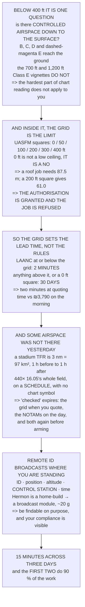

# 18.04 Airspace in practice: classes, charts, NOTAMs, authorisations

<!-- glance:start -->
<!-- generated by tools/build.py from curriculum/syllabus.yaml — edit the syllabus, not this block -->

| | |
|---|---|
| **Track** | Main path |
| **Difficulty** | Intermediate |
| **Time** | 1 h 30 min |
| **Hardware** | none |
| **Software** | none |
| **Prerequisites** | [18.03 The mission-planning process: tasking, risk, brief, debrief](18.03-mission-planning-process.md) |
| **Version-sensitive** | yes — see [curriculum/versions.yaml](../curriculum/versions.yaml) |
| **Skip if** | You can read a sectional, decide whether a site needs an authorisation, and obtain one. |

<!-- glance:end -->

## What you will learn

- That below 400 ft the six airspace classes collapse to one question: **is there controlled
  airspace down to the surface here?**
- That the two shaded-vignette Class E rows — the hardest part of chart reading — **do not affect
  you at all**
- **The finding**: the LAANC grid ceiling, not the 400 ft limit, is what collides with 18.01's GSD
  requirement
- That the most common paid job — a roof inspection at 87.5 m — **does not fit in a 200 ft grid
  square**, and only just fits in a 300 ft one
- That two rows of the decision table are "**you can fly, and it is still a no**" — refused by
  arithmetic, not by a regulator
- That the grid sets the **lead time**: two minutes for LAANC, **30 days** above it
- That a stadium TFR is **97 km²** of airspace that was not there yesterday, on a schedule
- And that Remote ID broadcasts **where you are standing**, which changes three things about a
  commercial day

## Why it matters

Airspace is taught as a chart-reading skill and encountered as a scheduling problem. The part that
takes longest to learn — the shaded vignettes, the Class E floors, the sectional's full vocabulary —
turns out to be almost entirely irrelevant to somebody flying below four hundred feet. The part
that nobody teaches, the grid of pre-approved ceilings inside controlled airspace, is what decides
whether a job is possible at all.

And it decides it in a way that connects straight back to 18.01. The grid does not say "no flying";
it says "no flying above sixty-one metres", which sounds generous until you remember that the roof
inspection needs eighty-seven point five. **The authorisation is granted and the job is refused.**

The second reason this matters is timing. A LAANC authorisation is two minutes; anything above the
grid is a month. Discovering that at quoting time is a sentence in an email; discovering it on the
morning costs 18.02's whole day.

> [!WARNING]
> This lesson's airspace rules are **United States Part 107** rules, consistent with the rest of the
> course's certification content. If you fly anywhere else, the *structure* transfers — surface-area
> airspace, a pre-approved ceiling, a temporary restriction with no warning — but every specific
> number, threshold and procedure will be different. Confirm against your own regulator before
> flying, and never against a course.

## Prerequisites

<!-- prereqs:start -->
## Prerequisites

You need these first:

- [18.03 The mission-planning process: tasking, risk, brief, debrief](18.03-mission-planning-process.md)

### Optional prerequisite links

None.

Check your readiness: `python course.py why 18.04`
<!-- prereqs:end -->

## Concept

Airspace has a shape that is unhelpful for a small drone, because it was designed for aircraft that
climb. Most of the structure — the classes, the floors, the transitions — exists to separate traffic
at altitudes a Part 107 operator never reaches. Below four hundred feet, almost everything is Class
G, and the only structures that reach down to where you are flying are the surface areas around
airports.

Inside those surface areas the FAA publishes a grid of pre-approved ceilings, and LAANC issues an
authorisation up to whatever the grid square says. That is the number that matters, and it is not
four hundred feet — it is zero, fifty, one hundred, two hundred, three hundred or four hundred, and
the low ones are common close to a runway.

Which is where 18.01 comes back. A job's altitude is set by its ground sample distance, and the grid
sets a ceiling on altitude, so the grid sets a floor on GSD. An operator who checks only "can I fly
here" has answered the wrong question.

And then there is the airspace that was not there yesterday. A temporary flight restriction is a
hundred square kilometres that appears on a schedule with no chart symbol, which means "checked" has
a shelf life measured in hours rather than weeks.

## Technical explanation

### Level 1 — where a small drone actually lives

| class | where it starts | at 400 ft AGL |
|---|---|---|
| A | 18,000 ft MSL | irrelevant |
| **B** | **the surface**, at the biggest fields | **authorisation** |
| **C** | **the surface**, at medium fields | **authorisation** |
| **D** | **the surface**, at towered fields | **authorisation** |
| **E surface** | **the surface** (dashed magenta) | **authorisation** |
| E 700 ft | 700 ft AGL (magenta vignette) | below it: Class G |
| E 1,200 ft | 1,200 ft AGL (blue vignette) | below it: Class G |
| G | the surface, everywhere else | no authorisation |

Read the third column. **The two shaded-vignette rows — the ones that take longest to learn to
read — do not affect you at all**, because their floors are 700 and 1,200 ft and you are at 400.

What bites is **surface-area airspace**: B, C, D and the dashed-magenta Class E. Everything else
below 400 ft is Class G and needs no authorisation. So the chart-reading skill that matters is
narrow and learnable in an hour: find the solid blue, solid magenta and dashed magenta rings and
know which one your site is in. Everything else on a sectional is for somebody in an aeroplane.

### Level 2 — the grid is the limit, not the ceiling

Inside controlled airspace the FAA publishes a UAS Facility Map: a grid of squares, each with a
pre-approved ceiling in feet AGL, and LAANC grants an authorisation up to that number automatically.
**The ceilings are not 400 ft.**

| grid ceiling | metres | GSD there | footprint | 18.01 jobs that fit |
|---|---|---|---|---|
| **0 ft** | 0.0 | — | — | **nothing** |
| 50 ft | 15.2 | 0.52 cm | 21 × 16 | 1 of 4 |
| 100 ft | 30.5 | 1.04 cm | 42 × 31 | 1 of 4 |
| 200 ft | 61.0 | 2.09 cm | 84 × 63 | 2 of 4 |
| 300 ft | 91.4 | 3.13 cm | 125 × 94 | 3 of 4 |
| 400 ft | 121.9 | 4.18 cm | 167 × 125 | 4 of 4 |

**A zero-foot grid square is not a low ceiling, it is a no.** LAANC will not issue anything there.

And now put the grid against 18.01's altitudes:

| job | needs | fits at 100 ft? | fits at 200 ft? |
|---|---|---|---|
| a 1 mm crack (0.03 cm) | 0.9 m | yes | yes |
| a weed rosette (1.5 cm) | 43.8 m | **no** | yes |
| **a roof tile (3.0 cm)** | **87.5 m** | **no** | **no** |
| a person (4.11 cm) | 119.9 m | **no** | **no** |

The roof inspection — the single most common paid job there is — needs 87.5 m, and a 200 ft grid
square gives 61.0. **It does not fit.** The smallest square that takes it is 300 ft (91.4 m), which
leaves 3.9 m of headroom — and that is the whole margin for terrain, for the building itself, and
for 11.05's altitude error.

**So the operational rule is the opposite of the one people learn.** It is not "can I fly here";
almost always you can. It is *can I fly here high enough to get the GSD the job needs* — and 18.01's
whole chain runs backwards through the grid.

### Level 3 — and the grid decides the lead time

| route | lead time | when you learn |
|---|---|---|
| LAANC, at or below the grid | **2 minutes** | instantly |
| further coordination, above it | **≥ 30 days** | in about a month |
| a 0 ft grid square | ≥ 30 days, maybe never | in about a month |

Which turns airspace from a safety topic into a commercial one. A client asks for a roof inspection
next Tuesday:

```
site in Class G                  -> fly Tuesday
site in a 400 ft grid square     -> fly Tuesday
site in a 300 ft grid square     -> fly Tuesday, 3.9 m spare
site in a 200 ft grid square     -> THE JOB DOES NOT FIT
site in a 100 ft grid square     -> the job does not fit
site in a 0 ft grid square       -> 30 days, not Tuesday
```

**Two of those six rows are "you can fly, and it is still a no".** The authorisation is granted and
the job is refused — by arithmetic, not by a regulator.

So the airspace check belongs in the **quote**, not in the flight day. 18.03 put it in the go/no-go
as an advance check for exactly this reason: discovering it on the morning costs 18.02's fifty-minute
drive and the whole day, about ₪3,790. And it is a two-minute check. **The asymmetry is enormous.**

### Level 4 — NOTAMs and TFRs: the airspace that was not there yesterday

A grid square is permanent. A temporary flight restriction is not, and that is what makes it
dangerous to an operator who checked last week. The stadium TFR, which is the one most operators
meet first:

| | |
|---|---|
| radius | 3.0 nm = 5.6 km |
| ceiling | 3,000 ft AGL |
| **area** | 28.3 nm² = **97 km²** |
| active | from 1 h before to 1 h after |

A 19:00 kick-off finishing at 22:00 blocks **18:00 to 23:00 — five hours — over ninety-seven square
kilometres**, and there is nothing on any chart to warn you. That is 440 times 16.05's entire 470 m
field, and ninety-seven times 18.01's one-square-kilometre search area. **A TFR is not a local
inconvenience; it is a region.**

Other things that appear without notice: VIP movement (a moving TFR, sometimes 30 nm), wildfire and
disaster response, a temporary tower or crane by NOTAM, a parachute drop zone becoming active, and
the airport's own runway and procedure changes.

So "checked" has a shelf life, and it is shorter than a week:

| when you checked | still valid? | what it is for |
|---|---|---|
| at quoting time | for the **grid** | gives you the lead time |
| the day before | mostly | 18.03's advance check |
| the morning of | yes | NOTAMs and TFRs, again |
| **on site, before arming** | **yes** | **the only one that counts** |

**Two checks, not one**: the grid at quoting time, because it sets the schedule, and the NOTAMs on
the day, because they did not exist when you quoted.

### Level 5 — Remote ID: your operation is now public

Remote ID broadcasts from the aircraft over Bluetooth or Wi-Fi, and anybody in range with a phone
can read it:

| what is broadcast | what that means on a job |
|---|---|
| the aircraft's ID | your registration, and therefore you |
| the aircraft's position | where it is, live |
| the aircraft's altitude | and whether it is above the grid |
| **the control station's position** | **where you are standing** |
| a timestamp | and therefore a history, if recorded |
| an emergency status | if you declare one |

**Row four is the one operators are surprised by.** The broadcast includes the take-off or
control-station location, so a neighbour with an app knows which field you are standing in before
they have finished walking over.

That is not a problem, it is a fact to plan around, and it changes three things on a commercial day:

1. **Be findable on purpose.** High-vis, a vehicle sign and a one-page "what we are doing" beats
   being discovered.
2. 18.02's client contact number is now also the number you hand to whoever walks up.
3. **Your compliance is visible.** Flying above the grid ceiling is an observable act, not a private
   one.

And the three compliance routes: standard Remote ID built into the aircraft (most factory machines),
**a broadcast module bolted on** — which is Hermon's route, because a home-build needs one — or a
FRIA, a recognised site where you may fly without broadcasting as long as you stay inside it.

Hermon is a home-build, so it is the middle row: a broadcast module, its own serial number on the
registration, and about 20 g of 17.01's budget to carry it.

### Level 6 — the procedure, in the order that saves the most time

| when | what | min |
|---|---|---|
| **at quoting time** | **which airspace, and what is the grid ceiling?** | **2** |
| **at quoting time** | **does 18.01's altitude fit under the grid?** | **1** |
| the day before | file the LAANC authorisation | 3 |
| the day before | NOTAMs and TFRs for the date | 3 |
| the morning | NOTAMs and TFRs again | 3 |
| on site | NOTAMs and TFRs, last time | 2 |
| on site | Remote ID broadcasting, confirmed | 1 |
| | **total, spread over three days** | **15** |

Fifteen minutes across three days, and **the first two minutes do ninety per cent of the work** —
because they are the ones that can turn a Tuesday job into a thirty-day job while it is still a
conversation rather than a commitment.

The last two rows are the ones people skip, for opposite reasons: the on-site NOTAM check feels
redundant after three previous ones (it is the only one that counts), and Remote ID feels like a
setup item (it is a **preflight** item — if it is not broadcasting the flight is not legal, and
04.06's card is where that gets caught).

> [!TIP]
> **Ask your teacher:** "What is the grid ceiling over your usual site?" Most people who fly the same
> field weekly have never looked, because they have never needed an authorisation there — and the
> answer changes the moment a client asks for a job at a different altitude.

## Diagram



## Code

Airspace as a procedure: the class table reduced to what reaches the surface, the LAANC grid
converted into the GSD and footprint each ceiling permits, 18.01's jobs checked against each square,
the lead-time consequence priced against 18.02's day, the stadium TFR's area and blocked hours, what
Remote ID actually broadcasts, and the seven-step check ordered by how much time each step saves.

```python
"""18.04 -- airspace as an operational procedure, not a chart-reading quiz.

Pure stdlib. The missions are 18.01's, the day is 18.02's, the go/no-go
criterion is 18.03's.

The question this answers is the one that actually comes up: 'can I fly
this job, at this place, on this date, and how long does finding out
take?'
"""

import math

FT_PER_M = 3.28084
NM_KM = 1.852

# ---- 14.01's camera, via 18.01 ------------------------------------------
PITCH_M = 1.542e-6
FOCAL_M = 4.5e-3
SENSOR_W_M = 6.17e-3
SENSOR_H_M = 4.63e-3

# ---- 18.02's day --------------------------------------------------------
DRIVE_MIN = 50.0
DAY_ILS = 3790.0

BAR = "=" * 70


def head(n, title):
    print()
    print(BAR)
    print("%d. %s" % (n, title))
    print(BAR)


def gsd_cm(alt_m):
    return PITCH_M * alt_m / FOCAL_M * 100.0


def alt_for_gsd_m(g_cm):
    return g_cm / 100.0 * FOCAL_M / PITCH_M


def footprint_m(alt_m):
    return (SENSOR_W_M * alt_m / FOCAL_M, SENSOR_H_M * alt_m / FOCAL_M)


# ========================================================================
head(1, "WHERE A SMALL DRONE ACTUALLY LIVES")

print("  Airspace is usually taught as six letters and a chart. For an")
print("  operator below %d ft it collapses to one question:" % 400)
print()
print("      IS THERE CONTROLLED AIRSPACE DOWN TO THE SURFACE HERE?")
print()
print("  %-10s %-34s %-22s" % ("class", "where it starts", "at 400 ft AGL"))
CLASSES = [
    ("A", "18,000 ft MSL", "irrelevant"),
    ("B", "THE SURFACE, at the biggest fields", "AUTHORISATION"),
    ("C", "THE SURFACE, at medium fields", "AUTHORISATION"),
    ("D", "THE SURFACE, at towered fields", "AUTHORISATION"),
    ("E surface", "THE SURFACE (dashed magenta)", "AUTHORISATION"),
    ("E 700 ft", "700 ft AGL (magenta vignette)", "below it: Class G"),
    ("E 1,200 ft", "1,200 ft AGL (blue vignette)", "below it: Class G"),
    ("G", "the surface, everywhere else", "no authorisation"),
]
for cl, where, at400 in CLASSES:
    print("  %-10s %-34s %-22s" % (cl, where, at400))

print()
print("  READ THE THIRD COLUMN. THE TWO SHADED-VIGNETTE ROWS -- the")
print("  ones that take the longest to learn to read -- DO NOT AFFECT")
print("  YOU AT ALL, because their floors are %d and %d ft and you are"
      % (700, 1200))
print("  at %d." % 400)
print()
print("  WHAT BITES IS SURFACE-AREA AIRSPACE: B, C, D and the")
print("  dashed-magenta Class E. Everything else below %d ft is Class G"
      % 400)
print("  and needs no authorisation at all.")
print()
print("  SO THE CHART-READING SKILL THAT MATTERS IS NARROW AND")
print("  LEARNABLE IN AN HOUR: find the solid blue, solid magenta and")
print("  dashed magenta rings, and know which one your site is in.")
print("  Everything else on a sectional is for somebody in an")
print("  aeroplane.")

# ========================================================================
head(2, "THE GRID IS THE LIMIT, NOT THE CEILING")

print("  Inside controlled airspace the FAA publishes a UAS Facility")
print("  Map: a grid of squares, each with a pre-approved ceiling in")
print("  feet AGL. LAANC grants an authorisation up to that number")
print("  automatically.")
print()
print("  THE CEILINGS ARE NOT %d FT. They are these:" % 400)
print()
GRID_FT = (0, 50, 100, 200, 300, 400)
print("  %-12s %10s %12s %14s %16s"
      % ("grid ceiling", "metres", "GSD there", "footprint", "18.01 jobs that fit"))
JOBS = [
    ("a 1 mm crack (0.03 cm)", 0.03),
    ("a weed rosette (1.5 cm)", 1.5),
    ("a roof tile (3.0 cm)", 3.0),
    ("a person (4.11 cm)", 4.11),
]
for ft in GRID_FT:
    m = ft / FT_PER_M
    if m <= 0:
        print("  %-12s %10.1f %12s %14s %16s"
              % ("%d ft" % ft, 0.0, "--", "--", "NOTHING"))
        continue
    fw, fh = footprint_m(m)
    fits = sum(1 for _, g in JOBS if alt_for_gsd_m(g) <= m)
    print("  %-12s %10.1f %10.2f cm %7.0f x %-5.0f %10d of %d"
          % ("%d ft" % ft, m, gsd_cm(m), fw, fh, fits, len(JOBS)))

print()
print("  A ZERO-FOOT GRID SQUARE IS NOT A LOW CEILING, IT IS A NO.")
print("  LAANC will not issue anything there, and the job becomes a")
print("  manual request to the FAA rather than a click.")
print()
print("  AND NOW PUT THE GRID AGAINST 18.01's ALTITUDES:")
print()
print("  %-28s %12s %14s %14s"
      % ("job", "needs", "fits at 100 ft?", "fits at 200 ft?"))
for label, g in JOBS:
    need = alt_for_gsd_m(g)
    f100 = "yes" if need <= 100 / FT_PER_M else "NO"
    f200 = "yes" if need <= 200 / FT_PER_M else "NO"
    print("  %-28s %10.1f m %14s %14s" % (label, need, f100, f200))

print()
need_roof = alt_for_gsd_m(3.0)
print("  THE ROOF INSPECTION -- the single most common paid job there")
print("  is -- NEEDS %.1f m, AND A 200 ft GRID SQUARE GIVES YOU %.1f."
      % (need_roof, 200 / FT_PER_M))
print("  IT DOES NOT FIT. The smallest square that takes it is 300 ft")
print("  (%.1f m), which leaves %.1f m of headroom -- and that is the"
      % (300 / FT_PER_M, 300 / FT_PER_M - need_roof))
print("  whole margin for terrain, for the building itself, and for")
print("  11.05's altitude error.")
print()
print("  SO THE OPERATIONAL RULE IS THE OPPOSITE OF THE ONE PEOPLE")
print("  LEARN. It is not 'can I fly here'; almost always you can. It")
print("  is 'CAN I FLY HERE HIGH ENOUGH TO GET THE GSD THE JOB NEEDS' --")
print("  and 18.01's whole chain runs backwards through the grid.")

# ========================================================================
head(3, "AND THE GRID DECIDES THE LEAD TIME, WHICH DECIDES THE QUOTE")

LAANC_MIN = 2.0
FURTHER_DAYS = 30.0
print("  Two routes into controlled airspace, and the difference is not")
print("  procedural. It is a SCHEDULE:")
print()
print("  %-34s %16s %16s"
      % ("route", "lead time", "when you learn"))
ROUTES = [
    ("LAANC, at or below the grid", "%.0f minutes" % LAANC_MIN,
     "instantly"),
    ("further coordination, above it", ">= %.0f days" % FURTHER_DAYS,
     "in about a month"),
    ("a 0 ft grid square", ">= %.0f days, maybe never" % FURTHER_DAYS,
     "in about a month"),
]
for r, lead, when in ROUTES:
    print("  %-34s %16s %16s" % (r, lead, when))

print()
print("  WHICH TURNS AIRSPACE FROM A SAFETY TOPIC INTO A COMMERCIAL")
print("  ONE. A client asks for a roof inspection next Tuesday:")
print()
print("    site in Class G                  -> fly Tuesday")
print("    site in a 400 ft grid square     -> fly Tuesday")
print("    site in a 300 ft grid square     -> fly Tuesday, %.1f m spare"
      % (300 / FT_PER_M - need_roof))
print("    site in a 200 ft grid square     -> THE JOB DOES NOT FIT")
print("    site in a 100 ft grid square     -> the job does not fit")
print("    site in a 0 ft grid square       -> %.0f days, not Tuesday"
      % FURTHER_DAYS)
print()
print("  NOTICE THAT TWO OF THOSE SIX ROWS ARE 'YOU CAN FLY, AND IT IS")
print("  STILL A NO'. The authorisation is granted and the JOB is")
print("  refused -- by arithmetic, not by a regulator.")
print()
print("  THE AIRSPACE CHECK IS THEREFORE PART OF THE QUOTE, NOT PART OF")
print("  THE FLIGHT DAY. 18.03 put it in the go/no-go as an advance")
print("  check for exactly this reason: discovering it on the morning")
print("  costs 18.02's %.0f-minute drive and the whole day, %.0f shekels."
      % (DRIVE_MIN, DAY_ILS))
print()
print("  AND IT IS A TWO-MINUTE CHECK. The asymmetry is enormous: two")
print("  minutes at quoting time against %.0f shekels and a month of"
      % DAY_ILS)
print("  schedule on the morning.")

# ========================================================================
head(4, "NOTAMs AND TFRs: THE AIRSPACE THAT WAS NOT THERE YESTERDAY")

TFR_NM = 3.0
TFR_FT = 3000
TFR_BEFORE_H = 1.0
TFR_AFTER_H = 1.0
print("  A grid square is permanent. A temporary flight restriction is")
print("  not, and that is what makes it dangerous to an operator who")
print("  checked last week.")
print()
area_nm2 = math.pi * TFR_NM ** 2
area_km2 = area_nm2 * NM_KM ** 2
print("  THE STADIUM TFR, which is the one most operators meet first:")
print("    radius                     %6.1f nm = %.1f km"
      % (TFR_NM, TFR_NM * NM_KM))
print("    ceiling                    %6d ft AGL" % TFR_FT)
print("    area                       %6.1f nm2 = %.0f km2"
      % (area_nm2, area_km2))
print("    active                     from %.0f h before to %.0f h after"
      % (TFR_BEFORE_H, TFR_AFTER_H))
print()
game_start, game_end = 19.0, 22.0
print("  A %02.0f:00 kick-off that finishes at %02.0f:00 blocks"
      % (game_start, game_end))
print("  %02.0f:00 to %02.0f:00 -- %.0f hours -- over %.0f square"
      % (game_start - TFR_BEFORE_H, game_end + TFR_AFTER_H,
         (game_end + TFR_AFTER_H) - (game_start - TFR_BEFORE_H), area_km2))
print("  kilometres, and there is nothing on any chart to warn you.")
print()
print("  %.0f km2 IS %.0f TIMES 16.05's ENTIRE %.0f m FIELD, and %.0f"
      % (area_km2, area_km2 * 1e6 / (470.0 * 470.0), 470, area_km2))
print("  times 18.01's one-square-kilometre search area. A TFR is not a")
print("  local inconvenience; it is a region.")
print()
print("  OTHER THINGS THAT APPEAR WITHOUT NOTICE:")
for what in ("VIP movement (a moving TFR, sometimes 30 nm)",
             "wildfire and disaster response",
             "a temporary tower or a crane, by NOTAM",
             "a parachute drop zone becoming active",
             "the airport's own runway and procedure changes"):
    print("    * %s" % what)
print()
print("  SO 'CHECKED' HAS A SHELF LIFE, and it is shorter than a week:")
print()
print("  %-30s %14s %16s" % ("when you checked", "still valid?", "what to do"))
for when, valid, what in (
        ("at quoting time", "for the GRID", "gives you the lead time"),
        ("the day before", "mostly", "18.03's advance check"),
        ("the morning of", "yes", "NOTAMs and TFRs, again"),
        ("on site, before arming", "YES", "the only one that counts")):
    print("  %-30s %14s %16s" % (when, valid, what))
print()
print("  TWO CHECKS, NOT ONE: THE GRID AT QUOTING TIME (because it sets")
print("  the schedule) AND THE NOTAMs ON THE DAY (because they did not")
print("  exist when you quoted).")

# ========================================================================
head(5, "REMOTE ID: YOUR OPERATION IS NOW PUBLIC")

print("  Remote ID broadcasts, over Bluetooth or Wi-Fi, from the")
print("  aircraft itself. Anybody within receiving range with a phone")
print("  can read it.")
print()
print("  %-30s %-38s" % ("what is broadcast", "what that means on a job"))
RID = [
    ("the aircraft's ID", "your registration, and therefore you"),
    ("the aircraft's position", "where it is, live"),
    ("the aircraft's altitude", "and whether it is above the grid"),
    ("the CONTROL STATION's position",
     "WHERE YOU ARE STANDING. This is the one"),
    ("a timestamp", "and therefore a history, if recorded"),
    ("an emergency status", "if you declare one"),
]
for what, means in RID:
    print("  %-30s %-38s" % (what, means))

print()
print("  ROW FOUR IS THE ONE OPERATORS ARE SURPRISED BY. The broadcast")
print("  includes the take-off or control-station location, so a")
print("  neighbour with an app knows which field you are standing in")
print("  before they have finished walking over.")
print()
print("  THAT IS NOT A PROBLEM, IT IS A FACT TO PLAN AROUND, and it")
print("  changes three things on a commercial day:")
print("    1. BE FINDABLE ON PURPOSE. High-vis, a vehicle sign and a")
print("       one-page 'what we are doing' beats being discovered.")
print("    2. THE CLIENT'S CONTACT NUMBER (18.02) is now also the")
print("       number you hand to whoever walks up.")
print("    3. YOUR COMPLIANCE IS VISIBLE. Flying above the grid")
print("       ceiling is now an observable act, not a private one.")
print()
print("  AND THE THREE COMPLIANCE ROUTES, WHICH IS THE WHOLE RULE:")
for route, note in (
        ("standard remote ID built into the aircraft",
         "most factory aircraft"),
        ("a broadcast module bolted on",
         "THIS IS HERMON'S ROUTE -- a home-built needs one"),
        ("a FRIA", "a recognised site; no broadcast, but you stay in it")):
    print("    %-44s %s" % (route, note))
print()
print("  HERMON IS A HOME-BUILD, SO IT IS THE MIDDLE ROW: a broadcast")
print("  module, its own serial number on the registration, and about")
print("  %d g of 17.01's budget to carry it." % 20)

# ========================================================================
head(6, "THE PROCEDURE, IN THE ORDER THAT SAVES THE MOST TIME")

STEPS = [
    ("at QUOTING time", "which airspace, and what is the grid ceiling?",
     2.0, "sets the LEAD TIME and whether the GSD fits"),
    ("at QUOTING time", "does 18.01's altitude fit under the grid?",
     1.0, "if not, the job needs further coordination"),
    ("the day BEFORE", "file the LAANC authorisation", 3.0,
     "18.03's advance check"),
    ("the day BEFORE", "NOTAMs and TFRs for the date", 3.0,
     "catches the scheduled ones"),
    ("the MORNING", "NOTAMs and TFRs again", 3.0,
     "catches the ones issued overnight"),
    ("ON SITE", "NOTAMs and TFRs, last time", 2.0,
     "the only check that legally counts"),
    ("ON SITE", "remote ID broadcasting, confirmed", 1.0,
     "it is a preflight item, not a setup item"),
]
print("  %-16s %-42s %6s" % ("when", "what", "min"))
for when, what, mins, why in STEPS:
    print("  %-16s %-42s %6.0f" % (when, what, mins))
print("  %-16s %-42s %6.0f"
      % ("", "TOTAL, spread over three days", sum(s[2] for s in STEPS)))

print()
print("  FIFTEEN MINUTES, SPREAD ACROSS THREE DAYS, AND THE FIRST TWO")
print("  MINUTES DO NINETY PER CENT OF THE WORK -- because they are the")
print("  ones that can turn a Tuesday job into a %.0f-day job while it"
      % FURTHER_DAYS)
print("  is still a conversation rather than a commitment.")
print()
print("  AND THE LAST TWO ROWS ARE THE ONES PEOPLE SKIP, for opposite")
print("  reasons: the on-site NOTAM check feels redundant after three")
print("  previous ones (it is the only one that counts), and remote ID")
print("  feels like a setup item (it is a preflight item -- if it is")
print("  not broadcasting, the flight is not legal, and 04.06's card is")
print("  where that gets caught).")
print()
print("  THE THREE SENTENCES:")
print("    * below %d ft, only SURFACE-AREA airspace matters" % 400)
print("    * the GRID CEILING, not the %d ft limit, is what collides" % 400)
print("      with 18.01's GSD -- and it sets the LEAD TIME")
print("    * 'checked' expires. The grid at quoting time, the NOTAMs")
print("      on the day, and both again before arming")
```

Output:

```text

======================================================================
1. WHERE A SMALL DRONE ACTUALLY LIVES
======================================================================
  Airspace is usually taught as six letters and a chart. For an
  operator below 400 ft it collapses to one question:

      IS THERE CONTROLLED AIRSPACE DOWN TO THE SURFACE HERE?

  class      where it starts                    at 400 ft AGL         
  A          18,000 ft MSL                      irrelevant            
  B          THE SURFACE, at the biggest fields AUTHORISATION         
  C          THE SURFACE, at medium fields      AUTHORISATION         
  D          THE SURFACE, at towered fields     AUTHORISATION         
  E surface  THE SURFACE (dashed magenta)       AUTHORISATION         
  E 700 ft   700 ft AGL (magenta vignette)      below it: Class G     
  E 1,200 ft 1,200 ft AGL (blue vignette)       below it: Class G     
  G          the surface, everywhere else       no authorisation      

  READ THE THIRD COLUMN. THE TWO SHADED-VIGNETTE ROWS -- the
  ones that take the longest to learn to read -- DO NOT AFFECT
  YOU AT ALL, because their floors are 700 and 1200 ft and you are
  at 400.

  WHAT BITES IS SURFACE-AREA AIRSPACE: B, C, D and the
  dashed-magenta Class E. Everything else below 400 ft is Class G
  and needs no authorisation at all.

  SO THE CHART-READING SKILL THAT MATTERS IS NARROW AND
  LEARNABLE IN AN HOUR: find the solid blue, solid magenta and
  dashed magenta rings, and know which one your site is in.
  Everything else on a sectional is for somebody in an
  aeroplane.

======================================================================
2. THE GRID IS THE LIMIT, NOT THE CEILING
======================================================================
  Inside controlled airspace the FAA publishes a UAS Facility
  Map: a grid of squares, each with a pre-approved ceiling in
  feet AGL. LAANC grants an authorisation up to that number
  automatically.

  THE CEILINGS ARE NOT 400 FT. They are these:

  grid ceiling     metres    GSD there      footprint 18.01 jobs that fit
  0 ft                0.0           --             --          NOTHING
  50 ft              15.2       0.52 cm      21 x 16             1 of 4
  100 ft             30.5       1.04 cm      42 x 31             1 of 4
  200 ft             61.0       2.09 cm      84 x 63             2 of 4
  300 ft             91.4       3.13 cm     125 x 94             3 of 4
  400 ft            121.9       4.18 cm     167 x 125            4 of 4

  A ZERO-FOOT GRID SQUARE IS NOT A LOW CEILING, IT IS A NO.
  LAANC will not issue anything there, and the job becomes a
  manual request to the FAA rather than a click.

  AND NOW PUT THE GRID AGAINST 18.01's ALTITUDES:

  job                                 needs fits at 100 ft? fits at 200 ft?
  a 1 mm crack (0.03 cm)              0.9 m            yes            yes
  a weed rosette (1.5 cm)            43.8 m             NO            yes
  a roof tile (3.0 cm)               87.5 m             NO             NO
  a person (4.11 cm)                119.9 m             NO             NO

  THE ROOF INSPECTION -- the single most common paid job there
  is -- NEEDS 87.5 m, AND A 200 ft GRID SQUARE GIVES YOU 61.0.
  IT DOES NOT FIT. The smallest square that takes it is 300 ft
  (91.4 m), which leaves 3.9 m of headroom -- and that is the
  whole margin for terrain, for the building itself, and for
  11.05's altitude error.

  SO THE OPERATIONAL RULE IS THE OPPOSITE OF THE ONE PEOPLE
  LEARN. It is not 'can I fly here'; almost always you can. It
  is 'CAN I FLY HERE HIGH ENOUGH TO GET THE GSD THE JOB NEEDS' --
  and 18.01's whole chain runs backwards through the grid.

======================================================================
3. AND THE GRID DECIDES THE LEAD TIME, WHICH DECIDES THE QUOTE
======================================================================
  Two routes into controlled airspace, and the difference is not
  procedural. It is a SCHEDULE:

  route                                     lead time   when you learn
  LAANC, at or below the grid               2 minutes        instantly
  further coordination, above it           >= 30 days in about a month
  a 0 ft grid square                 >= 30 days, maybe never in about a month

  WHICH TURNS AIRSPACE FROM A SAFETY TOPIC INTO A COMMERCIAL
  ONE. A client asks for a roof inspection next Tuesday:

    site in Class G                  -> fly Tuesday
    site in a 400 ft grid square     -> fly Tuesday
    site in a 300 ft grid square     -> fly Tuesday, 3.9 m spare
    site in a 200 ft grid square     -> THE JOB DOES NOT FIT
    site in a 100 ft grid square     -> the job does not fit
    site in a 0 ft grid square       -> 30 days, not Tuesday

  NOTICE THAT TWO OF THOSE SIX ROWS ARE 'YOU CAN FLY, AND IT IS
  STILL A NO'. The authorisation is granted and the JOB is
  refused -- by arithmetic, not by a regulator.

  THE AIRSPACE CHECK IS THEREFORE PART OF THE QUOTE, NOT PART OF
  THE FLIGHT DAY. 18.03 put it in the go/no-go as an advance
  check for exactly this reason: discovering it on the morning
  costs 18.02's 50-minute drive and the whole day, 3790 shekels.

  AND IT IS A TWO-MINUTE CHECK. The asymmetry is enormous: two
  minutes at quoting time against 3790 shekels and a month of
  schedule on the morning.

======================================================================
4. NOTAMs AND TFRs: THE AIRSPACE THAT WAS NOT THERE YESTERDAY
======================================================================
  A grid square is permanent. A temporary flight restriction is
  not, and that is what makes it dangerous to an operator who
  checked last week.

  THE STADIUM TFR, which is the one most operators meet first:
    radius                        3.0 nm = 5.6 km
    ceiling                      3000 ft AGL
    area                         28.3 nm2 = 97 km2
    active                     from 1 h before to 1 h after

  A 19:00 kick-off that finishes at 22:00 blocks
  18:00 to 23:00 -- 5 hours -- over 97 square
  kilometres, and there is nothing on any chart to warn you.

  97 km2 IS 439 TIMES 16.05's ENTIRE 470 m FIELD, and 97
  times 18.01's one-square-kilometre search area. A TFR is not a
  local inconvenience; it is a region.

  OTHER THINGS THAT APPEAR WITHOUT NOTICE:
    * VIP movement (a moving TFR, sometimes 30 nm)
    * wildfire and disaster response
    * a temporary tower or a crane, by NOTAM
    * a parachute drop zone becoming active
    * the airport's own runway and procedure changes

  SO 'CHECKED' HAS A SHELF LIFE, and it is shorter than a week:

  when you checked                 still valid?       what to do
  at quoting time                  for the GRID gives you the lead time
  the day before                         mostly 18.03's advance check
  the morning of                            yes NOTAMs and TFRs, again
  on site, before arming                    YES the only one that counts

  TWO CHECKS, NOT ONE: THE GRID AT QUOTING TIME (because it sets
  the schedule) AND THE NOTAMs ON THE DAY (because they did not
  exist when you quoted).

======================================================================
5. REMOTE ID: YOUR OPERATION IS NOW PUBLIC
======================================================================
  Remote ID broadcasts, over Bluetooth or Wi-Fi, from the
  aircraft itself. Anybody within receiving range with a phone
  can read it.

  what is broadcast              what that means on a job              
  the aircraft's ID              your registration, and therefore you  
  the aircraft's position        where it is, live                     
  the aircraft's altitude        and whether it is above the grid      
  the CONTROL STATION's position WHERE YOU ARE STANDING. This is the one
  a timestamp                    and therefore a history, if recorded  
  an emergency status            if you declare one                    

  ROW FOUR IS THE ONE OPERATORS ARE SURPRISED BY. The broadcast
  includes the take-off or control-station location, so a
  neighbour with an app knows which field you are standing in
  before they have finished walking over.

  THAT IS NOT A PROBLEM, IT IS A FACT TO PLAN AROUND, and it
  changes three things on a commercial day:
    1. BE FINDABLE ON PURPOSE. High-vis, a vehicle sign and a
       one-page 'what we are doing' beats being discovered.
    2. THE CLIENT'S CONTACT NUMBER (18.02) is now also the
       number you hand to whoever walks up.
    3. YOUR COMPLIANCE IS VISIBLE. Flying above the grid
       ceiling is now an observable act, not a private one.

  AND THE THREE COMPLIANCE ROUTES, WHICH IS THE WHOLE RULE:
    standard remote ID built into the aircraft   most factory aircraft
    a broadcast module bolted on                 THIS IS HERMON'S ROUTE -- a home-built needs one
    a FRIA                                       a recognised site; no broadcast, but you stay in it

  HERMON IS A HOME-BUILD, SO IT IS THE MIDDLE ROW: a broadcast
  module, its own serial number on the registration, and about
  20 g of 17.01's budget to carry it.

======================================================================
6. THE PROCEDURE, IN THE ORDER THAT SAVES THE MOST TIME
======================================================================
  when             what                                          min
  at QUOTING time  which airspace, and what is the grid ceiling?      2
  at QUOTING time  does 18.01's altitude fit under the grid?       1
  the day BEFORE   file the LAANC authorisation                    3
  the day BEFORE   NOTAMs and TFRs for the date                    3
  the MORNING      NOTAMs and TFRs again                           3
  ON SITE          NOTAMs and TFRs, last time                      2
  ON SITE          remote ID broadcasting, confirmed               1
                   TOTAL, spread over three days                  15

  FIFTEEN MINUTES, SPREAD ACROSS THREE DAYS, AND THE FIRST TWO
  MINUTES DO NINETY PER CENT OF THE WORK -- because they are the
  ones that can turn a Tuesday job into a 30-day job while it
  is still a conversation rather than a commitment.

  AND THE LAST TWO ROWS ARE THE ONES PEOPLE SKIP, for opposite
  reasons: the on-site NOTAM check feels redundant after three
  previous ones (it is the only one that counts), and remote ID
  feels like a setup item (it is a preflight item -- if it is
  not broadcasting, the flight is not legal, and 04.06's card is
  where that gets caught).

  THE THREE SENTENCES:
    * below 400 ft, only SURFACE-AREA airspace matters
    * the GRID CEILING, not the 400 ft limit, is what collides
      with 18.01's GSD -- and it sets the LEAD TIME
    * 'checked' expires. The grid at quoting time, the NOTAMs
      on the day, and both again before arming
```

## Exercise

### Exercise 18.04-E1 — Find your own grid `[analysis]`

Look up the UAS Facility Map ceiling for three sites you might realistically be asked to fly. Write
down the ceiling and the GSD it permits. Compare with the jobs you actually sell.

### Exercise 18.04-E2 — The refusal table `[analysis]`

For your most common job type, build Level 3's six-row table with your own required altitude. Find
the grid ceiling at which the job stops fitting, and write it on your quoting checklist.

### Exercise 18.04-E3 — Check a real date `[analysis]`

Pick a real site and a real date and run the full NOTAM and TFR check. Then run it again the
following morning and diff the two. Note anything that appeared.

### Exercise 18.04-E4 — Watch yourself broadcast `[build]`

Install a Remote ID receiver app, fly, and look at what it shows. Find your own control-station
position on the screen, and decide what that changes about where you park and how you are dressed.

## Expected result

**18.04-E1**: expect at least one of the three to be in controlled airspace and at least one grid
ceiling to be below 400 ft. Urban sites near a towered field are routinely 100 or 200.

**18.04-E2**: expect the crossover to be higher than you assumed. Most operators quote roof and
facade work without checking that the altitude fits under the grid.

**18.04-E3**: expect the overnight diff to be empty most of the time and non-empty often enough to
justify the check. The ones that appear at short notice are the ones that matter.

**18.04-E4**: expect to be able to identify your own aircraft and your own standing position within
seconds. That is the correct reaction, and the operational response is to be visible deliberately
rather than to be found.

## Troubleshooting

**LAANC refuses the request.** Check the grid ceiling against your requested altitude first — the
usual cause is asking for more than the square allows, not anything wrong with the request.

**The grid square is 0 ft.** Then LAANC is not a route. The job needs further coordination, which is
weeks, and the honest answer to the client is a date rather than a maybe.

**The authorisation is granted but the job still does not work.** Level 2. You have permission to fly
lower than the GSD requires. Either the lens changes or the job does.

**The site is in Class G but next to a surface area.** Fly the Class G part and put the boundary on
12.02's plan as a hard line — 12.03's fence is the enforcement, and its margin is already spoken for
by 18.03's abort arithmetic.

**A TFR appeared on the morning.** That is the system working. It is why the day-before check is not
the last check.

**You were checked by somebody on site.** Remote ID made you findable. Have the one-page explanation
and the registration to hand; being prepared for it converts an incident into a conversation.

**The Remote ID module is not broadcasting.** It is a preflight failure, not a setup annoyance. It
belongs on 04.06's card with a pass/fail, and a failed item is a no-fly.

## Common mistakes

- **Learning the Class E vignettes first.** They do not reach you.
- **Checking "can I fly here" and stopping.** Check how high.
- **Assuming the ceiling is 400 ft in controlled airspace.** It is the grid square.
- **Treating a 0 ft square as a low ceiling.** It is a 30-day job.
- **Checking airspace on the flight day.** It belongs in the quote.
- **Checking NOTAMs once.** They appear overnight, and the on-site check is the one that counts.
- **Forgetting the TFR schedule.** Ninety-seven square kilometres, on a fixture list.
- **Assuming Remote ID only broadcasts the aircraft.** It broadcasts you.
- **Treating Remote ID as a setup item.** It is a preflight pass/fail.

## Knowledge check

<details>
<summary>Which airspace classes actually matter below 400 ft?</summary>

Only the ones that reach the surface: B, C, D and dashed-magenta Class E. The magenta and blue
vignettes mark Class E starting at 700 and 1,200 ft, so they are above you everywhere — and they are
the hardest part of chart reading. Everything else below 400 ft is Class G and needs no
authorisation.
</details>

<details>
<summary>What does the LAANC grid actually give you?</summary>

An automatic authorisation up to the ceiling printed on that grid square, which is 0, 50, 100, 200,
300 or 400 ft — **not** 400 by default. A 0 ft square is not a low ceiling; it is a refusal, and the
job then needs a manual further-coordination request.
</details>

<details>
<summary>Why can a granted authorisation still mean "no"?</summary>

Because the grid limits altitude and 18.01 says altitude is set by the required GSD. A roof
inspection needs 3 cm GSD, which is 87.5 m; a 200 ft square permits 61.0 m. You have permission to
fly, and not high enough to do the job. **Refused by arithmetic, not by a regulator** — and only a
300 ft square fits it, with 3.9 m to spare.
</details>

<details>
<summary>Why does the airspace check belong in the quote rather than the flight day?</summary>

Because the grid decides the **lead time**. At or below it, LAANC is two minutes. Above it — or in a
0 ft square — it is thirty days or more. Two minutes at quoting time turns a Tuesday job into a
thirty-day job while it is still a conversation; the same discovery on the morning costs 18.02's
fifty-minute drive and about ₪3,790.
</details>

<details>
<summary>How big is a stadium TFR, and why is it dangerous?</summary>

3 nm radius, 3,000 ft, which is 28.3 nm² — **97 square kilometres**, 440 times 16.05's entire field.
It is active from one hour before to one hour after, so a 19:00 fixture blocks 18:00 to 23:00. And
it has **no chart symbol**: it appears on a schedule, which is why a check made last week is not a
check.
</details>

<details>
<summary>How many airspace checks does a job need, and when?</summary>

Two kinds. The **grid**, at quoting time, because it sets the lead time and decides whether the job
fits. And **NOTAMs and TFRs** on the day — the day before, the morning, and once more on site before
arming, which is the only one that legally counts. The first is about the schedule; the second is
about things that did not exist when you quoted.
</details>

<details>
<summary>What does Remote ID broadcast that surprises people?</summary>

The **control station's position** — where you are standing. Anybody in range with a phone app sees
your registration, the aircraft's live position and altitude, and your own location. The response is
to be findable on purpose: high-vis, a vehicle sign, a one-page explanation and the client's contact
number to hand.
</details>

<details>
<summary>Which Remote ID route applies to Hermon, and why?</summary>

A **broadcast module**. Standard Remote ID is built into factory aircraft; Hermon is a home-build, so
it needs a bolt-on module with its own serial number on the registration, costing about 20 g of
17.01's mass budget. The third route — a FRIA — removes the broadcast requirement but confines you to
that recognised site.
</details>

## Practical challenge

Turn airspace into two lines on your quoting checklist and five minutes on your flight day.

1. Look up the grid ceiling for your three most likely sites (E1).
2. For each of your standard job types, compute the required altitude from its GSD.
3. Build the refusal table: at which grid ceiling does each job stop fitting? (E2)
4. Add two lines to your quoting checklist — the airspace class and the grid ceiling — and make them
   the first two things you check after the tasking conversation.
5. File one real LAANC authorisation, even for a site you do not need one for, to learn the timing.
6. Run a real NOTAM and TFR check the day before and again on the morning, and diff them (E3).
7. Put the on-site NOTAM check and the Remote ID confirmation onto 04.06's preflight card as
   pass/fail items.
8. Watch your own broadcast and decide what it changes about how you present on site (E4).

Step 3 is the one worth doing today. It is a ten-minute table that will stop you quoting a job you
cannot legally do at the altitude it requires.

## You can skip this if

You can read a sectional, decide whether a site needs an authorisation, and obtain one. "Decide"
includes deciding whether the altitude the job needs is available.

## Go deeper

- The FAA's UAS Facility Maps and LAANC pages, which are the authoritative source for the grid
  ceilings in Level 2 and the authorisation routes in Level 3:
  <https://www.faa.gov/uas/commercial_operators/uas_facility_maps>
- The FAA's Remote ID rule and compliance routes, including broadcast modules and FRIAs:
  <https://www.faa.gov/uas/getting_started/remote_id>
- The FAA's NOTAM search and TFR list, which are the day-of checks in Level 4:
  <https://tfr.faa.gov/> and <https://notams.aim.faa.gov/>

**Version-sensitive:** airspace procedures, the LAANC grid, Remote ID requirements and the
further-coordination lead time all change, and the specific thresholds in this lesson are current
only as of writing. Confirm every one of them against the FAA's own pages before flying, and note
that outside the United States essentially none of the specifics transfer.

## Progress checkpoint

You can now reduce a sectional to the one question that matters below 400 ft, read a grid ceiling
and convert it into the GSD it permits, recognise the jobs a granted authorisation still refuses,
put the airspace check where it belongs in the quote, run a NOTAM and TFR check with the right shelf
life, and explain what your aircraft is telling everybody about where you are standing.

Next, 18.05 is the certificate itself — Part 107, the knowledge test, the operating limitations, and
which of Hermon's missions need a waiver.
