# 18.05 FAA Part 107: the certificate, the rules, the waivers

<!-- glance:start -->
<!-- generated by tools/build.py from curriculum/syllabus.yaml — edit the syllabus, not this block -->

| | |
|---|---|
| **Track** | Main path |
| **Difficulty** | Intermediate |
| **Time** | 2 h |
| **Hardware** | none |
| **Software** | none |
| **Prerequisites** | [18.04 Airspace in practice: classes, charts, NOTAMs, authorisations](18.04-airspace-in-operations.md) |
| **Version-sensitive** | yes — see [curriculum/versions.yaml](../curriculum/versions.yaml) |
| **Skip if** | You can pass a Part 107 practice exam and state which of Hermon's missions need a waiver and which do not. |

<!-- glance:end -->

## What you will learn

- What a 70 % pass mark actually demands: **knowing exactly 70 % is a 56 % coin flip**, and 80 % is
  97.8 %
- That the ten points between 70 and 80 are worth **41 percentage points of pass probability** —
  the highest-value ten points in the certificate
- That the certificate does not lapse but **your currency does, silently, on a calendar**
- **The rule nobody knows**: the 400 ft ceiling becomes 400 ft *above a structure* within 400 ft of
  it — a **cylinder**, and it is what makes facade work legal
- That a 150 m chimney gives you an 892 ft ceiling, **2.2× the open-field limit**
- That Hermon uses **6.8 % of the weight limit**, so the row everybody checks never binds
- That a waiver application **is 16.05's bowtie with a cover sheet** — and the barrier with no
  evidence is exactly what gets refused
- And that your delivery radius is **500 m of eyesight, not 2,240 m of battery**

## Why it matters

This is the lesson that turns everything the course has built into something you are allowed to do.
It is also the lesson where several of the numbers frozen much earlier finally meet a rule: 18.01's
person-at-ten-pixels job is refused by the ceiling, 17.05's delivery is limited by your eyesight
rather than by 17.01's endurance, and 16.05's bowtie turns out to be the document a waiver
application is asking for.

Two results are worth arriving at rather than being told. The first is what a pass mark means: a
70 % threshold does not mean "know 70 %", it means "know enough that 70 % is comfortably below your
expected score", and the arithmetic says how far below. The second is the structure rule, which is
the single most commercially useful sentence in the whole regulation and is routinely misremembered
as a dome when it is a cylinder.

> [!WARNING]
> This lesson describes **United States 14 CFR Part 107**, which is what this course's certification
> content targets. Nothing in it is legal advice, the specifics change, and outside the US almost
> none of it transfers. Read the current rule text and the FAA's own guidance before you rely on a
> single number here, and never treat a course as the authority for a limit you are about to fly
> against.

## Prerequisites

<!-- prereqs:start -->
## Prerequisites

You need these first:

- [18.04 Airspace in practice: classes, charts, NOTAMs, authorisations](18.04-airspace-in-operations.md)

### Optional prerequisite links

None.

Check your readiness: `python course.py why 18.05`
<!-- prereqs:end -->

## Concept

Part 107 has three layers and they fail in different ways. There is the **certificate**, which is a
test you pass once and a currency you maintain; there are the **operating limitations**, which are
a list of conditions each flight must satisfy; and there are the **waivers**, which are how you move
one of those limitations for a specific operation you can justify.

The certificate layer is mostly a study problem, and it has a quantitative shape that changes how
you should study: because the pass mark sits exactly at the expected score of somebody who "knows
70 %", the distribution puts half of them below it. Aiming at the pass mark is aiming at a coin
flip.

The limitations layer is where the course's earlier numbers land. Most of the limits are generous
for a 1.7 kg aircraft — the weight limit especially — and two of them are not: visual line of sight,
which is what actually bounds a delivery operation, and the altitude ceiling, which refuses one of
18.01's missions outright. And one limitation is *more* generous than people remember, in a way that
makes an entire commercial sector possible.

And the waiver layer is where module 16 pays off. A waiver application asks six questions, and
16.05's bowtie answers every one of them — including the one it already warned would be refused.

## Technical explanation

### Level 1 — the certificate, and what "70 per cent" actually demands

The path is short: be 16, read and speak English, pass a TSA vetting, and pass a knowledge test of
60 questions at 70 % — **42 correct**.

Everybody reads that as "know 70 % of the material". It does not mean that. If you know a fraction
p and the questions are drawn from it independently, your score is Binomial(60, p) and you pass when
it reaches 42:

| you know | expected | P(pass) | P(fail) |
|---|---|---|---|
| 60 % | 36.0/60 | 0.072 | 0.928 |
| 65 % | 39.0/60 | 0.252 | 0.748 |
| **70 %** | **42.0/60** | **0.563** | **0.437** |
| 75 % | 45.0/60 | 0.851 | 0.149 |
| **80 %** | 48.0/60 | **0.978** | 0.022 |
| 85 % | 51.0/60 | 0.999 | 0.001 |
| 90 % | 54.0/60 | 1.000 | 0.000 |

**Knowing exactly seventy per cent gives you a 56 % chance of passing** — essentially a coin flip,
because the expected score *is* the pass mark and half the distribution falls below it.

Knowing eighty gives 97.8 %. **Those ten points of extra study are worth 41 percentage points of
pass probability**, which is the highest-value ten points in the whole certificate.

And the tail matters: at p = 0.80 about two candidates in a hundred still fail, which is a re-test
fee and a fortnight rather than a catastrophe — worth knowing in advance so it is not taken
personally. **Aim for 85 per cent, not 70.** It is the difference between 56 % and 99.9 % of walking
out with a certificate.

### Level 2 — and then it expires, quietly

The certificate itself does not lapse, but the **currency** does: recurrent training every 24
*calendar* months. "Calendar months" is not "two years from today" — it runs to the last day of the
24th month, which is generous, and then it stops without telling you:

```
you complete it on           14 March 2026
24 calendar months later     31 March 2028
you are current until        31 March 2028
on 1 April 2028 you are      NOT CURRENT, AND NOT NOTIFIED
```

A not-current pilot in command is an uninsured flight and an unenforceable contract, and 18.02's day
rate assumed neither. So it goes in 18.06's currency table with a date, alongside the aircraft's
maintenance — **because they fail the same way, silently, between jobs.**

### Level 3 — the operating limitations, and what they actually stop

| limit | what it says | what it actually stops |
|---|---|---|
| altitude | 400 ft AGL | 18.01's person-at-10-px job |
| **…or** | **400 ft above a structure, within 400 ft of it** | **tower and facade work** |
| speed | 100 mph ground speed | nothing Hermon does |
| sight | **visual line of sight, always** | any survey over a ridge |
| light | day or civil twilight + anti-collision light | dawn thermal surveys |
| visibility | 3 statute miles from the control station | 18.03's go/no-go, every haze day |
| cloud | 500 ft below, 2,000 ft horizontally | low-ceiling days |
| over people | only under the Category 1–4 rules | urban anything |
| aircraft | one at a time, per remote pilot | any two-aircraft plan |
| vehicle | not from a moving vehicle, unless sparsely populated | corridor and pipeline work |
| weight | under 55 lb (24.9 kg) **including payload** | not Hermon |
| care | no careless or reckless operation | the catch-all |

Hermon is 1.700 kg = **3.75 lb against a 55 lb limit** — 6.8 % of it. The weight row is the one
everybody checks and the one that never binds.

**The row that matters most is the second, and it is the one nobody knows.** Within 400 ft of a
structure you may fly 400 ft **above it**:

| structure | height | your ceiling | vs the 400 ft |
|---|---|---|---|
| a house | 8 m | 426 ft | 1.1× |
| a barn | 12 m | 439 ft | 1.1× |
| an office block | 40 m | 531 ft | 1.3× |
| a comms tower | 60 m | 597 ft | 1.5× |
| a wind turbine | 120 m | 794 ft | 2.0× |
| **a chimney** | **150 m** | **892 ft** | **2.2×** |

A 150 m chimney gives you an 892 ft ceiling — 2.2 times the open-field limit — **provided you stay
within 400 ft of the structure horizontally. It is a cylinder, not a dome**, and the horizontal
condition is the half people forget.

And it does not help the survey. 18.01's person-at-10-px job needs 145.9 m over **open ground**,
where the limit is 121.9 m and there is no structure to measure from. That one stays refused.

### Level 4 — waivers: which limits move, and what the FAA is asking for

| section | what it limits | what a waiver buys |
|---|---|---|
| 107.25 | operation from a moving vehicle | corridor work |
| 107.29 | operation at night | mostly unnecessary now |
| **107.31** | **visual line of sight** | **BVLOS — the hard one** |
| 107.33 | visual observer requirements | crew structure |
| 107.35 | one aircraft per remote pilot | swarms, multi-ship |
| 107.37(a) | yielding right of way | rarely sought |
| 107.39 | operation over human beings | urban work |
| 107.51 | the operating limits (altitude, speed, vis, cloud) | high or fast work |

And what is **not** waivable is as important: the certificate itself, registration, Remote ID, the
55 lb weight limit, and the careless-or-reckless prohibition. Those are the floor.

The part that surprises people is what a waiver application actually asks for. **It is not a form.
It is a safety case:**

| the application asks | which is |
|---|---|
| what exactly you want to do | 18.03's tasking, in writing |
| what could go wrong | 16.05's **left**-hand side |
| what stops it | 16.05's barriers, with effectiveness |
| how you know they work | 16.05's **evidence** column, with dates |
| what happens if they do not | 16.05's **right**-hand side |
| who is qualified to do it | 18.06's currency records |

**Every one of those six rows was written in module 16.** The waiver application is 16.05's bowtie
with a cover sheet, and an operator who has kept 18.03's debrief findings and 17.06's dated test rows
already has the hard part.

16.05 also predicted the part that will be refused: **the barrier with no evidence**. A waiver is
exactly where "we have a flow-and-inertial fallback" gets asked "show me the flight log", and 13.05
already said what the answer is.

And the timing is a commercial fact, like 18.04's grid: the FAA asks for **at least 90 days**,
against 18.04's 30 for further coordination and two minutes for LAANC. **A BVLOS job is a
next-quarter job**, and saying so in the first conversation is worth more than any amount of
enthusiasm in the second.

### Level 5 — carrying property: the one 17.05 cares about

17.05's delivery mission is legal, with conditions that are easy to miss because they are not in the
main list:

| | |
|---|---|
| total weight, aircraft + payload | under 55 lb |
| **the flight** | **within a single state's boundaries** |
| hazardous material | not carried, at all |
| everything else in Level 3 | still applies |

Hermon with 17.01's pod is 3.75 lb of 55, so the first row is comfortable. The row that bites a
delivery business is the second: an interstate delivery is a different regulatory animal, and the
distance that matters is not the aircraft's range but **the boundary's position**.

And the fourth row is the quiet one. A delivery still needs visual line of sight unless waived,
which means the delivery radius is not 17.01's endurance at all:

| | |
|---|---|
| range from 17.06's endurance | 2,240 m |
| **range from VLOS, realistically** | **500 m** |
| the ratio | 4.5× |

**The aircraft can fly four times further than you are allowed to send it.** That single fact is why
every delivery company in the world is trying to get a 107.31 waiver, and it is worth knowing that
**the limit on your delivery business is your eyesight rather than your battery.**

### Level 6 — Hermon's compliance stack

**Once, and then maintained:**

| | applies to | renewal |
|---|---|---|
| remote pilot certificate | you | once, then 24-month currency |
| aircraft registration | Hermon | 3 years, number displayed |
| Remote ID broadcast module | Hermon | 18.04: a home-build needs one |
| the module's serial on the registration | both | one field, often missed |
| liability insurance | the business | 18.02: 2.9 % of a day |

**Every single flight:**

- 04.06 preflight, including Remote ID — 18.04's pass/fail item
- airspace authorisation, if needed — 18.04: LAANC or nothing
- NOTAMs and TFRs, on site — the only check that counts
- 18.03's go/no-go, read by someone else — 8 criteria, numbered
- VLOS maintained, or a 107.31 waiver in hand
- the aircraft under 55 lb with its payload — 3.75 lb

**Eleven items, and only two of them are about flying.**

> [!TIP]
> **Ask your teacher:** "Where does your 400 ft come from today?" On an open-field survey it is the
> ground. Beside a structure it is the structure — but only inside a 400 ft cylinder, and knowing
> which one you are in is the difference between a legal facade inspection and an illegal one.

## Diagram

```mermaid
flowchart TB
    T["THE TEST: 60 QUESTIONS, 42 TO PASS<br/>'70 %' does NOT mean 'know 70 %'<br/>know 70 % → P(pass) = 0.563, a coin flip<br/>know 80 % → 0.978 · know 85 % → 0.999<br/>=> ten points of study buys 41 POINTS of pass probability<br/>=> AIM AT 85, NOT AT THE PASS MARK"]

    C["AND THE CURRENCY EXPIRES SILENTLY<br/>24 CALENDAR months, to the last day of the 24th<br/>no notification, and a lapsed PIC is an uninsured flight<br/>=> it goes in 18.06's table with a date"]

    L["THE LIMITS, AND WHAT EACH ONE STOPS<br/>weight: Hermon uses 6.8 % of 55 lb — never binds<br/>altitude: refuses 18.01's person-at-10-px job outright<br/>VLOS: the one that bounds a whole business"]

    S["THE ROW NOBODY KNOWS: 400 ft ABOVE A STRUCTURE<br/>within 400 ft of it — A CYLINDER, NOT A DOME<br/>a 150 m chimney → an 892 ft ceiling, 2.2× the field limit<br/>=> this single sentence is what makes facade work legal"]

    W["A WAIVER APPLICATION IS 16.05's BOWTIE<br/>threats · barriers · EVIDENCE · consequences · who is qualified<br/>≥ 90 days, against 18.04's 30 and LAANC's 2 minutes<br/>=> the barrier with no evidence is what gets refused,<br/>and 16.05 already told you which one that is"]

    D["AND YOUR DELIVERY RADIUS IS EYESIGHT<br/>endurance says 2,240 m · VLOS says 500 m<br/>=> the aircraft can fly 4× further than you may send it<br/>=> which is the whole reason 107.31 waivers exist"]

    T --> C --> L --> S --> W --> D
```



## Code

The certificate and the limits, quantified: an exact binomial that turns "70 % to pass" into a study
target, the calendar-month currency trap, the full limitation list with the mission each one stops,
the structure rule turned into a ceiling table, the waivable sections mapped onto 16.05's bowtie
rows, the carrying-property conditions, and the VLOS-versus-endurance radius that bounds a delivery
operation.

```python
"""18.05 -- Part 107: the certificate, the limits, and the waivers.

Pure stdlib. The missions are 18.01's, the aircraft is Hermon, and the
safety case the waiver process wants was written in 16.05.

Two quantitative results carry this lesson: what a 70 % pass mark
actually requires you to know, and which of Hermon's missions the
operating limitations refuse.
"""

import math

FT_PER_M = 3.28084

# ---- the knowledge test -------------------------------------------------
N_Q = 60
PASS_PCT = 0.70
NEED = math.ceil(N_Q * PASS_PCT)

# ---- the limits ---------------------------------------------------------
CEILING_FT = 400
STRUCT_FT = 400           # you may go 400 ft ABOVE a structure, within 400 ft of it
SPEED_MPH = 100
VIS_SM = 3
CLOUD_BELOW_FT = 500
CLOUD_HORIZ_FT = 2000
MAX_WEIGHT_LB = 55

# ---- Hermon -------------------------------------------------------------
HERMON_KG = 1.700         # 17.01, with the pod
LB_PER_KG = 2.20462

BAR = "=" * 70


def head(n, title):
    print()
    print(BAR)
    print("%d. %s" % (n, title))
    print(BAR)


def binom_at_least(k, n, p):
    """P(X >= k) for X ~ Binomial(n, p). Exact, with integer binomials."""
    if not 0.0 <= p <= 1.0:
        raise ValueError("p must be a probability")
    total = 0.0
    for i in range(k, n + 1):
        total += math.comb(n, i) * p ** i * (1 - p) ** (n - i)
    return total


# ========================================================================
head(1, "THE CERTIFICATE, AND WHAT '70 PER CENT' ACTUALLY DEMANDS")

print("  The remote pilot certificate has a short path: be 16, read and")
print("  speak English, pass a TSA vetting, and pass a knowledge test")
print("  of %d questions at %d %% -- %d correct."
      % (N_Q, PASS_PCT * 100, NEED))
print()
print("  EVERYBODY READS '%d %%' AS 'KNOW %d %% OF THE MATERIAL'."
      % (PASS_PCT * 100, PASS_PCT * 100))
print("  It does not mean that, and the difference is a study plan.")
print()
print("  If you know a fraction p of the material and the questions are")
print("  drawn from it independently, your score is Binomial(%d, p) and"
      % N_Q)
print("  you pass when it reaches %d:" % NEED)
print()
print("  %-24s %12s %14s %14s"
      % ("you know", "expected", "P(pass)", "P(fail)"))
for p in (0.60, 0.65, 0.70, 0.75, 0.80, 0.85, 0.90):
    pp = binom_at_least(NEED, N_Q, p)
    print("  %-24s %10.1f/%d %13.3f %14.3f"
          % ("%.0f %% of it" % (p * 100), p * N_Q, N_Q, pp, 1 - pp))

p70 = binom_at_least(NEED, N_Q, 0.70)
p80 = binom_at_least(NEED, N_Q, 0.80)
print()
print("  KNOWING EXACTLY SEVENTY PER CENT GIVES YOU A %.0f PER CENT"
      % (p70 * 100))
print("  CHANCE OF PASSING -- essentially a coin flip, because the")
print("  expected score IS the pass mark and half the distribution is")
print("  below it.")
print()
print("  KNOWING EIGHTY PER CENT GIVES %.1f %%." % (p80 * 100))
print("  THAT TEN POINTS OF EXTRA STUDY IS WORTH %.0f PERCENTAGE POINTS"
      % ((p80 - p70) * 100))
print("  OF PASS PROBABILITY, which is the highest-value ten points in")
print("  the whole certificate.")
print()
print("  AND THE TAIL MATTERS TOO. At p = 0.80 the chance of failing is")
print("  %.1f %%, so of a hundred well-prepared candidates about %.0f"
      % ((1 - p80) * 100, (1 - p80) * 100))
print("  still fail -- which is a re-test fee and a fortnight, not a")
print("  catastrophe, and is worth knowing in advance so it is not")
print("  taken personally.")
print()
print("  THE STUDY RULE THAT FALLS OUT: AIM FOR 85 PER CENT, NOT 70. It is")
print("  the difference between %.0f %% and %.1f %% of walking out with"
      % (p70 * 100, binom_at_least(NEED, N_Q, 0.85) * 100))
print("  a certificate.")

# ========================================================================
head(2, "AND THEN IT EXPIRES -- QUIETLY, AND ON A CALENDAR")

print("  The certificate itself does not lapse, but the CURRENCY does:")
print("  a recurrent training requirement every 24 CALENDAR months.")
print()
print("  'Calendar months' is not 'two years from today'. It runs to")
print("  the LAST DAY of the 24th month, which is generous, and then")
print("  it stops without telling you:")
print()
EX = [("you complete it on", "14 March 2026"),
      ("24 calendar months later", "31 March 2028"),
      ("you are current until", "31 March 2028"),
      ("on 1 April 2028 you are", "NOT CURRENT, AND NOT NOTIFIED")]
for a, b in EX:
    print("    %-28s %s" % (a, b))
print()
print("  A NOT-CURRENT PILOT IN COMMAND IS AN UNINSURED FLIGHT AND AN")
print("  UNENFORCEABLE CONTRACT, and 18.02's day rate assumed neither.")
print("  So it goes in 18.06's currency table with a date, alongside")
print("  the aircraft's maintenance -- because they fail the same way,")
print("  silently, between jobs.")

# ========================================================================
head(3, "THE OPERATING LIMITATIONS, AND WHICH OF HERMON'S JOBS THEY STOP")

print("  The rule is a list of limits. Here they are with the mission")
print("  each one actually touches:")
print()
LIMITS = [
    ("altitude", "%d ft AGL" % CEILING_FT, "18.01's person-at-10-px job"),
    ("  ...or", "%d ft ABOVE a structure, within %d ft of it"
     % (STRUCT_FT, STRUCT_FT), "TOWER AND FACADE WORK"),
    ("speed", "%d mph ground speed" % SPEED_MPH, "nothing Hermon does"),
    ("sight", "VISUAL LINE OF SIGHT, always", "any survey over a ridge"),
    ("light", "day or civil twilight + anti-collision light",
     "dawn thermal surveys"),
    ("visibility", "%d statute miles from the control station" % VIS_SM,
     "18.03's go/no-go, every haze day"),
    ("cloud", "%d ft below, %d ft horizontally"
     % (CLOUD_BELOW_FT, CLOUD_HORIZ_FT), "low-ceiling days"),
    ("over people", "only under the Category 1-4 rules", "URBAN ANYTHING"),
    ("aircraft", "ONE at a time, per remote pilot", "any two-aircraft plan"),
    ("vehicle", "not from a moving vehicle, unless sparsely populated",
     "corridor and pipeline work"),
    ("weight", "under %d lb (%.1f kg) INCLUDING payload"
     % (MAX_WEIGHT_LB, MAX_WEIGHT_LB / LB_PER_KG), "not Hermon"),
    ("care", "no careless or reckless operation", "the catch-all"),
]
print("  %-14s %-46s" % ("limit", "what it says"))
for what, says, touches in LIMITS:
    print("  %-14s %-46s" % (what, says))
print()
print("  %-14s %-46s" % ("limit", "what it actually stops"))
for what, says, touches in LIMITS:
    print("  %-14s %-46s" % (what, touches))

print()
print("  HERMON IS %.3f kg = %.2f lb, AGAINST A %d lb LIMIT."
      % (HERMON_KG, HERMON_KG * LB_PER_KG, MAX_WEIGHT_LB))
print("  The weight row is the one everybody checks and it is the one")
print("  that never binds: Hermon uses %.1f %% of it."
      % (HERMON_KG * LB_PER_KG / MAX_WEIGHT_LB * 100))
print()
print("  THE ROW THAT MATTERS MOST IS THE SECOND, AND IT IS THE ONE")
print("  NOBODY KNOWS. Within %d ft of a structure you may fly %d ft"
      % (STRUCT_FT, STRUCT_FT))
print("  ABOVE IT -- which is what makes tower and facade work legal at")
print("  all:")
print()
print("  %-24s %10s %14s %14s"
      % ("structure", "height", "your ceiling", "vs the 400 ft"))
for label, h_m in (("a house", 8.0), ("a barn", 12.0),
                   ("an office block", 40.0), ("a comms tower", 60.0),
                   ("a wind turbine", 120.0), ("a chimney", 150.0)):
    h_ft = h_m * FT_PER_M
    ceil_ft = h_ft + STRUCT_FT
    print("  %-24s %8.0f m %10.0f ft %12.1f x"
          % (label, h_m, ceil_ft, ceil_ft / CEILING_FT))

print()
print("  A %.0f m CHIMNEY GIVES YOU A %.0f ft CEILING -- %.1f TIMES the"
      % (150.0, 150.0 * FT_PER_M + STRUCT_FT,
         (150.0 * FT_PER_M + STRUCT_FT) / CEILING_FT))
print("  open-field limit -- PROVIDED you stay within %d ft of the"
      % STRUCT_FT)
print("  structure horizontally. It is a cylinder, not a dome, and the")
print("  horizontal condition is the half people forget.")
print()
print("  AND IT DOES NOT HELP THE SURVEY. 18.01's person-at-10-px job")
print("  needs %.1f m over OPEN GROUND, where the limit is %d ft = %.1f"
      % (145.9, CEILING_FT, CEILING_FT / FT_PER_M))
print("  m and there is no structure to measure from. That one stays")
print("  refused.")

# ========================================================================
head(4, "WAIVERS: WHICH LIMITS MOVE, AND WHAT THE FAA IS ASKING FOR")

WAIVER_DAYS = 90
print("  Most of section 3 is waivable. The waivable sections, and what")
print("  each one buys:")
print()
WAIVERS = [
    ("107.25", "operation from a moving vehicle", "corridor work"),
    ("107.29", "operation at night", "mostly unnecessary now"),
    ("107.31", "VISUAL LINE OF SIGHT", "BVLOS -- the hard one"),
    ("107.33", "visual observer requirements", "crew structure"),
    ("107.35", "one aircraft per remote pilot", "swarms, multi-ship"),
    ("107.37(a)", "yielding right of way", "rarely sought"),
    ("107.39", "operation over human beings", "urban work"),
    ("107.51", "the operating limits (altitude, speed, vis, cloud)",
     "high or fast work"),
]
print("  %-12s %-42s %-20s" % ("section", "what it limits", "what it buys"))
for sec, what, buys in WAIVERS:
    print("  %-12s %-42s %-20s" % (sec, what, buys))

print()
print("  AND WHAT IS **NOT** WAIVABLE IS AS IMPORTANT: the certificate")
print("  itself, registration, remote ID, the %d lb weight limit, and"
      % MAX_WEIGHT_LB)
print("  the careless-or-reckless prohibition. Those are the floor.")
print()
print("  THE PART THAT SURPRISES PEOPLE IS WHAT A WAIVER APPLICATION")
print("  ACTUALLY ASKS FOR. It is not a form. It is a SAFETY CASE:")
print()
ASKS = [
    ("what exactly you want to do", "18.03's tasking, in writing"),
    ("what could go wrong", "16.05's LEFT-hand side"),
    ("what stops it", "16.05's barriers, with EFFECTIVENESS"),
    ("how you know they work", "16.05's EVIDENCE column, with dates"),
    ("what happens if they do not", "16.05's RIGHT-hand side"),
    ("who is qualified to do it", "18.06's currency records"),
]
for ask, where in ASKS:
    print("    %-34s -> %s" % (ask, where))

print()
print("  EVERY ONE OF THOSE SIX ROWS WAS WRITTEN IN MODULE 16. The")
print("  waiver application is 16.05's bowtie with a cover sheet, and")
print("  an operator who has kept 18.03's debrief findings and 17.06's")
print("  dated test rows already has the hard part.")
print()
print("  16.05 ALSO PREDICTED THE PART THAT WILL BE REFUSED: the")
print("  barrier with no evidence. A waiver is exactly where 'we have")
print("  a flow-and-inertial fallback' gets asked 'show me the flight")
print("  log', and 13.05 already said what the answer is.")
print()
print("  AND THE TIMING IS A COMMERCIAL FACT, LIKE 18.04's GRID:")
print("    the FAA asks for at least %d days" % WAIVER_DAYS)
print("    18.04's further coordination was %d days" % 30)
print("    LAANC was %d minutes" % 2)
print("  SO A BVLOS JOB IS A NEXT-QUARTER JOB, and saying so in the")
print("  first conversation is worth more than any amount of")
print("  enthusiasm in the second.")

# ========================================================================
head(5, "CARRYING PROPERTY: THE ONE 17.05 CARES ABOUT")

print("  17.05's delivery mission is legal under the rule, with")
print("  conditions that are easy to miss because they are not in the")
print("  main list:")
print()
CARRY = [
    ("total weight, aircraft + payload", "under %d lb" % MAX_WEIGHT_LB),
    ("the flight", "within a single state's boundaries"),
    ("hazardous material", "NOT carried, at all"),
    ("everything else in section 3", "still applies"),
]
for what, rule in CARRY:
    print("    %-38s %s" % (what, rule))
print()
print("  HERMON WITH 17.01's POD IS %.2f lb OF %d, so the first row is"
      % (HERMON_KG * LB_PER_KG, MAX_WEIGHT_LB))
print("  comfortable. The row that bites a delivery business is the")
print("  SECOND: an interstate delivery is a different regulatory")
print("  animal entirely, and the distance that matters is not the")
print("  aircraft's range but the boundary's position.")
print()
print("  AND THE FOURTH ROW IS THE QUIET ONE. A delivery still needs")
print("  VISUAL LINE OF SIGHT unless waived, which means the delivery")
print("  radius is not 17.01's endurance at all -- it is HOW FAR YOU")
print("  CAN SEE THE AIRCRAFT.")
print()
vlos_m = 500.0
endur_min = 14.93
speed = 5.0
range_endur = speed * (endur_min * 60) / 2
print("  %-34s %10.0f m" % ("range from 17.06's endurance", range_endur))
print("  %-34s %10.0f m" % ("range from VLOS, realistically", vlos_m))
print("  %-34s %10.1f x" % ("the ratio", range_endur / vlos_m))
print()
print("  THE AIRCRAFT CAN FLY %.0f TIMES FURTHER THAN YOU ARE ALLOWED"
      % (range_endur / vlos_m))
print("  TO SEND IT. That single fact is why every delivery company in")
print("  the world is trying to get a 107.31 waiver, and it is worth")
print("  knowing that the LIMIT ON YOUR DELIVERY BUSINESS IS YOUR")
print("  EYESIGHT rather than your battery.")

# ========================================================================
head(6, "HERMON'S COMPLIANCE STACK, ONCE AND PER FLIGHT")

ONCE = [
    ("remote pilot certificate", "you", "once, then 24-month currency"),
    ("aircraft registration", "Hermon", "3 years, number displayed"),
    ("remote ID broadcast module", "Hermon", "18.04: a home-build needs one"),
    ("the module's serial on the registration", "both", "one field, often missed"),
    ("liability insurance", "the business", "18.02: 2.9 % of a day"),
]
PER_FLIGHT = [
    ("04.06 preflight, including remote ID", "18.04's pass/fail item"),
    ("airspace authorisation, if needed", "18.04: LAANC or nothing"),
    ("NOTAMs and TFRs, on site", "18.04: the only check that counts"),
    ("18.03's go/no-go, read by someone else", "8 criteria, numbered"),
    ("VLOS maintained, or a 107.31 waiver in hand", "section 5"),
    ("the aircraft under %d lb with its payload" % MAX_WEIGHT_LB,
     "%.2f lb" % (HERMON_KG * LB_PER_KG)),
]
print("  ONCE, AND THEN MAINTAINED:")
print("  %-42s %-10s %-28s" % ("", "applies to", "renewal"))
for what, who, when in ONCE:
    print("  %-42s %-10s %-28s" % (what, who, when))
print()
print("  EVERY SINGLE FLIGHT:")
for what, note in PER_FLIGHT:
    print("    %-44s %s" % (what, note))

print()
print("  ELEVEN ITEMS, AND ONLY TWO OF THEM ARE ABOUT FLYING.")
print()
print("  THE FOUR SENTENCES TO CARRY OUT OF THIS LESSON:")
print("   1. A %d %% pass mark needs about %d %% of knowledge to be"
      % (PASS_PCT * 100, 85))
print("      comfortable: knowing exactly %d %% is a %.0f %% coin flip."
      % (PASS_PCT * 100, p70 * 100))
print("   2. The %d ft ceiling becomes %d ft ABOVE a structure within"
      % (CEILING_FT, STRUCT_FT))
print("      %d ft of it -- a CYLINDER, and that is what makes facade"
      % STRUCT_FT)
print("      work legal.")
print("   3. A waiver application IS 16.05's bowtie. The barrier with")
print("      no evidence is exactly what gets refused.")
print("   4. Your delivery radius is %.0f m of EYESIGHT, not %.0f m of"
      % (vlos_m, range_endur))
print("      battery.")
```

Output:

```text

======================================================================
1. THE CERTIFICATE, AND WHAT '70 PER CENT' ACTUALLY DEMANDS
======================================================================
  The remote pilot certificate has a short path: be 16, read and
  speak English, pass a TSA vetting, and pass a knowledge test
  of 60 questions at 70 % -- 42 correct.

  EVERYBODY READS '70 %' AS 'KNOW 70 % OF THE MATERIAL'.
  It does not mean that, and the difference is a study plan.

  If you know a fraction p of the material and the questions are
  drawn from it independently, your score is Binomial(60, p) and
  you pass when it reaches 42:

  you know                     expected        P(pass)        P(fail)
  60 % of it                     36.0/60         0.072          0.928
  65 % of it                     39.0/60         0.252          0.748
  70 % of it                     42.0/60         0.563          0.437
  75 % of it                     45.0/60         0.851          0.149
  80 % of it                     48.0/60         0.978          0.022
  85 % of it                     51.0/60         0.999          0.001
  90 % of it                     54.0/60         1.000          0.000

  KNOWING EXACTLY SEVENTY PER CENT GIVES YOU A 56 PER CENT
  CHANCE OF PASSING -- essentially a coin flip, because the
  expected score IS the pass mark and half the distribution is
  below it.

  KNOWING EIGHTY PER CENT GIVES 97.8 %.
  THAT TEN POINTS OF EXTRA STUDY IS WORTH 41 PERCENTAGE POINTS
  OF PASS PROBABILITY, which is the highest-value ten points in
  the whole certificate.

  AND THE TAIL MATTERS TOO. At p = 0.80 the chance of failing is
  2.2 %, so of a hundred well-prepared candidates about 2
  still fail -- which is a re-test fee and a fortnight, not a
  catastrophe, and is worth knowing in advance so it is not
  taken personally.

  THE STUDY RULE THAT FALLS OUT: AIM FOR 85 PER CENT, NOT 70. It is
  the difference between 56 % and 99.9 % of walking out with
  a certificate.

======================================================================
2. AND THEN IT EXPIRES -- QUIETLY, AND ON A CALENDAR
======================================================================
  The certificate itself does not lapse, but the CURRENCY does:
  a recurrent training requirement every 24 CALENDAR months.

  'Calendar months' is not 'two years from today'. It runs to
  the LAST DAY of the 24th month, which is generous, and then
  it stops without telling you:

    you complete it on           14 March 2026
    24 calendar months later     31 March 2028
    you are current until        31 March 2028
    on 1 April 2028 you are      NOT CURRENT, AND NOT NOTIFIED

  A NOT-CURRENT PILOT IN COMMAND IS AN UNINSURED FLIGHT AND AN
  UNENFORCEABLE CONTRACT, and 18.02's day rate assumed neither.
  So it goes in 18.06's currency table with a date, alongside
  the aircraft's maintenance -- because they fail the same way,
  silently, between jobs.

======================================================================
3. THE OPERATING LIMITATIONS, AND WHICH OF HERMON'S JOBS THEY STOP
======================================================================
  The rule is a list of limits. Here they are with the mission
  each one actually touches:

  limit          what it says                                  
  altitude       400 ft AGL                                    
    ...or        400 ft ABOVE a structure, within 400 ft of it 
  speed          100 mph ground speed                          
  sight          VISUAL LINE OF SIGHT, always                  
  light          day or civil twilight + anti-collision light  
  visibility     3 statute miles from the control station      
  cloud          500 ft below, 2000 ft horizontally            
  over people    only under the Category 1-4 rules             
  aircraft       ONE at a time, per remote pilot               
  vehicle        not from a moving vehicle, unless sparsely populated
  weight         under 55 lb (24.9 kg) INCLUDING payload       
  care           no careless or reckless operation             

  limit          what it actually stops                        
  altitude       18.01's person-at-10-px job                   
    ...or        TOWER AND FACADE WORK                         
  speed          nothing Hermon does                           
  sight          any survey over a ridge                       
  light          dawn thermal surveys                          
  visibility     18.03's go/no-go, every haze day              
  cloud          low-ceiling days                              
  over people    URBAN ANYTHING                                
  aircraft       any two-aircraft plan                         
  vehicle        corridor and pipeline work                    
  weight         not Hermon                                    
  care           the catch-all                                 

  HERMON IS 1.700 kg = 3.75 lb, AGAINST A 55 lb LIMIT.
  The weight row is the one everybody checks and it is the one
  that never binds: Hermon uses 6.8 % of it.

  THE ROW THAT MATTERS MOST IS THE SECOND, AND IT IS THE ONE
  NOBODY KNOWS. Within 400 ft of a structure you may fly 400 ft
  ABOVE IT -- which is what makes tower and facade work legal at
  all:

  structure                    height   your ceiling  vs the 400 ft
  a house                         8 m        426 ft          1.1 x
  a barn                         12 m        439 ft          1.1 x
  an office block                40 m        531 ft          1.3 x
  a comms tower                  60 m        597 ft          1.5 x
  a wind turbine                120 m        794 ft          2.0 x
  a chimney                     150 m        892 ft          2.2 x

  A 150 m CHIMNEY GIVES YOU A 892 ft CEILING -- 2.2 TIMES the
  open-field limit -- PROVIDED you stay within 400 ft of the
  structure horizontally. It is a cylinder, not a dome, and the
  horizontal condition is the half people forget.

  AND IT DOES NOT HELP THE SURVEY. 18.01's person-at-10-px job
  needs 145.9 m over OPEN GROUND, where the limit is 400 ft = 121.9
  m and there is no structure to measure from. That one stays
  refused.

======================================================================
4. WAIVERS: WHICH LIMITS MOVE, AND WHAT THE FAA IS ASKING FOR
======================================================================
  Most of section 3 is waivable. The waivable sections, and what
  each one buys:

  section      what it limits                             what it buys        
  107.25       operation from a moving vehicle            corridor work       
  107.29       operation at night                         mostly unnecessary now
  107.31       VISUAL LINE OF SIGHT                       BVLOS -- the hard one
  107.33       visual observer requirements               crew structure      
  107.35       one aircraft per remote pilot              swarms, multi-ship  
  107.37(a)    yielding right of way                      rarely sought       
  107.39       operation over human beings                urban work          
  107.51       the operating limits (altitude, speed, vis, cloud) high or fast work   

  AND WHAT IS **NOT** WAIVABLE IS AS IMPORTANT: the certificate
  itself, registration, remote ID, the 55 lb weight limit, and
  the careless-or-reckless prohibition. Those are the floor.

  THE PART THAT SURPRISES PEOPLE IS WHAT A WAIVER APPLICATION
  ACTUALLY ASKS FOR. It is not a form. It is a SAFETY CASE:

    what exactly you want to do        -> 18.03's tasking, in writing
    what could go wrong                -> 16.05's LEFT-hand side
    what stops it                      -> 16.05's barriers, with EFFECTIVENESS
    how you know they work             -> 16.05's EVIDENCE column, with dates
    what happens if they do not        -> 16.05's RIGHT-hand side
    who is qualified to do it          -> 18.06's currency records

  EVERY ONE OF THOSE SIX ROWS WAS WRITTEN IN MODULE 16. The
  waiver application is 16.05's bowtie with a cover sheet, and
  an operator who has kept 18.03's debrief findings and 17.06's
  dated test rows already has the hard part.

  16.05 ALSO PREDICTED THE PART THAT WILL BE REFUSED: the
  barrier with no evidence. A waiver is exactly where 'we have
  a flow-and-inertial fallback' gets asked 'show me the flight
  log', and 13.05 already said what the answer is.

  AND THE TIMING IS A COMMERCIAL FACT, LIKE 18.04's GRID:
    the FAA asks for at least 90 days
    18.04's further coordination was 30 days
    LAANC was 2 minutes
  SO A BVLOS JOB IS A NEXT-QUARTER JOB, and saying so in the
  first conversation is worth more than any amount of
  enthusiasm in the second.

======================================================================
5. CARRYING PROPERTY: THE ONE 17.05 CARES ABOUT
======================================================================
  17.05's delivery mission is legal under the rule, with
  conditions that are easy to miss because they are not in the
  main list:

    total weight, aircraft + payload       under 55 lb
    the flight                             within a single state's boundaries
    hazardous material                     NOT carried, at all
    everything else in section 3           still applies

  HERMON WITH 17.01's POD IS 3.75 lb OF 55, so the first row is
  comfortable. The row that bites a delivery business is the
  SECOND: an interstate delivery is a different regulatory
  animal entirely, and the distance that matters is not the
  aircraft's range but the boundary's position.

  AND THE FOURTH ROW IS THE QUIET ONE. A delivery still needs
  VISUAL LINE OF SIGHT unless waived, which means the delivery
  radius is not 17.01's endurance at all -- it is HOW FAR YOU
  CAN SEE THE AIRCRAFT.

  range from 17.06's endurance             2240 m
  range from VLOS, realistically            500 m
  the ratio                                 4.5 x

  THE AIRCRAFT CAN FLY 4 TIMES FURTHER THAN YOU ARE ALLOWED
  TO SEND IT. That single fact is why every delivery company in
  the world is trying to get a 107.31 waiver, and it is worth
  knowing that the LIMIT ON YOUR DELIVERY BUSINESS IS YOUR
  EYESIGHT rather than your battery.

======================================================================
6. HERMON'S COMPLIANCE STACK, ONCE AND PER FLIGHT
======================================================================
  ONCE, AND THEN MAINTAINED:
                                             applies to renewal                     
  remote pilot certificate                   you        once, then 24-month currency
  aircraft registration                      Hermon     3 years, number displayed   
  remote ID broadcast module                 Hermon     18.04: a home-build needs one
  the module's serial on the registration    both       one field, often missed     
  liability insurance                        the business 18.02: 2.9 % of a day       

  EVERY SINGLE FLIGHT:
    04.06 preflight, including remote ID         18.04's pass/fail item
    airspace authorisation, if needed            18.04: LAANC or nothing
    NOTAMs and TFRs, on site                     18.04: the only check that counts
    18.03's go/no-go, read by someone else       8 criteria, numbered
    VLOS maintained, or a 107.31 waiver in hand  section 5
    the aircraft under 55 lb with its payload    3.75 lb

  ELEVEN ITEMS, AND ONLY TWO OF THEM ARE ABOUT FLYING.

  THE FOUR SENTENCES TO CARRY OUT OF THIS LESSON:
   1. A 70 % pass mark needs about 85 % of knowledge to be
      comfortable: knowing exactly 70 % is a 56 % coin flip.
   2. The 400 ft ceiling becomes 400 ft ABOVE a structure within
      400 ft of it -- a CYLINDER, and that is what makes facade
      work legal.
   3. A waiver application IS 16.05's bowtie. The barrier with
      no evidence is exactly what gets refused.
   4. Your delivery radius is 500 m of EYESIGHT, not 2240 m of
      battery.
```

## Exercise

### Exercise 18.05-E1 — Find your own p `[analysis]`

Take a full-length practice test cold and score it. That fraction is your p. Look it up in Level 1's
table and decide, arithmetically, whether to book the test or study another week.

### Exercise 18.05-E2 — The structure cylinder `[analysis]`

Pick three structures you could realistically be asked to inspect. Compute the ceiling each one
gives you, and then draw the 400 ft horizontal boundary on a satellite image. Note where you would
leave the cylinder.

### Exercise 18.05-E3 — Which of your jobs need a waiver? `[analysis]`

List the jobs you want to sell. For each, walk Level 3's twelve limits and mark every one it
violates. Then look up which of those are waivable and which are the floor.

### Exercise 18.05-E4 — Draft a waiver from 16.05 `[analysis]`

Take 16.05's bowtie and Level 4's six questions, and write the safety-case half of a 107.31 waiver
application. Find the row where you have no evidence. That row is your next month of work.

## Expected result

**18.05-E1**: expect a cold score in the 55–70 % range if you have done this course and no test
prep, and expect the gap to be chart reading and weather rather than anything about aircraft.

**18.05-E2**: expect at least one structure where the useful vantage point is outside the 400 ft
cylinder — which is the moment the rule stops being abstract.

**18.05-E3**: expect most survey work to need nothing, most urban work to need 107.39, and anything
interesting to need 107.31. Expect the list of *unwaivable* violations to be empty, which is the
good news.

**18.05-E4**: expect the evidence column to be the hard part and expect at least one barrier to have
none — which is exactly what 16.05 predicted, and exactly what a reviewer will find first.

## Troubleshooting

**The practice tests vary wildly.** That is the binomial, not you. A 60-question test at p = 0.75 has
a standard deviation of about 3.4 questions, so scores of 41 and 49 are the same candidate.

**You passed by one question.** You were at p ≈ 0.70 and got the good half of the coin flip. That is
worth knowing before the first commercial flight, because the material you did not know is still
material you do not know.

**Currency lapsed and nobody told you.** They do not. Level 2, and 18.06's table.

**You are inside the 400 ft cylinder vertically but not horizontally.** Then you are outside the rule
entirely and back to 400 ft AGL. The cylinder has two conditions and both must hold.

**The client wants the shot from further back.** Further back is outside the cylinder, so the ceiling
drops to 400 ft AGL. Either move closer or use a longer lens.

**A waiver was refused with a request for more information.** Almost always the evidence column.
16.05's answer is to produce the evidence, not to re-argue the barrier.

**The delivery job is 800 m away.** Then it needs a 107.31 waiver, ninety days, and a safety case —
or a different launch point. The second is usually the answer.

**The aircraft is registered but the module's serial is not on the registration.** A common gap, and
a compliance failure rather than a paperwork one. Level 6, row four.

## Common mistakes

- **Studying to the pass mark.** 70 % of knowledge is a 56 % coin flip.
- **Treating the test as the goal.** The certificate is the floor, not the qualification.
- **Assuming currency is two years from the date.** It is 24 calendar months, unannounced.
- **Worrying about the weight limit.** Hermon uses 6.8 % of it.
- **Remembering the structure rule as a dome.** It is a cylinder, with two conditions.
- **Forgetting the horizontal 400 ft.** It is the half that gets people.
- **Thinking a waiver is a form.** It is a safety case, and you wrote it in 16.05.
- **Claiming a barrier with no evidence in a waiver.** That is the refusal.
- **Sizing a delivery business by endurance.** It is bounded by eyesight, 4.5× smaller.
- **Leaving the Remote ID serial off the registration.** One field, real consequences.

## Knowledge check

<details>
<summary>The pass mark is 70 %. How much should you actually know?</summary>

About 85 %. Knowing exactly 70 % puts your expected score *at* the pass mark, so half the
distribution falls below it — **P(pass) = 0.563**, a coin flip. 80 % gives 0.978 and 85 % gives 0.999.
The ten points between 70 and 80 are worth **41 percentage points of pass probability**, which is the
best return on study time in the whole certificate.
</details>

<details>
<summary>How does a remote pilot certificate stop being valid?</summary>

It does not lapse — the **currency** does. Recurrent training is due every 24 *calendar* months,
running to the last day of the 24th month, and nothing notifies you when it expires. A not-current
pilot in command is an uninsured flight and an unenforceable contract, which is why it belongs in
18.06's table with a date beside the aircraft's maintenance.
</details>

<details>
<summary>Which operating limitation never binds on Hermon, and which two do?</summary>

The weight limit never binds: 3.75 lb of 55, **6.8 %**. The two that bite are the **altitude
ceiling**, which refuses 18.01's person-at-10-px job (145.9 m needed, 121.9 m allowed over open
ground), and **visual line of sight**, which bounds any delivery or over-the-ridge work long before
the battery does.
</details>

<details>
<summary>What does the structure rule actually say, and why is it misremembered?</summary>

Within 400 ft of a structure you may fly 400 ft **above** it — so a 150 m chimney gives an 892 ft
ceiling, 2.2× the open-field limit. It is misremembered as a dome because people keep the vertical
half and forget the horizontal one: **it is a cylinder**, and stepping outside the 400 ft radius puts
you back at 400 ft AGL with no warning.
</details>

<details>
<summary>What is a waiver application actually asking for?</summary>

A safety case. What you want to do, what could go wrong, what stops it, **how you know those things
work**, what happens if they do not, and who is qualified — which are 18.03's tasking and 16.05's
left side, barriers, evidence column, right side, and 18.06's currency records. The document already
exists if module 16 was done properly.
</details>

<details>
<summary>Which part of a waiver application gets refused?</summary>

The barrier with no evidence — which 16.05 named in advance. A waiver is exactly where "we have a
flow-and-inertial fallback" meets "show me the flight log", and 13.05 already said that a fallback
which has only worked in simulation is a parameter rather than a capability.
</details>

<details>
<summary>What bounds a delivery operation, and by how much?</summary>

Your eyesight. 17.06's endurance supports about 2,240 m of out-and-back; realistic VLOS is about
500 m — a factor of **4.5**. The aircraft can fly four times further than you are allowed to send it,
which is the entire commercial motivation behind 107.31 waivers, and it also means a delivery
business grows by moving the launch point rather than by buying a bigger battery.
</details>

<details>
<summary>What is not waivable?</summary>

The certificate itself, aircraft registration, Remote ID, the 55 lb weight limit and the
careless-or-reckless prohibition. Everything else on Level 3's list has a waivable section number —
so the honest planning question is never "is this legal" but "how many days and how much evidence",
which for BVLOS is at least ninety and a complete bowtie.
</details>

## Practical challenge

Get the certificate, and then build the compliance stack around it.

1. Take a cold practice test, score it, and find your p in Level 1's table (E1).
2. Study to 85 %, not to 70, and re-test until the practice scores cluster above 51/60.
3. Book and sit the knowledge test. Put the currency expiry into a calendar the day you pass.
4. Register Hermon, fit the Remote ID module, and **put its serial on the registration** (Level 6).
5. Walk your intended job list against the twelve limits and mark every violation (E3).
6. Compute the structure cylinder for your three most likely inspection targets (E2).
7. For the one job that needs a waiver, draft the safety-case half from 16.05's bowtie (E4).
8. Find the evidence gap in step 7 and schedule the flying that closes it.

Step 8 is the one that connects this whole module back to module 16. A waiver is refused for exactly
the reason 16.05 predicted, and closing that gap is a flight, not a paragraph.

## You can skip this if

You can pass a Part 107 practice exam and state which of Hermon's missions need a waiver and which
do not. "Pass" means comfortably — Level 1 says what that word has to mean.

## Go deeper

- The rule itself, 14 CFR Part 107, which is short enough to read in an evening and is the only
  authority that counts: <https://www.ecfr.gov/current/title-14/chapter-I/subchapter-F/part-107>
- The FAA's remote pilot knowledge test materials, including the Airman Certification Standards and
  the sample questions: <https://www.faa.gov/uas/commercial_operators>
- The FAA's waiver information and the published list of granted waivers, which is the best guide to
  what a successful safety case looks like: <https://www.faa.gov/uas/commercial_operators/part_107_waivers>

**Version-sensitive:** Part 107's operating limitations, the over-people categories, the Remote ID
requirements, the knowledge-test format and the waiver process all change, and several have changed
substantially in recent years. Every number in this lesson must be confirmed against the current
rule text before you fly against it.

## Progress checkpoint

You can now turn a pass mark into a study target with arithmetic behind it, keep a currency that
expires without telling you, walk a job against the twelve operating limitations, use the structure
cylinder correctly in both its dimensions, recognise a waiver application as the safety case you
already wrote, and size a delivery operation by the thing that actually bounds it.

Next, 18.06 closes the module with the part that keeps all of this true between jobs: maintenance,
component life, spares, currency and the operations manual that 18.03's findings have been writing.
