# 18.06 Maintenance, currency, and your own qualification

<!-- glance:start -->
<!-- generated by tools/build.py from curriculum/syllabus.yaml — edit the syllabus, not this block -->

| | |
|---|---|
| **Track** | Main path |
| **Difficulty** | Intermediate |
| **Time** | 1 h 30 min |
| **Hardware** | First flight (Hermon core) (stage 1) |
| **Software** | none |
| **Prerequisites** | [18.05 FAA Part 107: the certificate, the rules, the waivers](18.05-part-107-and-the-legal-path.md) |
| **Skip if** | You have an operations manual and a maintenance schedule for Hermon, and you are current against your own standard. |

<!-- glance:end -->

## What you will learn

- That a full-time commercial operator flies **35 hours a year** — an hour clock running **17×
  slower** than the machine every maintenance convention was written for
- That **the real clock beats the rated life on 7 of 10 components**, and the widest gap is
  connectors: 28.5 rated years against 2.0 real ones
- That only the **battery** is genuinely ended by use; everything else is ended by an event or by
  the calendar
- That the right schedule has **five calendar items, six event items, two count items and zero
  hour-based ones**
- That **the whole spares kit is 45 % of one lost day** — and an import part you did not carry is
  **37 times its own price**
- That the spares rule is not "what is likely to fail" but **"what cannot be bought the same day"**
- That the regulator's **720-day** currency is a floor and your hands need **30**
- And that the operations manual is not written, it is **accumulated**: 45 changes a year out of
  18.03's findings

## Why it matters

Everything in this module so far assumed the aircraft works and the pilot is competent. This lesson
is about keeping both of those true between jobs, which turns out to be a different problem from
keeping them true during one.

The reason is a single number. A commercial small-drone operation accumulates about thirty-five
flight hours a year, so the hour meter — the unit every maintenance schedule in aviation is written
in — barely moves. What actually ends components is a nick, a hard landing, oxidation on a shelf, or
rubber hardening in a case, and none of those are counted by an hour.

The same thing happens to the pilot. The certificate's recurrent requirement is two years, which is
the right interval for testing whether you still know the rules and completely the wrong one for
testing whether you can still land nose-in. And the same thing happens to the operation: 18.03's
findings accumulate faster than anybody rewrites a manual, so a manual that is not being fed is
quietly out of date.

> [!CAUTION]
> A maintenance schedule you copied rather than derived will pass every item and still let a part
> fail. Before adopting anything in this lesson, work out **your own** utilisation — hours,
> landings, pack cycles — and check which clock reaches each component first. The connectors,
> isolators and propellers on an aircraft that sits in a case between jobs are in a worse condition
> than the logbook says.

## Prerequisites

<!-- prereqs:start -->
## Prerequisites

You need these first:

- [18.05 FAA Part 107: the certificate, the rules, the waivers](18.05-part-107-and-the-legal-path.md)

### Optional prerequisite links

None.

Check your readiness: `python course.py why 18.06`
<!-- prereqs:end -->

## Concept

Every component has two clocks running on it: the rated life it was sold with, and whatever actually
ends it in the field. Aviation maintenance is built around the first because in manned aviation the
two roughly agree — an aircraft that flies six hundred hours a year wears out in the way its
manufacturer predicted.

A commercial drone flies about thirty-five. That single difference inverts the whole discipline: the
rated life arrives years after the real cause has already taken the part, so a schedule written in
hours inspects the wrong things at the wrong times and the logbook says everything was fine.

So the schedule has to be built from **triggers** rather than from a single counter: events (every
flight, every hard landing), counts (landings, cycles), and the calendar. And the items that matter
most are the calendar ones, because they catch the faults that grew while nobody was flying.

The same inversion applies to the pilot and to the operation. Rules do not decay in a month; hands
do. And a manual is not a document somebody writes once, it is the accumulated output of the
debriefs 18.03 already produces.

## Technical explanation

### Level 1 — how much does Hermon actually fly?

| | |
|---|---|
| billable days | 121 |
| flights (and landings) | 363 |
| **flight hours** | **35.1 h** |
| cycles per battery pack | 121 |

Thirty-five hours a year. A flying-school aircraft does about 600, so **Hermon's hour clock runs 17
times slower** than the machine every maintenance-schedule convention was written for.

That number decides the whole lesson: an hour-based interval arrives long after whatever was
actually going to end the part has already ended it.

### Level 2 — component life: two clocks, and the hour one usually loses

| part | life | unit | rated yr | real yr | ratio |
|---|---|---|---|---|---|
| propellers | 50 | h | 1.4 | 0.2 | 5.7× |
| motor bearings | 300 | h | 8.5 | 3.0 | 2.8× |
| ESCs | 500 | h | 14.2 | 6.0 | 2.4× |
| the flight controller | 2,000 | h | 57.0 | 10.0 | 5.7× |
| battery packs | 300 | cycles | 2.5 | 3.0 | 0.8× |
| arms and frame | 400 | landings | 1.1 | 4.0 | 0.3× |
| the release mechanism | 500 | cycles | 4.1 | 3.0 | 1.4× |
| landing gear | 600 | landings | 1.7 | 3.0 | 0.6× |
| **wiring and connectors** | 1,000 | h | **28.5** | **2.0** | **14.2×** |
| 14.03's isolator gel | 200 | h | 5.7 | 2.0 | 2.8× |

**The real clock wins on 7 of 10 components.** And what actually ends each one is never an hour:

| part | what actually ends it |
|---|---|
| propellers | a nick, long before the hours |
| motor bearings | grit and salt, not rotation |
| ESCs | heat cycling and vibration |
| battery packs | **cycles — the only true one** |
| arms and frame | landing loads, then fatigue |
| landing gear | 17.01's 40 N, every time |
| **wiring and connectors** | **oxidation, on the shelf** |
| 14.03's isolator gel | **age. It hardens in the box** |

The widest gap is the connectors:

```
rated life arrives in          28.5 years
the real cause arrives in       2.0 years
a factor of                       14
```

**Nothing in an hour-based schedule would ever look at it.**

Only one row is genuinely ended by use — the battery, at 121 cycles a year per pack and a 2.5-year
life, and 11.05's three numbers will tell you long before the counter does. Everything else is ended
by an event or by the calendar: a propeller dies from a nick; connectors oxidise on the shelf
between jobs; 14.03's gel hardens with **age**, which is 14.03's resonance walking into 07.02's
control band while the aircraft sat in its case; arms fatigue with landings, which is a count you
have.

**So a low-utilisation operation's maintenance schedule is a calendar and an event log, not an hour
meter.**

### Level 3 — so the schedule has four triggers, not one

| trigger | what | time |
|---|---|---|
| every flight | 04.06's preflight, + 18.04's Remote ID | 2 min |
| every flight | props: run a fingernail along each edge | 20 s |
| every day | 16.03's five log checks | 20 min |
| every day | torque-check the pod bracket (17.06) | 2 min |
| every 25 landings | arm roots and gear, visually | 5 min |
| every 50 landings | motor bearings by hand, all four | 5 min |
| **monthly** | **connectors: unplug, inspect, re-seat** | 15 min |
| **monthly** | **a manual-mode flight (11.03)** | 10 min |
| quarterly | 14.03's isolator: squeeze test, replace if hard | 10 min |
| quarterly | a full failsafe test (16.04, on the aircraft) | 30 min |
| annually | strip, inspect, re-torque everything | 3 h |
| on event | any hard landing: 17.01's 40 N went somewhere | 15 min |
| on event | any crash: 16.03 the log **before** touching it | 1 h |

**Five calendar items, six event items, two count items, and zero hour-based ones** — which is the
opposite of every manned aviation schedule and follows directly from Level 1.

The two rows people skip are the monthly ones, and they fail in opposite directions: **the connector
check catches a fault that grew while nobody flew, and the manual-mode flight catches a skill that
decayed the same way.**

### Level 4 — spares: the kit costs less than half a lost day

| spare | ₪ | local? | needed/yr |
|---|---|---|---|
| a set of propellers | 80 | yes | 6.0 |
| one motor | 220 | **import** | 0.5 |
| one ESC (or the 4-in-1) | 600 | **import** | 0.3 |
| an arm / frame plate | 150 | **import** | 0.7 |
| landing gear legs | 60 | yes | 1.5 |
| the release servo (17.06) | 45 | yes | 1.0 |
| a spare pack | 443 | yes | 0.4 |
| assorted wire, XT60, heatshrink | 60 | yes | 4.0 |
| fasteners, nylocs, thread-lock | 40 | yes | 8.0 |
| **the whole kit** | **1,698** | | |

**The whole kit is ₪1,698 and one lost day is ₪3,790 — 45 % of a single day.** Which would settle it
on its own, and then 17.06's sourcing arithmetic makes it worse. A part you do not carry and cannot
buy locally is not a lost *day*, it is a lost **lead time**:

| if it fails and you have none | weeks | billable days | cost |
|---|---|---|---|
| one motor | 2.5 | 5.8 | ₪21,987 |
| **one ESC** | 2.5 | 5.8 | **₪21,987** |
| an arm / frame plate | 2.5 | 5.8 | ₪21,987 |

**A ₪600 ESC you did not carry is a ₪21,987 exposure — 37 times the part.**

So the spares rule is not "what is likely to fail". It is: **carry every part that cannot be bought
the same day, whatever its failure rate.** In Israel, per 17.06's research, that is most of the
aircraft — and the kit still costs less than half a lost day.

And the second rule, which is free: **the spare must be the same part.** A different motor is a
different KV, a different thrust curve and 07.05's gains no longer being right — which turns a
ten-minute swap into a tuning flight you did not plan.

### Level 5 — currency: the regulator's floor is not a standard

| | interval | why |
|---|---|---|
| 18.05's recurrent training | **720 d** | the **legal floor** |
| 11.03's nose-in orientation | 30 d | decays in weeks |
| 15.06's manual takeover | 30 d | the one that saves aircraft |
| 11.02's landing in wind | 60 d | every landing is practice |
| 12.04's failsafe recognition | 90 d | or 16.04 does it for you |
| 16.03's log reading | 90 d | a habit, not a skill |

**The regulator says 720 days and the shortest real skill says 30 — a factor of 24.** That is not a
criticism of the rule: a recurrent training course tests whether you still know the **rules**, and
rules do not decay in a month. **Hands do.**

So write your own currency standard and make it shorter:

- 3 landings in the last 30 days, or a practice flight first
- one manual-mode flight per month (11.03, 10 min)
- one deliberate failsafe per quarter (16.04, on the aircraft)
- one 15.06 takeover per quarter, with the companion commanding
- 18.05's recurrent, when due — **the floor, not the standard**

All of it costs about one and a half packs a quarter and one non-billable morning. Against ₪3,790
for a lost day, or an aircraft.

### Level 6 — the operations manual: you accumulate it

18.03 produces about 302 findings a year. If 15 % of them change how you do something, that is **45
changes a year** to the way the operation runs — so a manual with no revision history is either 45
changes out of date or one that nobody has been feeding.

| section | where it already exists |
|---|---|
| 1. what we do, and what we do not | 18.01's verdict table |
| 2. the aircraft, by serial and config | 17.06's build sheet |
| 3. limitations | 18.05 Level 3 + 11.04's wind |
| 4. the planning cycle | 18.03, verbatim |
| 5. the go/no-go criteria | 18.03's eight, numbered |
| 6. crew roles and the abort word | 16.05 + 18.03's distance |
| 7. normal procedures | 04.06, 11.02, 12.02 |
| 8. emergency procedures | 12.04's failsafe tree |
| 9. the maintenance schedule | Level 3 of this lesson |
| 10. currency and training | Level 5 of this lesson |
| **11. records: what is kept, and for how long** | **16.05's evidence table** |
| 12. the safety case | 16.05, plus 17.06's new rows |

**Eleven of the twelve already exist somewhere in this course.** The manual is not a writing task, it
is a **filing** task — and the one section that does not exist yet is section 11, which is the boring
one that makes the other eleven provable.

| record | granularity | keep |
|---|---|---|
| flight logs (16.03's `.bin`) | everything | 3 years |
| 16.01 test cards | one per flight | 3 years |
| 18.03 go/no-go sheets | one per day, signed | 3 years |
| maintenance actions | with the trigger that caused them | life |
| component life counters | landings, cycles, dates | life |
| currency records | yours and every crew member's | 3 years |
| 18.03 debrief findings | with owner and closing date | life |
| the safety case | with a revision history | life |

And the one-page dashboard that says whether you can fly tomorrow — five rows, five dates, no prose:

1. certificate current until — 18.05's 24 calendar months
2. personal currency last met — Level 5's 30-day rule
3. aircraft: last annual, next due — Level 3
4. component counters vs limits — landings and cycles
5. open findings, oldest — 18.03, with an owner

**If any of the five is blank, the answer is no** — and the point is that finding out takes ten
seconds rather than an afternoon looking for a logbook.

> [!TIP]
> **Ask your teacher:** "When did you last unplug a connector?" On an aircraft that flies 35 hours a
> year, oxidation is the failure mode with the widest gap between rated life and real life — 14× —
> and it is the one nobody's schedule contains.

## Diagram

```mermaid
flowchart TB
    H["35 FLIGHT HOURS A YEAR<br/>121 billable days × 3 flights × 5.8 min<br/>a flying school does ~600 — a 17× SLOWER CLOCK<br/>=> the hour meter is the wrong unit for everything"]

    C["TWO CLOCKS PER PART, AND THE HOUR ONE LOSES 7 OF 10<br/>connectors: rated 28.5 years, real 2.0 — a factor of 14<br/>only the BATTERY is genuinely ended by use<br/>=> nicks, hard landings, OXIDATION and AGE end the rest"]

    S["SO FOUR TRIGGERS, NOT ONE<br/>5 calendar · 6 event · 2 count · ZERO hour-based<br/>and the two monthly items are the ones people skip:<br/>=> connectors catch a FAULT that grew while nobody flew<br/>=> a manual-mode flight catches a SKILL that did the same"]

    P["THE SPARES KIT IS 45 % OF ONE LOST DAY<br/>and an import part you did not carry is a LEAD TIME:<br/>2.5 weeks = 5.8 billable days = ₪21,987<br/>=> a ₪600 ESC is a ₪21,987 exposure, 37× the part<br/>=> carry what cannot be bought the SAME DAY"]

    Q["CURRENCY: 720 DAYS IS A FLOOR, 30 IS A STANDARD<br/>rules do not decay in a month. HANDS DO<br/>=> 3 landings/30 d · manual mode monthly · failsafe quarterly<br/>=> ~1.5 packs a quarter and one non-billable morning"]

    M["AND THE MANUAL IS ACCUMULATED, NOT WRITTEN<br/>302 findings/yr × 15 % = 45 CHANGES A YEAR<br/>11 of its 12 sections already exist in this course<br/>=> the missing one is RECORDS, which makes the rest provable"]

    H --> C --> S --> P --> Q --> M
```



## Code

The upkeep, quantified: the year converted into hours, landings and cycles, a two-clock component
table that shows which one actually reaches each part first, the four-trigger schedule with its item
counts, the spares kit priced against a lost day and against an import lead time, the currency
intervals against the regulator's floor, and the operations manual assembled from what earlier
lessons already produced.

```python
"""18.06 -- maintenance, currency, and the operations manual.

Pure stdlib. The year is 18.02's, the findings are 18.03's, the
certificate is 18.05's, and the aircraft is Hermon after module 17.

The result that runs this lesson: at a realistic utilisation almost
nothing on the aircraft is worn out by FLYING, so an hour-based
maintenance schedule checks the wrong things.
"""

import math

BAR = "=" * 70

# ---- 18.02's year -------------------------------------------------------
BILLABLE_DAYS = 121
FLIGHTS_PER_DAY = 3
FLIGHT_MIN = 5.8
PACKS = 3
DAY_ILS = 3790.0

HOURS_PER_YEAR = BILLABLE_DAYS * FLIGHTS_PER_DAY * FLIGHT_MIN / 60.0
LANDINGS_PER_YEAR = BILLABLE_DAYS * FLIGHTS_PER_DAY
CYCLES_PER_PACK_YEAR = BILLABLE_DAYS * FLIGHTS_PER_DAY / PACKS

# ---- 18.03's findings ---------------------------------------------------
FINDINGS_PER_DAY = 2.5

# ---- import reality (17.06, the research file) --------------------------
IMPORT_WEEKS = 2.5


def head(n, title):
    print()
    print(BAR)
    print("%d. %s" % (n, title))
    print(BAR)


# ========================================================================
head(1, "FIRST, HOW MUCH DOES HERMON ACTUALLY FLY?")

print("  18.02's year, converted into the units a maintenance schedule")
print("  is written in:")
print()
print("  %-34s %12.1f" % ("billable days", BILLABLE_DAYS))
print("  %-34s %12.0f" % ("flights", LANDINGS_PER_YEAR))
print("  %-34s %12.0f" % ("landings (the same number)", LANDINGS_PER_YEAR))
print("  %-34s %12.1f h" % ("FLIGHT HOURS", HOURS_PER_YEAR))
print("  %-34s %12.0f" % ("cycles per battery pack", CYCLES_PER_PACK_YEAR))
print()
SCHOOL_H_YEAR = 600.0
print("  THIRTY-FIVE HOURS A YEAR. A flying-school aircraft does about")
print("  %.0f, so Hermon's hour clock runs %.0f TIMES SLOWER than the"
      % (SCHOOL_H_YEAR, SCHOOL_H_YEAR / HOURS_PER_YEAR))
print("  machine every maintenance-schedule convention was written for.")
print()
print("  THAT NUMBER DECIDES THE WHOLE LESSON: an hour-based interval")
print("  arrives long after whatever was actually going to end the part")
print("  has already ended it.")

# ========================================================================
head(2, "COMPONENT LIFE: TWO CLOCKS, AND THE HOUR ONE ALWAYS LOSES")

COMPONENTS = [
    # name, rated life, unit, years before the OTHER cause gets it, why
    ("propellers", 50.0, "h", 0.25, "a nick, long before the hours"),
    ("motor bearings", 300.0, "h", 3.0, "grit and salt, not rotation"),
    ("ESCs", 500.0, "h", 6.0, "heat cycling and vibration"),
    ("the flight controller", 2000.0, "h", 10.0, "nothing, usually"),
    ("battery packs", 300.0, "cycles", 3.0, "CYCLES -- the only true one"),
    ("arms and frame", 400.0, "landings", 4.0, "landing loads, then fatigue"),
    ("the release mechanism", 500.0, "cycles", 3.0, "17.06's roller and pin"),
    ("landing gear", 600.0, "landings", 3.0, "17.01's 40 N, every time"),
    ("wiring and connectors", 1000.0, "h", 2.0, "OXIDATION, on the shelf"),
    ("14.03's isolator gel", 200.0, "h", 2.0, "AGE. It hardens in the box"),
]


def years_on_the_hour_clock(life, unit):
    """How long the RATED life takes to arrive at this utilisation."""
    if unit == "h":
        return life / HOURS_PER_YEAR
    if unit == "cycles":
        return life / CYCLES_PER_PACK_YEAR
    return life / LANDINGS_PER_YEAR


print("  Every component has two clocks running on it: the rated life")
print("  it was sold with, and whatever actually ends it in the field.")
print("  Put them side by side at %.1f flight hours a year:"
      % HOURS_PER_YEAR)
print()
print("  %-26s %8s %9s %12s %12s %10s"
      % ("part", "life", "unit", "RATED yr", "REAL yr", "ratio"))
wins = 0
for name, life, unit, real_yr, why in COMPONENTS:
    rated_yr = years_on_the_hour_clock(life, unit)
    if real_yr < rated_yr:
        wins += 1
    print("  %-26s %8.0f %9s %10.1f %10.1f %9.1f x"
          % (name, life, unit, rated_yr, real_yr, rated_yr / real_yr))

print()
print("  THE REAL CLOCK WINS ON %d OF %d COMPONENTS."
      % (wins, len(COMPONENTS)))
print()
print("  %-26s %s" % ("part", "what actually ends it"))
for name, life, unit, real_yr, why in COMPONENTS:
    print("  %-26s %s" % (name, why))

worst = max(COMPONENTS,
            key=lambda c: years_on_the_hour_clock(c[1], c[2]) / c[3])
print()
print("  THE WIDEST GAP IS %s:" % worst[0])
print("    rated life arrives in         %5.1f years" 
      % years_on_the_hour_clock(worst[1], worst[2]))
print("    the real cause arrives in     %5.1f years" % worst[3])
print("    a factor of                   %5.0f" 
      % (years_on_the_hour_clock(worst[1], worst[2]) / worst[3]))
print("  Nothing in an hour-based schedule would ever look at it.")
print()
print("  AND ONLY ONE ROW IS GENUINELY ENDED BY USE: the battery, at")
print("  %.0f cycles a year per pack, a %.1f-year life -- and 11.05's"
      % (CYCLES_PER_PACK_YEAR, 300.0 / CYCLES_PER_PACK_YEAR))
print("  three numbers will tell you long before the counter does.")
print()
print("  EVERYTHING ELSE IS ENDED BY AN EVENT OR BY THE CALENDAR:")
print("    * a propeller dies from a NICK, not from %.0f hours" % 50)
print("    * connectors oxidise ON THE SHELF, between jobs")
print("    * 14.03's gel hardens with AGE, not with vibration -- and a")
print("      hardened isolator is 14.03's resonance walking into")
print("      07.02's control band while the aircraft sat in its case")
print("    * arms fatigue with LANDINGS, which is a count you have")
print()
print("  SO A LOW-UTILISATION OPERATION'S MAINTENANCE SCHEDULE IS A")
print("  CALENDAR AND AN EVENT LOG, NOT AN HOUR METER. Copying an")
print("  hour-based schedule out of a manual written for an aircraft")
print("  that flies %.0f hours a year is how a part fails at a small"
      % 600)
print("  fraction of its rated life, with the logbook saying it was")
print("  fine.")

# ========================================================================
head(3, "SO THE SCHEDULE HAS FOUR TRIGGERS, NOT ONE")

SCHEDULE = [
    ("EVERY FLIGHT", "04.06's preflight, + 18.04's remote ID",
     "event", "2 min"),
    ("EVERY FLIGHT", "props: run a fingernail along each edge",
     "event", "20 s"),
    ("EVERY DAY", "16.03's five log checks", "event", "20 min"),
    ("EVERY DAY", "torque-check the pod bracket (17.06)",
     "event", "2 min"),
    ("EVERY 25 LANDINGS", "arm roots and gear, visually",
     "count", "5 min"),
    ("EVERY 50 LANDINGS", "motor bearings by hand, all four",
     "count", "5 min"),
    ("MONTHLY", "connectors: unplug, inspect, re-seat",
     "calendar", "15 min"),
    ("MONTHLY", "a manual-mode flight (11.03)", "calendar", "10 min"),
    ("QUARTERLY", "14.03's isolator: squeeze test, replace if hard",
     "calendar", "10 min"),
    ("QUARTERLY", "a full failsafe test (16.04, on the aircraft)",
     "calendar", "30 min"),
    ("ANNUALLY", "strip, inspect, re-torque everything",
     "calendar", "3 h"),
    ("ON EVENT", "any hard landing: 17.01's %.0f N went somewhere"
     % 40, "event", "15 min"),
    ("ON EVENT", "any crash: 16.03 the log BEFORE touching it",
     "event", "1 h"),
]
print("  %-20s %-44s %10s" % ("trigger", "what", "time"))
for when, what, kind, t in SCHEDULE:
    print("  %-20s %-44s %10s" % (when, what, t))

n_cal = sum(1 for _, _, k, _ in SCHEDULE if k == "calendar")
n_ev = sum(1 for _, _, k, _ in SCHEDULE if k == "event")
n_ct = sum(1 for _, _, k, _ in SCHEDULE if k == "count")
print()
print("  %d CALENDAR ITEMS, %d EVENT ITEMS, %d COUNT ITEMS, AND ZERO"
      % (n_cal, n_ev, n_ct))
print("  HOUR-BASED ITEMS -- which is the opposite of every manned")
print("  aviation schedule and follows directly from section 1.")
print()
print("  THE TWO ROWS PEOPLE SKIP ARE THE MONTHLY ONES, and they fail")
print("  in opposite directions: the connector check catches a fault")
print("  that GREW WHILE NOBODY FLEW, and the manual-mode flight")
print("  catches a SKILL that decayed the same way. Section 5.")

# ========================================================================
head(4, "SPARES: THE KIT COSTS LESS THAN HALF A LOST DAY")

SPARES = [
    # name, ILS, local?, how often needed per year
    ("a set of propellers", 80.0, True, 6.0),
    ("one motor", 220.0, False, 0.5),
    ("one ESC (or the 4-in-1)", 600.0, False, 0.3),
    ("an arm / frame plate", 150.0, False, 0.7),
    ("landing gear legs", 60.0, True, 1.5),
    ("the release servo (17.06)", 45.0, True, 1.0),
    ("a spare pack", 443.0, True, 0.4),
    ("assorted wire, XT60, heatshrink", 60.0, True, 4.0),
    ("fasteners, nylocs, thread-lock", 40.0, True, 8.0),
]
kit = sum(s[1] for s in SPARES)
print("  %-32s %9s %9s %12s" % ("spare", "ILS", "local?", "needed/yr"))
for name, ils, local, freq in SPARES:
    print("  %-32s %9.0f %9s %12.1f"
          % (name, ils, "yes" if local else "IMPORT", freq))
print("  %-32s %9.0f" % ("THE WHOLE KIT", kit))

print()
print("  THE WHOLE KIT IS %.0f SHEKELS AND ONE LOST DAY IS %.0f."
      % (kit, DAY_ILS))
print("  THE SPARES KIT IS %.0f PER CENT OF ONE LOST DAY."
      % (kit / DAY_ILS * 100))
print()
print("  WHICH WOULD SETTLE IT ON ITS OWN, AND THEN 17.06's SOURCING")
print("  ARITHMETIC MAKES IT WORSE FOR THE IMPORT LINES. A part you do")
print("  not carry and cannot buy locally is not a lost DAY, it is a")
print("  lost LEAD TIME:")
print()
print("  %-32s %12s %14s %14s"
      % ("if it fails and you have none", "weeks", "billable days", "cost"))
for name, ils, local, freq in SPARES:
    if local:
        continue
    days = IMPORT_WEEKS * 7 * (BILLABLE_DAYS / 365.0)
    print("  %-32s %10.1f %13.1f %12.0f"
          % (name, IMPORT_WEEKS, days, days * DAY_ILS))

esc = [s for s in SPARES if s[0].startswith("one ESC")][0]
days_lost = IMPORT_WEEKS * 7 * (BILLABLE_DAYS / 365.0)
print()
print("  A %.0f SHEKEL ESC YOU DID NOT CARRY IS A %.0f SHEKEL EXPOSURE."
      % (esc[1], days_lost * DAY_ILS))
print("  That is %.0f TIMES the part." % (days_lost * DAY_ILS / esc[1]))
print()
print("  SO THE SPARES RULE IS NOT 'WHAT IS LIKELY TO FAIL'. IT IS:")
print("    CARRY EVERY PART THAT CANNOT BE BOUGHT THE SAME DAY,")
print("    WHATEVER ITS FAILURE RATE.")
print("  In Israel, per 17.06's research, that is most of the aircraft")
print("  -- and the kit still costs less than half a lost day.")
print()
print("  AND THE SECOND RULE, WHICH IS FREE: THE SPARE MUST BE THE SAME")
print("  PART. A different motor is a different KV, a different thrust")
print("  curve and 07.05's gains no longer being right -- which turns")
print("  a ten-minute swap into a tuning flight you did not plan.")

# ========================================================================
head(5, "CURRENCY: THE REGULATOR'S FLOOR IS NOT A STANDARD")

RECURRENT_MONTHS = 24
print("  18.05's recurrent requirement is %d CALENDAR MONTHS. Put that"
      % RECURRENT_MONTHS)
print("  against what a skill actually does:")
print()
SKILLS = [
    ("18.05's recurrent training", RECURRENT_MONTHS * 30, "the LEGAL floor"),
    ("11.03's nose-in orientation", 30, "decays in weeks"),
    ("15.06's manual takeover", 30, "the one that saves aircraft"),
    ("11.02's landing in wind", 60, "every landing is practice"),
    ("12.04's failsafe recognition", 90, "or 16.04 does it for you"),
    ("16.03's log reading", 90, "a habit, not a skill"),
]
print("  %-34s %12s %22s" % ("", "interval (d)", "why"))
for name, days, why in SKILLS:
    print("  %-34s %12.0f %22s" % (name, days, why))

print()
print("  THE REGULATOR SAYS %d DAYS AND THE SHORTEST REAL SKILL SAYS"
      % (RECURRENT_MONTHS * 30))
print("  %d -- A FACTOR OF %.0f." % (30, RECURRENT_MONTHS * 30 / 30))
print()
print("  THAT IS NOT A CRITICISM OF THE RULE. A recurrent training")
print("  course tests whether you still know the RULES, and rules do")
print("  not decay in a month. HANDS DO.")
print()
print("  SO WRITE YOUR OWN CURRENCY STANDARD, AND MAKE IT SHORTER:")
STD = [
    ("3 landings in the last 30 days", "or a practice flight first"),
    ("one manual-mode flight per month", "11.03, %d min" % 10),
    ("one deliberate failsafe per quarter", "16.04, on the aircraft"),
    ("one 15.06 takeover per quarter", "the companion commanding"),
    ("18.05's recurrent, when due", "the floor, not the standard"),
]
for what, note in STD:
    print("    %-38s %s" % (what, note))
print()
print("  AND THE COST OF ALL OF IT IS ABOUT %.1f PACKS A QUARTER, which"
      % 1.5)
print("  18.02's cost stack prices at roughly %.0f shekels a year of"
      % (1.5 * 4 * 443.0 / 300.0 * 3))
print("  consumables and one non-billable morning. Against %.0f for a"
      % DAY_ILS)
print("  lost day, or an aircraft.")

# ========================================================================
head(6, "THE OPERATIONS MANUAL: YOU DO NOT WRITE IT, YOU ACCUMULATE IT")

findings = FINDINGS_PER_DAY * BILLABLE_DAYS
to_manual = 0.15
print("  18.03 produces %.0f findings a year. If %.0f %% of them change"
      % (findings, to_manual * 100))
print("  how you do something, that is %.0f CHANGES A YEAR to the way"
      % (findings * to_manual))
print("  the operation runs.")
print()
print("  A manual with no revision history is a manual that is %.0f"
      % (findings * to_manual))
print("  changes out of date, or one that nobody has been feeding.")
print()
print("  THE TWELVE SECTIONS, AND WHERE EACH ONE ALREADY EXISTS:")
SECTIONS = [
    ("1. what we do, and what we do not", "18.01's verdict table"),
    ("2. the aircraft, by serial and config", "17.06's build sheet"),
    ("3. limitations", "18.05 Level 3 + 11.04's wind"),
    ("4. the planning cycle", "18.03, verbatim"),
    ("5. the go/no-go criteria", "18.03's eight, numbered"),
    ("6. crew roles and the abort word", "16.05 + 18.03's distance"),
    ("7. normal procedures", "04.06, 11.02, 12.02"),
    ("8. emergency procedures", "12.04's failsafe tree"),
    ("9. the maintenance schedule", "section 3 of this lesson"),
    ("10. currency and training", "section 5 of this lesson"),
    ("11. records: what is kept, and for how long",
     "16.05's evidence table"),
    ("12. the safety case", "16.05, plus 17.06's new rows"),
]
for sec, where in SECTIONS:
    print("    %-38s %s" % (sec, where))

print()
print("  ELEVEN OF THE TWELVE ALREADY EXIST SOMEWHERE IN THIS COURSE.")
print("  The manual is not a writing task, it is a FILING task -- and")
print("  the one section that does not exist yet is section 11, which")
print("  is the boring one that makes the other eleven provable.")
print()
print("  WHAT TO KEEP, AND FOR HOW LONG:")
RECORDS = [
    ("flight logs (16.03's .bin)", "everything", "3 years"),
    ("16.01 test cards", "one per flight", "3 years"),
    ("18.03 go/no-go sheets", "one per day, signed", "3 years"),
    ("maintenance actions", "with the trigger that caused them", "life"),
    ("component life counters", "landings, cycles, dates", "life"),
    ("currency records", "yours and every crew member's", "3 years"),
    ("18.03 debrief findings", "with owner and closing date", "life"),
    ("the safety case", "with a revision history", "life"),
]
print("  %-34s %-24s %10s" % ("record", "granularity", "keep"))
for r, g, k in RECORDS:
    print("  %-34s %-24s %10s" % (r, g, k))

print()
print("  AND THE ONE-PAGE DASHBOARD THAT SAYS WHETHER YOU CAN FLY")
print("  TOMORROW -- five rows, five dates, no prose:")
DASH = [
    ("certificate current until", "18.05's 24 calendar months"),
    ("personal currency last met", "section 5's 30-day rule"),
    ("aircraft: last annual, next due", "section 3"),
    ("component counters vs limits", "landings and cycles"),
    ("open findings, oldest", "18.03, with an owner"),
]
for row, src in DASH:
    print("    %-38s %s" % (row, src))
print()
print("  IF ANY OF THE FIVE IS BLANK, THE ANSWER IS NO -- and the")
print("  point of the dashboard is that finding out takes ten seconds")
print("  rather than an afternoon of looking for a logbook.")
print()
print("  THE THREE SENTENCES:")
print("   1. %.0f flight hours a year means almost nothing wears out."
      % HOURS_PER_YEAR)
print("      YOUR SCHEDULE IS A CALENDAR AND AN EVENT LOG.")
print("   2. The spares kit is %.0f %% of one lost day, and an import"
      % (kit / DAY_ILS * 100))
print("      part you did not carry is %.0f times its own price."
      % (days_lost * DAY_ILS / esc[1]))
print("   3. The regulator's %d-day currency is a floor. Your hands"
      % (RECURRENT_MONTHS * 30))
print("      need %d, and the manual is 18.03's findings, filed." % 30)
```

Output:

```text

======================================================================
1. FIRST, HOW MUCH DOES HERMON ACTUALLY FLY?
======================================================================
  18.02's year, converted into the units a maintenance schedule
  is written in:

  billable days                             121.0
  flights                                     363
  landings (the same number)                  363
  FLIGHT HOURS                               35.1 h
  cycles per battery pack                     121

  THIRTY-FIVE HOURS A YEAR. A flying-school aircraft does about
  600, so Hermon's hour clock runs 17 TIMES SLOWER than the
  machine every maintenance-schedule convention was written for.

  THAT NUMBER DECIDES THE WHOLE LESSON: an hour-based interval
  arrives long after whatever was actually going to end the part
  has already ended it.

======================================================================
2. COMPONENT LIFE: TWO CLOCKS, AND THE HOUR ONE ALWAYS LOSES
======================================================================
  Every component has two clocks running on it: the rated life
  it was sold with, and whatever actually ends it in the field.
  Put them side by side at 35.1 flight hours a year:

  part                           life      unit     RATED yr      REAL yr      ratio
  propellers                       50         h        1.4        0.2       5.7 x
  motor bearings                  300         h        8.5        3.0       2.8 x
  ESCs                            500         h       14.2        6.0       2.4 x
  the flight controller          2000         h       57.0       10.0       5.7 x
  battery packs                   300    cycles        2.5        3.0       0.8 x
  arms and frame                  400  landings        1.1        4.0       0.3 x
  the release mechanism           500    cycles        4.1        3.0       1.4 x
  landing gear                    600  landings        1.7        3.0       0.6 x
  wiring and connectors          1000         h       28.5        2.0      14.2 x
  14.03's isolator gel            200         h        5.7        2.0       2.8 x

  THE REAL CLOCK WINS ON 7 OF 10 COMPONENTS.

  part                       what actually ends it
  propellers                 a nick, long before the hours
  motor bearings             grit and salt, not rotation
  ESCs                       heat cycling and vibration
  the flight controller      nothing, usually
  battery packs              CYCLES -- the only true one
  arms and frame             landing loads, then fatigue
  the release mechanism      17.06's roller and pin
  landing gear               17.01's 40 N, every time
  wiring and connectors      OXIDATION, on the shelf
  14.03's isolator gel       AGE. It hardens in the box

  THE WIDEST GAP IS wiring and connectors:
    rated life arrives in          28.5 years
    the real cause arrives in       2.0 years
    a factor of                      14
  Nothing in an hour-based schedule would ever look at it.

  AND ONLY ONE ROW IS GENUINELY ENDED BY USE: the battery, at
  121 cycles a year per pack, a 2.5-year life -- and 11.05's
  three numbers will tell you long before the counter does.

  EVERYTHING ELSE IS ENDED BY AN EVENT OR BY THE CALENDAR:
    * a propeller dies from a NICK, not from 50 hours
    * connectors oxidise ON THE SHELF, between jobs
    * 14.03's gel hardens with AGE, not with vibration -- and a
      hardened isolator is 14.03's resonance walking into
      07.02's control band while the aircraft sat in its case
    * arms fatigue with LANDINGS, which is a count you have

  SO A LOW-UTILISATION OPERATION'S MAINTENANCE SCHEDULE IS A
  CALENDAR AND AN EVENT LOG, NOT AN HOUR METER. Copying an
  hour-based schedule out of a manual written for an aircraft
  that flies 600 hours a year is how a part fails at a small
  fraction of its rated life, with the logbook saying it was
  fine.

======================================================================
3. SO THE SCHEDULE HAS FOUR TRIGGERS, NOT ONE
======================================================================
  trigger              what                                               time
  EVERY FLIGHT         04.06's preflight, + 18.04's remote ID            2 min
  EVERY FLIGHT         props: run a fingernail along each edge            20 s
  EVERY DAY            16.03's five log checks                          20 min
  EVERY DAY            torque-check the pod bracket (17.06)              2 min
  EVERY 25 LANDINGS    arm roots and gear, visually                      5 min
  EVERY 50 LANDINGS    motor bearings by hand, all four                  5 min
  MONTHLY              connectors: unplug, inspect, re-seat             15 min
  MONTHLY              a manual-mode flight (11.03)                     10 min
  QUARTERLY            14.03's isolator: squeeze test, replace if hard     10 min
  QUARTERLY            a full failsafe test (16.04, on the aircraft)     30 min
  ANNUALLY             strip, inspect, re-torque everything                3 h
  ON EVENT             any hard landing: 17.01's 40 N went somewhere     15 min
  ON EVENT             any crash: 16.03 the log BEFORE touching it         1 h

  5 CALENDAR ITEMS, 6 EVENT ITEMS, 2 COUNT ITEMS, AND ZERO
  HOUR-BASED ITEMS -- which is the opposite of every manned
  aviation schedule and follows directly from section 1.

  THE TWO ROWS PEOPLE SKIP ARE THE MONTHLY ONES, and they fail
  in opposite directions: the connector check catches a fault
  that GREW WHILE NOBODY FLEW, and the manual-mode flight
  catches a SKILL that decayed the same way. Section 5.

======================================================================
4. SPARES: THE KIT COSTS LESS THAN HALF A LOST DAY
======================================================================
  spare                                  ILS    local?    needed/yr
  a set of propellers                     80       yes          6.0
  one motor                              220    IMPORT          0.5
  one ESC (or the 4-in-1)                600    IMPORT          0.3
  an arm / frame plate                   150    IMPORT          0.7
  landing gear legs                       60       yes          1.5
  the release servo (17.06)               45       yes          1.0
  a spare pack                           443       yes          0.4
  assorted wire, XT60, heatshrink         60       yes          4.0
  fasteners, nylocs, thread-lock          40       yes          8.0
  THE WHOLE KIT                         1698

  THE WHOLE KIT IS 1698 SHEKELS AND ONE LOST DAY IS 3790.
  THE SPARES KIT IS 45 PER CENT OF ONE LOST DAY.

  WHICH WOULD SETTLE IT ON ITS OWN, AND THEN 17.06's SOURCING
  ARITHMETIC MAKES IT WORSE FOR THE IMPORT LINES. A part you do
  not carry and cannot buy locally is not a lost DAY, it is a
  lost LEAD TIME:

  if it fails and you have none           weeks  billable days           cost
  one motor                               2.5           5.8        21987
  one ESC (or the 4-in-1)                 2.5           5.8        21987
  an arm / frame plate                    2.5           5.8        21987

  A 600 SHEKEL ESC YOU DID NOT CARRY IS A 21987 SHEKEL EXPOSURE.
  That is 37 TIMES the part.

  SO THE SPARES RULE IS NOT 'WHAT IS LIKELY TO FAIL'. IT IS:
    CARRY EVERY PART THAT CANNOT BE BOUGHT THE SAME DAY,
    WHATEVER ITS FAILURE RATE.
  In Israel, per 17.06's research, that is most of the aircraft
  -- and the kit still costs less than half a lost day.

  AND THE SECOND RULE, WHICH IS FREE: THE SPARE MUST BE THE SAME
  PART. A different motor is a different KV, a different thrust
  curve and 07.05's gains no longer being right -- which turns
  a ten-minute swap into a tuning flight you did not plan.

======================================================================
5. CURRENCY: THE REGULATOR'S FLOOR IS NOT A STANDARD
======================================================================
  18.05's recurrent requirement is 24 CALENDAR MONTHS. Put that
  against what a skill actually does:

                                     interval (d)                    why
  18.05's recurrent training                  720        the LEGAL floor
  11.03's nose-in orientation                  30        decays in weeks
  15.06's manual takeover                      30 the one that saves aircraft
  11.02's landing in wind                      60 every landing is practice
  12.04's failsafe recognition                 90 or 16.04 does it for you
  16.03's log reading                          90   a habit, not a skill

  THE REGULATOR SAYS 720 DAYS AND THE SHORTEST REAL SKILL SAYS
  30 -- A FACTOR OF 24.

  THAT IS NOT A CRITICISM OF THE RULE. A recurrent training
  course tests whether you still know the RULES, and rules do
  not decay in a month. HANDS DO.

  SO WRITE YOUR OWN CURRENCY STANDARD, AND MAKE IT SHORTER:
    3 landings in the last 30 days         or a practice flight first
    one manual-mode flight per month       11.03, 10 min
    one deliberate failsafe per quarter    16.04, on the aircraft
    one 15.06 takeover per quarter         the companion commanding
    18.05's recurrent, when due            the floor, not the standard

  AND THE COST OF ALL OF IT IS ABOUT 1.5 PACKS A QUARTER, which
  18.02's cost stack prices at roughly 27 shekels a year of
  consumables and one non-billable morning. Against 3790 for a
  lost day, or an aircraft.

======================================================================
6. THE OPERATIONS MANUAL: YOU DO NOT WRITE IT, YOU ACCUMULATE IT
======================================================================
  18.03 produces 302 findings a year. If 15 % of them change
  how you do something, that is 45 CHANGES A YEAR to the way
  the operation runs.

  A manual with no revision history is a manual that is 45
  changes out of date, or one that nobody has been feeding.

  THE TWELVE SECTIONS, AND WHERE EACH ONE ALREADY EXISTS:
    1. what we do, and what we do not      18.01's verdict table
    2. the aircraft, by serial and config  17.06's build sheet
    3. limitations                         18.05 Level 3 + 11.04's wind
    4. the planning cycle                  18.03, verbatim
    5. the go/no-go criteria               18.03's eight, numbered
    6. crew roles and the abort word       16.05 + 18.03's distance
    7. normal procedures                   04.06, 11.02, 12.02
    8. emergency procedures                12.04's failsafe tree
    9. the maintenance schedule            section 3 of this lesson
    10. currency and training              section 5 of this lesson
    11. records: what is kept, and for how long 16.05's evidence table
    12. the safety case                    16.05, plus 17.06's new rows

  ELEVEN OF THE TWELVE ALREADY EXIST SOMEWHERE IN THIS COURSE.
  The manual is not a writing task, it is a FILING task -- and
  the one section that does not exist yet is section 11, which
  is the boring one that makes the other eleven provable.

  WHAT TO KEEP, AND FOR HOW LONG:
  record                             granularity                    keep
  flight logs (16.03's .bin)         everything                  3 years
  16.01 test cards                   one per flight              3 years
  18.03 go/no-go sheets              one per day, signed         3 years
  maintenance actions                with the trigger that caused them       life
  component life counters            landings, cycles, dates        life
  currency records                   yours and every crew member's    3 years
  18.03 debrief findings             with owner and closing date       life
  the safety case                    with a revision history        life

  AND THE ONE-PAGE DASHBOARD THAT SAYS WHETHER YOU CAN FLY
  TOMORROW -- five rows, five dates, no prose:
    certificate current until              18.05's 24 calendar months
    personal currency last met             section 5's 30-day rule
    aircraft: last annual, next due        section 3
    component counters vs limits           landings and cycles
    open findings, oldest                  18.03, with an owner

  IF ANY OF THE FIVE IS BLANK, THE ANSWER IS NO -- and the
  point of the dashboard is that finding out takes ten seconds
  rather than an afternoon of looking for a logbook.

  THE THREE SENTENCES:
   1. 35 flight hours a year means almost nothing wears out.
      YOUR SCHEDULE IS A CALENDAR AND AN EVENT LOG.
   2. The spares kit is 45 % of one lost day, and an import
      part you did not carry is 37 times its own price.
   3. The regulator's 720-day currency is a floor. Your hands
      need 30, and the manual is 18.03's findings, filed.
```

## Exercise

### Exercise 18.06-E1 — Your own two clocks `[analysis]`

Compute your own hours, landings and pack cycles per year. Then for each component, estimate the
non-hour cause and how long it takes. Find the widest ratio. That component is the one your schedule
is missing.

### Exercise 18.06-E2 — Build the trigger schedule `[analysis]`

Write your maintenance schedule with four trigger types and count the items in each. If any item is
hour-based, justify it against Level 1's utilisation or move it.

### Exercise 18.06-E3 — Price your spares gap `[analysis]`

List every part on your aircraft, mark the ones you cannot buy the same day, and price the lead-time
exposure of each. Compare the total with what carrying them would cost.

### Exercise 18.06-E4 — The five-row dashboard `[build]`

Build Level 6's dashboard for yourself today, with real dates. Count how many rows you could fill
without looking anything up.

## Expected result

**18.06-E1**: expect connectors, isolators or elastomers to have the widest ratio, and expect them to
be entirely absent from whatever schedule you were using.

**18.06-E2**: expect zero legitimate hour-based items on an aircraft flying under about 100 hours a
year, and expect the calendar items to be the ones that feel least necessary and catch the most.

**18.06-E3**: expect the import exposure to exceed the part cost by one to two orders of magnitude,
and expect the total kit to cost less than a single lost day.

**18.06-E4**: expect to fill two of five from memory and to spend twenty minutes on the other three.
That twenty minutes is the argument for the dashboard existing.

## Troubleshooting

**A part failed well inside its rated life.** Level 2. It was on the other clock, and the logbook was
counting the wrong thing.

**The aircraft flew badly after sitting for two months.** Check the isolator first — hardened gel
moves 14.03's resonance — and then the connectors. Both are calendar failures.

**The motor swap changed the handling.** Level 4's second rule: a different KV is a different aircraft
as far as 07.05 is concerned. Retune or source the same part.

**A job was lost waiting for a part.** Price the exposure (Level 4) and it will usually justify
carrying two.

**The recurrent training is done and the flying feels rusty.** Correct, and expected. The rule tests
rules; Level 5's 30-day standard tests hands.

**Nobody can find the log for a flight three months ago.** Level 6, section 11. Records are the
section that makes the other eleven provable, and it is the one nobody writes.

**The manual has not changed in a year.** Then 45 findings did not reach it, or the debriefs are not
happening. Check which.

**The dashboard has a blank row.** That is the dashboard working. The answer is no until it is
filled.

## Common mistakes

- **Copying an hour-based schedule.** Your hour clock runs 17× slower.
- **Counting only flight hours.** Count landings and pack cycles too.
- **Ignoring the calendar items.** They catch faults that grew while nobody flew.
- **Never unplugging a connector.** The widest gap in Level 2, by a factor of 14.
- **Leaving an isolator in for years.** It hardens, and the resonance moves.
- **Carrying spares by failure rate.** Carry by *availability*.
- **Carrying a different-but-similar part.** It is a tuning flight you did not plan.
- **Treating the 24-month recurrent as currency.** It is a floor, and hands decay in 30 days.
- **Writing the operations manual from scratch.** Eleven of twelve sections already exist.
- **Keeping no records.** Section 11 is what makes the other eleven provable.

## Knowledge check

<details>
<summary>How many hours does a commercial small-drone operation actually fly, and why does it
matter?</summary>

About **35 hours a year** — 121 billable days × 3 flights × 5.8 minutes. A flying-school aircraft
does around 600, so the hour clock runs **17 times slower** than the machine every maintenance
convention was written for. An hour-based interval therefore arrives long after whatever was going to
end the part already has.
</details>

<details>
<summary>Which component has the widest gap between the two clocks?</summary>

Wiring and connectors: a 1,000-hour rating arrives in **28.5 years** at this utilisation, and
oxidation on the shelf ends them in about **2.0** — a factor of **14**. Nothing in an hour-based
schedule would ever look at them, which is why a monthly unplug-inspect-reseat is on Level 3's list.
</details>

<details>
<summary>Which component is genuinely ended by use?</summary>

Only the battery. At 121 cycles a year per pack against a 300-cycle life that is 2.5 years, and it is
the one row where the rated life arrives before anything else does. Everything else is ended by an
event (a nick, a hard landing) or by the calendar (oxidation, elastomer ageing).
</details>

<details>
<summary>What does the schedule's trigger mix look like, and why?</summary>

Five calendar items, six event items, two count items and **zero hour-based ones** — the opposite of
a manned aviation schedule, and a direct consequence of Level 1. The two monthly items are the ones
people skip and they fail in opposite directions: the connector check catches a **fault** that grew
while nobody flew, and the manual-mode flight catches a **skill** that decayed the same way.
</details>

<details>
<summary>How should you decide what spares to carry?</summary>

Not by failure rate — by **availability**. The whole kit is ₪1,698, which is 45 % of one lost day, and
a part you cannot buy locally costs a lead time rather than a day: 2.5 weeks is 5.8 billable days,
about ₪21,987. A ₪600 ESC you did not carry is **37 times its own price** in exposure.
</details>

<details>
<summary>Why must a spare be the same part rather than an equivalent?</summary>

Because a different motor is a different KV and a different thrust curve, so 07.05's gains are no
longer the right gains. A ten-minute swap becomes a tuning flight you did not schedule — and if it
happens on site, it becomes a lost day anyway, which is the thing the spare was bought to prevent.
</details>

<details>
<summary>Why is the 24-month recurrent requirement not a currency standard?</summary>

Because it tests whether you still know the **rules**, and rules do not decay in a month. Hands do:
11.03's nose-in orientation and 15.06's manual takeover both fade in about 30 days, a factor of 24
shorter than the legal floor. So write your own — three landings in 30 days, a manual-mode flight a
month, a failsafe and a takeover each quarter.
</details>

<details>
<summary>Where does an operations manual come from?</summary>

From 18.03's debriefs. At 302 findings a year and 15 % of them changing something, that is **45
changes a year**, so a manual with no revision history is either badly out of date or not being fed.
Eleven of its twelve sections already exist in this course; the twelfth — **records** — is the boring
one that makes the other eleven provable.
</details>

## Practical challenge

Build the upkeep half of the operation, and make it a page rather than a habit.

1. Compute your own hours, landings and cycles per year (E1).
2. Estimate the second clock for every component and find the widest ratio.
3. Write the schedule with four trigger types, and justify or remove every hour-based item (E2).
4. Mark every part by whether it can be bought the same day, and price the gap (E3).
5. Buy the kit. It is less than half a lost day.
6. Write your own currency standard, shorter than the regulator's, and put it in a calendar.
7. Assemble the twelve-section manual from what already exists, and write section 11 from scratch.
8. Build the five-row dashboard with real dates today (E4).

Step 7 is a filing afternoon rather than a writing month, which is the most useful thing to know
about operations manuals and the reason most of them never get started.

## You can skip this if

You have an operations manual and a maintenance schedule for Hermon, and you are current against
your own standard. "Your own" means shorter than the regulator's, and written down.

## Go deeper

- ASTM F3366 and the related F38 standards on small UAS maintenance and continued airworthiness,
  which are the formal version of Level 3's trigger-based schedule:
  <https://www.astm.org/committee-f38.html>
- The FAA's advisory material on sUAS maintenance and inspection, including what a manufacturer's
  schedule is and is not: <https://www.faa.gov/uas/resources/policy_library>
- ArduPilot's own logging and maintenance guidance, for the counters in Level 6's records table:
  <https://ardupilot.org/copter/docs/common-downloading-and-analyzing-data-logs-in-mission-planner.html>

**Version-sensitive:** the recurrent-training interval, the record-retention expectations and the
applicable maintenance standards all change, and vary by jurisdiction. Confirm the current
requirements before relying on any interval in this lesson.

## Progress checkpoint

You can now compute your own utilisation in the units a schedule needs, find the clock that actually
reaches each component first, build a trigger-based maintenance schedule with no hour-based items in
it, choose spares by availability rather than by failure rate, hold yourself to a currency standard
shorter than the law's, and assemble an operations manual out of work the rest of this course
already did.

That completes module 18. Next is the capstone: one full autonomous mission — take off, survey,
detect, deliver, return to a precision landing — flown ten times cleanly, with the evidence to prove
it.
