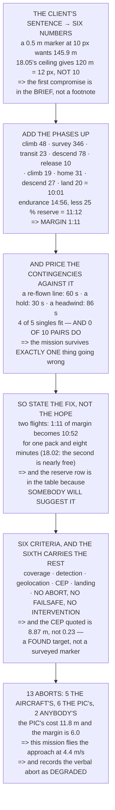

# 19.01 The brief: Hermon's full tasking

<!-- glance:start -->
<!-- generated by tools/build.py from curriculum/syllabus.yaml — edit the syllabus, not this block -->

| | |
|---|---|
| **Track** | Main path |
| **Difficulty** | Advanced |
| **Time** | 1 h 30 min |
| **Hardware** | First flight (Hermon core) (stage 1), Onboard computer & vision (stage 2), Payload & delivery pod (stage 4), Precision landing & final (stage 5) |
| **Software** | none |
| **Prerequisites** | [17.06 Building Hermon's delivery pod (practical)](../17-payloads-delivery/17.06-building-hermons-pod.md)<br>[18.06 Maintenance, currency, and your own qualification](../18-civil-ops/18.06-maintenance-and-qualification.md)<br>[15.06 Deployment, and the first computer-piloted flight](../15-onboard-autonomy/15.06-deployment-and-first-autonomous-flight.md) |
| **Skip if** | You have a written mission brief with numeric success criteria and an abort matrix signed off by yourself as PIC. |

<!-- glance:end -->

## What you will learn

- That the whole capstone mission is **10:01 against 11:12 of usable endurance** — 1:11 of margin
- **The finding**: four of five single contingencies fit, and **none of the ten pairs does**. The
  mission survives exactly one thing going slightly wrong
- That the fix is stated in the brief, not hoped for: **two flights**, which turns 1:11 of margin
  into 10:52 for one pack and eight minutes
- That the reserve is the one lever you do not pull, and it is in the table because somebody will
  suggest it
- Six numeric success criteria, and that **the sixth makes the other five mean anything**
- That the delivery criterion is **8.87 m, not 0.23** — a found target, not a surveyed marker
- An abort matrix where **5 of 13 conditions are the aircraft's** and 6 need a human who costs
  11.8 m
- And an evidence plan whose most important row is **the test card, written before the flight**

## Why it matters

Nothing in this lesson is new. Every constant in it was frozen by an earlier module, and the whole
job is addition — which is exactly why it is the capstone's first lesson. A mission brief is where
you find out whether the thing you have spent eighteen modules building can do the thing somebody
just described, and the answer arrives as arithmetic rather than as confidence.

For this mission the answer is **yes, with seventy-one seconds to spare**, which is a very different
statement from "yes". Seventy-one seconds does not survive a re-flown survey line and a thirty-second
hold in the same flight, and discovering that in the air is how a capstone becomes an incident.

The brief's real function is therefore to state the fix rather than the hope. And the fix here —
split it into two flights — is the kind of decision that is trivial to make on the ground and
impossible to make at eight minutes into a ten-minute flight.

> [!CAUTION]
> This is the first flight where every subsystem in the course runs at once: an autonomous mission,
> a companion computer commanding it, a detector deciding something, a payload releasing, and a
> precision landing. Do not fly it as one piece the first time. 16.01's ladder and 15.06's
> seven-flight progression both exist for this moment, and 19.02–19.04 break it into phases for the
> same reason.

## Prerequisites

<!-- prereqs:start -->
## Prerequisites

You need these first:

- [17.06 Building Hermon's delivery pod (practical)](../17-payloads-delivery/17.06-building-hermons-pod.md)
- [18.06 Maintenance, currency, and your own qualification](../18-civil-ops/18.06-maintenance-and-qualification.md)
- [15.06 Deployment, and the first computer-piloted flight](../15-onboard-autonomy/15.06-deployment-and-first-autonomous-flight.md)

### Optional prerequisite links

None.

Check your readiness: `python course.py why 19.01`
<!-- prereqs:end -->

## Concept

A mission brief has four parts, and three of them are easy. The tasking converts a sentence into
numbers. The success criteria state what "done" means, measurably. The evidence plan says which file
will prove which criterion.

The fourth part is the one this lesson is really about: **the feasibility closure.** Add the phases
up, compare with the endurance, and look at what is left. That number — the margin — is not a
comfort figure; it is the budget every contingency has to be paid for out of, and pricing the
contingencies against it is what tells you whether the mission as briefed is a plan or a wish.

The second idea is that the brief must contain its own limitations. 16.05 said a statement with no
limitations listed is one nobody read carefully, and this mission has two that the course itself
uncovered: a verbal abort that does not fit inside 12.03's fence margin, and a barrier that still
has no evidence behind it.

And the third is about which number you quote. 17.05 found that a drop on a surveyed marker and a
drop on a detected target differ by a factor of thirty-eight. The brief quotes the one that describes
the mission.

## Technical explanation

### Level 1 — the tasking, in the client's words and then in numbers

> *"Fly the field, find the marker, drop the pod on it, and come back and land on the pad."*

18.03's five questions turn that into six numbers, and every one already exists:

| | | from |
|---|---|---|
| what must be seen | a 0.5 m marker at 10 px | 18.01: GSD 5.00 cm → 145.9 m |
| **but the ceiling says** | **120 m** | 18.05: so **12 px, not 10** |
| the area | 300 × 200 m | 18.01: 55 images, 1,730 m of path |
| the payload | 250 g | 17.01: endurance floor 14.93 min |
| the delivery accuracy | **CEP 8.87 m** | 17.05: on a **found** target |
| the landing accuracy | 0.30 m | 12.05 |

**The second row is already a compromise.** The client asked for a marker they could see clearly and
18.05's ceiling gives twelve pixels instead of ten. That goes in the brief rather than in a footnote,
because 14.04's detector is about to be asked to work at that size and 18.01 said the base rate is
unforgiving.

### Level 2 — the flight profile, and whether it fits

| phase | seconds | running |
|---|---|---|
| arm, take off, climb to 120 m | 48.0 | 0:48 |
| fly the survey (1,730 m at 5 m/s) | 346.0 | 6:34 |
| transit to the target | 22.5 | 6:56 |
| descend 120 → 3 m | 78.0 | 8:14 |
| stabilise, confirm, **release** | 10.0 | 8:24 |
| climb to 50 m for the return | 18.8 | 8:43 |
| transit home (250 m at 8 m/s) | 31.2 | 9:15 |
| descend to the precision phase | 26.7 | 9:41 |
| precision landing, 10 m | 20.0 | 10:01 |
| **total** | **601.2** | **10:01** |

| | |
|---|---|
| mission time | 10:01 |
| endurance after module 17 | 14:56 |
| less 11.05's 25 % reserve | **11:12** |
| **margin** | **1:11** |

It fits, with seventy-one seconds to spare — which is a completely different statement from "it
fits". So price what a contingency costs:

| contingency | costs | margin left |
|---|---|---|
| one re-flown survey line | 60.0 s | 10.6 s |
| a second pass over the target | 45.0 s | 25.6 s |
| one 30 s hold for a walker (18.03) | 30.0 s | 40.6 s |
| a missed release, climb and re-approach | 59.0 s | 11.6 s |
| **headwind: the survey at 4 m/s not 5** | **86.5 s** | **−15.9 s** |

One of the five breaks the flight on its own. **The real result is the next line:**

```
single contingencies that fit   4 of 5
PAIRS of contingencies that fit 0 of 10
```

**No two of them fit together.** A re-flown line leaves eleven seconds and a thirty-second hold needs
thirty, so **the mission survives exactly one thing going slightly wrong.**

That is the most important sentence in the brief, and it is the reason the brief exists. The mission
is not infeasible; it is feasible **with no room** — a different thing to plan for and an easy thing
to discover in the air.

### Level 3 — so the brief states the fix, not the hope

| fix | new margin | cost |
|---|---|---|
| **split into two flights** (survey, then deliver) | **10:52** | a pack and 8 min of turnaround |
| shrink the site to 250 × 200 m | 2:08 | the client loses 17 % of the area |
| survey at 6 m/s instead of 5 | 2:08 | 14.01: more motion blur; 18.03's abort becomes 13.6 m |
| ~~drop 11.05's reserve to 20 %~~ | 1:55 | **no. That is the reserve** |

**The first row is the answer and the last row is the trap.** Two flights turns 1:11 of margin into
10:52 for one pack and eight minutes, and 18.02 already showed that the second flight at the same
site is nearly free — the drive, the setup and the processing do not repeat.

The reserve row is in the table because somebody will suggest it. It is the only fix that buys margin
by **removing a barrier** rather than by changing the mission, and 16.05's arithmetic says exactly
what that is worth.

**Decision for this brief: two flights.** Flight 1 surveys and geolocates; flight 2 delivers and
lands. It also makes phases 2 and 3 separately testable, which 16.01 would have insisted on anyway.

### Level 4 — success criteria: six numbers

| criterion | the number | what proves it |
|---|---|---|
| the survey covers the polygon | 100 % of the area, 0 gaps | the orthomosaic |
| the target is detected | conf ≥ 0.50, on ≥ 2 frames | 14.04's log + the images |
| the target is geolocated | within 8.9 m of its surveyed position | 14.05's output vs a tape |
| the pod is released | within **8.9 m CEP** of the target | 17.06's block G, measured |
| the aircraft returns and lands | within 0.30 m of the pad | 12.05's log + a tape |
| **no abort, no failsafe, no intervention** | **0 of each** | 16.03's log, five checks |

**The sixth row is what makes the other five mean anything.** A mission that met five criteria after
you took over is a mission *you* flew, and 19.05's campaign is about what the **aircraft** can do ten
times running.

And notice that row four quotes **8.87 m and not 0.23**. The 0.23 is the surveyed-marker number, and
this mission drops on a target the aircraft found for itself. 17.05 said those two differ by
thirty-eight times, and that quoting the wrong one is the trap. **The brief quotes the mission
number.**

### Level 5 — the abort matrix

| condition | action | who calls it | from |
|---|---|---|---|
| anyone says "ABORT" | LAND, here, now | **anyone** | 18.03 |
| a person inside the fence | LAND | spotter | 16.05 |
| battery LOW | RTL | the aircraft | 12.04 |
| battery CRITICAL | LAND | the aircraft | 12.04 |
| EKF failsafe | LAND (RTL is off the menu) | the aircraft | 12.04 |
| RC or link loss > 3 s | RTL | the aircraft | 12.04 |
| the companion stops | hold, then RTL at 3 s | the aircraft | 15.05 |
| no detection after the survey | RTL, do not deliver | PIC | 19.03 |
| detection confidence < 0.50 | RTL with the pod | PIC | 14.04 |
| release fails | RTL **with the pod**, land, inspect | PIC | 17.02 |
| release fires early | LAND immediately, mark the spot | PIC | 17.04 |
| wind > 8 m/s at altitude | RTL | PIC | 11.04 |
| **margin below 60 s** | abandon the phase, RTL | PIC | Level 2 |

**5 of the 13 are the aircraft's, 6 are the PIC's, and 2 are anybody's.** The ratio is the point:
most of the matrix is already built — 12.04's failsafe tree and 15.05's watchdog do it without asking
— and the PIC rows are the ones that need a human decision, which 18.03 measured at 11.8 m of travel.

And 18.03's uncomfortable result goes in the brief explicitly:

```
a crew abort needs  11.8 m
12.03's margin is    6.0 m
THIS MISSION'S CHOICE: fly the delivery approach at 4.4 m/s — 18.03's
option 2 — and state the verbal abort as a DEGRADED backup in the risk
register rather than as a barrier.
```

### Level 6 — the evidence plan, and the page that gets signed

| artefact | proves | how |
|---|---|---|
| the `.bin` log | criteria 1, 5, 6 | 16.03's five checks |
| the orthomosaic | criterion 1 | coverage, and the GSD |
| 14.04's detection log | criteria 2, 3 | conf, frames, position |
| a tape measure and a photo | criteria 3, 4, 5 | the ground truth |
| **the 16.01 test card** | **all six** | **the prediction, written first** |
| 18.03's go/no-go sheet | the flight was legal | signed |

**The fifth row is what makes this a test rather than a demonstration.** 16.01: a test card is a
prediction written *before* the flight, and without one you cannot be surprised — which means you
cannot learn anything.

And the statement at the end, which is 16.05's airworthiness page with this mission's numbers in it:

| | |
|---|---|
| this aircraft | Hermon, serial, config, firmware, parameter file |
| has passed | 04.06's preflight and 16.04's suite, today |
| is limited to | 120 m ceiling, 8 m/s wind, this site, this crew |
| **with these limitations** | the verbal abort is **degraded** (Level 5) |
| | 13.05's fallback still has **no evidence** (16.05) |
| and this margin | 1:11 on a 10:01 mission, so **two flights** |
| signed | by the person who will fly it |

**The two limitation rows are the honest part**, and both are things this course *found* rather than
assumed. 16.05 said a statement with no limitations listed is one nobody read carefully; these two
are what a careful reader finds.

> [!TIP]
> **Ask your teacher:** "What is your margin, in seconds?" Almost every mission plan has one and
> almost nobody has computed it. It takes ten minutes and it is the number that decides whether the
> plan is one flight or two.

## Diagram



## Code

The brief as arithmetic: the tasking converted into six numbers that already exist, a nine-phase
flight profile summed against 11.05's usable endurance, every contingency priced against the margin
singly and in pairs, the four ways to buy margin with the trap included, the six success criteria
with the artefact that proves each, the thirteen-row abort matrix split by who calls it, and the
airworthiness statement with its two honest limitations.

```python
"""19.01 -- the capstone brief: does the mission actually fit?

Pure stdlib. Nothing here is new. Every constant is a number an earlier
lesson froze, and the lesson's whole job is to add them up and see
whether the mission somebody just described is a mission this aircraft
can fly.

The answer is interesting.
"""

import math

BAR = "=" * 70

# ---- the aircraft, after module 17 --------------------------------------
ENDUR_MIN = 14.93         # 17.06, after the pod and the rangefinder
RESERVE_FRAC = 0.25       # 11.05
USABLE_MIN = ENDUR_MIN * (1 - RESERVE_FRAC)

# ---- the flight profile -------------------------------------------------
SURVEY_ALT_M = 120.0      # 18.05's ceiling, 18.01's 4.11 cm GSD
DROP_ALT_M = 3.0          # 17.05
CLIMB_MS = 2.5            # 12.02
DESCEND_MS = 1.5          # 12.05: coming down costs more
SURVEY_MS = 5.0
CRUISE_MS = 8.0           # 12.02's transit speed

SURVEY_PATH_M = 1730.0    # 18.01, 300 x 200 m at 120 m
SITE_HALF_M = 180.0       # worst-case transit within the site
HOME_M = 250.0            # 16.05's field: the launch point to the far corner

# ---- the numbers the mission must hit -----------------------------------
CEP_MISSION_M = 8.87      # 17.05, on a target 14.05 found
LAND_ACC_M = 0.30         # 12.05's precision landing
DETECT_CONF = 0.50        # 14.04's threshold
FENCE_MARGIN_M = 6.0      # 12.03
ABORT_TRAVEL_M = 11.8     # 18.03: the crew abort, with braking


def head(n, title):
    print()
    print(BAR)
    print("%d. %s" % (n, title))
    print(BAR)


def mmss(minutes):
    s = int(round(minutes * 60))
    return "%d:%02d" % (s // 60, s % 60)


# ========================================================================
head(1, "THE TASKING, IN THE CLIENT'S WORDS AND THEN IN NUMBERS")

print("  'Fly the field, find the marker, drop the pod on it, and come")
print("   back and land on the pad.'")
print()
print("  18.03's five questions turn that into six numbers, and every")
print("  one of them already exists:")
print()
SPEC = [
    ("what must be seen", "a 0.5 m marker at 10 px",
     "18.01: GSD 5.00 cm -> 145.9 m"),
    ("but the ceiling says", "%.0f m" % SURVEY_ALT_M,
     "18.05: so 12 px, not 10"),
    ("the area", "300 x 200 m", "18.01: 55 images, %.0f m of path"
     % SURVEY_PATH_M),
    ("the payload", "250 g", "17.01: endurance floor %.2f min" % ENDUR_MIN),
    ("the delivery accuracy", "CEP %.2f m" % CEP_MISSION_M,
     "17.05: on a FOUND target, not a marker"),
    ("the landing accuracy", "%.2f m" % LAND_ACC_M, "12.05"),
]
for what, value, where in SPEC:
    print("  %-24s %-22s %s" % (what, value, where))

print()
print("  NOTICE THAT THE SECOND ROW IS ALREADY A COMPROMISE. The client")
print("  asked for a marker they could see clearly and 18.05's ceiling")
print("  gives %.0f pixels instead of 10. THAT GOES IN THE BRIEF, not"
      % (0.5 / (1.542e-6 * SURVEY_ALT_M / 4.5e-3)))
print("  in a footnote, because 14.04's detector is about to be asked")
print("  to work at that size and 18.01 said the base rate is")
print("  unforgiving.")

# ========================================================================
head(2, "THE FLIGHT PROFILE, AND WHETHER IT FITS")

PROFILE = [
    ("arm, take off, climb to %.0f m" % SURVEY_ALT_M,
     SURVEY_ALT_M / CLIMB_MS, "12.02"),
    ("fly the survey (%.0f m at %.0f m/s)" % (SURVEY_PATH_M, SURVEY_MS),
     SURVEY_PATH_M / SURVEY_MS, "18.01"),
    ("transit to the target", SITE_HALF_M / CRUISE_MS, "worst case"),
    ("descend %.0f -> %.0f m" % (SURVEY_ALT_M, DROP_ALT_M),
     (SURVEY_ALT_M - DROP_ALT_M) / DESCEND_MS, "12.05"),
    ("stabilise, confirm, RELEASE", 10.0, "17.05's lead is 4.29 m"),
    ("climb to %.0f m for the return" % 50.0,
     (50.0 - DROP_ALT_M) / CLIMB_MS, "12.04's RTL_ALT"),
    ("transit home (%.0f m at %.0f m/s)" % (HOME_M, CRUISE_MS),
     HOME_M / CRUISE_MS, "16.05's field"),
    ("descend to the precision phase", (50.0 - 10.0) / DESCEND_MS, "12.05"),
    ("precision landing, %.0f m" % 10.0, 10.0 / 0.5, "12.05: slow, on purpose"),
]
print("  %-40s %10s %12s" % ("phase", "seconds", "running"))
t = 0.0
for what, secs, where in PROFILE:
    t += secs
    print("  %-40s %10.1f %12s" % (what, secs, mmss(t / 60.0)))
print("  %-40s %10.1f %12s" % ("TOTAL", t, mmss(t / 60.0)))

mission_min = t / 60.0
print()
print("  %-40s %12s" % ("mission time", mmss(mission_min)))
print("  %-40s %12s" % ("endurance after module 17", mmss(ENDUR_MIN)))
print("  %-40s %12s" % ("less 11.05's %.0f %% reserve" % (RESERVE_FRAC * 100),
                        mmss(USABLE_MIN)))
margin = USABLE_MIN - mission_min
print("  %-40s %12s" % ("MARGIN", mmss(margin)))
print()
print("  %s OF MARGIN ON A %s MISSION -- %.0f PER CENT."
      % (mmss(margin), mmss(mission_min), margin / USABLE_MIN * 100))
print()
print("  IT FITS. And 'it fits with %.0f seconds to spare' is a"
      % (margin * 60))
print("  completely different statement from 'it fits', so price what")
print("  a single contingency costs:")
print()
CONT = [
    ("one re-flown survey line", 300.0 / SURVEY_MS),
    ("a second pass over the target", 2 * SITE_HALF_M / CRUISE_MS),
    ("one 30 s hold for a walker (18.03)", 30.0),
    ("a missed release, climb and re-approach",
     (SURVEY_ALT_M - DROP_ALT_M) / DESCEND_MS / 2 + 20.0),
    ("headwind: the survey at %.0f m/s not %.0f" % (4.0, 5.0),
     SURVEY_PATH_M / 4.0 - SURVEY_PATH_M / 5.0),
]
print("  %-44s %10s %12s" % ("contingency", "costs (s)", "margin left"))
for what, secs in CONT:
    left = margin * 60 - secs
    flag = "" if left > 0 else "  <-- OVER"
    print("  %-44s %10.1f %10.1f s%s" % (what, secs, left, flag))

print()
over = [c for c in CONT if margin * 60 - c[1] <= 0]
pairs = [(a, b) for i, a in enumerate(CONT) for b in CONT[i + 1:]]
pairs_fit = [p_ for p_ in pairs if p_[0][1] + p_[1][1] <= margin * 60]
print("  ONE OF THE FIVE BREAKS THE FLIGHT ON ITS OWN. THE REAL RESULT")
print("  IS THE NEXT LINE:")
print()
print("    single contingencies that fit   %d of %d"
      % (len(CONT) - len(over), len(CONT)))
print("    PAIRS of contingencies that fit %d of %d"
      % (len(pairs_fit), len(pairs)))
print()
print("  NO TWO OF THEM FIT TOGETHER. A re-flown line leaves %.0f"
      % (margin * 60 - 300.0 / SURVEY_MS))
print("  seconds and a 30-second hold needs 30, so the mission")
print("  survives exactly ONE thing going slightly wrong.")
print()
print("  THAT IS THE MOST IMPORTANT SENTENCE IN THIS BRIEF, and it is")
print("  the reason the brief exists. The mission is not infeasible;")
print("  it is feasible WITH NO ROOM, which is a different thing to")
print("  plan for and an easy thing to discover in the air.")

# ========================================================================
head(3, "SO THE BRIEF STATES THE FIX, NOT THE HOPE")

print("  Four ways to buy margin, priced:")
print()
FIXES = [
    ("split into TWO flights (survey, then deliver)",
     USABLE_MIN * 2 - mission_min - 1.5, "a pack and 8 min of turnaround"),
    ("shrink the site to 250 x 200 m",
     margin + (SURVEY_PATH_M * (1 - 250.0 / 300.0)) / SURVEY_MS / 60.0,
     "the client loses 17 % of the area"),
    ("survey at 6 m/s instead of 5",
     margin + (SURVEY_PATH_M / 5.0 - SURVEY_PATH_M / 6.0) / 60.0,
     "14.01: more motion blur, and 18.03's abort is 13.6 m"),
    ("drop 11.05's reserve to 20 %",
     margin + ENDUR_MIN * 0.05, "NO. That is the reserve"),
]
print("  %-46s %12s %s" % ("fix", "margin", "cost"))
for what, new_margin, cost in FIXES:
    print("  %-46s %10s  %s" % (what, mmss(max(new_margin, 0)), cost))

print()
print("  THE FIRST ROW IS THE ANSWER AND THE LAST ROW IS THE TRAP.")
print("  Two flights turns %s of margin into %s, costs one pack and"
      % (mmss(margin), mmss(USABLE_MIN * 2 - mission_min - 1.5)))
print("  eight minutes, and 18.02 already showed that the second flight")
print("  at the same site is nearly free -- the drive, the setup and")
print("  the processing do not repeat.")
print()
print("  THE RESERVE ROW IS IN THE TABLE BECAUSE SOMEBODY WILL SUGGEST")
print("  IT. It is the only fix that buys margin by removing a barrier")
print("  rather than by changing the mission, and 16.05's arithmetic")
print("  says exactly what that is worth.")
print()
print("  DECISION FOR THIS BRIEF: TWO FLIGHTS. Flight 1 surveys and")
print("  geolocates; flight 2 delivers and lands. It also makes phase 2")
print("  and phase 3 separately testable, which 16.01 would have")
print("  insisted on anyway.")

# ========================================================================
head(4, "SUCCESS CRITERIA: SIX NUMBERS, MEASURED THE SAME WAY EVERY TIME")

CRITERIA = [
    ("the survey covers the polygon", "100 % of the area, 0 gaps",
     "the orthomosaic"),
    ("the target is detected", "conf >= %.2f, on >= 2 frames" % DETECT_CONF,
     "14.04's log + the images"),
    ("the target is geolocated", "within %.1f m of its surveyed position"
     % CEP_MISSION_M, "14.05's output vs a tape"),
    ("the pod is released", "within %.1f m CEP of the target" % CEP_MISSION_M,
     "17.06's block G, measured"),
    ("the aircraft returns and lands", "within %.2f m of the pad" % LAND_ACC_M,
     "12.05's log + a tape"),
    ("no abort, no failsafe, no intervention", "0 of each",
     "16.03's log, five checks"),
]
print("  %-38s %-30s" % ("criterion", "the number"))
for what, num, ev in CRITERIA:
    print("  %-38s %-30s" % (what, num))
print()
print("  %-38s %-30s" % ("criterion", "what PROVES it"))
for what, num, ev in CRITERIA:
    print("  %-38s %-30s" % (what, ev))

print()
print("  THE SIXTH ROW IS THE ONE THAT MAKES THE OTHER FIVE MEAN")
print("  SOMETHING. A mission that met five criteria after you took")
print("  over is a mission YOU flew, and 19.05's campaign is about")
print("  what the AIRCRAFT can do ten times running.")
print()
print("  AND NOTICE THAT ROW FOUR QUOTES %.2f m AND NOT 17.05's %.2f."
      % (CEP_MISSION_M, 0.23))
print("  0.23 m is the surveyed-marker number and this mission drops on")
print("  a target the aircraft found for itself. 17.05 said those two")
print("  differ by 38 times and that quoting the wrong one is the trap.")
print("  THE BRIEF QUOTES THE MISSION NUMBER.")

# ========================================================================
head(5, "THE ABORT MATRIX: CONDITION, ACTION, AND WHO")

ABORTS = [
    ("anyone says 'ABORT'", "LAND, here, now", "anyone", "18.03"),
    ("a person inside the fence", "LAND", "spotter", "16.05"),
    ("battery LOW", "RTL", "the aircraft", "12.04"),
    ("battery CRITICAL", "LAND", "the aircraft", "12.04"),
    ("EKF failsafe", "LAND (RTL is off the menu)", "the aircraft", "12.04"),
    ("RC or link loss > 3 s", "RTL", "the aircraft", "12.04"),
    ("the companion stops", "hold, then RTL at %.0f s" % 3.0,
     "the aircraft", "15.05"),
    ("no detection after the survey", "RTL, do not deliver", "PIC", "19.03"),
    ("detection confidence < %.2f" % DETECT_CONF, "RTL with the pod",
     "PIC", "14.04"),
    ("release fails", "RTL WITH THE POD, land, inspect", "PIC", "17.02"),
    ("release fires early", "LAND immediately, mark the spot", "PIC", "17.04"),
    ("wind > %.0f m/s at altitude" % 8.0, "RTL", "PIC", "11.04"),
    ("margin below %.0f s" % 60.0, "abandon the phase, RTL", "PIC", "section 2"),
]
print("  %-34s %-30s %-12s %8s"
      % ("condition", "action", "who calls it", "from"))
for cond, act, who, src in ABORTS:
    print("  %-34s %-30s %-12s %8s" % (cond, act, who, src))

n_ac = sum(1 for _, _, w, _ in ABORTS if w == "the aircraft")
n_pic = sum(1 for _, _, w, _ in ABORTS if w == "PIC")
print()
print("  %d OF THE %d ARE THE AIRCRAFT'S, %d ARE THE PIC's, AND %d ARE"
      % (n_ac, len(ABORTS), n_pic, len(ABORTS) - n_ac - n_pic))
print("  ANYBODY'S.")
print()
print("  THE RATIO IS THE POINT. Most of the matrix is already built --")
print("  12.04's failsafe tree and 15.05's watchdog do it without")
print("  asking -- and the PIC rows are the ones that need a HUMAN")
print("  DECISION, which 18.03 measured at %.1f m of travel."
      % ABORT_TRAVEL_M)
print()
print("  AND 18.03's UNCOMFORTABLE RESULT GOES IN THE BRIEF EXPLICITLY:")
print("    a crew abort needs  %.1f m" % ABORT_TRAVEL_M)
print("    12.03's margin is   %.1f m" % FENCE_MARGIN_M)
print("    THIS MISSION'S CHOICE: fly the delivery approach at 4.4 m/s,")
print("    which is 18.03's option 2, and state the verbal abort as a")
print("    DEGRADED backup in the risk register rather than a barrier.")

# ========================================================================
head(6, "THE EVIDENCE PLAN, AND THE ONE PAGE THAT GETS SIGNED")

print("  16.05 asked for a barrier with a date on it. Before flying,")
print("  write down WHICH FILE will prove WHICH criterion:")
print()
EVIDENCE = [
    ("the .bin log", "criteria 1, 5, 6", "16.03's five checks"),
    ("the orthomosaic", "criterion 1", "coverage, and the GSD"),
    ("14.04's detection log", "criteria 2, 3", "conf, frames, position"),
    ("a tape measure and a photo", "criteria 3, 4, 5", "the ground truth"),
    ("the 16.01 test card", "all six", "the PREDICTION, written first"),
    ("18.03's go/no-go sheet", "the flight was legal", "signed"),
]
print("  %-30s %-20s %-26s" % ("artefact", "proves", "how"))
for a, p, h in EVIDENCE:
    print("  %-30s %-20s %-26s" % (a, p, h))

print()
print("  THE FIFTH ROW IS THE ONE THAT MAKES THIS A TEST RATHER THAN A")
print("  DEMONSTRATION. 16.01: a test card is a PREDICTION WRITTEN")
print("  BEFORE THE FLIGHT, and without one you cannot be surprised --")
print("  which means you cannot learn anything.")
print()
print("  AND THE STATEMENT AT THE END, WHICH IS 16.05's AIRWORTHINESS")
print("  PAGE WITH THIS MISSION'S NUMBERS IN IT:")
SIGN = [
    ("this aircraft", "Hermon, serial, config, firmware, param file"),
    ("has passed", "04.06's preflight and 16.04's suite, today"),
    ("is limited to", "%.0f m ceiling, %.0f m/s wind, this site, this crew"
     % (SURVEY_ALT_M, 8.0)),
    ("with these limitations", "the verbal abort is DEGRADED (section 5)"),
    ("", "13.05's fallback still has NO EVIDENCE (16.05)"),
    ("and this margin", "%s on a %s mission, so TWO FLIGHTS"
     % (mmss(margin), mmss(mission_min))),
    ("signed", "by the person who will fly it"),
]
for k, v in SIGN:
    print("    %-22s %s" % (k, v))

print()
print("  THE TWO LIMITATION ROWS ARE THE HONEST PART, AND THEY ARE BOTH")
print("  THINGS THIS COURSE FOUND RATHER THAN THINGS IT ASSUMED. 16.05")
print("  said a statement with no limitations listed is one nobody read")
print("  carefully; these two are the ones a careful reader finds.")
print()
print("  THE THREE SENTENCES THAT GO ON THE FRONT OF THE BRIEF:")
print("   1. The mission fits in %s of %s -- %s of margin -- and ONE"
      % (mmss(mission_min), mmss(USABLE_MIN), mmss(margin)))
print("      RE-FLOWN LINE COSTS MORE THAN THAT. So: two flights.")
print("   2. The delivery criterion is %.2f m, not %.2f. It is a found"
      % (CEP_MISSION_M, 0.23))
print("      target, not a surveyed marker.")
print("   3. %d of %d abort conditions are the aircraft's. The %d that"
      % (n_ac, len(ABORTS), n_pic))
print("      are yours cost %.1f m each, and the fence margin is %.1f."
      % (ABORT_TRAVEL_M, FENCE_MARGIN_M))
```

Output:

```text

======================================================================
1. THE TASKING, IN THE CLIENT'S WORDS AND THEN IN NUMBERS
======================================================================
  'Fly the field, find the marker, drop the pod on it, and come
   back and land on the pad.'

  18.03's five questions turn that into six numbers, and every
  one of them already exists:

  what must be seen        a 0.5 m marker at 10 px 18.01: GSD 5.00 cm -> 145.9 m
  but the ceiling says     120 m                  18.05: so 12 px, not 10
  the area                 300 x 200 m            18.01: 55 images, 1730 m of path
  the payload              250 g                  17.01: endurance floor 14.93 min
  the delivery accuracy    CEP 8.87 m             17.05: on a FOUND target, not a marker
  the landing accuracy     0.30 m                 12.05

  NOTICE THAT THE SECOND ROW IS ALREADY A COMPROMISE. The client
  asked for a marker they could see clearly and 18.05's ceiling
  gives 12 pixels instead of 10. THAT GOES IN THE BRIEF, not
  in a footnote, because 14.04's detector is about to be asked
  to work at that size and 18.01 said the base rate is
  unforgiving.

======================================================================
2. THE FLIGHT PROFILE, AND WHETHER IT FITS
======================================================================
  phase                                       seconds      running
  arm, take off, climb to 120 m                  48.0         0:48
  fly the survey (1730 m at 5 m/s)              346.0         6:34
  transit to the target                          22.5         6:56
  descend 120 -> 3 m                             78.0         8:14
  stabilise, confirm, RELEASE                    10.0         8:24
  climb to 50 m for the return                   18.8         8:43
  transit home (250 m at 8 m/s)                  31.2         9:15
  descend to the precision phase                 26.7         9:41
  precision landing, 10 m                        20.0        10:01
  TOTAL                                         601.2        10:01

  mission time                                    10:01
  endurance after module 17                       14:56
  less 11.05's 25 % reserve                       11:12
  MARGIN                                           1:11

  1:11 OF MARGIN ON A 10:01 MISSION -- 11 PER CENT.

  IT FITS. And 'it fits with 71 seconds to spare' is a
  completely different statement from 'it fits', so price what
  a single contingency costs:

  contingency                                   costs (s)  margin left
  one re-flown survey line                           60.0       10.6 s
  a second pass over the target                      45.0       25.6 s
  one 30 s hold for a walker (18.03)                 30.0       40.6 s
  a missed release, climb and re-approach            59.0       11.6 s
  headwind: the survey at 4 m/s not 5                86.5      -15.9 s  <-- OVER

  ONE OF THE FIVE BREAKS THE FLIGHT ON ITS OWN. THE REAL RESULT
  IS THE NEXT LINE:

    single contingencies that fit   4 of 5
    PAIRS of contingencies that fit 0 of 10

  NO TWO OF THEM FIT TOGETHER. A re-flown line leaves 11
  seconds and a 30-second hold needs 30, so the mission
  survives exactly ONE thing going slightly wrong.

  THAT IS THE MOST IMPORTANT SENTENCE IN THIS BRIEF, and it is
  the reason the brief exists. The mission is not infeasible;
  it is feasible WITH NO ROOM, which is a different thing to
  plan for and an easy thing to discover in the air.

======================================================================
3. SO THE BRIEF STATES THE FIX, NOT THE HOPE
======================================================================
  Four ways to buy margin, priced:

  fix                                                  margin cost
  split into TWO flights (survey, then deliver)       10:52  a pack and 8 min of turnaround
  shrink the site to 250 x 200 m                       2:08  the client loses 17 % of the area
  survey at 6 m/s instead of 5                         2:08  14.01: more motion blur, and 18.03's abort is 13.6 m
  drop 11.05's reserve to 20 %                         1:55  NO. That is the reserve

  THE FIRST ROW IS THE ANSWER AND THE LAST ROW IS THE TRAP.
  Two flights turns 1:11 of margin into 10:52, costs one pack and
  eight minutes, and 18.02 already showed that the second flight
  at the same site is nearly free -- the drive, the setup and
  the processing do not repeat.

  THE RESERVE ROW IS IN THE TABLE BECAUSE SOMEBODY WILL SUGGEST
  IT. It is the only fix that buys margin by removing a barrier
  rather than by changing the mission, and 16.05's arithmetic
  says exactly what that is worth.

  DECISION FOR THIS BRIEF: TWO FLIGHTS. Flight 1 surveys and
  geolocates; flight 2 delivers and lands. It also makes phase 2
  and phase 3 separately testable, which 16.01 would have
  insisted on anyway.

======================================================================
4. SUCCESS CRITERIA: SIX NUMBERS, MEASURED THE SAME WAY EVERY TIME
======================================================================
  criterion                              the number                    
  the survey covers the polygon          100 % of the area, 0 gaps     
  the target is detected                 conf >= 0.50, on >= 2 frames  
  the target is geolocated               within 8.9 m of its surveyed position
  the pod is released                    within 8.9 m CEP of the target
  the aircraft returns and lands         within 0.30 m of the pad      
  no abort, no failsafe, no intervention 0 of each                     

  criterion                              what PROVES it                
  the survey covers the polygon          the orthomosaic               
  the target is detected                 14.04's log + the images      
  the target is geolocated               14.05's output vs a tape      
  the pod is released                    17.06's block G, measured     
  the aircraft returns and lands         12.05's log + a tape          
  no abort, no failsafe, no intervention 16.03's log, five checks      

  THE SIXTH ROW IS THE ONE THAT MAKES THE OTHER FIVE MEAN
  SOMETHING. A mission that met five criteria after you took
  over is a mission YOU flew, and 19.05's campaign is about
  what the AIRCRAFT can do ten times running.

  AND NOTICE THAT ROW FOUR QUOTES 8.87 m AND NOT 17.05's 0.23.
  0.23 m is the surveyed-marker number and this mission drops on
  a target the aircraft found for itself. 17.05 said those two
  differ by 38 times and that quoting the wrong one is the trap.
  THE BRIEF QUOTES THE MISSION NUMBER.

======================================================================
5. THE ABORT MATRIX: CONDITION, ACTION, AND WHO
======================================================================
  condition                          action                         who calls it     from
  anyone says 'ABORT'                LAND, here, now                anyone          18.03
  a person inside the fence          LAND                           spotter         16.05
  battery LOW                        RTL                            the aircraft    12.04
  battery CRITICAL                   LAND                           the aircraft    12.04
  EKF failsafe                       LAND (RTL is off the menu)     the aircraft    12.04
  RC or link loss > 3 s              RTL                            the aircraft    12.04
  the companion stops                hold, then RTL at 3 s          the aircraft    15.05
  no detection after the survey      RTL, do not deliver            PIC             19.03
  detection confidence < 0.50        RTL with the pod               PIC             14.04
  release fails                      RTL WITH THE POD, land, inspect PIC             17.02
  release fires early                LAND immediately, mark the spot PIC             17.04
  wind > 8 m/s at altitude           RTL                            PIC             11.04
  margin below 60 s                  abandon the phase, RTL         PIC          section 2

  5 OF THE 13 ARE THE AIRCRAFT'S, 6 ARE THE PIC's, AND 2 ARE
  ANYBODY'S.

  THE RATIO IS THE POINT. Most of the matrix is already built --
  12.04's failsafe tree and 15.05's watchdog do it without
  asking -- and the PIC rows are the ones that need a HUMAN
  DECISION, which 18.03 measured at 11.8 m of travel.

  AND 18.03's UNCOMFORTABLE RESULT GOES IN THE BRIEF EXPLICITLY:
    a crew abort needs  11.8 m
    12.03's margin is   6.0 m
    THIS MISSION'S CHOICE: fly the delivery approach at 4.4 m/s,
    which is 18.03's option 2, and state the verbal abort as a
    DEGRADED backup in the risk register rather than a barrier.

======================================================================
6. THE EVIDENCE PLAN, AND THE ONE PAGE THAT GETS SIGNED
======================================================================
  16.05 asked for a barrier with a date on it. Before flying,
  write down WHICH FILE will prove WHICH criterion:

  artefact                       proves               how                       
  the .bin log                   criteria 1, 5, 6     16.03's five checks       
  the orthomosaic                criterion 1          coverage, and the GSD     
  14.04's detection log          criteria 2, 3        conf, frames, position    
  a tape measure and a photo     criteria 3, 4, 5     the ground truth          
  the 16.01 test card            all six              the PREDICTION, written first
  18.03's go/no-go sheet         the flight was legal signed                    

  THE FIFTH ROW IS THE ONE THAT MAKES THIS A TEST RATHER THAN A
  DEMONSTRATION. 16.01: a test card is a PREDICTION WRITTEN
  BEFORE THE FLIGHT, and without one you cannot be surprised --
  which means you cannot learn anything.

  AND THE STATEMENT AT THE END, WHICH IS 16.05's AIRWORTHINESS
  PAGE WITH THIS MISSION'S NUMBERS IN IT:
    this aircraft          Hermon, serial, config, firmware, param file
    has passed             04.06's preflight and 16.04's suite, today
    is limited to          120 m ceiling, 8 m/s wind, this site, this crew
    with these limitations the verbal abort is DEGRADED (section 5)
                           13.05's fallback still has NO EVIDENCE (16.05)
    and this margin        1:11 on a 10:01 mission, so TWO FLIGHTS
    signed                 by the person who will fly it

  THE TWO LIMITATION ROWS ARE THE HONEST PART, AND THEY ARE BOTH
  THINGS THIS COURSE FOUND RATHER THAN THINGS IT ASSUMED. 16.05
  said a statement with no limitations listed is one nobody read
  carefully; these two are the ones a careful reader finds.

  THE THREE SENTENCES THAT GO ON THE FRONT OF THE BRIEF:
   1. The mission fits in 10:01 of 11:12 -- 1:11 of margin -- and ONE
      RE-FLOWN LINE COSTS MORE THAN THAT. So: two flights.
   2. The delivery criterion is 8.87 m, not 0.23. It is a found
      target, not a surveyed marker.
   3. 5 of 13 abort conditions are the aircraft's. The 6 that
      are yours cost 11.8 m each, and the fence margin is 6.0.
```

## Exercise

### Exercise 19.01-E1 — Compute your own margin `[analysis]`

Build Level 2's table for your own aircraft, site and profile. Subtract from your own usable
endurance. Write the margin in seconds on the front of the brief.

### Exercise 19.01-E2 — Price your contingencies `[analysis]`

List the five things most likely to add time to your mission, cost each in seconds, and check the
pairs. If no pair fits, the mission is two flights.

### Exercise 19.01-E3 — Write the abort matrix `[analysis]`

Build the thirteen rows for your own mission and mark each as aircraft, PIC or anyone. Count them.
Then check that every PIC row has a *measurable* trigger rather than a judgement.

### Exercise 19.01-E4 — The evidence plan, before flying `[build]`

For each of your success criteria, name the file that will prove it and write the 16.01 test card
with your predictions in it. Seal it. Open it after the flight.

## Expected result

**19.01-E1**: expect the margin to be between 5 % and 20 % of the usable endurance and to be smaller
than you guessed. The descent phases are usually the surprise — 12.05 said coming down costs more.

**19.01-E2**: expect at least one single contingency to break the flight and expect no pairs to fit.
If pairs do fit, your mission is comfortably single-flight and you should say so.

**19.01-E3**: expect roughly a third of the rows to be the aircraft's. If more than half are the
PIC's, most of 12.04's failsafe tree is not configured.

**19.01-E4**: expect at least one prediction to be wrong, and expect that to be the most useful part
of the flight. A card with no surprises on it was a card that predicted nothing.

## Troubleshooting

**The margin is negative.** The mission is two flights, or the site is smaller, or the GSD is
coarser. All three are decisions; flying it anyway is not.

**The margin looks generous.** Check the descents. 12.05's rates are slower than the climb rates for
a reason, and a 120 m descent at 1.5 m/s is 78 seconds that people routinely forget.

**A PIC abort row has no number.** Then it is a judgement and it will not be made under pressure.
Give it a threshold, as 18.03's go/no-go does.

**Two abort rows conflict.** Order them by severity, as 12.04's failsafe tree does, and put the
ordering in the brief.

**The client will not accept two flights.** Show them Level 2's table. The conversation is much
easier with a margin in seconds than with an opinion about endurance.

**You cannot name the file that proves a criterion.** Then the criterion is not measurable yet.
Change the criterion or add the instrument.

**The test card's predictions were all right.** Suspicious. Either the predictions were vague or they
were written afterwards.

## Common mistakes

- **Briefing a mission without adding the phases up.** The margin is the whole point.
- **Forgetting the descents.** 12.05: coming down is slower than going up.
- **Pricing contingencies singly.** No pair fits, which is the real constraint.
- **Buying margin from the reserve.** It is the only fix that removes a barrier.
- **Quoting the surveyed-marker CEP.** 38× optimistic for a found target.
- **Leaving out the "no intervention" criterion.** Without it you are demonstrating, not testing.
- **Writing PIC aborts as judgements.** Under pressure they become nothing.
- **Omitting the known limitations.** 16.05: a statement with none was not read carefully.
- **Writing the test card after the flight.** Then it is a record, not a prediction.

## Knowledge check

<details>
<summary>Does the mission fit, and what does the answer actually mean?</summary>

Yes — 10:01 against 11:12 of usable endurance, a margin of **1:11**. But "it fits with seventy-one
seconds to spare" is a different statement from "it fits": a re-flown survey line costs 60 s, a hold
costs 30, and a headwind costs 86. Four of five singles fit and **none of the ten pairs does**.
</details>

<details>
<summary>What does "no two contingencies fit" mean for the plan?</summary>

That the mission survives **exactly one** thing going slightly wrong. That is not a reason to refuse
it; it is a reason to state the fix in the brief. Splitting into two flights takes the margin from
1:11 to 10:52 for one pack and eight minutes — and 18.02 showed the second flight at the same site is
nearly free.
</details>

<details>
<summary>Why is "drop the reserve to 20 %" in the table of fixes?</summary>

Because somebody will suggest it, and it is worth naming as the trap it is. Every other fix buys
margin by **changing the mission**; that one buys it by **removing a barrier**, and 16.05's
arithmetic already says what removing a barrier is worth. Putting it in the table and crossing it out
is more useful than leaving it unsaid.
</details>

<details>
<summary>Which success criterion makes the others mean something?</summary>

The sixth: **no abort, no failsafe, no intervention — zero of each.** A mission that met the other
five after you took over is a mission you flew, and the capstone's claim is about what the aircraft
does on its own, ten times running.
</details>

<details>
<summary>Why does the brief quote 8.87 m rather than 0.23 m?</summary>

Because 17.05 found those two numbers describe different conditions and differ by **38×**: 0.23 m is
a drop on a marker you placed with a tape, and 8.87 m is a drop on a target the aircraft located for
itself. This mission does the second, so the brief quotes the second — and 17.05 said explicitly that
quoting the other one is the trap.
</details>

<details>
<summary>How is the abort matrix divided, and why does that matter?</summary>

Five of thirteen are the aircraft's, six are the PIC's and two are anybody's. Most of it is already
built by 12.04's failsafe tree and 15.05's watchdog, which act without asking. The PIC rows are the
ones needing a human decision — and 18.03 measured that at **11.8 m of travel** against a 6.0 m fence
margin, which is why this mission flies the delivery approach at 4.4 m/s.
</details>

<details>
<summary>What two limitations does the airworthiness statement carry?</summary>

That the **verbal abort is a degraded backup rather than a barrier**, because 18.03 showed even a
one-word call breaches 12.03's margin; and that **13.05's flow-and-inertial fallback still has no
evidence**, which 16.05 identified and nothing since has closed. Both are things the course found
rather than assumed, and 16.05 said a statement listing no limitations is one nobody read carefully.
</details>

<details>
<summary>Which evidence-plan row makes this a test rather than a demonstration?</summary>

The 16.01 test card, because it is a **prediction written before the flight**. Every other artefact
records what happened; only the card creates the possibility of being surprised, and without that
possibility the flight teaches nothing regardless of how well it goes.
</details>

## Practical challenge

Write the brief, and make every line of it a number somebody could check.

1. Convert the tasking into the six numbers, and name the one that is already a compromise.
2. Build the flight profile and compute the margin in seconds (E1).
3. Price five contingencies singly and in pairs (E2). If no pair fits, say "two flights" in the
   brief.
4. Write the six success criteria with the artefact that proves each.
5. Build the abort matrix and check every PIC row has a threshold (E3).
6. Write the evidence plan and the sealed test card (E4).
7. Write the airworthiness statement, **including the two limitations**.
8. Sign it, as the person who will fly it.

Step 7 is the one that takes courage and the one that makes the document worth anything. Everything
above it is arithmetic; that row is judgement, stated in public, before the flight.

## You can skip this if

You have a written mission brief with numeric success criteria and an abort matrix signed off by
yourself as PIC. "Numeric" includes the margin, in seconds.

## Go deeper

- The FAA's and ICAO's material on operational flight planning and fuel/energy reserves — the manned
  aviation version of Level 2's margin arithmetic:
  <https://www.faa.gov/regulations_policies/handbooks_manuals/aviation>
- JARUS SORA's concept-of-operations template, which is the formal structure Level 1 and Level 6
  informally follow: <http://jarus-rpas.org/publications/>
- ArduPilot's mission planning documentation, for turning Level 2's profile into an actual uploaded
  mission: <https://ardupilot.org/planner/docs/common-mission-planning.html>

## Progress checkpoint

You can now turn a client's sentence into a mission brief whose feasibility is proved rather than
assumed, compute a margin and price contingencies against it singly and in pairs, choose between the
fixes with the trap named, state success criteria that include the one about not intervening, build
an abort matrix divided by who calls it, and sign an airworthiness statement that lists what is
wrong with the plan.

Next, 19.02 takes the brief to a field: the case opens, the crew take their positions, and the
aircraft goes from closed box to airborne mission in under fifteen minutes without a check being
skipped.
