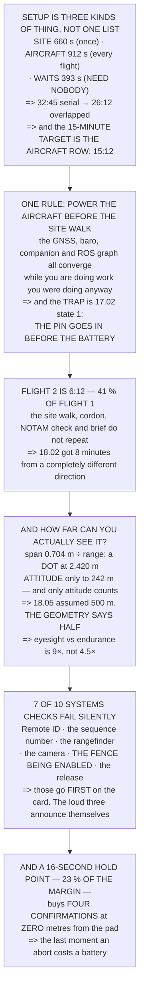

# 19.02 Phase 1: pre-flight, site setup and launch

<!-- glance:start -->
<!-- generated by tools/build.py from curriculum/syllabus.yaml — edit the syllabus, not this block -->

| | |
|---|---|
| **Track** | Main path |
| **Difficulty** | Advanced |
| **Time** | 2 h |
| **Hardware** | First flight (Hermon core) (stage 1), Onboard computer & vision (stage 2), Payload & delivery pod (stage 4), Precision landing & final (stage 5) |
| **Software** | ardupilot, qgc |
| **Prerequisites** | [19.01 The brief: Hermon's full tasking](19.01-the-brief.md) |
| **Skip if** | You can bring Hermon from a closed case to an airborne, mission-executing aircraft in under 15 minutes without skipping a check. |

<!-- glance:end -->

## What you will learn

- That setup is **two problems, not one**: 11:00 of site work done once, and **15:12 of aircraft
  work every flight**
- That 393 seconds of it are **waits that need nobody**, and cost nothing if they start early
- That flight 2 at the same site is **6:12 — 41 % of flight 1** — which is 18.02's marginal-job
  finding arriving from a completely different direction
- The rule that produces all of it: **power the aircraft before the site walk** — and the trap that
  makes the safety pin go in *before* the battery
- **The finding**: the geometry gives **242 m of usable VLOS**, half what 18.05 assumed, so the
  eyesight-to-endurance factor is **9× rather than 4.5×**
- That you can see the aircraft as a dot at 2,420 m and tell which way it is pointing at 242 —
  and only the second one counts
- That **7 of 10 systems checks fail silently**, and those go first on the card
- And that a **16-second hold point** buys the last moment at which an abort costs a battery

## Why it matters

This is the lesson where eighteen modules of preparation meet a field, a case and a clock. The
syllabus asks for fifteen minutes from a closed case to an airborne mission with no check skipped,
and the naive sum of everything that has to happen is thirty-three — which looks impossible until
you separate the three different kinds of thing that are in the list.

That separation is the lesson's first result and it is genuinely useful: most of what feels like
setup is either **site** work that happens once, or a **wait** that needs no person at all. The
aircraft work — the part the fifteen-minute target is actually about — is the only part that repeats
per flight, and arranging the other two around it is a scheduling problem with a clean answer.

The second result is an unwelcome one. 18.05 assumed five hundred metres of visual line of sight
because that is the conventional figure. Working it out from the aircraft's span and human visual
acuity gives less than half that — which makes the delivery arithmetic in 18.05 optimistic by a
factor of two, and is exactly the kind of thing a capstone should find.

> [!WARNING]
> Phase 1 ends with the aircraft hovering and the release **live**. The safety pin comes out after
> the brief and before arming, and from that moment the pod can leave. Confirm the drop zone and the
> crew positions before the pin, announce its removal out loud, and treat the hold point as the last
> cheap abort — because after it the aircraft is climbing away and 18.03's arithmetic applies.

## Prerequisites

<!-- prereqs:start -->
## Prerequisites

You need these first:

- [19.01 The brief: Hermon's full tasking](19.01-the-brief.md)

### Optional prerequisite links

None.

Check your readiness: `python course.py why 19.02`
<!-- prereqs:end -->

## Concept

A setup checklist read top to bottom is the slowest possible way to set up, because a checklist is a
list of things that must *happen* and not a list of things that must happen **in order**. Some of
them are dependencies, some are independent, and several are not work at all — they are convergence:
a GNSS solution settling, a barometer stabilising, a companion computer booting.

So the setup is a critical path. Start every wait as early as its dependency allows, do the work
alongside it, and the waits disappear into time you were spending anyway. That single reordering is
worth about six and a half minutes, and the rule that produces it — power the aircraft first — has
exactly one trap, which 17.02 already identified.

The second idea is about seeing. Two regulatory and operational requirements assume somebody can see
the aircraft, and "see" turns out to have two very different ranges: the range at which you can tell
it is *there*, and the range at which you can tell which way it is *pointing*. They differ by a
factor of ten, and only the second one is any use.

And the third is the hold point: a deliberate pause after takeoff and before the mission commits,
which costs a small fraction of the margin and buys back the only cheap abort in the flight.

## Technical explanation

### Level 1 — setup is a scheduling problem, and two problems at that

| kind | seconds | of total |
|---|---|---|
| **site** (once per site) | 660 | 34 % |
| **aircraft** (every flight) | 912 | 46 % |
| **waits** (need nobody at all) | 393 | 20 % |
| serially, one at a time | **1,965** | |

**32:45 serially, and the target is fifteen minutes.** That looks impossible until you notice that
the target is about the *aircraft*, not about the site.

The waits first: 393 seconds of GNSS converging, barometer settling, companion booting and 15.02's
graph coming up — and **not one of them needs a person**. They cost nothing if they start early,
because the aircraft work that follows power-on is 822 seconds and the longest wait chain is only
210.

```
serial                                     1,965 s
waits absorbed into the aircraft work        −393 s
OVERLAPPED                                  1,572 s  = 26:12
```

And now split what is left, because 19.01 decided on two flights and the site work does not repeat:

| | |
|---|---|
| site setup, **once** | 11:00 |
| **aircraft: case to airborne, flight 1** | **15:12** |
| aircraft: flight 2, same site | **6:12** |

**The fifteen-minute target is the second row** — 15:12 from a closed case to an airborne mission,
with no check skipped. The site row is real work and it is not what the target was about.

And the third row is 18.02's marginal-job finding arriving again: flight 2 is **41 % of flight 1**,
because the site walk, the cordon, the NOTAM check and the full brief do not repeat. 18.02 estimated
the turnaround at eight minutes from a completely different direction.

**The one rule that produces all of it: power the aircraft first, before the site walk.** Everything
that converges, converges while you are walking the site.

**The trap in that rule is 17.02's state 1.** An aircraft powered and unattended is an aircraft whose
release output is doing whatever `SERVO9_TRIM` says — so the safety pin goes in **before** the
battery, every time, and that is why it is the cheapest barrier in 17.06's table.

### Level 2 — the sequence, in the order that actually works

| t+ | action | why |
|---|---|---|
| 00:00 | **safety pin in, then the battery** | 17.02 state 1 |
| 00:30 | aircraft on the ground sheet, powered | starts every wait |
| 00:30 | GCS on, plan open | parallel |
| 01:00 | site walk, 16.05's 8 items | while the EKF converges |
| 05:00 | cordon, crew positions, sun behind the PIC | Level 3 |
| 08:00 | compass and level check | the EKF is ready by now |
| 10:00 | 04.06's preflight card, 21 items | the long pole |
| 15:00 | load the pod, **pin still in** | 17.02 |
| 16:30 | upload the mission, verify on the map | 12.06 |
| 17:00 | 18.04's NOTAM check, last time | the one that counts |
| 19:00 | 18.03's go/no-go, read by the **spotter** | not the pilot |
| 21:00 | crew brief, the abort word, positions | 18.03 |
| 23:30 | **remove the pin, announce it** | the point of no return |
| 24:00 | arm, take off to the **hold point** | Level 5 |

The two rows that are not obvious are the first and the thirteenth, and they are the same row seen
twice. The pin goes in before power and comes out after the brief, so **the entire setup happens
with the release mechanically safed** — not parameter-safed, which 17.02 showed is a barrier on the
same processor as the fault.

And "announce it" is not ceremony. Removing the pin is the moment the aircraft becomes capable of
dropping something, and **the last moment at which anybody can object cheaply**.

### Level 3 — crew positions: how far can you actually see it?

`angular size = span / range`, and Hermon's span is 0.704 m:

| range | slant | angular size | what you see |
|---|---|---|---|
| 50 m out | 130 m | 18.6′ | shape, not attitude |
| 100 m out | 156 m | 15.5′ | shape, not attitude |
| 250 m out | 277 m | 8.7′ | **a dot** |
| 500 m out | 514 m | 4.7′ | a dot |
| 1,000 m out | 1,007 m | 2.4′ | a dot |
| 2,000 m out | 2,004 m | 1.2′ | nothing reliable |

Two ranges matter and they differ by ten times:

```
you can DETECT it as a dot out to          2,420 m
you can tell WHICH WAY IT IS POINTING to     242 m
```

**And the second is the one that matters**, because 18.05's rule is about seeing and *avoiding*,
which needs attitude rather than a dot.

Which makes 18.05's delivery arithmetic optimistic. It assumed 500 m of VLOS as a convention; the
geometry says 242 — **half of it**:

| | |
|---|---|
| 18.05 assumed | 500 m |
| **the geometry gives** | **242 m** |
| 17.06's endurance would allow | 2,240 m |
| so eyesight is tighter by | **9.3×** |

18.05 said the delivery business is bounded by eyesight and estimated the factor at 4.5. **The
derivation makes it nine.** That is the right direction for a course to be wrong in — the convention
was generous and the geometry is not — and it is worth re-checking against *your* eyesight, *your*
aircraft's span and *your* sky, because all three vary and none of them is a regulation.

So the positions fall out of geometry:

| who | where | why |
|---|---|---|
| **PIC** | sun **behind** them, aircraft against sky not ground | contrast is the whole game at 11.2′ |
| spotter | facing the open sky sector, 90° from the PIC | 12.02: a job, not an audience |
| GCS | screen shaded, back to the sun | readable beats close |
| everyone | upwind of the launch point | 16.05: and **not under it** |

**The sun row is the one that gets skipped and the one that costs an aircraft.** At 180 m the
aircraft subtends 11.2 arcminutes; against a bright sky with the sun behind *it*, that is not a dot,
it is nothing at all — and 11.03's orientation problem becomes unsolvable in the one moment you need
it solved.

### Level 4 — the systems check, ordered by what fails silently

| check | from | fails | how you know |
|---|---|---|---|
| Remote ID is **broadcasting** | 18.04 | **silent** | a receiver app |
| the companion is publishing | 15.05 | **silent** | a **sequence number**, not a heartbeat |
| the rangefinder reads the ground | 17.05 | **silent** | vs a tape, at a known height |
| the camera is actually recording | 14.01 | **silent** | one frame, looked at |
| the fence is loaded **and enabled** | 12.03 | **silent** | the GCS shows the polygon |
| the failsafes are configured | 12.04 | **silent** | 16.04's injections, quarterly |
| the release: pin in, output held | 17.02 | **silent** | the servo position, read back |
| GPS fix type and HDOP | 13.02 | loud | the GCS says so |
| battery voltage and 11.05's numbers | 11.05 | loud | the GCS says so |
| motors respond | 04.06 | loud | props **off**, obviously |

**Seven of ten fail silently** — nothing turns red, nothing beeps, and the aircraft arms and flies.
Those go first on the card, because the three loud ones will announce themselves whether you check
them or not.

And the second column is worth reading on its own: **every silent check came from a lesson that
found it the hard way.** 15.05 built a sequence number because a heartbeat detects exactly one
failure; 12.03's fence is loaded but not *enabled* more often than anybody admits; and 17.02's
output at boot is whatever the parameter file says.

### Level 5 — launch, and the hold point that costs sixteen seconds

Do not launch into the mission. Launch to a **hold point**: climb to 15 m, stop, and let everybody
look at it.

| | seconds |
|---|---|
| climb to the hold point | 6.0 |
| hold, and the four confirmations | 10.0 |
| **total cost** | **16.0** |
| 19.01's margin | 71.0 |
| **of the margin** | **23 %** |

Four confirmations, all cheap here and expensive anywhere else:

- **it is hovering, not drifting** — 13.02's fix is real, not a number
- the attitude looks right — 07.05: no oscillation, no lean
- the telemetry agrees with your eyes — 15.03: the frames are the right way round
- the crew are where the brief said — 16.05

**Sixteen seconds of the seventy-one-second margin buys the last moment at which an abort costs a
battery.** After the hold point the aircraft is climbing to 120 m and heading away, and 18.03's
arithmetic applies: a verbal abort is 11.8 m of travel and 12.03's margin is 6.0. **At the hold point
it is zero metres from the pad and stationary.**

That is why it is worth 23 % of the margin — and why 19.01's decision to split the mission makes it
affordable: flight 2's margin is 10:52, not seventy-one seconds.

**The phase-1 exit criterion, in one line:** hovering at 15 m, all four confirmations, crew in
position, and the PIC says "continue". Anything else and the answer is **land**, at a cost of one
battery and eight minutes — which 18.02 priced at about ₪150 of a ₪3,790 day.

> [!TIP]
> **Ask your teacher:** "When do you connect the battery?" If the answer is anywhere other than
> "first, after the pin", the setup is serial and about six minutes longer than it needs to be — and
> every convergence wait is being paid for with a person standing still.

## Diagram



## Code

Phase 1 as arithmetic: the seventeen setup tasks split into site, aircraft and wait, the critical
path that absorbs the waits and the per-flight number that falls out, the ordered sequence with the
pin at both ends, the angular-size table that produces two very different VLOS ranges, the systems
check sorted by whether it fails silently, and the hold point priced against 19.01's margin.

```python
"""19.02 -- phase 1: from a closed case to an airborne mission.

Pure stdlib. The brief is 19.01's, the crew are 16.05's, the checks are
04.06's and 18.04's.

Setting up is a SCHEDULING problem, not a checklist problem, and doing
it in the order on the checklist takes twice as long as it needs to.
"""

import math

BAR = "=" * 70

# ---- geometry -----------------------------------------------------------
SPAN_M = 0.704            # 17.03: motor to motor plus a prop
SURVEY_ALT_M = 120.0
SITE_HALF_M = 180.0
ARCMIN = math.pi / (180.0 * 60.0)

# ---- from 19.01 ---------------------------------------------------------
MARGIN_S = 71.0
MISSION_MIN = 10.02


def head(n, title):
    print()
    print(BAR)
    print("%d. %s" % (n, title))
    print(BAR)


def mmss(seconds):
    s = int(round(seconds))
    return "%d:%02d" % (s // 60, s % 60)


# ========================================================================
head(1, "SETTING UP IS A SCHEDULING PROBLEM, AND TWO PROBLEMS AT THAT")

# name, duration (s), kind: SITE (once per site), AIR (every flight),
# WAIT (converges by itself, needs nobody)
TASKS = [
    ("unload and lay out the ground sheet", 120, "SITE"),
    ("site walk: 16.05's 8 items", 240, "SITE"),
    ("set the cordon and the crew positions", 180, "SITE"),
    ("18.04: NOTAMs and TFRs, last check", 120, "SITE"),
    ("power the GCS, open the plan", 90, "AIR"),
    ("power the aircraft", 30, "AIR"),
    ("compass and level check (04.06)", 120, "AIR"),
    ("04.06's preflight card, 21 items", 300, "AIR"),
    ("load the pod, fit the safety pin (17.02)", 90, "AIR"),
    ("upload the mission (12.06)", 12, "AIR"),
    ("18.03's go/no-go, read by the spotter", 120, "AIR"),
    ("crew brief + the abort word (18.03)", 150, "AIR"),
    ("GNSS: cold start to a 3D fix", 120, "WAIT"),
    ("EKF settles, HDOP below 13.02's limit", 90, "WAIT"),
    ("barometer settles", 60, "WAIT"),
    ("the companion boots (15.06, warm)", 78, "WAIT"),
    ("ROS 2 graph up, topics flowing (15.02)", 45, "WAIT"),
]

site = sum(t[1] for t in TASKS if t[2] == "SITE")
air = sum(t[1] for t in TASKS if t[2] == "AIR")
wait = sum(t[1] for t in TASKS if t[2] == "WAIT")
serial = site + air + wait

print("  Seventeen things happen between the case opening and the")
print("  aircraft arming, and they are three different KINDS of thing:")
print()
print("  %-44s %8s %8s" % ("", "seconds", "of total"))
for kind, total, what in (("SITE  (once per site)", site, ""),
                          ("AIRCRAFT (every flight)", air, ""),
                          ("WAITS (need nobody at all)", wait, "")):
    print("  %-44s %8.0f %7.0f %%" % (kind, total, total / serial * 100))
print("  %-44s %8.0f" % ("SERIALLY, ONE AT A TIME", serial))
print()
print("  %s SERIALLY, AND THE TARGET IS FIFTEEN MINUTES. That looks"
      % mmss(serial))
print("  impossible until you notice that the target is about the")
print("  AIRCRAFT, not about the site.")
print()
print("  THE WAITS FIRST. %.0f seconds of GNSS converging, barometer"
      % wait)
print("  settling, companion booting and 15.02's graph coming up --")
print("  and NOT ONE OF THEM NEEDS A PERSON. They cost nothing if they")
print("  start early, because the aircraft work that follows power-on")
print("  is %.0f seconds and the longest wait chain is only %.0f."
      % (air - 90, 120 + 90))
print()
print("  %-44s %8s" % ("", "seconds"))
print("  %-44s %8.0f" % ("serial", serial))
print("  %-44s %8.0f" % ("waits absorbed into the aircraft work", -wait))
print("  %-44s %8.0f  = %s" % ("OVERLAPPED", site + air, mmss(site + air)))
print()
print("  AND NOW SPLIT WHAT IS LEFT, because 19.01 decided on TWO")
print("  FLIGHTS and the site work does not happen twice:")
print()
print("  %-44s %10s" % ("", "seconds"))
print("  %-44s %10s" % ("site setup, ONCE", mmss(site)))
print("  %-44s %10s" % ("aircraft: case to airborne, FLIGHT 1",
                        mmss(air)))
# flight 2: no GCS setup, abbreviated preflight, re-brief not full brief
air2 = 30 + 12 + 120 + 90 + 60 + 60
print("  %-44s %10s" % ("aircraft: FLIGHT 2, same site", mmss(air2)))
print()
print("  THE FIFTEEN-MINUTE TARGET IS THE SECOND ROW: %s FROM A CLOSED"
      % mmss(air))
print("  CASE TO AN AIRBORNE MISSION, WITH NO CHECK SKIPPED. The site")
print("  row is real work and it is not what the target was about.")
print()
print("  AND THE THIRD ROW IS 18.02's MARGINAL-JOB FINDING ARRIVING")
print("  AGAIN: flight 2 is %s, %.0f %% of flight 1, because the site"
      % (mmss(air2), air2 / air * 100))
print("  walk, the cordon, the NOTAM check and the full brief do not")
print("  repeat. 18.02 estimated the turnaround at 8 minutes from a")
print("  completely different direction and got %s." % mmss(8 * 60))
print()
print("  THE ONE RULE THAT PRODUCES ALL OF IT: POWER THE AIRCRAFT")
print("  FIRST, BEFORE THE SITE WALK. Everything that converges,")
print("  converges while you are walking the site.")
print()
print("  THE TRAP IN THAT RULE IS 17.02's STATE 1. An aircraft powered")
print("  and unattended is an aircraft whose release output is doing")
print("  whatever SERVO9_TRIM says -- so the safety pin goes in BEFORE")
print("  the battery, every time, and that is why it is the cheapest")
print("  barrier in 17.06's table.")

# ========================================================================
head(2, "THE SEQUENCE, IN THE ORDER THAT ACTUALLY WORKS")

SEQ = [
    ("00:00", "safety pin in, THEN the battery", "17.02 state 1"),
    ("00:30", "aircraft on the ground sheet, powered", "starts every wait"),
    ("00:30", "GCS on, plan open", "parallel"),
    ("01:00", "site walk, 16.05's 8 items", "while the EKF converges"),
    ("05:00", "cordon, crew positions, sun behind the PIC", "section 3"),
    ("08:00", "compass and level check", "the EKF is ready by now"),
    ("10:00", "04.06's preflight card, 21 items", "the long pole"),
    ("15:00", "load the pod, pin STILL IN", "17.02"),
    ("16:30", "upload the mission, verify on the map", "12.06"),
    ("17:00", "18.04's NOTAM check, last time", "the one that counts"),
    ("19:00", "18.03's go/no-go, read by the SPOTTER", "not the pilot"),
    ("21:00", "crew brief, the abort word, positions", "18.03"),
    ("23:30", "REMOVE THE PIN, announce it", "the point of no return"),
    ("24:00", "arm, take off to the HOLD POINT", "section 5"),
]
print("  %-8s %-44s %s" % ("t+", "action", "why"))
for t, what, why in SEQ:
    print("  %-8s %-44s %s" % (t, what, why))

print()
print("  THE TWO ROWS THAT ARE NOT OBVIOUS ARE THE FIRST AND THE")
print("  THIRTEENTH, AND THEY ARE THE SAME ROW SEEN TWICE. The pin")
print("  goes in before power and comes out after the brief, so the")
print("  entire setup happens with the release MECHANICALLY SAFED --")
print("  not parameter-safed, which 17.02 showed is a barrier on the")
print("  same processor as the fault.")
print()
print("  AND 'ANNOUNCE IT' IS NOT CEREMONY. Removing the pin is the")
print("  moment the aircraft becomes capable of dropping something,")
print("  and it is the last moment at which anybody can object")
print("  cheaply.")

# ========================================================================
head(3, "CREW POSITIONS: HOW FAR CAN YOU ACTUALLY SEE IT?")

print("  18.05 requires visual line of sight and 18.02 put a spotter")
print("  on the payroll. Both assume somebody can SEE the aircraft, so")
print("  work out what that means:")
print()
print("      angular size = span / range")
print("      Hermon's span is %.3f m" % SPAN_M)
print()
print("  %-30s %12s %14s %14s"
      % ("range", "slant", "angular size", "what you see"))
for r in (50.0, 100.0, 250.0, 500.0, 1000.0, 2000.0):
    slant = math.hypot(r, SURVEY_ALT_M)
    theta = SPAN_M / slant / ARCMIN
    if theta > 30:
        what = "shape and attitude"
    elif theta > 10:
        what = "shape, not attitude"
    elif theta > 2:
        what = "A DOT"
    else:
        what = "nothing reliable"
    print("  %-30s %10.0f m %11.1f ' %14s"
          % ("%.0f m out" % r, slant, theta, what))

r_dot = SPAN_M / (1.0 * ARCMIN)
r_att = SPAN_M / (10.0 * ARCMIN)
print()
print("  TWO RANGES MATTER AND THEY DIFFER BY TEN TIMES:")
print("    you can DETECT it as a dot out to        %6.0f m" % r_dot)
print("    you can tell WHICH WAY IT IS POINTING to %6.0f m" % r_att)
print()
print("  AND THE SECOND IS THE ONE THAT MATTERS, because 18.05's rule")
print("  is about seeing and AVOIDING -- which needs attitude, not a")
print("  dot.")
print()
print("  WHICH MAKES 18.05's DELIVERY ARITHMETIC OPTIMISTIC. It")
print("  assumed %.0f m of VLOS as a convention; the geometry says"
      % 500.0)
print("  %.0f m, HALF of it." % r_att)
print()
print("  %-38s %10.0f m" % ("18.05 assumed", 500.0))
print("  %-38s %10.0f m" % ("the geometry gives", r_att))
print("  %-38s %10.0f m" % ("17.06's endurance would allow", 2240.0))
print("  %-38s %10.1f x" % ("so eyesight is tighter by", 2240.0 / r_att))
print()
print("  18.05 SAID THE DELIVERY BUSINESS IS BOUNDED BY EYESIGHT AND")
print("  ESTIMATED THE FACTOR AT 4.5. THE DERIVATION MAKES IT %.0f."
      % (2240.0 / r_att))
print("  Which is the right direction for a course to be wrong in --")
print("  the convention was generous and the geometry is not -- and it")
print("  is worth re-checking against YOUR eyesight, YOUR aircraft's")
print("  span and YOUR sky, because all three vary and none of them is")
print("  a regulation.")
print()
print("  SO THE POSITIONS FALL OUT OF GEOMETRY:")
POS = [
    ("PIC", "sun BEHIND them, aircraft against sky not ground",
     "contrast is the whole game at %.1f arcmin"
     % (SPAN_M / math.hypot(SITE_HALF_M, SURVEY_ALT_M) / ARCMIN)),
    ("spotter", "facing the OPEN sky sector, 90 deg from the PIC",
     "12.02: a job, not an audience"),
    ("GCS", "screen shaded, back to the sun", "readable beats close"),
    ("everyone", "upwind of the launch point", "16.05: and NOT under it"),
]
for who, where, why in POS:
    print("    %-10s %-46s" % (who, where))
    print("               -> %s" % why)
print()
print("  THE SUN ROW IS THE ONE THAT GETS SKIPPED AND IT IS THE ONE")
print("  THAT COSTS AN AIRCRAFT. At %.0f m the aircraft subtends %.1f"
      % (SITE_HALF_M, SPAN_M / math.hypot(SITE_HALF_M, SURVEY_ALT_M) / ARCMIN))
print("  arcminutes; against a bright sky with the sun behind IT,")
print("  that is not a dot, it is nothing at all -- and 11.03's")
print("  orientation problem becomes unsolvable in the one moment you")
print("  need it solved.")

# ========================================================================
head(4, "THE SYSTEMS CHECK, ORDERED BY WHAT FAILS SILENTLY")

CHECKS = [
    ("remote ID is BROADCASTING", "18.04", "silent", "a receiver app"),
    ("the companion is publishing (15.02)", "15.05", "silent",
     "a SEQUENCE number, not a heartbeat"),
    ("the rangefinder reads the ground", "17.05", "silent",
     "vs a tape, at a known height"),
    ("the camera is actually recording", "14.01", "silent",
     "one frame, looked at"),
    ("the fence is loaded and ENABLED", "12.03", "silent",
     "the GCS shows the polygon"),
    ("the failsafes are configured", "12.04", "silent",
     "16.04's injections, quarterly"),
    ("the release: pin in, output HELD", "17.02", "silent",
     "the servo position, read back"),
    ("GPS fix type and HDOP", "13.02", "loud", "the GCS says so"),
    ("battery voltage and 11.05's numbers", "11.05", "loud",
     "the GCS says so"),
    ("control surfaces / motors respond", "04.06", "loud",
     "props OFF, obviously"),
]
n_silent = sum(1 for c in CHECKS if c[2] == "silent")
print("  %-38s %8s %10s %-24s"
      % ("check", "from", "fails", "how you know"))
for what, src, kind, how in CHECKS:
    print("  %-38s %8s %10s %-24s" % (what, src, kind, how))

print()
print("  %d OF THE %d FAIL SILENTLY -- nothing on the GCS turns red,"
      % (n_silent, len(CHECKS)))
print("  nothing beeps, and the aircraft arms and flies. THOSE ARE THE")
print("  ONES THAT GO FIRST ON THE CARD, because the three loud ones")
print("  will announce themselves whether you check them or not.")
print()
print("  AND THE SECOND COLUMN IS WORTH READING ON ITS OWN: every")
print("  silent check came from a lesson that found it the hard way.")
print("  15.05 built a sequence number because a heartbeat detects")
print("  exactly one failure; 12.03's fence is loaded but not ENABLED")
print("  more often than anybody admits; and 17.02's output at boot is")
print("  whatever the parameter file says.")

# ========================================================================
head(5, "LAUNCH, AND THE HOLD POINT THAT COSTS TEN SECONDS")

HOLD_ALT_M = 15.0
HOLD_S = 10.0
print("  Do not launch into the mission. Launch to a HOLD POINT: climb")
print("  to %.0f m, stop, and let everybody look at it." % HOLD_ALT_M)
print()
print("  %-44s %10s" % ("", "seconds"))
print("  %-44s %10.1f" % ("climb to the hold point", HOLD_ALT_M / 2.5))
print("  %-44s %10.1f" % ("hold, and the four confirmations", HOLD_S))
print("  %-44s %10.1f" % ("TOTAL COST", HOLD_ALT_M / 2.5 + HOLD_S))
print("  %-44s %10.1f" % ("19.01's margin", MARGIN_S))
print("  %-44s %10.1f %%"
      % ("of the margin", (HOLD_ALT_M / 2.5 + HOLD_S) / MARGIN_S * 100))
print()
print("  FOUR CONFIRMATIONS, ALL OF WHICH ARE CHEAP HERE AND")
print("  EXPENSIVE ANYWHERE ELSE:")
CONF = [
    ("it is HOVERING, not drifting", "13.02's fix is real, not a number"),
    ("the attitude looks right", "07.05: no oscillation, no lean"),
    ("the telemetry agrees with your eyes",
     "15.03: the frames are the right way round"),
    ("the crew are where the brief said", "16.05"),
]
for what, why in CONF:
    print("    %-38s %s" % (what, why))
print()
print("  %.0f SECONDS OF THE %.0f-SECOND MARGIN -- %.0f PER CENT -- BUYS"
      % (HOLD_ALT_M / 2.5 + HOLD_S, MARGIN_S,
         (HOLD_ALT_M / 2.5 + HOLD_S) / MARGIN_S * 100))
print("  THE LAST MOMENT AT WHICH AN ABORT COSTS A BATTERY.")
print()
print("  After the hold point the aircraft is climbing to %.0f m and"
      % SURVEY_ALT_M)
print("  heading away, and 18.03's arithmetic applies: a verbal abort")
print("  is %.1f m of travel and 12.03's margin is %.1f. AT THE HOLD"
      % (11.8, 6.0))
print("  POINT IT IS %.0f METRES FROM THE PAD AND STATIONARY." % 0)
print()
print("  THAT IS WHY IT IS WORTH %.0f PER CENT OF THE MARGIN, and why"
      % ((HOLD_ALT_M / 2.5 + HOLD_S) / MARGIN_S * 100))
print("  19.01's decision to split the mission into two flights makes")
print("  it affordable: flight 2's margin is %s, not %.0f seconds."
      % ("10:52", MARGIN_S))
print()
print("  THE PHASE-1 EXIT CRITERION, WHICH IS ONE LINE:")
print("    HOVERING AT %.0f m, ALL FOUR CONFIRMATIONS, CREW IN"
      % HOLD_ALT_M)
print("    POSITION, AND THE PIC SAYS 'CONTINUE'.")
print("  Anything else and the answer is LAND, at a cost of one")
print("  battery and eight minutes -- which 18.02 priced at about")
print("  %.0f shekels of a %.0f-shekel day." % (150, 3790))
```

Output:

```text

======================================================================
1. SETTING UP IS A SCHEDULING PROBLEM, AND TWO PROBLEMS AT THAT
======================================================================
  Seventeen things happen between the case opening and the
  aircraft arming, and they are three different KINDS of thing:

                                                seconds of total
  SITE  (once per site)                             660      34 %
  AIRCRAFT (every flight)                           912      46 %
  WAITS (need nobody at all)                        393      20 %
  SERIALLY, ONE AT A TIME                          1965

  32:45 SERIALLY, AND THE TARGET IS FIFTEEN MINUTES. That looks
  impossible until you notice that the target is about the
  AIRCRAFT, not about the site.

  THE WAITS FIRST. 393 seconds of GNSS converging, barometer
  settling, companion booting and 15.02's graph coming up --
  and NOT ONE OF THEM NEEDS A PERSON. They cost nothing if they
  start early, because the aircraft work that follows power-on
  is 822 seconds and the longest wait chain is only 210.

                                                seconds
  serial                                           1965
  waits absorbed into the aircraft work            -393
  OVERLAPPED                                       1572  = 26:12

  AND NOW SPLIT WHAT IS LEFT, because 19.01 decided on TWO
  FLIGHTS and the site work does not happen twice:

                                                  seconds
  site setup, ONCE                                  11:00
  aircraft: case to airborne, FLIGHT 1              15:12
  aircraft: FLIGHT 2, same site                      6:12

  THE FIFTEEN-MINUTE TARGET IS THE SECOND ROW: 15:12 FROM A CLOSED
  CASE TO AN AIRBORNE MISSION, WITH NO CHECK SKIPPED. The site
  row is real work and it is not what the target was about.

  AND THE THIRD ROW IS 18.02's MARGINAL-JOB FINDING ARRIVING
  AGAIN: flight 2 is 6:12, 41 % of flight 1, because the site
  walk, the cordon, the NOTAM check and the full brief do not
  repeat. 18.02 estimated the turnaround at 8 minutes from a
  completely different direction and got 8:00.

  THE ONE RULE THAT PRODUCES ALL OF IT: POWER THE AIRCRAFT
  FIRST, BEFORE THE SITE WALK. Everything that converges,
  converges while you are walking the site.

  THE TRAP IN THAT RULE IS 17.02's STATE 1. An aircraft powered
  and unattended is an aircraft whose release output is doing
  whatever SERVO9_TRIM says -- so the safety pin goes in BEFORE
  the battery, every time, and that is why it is the cheapest
  barrier in 17.06's table.

======================================================================
2. THE SEQUENCE, IN THE ORDER THAT ACTUALLY WORKS
======================================================================
  t+       action                                       why
  00:00    safety pin in, THEN the battery              17.02 state 1
  00:30    aircraft on the ground sheet, powered        starts every wait
  00:30    GCS on, plan open                            parallel
  01:00    site walk, 16.05's 8 items                   while the EKF converges
  05:00    cordon, crew positions, sun behind the PIC   section 3
  08:00    compass and level check                      the EKF is ready by now
  10:00    04.06's preflight card, 21 items             the long pole
  15:00    load the pod, pin STILL IN                   17.02
  16:30    upload the mission, verify on the map        12.06
  17:00    18.04's NOTAM check, last time               the one that counts
  19:00    18.03's go/no-go, read by the SPOTTER        not the pilot
  21:00    crew brief, the abort word, positions        18.03
  23:30    REMOVE THE PIN, announce it                  the point of no return
  24:00    arm, take off to the HOLD POINT              section 5

  THE TWO ROWS THAT ARE NOT OBVIOUS ARE THE FIRST AND THE
  THIRTEENTH, AND THEY ARE THE SAME ROW SEEN TWICE. The pin
  goes in before power and comes out after the brief, so the
  entire setup happens with the release MECHANICALLY SAFED --
  not parameter-safed, which 17.02 showed is a barrier on the
  same processor as the fault.

  AND 'ANNOUNCE IT' IS NOT CEREMONY. Removing the pin is the
  moment the aircraft becomes capable of dropping something,
  and it is the last moment at which anybody can object
  cheaply.

======================================================================
3. CREW POSITIONS: HOW FAR CAN YOU ACTUALLY SEE IT?
======================================================================
  18.05 requires visual line of sight and 18.02 put a spotter
  on the payroll. Both assume somebody can SEE the aircraft, so
  work out what that means:

      angular size = span / range
      Hermon's span is 0.704 m

  range                                 slant   angular size   what you see
  50 m out                              130 m        18.6 ' shape, not attitude
  100 m out                             156 m        15.5 ' shape, not attitude
  250 m out                             277 m         8.7 '          A DOT
  500 m out                             514 m         4.7 '          A DOT
  1000 m out                           1007 m         2.4 '          A DOT
  2000 m out                           2004 m         1.2 ' nothing reliable

  TWO RANGES MATTER AND THEY DIFFER BY TEN TIMES:
    you can DETECT it as a dot out to          2420 m
    you can tell WHICH WAY IT IS POINTING to    242 m

  AND THE SECOND IS THE ONE THAT MATTERS, because 18.05's rule
  is about seeing and AVOIDING -- which needs attitude, not a
  dot.

  WHICH MAKES 18.05's DELIVERY ARITHMETIC OPTIMISTIC. It
  assumed 500 m of VLOS as a convention; the geometry says
  242 m, HALF of it.

  18.05 assumed                                 500 m
  the geometry gives                            242 m
  17.06's endurance would allow                2240 m
  so eyesight is tighter by                     9.3 x

  18.05 SAID THE DELIVERY BUSINESS IS BOUNDED BY EYESIGHT AND
  ESTIMATED THE FACTOR AT 4.5. THE DERIVATION MAKES IT 9.
  Which is the right direction for a course to be wrong in --
  the convention was generous and the geometry is not -- and it
  is worth re-checking against YOUR eyesight, YOUR aircraft's
  span and YOUR sky, because all three vary and none of them is
  a regulation.

  SO THE POSITIONS FALL OUT OF GEOMETRY:
    PIC        sun BEHIND them, aircraft against sky not ground
               -> contrast is the whole game at 11.2 arcmin
    spotter    facing the OPEN sky sector, 90 deg from the PIC
               -> 12.02: a job, not an audience
    GCS        screen shaded, back to the sun                
               -> readable beats close
    everyone   upwind of the launch point                    
               -> 16.05: and NOT under it

  THE SUN ROW IS THE ONE THAT GETS SKIPPED AND IT IS THE ONE
  THAT COSTS AN AIRCRAFT. At 180 m the aircraft subtends 11.2
  arcminutes; against a bright sky with the sun behind IT,
  that is not a dot, it is nothing at all -- and 11.03's
  orientation problem becomes unsolvable in the one moment you
  need it solved.

======================================================================
4. THE SYSTEMS CHECK, ORDERED BY WHAT FAILS SILENTLY
======================================================================
  check                                      from      fails how you know            
  remote ID is BROADCASTING                 18.04     silent a receiver app          
  the companion is publishing (15.02)       15.05     silent a SEQUENCE number, not a heartbeat
  the rangefinder reads the ground          17.05     silent vs a tape, at a known height
  the camera is actually recording          14.01     silent one frame, looked at    
  the fence is loaded and ENABLED           12.03     silent the GCS shows the polygon
  the failsafes are configured              12.04     silent 16.04's injections, quarterly
  the release: pin in, output HELD          17.02     silent the servo position, read back
  GPS fix type and HDOP                     13.02       loud the GCS says so         
  battery voltage and 11.05's numbers       11.05       loud the GCS says so         
  control surfaces / motors respond         04.06       loud props OFF, obviously    

  7 OF THE 10 FAIL SILENTLY -- nothing on the GCS turns red,
  nothing beeps, and the aircraft arms and flies. THOSE ARE THE
  ONES THAT GO FIRST ON THE CARD, because the three loud ones
  will announce themselves whether you check them or not.

  AND THE SECOND COLUMN IS WORTH READING ON ITS OWN: every
  silent check came from a lesson that found it the hard way.
  15.05 built a sequence number because a heartbeat detects
  exactly one failure; 12.03's fence is loaded but not ENABLED
  more often than anybody admits; and 17.02's output at boot is
  whatever the parameter file says.

======================================================================
5. LAUNCH, AND THE HOLD POINT THAT COSTS TEN SECONDS
======================================================================
  Do not launch into the mission. Launch to a HOLD POINT: climb
  to 15 m, stop, and let everybody look at it.

                                                  seconds
  climb to the hold point                             6.0
  hold, and the four confirmations                   10.0
  TOTAL COST                                         16.0
  19.01's margin                                     71.0
  of the margin                                      22.5 %

  FOUR CONFIRMATIONS, ALL OF WHICH ARE CHEAP HERE AND
  EXPENSIVE ANYWHERE ELSE:
    it is HOVERING, not drifting           13.02's fix is real, not a number
    the attitude looks right               07.05: no oscillation, no lean
    the telemetry agrees with your eyes    15.03: the frames are the right way round
    the crew are where the brief said      16.05

  16 SECONDS OF THE 71-SECOND MARGIN -- 23 PER CENT -- BUYS
  THE LAST MOMENT AT WHICH AN ABORT COSTS A BATTERY.

  After the hold point the aircraft is climbing to 120 m and
  heading away, and 18.03's arithmetic applies: a verbal abort
  is 11.8 m of travel and 12.03's margin is 6.0. AT THE HOLD
  POINT IT IS 0 METRES FROM THE PAD AND STATIONARY.

  THAT IS WHY IT IS WORTH 23 PER CENT OF THE MARGIN, and why
  19.01's decision to split the mission into two flights makes
  it affordable: flight 2's margin is 10:52, not 71 seconds.

  THE PHASE-1 EXIT CRITERION, WHICH IS ONE LINE:
    HOVERING AT 15 m, ALL FOUR CONFIRMATIONS, CREW IN
    POSITION, AND THE PIC SAYS 'CONTINUE'.
  Anything else and the answer is LAND, at a cost of one
  battery and eight minutes -- which 18.02 priced at about
  150 shekels of a 3790-shekel day.
```

## Exercise

### Exercise 19.02-E1 — Time your own setup `[build]`

Set up for a real flight with a stopwatch, recording every task and marking it site, aircraft or
wait. Compute all three totals. Then do it again with the aircraft powered first.

### Exercise 19.02-E2 — Measure your own VLOS `[flight]`

Have someone walk the aircraft out at a fixed altitude while you call out the moment you can no
longer tell which way it is pointing, then the moment you lose it entirely. Compare with Level 3's
242 m and 2,420 m.

### Exercise 19.02-E3 — Find your silent failures `[build]`

Go through your own preflight and mark each item silent or loud. Count them. Then check that the
silent ones are at the top.

### Exercise 19.02-E4 — Fly the hold point `[flight]`

Add a 15 m hold to your next mission and run the four confirmations out loud. Time it. Decide
whether it is worth its share of your margin.

## Expected result

**19.02-E1**: expect the serial total to be 25–35 minutes and the reordered one to be 6–8 minutes
shorter, entirely from the waits. Expect the preflight card to be the longest single item.

**19.02-E2**: expect your attitude range to be 150–350 m depending on light and background, and
expect it to shrink dramatically with the sun behind the aircraft. That variation is the point.

**19.02-E3**: expect 60–80 % of your checks to fail silently. If nearly all of yours are loud, you
are checking the things the GCS was going to tell you anyway.

**19.02-E4**: expect at least one hold to catch something — a drift, a lean, a frame disagreement —
within the first ten flights. That is the whole justification.

## Troubleshooting

**The EKF is still not ready when you want to arm.** It was powered too late. Level 1: the aircraft
goes on first, before the site walk.

**The setup is fast and the preflight is rushed.** Wrong trade. The preflight is the long pole
because it is the only item that catches Level 4's seven silent failures.

**You lose sight of the aircraft mid-survey.** Level 3. Check the sun angle first, then the distance
against your own measured attitude range, and then reduce the survey's far edge.

**The spotter and the PIC are looking the same way.** Then there is one observer, not two. Ninety
degrees apart, and the spotter watches the sky.

**The hold point feels like a waste of sixteen seconds.** It is 23 % of a seventy-one-second margin,
which is why 19.01 split the mission. On flight 2's 10:52 it is 2 %.

**The release fired during setup.** `SERVO9_TRIM`, and the pin was not in. Level 2's first row exists
for exactly this.

**Flight 2 takes as long as flight 1.** Then the site work is being repeated. Level 1's split is a
checklist change, not an attitude.

## Common mistakes

- **Reading the checklist top to bottom.** It is a critical path, not a list.
- **Powering the aircraft last.** Every convergence wait then costs a person standing still.
- **Connecting the battery before the pin.** 17.02's state 1.
- **Treating the site work as per-flight.** It is 41 % of the difference between flights.
- **Assuming 500 m of VLOS.** The geometry gives 242.
- **Judging VLOS by whether you can see a dot.** You need attitude, at a tenth of the range.
- **Putting the sun behind the aircraft.** It stops being a dot and becomes nothing.
- **Checking the loud items first.** They announce themselves.
- **Launching straight into the mission.** The hold point is the last cheap abort.
- **Removing the pin quietly.** It is the moment the aircraft becomes able to drop something.

## Knowledge check

<details>
<summary>Why does the fifteen-minute target look impossible, and why is it not?</summary>

Because the naive sum of everything is 32:45. But the seventeen tasks are three different kinds:
**site** work (660 s, once per site), **aircraft** work (912 s, every flight), and **waits** (393 s,
needing nobody). The target is about the aircraft row — **15:12 from a closed case to an airborne
mission** — and the site row is real work that is not what the target was about.
</details>

<details>
<summary>What does "power the aircraft first" buy, and what does it cost?</summary>

It buys 393 seconds: the GNSS fix, the EKF settling, the barometer, the companion boot and 15.02's
graph all converge while you walk the site. It costs nothing **provided** the safety pin is in first,
because 17.02's state 1 is an aircraft whose release output is doing whatever `SERVO9_TRIM` says
while nobody is standing next to it.
</details>

<details>
<summary>Why is flight 2 only 41 % of flight 1?</summary>

Because the site walk, the cordon, the NOTAM check and the full brief do not repeat — only the
aircraft work does, and that abbreviates too. 6:12 against 15:12. 18.02 reached the same conclusion
about whole *days* from a completely different direction: the marginal job is much cheaper than the
first because the fixed parts do not happen twice.
</details>

<details>
<summary>How far can you see the aircraft, and which number counts?</summary>

Two numbers, ten times apart: you can detect it as a **dot** to about 2,420 m and tell **which way it
is pointing** only to about 242 m. 18.05's rule is about seeing and *avoiding*, which needs attitude
— so 242 m is the operative figure, and the dot range is irrelevant.
</details>

<details>
<summary>What does that do to 18.05's delivery arithmetic?</summary>

It halves it. 18.05 assumed 500 m of VLOS as a convention; the geometry gives 242, so the ratio
between what the battery allows (2,240 m) and what eyesight allows is **9× rather than 4.5×**. The
conclusion is unchanged — a delivery business is bounded by eyesight — but the bound is twice as
tight as the convention suggested.
</details>

<details>
<summary>Why does the sun's position matter more than the distance?</summary>

Because at 180 m the aircraft subtends 11.2 arcminutes, which is detectable against a normal sky and
**nothing at all** against a bright one with the sun behind the aircraft. Contrast, not size, is what
fails first — and 11.03's orientation problem becomes unsolvable at exactly the moment you need it
solved.
</details>

<details>
<summary>Which checks go first on the preflight card?</summary>

The seven that fail **silently**: Remote ID broadcasting, the companion's sequence number, the
rangefinder, the camera actually recording, the fence being *enabled*, the failsafes, and the
release's held output. Nothing turns red for any of them and the aircraft arms and flies. The three
loud ones — GPS, battery, motors — announce themselves whether you check them or not.
</details>

<details>
<summary>What does the hold point buy, and what does it cost?</summary>

Sixteen seconds — 23 % of 19.01's seventy-one-second margin — for four confirmations made at **zero
metres from the pad and stationary**. After it the aircraft is climbing away and 18.03's arithmetic
applies: a verbal abort is 11.8 m against a 6.0 m fence margin. It is the last moment at which an
abort costs a battery rather than an aircraft.
</details>

## Practical challenge

Get from a closed case to a hovering, confirmed aircraft in fifteen minutes, twice.

1. Time your current setup and classify every task (E1).
2. Reorder it: pin, battery, aircraft down, GCS up, then the site walk.
3. Rewrite your preflight card with the silent items first (E3).
4. Measure your own attitude-range and dot-range on a real aircraft (E2).
5. Set the crew positions from the geometry, with the sun behind the PIC.
6. Add the hold point and the four confirmations to the mission (E4).
7. Fly it. Record the case-to-airborne time.
8. Do it again for flight 2 at the same site and record that time separately.

Step 8 is the one that proves Level 1. If your two numbers are similar, the site work is being
repeated and the split has not actually happened.

## You can skip this if

You can bring Hermon from a closed case to an airborne, mission-executing aircraft in under 15
minutes without skipping a check. "Without skipping" includes the seven silent ones.

## Go deeper

- ArduPilot's pre-arm and arming-check documentation, which is where the loud items in Level 4 come
  from and which explains what each refusal actually means:
  <https://ardupilot.org/copter/docs/common-prearm-safety-checks.html>
- The FAA's guidance on visual line of sight and the visual observer's role, for the regulatory half
  of Level 3: <https://www.faa.gov/uas/commercial_operators>
- Standard references on visual acuity and target detection — the one-arcminute resolution limit and
  the much larger angle needed to resolve orientation — are summarised in the FAA's own
  human-factors material: <https://www.faa.gov/data_research/research/med_humanfacs>

## Progress checkpoint

You can now treat a setup as a critical path rather than a list, put the aircraft's convergence waits
inside work you were doing anyway, keep the release mechanically safed for the whole setup, derive
your own usable VLOS range instead of inheriting a convention, order a preflight card by what fails
silently, and buy back the flight's only cheap abort for sixteen seconds.

Next, 19.03 lets go: the mission runs, the survey flies itself, and a detector on the aircraft has to
decide — with 14.04's base rate waiting — whether it has found the target.
