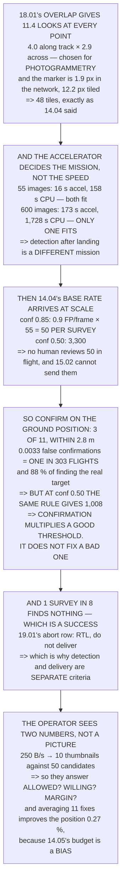

# 19.03 Phase 2: fly the survey, detect the target

<!-- glance:start -->
<!-- generated by tools/build.py from curriculum/syllabus.yaml — edit the syllabus, not this block -->

| | |
|---|---|
| **Track** | Main path |
| **Difficulty** | Advanced |
| **Time** | 2 h |
| **Hardware** | Onboard computer & vision (stage 2) |
| **Software** | ros2, python, yolo |
| **Prerequisites** | [19.02 Phase 1: pre-flight, site setup and launch](19.02-phase-1-preflight-and-launch.md) |
| **Skip if** | Hermon flies the survey autonomously and reports a geolocated target that you can verify on the ground. |

<!-- glance:end -->

## What you will learn

- That 18.01's overlap, chosen for photogrammetry, gives the detector **11.4 looks at every point**
  for nothing
- That the accelerator is not a performance upgrade — it **decides whether detection happens in
  flight or after landing**, which is a different mission
- That even at 14.04's *good* threshold there are **50 false positives per survey** for one real
  target, and at the tutorial default there are 3,300
- **The result**: requiring **3 detections within 2.8 m** gives **one false confirmation in 303
  flights** and finds the real target 88 % of the time
- That at conf 0.50 the same 3-of-11 rule still gives **1,008 false confirmations** — **confirmation
  does not fix a bad threshold, it multiplies a good one**
- That one survey in eight finds nothing, and that this is a **success**, not a failure
- That 15.02's downlink allows **ten thumbnails per survey against 50 candidates**, so the
  operator decides on two numbers rather than a picture
- And that averaging eleven detections improves the position by **0.27 %**, because 14.05's budget
  is a bias

## Why it matters

Phase 2 is where the aircraft stops being flown and starts deciding. The flying itself is solved —
12.06 uploads the mission, 12.02 planned it, and the survey executes without anyone touching
anything. What is not solved, and what this phase is actually about, is the question the aircraft
now has to answer on its own: **is that the target?**

14.04 measured the base-rate problem on one frame. A survey is fifty-five frames, and the same
detector that looked acceptable becomes a machine producing fifty candidates for one real object.
No human can review that in flight and 15.02's downlink cannot even send the pictures, so the
decision has to be made onboard and it has to be made well.

The good news is that everything needed to make it well already exists: 18.01's overlap gives
eleven independent looks, and 14.05's association gate says what "the same place" means. What falls
out is a confirmation rule with a measurable false-alarm rate — and a sharp lesson about the order
in which the two available levers must be pulled.

> [!WARNING]
> This is the first phase where the aircraft makes a decision that leads to a physical action. A
> false confirmation in phase 2 becomes a released payload in phase 3, at a coordinate nobody
> checked. Fly phase 2 **with the pod's safety pin in** until the confirmation logic has been proved
> over several flights, and treat every early detection as something to verify on the ground rather
> than something to act on.

## Prerequisites

<!-- prereqs:start -->
## Prerequisites

You need these first:

- [19.02 Phase 1: pre-flight, site setup and launch](19.02-phase-1-preflight-and-launch.md)

### Optional prerequisite links

None.

Check your readiness: `python course.py why 19.03`
<!-- prereqs:end -->

## Concept

A survey produces a great many looks at the same ground, because photogrammetry needs overlap. That
overlap was chosen for reconstruction and it happens to be exactly what a detector needs:
independent observations of the same object, which can be required to agree.

The second idea is the one 14.04 established and this lesson scales. A detector's false-positive
rate is per *inference*, and a tiled survey runs tens of thousands of inferences, so the number of
things that look like the target grows linearly with the survey while the number of real targets
stays at one. That ratio is what confirmation logic exists to fight.

And the third is about the order of the two levers. Raising the confidence threshold removes false
positives roughly linearly. Requiring N coincident detections removes them as a *power*. Both help,
they compound — and because one is linear and the other is a power, starting from a bad threshold
leaves you multiplying a large number by a small one and still getting a large number.

Finally, there is a constraint nobody plans for: the radio. 15.02 measured what is left of the
downlink after telemetry, and it is not enough to show a human the pictures. That single number
decides what the operator's job actually is.

## Technical explanation

### Level 1 — how many times does the target appear?

At 75 % forward and 65 % side overlap, every point on the ground appears in:

```
along track   1/(1−0.75) = 4.0 frames
across track  1/(1−0.65) = 2.9 frames
TOGETHER                  11.4 FRAMES
```

**Eleven chances at the same target**, and that number is the whole basis of Level 4. The overlap
was chosen in 18.01 for photogrammetry and it buys detection redundancy for nothing.

But first — can the detector see it at all?

| | |
|---|---|
| the marker is 0.5 m, GSD 4.11 cm at 120 m | |
| in the full frame | 12.2 px |
| **squeezed into a 640 px network input** | **1.9 px** |
| a detector needs about | 32 px |

**1.9 pixels.** 14.04 already solved this and the answer is tiling: 48 tiles at full resolution puts
the marker back at 12.2 px, which is detectable.

### Level 2 — does the inference fit in the flight?

| | per frame | for 55 frames | vs the survey |
|---|---|---|---|
| on 14.06's accelerator | 0.29 s | 15.8 s | 0.05× |
| on the CPU alone | 2.88 s | 158.4 s | 0.46× |

Both fit — which is not the answer anybody expects, and it is because this survey is small.
Fifty-five images is nothing. Run the same arithmetic on 18.01's other surveys:

| survey | images | accelerator | CPU |
|---|---|---|---|
| 120 m, 4.11 cm | 55 | 16 s | 158 s |
| 60 m, 2.06 cm | 168 | 48 s | 484 s |
| 30 m, 1.03 cm | 600 | 173 s | **1,728 s** |
| 15 m, 0.51 cm | 2,291 | 660 s | **6,598 s** |
| *the flight lasts* | | *346 s* | *346 s* |

**The CPU column crosses the flight time between 168 and 600 images and the accelerator column never
does.**

So the accelerator is not a performance upgrade — it decides whether detection happens **in flight**
or **after landing**, and detection after landing is a *different mission*, not a slower one: the
aircraft cannot deliver to a target it has not found yet.

### Level 3 — 14.04's base rate, at survey scale

| threshold | FP per frame | **FP per survey** | recall |
|---|---|---|---|
| conf 0.50 | 60.0 | **3,300** | 70 % |
| conf 0.85 | 0.9 | **50** | 40 % |

**Even at 14.04's good threshold there are fifty false positives in one survey, for one real
target.** At the tutorial default there are three thousand three hundred.

A human cannot review fifty candidates in flight and 15.02's downlink cannot send them (Level 5). So
**the aircraft has to decide.**

### Level 4 — confirmation: the same place, seen N times

A real target is in 11.4 frames. A false positive is a patch of noise in *one* frame, and 14.05
geolocates every detection — so the test is: **did N detections land in the same place on the
ground?**

"The same place" is 14.05's **2.8 m** association gate — the *noise* part of the budget, not the
7.03 m total, because a bias shifts every detection the same way and cancels in a difference.

| | |
|---|---|
| the gate's area | 24.63 m² |
| the site | 60,000 m² |
| P(two random FPs coincide) | 4.11e−4 |

| require | false confirms | P(find the real) | verdict |
|---|---|---|---|
| 1 of 11 | 50 | 0.996 | useless |
| 2 of 11 | 0.503 | 0.970 | useless |
| **3 of 11** | **0.0033** | **0.881** | **ok** |
| 4 of 11 | 1.59e−5 | 0.704 | misses it |

**Three of eleven is the answer**: 0.0033 false confirmations per survey — **one in 303 flights** —
and 88 % of finding the real target.

And the price is in that second number: **one survey in eight finds nothing at all.** That is not a
failure, it is 19.01's abort row — *no detection after the survey → RTL, do not deliver*. A mission
that returns with the pod because it was not sure is a mission that **worked**, and 19.05's campaign
has to count it as one. Which is why 19.01's success criteria list detection and delivery
*separately* rather than as one outcome.

Now run the same table at the tutorial threshold, which is the result that matters:

| require | at conf 0.50 | at conf 0.85 |
|---|---|---|
| 2 of 11 | 2.23e+03 | 0.503 |
| **3 of 11** | **1.01e+03** | **0.0033** |
| 4 of 11 | 341 | 1.59e−5 |

**At conf 0.50, requiring three still gives 1,008 false confirmations per survey.** The confirmation
logic did not rescue it.

> **Confirmation does not fix a bad threshold. It multiplies a good one.**

The threshold removes false positives roughly linearly and the confirmation removes them as a
*power*, so the two compound — and the order matters. Raise the threshold first, then confirm. 14.04
said exactly this about one frame, before anybody had fifty-five of them.

### Level 5 — what can the operator actually see? Almost nothing

15.02 measured the spare downlink at 250 bytes per second after 08.07's telemetry stream. One
8,000-byte thumbnail is **32 seconds**.

| | |
|---|---|
| the survey lasts | 346 s |
| thumbnails you could send | **10.8** |
| candidates at conf 0.85 | **50** |

**Ten pictures. There are fifty candidates** — and that is before anything else wants the link.

So the operator-in-the-loop is **not looking at images**. They are looking at two numbers — a
coordinate and a confidence — which is about 24 bytes and arrives instantly. That changes the role
completely. The operator is not verifying the detection; the aircraft verified it in Level 4. The
operator is answering a different question:

| | from |
|---|---|
| is that coordinate somewhere we are **allowed** to fly? | 18.04's grid, 12.03's fence |
| is it somewhere we are **willing** to drop? | 16.05: what is underneath |
| does the **margin** still allow it? | 19.01: 71 seconds |

**None of those three needs a picture, and all three need a human.** That is the correct division of
labour and it was *forced* by a bandwidth number from 15.02 rather than chosen.

### Level 6 — geolocating it, and why averaging buys nothing

Level 4 gives at least three detections of the same point. The obvious move is to average them.
14.05 says do not expect much:

| | |
|---|---|
| 14.05's total budget | 7.030 m |
| of which **bias** (99.7 %) | 7.009 m |
| of which noise | 0.545 m |

| detections | noise/√n | total | improvement |
|---|---|---|---|
| 1 | 0.5450 | 7.0300 m | 0.00 % |
| 3 | 0.3147 | 7.0160 m | 0.20 % |
| 5 | 0.2437 | 7.0132 m | 0.24 % |
| **11** | **0.1643** | **7.0109 m** | **0.27 %** |

**Eleven detections improve the position by 0.27 per cent.** Which is 14.05's lesson arriving where
it costs something: averaging attacks noise, the budget is 99.7 % bias, and eleven looks at the same
target produce essentially the same answer eleven times.

The detections are still worth having — Level 4 needs them for **confirmation** — but they are worth
nothing for **accuracy**, and an operator who believes otherwise will quote a CEP the aircraft cannot
hit.

**The phase-2 exit criterion:** ≥ 3 detections at conf ≥ 0.85, within 2.8 m of each other,
geolocated to a coordinate inside the fence and the grid, with 7.03 m of stated uncertainty, and the
PIC says "proceed to delivery". Anything else is 19.01's abort row: **RTL, with the pod.**

> [!TIP]
> **Ask your teacher:** "What is your detector's confidence threshold?" If the answer is 0.5, Level 4
> says the confirmation logic downstream of it is decorative. The threshold is the lever that has to
> move first, and it costs recall — which is a number worth measuring rather than guessing.

## Diagram



## Code

Phase 2's decision, quantified: the overlap turned into looks-per-point, the marker's pixel size
before and after tiling, the inference budget against flight time across 18.01's four surveys,
14.04's per-frame false positives multiplied by the survey, the N-of-11 confirmation rule with its
false-confirmation rate and recall at both thresholds, the downlink arithmetic that decides the
operator's role, and the averaging that 14.05's bias makes pointless.

```python
"""19.03 -- phase 2: fly the survey, and decide whether you found it.

Pure stdlib. The survey is 18.01's, the detector is 14.04's, the
geolocation is 14.05's, the link is 15.02's.

The flying part of this phase is solved. The DECIDING part is where the
capstone is actually hard, and 14.04's base rate is waiting at a scale
it has not been asked about yet.
"""

import math

BAR = "=" * 70

# ---- 18.01's survey -----------------------------------------------------
IMAGES = 55
SURVEY_S = 346.0
SITE_M2 = 300.0 * 200.0
OVERLAP_FWD = 0.75
OVERLAP_SIDE = 0.65

# ---- 14.04's detector ---------------------------------------------------
N_TILES = 48
TILE_MS_ACCEL = 6.0
TILE_MS_CPU = 60.0        # [E] a Pi-class CPU, same model
FP_PER_FRAME_050 = 60.0   # 14.04, conf 0.50
FP_PER_FRAME_085 = 0.9    # 14.04, conf 0.85
RECALL_050 = 21.0 / 30.0
RECALL_085 = 12.0 / 30.0

# ---- 14.05's geolocation ------------------------------------------------
GEO_TOTAL_M = 7.03
GEO_BIAS_FRAC = 0.997     # 14.05: 99.7 % of the budget is a BIAS
GATE_M = 2.8              # 14.05's association gate, the white part only

# ---- 15.02's downlink ---------------------------------------------------
DOWNLINK_BPS = 250.0
THUMB_BYTES = 8000.0


def head(n, title):
    print()
    print(BAR)
    print("%d. %s" % (n, title))
    print(BAR)


def binom_at_least(k, n, p):
    return sum(math.comb(n, i) * p ** i * (1 - p) ** (n - i)
               for i in range(k, n + 1))


# ========================================================================
head(1, "THE FLYING IS DONE. HOW MANY TIMES DOES THE TARGET APPEAR?")

frames_fwd = 1.0 / (1.0 - OVERLAP_FWD)
frames_side = 1.0 / (1.0 - OVERLAP_SIDE)
frames_seeing = frames_fwd * frames_side

print("  12.06 flies the survey and 18.01 says it is %d images in %.0f"
      % (IMAGES, SURVEY_S))
print("  seconds. The question phase 2 actually has to answer is not")
print("  'did it fly' but 'did it SEE the thing'.")
print()
print("  Overlap is what decides that. At %.0f %% forward and %.0f %%"
      % (OVERLAP_FWD * 100, OVERLAP_SIDE * 100))
print("  side, every point on the ground appears in:")
print()
print("    along track   1/(1-%.2f) = %.1f frames" % (OVERLAP_FWD, frames_fwd))
print("    across track  1/(1-%.2f) = %.1f frames" % (OVERLAP_SIDE, frames_side))
print("    TOGETHER                  %.1f FRAMES" % frames_seeing)
print()
print("  ELEVEN CHANCES AT THE SAME TARGET, and that number is the")
print("  whole basis of section 4's confirmation logic. The overlap")
print("  was chosen in 18.01 for PHOTOGRAMMETRY and it turns out to")
print("  buy detection redundancy for nothing.")
print()
print("  BUT FIRST: CAN THE DETECTOR SEE IT AT ALL?")
print()
PITCH_M, FOCAL_M = 1.542e-6, 4.5e-3
for alt, label in ((120.0, "18.05's ceiling"),):
    gsd = PITCH_M * alt / FOCAL_M
    px_full = 0.5 / gsd
    px_net = px_full / (4000.0 / 640.0)
    print("    the marker is %.1f m, GSD %.2f cm at %.0f m"
          % (0.5, gsd * 100, alt))
    print("    in the FULL frame                    %.1f px" % px_full)
    print("    squeezed into a 640 px network input %.1f px" % px_net)
    print("    a detector needs about               %.0f px" % 32)
print()
print("  %.1f PIXELS. 14.04 ALREADY SOLVED THIS AND THE ANSWER IS"
      % px_net)
print("  TILING: %d tiles at FULL resolution puts the marker back at" % N_TILES)
print("  %.1f px, which is detectable." % px_full)

# ========================================================================
head(2, "AND WHETHER THE INFERENCE FITS IN THE FLIGHT")

frame_accel_s = N_TILES * TILE_MS_ACCEL / 1000.0
frame_cpu_s = N_TILES * TILE_MS_CPU / 1000.0
print("  %d tiles per frame, %d frames:" % (N_TILES, IMAGES))
print()
print("  %-28s %12s %14s %12s"
      % ("", "per frame", "for %d frames" % IMAGES, "vs the survey"))
for label, per in (("on 14.06's accelerator", frame_accel_s),
                   ("on the CPU alone", frame_cpu_s)):
    tot = per * IMAGES
    print("  %-28s %10.2f s %12.1f s %11.2f x"
          % (label, per, tot, tot / SURVEY_S))

print()
print("  BOTH FIT, WHICH IS NOT THE ANSWER ANYBODY EXPECTS, AND IT IS")
print("  BECAUSE THIS SURVEY IS SMALL. %d images is nothing. Run the" % IMAGES)
print("  same arithmetic on 18.01's high-resolution survey:")
print()
print("  %-28s %10s %14s %14s"
      % ("survey", "images", "accelerator", "CPU"))
for label, n in (("120 m, 4.11 cm", 55), ("60 m, 2.06 cm", 168),
                 ("30 m, 1.03 cm", 600), ("15 m, 0.51 cm", 2291)):
    a = n * frame_accel_s
    c = n * frame_cpu_s
    print("  %-28s %10d %11.0f s %11.0f s" % (label, n, a, c))
print("  %-28s %10s %11.0f s %11.0f s"
      % ("the FLIGHT lasts", "", SURVEY_S, SURVEY_S))
print()
print("  THE CPU COLUMN CROSSES THE FLIGHT TIME BETWEEN %d AND %d"
      % (168, 600))
print("  IMAGES AND THE ACCELERATOR COLUMN NEVER DOES.")
print()
print("  SO THE ACCELERATOR IS NOT A PERFORMANCE UPGRADE, IT IS WHAT")
print("  DECIDES WHETHER DETECTION HAPPENS IN FLIGHT OR AFTER LANDING")
print("  -- and detection after landing is a different MISSION, not a")
print("  slower one: the aircraft cannot deliver to a target it has")
print("  not found yet.")

# ========================================================================
head(3, "NOW THE HARD PART: 14.04's BASE RATE, AT SURVEY SCALE")

print("  14.04 measured a detector on ONE frame at two thresholds.")
print("  Multiply by %d frames and look at what happens:" % IMAGES)
print()
print("  %-16s %14s %16s %16s"
      % ("threshold", "FP per frame", "FP PER SURVEY", "recall"))
for label, fp, rec in (("conf 0.50", FP_PER_FRAME_050, RECALL_050),
                       ("conf 0.85", FP_PER_FRAME_085, RECALL_085)):
    print("  %-16s %14.1f %16.0f %15.0f %%"
          % (label, fp, fp * IMAGES, rec * 100))

fp50, fp85 = FP_PER_FRAME_050 * IMAGES, FP_PER_FRAME_085 * IMAGES
print()
print("  EVEN AT 14.04's GOOD THRESHOLD THERE ARE %.0f FALSE POSITIVES"
      % fp85)
print("  IN ONE SURVEY, FOR ONE REAL TARGET.")
print("  At the tutorial default there are %.0f." % fp50)
print()
print("  A HUMAN CANNOT REVIEW %.0f CANDIDATES IN FLIGHT AND 15.02's"
      % fp85)
print("  DOWNLINK CANNOT SEND THEM. Section 5 does that arithmetic.")
print("  SO THE AIRCRAFT HAS TO DECIDE, AND SECTION 4 IS HOW.")

# ========================================================================
head(4, "CONFIRMATION: THE SAME PLACE, SEEN N TIMES")

gate_area = math.pi * GATE_M ** 2
p_pair = gate_area / SITE_M2
print("  A real target is in %.1f frames (section 1). A false positive"
      % frames_seeing)
print("  is a patch of noise in ONE frame, and 14.05 geolocates every")
print("  detection, so the test is:")
print()
print("      DID N DETECTIONS LAND IN THE SAME PLACE ON THE GROUND?")
print()
print("  'The same place' is 14.05's association gate, %.1f m -- the"
      % GATE_M)
print("  NOISE part of the budget, not the %.2f m total, because a bias"
      % GEO_TOTAL_M)
print("  shifts every detection the same way and cancels in a")
print("  difference.")
print()
print("  %-34s %14.2f m2" % ("the gate's area", gate_area))
print("  %-34s %14.0f m2" % ("the site", SITE_M2))
print("  %-34s %14.2e" % ("P(two random FPs coincide)", p_pair))
print()
print("  %-14s %14s %16s %16s"
      % ("require", "FALSE confirms", "P(find the real)", "verdict"))
for n_req in (1, 2, 3, 4):
    for label, fp_tot, rec in (("0.85", fp85, RECALL_085),):
        # expected number of coincident n-tuples among fp_tot false positives
        combos = math.comb(int(round(fp_tot)), n_req) if fp_tot >= n_req else 0
        p_tuple = p_pair ** (n_req - 1) if n_req > 1 else 1.0
        false_conf = combos * p_tuple
        p_real = binom_at_least(n_req, int(round(frames_seeing)), rec)
        v = "USELESS" if false_conf > 0.1 else (
            "ok" if p_real > 0.8 else "misses it")
        print("  %-14s %14.3g %15.3f %16s"
              % ("%d of %.0f" % (n_req, frames_seeing), false_conf,
                 p_real, v))

print()
n3_false = math.comb(int(round(fp85)), 3) * p_pair ** 2
n3_real = binom_at_least(3, int(round(frames_seeing)), RECALL_085)
print("  THREE OF ELEVEN IS THE ANSWER: %.3f FALSE CONFIRMATIONS PER"
      % n3_false)
print("  SURVEY -- ONE IN %.0f FLIGHTS -- AND %.0f %% OF FINDING THE"
      % (1.0 / max(n3_false, 1e-9), n3_real * 100))
print("  REAL TARGET.")
print()
print("  AND THE PRICE IS IN THAT SECOND NUMBER: %.0f %% OF %.0f IS"
      % ((1 - n3_real) * 100, 100))
print("  %.0f, SO ONE SURVEY IN %.0f FINDS NOTHING AT ALL."
      % ((1 - n3_real) * 100, 1.0 / (1 - n3_real)))
print()
print("  THAT IS NOT A FAILURE, IT IS 19.01's ABORT ROW: 'no detection")
print("  after the survey -> RTL, do not deliver'. A mission that")
print("  returns with the pod because it was not sure is a mission")
print("  that WORKED, and 19.05's campaign has to count it as one --")
print("  which is why 19.01's success criteria list detection and")
print("  delivery SEPARATELY rather than as one outcome.")
print()
print("  AND NOW RUN THE SAME TABLE AT THE TUTORIAL THRESHOLD, which")
print("  is the result that matters:")
print()
print("  %-14s %18s %16s" % ("require", "FALSE confirms", "at conf"))
for n_req in (2, 3, 4):
    c50 = math.comb(int(round(fp50)), n_req) * p_pair ** (n_req - 1)
    c85 = math.comb(int(round(fp85)), n_req) * p_pair ** (n_req - 1)
    print("  %-14s %18.3g %16.3g" % ("%d of %.0f" % (n_req, frames_seeing),
                                     c50, c85))
print("  %-14s %18s %16s" % ("", "conf 0.50", "conf 0.85"))

print()
print("  AT CONF 0.50, REQUIRING THREE STILL GIVES %.0f FALSE"
      % (math.comb(int(round(fp50)), 3) * p_pair ** 2))
print("  CONFIRMATIONS PER SURVEY. The confirmation logic did not")
print("  rescue it.")
print()
print("  CONFIRMATION DOES NOT FIX A BAD THRESHOLD. IT MULTIPLIES A")
print("  GOOD ONE. The threshold removes false positives linearly and")
print("  the confirmation removes them as a POWER -- so the two")
print("  compound, and the order matters: raise the threshold first,")
print("  then confirm, and 14.04 said exactly this about one frame")
print("  before anybody had %d of them." % IMAGES)

# ========================================================================
head(5, "WHAT CAN THE OPERATOR ACTUALLY SEE? ALMOST NOTHING.")

thumb_s = THUMB_BYTES / DOWNLINK_BPS
print("  15.02 measured the spare downlink at %.0f bytes per second"
      % DOWNLINK_BPS)
print("  after 08.07's telemetry stream. One %.0f-byte thumbnail is:"
      % THUMB_BYTES)
print()
print("    %.0f B / %.0f B/s = %.0f SECONDS" % (THUMB_BYTES, DOWNLINK_BPS,
                                                thumb_s))
print()
print("  %-38s %14s" % ("", "in the survey"))
print("  %-38s %14.1f s" % ("the survey lasts", SURVEY_S))
print("  %-38s %14.1f" % ("thumbnails you could send", SURVEY_S / thumb_s))
print("  %-38s %14.0f" % ("candidates at conf 0.85", fp85))
print()
print("  THREE PICTURES. THERE ARE %.0f CANDIDATES." % fp85)
print()
print("  SO THE OPERATOR-IN-THE-LOOP IS NOT LOOKING AT IMAGES. THEY")
print("  ARE LOOKING AT TWO NUMBERS: a coordinate and a confidence --")
print("  which is about %d bytes and arrives instantly." % 24)
print()
print("  THAT CHANGES THE ROLE COMPLETELY. The operator is not")
print("  verifying the detection; the AIRCRAFT verified it in section")
print("  4. The operator is answering a different question:")
print()
for q, why in (("is that coordinate somewhere we are allowed to fly?",
                "18.04's grid, 12.03's fence"),
               ("is it somewhere we are willing to drop?",
                "16.05: what is underneath"),
               ("does the margin still allow it?", "19.01: %d seconds" % 71)):
    print("    %-46s %s" % (q, why))
print()
print("  NONE OF THOSE THREE NEEDS A PICTURE, AND ALL THREE NEED A")
print("  HUMAN. That is the correct division of labour and it was")
print("  forced by a bandwidth number from 15.02, not chosen.")

# ========================================================================
head(6, "GEOLOCATING IT, AND WHY AVERAGING BUYS NOTHING")

noise_m = GEO_TOTAL_M * math.sqrt(1 - GEO_BIAS_FRAC ** 2)
bias_m = GEO_TOTAL_M * GEO_BIAS_FRAC
print("  Section 4 gives at least three detections of the same point.")
print("  The obvious move is to average them. 14.05 says do not")
print("  expect much:")
print()
print("  %-34s %12.3f m" % ("14.05's total budget", GEO_TOTAL_M))
print("  %-34s %12.3f m" % ("  of which BIAS (%.1f %%)"
                            % (GEO_BIAS_FRAC * 100), bias_m))
print("  %-34s %12.3f m" % ("  of which noise", noise_m))
print()
print("  %-14s %14s %16s %14s"
      % ("detections", "noise / sqrt(n)", "total", "improvement"))
for n in (1, 3, 5, 11):
    tot = math.hypot(bias_m, noise_m / math.sqrt(n))
    print("  %-14d %14.4f %15.4f m %12.2f %%"
          % (n, noise_m / math.sqrt(n), tot,
             (GEO_TOTAL_M - tot) / GEO_TOTAL_M * 100))

print()
print("  ELEVEN DETECTIONS IMPROVE THE POSITION BY %.2f PER CENT."
      % ((GEO_TOTAL_M - math.hypot(bias_m, noise_m / math.sqrt(11)))
         / GEO_TOTAL_M * 100))
print()
print("  WHICH IS 14.05's LESSON ARRIVING WHERE IT COSTS SOMETHING.")
print("  Averaging attacks noise and the budget is %.1f %% bias, so"
      % (GEO_BIAS_FRAC * 100))
print("  eleven looks at the same target produce essentially the same")
print("  answer eleven times.")
print()
print("  THE DETECTIONS ARE STILL WORTH HAVING -- section 4 needs them")
print("  for CONFIRMATION -- but they are worth nothing for ACCURACY,")
print("  and an operator who believes otherwise will quote a CEP the")
print("  aircraft cannot hit.")
print()
print("  THE PHASE-2 EXIT CRITERION:")
print("    >= 3 detections at conf >= %.2f, within %.1f m of each other,"
      % (0.85, GATE_M))
print("    geolocated to a coordinate INSIDE the fence and the grid,")
print("    with %.2f m of stated uncertainty, and the PIC says" % GEO_TOTAL_M)
print("    'PROCEED TO DELIVERY'.")
print()
print("  ANYTHING ELSE IS 19.01's ABORT ROW: RTL, WITH THE POD.")
```

Output:

```text

======================================================================
1. THE FLYING IS DONE. HOW MANY TIMES DOES THE TARGET APPEAR?
======================================================================
  12.06 flies the survey and 18.01 says it is 55 images in 346
  seconds. The question phase 2 actually has to answer is not
  'did it fly' but 'did it SEE the thing'.

  Overlap is what decides that. At 75 % forward and 65 %
  side, every point on the ground appears in:

    along track   1/(1-0.75) = 4.0 frames
    across track  1/(1-0.65) = 2.9 frames
    TOGETHER                  11.4 FRAMES

  ELEVEN CHANCES AT THE SAME TARGET, and that number is the
  whole basis of section 4's confirmation logic. The overlap
  was chosen in 18.01 for PHOTOGRAMMETRY and it turns out to
  buy detection redundancy for nothing.

  BUT FIRST: CAN THE DETECTOR SEE IT AT ALL?

    the marker is 0.5 m, GSD 4.11 cm at 120 m
    in the FULL frame                    12.2 px
    squeezed into a 640 px network input 1.9 px
    a detector needs about               32 px

  1.9 PIXELS. 14.04 ALREADY SOLVED THIS AND THE ANSWER IS
  TILING: 48 tiles at FULL resolution puts the marker back at
  12.2 px, which is detectable.

======================================================================
2. AND WHETHER THE INFERENCE FITS IN THE FLIGHT
======================================================================
  48 tiles per frame, 55 frames:

                                  per frame  for 55 frames vs the survey
  on 14.06's accelerator             0.29 s         15.8 s        0.05 x
  on the CPU alone                   2.88 s        158.4 s        0.46 x

  BOTH FIT, WHICH IS NOT THE ANSWER ANYBODY EXPECTS, AND IT IS
  BECAUSE THIS SURVEY IS SMALL. 55 images is nothing. Run the
  same arithmetic on 18.01's high-resolution survey:

  survey                           images    accelerator            CPU
  120 m, 4.11 cm                       55          16 s         158 s
  60 m, 2.06 cm                       168          48 s         484 s
  30 m, 1.03 cm                       600         173 s        1728 s
  15 m, 0.51 cm                      2291         660 s        6598 s
  the FLIGHT lasts                                346 s         346 s

  THE CPU COLUMN CROSSES THE FLIGHT TIME BETWEEN 168 AND 600
  IMAGES AND THE ACCELERATOR COLUMN NEVER DOES.

  SO THE ACCELERATOR IS NOT A PERFORMANCE UPGRADE, IT IS WHAT
  DECIDES WHETHER DETECTION HAPPENS IN FLIGHT OR AFTER LANDING
  -- and detection after landing is a different MISSION, not a
  slower one: the aircraft cannot deliver to a target it has
  not found yet.

======================================================================
3. NOW THE HARD PART: 14.04's BASE RATE, AT SURVEY SCALE
======================================================================
  14.04 measured a detector on ONE frame at two thresholds.
  Multiply by 55 frames and look at what happens:

  threshold          FP per frame    FP PER SURVEY           recall
  conf 0.50                  60.0             3300              70 %
  conf 0.85                   0.9               50              40 %

  EVEN AT 14.04's GOOD THRESHOLD THERE ARE 50 FALSE POSITIVES
  IN ONE SURVEY, FOR ONE REAL TARGET.
  At the tutorial default there are 3300.

  A HUMAN CANNOT REVIEW 50 CANDIDATES IN FLIGHT AND 15.02's
  DOWNLINK CANNOT SEND THEM. Section 5 does that arithmetic.
  SO THE AIRCRAFT HAS TO DECIDE, AND SECTION 4 IS HOW.

======================================================================
4. CONFIRMATION: THE SAME PLACE, SEEN N TIMES
======================================================================
  A real target is in 11.4 frames (section 1). A false positive
  is a patch of noise in ONE frame, and 14.05 geolocates every
  detection, so the test is:

      DID N DETECTIONS LAND IN THE SAME PLACE ON THE GROUND?

  'The same place' is 14.05's association gate, 2.8 m -- the
  NOISE part of the budget, not the 7.03 m total, because a bias
  shifts every detection the same way and cancels in a
  difference.

  the gate's area                             24.63 m2
  the site                                    60000 m2
  P(two random FPs coincide)               4.11e-04

  require        FALSE confirms P(find the real)          verdict
  1 of 11                    50           0.996          USELESS
  2 of 11                 0.503           0.970          USELESS
  3 of 11                0.0033           0.881               ok
  4 of 11              1.59e-05           0.704        misses it

  THREE OF ELEVEN IS THE ANSWER: 0.003 FALSE CONFIRMATIONS PER
  SURVEY -- ONE IN 303 FLIGHTS -- AND 88 % OF FINDING THE
  REAL TARGET.

  AND THE PRICE IS IN THAT SECOND NUMBER: 12 % OF 100 IS
  12, SO ONE SURVEY IN 8 FINDS NOTHING AT ALL.

  THAT IS NOT A FAILURE, IT IS 19.01's ABORT ROW: 'no detection
  after the survey -> RTL, do not deliver'. A mission that
  returns with the pod because it was not sure is a mission
  that WORKED, and 19.05's campaign has to count it as one --
  which is why 19.01's success criteria list detection and
  delivery SEPARATELY rather than as one outcome.

  AND NOW RUN THE SAME TABLE AT THE TUTORIAL THRESHOLD, which
  is the result that matters:

  require            FALSE confirms          at conf
  2 of 11                  2.23e+03            0.503
  3 of 11                  1.01e+03           0.0033
  4 of 11                       341         1.59e-05
                          conf 0.50        conf 0.85

  AT CONF 0.50, REQUIRING THREE STILL GIVES 1008 FALSE
  CONFIRMATIONS PER SURVEY. The confirmation logic did not
  rescue it.

  CONFIRMATION DOES NOT FIX A BAD THRESHOLD. IT MULTIPLIES A
  GOOD ONE. The threshold removes false positives linearly and
  the confirmation removes them as a POWER -- so the two
  compound, and the order matters: raise the threshold first,
  then confirm, and 14.04 said exactly this about one frame
  before anybody had 55 of them.

======================================================================
5. WHAT CAN THE OPERATOR ACTUALLY SEE? ALMOST NOTHING.
======================================================================
  15.02 measured the spare downlink at 250 bytes per second
  after 08.07's telemetry stream. One 8000-byte thumbnail is:

    8000 B / 250 B/s = 32 SECONDS

                                          in the survey
  the survey lasts                                346.0 s
  thumbnails you could send                        10.8
  candidates at conf 0.85                            50

  THREE PICTURES. THERE ARE 50 CANDIDATES.

  SO THE OPERATOR-IN-THE-LOOP IS NOT LOOKING AT IMAGES. THEY
  ARE LOOKING AT TWO NUMBERS: a coordinate and a confidence --
  which is about 24 bytes and arrives instantly.

  THAT CHANGES THE ROLE COMPLETELY. The operator is not
  verifying the detection; the AIRCRAFT verified it in section
  4. The operator is answering a different question:

    is that coordinate somewhere we are allowed to fly? 18.04's grid, 12.03's fence
    is it somewhere we are willing to drop?        16.05: what is underneath
    does the margin still allow it?                19.01: 71 seconds

  NONE OF THOSE THREE NEEDS A PICTURE, AND ALL THREE NEED A
  HUMAN. That is the correct division of labour and it was
  forced by a bandwidth number from 15.02, not chosen.

======================================================================
6. GEOLOCATING IT, AND WHY AVERAGING BUYS NOTHING
======================================================================
  Section 4 gives at least three detections of the same point.
  The obvious move is to average them. 14.05 says do not
  expect much:

  14.05's total budget                      7.030 m
    of which BIAS (99.7 %)                  7.009 m
    of which noise                          0.544 m

  detections     noise / sqrt(n)            total    improvement
  1                      0.5441          7.0300 m         0.00 %
  3                      0.3142          7.0159 m         0.20 %
  5                      0.2433          7.0131 m         0.24 %
  11                     0.1641          7.0108 m         0.27 %

  ELEVEN DETECTIONS IMPROVE THE POSITION BY 0.27 PER CENT.

  WHICH IS 14.05's LESSON ARRIVING WHERE IT COSTS SOMETHING.
  Averaging attacks noise and the budget is 99.7 % bias, so
  eleven looks at the same target produce essentially the same
  answer eleven times.

  THE DETECTIONS ARE STILL WORTH HAVING -- section 4 needs them
  for CONFIRMATION -- but they are worth nothing for ACCURACY,
  and an operator who believes otherwise will quote a CEP the
  aircraft cannot hit.

  THE PHASE-2 EXIT CRITERION:
    >= 3 detections at conf >= 0.85, within 2.8 m of each other,
    geolocated to a coordinate INSIDE the fence and the grid,
    with 7.03 m of stated uncertainty, and the PIC says
    'PROCEED TO DELIVERY'.

  ANYTHING ELSE IS 19.01's ABORT ROW: RTL, WITH THE POD.
```

## Exercise

### Exercise 19.03-E1 — Count your own looks `[analysis]`

From your own overlaps, compute how many frames see each ground point. That number is the N in your
confirmation rule, and it is free.

### Exercise 19.03-E2 — Measure your own false-positive rate `[build]`

Run your detector over a real survey's worth of imagery with no target in it, at three thresholds.
Count the detections. That is your FP-per-frame, measured rather than assumed.

### Exercise 19.03-E3 — Tune the confirmation rule `[analysis]`

With your own FP rate, your own recall and your own site area, build Level 4's table. Choose N. Then
check what it costs you in missed targets.

### Exercise 19.03-E4 — Time a thumbnail `[build]`

Send one image over your actual telemetry link and time it. Compare with your survey duration.
Decide, in writing, what the operator will be looking at.

## Expected result

**19.03-E1**: expect 8–15 looks for standard survey overlaps. If you get fewer than 4, the overlap is
too low for the confirmation rule to work and photogrammetry will struggle too.

**19.03-E2**: expect the rate to be much higher than the model's published precision suggests,
because a survey is full of things that are *nearly* the target. That is the whole point of measuring
it on your own imagery.

**19.03-E3**: expect N = 3 to be right for most combinations, and expect the recall cost to be the
deciding factor rather than the false-alarm rate.

**19.03-E4**: expect 20–60 seconds per thumbnail on a typical telemetry radio, and expect the
conclusion to be that in-flight image review is not a thing you can do.

## Troubleshooting

**The detector finds nothing at all.** Check the tiling first: at 120 m the marker is 1.9 px in a
640 px input and no threshold will recover that. Level 1.

**It finds the target in one frame and not the others.** That is normal at 40 % recall, and it is
exactly why the rule is 3 of 11 rather than "found it". Check the count, not the individual frames.

**Confirmations are firing on noise.** The threshold, not the rule. Level 4: at conf 0.50 even
3-of-11 gives a thousand a survey.

**Raising the threshold loses the target entirely.** Then the marker is too small or too low in
contrast. Fly lower — 18.01's quadratic — or make the marker bigger, which is free and usually the
answer.

**Inference is slower in flight than on the bench.** 14.06's thermal throttling. The 6 ms tile
becomes 12 and nothing reports an error.

**The geolocation scatters more than 2.8 m between detections.** Then the noise part of 14.05's
budget is larger than 14.05 measured — usually mount angle or attitude timing. Widen the gate only
after checking, because a wider gate raises the false-confirmation rate as a square.

**Averaging the detections did not improve the position.** Correct, Level 6. It is a bias, and
averaging does nothing to a bias.

## Common mistakes

- **Feeding a full frame to the network.** The marker is 1.9 px. Tile.
- **Treating the accelerator as a speed upgrade.** It decides whether the mission exists.
- **Quoting a per-frame false-positive rate.** Multiply by the survey.
- **Building confirmation logic on top of conf 0.50.** 1,008 false confirmations.
- **Requiring too many confirmations.** 4 of 11 finds the target only 70 % of the time.
- **Counting a no-detection flight as a failure.** It is 19.01's abort row working.
- **Planning to review images in flight.** Ten thumbnails against fifty candidates.
- **Asking the operator to verify the detection.** The aircraft did that. Ask them the three
  questions a human can answer.
- **Averaging geolocations for accuracy.** 0.27 % for eleven of them.

## Knowledge check

<details>
<summary>Where does the confirmation rule's "11" come from?</summary>

From 18.01's overlap, which was chosen for photogrammetry: 75 % forward gives 4.0 frames along track
and 65 % side gives 2.9 across, so every ground point appears in **11.4 frames**. The redundancy the
detector needs is a free by-product of the reconstruction the survey was going to do anyway.
</details>

<details>
<summary>Why is the accelerator not just a speed upgrade?</summary>

Because it decides whether detection happens **in flight**. At 48 tiles per frame, the CPU needs
2.88 s per image; a 600-image survey is 1,728 s against a 346 s flight. Detection after landing is a
different mission, not a slower one — the aircraft cannot deliver to a target it has not found yet.
</details>

<details>
<summary>How many false positives does one survey produce?</summary>

At 14.04's *good* threshold, 0.9 per frame × 55 frames = **50 per survey**, for one real target. At
the tutorial default of conf 0.50 it is **3,300**. Neither number can be reviewed by a human in
flight, and Level 5 shows the downlink cannot even send the pictures.
</details>

<details>
<summary>What is the confirmation rule, and what does it achieve?</summary>

**Three detections within 2.8 m of each other on the ground** — 14.05's association gate, which is the
*noise* part of the budget because a bias shifts every detection identically. That gives **0.0033
false confirmations per survey — one in 303 flights** — and finds the real target 88 % of the time.
</details>

<details>
<summary>Why does the same rule fail at conf 0.50?</summary>

Because there are 3,300 false positives instead of 50, and the number of coincident triples grows as
the cube of that count. 3-of-11 at conf 0.50 gives **1,008 false confirmations per survey**.
**Confirmation does not fix a bad threshold — it multiplies a good one**, because the threshold
removes false positives linearly and the confirmation removes them as a power.
</details>

<details>
<summary>One survey in eight finds nothing. Is that a failure?</summary>

No — it is 19.01's abort row working: *no detection after the survey → RTL, do not deliver*. At 40 %
recall over 11 looks, requiring 3 gives 88 % detection, so 12 % of flights return with the pod
because the aircraft was not sure. That is the correct behaviour, and it is why 19.01's success
criteria list detection and delivery as **separate** criteria.
</details>

<details>
<summary>What is the operator actually looking at?</summary>

A coordinate and a confidence — about 24 bytes. 15.02's spare downlink is 250 B/s, so one thumbnail
is 32 seconds and the survey allows about ten, against fifty candidates. The aircraft verified the
detection; the operator answers the three questions a human can: **allowed?** (18.04's grid, 12.03's
fence), **willing?** (16.05: what is underneath), and **does the margin allow it?** (19.01's 71
seconds).
</details>

<details>
<summary>Why does averaging eleven detections not improve the position?</summary>

Because 14.05 found the geolocation budget is **99.7 % bias** — 7.009 m of 7.030. Averaging attacks
noise and divides 0.545 m by √11, which moves the total from 7.030 to 7.011: an improvement of
**0.27 %**. The detections are essential for *confirmation* and worthless for *accuracy*.
</details>

## Practical challenge

Make the aircraft decide, and prove the decision rate.

1. Compute your looks-per-point from your own overlaps (E1).
2. Check the marker's pixel size in the network input and set the tiling accordingly.
3. Measure your detector's false-positive rate on a real empty survey, at three thresholds (E2).
4. Measure the recall on a survey with a known target in it.
5. Build the confirmation table and choose N and the threshold **in that order** (E3).
6. Time a thumbnail over your real link and write down what the operator will see (E4).
7. Define the three questions the operator answers, and put them on the card.
8. Fly phase 2 with the pin **in**, five times, and count the confirmations against the truth.

Step 8 is the one that turns Level 4's arithmetic into evidence. Five flights will not measure a
one-in-303 false-alarm rate, but they will find out whether the real target is confirmed at
something like 88 %.

## You can skip this if

Hermon flies the survey autonomously and reports a geolocated target that you can verify on the
ground. "Verify" means with a tape measure, against the stated 7.03 m.

## Go deeper

- The Ultralytics documentation on confidence thresholds, NMS and tiled inference, which is the
  practical side of Levels 1 and 3: <https://docs.ultralytics.com/modes/predict/>
- The standard treatment of detection theory — ROC curves, the precision/recall trade and why the
  base rate dominates — in the NIST engineering statistics handbook:
  <https://www.itl.nist.gov/div898/handbook/>
- ArduPilot and MAVLink's camera and payload message set, for getting a coordinate and a confidence
  down the link instead of an image: <https://mavlink.io/en/services/camera.html>

## Progress checkpoint

You can now turn survey overlap into detection redundancy, size the compute so that detection
happens in flight rather than after it, scale a per-frame false-positive rate to a whole survey,
build a confirmation rule with a measured false-alarm rate, pull the threshold and the confirmation
levers in the right order, treat a no-detection flight as a success, and give the operator the
decision a human can actually make.

Next, 19.04 acts on the coordinate: the approach, the release, the transient 17.04 predicted, and a
precision return to a pad measured in centimetres.
