# 19.04 Phase 3: deliver the payload, then a precision return

<!-- glance:start -->
<!-- generated by tools/build.py from curriculum/syllabus.yaml — edit the syllabus, not this block -->

| | |
|---|---|
| **Track** | Main path |
| **Difficulty** | Advanced |
| **Time** | 2 h |
| **Hardware** | Payload & delivery pod (stage 4), Precision landing & final (stage 5) |
| **Software** | ardupilot, ros2 |
| **Prerequisites** | [19.03 Phase 2: fly the survey, detect the target](19.03-phase-2-survey-and-detect.md)<br>[17.06 Building Hermon's delivery pod (practical)](../17-payloads-delivery/17.06-building-hermons-pod.md)<br>[12.05 Auto takeoff, auto land, and precision landing](../12-autonomous-flight/12.05-auto-takeoff-land-precision.md) |
| **Skip if** | Hermon delivers the payload within its stated CEP and lands on the pad within its stated accuracy, autonomously. |

<!-- glance:end -->

## What you will learn

- Why the approach is a **straight constant-velocity run** and not a hover-and-drop: every number
  in the chain was measured **level**
- That 19.01's safety decision — 4.4 m/s instead of 5 — changes the CEP by **0.02 cm**, so it is
  free in both directions
- That the one thing that would move it is **a surveyed target instead of a found one**: 8.79 m →
  2.97 m, which is exactly 17.05's trap
- That at 3 m the dangerous release failure is **feeding forward without releasing** — 15 cm of the
  3 m gone — and that the fix needs a sensor 17.02 did not fit
- **The finding**: precision landing acquires the pad only **55 % of the time on GPS**, because
  12.05's problem was acquisition and GPS arrives with 2.5 m of scatter
- That **a ₪50 printed sheet and a ₪2,000 RTK receiver buy the same 100 %**, and every operator buys
  the second
- That the landing budget is **0.33 m against a 0.30 m criterion**, dominated by the last two metres
  rather than by any sensor
- And that the mission as briefed is **5 clean flights in 10** — and 9 with the sheet

## Why it matters

Phase 3 is where the coordinate becomes an action, and where a course's worth of separately-measured
numbers finally have to agree with each other in one two-minute sequence. Most of them do. Two of
them produce results that are worth the whole capstone.

The first is about where effort goes. 19.01 slowed the approach for a safety reason and it is
natural to wonder what that cost in accuracy — and the answer is two millimetres of CEP, because
17.05 already showed the ballistics are under five per cent of the budget. The decision was free,
which means it should be taken on the safety argument alone.

The second is about a feature everybody fits and few people measure. Precision landing works
beautifully once it has acquired the pad, and on plain GPS it acquires the pad **just over half the
time** — because 12.05's acquisition radius and GPS's scatter are the same size. The fix costs fifty
shekels and is not the one anyone buys.

> [!CAUTION]
> This phase releases a mass at three metres above the ground and then flies home to land within
> thirty centimetres of a point people may be standing near. Keep the drop zone and the pad clear
> and separate, keep the crew away from both, and remember 19.03's warning: a false confirmation
> upstream becomes a released payload here, at a coordinate nobody checked.

## Prerequisites

<!-- prereqs:start -->
## Prerequisites

You need these first:

- [19.03 Phase 2: fly the survey, detect the target](19.03-phase-2-survey-and-detect.md)
- [17.06 Building Hermon's delivery pod (practical)](../17-payloads-delivery/17.06-building-hermons-pod.md)
- [12.05 Auto takeoff, auto land, and precision landing](../12-autonomous-flight/12.05-auto-takeoff-land-precision.md)

### Optional prerequisite links

None.

Check your readiness: `python course.py why 19.04`
<!-- prereqs:end -->

## Concept

Delivery from a moving aircraft is a geometry problem with a timing problem inside it, and both were
solved in module 17. What phase 3 adds is the *pattern*: how the aircraft gets from a survey
altitude to a stabilised, level run over a coordinate it has never visited, and why that run must be
at constant velocity.

The reason is that every correction in the chain was measured with the aircraft level.
17.05's `h = r·cos θ`, 14.05's mount-angle term and 17.04's integrator behaviour all assume an
attitude, and the only way to guarantee that attitude is to remove acceleration — which a
hover-and-drop cannot do, because stopping *is* acceleration.

The return is a different kind of problem. Precision landing is usually discussed as a resolution
question, and 12.05 already established that the real question is **acquisition**: the marker has to
be in the frame before anything can be precise about it. The acquisition radius and the navigation
error that delivers you to it are numbers you can compare, and the comparison is not flattering.

And both halves end in the same place. The delivery's accuracy is limited by where the *target* is,
not by the mechanism; the landing's reliability is limited by where the *aircraft arrives*, not by
the camera. In both cases the sensor everyone worries about is not the constraint.

## Technical explanation

### Level 1 — the approach: a straight run, and why it is straight

19.03 handed over a coordinate with 7.03 m of uncertainty on it. 19.01 chose 4.4 m/s from 18.03's
abort arithmetic, and 17.05's lead follows:

```
t_fall at 3.0 m        = √(2h/g) = 0.782 s
+ 17.02's latency                  0.0855 s
× 4.4 m/s                        = 3.82 m LEAD
```

And the run has to be straight and stable before that point, for reasons that are all numbers from
earlier lessons:

| | seconds | why |
|---|---|---|
| 07.05's attitude loop settles | 3.0 | after the descent stops |
| 15.04's ZOH at 10 Hz | 1.0 | `v²dt²/2R` is 2.5 cm |
| 17.05's rangefinder needs level | 1.0 | `h = r·cos θ` |
| 14.05's geolocation wants steady | 2.0 | the mount-angle term |
| **stable run-in** | **7.0** | = **30.8 m** at 4.4 m/s |

So the approach is: descend to 3 m at least **35 m short**, then run straight, level and at a
constant 4.4 m/s through the release point 3.82 m before the target.

**The reason it is a straight run and not a hover-and-drop is 17.04's pitch kick.** A hover-and-drop
means stopping over the target, which means decelerating, which means a pitch attitude at the moment
of release — and 17.05's slant-range correction, 14.05's mount term and 17.04's integrator were all
measured **level**. A constant-velocity run has no acceleration in it, so the aircraft is level and
every one of those numbers is the one that was measured.

### Level 2 — what does the slower approach actually buy?

| | at 5.0 m/s | at 4.4 m/s |
|---|---|---|
| 14.05: where the target is | 7.0300 | 7.0300 |
| where the aircraft is | 2.5000 | 2.5000 |
| height → lead | 0.0130 | 0.0115 |
| ground speed → lead | 0.2601 | 0.2601 |
| 17.02's release jitter | 0.0290 | 0.0255 |
| 17.04's attitude at release | 0.0500 | 0.0500 |
| the pod's tumble | 0.1500 | 0.1500 |
| 1-σ | 7.4661 | 7.4661 |
| **CEP** | **8.7906** | **8.7904** |

**8.791 m becomes 8.790 m — an improvement of 0.02 centimetres.** The safety decision costs nothing
and buys nothing, which is exactly what 17.05 predicted: the ballistic terms are under 5 % of the
budget, so changing the speed changes almost nothing about where the pod lands.

Which is worth knowing before somebody argues for the faster approach on accuracy grounds. It is
free in both directions, so **take the one 18.03's abort arithmetic wants.**

And the thing that would actually move it:

| | 1-σ | CEP |
|---|---|---|
| as briefed (GPS, found target) | 7.466 m | **8.790 m** |
| + RTK on the aircraft | 7.036 m | 8.284 m |
| **+ a surveyed target instead** | **2.523 m** | **2.971 m** |
| + both | 0.322 m | 0.379 m |

**Row three is the one to notice.** Replacing the *found* target with a *surveyed* one takes the CEP
from 8.79 m to 2.97 — a factor of three — and it is exactly 17.05's trap: **that is the number your
test will produce and the mission will not.**

### Level 3 — the release, and what can go wrong at three metres

17.04 measured the transient at 5 m in a hover. This is 3 m on a moving run:

| | metres | of 3.0 m |
|---|---|---|
| 17.04's balloon, no feedforward | 0.147 | 4.9 % |
| 17.04's dip, feedforward at the command | 0.019 | 0.6 % |
| 17.04's climb, feedforward at the mass | 0.000 | 0.0 % |

All three are small fractions of the height, so the normal case is fine. **The case to check is the
abnormal one:** if the feedforward fires and the release does **not**, the aircraft is suddenly
under-thrusted by the pod's whole weight while still carrying it — 17.04's dip with no climb
afterwards to cancel it.

| | |
|---|---|
| the sag, mirroring the balloon | 0.147 m |
| height at release | 3.000 m |
| height afterwards | 2.853 m |
| **of the height, used** | **4.9 %** |

Fifteen centimetres of a three-metre approach. It is recoverable and it is not nothing — and **the
mitigation is free: gate the feedforward on a release *confirmation* rather than on the command.**

Which needs a sensor 17.02 did not fit: a microswitch on the hook, or the servo's own position
feedback. 17.06's ground test 2 proved the release **fires**; it did not give the aircraft a way to
**know** that it fired, and this is the flight where that distinction has a number on it.

And the second failure is the mirror: the pod leaves and the feedforward does not. That is 17.04's
untreated balloon — 15 cm **up** at 3 m, harmless. **Which is why the asymmetry matters.** Failing to
feed forward is safe; feeding forward without releasing eats height. **If you cannot confirm the
release, do not feed forward.**

### Level 4 — why precision landing fails more than half the time

12.05's finding was that precision landing's problem is **acquisition**, not resolution: the marker
has to be in the frame before anything can be precise about it, and the acquisition radius is
3.15 m — which is half the camera's footprint at about 4.6 m, where 12.05 started its precision
phase.

So the aircraft has to **arrive** within 3.15 m of the pad, using whatever navigation it has:

| arriving with | σ | P(acquire) |
|---|---|---|
| **GPS, as briefed** | 2.50 m | **54.8 %** |
| a good day, HDOP < 1 | 1.50 m | 89.0 % |
| RTK (13.03) | 0.05 m | 100.0 % |

**Fifty-five per cent.** Almost half of all precision landings never acquire the pad at all and land
on the GPS position instead — **a 2.5 m landing pretending to be a 0.30 m one.**

That is the answer to "why does precision landing not work", and it is not about the camera. The
acquisition radius is half the footprint, so **going up makes the circle bigger**:

| acquire at | footprint | radius | P(acquire) |
|---|---|---|---|
| 5 m | 6.9 m | 3.43 m | 60.9 % |
| 10 m | 13.7 m | 6.86 m | 97.7 % |
| **15 m** | **20.6 m** | **10.28 m** | **100.0 %** |
| 30 m | 41.1 m | 20.57 m | 100.0 % |

And the obvious objection is that the marker has to be resolvable up there. 14.01's arithmetic,
backwards:

| acquire at | GSD | marker for 30 px | |
|---|---|---|---|
| 5 m | 0.17 cm | 0.05 m | a printed sheet |
| 15 m | 0.51 cm | **0.15 m** | a printed sheet |
| 30 m | 1.03 cm | 0.31 m | a printed sheet |

**The objection does not survive the table.** The marker is never the constraint; what limits the
acquisition altitude is contrast and lighting — a matt pattern in flat light, not its size.

| fix | cost | P(acquire) |
|---|---|---|
| nothing, acquire at 5 m | — | 61 % |
| **a bigger printed marker, acquire at 15 m** | **~₪50** | **100 %** |
| RTK, still acquiring at 5 m | ~₪2,000 | 100 % |

**A fifty-shekel sheet and a two-thousand-shekel receiver buy the same hundred per cent**, and every
operator buys the second one — which is 17.05's order-of-spending finding turning up for the third
time in this course. (RTK still earns its money in Level 2's delivery budget and in 13.03's survey
work. It just does not earn it *here*, and knowing which problem a purchase solves is the whole
point.)

### Level 5 — the landing itself

| | σ |
|---|---|
| the marker's centre, estimated | 0.080 m |
| 14.05's mount angle at 10 m | 0.100 m |
| 05.04's `LANDING_TARGET` at 5 Hz | 0.120 m |
| **12.05's descent, wind, ground effect** | **0.200 m** |
| the touchdown itself | 0.100 m |
| 1-σ | 0.284 m |
| **CEP** | **0.335 m** |
| 19.01's criterion | 0.300 m |

**0.33 m against a 0.30 m criterion — it passes, and only just.** And the row that dominates is not a
sensor at all: it is the descent through ground effect in whatever wind there is. 12.05 said ground
effect is the land detector's *sensor*; here it is the landing accuracy's largest error term, and
**the fix is to descend slower rather than to measure better.**

Which is the same shape as Level 2: the sensors are not the limit. In the delivery it was 14.05's
target position; here it is the last two metres of flight.

### Level 6 — mission complete: the six criteria, scored

| criterion | decided in | and the number is |
|---|---|---|
| 1. the survey covers the polygon | phase 2 | — |
| 2. the target is detected | phase 2 | 88 % per 19.03 |
| 3. the target is geolocated | phase 2 | 7.03 m, and averaging does not help |
| 4. the pod lands within CEP | **phase 3** | **8.79 m** — and 2.97 m if you test on a marker |
| 5. the aircraft lands on the pad | **phase 3** | 0.33 m, **if** it acquires — 55 % on GPS |
| 6. no abort, no failsafe, no intervention | all | the one that carries the rest |

Multiply the two probabilistic ones, because 19.05 is about **ten flights** and a mission is only
complete if both happen:

```
P(detect), 19.03                   0.881
P(acquire the pad), GPS            0.548
P(BOTH)                            0.483
clean flights out of 10              4.8
```

**Five of ten.** That is the capstone's real starting position, and it is not a criticism — it is
the number the fixes in this lesson exist to move:

| | P(both) | of 10 |
|---|---|---|
| as briefed | 0.483 | 4.8 |
| **+ a bigger pad marker (~₪50)** | **0.881** | **8.8** |
| + RTK as well (~₪2,000) | 0.881 | 8.8 |
| + a better detector (recall 0.60) | 0.985 | 9.8 |

**Rows two and three are the same number.** Once the marker is bigger, RTK adds nothing to the
landing — and the remaining 1.2 flights in ten are 19.03's detector, which is where the next effort
belongs.

**A printed sheet takes it from five of ten to nine.**

**The phase-3 exit criterion:** the pod is on the ground within 8.79 m of the target, the aircraft is
on the pad within 0.33 m, and 16.03's five log checks show no failsafe, no mode change you did not
command and no intervention.

> [!TIP]
> **Ask your teacher:** "How big is your landing pad's marker?" Then compute the altitude at which it
> is still thirty pixels across. That altitude is where your acquisition circle is, and it is almost
> certainly lower — and therefore smaller — than it needs to be.

## Diagram

```mermaid
flowchart TB
    A["A STRAIGHT, LEVEL, CONSTANT-VELOCITY RUN<br/>7 s of stable run-in = 30.8 m, then release 3.82 m short<br/>=> NOT a hover-and-drop, because stopping IS acceleration<br/>=> and h = r·cos θ, the mount term and 17.04's integrator<br/>were all measured LEVEL"]

    S["19.01's SAFETY DECISION COSTS 0.02 cm OF CEP<br/>8.791 m at 5.0 m/s · 8.790 m at 4.4<br/>=> 17.05 said the ballistics are under 5 % of the budget<br/>=> so take the speed 18.03's ABORT arithmetic wants"]

    T["AND THE ONLY THING THAT MOVES THE CEP IS THE TARGET<br/>found target 8.79 m · SURVEYED target 2.97 m<br/>=> which is 17.05's trap: the number your TEST produces"]

    R["AT 3 m THE DANGEROUS FAILURE IS THE ASYMMETRIC ONE<br/>pod leaves, no feedforward → 15 cm UP, harmless<br/>FEEDFORWARD FIRES, POD STAYS → 15 cm DOWN of 3 m<br/>=> gate it on a CONFIRMATION, which needs a sensor<br/>17.02 did not fit"]

    P["PRECISION LANDING ACQUIRES 55 % OF THE TIME<br/>12.05's radius is 3.15 m and GPS arrives with σ 2.5<br/>acquire at 15 m instead of 5 → radius 10.3 m → 100 %<br/>=> A ₪50 SHEET AND A ₪2,000 RTK BUY THE SAME 100 %<br/>=> and everyone buys the receiver"]

    M["SO THE MISSION IS 4.8 CLEAN FLIGHTS IN 10<br/>P(detect) 0.881 × P(acquire) 0.548<br/>the sheet takes it to 8.8; RTK adds NOTHING after that<br/>=> the last 1.2 are 19.03's detector"]

    A --> S --> T --> R --> P --> M
```



## Code

Phase 3 end to end: the run-in budget and the release lead at the chosen approach speed, the delivery
CEP recomputed at both speeds and against a surveyed target, the release-failure asymmetry at three
metres, the acquisition probability as a Rayleigh integral over 12.05's radius, the acquisition
altitude traded against marker size, the landing budget, and the two probabilistic criteria
multiplied into clean flights per ten.

```python
"""19.04 -- phase 3: deliver the payload, then come home accurately.

Pure stdlib. The target came from 19.03 with 14.05's uncertainty on it,
the release is 17.02's, the transient is 17.04's, the ballistics are
17.05's and the landing is 12.05's.

Two results here that the course has not had before: what the safety
decision in 19.01 actually costs, and why precision landing fails more
than half the time for a reason nobody looks at.
"""

import math

G = 9.81
BAR = "=" * 70

# ---- the approach -------------------------------------------------------
APPROACH_MS = 4.4         # 19.01's choice, from 18.03's abort arithmetic
SURVEY_MS = 5.0
DROP_ALT_M = 3.0
DESCEND_MS = 1.5
REL_LATENCY_S = 0.0855    # 17.02
REL_JITTER_S = 0.0058     # 17.02

# ---- 14.05 / 17.05 ------------------------------------------------------
GEO_TARGET_M = 7.03
POS_AIRCRAFT_M = 2.50     # GPS
POS_RTK_M = 0.05
H_SIGMA_M = 0.02          # 17.05: the rangefinder
V_SIGMA_MS = 0.30
ATT_M = 0.05
TUMBLE_M = 0.15

# ---- 12.05's precision landing ------------------------------------------
ACQUIRE_R_M = 3.15        # 12.05: the acquisition radius, NOT the resolution
LAND_ACC_M = 0.30
PITCH_M_CAM, FOCAL_M_CAM = 1.542e-6, 4.5e-3
SENSOR_W_M, SENSOR_H_M = 6.17e-3, 4.63e-3

# ---- 17.04 --------------------------------------------------------------
BALLOON_M = 0.147
DIP_FF_M = 0.019


def head(n, title):
    print()
    print(BAR)
    print("%d. %s" % (n, title))
    print(BAR)


def rss(*xs):
    return math.sqrt(sum(x * x for x in xs))


def fall_time(h):
    return math.sqrt(2.0 * h / G)


def p_within(r, sigma):
    """2-D Rayleigh: P(radial error < r) for a circular sigma."""
    if sigma <= 0:
        return 1.0
    return 1.0 - math.exp(-(r * r) / (2.0 * sigma * sigma))


# ========================================================================
head(1, "THE APPROACH: A STRAIGHT RUN, AND WHY IT IS STRAIGHT")

t_fall = fall_time(DROP_ALT_M)
lead_m = APPROACH_MS * (t_fall + REL_LATENCY_S)
print("  19.03 handed over a coordinate with %.2f m of uncertainty on"
      % GEO_TARGET_M)
print("  it. Phase 3 has to put a pod there.")
print()
print("  19.01 chose %.1f m/s for the approach, from 18.03's abort"
      % APPROACH_MS)
print("  arithmetic rather than from anything about delivery. 17.05's")
print("  lead follows:")
print()
print("    t_fall at %.1f m        = sqrt(2h/g) = %.3f s"
      % (DROP_ALT_M, t_fall))
print("    + 17.02's latency                    %.4f s" % REL_LATENCY_S)
print("    x %.1f m/s                           = %.2f m LEAD"
      % (APPROACH_MS, lead_m))
print()
print("  AND THE RUN HAS TO BE STRAIGHT AND STABLE BEFORE THAT POINT,")
print("  for reasons that are all numbers from earlier lessons:")
RUNIN = [
    ("07.05's attitude loop settles", 3.0, "after the descent stops"),
    ("15.04's ZOH at 10 Hz", 1.0, "v^2 dt^2 / 2R is 2.5 cm"),
    ("17.05's rangefinder needs level", 1.0, "h = r cos(theta)"),
    ("14.05's geolocation wants steady", 2.0, "the mount angle term"),
]
run_s = sum(r[1] for r in RUNIN)
print()
print("  %-38s %8s %s" % ("", "seconds", "why"))
for what, s_, why in RUNIN:
    print("  %-38s %8.1f %s" % (what, s_, why))
print("  %-38s %8.1f" % ("STABLE RUN-IN", run_s))
print("  %-38s %8.1f m" % ("  which at %.1f m/s is" % APPROACH_MS,
                           run_s * APPROACH_MS))
print()
print("  SO THE APPROACH IS: descend to %.1f m at least %.0f m short,"
      % (DROP_ALT_M, run_s * APPROACH_MS + lead_m))
print("  then run straight, level and at a constant %.1f m/s through"
      % APPROACH_MS)
print("  the release point %.2f m before the target." % lead_m)
print()
print("  THE REASON IT IS A STRAIGHT RUN AND NOT A HOVER-AND-DROP IS")
print("  17.04's PITCH KICK. A hover-and-drop means stopping over the")
print("  target, which means DECELERATING, which means a pitch")
print("  attitude at the moment of release -- and 17.05's slant-range")
print("  correction, 14.05's mount term and 17.04's integrator are all")
print("  measured at LEVEL. A constant-velocity run has no acceleration")
print("  in it, so the aircraft is level and every one of those numbers")
print("  is the one that was measured.")

# ========================================================================
head(2, "WHAT DOES THE SLOWER APPROACH ACTUALLY BUY?")


def cep(v_ms, geo_m, pos_m, h_sig=H_SIGMA_M):
    d_lead_dh = v_ms / math.sqrt(2.0 * G * DROP_ALT_M)
    terms = [
        ("14.05: where the TARGET is", geo_m),
        ("where the AIRCRAFT is", pos_m),
        ("height -> lead (x%.3f)" % d_lead_dh, h_sig * d_lead_dh),
        ("ground speed -> lead", V_SIGMA_MS * (t_fall + REL_LATENCY_S)),
        ("17.02's release jitter", REL_JITTER_S * v_ms),
        ("17.04's attitude at release", ATT_M),
        ("the pod's tumble", TUMBLE_M),
    ]
    s = rss(*[t[1] for t in terms])
    return terms, s, 1.1774 * s


print("  19.01 slowed the approach from %.1f to %.1f m/s to get inside"
      % (SURVEY_MS, APPROACH_MS))
print("  18.03's abort margin. Price what that did to the delivery:")
print()
print("  %-32s %12s %12s" % ("", "at %.1f m/s" % SURVEY_MS,
                             "at %.1f m/s" % APPROACH_MS))
t5, s5, c5 = cep(SURVEY_MS, GEO_TARGET_M, POS_AIRCRAFT_M)
t44, s44, c44 = cep(APPROACH_MS, GEO_TARGET_M, POS_AIRCRAFT_M)
for (n5, v5), (n44, v44) in zip(t5, t44):
    print("  %-32s %12.4f %12.4f" % (n5, v5, v44))
print("  %-32s %12.4f %12.4f" % ("1-sigma", s5, s44))
print("  %-32s %12.4f %12.4f" % ("CEP", c5, c44))

print()
print("  %.3f m BECOMES %.3f m -- AN IMPROVEMENT OF %.1f CENTIMETRES,"
      % (c5, c44, (c5 - c44) * 100))
print("  WHICH IS %.2f PER CENT." % ((c5 - c44) / c5 * 100))
print()
print("  THE SAFETY DECISION COSTS NOTHING AND BUYS NOTHING, and that")
print("  is exactly what 17.05 predicted: the ballistic terms are")
print("  under 5 %% of the budget, so changing the speed changes")
print("  almost nothing about where the pod lands.")
print()
print("  WHICH IS A GOOD THING TO KNOW BEFORE SOMEBODY ARGUES FOR THE")
print("  FASTER APPROACH ON ACCURACY GROUNDS. It is free in both")
print("  directions, so take the one 18.03's abort arithmetic wants.")
print()
print("  AND THE THING THAT WOULD ACTUALLY MOVE IT:")
print()
print("  %-38s %12s %12s" % ("", "1-sigma", "CEP"))
for label, geo, pos in (("as briefed (GPS, found target)",
                         GEO_TARGET_M, POS_AIRCRAFT_M),
                        ("+ RTK on the aircraft", GEO_TARGET_M, POS_RTK_M),
                        ("+ a surveyed target instead",
                         0.05, POS_AIRCRAFT_M),
                        ("+ both", 0.05, POS_RTK_M)):
    _, s_, c_ = cep(APPROACH_MS, geo, pos)
    print("  %-38s %10.3f m %10.3f m" % (label, s_, c_))
print()
print("  ROW THREE IS THE ONE TO NOTICE. Replacing the FOUND target")
print("  with a SURVEYED one takes the CEP from %.2f m to %.2f -- a"
      % (c44, cep(APPROACH_MS, 0.05, POS_AIRCRAFT_M)[2]))
print("  factor of %.0f -- and it is exactly 17.05's trap: that is the"
      % (c44 / cep(APPROACH_MS, 0.05, POS_AIRCRAFT_M)[2]))
print("  number your TEST will produce and the mission will not.")

# ========================================================================
head(3, "THE RELEASE, AND THE TWO THINGS THAT CAN GO WRONG AT 3 METRES")

print("  17.04 measured the transient at 5 m in a hover. This is %.1f m"
      % DROP_ALT_M)
print("  on a moving run, and the difference matters in one direction:")
print()
print("  %-40s %12s %12s"
      % ("", "metres", "of %.1f m" % DROP_ALT_M))
for what, val in (("17.04's balloon, no feedforward", BALLOON_M),
                  ("17.04's dip, feedforward at the command", DIP_FF_M),
                  ("17.04's climb, feedforward at the mass", 0.000)):
    print("  %-40s %12.3f %11.1f %%" % (what, val, val / DROP_ALT_M * 100))

print()
print("  ALL THREE ARE SMALL FRACTIONS OF THE HEIGHT, SO THE NORMAL")
print("  CASE IS FINE. THE CASE TO CHECK IS THE ABNORMAL ONE:")
print()
print("  IF THE FEEDFORWARD FIRES AND THE RELEASE DOES NOT, the")
print("  aircraft is suddenly under-thrusted by the pod's whole weight")
print("  while still carrying it -- 17.04's dip, but with no climb")
print("  afterwards to cancel it:")
print()
print("  %-40s %12.3f m" % ("the sag, mirroring the balloon", BALLOON_M))
print("  %-40s %12.3f m" % ("height at release", DROP_ALT_M))
print("  %-40s %12.3f m" % ("height afterwards",
                            DROP_ALT_M - BALLOON_M))
print("  %-40s %11.1f %%" % ("of the height, used",
                             BALLOON_M / DROP_ALT_M * 100))
print()
print("  %.0f CENTIMETRES OF A THREE-METRE APPROACH. IT IS RECOVERABLE"
      % (BALLOON_M * 100))
print("  AND IT IS NOT NOTHING, and the mitigation is free: gate the")
print("  feedforward on a release CONFIRMATION rather than on the")
print("  command.")
print()
print("  WHICH NEEDS A SENSOR 17.02 DID NOT FIT -- a microswitch on the")
print("  hook, or the servo's own position feedback. 17.06's ground")
print("  test 2 proved the release FIRES; it did not give the aircraft")
print("  a way to KNOW that it fired, and this is the flight where")
print("  that distinction has a number on it.")
print()
print("  AND THE SECOND FAILURE: THE POD LEAVES AND THE FEEDFORWARD")
print("  DOES NOT. That is 17.04's untreated balloon, %.0f cm up at"
      % (BALLOON_M * 100))
print("  %.1f m -- harmless -- WHICH IS WHY THE ASYMMETRY MATTERS."
      % DROP_ALT_M)
print("  Failing to feed forward is safe; feeding forward without")
print("  releasing is the one that eats height. IF YOU CANNOT CONFIRM")
print("  THE RELEASE, DO NOT FEED FORWARD.")

# ========================================================================
head(4, "THE RETURN, AND WHY PRECISION LANDING FAILS MORE THAN HALF THE TIME")

print("  12.05's finding was that precision landing's problem is")
print("  ACQUISITION, not resolution: the marker has to be IN THE FRAME")
print("  before anything can be precise about it, and the acquisition")
print("  radius is %.2f m." % ACQUIRE_R_M)
print()
alt_of_315 = ACQUIRE_R_M * 2.0 * FOCAL_M_CAM / SENSOR_W_M
print("  (That %.2f m is half the camera's footprint at about %.1f m,"
      % (ACQUIRE_R_M, alt_of_315))
print("   which is where 12.05 started its precision phase.)")
print()
print("  So the aircraft has to ARRIVE within %.2f m of the pad, using"
      % ACQUIRE_R_M)
print("  whatever navigation it has. That is a probability:")
print()
print("  %-34s %10s %14s" % ("arriving with", "sigma", "P(acquire)"))
for label, sig in (("GPS, as briefed", POS_AIRCRAFT_M),
                   ("a good day, HDOP < 1", 1.50),
                   ("RTK (13.03)", POS_RTK_M)):
    print("  %-34s %8.2f m %13.1f %%"
          % (label, sig, p_within(ACQUIRE_R_M, sig) * 100))

p_gps = p_within(ACQUIRE_R_M, POS_AIRCRAFT_M)
print()
print("  FIFTY-FIVE PER CENT.")
print()
print("  ALMOST HALF OF ALL PRECISION LANDINGS NEVER ACQUIRE THE PAD")
print("  AT ALL, and land on the GPS position instead -- which is a")
print("  %.1f m landing pretending to be a %.2f m one."
      % (POS_AIRCRAFT_M, LAND_ACC_M))
print()
print("  THAT IS THE ANSWER TO 'WHY DOES PRECISION LANDING NOT WORK'")
print("  AND IT IS NOT ABOUT THE CAMERA. Now fix it, three ways:")
print()
print("  FIX 1: RTK. P(acquire) goes to %.1f %%, and 14.06 priced it"
      % (p_within(ACQUIRE_R_M, POS_RTK_M) * 100))
print("  at about 2000 shekels.")
print()
print("  FIX 2: ACQUIRE HIGHER. The acquisition radius is half the")
print("  camera's footprint at the acquisition altitude, so going up")
print("  makes the circle bigger:")
print()
print("  %-16s %14s %14s %14s"
      % ("acquire at", "footprint", "radius", "P(acquire)"))
for alt in (5.0, 10.0, 15.0, 20.0, 30.0):
    fw = SENSOR_W_M * alt / FOCAL_M_CAM
    r = fw / 2.0
    print("  %-16s %10.1f m %11.2f m %13.1f %%"
          % ("%.0f m" % alt, fw, r, p_within(r, POS_AIRCRAFT_M) * 100))

print()
print("  ACQUIRING AT %.0f m INSTEAD OF %.0f TAKES P(ACQUIRE) FROM"
      % (15.0, 5.0))
print("  %.0f %% TO %.0f %%."
      % (p_within(SENSOR_W_M * 5.0 / FOCAL_M_CAM / 2, POS_AIRCRAFT_M) * 100,
         p_within(SENSOR_W_M * 15.0 / FOCAL_M_CAM / 2, POS_AIRCRAFT_M) * 100))
print()
print("  AND THE OBVIOUS OBJECTION IS THAT THE MARKER HAS TO BE")
print("  RESOLVABLE UP THERE. 14.01's arithmetic, backwards:")
print()
print("  %-16s %12s %16s %16s"
      % ("acquire at", "GSD", "marker for 30 px", "practical?"))
for alt in (5.0, 10.0, 15.0, 20.0, 30.0):
    gsd = PITCH_M_CAM * alt / FOCAL_M_CAM
    need = 30.0 * gsd
    print("  %-16s %9.2f cm %13.2f m %16s"
          % ("%.0f m" % alt, gsd * 100, need,
             "a printed sheet" if need <= 0.5 else "a groundsheet"))

print()
print("  AND THE OBJECTION DOES NOT SURVIVE THE TABLE. Acquiring at")
print("  %.0f m needs a %.2f m pattern -- a printed sheet -- and even"
      % (15.0, 30.0 * PITCH_M_CAM * 15.0 / FOCAL_M_CAM))
print("  %.0f m only needs %.2f m, which is a groundsheet."
      % (30.0, 30.0 * PITCH_M_CAM * 30.0 / FOCAL_M_CAM))
print()
print("  THE MARKER IS NEVER THE CONSTRAINT. What limits the")
print("  acquisition altitude is contrast and lighting -- a matt")
print("  pattern in flat light, not its size.")
print()
print("  SO PUT THE THREE FIXES SIDE BY SIDE:")
print()
print("  %-38s %10s %14s" % ("fix", "cost", "P(acquire)"))
print("  %-38s %10s %13.0f %%"
      % ("nothing, acquire at 5 m", "-",
         p_within(SENSOR_W_M * 5.0 / FOCAL_M_CAM / 2, POS_AIRCRAFT_M) * 100))
print("  %-38s %10s %13.0f %%"
      % ("A BIGGER PRINTED MARKER, acquire at 15 m", "~50 ILS",
         p_within(SENSOR_W_M * 15.0 / FOCAL_M_CAM / 2, POS_AIRCRAFT_M) * 100))
print("  %-38s %10s %13.0f %%"
      % ("RTK, still acquiring at 5 m", "~2000 ILS",
         p_within(ACQUIRE_R_M, POS_RTK_M) * 100))
print()
print("  A FIFTY-SHEKEL SHEET AND A TWO-THOUSAND-SHEKEL RECEIVER BUY")
print("  THE SAME HUNDRED PER CENT, and every operator buys the second")
print("  one -- which is 17.05's order-of-spending finding turning up")
print("  for the third time in this course.")
print()
print("  (RTK still earns its money in section 2's DELIVERY budget and")
print("  in 13.03's survey work. It just does not earn it HERE, and")
print("  knowing which problem a purchase solves is the whole point.)")

# ========================================================================
head(5, "THE LANDING ITSELF, AND WHAT 'ACCURATE' MEANS")

print("  Once acquired, 12.05's precision phase is a different problem")
print("  and a solved one. The budget:")
print()
LAND = [
    ("the marker's centre, estimated", 0.08),
    ("14.05's mount angle at 10 m", 0.10),
    ("05.04's LANDING_TARGET at 5 Hz", 0.12),
    ("12.05's descent, wind, ground effect", 0.20),
    ("the touchdown itself", 0.10),
]
for what, sig in LAND:
    print("  %-40s %10.3f m" % (what, sig))
s_land = rss(*[l[1] for l in LAND])
print("  %-40s %10.3f m" % ("1-sigma", s_land))
print("  %-40s %10.3f m" % ("CEP", 1.1774 * s_land))
print("  %-40s %10.3f m" % ("19.01's criterion", LAND_ACC_M))
print()
print("  %.2f m AGAINST A %.2f m CRITERION -- IT PASSES, and only just."
      % (1.1774 * s_land, LAND_ACC_M))
print()
print("  AND THE ROW THAT DOMINATES IS THE FOURTH, which is not a")
print("  sensor at all: it is the descent through ground effect in")
print("  whatever wind there is. 12.05 said ground effect is the land")
print("  detector's SENSOR; here it is the landing accuracy's largest")
print("  error term, and the fix is to descend slower rather than to")
print("  measure better.")
print()
print("  WHICH IS THE SAME SHAPE AS SECTION 2: the sensors are not the")
print("  limit. In the delivery it was 14.05's target position; here it")
print("  is the last two metres of flight.")

# ========================================================================
head(6, "MISSION COMPLETE: THE SIX CRITERIA, SCORED")

print("  19.01 wrote six criteria. Phase 3 is where four of them are")
print("  decided, and here is what this phase's arithmetic says about")
print("  each:")
print()
CRIT = [
    ("1. the survey covers the polygon", "phase 2", "-"),
    ("2. the target is detected", "phase 2",
     "88 % per 19.03"),
    ("3. the target is geolocated", "phase 2",
     "%.2f m, and averaging does not help" % GEO_TARGET_M),
    ("4. the pod lands within CEP", "PHASE 3",
     "%.2f m -- and %.2f m if you test on a marker" % (c44, cep(APPROACH_MS, 0.05, POS_AIRCRAFT_M)[2])),
    ("5. the aircraft lands on the pad", "PHASE 3",
     "%.2f m, IF it acquires -- %.0f %% on GPS" % (1.1774 * s_land, p_gps * 100)),
    ("6. no abort, no failsafe, no intervention", "ALL", "the one that carries the rest"),
]
print("  %-42s %-10s %s" % ("criterion", "decided in", "and the number is"))
for what, where, num in CRIT:
    print("  %-42s %-10s %s" % (what, where, num))

p_all = 0.881 * p_gps
print()
print("  AND NOW MULTIPLY THE TWO PROBABILISTIC ONES, because 19.05 is")
print("  about TEN FLIGHTS and a mission is only complete if BOTH")
print("  happen:")
print()
print("  %-38s %12.3f" % ("P(detect), 19.03", 0.881))
print("  %-38s %12.3f" % ("P(acquire the pad), GPS", p_gps))
print("  %-38s %12.3f" % ("P(BOTH)", p_all))
print("  %-38s %12.1f" % ("clean flights out of 10", p_all * 10))
print()
print("  FIVE OF TEN. THAT IS THE CAPSTONE'S REAL STARTING POSITION,")
print("  AND IT IS NOT A CRITICISM -- it is the number the two fixes")
print("  in this lesson exist to move:")
print()
p_big = p_within(SENSOR_W_M * 15.0 / FOCAL_M_CAM / 2, POS_AIRCRAFT_M)
for label, p_d, p_a in (("as briefed", 0.881, p_gps),
                        ("+ a bigger pad marker (~50 ILS)", 0.881, p_big),
                        ("+ RTK as well (~2000 ILS)", 0.881,
                         p_within(ACQUIRE_R_M, POS_RTK_M)),
                        ("+ a better detector (recall 0.60)", 0.985, p_big)):
    print("  %-42s %8.3f %10.1f of 10" % (label, p_d * p_a, p_d * p_a * 10))
print()
print("  ROWS TWO AND THREE ARE THE SAME NUMBER. Once the marker is")
print("  bigger, RTK adds NOTHING to the landing -- and the remaining")
print("  1.2 flights in ten are 19.03's detector, which is where the")
print("  next effort belongs.")

print()
print("  A PRINTED SHEET TAKES IT FROM %.0f OF TEN TO %.0f."
      % (p_all * 10,
         0.881 * p_within(SENSOR_W_M * 15.0 / FOCAL_M_CAM / 2,
                          POS_AIRCRAFT_M) * 10))
print()
print("  THE PHASE-3 EXIT CRITERION:")
print("    the pod is on the ground within %.2f m of the target, the" % c44)
print("    aircraft is on the pad within %.2f m, and 16.03's five log"
      % (1.1774 * s_land))
print("    checks show no failsafe, no mode change you did not command")
print("    and no intervention.")
print()
print("  AND THE ONE SENTENCE FOR 19.05: MEASURE BOTH LANDINGS WITH A")
print("  TAPE. The log will tell you where the aircraft THOUGHT it")
print("  was, and section 4 just showed that is the number in")
print("  question.")
```

Output:

```text

======================================================================
1. THE APPROACH: A STRAIGHT RUN, AND WHY IT IS STRAIGHT
======================================================================
  19.03 handed over a coordinate with 7.03 m of uncertainty on
  it. Phase 3 has to put a pod there.

  19.01 chose 4.4 m/s for the approach, from 18.03's abort
  arithmetic rather than from anything about delivery. 17.05's
  lead follows:

    t_fall at 3.0 m        = sqrt(2h/g) = 0.782 s
    + 17.02's latency                    0.0855 s
    x 4.4 m/s                           = 3.82 m LEAD

  AND THE RUN HAS TO BE STRAIGHT AND STABLE BEFORE THAT POINT,
  for reasons that are all numbers from earlier lessons:

                                          seconds why
  07.05's attitude loop settles               3.0 after the descent stops
  15.04's ZOH at 10 Hz                        1.0 v^2 dt^2 / 2R is 2.5 cm
  17.05's rangefinder needs level             1.0 h = r cos(theta)
  14.05's geolocation wants steady            2.0 the mount angle term
  STABLE RUN-IN                               7.0
    which at 4.4 m/s is                      30.8 m

  SO THE APPROACH IS: descend to 3.0 m at least 35 m short,
  then run straight, level and at a constant 4.4 m/s through
  the release point 3.82 m before the target.

  THE REASON IT IS A STRAIGHT RUN AND NOT A HOVER-AND-DROP IS
  17.04's PITCH KICK. A hover-and-drop means stopping over the
  target, which means DECELERATING, which means a pitch
  attitude at the moment of release -- and 17.05's slant-range
  correction, 14.05's mount term and 17.04's integrator are all
  measured at LEVEL. A constant-velocity run has no acceleration
  in it, so the aircraft is level and every one of those numbers
  is the one that was measured.

======================================================================
2. WHAT DOES THE SLOWER APPROACH ACTUALLY BUY?
======================================================================
  19.01 slowed the approach from 5.0 to 4.4 m/s to get inside
  18.03's abort margin. Price what that did to the delivery:

                                     at 5.0 m/s   at 4.4 m/s
  14.05: where the TARGET is             7.0300       7.0300
  where the AIRCRAFT is                  2.5000       2.5000
  height -> lead (x0.652)                0.0130       0.0115
  ground speed -> lead                   0.2603       0.2603
  17.02's release jitter                 0.0290       0.0255
  17.04's attitude at release            0.0500       0.0500
  the pod's tumble                       0.1500       0.1500
  1-sigma                                7.4676       7.4676
  CEP                                    8.7923       8.7923

  8.792 m BECOMES 8.792 m -- AN IMPROVEMENT OF 0.0 CENTIMETRES,
  WHICH IS 0.00 PER CENT.

  THE SAFETY DECISION COSTS NOTHING AND BUYS NOTHING, and that
  is exactly what 17.05 predicted: the ballistic terms are
  under 5 %% of the budget, so changing the speed changes
  almost nothing about where the pod lands.

  WHICH IS A GOOD THING TO KNOW BEFORE SOMEBODY ARGUES FOR THE
  FASTER APPROACH ON ACCURACY GROUNDS. It is free in both
  directions, so take the one 18.03's abort arithmetic wants.

  AND THE THING THAT WOULD ACTUALLY MOVE IT:

                                              1-sigma          CEP
  as briefed (GPS, found target)              7.468 m      8.792 m
  + RTK on the aircraft                       7.037 m      8.285 m
  + a surveyed target instead                 2.519 m      2.966 m
  + both                                      0.314 m      0.370 m

  ROW THREE IS THE ONE TO NOTICE. Replacing the FOUND target
  with a SURVEYED one takes the CEP from 8.79 m to 2.97 -- a
  factor of 3 -- and it is exactly 17.05's trap: that is the
  number your TEST will produce and the mission will not.

======================================================================
3. THE RELEASE, AND THE TWO THINGS THAT CAN GO WRONG AT 3 METRES
======================================================================
  17.04 measured the transient at 5 m in a hover. This is 3.0 m
  on a moving run, and the difference matters in one direction:

                                                 metres     of 3.0 m
  17.04's balloon, no feedforward                 0.147         4.9 %
  17.04's dip, feedforward at the command         0.019         0.6 %
  17.04's climb, feedforward at the mass          0.000         0.0 %

  ALL THREE ARE SMALL FRACTIONS OF THE HEIGHT, SO THE NORMAL
  CASE IS FINE. THE CASE TO CHECK IS THE ABNORMAL ONE:

  IF THE FEEDFORWARD FIRES AND THE RELEASE DOES NOT, the
  aircraft is suddenly under-thrusted by the pod's whole weight
  while still carrying it -- 17.04's dip, but with no climb
  afterwards to cancel it:

  the sag, mirroring the balloon                  0.147 m
  height at release                               3.000 m
  height afterwards                               2.853 m
  of the height, used                              4.9 %

  15 CENTIMETRES OF A THREE-METRE APPROACH. IT IS RECOVERABLE
  AND IT IS NOT NOTHING, and the mitigation is free: gate the
  feedforward on a release CONFIRMATION rather than on the
  command.

  WHICH NEEDS A SENSOR 17.02 DID NOT FIT -- a microswitch on the
  hook, or the servo's own position feedback. 17.06's ground
  test 2 proved the release FIRES; it did not give the aircraft
  a way to KNOW that it fired, and this is the flight where
  that distinction has a number on it.

  AND THE SECOND FAILURE: THE POD LEAVES AND THE FEEDFORWARD
  DOES NOT. That is 17.04's untreated balloon, 15 cm up at
  3.0 m -- harmless -- WHICH IS WHY THE ASYMMETRY MATTERS.
  Failing to feed forward is safe; feeding forward without
  releasing is the one that eats height. IF YOU CANNOT CONFIRM
  THE RELEASE, DO NOT FEED FORWARD.

======================================================================
4. THE RETURN, AND WHY PRECISION LANDING FAILS MORE THAN HALF THE TIME
======================================================================
  12.05's finding was that precision landing's problem is
  ACQUISITION, not resolution: the marker has to be IN THE FRAME
  before anything can be precise about it, and the acquisition
  radius is 3.15 m.

  (That 3.15 m is half the camera's footprint at about 4.6 m,
   which is where 12.05 started its precision phase.)

  So the aircraft has to ARRIVE within 3.15 m of the pad, using
  whatever navigation it has. That is a probability:

  arriving with                           sigma     P(acquire)
  GPS, as briefed                        2.50 m          54.8 %
  a good day, HDOP < 1                   1.50 m          89.0 %
  RTK (13.03)                            0.05 m         100.0 %

  FIFTY-FIVE PER CENT.

  ALMOST HALF OF ALL PRECISION LANDINGS NEVER ACQUIRE THE PAD
  AT ALL, and land on the GPS position instead -- which is a
  2.5 m landing pretending to be a 0.30 m one.

  THAT IS THE ANSWER TO 'WHY DOES PRECISION LANDING NOT WORK'
  AND IT IS NOT ABOUT THE CAMERA. Now fix it, three ways:

  FIX 1: RTK. P(acquire) goes to 100.0 %, and 14.06 priced it
  at about 2000 shekels.

  FIX 2: ACQUIRE HIGHER. The acquisition radius is half the
  camera's footprint at the acquisition altitude, so going up
  makes the circle bigger:

  acquire at            footprint         radius     P(acquire)
  5 m                     6.9 m        3.43 m          60.9 %
  10 m                   13.7 m        6.86 m          97.7 %
  15 m                   20.6 m       10.28 m         100.0 %
  20 m                   27.4 m       13.71 m         100.0 %
  30 m                   41.1 m       20.57 m         100.0 %

  ACQUIRING AT 15 m INSTEAD OF 5 TAKES P(ACQUIRE) FROM
  61 % TO 100 %.

  AND THE OBVIOUS OBJECTION IS THAT THE MARKER HAS TO BE
  RESOLVABLE UP THERE. 14.01's arithmetic, backwards:

  acquire at                GSD marker for 30 px       practical?
  5 m                   0.17 cm          0.05 m  a printed sheet
  10 m                  0.34 cm          0.10 m  a printed sheet
  15 m                  0.51 cm          0.15 m  a printed sheet
  20 m                  0.69 cm          0.21 m  a printed sheet
  30 m                  1.03 cm          0.31 m  a printed sheet

  AND THE OBJECTION DOES NOT SURVIVE THE TABLE. Acquiring at
  15 m needs a 0.15 m pattern -- a printed sheet -- and even
  30 m only needs 0.31 m, which is a groundsheet.

  THE MARKER IS NEVER THE CONSTRAINT. What limits the
  acquisition altitude is contrast and lighting -- a matt
  pattern in flat light, not its size.

  SO PUT THE THREE FIXES SIDE BY SIDE:

  fix                                          cost     P(acquire)
  nothing, acquire at 5 m                         -            61 %
  A BIGGER PRINTED MARKER, acquire at 15 m    ~50 ILS           100 %
  RTK, still acquiring at 5 m             ~2000 ILS           100 %

  A FIFTY-SHEKEL SHEET AND A TWO-THOUSAND-SHEKEL RECEIVER BUY
  THE SAME HUNDRED PER CENT, and every operator buys the second
  one -- which is 17.05's order-of-spending finding turning up
  for the third time in this course.

  (RTK still earns its money in section 2's DELIVERY budget and
  in 13.03's survey work. It just does not earn it HERE, and
  knowing which problem a purchase solves is the whole point.)

======================================================================
5. THE LANDING ITSELF, AND WHAT 'ACCURATE' MEANS
======================================================================
  Once acquired, 12.05's precision phase is a different problem
  and a solved one. The budget:

  the marker's centre, estimated                0.080 m
  14.05's mount angle at 10 m                   0.100 m
  05.04's LANDING_TARGET at 5 Hz                0.120 m
  12.05's descent, wind, ground effect          0.200 m
  the touchdown itself                          0.100 m
  1-sigma                                       0.284 m
  CEP                                           0.335 m
  19.01's criterion                             0.300 m

  0.33 m AGAINST A 0.30 m CRITERION -- IT PASSES, and only just.

  AND THE ROW THAT DOMINATES IS THE FOURTH, which is not a
  sensor at all: it is the descent through ground effect in
  whatever wind there is. 12.05 said ground effect is the land
  detector's SENSOR; here it is the landing accuracy's largest
  error term, and the fix is to descend slower rather than to
  measure better.

  WHICH IS THE SAME SHAPE AS SECTION 2: the sensors are not the
  limit. In the delivery it was 14.05's target position; here it
  is the last two metres of flight.

======================================================================
6. MISSION COMPLETE: THE SIX CRITERIA, SCORED
======================================================================
  19.01 wrote six criteria. Phase 3 is where four of them are
  decided, and here is what this phase's arithmetic says about
  each:

  criterion                                  decided in and the number is
  1. the survey covers the polygon           phase 2    -
  2. the target is detected                  phase 2    88 % per 19.03
  3. the target is geolocated                phase 2    7.03 m, and averaging does not help
  4. the pod lands within CEP                PHASE 3    8.79 m -- and 2.97 m if you test on a marker
  5. the aircraft lands on the pad           PHASE 3    0.33 m, IF it acquires -- 55 % on GPS
  6. no abort, no failsafe, no intervention  ALL        the one that carries the rest

  AND NOW MULTIPLY THE TWO PROBABILISTIC ONES, because 19.05 is
  about TEN FLIGHTS and a mission is only complete if BOTH
  happen:

  P(detect), 19.03                              0.881
  P(acquire the pad), GPS                       0.548
  P(BOTH)                                       0.483
  clean flights out of 10                         4.8

  FIVE OF TEN. THAT IS THE CAPSTONE'S REAL STARTING POSITION,
  AND IT IS NOT A CRITICISM -- it is the number the two fixes
  in this lesson exist to move:

  as briefed                                    0.483        4.8 of 10
  + a bigger pad marker (~50 ILS)               0.881        8.8 of 10
  + RTK as well (~2000 ILS)                     0.881        8.8 of 10
  + a better detector (recall 0.60)             0.985        9.8 of 10

  ROWS TWO AND THREE ARE THE SAME NUMBER. Once the marker is
  bigger, RTK adds NOTHING to the landing -- and the remaining
  1.2 flights in ten are 19.03's detector, which is where the
  next effort belongs.

  A PRINTED SHEET TAKES IT FROM 5 OF TEN TO 9.

  THE PHASE-3 EXIT CRITERION:
    the pod is on the ground within 8.79 m of the target, the
    aircraft is on the pad within 0.33 m, and 16.03's five log
    checks show no failsafe, no mode change you did not command
    and no intervention.

  AND THE ONE SENTENCE FOR 19.05: MEASURE BOTH LANDINGS WITH A
  TAPE. The log will tell you where the aircraft THOUGHT it
  was, and section 4 just showed that is the number in
  question.
```

## Exercise

### Exercise 19.04-E1 — Measure your acquisition rate `[flight]`

Fly ten precision landings and record, from the log, how many actually entered the precision phase
rather than landing on GPS. Compare with Level 4's prediction from your own position σ.

### Exercise 19.04-E2 — Print a bigger marker `[build]`

Compute the altitude at which your current marker is 30 px, then print one three times the size and
recompute. Fly ten more landings and compare the acquisition rate.

### Exercise 19.04-E3 — The release-confirmation sensor `[build]`

Add a microswitch or read back the servo position, and gate 17.04's feedforward on it. Then test the
failure case deliberately on the bench: command a release with the mechanism jammed, and confirm the
feedforward does not fire.

### Exercise 19.04-E4 — Two CEPs, measured `[flight]`

Drop ten pods on a surveyed marker and ten on a target your own pipeline found. Report both CEPs, and
label which is which.

## Expected result

**19.04-E1**: expect 50–70 % on plain GPS and to be surprised, because a landing that missed
acquisition still *looks* fine in the air — it just lands two metres off.

**19.04-E2**: expect the acquisition rate to go to 90 %+ and expect the whole exercise to take an
afternoon and a sheet of paper.

**19.04-E3**: expect the bench test to be the one that finds the wiring mistake, and expect the
gating logic to be about four lines.

**19.04-E4**: expect a factor of two to four between the two CEPs, and expect the surveyed number to
be the one you are tempted to quote.

## Troubleshooting

**The pod lands consistently long or short.** A bias, and 17.05 said to measure the mean separately
from the spread. Correct the latency estimate rather than the lead formula.

**The pod scatters more than the budget predicts.** Check the run-in: if the aircraft is still
settling at the release point, the level assumption behind three separate corrections has failed.

**The aircraft pitches at release.** It was decelerating. Level 1: constant velocity through the
release point, and stop afterwards.

**The aircraft sagged after a failed release.** Level 3. The feedforward fired without a release —
gate it on confirmation.

**Precision landing "works sometimes".** Level 4, and "sometimes" is about 55 %. Measure the
acquisition rate, not the landing accuracy.

**The landing is accurate but inconsistent.** Check whether each landing acquired. A mix of acquired
and unacquired landings looks like one bimodal distribution.

**The landing accuracy is worse in wind.** Level 5: the descent term dominates and it is a wind term.
Descend more slowly.

**Ten flights gave four clean ones.** Level 6 predicted 4.8. That is the system working as designed,
and the fix is a printed sheet.

## Common mistakes

- **Hover-and-drop.** Stopping is acceleration, and three corrections assume level.
- **Arguing about approach speed on accuracy grounds.** It is worth 0.02 cm.
- **Quoting the surveyed-marker CEP.** 2.97 m against the mission's 8.79.
- **Feeding forward on the release command.** Gate it on a confirmation.
- **Assuming the release fired because you commanded it.** 17.06 proved it fires; nothing tells the
  aircraft.
- **Judging precision landing by its accuracy.** Judge it by its acquisition rate.
- **Acquiring as low as possible.** The radius is half the footprint; go up.
- **Buying RTK to fix the landing.** A printed sheet does the same thing.
- **Descending fast onto the pad.** The descent term is the largest in the budget.

## Knowledge check

<details>
<summary>Why is the approach a straight constant-velocity run?</summary>

Because 17.05's `h = r·cos θ`, 14.05's mount-angle term and 17.04's integrator behaviour were all
measured with the aircraft **level**, and the only way to guarantee level is to remove acceleration.
A hover-and-drop requires stopping over the target, and stopping *is* acceleration — so it puts a
pitch attitude into the exact moment three separate corrections assume there is none.
</details>

<details>
<summary>What did slowing the approach from 5.0 to 4.4 m/s cost in accuracy?</summary>

**0.02 centimetres of CEP** — 8.7906 m becomes 8.7904. 17.05 established that the ballistic terms are
under 5 % of the budget, so the speed barely appears. The decision is free in both directions, which
means it should be made on 18.03's abort argument alone.
</details>

<details>
<summary>What would actually improve the delivery CEP?</summary>

Knowing where the target is. A surveyed target instead of a found one takes the CEP from 8.79 m to
**2.97 m**; RTK on the aircraft alone only takes it to 8.28. And the first of those is exactly
17.05's trap — it is the number a *test* on a marker produces and the mission never will.
</details>

<details>
<summary>Which release failure is dangerous at three metres, and why?</summary>

**Feeding forward without releasing.** The aircraft is under-thrusted by the pod's full weight while
still carrying it, so it sags 15 cm — 4.9 % of a three-metre approach. The mirror failure, releasing
without feeding forward, is 15 cm *up* and harmless. The asymmetry gives the rule: **if you cannot
confirm the release, do not feed forward** — which needs a microswitch or servo feedback that 17.02
never fitted.
</details>

<details>
<summary>How often does precision landing actually acquire the pad?</summary>

**About 55 % on plain GPS.** 12.05's acquisition radius is 3.15 m and GPS delivers the aircraft with
about 2.5 m of scatter, so the Rayleigh probability of arriving inside the circle is 0.548. The other
45 % land on the GPS position — a 2.5 m landing that looks like a 0.30 m one.
</details>

<details>
<summary>What is the cheapest way to fix it?</summary>

Acquire higher with a bigger marker. The acquisition radius is half the camera footprint, so moving
from 5 m to 15 m takes the radius from 3.43 m to 10.28 and the probability from 61 % to 100 %. The
marker needs to be 0.15 m to be 30 px at that height — a printed sheet, about ₪50. **RTK buys the
same 100 % for ₪2,000**, and it is the one people buy.
</details>

<details>
<summary>What dominates the landing accuracy budget?</summary>

Not a sensor. The largest term is 12.05's descent through ground effect in wind, at 0.200 m of the
0.284 m total — so the CEP is 0.335 m against a 0.300 m criterion and the fix is **to descend more
slowly rather than to measure better**. Which is the same shape as the delivery: the thing everyone
would upgrade is not the limit.
</details>

<details>
<summary>How many of ten flights should be clean, and what changes it?</summary>

**4.8.** P(detect) is 0.881 from 19.03 and P(acquire) is 0.548 from Level 4, and a complete mission
needs both: 0.483. A bigger printed marker takes it to **8.8 of ten**; adding RTK on top changes
nothing, because acquisition is already 100 %. The last 1.2 flights are 19.03's detector recall,
which is where the next effort belongs.
</details>

## Practical challenge

Fly phase 3, and measure the two things nobody measures.

1. Build the approach: descend 35 m short, then a constant 4.4 m/s run through a release point
   3.82 m before the target.
2. Fit a release-confirmation sensor and gate the feedforward on it (E3).
3. Bench-test the jammed-release case and confirm the feedforward stays quiet.
4. Fly ten precision landings and count how many acquired (E1).
5. Print a marker three times the size and recompute your acquisition altitude.
6. Fly ten more and compare (E2).
7. Drop ten pods on a surveyed marker and ten on a found target (E4).
8. Report both CEPs, both acquisition rates, and the product — which is 19.05's starting number.

Step 4 is the one that will surprise you, and step 5 is the one that fixes it for the price of a
sheet of paper.

## You can skip this if

Hermon delivers the payload within its stated CEP and lands on the pad within its stated accuracy,
autonomously. "Stated" means the mission CEP, and "lands on the pad" means it acquired.

## Go deeper

- ArduPilot's precision-landing documentation, including the `PLND_*` parameters and what the
  acquisition behaviour actually is: <https://ardupilot.org/copter/docs/precision-landing-with-irlock.html>
- The IR-LOCK and ArUco marker documentation, for the marker-size and lighting constraints that
  Level 4 identified as the real limit: <https://docs.opencv.org/4.x/d5/dae/tutorial_aruco_detection.html>
- The standard treatment of the Rayleigh distribution and circular error statistics used in Levels 4
  and 5: <https://www.itl.nist.gov/div898/handbook/>

## Progress checkpoint

You can now fly a delivery approach that keeps every earlier correction inside the conditions it was
measured in, price a safety decision against accuracy instead of arguing about it, recognise which
release failure eats height and gate the feedforward accordingly, measure a precision landing by its
acquisition rate rather than its accuracy, fix that rate with a printed sheet, and multiply the
mission's probabilistic criteria into an honest expectation for ten flights.

Next, 19.05 flies it ten times, turns the results into statistics with error bars on them, and asks
the last question the course has: what can you actually do now?
