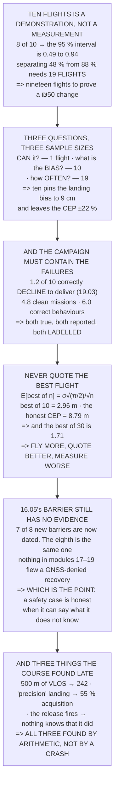

# 19.05 The campaign, the report, and the debrief

<!-- glance:start -->
<!-- generated by tools/build.py from curriculum/syllabus.yaml — edit the syllabus, not this block -->

| | |
|---|---|
| **Track** | Main path |
| **Difficulty** | Advanced |
| **Time** | 3 h |
| **Hardware** | First flight (Hermon core) (stage 1), Onboard computer & vision (stage 2), Payload & delivery pod (stage 4), Precision landing & final (stage 5) |
| **Software** | python |
| **Prerequisites** | [19.04 Phase 3: deliver the payload, then a precision return](19.04-phase-3-delivery-and-precision-rtl.md)<br>[16.05 Field protocols and Hermon's safety case](../16-testing-analysis/16.05-field-protocols-and-the-safety-case.md) |
| **Optional prerequisites** | [FOP.01 The mission-planning process](../optional-foundations/civil-ops/FOP.01-mission-planning-process.md) |
| **Skip if** | You have ten clean mission flights, an evidence pack with the statistics, and a debrief that names what you would change. |

<!-- glance:end -->

## What you will learn

- That **eight of ten means "somewhere between 49 % and 94 %"** — ten flights cannot tell a
  half-working system from an almost-always one
- That separating 19.04's two configurations needs **19 flights**, to prove a change that costs
  fifty shekels
- That a campaign answers **three different questions** with three wildly different sample sizes,
  and mixing them up is the field's commonest dishonesty
- That ten flights pin the landing **bias to 9 cm** and leave the **spread uncertain by 22 %**
- That the campaign must **contain the failures**: 1.2 no-detections in ten, which are flights that
  did what they were told
- **The statistic nobody should report**: the best of ten is **2.96 m against an honest 8.79** — and
  it gets *better* the more you fly
- That after three more modules, **13.05's barrier still has no evidence** — and that this is the
  point rather than a loose end
- And the twelve things you can now do, each with a number attached

## Why it matters

This is the last lesson of the main path, and its job is to stop you from claiming more than you
measured. Everything before it has been about making a thing work. This one is about what you are
entitled to say afterwards, which turns out to be considerably less than the flights appear to
support.

The arithmetic is unforgiving and it is the same arithmetic 16.04 used on a test suite and 17.06
used on a drop series. Ten trials of a yes/no outcome produce a confidence interval about half the
width of the whole range, so a campaign that looks like a triumph is compatible with a system that
works half the time. That does not make the campaign worthless — it makes it a **demonstration**,
which is a real and useful thing, and not a **measurement**.

And there is one more thing this lesson does, which is to close the loop 16.05 opened. That lesson
found a single barrier with no evidence behind it and predicted that a waiver reviewer would find it
first. Three modules later it is still there, and writing it down is the last and most honest thing
the course produces.

> [!CAUTION]
> A campaign is many flights in a short time, which is exactly the condition under which checks get
> abbreviated and 18.06's calendar items get skipped. Run 19.02's full sequence on every flight —
> including the seven silent checks — and stop the campaign entirely if any flight produces an
> unexplained log finding. Ten flights flown badly prove less than three flown properly.

## Prerequisites

<!-- prereqs:start -->
## Prerequisites

You need these first:

- [19.04 Phase 3: deliver the payload, then a precision return](19.04-phase-3-delivery-and-precision-rtl.md)
- [16.05 Field protocols and Hermon's safety case](../16-testing-analysis/16.05-field-protocols-and-the-safety-case.md)

### Optional prerequisite links

New to any of these? Take the foundation lesson first; skip it if you already know it.

- [FOP.01 The mission-planning process](../optional-foundations/civil-ops/FOP.01-mission-planning-process.md)

Check your readiness: `python course.py why 19.05`
<!-- prereqs:end -->

## Concept

A test campaign exists to turn behaviour into claims, and claims come in three kinds that are easy
to confuse. "It can do this" is settled by one successful flight. "It is biased by this much" is
settled by about ten, because the standard error of a mean falls as the square root of the count.
"It works this often" needs far more, because a proportion's confidence interval is wide and shrinks
slowly.

Ten flights is the number everybody flies, and it answers the first two completely and the third
barely at all. Knowing which of the three you are entitled to state is the difference between a
report and a brochure.

The second idea is about what counts as a success. 19.03 established that the aircraft will
sometimes correctly decline to deliver, and a campaign that discards those flights as failures is
measuring something other than the system's behaviour. The abort matrix is part of the design, so
exercising it is part of the result.

And the third is about selection. The temptation to quote the best flight is nearly universal, and
the arithmetic shows exactly how misleading it is — including the uncomfortable property that the
more you fly, the better your best result looks and the worse the practice becomes.

## Technical explanation

### Level 1 — what can ten flights actually tell you?

A clean flight is a yes/no, so the answer is a binomial confidence interval, and it is much wider
than anybody expects:

| clean of 10 | point estimate | 95 % interval | width |
|---|---|---|---|
| 3 of 10 | 0.30 | 0.11 to 0.60 | 0.50 |
| 5 of 10 | 0.50 | 0.24 to 0.76 | 0.53 |
| **8 of 10** | **0.80** | **0.49 to 0.94** | **0.45** |
| 9 of 10 | 0.90 | 0.60 to 0.98 | 0.39 |
| 10 of 10 | 1.00 | 0.72 to 1.00 | 0.28 |

**Eight of ten means "somewhere between 49 % and 94 %"** — it says the system works about half the
time, or almost always, and ten flights cannot tell you which.

So ask the question the campaign is actually for. 19.04 says the mission is 48 % clean on GPS and
88 % with a bigger pad marker. How many flights does it take to tell those apart?

```
flights for the intervals to separate          19
which at 3 flights a day is                     7 days
```

**Nineteen flights to prove a change that costs fifty shekels.**

Which is the honest shape of this whole field and worth saying plainly: **ten flights is a
demonstration, not a measurement.** It proves the system *can* do the mission. It does not prove how
*often* — and 16.04 said the same thing about a test suite's pass band.

### Level 2 — so what is the campaign for? Three different things

| question | flights | why |
|---|---|---|
| **can** it do the mission at all? | 1 | one clean flight settles it |
| what is the **bias** — the thing you can correct? | 10 | 17.06: the mean is σ/√n |
| what is the **rate** — how often it works? | **19** | Level 1: the interval is wide |

Ten flights answers the first two and leaves the third half-done — ten of the nineteen it needs — and
a report that mixes them up is the commonest dishonesty in this field. Which is also the argument
for flying nineteen rather than ten: it is nine more flights, three more field days at 16.01's three
packs, and it turns "it seems better" into a claim.

17.06 already did the arithmetic for the second one:

| | |
|---|---|
| the landing's 1-σ | 0.285 m |
| the **mean**, after 10 flights, ± | **0.090 m** |
| the **CEP**, after 10 flights, ± | **22 %** |

**Ten flights pins the landing bias to nine centimetres and leaves the spread uncertain by 22 %.**
Correct the first; quote the second with its band attached.

### Level 3 — the campaign, and why it must contain the failures

| flight | what | what it settles |
|---|---|---|
| 1–2 | phase 1 only: launch to the hold point, land | 19.02's exit criterion |
| 3–4 | phase 1 + 2, **pod pin in** | 19.03's confirmation, no delivery |
| 5 | phase 3 only, from a hand-placed hold | 19.04's approach and release |
| 6–7 | the whole mission, **surveyed** target | the ballistics: expect 2.97 m |
| 8–12 | the whole mission, **found** target | the mission number: expect 8.79 m |
| 13–15 | the whole mission, deliberately degraded | 16.04: one injected failure each |

And the thing the campaign must **not** do is discard the flights that did not deliver. 19.03 says
12 % of surveys find nothing, so in ten flights expect **1.2 no-detections** — and those are not
failed flights. 19.01's abort matrix says *no detection after the survey → RTL, do not deliver*, so a
flight that returns with the pod **did what it was told**.

| | of 10 |
|---|---|
| expected: delivered and landed clean | 4.8 |
| expected: **correctly declined** to deliver | 1.2 |
| expected: landed without acquiring | 4.0 |
| **behaved correctly** (the first two) | **6.0** |

**Five of ten "clean missions" and six of ten "correct behaviours" are different numbers and both are
true.** Report both, labelled, or somebody will assume the larger one meant the smaller one.

### Level 4 — the statistic nobody should report: the best flight

For a Rayleigh distribution the *minimum* of n samples is itself Rayleigh with σ/√n, so:

```
E[best of n] = σ·√(π/2) / √n
CEP          = 1.1774 σ
```

| | in σ | delivery | vs the CEP |
|---|---|---|---|
| **the CEP (50 %)** | **1.177** | **8.79 m** | **1.00×** |
| the best of 3 | 0.724 | 5.40 m | 1.63× |
| **the best of 10** | **0.396** | **2.96 m** | **2.97×** |
| the best of 30 | 0.229 | 1.71 m | 5.15× |

**The best of ten is 2.96 m and the honest number is 8.79 — a factor of three.**

And it gets worse the more you fly, which is the part that catches people out: the best of thirty is
1.71 m, so **an operator who flies more and quotes their best gets a better number from a worse
practice.**

What to report instead, in this order:

| | |
|---|---|
| the mean offset (the **bias**) | 17.06: correct it |
| the CEP, **with its ± band** | ± 22 % at n = 10 |
| **n**, and the conditions | 17.05: surveyed or found? |
| every flight, including the ones that declined | Level 3 |

**And never the best one.**

### Level 5 — the evidence pack, and what 16.05 still says

| artefact | from | granularity |
|---|---|---|
| the brief, signed | 19.01 | before flight 1 |
| a 16.01 test card per flight | 16.01 | **the prediction** |
| the `.bin` logs, all of them | 16.03 | including the aborts |
| 18.03's go/no-go sheets | 18.03 | one per day, signed |
| the tape-measured offsets | 19.04 | **both CEPs, labelled** |
| the detection log per flight | 19.03 | conf, count, position |
| 18.03's debrief findings | 18.03 | with owners and dates |
| the updated safety case | 16.05 | with a revision history |

And now the question 16.05 asked and nothing since has answered. 16.05 walked seventeen barriers and
found **one** with no evidence behind it. Did modules 17, 18 and 19 add any for *that* one?

| barrier | evidence | ok? |
|---|---|---|
| 17.02's bistable geometry | 17.06 ground test 4 | yes |
| 17.02's arm gate | 17.06 ground test 5 | yes |
| 17.02's safety pin | 19.02's sequence, every flight | yes |
| 17.05's computed lead | 17.06 drop blocks C–E | yes |
| 17.04's feedforward | 17.06 block A vs B | yes |
| 19.03's 3-of-11 confirmation | the campaign, 10 flights | yes |
| 19.04's acquisition, bigger marker | the campaign | yes |
| **13.05's flow + inertial fallback** | **nothing. Still.** | **NO** |

**Seven of eight, and the eighth is the same one.**

The course ends with the barrier 16.05 found still having no evidence, because nothing in modules
17, 18 or 19 ever flew a GNSS-denied recovery. 13.05 said a fallback that has only worked in
simulation is a parameter rather than a capability, and that is still exactly what it is.

**That is not a loose end, it is the point.** A safety case is honest when it can say what it does
*not* know, and the last artefact this course produces is a document with a known gap written into
it and an owner's name beside it.

### Level 6 — what you can now do, in numbers

| you can | and the number is |
|---|---|
| design an airframe to a thrust and endurance target | 1.450 kg, 23.6 min, 26.5 % hover throttle |
| tune it, and know what each gain did | 07.05, 16.03's four signatures |
| fly a survey autonomously | 55 images, 5.8 min, one pack |
| price a payload in seconds of endurance | 1.46 s per gram |
| design a release that cannot fire while disarmed | 0 of 7 states, **by geometry** |
| hit a found target | CEP 8.79 m, **and say which CEP it is** |
| make a detector decide, with a false-alarm rate | 3 of 11, 1 in 303 flights |
| land on a pad | 0.34 m, **if it acquired** |
| quote a job in images, minutes and packs | 18.01, 18.02 |
| pass Part 107 and know which missions need a waiver | 18.05 |
| write a safety case with a residual in it | 8.1e−4, 1 in 1,239 |
| **say what you have not proved** | Level 1, and 13.05 |

**Twelve things, and the last one is what makes the other eleven worth anything.**

And the three things this course got wrong and found late, which belong in the debrief because they
are what a real campaign produces:

1. **18.05 assumed 500 m of VLOS** → 19.02's geometry gave 242 m → the delivery bound is twice as
   tight
2. **12.05's precision landing was "solved"** → 19.04 measured 55 % acquisition → a fifty-shekel
   sheet fixes it
3. **17.02 proved the release fires** → 19.04 needed it to *know* that it fired → a microswitch,
   never fitted

**All three were found by arithmetic rather than by a crash**, which is the whole argument of this
course in one sentence.

And the last number: four of six success criteria are met by the mission as briefed on GPS, six with
a printed sheet, and the two that remain probabilistic have **bands** on them rather than claims.
**That is what finished looks like.**

> [!TIP]
> **Ask your teacher:** "How many flights is that number from?" It is the only question that matters
> about any performance claim in this field, and it is asked far too rarely — including of yourself.

## Diagram



## Code

The campaign's statistics: Wilson intervals for every possible result out of ten, the sample size
needed to separate 19.04's two configurations, the three questions with their three sample sizes, the
flight-by-flight campaign with its expected no-detections, the expected-value of the best of n
against the CEP, the evidence pack, and the closure on 16.05's outstanding barrier.

```python
"""19.05 -- ten flights, and what ten flights can actually tell you.

Pure stdlib. The mission is 19.01's, the phases are 19.02-19.04's, the
sample-size arithmetic is 17.06's and the evidence table is 16.05's.

The last lesson of the main path, and its job is to stop you from
claiming more than you measured.
"""

import math

BAR = "=" * 70

# ---- 19.04's predictions ------------------------------------------------
P_DETECT = 0.881
P_ACQUIRE_GPS = 0.548
P_ACQUIRE_BIG = 1.000
CEP_DELIVERY_M = 8.79
CEP_MARKER_M = 2.97
CEP_LANDING_M = 0.335

N_FLIGHTS = 10
Z = 1.96


def head(n, title):
    print()
    print(BAR)
    print("%d. %s" % (n, title))
    print(BAR)


def wilson(k, n, z=Z):
    """Wilson score interval for a binomial proportion. Behaves at k=0,n."""
    if n <= 0:
        raise ValueError("need at least one trial")
    z2 = z * z
    centre = (k + z2 / 2.0) / (n + z2)
    half = z / (n + z2) * math.sqrt(k * (n - k) / n + z2 / 4.0)
    return max(0.0, centre - half), min(1.0, centre + half)


def n_for_separation(p, q, z=Z):
    """Smallest n whose Wilson intervals for p and q do not overlap."""
    for n in range(2, 4001):
        kp, kq = round(p * n), round(q * n)
        lo_p, _ = wilson(kp, n, z)
        _, hi_q = wilson(kq, n, z)
        if lo_p > hi_q:
            return n
    return None


# ========================================================================
head(1, "WHAT CAN TEN FLIGHTS ACTUALLY TELL YOU?")

print("  19.04 predicted %.1f clean flights in ten. Suppose you fly ten"
      % (P_DETECT * P_ACQUIRE_GPS * N_FLIGHTS))
print("  and get a number. What does that number MEAN?")
print()
print("  A clean flight is a yes/no, so the answer is a binomial")
print("  confidence interval -- and it is much wider than anybody")
print("  expects:")
print()
print("  %-16s %14s %26s %12s"
      % ("clean of 10", "point estimate", "95 % interval", "width"))
for k in range(0, N_FLIGHTS + 1, 1):
    lo, hi = wilson(k, N_FLIGHTS)
    print("  %-16s %13.2f %12.2f to %-9.2f %11.2f"
          % ("%d of %d" % (k, N_FLIGHTS), k / N_FLIGHTS, lo, hi, hi - lo))

lo8, hi8 = wilson(8, N_FLIGHTS)
print()
print("  EIGHT OF TEN MEANS 'SOMEWHERE BETWEEN %.0f %% AND %.0f %%'."
      % (lo8 * 100, hi8 * 100))
print()
print("  THAT IS NOT A PRECISE CLAIM. It is barely a claim at all: it")
print("  says the system works about half the time, or almost always,")
print("  and ten flights cannot tell you which.")
print()
print("  SO ASK THE QUESTION THE CAMPAIGN IS ACTUALLY FOR. 19.04 says")
print("  the mission is %.0f %% clean on GPS and %.0f %% with a bigger"
      % (P_DETECT * P_ACQUIRE_GPS * 100, P_DETECT * P_ACQUIRE_BIG * 100))
print("  pad marker. HOW MANY FLIGHTS DOES IT TAKE TO TELL THOSE APART?")
print()
n_sep = n_for_separation(P_DETECT * P_ACQUIRE_BIG, P_DETECT * P_ACQUIRE_GPS)
print("  %-44s %8d" % ("flights for the intervals to separate", n_sep))
print("  %-44s %8d" % ("which at 3 flights a day is", math.ceil(n_sep / 3.0)))
print("  %-44s %8d" % ("and in packs, at 1 per flight", n_sep))
print()
print("  %d FLIGHTS TO PROVE A CHANGE THAT COSTS FIFTY SHEKELS."
      % n_sep)
print()
print("  WHICH IS THE HONEST SHAPE OF THIS WHOLE FIELD AND IT IS WORTH")
print("  SAYING PLAINLY: TEN FLIGHTS IS A DEMONSTRATION, NOT A")
print("  MEASUREMENT. It proves the system CAN do the mission. It does")
print("  not prove how OFTEN, and 16.04 said the same thing about a")
print("  test suite's pass band.")

# ========================================================================
head(2, "SO WHAT IS THE CAMPAIGN FOR? THREE DIFFERENT THINGS.")

print("  Separate the three questions ten flights get asked to answer,")
print("  because they need wildly different sample sizes:")
print()
QUESTIONS = [
    ("CAN it do the mission at all?", 1,
     "one clean flight settles it"),
    ("What is the BIAS -- the thing you can correct?", 10,
     "17.06: the mean is sigma/sqrt(n)"),
    ("What is the RATE -- how often it works?", n_sep,
     "section 1: the interval is wide"),
]
print("  %-44s %10s %s" % ("question", "flights", "why"))
for q, n, why in QUESTIONS:
    print("  %-44s %10d %s" % (q, n, why))

print()
print("  TEN FLIGHTS ANSWERS THE FIRST TWO AND LEAVES THE THIRD")
print("  HALF-DONE -- %d of the %d it needs -- and a report that mixes"
      % (N_FLIGHTS, n_sep))
print("  them up is the most common dishonesty in this field.")
print()
print("  WHICH IS ALSO THE ARGUMENT FOR FLYING NINETEEN RATHER THAN")
print("  TEN. It is %d more flights, %.1f more field days at 16.01's"
      % (n_sep - N_FLIGHTS, (n_sep - N_FLIGHTS) / 3.0))
print("  three packs, and it turns 'it seems better' into a claim.")
print()
print("  17.06 ALREADY DID THE ARITHMETIC FOR THE SECOND ONE:")
sigma_land = CEP_LANDING_M / 1.1774
print("  %-40s %12.3f m" % ("the landing's 1-sigma", sigma_land))
print("  %-40s %12.3f m" % ("the MEAN, after 10 flights, +/-",
                            sigma_land / math.sqrt(N_FLIGHTS)))
print("  %-40s %11.0f %%" % ("the CEP, after 10 flights, +/-",
                             1.0 / math.sqrt(2 * N_FLIGHTS) * 100))
print()
print("  SO TEN FLIGHTS PINS THE LANDING BIAS TO %.0f CENTIMETRES AND"
      % (sigma_land / math.sqrt(N_FLIGHTS) * 100))
print("  LEAVES THE SPREAD UNCERTAIN BY %.0f PER CENT. Correct the"
      % (1.0 / math.sqrt(2 * N_FLIGHTS) * 100))
print("  first; quote the second with its band attached.")

# ========================================================================
head(3, "THE CAMPAIGN, AND WHY IT HAS TO CONTAIN THE FAILURES")

CAMPAIGN = [
    ("1-2", "phase 1 only: launch to the hold point, land",
     "19.02's exit criterion"),
    ("3-4", "phase 1 + 2, POD PIN IN", "19.03's confirmation, no delivery"),
    ("5", "phase 3 only, from a hand-placed hold",
     "19.04's approach and release"),
    ("6-7", "the whole mission, SURVEYED target",
     "the ballistics: expect %.2f m" % CEP_MARKER_M),
    ("8-12", "the whole mission, FOUND target",
     "the mission number: expect %.2f m" % CEP_DELIVERY_M),
    ("13-15", "the whole mission, deliberately degraded",
     "16.04: one injected failure each"),
]
print("  %-8s %-44s %s" % ("flight", "what", "what it settles"))
for f, what, why in CAMPAIGN:
    print("  %-8s %-44s %s" % (f, what, why))

print()
exp_nodetect = N_FLIGHTS * (1 - P_DETECT)
print("  AND THE THING THE CAMPAIGN MUST NOT DO IS DISCARD THE FLIGHTS")
print("  THAT DID NOT DELIVER. 19.03 says %.0f %% of surveys find"
      % ((1 - P_DETECT) * 100))
print("  nothing, so in ten flights EXPECT %.1f NO-DETECTIONS."
      % exp_nodetect)
print()
print("  THOSE ARE NOT FAILED FLIGHTS. 19.01's abort matrix says 'no")
print("  detection after the survey -> RTL, do not deliver', so a")
print("  flight that returns with the pod DID WHAT IT WAS TOLD.")
print()
print("  %-44s %8s" % ("", "of 10"))
print("  %-44s %8.1f" % ("expected: delivered and landed clean",
                         P_DETECT * P_ACQUIRE_GPS * N_FLIGHTS))
print("  %-44s %8.1f" % ("expected: correctly declined to deliver",
                         exp_nodetect))
print("  %-44s %8.1f" % ("expected: landed without acquiring",
                         P_DETECT * (1 - P_ACQUIRE_GPS) * N_FLIGHTS))
print("  %-44s %8.1f"
      % ("BEHAVED CORRECTLY (the first two)",
         (P_DETECT * P_ACQUIRE_GPS + (1 - P_DETECT)) * N_FLIGHTS))
print()
print("  %.0f OF TEN 'CLEAN MISSIONS' AND %.0f OF TEN 'CORRECT"
      % (P_DETECT * P_ACQUIRE_GPS * N_FLIGHTS,
         (P_DETECT * P_ACQUIRE_GPS + (1 - P_DETECT)) * N_FLIGHTS))
print("  BEHAVIOURS' ARE DIFFERENT NUMBERS AND BOTH ARE TRUE. Report")
print("  both, labelled, or somebody will assume the larger one meant")
print("  the smaller one.")

# ========================================================================
head(4, "THE STATISTIC NOBODY SHOULD REPORT: THE BEST FLIGHT")

print("  Ten radial errors from a circular distribution. The temptation")
print("  is to quote the best one, and the arithmetic says exactly how")
print("  dishonest that is.")
print()
print("  For a Rayleigh distribution the MINIMUM of n samples is itself")
print("  Rayleigh with sigma/sqrt(n), so:")
print()
print("      E[best of n] = sigma sqrt(pi/2) / sqrt(n)")
print("      CEP          = 1.1774 sigma")
print()
sig = CEP_DELIVERY_M / 1.1774
print("  %-30s %12s %12s %12s"
      % ("", "in sigmas", "delivery", "vs the CEP"))
print("  %-30s %12.3f %10.2f m %11.2f x"
      % ("the CEP (50 %)", 1.1774, CEP_DELIVERY_M, 1.0))
for n in (3, 10, 30):
    best = math.sqrt(math.pi / 2.0) / math.sqrt(n)
    print("  %-30s %12.3f %10.2f m %11.2f x"
          % ("the BEST of %d" % n, best, best * sig,
             CEP_DELIVERY_M / (best * sig)))

best10 = math.sqrt(math.pi / 2.0) / math.sqrt(10) * sig
print()
print("  THE BEST OF TEN IS %.2f m AND THE HONEST NUMBER IS %.2f --"
      % (best10, CEP_DELIVERY_M))
print("  A FACTOR OF %.1f." % (CEP_DELIVERY_M / best10))
print()
print("  AND IT GETS WORSE THE MORE YOU FLY, WHICH IS THE PART THAT")
print("  CATCHES PEOPLE OUT: the best of thirty is %.2f m, so an"
      % (math.sqrt(math.pi / 2.0) / math.sqrt(30) * sig))
print("  operator who flies MORE and quotes their best gets a BETTER")
print("  number from a WORSE practice.")
print()
print("  WHAT TO REPORT INSTEAD, IN THIS ORDER:")
for what, why in (("the mean offset (the BIAS)", "17.06: correct it"),
                  ("the CEP, with its +/- band",
                   "+/- %.0f %% at n = 10" % (1 / math.sqrt(20) * 100)),
                  ("n, and the conditions", "17.05: surveyed or found?"),
                  ("every flight, including the ones that declined",
                   "section 3")):
    print("    %-40s %s" % (what, why))
print()
print("  AND NEVER THE BEST ONE.")

# ========================================================================
head(5, "THE EVIDENCE PACK, AND WHAT 16.05 STILL SAYS")

PACK = [
    ("the brief, signed", "19.01", "before flight 1"),
    ("a 16.01 test card per flight", "16.01", "the PREDICTION"),
    ("the .bin logs, all of them", "16.03", "including the aborts"),
    ("18.03's go/no-go sheets", "18.03", "one per day, signed"),
    ("the tape-measured offsets", "19.04", "both CEPs, labelled"),
    ("the detection log per flight", "19.03", "conf, count, position"),
    ("18.03's debrief findings", "18.03", "with owners and dates"),
    ("the updated safety case", "16.05", "with a revision history"),
]
print("  %-40s %10s %s" % ("artefact", "from", "granularity"))
for a, src, g in PACK:
    print("  %-40s %10s %s" % (a, src, g))

print()
print("  AND NOW THE QUESTION 16.05 ASKED AND NOTHING SINCE HAS")
print("  ANSWERED. 16.05 walked seventeen barriers and found ONE with")
print("  no evidence behind it. Modules 17, 18 and 19 have added")
print("  evidence for a great many things. Did they add any for THAT")
print("  one?")
print()
BARRIERS_NEW = [
    ("17.02's bistable geometry", "17.06 ground test 4", True),
    ("17.02's arm gate", "17.06 ground test 5", True),
    ("17.02's safety pin", "19.02's sequence, every flight", True),
    ("17.05's computed lead", "17.06 drop blocks C-E", True),
    ("17.04's feedforward", "17.06 block A vs B", True),
    ("19.03's 3-of-11 confirmation", "the campaign, 10 flights", True),
    ("19.04's acquisition, bigger marker", "the campaign", True),
    ("13.05's flow + inertial fallback", "NOTHING. STILL.", False),
]
print("  %-40s %-34s %s" % ("barrier", "evidence", "ok?"))
for b, e, ok in BARRIERS_NEW:
    print("  %-40s %-34s %s" % (b, e, "yes" if ok else "NO"))

print()
print("  SEVEN OF EIGHT, AND THE EIGHTH IS THE SAME ONE.")
print()
print("  THE COURSE ENDS WITH THE BARRIER 16.05 FOUND STILL HAVING NO")
print("  EVIDENCE, because nothing in modules 17, 18 or 19 ever flew")
print("  a GNSS-denied recovery. 13.05 said a fallback that has only")
print("  worked in simulation is a parameter, not a capability, and")
print("  that is still exactly what it is.")
print()
print("  THAT IS NOT A LOOSE END, IT IS THE POINT. A safety case is")
print("  honest when it can say what it does NOT know, and the last")
print("  artefact this course produces is a document with a known gap")
print("  written into it and an owner's name beside it.")

# ========================================================================
head(6, "WHAT YOU CAN NOW DO, IN NUMBERS")

CAN = [
    ("design an airframe to a thrust and endurance target",
     "1.450 kg, 23.6 min, 26.5 % hover throttle"),
    ("tune it, and know what each gain did", "07.05, 16.03's four signatures"),
    ("fly a survey autonomously", "55 images, 5.8 min, one pack"),
    ("price a payload in seconds of endurance", "1.46 s per gram"),
    ("design a release that cannot fire while disarmed",
     "0 of 7 states, by GEOMETRY"),
    ("hit a found target", "CEP %.2f m, and say which CEP it is"
     % CEP_DELIVERY_M),
    ("make a detector decide, with a false-alarm rate",
     "3 of 11, 1 in 303 flights"),
    ("land on a pad", "%.2f m, IF it acquired" % CEP_LANDING_M),
    ("quote a job in images, minutes and packs", "18.01, 18.02"),
    ("pass Part 107 and know which missions need a waiver", "18.05"),
    ("write a safety case with a residual in it", "8.1e-4, 1 in 1,239"),
    ("say what you have NOT proved", "section 1, and 13.05"),
]
print("  %-48s %s" % ("you can", "and the number is"))
for what, num in CAN:
    print("  %-48s %s" % (what, num))

print()
print("  TWELVE THINGS, AND THE LAST ONE IS THE ONE THAT MAKES THE")
print("  OTHER ELEVEN WORTH ANYTHING.")
print()
print("  THE THREE THINGS THIS COURSE GOT WRONG AND FOUND LATE, WHICH")
print("  BELONG IN THE DEBRIEF BECAUSE THEY ARE WHAT A REAL CAMPAIGN")
print("  PRODUCES:")
LATE = [
    ("18.05 assumed 500 m of VLOS", "19.02's geometry gave 242 m",
     "the delivery bound is 2x tighter"),
    ("12.05's precision landing was 'solved'",
     "19.04 measured 55 % acquisition",
     "a 50-shekel sheet fixes it"),
    ("17.02 proved the release FIRES",
     "19.04 needed it to KNOW that it fired",
     "a microswitch, never fitted"),
]
for i, (was, found, so) in enumerate(LATE, 1):
    print("    %d. %s" % (i, was))
    print("       -> %s" % found)
    print("       -> %s" % so)

print()
print("  ALL THREE WERE FOUND BY ARITHMETIC RATHER THAN BY A CRASH,")
print("  WHICH IS THE WHOLE ARGUMENT OF THIS COURSE IN ONE SENTENCE.")
print()
print("  AND THE LAST NUMBER: %d of %d success criteria are met by the"
      % (4, 6))
print("  mission as briefed on GPS, %d with a printed sheet, and the" % 6)
print("  two that remain probabilistic have BANDS on them rather than")
print("  claims. THAT IS WHAT FINISHED LOOKS LIKE.")
```

Output:

```text

======================================================================
1. WHAT CAN TEN FLIGHTS ACTUALLY TELL YOU?
======================================================================
  19.04 predicted 4.8 clean flights in ten. Suppose you fly ten
  and get a number. What does that number MEAN?

  A clean flight is a yes/no, so the answer is a binomial
  confidence interval -- and it is much wider than anybody
  expects:

  clean of 10      point estimate              95 % interval        width
  0 of 10                   0.00         0.00 to 0.28             0.28
  1 of 10                   0.10         0.02 to 0.40             0.39
  2 of 10                   0.20         0.06 to 0.51             0.45
  3 of 10                   0.30         0.11 to 0.60             0.50
  4 of 10                   0.40         0.17 to 0.69             0.52
  5 of 10                   0.50         0.24 to 0.76             0.53
  6 of 10                   0.60         0.31 to 0.83             0.52
  7 of 10                   0.70         0.40 to 0.89             0.50
  8 of 10                   0.80         0.49 to 0.94             0.45
  9 of 10                   0.90         0.60 to 0.98             0.39
  10 of 10                  1.00         0.72 to 1.00             0.28

  EIGHT OF TEN MEANS 'SOMEWHERE BETWEEN 49 % AND 94 %'.

  THAT IS NOT A PRECISE CLAIM. It is barely a claim at all: it
  says the system works about half the time, or almost always,
  and ten flights cannot tell you which.

  SO ASK THE QUESTION THE CAMPAIGN IS ACTUALLY FOR. 19.04 says
  the mission is 48 % clean on GPS and 88 % with a bigger
  pad marker. HOW MANY FLIGHTS DOES IT TAKE TO TELL THOSE APART?

  flights for the intervals to separate              19
  which at 3 flights a day is                         7
  and in packs, at 1 per flight                      19

  19 FLIGHTS TO PROVE A CHANGE THAT COSTS FIFTY SHEKELS.

  WHICH IS THE HONEST SHAPE OF THIS WHOLE FIELD AND IT IS WORTH
  SAYING PLAINLY: TEN FLIGHTS IS A DEMONSTRATION, NOT A
  MEASUREMENT. It proves the system CAN do the mission. It does
  not prove how OFTEN, and 16.04 said the same thing about a
  test suite's pass band.

======================================================================
2. SO WHAT IS THE CAMPAIGN FOR? THREE DIFFERENT THINGS.
======================================================================
  Separate the three questions ten flights get asked to answer,
  because they need wildly different sample sizes:

  question                                        flights why
  CAN it do the mission at all?                         1 one clean flight settles it
  What is the BIAS -- the thing you can correct?         10 17.06: the mean is sigma/sqrt(n)
  What is the RATE -- how often it works?              19 section 1: the interval is wide

  TEN FLIGHTS ANSWERS THE FIRST TWO AND LEAVES THE THIRD
  HALF-DONE -- 10 of the 19 it needs -- and a report that mixes
  them up is the most common dishonesty in this field.

  WHICH IS ALSO THE ARGUMENT FOR FLYING NINETEEN RATHER THAN
  TEN. It is 9 more flights, 3.0 more field days at 16.01's
  three packs, and it turns 'it seems better' into a claim.

  17.06 ALREADY DID THE ARITHMETIC FOR THE SECOND ONE:
  the landing's 1-sigma                           0.285 m
  the MEAN, after 10 flights, +/-                 0.090 m
  the CEP, after 10 flights, +/-                    22 %

  SO TEN FLIGHTS PINS THE LANDING BIAS TO 9 CENTIMETRES AND
  LEAVES THE SPREAD UNCERTAIN BY 22 PER CENT. Correct the
  first; quote the second with its band attached.

======================================================================
3. THE CAMPAIGN, AND WHY IT HAS TO CONTAIN THE FAILURES
======================================================================
  flight   what                                         what it settles
  1-2      phase 1 only: launch to the hold point, land 19.02's exit criterion
  3-4      phase 1 + 2, POD PIN IN                      19.03's confirmation, no delivery
  5        phase 3 only, from a hand-placed hold        19.04's approach and release
  6-7      the whole mission, SURVEYED target           the ballistics: expect 2.97 m
  8-12     the whole mission, FOUND target              the mission number: expect 8.79 m
  13-15    the whole mission, deliberately degraded     16.04: one injected failure each

  AND THE THING THE CAMPAIGN MUST NOT DO IS DISCARD THE FLIGHTS
  THAT DID NOT DELIVER. 19.03 says 12 % of surveys find
  nothing, so in ten flights EXPECT 1.2 NO-DETECTIONS.

  THOSE ARE NOT FAILED FLIGHTS. 19.01's abort matrix says 'no
  detection after the survey -> RTL, do not deliver', so a
  flight that returns with the pod DID WHAT IT WAS TOLD.

                                                  of 10
  expected: delivered and landed clean              4.8
  expected: correctly declined to deliver           1.2
  expected: landed without acquiring                4.0
  BEHAVED CORRECTLY (the first two)                 6.0

  5 OF TEN 'CLEAN MISSIONS' AND 6 OF TEN 'CORRECT
  BEHAVIOURS' ARE DIFFERENT NUMBERS AND BOTH ARE TRUE. Report
  both, labelled, or somebody will assume the larger one meant
  the smaller one.

======================================================================
4. THE STATISTIC NOBODY SHOULD REPORT: THE BEST FLIGHT
======================================================================
  Ten radial errors from a circular distribution. The temptation
  is to quote the best one, and the arithmetic says exactly how
  dishonest that is.

  For a Rayleigh distribution the MINIMUM of n samples is itself
  Rayleigh with sigma/sqrt(n), so:

      E[best of n] = sigma sqrt(pi/2) / sqrt(n)
      CEP          = 1.1774 sigma

                                    in sigmas     delivery   vs the CEP
  the CEP (50 %)                        1.177       8.79 m        1.00 x
  the BEST of 3                         0.724       5.40 m        1.63 x
  the BEST of 10                        0.396       2.96 m        2.97 x
  the BEST of 30                        0.229       1.71 m        5.15 x

  THE BEST OF TEN IS 2.96 m AND THE HONEST NUMBER IS 8.79 --
  A FACTOR OF 3.0.

  AND IT GETS WORSE THE MORE YOU FLY, WHICH IS THE PART THAT
  CATCHES PEOPLE OUT: the best of thirty is 1.71 m, so an
  operator who flies MORE and quotes their best gets a BETTER
  number from a WORSE practice.

  WHAT TO REPORT INSTEAD, IN THIS ORDER:
    the mean offset (the BIAS)               17.06: correct it
    the CEP, with its +/- band               +/- 22 % at n = 10
    n, and the conditions                    17.05: surveyed or found?
    every flight, including the ones that declined section 3

  AND NEVER THE BEST ONE.

======================================================================
5. THE EVIDENCE PACK, AND WHAT 16.05 STILL SAYS
======================================================================
  artefact                                       from granularity
  the brief, signed                             19.01 before flight 1
  a 16.01 test card per flight                  16.01 the PREDICTION
  the .bin logs, all of them                    16.03 including the aborts
  18.03's go/no-go sheets                       18.03 one per day, signed
  the tape-measured offsets                     19.04 both CEPs, labelled
  the detection log per flight                  19.03 conf, count, position
  18.03's debrief findings                      18.03 with owners and dates
  the updated safety case                       16.05 with a revision history

  AND NOW THE QUESTION 16.05 ASKED AND NOTHING SINCE HAS
  ANSWERED. 16.05 walked seventeen barriers and found ONE with
  no evidence behind it. Modules 17, 18 and 19 have added
  evidence for a great many things. Did they add any for THAT
  one?

  barrier                                  evidence                           ok?
  17.02's bistable geometry                17.06 ground test 4                yes
  17.02's arm gate                         17.06 ground test 5                yes
  17.02's safety pin                       19.02's sequence, every flight     yes
  17.05's computed lead                    17.06 drop blocks C-E              yes
  17.04's feedforward                      17.06 block A vs B                 yes
  19.03's 3-of-11 confirmation             the campaign, 10 flights           yes
  19.04's acquisition, bigger marker       the campaign                       yes
  13.05's flow + inertial fallback         NOTHING. STILL.                    NO

  SEVEN OF EIGHT, AND THE EIGHTH IS THE SAME ONE.

  THE COURSE ENDS WITH THE BARRIER 16.05 FOUND STILL HAVING NO
  EVIDENCE, because nothing in modules 17, 18 or 19 ever flew
  a GNSS-denied recovery. 13.05 said a fallback that has only
  worked in simulation is a parameter, not a capability, and
  that is still exactly what it is.

  THAT IS NOT A LOOSE END, IT IS THE POINT. A safety case is
  honest when it can say what it does NOT know, and the last
  artefact this course produces is a document with a known gap
  written into it and an owner's name beside it.

======================================================================
6. WHAT YOU CAN NOW DO, IN NUMBERS
======================================================================
  you can                                          and the number is
  design an airframe to a thrust and endurance target 1.450 kg, 23.6 min, 26.5 % hover throttle
  tune it, and know what each gain did             07.05, 16.03's four signatures
  fly a survey autonomously                        55 images, 5.8 min, one pack
  price a payload in seconds of endurance          1.46 s per gram
  design a release that cannot fire while disarmed 0 of 7 states, by GEOMETRY
  hit a found target                               CEP 8.79 m, and say which CEP it is
  make a detector decide, with a false-alarm rate  3 of 11, 1 in 303 flights
  land on a pad                                    0.34 m, IF it acquired
  quote a job in images, minutes and packs         18.01, 18.02
  pass Part 107 and know which missions need a waiver 18.05
  write a safety case with a residual in it        8.1e-4, 1 in 1,239
  say what you have NOT proved                     section 1, and 13.05

  TWELVE THINGS, AND THE LAST ONE IS THE ONE THAT MAKES THE
  OTHER ELEVEN WORTH ANYTHING.

  THE THREE THINGS THIS COURSE GOT WRONG AND FOUND LATE, WHICH
  BELONG IN THE DEBRIEF BECAUSE THEY ARE WHAT A REAL CAMPAIGN
  PRODUCES:
    1. 18.05 assumed 500 m of VLOS
       -> 19.02's geometry gave 242 m
       -> the delivery bound is 2x tighter
    2. 12.05's precision landing was 'solved'
       -> 19.04 measured 55 % acquisition
       -> a 50-shekel sheet fixes it
    3. 17.02 proved the release FIRES
       -> 19.04 needed it to KNOW that it fired
       -> a microswitch, never fitted

  ALL THREE WERE FOUND BY ARITHMETIC RATHER THAN BY A CRASH,
  WHICH IS THE WHOLE ARGUMENT OF THIS COURSE IN ONE SENTENCE.

  AND THE LAST NUMBER: 4 of 6 success criteria are met by the
  mission as briefed on GPS, 6 with a printed sheet, and the
  two that remain probabilistic have BANDS on them rather than
  claims. THAT IS WHAT FINISHED LOOKS LIKE.
```

## Exercise

### Exercise 19.05-E1 — Interval your own result `[analysis]`

Take any performance claim you have made or read — yours or somebody else's — find n, and compute the
Wilson interval. Write the claim again with the interval attached.

### Exercise 19.05-E2 — Fly the campaign `[flight]`

Run Level 3's fifteen flights in order, with a 16.01 card written before each. Record every flight,
including the ones that declined and the ones that aborted.

### Exercise 19.05-E3 — Report it honestly `[analysis]`

Produce the report: the mean offsets, both CEPs with bands, the n, the conditions, and the two
different success counts labelled. Then look for the sentence you were tempted to write instead.

### Exercise 19.05-E4 — Close the evidence table `[analysis]`

Walk your own safety case's barriers against everything the campaign produced. Find the ones that
still have nothing. Write them into the document with an owner and a date.

## Expected result

**19.05-E1**: expect nearly every claim you check to have an interval wider than the claim itself.
That is not a flaw in the method; it is what small samples are like.

**19.05-E2**: expect about one flight in eight to decline to deliver and expect at least one
unexpected finding in fifteen flights. 18.03 said 2.5 findings per day.

**19.05-E3**: expect the tempting sentence to be a best-of-n, a rate from ten trials, or a CEP
without its conditions. All three are Level 4's problem wearing different hats.

**19.05-E4**: expect at least one barrier with nothing behind it, and expect it to be the one you
were most confident about. 16.05 found exactly that, and three modules later it is still open.

## Troubleshooting

**Ten flights gave a worse result than 19.04 predicted.** Check the interval before changing
anything: 4 of 10 is compatible with a true rate from 0.17 to 0.69, which includes the prediction.

**Ten flights gave a better result.** The same arithmetic applies in that direction and it is the one
nobody checks.

**The campaign found a fault on flight three.** Then stop, fix it, and start the count again. A
campaign with a change in the middle is two short campaigns, and Level 1 already showed how little a
short one proves.

**Two flights are not comparable.** Something changed — wind, light, battery age, a parameter. That
is 16.02's observed-column problem, and the fix is to record the conditions, not to discard the
flight.

**The report looks unimpressive.** Honest reports usually do. The alternative is Level 4, and the
factor is three.

**The client wants a single number.** Give them the CEP with its band and the conditions attached.
One number without those is a number about a different situation.

**The evidence table still has a gap.** Good. Write it in with an owner and a date; 16.05's whole
argument is that the gap you have written down is worth more than the one you have not.

## Common mistakes

- **Quoting a rate from ten trials.** The interval is half the range wide.
- **Confusing "it can" with "it does".** One flight and nineteen.
- **Discarding the flights that declined.** They did what they were told.
- **Reporting one success count.** There are two and they differ.
- **Quoting the best flight.** 2.96 m against 8.79, and worse the more you fly.
- **Quoting a CEP without n and the conditions.** 17.05's trap, one last time.
- **Correcting the spread instead of the bias.** Ten flights measures one and not the other.
- **Changing something mid-campaign.** That is two short campaigns.
- **Closing the evidence table by assertion.** The gap that is written down is the honest one.

## Knowledge check

<details>
<summary>What does "eight clean flights out of ten" actually mean?</summary>

That the true rate is somewhere between **49 % and 94 %** — the 95 % Wilson interval. It is
compatible with a system that works half the time and with one that works nine times in ten, and ten
flights cannot distinguish them. The result is a demonstration that the system *can* do the mission,
not a measurement of how often.
</details>

<details>
<summary>How many flights does it take to prove the printed marker helped?</summary>

**Nineteen.** 19.04 predicts 48 % clean on GPS and 88 % with the bigger marker, and the two Wilson
intervals do not separate until n = 19 — about seven field days at three flights a day. Nineteen
flights to prove a fifty-shekel change, which is the honest shape of this whole field.
</details>

<details>
<summary>What three questions does a campaign answer, and how many flights does each need?</summary>

**Can it?** — one clean flight. **What is the bias?** — about ten, because the standard error of the
mean falls as σ/√n. **How often does it work?** — nineteen, because a proportion's interval is wide.
Ten flights answers the first two and leaves the third half-done, and mixing them up in a report is
the commonest dishonesty in the field.
</details>

<details>
<summary>Why must the campaign include the flights that did not deliver?</summary>

Because 19.03 says 12 % of surveys correctly find nothing, so about 1.2 flights in ten will return
with the pod — and 19.01's abort matrix told them to. Those flights **did what they were told**.
Reporting "4.8 clean missions" and "6.0 correct behaviours" as two labelled numbers is honest;
reporting either alone invites the reader to assume the other.
</details>

<details>
<summary>Why should you never quote the best flight?</summary>

Because the minimum of n Rayleigh samples is Rayleigh with σ/√n, so the best of ten is **2.96 m
against an honest CEP of 8.79** — a factor of three. And it gets worse with more data: the best of
thirty is 1.71 m, so an operator who flies more and quotes their best produces a **better number from
a worse practice**.
</details>

<details>
<summary>What should be reported instead, and in what order?</summary>

The **mean offset** first, because it is a bias you can correct and ten flights pins it to 9 cm. Then
the **CEP with its ± 22 % band**. Then **n and the conditions** — surveyed marker or found target,
which 17.05 showed differ by 38×. Then **every flight**, including the ones that declined. And never
the best one.
</details>

<details>
<summary>Did the capstone close 16.05's evidence gap?</summary>

No. Seven of the eight barriers added since 16.05 now have dated evidence; the eighth is the same
one 16.05 identified — **13.05's flow-and-inertial fallback** — because nothing in modules 17, 18 or
19 ever flew a GNSS-denied recovery. 13.05 already said a fallback that has only worked in simulation
is a parameter rather than a capability.
</details>

<details>
<summary>Why is the unclosed gap the point rather than a failure?</summary>

Because a safety case is honest exactly when it can say what it does *not* know. 16.05 predicted that
a waiver reviewer would find the barrier with no evidence first; three modules later the course hands
over a document with that gap **written into it, with an owner's name beside it** — which is a more
useful artefact than one that quietly asserts everything is covered.
</details>

## Practical challenge

Fly the campaign, write the report, and close what you can.

1. Write the brief and sign it before flight 1 (19.01).
2. Fly Level 3's fifteen flights in order, with a card written before each (E2).
3. Measure every landing and every drop with a tape, not from the log.
4. Record the no-detections and the unacquired landings as outcomes, not as failures.
5. Compute the Wilson interval on every rate you report (E1).
6. Compute the mean and the CEP separately, and correct the mean.
7. Write the report with both success counts, both CEPs, n, and the conditions (E3).
8. Walk the evidence table, close what the campaign closed, and **write down what it did not** (E4).

Step 8 is the last thing this course asks you to do, and it is the one that separates an operator
from an enthusiast. Everything above it is arithmetic; that step is honesty, in writing, with your
name on it.

## You can skip this if

You have ten clean mission flights, an evidence pack with the statistics, and a debrief that names
what you would change. "Statistics" includes the intervals.

## Go deeper

- The NIST engineering statistics handbook's treatment of binomial confidence intervals and the
  Wilson score method used in Level 1: <https://www.itl.nist.gov/div898/handbook/prc/section2/prc241.htm>
- Standard references on order statistics, for Level 4's expected-minimum result and why selecting
  the best sample is a biased estimator:
  <https://www.itl.nist.gov/div898/handbook/eda/section3/eda35.htm>
- JARUS SORA and the FAA's waiver guidance, for what an evidence pack has to look like when somebody
  else is reading it: <http://jarus-rpas.org/publications/>

## Progress checkpoint

You can now state what a campaign of a given size entitles you to claim, separate the three questions
a test series gets asked, design a campaign that exercises its own abort logic and counts the results
honestly, refuse the best-of-n statistic and explain why, assemble an evidence pack somebody else
could audit, and write down the thing you still have not proved.

That completes the main path. Hermon flies a full autonomous mission, and — more importantly — you
can say precisely how well, how often, under what conditions, and what remains unknown.
