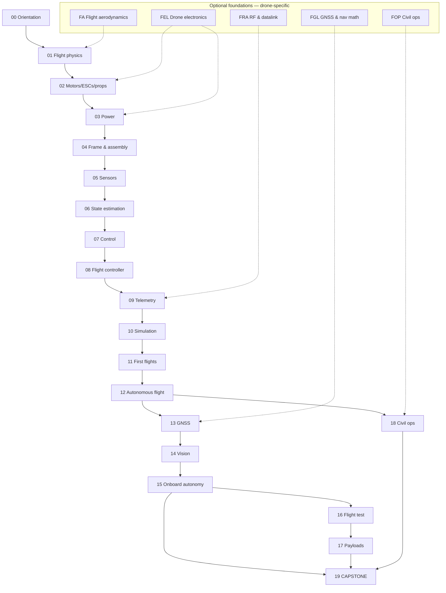

# Course architecture — the 11 deliverables

The complete architecture of the UAV course. The **lesson list itself lives in
[`curriculum/syllabus.yaml`](curriculum/syllabus.yaml)** and is rendered into
[COURSE_MAP.md](COURSE_MAP.md) by `tools/build.py`; this document holds the decisions behind
it. Where the two disagree, the syllabus wins.

- **Revised:** 2026-09-22 (curriculum trimmed, purchasing moved to Israel) · original 2026-09-20
- **Student:** experienced SW engineer/CTO (C#/.NET, Python, JS, SQL, Docker, AI/ML, CV),
  **living in Israel**, coming from the robotics course
- **Goal:** design, build, program, test and operate a civil quadcopter — end goal: work as a
  civil drone operator, holding an **FAA Part 107** remote pilot certificate
- **Build vehicle:** **Hermon** — a ~1.45 kg, 45 cm, 6S quadcopter on 10–12 in props
- **Purchasing:** every part is bought **in Israel** (or imported to Israel), in ₪ including
  VAT. Parts that are not legally usable here are swapped for ones that are — see
  [§5](#5-israeli-purchasing-research).

The 11 deliverables:

| # | Deliverable | Section |
|---|---|---|
| 1 | Complete curriculum map | [§1](#1-complete-curriculum-map) |
| 2 | Prerequisite graph | [§2](#2-prerequisite-graph) |
| 3 | Estimated hours per module | [§3](#3-estimated-hours-per-module) |
| 4 | Hardware requirements | [§4](#4-hardware-requirements) |
| 5 | Israeli purchasing research | [§5](#5-israeli-purchasing-research) |
| 6 | Software/simulation stack | [§6](#6-softwaresimulation-stack) |
| 7 | Recommended textbooks/resources | [§7](#7-recommended-textbooks-and-resources) |
| 8 | Assessment strategy | [§8](#8-assessment-strategy) |
| 9 | Capstone definition | [§9](#9-capstone-definition) |
| 10 | Repository structure | [§10](#10-repository-structure) |
| 11 | Progress-tracking design | [§11](#11-progress-tracking-design) |

---

## 1. Complete curriculum map

### The philosophy

**Main path = practical UAV engineering in dependency order.** Optional foundation tracks teach
only what a lesson points you to. The main path follows the required chain:

> physics → flight mechanics → motors/props/thrust → power → airframe → sensors → state
> estimation → feedback control → flight controller → datalink → simulation → real flight →
> autonomy → navigation → perception → onboard autonomy → flight test → payload → civil ops.

Robotics fundamentals come from the **robotics course** (cross-referenced, not re-taught — see
[§2.3](#23-relationship-to-the-robotics-course)). UAV-specific prerequisites get short
drone-only foundation tracks: **FA** (flight aerodynamics), **FEL** (drone electronics &
power), **FGL** (GNSS & navigation math), **FRA** (RF & datalink), **FOP** (civil ops).

### Roadmap

```text
  (Programming, AI/ML — you already have it)
       │
       ├──── FA  Flight aerodynamics ────┐
       ├──── FEL Drone electronics ──────┤
       ├──── FGL GNSS & nav math ────────┤   take only what a lesson points you to
       ├──── FRA RF & datalink ──────────┤
       └──── FOP Civil ops ──────────────┘
       │   (Robotics course: math, electronics, Linux/Python, C++, control, CV, ML — assumed)
       ▼
  00 Orientation — what a UAV is, the Hermon plan, safety mindset
       ▼
  01 Flight physics ◀── FA
       ▼
  02 Motors, ESCs, props ◀── FEL          [STAGE 1 hardware: order here]
       ▼
  03 Power & energy ◀── FEL
       ▼
  04 Frame & assembly                      [the build]
       ▼
  05 Sensors for UAVs
       ▼
  06 State estimation
       ▼
  07 Control for flight
       ▼
  08 Flight-controller platform (ArduPilot, MAVLink)
       ▼
  09 Telemetry & datalink ◀── FRA          [917-920 MHz only — see §5]
       ▼
  10 Simulation (own sim, then SITL, then Gazebo)
       ▼
  11 First flights & manual piloting       [Hermon leaves the ground here]
       ▼
  12 Autonomous flight & mission planning
       ▼
  13 Navigation & GNSS ◀── FGL
       ▼
  14 Vision & perception                   [STAGE 2 hardware]
       ▼
  15 Onboard autonomy (ROS 2 + ArduPilot)
       ▼
  16 Flight test & data analysis
       ▼
  17 Payloads & delivery                   [STAGE 4 hardware]
       ▼
  18 Civil operations & FAA Part 107 ◀── FOP
       ▼
  19 CAPSTONE — Hermon's mission (survey → detect → deliver → precision RTL)
```

### Modules

**161 items: 133 main-path lessons, 20 optional foundation lessons, 8 projects.**
The per-lesson table (id, title, difficulty, time, prerequisites) is generated into
[COURSE_MAP.md](COURSE_MAP.md); `py course.py list` prints the same thing.

| Module | Lessons | Hours | What it delivers |
|---|---|---|---|
| 00 Orientation | 7 | 4 h | The vocabulary, the Hermon plan, the safety mindset, the tooling |
| 01 Flight physics & aerodynamics | 12 | 12 h | Forces, tilt-to-translate, drag, momentum theory, hover efficiency, wind, the energy math |
| 02 Motors, ESCs & props | 11 | 11 h | BLDC theory, KV, ESC firmware, prop matching, a thrust rig, Hermon's powertrain |
| 03 Power & energy | 10 | 10 h | LiPo chemistry, pack config, sag, distribution, the power budget, endurance, LiPo in Israel |
| 04 Frame & assembly | 6 | 10 h | Frame choice, mass and CoM budget, harness, soft-mounting, **the Hermon build**, pre-flight |
| 05 Sensors for UAVs | 6 | 8 h | IMU, compass, baro, GNSS receiver, flow, rangefinders, noise and calibration |
| 06 State estimation | 6 | 9 h | Complementary filter → Kalman → EKF → ArduPilot's EKF3 → reading estimator health from logs |
| 07 Control for flight | 7 | 11 h | The cascade, rate/attitude/velocity loops, mixing, filtering, methodic tuning |
| 08 Flight-controller platform | 7 | 9 h | The autopilot landscape, board anatomy, Hermon's FC, firmware, MAVLink, GCS, the data path |
| 09 Telemetry & datalink | 5 | 7 h | Link budgets, ExpressLRS, failsafe, MAVLink telemetry on 917-920 MHz, spectrum law |
| 10 Simulation | 5 | 9 h | Your own 6-DoF sim, noise and wind, ArduPilot SITL, Gazebo, overnight regression |
| 11 First flights & manual piloting | 6 | 10 h | First hover to competent manual flight, wind, battery discipline, emergencies |
| 12 Autonomous flight | 6 | 9 h | Waypoints, mission planning, geofence, RTL, auto/precision landing, missions from Python |
| 13 Navigation & GNSS | 5 | 7 h | Trilateration, error sources, RTK/PPK, coordinates for operators, denied and spoofed GNSS |
| 14 Vision & perception | 6 | 9 h | Cameras that fly, calibration, gimbals, detection, tracking, geolocation, edge compute |
| 15 Onboard autonomy | 6 | 10 h | Companion computer, ROS 2, MAVLink bridge, offboard control, behaviour trees, deployment |
| 16 Flight test & data analysis | 5 | 8 h | Test discipline, matrices, log reading, failure injection, the safety case |
| 17 Payloads & delivery | 6 | 10 h | Payload mass and CoM, release mechanisms, spray, release dynamics, drop maths, the pod build |
| 18 Civil & public-safety operations | 6 | 8 h | The missions, the job, planning, airspace, **FAA Part 107**, maintenance and currency |
| 19 Capstone — Hermon's mission | 5 | 10 h | Brief → launch → survey/detect → deliver → precision RTL → the campaign and report |
| **Main path** | **133** | **≈ 183 h** | |

### Optional foundation tracks (drone-specific)

Short, self-contained; each ends with "where you'll use it" in the main path. Where the
robotics course already covered a topic, the lesson says so and teaches only the delta.

| Track | Lessons | Covers |
|---|---|---|
| **FA** — Flight aerodynamics & physics | 4 | Vectors and forces, Newton in flight, work/energy/power, wind triangles and unit sanity |
| **FEL** — Drone electronics & power | 5 | Electricity, DC power maths, LiPo packs, brushless motors, wires/fuses/shunts |
| **FGL** — GNSS & navigation maths | 4 | Datums and the shape of the Earth, ENU/NED frames, distance and bearing, DOP and error |
| **FRA** — RF & datalink | 4 | dB and path loss, link budgets, antennas and polarisation, protocols and bands |
| **FOP** — Civil operations fundamentals | 3 | The planning process, bowtie risk management, the honest debrief |
| **Total** | **20** | ≈ 20 h, taken only when a lesson points you there |

### Projects (P01–P08)

Evidence-based: each ends with logs, photos and a short report in `projects/evidence/`.

| ID | Project | Gate (acceptance, summary) |
|---|---|---|
| P01 | First hover | 30 s stable hover, prop guards, altitude drift ≤ 0.5 m — measured |
| P02 | A tuned cascade, measured | Rate-loop step overshoot ≤ 20 %; altitude held ±0.3 m over 5 trials, from logs |
| P03 | Overnight SITL regression harness | One command runs the mission matrix unattended and reports pass/fail |
| P04 | The datalink, measured | RSSI-vs-distance curve for both links, failsafe distance, latency figure |
| P05 | Five clean autonomous missions | 5 waypoint missions with RTL, fence never touched, every log archived |
| P06 | Target detection from the air | ≥ 90 % detections at 30 m, latency report, geolocation error budget |
| P07 | Offboard autonomy, end to end | Computer-commanded flight from a self-starting service; survives a cable pull |
| P08 | Hermon's mission (capstone) | 10 clean autonomous missions + the full evidence pack |

### Tier labels

- **Core** — every main-path lesson + its knowledge check + ≥ 1 practical exercise.
- **Recommended practical** — projects P01–P08, with acceptance criteria and evidence.
- **Optional advanced** — the foundation tracks, taken on demand.
- **Expert-level** — 13.03 (RTK/PPK), 13.05 (jamming and spoofing), 17.04–17.05 (release
  dynamics and drop maths), 16.04 (failure injection). None of them gate a module.

---

## 2. Prerequisite graph

### 2.1 Module-level dependencies

```text
00 ─▶ 01 ─▶ 02 ─▶ 03 ─▶ 04 ─▶ 05 ─▶ 06 ─▶ 07 ─▶ 08 ─▶ 09 ─▶ 10 ─▶ 11 ─▶ 12 ─▶ 13 ─▶ 14
                                                                                      │
                                                    15 ◀── 14, 08 ────────────────────┤
                                                    16 ◀── 15, 11                     │
                                                    17 ◀── 16, 04                     │
                                                    18 ◀── 12                         │
                                                    19 ◀── 15, 17, 18 ────────────────┘
```



The trimmed course is a **near-linear chain** on purpose: with 133 lessons there is no benefit
in parallel branches, and a single order is easier to study and easier to validate.
`tools/build.py` fails the build on a cycle or a dangling prerequisite.

### 2.2 Cycle check

Enforced, not asserted: `py tools/build.py` topologically sorts the graph and reports any
cycle or unknown prerequisite id before writing `curriculum/graph.json`.

### 2.3 Relationship to the robotics course

Assumed and cross-referenced, never re-taught — each drone lesson that leans on it says
"from robotics course module X":

| Drone topic | Robotics-course source | Delta taught here |
|---|---|---|
| Maths (vectors, matrices, quaternions, probability) | FM track | Geodesy and coordinate systems (FGL) |
| Electronics core (circuits, multimeter, soldering) | FE track | LiPo, BLDC, DShot, PDB (FEL + modules 02–03) |
| Physics core (forces, torque) | FP track | Aerodynamics, hover, drag (FA + module 01) |
| Linux, Python, Git, Docker | FL, FPY tracks | — (same tooling) |
| Embedded / C++ | FC track | The ArduPilot codebase tour (08.07) |
| Control (PID, feedback) | FCT track | Cascaded multicopter loops, mixing, notches (module 07) |
| Kalman filters, SLAM, localisation | Modules 09–11 | The airborne EKF, EKF3 health, GNSS fusion (module 06) |
| ROS 2 | Module 04 | ROS 2 on a flying, intermittently connected vehicle (module 15) |
| Computer vision, ML | Modules 13, 16 | Aerial imagery, gimbals, geolocation from a moving platform (module 14) |

---

## 3. Estimated hours per module

Lesson lengths target 45–120 min of study plus practice. The per-module hours are in the
table in [§1](#modules); they are computed from the syllabus, so they stay true.

| Block | Lessons | Hours |
|---|---|---|
| Main path (modules 00–19) | 133 | ≈ 183 h |
| Optional foundations (FA/FEL/FGL/FRA/FOP) | 20 | ≈ 20 h |
| Projects P01–P08 | 8 | ≈ 30 h |
| **Everything** | **161** | **≈ 233 h** |

That is about **12 weeks at 20 h/week**, or a year at 5 h/week. Flight practice in modules 11
and 19 is wall-clock heavy and weather-dependent; budget more calendar time than hours.

**Sim-only start:** modules 00, 01, 06, 07, 08 (theory + SITL) and most of 10 need **no
hardware** — roughly 60 h of the course can run before the Stage 1 parts arrive.

---

## 4. Hardware requirements

**Hermon:** ~1.45 kg all-up, 45 cm wheelbase, 6S (22.2 V nominal), 10×10×3 or 12×10×3 props,
thrust-to-weight ≥ 2:1 at all-up mass, ≥ 22 min hover endurance, ≥ 2 kg max takeoff mass.
The frozen numbers live in `references/hermon-numbers.md` and every lesson uses those.

Stages are bought **when the lessons need them**; everything before a stage runs on the laptop
or in simulation.

| Stage | Buy when | Contents |
|---|---|---|
| **1 — First flight (Hermon core)** | order at module 02, fly at module 11 | 450-class frame; 4× **3110-class 470 KV** motors; 65 A 4-in-1 ESC; H743-class FC; M10 GNSS; ExpressLRS 2.4 GHz TX + 2 RX; **900 MHz SiK pair, reconfigured to 917–920 MHz**; 2× 6S 5000 mAh LiPo + balance charger + LiPo bag; 10×4.5×3 props ×6 sets; PDB, XT60, wire, connectors; bench tools |
| **2 — Onboard computer & vision** | module 14 | Raspberry Pi 5 8 GB + cooler + storage + UPS HAT; camera + gimbal mount; laser rangefinder; cabling |
| **3 — Precision positioning** (optional) | module 13 | RTK base + rover, or an NTRIP subscription |
| **4 — Payload & delivery pod** | module 17 | Servo or EPM release; 3D-printed 250 g practice pods; small spray kit (pump, tank, nozzle) |
| **5 — Precision landing & final** | modules 12, 19 | IR landing beacon + receiver; spares set (4 motors, 1 ESC, props, 1 battery); flight case |

Costs in ₪, per supplier, land in [HARDWARE.md](HARDWARE.md) after the batch-2 research
(see [BUILD_LOG.md](BUILD_LOG.md)). Cheapest-path vs recommended-path decisions to be settled
there: FC (Matek/Holybro class vs Pixhawk 6C), ESC (4-in-1 vs discrete), Pi 5 RAM, whether to
buy the second battery now, local purchase vs AliExpress import per line item.

---

## 5. Israeli purchasing research

> **Status: batch 2, not yet done.** The per-item Israeli supplier directory with ₪ prices,
> stock and substitutes lands in `references/research/israel-drone-hardware-2026-09.md`,
> `hardware/suppliers-israel.md` and `hardware/importing-to-israel.md`.

Three constraints shape the BOM, and they are why this is a research deliverable rather than a
copy of a US parts list:

1. **Radio spectrum.** Israel's licence-exempt sub-GHz window is **917–920 MHz** (opened by
   the Ministry of Communications for LoRaWAN-class use; the LoRa Alliance's AS923-4 profile).
   The US "915 MHz" SiK radio defaults to 902–928 MHz and the European "868 MHz" radio to
   863–870 MHz — **neither default sits inside the Israeli window.** Hermon uses the 900 MHz
   hardware with `MIN_FREQ`/`MAX_FREQ` constrained in firmware. 2.4 GHz (ExpressLRS) is
   licence-exempt; 5.8 GHz video is permit-based. Module 09.04 does the configuration and
   09.05 teaches the rule set, including the Ministry's licensing / conformity-approval /
   exemption tracks and where CE-marked imports sit in them.
2. **Lithium batteries.** LiPo packs are rarely air-freighted to private addresses, so they are
   bought locally. Lesson 03.10 covers buying, storing and transporting them in an Israeli
   summer, which is a harsher storage environment than most sources assume.
3. **Import path.** Most drone-specific parts (FC, ESC, ELRS, GNSS, gimbals) come from
   AliExpress/Banggood or EU/US hobby shops. The research records, per item: an Israeli seller
   where one exists, the import price with VAT, the lead time, and a substitute spec so a
   stock-out does not block the build.

Everything in the course *other* than purchasing — airspace, certification, operating rules —
teaches the **FAA Part 107** syllabus, per the student's stated goal.

---

## 6. Software/simulation stack

Versions are pinned in [`curriculum/versions.yaml`](curriculum/versions.yaml) and re-checked
per batch; lessons that depend on them carry `version_sensitive: true`.

| Layer | Choice | Why |
|---|---|---|
| OS | Ubuntu 24.04 LTS (WSL2 on the student's Windows 11 laptop) | Same as the robotics course; ArduPilot tooling is Linux-native |
| Python | 3.12 in a `uv` venv | Course scripts, the simulator, log analysis, MAVLink |
| Flight stack | **ArduPilot 4.7.x** | Best logging, the Methodic Tuning Guide, SITL, huge community, free. PX4 gets a comparison lesson (08.01) |
| Ground stations | QGroundControl 5.x + Mission Planner 1.3.x | QGC for planning and UI; Mission Planner for parameter work and data review |
| Control link | ExpressLRS 3.x/4.x, 2.4 GHz | Modern, cheap, CRSF, huge ecosystem; legal in Israel at the permitted power |
| Telemetry | SiK v3, 900 MHz hardware **constrained to 917–920 MHz** | The licence-exempt sub-GHz window here; MAVLink over a UART |
| Video | Analog 5.8 GHz and/or digital (Walksnail / DJI O-series) | The latency comparison is a lesson |
| Onboard compute | Raspberry Pi 5 (8 GB) | Consistent with the robotics course; enough for YOLO-class vision, Jetson as an upgrade path |
| ROS 2 | **Jazzy** (Ubuntu 24.04, EOL 2029-05) | Same baseline as the robotics course; ArduPilot bridged via MAVROS or ArduPilot-DDS |
| Simulation (course) | A Python 6-DoF mini-sim in `labs/sim/` | Same pattern as the robotics mini-sim: you build the model you are taught |
| Simulation (real) | ArduPilot SITL, Gazebo Harmonic + `ardupilot_gazebo` | SITL for CI, Gazebo for ROS 2 and sensors |
| Log analysis | `pymavlink` / `mavlogdump` + Mission Planner's data viewer | The primary instruments of modules 07, 08, 16 |
| Vision | OpenCV, Ultralytics YOLO, PyTorch, numpy/scipy/matplotlib/pandas | The student's existing ML stack |
| Dev tools | VS Code, Docker, git, `uv` | Same as the robotics course |
| CI | GitHub Actions: pytest + `tools/validate.py` + a SITL smoke test | Same as the robotics course |

---

## 7. Recommended textbooks and resources

Primary resources are the **live documentation** (always current): ArduPilot docs, the Methodic
Tuning Guide, QGC/Mission Planner docs, the ExpressLRS wiki, Gazebo docs, and the FAA's own
Part 107 study material. Books back the theory.

| Area | Resource | Role |
|---|---|---|
| Multicopter dynamics & control | *Quadrotor Dynamics and Control* (Bouabdallah's thesis and its descendants) | Modules 01, 07, 10 |
| Small UAV theory | Beard & McLain, *Small Unmanned Aircraft: Theory and Practice* | Modules 01, 06, 07, 12 |
| State estimation | Thrun/Burgard/Fox, *Probabilistic Robotics* (ch. 3) | Module 06, alongside the robotics course |
| State estimation (expert) | Bar-Shalom, *Estimation with Applications to Tracking and Navigation* | Expert path |
| GNSS | Misra & Enge, *Global Positioning System* | Module 13 (the standard text) |
| Aerodynamics (FA track) | Anderson, *Introduction to Flight* (rotor chapters) | FA |
| RF (FRA track) | The ARRL Handbook, antennas and propagation chapters | FRA |
| Part 107 | FAA *Remote Pilot — Small Unmanned Aircraft Systems Study Guide* (FAA-G-8082-22) and the ACS | Module 18 — the actual exam syllabus |
| Airspace | FAA *Aeronautical Chart User's Guide*; sectional charts | 18.04 |
| Papers | ArduPilot EKF3 documentation, the Methodic Tuning Guide, ardupilot_gazebo | Per-lesson "go deeper" |
| Robotics course | `github.com/tal-giladi/robotics-course` — glossary, papers, troubleshooting | Shared references |

---

## 8. Assessment strategy

Same engine as the robotics course: per-lesson **knowledge checks**, typed **exercises** with
**expected results**, **practical challenges**, module gates, and evidence-based **projects**.

1. **Knowledge check (every lesson, 3–5 questions).** Conceptual plus one quantitative where it
   applies. `py course.py quiz` records pass/fail; a fail re-opens the lesson's "Go deeper".
2. **Exercises (every lesson, ≥ 1).** Types: hardware, simulation, coding, numerical,
   debugging, predict, design. Each has an *Expected result* with concrete numbers, e.g.
   "hover thrust per motor ≈ 3.0 N at 55 % throttle".
3. **Practical challenge (most lessons).** The "do the thing": build the thrust rig and measure
   it; measure the real link range; kill a motor in SITL and confirm the recovery.
4. **Module gate.** A module is complete when 100 % of its lessons are `mastered` (read +
   knowledge check + ≥ 1 practical exercise). Foundation lessons never gate.
5. **Projects P01–P08.** Acceptance is *measured* — tables of numbers, logs, photos, a short
   report in `projects/evidence/`. Done only when the criteria are met and the evidence exists.
6. **Skills (pilot-specific).** `py course.py skills` tracks flight milestones: hover 30 s →
   hover 10 min; 10 clean RTLs; 5 clean missions; 3 min GNSS-denied; 10 clean capstone missions.
7. **Capstone gate.** [§9](#9-capstone-definition) — ten consecutive clean autonomous missions
   plus the evidence report.
8. **Struggle tracking.** `py course.py struggle / why / resolve` — repeated struggle with a
   topic points at the relevant foundation track or the robotics course.

The course issues no certificate. The **evidence pack is the portfolio**; the actual credential
is the FAA Part 107 remote pilot certificate, which you earn at an FAA testing centre after
module 18.

---

## 9. Capstone definition

**"Hermon's mission"** — module 19 plus project P08. A realistic civil survey-and-deliver
profile: find something in a field and put a payload on it, autonomously, ten times in a row.

1. **Pre-flight:** full checklist; pack ≥ 24.0 V; GNSS 3-D fix with ≥ 10 satellites and
   HDOP ≤ 1.2; wind ≤ 6 m/s; airspace checked; pod loaded and safed.
2. **Launch:** autonomous takeoff to 40 m AGL.
3. **Survey:** a pre-planned 2 km pattern at 10 m/s, camera streaming, you at the ground
   station as PIC.
4. **Detect:** onboard YOLO finds a pre-placed marked target; the detection reaches the GCS
   with a bounding box, a confidence and a **geolocated ground coordinate**.
5. **Deliver:** you confirm the detection; Hermon flies the approach, the rangefinder confirms
   slant range, and the 250 g practice pod is released at the computed release point (static
   target for the first five missions, a 2 m/s moving target for the next five).
6. **Precision RTL:** IR-beacon-aided return and landing on the marked pad.
7. **Recovery:** power down, log download, post-flight checklist, a one-paragraph debrief.

**Acceptance (the P08 gate):**

- Ten consecutive missions with no intervention beyond the confirm-release and the go/no-go calls.
- Mean landing offset ≤ 0.3 m over the ten missions.
- Detection rate ≥ 90 % at 30 m during the survey phase.
- Delivery CEP within the figure you predicted in 17.05, or a written explanation of the gap.
- A full evidence pack: telemetry logs, video, a detection CSV, the landing-offset table, the
  debriefs, and the pre/post checklists.
- A written **safety case** (module 16): what was tested, what was assumed, what is still untested.

Deliverable: `projects/evidence/P08/` with the code, the evidence and the report — the piece a
hiring manager can actually read.

---

## 10. Repository structure

```text
drone-course/
├── index.html                  # docsify site
├── _sidebar.md                 # GENERATED (tools/build.py)
├── README.md                   # student entry point
├── BUILD_LOG.md                # decisions, batch plan, where the build stopped
├── ARCHITECTURE.md             # this document
├── COURSE_MAP.md               # roadmap + GENERATED lesson tables
├── HARDWARE.md                 # stage overview, ₪ cost table, cheapest vs recommended
├── SAFETY.md                   # standing rules + hazards by stage
├── AUTHORING.md / MAINTAINING.md
├── PROGRESS.md                 # GENERATED (course.py)
├── course.py                   # progress CLI (stdlib only)
├── curriculum/
│   ├── syllabus.yaml           # SINGLE SOURCE OF TRUTH
│   ├── versions.yaml           # pinned software versions
│   ├── graph.json              # GENERATED
│   ├── dependency-graph.md     # GENERATED
│   └── concept-index.md        # GENERATED
├── tools/{build.py,validate.py}
├── 00-orientation/ … 19-capstone-hermon-mission/
│   └── NN.NN-slug.md           # 133 lessons + a GENERATED module README.md
├── optional-foundations/
│   ├── flight-aerodynamics/     # FA (4)
│   ├── drone-electronics-power/ # FEL (5)
│   ├── gnss-navigation-math/    # FGL (4)
│   ├── rf-datalink/             # FRA (4)
│   └── civil-ops/               # FOP (3)
├── projects/
│   ├── P01-first-hover.md … P08-hermons-mission.md
│   └── evidence/
├── labs/
│   ├── sim/                    # the course's own Python quad simulator
│   ├── sitl/                   # ArduPilot SITL setup + CI scripts
│   ├── python/                 # shared course code + tests
│   ├── ros2_ws/                # ROS 2 Jazzy workspace (module 15)
│   └── config/hermon.yaml      # Hermon's parameters — sim and real
├── hardware/
│   ├── README.md, tools.md
│   ├── stage-1-first-flight.md … stage-5-precision-landing.md
│   ├── suppliers-israel.md
│   └── importing-to-israel.md
├── references/
│   ├── hermon-numbers.md       # the frozen numbers every lesson quotes
│   ├── glossary.md, papers.md, resources.md
│   ├── research/               # DATED snapshots
│   └── troubleshooting/        # topic guides
└── progress/progress.json      # course.py state
```

Conventions: modules `NN-name/`, lessons `NN.NN-slug.md`, lesson H1 starts with the id
(`# 07.03 Rate loops…`), projects `PNN-slug.md`. Generated blocks are never hand-edited;
`tools/validate.py` enforces it.

---

## 11. Progress-tracking design

Identical mechanism to the robotics course (proven, stdlib-only), with UAV specifics added:

1. **`curriculum/graph.json`** — generated from `syllabus.yaml`: every node with id, title,
   difficulty, time, requires, optional, hardware stage, software, teaches, skip_if,
   version_sensitive.
2. **`progress/progress.json`** (schema 1, same as robotics): `student`, `lessons` (status +
   knowledge-check results), `exercises`, `projects`, `skills` (flight milestones such as
   `hover_30s`, `rtl_10`), `hardware` (which stages are bought), `struggles`, `log`.
3. **`course.py`**: `status`, `next`, `start`, `read`, `complete`, `master`, `exercise`,
   `quiz`, `skip`, `struggle`, `resolve`, `why`, `learn`, `show`, `list`, `project`, `hw`,
   `check`, `skills`, `log`, `reset`, `render`.
4. **Statuses:** `not-started → in-progress → read → practiced → mastered` (plus `skipped`).
   `practiced` needs a completed practical exercise; `mastered` needs read + knowledge check +
   practical. A module gate is 100 % of its lessons `mastered`.
5. **`PROGRESS.md`** is regenerated on every change: percent per module, the next action, the
   skill board, the hardware board.
6. **`py course.py why <id>`** — the readiness check: unmet prerequisites, plus the exact
   foundation lessons or robotics-course lessons that close each gap.
7. **Cross-course:** the robotics course keeps its own `progress/`; `why` links to it by URL,
   with no shared state.

---

## Decisions

Decisions 1–7 were taken on 2026-09-20 when the student delegated the open questions to the
builder. D1–D6 were taken with the student on 2026-09-22 and are recorded in
[BUILD_LOG.md](BUILD_LOG.md); the two that changed earlier decisions are marked below.

| # | Decision | Rationale |
|---|---|---|
| 1 | **Name: Hermon** | A mountain, like *karmel* in the robotics course; short enough to say over a radio |
| 2 | **ArduPilot** over PX4 | Logging, the Methodic Tuning Guide, SITL and the community; modules 06–08 are built on it. PX4 gets a comparison lesson (08.01) |
| 3 | **Recommended path = Stages 1, 2, 4 + minimal 5.** Stage 3 (RTK) optional | Stage 4 is required by the delivery/irrigation module; precision positioning does not block core learning |
| 4 | **Quad only** — no hexacopter stage | 1.45 kg + 250 g fits a 6S quad's thrust margin; a hex adds two motors, two ESCs and mixing complexity for no learning gain. Listed as an upgrade in 17.01 |
| 5 | **250 g 3D-printed practice pods and a small spray kit** | Cheap, safe, measurable, and legal to fly; it is also what civil delivery and agricultural work actually look like |
| 6 | **Straight to the custom build** — no DJI trainer first | The build *is* the course (modules 02–04), and a closed ecosystem teaches none of it |
| 7 | **Repo stays in `course-creator/drone-course`** during the build | Moving it is one `mv` and one remote, after the capstone batch |
| 8 | **(2026-09-22, supersedes the US framing) Parts bought in Israel; Part 107 kept** | The student lives in Israel and is studying for Part 107. Purchasing, spectrum and battery logistics are local; airspace and certification content is FAA |
| 9 | **(2026-09-22, corrected after research) Telemetry constrained to 917–920 MHz** | Israel's licence-exempt sub-GHz window is 917–920 MHz. The US "915 MHz" SKU (902–928) and the EU "868 MHz" SKU (863–870) are **both outside it by default**. Buy the 900 MHz hardware and set `MIN_FREQ`/`MAX_FREQ` in the SiK firmware. Module 09 teaches this |
| 10 | **(2026-09-22, supersedes the original module 17) Module 17 is civil payload engineering** | Mass and CoM, release mechanisms, spray and irrigation, release dynamics, drop ballistics, the pod build — matching the course's civil goal |
| 11 | **(2026-09-22) The curriculum is 161 items, not 259** | Trimmed by merging theory lessons, not by cutting the build/fly path, so the course can actually be finished |
