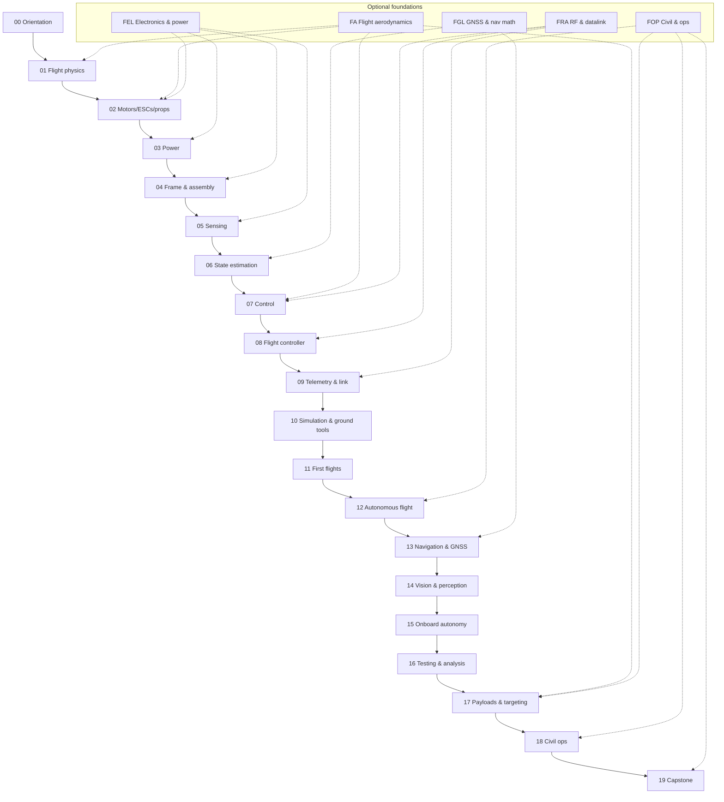

# Course map

The whole course on one page: the roadmap, which optional foundations feed each stage, what
hardware each stage needs, and — at the bottom — every lesson with its prerequisites.
For the lesson-level dependency graphs see [curriculum/dependency-graph.md](curriculum/dependency-graph.md).

## The roadmap

```text
  Software engineering (you already have it: C#/.NET, Python, JS, SQL, Docker)
  Robotics course (done: ROS 2, frames, sensors, control, localization, SLAM, CV, ML)
       │
       ├──── FA Flight aerodynamics & physics (8) ────┐
       ├──── FEL Drone electronics & power (9) ───────┤
       ├──── FGL GNSS & navigation math (7) ──────────┤   take only what a lesson
       ├──── FRA RF & datalink (8) ───────────────────┤   points you to
       ├──── FOP Civil & ops fundamentals (7) ─────┘
       │
       ▼
  00 Orientation — what a UAV is, the outcomes, Hermon, the stack, safety, the tooling
       ▼
  01 Flight physics & aerodynamics ◀── FA
       ▼
  02 Motors, ESCs & props ◀── FEL, FA          [STAGE 1 hardware: order here]
       ▼
  03 Power system ◀── FEL
       ▼
  04 Frame & assembly ◀── (the build, 04.10)
       ▼
  05 Sensing ◀── FEL
       ▼
  06 State estimation ◀── FGL
       ▼
  07 Control ◀── FA, FRA
       ▼
  08 Flight controller (ArduPilot) ◀── FRA
       ▼
  09 Telemetry & the data link ◀── FRA
       ▼
  10 Simulation & ground tools (SITL, QGC, uavlog)
       ▼
  11 First flights & manual piloting ◀── (the first hover, P01)
       ▼
  12 Autonomous flight & mission planning ◀── FOP
       ▼
  13 Navigation & GNSS ◀── FGL
       ▼
  14 Vision & perception ◀── (robotics 13/16 machinery)
       ▼
  15 Onboard autonomy (ROS 2, MAVROS, offboard) ◀── (robotics 04/08/12 machinery)
       ▼
  16 Flight data analysis & testing
       ▼
  17 Payloads, water irrigation & targeting ◀── FA
       ▼
  18 Civil & public-safety operations ◀── FOP
       ▼
  19 CAPSTONE — Hermon's Mission (10 clean missions + evidence pack)
```



The main path is drawn in order, but the real dependency graph is finer-grained: for example
**13 Navigation & GNSS** only needs 05 for its first lessons, and **14 Vision** can start in
parallel with 12 as soon as 05.01 is done. `python course.py next` always follows the real graph.

## Phases, hardware stages and milestones

| Phase | Modules | Hardware stage | You can… | Projects |
|---|---|---|---|---|
| **A. Understand** | 00–01 | none (laptop) | explain the loop, the physics, the spec, the stack; pass the safety mindset | — |
| **B. Build it** | 02–05 | Stage 1: frame, motors, ESC, FC, GPS, link, 6S LiPo | build Hermon from a parts list; measure thrust, mass, power; calibrate the sensors | P01–P03 |
| **C. Fly it (manual)** | 06–11 | Stage 1 | estimate state, tune the loops, fly ArduPilot in SITL; first hover, maneuvers, wind, emergencies | P04, P05 |
| **D. Fly it (autonomous)** | 12–15 | Stage 2: Pi 5, gimbal camera, thermal, rangefinder | waypoint missions, RTL, precision landing, GNSS-denied, ROS 2 offboard, vision | P06–P10 |
| **E. Prove it** | 16 | Stage 1–2 | run the test matrix, read the logs, write the safety case | P11 |
| **F. Operate it** | 17–18 | Stage 4: release pod, triggers, rangefinder | select and release the payload, plan the OPORD, run the comms | — |
| **G. Capstone** | 19 | Stage 4–5: pod + IR beacon pad | 10 clean autonomous missions: recon → detect → release → precision RTL | P12 |

## Paths through the course

| If you… | Do this |
|---|---|
| did the full robotics course | Follow `python course.py next`; take the foundations tracks just-in-time (they are optional, and most are the *delta* the robotics course didn't teach). |
| are strong in math/physics | Skip the FA/FGL lessons with `course.py skip` + the skip statement; do FEL.03–05 and FRA.02/08 anyway (no robotics equivalent). |
| want to fly early | The sim-only window is 94 h (modules 00, 01, 06, 07, 08, 10). Order Stage 1 when you start 02; the parts arrive around module 10. |
| have no hardware yet | Modules 00, 01, 06, 07, 08 and 10 run on a laptop. See the stage breakdown in [HARDWARE.md](HARDWARE.md). |
| are aiming at the FAA job | Do all of FOP (7 lessons), plus 18 in full — the OPORD, the legal path and the qualification are the operator's language. |

## Time

Totals are generated below. Realistically, at 6–20 focused hours per week the main path and
projects take about 17 weeks to a year; the course is designed so that each lesson is one
sitting and every module ends in something that works (or a measured reason it doesn't yet).

<!-- lessons:start -->
<!-- generated by tools/build.py -->

## Main path — every lesson

### 00 · Orientation — what a UAV actually is

The vocabulary and the mental map of the whole UAV stack, the Hermon plan, and how to study this course with an AI teacher. *(7 lessons, ≈ 4 h 30 min)*

| Id | Lesson | Level | Time | Needs | Hardware |
|---|---|---|---|---|---|
| 00.01 | [What is a UAV? The sense–decide–act loop in the air](00-orientation/00.01-what-is-a-uav.md) | beginner | 30 min | — | — |
| 00.02 | [Where this course takes you: build it, fly it, operate it](00-orientation/00.02-course-outcomes.md) | beginner | 30 min | 00.01 | — |
| 00.03 | [Hermon: our build vehicle (spec and why a quad)](00-orientation/00.03-hermon-the-build-vehicle.md) | beginner | 45 min | 00.02 | — |
| 00.04 | [The stack: from physics to payload](00-orientation/00.04-the-uav-stack.md) | beginner | 45 min | 00.03 | — |
| 00.05 | [Relationship to the robotics course: assumed vs taught](00-orientation/00.05-relationship-robotics-course.md) | beginner | 30 min | 00.04 | — |
| 00.06 | [Safety mindset: flying is different](00-orientation/00.06-safety-mindset.md) | beginner | 45 min | 00.05 | — |
| 00.07 | [How to use this course (course.py, statuses, skip rules)](00-orientation/00.07-how-to-use-course.md) | beginner | 45 min | 00.06 | — |

### 01 · Flight physics & aerodynamics

The four forces, tilt-to-translate, drag, propeller pumping, hover efficiency, stability, wind and the energy math — everything the later control and endurance lessons stand on. *(12 lessons, ≈ 12 h)*

| Id | Lesson | Level | Time | Needs | Hardware |
|---|---|---|---|---|---|
| 01.01 | [The four forces on a hovering quad](01-flight-physics/01.01-four-forces-on-a-quad.md) | beginner | 1 h | 00.01 | — |
| 01.02 | [Newton & torque: why a quad needs four motors](01-flight-physics/01.02-newton-torque-quad.md) | beginner | 1 h | 01.01 | — |
| 01.03 | [Thrust, weight and the thrust-to-weight ratio](01-flight-physics/01.03-thrust-to-weight.md) | beginner | 45 min | 01.02 | — |
| 01.04 | [Tilt to translate: from hover to motion](01-flight-physics/01.04-tilt-to-translate.md) | intermediate | 1 h | 01.02 | — |
| 01.05 | [Drag: where your battery goes](01-flight-physics/01.05-drag.md) | intermediate | 1 h | 01.04 | — |
| 01.06 | [Propellers as pumps: momentum theory and induced velocity](01-flight-physics/01.06-momentum-theory.md) | intermediate | 1 h 15 min | 01.03 | — |
| 01.07 | [Hover efficiency and disk loading](01-flight-physics/01.07-hover-efficiency.md) | intermediate | 1 h | 01.06 | — |
| 01.08 | [Stability: why a quad wants to fall (and how it doesn't)](01-flight-physics/01.08-stability.md) | intermediate | 1 h | 01.02, 01.04 | — |
| 01.09 | [Attitude & orientation: frames, Euler angles, quaternions (light)](01-flight-physics/01.09-attitude-orientation.md) | intermediate | 1 h | 01.02 | — |
| 01.10 | [Wind: the world moves around you](01-flight-physics/01.10-wind.md) | intermediate | 1 h | 01.04, 01.05 | — |
| 01.11 | [Ground effect and ceiling effect](01-flight-physics/01.11-ground-effect.md) | intermediate | 45 min | 01.06 | — |
| 01.12 | [Payload, range and endurance: the energy math](01-flight-physics/01.12-endurance-math.md) | intermediate | 1 h 15 min | 01.05, 01.07 | — |

### 02 · Motors, ESCs & props

The 3-phase BLDC, KV and torque curves, ESC firmware (DShot), prop sizing and matching, a static thrust test rig, efficiency, heat and vibration — ending with the design decision for Hermon's powertrain. *(11 lessons, ≈ 11 h)*

| Id | Lesson | Level | Time | Needs | Hardware |
|---|---|---|---|---|---|
| 02.01 | [Brushless motors: how a 3-phase BLDC spins](02-motors-escs-props/02.01-bldc-motors.md) | intermediate | 1 h | 01.03 | — |
| 02.02 | [KV, torque and the motor curve](02-motors-escs-props/02.02-kv-torque-curve.md) | intermediate | 1 h | 02.01 | — |
| 02.03 | [ESCs: from a 2.5 V signal to 3-phase power](02-motors-escs-props/02.03-esc-basics.md) | intermediate | 1 h | 02.01 | — |
| 02.04 | [ESC firmware: BLHeli_32, AM32, Bluejay and DShot](02-motors-escs-props/02.04-esc-firmware.md) | intermediate | 1 h | 02.03 | — |
| 02.05 | [Propellers: size, pitch, blade count](02-motors-escs-props/02.05-propellers.md) | beginner | 45 min | 02.02 | — |
| 02.06 | [Prop–motor matching: reading the thrust curve](02-motors-escs-props/02.06-prop-motor-matching.md) | intermediate | 1 h | 02.02, 02.05 | — |
| 02.07 | [Static thrust test: build a rig and measure your own pair](02-motors-escs-props/02.07-static-thrust-test.md) | intermediate | 1 h 15 min | 02.06 | stage1 |
| 02.08 | [Efficiency: from watts to sky](02-motors-escs-props/02.08-efficiency-watts-to-sky.md) | intermediate | 1 h | 02.07 | stage1 |
| 02.09 | [Heat, vibration and mechanical noise](02-motors-escs-props/02.09-heat-vibration-noise.md) | intermediate | 45 min | 02.07 | stage1 |
| 02.10 | [ESC tuning: timing, notches, DShot values](02-motors-escs-props/02.10-esc-tuning.md) | advanced | 1 h | 02.04, 02.09 | stage1 |
| 02.11 | [Selecting the motor–ESC–prop trio for Hermon (design exercise)](02-motors-escs-props/02.11-hermon-powertrain-design.md) | advanced | 1 h 15 min | 02.06, 02.08, 02.10 | stage1 |

### 03 · Power & energy

LiPo chemistry, pack configuration, C-rating and voltage sag, power distribution, the power budget, monitoring, charging and storage, battery safety, endurance prediction, and buying batteries in the US. *(10 lessons, ≈ 9 h 45 min)*

| Id | Lesson | Level | Time | Needs | Hardware |
|---|---|---|---|---|---|
| 03.01 | [LiPo chemistry in 60 minutes (what the numbers mean)](03-power-system/03.01-lipo-chemistry.md) | intermediate | 1 h | 02.02 | — |
| 03.02 | [Pack configuration: 4S vs 6S, cells, wiring](03-power-system/03.02-pack-configuration.md) | intermediate | 1 h | 03.01 | — |
| 03.03 | [C-rating, current and voltage sag](03-power-system/03.03-c-rating-voltage-sag.md) | intermediate | 1 h | 03.01, 03.02 | — |
| 03.04 | [Power distribution: PDB, BEC, UBEC, fuses](03-power-system/03.04-power-distribution.md) | intermediate | 1 h | 02.03 | — |
| 03.05 | [The power budget: sizing Hermon's power (exercise)](03-power-system/03.05-power-budget.md) | advanced | 1 h 15 min | 03.03, 02.02 | — |
| 03.06 | [Battery monitoring: voltage, current, mAh](03-power-system/03.06-battery-monitoring.md) | intermediate | 1 h | 03.04 | stage1 |
| 03.07 | [Charging, balancing and storage](03-power-system/03.07-charging-balancing-storage.md) | intermediate | 45 min | 03.02 | stage1 |
| 03.08 | [Battery safety (a LiPo is a fuel tank)](03-power-system/03.08-battery-safety.md) | intermediate | 45 min | 03.07 | stage1 |
| 03.09 | [Endurance prediction: from power budget to flight time](03-power-system/03.09-endurance-prediction.md) | advanced | 1 h 15 min | 03.05, 03.06 | stage1 |
| 03.10 | [LiPo in Israel: buying, importing, storing, transporting](03-power-system/03.10-lipo-in-israel.md) | intermediate | 45 min | 03.08 | stage1 |

### 04 · Frame & assembly

Frame materials and topology, the mass and centre-of-mass budget, the wiring harness, vibration isolation and the payload bay, the full documented Hermon build, and the pre-flight discipline that keeps it airworthy. *(6 lessons, ≈ 10 h)*

| Id | Lesson | Level | Time | Needs | Hardware |
|---|---|---|---|---|---|
| 04.01 | [Frames: materials, sizes, topology](04-frame-and-assembly/04.01-frames.md) | intermediate | 1 h | 02.11 | stage1 |
| 04.02 | [The mass budget and the centre of mass](04-frame-and-assembly/04.02-mass-and-center-of-mass.md) | intermediate | 1 h 15 min | 04.01, 01.02 | stage1 |
| 04.03 | [The wiring harness: gauge, length, connectors, routing](04-frame-and-assembly/04.03-wiring-harness.md) | intermediate | 1 h 30 min | 03.04, 04.02 | stage1 |
| 04.04 | [Mounting, vibration isolation and the payload bay](04-frame-and-assembly/04.04-mounting-and-vibration.md) | intermediate | 1 h 15 min | 04.03, 02.09 | stage1 |
| 04.05 | [Building Hermon: the full assembly (practical)](04-frame-and-assembly/04.05-building-hermon.md) | intermediate | 4 h | 04.04, 03.07 | stage1 |
| 04.06 | [Pre-flight inspection, prop safety and airworthiness](04-frame-and-assembly/04.06-preflight-and-airworthiness.md) | intermediate | 1 h | 04.05 | stage1 |

### 05 · Sensors for UAVs

What each sensor buys you, how gyros, accelerometers, magnetometers, barometers, GNSS receivers, optical flow and rangefinders actually work, and the noise, bias, drift, mounting and calibration that decide whether the flight controller can trust them. *(6 lessons, ≈ 7 h 30 min)*

| Id | Lesson | Level | Time | Needs | Hardware |
|---|---|---|---|---|---|
| 05.01 | [Sensor roles: what each one buys you](05-sensors/05.01-sensor-roles.md) | beginner | 45 min | 04.06 | — |
| 05.02 | [The IMU: gyroscopes and accelerometers](05-sensors/05.02-imu.md) | intermediate | 1 h 30 min | 05.01, 01.09 | stage1 |
| 05.03 | [The magnetometer and the barometer](05-sensors/05.03-compass-and-baro.md) | intermediate | 1 h 15 min | 05.02 | stage1 |
| 05.04 | [The GNSS receiver on a drone: fix types, HDOP, and what the FC does with it](05-sensors/05.04-gnss-receiver.md) | intermediate | 1 h 15 min | 05.03 | stage1 |
| 05.05 | [Optical flow and rangefinders](05-sensors/05.05-flow-and-rangefinders.md) | intermediate | 1 h 15 min | 05.04 | stage2 |
| 05.06 | [Noise, bias, drift — and the calibration procedures that fix them](05-sensors/05.06-noise-bias-and-calibration.md) | intermediate | 1 h 30 min | 05.05, 04.04 | stage1 |

### 06 · State estimation

Why the state is never measured directly, how a complementary filter and then a Kalman filter fuse what you do measure, how ArduPilot's EKF3 does it in production, and how to tell from a log whether the estimator is healthy. *(6 lessons, ≈ 9 h 15 min)*

| Id | Lesson | Level | Time | Needs | Hardware |
|---|---|---|---|---|---|
| 06.01 | [Why estimation: the state is never measured directly](06-state-estimation/06.01-why-estimation.md) | intermediate | 1 h | 05.06 | — |
| 06.02 | [The complementary filter: your first fusion](06-state-estimation/06.02-complementary-filter.md) | intermediate | 1 h 15 min | 06.01 | — |
| 06.03 | [The Kalman filter from first principles](06-state-estimation/06.03-kalman-from-scratch.md) | advanced | 2 h | 06.02 | — |
| 06.04 | [The extended Kalman filter: when the world is nonlinear](06-state-estimation/06.04-ekf-nonlinear.md) | advanced | 1 h 45 min | 06.03, 01.09 | — |
| 06.05 | [ArduPilot's EKF3: the production estimator](06-state-estimation/06.05-ekf3-in-ardupilot.md) | advanced | 1 h 45 min | 06.04, 05.06 | — |
| 06.06 | [EKF health: innovations, variances, and reading it from a log](06-state-estimation/06.06-ekf-health-and-logs.md) | advanced | 1 h 30 min | 06.05 | — |

### 07 · Control for flight

The cascaded rate–attitude–velocity–position loops that fly a multicopter, how four commands become four motor outputs, why filtering decides how hard you can push the D term, and how to tune Hermon methodically instead of by feel. *(7 lessons, ≈ 11 h)*

| Id | Lesson | Level | Time | Needs | Hardware |
|---|---|---|---|---|---|
| 07.01 | [PID, but this time it has to fly](07-control/07.01-pid-for-flight.md) | intermediate | 1 h 15 min | 06.06 | — |
| 07.02 | [The cascade: rate → attitude → velocity → position](07-control/07.02-cascaded-loops.md) | intermediate | 1 h 30 min | 07.01 | — |
| 07.03 | [Rate loops: the innermost and the most important](07-control/07.03-rate-loops.md) | advanced | 1 h 45 min | 07.02 | — |
| 07.04 | [Attitude loops: holding an angle](07-control/07.04-attitude-loops.md) | advanced | 1 h 30 min | 07.03 | — |
| 07.05 | [Velocity and position loops — and flight modes as control configuration](07-control/07.05-velocity-position-and-modes.md) | advanced | 1 h 30 min | 07.04 | — |
| 07.06 | [Control allocation: four commands, four motors](07-control/07.06-mixing-and-allocation.md) | advanced | 1 h 30 min | 07.02, 02.11 | — |
| 07.07 | [Filtering, notches and the methodic tuning procedure](07-control/07.07-filtering-and-methodic-tuning.md) | advanced | 2 h | 07.03, 07.06, 02.09 | stage1 |

### 08 · The flight-controller platform

The autopilot landscape, what is actually inside a flight-controller board, choosing and flashing Hermon's, the MAVLink protocol, the ground stations, and the full data path from a sensor sample to a motor command. *(7 lessons, ≈ 9 h)*

| Id | Lesson | Level | Time | Needs | Hardware |
|---|---|---|---|---|---|
| 08.01 | [The autopilot world: ArduPilot, PX4, Betaflight, iNav](08-flight-controller/08.01-autopilot-landscape.md) | intermediate | 1 h | 07.07 | — |
| 08.02 | [Inside a flight controller: MCU, IMUs, baro, UARTs, power](08-flight-controller/08.02-board-anatomy.md) | intermediate | 1 h 15 min | 08.01 | stage1 |
| 08.03 | [Choosing Hermon's flight controller (purchase decision)](08-flight-controller/08.03-choosing-hermons-fc.md) | intermediate | 1 h 15 min | 08.02 | stage1 |
| 08.04 | [Flashing firmware and the parameter system](08-flight-controller/08.04-firmware-and-parameters.md) | intermediate | 1 h 30 min | 08.03 | stage1 |
| 08.05 | [MAVLink: the protocol of drones](08-flight-controller/08.05-mavlink.md) | intermediate | 1 h 30 min | 08.04 | — |
| 08.06 | [Ground stations: QGroundControl and Mission Planner](08-flight-controller/08.06-ground-stations.md) | beginner | 1 h | 08.05 | stage1 |
| 08.07 | [Logging, and the full path from sensor sample to motor command](08-flight-controller/08.07-logging-and-the-data-path.md) | advanced | 1 h 30 min | 08.06, 07.06 | — |

### 09 · Telemetry & datalink

Link budgets in real units, the ExpressLRS control link, what happens when the link drops, MAVLink telemetry constrained to the 917-920 MHz window that is licence-exempt in Israel, and the spectrum rules on both sides of the course. *(5 lessons, ≈ 7 h)*

| Id | Lesson | Level | Time | Needs | Hardware |
|---|---|---|---|---|---|
| 09.01 | [RF and link budgets, in 90 minutes](09-telemetry-datalink/09.01-rf-and-link-budget.md) | intermediate | 1 h 30 min | 08.07 | — |
| 09.02 | [The control link: ExpressLRS 2.4 GHz](09-telemetry-datalink/09.02-control-link-elrs.md) | intermediate | 1 h 30 min | 09.01 | stage1 |
| 09.03 | [Failsafe: what happens when the link drops](09-telemetry-datalink/09.03-failsafe-when-the-link-drops.md) | intermediate | 1 h 15 min | 09.02 | stage1 |
| 09.04 | [MAVLink telemetry on 917-920 MHz (and the antennas that make it work)](09-telemetry-datalink/09.04-telemetry-917.md) | intermediate | 1 h 30 min | 09.03 | stage1 |
| 09.05 | [Spectrum and regulation: what you may transmit, in Israel and under Part 107](09-telemetry-datalink/09.05-spectrum-and-regulation.md) | intermediate | 1 h 15 min | 09.04 | — |

### 10 · Simulation

A quadcopter simulator you write yourself, the sensor noise and wind that make it honest, ArduPilot's SITL with the real firmware in the loop, Gazebo for the world around it, and the regression matrix that runs while you sleep. *(5 lessons, ≈ 8 h 45 min)*

| Id | Lesson | Level | Time | Needs | Hardware |
|---|---|---|---|---|---|
| 10.01 | [Why simulate: the cost of a crash](10-simulation/10.01-why-simulate.md) | beginner | 45 min | 07.07 | — |
| 10.02 | [A 6-DoF quadcopter simulator in Python](10-simulation/10.02-quad-sim-in-python.md) | advanced | 2 h 30 min | 10.01, 01.06, 07.06 | — |
| 10.03 | [Sensor noise, wind and gusts in simulation](10-simulation/10.03-sensor-noise-and-wind.md) | advanced | 1 h 30 min | 10.02, 05.06, 01.10 | — |
| 10.04 | [ArduPilot SITL: the real firmware in a process](10-simulation/10.04-ardupilot-sitl.md) | intermediate | 2 h | 10.01, 08.05 | — |
| 10.05 | [Gazebo, sim-to-real, and a regression matrix that runs overnight](10-simulation/10.05-gazebo-and-regression-ci.md) | advanced | 2 h | 10.04, 10.03 | — |

### 11 · First flights & manual piloting

The first power-up-to-hover sequence, the manual modes, the basic manoeuvres, flying in wind, battery discipline in the air, and the emergency procedures you rehearse before you need them. *(6 lessons, ≈ 10 h)*

| Id | Lesson | Level | Time | Needs | Hardware |
|---|---|---|---|---|---|
| 11.01 | [The first flight: props off → motors up → hover](11-first-flights/11.01-first-flight.md) | intermediate | 2 h | 04.06, 08.06, 09.03, 10.04 | stage1 |
| 11.02 | [Manual modes: rates versus angles](11-first-flights/11.02-manual-modes.md) | intermediate | 1 h 30 min | 11.01, 07.05 | stage1 |
| 11.03 | [Basic manoeuvres: takeoff, hover, box, turn, land](11-first-flights/11.03-basic-maneuvers.md) | intermediate | 2 h | 11.02 | stage1 |
| 11.04 | [Flying in wind](11-first-flights/11.04-flying-in-wind.md) | advanced | 1 h 30 min | 11.03, 01.10 | stage1 |
| 11.05 | [Battery discipline in the air](11-first-flights/11.05-battery-discipline.md) | intermediate | 1 h 15 min | 11.03, 03.06 | stage1 |
| 11.06 | [Emergencies, precision landings, and the pilot's logbook](11-first-flights/11.06-emergencies-and-the-logbook.md) | advanced | 1 h 45 min | 11.04, 11.05 | stage1 |

### 12 · Autonomous flight & mission planning

Missions as lists of waypoints, planning them in a ground station, the geofence and RTL logic that contain them, automatic takeoff and precision landing, and writing your own mission logic in Python. *(6 lessons, ≈ 9 h 15 min)*

| Id | Lesson | Level | Time | Needs | Hardware |
|---|---|---|---|---|---|
| 12.01 | [Waypoints: the mission as a list of commands](12-autonomous-flight/12.01-waypoints.md) | intermediate | 1 h 15 min | 11.06 | — |
| 12.02 | [Planning a real mission in a ground station](12-autonomous-flight/12.02-mission-planning.md) | intermediate | 1 h 30 min | 12.01 | stage1 |
| 12.03 | [Geofence: making the aircraft refuse](12-autonomous-flight/12.03-geofence.md) | intermediate | 1 h 15 min | 12.02 | stage1 |
| 12.04 | [RTL and the failsafe decision tree](12-autonomous-flight/12.04-rtl-and-the-failsafe-tree.md) | advanced | 1 h 30 min | 12.03, 09.03, 11.05 | stage1 |
| 12.05 | [Auto takeoff, auto land, and precision landing](12-autonomous-flight/12.05-auto-takeoff-land-precision.md) | advanced | 1 h 45 min | 12.04 | stage1, stage5 |
| 12.06 | [Writing your own mission logic in Python](12-autonomous-flight/12.06-missions-from-python.md) | advanced | 2 h | 12.05, 08.05 | — |

### 13 · Navigation & GNSS

How satellite positioning actually works, where its errors come from, what RTK and PPK buy you, the coordinate systems an operator must not confuse, and what to do when the signal is degraded, denied or spoofed. *(5 lessons, ≈ 7 h)*

| Id | Lesson | Level | Time | Needs | Hardware |
|---|---|---|---|---|---|
| 13.01 | [From GPS to GNSS: constellations, trilateration and time](13-navigation-gnss/13.01-gnss-fundamentals.md) | intermediate | 1 h 30 min | 12.06, 05.04 | — |
| 13.02 | [GNSS error sources: ionosphere, multipath, geometry](13-navigation-gnss/13.02-error-sources.md) | intermediate | 1 h 15 min | 13.01 | — |
| 13.03 | [RTK and PPK: the centimetre world](13-navigation-gnss/13.03-rtk-and-ppk.md) | advanced | 1 h 30 min | 13.02 | stage3 |
| 13.04 | [Coordinates for operators: WGS84, UTM, ENU — and EGNOS](13-navigation-gnss/13.04-coordinates-for-operators.md) | intermediate | 1 h 15 min | 13.02 | — |
| 13.05 | [Degraded, denied and spoofed: flying when GNSS lies](13-navigation-gnss/13.05-degraded-denied-and-spoofed.md) | advanced | 1 h 30 min | 13.04, 05.05 | stage2 |

### 14 · Vision & perception

Choosing and calibrating a camera that flies, stabilising it, detecting and tracking objects in the air, turning a pixel into a ground coordinate, and fitting the whole pipeline into a latency budget on the compute you can carry. *(6 lessons, ≈ 9 h 15 min)*

| Id | Lesson | Level | Time | Needs | Hardware |
|---|---|---|---|---|---|
| 14.01 | [Cameras for UAVs: sensor, lens, shutter, mount](14-vision-perception/14.01-cameras-for-uavs.md) | intermediate | 1 h 15 min | 13.05 | stage2 |
| 14.02 | [Camera calibration in the field](14-vision-perception/14.02-field-calibration.md) | intermediate | 1 h 30 min | 14.01 | stage2 |
| 14.03 | [Gimbals, vibration and motion blur](14-vision-perception/14.03-gimbals-and-stabilisation.md) | intermediate | 1 h 15 min | 14.02, 04.04 | stage2 |
| 14.04 | [Detection in the air: YOLO on a moving platform](14-vision-perception/14.04-detection-in-the-air.md) | advanced | 2 h | 14.02 | stage2 |
| 14.05 | [From detection to a track, and from a pixel to a ground coordinate](14-vision-perception/14.05-tracking-and-geolocation.md) | advanced | 1 h 45 min | 14.04, 13.04 | stage2 |
| 14.06 | [Thermal, depth, edge compute and the latency budget](14-vision-perception/14.06-edge-compute-and-latency.md) | advanced | 1 h 30 min | 14.05 | stage2 |

### 15 · Onboard autonomy

Putting a companion computer next to the flight controller, bridging MAVLink into ROS 2, commanding the aircraft from your own code, expressing a mission as a behaviour tree, and making the whole thing start itself and fail safely. *(6 lessons, ≈ 10 h 15 min)*

| Id | Lesson | Level | Time | Needs | Hardware |
|---|---|---|---|---|---|
| 15.01 | [The architecture: flight controller plus companion computer](15-onboard-autonomy/15.01-companion-architecture.md) | advanced | 1 h 30 min | 14.06, 08.07 | stage2 |
| 15.02 | [ROS 2 for Hermon (delta from the robotics course)](15-onboard-autonomy/15.02-ros2-for-hermon.md) | advanced | 1 h 30 min | 15.01 | stage2 |
| 15.03 | [Bridging MAVLink and ROS 2](15-onboard-autonomy/15.03-mavlink-ros-bridge.md) | advanced | 1 h 45 min | 15.02, 08.05 | stage2 |
| 15.04 | [Offboard control: commanding attitude, velocity and position](15-onboard-autonomy/15.04-offboard-control.md) | advanced | 1 h 45 min | 15.03, 07.05 | stage2 |
| 15.05 | [Mission logic: behaviour trees, state machines and watchdogs](15-onboard-autonomy/15.05-behaviour-trees-and-watchdogs.md) | advanced | 1 h 45 min | 15.04, 12.06 | — |
| 15.06 | [Deployment, and the first computer-piloted flight](15-onboard-autonomy/15.06-deployment-and-first-autonomous-flight.md) | advanced | 2 h | 15.05 | stage2 |

### 16 · Flight-test & data analysis

Testing a machine that cannot be paused, building a test matrix, reading flight logs as your primary instrument, injecting failures on purpose, and assembling the evidence that says Hermon is airworthy. *(5 lessons, ≈ 7 h 45 min)*

| Id | Lesson | Level | Time | Needs | Hardware |
|---|---|---|---|---|---|
| 16.01 | [Testing a flying machine: why it is different](16-testing-analysis/16.01-testing-a-flying-machine.md) | intermediate | 1 h | 15.06, 11.06 | — |
| 16.02 | [Test matrices: parameters, environments, failures](16-testing-analysis/16.02-test-matrices.md) | intermediate | 1 h 15 min | 16.01 | — |
| 16.03 | [Reading flight logs: a methodology](16-testing-analysis/16.03-reading-flight-logs.md) | advanced | 2 h | 16.02, 08.07, 06.06 | — |
| 16.04 | [Failure injection, and regression tests in SITL](16-testing-analysis/16.04-failure-injection-and-ci.md) | advanced | 1 h 45 min | 16.03, 10.05 | — |
| 16.05 | [Field protocols and Hermon's safety case](16-testing-analysis/16.05-field-protocols-and-the-safety-case.md) | advanced | 1 h 45 min | 16.04 | stage1 |

### 17 · Payloads & delivery

What hanging 250 g under an aircraft does to it, release mechanisms you design and build, spray and irrigation payloads, the flight-dynamics upset when the mass leaves, the ballistics of getting it onto a spot, and the Hermon pod build. *(6 lessons, ≈ 10 h 30 min)*

| Id | Lesson | Level | Time | Needs | Hardware |
|---|---|---|---|---|---|
| 17.01 | [The payload problem: mass, centre of mass, and what it costs you](17-payloads-delivery/17.01-payload-mass-and-com.md) | intermediate | 1 h 15 min | 16.05, 04.02 | stage4 |
| 17.02 | [Release mechanisms: servo, magnet, pin](17-payloads-delivery/17.02-release-mechanisms.md) | intermediate | 1 h 30 min | 17.01 | stage4 |
| 17.03 | [Spray and irrigation payloads: pumps, nozzles, and a moving centre of mass](17-payloads-delivery/17.03-spray-and-irrigation.md) | intermediate | 1 h 30 min | 17.01 | stage4 |
| 17.04 | [Release dynamics: the upset when the mass leaves](17-payloads-delivery/17.04-release-dynamics.md) | advanced | 1 h 30 min | 17.02, 07.04 | stage4 |
| 17.05 | [Drop-point maths: ballistics, wind and the release cue](17-payloads-delivery/17.05-drop-point-math.md) | advanced | 1 h 45 min | 17.04, 01.10, 14.05 | stage4 |
| 17.06 | [Building Hermon's delivery pod (practical)](17-payloads-delivery/17.06-building-hermons-pod.md) | advanced | 3 h | 17.05, 17.03 | stage4 |

### 18 · Civil & public-safety operations

What civil drone work actually is, what the operator does all day, how a mission is planned and briefed, how airspace works in practice, the FAA Part 107 path to a certificate, and how a fleet is kept flying. *(6 lessons, ≈ 8 h 30 min)*

| Id | Lesson | Level | Time | Needs | Hardware |
|---|---|---|---|---|---|
| 18.01 | [The civil missions: survey, inspection, delivery, monitoring, search](18-civil-ops/18.01-uav-missions.md) | beginner | 1 h | 12.06 | — |
| 18.02 | [The operator's job: a day in the life](18-civil-ops/18.02-the-operators-job.md) | beginner | 1 h | 18.01 | — |
| 18.03 | [The mission-planning process: tasking, risk, brief, debrief](18-civil-ops/18.03-mission-planning-process.md) | intermediate | 1 h 30 min | 18.02, 16.05 | — |
| 18.04 | [Airspace in practice: classes, charts, NOTAMs, authorisations](18-civil-ops/18.04-airspace-in-operations.md) | intermediate | 1 h 30 min | 18.03 | — |
| 18.05 | [FAA Part 107: the certificate, the rules, the waivers](18-civil-ops/18.05-part-107-and-the-legal-path.md) | intermediate | 2 h | 18.04 | — |
| 18.06 | [Maintenance, currency, and your own qualification](18-civil-ops/18.06-maintenance-and-qualification.md) | intermediate | 1 h 30 min | 18.05 | stage1 |

### 19 · Capstone — Hermon's mission

One full autonomous mission, flown ten times cleanly, with evidence: take off, survey a field, detect the target, deliver the payload on it, and return to a precision landing. *(5 lessons, ≈ 10 h 30 min)*

| Id | Lesson | Level | Time | Needs | Hardware |
|---|---|---|---|---|---|
| 19.01 | [The brief: Hermon's full tasking](19-capstone-hermon-mission/19.01-the-brief.md) | advanced | 1 h 30 min | 17.06, 18.06, 15.06 | stage1, stage2, stage4, stage5 |
| 19.02 | [Phase 1: pre-flight, site setup and launch](19-capstone-hermon-mission/19.02-phase-1-preflight-and-launch.md) | advanced | 2 h | 19.01 | stage1, stage2, stage4, stage5 |
| 19.03 | [Phase 2: fly the survey, detect the target](19-capstone-hermon-mission/19.03-phase-2-survey-and-detect.md) | advanced | 2 h | 19.02 | stage2 |
| 19.04 | [Phase 3: deliver the payload, then a precision return](19-capstone-hermon-mission/19.04-phase-3-delivery-and-precision-rtl.md) | advanced | 2 h | 19.03, 17.06, 12.05 | stage4, stage5 |
| 19.05 | [The campaign, the report, and the debrief](19-capstone-hermon-mission/19.05-the-campaign-and-the-report.md) | advanced | 3 h | 19.04, 16.05 | stage1, stage2, stage4, stage5 |

## Optional foundations — every lesson

### FA · Flight aerodynamics & physics (FA)

The physics a flying machine needs, from zero: vectors and forces, Newton's laws in flight, work, energy and power, and the wind, trajectory and unit maths that the flight lessons assume. *(4 lessons, ≈ 4 h)*

| Id | Lesson | Level | Time | Needs | Hardware |
|---|---|---|---|---|---|
| FA.01 | [Vectors and forces from zero](optional-foundations/flight-aerodynamics/FA.01-vectors-forces-zero.md) | beginner | 1 h | — | — |
| FA.02 | [Newton's laws in flight](optional-foundations/flight-aerodynamics/FA.02-newtons-laws-flight.md) | beginner | 1 h | FA.01 | — |
| FA.03 | [Work, energy and power](optional-foundations/flight-aerodynamics/FA.03-work-energy-power.md) | beginner | 1 h | FA.02 | — |
| FA.04 | [Wind vectors, trajectories and unit sanity](optional-foundations/flight-aerodynamics/FA.04-wind-trajectories-and-units.md) | beginner | 1 h | FA.03 | — |

### FEL · Drone electronics & power (FEL)

The electrical half of a drone from zero — voltage and current, DC power maths, lithium-polymer packs, three-phase brushless motors, and the wires, fuses and shunts that connect them. *(5 lessons, ≈ 5 h 45 min)*

| Id | Lesson | Level | Time | Needs | Hardware |
|---|---|---|---|---|---|
| FEL.01 | [Electricity for drone builders: voltage, current, resistance](optional-foundations/drone-electronics-power/FEL.01-electricity-refresher.md) | beginner | 1 h | — | — |
| FEL.02 | [DC power maths for a flying machine](optional-foundations/drone-electronics-power/FEL.02-dc-power-math.md) | beginner | 1 h | FEL.01 | — |
| FEL.03 | [Lithium-polymer packs from zero](optional-foundations/drone-electronics-power/FEL.03-lipo-deep-dive.md) | beginner | 1 h 15 min | FEL.02 | — |
| FEL.04 | [Brushless motors from zero](optional-foundations/drone-electronics-power/FEL.04-bldc-from-zero.md) | beginner | 1 h 15 min | FEL.01 | — |
| FEL.05 | [Wires, fuses, connectors and measuring power properly](optional-foundations/drone-electronics-power/FEL.05-wiring-fuses-and-measurement.md) | beginner | 1 h 15 min | FEL.02 | — |

### FGL · GNSS & navigation maths (FGL)

Where a coordinate actually points — datums and the shape of the Earth, local frames, distance and bearing on a sphere, and the geometry and error analysis behind a satellite fix. *(4 lessons, ≈ 4 h 15 min)*

| Id | Lesson | Level | Time | Needs | Hardware |
|---|---|---|---|---|---|
| FGL.01 | [Earth coordinates and datums: what a latitude really is](optional-foundations/gnss-navigation-math/FGL.01-earth-coordinates-and-datums.md) | beginner | 1 h | — | — |
| FGL.02 | [Local frames: ENU, NED, and body](optional-foundations/gnss-navigation-math/FGL.02-local-frames-enu.md) | beginner | 1 h | FGL.01 | — |
| FGL.03 | [Distance and bearing on a round Earth](optional-foundations/gnss-navigation-math/FGL.03-geodesy-distance-and-bearing.md) | beginner | 1 h | FGL.02 | — |
| FGL.04 | [Satellite geometry and error analysis](optional-foundations/gnss-navigation-math/FGL.04-satellite-geometry-and-error.md) | intermediate | 1 h 15 min | FGL.03 | — |

### FRA · RF & datalink (FRA)

Radio from zero for people who ship software — decibels and path loss, the link budget, antennas and polarisation, and the protocols and bands a drone actually uses. *(4 lessons, ≈ 3 h 45 min)*

| Id | Lesson | Level | Time | Needs | Hardware |
|---|---|---|---|---|---|
| FRA.01 | [RF in 45 minutes: frequency, wavelength, decibels](optional-foundations/rf-datalink/FRA.01-rf-in-45-minutes.md) | beginner | 45 min | — | — |
| FRA.02 | [The link budget](optional-foundations/rf-datalink/FRA.02-link-budget-math.md) | beginner | 1 h | FRA.01 | — |
| FRA.03 | [Antennas: gain, pattern, polarisation](optional-foundations/rf-datalink/FRA.03-antennas-and-polarisation.md) | beginner | 1 h | FRA.02 | — |
| FRA.04 | [Protocols and bands: SBUS, CRSF, MAVLink, and who owns the spectrum](optional-foundations/rf-datalink/FRA.04-protocols-and-bands.md) | beginner | 1 h | FRA.03 | — |

### FOP · Civil operations fundamentals (FOP)

The operational habits that separate a professional from a hobbyist — planning a mission properly, managing risk on paper before it happens in the air, and debriefing honestly afterwards. *(3 lessons, ≈ 2 h 45 min)*

| Id | Lesson | Level | Time | Needs | Hardware |
|---|---|---|---|---|---|
| FOP.01 | [The mission-planning process](optional-foundations/civil-ops/FOP.01-mission-planning-process.md) | beginner | 1 h | — | — |
| FOP.02 | [Risk management: the bowtie](optional-foundations/civil-ops/FOP.02-risk-management-bowtie.md) | beginner | 1 h | FOP.01 | — |
| FOP.03 | [The debrief: an honest after-action review](optional-foundations/civil-ops/FOP.03-debrief-and-aar.md) | beginner | 45 min | FOP.02 | — |

## Projects

| Id | Project | Level | Time | Needs | Hardware |
|---|---|---|---|---|---|
| P01 | [Project 1 — First hover](projects/P01-first-hover.md) | intermediate | 1 h 30 min | 11.03 | stage1 |
| P02 | [Project 2 — A tuned cascade, measured](projects/P02-tuned-cascade.md) | advanced | 3 h | 07.07, 11.03 | stage1 |
| P03 | [Project 3 — An overnight SITL regression harness](projects/P03-sitl-harness.md) | advanced | 3 h | 10.05 | — |
| P04 | [Project 4 — The datalink, measured](projects/P04-datalink-range.md) | intermediate | 2 h 30 min | 09.05 | stage1 |
| P05 | [Project 5 — Five clean autonomous missions](projects/P05-first-mission.md) | advanced | 3 h | 12.06 | stage1 |
| P06 | [Project 6 — Target detection from the air](projects/P06-detection-in-the-air.md) | advanced | 3 h 30 min | 14.05 | stage2 |
| P07 | [Project 7 — Offboard autonomy, end to end](projects/P07-offboard-autonomy.md) | advanced | 3 h 30 min | 15.06 | stage2 |
| P08 | [Project 8 — Hermon's mission (capstone)](projects/P08-hermons-mission.md) | advanced | 10 h | 19.05 | stage1, stage2, stage4, stage5 |

## Totals

- Main path: 133 lessons, ≈ 182 hours
- Optional foundations: 20 lessons, ≈ 20 hours (take only what you need)
- Projects: 8, ≈ 30 hours

<!-- lessons:end -->
