# Dependency graph

<!-- generated by tools/build.py from curriculum/syllabus.yaml — do not edit -->

The course is a directed acyclic graph. **Solid arrows** are hard prerequisites; **dotted arrows** are optional foundation lessons that help if the topic is new.
The same data is in [`graph.json`](graph.json) for tools and AI agents. From the command line:

```bash
python course.py why 11.07          # everything 11.07 depends on, with your status
python course.py learn quaternions  # which lesson teaches a concept, and what it needs
```

## Module-level roadmap

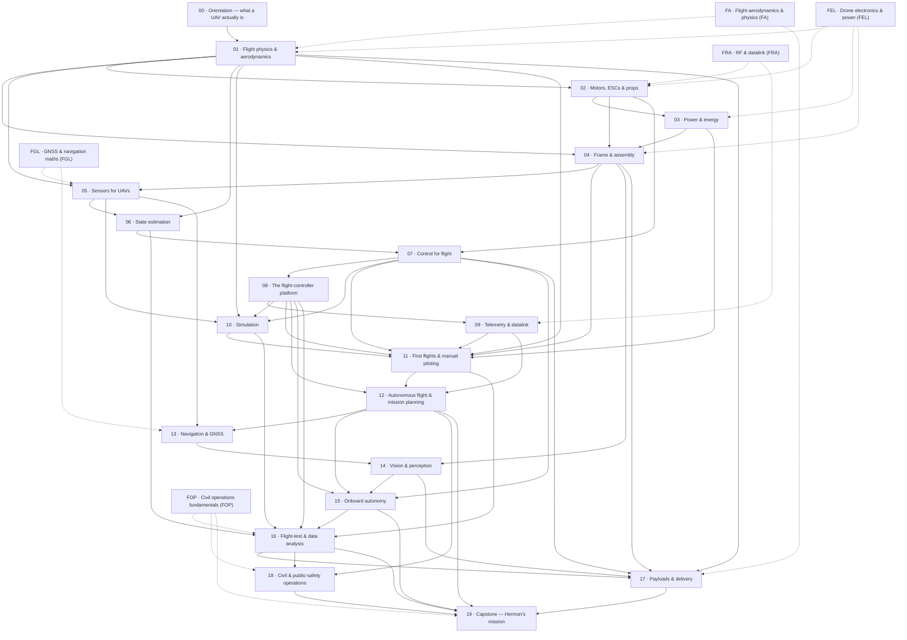

## 00 · Orientation — what a UAV actually is

```mermaid
flowchart LR
  n_00_01["00.01 What is a UAV? The sense–decide–act loop in the air"]
  n_00_02["00.02 Where this course takes you: build it, fly it, operate it"]
  n_00_03["00.03 Hermon: our build vehicle (spec and why a quad)"]
  n_00_04["00.04 The stack: from physics to payload"]
  n_00_05["00.05 Relationship to the robotics course: assumed vs taught"]
  n_00_06["00.06 Safety mindset: flying is different"]
  n_00_07["00.07 How to use this course (course.py, statuses, skip rules)"]
  n_00_01 --> n_00_02
  n_00_02 --> n_00_03
  n_00_03 --> n_00_04
  n_00_04 --> n_00_05
  n_00_05 --> n_00_06
  n_00_06 --> n_00_07
```

| Lesson | Requires | Optional | Unlocks |
|---|---|---|---|
| 00.01 What is a UAV? The sense–decide–act loop in the air | — | — | 00.02, 01.01 |
| 00.02 Where this course takes you: build it, fly it, operate it | 00.01 | — | 00.03 |
| 00.03 Hermon: our build vehicle (spec and why a quad) | 00.02 | — | 00.04 |
| 00.04 The stack: from physics to payload | 00.03 | — | 00.05 |
| 00.05 Relationship to the robotics course: assumed vs taught | 00.04 | — | 00.06 |
| 00.06 Safety mindset: flying is different | 00.05 | — | 00.07 |
| 00.07 How to use this course (course.py, statuses, skip rules) | 00.06 | — | — |

## 01 · Flight physics & aerodynamics

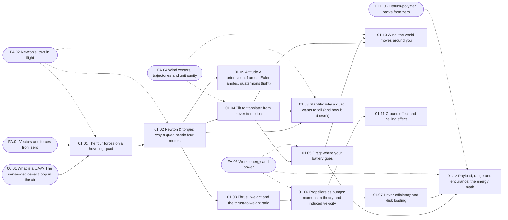

| Lesson | Requires | Optional | Unlocks |
|---|---|---|---|
| 01.01 The four forces on a hovering quad | 00.01 | FA.01, FA.02 | 01.02 |
| 01.02 Newton & torque: why a quad needs four motors | 01.01 | FA.02 | 01.03, 01.04, 01.08, 01.09, 04.02 |
| 01.03 Thrust, weight and the thrust-to-weight ratio | 01.02 | — | 01.06, 02.01 |
| 01.04 Tilt to translate: from hover to motion | 01.02 | FA.04 | 01.05, 01.08, 01.10 |
| 01.05 Drag: where your battery goes | 01.04 | FA.03 | 01.10, 01.12 |
| 01.06 Propellers as pumps: momentum theory and induced velocity | 01.03 | FA.03 | 01.07, 01.11, 10.02 |
| 01.07 Hover efficiency and disk loading | 01.06 | — | 01.12 |
| 01.08 Stability: why a quad wants to fall (and how it doesn't) | 01.02, 01.04 | FA.02 | — |
| 01.09 Attitude & orientation: frames, Euler angles, quaternions (light) | 01.02 | — | 05.02, 06.04 |
| 01.10 Wind: the world moves around you | 01.04, 01.05 | FA.04 | 10.03, 11.04, 17.05 |
| 01.11 Ground effect and ceiling effect | 01.06 | — | — |
| 01.12 Payload, range and endurance: the energy math | 01.05, 01.07 | FA.03, FEL.03 | — |

## 02 · Motors, ESCs & props

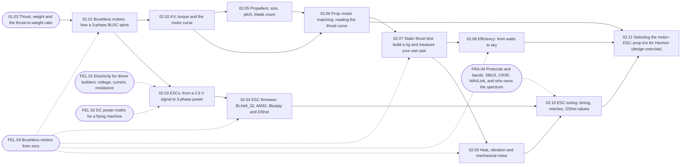

| Lesson | Requires | Optional | Unlocks |
|---|---|---|---|
| 02.01 Brushless motors: how a 3-phase BLDC spins | 01.03 | FEL.04 | 02.02, 02.03 |
| 02.02 KV, torque and the motor curve | 02.01 | — | 02.05, 02.06, 03.01, 03.05 |
| 02.03 ESCs: from a 2.5 V signal to 3-phase power | 02.01 | FEL.01, FEL.02 | 02.04, 03.04 |
| 02.04 ESC firmware: BLHeli_32, AM32, Bluejay and DShot | 02.03 | FEL.04 | 02.10 |
| 02.05 Propellers: size, pitch, blade count | 02.02 | — | 02.06 |
| 02.06 Prop–motor matching: reading the thrust curve | 02.02, 02.05 | — | 02.07, 02.11 |
| 02.07 Static thrust test: build a rig and measure your own pair | 02.06 | FEL.04 | 02.08, 02.09 |
| 02.08 Efficiency: from watts to sky | 02.07 | FEL.04 | 02.11 |
| 02.09 Heat, vibration and mechanical noise | 02.07 | FEL.04 | 02.10, 04.04, 07.07 |
| 02.10 ESC tuning: timing, notches, DShot values | 02.04, 02.09 | FRA.04 | 02.11 |
| 02.11 Selecting the motor–ESC–prop trio for Hermon (design exercise) | 02.06, 02.08, 02.10 | — | 04.01, 07.06 |

## 03 · Power & energy

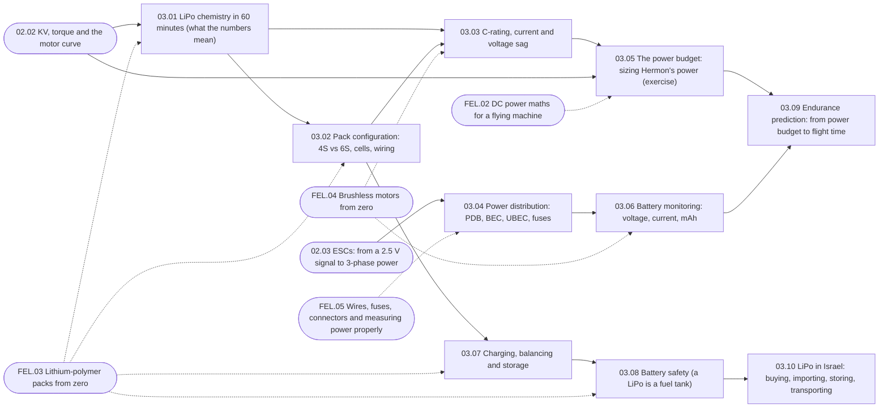

| Lesson | Requires | Optional | Unlocks |
|---|---|---|---|
| 03.01 LiPo chemistry in 60 minutes (what the numbers mean) | 02.02 | FEL.03 | 03.02, 03.03 |
| 03.02 Pack configuration: 4S vs 6S, cells, wiring | 03.01 | FEL.03 | 03.03, 03.07 |
| 03.03 C-rating, current and voltage sag | 03.01, 03.02 | FEL.04 | 03.05 |
| 03.04 Power distribution: PDB, BEC, UBEC, fuses | 02.03 | FEL.05 | 03.06, 04.03 |
| 03.05 The power budget: sizing Hermon's power (exercise) | 03.03, 02.02 | FEL.02 | 03.09 |
| 03.06 Battery monitoring: voltage, current, mAh | 03.04 | FEL.04 | 03.09, 11.05 |
| 03.07 Charging, balancing and storage | 03.02 | FEL.03 | 03.08, 04.05 |
| 03.08 Battery safety (a LiPo is a fuel tank) | 03.07 | FEL.03 | 03.10 |
| 03.09 Endurance prediction: from power budget to flight time | 03.05, 03.06 | — | — |
| 03.10 LiPo in Israel: buying, importing, storing, transporting | 03.08 | — | — |

## 04 · Frame & assembly

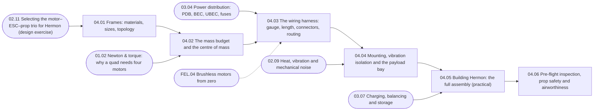

| Lesson | Requires | Optional | Unlocks |
|---|---|---|---|
| 04.01 Frames: materials, sizes, topology | 02.11 | — | 04.02 |
| 04.02 The mass budget and the centre of mass | 04.01, 01.02 | — | 04.03, 17.01 |
| 04.03 The wiring harness: gauge, length, connectors, routing | 03.04, 04.02 | FEL.04 | 04.04 |
| 04.04 Mounting, vibration isolation and the payload bay | 04.03, 02.09 | — | 04.05, 05.06, 14.03 |
| 04.05 Building Hermon: the full assembly (practical) | 04.04, 03.07 | — | 04.06 |
| 04.06 Pre-flight inspection, prop safety and airworthiness | 04.05 | — | 05.01, 11.01 |

## 05 · Sensors for UAVs

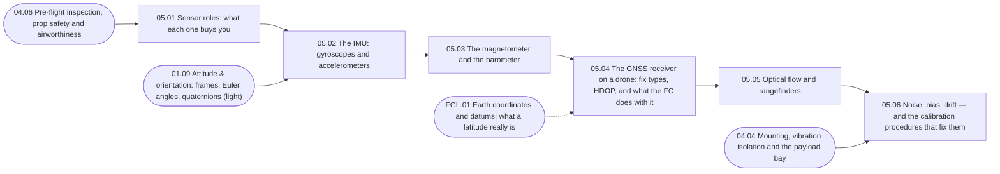

| Lesson | Requires | Optional | Unlocks |
|---|---|---|---|
| 05.01 Sensor roles: what each one buys you | 04.06 | — | 05.02 |
| 05.02 The IMU: gyroscopes and accelerometers | 05.01, 01.09 | — | 05.03 |
| 05.03 The magnetometer and the barometer | 05.02 | — | 05.04 |
| 05.04 The GNSS receiver on a drone: fix types, HDOP, and what the FC does with it | 05.03 | FGL.01 | 05.05, 13.01 |
| 05.05 Optical flow and rangefinders | 05.04 | — | 05.06, 13.05 |
| 05.06 Noise, bias, drift — and the calibration procedures that fix them | 05.05, 04.04 | — | 06.01, 06.05, 10.03 |

## 06 · State estimation

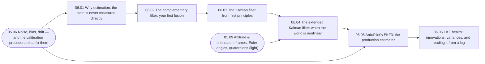

| Lesson | Requires | Optional | Unlocks |
|---|---|---|---|
| 06.01 Why estimation: the state is never measured directly | 05.06 | — | 06.02 |
| 06.02 The complementary filter: your first fusion | 06.01 | — | 06.03 |
| 06.03 The Kalman filter from first principles | 06.02 | — | 06.04 |
| 06.04 The extended Kalman filter: when the world is nonlinear | 06.03, 01.09 | — | 06.05 |
| 06.05 ArduPilot's EKF3: the production estimator | 06.04, 05.06 | — | 06.06 |
| 06.06 EKF health: innovations, variances, and reading it from a log | 06.05 | — | 07.01, 16.03 |

## 07 · Control for flight

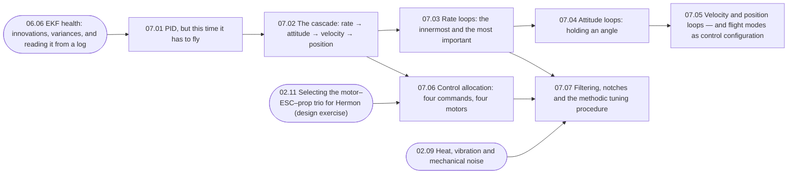

| Lesson | Requires | Optional | Unlocks |
|---|---|---|---|
| 07.01 PID, but this time it has to fly | 06.06 | — | 07.02 |
| 07.02 The cascade: rate → attitude → velocity → position | 07.01 | — | 07.03, 07.06 |
| 07.03 Rate loops: the innermost and the most important | 07.02 | — | 07.04, 07.07 |
| 07.04 Attitude loops: holding an angle | 07.03 | — | 07.05, 17.04 |
| 07.05 Velocity and position loops — and flight modes as control configuration | 07.04 | — | 11.02, 15.04 |
| 07.06 Control allocation: four commands, four motors | 07.02, 02.11 | — | 07.07, 08.07, 10.02 |
| 07.07 Filtering, notches and the methodic tuning procedure | 07.03, 07.06, 02.09 | — | 08.01, 10.01, P02 |

## 08 · The flight-controller platform

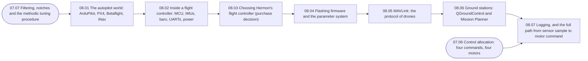

| Lesson | Requires | Optional | Unlocks |
|---|---|---|---|
| 08.01 The autopilot world: ArduPilot, PX4, Betaflight, iNav | 07.07 | — | 08.02 |
| 08.02 Inside a flight controller: MCU, IMUs, baro, UARTs, power | 08.01 | — | 08.03 |
| 08.03 Choosing Hermon's flight controller (purchase decision) | 08.02 | — | 08.04 |
| 08.04 Flashing firmware and the parameter system | 08.03 | — | 08.05 |
| 08.05 MAVLink: the protocol of drones | 08.04 | — | 08.06, 10.04, 12.06, 15.03 |
| 08.06 Ground stations: QGroundControl and Mission Planner | 08.05 | — | 08.07, 11.01 |
| 08.07 Logging, and the full path from sensor sample to motor command | 08.06, 07.06 | — | 09.01, 15.01, 16.03 |

## 09 · Telemetry & datalink

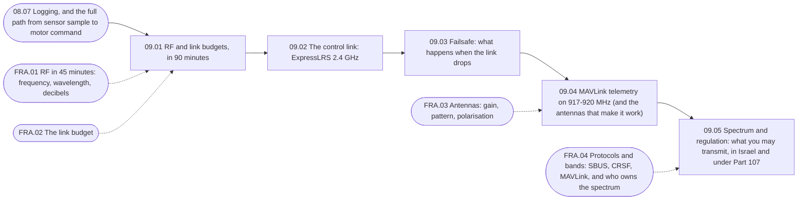

| Lesson | Requires | Optional | Unlocks |
|---|---|---|---|
| 09.01 RF and link budgets, in 90 minutes | 08.07 | FRA.01, FRA.02 | 09.02 |
| 09.02 The control link: ExpressLRS 2.4 GHz | 09.01 | — | 09.03 |
| 09.03 Failsafe: what happens when the link drops | 09.02 | — | 09.04, 11.01, 12.04 |
| 09.04 MAVLink telemetry on 917-920 MHz (and the antennas that make it work) | 09.03 | FRA.03 | 09.05 |
| 09.05 Spectrum and regulation: what you may transmit, in Israel and under Part 107 | 09.04 | FRA.04 | P04 |

## 10 · Simulation

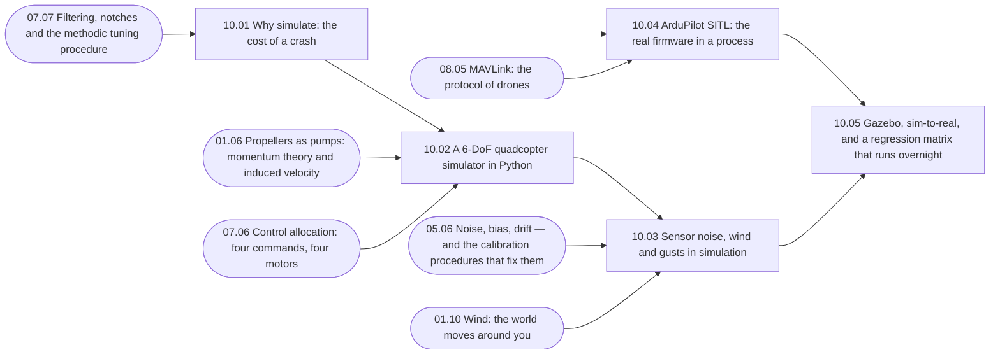

| Lesson | Requires | Optional | Unlocks |
|---|---|---|---|
| 10.01 Why simulate: the cost of a crash | 07.07 | — | 10.02, 10.04 |
| 10.02 A 6-DoF quadcopter simulator in Python | 10.01, 01.06, 07.06 | — | 10.03 |
| 10.03 Sensor noise, wind and gusts in simulation | 10.02, 05.06, 01.10 | — | 10.05 |
| 10.04 ArduPilot SITL: the real firmware in a process | 10.01, 08.05 | — | 10.05, 11.01 |
| 10.05 Gazebo, sim-to-real, and a regression matrix that runs overnight | 10.04, 10.03 | — | 16.04, P03 |

## 11 · First flights & manual piloting

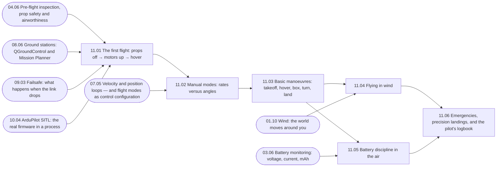

| Lesson | Requires | Optional | Unlocks |
|---|---|---|---|
| 11.01 The first flight: props off → motors up → hover | 04.06, 08.06, 09.03, 10.04 | — | 11.02 |
| 11.02 Manual modes: rates versus angles | 11.01, 07.05 | — | 11.03 |
| 11.03 Basic manoeuvres: takeoff, hover, box, turn, land | 11.02 | — | 11.04, 11.05, P01, P02 |
| 11.04 Flying in wind | 11.03, 01.10 | — | 11.06 |
| 11.05 Battery discipline in the air | 11.03, 03.06 | — | 11.06, 12.04 |
| 11.06 Emergencies, precision landings, and the pilot's logbook | 11.04, 11.05 | — | 12.01, 16.01 |

## 12 · Autonomous flight & mission planning

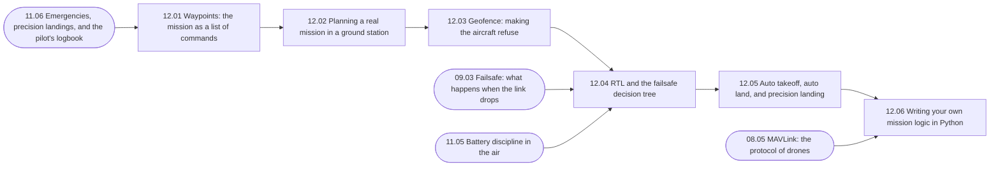

| Lesson | Requires | Optional | Unlocks |
|---|---|---|---|
| 12.01 Waypoints: the mission as a list of commands | 11.06 | — | 12.02 |
| 12.02 Planning a real mission in a ground station | 12.01 | — | 12.03 |
| 12.03 Geofence: making the aircraft refuse | 12.02 | — | 12.04 |
| 12.04 RTL and the failsafe decision tree | 12.03, 09.03, 11.05 | — | 12.05 |
| 12.05 Auto takeoff, auto land, and precision landing | 12.04 | — | 12.06, 19.04 |
| 12.06 Writing your own mission logic in Python | 12.05, 08.05 | — | 13.01, 15.05, 18.01, P05 |

## 13 · Navigation & GNSS

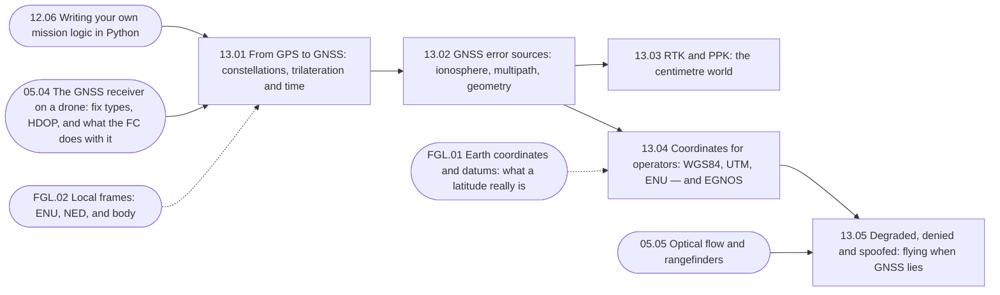

| Lesson | Requires | Optional | Unlocks |
|---|---|---|---|
| 13.01 From GPS to GNSS: constellations, trilateration and time | 12.06, 05.04 | FGL.02 | 13.02 |
| 13.02 GNSS error sources: ionosphere, multipath, geometry | 13.01 | — | 13.03, 13.04 |
| 13.03 RTK and PPK: the centimetre world | 13.02 | — | — |
| 13.04 Coordinates for operators: WGS84, UTM, ENU — and EGNOS | 13.02 | FGL.01 | 13.05, 14.05 |
| 13.05 Degraded, denied and spoofed: flying when GNSS lies | 13.04, 05.05 | — | 14.01 |

## 14 · Vision & perception

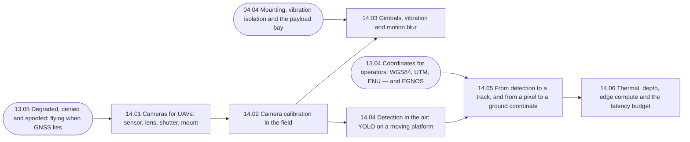

| Lesson | Requires | Optional | Unlocks |
|---|---|---|---|
| 14.01 Cameras for UAVs: sensor, lens, shutter, mount | 13.05 | — | 14.02 |
| 14.02 Camera calibration in the field | 14.01 | — | 14.03, 14.04 |
| 14.03 Gimbals, vibration and motion blur | 14.02, 04.04 | — | — |
| 14.04 Detection in the air: YOLO on a moving platform | 14.02 | — | 14.05 |
| 14.05 From detection to a track, and from a pixel to a ground coordinate | 14.04, 13.04 | — | 14.06, 17.05, P06 |
| 14.06 Thermal, depth, edge compute and the latency budget | 14.05 | — | 15.01 |

## 15 · Onboard autonomy

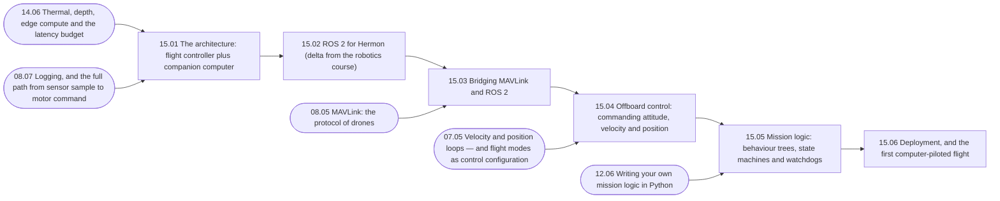

| Lesson | Requires | Optional | Unlocks |
|---|---|---|---|
| 15.01 The architecture: flight controller plus companion computer | 14.06, 08.07 | — | 15.02 |
| 15.02 ROS 2 for Hermon (delta from the robotics course) | 15.01 | — | 15.03 |
| 15.03 Bridging MAVLink and ROS 2 | 15.02, 08.05 | — | 15.04 |
| 15.04 Offboard control: commanding attitude, velocity and position | 15.03, 07.05 | — | 15.05 |
| 15.05 Mission logic: behaviour trees, state machines and watchdogs | 15.04, 12.06 | — | 15.06 |
| 15.06 Deployment, and the first computer-piloted flight | 15.05 | — | 16.01, 19.01, P07 |

## 16 · Flight-test & data analysis

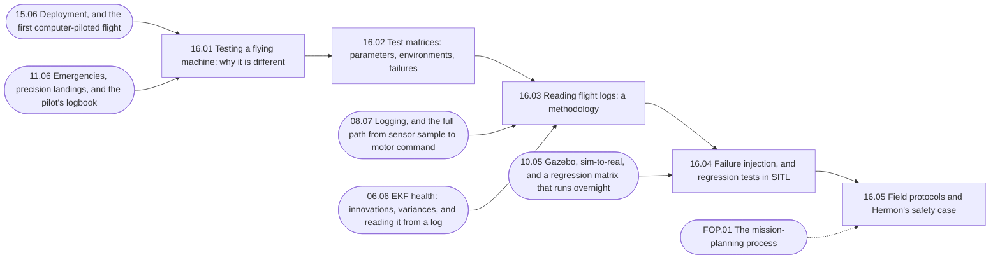

| Lesson | Requires | Optional | Unlocks |
|---|---|---|---|
| 16.01 Testing a flying machine: why it is different | 15.06, 11.06 | — | 16.02 |
| 16.02 Test matrices: parameters, environments, failures | 16.01 | — | 16.03 |
| 16.03 Reading flight logs: a methodology | 16.02, 08.07, 06.06 | — | 16.04 |
| 16.04 Failure injection, and regression tests in SITL | 16.03, 10.05 | — | 16.05 |
| 16.05 Field protocols and Hermon's safety case | 16.04 | FOP.01 | 17.01, 18.03, 19.05 |

## 17 · Payloads & delivery

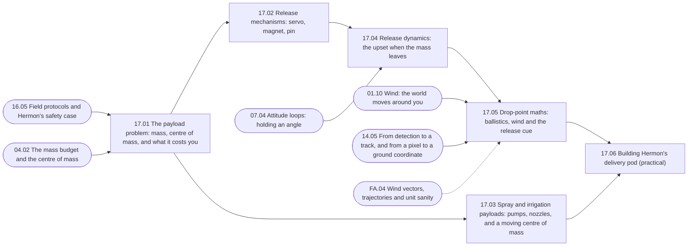

| Lesson | Requires | Optional | Unlocks |
|---|---|---|---|
| 17.01 The payload problem: mass, centre of mass, and what it costs you | 16.05, 04.02 | — | 17.02, 17.03 |
| 17.02 Release mechanisms: servo, magnet, pin | 17.01 | — | 17.04 |
| 17.03 Spray and irrigation payloads: pumps, nozzles, and a moving centre of mass | 17.01 | — | 17.06 |
| 17.04 Release dynamics: the upset when the mass leaves | 17.02, 07.04 | — | 17.05 |
| 17.05 Drop-point maths: ballistics, wind and the release cue | 17.04, 01.10, 14.05 | FA.04 | 17.06 |
| 17.06 Building Hermon's delivery pod (practical) | 17.05, 17.03 | — | 19.01, 19.04 |

## 18 · Civil & public-safety operations

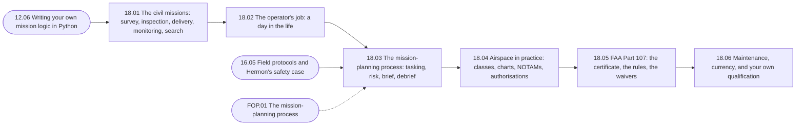

| Lesson | Requires | Optional | Unlocks |
|---|---|---|---|
| 18.01 The civil missions: survey, inspection, delivery, monitoring, search | 12.06 | — | 18.02 |
| 18.02 The operator's job: a day in the life | 18.01 | — | 18.03 |
| 18.03 The mission-planning process: tasking, risk, brief, debrief | 18.02, 16.05 | FOP.01 | 18.04 |
| 18.04 Airspace in practice: classes, charts, NOTAMs, authorisations | 18.03 | — | 18.05 |
| 18.05 FAA Part 107: the certificate, the rules, the waivers | 18.04 | — | 18.06 |
| 18.06 Maintenance, currency, and your own qualification | 18.05 | — | 19.01 |

## 19 · Capstone — Hermon's mission

```mermaid
flowchart LR
  n_19_01["19.01 The brief: Hermon's full tasking"]
  n_19_02["19.02 Phase 1: pre-flight, site setup and launch"]
  n_19_03["19.03 Phase 2: fly the survey, detect the target"]
  n_19_04["19.04 Phase 3: deliver the payload, then a precision return"]
  n_19_05["19.05 The campaign, the report, and the debrief"]
  n_17_06 --> n_19_01
  n_18_06 --> n_19_01
  n_15_06 --> n_19_01
  n_19_01 --> n_19_02
  n_19_02 --> n_19_03
  n_19_03 --> n_19_04
  n_17_06 --> n_19_04
  n_12_05 --> n_19_04
  n_19_04 --> n_19_05
  n_16_05 --> n_19_05
  n_FOP_01 -.-> n_19_05
  n_12_05(["12.05 Auto takeoff, auto land, and precision landing"])
  n_15_06(["15.06 Deployment, and the first computer-piloted flight"])
  n_16_05(["16.05 Field protocols and Hermon's safety case"])
  n_17_06(["17.06 Building Hermon's delivery pod (practical)"])
  n_18_06(["18.06 Maintenance, currency, and your own qualification"])
  n_FOP_01(["FOP.01 The mission-planning process"])
```

| Lesson | Requires | Optional | Unlocks |
|---|---|---|---|
| 19.01 The brief: Hermon's full tasking | 17.06, 18.06, 15.06 | — | 19.02 |
| 19.02 Phase 1: pre-flight, site setup and launch | 19.01 | — | 19.03 |
| 19.03 Phase 2: fly the survey, detect the target | 19.02 | — | 19.04 |
| 19.04 Phase 3: deliver the payload, then a precision return | 19.03, 17.06, 12.05 | — | 19.05 |
| 19.05 The campaign, the report, and the debrief | 19.04, 16.05 | FOP.01 | P08 |

## FA · Flight aerodynamics & physics (FA)

```mermaid
flowchart LR
  n_FA_01["FA.01 Vectors and forces from zero"]
  n_FA_02["FA.02 Newton's laws in flight"]
  n_FA_03["FA.03 Work, energy and power"]
  n_FA_04["FA.04 Wind vectors, trajectories and unit sanity"]
  n_FA_01 --> n_FA_02
  n_FA_02 --> n_FA_03
  n_FA_03 --> n_FA_04
```

| Lesson | Requires | Optional | Unlocks |
|---|---|---|---|
| FA.01 Vectors and forces from zero | — | — | FA.02 |
| FA.02 Newton's laws in flight | FA.01 | — | FA.03 |
| FA.03 Work, energy and power | FA.02 | — | FA.04 |
| FA.04 Wind vectors, trajectories and unit sanity | FA.03 | — | — |

## FEL · Drone electronics & power (FEL)

```mermaid
flowchart LR
  n_FEL_01["FEL.01 Electricity for drone builders: voltage, current, resistance"]
  n_FEL_02["FEL.02 DC power maths for a flying machine"]
  n_FEL_03["FEL.03 Lithium-polymer packs from zero"]
  n_FEL_04["FEL.04 Brushless motors from zero"]
  n_FEL_05["FEL.05 Wires, fuses, connectors and measuring power properly"]
  n_FEL_01 --> n_FEL_02
  n_FEL_02 --> n_FEL_03
  n_FEL_01 --> n_FEL_04
  n_FEL_02 --> n_FEL_05
```

| Lesson | Requires | Optional | Unlocks |
|---|---|---|---|
| FEL.01 Electricity for drone builders: voltage, current, resistance | — | — | FEL.02, FEL.04 |
| FEL.02 DC power maths for a flying machine | FEL.01 | — | FEL.03, FEL.05 |
| FEL.03 Lithium-polymer packs from zero | FEL.02 | — | — |
| FEL.04 Brushless motors from zero | FEL.01 | — | — |
| FEL.05 Wires, fuses, connectors and measuring power properly | FEL.02 | — | — |

## FGL · GNSS & navigation maths (FGL)

```mermaid
flowchart LR
  n_FGL_01["FGL.01 Earth coordinates and datums: what a latitude really is"]
  n_FGL_02["FGL.02 Local frames: ENU, NED, and body"]
  n_FGL_03["FGL.03 Distance and bearing on a round Earth"]
  n_FGL_04["FGL.04 Satellite geometry and error analysis"]
  n_FGL_01 --> n_FGL_02
  n_FGL_02 --> n_FGL_03
  n_FGL_03 --> n_FGL_04
```

| Lesson | Requires | Optional | Unlocks |
|---|---|---|---|
| FGL.01 Earth coordinates and datums: what a latitude really is | — | — | FGL.02 |
| FGL.02 Local frames: ENU, NED, and body | FGL.01 | — | FGL.03 |
| FGL.03 Distance and bearing on a round Earth | FGL.02 | — | FGL.04 |
| FGL.04 Satellite geometry and error analysis | FGL.03 | — | — |

## FRA · RF & datalink (FRA)

```mermaid
flowchart LR
  n_FRA_01["FRA.01 RF in 45 minutes: frequency, wavelength, decibels"]
  n_FRA_02["FRA.02 The link budget"]
  n_FRA_03["FRA.03 Antennas: gain, pattern, polarisation"]
  n_FRA_04["FRA.04 Protocols and bands: SBUS, CRSF, MAVLink, and who owns the spectrum"]
  n_FRA_01 --> n_FRA_02
  n_FRA_02 --> n_FRA_03
  n_FRA_03 --> n_FRA_04
```

| Lesson | Requires | Optional | Unlocks |
|---|---|---|---|
| FRA.01 RF in 45 minutes: frequency, wavelength, decibels | — | — | FRA.02 |
| FRA.02 The link budget | FRA.01 | — | FRA.03 |
| FRA.03 Antennas: gain, pattern, polarisation | FRA.02 | — | FRA.04 |
| FRA.04 Protocols and bands: SBUS, CRSF, MAVLink, and who owns the spectrum | FRA.03 | — | — |

## FOP · Civil operations fundamentals (FOP)

```mermaid
flowchart LR
  n_FOP_01["FOP.01 The mission-planning process"]
  n_FOP_02["FOP.02 Risk management: the bowtie"]
  n_FOP_03["FOP.03 The debrief: an honest after-action review"]
  n_FOP_01 --> n_FOP_02
  n_FOP_02 --> n_FOP_03
```

| Lesson | Requires | Optional | Unlocks |
|---|---|---|---|
| FOP.01 The mission-planning process | — | — | FOP.02 |
| FOP.02 Risk management: the bowtie | FOP.01 | — | FOP.03 |
| FOP.03 The debrief: an honest after-action review | FOP.02 | — | — |

