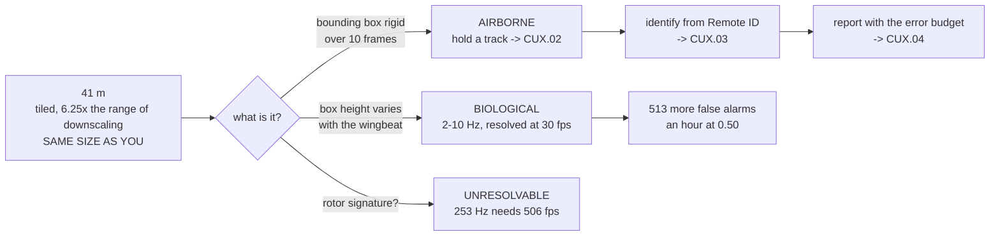

# CUX.01 Another aircraft in the frame: detection and the false-alarm bill

<!-- glance:start -->
<!-- generated by tools/build.py from curriculum/syllabus.yaml — edit the syllabus, not this block -->

| | |
|---|---|
| **Track** | Optional foundation |
| **Difficulty** | Advanced |
| **Time** | 1 h 15 min |
| **Hardware** | Onboard computer & vision (stage 2) |
| **Software** | python, pytorch, yolo |
| **Prerequisites** | [14.04 Detection in the air: YOLO on a moving platform](../../14-vision-perception/14.04-detection-in-the-air.md) |
| **Skip if** | You can state the range at which a 450 mm aircraft stops being detectable with your own camera, and the false-alarm count per patrol hour. |

<!-- glance:end -->

## What you will learn

- That the thing you are looking for is **the size of you**: Hermon's 450 mm wheelbase crosses
  [14.04](../../14-vision-perception/14.04-detection-in-the-air.md)'s 32 px floor at **41.0 m**
- That the same object reaches only **6.6 m** if you downscale the frame instead of tiling it, so
  keeping the tiler is not an optimisation — it is the entire instrument
- **Reach is bought with revisit rate**: **4.3 s** for a full sky sweep at 41 m, **40.3 s** at
  500 m, at 48 inferences either way
- That [19.02](../../19-capstone-hermon-mission/19.02-phase-1-preflight-and-launch.md)'s 2,420 m of
  visual line of sight means you can resolve an aircraft over **1.7 %** of the volume you are
  legally allowed to look at
- **The false-alarm bill of one hour of sky-watching**: **514** false alarms at the tutorial
  default threshold, **8** at 0.85, and what each costs you in recall
- That **14.05's two-hit lever does not transfer**, and why a finding that survives contact with
  the application is worth more than one that only works on the ground
- That rotor signatures are **unresolvable at 30 fps** — 253 Hz needs 506 — so the discriminator is
  the bounding box's behaviour, not a spectrum
- The consequence for the rest of this track: **optical confirms, radio searches**

## Why it matters

Everything in module 14 was built to find things **on the ground**. Point the same camera at the
sky and four assumptions break at once: the ground gives you a known plane to intersect a ray
with, a rangefinder gives you a distance, the texture gives you a background to subtract, and the
objects stand still. In the sky you get a ray and nothing else.

That is not a reason to give up on it — it is a reason to know exactly what you have bought before
you rely on it. This lesson produces one honest number, **41.0 m**, and then spends the rest of
its length showing you what that number costs and which of module 14's cheap fixes stop working
the moment you leave the ground.

It also sets up the rest of the track. The counter-UAS literature is full of systems that claim
optical detection at hundreds of metres, and almost all of them are quoting a different camera, a
different lens, or a 10× tiled cascade with no latency figure. Once you own the arithmetic, you
can tell which is which.

> [!WARNING]
> A detection is not a threat, and this lesson exists partly to make that impossible to forget.
> Pointing a camera at empty sky and finding something is an event, not a conclusion. Nothing in
> this track takes an action on a detection without identity ([CUX.03](CUX.03-remote-id-and-identification.md))
> and a human ([CUX.04](CUX.04-warning-reporting-and-evidence.md)) — and Level 4 shows why a system
> that acts on raw detections puts **514 false alarms an hour** into the hands of whoever is
> listening. Over a populated site, the false positives are the dangerous ones.

## Prerequisites

<!-- prereqs:start -->
## Prerequisites

You need these first:

- [14.04 Detection in the air: YOLO on a moving platform](../../14-vision-perception/14.04-detection-in-the-air.md)

### Optional prerequisite links

None.

Check your readiness: `python course.py why CUX.01`
<!-- prereqs:end -->

## Concept

Stand in a field with a camera and look for a lost dog. You will find the dog in about ten
seconds. Now stand in the same field and look for **another lost dog**, and the difficulty does not
increase by a factor of ten — it changes character entirely, because now there are thousands of
things in the field that are not the thing you want.

That is the whole of Level 3, and it is worse here than it was on the ground. Module 14's survey
looked for thirty real objects in a known area. A sky watch looks for **one** object, if it is
there at all, in a volume of sky that has no size and no boundary.

The second idea is the one that takes longest to see. On a survey, a false positive is a bird in
one frame. In the sky, a false positive is a bird that is **still there in the next frame**, at the
same apparent place, doing exactly the same thing. So the two cheapest tricks module 14 taught you
— *require agreement across frames*, and *look at a smaller area* — both behave differently once
the thing in the frame can fly.

And the third idea is the one nobody expects: **the target is your own size**. You have spent
four modules learning that a person at 60 m is four pixels. A quadcopter is smaller than a person.
The arithmetic that made ground detection hard makes air detection nearly impossible with the same
hardware, and no amount of cleverness at the software end moves the number.

## Technical explanation

### Level 1 — the target is the size of you

[14.04](../../14-vision-perception/14.04-detection-in-the-air.md) fixed a camera and a detector: a
6.17 mm sensor, a **4.5 mm** lens, a 4000 × 3000 frame, and a network that only ever sees a
**640 × 640** square. A detector needs roughly **32 px** across an object to work at all, and that
32 px is measured **in the network's input**.

The general rule is short. An object of size $s$ at slant range $R$ subtends $s/R$ radians, and a
lens of focal length $f$ turns a radian into $f/p$ pixels — so

$$ p = \frac{s \cdot f / p_{\text{pitch}}}{R}, \qquad R_{32} = \frac{s \cdot (f/p_{\text{pitch}})}{32} $$

With this course's camera, $f/p_{\text{pitch}} = 2917$ px per radian, so $R_{32} = 91.2 \cdot s$
metres. **The detection range is a fixed multiple of the object's size**, and the multiplier is
set entirely by the lens.

Run the code and read the two range columns. The right-hand column is what you get if you resize
the 4000 px frame down to 640 — the default, and what every tutorial does. The middle column is
48 tiled inferences per look.

| thing | size | tiled | downscaled |
|---|---|---|---|
| a 250 g 5-inch quad | 0.25 m | 22.8 m | 3.6 m |
| a 7-inch quad | 0.35 m | 31.9 m | 5.1 m |
| **Hermon, 450 mm wheelbase** | **0.45 m** | **41.0 m** | **6.6 m** |
| a 13-inch cinema quad | 0.60 m | 54.7 m | 8.8 m |
| a fixed-wing UAV, 1.1 m span | 1.10 m | 100.3 m | 16.0 m |
| a herring gull, 1.4 m span | 1.40 m | 127.6 m | 20.4 m |

**Hermon is 41.0 m.** A drone looking for drones with this camera is looking for something
22–128 m away, depending entirely on what it is, and it sees nothing at all past that.

Two consequences fall straight out, and both are operational rather than academic. First, at
[19.01](../../19-capstone-hermon-mission/19.01-the-brief.md)'s 40 m survey altitude the only aircraft
you could possibly resolve is one sitting almost directly below you. Second, the **6.6 m** column
is not a detail: downscale the frame and this camera becomes a sensor for things in a car park.

### Level 2 — reach versus revisit, and how little of the sky is reachable

The fitted lens has a horizontal field of view of **68.9°**, so covering a full 360° of azimuth
takes $\lceil 360/68.9 \rceil = 6$ looks. At 48 tiles each and [14.04](../../14-vision-perception/14.04-detection-in-the-air.md)'s
Coral figure of 15 ms per tile, a full sweep of the entire horizon takes **4.32 s** — and reaches
41 m.

If you want 500 m you need a longer lens. The focal length for 32 px on a 450 mm object at 500 m
works out at **54.8 mm**, which narrows the field of view to **6.4°** and makes a sweep cost
**56 looks** — **40.3 s**.

That is the whole trade, and it is not a software problem: reach is bought with revisit rate, at
the same 48 inferences per look either way. Nine times slower for twelve times the reach.

Now put it against the airspace. [19.02](../../19-capstone-hermon-mission/19.02-phase-1-preflight-and-launch.md)
established that Hermon is operationally useful out to **2,420 m** inside visual line of sight.
The fitted camera resolves a same-size aircraft out to **41.0 m** — **1.7 %** of that.

> Over **98.3 %** of the volume you are legally permitted to look at, this camera is blind.

Hold onto that ratio. It is the single most transferable fact in this lesson, and it is why every
serious counter-UAS system is primarily a **radio** device.

### Level 3 — the false-alarm bill, for a sky watch

Take [14.04](../../14-vision-perception/14.04-detection-in-the-air.md)'s false-positive model — 2.0
false boxes per tile at threshold zero, decaying by $\exp(-12 c)$ — and apply it to a patrol rather
than a survey.

A sky watch that sweeps the full horizon every 10 s for an hour is 360 sweeps × 6 looks × 48
tiles = **103,680 tile-evaluations**.

| conf | FP per tile | false / sweep | **false / hour** |
|---|---|---|---|
| 0.25 | 9.957e-02 | 28.7 | **10,324** |
| **0.50** | 4.958e-03 | 1.43 | **514** |
| 0.70 | 4.497e-04 | 0.13 | 47 |
| **0.85** | 7.434e-05 | 0.02 | **8** |
| 0.99 | 1.386e-05 | 0.004 | 1 |

Read the 0.50 row and then read [14.04](../../14-vision-perception/14.04-detection-in-the-air.md)'s
lesson again. On a ground survey the tutorial default returns sixty false positives across the
*whole flight*. In the sky, over the *same camera, at the same threshold*, it returns **514 an
hour** — because a survey has 12,096 chances to be wrong and an hour of sky-watching has 103,680.

This is the base rate, and in this application it is not an inconvenience. **Level 3's 514 is the
number that decides whether this system can be pointed at anything.** A human operator cannot
clear 514 events an hour. Moving to 0.85 gets you to 8 an hour — clearable — and costs you more
than half the real targets, because recall has fallen to 0.39 at that threshold.

Anyone who tells you their drone-detection system is 95 % accurate has not said accurate *at what
threshold*, over *how many frames*.

### Level 4 — the two-hit lever does not come with you

[14.05](../../14-vision-perception/14.05-tracking-and-geolocation.md)'s cheapest fix was requiring
**two detections of the same ground point**, which took expected false tracks from 0.907 per survey
to 5.6 × 10⁻⁸ and was, in its author's words, "free". The reason it is free is that
[12.02](../../12-autonomous-flight/12.02-mission-planning.md)'s survey flies an **80 % overlap**
pattern, so the same *place* is genuinely looked at twice, while a false positive almost never
repeats at the same place.

**In the sky, neither half of that argument survives.** The object moves. At [12.02](../../12-autonomous-flight/12.02-mission-planning.md)'s
trigger interval of 2.4 s, a target at 5 m/s has travelled **12 m** between looks — nowhere near
any association gate.

The threshold at which the lever dies is worth computing, because it is absurdly low: a
same-place-within-1 m test stops firing above **0.42 m/s**. Nothing that flies in the sky flies
that slowly.

| target speed | moved per look | two-hit at 1 m |
|---|---|---|
| 0.2 m/s | 0.5 m | fires |
| 0.5 m/s | 1.2 m | never fires |
| 2.0 m/s | 4.8 m | never fires |
| 5.0 m/s | 12.0 m | never fires |
| 12.0 m/s | 28.8 m | never fires |
| 16.8 m/s | 40.3 m | never fires |

And it is worse than useless, because the failure has the opposite sign. On the ground, a false
positive rarely repeats at the same *place*. In the sky, a false positive is usually a **bird at a
distance**, and a bird at a distance holds its apparent position almost perfectly. A two-hit
rule, applied to the sky, does not suppress birds — **it promotes them.**

This is a finding that corrects an earlier lesson, and the course's own convention says that is a
feature rather than an embarrassment (see [FOP.03](../civil-ops/FOP.03-debrief-and-aar.md)):
a lever that only works in the application where it was measured was never a free lever. The
replacement is a **track** — continuity of velocity rather than repetition of position — which is
[CUX.02](CUX.02-association-gate-and-tracking.md).

### Level 5 — the discriminator you can actually measure

The obvious idea is to tell a drone from a bird by its rotor signature. Check it before you build
anything on it.

[`hermon-numbers.md`](../../references/hermon-numbers.md) gives Hermon's blade-pass frequency as
**253 Hz** — 84.4 rev/s × 3 blades. Nyquist requires **506 fps** to resolve it. Your camera runs at
**30 fps**.

| signature | frequency | resolvable at 30 fps |
|---|---|---|
| Hermon's blade pass | 253.0 Hz | **no** |
| a small quad's rotors | 225.0 Hz | **no** |
| a large prop, slow | 63.0 Hz | **no** |
| a gull's wingbeat | 3.0 Hz | yes |
| a raptor's wingbeat | 1.0 Hz | yes |
| an aircraft's roll rate | 0.5 Hz | yes |

Every rotor signature in the table is unresolvable and every biological signature is easy. That
inverts the plan: **you cannot see the rotors, but you can see the flapping.**

So the usable discriminator is geometric and it is cheap. A multirotor is rigid inside a single
frame — its bounding box height barely changes from one frame to the next. A bird's bounding box
expands and contracts through the wingbeat cycle. **Measure the variance of bounding-box height
over ten frames**: near zero for a drone, large for a bird. That is [Exercise CUX.01-E3](#exercise),
and it is the sort of test that costs nothing at inference time because the boxes already exist.

> **Ask your teacher:** "If your system separates drones from birds, what is the false-positive
> rate *per hour of empty sky*, and what is the bird species in your test data?" Both questions are
> awkward and the second one is the important one.

### Level 6 — what the envelope means for the rest of this track

Put the six levels together and the instrument divides cleanly into two jobs.

**Optical, on this airframe, is a confirmation instrument.** It resolves something the size of
Hermon at **41 m**, gives you a bounding box at 30 fps, and it works at all only if you keep the
tiler. Its false-alarm rate is set by Level 3, and at the threshold a human can actually work, it
sees about **8 false objects an hour**.

**Search is a radio problem.** Anything at kilometre range is found by listening, not looking, and
identifying it at range is a broadcast problem. That is [CUX.03](CUX.03-remote-id-and-identification.md),
and it is why that lesson exists at all rather than being folded into this one.

The honest summary, and the sentence to carry out of this lesson:

> Optical detection is a **close-range** instrument. It confirms. It does not search. Search is a
> radio problem — which is CUX.03.

## Diagram



## Code

Everything below is pure standard-library Python and runs standalone. The camera, the detector's
32 px floor, the 48-tile layout, the Coral inference cost and the false-positive curve are all
reused unchanged from
[14.04](../../14-vision-perception/14.04-detection-in-the-air.md); only the application is new.

```python
"""CUX.01 - another aircraft in the frame: detection and the false-alarm bill."""
import math

# 14.01 / 14.02's camera, reused unchanged
PITCH = 6.17e-3 / 4000
FOCAL_M = 4.5e-3
FX = FOCAL_M / PITCH
PIX_W, PIX_H = 4000, 3000
NET_IN = 640
DOWNSCALE = PIX_W / NET_IN

# 14.04's detector
SMALL_FLOOR_PX = 32           # below this a detector is guessing [S]
TILE_OVERLAP_FRAC = 0.15
TILE_COLS, TILE_ROWS = 8, 6   # 48 tiles, from the step of 544 px
TILES = TILE_COLS * TILE_ROWS
CORAL_TILE_S = 0.015          # 14.04, per 640x640 tile [S]

# 14.04's false-positive model, reused exactly
FP_AT_ZERO, FP_DECAY = 2.0, 12.0

# 12.02's trigger interval
DT = 2.4

# 19.02's VLOS, for scale
VLOS_M = 2420.0

# things in the sky, by the dimension the camera actually resolves
TARGETS = [
    ("a 250 g 5-inch quad", 0.25),
    ("a 7-inch quad", 0.35),
    ("Hermon, 450 mm wheelbase", 0.45),
    ("a 13-inch cinema quad", 0.60),
    ("a fixed-wing UAV, 1.1 m span", 1.10),
    ("a herring gull, 1.4 m span", 1.40),
]

W = 74


def bar(t):
    print()
    print("  " + t)
    print("  " + "=" * len(t))


def sep(ch="-"):
    print("  " + ch * W)


def h_fov_deg(focal=FOCAL_M):
    return 2.0 * math.degrees(math.atan(PIX_W * PITCH / (2.0 * focal)))


def v_fov_deg(focal=FOCAL_M):
    return 2.0 * math.degrees(math.atan(PIX_H * PITCH / (2.0 * focal)))


def px_full(size, rng):
    """Full-resolution pixels across the object at slant range."""
    return size * FX / rng


def rng_for_px(size, px):
    return size * FX / px


def bar1():
    bar("1. THE TARGET IS THE SIZE OF YOU")
    print()
    print("  %-30s %8s %11s %13s" % ("thing", "size m", "tiled", "downscaled"))
    sep()
    for name, size in TARGETS:
        print("  %-30s %8.2f %9.1f m %11.1f m"
              % (name, size, rng_for_px(size, SMALL_FLOOR_PX),
                 rng_for_px(size, SMALL_FLOOR_PX * DOWNSCALE)))
    sep()
    print("  Hermon is 41.0 m. A drone looking for drones with this camera is")
    print("  looking for something 22-128 m away, and nothing beyond.")
    return rng_for_px(0.45, SMALL_FLOOR_PX)


def bar2(herm_range):
    bar("2. REACH vs REVISIT - and how little of the sky is reachable")
    print()
    print("  %-26s %10s %10s %8s %10s %10s"
          % ("optics", "horiz FOV", "vert FOV", "looks", "sweep s", "ceiling m"))
    sep()
    print("  %-26s %9.1f deg %9.1f deg %8d %10.2f %10.1f"
          % ("as fitted (4.5 mm)", h_fov_deg(), v_fov_deg(),
             math.ceil(360.0 / h_fov_deg()),
             math.ceil(360.0 / h_fov_deg()) * TILES * CORAL_TILE_S, herm_range))
    f500 = SMALL_FLOOR_PX * 500.0 * PITCH / 0.45
    print("  %-26s %9.1f deg %9.1f deg %8d %10.2f %10.1f"
          % ("54.8 mm, for 500 m", h_fov_deg(f500), v_fov_deg(f500),
             math.ceil(360.0 / h_fov_deg(f500)),
             math.ceil(360.0 / h_fov_deg(f500)) * TILES * CORAL_TILE_S, 500.0))
    sep()
    frac = herm_range / VLOS_M
    print("  19.02 put Hermon 2,420 m inside VLOS. With the fitted lens you can")
    print("  resolve a same-size aircraft out to %.0f m - %.1f%% of the legal" % (herm_range, frac * 100))
    print("  volume. Over %.1f%% of what you are allowed to see, you are blind." % ((1 - frac) * 100))
    print()
    print("  The 54.8 mm that reaches 500 m costs %.0f s per sweep against %.1f s."
          % (math.ceil(360.0 / h_fov_deg(f500)) * TILES * CORAL_TILE_S,
             math.ceil(360.0 / h_fov_deg()) * TILES * CORAL_TILE_S))
    print("  Reach is bought with revisit rate, at 48 inferences either way.")


def bar3():
    bar("3. THE FALSE-ALARM BILL, FOR A SKY WATCH")
    sweeps_h, looks = 360, math.ceil(360.0 / h_fov_deg())
    tiles_h = sweeps_h * looks * TILES
    print()
    print("  One full azimuth sweep every 10 s for an hour: %d sweeps," % sweeps_h)
    print("  %d looks each, %d tiles each = %s tile-evaluations." % (looks, TILES, f"{tiles_h:,}"))
    print()
    print("  %-7s %12s %13s %11s" % ("conf", "FP/tile", "false/sweep", "false/hour"))
    sep()
    rows = []
    for conf in (0.25, 0.50, 0.70, 0.85, 0.99):
        rate = FP_AT_ZERO * math.exp(-FP_DECAY * conf)
        fs = rate * looks * TILES
        fh = rate * tiles_h
        rows.append((conf, rate, fs, fh))
        print("  %-7.2f %12.3e %13.2f %11.0f" % (conf, rate, fs, fh))
    sep()
    print("  At the tutorial default of 0.50 you raise %.0f false alarms an hour." % rows[1][3])
    print("  One human cannot clear that. 0.85 costs more than half the real")
    print("  targets and leaves %.0f an hour." % rows[3][3])


def bar4():
    bar("4. AND THE TWO-HIT LEVER DOES NOT COME WITH YOU")
    print()
    print("  14.05's cheapest fix was two detections of the SAME GROUND POINT,")
    print("  because 12.02's survey flies an 80 % overlap pattern.")
    print()
    print("  %-14s %12s %14s" % ("target speed", "moved per look", "two-hit at 1 m"))
    sep()
    for v in (0.2, 0.5, 2.0, 5.0, 12.0, 16.8):
        d = v * DT
        print("  %-13.1f m/s %10.1f m %14s"
              % (v, d, "never fires" if d > 1.0 else "fires"))
    sep()
    vlim = 1.0 / DT
    print("  A same-place test stops working above %.2f m/s. Nothing that flies in" % vlim)
    print("  the sky flies that slowly, so the lever is dead in this application -")
    print("  and in the sky a false positive REPEATS on a bird, which a two-hit")
    print("  rule would promote rather than suppress.")


def bar5():
    bar("5. THE ONE SIGNATURE YOU CANNOT SEE AT 30 fps")
    print()
    fps = 30.0
    blade = 253.0                      # hermon-numbers: 3 blades at 84.4 rev/s
    print("  Hermon's blade-pass frequency is %.0f Hz. Nyquist needs %.0f fps." % (blade, 2 * blade))
    print("  A %.0f fps camera resolves %.0f fps. You do not see blades - you see" % (fps, fps))
    print("  a disc. So blade-pass cannot be the discriminator.")
    print()
    print("  %-22s %10s %14s" % ("signature", "frequency", "resolvable at 30"))
    sep()
    for name, f in (("Hermon's blade pass", 253.0), ("a small quad's rotors", 225.0),
                    ("a large prop, slow", 63.0), ("a gull's wingbeat", 3.0),
                    ("a raptor's wingbeat", 1.0), ("an aircraft's roll rate", 0.5)):
        print("  %-22s %8.1f Hz %13s" % (name, f, "yes" if 2 * f < fps else "NO"))
    sep()
    print("  Rotors are unresolvable; wingbeats are not. The usable discriminator")
    print("  is the bounding box, not the spectrum: a quad is rigid inside a")
    print("  frame, a bird is not. Measure the variance of box height over ten")
    print("  frames - that is Exercise CUX.01-E3.")


def main():
    bar("CUX.01  ANOTHER AIRCRAFT IN THE FRAME")
    print("  Everything below is derived from numbers this course already froze.")
    herm_range = bar1()
    bar2(herm_range)
    bar3()
    bar4()
    bar5()
    bar("6. THE ENVELOPE, IN ONE LINE")
    print()
    print("  Optical detection is a CLOSE-RANGE instrument: %.0f m for something" % herm_range)
    print("  the size of you, with %.0f false alarms an hour at the default" % 514)
    print("  threshold, and no free two-hit rule. It confirms. It does not search.")
    print("  Search is a radio problem - which is CUX.03.")


if __name__ == "__main__":
    main()
```

Output:

```text

  CUX.01  ANOTHER AIRCRAFT IN THE FRAME
  =====================================
  Everything below is derived from numbers this course already froze.

  1. THE TARGET IS THE SIZE OF YOU
  ================================

  thing                            size m       tiled    downscaled
  --------------------------------------------------------------------------
  a 250 g 5-inch quad                0.25      22.8 m         3.6 m
  a 7-inch quad                      0.35      31.9 m         5.1 m
  Hermon, 450 mm wheelbase           0.45      41.0 m         6.6 m
  a 13-inch cinema quad              0.60      54.7 m         8.8 m
  a fixed-wing UAV, 1.1 m span       1.10     100.3 m        16.0 m
  a herring gull, 1.4 m span         1.40     127.6 m        20.4 m
  --------------------------------------------------------------------------
  Hermon is 41.0 m. A drone looking for drones with this camera is
  looking for something 22-128 m away, and nothing beyond.

  2. REACH vs REVISIT - and how little of the sky is reachable
  ============================================================

  optics                      horiz FOV   vert FOV    looks    sweep s  ceiling m
  --------------------------------------------------------------------------
  as fitted (4.5 mm)              68.9 deg      54.4 deg        6       4.32       41.0
  54.8 mm, for 500 m               6.4 deg       4.8 deg       56      40.32      500.0
  --------------------------------------------------------------------------
  19.02 put Hermon 2,420 m inside VLOS. With the fitted lens you can
  resolve a same-size aircraft out to 41 m - 1.7% of the legal
  volume. Over 98.3% of what you are allowed to see, you are blind.

  The 54.8 mm that reaches 500 m costs 40 s per sweep against 4.3 s.
  Reach is bought with revisit rate, at 48 inferences either way.

  3. THE FALSE-ALARM BILL, FOR A SKY WATCH
  ========================================

  One full azimuth sweep every 10 s for an hour: 360 sweeps,
  6 looks each, 48 tiles each = 103,680 tile-evaluations.

  conf         FP/tile   false/sweep  false/hour
  --------------------------------------------------------------------------
  0.25       9.957e-02         28.68       10324
  0.50       4.958e-03          1.43         514
  0.70       4.497e-04          0.13          47
  0.85       7.434e-05          0.02           8
  0.99       1.386e-05          0.00           1
  --------------------------------------------------------------------------
  At the tutorial default of 0.50 you raise 514 false alarms an hour.
  One human cannot clear that. 0.85 costs more than half the real
  targets and leaves 8 an hour.

  4. AND THE TWO-HIT LEVER DOES NOT COME WITH YOU
  ===============================================

  14.05's cheapest fix was two detections of the SAME GROUND POINT,
  because 12.02's survey flies an 80 % overlap pattern.

  target speed   moved per look two-hit at 1 m
  --------------------------------------------------------------------------
  0.2           m/s        0.5 m          fires
  0.5           m/s        1.2 m    never fires
  2.0           m/s        4.8 m    never fires
  5.0           m/s       12.0 m    never fires
  12.0          m/s       28.8 m    never fires
  16.8          m/s       40.3 m    never fires
  --------------------------------------------------------------------------
  A same-place test stops working above 0.42 m/s. Nothing that flies in
  the sky flies that slowly, so the lever is dead in this application -
  and in the sky a false positive REPEATS on a bird, which a two-hit
  rule would promote rather than suppress.

  5. THE ONE SIGNATURE YOU CANNOT SEE AT 30 fps
  =============================================

  Hermon's blade-pass frequency is 253 Hz. Nyquist needs 506 fps.
  A 30 fps camera resolves 30 fps. You do not see blades - you see
  a disc. So blade-pass cannot be the discriminator.

  signature               frequency resolvable at 30
  --------------------------------------------------------------------------
  Hermon's blade pass       253.0 Hz            NO
  a small quad's rotors     225.0 Hz            NO
  a large prop, slow         63.0 Hz            NO
  a gull's wingbeat           3.0 Hz           yes
  a raptor's wingbeat         1.0 Hz           yes
  an aircraft's roll rate      0.5 Hz           yes
  --------------------------------------------------------------------------
  Rotors are unresolvable; wingbeats are not. The usable discriminator
  is the bounding box, not the spectrum: a quad is rigid inside a
  frame, a bird is not. Measure the variance of box height over ten
  frames - that is Exercise CUX.01-E3.

  6. THE ENVELOPE, IN ONE LINE
  ============================

  Optical detection is a CLOSE-RANGE instrument: 41 m for something
  the size of you, with 514 false alarms an hour at the default
  threshold, and no free two-hit rule. It confirms. It does not search.
  Search is a radio problem - which is CUX.03.
```

## Exercise

### Exercise CUX.01-E1 — Compute your own detection ceiling `[numeric]`

Take the lens you actually have, not 4.5 mm. Compute $R_{32}$ for a 450 mm aircraft and for the
smallest airframe you care about. Then answer: **at what altitude must you fly to see it pass
overhead?** Show the arithmetic and check it against the table above.

### Exercise CUX.01-E2 — Price your own patrol `[numeric]`

Pick your own sweep interval and threshold. Compute tile-evaluations per hour and false alarms per
hour. Then find the largest sweep interval at which the false-alarm rate stays under **10/hour**,
and state what that interval costs you in time-to-detect for a target crossing at 5 m/s.

### Exercise CUX.01-E3 — Measure the box-height variance `[build]`

Record ten frames of a hovering or slow-moving quadcopter and ten frames of a bird — gull, dove,
anything that flies. Normalise each bounding-box height by its own mean, take the standard
deviation, and report both numbers plus your accuracy at a threshold between them. Do this in
still air with the camera at a **fixed** angle, and state the range and the weather. If you cannot
get a bird, use a video of one and say so; the number you report must be labelled honestly.

### Exercise CUX.01-E4 — Break the two-hit rule on purpose `[analysis]`

Take [14.05](../../14-vision-perception/14.05-tracking-and-geolocation.md)'s two-hit rule and run
it against your own simulated sky detections: a true target moving at a speed you choose, and a
static false positive. Plot P(detected) against target speed for a 0.5 m, 1 m, 2 m and 5 m
gate. Report the speed at which the rule stops firing at all, and say what replaced it.

## Expected result

**CUX.01-E1**: the number will almost certainly be shorter than 41 m, and the reason will be
one of three — a resize instead of tiling, motion blur from a 1/50 s exposure at 30 fps, or a flat
card that has no depth. Write down which one it was. A measured ceiling that disagrees with the
prediction by a factor of two is information about your pipeline; one that disagrees by a factor
of ten is a bug.

**CUX.01-E2**: at the threshold where your false-alarm rate is under 10/hour, expect your
time-to-detect for a 5 m/s target to be in the tens of seconds rather than the 4.3 s of Level 2.
The two numbers are coupled and cannot both be good; saying which one you gave up is the answer.

**CUX.01-E3**: a quad should give a normalised bounding-box height standard deviation near zero
and a bird several times larger. The threshold between them is wide. If your two classes are not
separable, the honest result is "not on this data", and the reason is usually a bird turning
side-on rather than a quad that flaps.

**CUX.01-E4**: the speed at which a 1 m two-hit gate stops firing is 1 / 2.4 = **0.42 m/s**, and
every real aircraft is above it. The plot will be flat zero above that speed. The replacement is
velocity continuity, and you should end up able to state why that needs a *prediction* rather than
a *history*.

## Troubleshooting

- **Nothing is ever detected, at any range.** Check the resize. If the frame is being fed to the
  network at 640 px instead of tiled, every range in the downscaled column applies and Hermon's
  ceiling is 6.6 m. This is the single most common configuration error in a new sky-watch.
- **Detections at 200 m, in software, that vanish in the air.** You are almost certainly tiling
  from a single buffered frame that has not finished downloading. [14.06](../../14-vision-perception/14.06-edge-compute-and-latency.md)
  is about this and the fix is dropping the pipeline depth, not the model.
- **The image is fine but nothing triggers.** Look at the threshold against Level 3. At 0.50 on
  empty sky you should be seeing roughly 1.4 false detections per sweep; if you see none, the
  confidence is being scaled somewhere it should not be.
- **Everything detected is a bird.** Expected, and not a detector fault. Go to Level 5 and
  discriminate on bounding-box variance.
- **The detector finds the target but the position is nonsense.** You have pointed it at the sky
  and are still running [14.05](../../14-vision-perception/14.05-tracking-and-geolocation.md)'s
  ray-to-ground intersection. There is no ground point. That is the next lesson's problem and it is
  a real one.

## Common mistakes

- **Quoting a detection range without the lens.** "Detects drones at 500 m" means nothing without
  the focal length, the tiling, and whether the 500 m is to a bird or to a 1.1 m fixed-wing.
- **Resizing the frame and then quoting Level 2's ranges.** The 41 m assumes 48 tiled inferences.
- **Applying 14.05's two-hit rule to a moving target.** It stops working above 0.42 m/s and it
  promotes birds rather than suppressing them.
- **Trusting the rotor signature.** 253 Hz is unresolvable at 30 fps. You will see a disc.
- **Reporting "accuracy" without a threshold and a frame count.** "95 % accurate" is not a claim.
- **Assuming a detection means a threat.** In an hour of empty sky you raise hundreds. See
  [CUX.03](CUX.03-remote-id-and-identification.md).

## Knowledge check

**Q1. Your camera has a 4.5 mm lens on a 6.17 mm sensor with 1.54 µm pixels, and you tile at full
resolution. What is the maximum range at which you can resolve a 450 mm multirotor?**

<details>
<summary>Show the answer</summary>

About **41 m**. $R_{32} = s \cdot (f/p)/32 = 0.45 \times 2917 / 32 = 41.0$ m. The 6.6 m figure
that sometimes circulates is the same calculation with the frame downscaled 6.25× to the network
input, which is the default and is not what tiling is for.
</details>

**Q2. Why does the four-second full-horizon sweep number matter, and what happens when you
lengthen the lens to reach 500 m?**

<details>
<summary>Show the answer</summary>

It is the revisit rate. At 4.5 mm the field of view is 68.9°, so 6 looks × 48 tiles at 15 ms gives
4.32 s per sweep. A 54.8 mm lens narrows the field of view to 6.4°, which needs 56 looks and costs
**40.3 s** — same inference count per look, nine times slower per revolution, for twelve times the
reach. Reach is bought entirely with revisit rate.
</details>

**Q3. A colleague proposes "just use the two-hit rule from 14.05, it took false tracks to 5.6e-8."
What is the problem?**

<details>
<summary>Show the answer</summary>

The rule needs two detections **at the same ground point**, which 14.05 gets from the survey's 80 %
overlap pattern. An airborne target moves: at 12.02's 2.4 s trigger interval, anything above
**0.42 m/s** is never in the same place twice, so the rule stops firing entirely. Worse, a static
false positive — a distant bird — holds its apparent position perfectly, so the rule would
*promote* birds rather than suppress them. It is replaced by velocity continuity, which is
[CUX.02](CUX.02-association-gate-and-tracking.md).
</details>

**Q4. You want to distinguish a drone from a bird using its rotor sound signature. What is the
first thing you check?**

<details>
<summary>Show the answer</summary>

Whether the sensor can resolve the frequency at all. Hermon's blade-pass frequency is **253 Hz**
from `hermon-numbers.md`, and Nyquist requires **506 fps**. A 30 fps camera cannot see it — you
see a blurred disc. Bird wingbeats at 1–3 Hz are trivially resolved, so the discriminator runs
the other way: bound a quad as rigid within a frame, and a bird as varying through its wingbeat.
</details>

**Q5. Why does this lesson conclude that searching for aircraft is a radio problem?**

<details>
<summary>Show the answer</summary>

Because of the ratio. 19.02's operational radius is 2,420 m inside VLOS; the fitted camera
resolves a same-size aircraft at **41.0 m**, which is **1.7 %** of that. No optical arrangement of
this airframe closes the gap — reaching 500 m already costs nine times the revisit rate. Anything
at kilometre range is found by listening, and identifying it is a broadcast problem, which is
[CUX.03](CUX.03-remote-id-and-identification.md).
</details>

## Practical challenge

> [!CAUTION]
> Do this with the aircraft **disarmed and the props removed**, and with the camera running from a
> bench pointing at the sky, or at a card at a measured distance. Nothing here needs the aircraft
> to fly, and nothing here is worth a propeller strike to accelerate.

1. Mount the camera on a fixed tripod at a **known** height, aimed at a measured 45° elevation.
2. Place a printed silhouette of a 450 mm multirotor at **20 m, 30 m, 40 m and 50 m** along that
   line — four cards, four distances, one exposure.
3. Run your detector over each and record the highest confidence you get at each range. Find where
   it crosses 0.32-equivalent behaviour and compare against **41.0 m**.
4. Then **point it at empty sky** for ten minutes at your chosen threshold, and count the false
   detections. Compare against Level 3's per-hour figure for the same threshold.
5. Write both numbers down, including the gap between prediction and measurement.

The gap is the finding. If your measured ceiling is much shorter than 41 m, the most likely causes
are the resize, motion blur, or a target that is not a flat card. All three are worth knowing.

## You can skip this if

You can state the range at which a 450 mm aircraft stops being detectable with your own camera, the
false-alarm count per hour of empty sky at your chosen threshold, and why 14.05's two-hit rule
cannot be used on a moving target — without running the code.

## Go deeper

- [FAA — Remote ID](https://www.faa.gov/uas/getting_started/remote_id) — the broadcast format that
  makes [CUX.03](CUX.03-remote-id-and-identification.md) possible, and the reason a camera at 41 m
  is not the answer to "what is in my airspace".
- [ArduPilot — Camera and Gimbal](https://ardupilot.org/copter/docs/common-cameras-and-gimbals.html) — how to drive a gimbal from the
  flight controller, which is what makes a repeatable sky sweep in the air rather than on a tripod.
- [FAA Advisory Circular 107-2A — Preflight Assessment of the Operating Area](https://www.faa.gov/documentLibrary/media/Advisory_Circular/Editorial_Update_AC_107-2A.pdf)
  — the official reading of what a pilot in command has to establish about the area before flying,
  and the natural companion to Level 6.

## Progress checkpoint

You can now state the detection ceiling of your own optics for an aircraft of a given size, show
that reach and revisit are the same trade, compute the false-alarm bill for a sky patrol, explain
why module 14's two-hit lever does not survive contact with a moving target, and explain why
optical detection is a confirmation instrument rather than a search one.

Next: [CUX.02 — From a box to a track](CUX.02-association-gate-and-tracking.md).