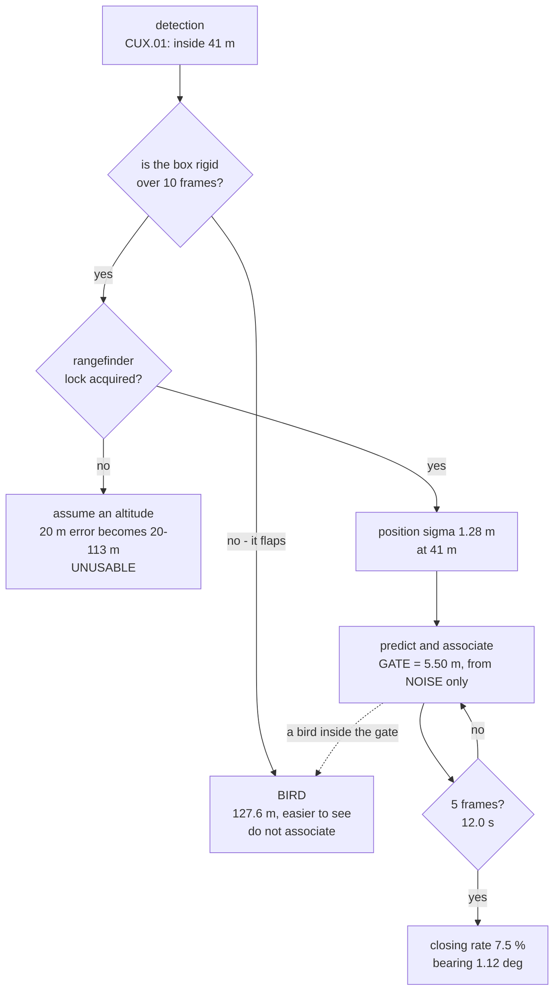

# CUX.02 From a box to a track: the association gate and the twelve-second problem

<!-- glance:start -->
<!-- generated by tools/build.py from curriculum/syllabus.yaml — edit the syllabus, not this block -->

| | |
|---|---|
| **Track** | Optional foundation |
| **Difficulty** | Advanced |
| **Time** | 1 h 15 min |
| **Hardware** | Onboard computer & vision (stage 2) |
| **Software** | python |
| **Prerequisites** | [14.05 From detection to a track, and from a pixel to a ground coordinate](../../14-vision-perception/14.05-tracking-and-geolocation.md) |
| **Skip if** | You can size an association gate from your own measurement noise and say what a gate that is too wide, or too narrow, does to your tracks. |

<!-- glance:end -->

## What you will learn

- That [14.05](../../14-vision-perception/14.05-tracking-and-geolocation.md)'s central trick does
  not transfer: in the sky there is **no ground plane**, so a single camera gives you a **ray**,
  not a position
- That an assumed altitude **20 m** out costs **20 m** of position error at 45° off-nadir and
  **55 m** at 70° — and at eye level there is **no solution at all**
- That [stage 2](../../hardware/stage-2-computer-and-vision.md)'s laser rangefinder deletes that
  term outright: **1.28 m** at 41 m, which is **5.5× better than 14.05's 7.03 m** ground budget
- That the association gate is a **radius built from the noise only**, never from the total:
  **5.50 m** at 99 %
- Why that gate is a bird problem: anything within **5.5 m** can steal a track's identity, and
  [CUX.01](CUX.01-detecting-another-aircraft.md) said a gull resolves to **127.6 m**
- That a track has **no velocity for 12.0 s** — five frames at 2.4 s — and $\sigma_v$ = 0.377 m/s
  when it arrives
- What a track actually buys you: a **closing rate and a bearing**, and specifically not an
  absolute position

## Why it matters

[14.05](../../14-vision-perception/14.05-tracking-and-geolocation.md) ended with a clean claim:
geolocate first, then track, and the tracker's job is easy because the ground is a plane you know.
That claim is correct and it is about the ground.

Point the same camera up and there is no plane. The ray leaves the lens and there is nothing for
it to hit. You have one measured angle and, at most, one measured range — and if you have neither,
the only way to get a position is to **guess an altitude**, which turns a 5 m error into a 55 m
one the moment you look sideways.

This lesson is where "another aircraft" stops being a detection problem and becomes an estimation
problem, and where most real projects quietly fail: not because the detector missed the drone, but
because the system needed a position it had no way to produce.

> [!WARNING]
> A track is an **identity**, not a position, and identity is much easier to lose than to
> establish. Two objects inside one association gate can swap at any frame, and Level 4 shows the
> 5.5 m gate you need to keep a track alive is wide enough for a bird to walk into. Never let a
> track's identity drive an action without confirming it — which is why
> [CUX.03](CUX.03-remote-id-and-identification.md) exists and why nothing in this track acts on a
> track alone.

## Prerequisites

<!-- prereqs:start -->
## Prerequisites

You need these first:

- [14.05 From detection to a track, and from a pixel to a ground coordinate](../../14-vision-perception/14.05-tracking-and-geolocation.md)

### Optional prerequisite links

None.

Check your readiness: `python course.py why CUX.02`
<!-- prereqs:end -->

## Concept

Stand at the edge of a field and look at a post 40 m away. You know roughly where it is. Now look
at a bird 40 m away, at a similar angle, and you know almost nothing — because there is no ground
under the bird to tell you how far away it is. The post sits on a plane you know; the bird does
not.

That is the whole of Level 1, and it has a very practical consequence: **the geometry that lets
you see a drone at all is the geometry that stops you knowing where it is.** You have to look
sideways to see something in the sky, and the further sideways you look, the worse a small mistake
in assumed height becomes.

The second idea is what association actually is, and most people meet it only in the failure.
Your tracker is not comparing this detection with the last detection. It is comparing this
detection with a **prediction** — where the track's model says the target should be now, given
where it was. The difference between that prediction and the new measurement is the
**innovation**, and it is the only thing the gate has to be sized against.

The third idea is the one that catches people: **the tracker's product is an identity, not a
location.** "That box is the same aircraft as last frame" is a claim, and a claim can be wrong in
a way that no amount of filtering fixes. Level 4 is about how it goes wrong.

## Technical explanation

### Level 1 — there is no ground plane, so you must assume a height

The camera sits at height $H$; the target is at horizontal distance $D$ and height $h_T$. Write
$\Delta h = H - h_T$ and let $\theta$ be the angle off nadir, so $\tan\theta = D/\Delta h$ and
$R = \Delta h / \cos\theta$.

[14.05](../../14-vision-perception/14.05-tracking-and-geolocation.md) measured $\theta$ from the
image and intersected the ray with a known plane. Here there is no plane, so if you measure only
$\theta$ you must assume $\Delta h$:

$$ D_{est} = \Delta h_{assumed}\tan\theta, \qquad \Delta D = e\tan\theta $$

where $e$ is the error in the assumed height difference. The cross-range error follows too, at
$\Delta R = e/\cos\theta$.

| off nadir | tan(θ) | **position error** | range error |
|---|---|---|---|
| 10° | 0.176 | 3.5 m | 20.3 m |
| 20° | 0.364 | 7.3 m | 21.3 m |
| 30° | 0.577 | 11.5 m | 23.1 m |
| 45° | 1.000 | **20.0 m** | 28.3 m |
| 60° | 1.732 | 34.6 m | 40.0 m |
| 70° | 2.747 | **54.9 m** | 58.5 m |
| 80° | 5.671 | 113.4 m | 115.2 m |

Read the last row and then the degenerate case. **A target at your own altitude has $\Delta h = 0$,
so $\tan\theta$ is infinite and there is no solution at all.** A drone holding station at exactly
your height is invisible to this geometry — and that is precisely where a tethered or loitering
aircraft would sit.

Compare the arithmetic with the ground case. On a survey, the dominant term was terrain at
**5.00 m** out of a 7.03 m budget. Here the dominant term is the height assumption, and it is
**20–113 m** depending on where you are looking. The sky is not five times harder to localise than
the ground at a tenth of the range. It is roughly two orders of magnitude harder.

### Level 2 — or measure the range, and the problem goes away

Stage 2 already lists a laser rangefinder. With a measured $R$ you do not need an altitude
assumption at all: $\Delta h = R\cos\theta$ and $D = R\sin\theta$ both fall out directly. The
assumed-height term simply leaves the budget.

Rebuild the budget the way [14.05](../../14-vision-perception/14.05-tracking-and-geolocation.md)
built it — one term at a time, variances added — using that lesson's own pointing numbers and
[CUX.01](CUX.01-detecting-another-aircraft.md)'s 41 m ceiling:

| term | σ | at 41 m | at 200 m | source |
|---|---|---|---|---|
| attitude + mount | 0.01951 rad | 0.800 m | 3.903 m | 06.05's EKF, and 14.02's eyeballed mount |
| calibration | 0.00010 rad | 0.004 m | 0.021 m | 14.02's reprojection |
| rangefinder | 1.0 m | 1.000 m | 1.000 m | **measure your own** |
| **total** | | **1.28 m** | **4.03 m** | |

At 41 m this budget is **1.28 m** — **5.5× better** than the 7.03 m the same course paid for
ground geolocation, at a range nine times shorter.

The reason is worth internalising, because it is counter-intuitive: **the pointing error scales
with range, and at 41 m the aircraft is close.** Your attitude knowledge is worth more when the
target is near. The lesson of the day is not "short range is bad"; it is that the *pointing
error* is range-dependent and everything else mostly is not.

One caveat you must check yourself: a small dark multirotor is a poor reflector, and a cheap
rangefinder's published accuracy is usually measured against a cooperative target at a cooperative
angle. Measure yours against **your own aircraft, indoors**, before you trust a number derived
from it.

### Level 3 — the gate is a radius, built from the noise only

Association does not compare this detection with the last detection. It compares it with the
track's **prediction**, and the gate is sized from what is left over — the innovation.

With the Level 2 budget, a single position measurement has $\sigma = 1.28$ m. The difference of
two independent such measurements has $\sigma\sqrt2 = 1.81$ m. For a two-dimensional position
innovation, a 99 % gate is $\sqrt{\chi^2_{2,0.99}} = \sqrt{9.21} = 3.03$ times that:

$$ G = 3.03 \times 1.81 = \mathbf{5.50\ m} $$

Now the instruction that matters more than the arithmetic. **Size the gate from the noise, never
from the total.** [14.05](../../14-vision-perception/14.05-tracking-and-geolocation.md) was emphatic
that its 7.03 m total splits into noise that averages away and bias that does not, and that a
Kalman filter is powerless against the second kind. Bias must never be allowed to widen your gate,
because widening for an error you cannot fix does not reduce it — it just admits more clutter into
every association decision you make.

### Level 4 — a gate this wide lets a bird steal the track

Two detections inside one gate can be associated with each other. Whether they will depends only
on how far apart they are:

| separation | association |
|---|---|
| 1.0 m apart | **SWAPS** |
| 2.0 m apart | **SWAPS** |
| 4.0 m apart | **SWAPS** |
| 5.0 m apart | **SWAPS** |
| 6.0 m apart | safe |
| 8.0 m apart | safe |
| 12.0 m apart | safe |
| 20.0 m apart | safe |

Now combine this with [CUX.01](CUX.01-detecting-another-aircraft.md). A herring gull is **1.40 m**
across and resolves out to **127.6 m** — three times the range at which the drone is detectable.
Birds are not marginal in this application; they are the **easier** target. A gull sitting five
metres to the side of a drone is inside a 5.5 m gate.

So the sequence in a real sky watch is entirely predictable: the tracker acquires the bird first,
because the bird is closer to the gate than the drone is; the drone's detections arrive, are
rejected as belonging to the bird's track, and start a new track; and the track you end up
reporting is a herring gull.

The obvious response — narrow the gate — makes it worse, and
[14.05](../../14-vision-perception/14.05-tracking-and-geolocation.md) already documented how: a gate
narrower than the innovation produces **a new track every frame**, which looks like a broken
detector and costs you the aircraft entirely. The real fix is not the gate. It is
[CUX.01](CUX.01-detecting-another-aircraft.md)'s Level 5 — discriminate on bounding-box rigidity
before you associate, so the bird never enters the tracker at all.

### Level 5 — twelve seconds before the track is worth anything

A velocity needs two positions, and differencing two noisy positions adds noise rather than
removing it. Over $k$ frames the standard deviation of the velocity estimate is

$$ \sigma_v = \frac{\sigma\sqrt{2}}{\Delta t \sqrt{k-1}} $$

| frames | σ_v | at 5 m/s | at 16.8 m/s | time |
|---|---|---|---|---|
| 2 | 0.755 m/s | 15.1 % | 4.5 % | 4.8 s |
| 3 | 0.534 m/s | 10.7 % | 3.2 % | 7.2 s |
| 4 | 0.436 m/s | 8.7 % | 2.6 % | 9.6 s |
| **5** | **0.377 m/s** | **7.5 %** | **2.2 %** | **12.0 s** |
| 6 | 0.337 m/s | 6.7 % | 2.0 % | 14.4 s |
| 9 | 0.267 m/s | 5.3 % | 1.6 % | 21.6 s |

Five frames at [12.02](../../12-autonomous-flight/12.02-mission-planning.md)'s 2.4 s trigger
interval is **12.0 s** — the same number [14.05](../../14-vision-perception/14.05-tracking-and-geolocation.md)
arrived at by a different route, which is the best kind of agreement.

Until that point the track has no velocity, and a track with no velocity cannot be extrapolated,
cannot be deconflicted against, and cannot be evaded. **12.0 s is the honest latency of a
track-based system**, and [CUX.04](CUX.04-warning-reporting-and-evidence.md) builds its whole
timeline on top of this number.

Note also how the error behaves. At 5 m/s a 0.377 m/s velocity error is 7.5 % — comfortable. At
16.8 m/s, Hermon's own best-range speed from
[`hermon-numbers.md`](../../references/hermon-numbers.md), it is **2.2 %**. **The faster the
target, the better your velocity estimate**, which is the opposite of the intuition and follows
directly from the error being an absolute one.

> **Ask your teacher:** "You report a track's position — show me the measurement behind that
> number." A good answer names a rangefinder reading. A bad answer names a filter output, because
> [14.05](../../14-vision-perception/14.05-tracking-and-geolocation.md) already showed that a
> filter cannot remove the bias in it.

### Level 6 — what the track buys, and what it does not

| quantity | value at 5 frames | trustworthy? |
|---|---|---|
| position σ | 1.281 m | **no** — 14.05's bias survives |
| velocity σ | 0.377 m/s | yes |
| closing-rate error | 7.5 % | yes |
| cross-range error | 0.800 m | yes |
| bearing σ | 1.12° | yes |

[14.05](../../14-vision-perception/14.05-tracking-and-geolocation.md)'s central result survives
this lesson completely unchanged: **a bias cancels in velocity, in relative distance and in
cross-frame agreement, and not in absolute position.**

So a track hands you a closing rate and a bearing — relative geometry, which is why the numbers
above are good — and does **not** hand you a position you should ever write down as one. That
distinction is not pedantry. It is exactly what makes deconfliction possible in
[CUX.05](CUX.05-deconfliction-and-right-of-way.md), which needs a closing rate, and exactly what
would be indefensible in a report, which needs a position.

## Diagram



## Code

The whole model in pure standard-library Python. The camera, the trigger interval and the process
noise come from [14.04](../../14-vision-perception/14.04-detection-in-the-air.md) and
[14.05](../../14-vision-perception/14.05-tracking-and-geolocation.md); only the geometry and the
application are new.

```python
"""CUX.02 - from a box to a track: the association gate and the twelve-second problem."""
import math

# 14.01 / 14.02's camera
PITCH = 6.17e-3 / 4000
FOCAL_M = 4.5e-3
PIX_W = 4000

# CUX.01: where this airframe can resolve an aircraft at all
R_DETECT = 41.0

# 12.02's trigger interval, and 14.05's process noise
DT = 2.4
Q_ACC = 0.10                  # how hard a target can turn, m/s^2

# 14.05's pointing errors, in DEGREES
SIG_ATT_DEG = 0.5             # 06.05's EKF
SIG_MOUNT_DEG = 1.0           # 14.02, eyeballed
SIG_CAL_PX = 0.30             # 14.02, reprojection, in pixels

# what a cheap laser rangefinder contributes
SIG_RANGE_M = 1.0             # measure it yourself; check the spec [E]

# assumed altitude error of an aircraft we cannot see the height of
ALT_ERR = 20.0

W = 74


def bar(t):
    print()
    print("  " + t)
    print("  " + "=" * len(t))


def sep(ch="-"):
    print("  " + ch * W)


def sigma_point_rad():
    a = math.radians(SIG_ATT_DEG)
    m = math.radians(SIG_MOUNT_DEG)
    return math.hypot(a, m)


def bar1():
    bar("1. THERE IS NO GROUND PLANE, SO YOU MUST ASSUME A HEIGHT")
    print()
    print("  14.05 intersected a ray with a known plane. In the sky there is no")
    print("  plane: either you measure the range or you assume an altitude.")
    print()
    print("  %-9s %10s %12s %12s" % ("off nadir", "tan(th)", "position err", "range err"))
    sep()
    for th in (10, 20, 30, 45, 60, 70, 80):
        t = math.tan(math.radians(th))
        print("  %7d deg %10.3f %9.1f m %9.1f m"
              % (th, t, ALT_ERR * t, ALT_ERR / math.cos(math.radians(th))))
    sep()
    print("  An assumed altitude that is %.0f m out costs %.0f m of position at 45 deg"
          % (ALT_ERR, ALT_ERR))
    print("  and %.0f m at 70. And at eye level - target at your own altitude -"
          % (ALT_ERR * math.tan(math.radians(70))))
    print("  tan(th) is infinite: there is NO solution at all.")
    print()
    print("  You MUST look off-nadir to see anything. Off-nadir is the geometry")
    print("  that destroys the position.")


def bar2():
    bar("2. OR MEASURE THE RANGE, AND THE PROBLEM GOES AWAY")
    sp = sigma_point_rad()
    print()
    print("  Stage 2 already lists a laser rangefinder. With a measured range R")
    print("  you solve D and dh directly - no altitude assumption is used.")
    print()
    print("  %-16s %10s %12s %12s" % ("term", "sigma", "at 41 m", "at 200 m"))
    sep()
    rows = [
        ("attitude + mount", sp, "06.05 and 14.02"),
        ("calibration", SIG_CAL_PX * PITCH / FOCAL_M, "14.02"),
        ("rangefinder", SIG_RANGE_M, "measure your own"),
    ]
    for name, s, src in rows:
        at41 = s * R_DETECT if name != "rangefinder" else s
        at200 = s * 200.0 if name != "rangefinder" else s
        print("  %-16s %10.5f %9.3f m %9.3f m   %s" % (name, s, at41, at200, src))
    tot41 = math.sqrt((sp * R_DETECT) ** 2 + SIG_RANGE_M ** 2
                      + (SIG_CAL_PX * PITCH / FOCAL_M * R_DETECT) ** 2)
    tot200 = math.sqrt((sp * 200.0) ** 2 + SIG_RANGE_M ** 2
                       + (SIG_CAL_PX * PITCH / FOCAL_M * 200.0) ** 2)
    sep()
    print("  %-12s %10s %10.2f m %11.2f m" % ("TOTAL", "", tot41, tot200))
    print()
    print("  Compare with 14.05's ground budget of 7.03 m. At 41 m this is")
    print("  %.1f x BETTER, because the pointing error scales with range and the" % (7.03 / tot41))
    print("  aircraft is close. The rangefinder, not the camera, did that.")
    print()
    print("  The caveat: a small dark multirotor is a poor reflector. Measure the")
    print("  rangefinder against YOUR aircraft, indoors, before you trust it.")


def bar3():
    bar("3. THE GATE IS A RADIUS, BUILT FROM THE NOISE ONLY")
    sp = sigma_point_rad()
    sig = math.sqrt((sp * R_DETECT) ** 2 + SIG_RANGE_M ** 2
                    + (SIG_CAL_PX * PITCH / FOCAL_M * R_DETECT) ** 2)
    innov = sig * math.sqrt(2.0)          # two independent measurements differ
    gate = math.sqrt(9.21) * innov        # chi-square 2-D, 99 %
    print()
    print("  Association compares a track's PREDICTION with a new detection.")
    print("  The prediction is right most of the time, so the gate is sized")
    print("  from the INNOVATION - what is left over.")
    print()
    print("  %-34s %10.4f m" % ("per-measurement sigma at 41 m", sig))
    print("  %-34s %10.4f m" % ("innovation sigma (sqrt 2)", innov))
    print("  %-34s %10.2f m" % ("99 % gate, chi-square 2-D", gate))
    print()
    print("  Use the noise, never the total. 14.05's 7.03 m total is dominated")
    print("  by BIAS, which a filter cannot remove and which must NOT widen the")
    print("  gate - widening for a bias you cannot fix just admits more clutter.")
    return gate


def bar4(gate):
    bar("4. A GATE THIS WIDE LETS A BIRD STEAL THE TRACK")
    print()
    print("  Two things inside one gate can swap. How likely depends only on")
    print("  how far apart they are.")
    print()
    print("  %-24s %14s" % ("separation", "association"))
    sep()
    for d in (1.0, 2.0, 4.0, 5.0, 6.0, 8.0, 12.0, 20.0):
        risk = "SWAPS" if d < gate else "safe"
        print("  %-24s %14s" % ("%.1f m apart" % d, risk))
    sep()
    print("  With a %.1f m gate, anything within %.1f m can steal the identity." % (gate, gate))
    print()
    print("  CUX.01 said a gull resolves to 127.6 m. A gull 5 m to the side of")
    print("  a drone at 41 m is inside that gate. So the FIRST thing a track")
    print("  will acquire out there is a bird, and the second thing it loses is")
    print("  the aircraft. Narrowing the gate below the innovation makes both")
    print("  worse: 14.05's failure mode - a new track every frame.")


def bar5():
    bar("5. TWELVE SECONDS BEFORE THE TRACK IS WORTH ANYTHING")
    sp = sigma_point_rad()
    sig = math.sqrt((sp * R_DETECT) ** 2 + SIG_RANGE_M ** 2
                    + (SIG_CAL_PX * PITCH / FOCAL_M * R_DETECT) ** 2)
    print()
    print("  A velocity needs two positions, and differencing adds noise.")
    print("  Over k frames:  sigma_v = sigma * sqrt(2) / (dt * sqrt(k-1))")
    print()
    print("  %-8s %10s %12s %12s %14s"
          % ("frames", "sigma_v", "at 5 m/s", "at 16.8 m/s", "time (s)"))
    sep()
    for k in (2, 3, 4, 5, 6, 9):
        sv = sig * math.sqrt(2.0) / (DT * math.sqrt(k - 1))
        print("  %-8d %8.3f m/s %11.1f %% %11.1f %% %13.1f"
              % (k, sv, sv / 5.0 * 100, sv / 16.8 * 100, k * DT))
    sep()
    print("  Five frames at 2.4 s is 12.0 s - the same number 14.05 arrived at,")
    print("  by a different road. Until then the track has no velocity, and a")
    print("  track with no velocity cannot be extrapolated, deconflicted")
    print("  against, or evaded.")


def bar6(gate, sig):
    bar("6. WHAT THE TRACK BUYS, AND WHAT IT DOES NOT")
    sv5 = sig * math.sqrt(2.0) / (DT * math.sqrt(4))
    print()
    print("  %-30s %14s %14s" % ("quantity", "value at 5 frames", "trustworthy?"))
    sep()
    print("  %-30s %11.3f m %14s" % ("position sigma", sig, "no - 14.05's bias"))
    print("  %-30s %11.3f m/s %14s" % ("velocity sigma", sv5, "yes"))
    print("  %-30s %13.1f %% %14s" % ("closing rate error", sv5 / 5.0 * 100, "yes"))
    print("  %-30s %11.3f m %14s"
          % ("cross-range error", sigma_point_rad() * R_DETECT, "yes"))
    print("  %-30s %13.2f deg %14s"
          % ("bearing sigma", math.degrees(sigma_point_rad()), "yes"))
    sep()
    print("  14.05's result survives unchanged: a BIAS cancels in velocity, in")
    print("  relative distance and in cross-frame agreement, and NOT in")
    print("  absolute position. So a track gives you a closing rate and a")
    print("  bearing. That is what CUX.05 deconflicts with, and it is NOT a")
    print("  position you should ever report as one.")


def main():
    bar("CUX.02  FROM A BOX TO A TRACK")
    print("  The tracker is 14.05's, re-pointed upward.")
    bar1()
    bar2()
    gate = bar3()
    bar4(gate)
    bar5()
    sig = math.sqrt((sigma_point_rad() * R_DETECT) ** 2 + SIG_RANGE_M ** 2
                    + (SIG_CAL_PX * PITCH / FOCAL_M * R_DETECT) ** 2)
    bar6(gate, sig)


if __name__ == "__main__":
    main()
```

Output:

```text

  CUX.02  FROM A BOX TO A TRACK
  =============================
  The tracker is 14.05's, re-pointed upward.

  1. THERE IS NO GROUND PLANE, SO YOU MUST ASSUME A HEIGHT
  ========================================================

  14.05 intersected a ray with a known plane. In the sky there is no
  plane: either you measure the range or you assume an altitude.

  off nadir    tan(th) position err    range err
  --------------------------------------------------------------------------
       10 deg      0.176       3.5 m      20.3 m
       20 deg      0.364       7.3 m      21.3 m
       30 deg      0.577      11.5 m      23.1 m
       45 deg      1.000      20.0 m      28.3 m
       60 deg      1.732      34.6 m      40.0 m
       70 deg      2.747      54.9 m      58.5 m
       80 deg      5.671     113.4 m     115.2 m
  --------------------------------------------------------------------------
  An assumed altitude that is 20 m out costs 20 m of position at 45 deg
  and 55 m at 70. And at eye level - target at your own altitude -
  tan(th) is infinite: there is NO solution at all.

  You MUST look off-nadir to see anything. Off-nadir is the geometry
  that destroys the position.

  2. OR MEASURE THE RANGE, AND THE PROBLEM GOES AWAY
  ==================================================

  Stage 2 already lists a laser rangefinder. With a measured range R
  you solve D and dh directly - no altitude assumption is used.

  term                  sigma      at 41 m     at 200 m
  --------------------------------------------------------------------------
  attitude + mount    0.01951     0.800 m     3.903 m   06.05 and 14.02
  calibration         0.00010     0.004 m     0.021 m   14.02
  rangefinder         1.00000     1.000 m     1.000 m   measure your own
  --------------------------------------------------------------------------
  TOTAL                         1.28 m        4.03 m

  Compare with 14.05's ground budget of 7.03 m. At 41 m this is
  5.5 x BETTER, because the pointing error scales with range and the
  aircraft is close. The rangefinder, not the camera, did that.

  The caveat: a small dark multirotor is a poor reflector. Measure the
  rangefinder against YOUR aircraft, indoors, before you trust it.

  3. THE GATE IS A RADIUS, BUILT FROM THE NOISE ONLY
  ==================================================

  Association compares a track's PREDICTION with a new detection.
  The prediction is right most of the time, so the gate is sized
  from the INNOVATION - what is left over.

  per-measurement sigma at 41 m          1.2807 m
  innovation sigma (sqrt 2)              1.8111 m
  99 % gate, chi-square 2-D                5.50 m

  Use the noise, never the total. 14.05's 7.03 m total is dominated
  by BIAS, which a filter cannot remove and which must NOT widen the
  gate - widening for a bias you cannot fix just admits more clutter.

  4. A GATE THIS WIDE LETS A BIRD STEAL THE TRACK
  ===============================================

  Two things inside one gate can swap. How likely depends only on
  how far apart they are.

  separation                  association
  --------------------------------------------------------------------------
  1.0 m apart                       SWAPS
  2.0 m apart                       SWAPS
  4.0 m apart                       SWAPS
  5.0 m apart                       SWAPS
  6.0 m apart                        safe
  8.0 m apart                        safe
  12.0 m apart                       safe
  20.0 m apart                       safe
  --------------------------------------------------------------------------
  With a 5.5 m gate, anything within 5.5 m can steal the identity.

  CUX.01 said a gull resolves to 127.6 m. A gull 5 m to the side of
  a drone at 41 m is inside that gate. So the FIRST thing a track
  will acquire out there is a bird, and the second thing it loses is
  the aircraft. Narrowing the gate below the innovation makes both
  worse: 14.05's failure mode - a new track every frame.

  5. TWELVE SECONDS BEFORE THE TRACK IS WORTH ANYTHING
  ====================================================

  A velocity needs two positions, and differencing adds noise.
  Over k frames:  sigma_v = sigma * sqrt(2) / (dt * sqrt(k-1))

  frames      sigma_v     at 5 m/s  at 16.8 m/s       time (s)
  --------------------------------------------------------------------------
  2           0.755 m/s        15.1 %         4.5 %           4.8
  3           0.534 m/s        10.7 %         3.2 %           7.2
  4           0.436 m/s         8.7 %         2.6 %           9.6
  5           0.377 m/s         7.5 %         2.2 %          12.0
  6           0.337 m/s         6.7 %         2.0 %          14.4
  9           0.267 m/s         5.3 %         1.6 %          21.6
  --------------------------------------------------------------------------
  Five frames at 2.4 s is 12.0 s - the same number 14.05 arrived at,
  by a different road. Until then the track has no velocity, and a
  track with no velocity cannot be extrapolated, deconflicted
  against, or evaded.

  6. WHAT THE TRACK BUYS, AND WHAT IT DOES NOT
  ============================================

  quantity                       value at 5 frames   trustworthy?
  --------------------------------------------------------------------------
  position sigma                       1.281 m no - 14.05's bias
  velocity sigma                       0.377 m/s            yes
  closing rate error                       7.5 %            yes
  cross-range error                    0.800 m            yes
  bearing sigma                           1.12 deg            yes
  --------------------------------------------------------------------------
  14.05's result survives unchanged: a BIAS cancels in velocity, in
  relative distance and in cross-frame agreement, and NOT in
  absolute position. So a track gives you a closing rate and a
  bearing. That is what CUX.05 deconflicts with, and it is NOT a
  position you should ever report as one.
```

## Exercise

### Exercise CUX.02-E1 — Price the altitude assumption `[numeric]`

Take an off-nadir angle you would actually use — say the point where a drone 100 m away at your own
altitude would be, or a realistic 55° — and an altitude error you think is reasonable. Compute the
position error. Then answer: **how accurate would your assumed altitude have to be to match
14.05's 7.03 m ground budget at 45°?** Check your arithmetic against the table.

### Exercise CUX.02-E2 — Measure your own rangefinder `[build]`

Put a tape measure down a corridor, take a target at 10 m, 20 m, 40 m and at the detection ceiling
from Level 2. Take fifty readings at each distance and report the **mean, standard deviation and
worst case** of the error. Use something with roughly the radar cross-section of a small quad — a
matte black box, not a retroreflective sign — and say in your report which you used. This is
[Exercise 17.05](../../17-payloads-delivery/17.05-drop-point-math.md)'s release-point measurement
applied to a target you did not place.

### Exercise CUX.02-E3 — Size and test your own gate `[build]`

Take your Level 2 budget, compute the gate, and then run a tracker over your own simulated
detections: one true target moving in a straight line at a speed you choose, plus one false
positive at a range of separations. Report the separation at which identity swapping begins, and
confirm it matches your gate. Then narrow the gate by 20 % and show the track count per frame go
up — reproducing 14.05's documented failure on purpose.

### Exercise CUX.02-E4 — Measure your own track latency `[build]`

Fly or bench a constant-motion target past the camera and log the detections with timestamps. Find
the first frame at which your estimated velocity agrees with the true velocity to within the
error your σ predicts. Report **time-to-usable-track in seconds**, and compare it with 12.0 s.

## Expected result

**CUX.02-E1**: at 45° the answer is **7 m** — an assumed height good to 7 m, which is a
third of the typical separation between published flight levels and considerably finer than you
will get from an aircraft you cannot see. At 70° you need **1.3 m**, which is not a number anyone
assumes. The conclusion is that the assumed-altitude route cannot be made to work, and the
rangefinder is not an accessory.

**CUX.02-E2**: expect the spread to be dominated by reflectivity, not by the datasheet. A
matte target at the long end will usually be worse than the published figure, and the spread
across fifty readings will be larger than the mean error. Whatever you measure becomes Level 2's
third row, and Level 2's total is then whatever you made it.

**CUX.02-E3**: swapping should begin just inside your computed gate, and the transition should be
sharp rather than gradual — which is itself worth understanding, because it means there is no
comfortable middle setting. The narrowed gate should give roughly one new track per frame, which
is 14.05's "the tracker starts a new track every frame" reproduced deliberately.

**CUX.02-E4**: expect something close to **12.0 s**, possibly longer if your detector is not
running at 12.02's 2.4 s interval. If you measure substantially less, check that your "true"
velocity is not being computed from the same detections you are testing — a circular check will
report a track that is ready immediately, and it will be wrong.

## Troubleshooting

- **The position is wrong by tens of metres and the detection is fine.** You are using an assumed
  altitude. Level 1, and it gets worse the further off-nadir you look.
- **The track jumps to a different object.** Level 4. Check the separation between the two boxes at
  the moment of the swap; if it is under your gate, the gate is doing exactly what it was told.
- **A new track every frame.** The gate is narrower than the innovation. Widen it to Level 3, do
  not keep guessing.
- **The velocity is fine but the reported position drifts.** That is 14.05's bias, unchanged. It
  is not a bug and no filter fixes it — report the velocity and the bearing, and get the position
  from somewhere else.
- **The rangefinder returns nothing at 40 m.** Small dark aircraft are poor reflectors. Check the
  minimum-range spec and try a brighter target before you conclude the sensor is faulty.
- **Everything tracks beautifully until a bird appears.** Expected. Discriminate first, associate
  second.

## Common mistakes

- **Sizing the gate from the total error instead of the noise.** Bias in a gate does not reduce
  bias; it admits clutter.
- **Reporting the track's position as a position.** 14.05's result is explicit and it survives this
  lesson intact.
- **Assuming 14.05's two-hit rule survives.** [CUX.01](CUX.01-detecting-another-aircraft.md)
  Level 4 showed it does not; a moving target is never in the same place twice.
- **Narrowing the gate to fix birds.** Birds are the wrong symptom. Associate them out of
  existence first.
- **Quoting a track's velocity after two frames.** Two frames is 15.1 % error at 5 m/s.
- **Forgetting the eye-level case.** A target at your own altitude has no solution at all, and that
  is a real place for a loitering aircraft to sit.

## Knowledge check

**Q1. Why can you not geolocate an aircraft in the sky the way 14.05 geolocated a sheep?**

<details>
<summary>Show the answer</summary>

Because 14.05 intersected a ray with a plane it already knew — the ground. In the sky there is
no plane. Measuring the off-nadir angle alone leaves $\Delta h$ unknown, and the position error is
$e\tan\theta$: a 20 m altitude error becomes **20 m** of position at 45° and **55 m** at 70°. At
eye level $\Delta h = 0$ and there is no solution at all.
</details>

**Q2. What does the laser rangefinder change, and by how much?**

<details>
<summary>Show the answer</summary>

It removes the altitude assumption entirely, because with a measured range you solve
$\Delta h = R\cos\theta$ and $D = R\sin\theta$ directly. At CUX.01's 41 m ceiling the budget
falls from tens of metres to **1.28 m** — 5.5× better than 14.05's 7.03 m ground budget. The
reason it is better at shorter range is that the pointing error scales with range and everything
else mostly does not.
</details>

**Q3. Your gate is 5.5 m and a track keeps changing identity. What is happening?**

<details>
<summary>Show the answer</summary>

Something else is inside the gate — almost certainly a bird. CUX.01 established that a gull
resolves to 127.6 m, three times the drone's 41 m, so a bird is the easier target. Anything
within 5.5 m of the prediction can swap, and 5 m of separation between a drone and a gull is
ordinary. Narrowing the gate makes it worse by producing a new track every frame; the fix is
CUX.01's Level 5 discrimination, applied before association.
</details>

**Q4. Why 12.0 s, and why does it matter?**

<details>
<summary>Show the answer</summary>

A velocity needs two positions, and the differenced estimate has
$\sigma_v = \sigma\sqrt{2}/(\Delta t\sqrt{k-1})$. Five frames at 12.02's 2.4 s trigger interval
is 12.0 s, at which $\sigma_v$ is 0.377 m/s. Until then there is no velocity, and nothing that
needs one — deconfliction, extrapolation, evasion — can start.
</details>

**Q5. Which part of the track's output is trustworthy, and which must never be reported as a
position?**

<details>
<summary>Show the answer</summary>

Velocity, closing rate and bearing. Position is not: 14.05 showed a bias cancels in velocity, in
relative distance and in cross-frame agreement, and **not** in absolute position, and that result
survives being pointed at the sky unchanged. This is why CUX.05 can deconflict against a track
and why a report must get its position from somewhere else.
</details>

## Practical challenge

> [!CAUTION]
> Bench this, outdoors, on a tripod, with the aircraft **disarmed and props removed** until the
> association is proven on recorded data. Then repeat it in the air with a second person on the
> spot and a hand on the disarm. Every number in this lesson is a closed-loop result on equipment
> you own — there is nothing here worth flying an aircraft into traffic to obtain.

1. Put the tripod at a known height and set the gimbal at a **45° off-nadir** elevation.
2. Fly a second quadcopter as the target on a measured straight line well away from people, at a
   speed you time with a stopwatch.
3. Log detections with timestamps, ranges and boxes for the whole pass.
4. From the log, compute: the empirical position error against truth, the empirical velocity error
   against the timed truth, the separation at which your tracker swapped (put a bird or a decoy in
   the line), and your **time-to-usable-track**.
5. Compare all four against Levels 2, 5 and 4.

The fourth number is the one to carry forward. **Time-to-usable-track is the number
[CUX.04](CUX.04-warning-reporting-and-evidence.md) needs**, and if yours differs from 12.0 s, that
difference is the finding.

## You can skip this if

You can state why a ray in the sky cannot be intersected with anything, compute the position error
from an assumed altitude at a given off-nadir angle, size an association gate from a measured
noise budget, explain why narrowing that gate makes identity swapping worse, and state why 14.05's
bias result survives being pointed upward.

## Go deeper

- [ArduPilot — Companion Computer / Offboard Control](https://ardupilot.org/dev/docs/companion-computers.html) — how a
  companion computer drives the gimbal that makes a repeatable sky sweep possible at all, and
  where the hard real-time boundary sits relative to [CUX.05](CUX.05-deconfliction-and-right-of-way.md).
- [FAA Advisory Circular 107-2A](https://www.faa.gov/documentLibrary/media/Advisory_Circular/Editorial_Update_AC_107-2A.pdf)
  — the official preflight-area guidance, which is the natural companion to Level 1: establishing
  what is already in the sky before you join it.
- [14.05 Tracking and geolocation](../../14-vision-perception/14.05-tracking-and-geolocation.md) —
  the lesson this one inherits its tracker, its budget discipline and its bias result from, and the
  one to re-read if Levels 3 and 4 feel arbitrary.

## Progress checkpoint

You can now say why the ground-plane trick fails in the sky, compute the position error from an
assumed altitude, show what a rangefinder does to the budget, size an association gate from noise
without contaminating it with bias, explain the bird-swap failure mode, and state the 12.0 s cost
of getting a usable velocity.

Next: [CUX.03 — Identifying it](CUX.03-remote-id-and-identification.md).