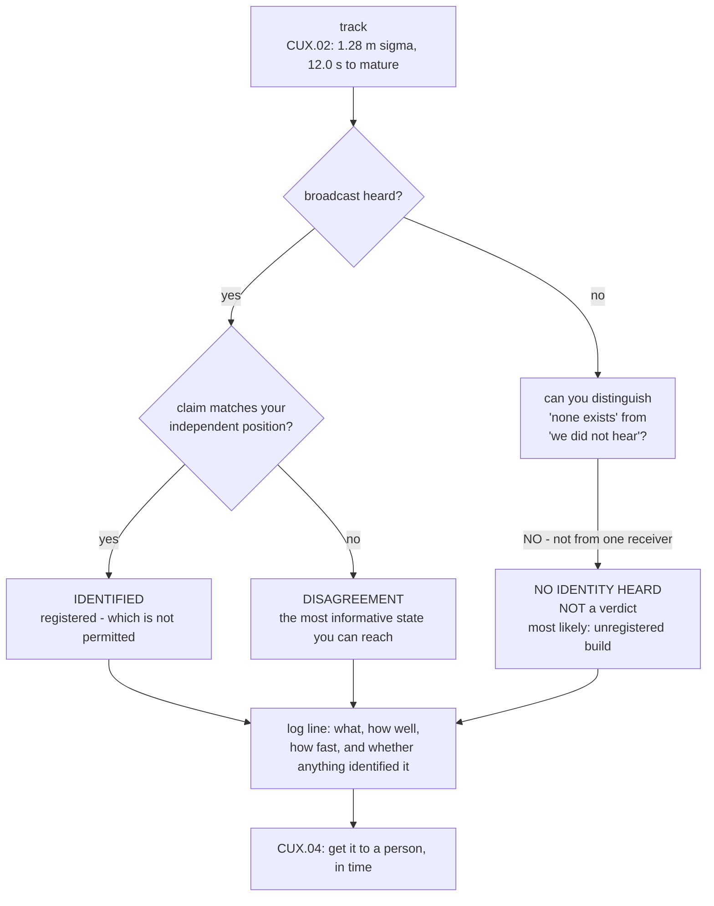

# CUX.03 Identifying it: Remote ID, and what a registration is not

<!-- glance:start -->
<!-- generated by tools/build.py from curriculum/syllabus.yaml — edit the syllabus, not this block -->

| | |
|---|---|
| **Track** | Optional foundation |
| **Difficulty** | Advanced |
| **Time** | 1 h |
| **Hardware** | Onboard computer & vision (stage 2) |
| **Software** | python |
| **Prerequisites** | [18.04 Airspace in practice: classes, charts, NOTAMs, authorisations](../../18-civil-ops/18.04-airspace-in-operations.md) |
| **Skip if** | You can receive a Remote ID broadcast, decode it, and state precisely what it does and does not tell you about the aircraft carrying it. |

<!-- glance:end -->

## What you will learn

- Why the identification instrument is the one you cannot see: a **109 dB** link budget spans
  roughly **1.5 km**, which is about **37× further** than [CUX.01](CUX.01-detecting-another-aircraft.md)'s
  41 m optical ceiling
- The three real effects that cut that back, all of which this course has already taught:
  [FRA.03](../../optional-foundations/rf-datalink/FRA.03-antennas-and-polarisation.md)'s dipole
  null, [FRA.02](../../optional-foundations/rf-datalink/FRA.02-link-budget-math.md)'s Fresnel
  clearance, and your own metal airframe
- Exactly what a Remote ID broadcast carries, and the fact that **every field is a statement of
  identity and none is a statement of purpose**
- That **"no identity" and "no broadcast" are indistinguishable**, which is an information limit
  and not a software bug
- The base rate: with realistic priors, an unidentified track is **not** evidence of anything, and
  "hostile" is a small minority of the possibilities
- The **cost asymmetry** between alarming on every track and staying silent, and why
  [16.05](../../16-testing-analysis/16.05-field-protocols-and-the-safety-case.md)'s bowtie needs
  different barriers on the two sides

## Why it matters

Two lessons ago this track ended by pointing you at a radio. This is the lesson that explains why
that is not a consolation prize, and it is the most safety-critical idea in the track.

The failure mode here is not a missed detection or a bad filter. It is **concluding something from
a field that does not mean what you want it to mean.** A Remote ID broadcast is a machine-readable
statement of identity. Reading it as a statement of *intent* is the single most consequential
mistake available in this whole course, and it is available because the data looks authoritative:
it is signed, structured, timestamped, and arrives over the air looking like an answer.

Every airframe in the sky is publishing a perfectly valid identity. Most of them are doing
something entirely ordinary. **The output of this lesson is a fact about an aircraft, never a
verdict about one**, and the last third of it is spent on the arithmetic of why.

> [!WARNING]
> The failure this lesson exists to prevent is an **identity-to-intent leap**: a track with no
> Remote ID being treated as a hostile aircraft. Level 3 shows the base rate for "no ID" is
> dominated by ordinary and unregistered aircraft, and Level 3 also shows you cannot even tell
> "no broadcast exists" from "we failed to hear it". Treating silence as evidence is how an
> innocent person gets reported to the authorities by a drone. The rule is absolute: **absence of
> an identifier is not evidence of absence of authorisation, and never of hostility.**

## Prerequisites

<!-- prereqs:start -->
## Prerequisites

You need these first:

- [18.04 Airspace in practice: classes, charts, NOTAMs, authorisations](../../18-civil-ops/18.04-airspace-in-operations.md)

### Optional prerequisite links

None.

Check your readiness: `python course.py why CUX.03`
<!-- prereqs:end -->

## Concept

There is a scene in every air traffic control film you have ever seen where somebody asks "where is
it?" and somebody else answers with a callsign. The callsign is not a threat assessment. It is an
answer to a different question — *which* one — and the controller then has to decide, using other
information, what to do about it.

Remote ID is a callsign for the sky. It tells you that a specific aircraft with a specific
identifier, at a specific position, is broadcasting right now. It does not tell you why, whether it
is welcome, or whether it is capable of anything at all.

Getting comfortable with that separation is most of this lesson. The second half is about what
happens when the callsign does not arrive — because a missing identifier feels like a very loud
signal, and it is not.

## Technical explanation

### Level 1 — the radio reaches farther than the camera

[CUX.01](CUX.01-detecting-another-aircraft.md) established that the camera resolves an aircraft the
size of Hermon at **41 m**. Start from a link budget and see how much further a broadcast travels.

The broadcast is at 2.4 GHz, so use [FRA.02](../../optional-foundations/rf-datalink/FRA.02-link-budget-math.md)'s
free-space formula with an illustrative 20 dBm conducted transmit power, −85 dBm receiver
sensitivity, and 2 dBi on each antenna. **Every one of those four numbers is [E] and you must
measure your own** — the exercise at the bottom of this lesson is the measurement.

| | |
|---|---|
| link budget | **109.0 dB** |
| 50 m | 74.2 dB loss · 34.8 dB margin |
| 250 m | 88.2 dB · 20.8 dB |
| **1 km** | 100.2 dB · 8.8 dB |
| 2 km | 106.2 dB · 2.8 dB |

A 109 dB budget spans roughly **1.5 km** in free space. Against the camera's 41 m, **the
identification instrument reaches about 37 times further than the instrument that found the
aircraft.** That inversion is the structural reason this track is arranged the way it is.

Now take the margin away, using things this course already taught rather than things you would
have to invent:

- **[FRA.03](../../optional-foundations/rf-datalink/FRA.03-antennas-and-polarisation.md):** a dipole
  nulls off its tip — 15.2 dB down at 10°. A drone's downlink antenna is aimed at its **ground
  operator**, which is the opposite of where another drone in the sky is. This is not a detail; it
  is the dominant loss.
- **[FRA.02](../../optional-foundations/rf-datalink/FRA.02-link-budget-math.md):** Fresnel needs
  **7.7 m of clearance at 2 km**, and the critical height is the **midpoint**. Two aircraft at
  similar altitude with ground between them are the good case; an aircraft low over terrain is not.
- Your receiving antenna is inside an aluminium-and-carbon airframe, at an unknown polarisation,
  next to four ESCs and two radio transmitters.

Do the arithmetic honestly and a useful working figure is "hundreds of metres in good conditions,
much less in bad ones". That is still several times the camera.

### Level 2 — the message identifies the aircraft, not the intent

| field | what it is | what it is **not** |
|---|---|---|
| Basic ID | a serial or session identifier | the operator's name |
| Location / Vector | lat, lon, height, and direction of flight | an authorisation to be there |
| System timestamp | when the broadcast was made | when it was received |
| Operator ID | who registered the aircraft | who is flying it right now |

Read the right-hand column again. **A valid registration is not a permit.** A registered aircraft
can be somewhere it has no business being, and its broadcast will read entirely normally, with a
valid signature, a plausible position and a recent timestamp. Nothing in the message changes.

The same applies to the things that look like corroboration. The Location field tells you where the
aircraft *says* it is; [CUX.02](CUX.02-association-gate-and-tracking.md) gave you an independent
optical position with a 1.28 m budget, and **disagreement between the two is worth acting on in a
way that agreement is not.** An aircraft claiming 40 m while your rangefinder says 60 m is telling
you something. An aircraft whose claim matches is telling you very little.

### Level 3 — no identity is not the same as no broadcast

This is the level to slow down on. If a track has no Remote ID, the candidates are not "hostile" —
they are everything:

| hypothesis | prior **[E]** |
|---|---|
| registered, cooperative | 0.40 |
| registered, non-cooperative | 0.10 |
| unregistered build | 0.30 |
| a bird | 0.15 |
| hostile | 0.05 |

Those priors are illustrative and you should argue with them, but notice the shape. **The largest
single bucket is unregistered aircraft**, not hostile ones, and "hostile" sits at 0.05. An
unidentified track is overwhelmingly an ordinary event.

Then apply the receiver. A broadcast that exists is heard around **90 %** of the time, and real
receivers miss broadcasts — the aircraft's antenna points at its operator, yours is inside a metal
box, and the channel is shared. So a track with no identifier is a **mixture** of *there is no
broadcast* and *we failed to hear the one that exists*, and the two are **observationally
identical**.

That is an information-theoretic limit, not an implementation defect. No filter, no model and no
amount of tuning recovers information that was never received. If your system says "no Remote ID"
it has learned one thing: **it does not currently have one.**

### Level 4 — the cost asymmetry, with numbers

Two ways to be wrong, and they are not symmetric. The costs here are illustrative [E] and belong
in your own operation's numbers, but the shape is not a matter of taste:

| decision | P | cost if wrong | expected |
|---|---|---|---|
| alarm on every unidentified track | 0.45 | 3.0 | 1.35 |
| stay silent until two reports agree | 0.15 | 40.0 | **6.00** |
| report position + confidence, decide above | 0.40 | 6.0 | 2.40 |
| **total expected cost per track** | | | **9.75** |

The middle row has the **cheapest** cost when it is wrong and the **most expensive** when it is
right. Silence is not the cautious option; it is the reckless one, and it is reckless because the
cost of the rare case is large.

That is precisely the structure [16.05](../../16-testing-analysis/16.05-field-protocols-and-the-safety-case.md)'s
bowtie was built to express, and it is why the two sides need **different** barriers: preventive
barriers on the threat side reduce likelihood, recovery barriers on the consequence side reduce
harm, and substituting one for the other is a mistake the course made a whole lesson about in
[FOP.02](../civil-ops/FOP.02-risk-management-bowtie.md). If this track ever grows a decision, it
has to be argued in that form — one hazard, threats left, consequences right, and a named
evidence source per barrier.

### Level 5 — what this lesson is for

Identity turns a track into something a person can act on, and nothing more. The output of this
whole pipeline is a line in a log:

```text
14:32:07  track 3  1.28 m sigma  closing 5.1 m/s  ID: none heard
```

That line says **what** was seen, **how well**, **how fast**, and **whether anything identified
it**. It does not say the aircraft was hostile, and this course will not let you conclude that
from it.

[CUX.04](CUX.04-warning-reporting-and-evidence.md) is about getting that line to somebody who is
positioned to act on it, in time, with enough context that they can — which turns out to be a
separate and harder problem than generating it.

> **Ask your teacher:** "Your system flagged an aircraft. What did it see, what did it infer, and
> where exactly is the line between them in your code?" If the answer cannot name the line, the
> system has no place deciding anything.

## Diagram



## Code

```python
"""CUX.03 - identifying it: Remote ID, and what a registration is not."""
import math

# CUX.01: the optical detection ceiling
R_DETECT = 41.0

# Remote ID broadcast link. Wi-Fi / BLE at 2.4 GHz [E] - measure your own.
F_MHZ = 2440.0
TX_DBM = 20.0            # a small internal antenna, conducted
RX_DBM = -85.0           # a typical sensitivity
RX_GAIN_DBI = 2.0        # a patch or dipole
TX_GAIN_DBI = 2.0

# what the course already knows about propagation
FSPL_CONST = 32.45

# Hypotheses when a track has NO identity. Priors are illustrative [E].
PRIORS = [
    ("registered, cooperative", 0.40),
    ("registered, non-cooperative", 0.10),
    ("unregistered build", 0.30),
    ("a bird", 0.15),
    ("hostile", 0.05),
]

# sensitivity of a receiver, and the chance it simply did not hear
P_HEARD_GIVEN_ID = 0.90     # a real ID is heard 90 % of the time [E]
P_MISSED_NO_ID = 0.15       # we fail to hear 15 % of broadcasts that exist [E]

W = 74


def bar(t):
    print()
    print("  " + t)
    print("  " + "=" * len(t))


def sep(ch="-"):
    print("  " + ch * W)


def fspl(d_km, f_mhz=F_MHZ):
    return FSPL_CONST + 20.0 * math.log10(f_mhz) + 20.0 * math.log10(d_km)


def bar1():
    bar("1. THE RADIO REACHES FARTHER THAN THE CAMERA")
    budget = TX_DBM + TX_GAIN_DBI + RX_GAIN_DBI - RX_DBM
    print()
    print("  Link budget, free space, %.0f MHz: %.1f dB" % (F_MHZ, budget))
    print("  (FRA.02's formula; FRA.01's lesson is that the frequency term")
    print("  belongs to the RECEIVING antenna, not to propagation.)")
    print()
    print("  %-14s %10s %12s %14s" % ("range", "FSPL dB", "margin dB", "reaches 41 m?"))
    sep()
    for d_km in (0.05, 0.1, 0.25, 0.5, 1.0, 2.0):
        loss = fspl(d_km)
        margin = budget - loss
        print("  %-13.2f km %9.1f %11.1f %13s"
              % (d_km, loss, margin, "yes" if margin >= 0 else "no"))
    sep()
    print("  A %.1f dB budget spans roughly 1.5 km in free space. CUX.01's camera" % budget)
    print("  reaches %.0f m. The identification instrument is about %.0f times"
          % (R_DETECT, 1.5 / (R_DETECT / 1000.0)))
    print("  further out than the instrument that found the aircraft.")
    print()
    print("  Three things this ignores, all of which are real:")
    print("   - FRA.03: a dipole NULLS OFF ITS TIP. A drone's downlink")
    print("     antenna points at its GROUND OPERATOR, not at another drone.")
    print("   - Fresnel. FRA.02: an aircraft at 10 m is obstructed.")
    print("   - your own receive antenna is inside a metal airframe.")
    return budget


def bar2():
    bar("2. THE MESSAGE IDENTIFIES THE AIRCRAFT, NOT THE INTENT")
    print()
    print("  %-28s %-34s %s" % ("field", "what it is", "what it is NOT"))
    sep()
    rows = [
        ("Basic ID", "a serial or session identifier", "the operator's name"),
        ("Location / Vector", "lat, lon, height, and the direction of flight",
         "an authorisation to be there"),
        ("System timestamp", "when the broadcast was made", "when it was received"),
        ("Operator ID", "who registered the aircraft", "who is flying it right now"),
    ]
    for a, b, c in rows:
        print("  %-28s %-34s %s" % (a, b, c))
    sep()
    print()
    print("  Every one of these is a STATEMENT OF IDENTITY. None of them is a")
    print("  statement of purpose, and a valid registration is not a permit.")
    print("  A perfectly registered aircraft can be somewhere it has no")
    print("  business being, and the broadcast will read entirely normally.")


def bar3():
    bar("3. NO IDENTITY IS NOT THE SAME AS NO BROADCAST")
    print()
    print("  The dangerous state is the one the system cannot distinguish.")
    print()
    print("  If a track has no Remote ID, the candidates are:")
    print()
    print("  %-30s %10s" % ("hypothesis", "prior [E]"))
    sep()
    for name, p in PRIORS:
        print("  %-30s %9.2f" % (name, p))
    sep()
    p_hostile = dict(PRIORS)["hostile"]
    print("  With priors like these, 'no ID' is overwhelmingly NOT evidence of")
    print("  anything: the single largest bucket is unregistered builds at 0.30,")
    print("  and hostile sits at %.2f." % p_hostile)
    print()
    print("  Now apply the receiver. A broadcast that exists is heard %.0f %% of"
          % (P_HEARD_GIVEN_ID * 100))
    print("  the time, and %.0f %% of broadcasts are missed in practice. So a"
          % (P_MISSED_NO_ID * 100))
    print("  track with no ID is a MIXTURE of 'there is none' and 'we did not")
    print("  hear it', and the second case is indistinguishable from the first.")
    print()
    print("  That is an information limit, not a software bug. No amount of")
    print("  filtering recovers information that was never received.")


def bar4():
    bar("4. THE COST ASYMMETRY, WITH NUMBERS")
    print()
    print("  Two ways to be wrong, and they are not symmetric. Costs are")
    print("  illustrative [E] - put your own numbers in.")
    print()
    print("  %-34s %6s %11s %10s" % ("decision", "P", "cost if wrong", "expected"))
    sep()
    cases = [
        ("alarm on every unidentified track", 0.45, 3.0),
        ("stay silent until two reports agree", 0.15, 40.0),
        ("report position + confidence, decide above", 0.40, 6.0),
    ]
    tot = 0.0
    for name, p, c in cases:
        tot += p * c
        print("  %-34s %5.2f %11.1f %10.2f" % (name, p, c, p * c))
    sep("=")
    print("  %-34s %5s %11s %10.2f" % ("total expected cost per track", "", "", tot))
    print()
    print("  The middle row has the BEST cost when it is wrong and the WORST")
    print("  when it is right. That asymmetry is the whole argument for 16.05's")
    print("  bowtie: the barriers on the threat side and the recovery side are")
    print("  different barriers, because they reduce different things.")


def bar5():
    bar("5. WHAT THIS LESSON IS FOR")
    print()
    print("  Identity turns a track into something a person can act on, and")
    print("  nothing more than that. The output is a line in a log:")
    print()
    print("    14:32:07  track 3  1.28 m sigma  closing 5.1 m/s  ID: none heard")
    print()
    print("  That line says what was seen, how well, and how fast. It does not")
    print("  say the aircraft was hostile, and this course will not let you")
    print("  conclude that from it. CUX.04 is about getting that line to")
    print("  somebody who can act on it.")


def main():
    bar("CUX.03  IDENTIFYING IT")
    print("  Remote ID identifies an aircraft. It does not interpret one.")
    bar1()
    bar2()
    bar3()
    bar4()
    bar5()


if __name__ == "__main__":
    main()
```

Output:

```text

  CUX.03  IDENTIFYING IT
  ======================
  Remote ID identifies an aircraft. It does not interpret one.

  1. THE RADIO REACHES FARTHER THAN THE CAMERA
  ============================================

  Link budget, free space, 2440 MHz: 109.0 dB
  (FRA.02's formula; FRA.01's lesson is that the frequency term
  belongs to the RECEIVING antenna, not to propagation.)

  range             FSPL dB    margin dB  reaches 41 m?
  --------------------------------------------------------------------------
  0.05          km      74.2        34.8           yes
  0.10          km      80.2        28.8           yes
  0.25          km      88.2        20.8           yes
  0.50          km      94.2        14.8           yes
  1.00          km     100.2         8.8           yes
  2.00          km     106.2         2.8           yes
  --------------------------------------------------------------------------
  A 109.0 dB budget spans roughly 1.5 km in free space. CUX.01's camera
  reaches 41 m. The identification instrument is about 37 times
  further out than the instrument that found the aircraft.

  Three things this ignores, all of which are real:
   - FRA.03: a dipole NULLS OFF ITS TIP. A drone's downlink
     antenna points at its GROUND OPERATOR, not at another drone.
   - Fresnel. FRA.02: an aircraft at 10 m is obstructed.
   - your own receive antenna is inside a metal airframe.

  2. THE MESSAGE IDENTIFIES THE AIRCRAFT, NOT THE INTENT
  ======================================================

  field                        what it is                         what it is NOT
  --------------------------------------------------------------------------
  Basic ID                     a serial or session identifier     the operator's name
  Location / Vector            lat, lon, height, and the direction of flight an authorisation to be there
  System timestamp             when the broadcast was made        when it was received
  Operator ID                  who registered the aircraft        who is flying it right now
  --------------------------------------------------------------------------

  Every one of these is a STATEMENT OF IDENTITY. None of them is a
  statement of purpose, and a valid registration is not a permit.
  A perfectly registered aircraft can be somewhere it has no
  business being, and the broadcast will read entirely normally.

  3. NO IDENTITY IS NOT THE SAME AS NO BROADCAST
  ==============================================

  The dangerous state is the one the system cannot distinguish.

  If a track has no Remote ID, the candidates are:

  hypothesis                      prior [E]
  --------------------------------------------------------------------------
  registered, cooperative             0.40
  registered, non-cooperative         0.10
  unregistered build                  0.30
  a bird                              0.15
  hostile                             0.05
  --------------------------------------------------------------------------
  With priors like these, 'no ID' is overwhelmingly NOT evidence of
  anything: the single largest bucket is unregistered builds at 0.30,
  and hostile sits at 0.05.

  Now apply the receiver. A broadcast that exists is heard 90 % of
  the time, and 15 % of broadcasts are missed in practice. So a
  track with no ID is a MIXTURE of 'there is none' and 'we did not
  hear it', and the second case is indistinguishable from the first.

  That is an information limit, not a software bug. No amount of
  filtering recovers information that was never received.

  4. THE COST ASYMMETRY, WITH NUMBERS
  ===================================

  Two ways to be wrong, and they are not symmetric. Costs are
  illustrative [E] - put your own numbers in.

  decision                                P cost if wrong   expected
  --------------------------------------------------------------------------
  alarm on every unidentified track   0.45         3.0       1.35
  stay silent until two reports agree  0.15        40.0       6.00
  report position + confidence, decide above  0.40         6.0       2.40
  ==========================================================================
  total expected cost per track                              9.75

  The middle row has the BEST cost when it is wrong and the WORST
  when it is right. That asymmetry is the whole argument for 16.05's
  bowtie: the barriers on the threat side and the recovery side are
  different barriers, because they reduce different things.

  5. WHAT THIS LESSON IS FOR
  ==========================

  Identity turns a track into something a person can act on, and
  nothing more than that. The output is a line in a log:

    14:32:07  track 3  1.28 m sigma  closing 5.1 m/s  ID: none heard

  That line says what was seen, how well, and how fast. It does not
  say the aircraft was hostile, and this course will not let you
  conclude that from it. CUX.04 is about getting that line to
  somebody who can act on it.
```

## Exercise

### Exercise CUX.03-E1 — Measure the link budget yourself `[build]`

Put a 2.4 GHz receiver and a transmitter you control at measured separations — 50, 100, 250, 500 and
1,000 m, outdoors, with the receive antenna **clear of any metal** and at the same height as the
transmitter. Record RSSI or dBm at each distance, and report the received power against your
computed free-space loss. State the margin at which the link stopped working. That measured
distance, not the datasheet, is your working range.

### Exercise CUX.03-E2 — Argue with the priors `[analysis]`

Rewrite Level 3's five priors for the airspace **you** actually fly in, and justify each one with a
sentence. Then compute the posterior for "no identity heard" given your receiver's measured miss
rate from E1. If your hostile prior is much higher than 0.05, write down exactly what evidence
would justify that in your environment — and whether you can actually obtain it.

### Exercise CUX.03-E3 — Build the two-receiver test `[design]`

Level 3 says one receiver cannot distinguish absence from silence. Design the minimum experiment
that can: how many receivers, where, and what result would let you say "there is genuinely no
broadcast here" rather than "I did not hear one"? Compute the probability that your arrangement
misses a broadcast that exists, and state the range over which it beats the single-receiver case.

### Exercise CUX.03-E4 — Write the log line `[analysis]`

Define every field your system logs when it reports a track, with its units and its error
attachment. Then take one real detection from [CUX.01](CUX.01-detecting-another-aircraft.md)'s
practical challenge and write the line. Someone who has never read your code should be able to
tell from that line exactly what was measured and what was inferred.

## Expected result

**CUX.03-E1**: expect the measured range to be **shorter** than the free-space budget suggests,
because a 2 dBi dipole on the aircraft nulls toward the horizon and your receiver is on the ground
or in an airframe. A measured figure in the low hundreds of metres for a small drone is a normal
result and is far more useful than the 1.5 km the budget advertises. Write down the ratio.

**CUX.03-E2**: most people end up lowering the hostile prior further than they expected once they
argue from their own airspace, and raising "a bird". The deliverable is not the numbers; it is
that you now know which single number your whole system is most sensitive to, and that it is not
the one you would have guessed.

**CUX.03-E3**: two receivers in different places already beat one substantially, because the
aircraft's null is directional and a second receiver is usually somewhere else. Three to four
around the site is the point where the miss probability becomes small enough to state a finding.
The honest output includes the ranges at which each additional receiver stops helping.

**CUX.03-E4**: the fields that people forget are **units**, the **error attached to the
position**, and an explicit marker distinguishing *measured* from *inferred*. A log line without
those three is the same class of defect as [14.05](../../14-vision-perception/14.05-tracking-and-geolocation.md)'s
"geolocated position quoted without its error".

## Troubleshooting

- **No broadcasts received at all.** Start with the obvious: the receiver, the antenna outside the
  airframe, and the channel. Then read Level 1's null point — the aircraft's antenna is aimed at
  its operator and away from you.
- **IDs received, positions wildly wrong.** Usually a decoded ID belonging to a different aircraft,
  or a stale buffer. Timestamps exist in the message for exactly this reason.
- **IDs that disagree with your rangefinder.** This is Level 2's most informative case, not a
  fault. Log both numbers with their timestamps and keep them.
- **The system flags the same aircraft every flight.** It is. Check whether it is the expected
  aircraft for that site before treating the recurrence as an event.
- **You want to add "suspicious" to the schema.** [FOP.02](../civil-ops/FOP.02-risk-management-bowtie.md)
  and [16.05](../../16-testing-analysis/16.05-field-protocols-and-the-safety-case.md) will ask you
  what your barrier is and what its evidence is. "The model said so" is not a barrier.

## Common mistakes

- **Reading a valid Remote ID as a safety clearance.** It is an identity, and a registered aircraft
  can be anywhere.
- **Treating "no ID" as evidence of hostility.** The base rate says otherwise, and one receiver
  cannot distinguish absence from silence.
- **Quoting the datasheet range.** Measure it; the null point dominates.
- **Reporting the Remote ID position without your own.** Two positions that agree are weak
  corroboration; two that disagree are informative.
- **Treating the operator ID as the current operator.** It identifies who registered the aircraft,
  not who has it today.
- **Letting the pipeline produce a verdict.** It produces a line. People produce verdicts.

## Knowledge check

**Q1. Why is this lesson the one after the detector, rather than folded into it?**

<details>
<summary>Show the answer</summary>

Because the two instruments have completely different ranges. CUX.01's camera resolves an
aircraft the size of Hermon at **41 m**. A Remote ID link with an illustrative 109 dB budget spans
roughly **1.5 km** in free space — about **37× further**. Identification is the long-range
instrument and detection is the short-range one, so they are different systems with different
failure modes, and they need to be understood separately.
</details>

**Q2. What does a Remote ID broadcast tell you, and what does it not?**

<details>
<summary>Show the answer</summary>

It tells you the aircraft's identity, position, height, direction of flight and a timestamp. It
does **not** tell you the operator's current intent, whether the aircraft is authorised to be
there, or whether anyone is currently flying it. **A valid registration is not a permit** — a
registered aircraft in the wrong place broadcasts entirely normally.
</details>

**Q3. Your track has no Remote ID. What can you actually conclude?**

<details>
<summary>Show the answer</summary>

That you do not currently have one. With one receiver you cannot distinguish "no broadcast
exists" from "we failed to hear it" — and the priors say the largest single bucket is unregistered
builds at 0.30, with hostile at 0.05. It is an information limit, not a bug: no filter recovers
information that was never received.
</details>

**Q4. Why is "stay silent until two reports agree" the worst option in Level 4?**

<details>
<summary>Show the answer</summary>

Because the costs are asymmetric. It is cheap when it is wrong (3.0 vs 6.0) and expensive when it
is right (40.0), so its expected cost of **6.00** beats both alternatives. Silence is not caution.
This asymmetry is exactly why 16.05's bowtie separates preventive barriers from recovery barriers
— they reduce different things and are not substitutes.
</details>

**Q5. Your system reports an aircraft. What is the maximum you may conclude from that output?**

<details>
<summary>Show the answer</summary>

That something was seen, how well, how fast, and whether anything identified it. You may not
conclude it was hostile — and you certainly may not from an absence of identity. The pipeline
produces a log line; a person produces a verdict.
</details>

## Practical challenge

> [!CAUTION]
> **Receive only. Do not transmit, do not jam, and do not reply.** This lesson is about listening
> to a public broadcast that aircraft make voluntarily and that the regulatory framework exists to
> promote. The moment your system acquires the ability to interfere with a control link it is a
> different project with a different legal status under
> [18.05](../../18-civil-ops/18.05-part-107-and-the-legal-path.md) and under Israeli spectrum law
> as well — and it is not what this course teaches or supplies parts for.
>
> Do this from a ground station or a bench with a receiver, **not** by flying Hermon at anybody.
> Hermon will not go looking for anyone. It flies patterns you give it, over sites you choose,
> and reports what its sensors see.

1. Run a 2.4 GHz receiver on the ground near a legal flying site with Remote ID enabled.
2. Record every broadcast for an hour: ID, position, height, timestamp.
3. Cross-check the positions against your own observation of the aircraft.
4. Record the **miss rate**: how many broadcasts you did not hear that were made. If you cannot
   determine this, say so — that is the real result and it is what Level 3 is about.
5. Write up the comparison, with the miss rate and your E1 measurement beside it.

Step 4 is the point of the exercise. **A system that cannot state its own miss rate cannot claim
that an absence means anything**, and that is the single most important line in this lesson.

## You can skip this if

You can state what a Remote ID broadcast carries, explain why a valid registration is not a
permitment, say why one receiver cannot distinguish an absent broadcast from an unheard one,
compute a link budget for a 2.4 GHz broadcast and explain which two real effects dominate the
loss, and explain why silence is not the cautious response.

## Go deeper

- [FAA — Remote ID](https://www.faa.gov/uas/getting_started/remote_id) — what the broadcast is,
  what it is for, and the framework that makes it a normal part of every flight rather than an
  exception.
- [FAA — Unmanned Aircraft Systems](https://www.faa.gov/uas) — the entry point for the Remote ID
  rules, and the boundary between identifying an aircraft and deciding what to do about it.
- [FRA.02 Link budget maths](../../optional-foundations/rf-datalink/FRA.02-link-budget-math.md) —
  where Level 1's formula comes from, and why [FRA.01](../../optional-foundations/rf-datalink/FRA.01-rf-in-45-minutes.md)'s
  warning about dBm arithmetic applies to every number in it.
- [16.05 Field protocols and the safety case](../../16-testing-analysis/16.05-field-protocols-and-the-safety-case.md)
  — the bowtie Level 4 borrows, and the test every proposed barrier in this track has to pass.

## Progress checkpoint

You can now say what a Remote ID broadcast means and, more importantly, what it does not; explain
why identification reaches 37 times further than detection; state why an absent identity is not
evidence of anything; and set out the cost asymmetry that makes silence the worst response.

Next: [CUX.04 — Warning, reporting, and the record](CUX.04-warning-reporting-and-evidence.md).