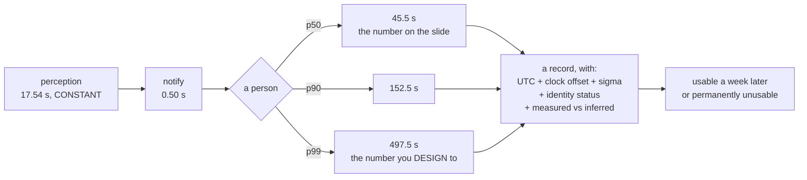

# CUX.04 Warning, reporting, and the record you are left with

<!-- glance:start -->
<!-- generated by tools/build.py from curriculum/syllabus.yaml — edit the syllabus, not this block -->

| | |
|---|---|
| **Track** | Optional foundation |
| **Difficulty** | Advanced |
| **Time** | 1 h 15 min |
| **Hardware** | Onboard computer & vision (stage 2) |
| **Software** | python |
| **Prerequisites** | [14.06 Thermal, depth, edge compute and the latency budget](../../14-vision-perception/14.06-edge-compute-and-latency.md)<br>[16.05 Field protocols and Hermon's safety case](../../16-testing-analysis/16.05-field-protocols-and-the-safety-case.md) |
| **Skip if** | You can state how many seconds pass from a detection to a human decision, and what your log has to contain to still be usable a week later. |

<!-- glance:end -->

## What you will learn

- That the whole perception stack costs **17.54 s** — and that this is **39 % of the median**
  end-to-end time but only **3.5 % of the p99**
- That **68.4 %** of perception is not the detector at all: it is
  [CUX.02](CUX.02-association-gate-and-tracking.md)'s **12.0 s** of track maturity
- That a human noticing an alert and deciding what to do is heavy-tailed, and that this puts
  time-to-inform at **45.5 s (p50)**, **152.5 s (p90)** and **497.5 s (p99)**
- That the spread from p50 to p99 is **452 s, all of it human** — which is why optimising the
  detector is not where the minutes are
- That you design to the p99 and quote the p50, and that these are **different metrics**, not a
  disagreement
- That a **0.25 s** clock offset at power-up is **6 m** of error in a reconstructed encounter at
  20 m/s closing — and that the offset is arbitrary, not bounded
- Why **a correction you cannot verify is a belief**: log the offset or the timeline is
  unfalsifiable, which is [16.05](../../16-testing-analysis/16.05-field-protocols-and-the-safety-case.md)'s
  rule applied to your own log
- The **six fields** the record has to contain, and what each one becomes without it

## Why it matters

The pipeline is finished. You can see an aircraft, track it, and say what it is. What is left is
the part that has no model in it: a radio hop to the ground station, one person's attention, and
whatever is still legible a week later when somebody with authority asks what you saw.

That part is where the actual timings live, and it is where the design decisions are. The
detector is the part everybody optimises, because it is the part that produces a graph.

This lesson is also where a track stops being data and becomes a **record**, which is a different
kind of object with different rules. [16.05](../../16-testing-analysis/16.05-field-protocols-and-the-safety-case.md)
built a whole method around the difference between a measurement and a claim, and
[FOP.03](../civil-ops/FOP.03-debrief-and-aar.md) measured the cost of not writing things down.
A detection log has to survive both tests, and it cannot be reconstructed after the fact.

> [!WARNING]
> Nothing in this lesson may be automated into a decision, and the lesson exists partly to show you
> why the numbers make that concrete rather than merely correct. **68 % of perception is waiting
> for a track to mature and the remaining time is a person.** That is a system whose most common
> mode is "did not notice" rather than "did not see", and automating the end of it means
> automating the part you understand least. [CUX.03](CUX.03-remote-id-and-identification.md)
> established that identity is not intent; this lesson establishes that a detection is not a
> report. Both end in the same place: **a person decides.**

## Prerequisites

<!-- prereqs:start -->
## Prerequisites

You need these first:

- [14.06 Thermal, depth, edge compute and the latency budget](../../14-vision-perception/14.06-edge-compute-and-latency.md)
- [16.05 Field protocols and Hermon's safety case](../../16-testing-analysis/16.05-field-protocols-and-the-safety-case.md)

### Optional prerequisite links

None.

Check your readiness: `python course.py why CUX.04`
<!-- prereqs:end -->

## Concept

Every latency budget in engineering is a lie of a useful kind. Something measures a number,
the number is small, the number is written down, and everyone moves on — while the thing the
number describes has a distribution, and the distribution has a tail, and somebody is currently
in the tail.

The classic version is the smoke alarm. It is **not** noisy, so it never becomes a nuisance and
never gets ignored — which means you do not need to train anyone to respond to it. The cook is
asleep, which means p50 is short — but the p99 is a sleeping person in a deep sleep, and that is
the case the smoke alarm was bought for.

An alerting system has no smoke-alarm trick available. The p50 of a person noticing something on
a screen is small precisely because alerts *are* noisy (recall [CUX.01](CUX.01-detecting-another-aircraft.md)'s
**514 false alarms an hour** at the tutorial threshold), and the price of the small p50 is a p99
you do not control. So you design to the p99, you quote the p50, and you are careful about which
one ends up on the slide.

The second idea is the clock, and it is duller and more important. Two computers, one event, two
timestamps, and the distance between those timestamps is a number you may or may not have
recorded — and if you did not, the timeline cannot be audited by anyone, including you.

## Technical explanation

### Level 1 — the perception stack, and what it costs

Before any human sees anything, the pipeline has to notice, decide, associate and transmit. Every
one of those numbers already exists in this course:

| stage | seconds | share |
|---|---|---|
| a sweep, if you just looked away | 4.32 | 24.6 % |
| inference, 48 tiles | 0.72 | 4.1 % |
| **the track reaches a velocity** | **12.00** | **68.4 %** |
| notify the ground station | 0.50 | 2.9 % |
| **perception, before any human** | **17.54 s** | |

Read the third row before anything else. **The detector is 4.1 % of perception.** The single
largest term is [CUX.02](CUX.02-association-gate-and-tracking.md)'s waiting for a track to mature,
which is not a limitation of your model or your accelerator — it is the arithmetic of needing five
positions before you have a velocity.

That reshapes what engineering effort is worth. A faster accelerator saves at most 0.7 s of a
17.5 s stack, and nothing at all of the p99, because perception contributes **17.54 s at every
percentile**. There is no percentile of the end-to-end time where the detector dominates.

### Level 2 — the human is the dominant term, and it has a tail

Illustrative figures **[E]** — measure your own crew, in your own environment, with your own
alert format:

| | p50 | p90 | p99 |
|---|---|---|---|
| notice the alert | 8 s | 45 s | 180 s |
| decide what to do | 20 s | 90 s | 300 s |
| **time-to-inform** | **45.5 s** | **152.5 s** | **497.5 s** |

Perception is a **constant** 17.5 s in all three rows. The spread from p50 to p99 is **452 s**, and
every second of it is human.

That is the finding, and it is uncomfortable in a useful way: **optimising the detector buys you a
few seconds out of a minute-and-a-half of spread you do not control.** The engineering leverage is
in the alert's design — how loud, how specific, how false — not in the inference rate. And the
largest single lever is the one [CUX.01](CUX.01-detecting-another-aircraft.md) already quantified:
at the tutorial threshold you are generating **514 false alarms an hour**, and an alert stream at
that rate is how you make the p99 *worse* rather than better.

### Level 3 — what you are actually designing for

| what you quote | number | what it hides |
|---|---|---|
| median, p50 | 26 s | half the cases |
| p90 | 63 s | one in ten is later |
| **p99 — design to this** | **198 s** | nothing; you are done |

The median is the number people write down and the number that gets quoted, and it is not wrong —
it is a **different metric**, describing the typical case. The p99 is the number an alerting system
is judged on, because an alerting system is judged on the case that went wrong.

This is the same discipline [14.05](../../14-vision-perception/14.05-tracking-and-geolocation.md)
applied to time: some things add, some things do not, and a mean of a heavy tail is not the tail.
A budget written from medians is a budget that is wrong exactly once per hundred alerts, which is
once per hundred times someone needed it.

The practical form: **design and accept against p99; report and plan against p50; and say which
one you are quoting.**

### Level 4 — the clock, which nobody logs

Two computers observe the same event. One of them is ArduPilot, whose clock is GNSS-disciplined.
The other is your companion computer — a Raspberry Pi, which has no real-time clock and therefore
**no meaningful notion of the time until something tells it what time it is**. From
[15.03](../../15-onboard-autonomy/15.03-mavlink-ros-bridge.md), that something is the flight
controller, over MAVLink.

The arithmetic, with an un-disciplined crystal drifting at 50 ppm **[S]** across a 20-minute
flight:

| offset at power-up | after 20 min | position error at 20 m/s closing |
|---|---|---|
| 0.00 s | 0.06 s | 1 m |
| 0.05 s | 0.11 s | 2 m |
| **0.25 s** | **0.31 s** | **6 m** |
| 1.00 s | 1.06 s | 21 m |
| 5.00 s | 5.06 s | 101 m |

A quarter of a second of offset is **6 m** of error in a reconstructed encounter. That matters for
[CUX.05](CUX.05-deconfliction-and-right-of-way.md), where the whole question is time to closest
approach.

But the real problem is not the drift — it is that **the power-up offset is arbitrary.** It is
whatever the last power-down left, unbounded by anything, and the only thing that keeps it small
is that you synchronised. And synchronising is precisely the step you cannot verify afterwards.

Which gives the rule, and it is [16.05](../../16-testing-analysis/16.05-field-protocols-and-the-safety-case.md)'s:
**a correction you cannot verify is a belief, not a correction.** [FOP.02](../civil-ops/FOP.02-risk-management-bowtie.md)
phrased it as "a barrier without evidence is a belief". Time synchronisation is a barrier, and
unless the offset is logged alongside the timestamps it has no evidence, so an auditor reading your
log later cannot tell a synchronised clock from a hopeful one.

### Level 5 — what the record has to contain

| field | what it is for | if you drop it |
|---|---|---|
| timestamp, UTC | orders the events | the timeline is unfalsifiable |
| **clock offset applied** | makes the timeline checkable | you cannot audit it |
| position **+ sigma** | what was measured, how well | a number with no error |
| identity status | what was heard, and what was not | silence reads as absence |
| **measured vs inferred** | where judgement entered | the log becomes a verdict |
| raw frames retained | re-analysis later | a bug is permanent |

Six fields. Every one is cheap at the time it is generated and **impossible to reconstruct a week
later** — the frames were overwritten, the offset was in memory, and the clock offset in particular
is unrecoverable because the second reading that would confirm it no longer exists.

That is [FOP.03](../civil-ops/FOP.03-debrief-and-aar.md)'s finding in its practical form: most of
what you observed is unusable later unless it was written down while you still had it. And note
which two rows are marked in bold — **the clock offset and the measured/inferred split are the two
that a well-engineered pipeline usually omits**, because both require admitting that judgement
entered and that a number was assumed.

> **Ask your teacher:** "Point at the line in your log where the system stops reporting what it
> measured and starts reporting what it decided." A system that cannot answer that has a finding
> problem that no amount of sensor quality will fix.

## Diagram



## Code

```python
"""CUX.04 - warning, reporting, and the record you are left with."""
import math

# ---- the perception stack, all from earlier lessons -------------------------
SWEEP_S = 4.32          # CUX.01: a full azimuth sweep, 6 looks x 48 tiles
INFER_S = 0.72          # 14.04: Coral, 48 tiles at 15 ms
TRACK_S = 12.0          # CUX.02: five frames at 2.4 s before a velocity exists
NOTIFY_S = 0.50         # 15.03: one way down the MAVLink link to the GCS

# ---- the human, which is not a constant -------------------------------------
# A human noticing an alert is heavy-tailed. Median is small, the tail is not.
# These are ILLUSTRATIVE [E] - measure your own crew.
HUMAN_NOTICE = {"p50": 8.0, "p90": 45.0, "p99": 180.0}
HUMAN_DECIDE = {"p50": 20.0, "p90": 90.0, "p99": 300.0}

CLOSING_MPS = 20.0       # two aircraft closing, for the clock-skew arithmetic

# ---- the companion's clock -------------------------------------------------
CRYSTAL_PPM = 50.0       # an un-disciplined RTC [S]
FLIGHT_MIN = 20.0

W = 74


def bar(t):
    print()
    print("  " + t)
    print("  " + "=" * len(t))


def sep(ch="-"):
    print("  " + ch * W)


def bar1():
    bar("1. THE PERCEPTION STACK, AND WHAT IT COSTS")
    stages = [
        ("a sweep, if you just looked away", SWEEP_S),
        ("inference, 48 tiles", INFER_S),
        ("the track reaches a velocity", TRACK_S),
        ("notify the ground station", NOTIFY_S),
    ]
    total = sum(s for _, s in stages)
    print()
    print("  %-34s %8s %10s" % ("stage", "seconds", "share"))
    sep()
    for name, s in stages:
        print("  %-34s %8.2f %9.1f %%" % (name, s, 100.0 * s / total))
    sep("=")
    print("  %-34s %8.2f s" % ("perception, before any human", total))
    print()
    p50_tot = total + HUMAN_NOTICE["p50"] + HUMAN_DECIDE["p50"]
    p99_tot = total + HUMAN_NOTICE["p99"] + HUMAN_DECIDE["p99"]
    print("  The same %.2f s is %.0f %% of the median end-to-end time and"
          % (total, 100.0 * total / p50_tot))
    print("  %.1f %% of the p99. That is the whole lesson." % (100.0 * total / p99_tot))


def bar2():
    bar("2. THE HUMAN IS THE DOMINANT TERM, AND IT HAS A TAIL")
    n, d = HUMAN_NOTICE, HUMAN_DECIDE
    print()
    print("  %-34s %8s %8s %8s" % ("", "p50", "p90", "p99"))
    sep()
    print("  %-34s %7.0f s %7.0f s %7.0f s"
          % ("notice the alert", n["p50"], n["p90"], n["p99"]))
    print("  %-34s %7.0f s %7.0f s %7.0f s"
          % ("decide what to do", d["p50"], d["p90"], d["p99"]))
    sep()
    for k in ("p50", "p90", "p99"):
        tot = SWEEP_S + INFER_S + TRACK_S + NOTIFY_S + n[k] + d[k]
        print("  time-to-inform, %-4s %30.1f s" % (k, tot))
    sep()
    print()
    print("  Perception contributes %.1f s at EVERY percentile."
          % (SWEEP_S + INFER_S + TRACK_S + NOTIFY_S))
    print("  The spread from p50 to p99 is %.0f s, all of it human."
          % (n["p99"] - n["p50"] + d["p99"] - d["p50"]))
    print()
    print("  So: optimising the detector buys you a few seconds out of a")
    print("  minute-and-a-half of spread you do not control.")


def bar3():
    bar("3. WHAT YOU ARE ACTUALLY DESIGNING FOR")
    base = SWEEP_S + INFER_S + TRACK_S + NOTIFY_S
    n, d = HUMAN_NOTICE, HUMAN_DECIDE
    print()
    print("  %-28s %12s %14s" % ("what you quote", "number", "what it hides"))
    sep()
    print("  %-28s %10.0f s %14s" % ("median, p50", base + n["p50"],
                                    "half the cases"))
    print("  %-28s %10.0f s %14s" % ("p90", base + n["p90"],
                                    "one in ten is later"))
    print("  %-28s %10.0f s %14s" % ("p99 - design to this", base + n["p99"],
                                    "nothing; you are done"))
    sep()
    print()
    print("  An alerting system is judged on the case that goes wrong, and")
    print("  that case is the p99. Quoting p50 is not optimism, it is a")
    print("  different metric - but it is the one that gets written down.")
    print()
    print("  A mean of a heavy tail is not the tail. This is 14.05's lesson")
    print("  about variances again: some things ADD and some do not.")


def bar4():
    bar("4. THE CLOCK, WHICH NOBODY LOGS")
    drift_per_s = CRYSTAL_PPM * 1e-6
    drift_20min = drift_per_s * FLIGHT_MIN * 60.0
    print()
    print("  ArduPilot's clock is GNSS-disciplined. Your companion computer's")
    print("  is not: a Raspberry Pi with no RTC has no meaningful time at all")
    print("  until something tells it what time it is.")
    print()
    print("  %-30s %14s %18s" % ("skew at power-up", "after 20 min", "position error"))
    sep()
    for off in (0.0, 0.05, 0.25, 1.0, 5.0):
        tot = off + drift_20min
        print("  %-29.2f s %13.2f s %15.0f m"
              % (off, tot, tot * CLOSING_MPS))
    sep()
    print("  A quarter of a second of offset at power-up becomes %.0f m of"
          % ((0.25 + drift_20min) * CLOSING_MPS))
    print("  error in a reconstructed encounter at %.0f m/s closing."
          % CLOSING_MPS)
    print()
    print("  Worse, the power-up offset is ARBITRARY - it is whatever the last")
    print("  power-down left. Nothing bounds it except the fact that you")
    print("  synced, which is exactly the thing you cannot check afterwards.")
    print()
    print("  So the rule that falls out of 16.05: a correction you cannot")
    print("  VERIFY is not a correction, it is a belief. Log the offset you")
    print("  applied, or the timeline is unfalsifiable.")


def bar5():
    bar("5. WHAT THE RECORD HAS TO CONTAIN")
    print()
    print("  %-26s %-30s %s" % ("field", "what it is for", "if you drop it"))
    sep()
    rows = [
        ("timestamp, UTC", "orders the events", "the timeline is unfalsifiable"),
        ("clock offset applied", "makes the timeline checkable", "you cannot audit it"),
        ("position + sigma", "what was measured, how well", "a number with no error"),
        ("identity status", "what was heard, and what was not", "silence reads as absence"),
        ("measured vs inferred", "where judgement entered", "the log becomes a verdict"),
        ("raw frames retained", "re-analysis later", "a bug is permanent"),
    ]
    for a, b, c in rows:
        print("  %-26s %-30s %s" % (a, b, c))
    sep()
    print()
    print("  Every one of these is cheap at the time and impossible to")
    print("  reconstruct a week later. That is the whole argument for")
    print("  FOP.03's finding that most of what you observed is unusable")
    print("  later unless it was written down while you had it.")


def main():
    bar("CUX.04  WARNING, REPORTING, AND THE RECORD")
    print("  The pipeline is finished. This lesson is about the 200 metres of")
    print("  cable, one person's attention, and what survives to be read later.")
    bar1()
    bar2()
    bar3()
    bar4()
    bar5()


if __name__ == "__main__":
    main()
```

Output:

```text

  CUX.04  WARNING, REPORTING, AND THE RECORD
  ==========================================
  The pipeline is finished. This lesson is about the 200 metres of
  cable, one person's attention, and what survives to be read later.

  1. THE PERCEPTION STACK, AND WHAT IT COSTS
  ==========================================

  stage                               seconds      share
  --------------------------------------------------------------------------
  a sweep, if you just looked away       4.32      24.6 %
  inference, 48 tiles                    0.72       4.1 %
  the track reaches a velocity          12.00      68.4 %
  notify the ground station              0.50       2.9 %
  ==========================================================================
  perception, before any human          17.54 s

  The same 17.54 s is 39 % of the median end-to-end time and
  3.5 % of the p99. That is the whole lesson.

  2. THE HUMAN IS THE DOMINANT TERM, AND IT HAS A TAIL
  ====================================================

                                          p50      p90      p99
  --------------------------------------------------------------------------
  notice the alert                         8 s      45 s     180 s
  decide what to do                       20 s      90 s     300 s
  --------------------------------------------------------------------------
  time-to-inform, p50                            45.5 s
  time-to-inform, p90                           152.5 s
  time-to-inform, p99                           497.5 s
  --------------------------------------------------------------------------

  Perception contributes 17.5 s at EVERY percentile.
  The spread from p50 to p99 is 452 s, all of it human.

  So: optimising the detector buys you a few seconds out of a
  minute-and-a-half of spread you do not control.

  3. WHAT YOU ARE ACTUALLY DESIGNING FOR
  ======================================

  what you quote                     number  what it hides
  --------------------------------------------------------------------------
  median, p50                          26 s half the cases
  p90                                  63 s one in ten is later
  p99 - design to this                198 s nothing; you are done
  --------------------------------------------------------------------------

  An alerting system is judged on the case that goes wrong, and
  that case is the p99. Quoting p50 is not optimism, it is a
  different metric - but it is the one that gets written down.

  A mean of a heavy tail is not the tail. This is 14.05's lesson
  about variances again: some things ADD and some do not.

  4. THE CLOCK, WHICH NOBODY LOGS
  ===============================

  ArduPilot's clock is GNSS-disciplined. Your companion computer's
  is not: a Raspberry Pi with no RTC has no meaningful time at all
  until something tells it what time it is.

  skew at power-up                 after 20 min     position error
  --------------------------------------------------------------------------
  0.00                          s          0.06 s               1 m
  0.05                          s          0.11 s               2 m
  0.25                          s          0.31 s               6 m
  1.00                          s          1.06 s              21 m
  5.00                          s          5.06 s             101 m
  --------------------------------------------------------------------------
  A quarter of a second of offset at power-up becomes 6 m of
  error in a reconstructed encounter at 20 m/s closing.

  Worse, the power-up offset is ARBITRARY - it is whatever the last
  power-down left. Nothing bounds it except the fact that you
  synced, which is exactly the thing you cannot check afterwards.

  So the rule that falls out of 16.05: a correction you cannot
  VERIFY is not a correction, it is a belief. Log the offset you
  applied, or the timeline is unfalsifiable.

  5. WHAT THE RECORD HAS TO CONTAIN
  =================================

  field                      what it is for                 if you drop it
  --------------------------------------------------------------------------
  timestamp, UTC             orders the events              the timeline is unfalsifiable
  clock offset applied       makes the timeline checkable   you cannot audit it
  position + sigma           what was measured, how well    a number with no error
  identity status            what was heard, and what was not silence reads as absence
  measured vs inferred       where judgement entered        the log becomes a verdict
  raw frames retained        re-analysis later              a bug is permanent
  --------------------------------------------------------------------------

  Every one of these is cheap at the time and impossible to
  reconstruct a week later. That is the whole argument for
  FOP.03's finding that most of what you observed is unusable
  later unless it was written down while you had it.
```

## Exercise

### Exercise CUX.04-E1 — Build your own latency stack `[numeric]`

Replace every constant in Level 1 with your measured numbers: your sweep period, your inference
time per frame, your measured time-to-usable-track from [CUX.02](CUX.02-association-gate-and-tracking.md)'s
E4, and your measured link latency. Report the total **and the share each stage contributes**.
Then make the one change that would most reduce it and compute the new total. If the answer is
"not in the detector", say so and keep the number.

### Exercise CUX.04-E2 — Measure a human `[analysis]`

Run the alert past at least three people. Use a scripted scenario with a known insertion time;
measure the interval to each person acknowledging, twenty trials each. Report p50, p90 and p99 for
**your** crew, and state whether your p99 is dominated by noticing or by deciding. An alert format
whose p99 is dominated by noticing has a different fix from one dominated by deciding, and you
cannot tell which without this measurement.

### Exercise CUX.04-E3 — Break the clock, on purpose `[build]`

Power the companion down, wait a while, power it up without synchronising, and log an event on
both the flight controller and the companion. Measure the offset. Then apply a correction, log the
offset, and repeat. Report the offset before and after, and state plainly whether you could have
detected the error in the first case **from the log alone**. If you could not, that is the finding
and it belongs in your write-up.

### Exercise CUX.04-E4 — Write the record schema `[analysis]`

Define the complete schema for one detection record, with units and error attachments on every
quantity. Then deliberately drop each of Level 5's six fields in turn and write one sentence on
what question becomes unanswerable. The output is the schema and the six sentences.

## Expected result

**CUX.04-E1**: most people find the detector is a single-digit share and that their largest term is
track maturity — which they cannot fix without a faster trigger, which costs battery and therefore
endurance. **That trade is the interesting result**: [12.02](../../12-autonomous-flight/12.02-mission-planning.md)'s
2.4 s interval exists because it is affordable, not because it is optimal for tracking.

**CUX.04-E2**: expect the p99 to be several times the p50, and expect it to be worse for the first
person told than for the one who already knows they are primary. That difference is a training
finding, and it is usually the cheapest improvement available.

**CUX.04-E3**: expect a large arbitrary offset, and expect that once corrected and logged you
*can* verify it from the log while without the offset recorded you *could not*. That asymmetry is
the whole point of the exercise.

**CUX.04-E4**: the two hardest sentences will be the clock offset and the measured/inferred split,
because each forces you to name a place where the machine made a choice. A schema that has no such
place is not careful — it is claiming something that is not true.

## Troubleshooting

- **The log is present and unusable.** Almost always the UTC time base. Check it before you trust
  any interval in the file.
- **Two events in the log are out of order.** Clock skew between the flight controller and the
  companion. [15.03](../../15-onboard-autonomy/15.03-mavlink-ros-bridge.md) is the lesson.
- **Alerts are being ignored.** Count the false rate first. A stream at
  [CUX.01](CUX.01-detecting-another-aircraft.md)'s 514/hour trains people to ignore the p99 within
  an afternoon.
- **The p99 is enormous and nobody can say why.** Split it into noticing and deciding (E2). The
  fixes are completely different and you will otherwise optimise the wrong one.
- **A week later you cannot tell what was measured.** Level 5's second and fifth rows. Fix the
  schema; there is no backfill.

## Common mistakes

- **Quoting the median as the response time.** It is a real number about the typical case and it
  is not the number you are judged on.
- **Optimising the detector.** It is 4.1 % of perception, which is constant at every percentile.
- **Assuming the alert rate is low enough to be listened to.** Compute it per hour.
- **Synchronising the clock without logging the offset.** That is a belief, not a correction.
- **Logging a position without its sigma.** 14.05 called this out and it has not stopped being
  true.
- **Logging "unknown" as if it were a verdict.** The pipeline reports; people conclude.

## Knowledge check

**Q1. Perception takes 17.54 s. Why is that not the number to optimise?**

<details>
<summary>Show the answer</summary>

Because it contributes the **same 17.54 s at every percentile**, while the human terms vary
enormously. It is 39 % of the p50 end-to-end time but only **3.5 %** of the p99. Within
perception, the largest single term is the 12.0 s track maturity at **68.4 %**, and the detector
itself is 4.1 %. Neither the accelerator nor the model is where the minutes are.
</details>

**Q2. Why is a person's alert response time heavy-tailed, and what causes the tail?**

<details>
<summary>Show the answer</summary>

Because the p50 is small precisely because the alert is noisy — CUX.01's **514 false alarms an
hour** at the tutorial threshold — and the tail is a person not currently looking, not currently
primed, or on another task. Small p50 and large p99 are the same phenomenon seen from two sides:
alert fatigue buys you a fast median and costs you the case you actually needed.
</details>

**Q3. A quarter of a second of clock offset. Why does that matter, and what makes it worse?**

<details>
<summary>Show the answer</summary>

At 20 m/s closing, 0.25 s of offset becomes **6 m** of error in a reconstructed encounter, which
directly corrupts the time-to-closest-approach that CUX.05 depends on. What makes it worse is
that the offset is **arbitrary** — it is whatever the previous power-down left, and the only thing
bounding it is that you synchronised, which you cannot verify afterwards. Hence the rule: log the
offset or the timeline is unfalsifiable.
</details>

**Q4. Which two fields in Level 5 do most systems omit, and why?**

<details>
<summary>Show the answer</summary>

The **clock offset applied** and the **measured-versus-inferred split**. Both are omitted precisely
because they are uncomfortable: the first admits that a number was assumed, the second admits that
judgement entered. Both are unrecoverable afterwards, so their absence is permanent rather than a
gap to be filled in later.
</details>

**Q5. Your detection is logged with a position and no error. What is wrong with that?**

<details>
<summary>Show the answer</summary>

Nothing in itself, except that it is unqualified. 14.05's position error is an estimate with a
stated error — 7.03 m on the ground — and a filter cannot remove a bias, so a bare number cannot be
distinguished later from a confident one. The same defect appears here: the record must carry what
was measured **and how well**, or a reader cannot tell a good fix from a lucky one.
</details>

## Practical challenge

> [!CAUTION]
> This is the one lesson in the track where the aircraft and people are both in the picture.
> Run the **drill, not the threat**: a colleague flies a known route at a known time, deliberately
> out of the pattern, and the ground operator must notice, identify, decide and log it. Everyone
> in the exercise knows it is a drill, so the alert rate is real but the hazard is not. **Do not
> run this against traffic you have not arranged**, and do not let anyone respond to a drill
> alert in a way they would respond to a real one.

1. Agree a scenario with a start time and an expected track, written down, as
   [FOP.01](../civil-ops/FOP.01-mission-planning-process.md) requires.
2. Run it. Log everything the pipeline produces, unmodified.
3. Measure the interval from the aircraft entering the detection envelope to a human decision —
   that is your E2 number, on your crew, in your environment.
4. Afterwards, compare the log against what actually happened. Report every field you wish you had
   recorded.
5. Write one change that modifies an artefact — the schema, the alert text, or the checklist.
   An intention is not a change; [FOP.03](../civil-ops/FOP.03-debrief-and-aar.md) is explicit.

Step 4 is the deliverable. **The list of fields you wish you had is the evidence for whatever you
change next**, and it is worth more than any number you will measure.

## You can skip this if

You can state the end-to-end latency at p50 and at p99 and explain why they differ by seven
minutes, say which stage of perception dominates and why it is not the detector, explain why a
0.25 s clock offset matters and why logging it is what turns it from a belief into a correction,
and name the six fields a detection record must contain.

## Go deeper

- [14.06 Edge compute and the latency budget](../../14-vision-perception/14.06-edge-compute-and-latency.md)
  — how the inference half of Level 1 is measured, and which stage you would cut first.
- [15.03 Bridging MAVLink and ROS 2](../../15-onboard-autonomy/15.03-mavlink-ros-bridge.md) — where
  time synchronisation actually happens between the flight controller and the companion, and what
  it costs.
- [FAA Advisory Circular 107-2A](https://www.faa.gov/documentLibrary/media/Advisory_Circular/Editorial_Update_AC_107-2A.pdf)
  — the official guidance on establishing what is in the area, which is the regulatory shape of
  what this track is doing.
- [ArduPilot — Telemetry](https://ardupilot.org/copter/docs/common-telemetry-landingpage.html) —
  the transport carrying Level 1's 0.50 s term and, more importantly, carrying the timestamps whose
  clock base Level 4 is about.
- [FAA — Unmanned Aircraft Systems](https://www.faa.gov/uas) — the entry point for the regulatory
  material that decides who may receive a report like this one and what they must do with it.
- [16.05 Field protocols and the safety case](../../16-testing-analysis/16.05-field-protocols-and-the-safety-case.md)
  — the evidence discipline this whole lesson is an application of.

## Progress checkpoint

You can now state the end-to-end latency at p50, p90 and p99 and say which part you do not
control; explain why the detector is the wrong thing to optimise; explain why an unsynchronised
companion clock makes a log unfalsifiable; and name the six fields a detection record needs.

Next: [CUX.05 — Two aircraft in one sky](CUX.05-deconfliction-and-right-of-way.md).