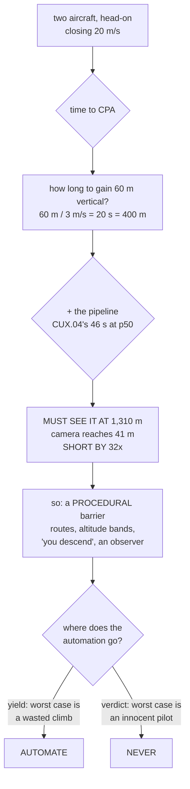

# CUX.05 Two aircraft in one sky: right of way and deconfliction

<!-- glance:start -->
<!-- generated by tools/build.py from curriculum/syllabus.yaml — edit the syllabus, not this block -->

| | |
|---|---|
| **Track** | Optional foundation |
| **Difficulty** | Advanced |
| **Time** | 1 h 15 min |
| **Hardware** | Onboard computer & vision (stage 2) |
| **Software** | python |
| **Prerequisites** | [15.04 Offboard control: commanding attitude, velocity and position](../../15-onboard-autonomy/15.04-offboard-control.md)<br>[18.05 FAA Part 107: the certificate, the rules, the waivers](../../18-civil-ops/18.05-part-107-and-the-legal-path.md) |
| **Skip if** | You can compute the time to closest approach for two aircraft and show what your own perception latency costs you in separation. |

<!-- glance:end -->

## What you will learn

- The rule this whole lesson is an engineering expression of:
  **14 CFR § 107.37(a)** — the small unmanned aircraft must yield, and may not pass over, under,
  or ahead of another aircraft **unless well clear**
- That on a head-on course the miss distance is **zero**, so **time to closest approach is the
  collision** and every second of it is a resource you can spend exactly once
- That the budget runs the wrong way: **751 m** in the best case, **1,310 m** at the median,
  **10,350 m** at the p99 — against a camera that reaches **41 m**
- That the shortfall is **18× at best** and **32× at the median**, and what that arithmetic
  actually means
- That **the airframe sets the requirement, not the sensors**: 60 m of vertical separation at
  3 m/s is 20 s, which is 400 m at 20 m/s closing
- Why **vertical is the right axis** for a multirotor to yield on, and why energy rather than
  thrust is the real limit
- The rule for where automation belongs: **automate the action whose worst case is harmless** —
  yielding can be automated, a verdict never

## Why it matters

The previous four lessons built a system that can find an aircraft, track it, identify it and
report it. This lesson asks the question that decides whether any of that is useful: **what
happens when there are two aircraft?**

And the honest answer is uncomfortable, in the way the most useful engineering answers usually
are. The system is fast enough to be dangerous and far too slow to be a deconfliction tool. At
[12.02](../../12-autonomous-flight/12.02-mission-planning.md)'s cruise speed against another
aircraft doing the same, you have about **sixty seconds** between "this is now a problem" and
"these two aircraft are in the same place", and **most of that is not yours to spend**.

The lesson is worth doing carefully because the conclusion is not "do not build it". It is
sharper: **deconfliction is a procedural control whose sensor is a person, not a component.**
The onboard system contributes evidence, a record and a prompt. It is not the barrier, and
building it as though it were is how it gets trusted when it should not be.

> [!WARNING]
> Two failures are possible here and only one of them is the dangerous one. The **missed**
> encounter is the hazard. The **unnecessary** yield is a cost, an embarrassment and a wasted
> climb — and it is the one you should design for, because a system that yields too readily on a
> busy site gets switched off within a week, and a system that is switched off misses the real
> one. Over-alerting and under-alerting are not equally survivable, but they are not equally
> recoverable either. **Measure your false-yield rate** as carefully as your detection rate.

## Prerequisites

<!-- prereqs:start -->
## Prerequisites

You need these first:

- [15.04 Offboard control: commanding attitude, velocity and position](../../15-onboard-autonomy/15.04-offboard-control.md)
- [18.05 FAA Part 107: the certificate, the rules, the waivers](../../18-civil-ops/18.05-part-107-and-the-legal-path.md)

### Optional prerequisite links

None.

Check your readiness: `python course.py why CUX.05`
<!-- prereqs:end -->

## Concept

Every manned pilot learns right of way as a habit: the big aircraft has right of way, always,
and the small one does the moving. That is the whole rule. What takes longer is internalising
what it becomes when your aircraft is the small one and you have a camera that can see 41 m.

The instinct is to treat deconfliction as more detection. Get a better camera, add a radar, see
further, detect sooner. Run the arithmetic and that instinct is wrong by a factor of thirty,
because **the requirement is set by how long the manoeuvre takes, not by what you can resolve.**

Two aircraft at [12.02](../../12-autonomous-flight/12.02-mission-planning.md)'s 10 m/s closing head
on each other give you about two minutes of warning at any useful range. To be well clear you
have to *complete* a separation manoeuvre in some fraction of that, and the manoeuvre cannot be
instantaneous. Take the manoeuvre time first, multiply by the closing speed, and you have the
range at which you would have to already be looking — which turns out to be larger than the
airspace you are permitted to work in.

That is the finding. The rest of the lesson is about what to do with it.

## Technical explanation

### Level 1 — the geometry: closing, and time to closest approach

The rule, verbatim from [14 CFR § 107.37](https://www.law.cornell.edu/cfr/text/14/107.37):

> Each small unmanned aircraft must yield the right of way to all aircraft, airborne vehicles,
> and launch and reentry vehicles. Yielding the right of way means that the small unmanned
> aircraft must give way to the aircraft or vehicle and **may not pass over, under, or ahead of it
> unless well clear.**

Two clauses do the work. *Yield* fixes the direction of every decision — there is never a
question of whether the other aircraft moves. And **"unless well clear"** turns deconfliction
from a rule about intentions into a rule about **geometry**, which is why this lesson is mostly
arithmetic.

For two aircraft with relative position $\mathbf{r}$ and relative velocity $\mathbf{v}$, time to
closest approach and the distance at that moment are

$$ t_{CPA} = -\frac{\mathbf{r}\cdot\mathbf{v}}{\lVert\mathbf{v}\rVert^2}, \qquad d_{CPA} = \bigl\lVert \mathbf{r} + \mathbf{v}t_{CPA} \bigr\rVert $$

Head-on at 10 + 10 m/s, the closing speed is **20 m/s**:

| initial range | time to CPA | miss distance |
|---|---|---|
| 500 m | 25.0 s | 0.0 m |
| 1,000 m | 50.0 s | 0.0 m |
| 1,500 m | 75.0 s | 0.0 m |
| 2,420 m | 121.0 s | 0.0 m |

Every miss distance is zero, because that is what "head-on and straight" means. So on this
geometry **$t_{CPA}$ is the collision**, and the only question is how much of it you spend
before you are separated.

### Level 2 — the budget: what you must see, and how early

Work backwards. "Well clear" in three dimensions is mostly a question of altitude, so start with
vertical: to gain **60 m** at a conservative **3.0 m/s** climb takes **20 s**. That 20 s has to
be spent *after* the decision is made, so at 20 m/s closing the decision must be taken **400 m**
before closest approach.

Now add the pipeline. The range at which you need a usable track in hand:

| your knowledge | time available | **must see it at** |
|---|---|---|
| detection only, no human | 18 s | **751 m** |
| a human, p50 | 46 s | **1,310 m** |
| a human, p90 | 152 s | 3,450 m |
| a human, p99 | 498 s | 10,350 m |

The p50 and p90 rows are [CUX.04](CUX.04-warning-reporting-and-evidence.md)'s time-to-inform,
carried straight through. That reuse is the point: **the latency budget you built for reporting is
the latency budget you have for avoiding a collision**, because they are the same pipeline.

### Level 3 — the verdict, with the arithmetic shown

[CUX.01](CUX.01-detecting-another-aircraft.md)'s camera reaches **41 m**.

> Best case — detection only, no human, already climbing: needs **751 m**. Short by **18.3×**.
> Median case — a person has decided and the climb has started: needs **1,310 m**. Short by **32×**.

At 20 m/s closing, 1,310 m is **66 seconds** of flight. Nobody completes a 60 m climb in 66
seconds, and nobody decides in 28.

So, plainly: **deconfliction is not a sensor problem at cruise speed.** Not with this airframe,
not at this altitude, not with a better lens. The shortfall is not a specification gap that a
purchase closes.

There are exactly three honest responses, and only one of them is a hardware problem:

1. **Reduce the closing speed.** At 5 m/s each the required ranges divide by four — 328 m at the
   median — which is inside what [CUX.03](CUX.03-remote-id-and-identification.md) showed a radio
   can reach. **Slow down and the problem becomes tractable.** That is a flight-planning decision.
2. **Get the information from somewhere else.** Remote ID reception reaches hundreds of metres,
   and an ADS-B receiver further. Both are receiving-only, and both belong on the ground rather
   than on a 1.45 kg aircraft whose endurance is [23.6 min](../../references/hermon-numbers.md).
3. **Remove the encounter procedurally.** Agreed routes, agreed altitude bands, a rule that says
   you descend, and an observer whose job is to look up rather than at your own track.

The third is the barrier that actually works, and it is the same shape as
[18.03](../../18-civil-ops/18.03-mission-planning-process.md)'s brief and
[19.02](../../19-capstone-hermon-mission/19.02-phase-1-preflight-and-launch.md)'s abort matrix:
a written decision made before the aircraft is armed, when everyone had time to think.

### Level 4 — the aircraft sets the requirement, not the sensors

| vertical rate | time to gain 60 m | range at 20 m/s |
|---|---|---|
| 1.0 m/s | 60.0 s | 1,200 m |
| 2.0 m/s | 30.0 s | 600 m |
| **3.0 m/s** | **20.0 s** | **400 m** |
| 4.0 m/s | 15.0 s | 300 m |
| 5.0 m/s | 12.0 s | 240 m |

This is the table that should surprise you least. **Your detection requirement is set by your
climb rate.** Doubling the climb rate halves the range at which you have to see the aircraft —
and buys it at the cost of endurance.

Hermon's **3.78 : 1** thrust-to-weight means vertical *authority* is not the problem.
[`hermon-numbers.md`](../../references/hermon-numbers.md) and
[03.09](../../03-power-system/03.09-endurance-prediction.md) mean the problem is **energy**: the
climb has to be paid for out of 88.8 Wh, and a hard climb near the end of a sortie is a
[19.01](../../19-capstone-hermon-mission/19.01-the-brief.md) abort criterion rather than a
deconfliction manoeuvre.

Which is the real reason deconfliction belongs in the plan. A rule that only works on a full
battery is not a barrier.

Vertical is still the right axis to yield on. A multirotor changes height faster and more cheaply
than it changes lateral position, it does not need forward speed to do it, and "well clear" in
three dimensions is mostly a question of altitude.

### Level 5 — what to automate, and what never to

[CUX.03](CUX.03-remote-id-and-identification.md) concluded that a verdict is never automated.
Yielding is a different case, and the difference is the **direction of the failure mode**:

| action | if it is wrong | who should do it |
|---|---|---|
| climb or descend to yield | an unnecessary climb | **AUTOMATE** |
| call an aircraft a threat | an innocent pilot reported | **NEVER** |
| continue the mission | the mission is at risk | **A PERSON** |

Yielding is **conservative**: the failure mode is a wasted climb, which costs energy and
embarrassment and is visible in the log. A verdict is not: its failure mode is CUX.03's
identity-to-intent leap, pointed at a real person who then has to explain to an authority why a
drone reported them.

So the automation boundary is not "keep a human in the loop" as a slogan. It is:

> **Automate the action whose worst case is harmless. Never automate the one whose worst case is
> a person.**

That rule is worth carrying past this track, because it is the same shape as
[16.05](../../16-testing-analysis/16.05-field-protocols-and-the-safety-case.md)'s distinction
between a preventive barrier and a recovery barrier, and it is what
[FOP.02](../civil-ops/FOP.02-risk-management-bowtie.md) means by the two sides never being
multiplied together.

> **Ask your teacher:** "Name one decision your system makes automatically, and state its worst
> case in one sentence. Now do the same for the decision just above it." If the two worst cases
> are the same severity, the boundary is in the wrong place.

## Diagram



## Code

```python
"""CUX.05 - two aircraft in one sky: right of way and deconfliction."""
import math

# ---- Hermon, from the frozen numbers ---------------------------------------
V_HERMON = 10.0          # 12.02's cruise speed, m/s
V_OTHER = 10.0           # another aircraft, also in cruise

# ---- the pipeline's cost, from CUX.01 / .02 / .04 --------------------------
R_DETECT = 41.0
T_SWEEP, T_INFER, T_TRACK, T_NOTIFY = 4.32, 0.72, 12.0, 0.50
T_INFORM = {"p50": 45.5, "p90": 152.5, "p99": 497.5}
T_PERCEPTION = T_SWEEP + T_INFER + T_TRACK + T_NOTIFY

# ---- the airframe, which sets the requirement ------------------------------
V_VERTICAL = 3.0         # a conservative multirotor climb rate, m/s [E]
DZ_REQUIRED = 60.0       # vertical separation we want to have gained [E]

W = 74


def bar(t):
    print()
    print("  " + t)
    print("  " + "=" * len(t))


def sep(ch="-"):
    print("  " + ch * W)


def tca_and_miss(r, v):
    """Relative position r, relative velocity v (2-D, north/east)."""
    vv = v[0] * v[0] + v[1] * v[1]
    t = -(r[0] * v[0] + r[1] * v[1]) / vv
    cx, cy = r[0] + v[0] * t, r[1] + v[1] * t
    return t, math.hypot(cx, cy)


def bar1():
    bar("1. THE GEOMETRY: CLOSING, AND TIME TO CLOSEST APPROACH")
    v = (-(V_HERMON + V_OTHER), 0.0)   # head-on, target approaching
    closing = math.hypot(v[0], v[1])
    print()
    print("  Head-on at %.0f + %.0f m/s: closing speed %.0f m/s."
          % (V_HERMON, V_OTHER, closing))
    print()
    print("  %-12s %14s %16s" % ("initial range", "time to CPA", "at CPA, straight on"))
    sep()
    for rng in (500.0, 1000.0, 1500.0, 2000.0, 2420.0):
        t, miss = tca_and_miss((rng, 0.0), v)
        print("  %11.0f m %12.1f s %14.1f m" % (rng, t, miss))
    sep()
    print("  On a straight-line head-on course the miss distance is ZERO, so")
    print("  time to closest approach IS the collision. Everything else in")
    print("  this lesson is about how much of that number you can spend.")


def bar2():
    bar("2. THE BUDGET: WHAT YOU MUST SEE, AND HOW EARLY")
    closing = V_HERMON + V_OTHER
    t_manoeuvre = DZ_REQUIRED / V_VERTICAL
    print()
    print("  To gain %.0f m of vertical separation at %.1f m/s takes %.0f s."
          % (DZ_REQUIRED, V_VERTICAL, t_manoeuvre))
    print()
    print("  That time must be spent AFTER the decision. So the decision has")
    print("  to be made %.0f m before closest approach, at %.0f m/s closing."
          % (t_manoeuvre * closing, closing))
    print()
    print("  Add the pipeline, and the range at which you must have a usable")
    print("  track in hand:")
    print()
    print("  %-26s %12s %16s" % ("your knowledge", "time available", "must see it at"))
    sep()
    print("  %-26s %10.0f s %14.0f m" % ("detection only, no human", T_PERCEPTION,
                                         (T_PERCEPTION + t_manoeuvre) * closing))
    for k in ("p50", "p90", "p99"):
        print("  %-26s %10.0f s %14.0f m" % ("a human, " + k, T_INFORM[k],
                                             (T_INFORM[k] + t_manoeuvre) * closing))
    sep()
    print()
    print("  CUX.01's camera reaches %.0f m." % R_DETECT)
    return closing, t_manoeuvre


def bar3(closing, t_manoeuvre):
    bar("3. THE VERDICT, WITH THE ARITHMETIC SHOWN")
    need50 = (T_INFORM["p50"] + t_manoeuvre) * closing
    need_best = (T_PERCEPTION + t_manoeuvre) * closing
    print()
    print("  Best case - detection only, no human, already climbing: needs")
    print("  %.0f m. The camera reaches %.0f m. Short by %.1fx."
          % (need_best, R_DETECT, need_best / R_DETECT))
    print()
    print("  Median case - a person has decided and the climb has started:")
    print("  needs %.0f m. Short by %.0fx."
          % (need50, need50 / R_DETECT))
    print()
    print("  At 20 m/s closing, %.0f m is %.0f SECONDS of flight."
          % (need50, need50 / closing))
    print("  Nobody completes a %.0f m climb in %.0f seconds, and nobody decides"
          % (DZ_REQUIRED, need50 / closing))
    print("  in %.0f seconds." % (T_INFORM["p50"] - T_PERCEPTION))
    print()
    print("  So: DE-CONFLICTION IS NOT A SENSOR PROBLEM AT CRUISE SPEED.")


def bar4():
    bar("4. THE AIRCRAFT SETS THE REQUIREMENT, NOT THE SENSORS")
    closing = V_HERMON + V_OTHER
    print()
    print("  %-24s %16s %18s" % ("vertical rate", "time to gain 60 m", "range at 20 m/s"))
    sep()
    for vz in (1.0, 2.0, 3.0, 4.0, 5.0):
        t = DZ_REQUIRED / vz
        print("  %-21.1f m/s %13.1f s %15.0f m" % (vz, t, t * closing))
    sep()
    print()
    print("  Hermon has %.2f : 1 of thrust to weight, so vertical authority is"
          % (4 * 1369.0 / 1450.0))
    print("  not the limitation - energy is. See 03.09: a hard climb costs")
    print("  endurance you need for the return.")
    print()
    print("  Vertical is still the right axis. A multirotor changes height")
    print("  faster and more cheaply than it changes lateral position, and")
    print("  14 CFR 107.37(a) asks you to get WELL CLEAR - which in three")
    print("  dimensions is mostly a question of altitude.")


def bar5():
    bar("5. WHAT TO AUTOMATE, AND WHAT NEVER TO")
    print()
    print("  CUX.03 said a verdict is never automated. Yielding is different,")
    print("  and the difference is the direction of the failure mode.")
    print()
    print("  %-34s %-26s %s" % ("action", "if it is wrong", "who should do it"))
    sep()
    print("  %-34s %-26s %s" % ("climb or descend to yield",
                                "an unnecessary climb", "AUTOMATE"))
    print("  %-34s %-26s %s" % ("call an aircraft a threat",
                                "an innocent pilot reported", "NEVER"))
    print("  %-34s %-26s %s" % ("continue the mission",
                                "the mission is at risk", "A PERSON"))
    sep()
    print()
    print("  Yielding is conservative: the failure mode is a wasted climb.")
    print("  A verdict is not: the failure mode is CUX.03's identity-to-")
    print("  intent leap, pointed at a real person who then gets reported.")
    print()
    print("  That asymmetry, not caution, is the rule for the automation")
    print("  boundary: automate the action whose worst case is harmless.")


def main():
    bar("CUX.05  TWO AIRCRAFT IN ONE SKY")
    print("  14 CFR 107.37(a): the sUAS must yield, and may not pass over,")
    print("  under, or ahead of another aircraft unless well clear.")
    bar1()
    closing, t_man = bar2()
    bar3(closing, t_man)
    bar4()
    bar5()


if __name__ == "__main__":
    main()
```

Output:

```text

  CUX.05  TWO AIRCRAFT IN ONE SKY
  ===============================
  14 CFR 107.37(a): the sUAS must yield, and may not pass over,
  under, or ahead of another aircraft unless well clear.

  1. THE GEOMETRY: CLOSING, AND TIME TO CLOSEST APPROACH
  ======================================================

  Head-on at 10 + 10 m/s: closing speed 20 m/s.

  initial range    time to CPA at CPA, straight on
  --------------------------------------------------------------------------
          500 m         25.0 s            0.0 m
         1000 m         50.0 s            0.0 m
         1500 m         75.0 s            0.0 m
         2000 m        100.0 s            0.0 m
         2420 m        121.0 s            0.0 m
  --------------------------------------------------------------------------
  On a straight-line head-on course the miss distance is ZERO, so
  time to closest approach IS the collision. Everything else in
  this lesson is about how much of that number you can spend.

  2. THE BUDGET: WHAT YOU MUST SEE, AND HOW EARLY
  ===============================================

  To gain 60 m of vertical separation at 3.0 m/s takes 20 s.

  That time must be spent AFTER the decision. So the decision has
  to be made 400 m before closest approach, at 20 m/s closing.

  Add the pipeline, and the range at which you must have a usable
  track in hand:

  your knowledge             time available   must see it at
  --------------------------------------------------------------------------
  detection only, no human           18 s            751 m
  a human, p50                       46 s           1310 m
  a human, p90                      152 s           3450 m
  a human, p99                      498 s          10350 m
  --------------------------------------------------------------------------

  CUX.01's camera reaches 41 m.

  3. THE VERDICT, WITH THE ARITHMETIC SHOWN
  =========================================

  Best case - detection only, no human, already climbing: needs
  751 m. The camera reaches 41 m. Short by 18.3x.

  Median case - a person has decided and the climb has started:
  needs 1310 m. Short by 32x.

  At 20 m/s closing, 1310 m is 66 SECONDS of flight.
  Nobody completes a 60 m climb in 66 seconds, and nobody decides
  in 28 seconds.

  So: DE-CONFLICTION IS NOT A SENSOR PROBLEM AT CRUISE SPEED.

  4. THE AIRCRAFT SETS THE REQUIREMENT, NOT THE SENSORS
  =====================================================

  vertical rate            time to gain 60 m    range at 20 m/s
  --------------------------------------------------------------------------
  1.0                   m/s          60.0 s            1200 m
  2.0                   m/s          30.0 s             600 m
  3.0                   m/s          20.0 s             400 m
  4.0                   m/s          15.0 s             300 m
  5.0                   m/s          12.0 s             240 m
  --------------------------------------------------------------------------

  Hermon has 3.78 : 1 of thrust to weight, so vertical authority is
  not the limitation - energy is. See 03.09: a hard climb costs
  endurance you need for the return.

  Vertical is still the right axis. A multirotor changes height
  faster and more cheaply than it changes lateral position, and
  14 CFR 107.37(a) asks you to get WELL CLEAR - which in three
  dimensions is mostly a question of altitude.

  5. WHAT TO AUTOMATE, AND WHAT NEVER TO
  ======================================

  CUX.03 said a verdict is never automated. Yielding is different,
  and the difference is the direction of the failure mode.

  action                             if it is wrong             who should do it
  --------------------------------------------------------------------------
  climb or descend to yield          an unnecessary climb       AUTOMATE
  call an aircraft a threat          an innocent pilot reported NEVER
  continue the mission               the mission is at risk     A PERSON
  --------------------------------------------------------------------------

  Yielding is conservative: the failure mode is a wasted climb.
  A verdict is not: the failure mode is CUX.03's identity-to-
  intent leap, pointed at a real person who then gets reported.

  That asymmetry, not caution, is the rule for the automation
  boundary: automate the action whose worst case is harmless.
```

## Exercise

### Exercise CUX.05-E1 — Compute your own encounter `[numeric]`

Take your planned cruise speed from [12.02](../../12-autonomous-flight/12.02-mission-planning.md)
and the other aircraft's plausible speed — and account for the wind, because a headwind on one and
a tailwind on the other raises the closing speed and this is the number that matters. Compute
$t_{CPA}$, the range at which you must have a track, and compare it with 41 m and with your VLOS.
Report the shortfall factor.

### Exercise CUX.05-E2 — Find the closing speed that works `[analysis]`

Take the p50 row from Level 2 — 1,310 m — and find the closing speed at which the required range
drops inside what CUX.03's radio can reach. Then find the closing speed at which it drops inside
your 41 m optical ceiling. State both, and say what operational change each one implies: a slower
cruise, a lower altitude band, a different site, or none of them.

### Exercise CUX.05-E3 — Measure your false-yield rate `[build]`

Fly the [CUX.04](CUX.04-warning-reporting-and-evidence.md) drill and count how many times the
automated yield fires when nothing is actually there — plus how many times it fails to fire when
something is. Both numbers, not one. A yield system that fires once per hour on a quiet site has
been switched off by the time anything real happens, and that is a detection failure wearing a
different hat.

### Exercise CUX.05-E4 — Write the yield rule `[analysis]`

Write the actual deconfliction rule for your operation: what triggers it, what the manoeuvre is,
who authorises it, and what happens if the manoeuvre costs you the return. Put it in the shape of
[18.03](../../18-civil-ops/18.03-mission-planning-process.md)'s brief and
[19.01](../../19-capstone-hermon-mission/19.01-the-brief.md)'s abort matrix, with a number in
every row. A rule that is not written down does not exist, and this is the one that gets skipped.

## Expected result

**CUX.05-E1**: most people compute a shortfall between 20× and 50× and are surprised by how large
it is. The wind term is usually the finding — a 6 m/s wind limit on both aircraft can change the
closing speed enough to move you a whole percentile row.

**CUX.05-E2**: the answer is usually a closing speed in the low single digits for the radio case
and below that for the optical case — both of which mean the same thing operationally, which is
that **you cannot solve this with the aircraft you have flying at the speed you planned.** The
honest conclusion is the third response, not the first two.

**CUX.05-E3**: expect the false-yield rate to be much higher than expected and the missed-yield
rate to be hard to estimate, because you cannot test the second one safely. Say that in your
report. An unmeasurable failure rate is itself a finding and belongs in the safety case.

**CUX.05-E4**: the rows that get skipped are the last two — who authorises it, and what happens
when the manoeuvre costs the return. Those are the rows that make it a rule rather than a hope,
and they are the ones a crew actually needs at 30 m.

## Troubleshooting

- **The yield fires constantly on a quiet site.** False-yield rate too high. Tighten the threshold
  or the geometry, and expect to be ignored within days until you do.
- **The yield never fires.** Check that the track's velocity is trusted before the 12.0 s of
  [CUX.02](CUX.02-association-gate-and-tracking.md) has elapsed; a track with no velocity cannot be
  extrapolated, so an early trigger is a coin toss.
- **Times to closest approach come out negative.** Sign error in the relative velocity — CUA came
  from the same class of mistake and 15.04 is where you fixed it.
- **The manoeuvre starts but does not complete.** Energy, not control. Check the pack against
  [03.09](../../03-power-system/03.09-endurance-prediction.md) before the sortie, not during.
- **Two people disagree about who should have moved.** § 107.37(a) does not have that ambiguity.
  Re-read it, and re-read 18.03's brief.

## Common mistakes

- **Treating deconfliction as a detection problem.** The shortfall is 18–32×, not a specification
  gap.
- **Forgetting that the manoeuvre time comes *after* the decision.** Most of the budget error in
  this lesson is that omission.
- **Automating the verdict as well as the yield.** Automate the action whose worst case is
  harmless; that rule has exactly one application and this is it.
- **Assuming the yield is free.** It costs energy you needed for the return.
- **Building the rule in the air.** It belongs in the brief, with a number in every row.
- **Assuming slower always helps.** It does, but check the endurance arithmetic — see 03.09.

## Knowledge check

**Q1. What does § 107.37(a) actually require, in engineering terms?**

<details>
<summary>Show the answer</summary>

That the small unmanned aircraft yields to all other aircraft, airborne vehicles and launch and
reentry vehicles, and may not pass over, under or ahead of another aircraft **unless well clear**.
The first clause fixes the direction of every decision — the other aircraft never moves. The second
turns the rule from a statement of intention into a statement of **geometry**, which is why this
lesson is arithmetic rather than judgement.
</details>

**Q2. Why is the miss distance zero on every row of Level 1?**

<details>
<summary>Show the answer</summary>

Because the geometry is head-on on straight courses, so the relative trajectory passes through
zero. That is the point: on this geometry **time to closest approach *is* the collision**, and the
only question is how much of it you can spend on becoming separated. Use a crossing angle instead
and the miss distance becomes non-zero, and then $t_{CPA}$ stops being the collision — which is
also the geometry you should be planning for.
</details>

**Q3. Why does the median case need to see the aircraft at 1,310 m when the camera reaches 41 m?**

<details>
<summary>Show the answer</summary>

Because the 1,310 m is not a detection range, it is the point at which you must **already have
decided and started climbing**. It is 60 m of vertical separation at 3 m/s (20 s) plus CUX.04's
46 s p50 time-to-inform, multiplied by the 20 m/s closing speed. The shortfall is **32×**, and
no purchase closes it — which is what makes it a procedural problem.
</details>

**Q4. What sets the detection requirement in an encounter?**

<details>
<summary>Show the answer</summary>

The **manoeuvre time**, not the sensor. 60 m of vertical separation at 3.0 m/s is 20 s, which at
20 m/s closing is 400 m of warning before you need the answer. Halving the climb rate doubles the
required range. Hermon's 3.78 : 1 thrust-to-weight means authority is not the constraint —
**energy** is, because the climb comes out of 88.8 Wh.
</details>

**Q5. Why may the yield be automated when the verdict may not?**

<details>
<summary>Show the answer</summary>

Because the failure modes point in opposite directions. An automated yield that fires wrongly costs
a wasted climb — visible, cheap, recoverable. An automated verdict that fires wrongly reports an
innocent pilot to an authority, which is CUX.03's identity-to-intent leap made permanent. The
rule that falls out is: **automate the action whose worst case is harmless; never the one whose
worst case is a person.**
</details>

## Practical challenge

> [!CAUTION]
> Run this with **two aircraft you control, both crewed, both with radios, over a site you have
> cleared**, and with a written rule from E4 already agreed before anybody arms. Nobody's aircraft
> should ever be the surprise in a deconfliction test. [18.03](../../18-civil-ops/18.03-mission-planning-process.md)'s
> site selection and [12.04](../../12-autonomous-flight/12.04-rtl-and-the-failsafe-tree.md)'s
> abort ladder apply to the second aircraft exactly as they do to the first.

1. Write the rule first. No rule, no test.
2. Fly two aircraft on a converging pair of routes, with the second crewed and briefed.
3. Log, for each aircraft: detection range, time to first track, time to decision, time the
   manoeuvre started, time 60 m of separation was actually reached, and the true miss distance.
4. Compare your logged time-to-CPA against truth, and check the clock skew from
   [CUX.04](CUX.04-warning-reporting-and-evidence.md) is logged with it.
5. Record every false yield and every missed yield.

Step 5 is the deliverable, and it is the number that decides whether the system is usable at all.
**A deconfliction system that fires too often gets switched off, and a system that is switched
off is a detection failure with better marketing.**

## You can skip this if

You can state what § 107.37(a) requires, compute time to closest approach and the range at which
you must have a track for a given closing speed and climb rate, explain why the requirement is
set by the manoeuvre rather than the sensor, and state which decision may be automated and why.

## Go deeper

- [14 CFR § 107.37 — Operation near aircraft; right-of-way rules](https://www.law.cornell.edu/cfr/text/14/107.37)
  — the rule itself, including § 107.37(b)'s prohibition on operating so close to another
  aircraft as to create a collision hazard.
- [FAA Advisory Circular 107-2A](https://www.faa.gov/documentLibrary/media/Advisory_Circular/Editorial_Update_AC_107-2A.pdf)
  — the FAA's own guidance on establishing what is in the operating area before you fly, which is
  where the procedural barrier actually lives.
- [18.03 The mission-planning process](../../18-civil-ops/18.03-mission-planning-process.md) — where
  a deconfliction rule belongs: in the brief, before the aircraft is armed.
- [16.05 Field protocols and the safety case](../../16-testing-analysis/16.05-field-protocols-and-the-safety-case.md)
  — preventive and recovery barriers, and why Level 5's asymmetry is a safety-case argument rather
  than a software preference.

## Progress checkpoint

You can now state the right-of-way rule and turn it into geometry, compute the range at which you
must have a track for a given closing speed, explain why the shortfall is a factor of thirty and
not a purchasing problem, and state the rule that decides what may be automated.

Next and last: [CUX.06 — Evading, and knowing when you cannot](CUX.06-evading-and-the-envelope.md).