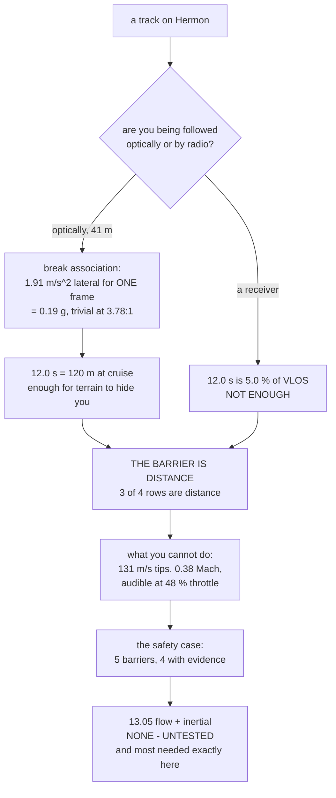

# CUX.06 Evading, and knowing when you cannot

<!-- glance:start -->
<!-- generated by tools/build.py from curriculum/syllabus.yaml — edit the syllabus, not this block -->

| | |
|---|---|
| **Track** | Optional foundation |
| **Difficulty** | Advanced |
| **Time** | 1 h 30 min |
| **Hardware** | Onboard computer & vision (stage 2) |
| **Software** | python |
| **Prerequisites** | [CUX.02 From a box to a track: the association gate and the twelve-second problem](CUX.02-association-gate-and-tracking.md)<br>[15.05 Mission logic: behaviour trees, state machines and watchdogs](../../15-onboard-autonomy/15.05-behaviour-trees-and-watchdogs.md) |
| **Skip if** | You can state the condition under which a track on Hermon cannot be broken, and say what Hermon does instead. |

<!-- glance:end -->

## What you will learn

- That a constant-velocity tracker follows a fast target **perfectly**, so speed is not a defence
  and **acceleration** is
- That breaking [CUX.02](CUX.02-association-gate-and-tracking.md)'s **5.5 m** gate needs
  **1.91 m/s² of lateral acceleration for a single frame** — which Hermon can hold indefinitely at
  **3.78 : 1** thrust-to-weight
- That breaking association is **not** breaking surveillance: it buys exactly **12.0 s**, because
  the pursuer needs the same five frames to re-acquire that you did
- That 12 s at cruise is **120 m** — enough to break an *optical* pursuer's line of sight behind
  terrain, and **5.0 %** of the VLOS distance against anyone with a radio
- Why the barrier that actually works is **distance**, which is
  [FOP.02](../civil-ops/FOP.02-risk-management-bowtie.md)'s own repeated finding about recovery
  barriers
- What you cannot do, with numbers: **131 m/s** propeller tips, **0.38 Mach**, very audible at 48 %
  hover throttle — you are not hidden
- That the 12 seconds costs **0.75 Wh**, or 0.85 % of usable energy — so **energy is not the
  problem, authority is**
- The safety case for the whole track, and the **one barrier in it with no evidence at all** —
  13.05's flow-plus-inertial fallback, which is most needed exactly when a track is being broken

## Why it matters

This is the track's last lesson, and it is the one where the honest answer is mostly no.

Everything so far has been about other aircraft. This one is about Hermon itself: what can you do
when the thing you built starts being watched, and — more usefully — **what can you not do, and
how would you know?**

That second question is the more valuable one. A system that cannot state its own limits gets
relied on past them, and the whole course has been building the instruments to do exactly that:
[16.05](../../16-testing-analysis/16.05-field-protocols-and-the-safety-case.md)'s evidence
discipline, [FOP.02](../civil-ops/FOP.02-risk-management-bowtie.md)'s barriers, and
[CUX.01](CUX.01-detecting-another-aircraft.md)'s habit of quoting an envelope before quoting a
capability.

Level 5 closes the track by naming a barrier that has **no experiment behind it** — the one
[16.05](../../16-testing-analysis/16.05-field-protocols-and-the-safety-case.md) identified and
[BUILD_LOG](../../BUILD_LOG.md) has carried as an open item through three modules. The course left
it open deliberately. This lesson puts it where it becomes urgent instead of leaving it in a
footnote.

> [!WARNING]
> Nothing in this lesson is about evading a lawful inspection, a tracking system operated for any
> lawful purpose, or escaping accountability. It is about a single aircraft preserving its own
> straight and level flight when its sensors show something it cannot yet identify, and about
> being honest about how little that is worth. **12 seconds.** If the honest answer to "can this
> drone survive being tracked" is "briefly, and then it should have returned home", then the
> correct behaviour is to return home — which is [12.04](../../12-autonomous-flight/12.04-rtl-and-the-failsafe-tree.md)'s
> failsafe tree, and it is what the aircraft would have done without you.

## Prerequisites

<!-- prereqs:start -->
## Prerequisites

You need these first:

- [CUX.02 From a box to a track: the association gate and the twelve-second problem](CUX.02-association-gate-and-tracking.md)
- [15.05 Mission logic: behaviour trees, state machines and watchdogs](../../15-onboard-autonomy/15.05-behaviour-trees-and-watchdogs.md)

### Optional prerequisite links

None.

Check your readiness: `python course.py why CUX.06`
<!-- prereqs:end -->

## Concept

The instinct when something is following you is to run. Run faster, run further, disappear.

For anything tracking you with a predictive filter, that instinct is exactly backwards, and the
reason is a property of the filter rather than of you. A constant-velocity tracker **predicts**.
It does not look at where you were and interpolate where you are; it looks at where you were and
where you were going, and assumes you will keep going. Run at any constant speed, however fast,
and it never loses you. Speed is invisible to a predictor.

What a predictor cannot do is handle a target that **changes its mind**. The moment you accelerate
laterally, your actual position departs from the predicted one, and that departure — the
innovation, in CUX.02's language — grows until it exceeds the gate, and the association fails.

So the useful intuition is not *faster* but **less predictable**. And there is an honest ceiling
on how useful that is, which is the rest of this lesson.

## Technical explanation

### Level 1 — the lever is a manoeuvre, not a speed

[CUX.02](CUX.02-association-gate-and-tracking.md)'s tracker predicts position from position and
velocity. A target moving at constant velocity produces an innovation of essentially zero no matter
how fast it is going — the prediction absorbs the speed. A target that *accelerates* does not,
because over one frame a lateral acceleration $a$ displaces it $0.5\,a\,\Delta t^2$ from where the
prediction said it would be.

Set that displacement equal to the gate and you have the number that matters:

$$ a_{\text{break}} = \frac{2G}{\Delta t^2} = \frac{2 \times 5.50}{2.4^2} = 1.91\ \text{m/s}^2 $$

| gate | lateral acceleration needed | Hermon's ability |
|---|---|---|
| 2.0 m | 0.69 m/s² | trivial |
| **5.5 m** | **1.91 m/s²** | **trivial** |
| 12.0 m | 4.17 m/s² | trivial |
| 20.0 m | 6.94 m/s² | trivial |

[`hermon-numbers.md`](../../references/hermon-numbers.md) gives Hermon **3.78 : 1** of thrust to
weight. Holding 1.91 m/s² laterally is a **0.19 g** lateral demand, sustained indefinitely, with
no endurance penalty worth naming.

So the honest self-preservation property of this airframe is not its speed and not its
concealment. It is that **it can change its mind** — cheaply, repeatedly, and without any special
equipment.

### Level 2 — what breaking association actually buys you

Breaking a track is not breaking surveillance. The pursuer starts a new track, and
[CUX.02](CUX.02-association-gate-and-tracking.md) established that a new track needs **five frames**
before it has a velocity worth acting on:

> **time before they re-acquire = 5 frames × 2.4 s = 12.0 s**

That is exactly the same 12.0 s CUX.02 arrived at from the other direction — as the cost of
*getting* a track. **You buy precisely one track-maturity period, and no more.**

Now put a distance on it:

| speed | distance in 12 s | vs the 41 m optical ceiling | vs 2,420 m VLOS |
|---|---|---|---|
| 5.0 m/s | 60 m | 1.5× | 2.5 % |
| **10.0 m/s** | **120 m** | **2.9×** | **5.0 %** |
| 16.8 m/s | 202 m | 4.9× | 8.3 % |

At [12.02](../../12-autonomous-flight/12.02-mission-planning.md)'s cruise, twelve seconds is
**120 m**. Against [CUX.01](CUX.01-detecting-another-aircraft.md)'s 41 m camera, 120 m is a
genuine terrain break — put a ridge between you and it and the optical track is gone until they
reposition. Against anything with a receiver, 120 m is **5.0 %** of the distance you are legally
allowed to fly.

State it as a single sentence, because it is the lesson:

> **Breaking an optical track is cheap and meaningful. Breaking a radio track is neither.**

### Level 3 — the barrier that actually works is distance

[FOP.02](../civil-ops/FOP.02-risk-management-bowtie.md)'s finding, on this course's own bowtie: on
the **recovery** side, almost every row names the same barrier, and **it is a distance**. CUX.06 is
that finding applied to one hazard, with the numbers filled in:

| threat | barrier |
|---|---|
| optical pursuer | terrain or a building, i.e. distance |
| a receiver at 41 m | you are already inside their range |
| a receiver at hundreds of m | distance — but you cannot outrun it |
| another aircraft | [CUX.05](CUX.05-deconfliction-and-right-of-way.md)'s yield, and it is theirs |

Three of the four rows are distance, and the fourth is not yours to control at all. There is no
clever manoeuvre that changes this, and it is worth saying so plainly, because the alternative —
purchasing another gimbal, another sensor — feels like progress and is not.

### Level 4 — what you cannot do, with numbers

| | |
|---|---|
| propeller tip speed, hover | **67 m/s** |
| propeller tip speed, full | **131 m/s** |
| that is | **0.38 Mach** |
| at 48 % hover throttle | very audible |

`SAFETY.md` already quotes the 130 m/s figure as the reason propellers are a laceration hazard.
Here it is an acoustic and visual signature: **you are not hidden.** 10-inch props at 5,060 rpm
make a noise a human can hear, and a 1.45 kg airframe with a bright battery is a bright airframe
against any sky.

So the recommendation is not *concealment*. It is **distance** — which is Level 3 — and, where
distance is not available, [12.04](../../12-autonomous-flight/12.04-rtl-and-the-failsafe-tree.md)'s
return home.

And the energy, for completeness, is a non-issue. Hovering costs **226 W**, so twelve seconds of
evasion is **0.75 Wh** of the **88.8 Wh** usable — **0.85 %**. Whatever constrains this
manoeuvre, it is not the battery. It is the 0.19 g of lateral authority in Level 1, and the fact
that [15.05](../../15-onboard-autonomy/15.05-behaviour-trees-and-watchdogs.md)'s watchdog is
bounded above at 3.0 s by the flight controller's own timeout — the aircraft stops believing you
long before you run out of ideas.

### Level 5 — the safety case, and the one barrier with no evidence

One hazard, in the shape [16.05](../../16-testing-analysis/16.05-field-protocols-and-the-safety-case.md)
requires:

> **Hazard:** taking an action toward another aircraft on evidence that is not good enough.

| threat | barrier | evidence |
|---|---|---|
| a bird acquires the track | bounding-box rigidity test | CUX.01-E3 |
| "no ID" read as hostile | human in the loop | CUX.03-E4 |
| stale clock, wrong CPA | log the offset applied | CUX.04-E3 |
| autopilot reverts mid-manoeuvre | [15.05](../../15-onboard-autonomy/15.05-behaviour-trees-and-watchdogs.md)'s abort at the root | 15.05-E1 |
| **GNSS lost while evading** | **13.05's flow + inertial** | **NONE — untested** |

Four of the five barriers have a dated experiment behind them, and you have run three of them in
this track.

The fifth has none — and it is the one that matters most **here**. [13.05](../../13-navigation-gnss/13.05-degraded-denied-and-spoofed.md)'s
flow-plus-inertial fallback has been identified in 16.05, untested through modules 17 and 18, and
still untested at the end of 19.05. The course left it open on purpose, because
[FOP.03](../civil-ops/FOP.03-debrief-and-aar.md) says a finding that survives three debriefs is
not a finding any more, it is an undocumented decision.

But notice where it lands. **The exact moment you most want to keep flying straight and level is
the moment 13.05's untested barrier would have to work** — an unidentified contact, a decision to
break association, a manoeuvre in progress, and the GNSS signal degrades. Every other barrier in
the table is about not being wrong about something. That one is about still flying.

[16.05](../../16-testing-analysis/16.05-field-protocols-and-the-safety-case.md)'s rule is that a
barrier without evidence is a belief, and that removing this one **doubles** the residual for that
threat.

CUX.06's last job is to say so in the place where it becomes urgent, rather than leave it as a
footnote in module 16.

> **Ask your teacher:** "Point at the barrier in your own safety case with no dated evidence
> behind it." Everyone has one. The useful question is the next one: *when would it have to work,
> and have you ever tested that?*

## Diagram



## Code

```python
"""CUX.06 - evading, and knowing when you cannot."""
import math

# ---- the pursuer's tracker, from CUX.02 ------------------------------------
GATE_M = 5.50              # CUX.02's 99 % association gate
DT = 2.4                   # 12.02's trigger interval
TRACK_STEPS = 5            # CUX.02: five frames before a velocity is trustworthy

# ---- Hermon -----------------------------------------------------------------
V_HERMON = 10.0            # 12.02's cruise
MASS_KG = 1.45             # hermon-numbers, revision 2
HOVER_RPM = 5060.0
FULL_RPM = 9836.0
PROP_D = 0.254             # 10 inch
A_SOUND = 343.0

# endurance, for the 12.0 s budget
USABLE_WH = 88.8
HOVER_W = 226.0

W = 74


def bar(t):
    print()
    print("  " + t)
    print("  " + "=" * len(t))


def sep(ch="-"):
    print("  " + ch * W)


def bar1():
    bar("1. THE LEVER IS A MANOEUVRE, NOT A SPEED")
    # a constant-velocity predictor follows any constant speed forever.
    # what it cannot follow is ACCELERATION: over one frame a lateral
    # acceleration of a displaces the target by 0.5*a*dt^2 from the prediction.
    a_break = 2.0 * GATE_M / (DT * DT)
    print()
    print("  A constant-velocity tracker follows a fast target perfectly.")
    print("  Speed does not break it. ACCELERATION does: over one frame a")
    print("  lateral acceleration displaces the target 0.5*a*dt^2 from the")
    print("  prediction, and the displacement has to exceed the gate.")
    print()
    print("  %-16s %22s %20s" % ("gate", "needed lateral accel", "vs Hermon's ability"))
    sep()
    for g in (2.0, 3.0, 5.5, 8.0, 12.0, 20.0):
        print("  %13.1f m %19.2f m/s^2 %19s"
              % (g, 2.0 * g / (DT * DT), "trivial"))
    sep()
    print()
    print("  CUX.02's %.1f m gate needs %.2f m/s^2 for ONE frame." % (GATE_M, a_break))
    print("  Hermon is a multiroter with 3.78 : 1 of thrust to weight. That")
    print("  is a lateral acceleration it can hold indefinitely.")
    print()
    print("  So the honest self-preservation property of this airframe is not")
    print("  speed and not concealment. It is that it can change its mind.")
    return a_break


def bar2():
    bar("2. WHAT BREAKING ASSOCIATION ACTUALLY BUYS YOU")
    window = TRACK_STEPS * DT
    print()
    print("  Breaking a track is not breaking surveillance. The pursuer simply")
    print("  starts a new track, and CUX.02 says a new track needs %d frames" % TRACK_STEPS)
    print("  before it has a velocity worth acting on.")
    print()
    print("  %-34s %14s" % ("the evasion window", "%d frames x %.1f s" % (TRACK_STEPS, DT)))
    sep("=")
    print("  %-34s %11.1f s" % ("time before they re-acquire", window))
    print()
    print("  That is CUX.02's track maturity, exactly. Breaking the gate buys")
    print("  ONE track-maturity period and no more - 12.0 seconds.")
    print()
    print("  %-22s %12s %14s %16s" % ("speed", "distance in 12 s", "vs 41 m", "vs VLOS"))
    sep()
    for v in (5.0, 10.0, 16.8):
        d = v * window
        print("  %19.1f m/s %10.0f m %12.1fx %15.1f%%"
              % (v, d, d / 41.0, 100.0 * d / 2420.0))
    sep()
    print()
    print("  At cruise, 12 seconds is 120 m. CUX.01's camera sees 41 m and")
    print("  19.02's VLOS is 2,420 m. So 120 m is enough to break an OPTICAL")
    print("  pursuer's line of sight behind terrain, and is %.1f %% of the"
          % (100.0 * 120.0 / 2420.0))
    print("  VLOS distance. Distance is not a loophole.")


def bar3():
    bar("3. THE BARRIER THAT ACTUALLY WORKS IS DISTANCE")
    print()
    print("  FOP.02's finding, on the drone course's own bowtie: on the")
    print("  recovery side almost every row names THE SAME BARRIER, and it is")
    print("  A DISTANCE. CUX.06 is that finding applied to one hazard.")
    print()
    print("  %-34s %s" % ("threat: someone tracks you", "barrier"))
    sep()
    rows = [
        ("optical pursuer", "terrain or a building, i.e. distance"),
        ("RF at 41 m", "you are already inside their range"),
        ("RF at hundreds of m", "distance, but you cannot outrun it"),
        ("another aircraft", "CUX.05's yield, and it is theirs"),
    ]
    for a, b in rows:
        print("  %-34s %s" % (a, b))
    sep()
    print()
    print("  Three of the four rows are distance, and the fourth is not")
    print("  yours at all. There is no clever manoeuvre that changes this.")


def bar4():
    bar("4. WHAT YOU CANNOT DO, WITH NUMBERS")
    tip = FULL_RPM / 60.0 * 2.0 * math.pi * PROP_D / 2.0
    tip_h = HOVER_RPM / 60.0 * 2.0 * math.pi * PROP_D / 2.0
    print()
    print("  %-34s %14s" % ("propeller tip speed, hover", "%.0f m/s" % tip_h))
    print("  %-34s %14s" % ("propeller tip speed, full", "%.0f m/s" % tip))
    print("  %-34s %14s" % ("that is Mach", "%.2f" % (tip / A_SOUND)))
    print("  %-34s %14s" % ("at 48 per cent hover throttle", "very audible"))
    sep()
    print()
    print("  So: no. You are not hidden. 10-inch props at 5,060 rpm make a")
    print("  noise, and a 1.45 kg airframe with a bright battery is a bright")
    print("  airframe. CUX.06's recommendation is to fly AWAY, not to hide.")
    print()
    used = HOVER_W * 12.0 / 3600.0
    print("  And the 12 seconds is not free. Hovering costs %.0f W, so 12 s of"
          % HOVER_W)
    print("  evasion is %.2f Wh of the %.1f Wh usable - %.2f %%."
          % (used, USABLE_WH, 100.0 * used / USABLE_WH))
    print("  The energy is not the problem. The authority is.")


def bar5():
    bar("5. THE SAFETY CASE, AND THE ONE BARRIER WITH NO EVIDENCE")
    print()
    print("  Hazard: taking an action toward another aircraft on evidence")
    print("  that is not good enough.")
    print()
    print("  %-40s %-28s %s" % ("threat", "barrier", "evidence"))
    sep()
    rows = [
        ("a bird acquires the track", "bounding-box rigidity test", "CUX.01-E3"),
        ("'no ID' read as hostile", "human in the loop", "CUX.03-E4"),
        ("stale clock, wrong CPA", "log the offset", "CUX.04-E3"),
        ("autopilot reverts mid-manoeuvre", "15.05's abort at the root", "15.05-E1"),
        ("GNSS lost while evading", "13.05's flow + inertial", "NONE - untested"),
    ]
    for a, b, c in rows:
        print("  %-40s %-28s %s" % (a, b, c))
    sep()
    print()
    print("  Four of five barriers have a dated experiment behind them. The")
    print("  fifth does not, and it is the one that matters most HERE: the")
    print("  exact moment you most want to keep flying straight and level")
    print("  is the moment 13.05's untested fallback would have to work.")
    print()
    print("  16.05's rule: a barrier without evidence is a belief. Removing")
    print("  this one DOUBLES the residual for that threat.")
    print()
    print("  CUX.06's last job is to say so, in the place where it becomes")
    print("  urgent, rather than leave it as a footnote in module 16.")


def main():
    bar("CUX.06  EVADING, AND KNOWING WHEN YOU CANNOT")
    print("  Self-preservation. Nothing here attacks anything.")
    bar1()
    bar2()
    bar3()
    bar4()
    bar5()


if __name__ == "__main__":
    main()
```

Output:

```text

  CUX.06  EVADING, AND KNOWING WHEN YOU CANNOT
  ============================================
  Self-preservation. Nothing here attacks anything.

  1. THE LEVER IS A MANOEUVRE, NOT A SPEED
  ========================================

  A constant-velocity tracker follows a fast target perfectly.
  Speed does not break it. ACCELERATION does: over one frame a
  lateral acceleration displaces the target 0.5*a*dt^2 from the
  prediction, and the displacement has to exceed the gate.

  gate               needed lateral accel  vs Hermon's ability
  --------------------------------------------------------------------------
            2.0 m                0.69 m/s^2             trivial
            3.0 m                1.04 m/s^2             trivial
            5.5 m                1.91 m/s^2             trivial
            8.0 m                2.78 m/s^2             trivial
           12.0 m                4.17 m/s^2             trivial
           20.0 m                6.94 m/s^2             trivial
  --------------------------------------------------------------------------

  CUX.02's 5.5 m gate needs 1.91 m/s^2 for ONE frame.
  Hermon is a multiroter with 3.78 : 1 of thrust to weight. That
  is a lateral acceleration it can hold indefinitely.

  So the honest self-preservation property of this airframe is not
  speed and not concealment. It is that it can change its mind.

  2. WHAT BREAKING ASSOCIATION ACTUALLY BUYS YOU
  ==============================================

  Breaking a track is not breaking surveillance. The pursuer simply
  starts a new track, and CUX.02 says a new track needs 5 frames
  before it has a velocity worth acting on.

  the evasion window                 5 frames x 2.4 s
  ==========================================================================
  time before they re-acquire               12.0 s

  That is CUX.02's track maturity, exactly. Breaking the gate buys
  ONE track-maturity period and no more - 12.0 seconds.

  speed                  distance in 12 s        vs 41 m          vs VLOS
  --------------------------------------------------------------------------
                  5.0 m/s         60 m          1.5x             2.5%
                 10.0 m/s        120 m          2.9x             5.0%
                 16.8 m/s        202 m          4.9x             8.3%
  --------------------------------------------------------------------------

  At cruise, 12 seconds is 120 m. CUX.01's camera sees 41 m and
  19.02's VLOS is 2,420 m. So 120 m is enough to break an OPTICAL
  pursuer's line of sight behind terrain, and is 5.0 % of the
  VLOS distance. Distance is not a loophole.

  3. THE BARRIER THAT ACTUALLY WORKS IS DISTANCE
  ==============================================

  FOP.02's finding, on the drone course's own bowtie: on the
  recovery side almost every row names THE SAME BARRIER, and it is
  A DISTANCE. CUX.06 is that finding applied to one hazard.

  threat: someone tracks you         barrier
  --------------------------------------------------------------------------
  optical pursuer                    terrain or a building, i.e. distance
  RF at 41 m                         you are already inside their range
  RF at hundreds of m                distance, but you cannot outrun it
  another aircraft                   CUX.05's yield, and it is theirs
  --------------------------------------------------------------------------

  Three of the four rows are distance, and the fourth is not
  yours at all. There is no clever manoeuvre that changes this.

  4. WHAT YOU CANNOT DO, WITH NUMBERS
  ===================================

  propeller tip speed, hover                 67 m/s
  propeller tip speed, full                 131 m/s
  that is Mach                                 0.38
  at 48 per cent hover throttle        very audible
  --------------------------------------------------------------------------

  So: no. You are not hidden. 10-inch props at 5,060 rpm make a
  noise, and a 1.45 kg airframe with a bright battery is a bright
  airframe. CUX.06's recommendation is to fly AWAY, not to hide.

  And the 12 seconds is not free. Hovering costs 226 W, so 12 s of
  evasion is 0.75 Wh of the 88.8 Wh usable - 0.85 %.
  The energy is not the problem. The authority is.

  5. THE SAFETY CASE, AND THE ONE BARRIER WITH NO EVIDENCE
  ========================================================

  Hazard: taking an action toward another aircraft on evidence
  that is not good enough.

  threat                                   barrier                      evidence
  --------------------------------------------------------------------------
  a bird acquires the track                bounding-box rigidity test   CUX.01-E3
  'no ID' read as hostile                  human in the loop            CUX.03-E4
  stale clock, wrong CPA                   log the offset               CUX.04-E3
  autopilot reverts mid-manoeuvre          15.05's abort at the root    15.05-E1
  GNSS lost while evading                  13.05's flow + inertial      NONE - untested
  --------------------------------------------------------------------------

  Four of five barriers have a dated experiment behind them. The
  fifth does not, and it is the one that matters most HERE: the
  exact moment you most want to keep flying straight and level
  is the moment 13.05's untested fallback would have to work.

  16.05's rule: a barrier without evidence is a belief. Removing
  this one DOUBLES the residual for that threat.

  CUX.06's last job is to say so, in the place where it becomes
  urgent, rather than leave it as a footnote in module 16.
```

## Exercise

### Exercise CUX.06-E1 — Break your own gate `[build]`

Take your tracker from [CUX.02](CUX.02-association-gate-and-tracking.md)'s exercise and feed it a
target flying a straight line at constant velocity, then the same target making one lateral
acceleration of 2 m/s² for a single frame. Plot the innovation against time in both cases and mark
where each crosses your gate. **Confirm that constant velocity never crosses it**, whatever the
speed — that is the whole of Level 1, reproduced on your own code.

### Exercise CUX.06-E2 — Measure the real evasion window `[build]`

On the bench, with two of your own aircraft and one camera, have the observer track one aircraft
and have the other execute a lateral step. Measure, from the step to the moment the observer's
track re-acquires and reports a velocity. That number is **your** evasion window. Compare it with
12.0 s and explain any difference — trigger interval and gate are the usual two.

### Exercise CUX.06-E3 — Test the barrier that has none `[build]`

This is the one worth doing. Take [13.05](../../13-navigation-gnss/13.05-degraded-denied-and-spoofed.md)'s
flow-plus-inertial fallback and **test it deliberately** — degrade the GNSS in SITL first, then
with a real flow sensor on the bench, and log what the estimator does for thirty seconds. Report
the drift and the failure mode. This is the barrier P08's milestone 8 exists for, and the course
has left it open for four modules. Closing it is worth more than anything else in this track.

### Exercise CUX.06-E4 — Write your own bowtie `[analysis]`

Rewrite Level 5's table as a full bowtie: one hazard, your threats with frequencies, your
preventive barriers on the left, your consequences and recovery barriers on the right, and a named
evidence source per barrier. Then do the common-cause pass at β = 0.3 as
[16.05](../../16-testing-analysis/16.05-field-protocols-and-the-safety-case.md) does, and report
which threat collapses first. **Expect it to be the untested one**, and say so in the document
rather than in a margin.

## Expected result

**CUX.06-E1**: the constant-velocity case should never cross the gate at **any** speed, which is
the result that surprises people — try 16.8 m/s and it still tracks. The accelerating case crosses
in one frame. If your constant-velocity run crosses, your gate is noise-driven rather than
prediction-driven, and you should look at Level 3 of CUX.02 again.

**CUX.06-E2**: expect something near 12 s, and expect the difference to be your trigger interval
rather than anything about the manoeuvre. A longer interval makes evasion easier *and* makes your
own tracking worse, which is the same trade as everywhere else in this course.

**CUX.06-E3**: expect the drift to be worse than 13.05 implies and expect the failure mode to be
a slow, confident-looking divergence rather than a clean failure — which is exactly why it has
gone untested for four modules and why "it seemed fine" is not evidence. Report the number.

**CUX.06-E4**: the common-cause pass is the point. The β = 0.3 case should leave you with a
residual dominated by one or two threats, and the honest document is the one that names them and
does not average them away.

## Troubleshooting

- **A constant-velocity target is being lost.** Your gate is smaller than your process noise.
  This is CUX.02's documented failure mode reproduced in the other direction.
- **Breaking association changes nothing.** Expected. It buys 12 s, not anonymity. Look at
  Level 2's third column before you do anything else.
- **The manoeuvre completes and the flight controller takes over.** 15.05's watchdog ceiling is
  3.0 s. Keep the setpoint stream alive or the abort branch fires — correctly.
- **The estimator diverges during the manoeuvre.** Process noise is tuned for survey flight, not
  for aggressive lateral motion. Expect this and expect 13.05 to be untested when it happens.
- **You cannot state what would make you stop.** Then you do not have a self-preservation
  behaviour; you have a reflex. Write the stop condition down first.

## Common mistakes

- **Thinking speed breaks a tracker.** It does not. A constant-velocity predictor follows any
  constant speed perfectly.
- **Thinking breaking association is concealment.** It is 12 seconds, and it is measured.
- **Expecting to be hard to see.** 131 m/s propeller tips at 0.38 Mach, at 48 % throttle.
- **Treating energy as the limit.** Twelve seconds is 0.85 % of usable pack. The limit is
  authority and the 3.0 s watchdog.
- **Leaving the untested barrier untested.** It is the one that has to work when everything else
  is going wrong, and it is the course's longest-standing open item.
- **Not writing the stop condition.** Break association, then **return home** —
  [12.04](../../12-autonomous-flight/12.04-rtl-and-the-failsafe-tree.md), which is what the aircraft
  would have done on its own.

## Knowledge check

**Q1. Why does speed not break a tracker, and what does?**

<details>
<summary>Show the answer</summary>

Because a constant-velocity tracker *predicts*. A target moving at constant velocity produces
essentially zero innovation however fast it moves, because the prediction absorbs the speed.
Acceleration is what breaks it: over one frame a lateral acceleration $a$ displaces the target
$0.5a\Delta t^2$ from the prediction, and CUX.02's **5.5 m** gate needs **1.91 m/s²** — a 0.19 g
lateral demand that Hermon's 3.78 : 1 supplies trivially and indefinitely.
</details>

**Q2. What does breaking association actually buy, in seconds and metres?**

<details>
<summary>Show the answer</summary>

**12.0 s** — one track-maturity period, because the pursuer needs the same five frames at 2.4 s to
re-acquire that you did to build the track. At 10 m/s cruise that is **120 m**, which is 2.9× the
41 m optical ceiling (enough to put terrain in the way) but only **5.0 %** of the 2,420 m VLOS
distance. Breaking an optical track is meaningful; breaking a radio track is not.
</details>

**Q3. Why is distance the barrier, and why is no purchase going to change that?**

<details>
<summary>Show the answer</summary>

Because FOP.02 already found it: on the recovery side, almost every row of the bowtie names the
same barrier and it is a distance. Here, three of the four threat rows reduce to distance and the
fourth is another aircraft's right of way under § 107.37(a), which is not yours to move. The
envelope is set by detection physics (CUX.01) and radio physics (CUX.03), neither of which is a
procurement decision.
</details>

**Q4. Is energy the limit on this manoeuvre?**

<details>
<summary>Show the answer</summary>

No. Twelve seconds at 226 W of hover is **0.75 Wh** out of 88.8 Wh usable — **0.85 %**. The real
limits are lateral **authority** (1.91 m/s², which is easy) and [15.05](../../15-onboard-autonomy/15.05-behaviour-trees-and-watchdogs.md)'s
**3.0 s** watchdog ceiling, above which the flight controller reverts and your abort branch fires
correctly. Run out of ideas before you run out of battery.
</details>

**Q5. Why does this lesson end on 13.05's untested barrier?**

<details>
<summary>Show the answer</summary>

Because it is the barrier that has to work when everything else is already going wrong: an
unidentified contact, a manoeuvre in progress, association deliberately broken, and the GNSS
degrades. Every other barrier in Level 5 is about not being *wrong* about something; that one is
about still *flying*. 16.05's rule is that a barrier without evidence is a belief, and removing
this one doubles the residual for that threat. The course left it open on purpose across four
modules; this is the lesson where it stops being a footnote.
</details>

## Practical challenge

> [!CAUTION]
> Bench first, with **props removed**, a second aircraft **disarmed** as the target, and one
> person watching the tracker. Only then fly it, with a written stop condition, a clear site, and
> a person on the radio who is not otherwise occupied. [12.04](../../12-autonomous-flight/12.04-rtl-and-the-failsafe-tree.md)'s
> failsafes apply throughout, and the moment you stop being able to explain why you are doing
> something, you stop and return home.

1. Bench: run a logged tracker on a target doing a single 2 m/s² lateral step. Mark the frame
   where the association breaks. That is the mechanism from Level 1, on your own code.
2. Fly: with the second aircraft disarmed on a stand, or with a crewed second aircraft under a
   briefed rule, execute one lateral step and measure **time to re-acquisition**.
3. Repeat ten times. Report the distribution, not the mean — the same heavy-tail reasoning as
   [CUX.04](CUX.04-warning-reporting-and-evidence.md) applies.
4. **Then run E3** if you have not: test 13.05's fallback while you are in the area.

Step 4 is the one that matters. Every number in this track is a measurement about *other* aircraft,
and every barrier protecting *Hermon* is something you can test yourself, today, with equipment
you already own.

## You can skip this if

You can explain why speed does not break a constant-velocity tracker and compute the acceleration
that does, state what breaking association buys in seconds and metres, explain why distance is the
only barrier that works, compute the energy cost of a twelve-second manoeuvre, and name the barrier
in your own safety case that has no evidence behind it.

## Go deeper

- [FAA — Remote ID](https://www.faa.gov/uas/getting_started/remote_id) — what every aircraft in
  your airspace is publishing about itself, and why Level 2's radio column is the harder case.
- [FAA Advisory Circular 107-2A](https://www.faa.gov/documentLibrary/media/Advisory_Circular/Editorial_Update_AC_107-2A.pdf)
  — the official preflight-area guidance; the procedural barrier is the one that actually carries
  weight.
- [16.05 Field protocols and the safety case](../../16-testing-analysis/16.05-field-protocols-and-the-safety-case.md)
  — the method Level 5 applies, including the β = 0.3 common-cause pass and the evidence rule.
- [FOP.02 Risk management: the bowtie](../civil-ops/FOP.02-risk-management-bowtie.md) — where
  "the recovery barrier is a distance" comes from, and why the two sides are never multiplied
  together.

## Progress checkpoint

You can now say why acceleration and not speed is what breaks a tracker, state what breaking
association is worth in seconds and in metres, explain why distance is the only barrier that
holds, compute the cost of the manoeuvre in watt-hours, and name the one barrier in this track
with no evidence behind it.

That is the end of **CUX — Airspace awareness & self-defence**. Hermon has been the sensor and the
evidence throughout: it finds, tracks, identifies, reports, yields and — when it must — turns away
and goes home. **It does not attack anything, and nothing in this course supplies parts that
would let it.**