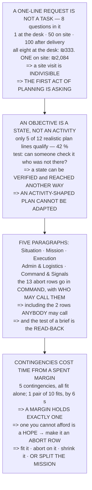

# FOP.01 The mission-planning process

<!-- glance:start -->
<!-- generated by tools/build.py from curriculum/syllabus.yaml — edit the syllabus, not this block -->

| | |
|---|---|
| **Track** | Optional foundation |
| **Difficulty** | Beginner |
| **Time** | 1 h |
| **Hardware** | none |
| **Software** | none |
| **Prerequisites** | none |
| **Skip if** | You can turn a one-line client request into a written plan with objectives, constraints and contingencies. |

<!-- glance:end -->

## What you will learn

- That a one-line request contains **eight unanswered questions**, and that each costs **1 at the
  desk, 50 on site and 100 after delivery**
- That all eight answered at the desk cost **₪333**, while **one** discovered on site costs
  **₪2,084** — because a site visit is indivisible
- That **an objective is a state, not an activity**, and that only **42 %** of a realistic plan's
  lines qualify
- That a state can be **verified** and can be **reached another way** — so an activity-shaped plan
  **cannot be adapted**
- The **five-paragraph brief**, and that the abort criteria belong in **Command and Signals** with
  the person allowed to call them — including the **two rows anybody may call**
- That the test of a brief is the **read-back**, not the delivery
- That of **ten pairs of contingencies, one fits** 19.01's margin, and it leaves **6 seconds** — so
  **a margin holds exactly one contingency**
- And the four honest responses: fit it, make it an abort row, shrink the mission, or **split it**

## Why it matters

[18.03](../../18-civil-ops/18.03-mission-planning-process.md) is the main-path lesson on planning a
flight. This one sits underneath it and asks the question that comes first: **how does a sentence
from a client become something a crew can execute?**

The answer turns out to be mostly arithmetic, and it is unflattering. Most of the value in planning
is not in the plan — it is in the questions asked before anyone writes one, and the cost of not
asking them is a factor of fifty. Most plan lines are not objectives, which means most plans cannot
be adapted when the day goes differently. And most contingency lists are aspirational, because the
margin they draw on holds exactly one of them.

Every one of those is the kind of finding that changes a document from a formality into a tool. The
last one in particular arrives at the capstone's conclusion from the opposite direction, which is the
strongest evidence there is that it is right.

## Prerequisites

<!-- prereqs:start -->
## Prerequisites

None — you can start here.

### Optional prerequisite links

None.

Check your readiness: `python course.py why FOP.01`
<!-- prereqs:end -->

## Concept

A plan has three separable parts, and confusing them is the usual failure.

The **objective** is a state of the world you intend to bring about. It is testable by someone who
was not present, and it says nothing about method.

The **execution** is how you currently intend to reach it — a sequence, with timings and
responsibilities. It is the only part that should change when the day goes differently.

The **constraints and contingencies** say what must remain true regardless, and what you will do when
something specific goes wrong. Both are bounded by resources, and the bound is much tighter than
people expect.

Wrapped around all three is a communication problem: the person who wrote the plan is not the only
person who acts on it. That is what the five-paragraph brief exists to solve, and it is why the
paragraph that holds the abort criteria is the one about **who is allowed to speak**.

## Technical explanation

### Level 1 — a one-line request is not a task

> "Can you survey my site next week?"

That sentence contains no deliverable, no boundary, no date, no acceptance test and no price. Eight
questions go unanswered:

1. what exactly is the deliverable, in a file format?
2. what are the boundaries of the site, as coordinates?
3. what resolution does the deliverable have to be?
4. who owns the land, and who has been told we are coming?
5. what is the date, and what is the weather fallback?
6. what does "finished" mean, and who signs it?
7. is there anything on site we must not overfly?
8. what is the price, and what is in it?

Price one of them at each stage, using
[18.02](../../18-civil-ops/18.02-the-operators-job.md)'s ₪250 an hour and ₪2,084 for a fully loaded
day:

| when you ask it | cost | × the desk | |
|---|---|---|---|
| **at the desk, before quoting** | **₪41.67** | **1×** | an email and ten minutes |
| in the crew brief, on the day | ₪83.33 | 2× | twenty minutes of two people |
| **on site, mid-job** | **₪2,084.40** | **50×** | the day is spent either way |
| **after delivery** | **₪4,168.80** | **100×** | a return trip *and* the wasted first |

**One to 50 to 100** — the classic engineering ratio, applied to a survey exactly as it applies to a
bug. And the compounding is the actual argument:

| questions left open | if all at the desk | if one on site | ratio |
|---|---|---|---|
| 1 of 8 | ₪41.67 | ₪2,084.40 | 50× |
| 4 of 8 | ₪166.67 | ₪2,084.40 | 13× |
| **8 of 8** | **₪333.33** | **₪2,084.40** | **6×** |

**Eight questions answered at the desk cost ₪333. One of them discovered on site costs ₪2,084**,
because the site visit is the indivisible unit — you cannot spend half a day.

**Which is why the first act of planning is not planning. It is asking.** 18.03's five tasking
questions are the same idea one layer down: by the time you are choosing a flight path, you should
have nothing left to discover.

### Level 2 — an objective is a state; most plans contain activities

| line | state? | |
|---|---|---|
| Fly a grid over the site | no | an activity |
| **Deliver an orthomosaic at 2 cm GSD by Thursday** | **YES** | a state, testable |
| Take lots of photos | no | an activity, and vague |
| Charge six batteries | no | an activity |
| **Every point inside the boundary is covered** | **YES** | a state, testable |
| Check the weather | no | an activity |
| **No flight within 30 m of the stables** | **YES** | a state, testable |
| Use the 24 mm lens | no | an activity |
| **The client has signed the acceptance sheet** | **YES** | a state, testable |
| Set up the ground station | no | an activity |
| **Nobody uninvolved was overflown** | **YES** | a state, testable |
| Do a preflight check | no | an activity |

| | |
|---|---|
| lines | 12 |
| states (objectives) | **5** |
| activities (execution) | 7 |
| **objectives as a share** | **42 %** |

**42 % objectives, 58 % activities** — and in most real plans the ratio is worse, because activities
are easier to write.

The test is mechanical: **can somebody else check it afterwards without having been there?** "Fly a
grid" — were you there? Then no. "Every point covered" — open the file and look.

That matters for two reasons, and the second is the surprising one:

1. **A state can be verified**, so the job has an end.
2. **A state can be reached another way.** "Fly a grid" has one method; "every point covered" has
   several, and on a bad day the alternative is what saves the job.

**An activity-shaped plan cannot be adapted, because there is nothing in it that says what the
adaptation must preserve.**

### Level 3 — the five-paragraph brief, and what each one is for

Aviation and the military converged on the same five headings independently, and a drone crew of two
needs all five for the same reason a crew of twenty does: **the person who wrote the plan is not the
only person who acts on it.**

| paragraph | what it answers | what this course already put in it |
|---|---|---|
| **SITUATION** | what is true before we start | site, weather, airspace, people |
| **MISSION** | the objective, as a **state** | Level 2's testable lines only |
| **EXECUTION** | how, in order, with timings | 19.02's setup timeline |
| **ADMIN & LOGISTICS** | what we bring and who pays | 18.06's spares kit, batteries, fuel |
| **COMMAND & SIGNALS** | who decides, and how we talk | **19.01's abort rows** |

Note where the aborts went. **Not into Mission and not into Execution — into Command and Signals,
with the person who is allowed to call them.**

| owner | rows | paragraph |
|---|---|---|
| the aircraft (automatic) | 5 | EXECUTION — it is a behaviour |
| the PIC | 6 | COMMAND — it is a decision |
| **anybody on the crew** | **2** | **COMMAND — and say so out loud** |
| total | 13 | |

**The two "anybody" rows are the whole point of having a Command paragraph.** If the brief does not
say out loud that the least senior person present may stop the flight, then they may not, whatever
anyone believes.

And the test for a brief is not whether it was delivered. **It is the read-back**: ask the other
person to state the mission and one abort criterion. If they cannot, the brief did not happen — it
was merely spoken.

> [!TIP]
> **Ask your teacher:** "Who else can stop this flight?" If the answer is only the PIC, ask what
> happens when the PIC is the one making the mistake. The two "anybody" rows exist for exactly that
> case, and they only work if they were said out loud beforehand.

### Level 4 — contingencies: how many can you afford?

A contingency costs nothing to write and costs **time** to execute, and that time comes out of a
margin already spent.

| | | |
|---|---|---|
| usable endurance | 672 s | 11:12 |
| the mission | 601 s | 10:01 |
| **MARGIN** | **71 s** | **1:11** |

| contingency | cost | fits alone? |
|---|---|---|
| one extra survey pass | 55 s | yes |
| a second delivery approach | 48 s | yes |
| a 60-second hold for traffic | 60 s | yes |
| one orbit to re-acquire the marker | 25 s | yes |
| a diversion to the alternate LZ **[E]** | 40 s | yes |

Every one fits on its own. Now in pairs:

| pair | total | left | fits? |
|---|---|---|---|
| extra pass + second approach | 103 s | −32 | NO |
| extra pass + traffic hold | 115 s | −44 | NO |
| extra pass + re-acquire orbit | 80 s | −9 | NO |
| second approach + re-acquire orbit | 73 s | −2 | NO |
| traffic hold + diversion | 100 s | −29 | NO |
| **re-acquire orbit + diversion** | **65 s** | **+6** | **yes** |

| | |
|---|---|
| pairs tried | 10 |
| pairs that fit | **1** |
| share | 10 % |

**One pair out of ten.** And read what it leaves: **6 seconds** — not a margin but a rounding error,
less time than it takes to notice you need the second contingency and decide to use it.

Which is [19.01](../../19-capstone-hermon-mission/19.01-the-brief.md)'s finding arriving from the
general direction: **a margin holds exactly one contingency, and planning for two is planning for a
flight you cannot fly.**

So the rule is not "write more contingencies". It is:

> **A contingency you cannot afford is not a contingency. It is a hope, and it belongs in the abort
> list instead.**

Using **half the margin** as the threshold — so that one contingency plus its own overrun still fits
— leaves **1 of 5** as plans and turns **4 into abort criteria**.

And that is the honest output of a planning process: **not a longer document, but a shorter one with
a longer abort list.** 19.01 reached the same place by flying the numbers, and then did the only
remaining thing — **it split the mission into two flights.**

The four responses, and the last one is the one people forget:

- fit the contingency in the margin
- make it an abort criterion
- shrink the mission
- **split the mission**

## Diagram



## Code

Arithmetic about planning rather than about flying: the cost of a question at four stages of a job,
a realistic plan's lines classified into states and activities, the five paragraphs mapped onto what
the course has already produced, and a contingency budget tested exhaustively against 19.01's real
margin.

```python
"""FOP.01 -- turning a one-line request into a plan somebody can fly.

Pure stdlib, and no simulation: arithmetic ABOUT planning. The three
useful numbers are what a late question costs, how few plan lines are
actually objectives, and how many contingencies a margin can hold.
"""

import math

BAR = "=" * 70

RATE_H = 250.0            # 18.02's hourly rate, ILS
DAY = 2084.40             # 18.02's fully loaded cost of a day

MARGIN_S = 71.0           # 19.01: 1:11 of margin
MISSION_S = 601.0         # 19.01: 10:01 of flying
USABLE_S = 672.0          # 19.01: 11:12 of usable endurance


def head(n, title):
    print()
    print(BAR)
    print("%d. %s" % (n, title))
    print(BAR)
    print()


# ======================================================================
head(1, "A ONE-LINE REQUEST IS NOT A TASK")

print("  'Can you survey my site next week?'")
print()
print("  That sentence contains no deliverable, no boundary, no date,")
print("  no acceptance test and no price. Every one of those is a")
print("  QUESTION, and a question has a cost that depends entirely on")
print("  WHEN YOU ASK IT.")
print()
QUESTIONS = (
    "what exactly is the deliverable, in a file format?",
    "what are the boundaries of the site, as coordinates?",
    "what resolution does the deliverable have to be?",
    "who owns the land, and who has been told we are coming?",
    "what is the date, and what is the weather fallback?",
    "what does 'finished' mean, and who signs it?",
    "is there anything on site we must not overfly?",
    "what is the price, and what is in it?",
)
print("  THE EIGHT QUESTIONS A ONE-LINE REQUEST DOES NOT ANSWER:")
print()
for i, q in enumerate(QUESTIONS, 1):
    print("  %2d. %s" % (i, q))

print()
print("  NOW PRICE ONE OF THEM AT EACH STAGE, using 18.02's rate of")
print("  %.0f an hour and %.0f for a fully loaded day:" % (RATE_H, DAY))
print()
STAGES = (
    ("at the desk, before quoting", 10.0 / 60.0 * RATE_H,
     "an email and ten minutes"),
    ("in the crew brief, on the day", 20.0 / 60.0 * RATE_H,
     "twenty minutes of two people"),
    ("on site, mid-job", DAY,
     "the day is spent either way"),
    ("after delivery", 2 * DAY,
     "a return trip AND the wasted first"),
)
print("  %-34s %14s %30s" % ("when you ask it", "cost (ILS)", ""))
base = STAGES[0][1]
for when, cost, note in STAGES:
    print("  %-32s %14.2f %30s" % (when, cost, note))
print()
print("  %-34s %14s" % ("", "x the desk"))
for when, cost, note in STAGES:
    print("  %-32s %14.0f x" % (when, cost / base))

print()
print("  ONE TO %.0f TO %.0f. The classic engineering ratio, and it"
      % (STAGES[2][1] / base, STAGES[3][1] / base))
print("  applies to a survey exactly as it applies to a bug.")
print()
print("  AND NOW THE COMPOUNDING, WHICH IS THE ACTUAL ARGUMENT:")
print()
print("  %-24s %16s %18s %14s"
      % ("questions left open", "if all at desk", "if all on site", ""))
for n in (1, 2, 4, 8):
    print("  %-22s %14.2f %18.2f %12.0f x"
          % ("%d of 8" % n, n * base, DAY, DAY / (n * base)))

print()
print("  EIGHT QUESTIONS ANSWERED AT THE DESK COST %.0f. ONE OF THEM"
      % (8 * base))
print("  discovered on site costs %.0f, because the site visit is the"
      % DAY)
print("  indivisible unit -- you cannot spend half a day.")
print()
print("  WHICH IS WHY THE FIRST ACT OF PLANNING IS NOT PLANNING. IT")
print("  IS ASKING. 18.03's five tasking questions are the same idea")
print("  one layer down: by the time you are choosing a flight path")
print("  you should have nothing left to discover.")

# ======================================================================
head(2, "AN OBJECTIVE IS A STATE. MOST PLANS CONTAIN ACTIVITIES.")

print("  Here is a real-looking plan for the request above. Read each")
print("  line and ask: IS THIS A STATE THE WORLD WILL BE IN, or is it")
print("  SOMETHING I WILL DO?")
print()
LINES = (
    ("Fly a grid over the site", False, "an activity"),
    ("Deliver an orthomosaic at 2 cm GSD by Thursday", True,
     "a STATE, testable"),
    ("Take lots of photos", False, "an activity, and vague"),
    ("Charge six batteries", False, "an activity"),
    ("Every point inside the boundary is covered", True,
     "a STATE, testable"),
    ("Check the weather", False, "an activity"),
    ("No flight within 30 m of the stables", True,
     "a STATE, testable"),
    ("Use the 24 mm lens", False, "an activity"),
    ("The client has signed the acceptance sheet", True,
     "a STATE, testable"),
    ("Set up the ground station", False, "an activity"),
    ("Nobody uninvolved was overflown", True, "a STATE, testable"),
    ("Do a preflight check", False, "an activity"),
)
print("  %-46s %10s %18s" % ("line", "state?", ""))
for text, is_state, note in LINES:
    print("  %-44s %10s %18s"
          % (text, "YES" if is_state else "no", note))

n_state = sum(1 for _, s, _ in LINES if s)
print()
print("  %-38s %14d" % ("lines", len(LINES)))
print("  %-38s %14d" % ("  states (objectives)", n_state))
print("  %-38s %14d" % ("  activities (execution)", len(LINES) - n_state))
print("  %-38s %13.0f %%" % ("  objectives as a share",
                             n_state / float(len(LINES)) * 100))
print()
print("  %.0f PER CENT OBJECTIVES, %.0f PER CENT ACTIVITIES -- and in"
      % (n_state / float(len(LINES)) * 100,
         (len(LINES) - n_state) / float(len(LINES)) * 100))
print("  most real plans the ratio is worse, because activities are")
print("  easier to write.")
print()
print("  THE TEST IS MECHANICAL: CAN SOMEBODY ELSE CHECK IT AFTERWARDS")
print("  WITHOUT HAVING BEEN THERE?")
print()
print("  %-34s %34s" % ("'Fly a grid'", "were you there? then no"))
print("  %-34s %34s" % ("'Every point covered'",
                        "open the file and look"))
print()
print("  THAT MATTERS FOR TWO REASONS, and the second one is the")
print("  surprising one:")
print()
print("    1. A STATE CAN BE VERIFIED, so the job has an end.")
print("    2. A STATE CAN BE REACHED ANOTHER WAY. 'Fly a grid' has")
print("       one method; 'every point covered' has several, and on")
print("       a bad day the alternative is what saves the job.")
print()
print("  AN ACTIVITY-SHAPED PLAN CANNOT BE ADAPTED, because there is")
print("  nothing in it that says what the adaptation must preserve.")

# ======================================================================
head(3, "THE FIVE-PARAGRAPH BRIEF, AND WHAT EACH ONE IS FOR")

print("  Aviation and the military converged on the same five")
print("  headings, independently, and a drone crew of two needs all")
print("  five for the same reason a crew of twenty does: THE PERSON")
print("  WHO WROTE THE PLAN IS NOT THE ONLY PERSON WHO ACTS ON IT.")
print()
PARAS = (
    ("SITUATION", "what is true before we start",
     "site, weather, airspace, people"),
    ("MISSION", "the objective, as a STATE",
     "section 2's testable lines only"),
    ("EXECUTION", "how, in order, with timings",
     "19.02's setup timeline lives here"),
    ("ADMIN & LOGISTICS", "what we bring and who pays",
     "18.06's spares kit, batteries, fuel"),
    ("COMMAND & SIGNALS", "who decides, and how we talk",
     "19.01's abort rows live HERE"),
)
print("  %-22s %30s" % ("paragraph", "what it answers"))
for name, what, holds in PARAS:
    print("  %-20s %32s" % (name, what))
print()
print("  %-22s %44s" % ("paragraph", "what the course already put in it"))
for name, what, holds in PARAS:
    print("  %-20s %46s" % (name, holds))

print()
print("  NOTE WHERE THE ABORTS WENT. NOT into MISSION and not into")
print("  EXECUTION -- into COMMAND AND SIGNALS, with the person who")
print("  is allowed to call them.")
print()
print("  19.01's THIRTEEN ABORT ROWS, SORTED BY WHO OWNS THEM:")
print()
print("  %-24s %12s %28s" % ("owner", "rows", "paragraph"))
for who, n, para in (("the aircraft (automatic)", 5,
                      "EXECUTION -- it is a behaviour"),
                     ("the PIC", 6, "COMMAND -- it is a decision"),
                     ("anybody on the crew", 2,
                      "COMMAND -- and say so OUT LOUD")):
    print("  %-22s %12d %30s" % (who, n, para))
print("  %-22s %12d" % ("  total", 13))
print()
print("  THE TWO 'ANYBODY' ROWS ARE THE WHOLE POINT OF HAVING A")
print("  COMMAND PARAGRAPH. If the brief does not say out loud that")
print("  the least senior person present may stop the flight, then")
print("  they may not, whatever anyone believes.")
print()
print("  AND THE TEST FOR A BRIEF IS NOT WHETHER IT WAS DELIVERED.")
print("  IT IS THE READ-BACK: ask the other person to state the")
print("  mission and one abort criterion. If they cannot, the brief")
print("  did not happen -- it was merely spoken.")

# ======================================================================
head(4, "CONTINGENCIES: HOW MANY CAN YOU AFFORD?")

print("  A contingency is a plan for a thing that has not happened.")
print("  It costs nothing to write and it costs TIME to execute, and")
print("  the time comes out of a margin that is already spent.")
print()
print("  19.01's flight, as a budget:")
print()
print("  %-34s %14.0f s %10s"
      % ("usable endurance", USABLE_S, "11:12"))
print("  %-34s %14.0f s %10s" % ("the mission", MISSION_S, "10:01"))
print("  %-34s %14.0f s %10s" % ("  MARGIN", MARGIN_S, "1:11"))
print()
CONT = (
    ("one extra survey pass", 55.0, "a suspect detection"),
    ("a second delivery approach", 48.0, "19.04's 55 % acquisition"),
    ("a 60-second hold for traffic", 60.0, "somebody in the field"),
    ("one orbit to re-acquire the marker", 25.0, "cheap, and real"),
    ("a diversion to the alternate LZ", 40.0, "[E]"),
)
print("  %-38s %12s %14s" % ("contingency", "cost (s)", "fits alone?"))
for name, cost, why in CONT:
    print("  %-36s %12.0f %14s"
          % (name, cost, "yes" if cost <= MARGIN_S else "NO"))

print()
print("  EVERY ONE FITS ON ITS OWN. NOW TRY THEM IN PAIRS:")
print()
print("  %-54s %10s %8s %10s"
      % ("pair", "total", "left", "fits?"))
fits_pairs = 0
n_pairs = 0
best_left = -1.0
for i in range(len(CONT)):
    for j in range(i + 1, len(CONT)):
        tot = CONT[i][1] + CONT[j][1]
        n_pairs += 1
        ok = tot <= MARGIN_S
        if ok:
            fits_pairs += 1
            best_left = max(best_left, MARGIN_S - tot)
        print("  %-52s %10.0f %8.0f %10s"
              % ("%s + %s" % (CONT[i][0][:24], CONT[j][0][:24]),
                 tot, MARGIN_S - tot, "yes" if ok else "NO"))

print()
print("  %-38s %14d" % ("pairs tried", n_pairs))
print("  %-38s %14d" % ("  pairs that fit", fits_pairs))
print("  %-38s %13.0f %%" % ("  share",
                             fits_pairs / float(n_pairs) * 100))
print()
print("  %d PAIR OUT OF %d. And read what it leaves: %.0f SECONDS."
      % (fits_pairs, n_pairs, best_left))
print("  That is not a margin, it is a rounding error -- less time")
print("  than it takes to notice you need the second contingency and")
print("  decide to use it.")
print()
print("  Which is 19.01's finding arriving from the general")
print("  direction: A MARGIN HOLDS EXACTLY ONE CONTINGENCY, and")
print("  planning for two is planning for a flight you cannot fly.")
print()
print("  SO THE RULE IS NOT 'WRITE MORE CONTINGENCIES'. IT IS:")
print()
print("    A CONTINGENCY YOU CANNOT AFFORD IS NOT A CONTINGENCY.")
print("    IT IS A HOPE, AND IT BELONGS IN THE ABORT LIST INSTEAD.")
print()
print("  %-40s %28s" % ("contingency", "becomes"))
for name, cost, why in CONT:
    print("  %-38s %30s"
          % (name, "keep it" if cost <= MARGIN_S / 2
             else "an ABORT row"))
print()
keep = [c for c in CONT if c[1] <= MARGIN_S / 2]
print("  USING 'HALF THE MARGIN' AS THE THRESHOLD -- so that ONE")
print("  contingency plus its own overrun still fits -- leaves %d of"
      % len(keep))
print("  %d as plans and turns %d into abort criteria."
      % (len(CONT), len(CONT) - len(keep)))
print()
print("  AND THAT IS THE HONEST OUTPUT OF A PLANNING PROCESS: not a")
print("  longer document, but a SHORTER one with a longer abort")
print("  list. 19.01 reached exactly the same place by flying the")
print("  numbers, and then did the only remaining thing -- IT SPLIT")
print("  THE MISSION INTO TWO FLIGHTS.")
print()
print("  WHICH IS THE FOURTH OPTION, AND THE ONE PEOPLE FORGET:")
print()
print("    * fit the contingency in the margin")
print("    * make it an abort criterion")
print("    * shrink the mission")
print("    * SPLIT THE MISSION")

# ======================================================================
print()
print(BAR)
print("THE FOUR THINGS TO CARRY FORWARD")
print(BAR)
print()
print("  1. A QUESTION COSTS 1 AT THE DESK, %.0f ON SITE AND %.0f"
      % (STAGES[2][1] / base, STAGES[3][1] / base))
print("     AFTER DELIVERY. All eight of them at the desk cost %.0f."
      % (8 * base))
print("     THE FIRST ACT OF PLANNING IS ASKING.")
print("  2. AN OBJECTIVE IS A STATE, NOT AN ACTIVITY -- and only")
print("     %.0f per cent of a realistic plan's lines qualify. A"
      % (n_state / float(len(LINES)) * 100))
print("     state can be VERIFIED and it can be REACHED ANOTHER")
print("     WAY; an activity-shaped plan cannot be adapted.")
print("  3. FIVE PARAGRAPHS, and the ABORTS GO IN COMMAND AND")
print("     SIGNALS with the person allowed to call them --")
print("     including the %d rows that ANYBODY may call. The test"
      % 2)
print("     of a brief is the READ-BACK, not the delivery.")
print("  4. %d contingencies, every one fits alone, and %d of the %d"
      % (len(CONT), fits_pairs, n_pairs))
print("     PAIRS FITS -- with %.0f seconds left, which is nothing."
      % best_left)
print("     A contingency you cannot afford is a")
print("     HOPE: make it an abort row, shrink the mission, or")
print("     SPLIT IT -- which is what 19.01 did.")
```

Output:

```text

======================================================================
1. A ONE-LINE REQUEST IS NOT A TASK
======================================================================

  'Can you survey my site next week?'

  That sentence contains no deliverable, no boundary, no date,
  no acceptance test and no price. Every one of those is a
  QUESTION, and a question has a cost that depends entirely on
  WHEN YOU ASK IT.

  THE EIGHT QUESTIONS A ONE-LINE REQUEST DOES NOT ANSWER:

   1. what exactly is the deliverable, in a file format?
   2. what are the boundaries of the site, as coordinates?
   3. what resolution does the deliverable have to be?
   4. who owns the land, and who has been told we are coming?
   5. what is the date, and what is the weather fallback?
   6. what does 'finished' mean, and who signs it?
   7. is there anything on site we must not overfly?
   8. what is the price, and what is in it?

  NOW PRICE ONE OF THEM AT EACH STAGE, using 18.02's rate of
  250 an hour and 2084 for a fully loaded day:

  when you ask it                        cost (ILS)                               
  at the desk, before quoting               41.67       an email and ten minutes
  in the crew brief, on the day             83.33   twenty minutes of two people
  on site, mid-job                        2084.40    the day is spent either way
  after delivery                          4168.80 a return trip AND the wasted first

                                         x the desk
  at the desk, before quoting                   1 x
  in the crew brief, on the day                 2 x
  on site, mid-job                             50 x
  after delivery                              100 x

  ONE TO 50 TO 100. The classic engineering ratio, and it
  applies to a survey exactly as it applies to a bug.

  AND NOW THE COMPOUNDING, WHICH IS THE ACTUAL ARGUMENT:

  questions left open        if all at desk     if all on site               
  1 of 8                          41.67            2084.40           50 x
  2 of 8                          83.33            2084.40           25 x
  4 of 8                         166.67            2084.40           13 x
  8 of 8                         333.33            2084.40            6 x

  EIGHT QUESTIONS ANSWERED AT THE DESK COST 333. ONE OF THEM
  discovered on site costs 2084, because the site visit is the
  indivisible unit -- you cannot spend half a day.

  WHICH IS WHY THE FIRST ACT OF PLANNING IS NOT PLANNING. IT
  IS ASKING. 18.03's five tasking questions are the same idea
  one layer down: by the time you are choosing a flight path
  you should have nothing left to discover.

======================================================================
2. AN OBJECTIVE IS A STATE. MOST PLANS CONTAIN ACTIVITIES.
======================================================================

  Here is a real-looking plan for the request above. Read each
  line and ask: IS THIS A STATE THE WORLD WILL BE IN, or is it
  SOMETHING I WILL DO?

  line                                               state?                   
  Fly a grid over the site                             no        an activity
  Deliver an orthomosaic at 2 cm GSD by Thursday        YES  a STATE, testable
  Take lots of photos                                  no an activity, and vague
  Charge six batteries                                 no        an activity
  Every point inside the boundary is covered          YES  a STATE, testable
  Check the weather                                    no        an activity
  No flight within 30 m of the stables                YES  a STATE, testable
  Use the 24 mm lens                                   no        an activity
  The client has signed the acceptance sheet          YES  a STATE, testable
  Set up the ground station                            no        an activity
  Nobody uninvolved was overflown                     YES  a STATE, testable
  Do a preflight check                                 no        an activity

  lines                                              12
    states (objectives)                               5
    activities (execution)                            7
    objectives as a share                           42 %

  42 PER CENT OBJECTIVES, 58 PER CENT ACTIVITIES -- and in
  most real plans the ratio is worse, because activities are
  easier to write.

  THE TEST IS MECHANICAL: CAN SOMEBODY ELSE CHECK IT AFTERWARDS
  WITHOUT HAVING BEEN THERE?

  'Fly a grid'                                  were you there? then no
  'Every point covered'                          open the file and look

  THAT MATTERS FOR TWO REASONS, and the second one is the
  surprising one:

    1. A STATE CAN BE VERIFIED, so the job has an end.
    2. A STATE CAN BE REACHED ANOTHER WAY. 'Fly a grid' has
       one method; 'every point covered' has several, and on
       a bad day the alternative is what saves the job.

  AN ACTIVITY-SHAPED PLAN CANNOT BE ADAPTED, because there is
  nothing in it that says what the adaptation must preserve.

======================================================================
3. THE FIVE-PARAGRAPH BRIEF, AND WHAT EACH ONE IS FOR
======================================================================

  Aviation and the military converged on the same five
  headings, independently, and a drone crew of two needs all
  five for the same reason a crew of twenty does: THE PERSON
  WHO WROTE THE PLAN IS NOT THE ONLY PERSON WHO ACTS ON IT.

  paragraph                             what it answers
  SITUATION                what is true before we start
  MISSION                     the objective, as a STATE
  EXECUTION                 how, in order, with timings
  ADMIN & LOGISTICS          what we bring and who pays
  COMMAND & SIGNALS        who decides, and how we talk

  paragraph                         what the course already put in it
  SITUATION                           site, weather, airspace, people
  MISSION                             section 2's testable lines only
  EXECUTION                         19.02's setup timeline lives here
  ADMIN & LOGISTICS               18.06's spares kit, batteries, fuel
  COMMAND & SIGNALS                      19.01's abort rows live HERE

  NOTE WHERE THE ABORTS WENT. NOT into MISSION and not into
  EXECUTION -- into COMMAND AND SIGNALS, with the person who
  is allowed to call them.

  19.01's THIRTEEN ABORT ROWS, SORTED BY WHO OWNS THEM:

  owner                            rows                    paragraph
  the aircraft (automatic)            5 EXECUTION -- it is a behaviour
  the PIC                           6    COMMAND -- it is a decision
  anybody on the crew               2 COMMAND -- and say so OUT LOUD
    total                          13

  THE TWO 'ANYBODY' ROWS ARE THE WHOLE POINT OF HAVING A
  COMMAND PARAGRAPH. If the brief does not say out loud that
  the least senior person present may stop the flight, then
  they may not, whatever anyone believes.

  AND THE TEST FOR A BRIEF IS NOT WHETHER IT WAS DELIVERED.
  IT IS THE READ-BACK: ask the other person to state the
  mission and one abort criterion. If they cannot, the brief
  did not happen -- it was merely spoken.

======================================================================
4. CONTINGENCIES: HOW MANY CAN YOU AFFORD?
======================================================================

  A contingency is a plan for a thing that has not happened.
  It costs nothing to write and it costs TIME to execute, and
  the time comes out of a margin that is already spent.

  19.01's flight, as a budget:

  usable endurance                              672 s      11:12
  the mission                                   601 s      10:01
    MARGIN                                       71 s       1:11

  contingency                                cost (s)    fits alone?
  one extra survey pass                          55            yes
  a second delivery approach                     48            yes
  a 60-second hold for traffic                   60            yes
  one orbit to re-acquire the marker             25            yes
  a diversion to the alternate LZ                40            yes

  EVERY ONE FITS ON ITS OWN. NOW TRY THEM IN PAIRS:

  pair                                                        total     left      fits?
  one extra survey pass + a second delivery approa            103      -32         NO
  one extra survey pass + a 60-second hold for tra            115      -44         NO
  one extra survey pass + one orbit to re-acquire              80       -9         NO
  one extra survey pass + a diversion to the alter             95      -24         NO
  a second delivery approa + a 60-second hold for tra         108      -37         NO
  a second delivery approa + one orbit to re-acquire           73       -2         NO
  a second delivery approa + a diversion to the alter          88      -17         NO
  a 60-second hold for tra + one orbit to re-acquire           85      -14         NO
  a 60-second hold for tra + a diversion to the alter         100      -29         NO
  one orbit to re-acquire  + a diversion to the alter          65        6        yes

  pairs tried                                        10
    pairs that fit                                    1
    share                                           10 %

  1 PAIR OUT OF 10. And read what it leaves: 6 SECONDS.
  That is not a margin, it is a rounding error -- less time
  than it takes to notice you need the second contingency and
  decide to use it.

  Which is 19.01's finding arriving from the general
  direction: A MARGIN HOLDS EXACTLY ONE CONTINGENCY, and
  planning for two is planning for a flight you cannot fly.

  SO THE RULE IS NOT 'WRITE MORE CONTINGENCIES'. IT IS:

    A CONTINGENCY YOU CANNOT AFFORD IS NOT A CONTINGENCY.
    IT IS A HOPE, AND IT BELONGS IN THE ABORT LIST INSTEAD.

  contingency                                                   becomes
  one extra survey pass                                    an ABORT row
  a second delivery approach                               an ABORT row
  a 60-second hold for traffic                             an ABORT row
  one orbit to re-acquire the marker                            keep it
  a diversion to the alternate LZ                          an ABORT row

  USING 'HALF THE MARGIN' AS THE THRESHOLD -- so that ONE
  contingency plus its own overrun still fits -- leaves 1 of
  5 as plans and turns 4 into abort criteria.

  AND THAT IS THE HONEST OUTPUT OF A PLANNING PROCESS: not a
  longer document, but a SHORTER one with a longer abort
  list. 19.01 reached exactly the same place by flying the
  numbers, and then did the only remaining thing -- IT SPLIT
  THE MISSION INTO TWO FLIGHTS.

  WHICH IS THE FOURTH OPTION, AND THE ONE PEOPLE FORGET:

    * fit the contingency in the margin
    * make it an abort criterion
    * shrink the mission
    * SPLIT THE MISSION

======================================================================
THE FOUR THINGS TO CARRY FORWARD
======================================================================

  1. A QUESTION COSTS 1 AT THE DESK, 50 ON SITE AND 100
     AFTER DELIVERY. All eight of them at the desk cost 333.
     THE FIRST ACT OF PLANNING IS ASKING.
  2. AN OBJECTIVE IS A STATE, NOT AN ACTIVITY -- and only
     42 per cent of a realistic plan's lines qualify. A
     state can be VERIFIED and it can be REACHED ANOTHER
     WAY; an activity-shaped plan cannot be adapted.
  3. FIVE PARAGRAPHS, and the ABORTS GO IN COMMAND AND
     SIGNALS with the person allowed to call them --
     including the 2 rows that ANYBODY may call. The test
     of a brief is the READ-BACK, not the delivery.
  4. 5 contingencies, every one fits alone, and 1 of the 10
     PAIRS FITS -- with 6 seconds left, which is nothing.
     A contingency you cannot afford is a
     HOPE: make it an abort row, shrink the mission, or
     SPLIT IT -- which is what 19.01 did.
```

## Exercise

### Exercise FOP.01-E1 — Write the eight questions `[analysis]`

Take a real or imagined one-line request. Write every question it leaves open, then price the cost of
answering each one late using your own day rate.

### Exercise FOP.01-E2 — Classify your own plan `[analysis]`

Take a plan you have written. Classify every line as a state or an activity and compute the ratio.
Rewrite two activities as states.

### Exercise FOP.01-E3 — Write a five-paragraph brief `[analysis]`

Write one, for a flight you intend to do. Then have someone read it and state the mission and one
abort criterion back to you.

### Exercise FOP.01-E4 — Budget your contingencies `[analysis]`

List your contingencies with their time cost. Test every pair against your margin. Move everything
that does not fit into the abort list.

## Expected result

**FOP.01-E1**: expect six to ten questions, and expect at least two you would genuinely have
discovered on site.

**FOP.01-E2**: expect under half to be states, and expect the rewrite to be harder and more useful
than you anticipated.

**FOP.01-E3**: expect the read-back to fail the first time, and expect the failure to be in Command
and Signals rather than in Mission.

**FOP.01-E4**: expect most pairs not to fit, and expect the list to shorten by more than half.

## Troubleshooting

**The client will not answer the questions.** Then the questions are the deliverable for this week
and the flight is not scheduled yet. That is a legitimate output.

**Every line of my plan is an activity.** Ask "how would someone else check this was done?" of each
one. The lines that survive are your objectives.

**The brief takes too long.** It should be five to ten minutes for a two-person crew. If it is
longer, Execution has absorbed detail that belongs in a checklist.

**Nobody reads the brief back.** Then ask. It is one sentence and it is the only evidence the brief
worked.

**My contingency list keeps growing.** Level 4. Price each one in time and test the pairs; most of
them are abort criteria that have been misfiled.

**The margin is negative before I start.** Then the mission is too big. Shrink it or split it — those
are the only two honest options, and 19.01 chose the second.

**Two abort rows conflict.** Order them by severity, as the failsafe tree does, and say the order out
loud in the brief.

## Common mistakes

- **Planning before asking.** 50× on site.
- **Writing activities and calling them objectives.** 42 %.
- **Putting abort criteria in the Mission paragraph.** They belong with whoever may call them.
- **Not saying out loud who else may stop the flight.** Then nobody else can.
- **Delivering a brief without a read-back.** Spoken is not briefed.
- **Listing contingencies without pricing them in time.** One pair in ten fits.
- **Forgetting that splitting the mission is an option.** It is usually the right one.

## Knowledge check

<details>
<summary>Why is asking questions worth more than planning?</summary>

Because of when the cost lands. A question answered at the desk costs about **₪42** — ten minutes.
The same question discovered **on site** costs a whole day, **₪2,084**, because a site visit is
indivisible; discovered **after delivery** it costs two, since you lost the first one as well. That
is **1 : 50 : 100**. All eight of a typical request's open questions cost **₪333** to answer up
front, less than a sixth of the cost of missing one.
</details>

<details>
<summary>What is the difference between an objective and an activity?</summary>

An objective is a **state of the world** — "every point inside the boundary is covered", "the client
has signed the acceptance sheet". An activity is something you will do — "fly a grid", "check the
weather". The mechanical test is whether someone who was not there can verify it afterwards. In a
realistic plan only about **42 %** of lines are states.
</details>

<details>
<summary>Why does that distinction matter on a bad day?</summary>

Because **a state can be reached another way.** "Fly a grid" has exactly one method, so if the grid
becomes impossible the plan has nothing to say. "Every point covered" has several, and the
alternative is what saves the job. An **activity-shaped plan cannot be adapted**, because nothing in
it records what the adaptation has to preserve.
</details>

<details>
<summary>Which paragraph of the brief holds the abort criteria, and why?</summary>

**Command and Signals** — the paragraph about who decides and how you talk. An abort is not a
behaviour (that is Execution, where the aircraft's five automatic rows live) and not an objective. It
is a **decision**, and it belongs with the person permitted to make it. Of 19.01's thirteen rows, six
are the PIC's and **two may be called by anybody on the crew** — and those two only work if the brief
said so out loud.
</details>

<details>
<summary>How do you know a brief worked?</summary>

**The read-back.** Ask the other person to state the mission and one abort criterion. If they cannot,
the brief did not happen — it was merely spoken. It costs one sentence and it is the only evidence
you have.
</details>

<details>
<summary>How many contingencies can a mission afford?</summary>

Usually **one**. 19.01's margin is 71 seconds; five realistic contingencies each cost 25–60 s, so all
five fit alone — but only **one pair of ten** fits, and it leaves **6 seconds**, which is less time
than it takes to decide you need it. **A contingency you cannot afford is a hope, and it belongs in
the abort list instead.** The four honest responses are: fit it, abort on it, shrink the mission, or
**split it** — which is what the capstone did.
</details>

## Practical challenge

Take one real job from a sentence to a briefable plan.

1. Write the one-line request exactly as it arrived.
2. List every question it leaves open and send them (E1).
3. Write the objective as two or three **states**, each verifiable by someone who was not there.
4. Write the execution separately, with timings.
5. List the constraints — what must remain true regardless of how the day goes.
6. List contingencies with a time cost each, and test the pairs against your margin (E4).
7. Move everything that fails into the abort list, with an owner for each row.
8. Write it as five paragraphs and brief it to someone, ending with a read-back (E3).

If step 7 leaves you with a plan that does not fit, do what 19.01 did rather than what the document
wants: shrink it or split it. A plan that only works if nothing goes wrong is not a plan.

## You can skip this if

You can turn a one-line client request into a written plan with objectives, constraints and
contingencies.

## Go deeper

- The FAA's Aviation Instructor's Handbook chapters on risk management and single-pilot decision
  making, which is where the general-aviation version of this process lives:
  <https://www.faa.gov/regulations_policies/handbooks_manuals/aviation/aviation_instructors_handbook>
- A plain description of the five-paragraph order and why the headings are in that sequence:
  <https://en.wikipedia.org/wiki/Five_paragraph_order>
- The Barnstorming/CRM literature on briefings and read-backs, which is the source of Level 3's
  "spoken is not briefed": <https://skybrary.aero/articles/crew-resource-management-crm>

## Progress checkpoint

You can now turn a request into a set of questions, write objectives as verifiable states, put the
right things in the right paragraph of a brief, and price a contingency list against the margin that
has to pay for it.

Next, FOP.02 takes the part of the plan this lesson kept pushing sideways — the things that could go
wrong — and gives it a structure: the bowtie, threats and consequences on either side of a hazard,
and barriers that either have evidence or do not.
