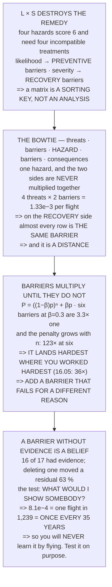

# FOP.02 Risk management: the bowtie

<!-- glance:start -->
<!-- generated by tools/build.py from curriculum/syllabus.yaml — edit the syllabus, not this block -->

| | |
|---|---|
| **Track** | Optional foundation |
| **Difficulty** | Beginner |
| **Time** | 1 h |
| **Hardware** | none |
| **Software** | none |
| **Prerequisites** | [FOP.01 The mission-planning process](FOP.01-mission-planning-process.md) |
| **Skip if** | You can draw a bowtie for "loss of control over people" with real barriers on both sides. |

<!-- glance:end -->

## What you will learn

- That **L × S destroys the remedy**: four hazards scoring 6 need four different treatments, and the
  multiplication threw away the only thing that distinguished them
- That a **risk matrix is a sorting key, not an analysis**
- The **bowtie**: one hazard, threats on the left, consequences on the right, and two kinds of
  barrier that are **not interchangeable**
- That on the recovery side almost every row names **the same barrier, and it is a distance**
- That **barriers multiply until they do not**: with a common-cause factor β = 0.3, **six barriers
  are only 3.3× better than one**
- That the common-cause penalty lands **hardest where you worked hardest** — which is why
  [16.05](../../16-testing-analysis/16.05-field-protocols-and-the-safety-case.md)'s best-protected
  threat got **36× worse**
- That **a barrier without evidence is a belief**: one untested barrier of eight moved a residual by
  **63 %**
- And what 16.05's **8.1e−4** actually means: one flight in **1,239**, which at 35 flights a year is
  **once every 35 years** — so **you will never learn it by flying**

## Why it matters

16.05 built a seventeen-barrier bowtie for Hermon and got a number out of it. This lesson builds the
method underneath that, on a small example you can hold in your head, and then checks itself against
16.05's published figures.

It matters because the alternative — a likelihood-times-severity register — is not merely less
precise, it is **actively destructive**: it takes the two pieces of information that decide what you
should do and collapses them into one number that cannot say. Four hazards with the same score
requiring four incompatible treatments is not a contrived example; it is what every risk register
looks like.

And the last two sections are what separate a safety case from a document. The common-cause result
says that adding barriers has sharply diminishing returns unless they fail for different reasons. The
evidence result says the residual you compute is not a number — it is a number plus a list of things
you have not checked. Both are uncomfortable, and both are the reason the method is worth using.

## Prerequisites

<!-- prereqs:start -->
## Prerequisites

You need these first:

- [FOP.01 The mission-planning process](FOP.01-mission-planning-process.md)

### Optional prerequisite links

None.

Check your readiness: `python course.py why FOP.02`
<!-- prereqs:end -->

## Concept

A bowtie is one diagram answering three questions that a risk score conflates.

**What could start this?** Threats, on the left, each with its own frequency. **What stops them?**
Preventive barriers, which reduce **likelihood**. **What happens if it starts anyway?** Consequences,
on the right, each with recovery barriers that reduce **severity**.

The hazard sits in the middle — a state, not an event: *loss of control over people*, not *a crash*.

Two things make the difference between drawing one and using one. Barriers only multiply if they fail
**independently**, and on a one-crew aircraft they largely do not. And every barrier carries an
implicit claim about how often it works, which is either backed by something you could show a
stranger or it is not.

## Technical explanation

### Level 1 — the risk matrix, and what multiplying destroys

A risk matrix asks two questions — how likely, how bad — and then throws the answers away by
multiplying them.

| hazard | L | S | L × S | character |
|---|---|---|---|---|
| a dropped landing, on grass | 3 | 2 | **6** | often, minor |
| a flyaway over open country | 2 | 3 | **6** | occasional, moderate |
| a battery fire in the van | 1 | 6 | **6** | rare, severe |
| an injury to a bystander | 1 | 6 | **6** | rare, severe |

All four score 6. Now read the treatments:

| hazard | treatment |
|---|---|
| a dropped landing, on grass | accept it; log it |
| a flyaway over open country | geofence, RTL, currency |
| a battery fire in the van | storage, transport, never unattended |
| **an injury to a bystander** | **DISTANCE. Nothing else works.** |

**Not one of those treatments is interchangeable with another**, and the score cannot tell you which
you need — because the multiplication already discarded the only information that distinguishes them.

| | LIKELIHOOD | SEVERITY |
|---|---|---|
| reduce it with | **preventive** barriers | **recovery** barriers |
| acts | **before** the event | **after** it |
| example | a geofence | a parachute |
| measured in | events per flight | consequence per event |

**A score of 6 cannot say which column to spend in. The bowtie can, because it never multiplies them
together.** 18.03 reached the same conclusion from a planning checklist; here it is from the
arithmetic. **L × S is a sorting key, not an analysis**, and using it as one is how a register ends
up full of hazards nobody knows what to do about.

### Level 2 — the bowtie: one hazard, two sides, two kinds of barrier

```
THREATS → [preventive barriers] → HAZARD → [recovery barriers] → CONSEQUENCES
```

**The hazard: loss of control over people.**

| threat | per flight | barrier 1 | barrier 2 |
|---|---|---|---|
| a motor or ESC fails | 1.0e−03 | 0.30 | 0.50 |
| the battery sags or is misjudged | 2.0e−03 | 0.20 | 0.30 |
| the pilot loses orientation | 5.0e−03 | 0.25 | 0.40 |
| GNSS degrades near structures | 4.0e−03 | 0.35 | 0.40 |

Each barrier's number is its **failure** probability: 0.30 means it lets three threats in ten
through.

| threat | raw | both barriers | reduction |
|---|---|---|---|
| a motor or ESC fails | 1.0e−03 | 1.50e−04 | 7× |
| the battery sags | 2.0e−03 | 1.20e−04 | 17× |
| the pilot loses orientation | 5.0e−03 | 5.00e−04 | 10× |
| GNSS degrades | 4.0e−03 | 5.60e−04 | 7× |
| **TOTAL** | 1.2e−02 | **1.33e−03** | |

Now the right-hand side:

| consequence | share | recovery barrier |
|---|---|---|
| nobody hurt, aircraft damaged | 0.800 | 12.03's distance margin |
| property damage | 0.150 | site selection |
| **an injury** | 0.049 | **12.03 again — the same barrier** |
| **a fatality** | 0.001 | **12.03 again — the same barrier** |

**Three of the four rows name the same barrier, and it is a distance.** That is not a weakness of the
example; it is the finding. Once the aircraft is out of control, almost nothing you own affects the
outcome — **only how far away the people were.** Which is why
[12.03](../../12-autonomous-flight/12.03-geofence.md)'s margin is a barrier rather than a rule of
thumb, and why 16.05 found that the one barrier with no aircraft in it was the only one with β = 0.

| | |
|---|---|
| hazard, per flight | 1.33e−03 |
| P(injury or worse \| hazard) | 0.050 |
| **injury or worse, per flight** | **6.65e−05** |

### Level 3 — barriers multiply, until they do not

Level 2 multiplied two barrier probabilities together. That is only legal if they fail
**independently**, and on a small aircraft with one crew, one battery and one checklist, they do not.

`P = ((1 − β)·p)ⁿ + β·p`

The first term is the barriers doing their job. The second is the day you were tired, the manual was
wrong, or the same battery was in both aircraft.

| barriers | independent | with β = 0.3 | ratio |
|---|---|---|---|
| 1 | 3.00e−01 | 3.00e−01 | 1.0× |
| 2 | 9.00e−02 | 1.34e−01 | 1.5× |
| 3 | 2.70e−02 | 9.93e−02 | 3.7× |
| 4 | 8.10e−03 | 9.19e−02 | 11.4× |
| 5 | 2.43e−03 | 9.04e−02 | 37.2× |
| **6** | **7.29e−04** | **9.01e−02** | **123.6×** |

**The more barriers you add, the worse the common-cause penalty gets**, because the independent term
collapses and the β term does not move at all.

| | |
|---|---|
| six independent barriers | 7.29e−04 |
| the same six, with β | 9.01e−02 |
| **one barrier, no β** | **3.00e−01** |

**Six barriers with common cause are barely better than one** — a factor of **3.3** for five extra
barriers and all the effort of maintaining them.

16.05 found exactly this on the real bowtie: **β = 0.3 made its best-protected threat 36× worse.** The
**best-protected** one, because it had the most barriers to collapse. **The penalty lands hardest
where you worked hardest.**

So the design rule is not "add barriers". It is: **add a barrier that fails for a different reason.**

| barrier | β **[E]** | why |
|---|---|---|
| a second checklist item | 0.9 | same person, same day |
| a second preflight, same crew | 0.8 | same fatigue |
| a firmware failsafe | 0.4 | same aircraft |
| a second person | 0.2 | different mind |
| **DISTANCE from people** | **0.0** | **no aircraft in it** |

**The only barrier with β = 0 is the one that does not involve the aircraft at all.** 16.05 found it
empirically; here is why it had to be true.

> [!TIP]
> **Ask your teacher:** "What would make all of these fail on the same day?" It is the only question
> that finds a common cause, and it is never in the risk register — because the register lists
> barriers one per row, which is precisely the format that hides the answer.

### Level 4 — a barrier without evidence is a belief

Every barrier above has a number next to it. Where did the number come from?

| kind of evidence | what it looks like | trustworthy? |
|---|---|---|
| a measurement | a log, a bench test | **YES** |
| a demonstrated test | you broke it on purpose | **YES** |
| a manufacturer figure | a datasheet | partly |
| an industry number | a published study | partly |
| engineering judgement | "that feels about right" | **NO** |
| nothing | it is in the manual | **NO** |

16.05 classified all seventeen of Hermon's barriers this way and found **sixteen with evidence and
one without** — 13.05's flow-plus-inertial fallback, which had never been flown. Here is what
removing an unevidenced barrier does:

| | |
|---|---|
| with both barriers | 5.60e−04 |
| with the unevidenced one removed | 1.40e−03 |
| worse by | **2.5×** |
| bowtie residual, as claimed | 1.33e−03 |
| **if that barrier does not work** | **2.17e−03** |
| the whole bowtie is worse by | **1.6×** |

**One untested barrier out of eight moved the whole answer by 63 %.** Which is the honest reading:
**the residual is not a number, it is a number plus a list of things you have not checked.**

And the test for a barrier is one question:

> **What would I show somebody to prove this works?**

If the answer is "it is in the manual", it is not a barrier. If the answer is "we would have to break
it on purpose", **that is your next test flight.**

Finally, what 16.05's full bowtie came to — and what it *means*, because a probability per flight is
not a sentence anybody can act on:

| | |
|---|---|
| 16.05's residual, per flight | **8.07e−04** |
| = one flight in | **1,239** |
| 18.06's flights per year **[E]** | 35 |
| **= once every** | **35 years** |

**Once every 35 years at this flying rate.** That is the sentence to put in front of a client or a
regulator — and it is also the sentence that shows why the unevidenced barrier matters: **at 35 years
you will never find out by flying. The only way to know is to test the barrier on purpose.**

## Diagram



## Code

A complete bowtie built and then stress-tested: four hazards with identical scores and incompatible
treatments, a worked four-threat bowtie with preventive and recovery sides kept separate, the
beta-factor model applied across barrier counts, and an unevidenced barrier deleted to see what it
was holding up.

```python
"""FOP.02 -- the bowtie, and the three things that break a risk register.

Pure stdlib. 16.05 BUILT a 17-barrier bowtie for Hermon. This lesson
builds the method underneath it, on a small worked example, and then
checks itself against 16.05's published numbers.
"""

import math

BAR = "=" * 70

BETA = 0.3                # 16.05's common-cause factor
RESID_1605 = 1.0 / 1239.0  # 16.05: 8.1e-4, one flight in 1,239
FLIGHTS_YEAR = 35.0       # 18.06's 35 flight hours a year, ~1 h each


def head(n, title):
    print()
    print(BAR)
    print("%d. %s" % (n, title))
    print(BAR)
    print()


# ======================================================================
head(1, "THE RISK MATRIX, AND WHAT MULTIPLYING DESTROYS")

print("  A risk matrix asks two questions -- HOW LIKELY and HOW BAD --")
print("  and then throws the answers away by multiplying them.")
print()
print("  Here are four hazards that all score the same:")
print()
HAZ = (
    ("a dropped landing, on grass", 3, 2, "often, minor",
     "accept it; log it"),
    ("a flyaway over open country", 2, 3, "occasional, moderate",
     "geofence, RTL, currency"),
    ("a battery fire in the van", 1, 6, "rare, severe",
     "storage, transport, never unattended"),
    ("an injury to a bystander", 1, 6, "rare, severe",
     "DISTANCE. Nothing else works."),
)
print("  %-34s %6s %6s %8s %16s"
      % ("hazard", "L", "S", "L x S", "character"))
for name, l, s, char, treat in HAZ:
    print("  %-32s %6d %6d %8d %18s" % (name, l, s, l * s, char))

print()
print("  ALL FOUR SCORE %d. Now read the treatments:" % (3 * 2))
print()
for name, l, s, char, treat in HAZ:
    print("  %-34s %34s" % (name, treat))

print()
print("  NOT ONE OF THOSE TREATMENTS IS INTERCHANGEABLE WITH ANOTHER,")
print("  and the score cannot tell you which you need -- because the")
print("  multiplication ALREADY DISCARDED the only information that")
print("  distinguishes them.")
print()
print("  THE TWO AXES ASK DIFFERENT QUESTIONS AND HAVE DIFFERENT")
print("  ANSWERS:")
print()
print("  %-22s %22s %24s" % ("", "LIKELIHOOD", "SEVERITY"))
print("  %-20s %24s %24s"
      % ("reduce it with", "PREVENTIVE barriers", "RECOVERY barriers"))
print("  %-20s %24s %24s"
      % ("acts", "BEFORE the event", "AFTER it"))
print("  %-20s %24s %24s"
      % ("example", "a geofence", "a parachute"))
print("  %-20s %24s %24s"
      % ("measured in", "events per flight", "consequence per event"))
print()
print("  A SCORE OF %d CANNOT SAY WHICH COLUMN TO SPEND IN. THE" % 6)
print("  BOWTIE CAN, BECAUSE IT NEVER MULTIPLIES THEM TOGETHER.")
print()
print("  18.03 reached the same conclusion from a planning checklist.")
print("  Here it is from the arithmetic: L x S IS A SORTING KEY, NOT")
print("  AN ANALYSIS, and using it as one is how a register ends up")
print("  full of hazards nobody knows what to do about.")

# ======================================================================
head(2, "THE BOWTIE: ONE HAZARD, TWO SIDES, TWO KINDS OF BARRIER")

print("  A bowtie puts ONE hazard in the middle and asks two separate")
print("  questions on either side of it:")
print()
print("    THREATS  ->  [ barriers ]  ->  HAZARD  ->  [ barriers ]"
      "  ->  CONSEQUENCES")
print("                  PREVENTIVE                    RECOVERY")
print()
HAZARD = "loss of control over people"
print("  THE HAZARD: %s" % HAZARD.upper())
print()
THREATS = (
    ("a motor or ESC fails", 1.0e-3,
     ("preflight inspection", 0.30),
     ("15.05's watchdog", 0.50)),
    ("the battery sags or is misjudged", 2.0e-3,
     ("FEL.03's cell monitoring", 0.20),
     ("11.05's three numbers", 0.30)),
    ("the pilot loses orientation", 5.0e-3,
     ("19.02's 242 m attitude limit", 0.25),
     ("currency and 30-day practice", 0.40)),
    ("GNSS degrades near structures", 4.0e-3,
     ("13.02's site check", 0.35),
     ("12.04's failsafe tree", 0.40)),
)
print("  %-34s %12s %10s %10s"
      % ("threat", "per flight", "barrier 1", "barrier 2"))
for name, f, b1, b2 in THREATS:
    print("  %-32s %12.1e %10.2f %10.2f" % (name, f, b1[1], b2[1]))

print()
print("  Each barrier's number is its FAILURE probability: 0.30 means")
print("  it lets three threats in ten through.")
print()
print("  %-34s %12s %14s %14s"
      % ("threat", "raw", "both barriers", "reduction"))
tot_ind = 0.0
for name, f, b1, b2 in THREATS:
    r = f * b1[1] * b2[1]
    tot_ind += r
    print("  %-32s %12.1e %14.2e %12.0f x" % (name, f, r, f / r))
print("  %-32s %12.1e %14.2e" % ("  TOTAL", sum(t[1] for t in THREATS),
                                 tot_ind))

print()
print("  NOW THE RIGHT-HAND SIDE. The hazard has happened; what")
print("  decides how bad it is?")
print()
CONS = (
    ("nobody hurt, aircraft damaged", 0.80, "12.03's distance margin"),
    ("property damage", 0.15, "site selection"),
    ("an injury", 0.049, "12.03 again -- THE SAME BARRIER"),
    ("a fatality", 0.001, "12.03 again -- THE SAME BARRIER"),
)
print("  %-34s %14s %30s" % ("consequence", "share", "recovery barrier"))
for name, p, b in CONS:
    print("  %-32s %14.3f %32s" % (name, p, b))

print()
print("  NOTICE WHAT THE RIGHT-HAND SIDE LOOKS LIKE. THREE OF THE FOUR")
print("  ROWS NAME THE SAME BARRIER, AND IT IS A DISTANCE.")
print()
print("  That is not a weakness of the example; it is the finding.")
print("  Once the aircraft is out of control, almost nothing you own")
print("  affects the outcome -- ONLY HOW FAR AWAY THE PEOPLE WERE.")
print("  Which is why 12.03's margin is a barrier and not a rule of")
print("  thumb, and why 16.05 found that the ONE barrier with no")
print("  aircraft in it was the only one with beta = 0.")
print()
print("  %-38s %14.2e" % ("hazard, per flight", tot_ind))
print("  %-38s %14.3f" % ("  P(injury or worse | hazard)",
                          CONS[2][1] + CONS[3][1]))
print("  %-38s %14.2e" % ("  INJURY OR WORSE, per flight",
                          tot_ind * (CONS[2][1] + CONS[3][1])))

# ======================================================================
head(3, "BARRIERS MULTIPLY -- UNTIL THEY DO NOT")

print("  Section 2 multiplied two barrier probabilities together. That")
print("  is only legal IF THEY FAIL INDEPENDENTLY, and on a small")
print("  aircraft with one crew, one battery and one checklist, THEY")
print("  DO NOT.")
print()
print("  The beta-factor model says a fraction BETA of failures take")
print("  out every barrier at once:")
print()
print("      P = ((1 - beta) p)^n  +  beta x p")
print()
print("  The first term is the barriers doing their job. The second")
print("  is the day you were tired, or the manual was wrong, or the")
print("  same battery was in both aircraft.")
print()
p = 0.3
print("  %-12s %16s %16s %14s"
      % ("barriers", "independent", "with beta=%.1f" % BETA, "ratio"))
for n in (1, 2, 3, 4, 5, 6):
    ind = p ** n
    real = ((1 - BETA) * p) ** n + BETA * p
    print("  %-10d %16.2e %16.2e %12.1f x" % (n, ind, real, real / ind))

print()
print("  READ THE LAST COLUMN DOWNWARDS. THE MORE BARRIERS YOU ADD,")
print("  THE WORSE THE COMMON-CAUSE PENALTY GETS -- because the")
print("  independent term collapses and the beta term does not move")
print("  at all.")
print()
print("  %-38s %14.2e" % ("six independent barriers", p ** 6))
print("  %-38s %14.2e" % ("  the same six, with beta",
                          ((1 - BETA) * p) ** 6 + BETA * p))
print("  %-38s %14.2e" % ("  ONE barrier, no beta", p))
print()
print("  SIX BARRIERS WITH COMMON CAUSE ARE BARELY BETTER THAN ONE.")
print("  %.2e against %.2e -- a factor of %.1f for five extra"
      % (((1 - BETA) * p) ** 6 + BETA * p, p,
         p / (((1 - BETA) * p) ** 6 + BETA * p)))
print("  barriers and all the effort of maintaining them.")
print()
print("  16.05 FOUND EXACTLY THIS ON THE REAL BOWTIE: beta = %.1f"
      % BETA)
print("  made ITS BEST-PROTECTED THREAT 36 TIMES WORSE. The")
print("  best-protected one, because it had the most barriers to")
print("  collapse. THE PENALTY LANDS HARDEST WHERE YOU WORKED")
print("  HARDEST.")
print()
print("  SO THE DESIGN RULE IS NOT 'ADD BARRIERS'. IT IS:")
print()
print("    ADD A BARRIER THAT FAILS FOR A DIFFERENT REASON.")
print()
print("  %-30s %14s %24s" % ("barrier", "beta [E]", "why"))
for what, b, why in (
        ("a second checklist item", 0.9, "same person, same day"),
        ("a second preflight, same crew", 0.8, "same fatigue"),
        ("a firmware failsafe", 0.4, "same aircraft"),
        ("a second person", 0.2, "different mind"),
        ("DISTANCE from people", 0.0, "NO AIRCRAFT IN IT")):
    print("  %-28s %14.1f %26s" % (what, b, why))
print()
print("  THE ONLY BARRIER WITH BETA = 0 IS THE ONE THAT DOES NOT")
print("  INVOLVE THE AIRCRAFT AT ALL. 16.05 found it; here is why it")
print("  had to be true.")

# ======================================================================
head(4, "A BARRIER WITHOUT EVIDENCE IS A BELIEF")

print("  Every barrier in section 2 has a number next to it. Where")
print("  did the number come from?")
print()
print("  %-32s %20s %16s"
      % ("kind of evidence", "what it looks like", "trustworthy?"))
for kind, looks, ok in (
        ("a measurement", "a log, a bench test", "YES"),
        ("a demonstrated test", "you broke it on purpose", "YES"),
        ("a manufacturer figure", "a datasheet", "partly"),
        ("an industry number", "a published study", "partly"),
        ("engineering judgement", "'that feels about right'", "NO"),
        ("nothing", "it is in the manual", "NO")):
    print("  %-30s %22s %16s" % (kind, looks, ok))

print()
print("  16.05 CLASSIFIED ALL SEVENTEEN OF HERMON's BARRIERS THIS WAY")
print("  AND FOUND SIXTEEN WITH EVIDENCE AND ONE WITHOUT -- 13.05's")
print("  flow-plus-inertial fallback, which had never been flown.")
print()
print("  Here is what removing an unevidenced barrier does. Take")
print("  section 2's GNSS threat and delete its second barrier:")
print()
name, f, b1, b2 = THREATS[3]
with_b = f * b1[1] * b2[1]
without = f * b1[1]
print("  %-38s %14.2e" % ("with both barriers", with_b))
print("  %-38s %14.2e" % ("with the unevidenced one removed", without))
print("  %-38s %14.1f x" % ("  worse by", without / with_b))
print()
new_tot = tot_ind - with_b + without
print("  %-38s %14.2e" % ("bowtie residual, as claimed", tot_ind))
print("  %-38s %14.2e" % ("  if that barrier does not work", new_tot))
print("  %-38s %14.1f x" % ("  the whole bowtie is worse by",
                            new_tot / tot_ind))
print()
print("  ONE UNTESTED BARRIER OUT OF EIGHT MOVED THE WHOLE ANSWER BY")
print("  %.0f PER CENT. Which is the honest reading: the residual is"
      % ((new_tot / tot_ind - 1) * 100))
print("  not a number, it is a number PLUS A LIST OF THINGS YOU HAVE")
print("  NOT CHECKED.")
print()
print("  AND THE TEST FOR A BARRIER IS ONE QUESTION:")
print()
print("    WHAT WOULD I SHOW SOMEBODY TO PROVE THIS WORKS?")
print()
print("  If the answer is 'it is in the manual', it is not a barrier.")
print("  If the answer is 'we would have to break it on purpose',")
print("  then that is your next test flight.")
print()
print("  FINALLY, WHAT 16.05's FULL BOWTIE CAME TO, and what it")
print("  MEANS -- because a probability per flight is not a sentence")
print("  anybody can act on:")
print()
print("  %-38s %14.2e" % ("16.05's residual, per flight", RESID_1605))
print("  %-38s %14.0f" % ("  = one flight in", 1.0 / RESID_1605))
print("  %-38s %14.0f" % ("18.06's flights per year [E]",
                          FLIGHTS_YEAR))
print("  %-38s %14.0f years" % ("  = once every",
                                1.0 / RESID_1605 / FLIGHTS_YEAR))
print()
print("  ONCE EVERY %.0f YEARS AT THIS FLYING RATE."
      % (1.0 / RESID_1605 / FLIGHTS_YEAR))
print()
print("  THAT IS THE SENTENCE TO PUT IN FRONT OF A CLIENT OR A")
print("  REGULATOR, and it is also the sentence that shows why the")
print("  unevidenced barrier matters: at %.0f years you will never"
      % (1.0 / RESID_1605 / FLIGHTS_YEAR))
print("  find out by flying. THE ONLY WAY TO KNOW IS TO TEST THE")
print("  BARRIER ON PURPOSE.")

# ======================================================================
print()
print(BAR)
print("THE FOUR THINGS TO CARRY FORWARD")
print(BAR)
print()
print("  1. L x S DESTROYS THE REMEDY. Four hazards scoring %d need"
      % 6)
print("     four different treatments, and the multiplication threw")
print("     away the only thing that distinguished them. A matrix is")
print("     A SORTING KEY, NOT AN ANALYSIS.")
print("  2. A BOWTIE KEEPS THE TWO SIDES APART: PREVENTIVE barriers")
print("     reduce likelihood, RECOVERY barriers reduce severity, and")
print("     they are not interchangeable. On the recovery side almost")
print("     every row names the SAME barrier -- A DISTANCE.")
print("  3. BARRIERS MULTIPLY UNTIL THEY DO NOT. With beta = %.1f,"
      % BETA)
print("     six barriers are only %.1f x better than one, and the"
      % (p / (((1 - BETA) * p) ** 6 + BETA * p)))
print("     penalty is WORST WHERE YOU WORKED HARDEST. Add a barrier")
print("     that FAILS FOR A DIFFERENT REASON.")
print("  4. A BARRIER WITHOUT EVIDENCE IS A BELIEF. One untested")
print("     barrier of eight moved the residual by %.0f per cent."
      % ((new_tot / tot_ind - 1) * 100))
print("     16.05's %.1e is one flight in %.0f -- ONCE EVERY %.0f"
      % (RESID_1605, 1.0 / RESID_1605,
         1.0 / RESID_1605 / FLIGHTS_YEAR))
print("     YEARS, which is why you will never learn it by flying.")
```

Output:

```text

======================================================================
1. THE RISK MATRIX, AND WHAT MULTIPLYING DESTROYS
======================================================================

  A risk matrix asks two questions -- HOW LIKELY and HOW BAD --
  and then throws the answers away by multiplying them.

  Here are four hazards that all score the same:

  hazard                                  L      S    L x S        character
  a dropped landing, on grass           3      2        6       often, minor
  a flyaway over open country           2      3        6 occasional, moderate
  a battery fire in the van             1      6        6       rare, severe
  an injury to a bystander              1      6        6       rare, severe

  ALL FOUR SCORE 6. Now read the treatments:

  a dropped landing, on grass                         accept it; log it
  a flyaway over open country                   geofence, RTL, currency
  a battery fire in the van          storage, transport, never unattended
  an injury to a bystander                DISTANCE. Nothing else works.

  NOT ONE OF THOSE TREATMENTS IS INTERCHANGEABLE WITH ANOTHER,
  and the score cannot tell you which you need -- because the
  multiplication ALREADY DISCARDED the only information that
  distinguishes them.

  THE TWO AXES ASK DIFFERENT QUESTIONS AND HAVE DIFFERENT
  ANSWERS:

                                     LIKELIHOOD                 SEVERITY
  reduce it with            PREVENTIVE barriers        RECOVERY barriers
  acts                         BEFORE the event                 AFTER it
  example                            a geofence              a parachute
  measured in                 events per flight    consequence per event

  A SCORE OF 6 CANNOT SAY WHICH COLUMN TO SPEND IN. THE
  BOWTIE CAN, BECAUSE IT NEVER MULTIPLIES THEM TOGETHER.

  18.03 reached the same conclusion from a planning checklist.
  Here it is from the arithmetic: L x S IS A SORTING KEY, NOT
  AN ANALYSIS, and using it as one is how a register ends up
  full of hazards nobody knows what to do about.

======================================================================
2. THE BOWTIE: ONE HAZARD, TWO SIDES, TWO KINDS OF BARRIER
======================================================================

  A bowtie puts ONE hazard in the middle and asks two separate
  questions on either side of it:

    THREATS  ->  [ barriers ]  ->  HAZARD  ->  [ barriers ]  ->  CONSEQUENCES
                  PREVENTIVE                    RECOVERY

  THE HAZARD: LOSS OF CONTROL OVER PEOPLE

  threat                               per flight  barrier 1  barrier 2
  a motor or ESC fails                  1.0e-03       0.30       0.50
  the battery sags or is misjudged      2.0e-03       0.20       0.30
  the pilot loses orientation           5.0e-03       0.25       0.40
  GNSS degrades near structures         4.0e-03       0.35       0.40

  Each barrier's number is its FAILURE probability: 0.30 means
  it lets three threats in ten through.

  threat                                      raw  both barriers      reduction
  a motor or ESC fails                  1.0e-03       1.50e-04            7 x
  the battery sags or is misjudged      2.0e-03       1.20e-04           17 x
  the pilot loses orientation           5.0e-03       5.00e-04           10 x
  GNSS degrades near structures         4.0e-03       5.60e-04            7 x
    TOTAL                               1.2e-02       1.33e-03

  NOW THE RIGHT-HAND SIDE. The hazard has happened; what
  decides how bad it is?

  consequence                                 share               recovery barrier
  nobody hurt, aircraft damaged             0.800          12.03's distance margin
  property damage                           0.150                   site selection
  an injury                                 0.049  12.03 again -- THE SAME BARRIER
  a fatality                                0.001  12.03 again -- THE SAME BARRIER

  NOTICE WHAT THE RIGHT-HAND SIDE LOOKS LIKE. THREE OF THE FOUR
  ROWS NAME THE SAME BARRIER, AND IT IS A DISTANCE.

  That is not a weakness of the example; it is the finding.
  Once the aircraft is out of control, almost nothing you own
  affects the outcome -- ONLY HOW FAR AWAY THE PEOPLE WERE.
  Which is why 12.03's margin is a barrier and not a rule of
  thumb, and why 16.05 found that the ONE barrier with no
  aircraft in it was the only one with beta = 0.

  hazard, per flight                           1.33e-03
    P(injury or worse | hazard)                   0.050
    INJURY OR WORSE, per flight                6.65e-05

======================================================================
3. BARRIERS MULTIPLY -- UNTIL THEY DO NOT
======================================================================

  Section 2 multiplied two barrier probabilities together. That
  is only legal IF THEY FAIL INDEPENDENTLY, and on a small
  aircraft with one crew, one battery and one checklist, THEY
  DO NOT.

  The beta-factor model says a fraction BETA of failures take
  out every barrier at once:

      P = ((1 - beta) p)^n  +  beta x p

  The first term is the barriers doing their job. The second
  is the day you were tired, or the manual was wrong, or the
  same battery was in both aircraft.

  barriers          independent    with beta=0.3          ratio
  1                  3.00e-01         3.00e-01          1.0 x
  2                  9.00e-02         1.34e-01          1.5 x
  3                  2.70e-02         9.93e-02          3.7 x
  4                  8.10e-03         9.19e-02         11.4 x
  5                  2.43e-03         9.04e-02         37.2 x
  6                  7.29e-04         9.01e-02        123.6 x

  READ THE LAST COLUMN DOWNWARDS. THE MORE BARRIERS YOU ADD,
  THE WORSE THE COMMON-CAUSE PENALTY GETS -- because the
  independent term collapses and the beta term does not move
  at all.

  six independent barriers                     7.29e-04
    the same six, with beta                    9.01e-02
    ONE barrier, no beta                       3.00e-01

  SIX BARRIERS WITH COMMON CAUSE ARE BARELY BETTER THAN ONE.
  9.01e-02 against 3.00e-01 -- a factor of 3.3 for five extra
  barriers and all the effort of maintaining them.

  16.05 FOUND EXACTLY THIS ON THE REAL BOWTIE: beta = 0.3
  made ITS BEST-PROTECTED THREAT 36 TIMES WORSE. The
  best-protected one, because it had the most barriers to
  collapse. THE PENALTY LANDS HARDEST WHERE YOU WORKED
  HARDEST.

  SO THE DESIGN RULE IS NOT 'ADD BARRIERS'. IT IS:

    ADD A BARRIER THAT FAILS FOR A DIFFERENT REASON.

  barrier                              beta [E]                      why
  a second checklist item                 0.9      same person, same day
  a second preflight, same crew            0.8               same fatigue
  a firmware failsafe                     0.4              same aircraft
  a second person                         0.2             different mind
  DISTANCE from people                    0.0          NO AIRCRAFT IN IT

  THE ONLY BARRIER WITH BETA = 0 IS THE ONE THAT DOES NOT
  INVOLVE THE AIRCRAFT AT ALL. 16.05 found it; here is why it
  had to be true.

======================================================================
4. A BARRIER WITHOUT EVIDENCE IS A BELIEF
======================================================================

  Every barrier in section 2 has a number next to it. Where
  did the number come from?

  kind of evidence                   what it looks like     trustworthy?
  a measurement                     a log, a bench test              YES
  a demonstrated test            you broke it on purpose              YES
  a manufacturer figure                     a datasheet           partly
  an industry number                  a published study           partly
  engineering judgement          'that feels about right'               NO
  nothing                           it is in the manual               NO

  16.05 CLASSIFIED ALL SEVENTEEN OF HERMON's BARRIERS THIS WAY
  AND FOUND SIXTEEN WITH EVIDENCE AND ONE WITHOUT -- 13.05's
  flow-plus-inertial fallback, which had never been flown.

  Here is what removing an unevidenced barrier does. Take
  section 2's GNSS threat and delete its second barrier:

  with both barriers                           5.60e-04
  with the unevidenced one removed             1.40e-03
    worse by                                        2.5 x

  bowtie residual, as claimed                  1.33e-03
    if that barrier does not work              2.17e-03
    the whole bowtie is worse by                    1.6 x

  ONE UNTESTED BARRIER OUT OF EIGHT MOVED THE WHOLE ANSWER BY
  63 PER CENT. Which is the honest reading: the residual is
  not a number, it is a number PLUS A LIST OF THINGS YOU HAVE
  NOT CHECKED.

  AND THE TEST FOR A BARRIER IS ONE QUESTION:

    WHAT WOULD I SHOW SOMEBODY TO PROVE THIS WORKS?

  If the answer is 'it is in the manual', it is not a barrier.
  If the answer is 'we would have to break it on purpose',
  then that is your next test flight.

  FINALLY, WHAT 16.05's FULL BOWTIE CAME TO, and what it
  MEANS -- because a probability per flight is not a sentence
  anybody can act on:

  16.05's residual, per flight                 8.07e-04
    = one flight in                                1239
  18.06's flights per year [E]                       35
    = once every                                     35 years

  ONCE EVERY 35 YEARS AT THIS FLYING RATE.

  THAT IS THE SENTENCE TO PUT IN FRONT OF A CLIENT OR A
  REGULATOR, and it is also the sentence that shows why the
  unevidenced barrier matters: at 35 years you will never
  find out by flying. THE ONLY WAY TO KNOW IS TO TEST THE
  BARRIER ON PURPOSE.

======================================================================
THE FOUR THINGS TO CARRY FORWARD
======================================================================

  1. L x S DESTROYS THE REMEDY. Four hazards scoring 6 need
     four different treatments, and the multiplication threw
     away the only thing that distinguished them. A matrix is
     A SORTING KEY, NOT AN ANALYSIS.
  2. A BOWTIE KEEPS THE TWO SIDES APART: PREVENTIVE barriers
     reduce likelihood, RECOVERY barriers reduce severity, and
     they are not interchangeable. On the recovery side almost
     every row names the SAME barrier -- A DISTANCE.
  3. BARRIERS MULTIPLY UNTIL THEY DO NOT. With beta = 0.3,
     six barriers are only 3.3 x better than one, and the
     penalty is WORST WHERE YOU WORKED HARDEST. Add a barrier
     that FAILS FOR A DIFFERENT REASON.
  4. A BARRIER WITHOUT EVIDENCE IS A BELIEF. One untested
     barrier of eight moved the residual by 63 per cent.
     16.05's 8.1e-04 is one flight in 1239 -- ONCE EVERY 35
     YEARS, which is why you will never learn it by flying.
```

## Exercise

### Exercise FOP.02-E1 — Break your own risk matrix `[analysis]`

Take four hazards from your own operation with the same L × S score. Write their treatments and
confirm they are not interchangeable.

### Exercise FOP.02-E2 — Draw a bowtie `[analysis]`

Draw one for "loss of control over people". List at least four threats with preventive barriers and
four consequences with recovery barriers, with a failure probability for each.

### Exercise FOP.02-E3 — Find your common cause `[analysis]`

For each threat in E2, ask what single event would defeat every barrier at once. Estimate β and
recompute the residual.

### Exercise FOP.02-E4 — Audit your evidence `[analysis]`

For every barrier in E2, write down what you would show someone to prove it works. Mark any that have
no answer, and compute what the residual becomes without them.

## Expected result

**FOP.02-E1**: expect at least one pair whose treatments are opposites — one you accept and one you
design the whole operation around.

**FOP.02-E2**: expect the recovery side to be much thinner than the preventive side, and expect most
of it to reduce to distance.

**FOP.02-E3**: expect β between 0.2 and 0.5 for anything involving one crew and one aircraft, and
expect it to dominate your answer.

**FOP.02-E4**: expect two or three barriers with no evidence, and expect at least one of them to be
carrying a lot of weight.

## Troubleshooting

**Every hazard in my register scores the same.** That is Level 1 working as designed and it is why
the register is not helping.

**My bowtie has no recovery barriers.** That is common and it is worth stating plainly: most small
operations have exactly one, and it is distance.

**The residual is implausibly small.** Check β. Multiplying independent-looking barriers is how you
get numbers like 1e−9 for a one-crew operation.

**I cannot estimate a barrier's failure probability.** Then you have found an unevidenced barrier.
That is Level 4's whole point, and "I do not know" is a valid and useful entry.

**Two barriers look like one.** They probably are. If the same person, the same document or the same
component underlies both, they are one barrier written twice.

**The client wants a single risk number.** Give them the sentence instead: "once every N years at
this flying rate", plus the list of what has not been tested.

## Common mistakes

- **Using L × S to decide treatment.** It cannot; it threw the information away.
- **Putting an event in the middle of a bowtie.** The middle is a **state**.
- **Mixing preventive and recovery barriers.** They reduce different things.
- **Multiplying barriers that share a cause.** β dominates fast.
- **Adding a fifth barrier of the same kind.** Diminishing to nothing.
- **Counting a barrier you have never tested.** It is a belief.
- **Reporting a probability instead of a frequency.** "One in 1,239" means nothing; "once every 35
  years" means something.

## Knowledge check

<details>
<summary>What does multiplying likelihood by severity throw away?</summary>

The thing that decides the treatment. Four hazards can all score **6** — a minor frequent one, a
moderate occasional one and two rare severe ones — and their treatments are *accept it*, *geofence
and RTL*, *storage and transport rules*, and *distance*. **None is interchangeable with another**,
and the score cannot distinguish them because it already collapsed the two axes. A matrix is a
**sorting key**, not an analysis.
</details>

<details>
<summary>What are the two kinds of barrier, and why must they be kept apart?</summary>

**Preventive** barriers sit between a threat and the hazard and reduce **likelihood** — a geofence, a
preflight, a failsafe. **Recovery** barriers sit between the hazard and its consequences and reduce
**severity** — distance, a parachute, a chosen landing area. They are measured in different units
(events per flight versus consequence per event) and one cannot substitute for the other. The bowtie
keeps them on opposite sides of the diagram precisely so they are never summed into one score.
</details>

<details>
<summary>What dominates the recovery side of a drone bowtie?</summary>

**Distance.** In the worked example three of the four consequence rows name the same barrier. Once
the aircraft is out of control, almost nothing you own affects the outcome — only how far away the
people were. That is why 12.03's separation margin is a barrier rather than a habit, and why it is
the only barrier in 16.05's whole bowtie with **β = 0**: it is the one that does not involve the
aircraft.
</details>

<details>
<summary>Why do barriers stop multiplying?</summary>

Because of **common cause**. The beta model says `P = ((1−β)p)ⁿ + β·p`: a fraction β of failures
defeat every barrier at once — the tired day, the wrong manual, the same battery. The independent
term collapses with n and the β term does not move, so at β = 0.3, **six barriers are only 3.3×
better than one**, and the ratio between the naive and the real answer reaches **124×**. The penalty
is **worst where you worked hardest**: 16.05's best-protected threat got **36× worse** precisely
because it had the most barriers to collapse.
</details>

<details>
<summary>What follows from that for barrier design?</summary>

**Add a barrier that fails for a different reason**, not another of the same kind. A second checklist
item shares the person and the day (β ≈ 0.9); a firmware failsafe shares the aircraft (β ≈ 0.4); a
second person shares much less (β ≈ 0.2); **distance from people shares nothing at all (β = 0)**. The
most effective safety measure available to a small operator is the one with no aircraft in it.
</details>

<details>
<summary>What does 8.1e−4 per flight actually mean?</summary>

**One flight in 1,239** — and at 18.06's 35 flights a year, **once every 35 years**. That is the
sentence to give a client or a regulator, because a probability per flight is not something anyone
can act on. It also shows why an unevidenced barrier matters: at a 35-year interval **you will never
learn by flying whether it works**, so the only way to know is to break it on purpose. One untested
barrier of eight moved the worked residual by **63 %**.
</details>

## Practical challenge

Build the safety case you would show a regulator.

1. Pick the one hazard that matters: loss of control over people.
2. List every threat that could start it, with a frequency estimate (E2).
3. List every preventive barrier per threat, with a failure probability and its evidence.
4. List the consequences and their recovery barriers. Note how few there are.
5. For each barrier, write the single event that would defeat all of that threat's barriers (E3).
6. Estimate β and recompute. Note which threat got worse fastest.
7. Mark every barrier with no evidence and recompute without them (E4).
8. Convert the final residual into "once every N years at my flying rate" and write that sentence at
   the top.

Step 7 produces your test-flight list, and that is the real output. A safety case is not a document
about how safe you are — it is a document about what you would have to break on purpose to find out.

## You can skip this if

You can draw a bowtie for "loss of control over people" with real barriers on both sides.

## Go deeper

- The CGE/bowtie methodology as used in aviation and process safety, including the barrier and
  escalation-factor conventions: <https://skybrary.aero/articles/bow-tie-risk-management-methodology>
- The EASA SORA methodology, which is the bowtie formalised into a regulatory route for specific-
  category operations: <https://www.easa.europa.eu/en/domains/civil-drones>
- An accessible treatment of common-cause failure and the beta factor, which is Level 3's model:
  <https://www.nrc.gov/reading-rm/doc-collections/nuregs/contract/cr5485/>

## Progress checkpoint

You can now say what a risk matrix cannot tell you, build a bowtie that keeps likelihood and severity
apart, apply a common-cause factor and see where it bites hardest, distinguish a barrier from a
belief, and turn a residual probability into a sentence a person can act on.

Next, FOP.03 closes the sequence with the part everyone skips: the debrief. What was planned, what
happened, why, and the one concrete change that comes out of it — done blamelessly, because the
alternative stops producing information.
