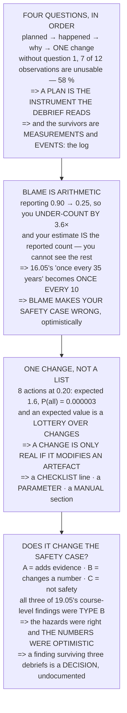

# FOP.03 The debrief: an honest after-action review

<!-- glance:start -->
<!-- generated by tools/build.py from curriculum/syllabus.yaml — edit the syllabus, not this block -->

| | |
|---|---|
| **Track** | Optional foundation |
| **Difficulty** | Beginner |
| **Time** | 45 min |
| **Hardware** | none |
| **Software** | none |
| **Prerequisites** | [FOP.02 Risk management: the bowtie](FOP.02-risk-management-bowtie.md) |
| **Skip if** | You can run a blameless AAR for a flight that went wrong and produce one concrete change from it. |

<!-- glance:end -->

## What you will learn

- The four questions of an after-action review, **in the only order that works** — and that without
  question 1, **58 % of what you observed is unusable**
- That a plan is not written so you can follow it, but **so the debrief has something to measure
  against**
- That **blame is an arithmetic problem, not a moral one**: reporting drops from 90 % to 25 %, so you
  **under-count by 3.6×**
- And that this turns 16.05's "once every 35 years" into **once every 10** — **blame does not make
  you less safe, it makes your safety case wrong**
- That a debrief producing eight actions has a **0.000003** chance of completing all of them
- That **a change is only real if it modifies an artefact**: a checklist line, a parameter, or a
  manual section — **4 of 8 typical proposals are intentions**
- That every finding is type **A** (adds evidence), **B** (changes a number) or **C** (not a safety
  finding) — and that **all three of 19.05's course-level findings were type B**
- That a finding surviving three debriefs **is not a finding any more, it is an undocumented
  decision**

## Why it matters

The debrief is the step everyone agrees is important and nobody does, because it feels like talking
about a flight that is already over. This lesson gives it three numbers that make it a technical
activity rather than a ritual.

The first is that most of what you noticed is worthless without a written plan to compare it against
— which retroactively explains why [FOP.01](FOP.01-mission-planning-process.md) was so insistent.

The second is the one worth the whole lesson. A blaming culture does not make people careless; it
makes them quiet, and quiet is indistinguishable from safe. Feed the reduced reporting rate into
[FOP.02](FOP.02-risk-management-bowtie.md)'s bowtie and the residual is wrong by a factor of 3.6, in
the optimistic direction. **Blamelessness is how you keep the arithmetic honest.**

The third is that a debrief's output is not a list. It is one change, to one artefact, that somebody
who was not in the room can see.

## Prerequisites

<!-- prereqs:start -->
## Prerequisites

You need these first:

- [FOP.02 Risk management: the bowtie](FOP.02-risk-management-bowtie.md)

### Optional prerequisite links

None.

Check your readiness: `python course.py why FOP.03`
<!-- prereqs:end -->

## Concept

An after-action review is a measurement, and like any measurement it needs a reference, an
instrument, and a way of recording the result.

The **reference** is the plan — specifically FOP.01's objectives, written as states. The
**instrument** is a combination of what people saw and what the log recorded. The **result** is a
change to something outside the room.

Wrapped around all three is a condition on the data: people have to be willing to report what
happened. That is not a cultural nicety; it is the difference between an accurate event rate and a
flattering one, and everything downstream — the bowtie, the residual, the sentence you give a
regulator — inherits the error.

## Technical explanation

### Level 1 — four questions, and why the order is not negotiable

1. **What was planned?**
2. **What actually happened?**
3. **Why was it different?**
4. **What one thing do we change?**

The order matters because **question 2 is meaningless without question 1**. "The flight took twelve
minutes" is not a finding. "The flight took twelve minutes against a planned ten" is.

| observation | usable alone? | why |
|---|---|---|
| the flight took 12:10 | **NO** | against what? |
| the battery landed at 21 % | **NO** | what was the floor? |
| we took off 25 minutes late | **NO** | late against what? |
| telemetry stuttered on the pad | yes | FRA.03's null |
| the second approach missed the marker | **NO** | how many were planned? |
| a walker entered the field | yes | an event, plan or not |
| we used 4 batteries | **NO** | how many were budgeted? |
| the wind was 6 m/s | yes | a measurement |
| the client signed the sheet | yes | a state, and testable |
| we forgot the spare props | **NO** | were they on a list? |
| the compass needed recalibrating | yes | an event |
| nobody called the abort | **NO** | was there an abort list? |

| | |
|---|---|
| observations | 12 |
| usable without a plan | 5 |
| need a baseline | 7 |
| **lost without one** | **58 %** |

**58 % of what you saw becomes unusable.** Which is the real reason FOP.01 insisted on writing the
plan down: **not so you can follow it, but so you can measure against it afterwards. A plan is the
instrument the debrief reads.**

And notice which ones survived: every one is either a **measurement** or a **discrete event** — which
is exactly what [16.03](../../16-testing-analysis/16.03-reading-flight-logs.md)'s flight log
contains, and why the log is the other half of a debrief.

### Level 2 — blame is an arithmetic problem, not a moral one

Suppose something really happens 100 times a year.

| culture | reported | you see | you believe |
|---|---|---|---|
| **blameless, written up** | 0.90 | 90 | **90/yr** |
| blameless in theory | 0.60 | 60 | 60/yr |
| mildly blaming | 0.40 | 40 | 40/yr |
| **openly blaming** | 0.25 | 25 | **25/yr** |
| punitive | 0.10 | 10 | 10/yr |

**The last two columns are the same number, and that is the whole problem**: you have no way to see
the events that were not reported, so your estimate *is* the reported count.

| | |
|---|---|
| blameless reporting fraction | 0.90 |
| openly blaming | 0.25 |
| **you under-count by** | **3.6×** |

Now feed that into FOP.02's bowtie — every threat frequency on the left-hand side came from counting
events:

| | |
|---|---|
| 16.05's residual: one flight in | 1,239 |
| = once every | **35.4 years** |
| if threats are 3.6× more common | one flight in 344 |
| = once every | **9.8 years** |

**Once every 35 years becomes once every 10.**

**Blame does not make you less safe directly. It makes your safety case wrong** — and wrong in the
optimistic direction, which is the only direction that matters.

Four rules follow, and they are mechanical:

| rule | because |
|---|---|
| describe **actions**, not people | "the pin was left in", not "you" |
| ask **what made that reasonable** | it made sense at the time, to someone |
| the person who made it reports it | they are the only witness |
| no finding names an individual | the write-up outlives the flight |

And the one exception, stated plainly: **blamelessness covers errors, not deliberate violations.**
Someone who flies over a crowd on purpose is not a data point;
[18.05](../../18-civil-ops/18.05-part-107-and-the-legal-path.md)'s certificate is what is at stake,
and the distinction is well established.

> [!TIP]
> **Ask your teacher:** "What made that seem like the right thing at the time?" It is the only
> question in a debrief that reliably produces new information, because it assumes the person was
> being sensible — which they almost always were, given what they could see.

### Level 3 — one change, not a list

| actions agreed | each done? | expected done | **P(all done)** |
|---|---|---|---|
| **1** | 0.80 | 0.8 | **0.8000** |
| 2 | 0.60 | 1.2 | 0.3600 |
| 3 | 0.45 | 1.4 | 0.0911 |
| 5 | 0.30 | 1.5 | 0.0024 |
| **8** | 0.20 | 1.6 | **0.0000** |

The middle column goes up and the right one falls off a cliff. Eight actions at 0.20 each is an
**expected 1.6** — more than one action at 0.80 — and the chance that **all eight** happen is
**0.000003**.

So why prefer the single action? **Because you do not know which 1.6.** An expected value is not a
change; it is a lottery over changes, and the ones that survive the lottery are the **easy** ones
rather than the **important** ones.

And there is a harder test than "did we do it":

> **A change is only real if it modifies an artefact.**

| proposed change | artefact | lives in |
|---|---|---|
| be more careful with the pin | **NONE** | nothing |
| **add "pin OUT" to the launch card** | a checklist | 18.06's manual |
| **brief the null before takeoff** | a manual section | FOP.01's brief template |
| remember the spare props | **NONE** | nothing |
| **add spare props to the kit list** | a list | 18.06's spares kit |
| watch the battery more closely | **NONE** | nothing |
| **set `BATT_LOW_VOLT` to the measured floor** | a parameter | the aircraft itself |
| try harder next time | **NONE** | nothing |

| | |
|---|---|
| proposed | 8 |
| touch an artefact | 4 |
| **are intentions** | **4** |

**Four of eight are intentions.** An intention is not a change: it lives in one person's memory, it
expires in about a week, and it cannot be handed to a second crew member.

| the three artefacts a drone operation has | |
|---|---|
| a **checklist** line | acts before the flight |
| a **parameter** | acts during it |
| a **manual** section | acts on the next person |

If your change does not fit one of those three, ask again what you actually learned — because you
have not finished answering question 3.

### Level 4 — does the debrief change the safety case?

FOP.02 left a bowtie with barriers and evidence. A debrief finding does exactly one of three things
to it:

| | what it is | what it does |
|---|---|---|
| **A** | a barrier **worked**, observed | **adds evidence** |
| **B** | a barrier **did not work** | **changes a number** |
| **C** | neither | it is not a safety finding |

Most findings are C, and that is fine — a debrief is not only about safety. But **A and B are the
only two that may touch the safety case**, and every operation quietly files B findings as C.

[19.05](../../19-capstone-hermon-mission/19.05-the-campaign-and-the-report.md) did this for the whole
course and found three things the course itself got wrong:

| finding | type | factor |
|---|---|---|
| 18.05 assumed 500 m of VLOS; 19.02 measured 242 m of attitude | **B** | 2.07× |
| 12.05's precision landing acquires only 55 % of the time on GPS | **B** | 1.82× |
| 16.05's flow-plus-inertial barrier still has no evidence | **B** | 1.00× |

**All three are type B.** Not one is a new hazard, a new threat or a new barrier — every one is **a
barrier that did not work as well as the document claimed**. Which is what a mature safety case looks
like when it meets reality: **the hazards were right and the numbers were optimistic.**

And the third is the most instructive, because it is the same finding three modules running:

| | |
|---|---|
| 16.05 | identified it, and said so |
| 17.xx | did not test it |
| 18.xx | did not test it |
| 19.05 | closed the course still not testing it |

**A finding that survives three debriefs is not a finding any more. It is a decision** — and an
undocumented one, which is the worst kind. The honest entry is: *"we have decided to accept this risk
unmeasured"*, with a name against it.

The one-line test for a debrief, therefore:

> **Did anything outside this room change?**

A checklist line, a parameter, a manual section, or a number in the safety case. If not, the flight
happened and nothing was learned from it — which is a normal outcome and should be written down as
one.

## Diagram



## Code

Arithmetic about debriefing: twelve observations sorted by whether they mean anything without a
baseline, reporting rates turned into an under-count factor and pushed through FOP.02's residual,
action counts turned into a completion probability, and 19.05's three course-level findings
classified against the safety case.

```python
"""FOP.03 -- the debrief, and why blame is an arithmetic problem.

Pure stdlib. The useful result is that a blaming culture does not make
you less safe directly -- it makes your SAFETY CASE WRONG, by a factor
you can compute.
"""

import math

BAR = "=" * 70

RESID_FLIGHTS = 1239.0    # 16.05 / FOP.02: one flight in 1,239
FLIGHTS_YEAR = 35.0       # 18.06


def head(n, title):
    print()
    print(BAR)
    print("%d. %s" % (n, title))
    print(BAR)
    print()


# ======================================================================
head(1, "FOUR QUESTIONS, AND WHY THE ORDER IS NOT NEGOTIABLE")

print("  An after-action review has four questions and they must be")
print("  asked in this order:")
print()
print("    1. WHAT WAS PLANNED?")
print("    2. WHAT ACTUALLY HAPPENED?")
print("    3. WHY WAS IT DIFFERENT?")
print("    4. WHAT ONE THING DO WE CHANGE?")
print()
print("  The order matters because QUESTION 2 IS MEANINGLESS WITHOUT")
print("  QUESTION 1. 'The flight took twelve minutes' is not a")
print("  finding. 'The flight took twelve minutes against a planned")
print("  ten' is.")
print()
print("  Here are twelve observations from a real-shaped flight. Mark")
print("  which ones can be assessed WITHOUT a written plan:")
print()
OBS = (
    ("the flight took 12:10", False, "against what?"),
    ("the battery landed at 21 %", False, "what was the floor?"),
    ("we took off 25 minutes late", False, "late against what?"),
    ("telemetry stuttered on the pad", True, "FRA.03's null"),
    ("the second approach missed the marker", False,
     "how many were planned?"),
    ("a walker entered the field", True, "an event, plan or not"),
    ("we used 4 batteries", False, "how many were budgeted?"),
    ("the wind was 6 m/s", True, "a measurement"),
    ("the client signed the sheet", True, "a state, and testable"),
    ("we forgot the spare props", False, "were they on a list?"),
    ("the compass needed recalibrating", True, "an event"),
    ("nobody called the abort", False, "was there an abort list?"),
)
print("  %-38s %14s %22s"
      % ("observation", "usable alone?", "why"))
for text, ok, why in OBS:
    print("  %-36s %14s %24s"
          % (text, "yes" if ok else "NO", why))

n_ok = sum(1 for _, ok, _ in OBS if ok)
print()
print("  %-38s %14d" % ("observations", len(OBS)))
print("  %-38s %14d" % ("  usable without a plan", n_ok))
print("  %-38s %14d" % ("  need a baseline", len(OBS) - n_ok))
print("  %-38s %13.0f %%" % ("  lost without one",
                             (len(OBS) - n_ok) / float(len(OBS)) * 100))
print()
print("  %.0f PER CENT OF WHAT YOU SAW BECOMES UNUSABLE."
      % ((len(OBS) - n_ok) / float(len(OBS)) * 100))
print()
print("  Which is the real reason FOP.01 insisted on writing the plan")
print("  down: not so you can follow it, BUT SO YOU CAN MEASURE")
print("  AGAINST IT AFTERWARDS. A plan is the instrument the debrief")
print("  reads.")
print()
print("  AND NOTICE WHICH ONES SURVIVED. Every one is either a")
print("  MEASUREMENT or a DISCRETE EVENT -- which is exactly what")
print("  16.03's flight log contains, and why the log is the other")
print("  half of a debrief.")

# ======================================================================
head(2, "BLAME IS AN ARITHMETIC PROBLEM, NOT A MORAL ONE")

print("  'Blameless' sounds like a courtesy. It is not. It is the")
print("  only way to keep the numbers in FOP.02's bowtie correct,")
print("  and the size of the effect is computable.")
print()
print("  Suppose something really happens %.0f times a year."
      % 100)
print()
TRUE_RATE = 100.0
CULTURES = (
    ("blameless, written up", 0.90, "reported as data"),
    ("blameless in theory", 0.60, "the awkward ones go quiet"),
    ("mildly blaming", 0.40, "'no need to write that up'"),
    ("openly blaming", 0.25, "reported only if unavoidable"),
    ("punitive", 0.10, "reported only if someone saw"),
)
print("  %-28s %12s %12s %16s"
      % ("culture", "reported", "you see", "you believe"))
for name, f, note in CULTURES:
    print("  %-26s %12.2f %12.0f %14.0f /yr"
          % (name, f, TRUE_RATE * f, TRUE_RATE * f))

print()
print("  THE LAST TWO COLUMNS ARE THE SAME NUMBER, AND THAT IS THE")
print("  WHOLE PROBLEM: you have no way to see the events that were")
print("  not reported, so your estimate IS the reported count.")
print()
f_good, f_bad = CULTURES[0][1], CULTURES[3][1]
print("  %-38s %14.2f" % ("blameless reporting fraction", f_good))
print("  %-38s %14.2f" % ("openly blaming", f_bad))
print("  %-38s %14.1f x" % ("  you under-count by", f_good / f_bad))
print()
print("  NOW FEED THAT INTO FOP.02's BOWTIE. Every threat frequency")
print("  on the left-hand side came from counting events:")
print()
ratio = f_good / f_bad
print("  %-40s %14.0f" % ("16.05's residual: one flight in",
                          RESID_FLIGHTS))
print("  %-40s %14.1f years" % ("  = once every",
                                RESID_FLIGHTS / FLIGHTS_YEAR))
print()
print("  %-40s %14.0f" % ("if threats are %.1f x more common than you"
                          % ratio, RESID_FLIGHTS / ratio))
print("  %-40s %14.1f years" % ("  = once every",
                                RESID_FLIGHTS / ratio / FLIGHTS_YEAR))
print()
print("  ONCE EVERY %.0f YEARS BECOMES ONCE EVERY %.0f."
      % (RESID_FLIGHTS / FLIGHTS_YEAR,
         RESID_FLIGHTS / ratio / FLIGHTS_YEAR))
print()
print("  BLAME DOES NOT MAKE YOU LESS SAFE DIRECTLY. IT MAKES YOUR")
print("  SAFETY CASE WRONG -- and wrong in the optimistic direction,")
print("  which is the only direction that matters.")
print()
print("  THE FOUR RULES THAT FOLLOW, AND THEY ARE MECHANICAL:")
print()
print("  %-34s %34s" % ("rule", "because"))
for rule, why in (
        ("describe ACTIONS, not people",
         "'the pin was left in', not 'you'"),
        ("ask WHAT MADE THAT REASONABLE",
         "it made sense at the time to someone"),
        ("the person who made it reports it",
         "they are the only witness"),
        ("no finding names an individual",
         "the write-up outlives the flight")):
    print("  %-32s %36s" % (rule, why))
print()
print("  AND THE ONE EXCEPTION, STATED PLAINLY: blamelessness covers")
print("  ERRORS, not DELIBERATE VIOLATIONS. Someone who flies over a")
print("  crowd on purpose is not a data point; 18.05's certificate is")
print("  what is at stake and the distinction is well established.")

# ======================================================================
head(3, "ONE CHANGE, NOT A LIST")

print("  A debrief that produces eight actions produces none. Attention")
print("  is the scarce resource, and it divides:")
print()
print("  %-24s %14s %16s %20s"
      % ("actions agreed", "each done?", "expected done",
         "P(ALL done)"))
for n, p in ((1, 0.80), (2, 0.60), (3, 0.45), (5, 0.30), (8, 0.20)):
    print("  %-22s %14.2f %16.1f %18.4f"
          % (n, p, n * p, p ** n))

print()
print("  THE MIDDLE COLUMN GOES UP AND THE RIGHT ONE FALLS OFF A")
print("  CLIFF. Eight actions at 0.20 each is an EXPECTED 1.6 --")
print("  more than one action at 0.80 -- and the chance that ALL")
print("  eight happen is %.6f."
      % (0.20 ** 8))
print()
print("  SO WHY PREFER THE SINGLE ACTION? BECAUSE YOU DO NOT KNOW")
print("  WHICH 1.6. An expected value is not a change; it is a")
print("  lottery over changes, and the ones that survive the lottery")
print("  are the EASY ones rather than the IMPORTANT ones.")
print()
print("  AND THERE IS A HARDER TEST THAN 'DID WE DO IT':")
print()
print("    A CHANGE IS ONLY REAL IF IT MODIFIES AN ARTEFACT.")
print()
CHANGES = (
    ("be more careful with the pin", None, "nothing"),
    ("add 'pin OUT' to the launch card", "a checklist", "18.06's manual"),
    ("brief the null before takeoff", "a manual section",
     "FOP.01's brief template"),
    ("remember the spare props", None, "nothing"),
    ("add spare props to the kit list", "a list", "18.06's spares kit"),
    ("watch the battery more closely", None, "nothing"),
    ("set BATT_LOW_VOLT to the measured floor", "a parameter",
     "the aircraft itself"),
    ("try harder next time", None, "nothing"),
)
print("  %-42s %16s %22s"
      % ("proposed change", "artefact", "lives in"))
for text, art, where in CHANGES:
    print("  %-40s %18s %22s"
          % (text, art if art else "NONE", where))

real = [c for c in CHANGES if c[1]]
print()
print("  %-38s %14d" % ("proposed", len(CHANGES)))
print("  %-38s %14d" % ("  touch an artefact", len(real)))
print("  %-38s %14d" % ("  are intentions", len(CHANGES) - len(real)))
print()
print("  %d OF %d ARE INTENTIONS. An intention is not a change: it"
      % (len(CHANGES) - len(real), len(CHANGES)))
print("  lives in one person's memory, it expires in about a week,")
print("  and it cannot be handed to a second crew member.")
print()
print("  THE THREE ARTEFACTS A DRONE OPERATION HAS, AND THAT IS ALL:")
print()
print("  %-24s %44s" % ("a CHECKLIST line", "acts before the flight"))
print("  %-24s %44s" % ("a PARAMETER", "acts during it"))
print("  %-24s %44s" % ("a MANUAL section", "acts on the next person"))
print()
print("  If your change does not fit one of those three, ask again")
print("  what you actually learned -- because you have not finished")
print("  answering question 3.")

# ======================================================================
head(4, "DOES THE DEBRIEF CHANGE THE SAFETY CASE?")

print("  FOP.02 left a bowtie with barriers and evidence. A debrief")
print("  finding does exactly one of three things to it:")
print()
print("  %-14s %30s %24s" % ("", "what it is", "what it does"))
print("  %-12s %32s %24s"
      % ("A", "a barrier WORKED, observed", "ADDS EVIDENCE"))
print("  %-12s %32s %24s"
      % ("B", "a barrier DID NOT work", "CHANGES A NUMBER"))
print("  %-12s %32s %24s"
      % ("C", "neither", "it is not a safety finding"))
print()
print("  Most findings are C, and that is fine -- a debrief is not")
print("  only about safety. But A AND B ARE THE ONLY TWO THAT MAY")
print("  TOUCH THE SAFETY CASE, and every operation quietly files")
print("  B findings as C.")
print()
print("  19.05 DID THIS FOR THE WHOLE COURSE, and found three things")
print("  the course itself got wrong. Here they are as A/B/C:")
print()
FINDINGS = (
    ("18.05 assumed 500 m of VLOS; 19.02 measured 242 m "
     "of attitude", "B", 2.07,
     "a limit was 2 x optimistic"),
    ("12.05's precision landing acquires only 55 % of the "
     "time on GPS", "B", 1.82,
     "a barrier works half the time"),
    ("16.05's flow-plus-inertial barrier still has no "
     "evidence", "B", 1.0,
     "unchanged, and STILL unmeasured"),
)
print("  %-56s %6s %12s" % ("finding", "type", "factor"))
for text, kind, factor, note in FINDINGS:
    print("  %-54s %6s %12.2f x" % (text[:54], kind, factor))

print()
print("  ALL THREE ARE TYPE B. NOT ONE IS A NEW HAZARD, A NEW THREAT")
print("  OR A NEW BARRIER -- every one is a BARRIER THAT DID NOT WORK")
print("  AS WELL AS THE DOCUMENT CLAIMED.")
print()
print("  WHICH IS WHAT A MATURE SAFETY CASE LOOKS LIKE WHEN IT MEETS")
print("  REALITY: the hazards were right and the NUMBERS WERE")
print("  OPTIMISTIC.")
print()
print("  AND THE THIRD ONE IS THE MOST INSTRUCTIVE, because it is the")
print("  SAME finding three modules running:")
print()
for where, what in (("16.05", "identified it, and said so"),
                    ("17.xx", "did not test it"),
                    ("18.xx", "did not test it"),
                    ("19.05", "closed the course still not testing it")):
    print("  %-12s %46s" % (where, what))
print()
print("  A FINDING THAT SURVIVES THREE DEBRIEFS IS NOT A FINDING ANY")
print("  MORE. IT IS A DECISION -- and an undocumented one, which is")
print("  the worst kind. The honest entry is: 'we have decided to")
print("  accept this risk unmeasured', with a name against it.")
print()
print("  THE ONE-LINE TEST FOR A DEBRIEF, THEREFORE:")
print()
print("    DID ANYTHING OUTSIDE THIS ROOM CHANGE?")
print()
print("  A checklist line, a parameter, a manual section, or a number")
print("  in the safety case. If not, the flight happened and nothing")
print("  was learned from it -- which is a normal outcome and should")
print("  be written down as one.")

# ======================================================================
print()
print(BAR)
print("THE FOUR THINGS TO CARRY FORWARD")
print(BAR)
print()
print("  1. FOUR QUESTIONS IN ORDER: planned, happened, why, ONE")
print("     change. Without question 1, %.0f per cent of what you"
      % ((len(OBS) - n_ok) / float(len(OBS)) * 100))
print("     observed is unusable -- A PLAN IS THE INSTRUMENT THE")
print("     DEBRIEF READS.")
print("  2. BLAME IS ARITHMETIC. Reporting drops from %.0f to %.0f"
      % (f_good * 100, f_bad * 100))
print("     per cent, so you under-count by %.1f x and 16.05's 'once"
      % ratio)
print("     every %.0f years' becomes 'once every %.0f'. BLAME DOES"
      % (RESID_FLIGHTS / FLIGHTS_YEAR,
         RESID_FLIGHTS / ratio / FLIGHTS_YEAR))
print("     NOT MAKE YOU LESS SAFE -- IT MAKES YOUR CASE WRONG.")
print("  3. ONE CHANGE, AND A CHANGE IS ONLY REAL IF IT MODIFIES AN")
print("     ARTEFACT: a CHECKLIST line, a PARAMETER, or a MANUAL")
print("     section. %d of %d typical proposals are intentions."
      % (len(CHANGES) - len(real), len(CHANGES)))
print("  4. A finding is type A (evidence), B (a number changes) or")
print("     C (not safety). ALL THREE of 19.05's course-level")
print("     findings were TYPE B -- the hazards were right and the")
print("     NUMBERS WERE OPTIMISTIC. And one has survived three")
print("     debriefs, which makes it a DECISION, not a finding.")
```

Output:

```text

======================================================================
1. FOUR QUESTIONS, AND WHY THE ORDER IS NOT NEGOTIABLE
======================================================================

  An after-action review has four questions and they must be
  asked in this order:

    1. WHAT WAS PLANNED?
    2. WHAT ACTUALLY HAPPENED?
    3. WHY WAS IT DIFFERENT?
    4. WHAT ONE THING DO WE CHANGE?

  The order matters because QUESTION 2 IS MEANINGLESS WITHOUT
  QUESTION 1. 'The flight took twelve minutes' is not a
  finding. 'The flight took twelve minutes against a planned
  ten' is.

  Here are twelve observations from a real-shaped flight. Mark
  which ones can be assessed WITHOUT a written plan:

  observation                             usable alone?                    why
  the flight took 12:10                            NO            against what?
  the battery landed at 21 %                       NO      what was the floor?
  we took off 25 minutes late                      NO       late against what?
  telemetry stuttered on the pad                  yes            FRA.03's null
  the second approach missed the marker             NO   how many were planned?
  a walker entered the field                      yes    an event, plan or not
  we used 4 batteries                              NO  how many were budgeted?
  the wind was 6 m/s                              yes            a measurement
  the client signed the sheet                     yes    a state, and testable
  we forgot the spare props                        NO     were they on a list?
  the compass needed recalibrating                yes                 an event
  nobody called the abort                          NO was there an abort list?

  observations                                       12
    usable without a plan                             5
    need a baseline                                   7
    lost without one                                58 %

  58 PER CENT OF WHAT YOU SAW BECOMES UNUSABLE.

  Which is the real reason FOP.01 insisted on writing the plan
  down: not so you can follow it, BUT SO YOU CAN MEASURE
  AGAINST IT AFTERWARDS. A plan is the instrument the debrief
  reads.

  AND NOTICE WHICH ONES SURVIVED. Every one is either a
  MEASUREMENT or a DISCRETE EVENT -- which is exactly what
  16.03's flight log contains, and why the log is the other
  half of a debrief.

======================================================================
2. BLAME IS AN ARITHMETIC PROBLEM, NOT A MORAL ONE
======================================================================

  'Blameless' sounds like a courtesy. It is not. It is the
  only way to keep the numbers in FOP.02's bowtie correct,
  and the size of the effect is computable.

  Suppose something really happens 100 times a year.

  culture                          reported      you see      you believe
  blameless, written up              0.90           90             90 /yr
  blameless in theory                0.60           60             60 /yr
  mildly blaming                     0.40           40             40 /yr
  openly blaming                     0.25           25             25 /yr
  punitive                           0.10           10             10 /yr

  THE LAST TWO COLUMNS ARE THE SAME NUMBER, AND THAT IS THE
  WHOLE PROBLEM: you have no way to see the events that were
  not reported, so your estimate IS the reported count.

  blameless reporting fraction                     0.90
  openly blaming                                   0.25
    you under-count by                              3.6 x

  NOW FEED THAT INTO FOP.02's BOWTIE. Every threat frequency
  on the left-hand side came from counting events:

  16.05's residual: one flight in                    1239
    = once every                                     35.4 years

  if threats are 3.6 x more common than you            344
    = once every                                      9.8 years

  ONCE EVERY 35 YEARS BECOMES ONCE EVERY 10.

  BLAME DOES NOT MAKE YOU LESS SAFE DIRECTLY. IT MAKES YOUR
  SAFETY CASE WRONG -- and wrong in the optimistic direction,
  which is the only direction that matters.

  THE FOUR RULES THAT FOLLOW, AND THEY ARE MECHANICAL:

  rule                                                          because
  describe ACTIONS, not people         'the pin was left in', not 'you'
  ask WHAT MADE THAT REASONABLE    it made sense at the time to someone
  the person who made it reports it            they are the only witness
  no finding names an individual       the write-up outlives the flight

  AND THE ONE EXCEPTION, STATED PLAINLY: blamelessness covers
  ERRORS, not DELIBERATE VIOLATIONS. Someone who flies over a
  crowd on purpose is not a data point; 18.05's certificate is
  what is at stake and the distinction is well established.

======================================================================
3. ONE CHANGE, NOT A LIST
======================================================================

  A debrief that produces eight actions produces none. Attention
  is the scarce resource, and it divides:

  actions agreed               each done?    expected done          P(ALL done)
  1                                0.80              0.8             0.8000
  2                                0.60              1.2             0.3600
  3                                0.45              1.4             0.0911
  5                                0.30              1.5             0.0024
  8                                0.20              1.6             0.0000

  THE MIDDLE COLUMN GOES UP AND THE RIGHT ONE FALLS OFF A
  CLIFF. Eight actions at 0.20 each is an EXPECTED 1.6 --
  more than one action at 0.80 -- and the chance that ALL
  eight happen is 0.000003.

  SO WHY PREFER THE SINGLE ACTION? BECAUSE YOU DO NOT KNOW
  WHICH 1.6. An expected value is not a change; it is a
  lottery over changes, and the ones that survive the lottery
  are the EASY ones rather than the IMPORTANT ones.

  AND THERE IS A HARDER TEST THAN 'DID WE DO IT':

    A CHANGE IS ONLY REAL IF IT MODIFIES AN ARTEFACT.

  proposed change                                    artefact               lives in
  be more careful with the pin                           NONE                nothing
  add 'pin OUT' to the launch card                a checklist         18.06's manual
  brief the null before takeoff              a manual section FOP.01's brief template
  remember the spare props                               NONE                nothing
  add spare props to the kit list                      a list     18.06's spares kit
  watch the battery more closely                         NONE                nothing
  set BATT_LOW_VOLT to the measured floor         a parameter    the aircraft itself
  try harder next time                                   NONE                nothing

  proposed                                            8
    touch an artefact                                 4
    are intentions                                    4

  4 OF 8 ARE INTENTIONS. An intention is not a change: it
  lives in one person's memory, it expires in about a week,
  and it cannot be handed to a second crew member.

  THE THREE ARTEFACTS A DRONE OPERATION HAS, AND THAT IS ALL:

  a CHECKLIST line                               acts before the flight
  a PARAMETER                                            acts during it
  a MANUAL section                              acts on the next person

  If your change does not fit one of those three, ask again
  what you actually learned -- because you have not finished
  answering question 3.

======================================================================
4. DOES THE DEBRIEF CHANGE THE SAFETY CASE?
======================================================================

  FOP.02 left a bowtie with barriers and evidence. A debrief
  finding does exactly one of three things to it:

                                     what it is             what it does
  A                  a barrier WORKED, observed            ADDS EVIDENCE
  B                      a barrier DID NOT work         CHANGES A NUMBER
  C                                     neither it is not a safety finding

  Most findings are C, and that is fine -- a debrief is not
  only about safety. But A AND B ARE THE ONLY TWO THAT MAY
  TOUCH THE SAFETY CASE, and every operation quietly files
  B findings as C.

  19.05 DID THIS FOR THE WHOLE COURSE, and found three things
  the course itself got wrong. Here they are as A/B/C:

  finding                                                    type       factor
  18.05 assumed 500 m of VLOS; 19.02 measured 242 m of a      B         2.07 x
  12.05's precision landing acquires only 55 % of the ti      B         1.82 x
  16.05's flow-plus-inertial barrier still has no eviden      B         1.00 x

  ALL THREE ARE TYPE B. NOT ONE IS A NEW HAZARD, A NEW THREAT
  OR A NEW BARRIER -- every one is a BARRIER THAT DID NOT WORK
  AS WELL AS THE DOCUMENT CLAIMED.

  WHICH IS WHAT A MATURE SAFETY CASE LOOKS LIKE WHEN IT MEETS
  REALITY: the hazards were right and the NUMBERS WERE
  OPTIMISTIC.

  AND THE THIRD ONE IS THE MOST INSTRUCTIVE, because it is the
  SAME finding three modules running:

  16.05                            identified it, and said so
  17.xx                                       did not test it
  18.xx                                       did not test it
  19.05                closed the course still not testing it

  A FINDING THAT SURVIVES THREE DEBRIEFS IS NOT A FINDING ANY
  MORE. IT IS A DECISION -- and an undocumented one, which is
  the worst kind. The honest entry is: 'we have decided to
  accept this risk unmeasured', with a name against it.

  THE ONE-LINE TEST FOR A DEBRIEF, THEREFORE:

    DID ANYTHING OUTSIDE THIS ROOM CHANGE?

  A checklist line, a parameter, a manual section, or a number
  in the safety case. If not, the flight happened and nothing
  was learned from it -- which is a normal outcome and should
  be written down as one.

======================================================================
THE FOUR THINGS TO CARRY FORWARD
======================================================================

  1. FOUR QUESTIONS IN ORDER: planned, happened, why, ONE
     change. Without question 1, 58 per cent of what you
     observed is unusable -- A PLAN IS THE INSTRUMENT THE
     DEBRIEF READS.
  2. BLAME IS ARITHMETIC. Reporting drops from 90 to 25
     per cent, so you under-count by 3.6 x and 16.05's 'once
     every 35 years' becomes 'once every 10'. BLAME DOES
     NOT MAKE YOU LESS SAFE -- IT MAKES YOUR CASE WRONG.
  3. ONE CHANGE, AND A CHANGE IS ONLY REAL IF IT MODIFIES AN
     ARTEFACT: a CHECKLIST line, a PARAMETER, or a MANUAL
     section. 4 of 8 typical proposals are intentions.
  4. A finding is type A (evidence), B (a number changes) or
     C (not safety). ALL THREE of 19.05's course-level
     findings were TYPE B -- the hazards were right and the
     NUMBERS WERE OPTIMISTIC. And one has survived three
     debriefs, which makes it a DECISION, not a finding.
```

## Exercise

### Exercise FOP.03-E1 — Debrief without a plan `[analysis]`

Take your last flight. Write down everything you remember. Mark which observations you can assess
without a written plan, and compute the fraction you lose.

### Exercise FOP.03-E2 — Compute your own reporting rate `[analysis]`

Estimate how many small things went wrong in your last five flights, and how many are written down
anywhere. Compute the ratio and what it does to your event-rate estimates.

### Exercise FOP.03-E3 — Turn intentions into artefacts `[analysis]`

Take a list of things you have told yourself to do better. For each, write the checklist line,
parameter or manual section it would become. Discard the ones that cannot.

### Exercise FOP.03-E4 — Classify your findings `[analysis]`

Take the findings from your last debrief and classify each as A, B or C. For every B, say which
number in your safety case changes.

## Expected result

**FOP.03-E1**: expect more than half to be unusable, and expect the timing observations to be the
worst affected.

**FOP.03-E2**: expect a reporting rate well under 50 % even in a one-person operation, because there
is nobody to report to.

**FOP.03-E3**: expect about half to survive, and expect the ones that die to be the vaguely worded
ones — which is the same signal FOP.01's objectives test gave.

**FOP.03-E4**: expect most to be C, one or two to be B, and almost none to be A — because nobody
records a barrier working.

## Troubleshooting

**The debrief produces nothing.** That is a valid result, and the sentence to write is "nothing
outside this room changed". Writing it is what makes the next one uncomfortable.

**We only debrief when something goes wrong.** Then you never record type A findings, and your
evidence never improves. Debrief the good flights too, briefly.

**Nobody says anything.** Start with the plan and read it out. Comparing against a baseline is much
easier than volunteering.

**It turns into an argument about who did what.** Level 2's first rule: describe actions, not people.
If a finding names an individual, rewrite it.

**The action list keeps growing across flights.** Level 3. Pick one and put it in an artefact; the
rest are not decisions yet.

**A finding keeps reappearing.** Level 4's last section. It is no longer a finding; write it down as
an accepted risk with a name against it.

**I fly alone, so there is no one to debrief with.** Then the artefacts are the whole mechanism.
Write the plan, compare, and change one line — the value was never in the conversation.

## Common mistakes

- **Debriefing without a written plan.** 58 % of observations lost.
- **Confusing "no reports" with "no events".** Your estimate is the reported count.
- **Naming individuals in findings.** The write-up outlives the flight.
- **Agreeing eight actions.** P(all) = 0.000003.
- **Accepting intentions as changes.** Four of eight typical proposals.
- **Filing a B finding as C.** That is how a safety case rots quietly.
- **Letting a finding survive three debriefs.** It has become an undocumented decision.

## Knowledge check

<details>
<summary>Why must "what was planned" come first?</summary>

Because almost nothing you observed means anything without a baseline. Of twelve realistic
observations, **seven need a plan to assess** — durations, battery states, timings, counts — and only
five stand alone, and those five are all **measurements or discrete events**. That is **58 % of your
data lost**. A plan is written so the debrief has an instrument to read, not so you can follow it.
</details>

<details>
<summary>What does blame actually cost, in numbers?</summary>

Reporting. Blameless reporting runs around **90 %**; openly blaming around **25 %** — a **3.6×**
under-count. And since you cannot see the unreported events, **your estimate is the reported count**.
Push that through FOP.02's bowtie and 16.05's residual moves from **once every 35 years to once every
10**. Blame does not make people careless; it makes them quiet, and **quiet is indistinguishable from
safe**.
</details>

<details>
<summary>Where does blamelessness stop?</summary>

At **deliberate violations**. A blameless review is a method for extracting information from
**errors** — decisions that made sense to someone given what they could see. Someone who flies over a
crowd on purpose is not a data point; that is a certificate question, and the distinction between
error and violation is long established in aviation safety.
</details>

<details>
<summary>Why one change rather than a list?</summary>

Because completion probability collapses. One action at 0.80 completes 80 % of the time; eight at
0.20 each have an **expected** 1.6 completions but a **0.000003** chance that all eight happen — and
you do not get to choose which 1.6 survive. The ones that do are the **easy** ones, not the
**important** ones.
</details>

<details>
<summary>What makes a change real?</summary>

**It modifies an artefact.** A drone operation has exactly three: a **checklist line** (acts before
the flight), a **parameter** (acts during it), and a **manual section** (acts on the next person). Of
eight typical proposals, **four touch nothing** — "be more careful", "remember the props", "try
harder" — and those are intentions, which live in one memory, expire in a week, and cannot be handed
to anyone else.
</details>

<details>
<summary>What did the course's own debrief find?</summary>

Three things, and **all three were type B** — a barrier that did not work as well as the document
claimed. 18.05's 500 m of VLOS was really 242; 12.05's precision landing acquires only 55 % of the
time on GPS; and 16.05's flow-plus-inertial barrier still has no evidence. **No new hazards, no new
threats — the hazards were right and the numbers were optimistic.** And the third has survived three
modules, which means it stopped being a finding and became **an undocumented decision**.
</details>

## Practical challenge

Run one real debrief and make it produce something.

1. Bring the written plan. Read the objectives out loud first.
2. Ask what happened, in order, without interpretation.
3. Mark each observation as a measurement, an event, or an opinion.
4. For each difference, ask **what made that reasonable at the time** (E1).
5. Classify each finding as A, B or C (E4).
6. For every B, name the number in your safety case that changes.
7. Agree **one** change, and name the checklist line, parameter or manual section it becomes (E3).
8. Write down, explicitly, anything you have decided to accept unmeasured — with a name against it.

Step 8 is the one nobody does, and it is the difference between a safety case that is honest and one
that is merely tidy. The course's own third finding is sitting there waiting for exactly this
sentence.

## You can skip this if

You can run a blameless AAR for a flight that went wrong and produce one concrete change from it.

## Go deeper

- The US Army's account of the after-action review, which is where the four questions and their order
  come from: <https://en.wikipedia.org/wiki/After-action_review>
- James Reason's distinction between errors and violations, which is the basis of Level 2's one
  exception: <https://skybrary.aero/articles/errors-and-violations>
- A practical treatment of blameless post-mortems from software operations, whose arithmetic is
  identical to Level 2's: <https://sre.google/sre-book/postmortem-culture/>

## Progress checkpoint

You can now run a review that has a baseline to measure against, explain in numbers why blamelessness
is a data-quality measure, turn a finding into an artefact rather than an intention, and say whether
a debrief changed the safety case or merely described a flight.

That completes the optional foundations — flight, power, navigation, radio and operations. Every one
of them exists to make a main-path lesson readable, and every one of them ended on a number the main
path already uses. Next come the **projects**: eight pieces of work that produce evidence rather than
understanding, starting with a thirty-second hover you can prove.
