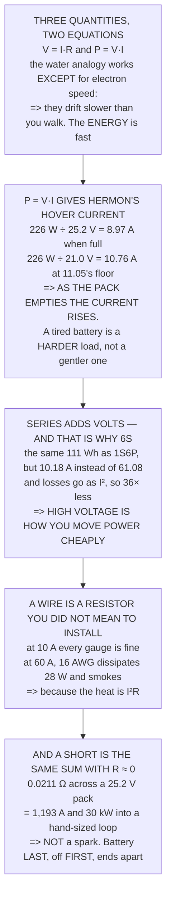

# FEL.01 Electricity for drone builders: voltage, current, resistance

<!-- glance:start -->
<!-- generated by tools/build.py from curriculum/syllabus.yaml — edit the syllabus, not this block -->

| | |
|---|---|
| **Track** | Optional foundation |
| **Difficulty** | Beginner |
| **Time** | 1 h |
| **Hardware** | none |
| **Software** | none |
| **Prerequisites** | none |
| **Skip if** | You can apply Ohm's law to a drone's power tree and predict a voltage drop before measuring it. |

<!-- glance:end -->

## What you will learn

- The three quantities, and the one place the water analogy **misleads** — electrons drift slower
  than you can walk
- That Hermon hovers on about **ten amps**, and that the current **rises as the pack empties**
- That the entire avionics package is **5 % of what the motors use**
- That series adds volts and **that is why the pack is 6S**: at 1S the same power would be 61 A and
  **36× the losses**
- That resistive loss goes as **current squared**, which is the whole reason for high-voltage buses
- That at 10 A every wire gauge is fine and at 60 A half of them smoke
- And that a shorted 6S pack is **1,193 A and 30 kW** into a loop the size of your hand

## Why it matters

Half of a drone is electrical, and the main path assumes you can convert between watts, volts and
amps without stopping to think. 02.06's motor choice, 03.04's power distribution, 11.05's battery
discipline and 15.01's companion budget are all the same two equations applied to different parts of
the aircraft.

There are only two equations, they are both exact, and they are both one line. What takes practice is
knowing which one to reach for and noticing when a number is telling you something alarming — like
the fact that a tired battery is a *harder* load on your wiring rather than a gentler one.

And the lesson ends on the number that turns an electrical mistake from an inconvenience into a fire.
Knowing it in advance is why every rule in 03.04 exists.

> [!WARNING]
> A charged lithium pack can deliver over a thousand amps into a short, which is enough to vaporise
> metal and set fire to a workbench before you can react. Never leave a pack connected to anything
> on the bench, never let the bare ends of a battery lead face each other, and connect the battery
> last and disconnect it first. Level 4 computes exactly why.

## Prerequisites

<!-- prereqs:start -->
## Prerequisites

None — you can start here.

### Optional prerequisite links

None.

Check your readiness: `python course.py why FEL.01`
<!-- prereqs:end -->

## Concept

Electricity has three quantities and everything else is arithmetic on them. **Voltage** is how hard
the electricity is being pushed, **current** is how much flows per second, and **resistance** is how
much the path fights the flow. Two equations connect them to everything a drone builder needs:
`V = I·R` and `P = V·I`.

The water analogy — pressure, flow rate, pipe width — is good and worth keeping, with one important
exception noted below. What it gets right is the *structure*: pressure drives flow, a narrow pipe
resists it, and a pump with a tank behind it is a battery.

The part that matters most in practice is that resistive losses go as the **square** of the current.
That one exponent explains why a drone uses a high-voltage pack, why thick wire matters near the
motors and not near the receiver, and why a short circuit is a catastrophe rather than a spark.

And there is a property of batteries that catches people out: as a pack discharges its voltage
falls, so for the same *power* the *current* must rise. The load on your wiring gets worse as the
flight goes on.

## Technical explanation

### Level 1 — three quantities, and the analogy that almost works

| name | unit | what it is |
|---|---|---|
| **voltage** | volt | how hard the electricity is being pushed |
| **current** | amp | how much is flowing, per second |
| **resistance** | ohm | how much the path fights the flow |

| electrical | water | good? |
|---|---|---|
| voltage | the pressure in the pipe | yes |
| current | litres per second through it | yes |
| resistance | how narrow the pipe is | yes |
| a battery | a pump with a tank behind it | yes |
| a short circuit | the pipe ends, wide open | yes |
| **electrons moving fast** | water moving fast | **no** |

**The last row is the one that misleads.** Electrons drift through copper at well under a millimetre
per second — slower than you can walk — and yet a light comes on instantly. The **energy** travels at
nearly the speed of light; the electrons barely move, like a pipe already full of water.

It matters because it kills the wrong mental model: a thicker wire does not help because "more
electrons fit", it helps because there is **less resistance**.

### Level 2 — Ohm's law, and Hermon's hover current

`V = I·R`, `I = V/R`, `R = V/I` — and `P = V·I` turns a power figure into a current:

| pack state | volts | for 226 W | vs nominal |
|---|---|---|---|
| full, 4.2 V per cell | 25.2 V | 8.97 A | 88 % |
| nominal, 3.7 V | 22.2 V | 10.18 A | 100 % |
| **11.05's floor, 3.5 V** | 21.0 V | **10.76 A** | **106 %** |

About ten amps to hover — and notice which way it moves. As the pack empties the **voltage** falls,
so for the same **power** the **current** must **rise**.

**That is backwards from intuition and it matters.** A tired battery is not a gentler load on the
wiring, it is a harder one, and every loss that depends on current gets worse at exactly the moment
the pack can least afford it. 11.05's three numbers exist because of this.

The same equation sizes the avionics:

| load | volts | amps | watts | of hover |
|---|---|---|---|---|
| flight controller | 5.0 | 0.250 | 1.25 | 0.55 % |
| GNSS receiver | 5.0 | 0.100 | 0.50 | 0.22 % |
| telemetry radio, transmitting | 5.0 | 0.300 | 1.50 | 0.66 % |
| the companion computer (15.01) | 5.0 | 1.600 | 8.00 | 3.54 % |
| a servo, holding (17.02) | 5.0 | 0.008 | 0.04 | 0.02 % |
| **total avionics** | | | **11.29** | **5.00 %** |

**The whole electronics package is 5 % of what the motors use** — which is why 15.01 priced the
companion by its **mass** rather than by its watts.

### Level 3 — series and parallel, and why the pack is 6S

| | series | parallel |
|---|---|---|
| voltage | **adds** | stays the same |
| current | stays the same | **adds** |
| capacity (Ah) | stays the same | **adds** |
| resistance | **adds** | falls |
| energy (Wh) | **adds** | **adds** |

| | volts | Ah | Wh |
|---|---|---|---|
| one cell | 3.7 V | 5.0 | 18.5 |
| **6 in series (6S)** | **22.2 V** | 5.0 | 111.0 |
| 6 in parallel (1S6P) | 3.7 V | 30.0 | 111.0 |

Both hold the same 111 Wh, so why does every drone use the series one? **Because of the current:**

| arrangement | volts | amps for 226 W | I² losses |
|---|---|---|---|
| 1S6P | 3.7 V | **61.08 A** | **36.0×** |
| 2S3P | 7.4 V | 30.54 A | 9.0× |
| 3S2P | 11.1 V | 20.36 A | 4.0× |
| **6S** | **22.2 V** | **10.18 A** | **1.0×** |

The same aircraft on a one-cell pack would draw sixty-one amps and every resistive loss would be
**thirty-six times worse**, because those losses go as current *squared*.

**High voltage is how you move power cheaply.** That is why the pack is 6S, why the grid is at
hundreds of kilovolts, and why 02.06's motor was chosen for a 6S bus.

### Level 4 — voltage drop, and what a short circuit actually is

A wire is a resistor you did not mean to install:

| gauge | Ω/m | R for 0.60 m | drop at 10.2 A | heat |
|---|---|---|---|---|
| 10 AWG | 0.00328 | 0.00197 | 0.020 V | 0.20 W |
| 12 AWG | 0.00521 | 0.00313 | 0.032 V | 0.32 W |
| 16 AWG | 0.01317 | 0.00790 | 0.080 V | 0.82 W |
| 20 AWG | 0.03331 | 0.01999 | 0.203 V | 2.07 W |

At ten amps every gauge is fine. Now a stalled motor at 60 A:

| gauge | drop at 60 A | heat | verdict |
|---|---|---|---|
| 10 AWG | 0.118 V | 7.1 W | warm |
| 12 AWG | 0.188 V | 11.3 W | warm |
| 14 AWG | 0.298 V | 17.9 W | warm |
| **16 AWG** | 0.474 V | 28.4 W | **smoke** |
| **20 AWG** | 1.199 V | 71.9 W | **smoke** |

And now the short circuit. Connect the pack's terminals with nothing between them and the only
resistance left is the pack's own and the wire's:

| | |
|---|---|
| the pack's internal resistance | 0.0180 Ω |
| 12 AWG, 0.60 m out and back | 0.0031 Ω |
| total | 0.0211 Ω |
| the pack, fully charged | 25.2 V |
| **short-circuit current** | **1,193 A** |
| **power dumped into that loop** | **30,059 W** |

**Eleven hundred amps and thirty kilowatts, into a loop the size of your hand.** That is not a spark.
It is a 30 kW heater with no off switch until something melts.

(That figure is the first instant. A real pack sags, heats and eventually vents, so the sustained
current is lower — but it is still hundreds of amps, and by then the damage is done. The internal
resistance here is an **[E]** estimate.)

The number is large because the resistance is tiny, and it is the whole reason for every rule in
03.04: the connector goes on **last**, the pack is never left connected on the bench, and the bare
ends of a battery lead never point at each other.

> [!TIP]
> **Ask your teacher:** "What does your aircraft draw in the hover?" If the answer is a guess rather
> than a measurement, every endurance figure downstream of it is a guess too — and FEL.05 shows it
> takes one shunt and five minutes to find out.

## Diagram



## Code

Electricity from nothing: the three quantities and where the water analogy fails, Ohm's law turned
into Hermon's hover current at three pack voltages with the avionics budget beside it, series against
parallel and the I² argument for a 6S bus, wire resistance and heating at hover and at stall, and the
short-circuit current a charged pack can actually deliver.

```python
"""FEL.01 -- voltage, current, resistance, from nothing.

Pure stdlib. A foundation lesson. It ends on Hermon's hover current and
on the one number that decides whether a wiring mistake is a nuisance or
a fire.
"""

import math

BAR = "=" * 70

# ---- the pack -----------------------------------------------------------
CELLS = 6
V_CELL_NOM = 3.7
V_CELL_FULL = 4.2
V_CELL_FLOOR = 3.5        # 11.05
CAPACITY_AH = 5.0
R_INTERNAL_MOHM = 3.0     # [E] per cell, a healthy 5 Ah pack

# ---- Hermon -------------------------------------------------------------
P_HOVER_W = 226.0

# ---- wire ---------------------------------------------------------------
# resistance per metre at 20 C, copper
AWG = {
    10: 3.277e-3, 12: 5.211e-3, 14: 8.286e-3,
    16: 13.17e-3, 18: 20.95e-3, 20: 33.31e-3,
}


def head(n, title):
    print()
    print(BAR)
    print("%d. %s" % (n, title))
    print(BAR)


# ========================================================================
head(1, "THREE QUANTITIES, AND THE ANALOGY THAT ALMOST WORKS")

print("  Electricity has three quantities and everything else is")
print("  arithmetic on them:")
print()
print("  %-14s %-10s %-44s" % ("name", "unit", "what it is"))
for name, unit, what in (
        ("VOLTAGE", "volt", "how hard the electricity is being pushed"),
        ("CURRENT", "amp", "how much is flowing, per second"),
        ("RESISTANCE", "ohm", "how much the path fights the flow")):
    print("  %-14s %-10s %-44s" % (name, unit, what))

print()
print("  THE WATER ANALOGY IS GOOD AND IT IS WORTH KNOWING WHERE IT")
print("  BREAKS:")
print()
for elec, water, ok in (
        ("voltage", "the pressure in the pipe", True),
        ("current", "litres per second through it", True),
        ("resistance", "how narrow the pipe is", True),
        ("a battery", "a pump with a tank behind it", True),
        ("a short circuit", "the pipe ends, wide open", True),
        ("electrons moving fast", "water moving fast", False)):
    print("    %-22s %-34s %s"
          % (elec, water, "yes" if ok else "NO -- see below"))

print()
print("  THE LAST ROW IS THE ONE THAT MISLEADS. Electrons drift")
print("  through copper at well under a millimetre per second -- slower")
print("  than you can walk -- and yet a light comes on instantly. The")
print("  ENERGY travels at nearly the speed of light; the electrons")
print("  barely move at all, like a pipe already full of water.")
print()
print("  IT MATTERS BECAUSE IT KILLS THE WRONG MENTAL MODEL: a thicker")
print("  wire does not help because 'more electrons fit', it helps")
print("  because there is LESS RESISTANCE. Section 4 puts a number on")
print("  that.")

# ========================================================================
head(2, "OHM'S LAW, AND HERMON'S HOVER CURRENT")

print("  One equation, three arrangements, and it is exact:")
print()
print("      V = I R        I = V / R        R = V / I")
print()
print("  Which turns a power figure into a current, via P = V I:")
print()
print("  %-34s %12s %12s %12s"
      % ("pack state", "volts", "for %.0f W" % P_HOVER_W, "vs nominal"))
i_nom = P_HOVER_W / (CELLS * V_CELL_NOM)
for label, vc in (("full, %.1f V per cell" % V_CELL_FULL, V_CELL_FULL),
                  ("nominal, %.1f V" % V_CELL_NOM, V_CELL_NOM),
                  ("11.05's floor, %.1f V" % V_CELL_FLOOR, V_CELL_FLOOR)):
    v = CELLS * vc
    i = P_HOVER_W / v
    print("  %-34s %10.1f V %10.2f A %11.0f %%"
          % (label, v, i, i / i_nom * 100))

print()
print("  ABOUT TEN AMPS TO HOVER, and notice which way it moves: as")
print("  the pack empties the VOLTAGE falls, so for the same POWER the")
print("  CURRENT must RISE.")
print()
print("  THAT IS A GENUINELY IMPORTANT PROPERTY AND IT IS BACKWARDS")
print("  FROM INTUITION. A tired battery is not a gentler load on the")
print("  wiring -- it is a HARDER one, and every loss that depends on")
print("  current gets worse at exactly the moment the pack can least")
print("  afford it. 11.05's three numbers exist because of this.")
print()
print("  AND THE SAME EQUATION SIZES THE AVIONICS. A flight controller")
print("  wants 5 V and the pack gives %.1f, so something must convert:"
      % (CELLS * V_CELL_NOM))
print()
print("  %-30s %10s %10s %12s %12s"
      % ("load", "volts", "amps", "watts", "of hover"))
LOADS = [
    ("flight controller", 5.0, 0.25),
    ("GNSS receiver", 5.0, 0.10),
    ("telemetry radio, transmitting", 5.0, 0.30),
    ("the companion computer (15.01)", 5.0, 1.60),
    ("a servo, holding (17.02)", 5.0, 0.008),
]
tot_w = 0.0
for what, v, i in LOADS:
    w = v * i
    tot_w += w
    print("  %-30s %9.1f %9.3f %11.2f %11.2f %%"
          % (what, v, i, w, w / P_HOVER_W * 100))
print("  %-30s %9s %9s %11.2f %11.2f %%"
      % ("TOTAL AVIONICS", "", "", tot_w, tot_w / P_HOVER_W * 100))
print()
print("  THE WHOLE ELECTRONICS PACKAGE IS %.0f PER CENT OF WHAT THE"
      % (tot_w / P_HOVER_W * 100))
print("  MOTORS USE. Which is why 15.01 priced the companion by its")
print("  MASS rather than by its watts.")

# ========================================================================
head(3, "SERIES AND PARALLEL, AND WHY THE PACK IS 6S")

print("  Two ways to connect two things, and they do opposite things:")
print()
print("  %-14s %-26s %-26s"
      % ("", "SERIES", "PARALLEL"))
for what, ser, par in (
        ("voltage", "ADDS", "stays the same"),
        ("current", "stays the same", "ADDS"),
        ("capacity (Ah)", "stays the same", "ADDS"),
        ("resistance", "ADDS", "falls"),
        ("energy (Wh)", "ADDS", "ADDS")):
    print("  %-14s %-26s %-26s" % (what, ser, par))

print()
print("  SO A PACK LABELLED '6S' IS SIX CELLS IN SERIES:")
print()
print("  %-30s %12s %12s %12s"
      % ("", "volts", "Ah", "Wh"))
print("  %-30s %10.1f V %10.1f %10.1f"
      % ("one cell", V_CELL_NOM, CAPACITY_AH, V_CELL_NOM * CAPACITY_AH))
print("  %-30s %10.1f V %10.1f %10.1f"
      % ("%d in SERIES (6S)" % CELLS, CELLS * V_CELL_NOM, CAPACITY_AH,
         CELLS * V_CELL_NOM * CAPACITY_AH))
print("  %-30s %10.1f V %10.1f %10.1f"
      % ("%d in PARALLEL (1S6P)" % CELLS, V_CELL_NOM, CELLS * CAPACITY_AH,
         CELLS * V_CELL_NOM * CAPACITY_AH))
print()
print("  BOTH ARRANGEMENTS HOLD THE SAME ENERGY -- %.0f Wh -- so why"
      % (CELLS * V_CELL_NOM * CAPACITY_AH))
print("  does every drone use the series one?")
print()
print("  BECAUSE OF THE CURRENT. Same power, different voltage:")
print()
print("  %-24s %10s %12s %14s"
      % ("arrangement", "volts", "amps for %.0f W" % P_HOVER_W, "I^2 losses"))
for label, v in (("1S6P", V_CELL_NOM), ("2S3P", 2 * V_CELL_NOM),
                 ("3S2P", 3 * V_CELL_NOM), ("6S", CELLS * V_CELL_NOM)):
    i = P_HOVER_W / v
    print("  %-24s %8.1f V %10.2f A %13.1f x"
          % (label, v, i, (i / i_nom) ** 2))

print()
print("  THE SAME AIRCRAFT ON A ONE-CELL PACK WOULD DRAW %.0f AMPS AND"
      % (P_HOVER_W / V_CELL_NOM))
print("  EVERY RESISTIVE LOSS WOULD BE %.0f TIMES WORSE, because those"
      % ((P_HOVER_W / V_CELL_NOM / i_nom) ** 2))
print("  losses go as CURRENT SQUARED.")
print()
print("  HIGH VOLTAGE IS HOW YOU MOVE POWER CHEAPLY. That is why the")
print("  pack is 6S, why the grid is at hundreds of kilovolts, and why")
print("  02.06's motor was chosen for a 6S bus rather than a 3S one.")

# ========================================================================
head(4, "VOLTAGE DROP, AND WHAT A SHORT CIRCUIT ACTUALLY IS")

length_m = 0.30
print("  A wire is a resistor you did not mean to install. Copper's")
print("  resistance depends on thickness, and the standard gauges")
print("  differ more than they look:")
print()
print("  %-14s %14s %14s %14s %14s"
      % ("gauge", "ohm/m", "R for %.2f m" % (2 * length_m),
         "drop at %.1f A" % i_nom, "heat (W)"))
for g in sorted(AWG):
    r = AWG[g] * 2 * length_m     # out and back
    print("  %-14s %12.5f %13.5f %12.3f V %12.2f"
          % ("%d AWG" % g, AWG[g], r, i_nom * r, i_nom ** 2 * r))

print()
print("  AT TEN AMPS EVERY GAUGE IS FINE. Now look at a stall, when a")
print("  motor is jammed and draws maybe %.0f A:" % 60)
print()
i_stall = 60.0
print("  %-14s %16s %16s %14s"
      % ("gauge", "drop at %.0f A" % i_stall, "heat (W)", "verdict"))
for g in sorted(AWG):
    r = AWG[g] * 2 * length_m
    heat = i_stall ** 2 * r
    v = "fine" if heat < 5 else ("warm" if heat < 20 else "SMOKE")
    print("  %-14s %14.3f V %14.1f %14s" % ("%d AWG" % g, i_stall * r,
                                            heat, v))

print()
print("  AND NOW THE SHORT CIRCUIT, which is the case that matters.")
print("  Connect the pack's two terminals with nothing in between and")
print("  the ONLY resistance left is the pack's own and the wire's:")
print()
r_pack = CELLS * R_INTERNAL_MOHM / 1000.0
r_wire = AWG[12] * 2 * length_m
r_total = r_pack + r_wire
v_pack = CELLS * V_CELL_FULL
i_short = v_pack / r_total
print("  %-38s %14.4f ohm" % ("the pack's internal resistance", r_pack))
print("  %-38s %14.4f ohm" % ("%d AWG, %.2f m out and back" % (12, 2 * length_m),
                              r_wire))
print("  %-38s %14.4f ohm" % ("TOTAL", r_total))
print("  %-38s %14.1f V" % ("the pack, fully charged", v_pack))
print("  %-38s %14.0f A" % ("  SHORT-CIRCUIT CURRENT", i_short))
print("  %-38s %14.0f W" % ("  power dumped into that loop",
                            i_short ** 2 * r_total))
print()
print("  %.0f AMPS AND %.0f KILOWATTS, into a loop the size of your"
      % (i_short, i_short ** 2 * r_total / 1000.0))
print("  hand. That is not 'a spark'. It is a %.0f kW heater with no"
      % (i_short ** 2 * r_total / 1000.0))
print("  off switch until something melts.")
print()
print("  (That %.0f A is the FIRST instant. A real pack sags, heats and"
      % i_short)
print("  eventually vents, so the sustained current is lower -- but it")
print("  is still hundreds of amps, and by then the damage is done.")
print("  [E] -- the internal resistance here is an estimate.)")
print()
print("  THE NUMBER IS LARGE BECAUSE THE RESISTANCE IS TINY, and it is")
print("  the whole reason for every rule in 03.04: the connector goes")
print("  on LAST, the pack is never left connected on the bench, and")
print("  the bare ends of a battery lead never point at each other.")
print()
print("  THE FOUR THINGS TO CARRY FORWARD:")
print("   1. V = I R, and P = V I. Everything electrical in this course")
print("      is one of those two.")
print("   2. AS A PACK EMPTIES THE CURRENT RISES for the same power:")
print("      %.2f A at full charge, %.2f A at 11.05's floor."
      % (P_HOVER_W / (CELLS * V_CELL_FULL),
         P_HOVER_W / (CELLS * V_CELL_FLOOR)))
print("   3. Series ADDS VOLTS and that is why the pack is 6S: at 1S")
print("      the same power would be %.0f A and %.0f times the losses."
      % (P_HOVER_W / V_CELL_NOM, (P_HOVER_W / V_CELL_NOM / i_nom) ** 2))
print("   4. Resistive loss goes as CURRENT SQUARED, which is why a")
print("      short is %.0f A and %.0f kW rather than a spark."
      % (i_short, i_short ** 2 * r_total / 1000.0))
```

Output:

```text

======================================================================
1. THREE QUANTITIES, AND THE ANALOGY THAT ALMOST WORKS
======================================================================
  Electricity has three quantities and everything else is
  arithmetic on them:

  name           unit       what it is                                  
  VOLTAGE        volt       how hard the electricity is being pushed    
  CURRENT        amp        how much is flowing, per second             
  RESISTANCE     ohm        how much the path fights the flow           

  THE WATER ANALOGY IS GOOD AND IT IS WORTH KNOWING WHERE IT
  BREAKS:

    voltage                the pressure in the pipe           yes
    current                litres per second through it       yes
    resistance             how narrow the pipe is             yes
    a battery              a pump with a tank behind it       yes
    a short circuit        the pipe ends, wide open           yes
    electrons moving fast  water moving fast                  NO -- see below

  THE LAST ROW IS THE ONE THAT MISLEADS. Electrons drift
  through copper at well under a millimetre per second -- slower
  than you can walk -- and yet a light comes on instantly. The
  ENERGY travels at nearly the speed of light; the electrons
  barely move at all, like a pipe already full of water.

  IT MATTERS BECAUSE IT KILLS THE WRONG MENTAL MODEL: a thicker
  wire does not help because 'more electrons fit', it helps
  because there is LESS RESISTANCE. Section 4 puts a number on
  that.

======================================================================
2. OHM'S LAW, AND HERMON'S HOVER CURRENT
======================================================================
  One equation, three arrangements, and it is exact:

      V = I R        I = V / R        R = V / I

  Which turns a power figure into a current, via P = V I:

  pack state                                volts    for 226 W   vs nominal
  full, 4.2 V per cell                     25.2 V       8.97 A          88 %
  nominal, 3.7 V                           22.2 V      10.18 A         100 %
  11.05's floor, 3.5 V                     21.0 V      10.76 A         106 %

  ABOUT TEN AMPS TO HOVER, and notice which way it moves: as
  the pack empties the VOLTAGE falls, so for the same POWER the
  CURRENT must RISE.

  THAT IS A GENUINELY IMPORTANT PROPERTY AND IT IS BACKWARDS
  FROM INTUITION. A tired battery is not a gentler load on the
  wiring -- it is a HARDER one, and every loss that depends on
  current gets worse at exactly the moment the pack can least
  afford it. 11.05's three numbers exist because of this.

  AND THE SAME EQUATION SIZES THE AVIONICS. A flight controller
  wants 5 V and the pack gives 22.2, so something must convert:

  load                                volts       amps        watts     of hover
  flight controller                    5.0     0.250        1.25        0.55 %
  GNSS receiver                        5.0     0.100        0.50        0.22 %
  telemetry radio, transmitting        5.0     0.300        1.50        0.66 %
  the companion computer (15.01)       5.0     1.600        8.00        3.54 %
  a servo, holding (17.02)             5.0     0.008        0.04        0.02 %
  TOTAL AVIONICS                                           11.29        5.00 %

  THE WHOLE ELECTRONICS PACKAGE IS 5 PER CENT OF WHAT THE
  MOTORS USE. Which is why 15.01 priced the companion by its
  MASS rather than by its watts.

======================================================================
3. SERIES AND PARALLEL, AND WHY THE PACK IS 6S
======================================================================
  Two ways to connect two things, and they do opposite things:

                 SERIES                     PARALLEL                  
  voltage        ADDS                       stays the same            
  current        stays the same             ADDS                      
  capacity (Ah)  stays the same             ADDS                      
  resistance     ADDS                       falls                     
  energy (Wh)    ADDS                       ADDS                      

  SO A PACK LABELLED '6S' IS SIX CELLS IN SERIES:

                                        volts           Ah           Wh
  one cell                              3.7 V        5.0       18.5
  6 in SERIES (6S)                     22.2 V        5.0      111.0
  6 in PARALLEL (1S6P)                  3.7 V       30.0      111.0

  BOTH ARRANGEMENTS HOLD THE SAME ENERGY -- 111 Wh -- so why
  does every drone use the series one?

  BECAUSE OF THE CURRENT. Same power, different voltage:

  arrangement                   volts amps for 226 W     I^2 losses
  1S6P                          3.7 V      61.08 A          36.0 x
  2S3P                          7.4 V      30.54 A           9.0 x
  3S2P                         11.1 V      20.36 A           4.0 x
  6S                           22.2 V      10.18 A           1.0 x

  THE SAME AIRCRAFT ON A ONE-CELL PACK WOULD DRAW 61 AMPS AND
  EVERY RESISTIVE LOSS WOULD BE 36 TIMES WORSE, because those
  losses go as CURRENT SQUARED.

  HIGH VOLTAGE IS HOW YOU MOVE POWER CHEAPLY. That is why the
  pack is 6S, why the grid is at hundreds of kilovolts, and why
  02.06's motor was chosen for a 6S bus rather than a 3S one.

======================================================================
4. VOLTAGE DROP, AND WHAT A SHORT CIRCUIT ACTUALLY IS
======================================================================
  A wire is a resistor you did not mean to install. Copper's
  resistance depends on thickness, and the standard gauges
  differ more than they look:

  gauge                   ohm/m   R for 0.60 m drop at 10.2 A       heat (W)
  10 AWG              0.00328       0.00197        0.020 V         0.20
  12 AWG              0.00521       0.00313        0.032 V         0.32
  14 AWG              0.00829       0.00497        0.051 V         0.52
  16 AWG              0.01317       0.00790        0.080 V         0.82
  18 AWG              0.02095       0.01257        0.128 V         1.30
  20 AWG              0.03331       0.01999        0.203 V         2.07

  AT TEN AMPS EVERY GAUGE IS FINE. Now look at a stall, when a
  motor is jammed and draws maybe 60 A:

  gauge              drop at 60 A         heat (W)        verdict
  10 AWG                  0.118 V            7.1           warm
  12 AWG                  0.188 V           11.3           warm
  14 AWG                  0.298 V           17.9           warm
  16 AWG                  0.474 V           28.4          SMOKE
  18 AWG                  0.754 V           45.3          SMOKE
  20 AWG                  1.199 V           71.9          SMOKE

  AND NOW THE SHORT CIRCUIT, which is the case that matters.
  Connect the pack's two terminals with nothing in between and
  the ONLY resistance left is the pack's own and the wire's:

  the pack's internal resistance                 0.0180 ohm
  12 AWG, 0.60 m out and back                    0.0031 ohm
  TOTAL                                          0.0211 ohm
  the pack, fully charged                          25.2 V
    SHORT-CIRCUIT CURRENT                          1193 A
    power dumped into that loop                   30059 W

  1193 AMPS AND 30 KILOWATTS, into a loop the size of your
  hand. That is not 'a spark'. It is a 30 kW heater with no
  off switch until something melts.

  (That 1193 A is the FIRST instant. A real pack sags, heats and
  eventually vents, so the sustained current is lower -- but it
  is still hundreds of amps, and by then the damage is done.
  [E] -- the internal resistance here is an estimate.)

  THE NUMBER IS LARGE BECAUSE THE RESISTANCE IS TINY, and it is
  the whole reason for every rule in 03.04: the connector goes
  on LAST, the pack is never left connected on the bench, and
  the bare ends of a battery lead never point at each other.

  THE FOUR THINGS TO CARRY FORWARD:
   1. V = I R, and P = V I. Everything electrical in this course
      is one of those two.
   2. AS A PACK EMPTIES THE CURRENT RISES for the same power:
      8.97 A at full charge, 10.76 A at 11.05's floor.
   3. Series ADDS VOLTS and that is why the pack is 6S: at 1S
      the same power would be 61 A and 36 times the losses.
   4. Resistive loss goes as CURRENT SQUARED, which is why a
      short is 1193 A and 30 kW rather than a spark.
```

## Exercise

### Exercise FEL.01-E1 — Your own hover current `[analysis]`

From your measured hover power and your pack's voltage, compute the current at full charge, at
nominal and at your low-voltage floor. Note which end is worse for the wiring.

### Exercise FEL.01-E2 — Price the avionics `[analysis]`

List everything on your aircraft that is not a motor, find its current draw, and total the watts.
Express it as a percentage of the hover power.

### Exercise FEL.01-E3 — The voltage argument `[analysis]`

Compute the current your aircraft would draw at 3S, 4S and 6S for the same power, and the relative
I²R losses. Then check what voltage your motors are actually rated for.

### Exercise FEL.01-E4 — Size a wire honestly `[analysis]`

For your own wire runs and your own stall current, compute the voltage drop and the heat in each
gauge you have in the drawer. Find the smallest one that stays under 5 W.

## Expected result

**FEL.01-E1**: expect the current at the low-voltage floor to be 15–25 % higher than at full charge.
That is the number that should size the wiring, not the comfortable one.

**FEL.01-E2**: expect 3–8 % for a typical build, rising to 10 % with a companion computer. It is
always smaller than people expect and always worth knowing.

**FEL.01-E3**: expect a factor of four between 3S and 6S in losses, and expect your motors to be rated
for one specific voltage range — KV and cell count are not independent choices.

**FEL.01-E4**: expect 14 AWG to be adequate for most sub-2 kg builds and 16 AWG to be marginal at
stall. The stall case is the one that decides it, not the hover.

## Troubleshooting

**The pack sags a lot under throttle.** Internal resistance — FEL.03 covers it. A sagging pack is
either tired, cold, or being asked for more current than its rating.

**A connector gets hot.** It has resistance and it is carrying current; `I²R` is heating it. Either
the contact is poor or the connector is under-rated for the current.

**The voltage at the flight controller is lower than at the battery.** Correct — that is the drop
across the wiring. Level 4 computes it; if it is more than a few tenths of a volt, the wire is too
thin or too long.

**Two packs in parallel behaved badly.** They must be at the same voltage before connecting, or the
higher one dumps into the lower one at whatever current their combined internal resistance allows.

**The multimeter reads the wrong current.** Measuring current means breaking the circuit and passing
it through the meter, and most meters are limited to 10 A. FEL.05 covers doing it properly.

**Everything worked and then a wire melted.** Check the stall case rather than the hover case. The
hover current is not what sizes a wire.

## Common mistakes

- **Thinking electrons move fast.** They drift; the energy is what travels.
- **Sizing wire for the hover current.** Size for the stall.
- **Assuming a tired pack is an easier load.** The current rises.
- **Quoting Ah as energy.** Multiply by the voltage.
- **Adding resistances in parallel.** They fall; only series adds.
- **Ignoring the I² in the losses.** It is the whole argument for 6S.
- **Leaving a pack connected on the bench.** 1,193 A is waiting.
- **Letting battery lead ends face each other.** Same number.

## Knowledge check

<details>
<summary>Where does the water analogy break, and why does it matter?</summary>

At the speed of the electrons. They drift through copper at well under a millimetre per second, far
slower than water in a pipe, and yet the effect is instant — because the **energy** travels at nearly
the speed of light through an already-full conductor. It matters because it corrects the mental
model: thicker wire helps by having **less resistance**, not by fitting more electrons.
</details>

<details>
<summary>How much current does Hermon draw in the hover, and which way does it move?</summary>

About ten amps: **8.97 A** at a full 25.2 V and **10.76 A** at 11.05's 21.0 V floor. It **rises** as
the pack empties, because the power is fixed and `I = P/V`. A tired battery is a harder load on the
wiring than a fresh one, which is the opposite of what most people assume.
</details>

<details>
<summary>What fraction of the power is the avionics?</summary>

**About 5 %** — 11.3 W of 226, of which the companion computer is 8 W. Which is why 15.01 priced the
companion by its **180 g of mass** rather than by its watts: the mass cost 4.5 times what the power
did.
</details>

<details>
<summary>Why is the pack 6S rather than 1S6P, when both hold 111 Wh?</summary>

Because of `I²R`. At 3.7 V the same 226 W needs **61 A**; at 22.2 V it needs **10.2 A** — and the
resistive losses fall by the square of that ratio, **36×**. High voltage is how power is moved
cheaply, in a drone and in a national grid for the same reason.
</details>

<details>
<summary>What current should size your wire?</summary>

The **stall** current, not the hover current. At 10 A every gauge from 10 to 20 AWG is fine; at a
60 A stall, 16 AWG dissipates 28 W and 20 AWG dissipates 72 W — both smoke. The hover case never
decides a wire gauge.
</details>

<details>
<summary>What actually happens in a short circuit?</summary>

The only resistance left is the pack's internal 0.018 Ω plus a few milliohms of wire, so a fully
charged 25.2 V pack drives **1,193 A** and dumps **30 kW** into a hand-sized loop. It is not a spark;
it is a 30 kW heater with no off switch until something melts — which is why the battery connector
goes on last and comes off first.
</details>

## Practical challenge

Turn the two equations into numbers about your own aircraft.

1. Measure your hover power and compute the current at three pack voltages (E1).
2. Total your avionics draw and express it as a fraction of hover (E2).
3. Compute the current and relative losses at 3S, 4S and 6S (E3).
4. Measure your actual wire lengths, out and back.
5. Compute the drop and heat at hover and at stall for each gauge you own (E4).
6. Choose the gauge on the stall case and write down why.
7. Compute your own pack's short-circuit current from its internal resistance.
8. Write the safety rule that follows, in your own words, on the bench.

Step 7 is worth doing even though nobody wants to think about it. A number is much more persuasive
than a warning, and it is the one that changes how you handle a charged pack.

## You can skip this if

You can apply Ohm's law to a drone's power tree and predict a voltage drop before measuring it.
"Predict" means to within about 20 %.

## Go deeper

- All About Circuits' free textbook, whose DC volume covers every idea in this lesson with worked
  examples: <https://www.allaboutcircuits.com/textbook/direct-current/>
- MIT OpenCourseWare 6.002 Circuits and Electronics, for the same material with more rigour:
  <https://ocw.mit.edu/courses/6-002-circuits-and-electronics-spring-2007/>

## Progress checkpoint

You can now convert between watts, volts and amps in either direction, predict how a pack's current
changes over a flight, explain why a drone uses a high-voltage bus, size a wire on the case that
actually decides it, and state — with a number — why a charged pack is handled the way it is.

Next, FEL.02 takes the same two equations and turns them into flight minutes: amp-hours, watt-hours,
and doing the conversion in your head to ten per cent.
