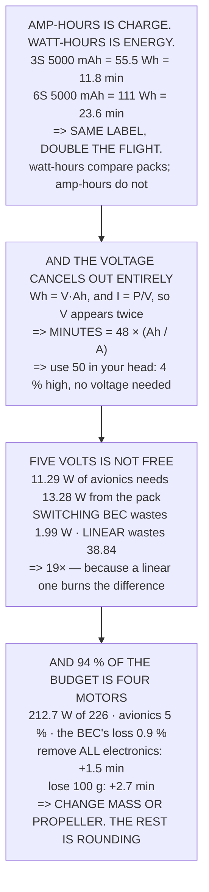

# FEL.02 DC power maths for a flying machine

<!-- glance:start -->
<!-- generated by tools/build.py from curriculum/syllabus.yaml — edit the syllabus, not this block -->

| | |
|---|---|
| **Track** | Optional foundation |
| **Difficulty** | Beginner |
| **Time** | 1 h |
| **Hardware** | none |
| **Software** | python |
| **Prerequisites** | [FEL.01 Electricity for drone builders: voltage, current, resistance](FEL.01-electricity-refresher.md) |
| **Skip if** | You can turn a pack's mAh and a hover current into flight minutes in your head, to 10 %. |

<!-- glance:end -->

## What you will learn

- That **watt-hours compare packs** and amp-hours only compare packs at the same voltage — a 3S and
  a 6S 5,000 mAh differ by a factor of two in flight time
- The head-maths rule: **minutes = 48 × (amp-hours / amps)**, in which **the voltage cancels
  entirely**
- That using **50** instead of 48 is 4 % high, well inside the ten per cent the job needs
- That a switching BEC wastes **2.0 W** converting 22.2 V to 5, and a linear one wastes **38.8** —
  nineteen times more
- That **94 % of the power budget is four motors holding the aircraft up**
- That removing *every* piece of electronics buys **1.5 minutes** and losing 100 g buys **2.7**
- And therefore that to change endurance you change **mass or propeller**, and everything else is
  rounding

## Why it matters

There is one calculation an operator does more often than any other, usually standing in a field
with a pack in one hand: *how long will this fly?* Doing it properly needs a voltage, a capacity, a
usable fraction and a power figure. Doing it the short way needs two numbers and a multiplication,
and it is right to a few per cent.

That shortcut exists because of a cancellation that is worth seeing rather than memorising — the
voltage appears twice and disappears — and once you have seen it, the rule is impossible to
misremember.

The lesson's second half settles an argument that comes up on every build. People spend a great deal
of effort on the electrical parts of a drone, and the power budget says that 94 % of the energy goes
somewhere else entirely. Knowing that in advance is how you decide where to spend a weekend.

## Prerequisites

<!-- prereqs:start -->
## Prerequisites

You need these first:

- [FEL.01 Electricity for drone builders: voltage, current, resistance](FEL.01-electricity-refresher.md)

### Optional prerequisite links

None.

Check your readiness: `python course.py why FEL.02`
<!-- prereqs:end -->

## Concept

A battery label and a power budget speak different languages. The label counts **charge** in
amp-hours — how many electrons, regardless of how hard they are being pushed — and the budget counts
**power** in watts. The bridge between them is the voltage, and forgetting it is the commonest
arithmetic error in the hobby.

Multiply volts by amp-hours and you get **watt-hours**, which is energy, which is the only quantity
that compares one pack with another. Divide watt-hours by watts and you get hours.

The interesting part is that when you chain those two operations together the voltage appears in the
numerator and again inside the current, and it cancels — which leaves a rule with no voltage in it
at all.

And once the arithmetic is comfortable, the useful question is where the watts actually go. On a
multirotor the answer is overwhelmingly "into holding the aircraft up", which decides where effort
is worth spending.

## Technical explanation

### Level 1 — two ways to measure a battery, and only one is energy

| quantity | unit | what it counts |
|---|---|---|
| charge | amp-hour | how many electrons, regardless of push |
| **energy** | **watt-hour** | electrons × push = actual capability |
| power | watt | energy per second |

| pack | volts | Ah | Wh | minutes at 226 W |
|---|---|---|---|---|
| 3S 5000 mAh | 11.1 V | 5.0 | 55.5 | **11.8** |
| 6S 5000 mAh | 22.2 V | 5.0 | 111.0 | **23.6** |
| 6S 2500 mAh | 22.2 V | 2.5 | 55.5 | 11.8 |
| 12S 2500 mAh | 44.4 V | 2.5 | 111.0 | **23.6** |

**The first two rows have the same amp-hours and different flight times.** The second and fourth have
the same *watt-hours* and the same flight time, despite one having half the amp-hours.

So: **watt-hours compare packs. Amp-hours only compare packs at the same voltage** — which, to be
fair, is the usual case, and is why the habit survives.

### Level 2 — the head-maths rule

The long way is three steps:

```
Wh = V × Ah        usable = Wh × 80 %
minutes = usable / P × 60
```

But the voltage appears in the numerator and again inside the current, so it cancels:

```
MINUTES = 48 × (amp-hours / amps)
```

| | Ah / A | the rule | the long way |
|---|---|---|---|
| Hermon in hover | 0.491 | **23.6 min** | 23.6 min |
| Hermon with 17.01's pod | 0.387 | 18.6 min | 18.6 min |
| a 2200 mAh pack, 15 A | 0.147 | 7.0 min | 7.0 min |
| a 10 Ah pack, 20 A | 0.500 | 24.0 min | 24.0 min |
| a 1300 mAh racer, 40 A | 0.033 | 1.6 min | 1.6 min |

They are the same number, because the voltage cancels — which means **the rule needs no voltage at
all**: take the amp-hours, divide by the amps, multiply by 48.

And 48 is close enough to 50 to do in your head: `5.0 / 10.2 = 0.491`, times 50 = 25 minutes, and the
real answer is 23.6. **The fifty-version is 4 % high**, well inside the ten per cent the job needs —
and it is the difference between a decision made in the field and one made later.

### Level 3 — conversion losses: five volts is not free

FEL.01 found 11.29 W of avionics at 5 V, and the pack is at 22.2:

| | |
|---|---|
| avionics need, at 5 V | 11.29 W |
| BEC efficiency **[E]** | 85 % |
| so the pack must supply | 13.28 W |
| **lost as heat in the BEC** | **1.99 W** |
| which from 22.2 V is | 0.598 A |

**Two watts of heat in a device the size of a postage stamp** is the reason BECs have heatsinks and
the reason they are the component that most often fails quietly.

And there are two kinds of converter:

| type | efficiency | wasted | what it does |
|---|---|---|---|
| **linear** | 23 % | **38.84 W** | burns the difference |
| **switching** | 85 % | **1.99 W** | chops and smooths |

A linear regulator dropping 22.2 V to 5 would waste **38.8 W — nineteen times the switching one** —
because it literally turns the voltage difference into heat. At 39 W it would need a heatsink bigger
than the flight controller.

Which is why every drone uses a switching BEC, and why the linear one on your bench is fine for a
sensor and hopeless for a companion computer.

### Level 4 — the power budget, and what dominates it

| | watts | of total |
|---|---|---|
| **four motors, hovering** | **212.72** | **94.12 %** |
| the BEC's output (FEL.01's avionics) | 11.29 | 5.00 % |
| the BEC's own loss | 1.99 | 0.88 % |
| total | 226.00 | |

**Ninety-four per cent of the budget is four motors holding the aircraft up**, and that is the shape
of every multirotor power budget ever drawn. Which leads to the rule that saves the most time: **to
change the endurance, change the mass or the propeller.**

| if you | saves | adds |
|---|---|---|
| remove the companion (15.01) | 9.4 W | 1.02 min |
| remove **all** avionics | 13.3 W | 1.47 min |
| **lose 100 g of mass** | **23.0 W** | **2.67 min** |
| a 5 per cent better propeller | 10.8 W | 1.18 min |

**Removing every piece of electronics on the aircraft buys 1.5 minutes.** Losing a hundred grams
buys 2.7.

That is the whole argument for where to spend effort — and it is why 15.01 could add a companion
computer without anybody panicking about the watts: **it was the 180 grams that cost the endurance,
not the 8 W.**

> [!TIP]
> **Ask your teacher:** "How long will this fly?" — and then watch whether they reach for a
> calculator. Forty-eight times amp-hours over amps is a ten-second answer, and the ten-second answer
> is the one that gets used.

## Diagram



## Code

The battery arithmetic: charge against energy and why one compares packs and the other does not, the
voltage cancellation that produces the head-maths rule and its accuracy, a BEC's conversion loss
against a linear regulator's, and the power budget that puts 94 % of the watts into four motors.

```python
"""FEL.02 -- turning a battery label into flight minutes, in your head.

Pure stdlib. A foundation lesson, and its point is a mental shortcut
that is right to about ten per cent.
"""

import math

BAR = "=" * 70

CELLS = 6
V_CELL_NOM = 3.7
V_PACK = CELLS * V_CELL_NOM
CAPACITY_AH = 5.0
USABLE = 0.80

P_HOVER_W = 226.0
I_HOVER_A = P_HOVER_W / V_PACK

BEC_EFF = 0.85            # [E] a typical switching BEC
AVIONICS_W = 11.29        # FEL.01


def head(n, title):
    print()
    print(BAR)
    print("%d. %s" % (n, title))
    print(BAR)


# ========================================================================
head(1, "TWO WAYS TO MEASURE A BATTERY, AND ONLY ONE IS ENERGY")

print("  Every pack is labelled in milliamp-hours and every power")
print("  budget is in watts. They are not the same kind of thing:")
print()
print("  %-20s %-14s %-40s"
      % ("quantity", "unit", "what it counts"))
for q, u, w in (("charge", "amp-hour", "how many electrons, regardless of push"),
                ("ENERGY", "watt-hour", "electrons x push = actual capability"),
                ("power", "watt", "energy per second")):
    print("  %-20s %-14s %-40s" % (q, u, w))

print()
print("  AMP-HOURS ALONE CANNOT TELL YOU ANYTHING ABOUT FLIGHT TIME,")
print("  because they say nothing about the voltage. Two packs:")
print()
print("  %-24s %10s %10s %12s %14s"
      % ("pack", "volts", "Ah", "Wh", "minutes at %.0f W" % P_HOVER_W))
for label, cells, ah in (("3S 5000 mAh", 3, 5.0), ("6S 5000 mAh", 6, 5.0),
                         ("6S 2500 mAh", 6, 2.5), ("12S 2500 mAh", 12, 2.5)):
    v = cells * V_CELL_NOM
    wh = v * ah
    print("  %-24s %8.1f V %9.1f %10.1f %12.1f"
          % (label, v, ah, wh, wh * USABLE / P_HOVER_W * 60))

print()
print("  THE FIRST TWO ROWS HAVE THE SAME AMP-HOURS AND DIFFERENT")
print("  FLIGHT TIMES. The second and fourth have the same WATT-HOURS")
print("  and the SAME flight time, despite one having half the")
print("  amp-hours.")
print()
print("  SO THE RULE IS: WATT-HOURS COMPARE PACKS. AMP-HOURS ONLY")
print("  COMPARE PACKS AT THE SAME VOLTAGE -- which, to be fair, is")
print("  the usual case, and is why the habit survives.")

# ========================================================================
head(2, "THE HEAD-MATHS RULE: FORTY-EIGHT TIMES Ah OVER AMPS")

print("  The long way round is three steps:")
print()
print("      Wh = V x Ah        usable = Wh x %.0f %%" % (USABLE * 100))
print("      minutes = usable / P x 60")
print()
print("  But the voltage appears in the numerator and again inside the")
print("  current, so it cancels -- and what is left is short enough to")
print("  do standing in a field:")
print()
print("      MINUTES = %.0f x (amp-hours / amps)" % (USABLE * 60))
print()
print("  %-32s %12s %12s %12s"
      % ("", "Ah / A", "the rule", "the long way"))
CASES = [
    ("Hermon in hover", CAPACITY_AH, I_HOVER_A),
    ("Hermon with 17.01's pod", CAPACITY_AH, 286.9 / V_PACK),
    ("a 2200 mAh pack, 15 A", 2.2, 15.0),
    ("a 10 Ah pack, 20 A", 10.0, 20.0),
    ("a 1300 mAh racer, 40 A", 1.3, 40.0),
]
for label, ah, a in CASES:
    quick = USABLE * 60 * ah / a
    long = (V_PACK * ah * USABLE) / (a * V_PACK) * 60
    print("  %-32s %10.3f %10.1f min %10.1f min"
          % (label, ah / a, quick, long))

print()
print("  THEY ARE THE SAME NUMBER, because the voltage cancels. Which")
print("  means the rule needs NO VOLTAGE AT ALL:")
print()
print("      TAKE THE AMP-HOURS, DIVIDE BY THE AMPS, MULTIPLY BY %.0f."
      % (USABLE * 60))
print()
print("  And %.0f is close enough to 50 to do in your head: halve the"
      % (USABLE * 60))
print("  hundreds. %.1f / %.1f = %.3f, times 50 = %.0f minutes, and the"
      % (CAPACITY_AH, I_HOVER_A, CAPACITY_AH / I_HOVER_A,
         50 * CAPACITY_AH / I_HOVER_A))
print("  real answer is %.1f." % (USABLE * 60 * CAPACITY_AH / I_HOVER_A))
print()
err = abs(50 * CAPACITY_AH / I_HOVER_A
          - USABLE * 60 * CAPACITY_AH / I_HOVER_A) \
    / (USABLE * 60 * CAPACITY_AH / I_HOVER_A) * 100
print("  THE FIFTY-VERSION IS %.0f PER CENT HIGH, WHICH IS WELL INSIDE"
      % err)
print("  THE TEN PER CENT THE SKIP-IF ASKS FOR -- and it is the")
print("  difference between a decision made in the field and one made")
print("  later.")

# ========================================================================
head(3, "CONVERSION LOSSES: FIVE VOLTS IS NOT FREE")

print("  FEL.01 found %.2f W of avionics at 5 V. The pack is at %.1f V,"
      % (AVIONICS_W, V_PACK))
print("  so something has to convert -- and a converter is never")
print("  perfect:")
print()
w_in = AVIONICS_W / BEC_EFF
print("  %-40s %14.2f W" % ("avionics need, at 5 V", AVIONICS_W))
print("  %-40s %14.0f %%" % ("BEC efficiency [E]", BEC_EFF * 100))
print("  %-40s %14.2f W" % ("so the PACK must supply", w_in))
print("  %-40s %14.2f W" % ("  lost as heat in the BEC",
                            w_in - AVIONICS_W))
print("  %-40s %14.3f A" % ("  which from %.1f V is" % V_PACK,
                            w_in / V_PACK))
print()
print("  TWO WATTS OF HEAT IN A DEVICE THE SIZE OF A POSTAGE STAMP is")
print("  the reason BECs have heatsinks and the reason they are the")
print("  component that most often fails quietly.")
print()
print("  AND THERE ARE TWO KINDS OF CONVERTER, WHICH IS WORTH KNOWING")
print("  BEFORE BUYING ONE:")
print()
print("  %-20s %12s %14s %16s"
      % ("type", "efficiency", "wasted at 11 W", "what it does"))
for kind, e, what in (("LINEAR", 5.0 / V_PACK, "burns the difference"),
                      ("SWITCHING", BEC_EFF, "chops and smooths")):
    wi = AVIONICS_W / e
    print("  %-20s %10.0f %% %12.2f W %16s"
          % (kind, e * 100, wi - AVIONICS_W, what))

print()
lin_loss = AVIONICS_W / (5.0 / V_PACK) - AVIONICS_W
print("  A LINEAR REGULATOR DROPPING %.1f V TO 5 WOULD WASTE %.1f W --"
      % (V_PACK, lin_loss))
print("  %.0f TIMES the switching one -- because it literally turns"
      % (lin_loss / (w_in - AVIONICS_W)))
print("  the voltage difference into heat. At %.0f W it would need a"
      % lin_loss)
print("  heatsink bigger than the flight controller.")
print()
print("  WHICH IS WHY EVERY DRONE USES A SWITCHING BEC, and why the")
print("  linear one on your bench is fine for a sensor and hopeless")
print("  for a companion computer.")

# ========================================================================
head(4, "THE POWER BUDGET, AND WHAT ACTUALLY DOMINATES IT")

BUDGET = [
    ("four motors, hovering", P_HOVER_W - w_in),
    ("the BEC's output (FEL.01's avionics)", AVIONICS_W),
    ("the BEC's own loss", w_in - AVIONICS_W),
]
total = sum(b[1] for b in BUDGET)
print("  Assemble it, largest first:")
print()
print("  %-42s %12s %12s" % ("", "watts", "of total"))
for what, w in sorted(BUDGET, key=lambda b: -b[1]):
    print("  %-42s %10.2f %11.2f %%" % (what, w, w / total * 100))
print("  %-42s %10.2f" % ("TOTAL", total))

print()
print("  %.0f PER CENT OF THE BUDGET IS FOUR MOTORS HOLDING THE"
      % ((P_HOVER_W - w_in) / total * 100))
print("  AIRCRAFT UP, and that is the shape of every multirotor power")
print("  budget ever drawn.")
print()
print("  WHICH LEADS TO THE RULE THAT SAVES THE MOST TIME:")
print("    to change the endurance, change the MASS or the PROPELLER.")
print("    Everything else is rounding.")
print()
print("  %-38s %14s %14s" % ("if you", "saves (W)", "adds (min)"))
mins_now = CAPACITY_AH * V_PACK * USABLE / P_HOVER_W * 60
for what, new_p in (
        ("remove the companion (15.01)", P_HOVER_W - 8.0 / BEC_EFF),
        ("remove ALL avionics", P_HOVER_W - w_in),
        ("lose %.0f g of mass (FA.03)" % 100,
         P_HOVER_W * ((1.350 / 1.450) ** 1.5)),
        ("a 5 per cent better propeller", P_HOVER_W / 1.05)):
    mins = CAPACITY_AH * V_PACK * USABLE / new_p * 60
    print("  %-38s %12.1f %13.2f" % (what, P_HOVER_W - new_p,
                                     mins - mins_now))

print()
print("  REMOVING EVERY PIECE OF ELECTRONICS ON THE AIRCRAFT BUYS %.1f"
      % (CAPACITY_AH * V_PACK * USABLE / (P_HOVER_W - w_in) * 60 - mins_now))
print("  MINUTES. A five per cent better propeller buys %.1f."
      % (CAPACITY_AH * V_PACK * USABLE / (P_HOVER_W / 1.05) * 60 - mins_now))
print()
print("  THAT IS THE WHOLE ARGUMENT FOR WHERE TO SPEND EFFORT, and it")
print("  is why 15.01 could add a companion computer without anybody")
print("  panicking about the watts -- it was the 180 GRAMS that cost")
print("  the endurance, not the 8 W.")
print()
print("  THE FOUR THINGS TO CARRY FORWARD:")
print("   1. WATT-HOURS COMPARE PACKS. Amp-hours only compare packs at")
print("      the same voltage.")
print("   2. MINUTES = %.0f x Ah / A, and the voltage cancels. Use 50"
      % (USABLE * 60))
print("      in your head; it is %.0f %% high." % err)
print("   3. A switching BEC wastes %.1f W and a linear one wastes %.1f."
      % (w_in - AVIONICS_W, lin_loss))
print("   4. %.0f %% of the budget is the motors. To change endurance,"
      % ((P_HOVER_W - w_in) / total * 100))
print("      change MASS or PROPELLER -- everything else is rounding.")
```

Output:

```text

======================================================================
1. TWO WAYS TO MEASURE A BATTERY, AND ONLY ONE IS ENERGY
======================================================================
  Every pack is labelled in milliamp-hours and every power
  budget is in watts. They are not the same kind of thing:

  quantity             unit           what it counts                          
  charge               amp-hour       how many electrons, regardless of push  
  ENERGY               watt-hour      electrons x push = actual capability    
  power                watt           energy per second                       

  AMP-HOURS ALONE CANNOT TELL YOU ANYTHING ABOUT FLIGHT TIME,
  because they say nothing about the voltage. Two packs:

  pack                          volts         Ah           Wh minutes at 226 W
  3S 5000 mAh                  11.1 V       5.0       55.5         11.8
  6S 5000 mAh                  22.2 V       5.0      111.0         23.6
  6S 2500 mAh                  22.2 V       2.5       55.5         11.8
  12S 2500 mAh                 44.4 V       2.5      111.0         23.6

  THE FIRST TWO ROWS HAVE THE SAME AMP-HOURS AND DIFFERENT
  FLIGHT TIMES. The second and fourth have the same WATT-HOURS
  and the SAME flight time, despite one having half the
  amp-hours.

  SO THE RULE IS: WATT-HOURS COMPARE PACKS. AMP-HOURS ONLY
  COMPARE PACKS AT THE SAME VOLTAGE -- which, to be fair, is
  the usual case, and is why the habit survives.

======================================================================
2. THE HEAD-MATHS RULE: FORTY-EIGHT TIMES Ah OVER AMPS
======================================================================
  The long way round is three steps:

      Wh = V x Ah        usable = Wh x 80 %
      minutes = usable / P x 60

  But the voltage appears in the numerator and again inside the
  current, so it cancels -- and what is left is short enough to
  do standing in a field:

      MINUTES = 48 x (amp-hours / amps)

                                         Ah / A     the rule the long way
  Hermon in hover                       0.491       23.6 min       23.6 min
  Hermon with 17.01's pod               0.387       18.6 min       18.6 min
  a 2200 mAh pack, 15 A                 0.147        7.0 min        7.0 min
  a 10 Ah pack, 20 A                    0.500       24.0 min       24.0 min
  a 1300 mAh racer, 40 A                0.033        1.6 min        1.6 min

  THEY ARE THE SAME NUMBER, because the voltage cancels. Which
  means the rule needs NO VOLTAGE AT ALL:

      TAKE THE AMP-HOURS, DIVIDE BY THE AMPS, MULTIPLY BY 48.

  And 48 is close enough to 50 to do in your head: halve the
  hundreds. 5.0 / 10.2 = 0.491, times 50 = 25 minutes, and the
  real answer is 23.6.

  THE FIFTY-VERSION IS 4 PER CENT HIGH, WHICH IS WELL INSIDE
  THE TEN PER CENT THE SKIP-IF ASKS FOR -- and it is the
  difference between a decision made in the field and one made
  later.

======================================================================
3. CONVERSION LOSSES: FIVE VOLTS IS NOT FREE
======================================================================
  FEL.01 found 11.29 W of avionics at 5 V. The pack is at 22.2 V,
  so something has to convert -- and a converter is never
  perfect:

  avionics need, at 5 V                             11.29 W
  BEC efficiency [E]                                   85 %
  so the PACK must supply                           13.28 W
    lost as heat in the BEC                          1.99 W
    which from 22.2 V is                            0.598 A

  TWO WATTS OF HEAT IN A DEVICE THE SIZE OF A POSTAGE STAMP is
  the reason BECs have heatsinks and the reason they are the
  component that most often fails quietly.

  AND THERE ARE TWO KINDS OF CONVERTER, WHICH IS WORTH KNOWING
  BEFORE BUYING ONE:

  type                   efficiency wasted at 11 W     what it does
  LINEAR                       23 %        38.84 W burns the difference
  SWITCHING                    85 %         1.99 W chops and smooths

  A LINEAR REGULATOR DROPPING 22.2 V TO 5 WOULD WASTE 38.8 W --
  19 TIMES the switching one -- because it literally turns
  the voltage difference into heat. At 39 W it would need a
  heatsink bigger than the flight controller.

  WHICH IS WHY EVERY DRONE USES A SWITCHING BEC, and why the
  linear one on your bench is fine for a sensor and hopeless
  for a companion computer.

======================================================================
4. THE POWER BUDGET, AND WHAT ACTUALLY DOMINATES IT
======================================================================
  Assemble it, largest first:

                                                    watts     of total
  four motors, hovering                          212.72       94.12 %
  the BEC's output (FEL.01's avionics)            11.29        5.00 %
  the BEC's own loss                               1.99        0.88 %
  TOTAL                                          226.00

  94 PER CENT OF THE BUDGET IS FOUR MOTORS HOLDING THE
  AIRCRAFT UP, and that is the shape of every multirotor power
  budget ever drawn.

  WHICH LEADS TO THE RULE THAT SAVES THE MOST TIME:
    to change the endurance, change the MASS or the PROPELLER.
    Everything else is rounding.

  if you                                      saves (W)     adds (min)
  remove the companion (15.01)                    9.4          1.02
  remove ALL avionics                            13.3          1.47
  lose 100 g of mass (FA.03)                     23.0          2.67
  a 5 per cent better propeller                  10.8          1.18

  REMOVING EVERY PIECE OF ELECTRONICS ON THE AIRCRAFT BUYS 1.5
  MINUTES. A five per cent better propeller buys 1.2.

  THAT IS THE WHOLE ARGUMENT FOR WHERE TO SPEND EFFORT, and it
  is why 15.01 could add a companion computer without anybody
  panicking about the watts -- it was the 180 GRAMS that cost
  the endurance, not the 8 W.

  THE FOUR THINGS TO CARRY FORWARD:
   1. WATT-HOURS COMPARE PACKS. Amp-hours only compare packs at
      the same voltage.
   2. MINUTES = 48 x Ah / A, and the voltage cancels. Use 50
      in your head; it is 4 % high.
   3. A switching BEC wastes 2.0 W and a linear one wastes 38.8.
   4. 94 % of the budget is the motors. To change endurance,
      change MASS or PROPELLER -- everything else is rounding.
```

## Exercise

### Exercise FEL.02-E1 — Do it both ways `[analysis]`

For five real packs and five real currents, compute the flight time the long way and with the 48
rule. Confirm they agree, then do five more in your head with 50.

### Exercise FEL.02-E2 — Compare two packs honestly `[analysis]`

Find two packs with the same amp-hours and different cell counts. Compute the watt-hours, the flight
time and the mass. Decide which is better and say why.

### Exercise FEL.02-E3 — Measure your BEC `[build]`

Measure the current your BEC draws from the pack and the current it supplies at 5 V. Compute the
efficiency. Compare with the 85 % assumed here.

### Exercise FEL.02-E4 — Build your own budget `[analysis]`

List every load on your aircraft, total the watts, and express each as a percentage. Then compute
what removing each one would add to your endurance.

## Expected result

**FEL.02-E1**: expect exact agreement, because they are the same calculation. The point of the
exercise is to trust the short form enough to use it.

**FEL.02-E2**: expect the higher-voltage pack to win on flight time and lose on nothing except
availability. Cell count is chosen by the motors, not by the pack.

**FEL.02-E3**: expect 80–90 % for a switching BEC under load and noticeably worse at very light load,
which is a property switching converters have and linear ones do not.

**FEL.02-E4**: expect the motors to be 90–96 % of the total and expect the exercise to change what
you plan to work on next.

## Troubleshooting

**The rule disagrees with the long way.** Check the usable fraction — the 48 already includes 80 %,
so applying it twice halves the answer again.

**Real flights are shorter than the rule predicts.** The rule uses hover current. A real flight
includes climbs, manoeuvres and wind, all of which draw more.

**The BEC gets hot.** 2 W into a small package. Check it is switching rather than linear, check the
load is inside its rating, and give it some airflow.

**A linear regulator worked on the bench and failed in flight.** On the bench it had airflow and no
vibration. 38.8 W does not survive being in a hot, still box.

**Two packs with the same mAh perform differently.** Different cell counts, or different internal
resistance. FEL.03 covers the second one.

**The budget does not add up to the measured power.** Something is missing — usually the ESCs' own
consumption or a video transmitter. Both are real and both are small.

## Common mistakes

- **Comparing packs by amp-hours.** Only valid at the same voltage.
- **Forgetting the usable fraction.** The 48 already contains it.
- **Applying the 80 % twice.** Half your answer.
- **Using a linear regulator on a 6S bus.** 38.8 W of heat.
- **Optimising the avionics for endurance.** All of them together are 1.5 minutes.
- **Ignoring mass.** 100 g is 2.7 minutes, nearly twice the whole electronics package.
- **Quoting hover endurance as mission endurance.** A mission is not a hover.

## Knowledge check

<details>
<summary>Why can you not compare two packs by their amp-hours?</summary>

Because amp-hours count **charge** and say nothing about the voltage that pushes it. A 3S 5,000 mAh
pack holds 55.5 Wh and a 6S 5,000 mAh holds 111 — the same label and **double the flight time**.
Watt-hours are energy and are the only quantity that compares packs; amp-hours work only at a fixed
cell count.
</details>

<details>
<summary>What is the head-maths rule, and why is there no voltage in it?</summary>

**Minutes = 48 × (amp-hours / amps).** The voltage appears in `Wh = V·Ah` and again in `I = P/V`, so
it cancels completely — which means you never need to know it. Using **50** instead of 48 is 4 %
high and is easy enough to do standing in a field.
</details>

<details>
<summary>Where does the 48 come from?</summary>

From 60 minutes per hour times 11.05's 80 % usable fraction: `0.8 × 60 = 48`. Which means the rule
already contains the reserve — applying the 80 % again is the commonest way to get the wrong answer
from it.
</details>

<details>
<summary>What does a BEC actually cost you?</summary>

About **2 W of heat** for 11.3 W delivered, at 85 % efficiency — in a package the size of a postage
stamp, which is why they run hot and fail quietly. A **linear** regulator doing the same job from
22.2 V would waste **38.8 W**, nineteen times more, because it burns the voltage difference rather
than converting it.
</details>

<details>
<summary>What fraction of a multirotor's power is the motors?</summary>

**94 %** — 212.7 W of 226. The avionics are 5 % and the BEC's own loss is under 1 %. That shape is
universal for multirotors, and it means the electrical parts of the aircraft are almost irrelevant to
endurance.
</details>

<details>
<summary>So what actually changes endurance?</summary>

**Mass or propeller.** Removing *every* electronic device on the aircraft buys 1.5 minutes; losing
100 g buys 2.7. Which is exactly why 15.01 priced a companion computer by its 180 grams rather than
its 8 watts — the mass cost several times what the power did.
</details>

## Practical challenge

Make the flight-time calculation something you do without stopping.

1. Do five packs both ways and confirm the rule (E1).
2. Do five more in your head with 50, and check afterwards.
3. Compare two same-mAh packs at different cell counts (E2).
4. Measure your BEC's real efficiency (E3).
5. Build your full power budget with percentages (E4).
6. Compute what removing each load would buy in minutes.
7. Compute what 100 g would buy, and compare with step 6.
8. Write the rule on the inside of the battery case lid.

Step 7 is the one that reorders everybody's priorities, and step 8 is the one that makes the rest of
it useful when you are actually holding a pack.

## You can skip this if

You can turn a pack's mAh and a hover current into flight minutes in your head, to 10 %. "In your
head" means without the voltage.

## Go deeper

- All About Circuits' DC volume, for power, energy and the behaviour of regulators:
  <https://www.allaboutcircuits.com/textbook/direct-current/>
- Texas Instruments' application notes on switching versus linear regulators, which quantify Level
  3's comparison properly: <https://www.ti.com/power-management/overview.html>

## Progress checkpoint

You can now tell charge from energy and use the right one, convert a battery label into flight
minutes in your head with no voltage involved, price the conversion between the pack's voltage and
five volts, and say with numbers where a multirotor's power actually goes.

Next, FEL.03 opens the pack itself: what a lithium cell actually does, what a C rating means, and
why internal resistance is the number the label does not print.
