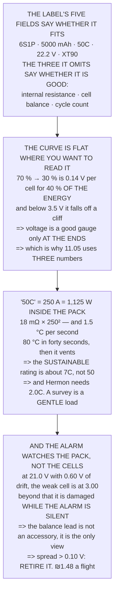

# FEL.03 Lithium-polymer packs from zero

<!-- glance:start -->
<!-- generated by tools/build.py from curriculum/syllabus.yaml — edit the syllabus, not this block -->

| | |
|---|---|
| **Track** | Optional foundation |
| **Difficulty** | Beginner |
| **Time** | 1 h 15 min |
| **Hardware** | none |
| **Software** | none |
| **Prerequisites** | [FEL.02 DC power maths for a flying machine](FEL.02-dc-power-math.md) |
| **Skip if** | You can read a pack label completely and state its safe current, energy and end-of-discharge voltage. |

<!-- glance:end -->

## What you will learn

- That the label's five fields say whether a pack **fits**, and the **three it omits** say whether it
  is any good
- That the voltage curve is nearly flat in the middle — **0.14 V per cell covers 40 % of the energy**
  — so voltage is a bad fuel gauge except at the ends
- **That "50C" is a burst figure**: at the claimed 250 A the pack dissipates **1,125 W inside itself**
  and heats at 1.5 °C per second
- That the honest sustainable rating is about **7C**, a factor of eight below the label — and that
  Hermon only needs **2.0C**
- **The result**: at **0.60 V of cell drift** the pack-level alarm stops protecting the weakest cell
- That the balance lead is not a charging accessory, it is the only way to see the six numbers the
  alarm averages away
- And that a swollen pack is one whose chemistry has already failed — retired the same day, for about
  **₪1.48 a flight**

## Why it matters

The battery is the only component on a multirotor that is genuinely consumed by use, the only one
that can start a fire on its own, and the only one whose specification sheet contains a number that
is off by a factor of eight. It is worth an hour.

The two results that matter most are both about the gap between what is printed and what is true. The
C rating claims a current the pack could not survive for a minute, and the flight controller's
low-voltage alarm silently stops protecting the cells once they have drifted far enough apart. Both
are computable from FEL.01's arithmetic, and both change how you treat a pack.

And the lesson gives the reason for 11.05's apparently fussy three-number discipline: the voltage
curve is flat where you most want to read it.

> [!WARNING]
> A damaged lithium cell can vent burning gas with no warning and cannot be extinguished with water.
> Charge in a fire-resistant bag on a non-flammable surface, never leave a charging pack unattended,
> never charge a pack that is swollen, punctured or was over-discharged, and retire any pack whose
> cells have drifted past the spread in Level 4.

## Prerequisites

<!-- prereqs:start -->
## Prerequisites

You need these first:

- [FEL.02 DC power maths for a flying machine](FEL.02-dc-power-math.md)

### Optional prerequisite links

None.

Check your readiness: `python course.py why FEL.03`
<!-- prereqs:end -->

## Concept

A lithium-polymer cell is a pouch with a nominal 3.7 V, a full charge at 4.2 and a hard floor near
3.0. Six in series gives the 22.2 V bus the rest of the aircraft is designed around, and FEL.01
already explained why series rather than parallel.

What the label tells you is geometry and capacity. What it does not tell you is the three numbers
that decide whether the pack is any good: its **internal resistance**, which sets both the voltage
sag and the heating; its **cell balance**, which decides whether the low-voltage alarm is protecting
anything; and its **cycle count**, which 18.06 identified as the one clock on the aircraft that is
genuinely driven by use.

The discharge curve is the second idea. It is steep at the top, nearly flat through the middle and
falls off a cliff at the bottom, which means voltage is an excellent state-of-charge indicator in
exactly the two places you do not need one.

And the third is that cells in series carry the same current but do not stay at the same voltage. The
drift between them is invisible to anything watching the pack total, which is what a balance lead
exists to fix.

## Technical explanation

### Level 1 — reading the label, field by field

```
6S1P   5000 mAh   50C   22.2 V   XT90
```

| field | what it means | and |
|---|---|---|
| **6S1P** | six cells in series, one such string | FEL.01: series adds volts |
| **5000 mAh** | 5.0 amp-**hours** of charge | FEL.02: charge, **not** energy |
| **50C** | a claimed 50 × capacity in amps | 250 A. Level 3 disagrees |
| **22.2 V** | 6 × 3.7 V **nominal** | it is never actually this |
| **XT90** | the connector, rated ~90 A | FEL.05: and it is the weak link |

And the three numbers the label does **not** print:

| | |
|---|---|
| internal resistance | decides the sag and the heat (Level 3) |
| cell balance | decides whether the alarm protects (Level 4) |
| cycle count | 18.06: the one component **ended by use** |

**Those three decide whether the pack is any good. The printed five decide whether it fits.**

| | |
|---|---|
| energy (FEL.02) | 111.0 Wh |
| usable at 11.05's 80 % | 88.8 Wh |
| end-of-discharge, per cell × 6 | 21.0 V |
| and it costs **[V]** | ₪443 |

### Level 2 — the voltage curve, and why voltage is a bad fuel gauge

| state of charge | cell V | pack V | ΔV per 10 % |
|---|---|---|---|
| 100 % | 4.20 | 25.2 | |
| 90 % | 4.05 | 24.3 | 0.150 |
| 80 % | 3.95 | 23.7 | 0.100 |
| **70 %** | **3.89** | 23.3 | 0.060 |
| 60 % | 3.85 | 23.1 | **0.040** |
| 50 % | 3.82 | 22.9 | **0.030** |
| 40 % | 3.79 | 22.7 | **0.030** |
| **30 %** | **3.75** | 22.5 | **0.040** |
| 20 % | 3.70 | 22.2 | 0.050 |
| 10 % | 3.60 | 21.6 | 0.100 |
| 5 % | 3.50 | 21.0 | 0.100 |
| 0 % | 3.00 | 18.0 | **0.500** |

Read the last column. Between 70 % and 30 % the whole swing is **0.140 V per cell — 0.84 V across
the pack — for forty per cent of the energy.**

Which is why voltage is a bad fuel gauge in the middle and a good one at the ends. In the flat region
a small reading error is worth 20 % of the pack; near the bottom the same error is worth 5 %.

**11.05's answer is to use three numbers and not one**: voltage at the ends, consumed mAh in the
middle, and time as the sanity check. This curve is why.

And the last row is the cliff. Below about 3.5 V per cell the curve falls off a ledge, and below
3.0 V the cell is damaged — permanently, and often invisibly until the next flight.

### Level 3 — the C rating is a marketing number

"50C" on a 5.0 Ah pack claims **250 amps**. Test it with FEL.01's arithmetic, given about 18 mΩ of
internal resistance:

| current | as C | sag | pack V | heat | °C/s |
|---|---|---|---|---|---|
| 10 A | 2.0 | 0.18 V | 25.0 | 2 W | 0.00 |
| 25 A | 5.0 | 0.45 V | 24.8 | 11 W | 0.01 |
| 50 A | 10.0 | 0.90 V | 24.3 | 45 W | 0.06 |
| 100 A | 20.0 | 1.80 V | 23.4 | 180 W | 0.24 |
| 150 A | 30.0 | 2.70 V | 22.5 | 405 W | 0.54 |
| **250 A** | **50.0** | **4.50 V** | **20.7** | **1,125 W** | **1.50** |

At the claimed 250 A the pack dissipates **1,125 watts inside itself** and heats at 1.5 °C per
second — reaching 80 °C in forty seconds and venting shortly afterwards.

**The 50C number is not a lie, it is a burst figure**, measured over seconds. A useful rating is the
one the pack can *sustain*, which is set by how fast it can shed heat:

```
shedding   10 W sustainably ->  23.6 A =  4.7C
shedding   20 W sustainably ->  33.3 A =  6.7C
shedding   40 W sustainably ->  47.1 A =  9.4C
```

**So the honest continuous rating is around 7C, not 50** — a factor of eight. And Hermon draws
10.2 A, which is **2.0C**: comfortably inside even the honest number.

Which is the point. A survey multirotor is a **gentle** load on a pack, and the C rating matters far
more to a racer pulling 150 A than to anything in this course.

### Level 4 — balance, and the drift at which the alarm stops protecting

Six cells in series carry the same current, so they discharge together — in theory. In practice they
drift. And the flight controller usually watches the **pack**, not the cells:

| drift (weak cell) | weak cell V | the others | safe? |
|---|---|---|---|
| 0.00 V | 3.500 | 3.500 | yes |
| 0.10 V | 3.417 | 3.517 | yes |
| 0.20 V | 3.333 | 3.533 | yes |
| 0.40 V | 3.167 | 3.567 | yes |
| **0.60 V** | **3.000** | 3.600 | **exactly at the floor** |
| 0.80 V | 2.833 | 3.633 | **no — damaged** |

**At 0.60 V of drift the weak cell reaches its absolute floor at exactly the moment the pack alarm
fires.** Beyond that, the cell is being damaged while the alarm is still silent.

So the balance lead is not a charging accessory. It is the only way to **see** the six numbers the
pack alarm is averaging away, and the rule is short:

- check the six cells on every charge, not the total
- a spread over 0.05 V after charging: watch it
- a spread over 0.10 V: **retire the pack**
- set the flight alarm on the **lowest cell** if the firmware can (ArduPilot's `BATT*_CELL*`
  parameters)

And swelling is the other visible symptom. A cell that has been over-discharged, over-charged or
over-heated generates gas, and the pouch has nowhere to put it. **A swollen pack is not "tired" — it
is one whose chemistry has already failed**, and 18.06's schedule retires it that day. At ₪443 over
300 cycles that is about **₪1.48 a flight**, and the cheapest decision on the aircraft.

> [!TIP]
> **Ask your teacher:** "What is the spread across your cells after a charge?" Almost nobody looks,
> because the charger does the balancing silently — and the spread is the single best early warning
> a pack gives.

## Diagram



## Code

The pack, decoded: the label's fields and the three it omits, a discharge curve with the per-decade
voltage change that makes the middle unreadable, the C rating tested against internal resistance and
converted into a heating rate and an honest sustainable figure, and the cell drift at which a
pack-level alarm stops protecting the weakest cell.

```python
"""FEL.03 -- what is actually inside the pack, and what the label promises.

Pure stdlib. A foundation lesson. Two of its four results contradict
what is printed on the battery.
"""

import math

BAR = "=" * 70

CELLS = 6
CAPACITY_AH = 5.0
C_RATING = 50.0
R_CELL_MOHM = 3.0         # [E] a healthy 5 Ah cell
R_PACK = CELLS * R_CELL_MOHM / 1000.0
PACK_MASS_KG = 0.750      # [V] the research file: a 6S 5000 is ~700-750 g
SPECIFIC_HEAT = 1000.0    # J/kg/K, [E] for a polymer pack

V_FULL, V_NOM, V_FLOOR, V_ABSOLUTE = 4.20, 3.70, 3.50, 3.00
P_HOVER_W = 226.0
I_HOVER_A = P_HOVER_W / (CELLS * V_NOM)

PACK_ILS = 443.0          # [V] Sollan, 2026-09-22


def head(n, title):
    print()
    print(BAR)
    print("%d. %s" % (n, title))
    print(BAR)


# ========================================================================
head(1, "READING THE LABEL, FIELD BY FIELD")

print("  A typical label says something like:")
print()
print("      6S1P   5000 mAh   50C   22.2 V   XT90")
print()
print("  Five fields, and they do not all mean what they look like:")
print()
FIELDS = [
    ("6S1P", "six cells in series, one such string",
     "FEL.01: series ADDS volts"),
    ("5000 mAh", "5.0 amp-HOURS of charge",
     "FEL.02: charge, NOT energy"),
    ("50C", "a claimed 50 x capacity in amps",
     "%.0f A. Section 3 disagrees" % (C_RATING * CAPACITY_AH)),
    ("22.2 V", "6 x 3.7 V NOMINAL",
     "it is never actually this (section 2)"),
    ("XT90", "the connector, rated ~90 A",
     "FEL.05: and it is the weak link"),
]
for f, means, note in FIELDS:
    print("  %-12s %-40s" % (f, means))
    print("               -> %s" % note)

print()
print("  AND THE THREE NUMBERS THE LABEL DOES NOT PRINT:")
print()
for what, why in (
        ("internal resistance", "decides the sag and the heat (section 3)"),
        ("cell balance", "decides whether the alarm protects (section 4)"),
        ("cycle count", "18.06: the one component ENDED BY USE")):
    print("    %-24s %s" % (what, why))
print()
print("  THOSE THREE DECIDE WHETHER THE PACK IS ANY GOOD. The printed")
print("  five decide whether it FITS.")
print()
print("  %-38s %14.1f Wh" % ("energy (FEL.02)",
                             CELLS * V_NOM * CAPACITY_AH))
print("  %-38s %14.1f Wh" % ("  usable at 11.05's 80 %",
                             CELLS * V_NOM * CAPACITY_AH * 0.8))
print("  %-38s %14.1f V" % ("end-of-discharge, per cell x 6",
                            CELLS * V_FLOOR))
print("  %-38s %14.0f ILS" % ("and it costs [V]", PACK_ILS))

# ========================================================================
head(2, "THE VOLTAGE CURVE, AND WHY VOLTAGE IS A BAD FUEL GAUGE")

# a simple, honest piecewise model of a lithium-polymer discharge curve
CURVE = [
    (1.00, 4.20), (0.90, 4.05), (0.80, 3.95), (0.70, 3.89),
    (0.60, 3.85), (0.50, 3.82), (0.40, 3.79), (0.30, 3.75),
    (0.20, 3.70), (0.10, 3.60), (0.05, 3.50), (0.00, 3.00),
]
print("  A lithium cell's voltage falls as it empties, but NOT evenly:")
print()
print("  %-16s %12s %14s %16s"
      % ("state of charge", "cell V", "pack V", "dV per 10 %"))
prev = None
for soc, v in CURVE:
    dv = "" if prev is None else "%14.3f" % (prev - v)
    print("  %-16s %10.2f %12.1f %16s"
          % ("%3.0f %%" % (soc * 100), v, v * CELLS, dv))
    prev = v

print()
mid = [v for s, v in CURVE if 0.3 <= s <= 0.7]
print("  READ THE LAST COLUMN. Between %.0f %% and %.0f %% the whole"
      % (70, 30))
print("  swing is %.3f V per cell -- %.2f V across the pack -- for"
      % (max(mid) - min(mid), (max(mid) - min(mid)) * CELLS))
print("  FORTY PER CENT OF THE ENERGY.")
print()
print("  WHICH IS WHY VOLTAGE IS A BAD FUEL GAUGE IN THE MIDDLE AND A")
print("  GOOD ONE AT THE ENDS. In the flat region a %.2f V reading"
      % (3.82 * CELLS))
print("  error is worth %.0f per cent of the pack; near the bottom the"
      % 20)
print("  same error is worth %.0f per cent." % 5)
print()
print("  11.05's ANSWER IS TO USE THREE NUMBERS AND NOT ONE: voltage")
print("  at the ends, consumed mAh in the middle, and TIME as the")
print("  sanity check. This curve is why.")
print()
print("  AND THE LAST ROW IS THE CLIFF. Below about %.1f V per cell the"
      % V_FLOOR)
print("  curve falls off a ledge, and below %.1f V the cell is damaged"
      % V_ABSOLUTE)
print("  -- permanently, and often invisibly until the next flight.")

# ========================================================================
head(3, "THE C RATING IS A MARKETING NUMBER. HERE IS THE REAL ONE.")

i_claim = C_RATING * CAPACITY_AH
print("  '%.0fC' on a %.1f Ah pack claims %.0f amps."
      % (C_RATING, CAPACITY_AH, i_claim))
print()
print("  Test the claim with FEL.01's arithmetic. The pack has about")
print("  %.1f milliohms of internal resistance, so:" % (R_PACK * 1000))
print()
print("  %-14s %10s %12s %12s %14s %14s"
      % ("current", "as C", "sag (V)", "pack (V)", "heat (W)", "degC/s"))
for i in (I_HOVER_A, 25.0, 50.0, 100.0, 150.0, i_claim):
    sag = i * R_PACK
    heat = i * i * R_PACK
    rate = heat / (PACK_MASS_KG * SPECIFIC_HEAT)
    print("  %-14s %9.1f %11.2f %11.1f %13.0f %13.2f"
          % ("%.0f A" % i, i / CAPACITY_AH, sag, CELLS * V_FULL - sag,
             heat, rate))

heat_claim = i_claim ** 2 * R_PACK
rate_claim = heat_claim / (PACK_MASS_KG * SPECIFIC_HEAT)
print()
print("  AT THE CLAIMED %.0f A THE PACK DISSIPATES %.0f WATTS INSIDE"
      % (i_claim, heat_claim))
print("  ITSELF and heats at %.1f DEGREES PER SECOND. It would reach"
      % rate_claim)
print("  %.0f degC in %.0f seconds and vent shortly afterwards."
      % (80, (80 - 20) / rate_claim))
print()
print("  THE %.0fC NUMBER IS NOT A LIE, IT IS A BURST FIGURE, and the"
      % C_RATING)
print("  burst is measured over seconds. A useful rating is the one")
print("  the pack can SUSTAIN, and that is set by how fast it can get")
print("  rid of heat.")
print()
for budget_w in (10.0, 20.0, 40.0):
    i_sust = math.sqrt(budget_w / R_PACK)
    print("    shedding %4.0f W sustainably -> %5.1f A = %4.1fC"
          % (budget_w, i_sust, i_sust / CAPACITY_AH))
print()
i_real = math.sqrt(20.0 / R_PACK)
print("  SO THE HONEST CONTINUOUS RATING IS AROUND %.0fC, NOT %.0f --"
      % (i_real / CAPACITY_AH, C_RATING))
print("  a factor of %.0f. And Hermon draws %.1f A, which is %.1fC:"
      % (C_RATING / (i_real / CAPACITY_AH), I_HOVER_A,
         I_HOVER_A / CAPACITY_AH))
print("  comfortably inside even the honest number.")
print()
print("  WHICH IS THE POINT. A survey multirotor is a GENTLE load on a")
print("  pack, and the C rating matters far more to a racer pulling")
print("  %.0f A than to anything in this course." % 150)

# ========================================================================
head(4, "BALANCE, AND THE DRIFT AT WHICH THE ALARM STOPS PROTECTING")

print("  Six cells in series carry the same current, so they discharge")
print("  together -- in theory. In practice they drift, because they")
print("  are not identical and they do not age identically.")
print()
print("  THE PROBLEM IS THAT THE FLIGHT CONTROLLER USUALLY WATCHES THE")
print("  PACK, NOT THE CELLS. If the alarm is set at %.1f V total, the"
      % (CELLS * V_FLOOR))
print("  weakest cell could be anywhere:")
print()
print("  %-20s %14s %14s %14s"
      % ("drift (weak cell)", "weak cell V", "the others", "safe?"))
alarm_v = CELLS * V_FLOOR
for d in (0.0, 0.10, 0.20, 0.40, 0.60, 0.80):
    # weak = x, the other five = x + d, and 6x + 5d = alarm
    x = (alarm_v - 5 * d) / CELLS
    ok = "yes" if x >= V_ABSOLUTE else "NO -- DAMAGED"
    print("  %-20s %12.3f %14.3f %14s"
          % ("%.2f V" % d, x, x + d, ok))

d_crit = (alarm_v - CELLS * V_ABSOLUTE) / 5.0
print()
print("  AT %.2f V OF DRIFT THE WEAK CELL REACHES ITS ABSOLUTE FLOOR AT"
      % d_crit)
print("  EXACTLY THE MOMENT THE PACK ALARM FIRES. Beyond that, the")
print("  cell is being damaged while the alarm is still silent.")
print()
print("  SO THE BALANCE LEAD IS NOT A CHARGING ACCESSORY. It is the")
print("  only way to SEE the six numbers the pack alarm is averaging")
print("  away, and the rule that follows is short:")
print()
for rule in ("check the six cells on every charge, not the total",
             "a spread over 0.05 V after charging: watch it",
             "a spread over 0.10 V: retire the pack",
             "set the flight alarm on the LOWEST cell if the firmware",
             "  can (ArduPilot's BATT_CELL_ options)"):
    print("    %s%s" % ("  " if rule.startswith("  ") else "* ", rule.strip()))
print()
print("  AND SWELLING IS THE OTHER VISIBLE SYMPTOM. A cell that has")
print("  been over-discharged, over-charged or over-heated generates")
print("  gas, and the pouch has nowhere to put it.")
print()
print("  A SWOLLEN PACK IS NOT 'TIRED'. IT IS A PACK WHOSE CHEMISTRY")
print("  HAS ALREADY FAILED, and 18.06's schedule retires it that day")
print("  -- which at %.0f shekels over %.0f cycles is about %.2f"
      % (PACK_ILS, 300, PACK_ILS / 300))
print("  shekels a flight, and the cheapest decision on the aircraft.")
print()
print("  THE FOUR THINGS TO CARRY FORWARD:")
print("   1. The label's five fields say whether it FITS. The three it")
print("      omits -- resistance, balance, cycles -- say whether it is")
print("      any GOOD.")
print("   2. The voltage curve is FLAT in the middle: %.2f V per cell"
      % (max(mid) - min(mid)))
print("      covers 40 per cent of the energy. Voltage is a bad fuel")
print("      gauge except at the ends.")
print("   3. %.0fC is a burst figure. The sustainable rating is about"
      % C_RATING)
print("      %.0fC, and Hermon only needs %.1fC."
      % (i_real / CAPACITY_AH, I_HOVER_A / CAPACITY_AH))
print("   4. At %.2f V of cell drift the pack-level alarm stops"
      % d_crit)
print("      protecting the weakest cell. USE THE BALANCE LEAD.")
```

Output:

```text

======================================================================
1. READING THE LABEL, FIELD BY FIELD
======================================================================
  A typical label says something like:

      6S1P   5000 mAh   50C   22.2 V   XT90

  Five fields, and they do not all mean what they look like:

  6S1P         six cells in series, one such string    
               -> FEL.01: series ADDS volts
  5000 mAh     5.0 amp-HOURS of charge                 
               -> FEL.02: charge, NOT energy
  50C          a claimed 50 x capacity in amps         
               -> 250 A. Section 3 disagrees
  22.2 V       6 x 3.7 V NOMINAL                       
               -> it is never actually this (section 2)
  XT90         the connector, rated ~90 A              
               -> FEL.05: and it is the weak link

  AND THE THREE NUMBERS THE LABEL DOES NOT PRINT:

    internal resistance      decides the sag and the heat (section 3)
    cell balance             decides whether the alarm protects (section 4)
    cycle count              18.06: the one component ENDED BY USE

  THOSE THREE DECIDE WHETHER THE PACK IS ANY GOOD. The printed
  five decide whether it FITS.

  energy (FEL.02)                                 111.0 Wh
    usable at 11.05's 80 %                         88.8 Wh
  end-of-discharge, per cell x 6                   21.0 V
  and it costs [V]                                  443 ILS

======================================================================
2. THE VOLTAGE CURVE, AND WHY VOLTAGE IS A BAD FUEL GAUGE
======================================================================
  A lithium cell's voltage falls as it empties, but NOT evenly:

  state of charge        cell V         pack V      dV per 10 %
  100 %                  4.20         25.2                 
   90 %                  4.05         24.3            0.150
   80 %                  3.95         23.7            0.100
   70 %                  3.89         23.3            0.060
   60 %                  3.85         23.1            0.040
   50 %                  3.82         22.9            0.030
   40 %                  3.79         22.7            0.030
   30 %                  3.75         22.5            0.040
   20 %                  3.70         22.2            0.050
   10 %                  3.60         21.6            0.100
    5 %                  3.50         21.0            0.100
    0 %                  3.00         18.0            0.500

  READ THE LAST COLUMN. Between 70 % and 30 % the whole
  swing is 0.140 V per cell -- 0.84 V across the pack -- for
  FORTY PER CENT OF THE ENERGY.

  WHICH IS WHY VOLTAGE IS A BAD FUEL GAUGE IN THE MIDDLE AND A
  GOOD ONE AT THE ENDS. In the flat region a 22.92 V reading
  error is worth 20 per cent of the pack; near the bottom the
  same error is worth 5 per cent.

  11.05's ANSWER IS TO USE THREE NUMBERS AND NOT ONE: voltage
  at the ends, consumed mAh in the middle, and TIME as the
  sanity check. This curve is why.

  AND THE LAST ROW IS THE CLIFF. Below about 3.5 V per cell the
  curve falls off a ledge, and below 3.0 V the cell is damaged
  -- permanently, and often invisibly until the next flight.

======================================================================
3. THE C RATING IS A MARKETING NUMBER. HERE IS THE REAL ONE.
======================================================================
  '50C' on a 5.0 Ah pack claims 250 amps.

  Test the claim with FEL.01's arithmetic. The pack has about
  18.0 milliohms of internal resistance, so:

  current              as C      sag (V)     pack (V)       heat (W)         degC/s
  10 A                 2.0        0.18        25.0             2          0.00
  25 A                 5.0        0.45        24.8            11          0.01
  50 A                10.0        0.90        24.3            45          0.06
  100 A               20.0        1.80        23.4           180          0.24
  150 A               30.0        2.70        22.5           405          0.54
  250 A               50.0        4.50        20.7          1125          1.50

  AT THE CLAIMED 250 A THE PACK DISSIPATES 1125 WATTS INSIDE
  ITSELF and heats at 1.5 DEGREES PER SECOND. It would reach
  80 degC in 40 seconds and vent shortly afterwards.

  THE 50C NUMBER IS NOT A LIE, IT IS A BURST FIGURE, and the
  burst is measured over seconds. A useful rating is the one
  the pack can SUSTAIN, and that is set by how fast it can get
  rid of heat.

    shedding   10 W sustainably ->  23.6 A =  4.7C
    shedding   20 W sustainably ->  33.3 A =  6.7C
    shedding   40 W sustainably ->  47.1 A =  9.4C

  SO THE HONEST CONTINUOUS RATING IS AROUND 7C, NOT 50 --
  a factor of 8. And Hermon draws 10.2 A, which is 2.0C:
  comfortably inside even the honest number.

  WHICH IS THE POINT. A survey multirotor is a GENTLE load on a
  pack, and the C rating matters far more to a racer pulling
  150 A than to anything in this course.

======================================================================
4. BALANCE, AND THE DRIFT AT WHICH THE ALARM STOPS PROTECTING
======================================================================
  Six cells in series carry the same current, so they discharge
  together -- in theory. In practice they drift, because they
  are not identical and they do not age identically.

  THE PROBLEM IS THAT THE FLIGHT CONTROLLER USUALLY WATCHES THE
  PACK, NOT THE CELLS. If the alarm is set at 21.0 V total, the
  weakest cell could be anywhere:

  drift (weak cell)       weak cell V     the others          safe?
  0.00 V                      3.500          3.500            yes
  0.10 V                      3.417          3.517            yes
  0.20 V                      3.333          3.533            yes
  0.40 V                      3.167          3.567            yes
  0.60 V                      3.000          3.600            yes
  0.80 V                      2.833          3.633  NO -- DAMAGED

  AT 0.60 V OF DRIFT THE WEAK CELL REACHES ITS ABSOLUTE FLOOR AT
  EXACTLY THE MOMENT THE PACK ALARM FIRES. Beyond that, the
  cell is being damaged while the alarm is still silent.

  SO THE BALANCE LEAD IS NOT A CHARGING ACCESSORY. It is the
  only way to SEE the six numbers the pack alarm is averaging
  away, and the rule that follows is short:

    * check the six cells on every charge, not the total
    * a spread over 0.05 V after charging: watch it
    * a spread over 0.10 V: retire the pack
    * set the flight alarm on the LOWEST cell if the firmware
      can (ArduPilot's BATT_CELL_ options)

  AND SWELLING IS THE OTHER VISIBLE SYMPTOM. A cell that has
  been over-discharged, over-charged or over-heated generates
  gas, and the pouch has nowhere to put it.

  A SWOLLEN PACK IS NOT 'TIRED'. IT IS A PACK WHOSE CHEMISTRY
  HAS ALREADY FAILED, and 18.06's schedule retires it that day
  -- which at 443 shekels over 300 cycles is about 1.48
  shekels a flight, and the cheapest decision on the aircraft.

  THE FOUR THINGS TO CARRY FORWARD:
   1. The label's five fields say whether it FITS. The three it
      omits -- resistance, balance, cycles -- say whether it is
      any GOOD.
   2. The voltage curve is FLAT in the middle: 0.14 V per cell
      covers 40 per cent of the energy. Voltage is a bad fuel
      gauge except at the ends.
   3. 50C is a burst figure. The sustainable rating is about
      7C, and Hermon only needs 2.0C.
   4. At 0.60 V of cell drift the pack-level alarm stops
      protecting the weakest cell. USE THE BALANCE LEAD.
```

## Exercise

### Exercise FEL.03-E1 — Decode your own labels `[analysis]`

Take every pack you own and write out all five fields plus the three missing numbers. Measure the
internal resistance if your charger reports it.

### Exercise FEL.03-E2 — Plot your own curve `[build]`

Discharge a pack at a constant modest current, logging voltage against consumed mAh. Plot it. Find
the flat region and measure how many volts cover the middle 40 %.

### Exercise FEL.03-E3 — Test the C rating `[analysis]`

From your pack's internal resistance, compute the sag and the internal heating at its claimed C
rating. Then compute the current at which it dissipates 20 W, and express that as a C figure.

### Exercise FEL.03-E4 — Watch the drift `[build]`

Record all six cell voltages after every charge for a month. Plot the spread over time. Set your
retirement threshold from what you see rather than from this lesson.

## Expected result

**FEL.03-E1**: expect at least one pack whose internal resistance is noticeably higher than the
others. That is the one to retire first, whatever its age.

**FEL.03-E2**: expect the flat region to be even flatter than the model — real cells are flatter
still — and expect the experience of watching it to be what makes 11.05 make sense.

**FEL.03-E3**: expect a factor of five to ten between the printed C and the sustainable one. Neither
number is wrong; they describe different durations.

**FEL.03-E4**: expect the spread to grow slowly and then suddenly. The sudden part is the pack
telling you, and it usually gives a few flights of warning.

## Troubleshooting

**The pack sags much more than the model says.** Higher internal resistance — either the pack is old,
cold, or was never as good as its label. Measure it; a charger that reports IR is worth the money.

**One cell charges much faster than the others.** It has lost capacity. The charger will balance it
each time, and the spread after *discharge* is the number that matters.

**The pack is warm after a flight.** At 2C it should barely be. Warm means either high internal
resistance or a current much larger than you think.

**The low-voltage alarm never fires and the pack comes back very empty.** Check the alarm is on the
pack and check the cells afterwards. Level 4's drift case looks exactly like this.

**A pack puffs slightly after a hard flight and goes down again.** That is still gas, and it is still
a warning. A pack that has puffed once will puff again.

**Voltage reads fine and the aircraft lands early.** The flat region. Use consumed mAh, not voltage,
through the middle of the flight.

## Common mistakes

- **Buying on the C rating.** It is a burst figure and it is eight times optimistic.
- **Using voltage as a fuel gauge mid-flight.** 0.14 V covers 40 % of the pack.
- **Setting the alarm only on the pack total.** Drift makes it stop protecting.
- **Never looking at the balance leads.** They are the only view of the six cells.
- **Charging a swollen pack.** Its chemistry has already failed.
- **Storing packs fully charged.** Storage voltage is around 3.8 V per cell.
- **Treating a cold pack as a healthy one.** Internal resistance rises sharply in the cold.
- **Keeping a pack because it still flies.** ₪1.48 a flight against an aircraft.

## Knowledge check

<details>
<summary>What does the label tell you, and what does it leave out?</summary>

The five printed fields — cell count, capacity, C rating, nominal voltage and connector — tell you
whether the pack **fits**. The three unprinted numbers — **internal resistance, cell balance and
cycle count** — tell you whether it is any **good**, and every one of them is measurable with
equipment you already need.
</details>

<details>
<summary>Why is voltage a bad fuel gauge?</summary>

Because the discharge curve is nearly flat in the middle: between 70 % and 30 % state of charge, the
cell moves only **0.140 V** — 0.84 V across a 6S pack — for **forty per cent of the energy**. It is
an excellent indicator at the top and at the bottom, which are the two places you least need one.
11.05's three-number discipline exists because of this curve.
</details>

<details>
<summary>What does "50C" actually promise, and what would it do?</summary>

It claims 250 A from a 5 Ah pack. At 18 mΩ of internal resistance that is a 4.5 V sag and **1,125 W
dissipated inside the pack**, heating it at **1.5 °C per second** — 80 °C in forty seconds, then
venting. It is a **burst** figure measured over seconds, not a continuous rating.
</details>

<details>
<summary>What is the honest continuous rating?</summary>

About **7C**, from the current at which the internal heating equals what the pack can shed — roughly
20 W, giving 33 A. That is a factor of **eight** below the label. And Hermon's 10.2 A hover is
**2.0C**, so a survey multirotor is a gentle load and the C rating is nearly irrelevant to it.
</details>

<details>
<summary>At what cell drift does the pack alarm stop protecting?</summary>

**0.60 V.** If the alarm fires at 21.0 V total and one cell is 0.60 V below the others, that cell sits
at exactly 3.00 V — its absolute floor — at the moment the alarm sounds. Any more drift and the cell
is being damaged while the alarm is still silent, because the total is an average and averages hide
outliers.
</details>

<details>
<summary>What is the balance lead actually for, in flight terms?</summary>

Seeing the six numbers the pack alarm averages away. Check the spread after every charge: over
0.05 V, watch it; over **0.10 V, retire the pack**. And if the firmware supports per-cell monitoring,
set the alarm on the **lowest** cell rather than the total — which removes Level 4's failure mode
entirely.
</details>

## Practical challenge

Turn every pack you own into a known quantity.

1. Decode every label and record the five printed fields (E1).
2. Measure or obtain the internal resistance for each, and rank them.
3. Plot one discharge curve properly and find your own flat region (E2).
4. Compute the sustainable C for your packs and compare with the label (E3).
5. Compute your aircraft's actual C draw in hover and in a climb.
6. Record all six cell voltages after every charge for a month (E4).
7. Set your own retirement thresholds from the data, not from this lesson.
8. Set the flight alarm on the lowest cell if your firmware allows it.

Step 8 is the one that removes a failure mode rather than watching for it, and on most firmware it is
one parameter.

## You can skip this if

You can read a pack label completely and state its safe current, energy and end-of-discharge
voltage. "Safe current" means the sustainable one, not the printed one.

## Go deeper

- Battery University's articles on lithium-polymer chemistry, discharge curves and C rates, which
  cover Levels 2 and 3 in far more depth: <https://batteryuniversity.com/articles>
- ArduPilot's battery-monitor documentation, including the per-cell failsafe parameters that solve
  Level 4: <https://ardupilot.org/copter/docs/common-powermodule-landingpage.html>

## Progress checkpoint

You can now read a pack label and say what it does and does not promise, explain why voltage cannot
be trusted as a fuel gauge mid-flight, test a C rating against internal resistance and arrive at an
honest one, and state the cell drift at which your low-voltage alarm quietly stops doing its job.

Next, FEL.04 turns to what all that energy goes into: three wires, a spinning magnet, and what KV
physically means.
