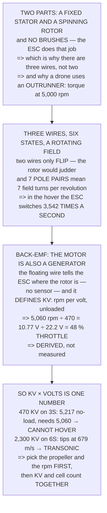

# FEL.04 Brushless motors from zero

<!-- glance:start -->
<!-- generated by tools/build.py from curriculum/syllabus.yaml — edit the syllabus, not this block -->

| | |
|---|---|
| **Track** | Optional foundation |
| **Difficulty** | Beginner |
| **Time** | 1 h 15 min |
| **Hardware** | none |
| **Software** | python |
| **Prerequisites** | [FEL.01 Electricity for drone builders: voltage, current, resistance](FEL.01-electricity-refresher.md) |
| **Skip if** | You can explain how three wires spin a magnet and what KV physically means. |

<!-- glance:end -->

## What you will learn

- That a brushless motor is **two parts**, and that the ESC exists because the brushes were removed
- That **three is the smallest number of wires that gives a rotating field** — two would judder
- That seven pole pairs mean the field turns seven times per revolution, so **the ESC switches 3,542
  times a second** in the hover
- That back-EMF is the motor working as a generator, and it is **how the ESC knows where the rotor
  is without a sensor**
- **What KV physically means**: the speed at which back-EMF matches the applied voltage
- That Hermon's **48 % hover throttle is derived, not measured** — 10.77 V of back-EMF over 22.2 V
  of pack
- That "throttle" on a brushless motor is **the fraction of the time the pack is connected**
- And that **KV and cell count are one decision**: this motor on 3S cannot hover at all

## Why it matters

Four brushless motors are the only parts of a drone that do any useful work, and they are usually
treated as a black box with a mysterious number on the side. That number — KV — turns out to have a
precise physical meaning, and once you have it, several things that looked like separate choices
collapse into one.

The lesson's payoff is a derivation rather than a fact. Hermon's hover throttle is 48 %, and that
figure appears in the research file as a measurement. By the end of Level 3 you can produce it from
three numbers, none of which is a throttle setting — which is the difference between knowing a
specification and understanding a machine.

And it closes an error the course actually made: the original Hermon motor specification was wrong,
and Level 4's arithmetic is exactly what caught it.

## Prerequisites

<!-- prereqs:start -->
## Prerequisites

You need these first:

- [FEL.01 Electricity for drone builders: voltage, current, resistance](FEL.01-electricity-refresher.md)

### Optional prerequisite links

None.

Check your readiness: `python course.py why FEL.04`
<!-- prereqs:end -->

## Concept

A brushless motor has a **stator** — copper coils on steel teeth, which does not move — and a
**rotor** — permanent magnets, which does. What is missing is the brushes: in an older motor,
sliding contacts switched the current as the rotor turned, mechanically and with parts that wore
out. A brushless motor moves that job into electronics, and that is precisely what an ESC is.

Switching three wires in the right order makes the magnetic field rotate, and the rotor's magnets
chase it. Three is the smallest number of wires that can produce a rotating field rather than one
that merely flips back and forth.

The third idea is that the motor is simultaneously a generator. Spinning it produces a voltage —
back-EMF — and that voltage does two jobs: it tells the ESC where the rotor is without any sensor,
and it defines the motor's speed, because the motor accelerates until the back-EMF nearly matches
what is applied.

Which means KV, the voltage and the desired propeller speed are three views of one thing. Choosing
any two fixes the third.

## Technical explanation

### Level 1 — what is inside, and which part moves

| part | what it is | does it move? |
|---|---|---|
| **stator** | coils of copper on steel teeth | **no** — it is the fixed bit |
| **rotor** | permanent magnets in a ring | **yes** — this is what spins |

Notice what is missing: **there are no brushes and no commutator.** A brushless motor moves that job
into electronics, which is the entire reason the ESC exists and the reason the motor has three wires
instead of two.

| layout | where the magnets are | and |
|---|---|---|
| inrunner | magnets inside, case fixed | faster, less torque — cars, EDF |
| **outrunner** | **the whole case spins** | slower, more torque — **every drone** |

A drone uses an outrunner because a propeller wants torque at a few thousand rpm, not a little torque
at fifty thousand. Hermon's motor turns at 5,060 rpm in the hover — a number a propeller is happy
with, and one an inrunner would need a gearbox to reach.

### Level 2 — three wires, six states, and a lot of switching

| step | wire A | wire B | wire C | the field points |
|---|---|---|---|---|
| 1 | + | − | off | 0° |
| 2 | + | off | − | 60° |
| 3 | off | + | − | 120° |
| 4 | − | + | off | 180° |
| 5 | − | off | + | 240° |
| 6 | off | − | + | 300° |

Run those six in order and the magnetic field rotates once. The rotor's magnets chase it, and **that
is the whole principle** — there is nothing else going on.

**Two wires would not work**, because a field that only flips back and forth has no *direction* to
chase: the rotor would judder rather than turn. Three is the smallest number that gives a rotating
field, and more than three buys smoothness at the cost of another wire and another pair of switches.

Now the part that surprises people. The rotor has **14 magnetic poles — 7 pairs** — so one turn of
the field is not one turn of the motor:

| mechanical rpm | electrical rpm | electrical Hz | **switches/s** |
|---|---|---|---|
| idle (1,000) | 7,000 | 117 | 700 |
| **hover (5,060)** | **35,420** | **590** | **3,542** |
| full throttle (9,836) | 68,852 | 1,148 | 6,885 |

**In the hover the ESC is switching 3,542 times a second, per motor** — and it has to get every one
of them in the right order at the right moment, without a single sensor telling it where the rotor
is.

### Level 3 — back-EMF: the motor is also a generator, and that is KV

Spin any motor by hand and it produces a voltage. That is the same physics running backwards, and it
is called **back-EMF**. Two things follow:

1. **The ESC can see it.** At any moment one of the three wires is switched off, and the voltage on
   that floating wire says where the rotor is. No sensor required.
2. **It defines KV.** A motor speeds up until the back-EMF it generates almost equals the voltage
   being applied — so **KV = rpm per volt, with no load**.

| | |
|---|---|
| Hermon's motor | 470 KV |
| on a 6S pack | 22.2 V |
| so unloaded, at most | 10,434 rpm |
| and it actually turns, full | 9,836 rpm |
| which is | **94 %** |

The missing 6 % is the load: a propeller fights back, so the motor settles below its no-load speed.
Now run it backwards to get the throttle:

| state | rpm | back-EMF | **throttle** |
|---|---|---|---|
| idle | 1,000 | 2.13 V | 10 % |
| **hover** | **5,060** | **10.77 V** | **48 %** |
| full | 9,836 | 20.93 V | 94 % |

**Hermon hovers at 48 per cent throttle, and that number was not measured here** — it fell out of KV,
the pack voltage and the hover rpm.

Which is what "throttle" physically *is* on a brushless motor: not a valve and not a fuel setting,
but **the fraction of the time the ESC connects the pack to the windings**. The motor sees an average
of 10.8 V out of 22.2, and spins at the speed whose back-EMF matches it.

### Level 4 — so KV and cell count are one decision

| pack | volts | no-load rpm | vs hover rpm | verdict |
|---|---|---|---|---|
| **3S** | 11.1 V | 5,217 | 1.03× | **cannot hover** |
| 4S | 14.8 V | 6,956 | 1.37× | hovers, no authority |
| **6S** | 22.2 V | 10,434 | 2.06× | **fine** |
| 8S | 29.6 V | 13,912 | 2.75× | fine |
| 12S | 44.4 V | 20,868 | 4.12× | fine |

A 470 KV motor on a 3S pack reaches 5,217 rpm unloaded and needs 5,060 to hover — so under load **it
cannot lift the aircraft at all**: not slowly, not at full throttle, not ever.

And the other direction is worse. Keep the pack and raise KV:

| motor | no-load rpm | tip speed **[E]** | verdict |
|---|---|---|---|
| **470 KV** | 10,434 | 139 m/s | **fine** |
| 900 KV | 19,980 | 266 m/s | transonic |
| 1,500 KV | 33,300 | 443 m/s | transonic |
| 2,300 KV | 51,060 | 679 m/s | transonic |

A 2,300 KV motor on 6S would spin a 10-inch propeller's tips at 679 m/s — past the speed of sound,
where a propeller stops producing thrust and starts producing noise.

**So the rule is: pick the propeller and the rpm you want, then KV and cell count together.** 02.06
does exactly that, and it is why the research file records that the *original* Hermon motor
specification was wrong: a 1,700 KV motor cannot turn a 10-inch propeller on 6S, and the corrected
value is 470.

> [!TIP]
> **Ask your teacher:** "What is your hover throttle, and does KV predict it?" Divide the hover rpm
> by KV and by the pack voltage. If the answer does not match the logged throttle, one of the three
> numbers is wrong — and that is a five-minute check on a spec sheet you were about to trust.

## Diagram



## Code

The motor from nothing: the two moving parts and why the ESC exists, the six commutation states and
the pole-pair multiplication that produces a switching rate, back-EMF turned into KV and then
backwards into Hermon's hover throttle, and the KV-versus-cell-count table that shows the two are one
decision.

```python
"""FEL.04 -- how three wires spin a magnet, and what KV physically means.

Pure stdlib. A foundation lesson. It closes on Hermon's 48 per cent
hover throttle, derived rather than quoted.
"""

import math

BAR = "=" * 70

# ---- Hermon's motor (references/hermon-numbers.md) ----------------------
KV = 470.0                # rpm per volt, unloaded
SLOTS = 12                # a 3110-class stator
POLES = 14
POLE_PAIRS = POLES // 2
RPM_HOVER = 5060.0
RPM_MAX = 9836.0

CELLS = 6
V_CELL_NOM = 3.7
V_PACK = CELLS * V_CELL_NOM
PHASES = 3
STATES = 6                # six commutation steps per electrical revolution


def head(n, title):
    print()
    print(BAR)
    print("%d. %s" % (n, title))
    print(BAR)


# ========================================================================
head(1, "WHAT IS ACTUALLY INSIDE, AND WHICH PART MOVES")

print("  A brushless motor has exactly two pieces that matter:")
print()
print("  %-14s %-30s %-28s"
      % ("part", "what it is", "does it move?"))
for part, what, moves in (
        ("STATOR", "coils of copper on steel teeth", "NO -- it is the fixed bit"),
        ("ROTOR", "permanent magnets in a ring", "YES -- this is what spins")):
    print("  %-14s %-30s %-28s" % (part, what, moves))

print()
print("  NOTICE WHAT IS MISSING: THERE ARE NO BRUSHES AND NO")
print("  COMMUTATOR. In an old brushed motor, sliding contacts switch")
print("  the current as the rotor turns -- mechanically, noisily, and")
print("  with parts that wear out.")
print()
print("  A BRUSHLESS MOTOR MOVES THAT JOB INTO ELECTRONICS. The ESC")
print("  does the switching, which is the entire reason it exists and")
print("  the reason the motor has three wires instead of two.")
print()
print("  AND TWO LAYOUTS, WHICH LOOK DIFFERENT AND WORK IDENTICALLY:")
print()
for kind, where, why in (
        ("INRUNNER", "magnets inside, case fixed",
         "faster, less torque -- cars, EDF"),
        ("OUTRUNNER", "the whole CASE spins, magnets on it",
         "slower, more torque -- EVERY DRONE")):
    print("    %-12s %-34s %s" % (kind, where, why))
print()
print("  A DRONE USES AN OUTRUNNER BECAUSE A PROPELLER WANTS TORQUE AT")
print("  A FEW THOUSAND RPM, not a little torque at fifty thousand.")
print("  Hermon's motor turns at %.0f rpm in the hover, which is a"
      % RPM_HOVER)
print("  number a propeller is happy with and a gearbox would be")
print("  needed to reach from an inrunner.")

# ========================================================================
head(2, "THREE WIRES, SIX STATES, AND A LOT OF SWITCHING")

print("  With three wires there are six useful ways to energise them:")
print()
print("  %-8s %-10s %-10s %-10s %-24s"
      % ("step", "wire A", "wire B", "wire C", "the field points"))
SEQ = [
    (1, "+", "-", "off", "0 deg"),
    (2, "+", "off", "-", "60 deg"),
    (3, "off", "+", "-", "120 deg"),
    (4, "-", "+", "off", "180 deg"),
    (5, "-", "off", "+", "240 deg"),
    (6, "off", "-", "+", "300 deg"),
]
for n, a, b, c, f in SEQ:
    print("  %-8d %-10s %-10s %-10s %-24s" % (n, a, b, c, f))

print()
print("  RUN THOSE SIX IN ORDER AND THE MAGNETIC FIELD ROTATES ONCE.")
print("  The rotor's magnets chase it, and that is the whole principle")
print("  -- there is nothing else going on.")
print()
print("  TWO WIRES WOULD NOT WORK, because a field that only flips")
print("  back and forth has no DIRECTION to chase: the rotor would")
print("  judder rather than turn. THREE IS THE SMALLEST NUMBER THAT")
print("  GIVES A ROTATING FIELD, and more than three buys smoothness")
print("  at the cost of another wire and another pair of switches.")
print()
print("  NOW THE PART THAT SURPRISES PEOPLE. The rotor has %d magnetic"
      % POLES)
print("  poles -- %d pairs -- so ONE TURN OF THE FIELD IS NOT ONE TURN"
      % POLE_PAIRS)
print("  OF THE MOTOR:")
print()
print("  %-34s %14s" % ("", "value"))
print("  %-34s %14d" % ("stator slots", SLOTS))
print("  %-34s %14d" % ("rotor poles", POLES))
print("  %-34s %14d" % ("POLE PAIRS", POLE_PAIRS))
print("  %-34s %14s" % ("electrical revs per mechanical rev",
                        "%d" % POLE_PAIRS))
print()
print("  %-24s %14s %16s %16s"
      % ("mechanical rpm", "electrical rpm", "electrical Hz", "SWITCHES/s"))
for label, rpm in (("idle [E]", 1000.0), ("HOVER", RPM_HOVER),
                   ("full throttle", RPM_MAX)):
    erpm = rpm * POLE_PAIRS
    ehz = erpm / 60.0
    print("  %-24s %14.0f %16.0f %16.0f"
          % ("%s (%.0f)" % (label, rpm), erpm, ehz, ehz * STATES))

print()
print("  IN THE HOVER THE ESC IS SWITCHING %.0f TIMES A SECOND, per"
      % (RPM_HOVER * POLE_PAIRS / 60.0 * STATES))
print("  motor, and it has to get every one of them in the right order")
print("  at the right moment without a single sensor telling it where")
print("  the rotor is.")
print()
print("  HOW IT KNOWS IS SECTION 3, and it is the same phenomenon that")
print("  defines KV.")

# ========================================================================
head(3, "BACK-EMF: THE MOTOR IS ALSO A GENERATOR, AND THAT IS KV")

print("  Spin any motor by hand and it produces a voltage. That is not")
print("  a curiosity, it is the same physics running backwards, and it")
print("  is called BACK-EMF.")
print()
print("  Two things follow, and both are central:")
print()
print("    1. THE ESC CAN SEE IT. At any moment one of the three wires")
print("       is switched off, and the voltage on that floating wire")
print("       says where the rotor is. No sensor required.")
print()
print("    2. IT DEFINES KV. A motor speeds up until the back-EMF it")
print("       generates almost equals the voltage being applied -- so:")
print()
print("           KV = rpm per volt, with NO load")
print()
print("  %-30s %14s" % ("", "value"))
print("  %-30s %14.0f" % ("Hermon's motor", KV))
print("  %-30s %14.1f V" % ("on a %dS pack" % CELLS, V_PACK))
print("  %-30s %14.0f rpm" % ("  so unloaded, at most", KV * V_PACK))
print("  %-30s %14.0f rpm" % ("and it actually turns, full", RPM_MAX))
print("  %-30s %13.0f %%" % ("  which is", RPM_MAX / (KV * V_PACK) * 100))
print()
print("  THE MISSING %.0f PER CENT IS THE LOAD. A propeller fights"
      % (100 - RPM_MAX / (KV * V_PACK) * 100))
print("  back, so the motor settles below its no-load speed -- and the")
print("  harder it is loaded, the further below.")
print()
print("  NOW RUN IT BACKWARDS TO GET THE THROTTLE, which is the result")
print("  this lesson exists for:")
print()
print("  %-24s %12s %14s %14s"
      % ("state", "rpm", "back-EMF (V)", "THROTTLE"))
for label, rpm in (("idle [E]", 1000.0), ("HOVER", RPM_HOVER),
                   ("full", RPM_MAX)):
    emf = rpm / KV
    print("  %-24s %12.0f %13.2f %13.0f %%"
          % (label, rpm, emf, emf / V_PACK * 100))

thr_hover = (RPM_HOVER / KV) / V_PACK
print()
print("  HERMON HOVERS AT %.0f PER CENT THROTTLE, and that number was"
      % (thr_hover * 100))
print("  not measured here -- it fell out of KV, the pack voltage and")
print("  the hover rpm.")
print()
print("  WHICH IS WHAT 'THROTTLE' PHYSICALLY IS ON A BRUSHLESS MOTOR:")
print("  not a valve and not a fuel setting, but the FRACTION OF THE")
print("  TIME the ESC connects the pack to the windings. The motor")
print("  sees an average voltage of %.1f V out of %.1f, and spins at"
      % (RPM_HOVER / KV, V_PACK))
print("  the speed whose back-EMF matches it.")

# ========================================================================
head(4, "SO KV AND CELL COUNT ARE ONE DECISION, NOT TWO")

print("  If KV x volts sets the top speed, then choosing a motor and")
print("  choosing a battery are the same choice. Test it -- keep the")
print("  same motor and change the pack:")
print()
print("  %-14s %12s %16s %16s %-22s"
      % ("pack", "volts", "no-load rpm", "vs hover rpm", "verdict"))
for cells in (3, 4, 6, 8, 12):
    v = cells * V_CELL_NOM
    rpm_max_nl = KV * v
    # under load the motor reaches about RPM_MAX/(KV*V_PACK) of no-load,
    # so the hover rpm needs that much headroom too
    load_frac = RPM_MAX / (KV * V_PACK)
    if rpm_max_nl * load_frac < RPM_HOVER:
        ok = "CANNOT HOVER"
    elif rpm_max_nl < RPM_MAX:
        ok = "hovers, no authority"
    else:
        ok = "fine"
    print("  %-14s %10.1f V %14.0f %15.2f x %-22s"
          % ("%dS" % cells, v, rpm_max_nl, rpm_max_nl / RPM_HOVER, ok))

print()
print("  A %.0f KV MOTOR ON A 3S PACK REACHES %.0f rpm UNLOADED AND"
      % (KV, KV * 3 * V_CELL_NOM))
print("  NEEDS %.0f TO HOVER. It cannot lift the aircraft at all --"
      % RPM_HOVER)
print("  not slowly, not at full throttle, not ever.")
print()
print("  AND THE OTHER DIRECTION IS WORSE. Keep the pack and raise KV:")
print()
print("  %-14s %16s %18s %16s"
      % ("motor", "no-load rpm", "tip speed [E] (m/s)", "verdict"))
PROP_D = 0.254
for kv in (470.0, 900.0, 1500.0, 2300.0):
    rpm_nl = kv * V_PACK
    tip = math.pi * PROP_D * rpm_nl / 60.0
    v = "fine" if tip < 200 else ("loud" if tip < 250 else "TRANSONIC")
    print("  %-14s %16.0f %18.0f %16s" % ("%.0f KV" % kv, rpm_nl, tip, v))

print()
tip_2300 = math.pi * PROP_D * 2300.0 * V_PACK / 60.0
print("  A %.0f KV MOTOR ON 6S WOULD SPIN A %.0f-INCH PROPELLER'S TIPS"
      % (2300.0, PROP_D / 0.0254))
print("  AT %.0f m/s -- past the speed of sound, where a propeller"
      % tip_2300)
print("  stops producing thrust and starts producing noise.")
print()
print("  SO THE RULE IS: PICK THE PROPELLER AND THE RPM YOU WANT, THEN")
print("  KV AND CELL COUNT TOGETHER. 02.06 does exactly that, and it")
print("  is why the research file records that the ORIGINAL Hermon")
print("  motor spec was wrong: a 1700 KV motor cannot turn a 10-inch")
print("  propeller on 6S, and the corrected value is %.0f." % KV)
print()
print("  THE FOUR THINGS TO CARRY FORWARD:")
print("   1. The STATOR is fixed and the ROTOR spins. The ESC replaces")
print("      the brushes, which is why there are three wires.")
print("   2. Six states rotate the field once; %d POLE PAIRS mean the"
      % POLE_PAIRS)
print("      motor turns %d times slower. In the hover the ESC switches"
      % POLE_PAIRS)
print("      %.0f times a second." % (RPM_HOVER * POLE_PAIRS / 60.0 * STATES))
print("   3. BACK-EMF is the motor generating, it tells the ESC where")
print("      the rotor is, and it defines KV. Hermon's hover throttle")
print("      is %.2f V of back-EMF over %.1f V of pack = %.0f %%."
      % (RPM_HOVER / KV, V_PACK, thr_hover * 100))
print("   4. KV x volts is one number. Choosing a motor and choosing a")
print("      pack is ONE decision, and 3S with this motor cannot hover.")
```

Output:

```text

======================================================================
1. WHAT IS ACTUALLY INSIDE, AND WHICH PART MOVES
======================================================================
  A brushless motor has exactly two pieces that matter:

  part           what it is                     does it move?               
  STATOR         coils of copper on steel teeth NO -- it is the fixed bit   
  ROTOR          permanent magnets in a ring    YES -- this is what spins   

  NOTICE WHAT IS MISSING: THERE ARE NO BRUSHES AND NO
  COMMUTATOR. In an old brushed motor, sliding contacts switch
  the current as the rotor turns -- mechanically, noisily, and
  with parts that wear out.

  A BRUSHLESS MOTOR MOVES THAT JOB INTO ELECTRONICS. The ESC
  does the switching, which is the entire reason it exists and
  the reason the motor has three wires instead of two.

  AND TWO LAYOUTS, WHICH LOOK DIFFERENT AND WORK IDENTICALLY:

    INRUNNER     magnets inside, case fixed         faster, less torque -- cars, EDF
    OUTRUNNER    the whole CASE spins, magnets on it slower, more torque -- EVERY DRONE

  A DRONE USES AN OUTRUNNER BECAUSE A PROPELLER WANTS TORQUE AT
  A FEW THOUSAND RPM, not a little torque at fifty thousand.
  Hermon's motor turns at 5060 rpm in the hover, which is a
  number a propeller is happy with and a gearbox would be
  needed to reach from an inrunner.

======================================================================
2. THREE WIRES, SIX STATES, AND A LOT OF SWITCHING
======================================================================
  With three wires there are six useful ways to energise them:

  step     wire A     wire B     wire C     the field points        
  1        +          -          off        0 deg                   
  2        +          off        -          60 deg                  
  3        off        +          -          120 deg                 
  4        -          +          off        180 deg                 
  5        -          off        +          240 deg                 
  6        off        -          +          300 deg                 

  RUN THOSE SIX IN ORDER AND THE MAGNETIC FIELD ROTATES ONCE.
  The rotor's magnets chase it, and that is the whole principle
  -- there is nothing else going on.

  TWO WIRES WOULD NOT WORK, because a field that only flips
  back and forth has no DIRECTION to chase: the rotor would
  judder rather than turn. THREE IS THE SMALLEST NUMBER THAT
  GIVES A ROTATING FIELD, and more than three buys smoothness
  at the cost of another wire and another pair of switches.

  NOW THE PART THAT SURPRISES PEOPLE. The rotor has 14 magnetic
  poles -- 7 pairs -- so ONE TURN OF THE FIELD IS NOT ONE TURN
  OF THE MOTOR:

                                              value
  stator slots                                   12
  rotor poles                                    14
  POLE PAIRS                                      7
  electrical revs per mechanical rev              7

  mechanical rpm           electrical rpm    electrical Hz       SWITCHES/s
  idle [E] (1000)                    7000              117              700
  HOVER (5060)                      35420              590             3542
  full throttle (9836)              68852             1148             6885

  IN THE HOVER THE ESC IS SWITCHING 3542 TIMES A SECOND, per
  motor, and it has to get every one of them in the right order
  at the right moment without a single sensor telling it where
  the rotor is.

  HOW IT KNOWS IS SECTION 3, and it is the same phenomenon that
  defines KV.

======================================================================
3. BACK-EMF: THE MOTOR IS ALSO A GENERATOR, AND THAT IS KV
======================================================================
  Spin any motor by hand and it produces a voltage. That is not
  a curiosity, it is the same physics running backwards, and it
  is called BACK-EMF.

  Two things follow, and both are central:

    1. THE ESC CAN SEE IT. At any moment one of the three wires
       is switched off, and the voltage on that floating wire
       says where the rotor is. No sensor required.

    2. IT DEFINES KV. A motor speeds up until the back-EMF it
       generates almost equals the voltage being applied -- so:

           KV = rpm per volt, with NO load

                                          value
  Hermon's motor                            470
  on a 6S pack                             22.2 V
    so unloaded, at most                  10434 rpm
  and it actually turns, full              9836 rpm
    which is                                94 %

  THE MISSING 6 PER CENT IS THE LOAD. A propeller fights
  back, so the motor settles below its no-load speed -- and the
  harder it is loaded, the further below.

  NOW RUN IT BACKWARDS TO GET THE THROTTLE, which is the result
  this lesson exists for:

  state                             rpm   back-EMF (V)       THROTTLE
  idle [E]                         1000          2.13            10 %
  HOVER                            5060         10.77            48 %
  full                             9836         20.93            94 %

  HERMON HOVERS AT 48 PER CENT THROTTLE, and that number was
  not measured here -- it fell out of KV, the pack voltage and
  the hover rpm.

  WHICH IS WHAT 'THROTTLE' PHYSICALLY IS ON A BRUSHLESS MOTOR:
  not a valve and not a fuel setting, but the FRACTION OF THE
  TIME the ESC connects the pack to the windings. The motor
  sees an average voltage of 10.8 V out of 22.2, and spins at
  the speed whose back-EMF matches it.

======================================================================
4. SO KV AND CELL COUNT ARE ONE DECISION, NOT TWO
======================================================================
  If KV x volts sets the top speed, then choosing a motor and
  choosing a battery are the same choice. Test it -- keep the
  same motor and change the pack:

  pack                  volts      no-load rpm     vs hover rpm verdict               
  3S                   11.1 V           5217            1.03 x CANNOT HOVER          
  4S                   14.8 V           6956            1.37 x hovers, no authority  
  6S                   22.2 V          10434            2.06 x fine                  
  8S                   29.6 V          13912            2.75 x fine                  
  12S                  44.4 V          20868            4.12 x fine                  

  A 470 KV MOTOR ON A 3S PACK REACHES 5217 rpm UNLOADED AND
  NEEDS 5060 TO HOVER. It cannot lift the aircraft at all --
  not slowly, not at full throttle, not ever.

  AND THE OTHER DIRECTION IS WORSE. Keep the pack and raise KV:

  motor               no-load rpm tip speed [E] (m/s)          verdict
  470 KV                    10434                139             fine
  900 KV                    19980                266        TRANSONIC
  1500 KV                   33300                443        TRANSONIC
  2300 KV                   51060                679        TRANSONIC

  A 2300 KV MOTOR ON 6S WOULD SPIN A 10-INCH PROPELLER'S TIPS
  AT 679 m/s -- past the speed of sound, where a propeller
  stops producing thrust and starts producing noise.

  SO THE RULE IS: PICK THE PROPELLER AND THE RPM YOU WANT, THEN
  KV AND CELL COUNT TOGETHER. 02.06 does exactly that, and it
  is why the research file records that the ORIGINAL Hermon
  motor spec was wrong: a 1700 KV motor cannot turn a 10-inch
  propeller on 6S, and the corrected value is 470.

  THE FOUR THINGS TO CARRY FORWARD:
   1. The STATOR is fixed and the ROTOR spins. The ESC replaces
      the brushes, which is why there are three wires.
   2. Six states rotate the field once; 7 POLE PAIRS mean the
      motor turns 7 times slower. In the hover the ESC switches
      3542 times a second.
   3. BACK-EMF is the motor generating, it tells the ESC where
      the rotor is, and it defines KV. Hermon's hover throttle
      is 10.77 V of back-EMF over 22.2 V of pack = 48 %.
   4. KV x volts is one number. Choosing a motor and choosing a
      pack is ONE decision, and 3S with this motor cannot hover.
```

## Exercise

### Exercise FEL.04-E1 — Count your own switches `[analysis]`

Find your motor's pole count, compute the pole pairs, and work out the electrical frequency and
switching rate at your hover and full-throttle rpm.

### Exercise FEL.04-E2 — Derive your hover throttle `[analysis]`

From your motor's KV, your pack voltage and your logged hover rpm, compute the expected throttle.
Compare with what the log actually says.

### Exercise FEL.04-E3 — Test a motor choice `[analysis]`

For a motor you are considering, compute the no-load rpm on each pack you own, and compare with the
rpm your propeller needs. Mark any combination that cannot hover.

### Exercise FEL.04-E4 — Find the tip-speed limit `[analysis]`

For your propeller diameter, compute the rpm at which the tips reach 200 m/s. Then compute the
maximum KV that stays below it on your pack.

## Expected result

**FEL.04-E1**: expect 6–14 pole pairs and a switching rate in the low thousands per second. That
number is why ESC firmware quality matters and why a desynced motor sounds the way it does.

**FEL.04-E2**: expect agreement within a few per cent. A large disagreement usually means the
published KV is optimistic, which is common.

**FEL.04-E3**: expect at least one plausible-looking combination to be impossible. The 3S case here
is not contrived; it is a mistake people make.

**FEL.04-E4**: expect the limit to be around 1,500 rpm per inch of diameter, and expect it to rule
out most high-KV motors on high-cell-count packs immediately.

## Troubleshooting

**The motor stutters at low throttle and runs fine at high.** The ESC is struggling to read back-EMF,
which is smallest at low speed. That is a known weak point of sensorless commutation.

**A motor desyncs under rapid throttle changes.** Same cause — the ESC lost track of the rotor. Check
the ESC's timing setting and its firmware.

**Two motors of the same KV behave differently.** KV is a nominal figure and manufacturers vary.
Measure it: spin the motor at a known rpm and read the voltage across two phases.

**The measured hover throttle is much higher than KV predicts.** Either the KV is optimistic or the
aircraft is heavier than you think. Both are worth knowing.

**Swapping two motor wires reverses the direction.** Correct, and it is the standard way to fix a
motor spinning the wrong way. Any two of the three.

**The propeller is loud out of proportion to the thrust.** Check the tip speed. Past about 200 m/s
the noise rises much faster than the thrust.

## Common mistakes

- **Choosing KV and cell count separately.** They are one number.
- **Believing a published KV.** Measure it if it matters.
- **Assuming one field turn is one motor turn.** Seven pole pairs.
- **Thinking throttle is a power setting.** It is a duty cycle.
- **Putting a high-KV motor on a high-cell pack.** Transonic tips.
- **Ignoring the no-load-to-loaded gap.** It is about 6 % here and larger with a bigger propeller.
- **Using an inrunner without a gearbox.** Wrong rpm for a propeller.

## Knowledge check

<details>
<summary>What does an ESC actually replace?</summary>

The **brushes and commutator**. In a brushed motor, sliding contacts switch the current as the rotor
turns — mechanically, and with parts that wear. A brushless motor moves that switching into
electronics, which is why it has three wires instead of two and why it cannot run without an ESC at
all.
</details>

<details>
<summary>Why three wires?</summary>

Because three is the smallest number that can produce a **rotating** magnetic field. Two wires give
a field that flips back and forth with no direction of rotation, so the rotor would judder rather
than turn. Six switching states take the field through a full circle, and the rotor's magnets chase
it.
</details>

<details>
<summary>How fast does the ESC actually switch?</summary>

In Hermon's hover, **3,542 times per second per motor**. The rotor has 14 poles — 7 pairs — so the
field must go round seven times for every mechanical revolution: 5,060 rpm becomes 35,420 electrical
rpm, 590 electrical Hz, and six switching states per electrical revolution.
</details>

<details>
<summary>What is back-EMF and what two jobs does it do?</summary>

It is the voltage a motor generates when it spins — the same physics running backwards. It tells the
**ESC where the rotor is**, because one of the three wires is always switched off and its voltage
reveals the rotor's position without any sensor. And it **defines KV**, because the motor accelerates
until its back-EMF nearly matches the applied voltage.
</details>

<details>
<summary>What is Hermon's hover throttle, and where does it come from?</summary>

**48 %** — and it is derived rather than measured. At 5,060 rpm a 470 KV motor generates
`5,060 / 470 = 10.77 V` of back-EMF, and the pack supplies 22.2 V, so the ESC must be connecting the
pack **48 % of the time**. Throttle on a brushless motor is a duty cycle, not a power setting.
</details>

<details>
<summary>Why can a 470 KV motor not hover this aircraft on 3S?</summary>

Because `KV × volts` is the whole story: 470 × 11.1 = **5,217 rpm unloaded**, and the aircraft needs
5,060 rpm *under load* to hover. Allowing the ~6 % the propeller takes, 3S cannot reach it at any
throttle. Choosing a motor and choosing a pack is **one decision**, which is exactly the error the
original Hermon specification made in the other direction.
</details>

## Practical challenge

Work out, from first principles, whether a motor you are considering will work.

1. Find the pole count and compute the pole pairs (E1).
2. Compute the switching rate at your hover and full rpm.
3. Derive your expected hover throttle from KV, volts and rpm (E2).
4. Compare with the logged throttle and account for any gap.
5. For a candidate motor, compute the no-load rpm on each pack you own (E3).
6. Compare with the rpm your propeller needs and rule out the impossible combinations.
7. Compute the tip-speed limit for your propeller and the maximum usable KV (E4).
8. Write the surviving combinations down — that list is 02.06's shortlist.

Step 4 is the one that catches an optimistic specification, and it takes one log file and a division.

## You can skip this if

You can explain how three wires spin a magnet and what KV physically means. "Physically" means the
back-EMF, not "rpm per volt".

## Go deeper

- All About Circuits' material on brushless DC motors and commutation, which covers Levels 1 and 2
  properly: <https://www.allaboutcircuits.com/technical-articles/>
- Texas Instruments' application notes on sensorless BLDC control, which explain the back-EMF
  zero-crossing detection in Level 3: <https://www.ti.com/motor-drivers/brushless-dc-bldc-drivers/overview.html>

## Progress checkpoint

You can now say what is inside a brushless motor and why it needs an ESC, explain why three wires are
the minimum, compute a switching rate from a pole count, define KV by the physics rather than the
units, derive a hover throttle from three numbers, and reject a motor-and-battery combination before
buying either.

Next, FEL.05 connects all of it: wire gauges, fuses, connectors, and how to measure current without
breaking anything.
