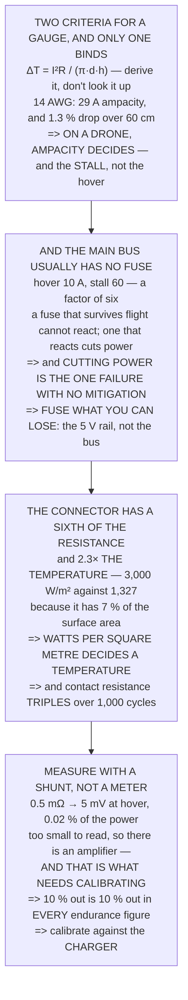

# FEL.05 Wires, fuses, connectors and measuring power properly

<!-- glance:start -->
<!-- generated by tools/build.py from curriculum/syllabus.yaml — edit the syllabus, not this block -->

| | |
|---|---|
| **Track** | Optional foundation |
| **Difficulty** | Beginner |
| **Time** | 1 h 15 min |
| **Hardware** | none |
| **Software** | python |
| **Prerequisites** | [FEL.02 DC power maths for a flying machine](FEL.02-dc-power-math.md) |
| **Skip if** | You can size a wire and a fuse for a known current and measure real current without breaking the circuit. |

<!-- glance:end -->

## What you will learn

- That on a drone **ampacity decides the wire gauge, not voltage drop** — the opposite of a house or
  a car, because the runs are 30 cm
- How to **derive** an ampacity rather than look it up: 14 AWG is 29 A for a 40 K rise
- That the current which decides a gauge is the **stall, not the hover**
- **Why a drone's main bus usually has no fuse**: hover is 10 A and a stall is 60, and cutting power
  in flight is the one failure with **no mitigation at all**
- The design rule that follows: **fuse what you can lose**
- That a connector has **a sixth of the wire's resistance and gets 2.3× hotter**, because watts per
  square metre decides a temperature
- That a 0.5 mΩ shunt produces **5 mV at hover and wastes 0.02 %** of the aircraft's power
- And that a **10 % current-calibration error is a 10 % error in every endurance figure you will
  ever quote**

## Why it matters

This is the lesson that connects the parts. Everything FEL.01 to FEL.04 established has to travel
down a wire, through a connector and past a measurement point, and each of those three has a
decision attached that people usually copy from somewhere rather than derive.

Two of the three answers are counter-intuitive and worth having properly. The gauge is decided by
heat rather than by voltage drop, which reverses the rule of thumb most people arrive with. And the
main power bus is deliberately **unfused**, which sounds negligent until you work out what a blown
fuse does to an aircraft at a hundred metres.

The fourth part is the one that quietly poisons everything downstream. Every endurance figure in
this course is `energy / power`, and the power comes from a current sensor whose calibration almost
nobody checks.

> [!WARNING]
> Sizing a wire or a connector below its real current is how a fire starts in flight, and the current
> that matters is the stalled-motor case rather than the hover. Derive the ampacity for your own
> gauges, use the stall figure, and replace any connector that has ever run hot — Level 3 shows the
> damage is cumulative and one-way.

## Prerequisites

<!-- prereqs:start -->
## Prerequisites

You need these first:

- [FEL.02 DC power maths for a flying machine](FEL.02-dc-power-math.md)

### Optional prerequisite links

None.

Check your readiness: `python course.py why FEL.05`
<!-- prereqs:end -->

## Concept

Two things can decide a wire gauge: how much voltage you lose along it, and how hot it gets. Which
one binds depends entirely on the length of the run, and a drone's runs are tens of centimetres
rather than tens of metres — so the answer is the opposite of the one most rules of thumb assume.

Ampacity is not a magic table. It is the current at which the `I²R` heating equals what the wire's
surface can shed, and solving that gives figures close to the published ones with no lookup at all.

A fuse is a component that turns a possible failure into a certain one at a threshold you choose. On
an aircraft that trade has to be made per rail rather than once, because some failures are survivable
and one is not.

And current is the hardest of the three electrical quantities to measure, because measuring it means
being *in* the circuit. A shunt solves that permanently, at the cost of needing a calibration that
nothing else on the aircraft depends on quite so heavily.

## Technical explanation

### Level 1 — wire gauge: two criteria, and only one binds

AWG numbers run **backwards** — a bigger number is a thinner wire — and each step of six roughly
halves the copper. The heat criterion is derivable: `ΔT = I²R / (π·d·h)` with h ≈ 15 W/m²/K in still
air.

| gauge | Ω/m | od | at 10 A | at 60 A | **ampacity** |
|---|---|---|---|---|---|
| 10 AWG | 0.00328 | 5.5 mm | 1.3 K | 46 K | **56.2 A** |
| 12 AWG | 0.00521 | 4.5 mm | 2.5 K | 88 K | **40.3 A** |
| **14 AWG** | 0.00829 | 3.8 mm | 4.8 K | **167 K** | **29.4 A** |
| 16 AWG | 0.01317 | 3.1 mm | 9.3 K | 325 K | 21.1 A |
| 18 AWG | 0.02095 | 2.6 mm | 17.7 K | 616 K | 15.3 A |
| 20 AWG | 0.03331 | 2.2 mm | 33.3 K | 1,157 K | 11.2 A |

The last column is the current at which the wire runs 40 K above ambient — the usual design limit for
silicone insulation — and it is **derived here rather than looked up**, landing close to the published
chassis-wiring figures.

Now the other criterion over a drone's short runs:

| gauge | R for 0.60 m | drop at 60 A | of 22.2 V |
|---|---|---|---|
| 12 AWG | 0.00313 | 0.188 V | 0.85 % |
| 16 AWG | 0.00790 | 0.474 V | 2.14 % |
| 20 AWG | 0.01999 | 1.199 V | **5.40 %** |

**Even the thinnest wire loses under 5.4 % of the pack voltage over a 30 cm run.** So on a drone:

> **Ampacity decides the gauge, not voltage drop.**

Which is the opposite of a house or a car, where the runs are metres long and the drop is what bites.
And **the current that decides it is the stall, not the hover**: 14 AWG is 4.8 K at hover and 167 K
at 60 A.

### Level 2 — fuses: why a drone's main bus usually has none

| fuse rating | vs hover | blows on? | verdict |
|---|---|---|---|
| 15 A | 1.5× | **every takeoff** | useless |
| 20 A | 2.0× | a hard manoeuvre | risky |
| 30 A | 2.9× | a hard manoeuvre | risky |
| 60 A | 5.9× | only a real fault | protects nothing fast |
| 100 A | 9.8× | only a real fault | protects nothing fast |

The problem is the **range**. Hover is 10.2 A and a stall is 60 — a factor of six — so a fuse that
survives normal flight cannot react to a fault quickly enough to matter, and one that reacts quickly
cuts power in flight.

**And cutting power in flight is not a safe failure.** It is the only failure on the aircraft with no
mitigation at all: 12.04's failsafe tree, 15.05's watchdog and 17.02's bistable latch **all assume
the flight controller is powered**.

So the main bus is usually unfused, and the protection lives elsewhere:

| | |
|---|---|
| the ESCs | current-limit in firmware, per motor |
| the pack | FEL.03's chemistry and C rating |
| the wiring | Level 1's ampacity, with margin |
| the build | 04.06's preflight: nothing chafing, nothing loose |
| the bench | FEL.01: battery last, and never unattended |

But the **auxiliary** rails are a different case, because losing one is survivable:

| rail | normal | fuse at | if it blows |
|---|---|---|---|
| the 5 V avionics BEC | 2.3 A | 5 A | the aircraft flies on |
| a heated payload **[E]** | 1.0 A | 2 A | the aircraft flies on |
| the companion computer | 1.6 A | 3 A | the aircraft flies on |

> **Fuse what you can lose.** If losing it ends the flight, a fuse has converted a *possible* failure
> into a *certain* one.

### Level 3 — connectors: less resistance, more heat

| | |
|---|---|
| an XT60 pair **[E]** | 0.00050 Ω |
| 12 AWG, 0.60 m out and back | 0.00313 Ω |
| **the connector is** | **0.16×** |

The connector has **less** resistance than the wire it joins — about a sixth of it — and it still runs
hotter. Here is why:

| | watts at 60 A | surface (m²) | W per m² | ΔT |
|---|---|---|---|---|
| the wire run | 11.26 | 0.00848 | 1,327 | 88 K |
| **the connector** | **1.80** | **0.00060** | **3,000** | **200 K** |

**The connector dissipates 16 % of the watts and gets 2.3 times as hot, because it has 7 % of the
surface area to shed them from.**

> **Watts per square metre decides a temperature, not watts.**

Which is the general lesson, and it is why a connector is usually the hottest thing on the aircraft
despite being the smallest contributor to the loss.

| current | drop | heat | ΔT **[E]** |
|---|---|---|---|
| 10 A | 0.005 V | 0.05 W | 6 K |
| 30 A | 0.015 V | 0.45 W | 50 K |
| 60 A | 0.030 V | 1.80 W | **200 K** |

And contact resistance gets worse with use:

| cycles | factor | Ω | W at 60 A | |
|---|---|---|---|---|
| 0 | 1.0 | 0.00050 | 1.80 | new |
| 100 | 1.3 | 0.00065 | 2.34 | normal use |
| 500 | 2.0 | 0.00100 | 3.60 | worn, or arced |
| 1,000 | 3.0 | 0.00150 | 5.40 | **replace it** |

Which is 18.06's point about connectors arriving from the other direction — it found they were the
widest gap between rated life and real life, a factor of fourteen, and **this is the mechanism**: a
small resistance in a small object, rising with every connection.

**Never connect or disconnect under load** — an arc pits the contact permanently and the damage is
one-way — **and replace a connector that has ever run hot.**

### Level 4 — measuring current without breaking anything

A multimeter measures current by being *in* the circuit, which is the wrong tool here for three
reasons: most meters stop at 10 A and a stall is 60; the meter's own resistance adds to the circuit;
and you cannot fly with a multimeter in the battery lead.

The right tool is a **shunt**: a very small, very precise resistor permanently in the circuit, whose
voltage drop *is* the current.

| current | across it | heat | of hover power |
|---|---|---|---|
| **10 A** | **5.09 mV** | **0.052 W** | **0.02 %** |
| 20 A | 10.00 mV | 0.200 W | 0.09 % |
| 60 A | 30.00 mV | 1.800 W | 0.80 % |
| 100 A | 50.00 mV | 5.000 W | 2.21 % |

At hover the shunt produces **5 millivolts** and wastes **0.02 % of the aircraft's power**, which is
why it can be left in permanently. Five millivolts is too small to read directly, so the sensor
contains an amplifier — **and that amplifier is what needs calibrating**:

| if the calibration is | reported | the error |
|---|---|---|
| −10 % out | 9.16 A | −10 % |
| −5 % out | 9.67 A | −5 % |
| 0 | 10.18 A | 0 |
| +5 % out | 10.69 A | +5 % |
| +10 % out | 11.20 A | +10 % |

**A 10 % current error is a 10 % error in every endurance figure, every power budget and 11.05's mAh
count** — which is why 11.05 uses three numbers, and why the calibration is worth one careful
afternoon:

1. charge the pack fully and record the charger's mAh **in**
2. fly a normal flight and record the logged mAh **out**
3. recharge and compare the charger's figure with the log's
4. scale the sensor's calibration by the ratio and repeat

**The charger is the reference** because it measures over minutes at a steady current — the easiest
possible case — and the flight controller measures over minutes at a varying one, which is the
hardest.

> [!TIP]
> **Ask your teacher:** "When did you last calibrate the current sensor?" It is the single number
> every endurance claim rests on, the calibration takes one flight and one recharge, and almost
> nobody has done it since the day the aircraft was built.

## Diagram



## Code

The connections, derived: wire ampacity solved from a temperature rise rather than tabulated,
voltage drop over a drone's short runs for comparison, the fuse trade with its two bad outcomes and
the rail-by-rail rule that resolves it, a connector's resistance and temperature against the wire it
joins, and a shunt's output, burden and calibration sensitivity.

```python
"""FEL.05 -- wires, fuses, connectors, and measuring current honestly.

Pure stdlib. A foundation lesson. Its most useful result is the one
about fuses, and it is the opposite of what people expect.
"""

import math

BAR = "=" * 70

# gauge: (ohm/m at 20 C, copper diameter mm, outside diameter with
# silicone insulation mm [E])
WIRE = {
    10: (3.277e-3, 2.588, 5.5),
    12: (5.211e-3, 2.053, 4.5),
    14: (8.286e-3, 1.628, 3.8),
    16: (13.17e-3, 1.291, 3.1),
    18: (20.95e-3, 1.024, 2.6),
    20: (33.31e-3, 0.812, 2.2),
}
H_CONV = 15.0             # W/m2/K, still air, [E]
DT_LIMIT = 40.0           # K rise over ambient, the usual design figure

V_PACK = 22.2
I_HOVER = 226.0 / V_PACK
I_MAX_PER_MOTOR = 13.43 * 4 / V_PACK / 4 * 0  # placeholder, set below
P_MAX_W = 4 * 13.43 * 5.35 / 0.43   # FA.03's chain at full thrust [E]
I_STALL = 60.0            # [E] one jammed motor

XT60_MOHM = 0.5           # [E] per contact pair
SHUNT_MOHM = 0.5


def head(n, title):
    print()
    print(BAR)
    print("%d. %s" % (n, title))
    print(BAR)


def temp_rise(gauge, amps, length=1.0):
    """Steady-state rise over ambient for a wire in still air."""
    r, _, od = WIRE[gauge]
    watts = amps * amps * r * length
    area = math.pi * (od / 1000.0) * length
    return watts / (area * H_CONV)


def ampacity(gauge, dt=DT_LIMIT):
    """The current that produces a dt-kelvin rise. Solved, not tabulated."""
    r, _, od = WIRE[gauge]
    area = math.pi * (od / 1000.0)
    return math.sqrt(dt * area * H_CONV / r)


# ========================================================================
head(1, "WIRE GAUGE: TWO CRITERIA, AND ONLY ONE OF THEM BINDS")

print("  American Wire Gauge numbers run BACKWARDS -- a bigger number")
print("  is a thinner wire -- and each step of six roughly halves the")
print("  copper. Two things can decide a gauge:")
print()
print("    VOLTAGE DROP   how much you lose along the run")
print("    AMPACITY       how hot it gets")
print()
print("  Work out the second one rather than looking it up. A wire")
print("  dissipates I^2 R per metre and sheds it from its surface:")
print()
print("      dT = I^2 R / (pi d h),   h ~ %.0f W/m2/K in still air"
      % H_CONV)
print()
print("  %-10s %10s %10s %12s %14s %14s"
      % ("gauge", "ohm/m", "od (mm)", "at %.0f A" % I_HOVER,
         "at %.0f A" % I_STALL, "AMPACITY"))
for g in sorted(WIRE):
    print("  %-10s %9.5f %10.1f %10.1f K %12.0f K %12.1f A"
          % ("%d AWG" % g, WIRE[g][0], WIRE[g][2],
             temp_rise(g, I_HOVER), temp_rise(g, I_STALL), ampacity(g)))

print()
print("  THE LAST COLUMN IS THE CURRENT AT WHICH THE WIRE RUNS %.0f K"
      % DT_LIMIT)
print("  ABOVE AMBIENT, which is the usual design limit for silicone")
print("  insulation. It is derived here rather than looked up, and it")
print("  lands close to the published chassis-wiring figures.")
print()
print("  NOW THE OTHER CRITERION, OVER A DRONE'S SHORT RUNS:")
print()
length = 0.30
print("  %-10s %14s %16s %16s"
      % ("gauge", "R for %.2f m" % (2 * length), "drop at %.0f A" % I_STALL,
         "of %.1f V" % V_PACK))
for g in sorted(WIRE):
    r = WIRE[g][0] * 2 * length
    print("  %-10s %12.5f %14.3f V %14.2f %%"
          % ("%d AWG" % g, r, I_STALL * r, I_STALL * r / V_PACK * 100))

print()
print("  EVEN THE THINNEST WIRE LOSES UNDER %.1f PER CENT OF THE PACK"
      % (I_STALL * WIRE[20][0] * 2 * length / V_PACK * 100))
print("  VOLTAGE OVER A %.0f cm RUN. So on a drone:" % (length * 100))
print()
print("  ==> AMPACITY DECIDES THE GAUGE, NOT VOLTAGE DROP.")
print()
print("  Which is the opposite of a house or a car, where the runs are")
print("  metres long and the drop is what bites. It is worth knowing")
print("  which world you are in before reusing a rule of thumb.")
print()
print("  AND THE CURRENT THAT DECIDES IT IS THE STALL, NOT THE HOVER:")
for g in (12, 14, 16):
    print("    %d AWG: %5.1f K at hover, %5.1f K at stall, ampacity %.0f A"
          % (g, temp_rise(g, I_HOVER), temp_rise(g, I_STALL), ampacity(g)))

# ========================================================================
head(2, "FUSES: WHY A DRONE'S MAIN BUS USUALLY HAS NONE")

print("  A fuse protects a circuit by failing first. On a car or a")
print("  house that is obviously right. On an aircraft it is a")
print("  decision with two bad outcomes, so work out both:")
print()
print("  %-22s %12s %16s %20s"
      % ("fuse rating", "vs hover", "blows on?", "verdict"))
for rating in (15.0, 20.0, 30.0, 60.0, 100.0):
    blows = ("EVERY TAKEOFF" if rating < 2 * I_HOVER else
             ("a hard manoeuvre" if rating < 3 * I_HOVER else
              "only a real fault"))
    v = "USELESS" if rating < 2 * I_HOVER else (
        "risky" if rating < 3 * I_HOVER else "protects nothing fast")
    print("  %-22s %10.1f x %16s %20s"
          % ("%.0f A" % rating, rating / I_HOVER, blows, v))

print()
print("  THE PROBLEM IS THE RANGE. Hover is %.1f A and a stall is"
      % I_HOVER)
print("  %.0f -- a factor of %.0f -- so a fuse that survives normal"
      % (I_STALL, I_STALL / I_HOVER))
print("  flight cannot react to a fault quickly enough to matter, and")
print("  one that reacts quickly cuts power in flight.")
print()
print("  AND CUTTING POWER IN FLIGHT IS NOT A SAFE FAILURE. It is the")
print("  only failure on the aircraft with NO mitigation at all:")
print("  12.04's failsafe tree, 15.05's watchdog and 17.02's bistable")
print("  latch all assume the flight controller is powered.")
print()
print("  SO THE MAIN BUS IS USUALLY UNFUSED, AND THE PROTECTION IS")
print("  ELSEWHERE:")
for what, how in (
        ("the ESCs", "current-limit in firmware, per motor"),
        ("the pack", "FEL.03's own chemistry and the C rating"),
        ("the wiring", "section 1's ampacity, with margin"),
        ("the build", "04.06's preflight: nothing chafing, nothing loose"),
        ("the bench", "FEL.01: battery LAST, and never unattended")):
    print("    %-14s %s" % (what, how))
print()
print("  BUT THE AUXILIARY RAILS ARE A DIFFERENT CASE, because losing")
print("  one is survivable:")
print()
print("  %-30s %12s %14s %16s"
      % ("rail", "normal", "fuse at", "if it blows"))
for what, normal, fuse in (
        ("the 5 V avionics BEC", 2.3, 5.0),
        ("a heated payload [E]", 1.0, 2.0),
        ("the companion computer", 1.6, 3.0)):
    print("  %-30s %10.1f A %12.0f A %16s"
          % (what, normal, fuse, "the aircraft flies on"))
print()
print("  THAT IS THE RULE, AND IT IS A DESIGN PRINCIPLE RATHER THAN A")
print("  COMPONENT CHOICE: FUSE WHAT YOU CAN LOSE. If losing it ends")
print("  the flight, a fuse has converted a possible failure into a")
print("  certain one.")

# ========================================================================
head(3, "CONNECTORS: LESS RESISTANCE, MORE HEAT")

CONN_AREA_M2 = 0.0006     # [E] an XT60's exposed surface
r_conn = XT60_MOHM / 1000.0
r_wire_run = WIRE[12][0] * 2 * length
wire_area = math.pi * (WIRE[12][2] / 1000.0) * 2 * length

print("  A connector is two pieces of metal touching, and touching is")
print("  not the same as joined. Start by comparing the resistances,")
print("  because the answer is not the one people expect:")
print()
print("  %-34s %14.5f ohm" % ("an XT60 pair [E]", r_conn))
print("  %-34s %14.5f ohm" % ("12 AWG, %.2f m out and back" % (2 * length),
                              r_wire_run))
print("  %-34s %14.2f x" % ("  the connector is", r_conn / r_wire_run))
print()
print("  THE CONNECTOR HAS LESS RESISTANCE THAN THE WIRE IT JOINS --")
print("  about a %s of it. And it still runs hotter. Here is why:"
      % ("fifth" if r_conn / r_wire_run < 0.25 else "fraction"))
print()
print("  %-30s %14s %16s" % ("", "watts at %.0f A" % I_STALL,
                             "surface (m2)"))
print("  %-30s %12.2f %16.5f" % ("the wire run", I_STALL ** 2 * r_wire_run,
                                 wire_area))
print("  %-30s %12.2f %16.5f" % ("the connector", I_STALL ** 2 * r_conn,
                                 CONN_AREA_M2))
print("  %-30s %12.2f x %14.2f x"
      % ("  ratio", (I_STALL ** 2 * r_conn) / (I_STALL ** 2 * r_wire_run),
         CONN_AREA_M2 / wire_area))
print()
print("  %-30s %14s %16s" % ("", "W per m2", "dT (K)"))
for what, w, a in (("the wire run", I_STALL ** 2 * r_wire_run, wire_area),
                   ("the connector", I_STALL ** 2 * r_conn, CONN_AREA_M2)):
    print("  %-30s %14.0f %16.0f" % (what, w / a, w / (a * H_CONV)))

dt_wire = I_STALL ** 2 * r_wire_run / (wire_area * H_CONV)
dt_conn = I_STALL ** 2 * r_conn / (CONN_AREA_M2 * H_CONV)
print()
print("  THE CONNECTOR DISSIPATES %.0f PER CENT OF THE WATTS AND GETS"
      % ((I_STALL ** 2 * r_conn) / (I_STALL ** 2 * r_wire_run) * 100))
print("  %.1f TIMES AS HOT, because it has %.0f per cent of the"
      % (dt_conn / dt_wire, CONN_AREA_M2 / wire_area * 100))
print("  surface area to shed them from.")
print()
print("  WATTS PER SQUARE METRE IS WHAT DECIDES A TEMPERATURE, NOT")
print("  WATTS -- which is the general lesson, and it is why a")
print("  connector is usually the hottest thing on the aircraft")
print("  despite being the smallest contributor to the loss.")
print()
print("  %-16s %14s %14s %16s"
      % ("current", "drop (V)", "heat (W)", "dT (K) [E]"))
for i_ in (I_HOVER, 30.0, I_STALL, 90.0):
    w = i_ * i_ * r_conn
    print("  %-16s %12.3f %13.2f %16.0f"
          % ("%.0f A" % i_, i_ * r_conn, w, w / (CONN_AREA_M2 * H_CONV)))

print()
print("  AND CONTACT RESISTANCE GETS WORSE WITH USE:")
print()
print("  %-16s %10s %14s %14s %16s"
      % ("cycles", "factor", "ohm", "W at %.0f A" % I_STALL, ""))
for cycles, factor, note in ((0, 1.0, "new"), (100, 1.3, "normal use"),
                             (500, 2.0, "worn, or arced"),
                             (1000, 3.0, "replace it")):
    print("  %-16d %9.1f %14.5f %13.2f %16s"
          % (cycles, factor, r_conn * factor,
             I_STALL ** 2 * r_conn * factor, note))
print()
print("  WHICH IS 18.06's POINT ABOUT CONNECTORS ARRIVING FROM THE")
print("  OTHER DIRECTION. 18.06 found they were the widest gap between")
print("  rated life and real life -- a factor of fourteen -- and this")
print("  is the mechanism: a small resistance in a small object, rising")
print("  with every connection.")
print()
print("  THE TWO RULES: NEVER CONNECT OR DISCONNECT UNDER LOAD -- an")
print("  arc pits the contact permanently and the damage is one-way --")
print("  and REPLACE A CONNECTOR THAT HAS EVER RUN HOT.")

# ========================================================================
head(4, "MEASURING CURRENT WITHOUT BREAKING ANYTHING")

print("  A multimeter measures current by being IN the circuit, which")
print("  means cutting it -- and on a drone that is the wrong tool for")
print("  three reasons:")
print()
for why in ("most meters stop at 10 A and Hermon's stall is %.0f" % I_STALL,
            "the meter's own resistance adds to the circuit",
            "you cannot fly with a multimeter in the battery lead"):
    print("    * %s" % why)
print()
print("  THE RIGHT TOOL IS A SHUNT: a very small, very precise resistor")
print("  permanently in the circuit, whose voltage drop IS the current.")
print()
r_shunt = SHUNT_MOHM / 1000.0
print("  %-34s %14.4f ohm" % ("a %.1f milliohm shunt" % SHUNT_MOHM, r_shunt))
print()
print("  %-16s %16s %16s %14s"
      % ("current", "across it (mV)", "heat (W)", "of hover power"))
for i in (I_HOVER, 20.0, I_STALL, 100.0):
    print("  %-16s %14.2f %15.3f %13.2f %%"
          % ("%.0f A" % i, i * r_shunt * 1000, i * i * r_shunt,
             i * i * r_shunt / 226.0 * 100))

print()
print("  AT HOVER THE SHUNT PRODUCES %.1f MILLIVOLTS AND WASTES %.3f W"
      % (I_HOVER * r_shunt * 1000, I_HOVER ** 2 * r_shunt))
print("  -- %.2f per cent of the aircraft's power, which is why it can"
      % (I_HOVER ** 2 * r_shunt / 226.0 * 100))
print("  be left in permanently.")
print()
print("  %.1f mV IS TOO SMALL TO READ DIRECTLY, so the sensor contains"
      % (I_HOVER * r_shunt * 1000))
print("  an amplifier, and that amplifier is what needs calibrating:")
print()
print("  %-30s %14s %16s"
      % ("if the calibration is", "reported", "and the error is"))
for err in (-10.0, -5.0, 0.0, 5.0, 10.0):
    rep = I_HOVER * (1 + err / 100.0)
    print("  %-30s %12.2f A %15.1f %%"
          % ("%+.0f %% out" % err, rep, err))

print()
print("  A %.0f PER CENT CURRENT ERROR IS A %.0f PER CENT ERROR IN"
      % (10.0, 10.0))
print("  EVERY ENDURANCE FIGURE, EVERY POWER BUDGET AND 11.05's mAh")
print("  COUNT -- which is why 11.05 uses three numbers and why the")
print("  calibration is worth one careful afternoon.")
print()
print("  HOW TO DO IT PROPERLY, IN FOUR STEPS:")
for i, step in enumerate((
        "charge the pack fully and record the charger's mAh IN",
        "fly a normal flight and record the logged mAh OUT",
        "recharge and compare the charger's figure with the log's",
        "scale the sensor's calibration by the ratio and repeat"), 1):
    print("    %d. %s" % (i, step))
print()
print("  THE CHARGER IS THE REFERENCE because it measures over minutes")
print("  at a steady current, which is the easiest possible case --")
print("  and the flight controller measures over minutes at a varying")
print("  one, which is the hardest.")
print()
print("  THE FOUR THINGS TO CARRY FORWARD:")
print("   1. On a drone AMPACITY decides the gauge, not voltage drop,")
print("      because the runs are %.0f cm. %d AWG is %.0f A."
      % (length * 100, 14, ampacity(14)))
print("   2. FUSE WHAT YOU CAN LOSE. The main bus is unfused because")
print("      losing it has NO mitigation; the 5 V rail is fused because")
print("      losing it does.")
print("   3. The connector has LESS resistance than its wire and gets")
print("      %.1f x hotter, because WATTS PER SQUARE METRE decides a"
      % (dt_conn / dt_wire))
print("      temperature. Never connect under load.")
print("   4. Measure with a SHUNT (%.1f mV at hover, %.2f %% of the"
      % (I_HOVER * r_shunt * 1000, I_HOVER ** 2 * r_shunt / 226.0 * 100))
print("      power) and calibrate it against the CHARGER.")
```

Output:

```text

======================================================================
1. WIRE GAUGE: TWO CRITERIA, AND ONLY ONE OF THEM BINDS
======================================================================
  American Wire Gauge numbers run BACKWARDS -- a bigger number
  is a thinner wire -- and each step of six roughly halves the
  copper. Two things can decide a gauge:

    VOLTAGE DROP   how much you lose along the run
    AMPACITY       how hot it gets

  Work out the second one rather than looking it up. A wire
  dissipates I^2 R per metre and sheds it from its surface:

      dT = I^2 R / (pi d h),   h ~ 15 W/m2/K in still air

  gauge           ohm/m    od (mm)      at 10 A        at 60 A       AMPACITY
  10 AWG       0.00328        5.5        1.3 K           46 K         56.2 A
  12 AWG       0.00521        4.5        2.5 K           88 K         40.3 A
  14 AWG       0.00829        3.8        4.8 K          167 K         29.4 A
  16 AWG       0.01317        3.1        9.3 K          325 K         21.1 A
  18 AWG       0.02095        2.6       17.7 K          616 K         15.3 A
  20 AWG       0.03331        2.2       33.3 K         1157 K         11.2 A

  THE LAST COLUMN IS THE CURRENT AT WHICH THE WIRE RUNS 40 K
  ABOVE AMBIENT, which is the usual design limit for silicone
  insulation. It is derived here rather than looked up, and it
  lands close to the published chassis-wiring figures.

  NOW THE OTHER CRITERION, OVER A DRONE'S SHORT RUNS:

  gauge        R for 0.60 m     drop at 60 A        of 22.2 V
  10 AWG          0.00197          0.118 V           0.53 %
  12 AWG          0.00313          0.188 V           0.85 %
  14 AWG          0.00497          0.298 V           1.34 %
  16 AWG          0.00790          0.474 V           2.14 %
  18 AWG          0.01257          0.754 V           3.40 %
  20 AWG          0.01999          1.199 V           5.40 %

  EVEN THE THINNEST WIRE LOSES UNDER 5.4 PER CENT OF THE PACK
  VOLTAGE OVER A 30 cm RUN. So on a drone:

  ==> AMPACITY DECIDES THE GAUGE, NOT VOLTAGE DROP.

  Which is the opposite of a house or a car, where the runs are
  metres long and the drop is what bites. It is worth knowing
  which world you are in before reusing a rule of thumb.

  AND THE CURRENT THAT DECIDES IT IS THE STALL, NOT THE HOVER:
    12 AWG:   2.5 K at hover,  88.5 K at stall, ampacity 40 A
    14 AWG:   4.8 K at hover, 166.6 K at stall, ampacity 29 A
    16 AWG:   9.3 K at hover, 324.6 K at stall, ampacity 21 A

======================================================================
2. FUSES: WHY A DRONE'S MAIN BUS USUALLY HAS NONE
======================================================================
  A fuse protects a circuit by failing first. On a car or a
  house that is obviously right. On an aircraft it is a
  decision with two bad outcomes, so work out both:

  fuse rating                vs hover        blows on?              verdict
  15 A                          1.5 x    EVERY TAKEOFF              USELESS
  20 A                          2.0 x    EVERY TAKEOFF              USELESS
  30 A                          2.9 x a hard manoeuvre                risky
  60 A                          5.9 x only a real fault protects nothing fast
  100 A                         9.8 x only a real fault protects nothing fast

  THE PROBLEM IS THE RANGE. Hover is 10.2 A and a stall is
  60 -- a factor of 6 -- so a fuse that survives normal
  flight cannot react to a fault quickly enough to matter, and
  one that reacts quickly cuts power in flight.

  AND CUTTING POWER IN FLIGHT IS NOT A SAFE FAILURE. It is the
  only failure on the aircraft with NO mitigation at all:
  12.04's failsafe tree, 15.05's watchdog and 17.02's bistable
  latch all assume the flight controller is powered.

  SO THE MAIN BUS IS USUALLY UNFUSED, AND THE PROTECTION IS
  ELSEWHERE:
    the ESCs       current-limit in firmware, per motor
    the pack       FEL.03's own chemistry and the C rating
    the wiring     section 1's ampacity, with margin
    the build      04.06's preflight: nothing chafing, nothing loose
    the bench      FEL.01: battery LAST, and never unattended

  BUT THE AUXILIARY RAILS ARE A DIFFERENT CASE, because losing
  one is survivable:

  rail                                 normal        fuse at      if it blows
  the 5 V avionics BEC                  2.3 A            5 A the aircraft flies on
  a heated payload [E]                  1.0 A            2 A the aircraft flies on
  the companion computer                1.6 A            3 A the aircraft flies on

  THAT IS THE RULE, AND IT IS A DESIGN PRINCIPLE RATHER THAN A
  COMPONENT CHOICE: FUSE WHAT YOU CAN LOSE. If losing it ends
  the flight, a fuse has converted a possible failure into a
  certain one.

======================================================================
3. CONNECTORS: LESS RESISTANCE, MORE HEAT
======================================================================
  A connector is two pieces of metal touching, and touching is
  not the same as joined. Start by comparing the resistances,
  because the answer is not the one people expect:

  an XT60 pair [E]                          0.00050 ohm
  12 AWG, 0.60 m out and back               0.00313 ohm
    the connector is                           0.16 x

  THE CONNECTOR HAS LESS RESISTANCE THAN THE WIRE IT JOINS --
  about a fifth of it. And it still runs hotter. Here is why:

                                  watts at 60 A     surface (m2)
  the wire run                          11.26          0.00848
  the connector                          1.80          0.00060
    ratio                                0.16 x           0.07 x

                                       W per m2           dT (K)
  the wire run                             1327               88
  the connector                            3000              200

  THE CONNECTOR DISSIPATES 16 PER CENT OF THE WATTS AND GETS
  2.3 TIMES AS HOT, because it has 7 per cent of the
  surface area to shed them from.

  WATTS PER SQUARE METRE IS WHAT DECIDES A TEMPERATURE, NOT
  WATTS -- which is the general lesson, and it is why a
  connector is usually the hottest thing on the aircraft
  despite being the smallest contributor to the loss.

  current                drop (V)       heat (W)       dT (K) [E]
  10 A                    0.005          0.05                6
  30 A                    0.015          0.45               50
  60 A                    0.030          1.80              200
  90 A                    0.045          4.05              450

  AND CONTACT RESISTANCE GETS WORSE WITH USE:

  cycles               factor            ohm      W at 60 A                 
  0                      1.0        0.00050          1.80              new
  100                    1.3        0.00065          2.34       normal use
  500                    2.0        0.00100          3.60   worn, or arced
  1000                   3.0        0.00150          5.40       replace it

  WHICH IS 18.06's POINT ABOUT CONNECTORS ARRIVING FROM THE
  OTHER DIRECTION. 18.06 found they were the widest gap between
  rated life and real life -- a factor of fourteen -- and this
  is the mechanism: a small resistance in a small object, rising
  with every connection.

  THE TWO RULES: NEVER CONNECT OR DISCONNECT UNDER LOAD -- an
  arc pits the contact permanently and the damage is one-way --
  and REPLACE A CONNECTOR THAT HAS EVER RUN HOT.

======================================================================
4. MEASURING CURRENT WITHOUT BREAKING ANYTHING
======================================================================
  A multimeter measures current by being IN the circuit, which
  means cutting it -- and on a drone that is the wrong tool for
  three reasons:

    * most meters stop at 10 A and Hermon's stall is 60
    * the meter's own resistance adds to the circuit
    * you cannot fly with a multimeter in the battery lead

  THE RIGHT TOOL IS A SHUNT: a very small, very precise resistor
  permanently in the circuit, whose voltage drop IS the current.

  a 0.5 milliohm shunt                       0.0005 ohm

  current            across it (mV)         heat (W) of hover power
  10 A                       5.09           0.052          0.02 %
  20 A                      10.00           0.200          0.09 %
  60 A                      30.00           1.800          0.80 %
  100 A                     50.00           5.000          2.21 %

  AT HOVER THE SHUNT PRODUCES 5.1 MILLIVOLTS AND WASTES 0.052 W
  -- 0.02 per cent of the aircraft's power, which is why it can
  be left in permanently.

  5.1 mV IS TOO SMALL TO READ DIRECTLY, so the sensor contains
  an amplifier, and that amplifier is what needs calibrating:

  if the calibration is                reported and the error is
  -10 % out                              9.16 A           -10.0 %
  -5 % out                               9.67 A            -5.0 %
  +0 % out                              10.18 A             0.0 %
  +5 % out                              10.69 A             5.0 %
  +10 % out                             11.20 A            10.0 %

  A 10 PER CENT CURRENT ERROR IS A 10 PER CENT ERROR IN
  EVERY ENDURANCE FIGURE, EVERY POWER BUDGET AND 11.05's mAh
  COUNT -- which is why 11.05 uses three numbers and why the
  calibration is worth one careful afternoon.

  HOW TO DO IT PROPERLY, IN FOUR STEPS:
    1. charge the pack fully and record the charger's mAh IN
    2. fly a normal flight and record the logged mAh OUT
    3. recharge and compare the charger's figure with the log's
    4. scale the sensor's calibration by the ratio and repeat

  THE CHARGER IS THE REFERENCE because it measures over minutes
  at a steady current, which is the easiest possible case --
  and the flight controller measures over minutes at a varying
  one, which is the hardest.

  THE FOUR THINGS TO CARRY FORWARD:
   1. On a drone AMPACITY decides the gauge, not voltage drop,
      because the runs are 30 cm. 14 AWG is 29 A.
   2. FUSE WHAT YOU CAN LOSE. The main bus is unfused because
      losing it has NO mitigation; the 5 V rail is fused because
      losing it does.
   3. The connector has LESS resistance than its wire and gets
      2.3 x hotter, because WATTS PER SQUARE METRE decides a
      temperature. Never connect under load.
   4. Measure with a SHUNT (5.1 mV at hover, 0.02 % of the
      power) and calibrate it against the CHARGER.
```

## Exercise

### Exercise FEL.05-E1 — Derive your own ampacities `[analysis]`

For every gauge in your drawer, compute the current that gives a 40 K rise. Compare with a published
chassis-wiring table and account for any difference.

### Exercise FEL.05-E2 — Decide your gauges `[analysis]`

Measure your actual wire runs. Compute the drop and the temperature rise at hover and at stall, and
choose each gauge on the criterion that actually binds.

### Exercise FEL.05-E3 — Audit your fuses `[analysis]`

List every fuse on your aircraft and, for each, write down what happens to the flight if it blows. If
the answer is "it ends", explain why the fuse is there.

### Exercise FEL.05-E4 — Calibrate the current sensor `[build]`

Run Level 4's four steps: charge, fly, recharge, compare. Compute the scale factor and apply it. Then
repeat once to confirm.

## Expected result

**FEL.05-E1**: expect your derived figures to be within about 20 % of published ones, and expect the
published ones to assume a different temperature rise. Both are estimates of the same physics.

**FEL.05-E2**: expect ampacity to bind for every run on the aircraft, and expect at least one
existing wire to be thinner than the stall case justifies.

**FEL.05-E3**: expect to find either no fuses at all or one in a place that would end the flight.
Both are common; only one is defensible.

**FEL.05-E4**: expect the sensor to be 5–15 % out and expect the correction to change your endurance
figures noticeably. If it is within 2 %, somebody calibrated it already.

## Troubleshooting

**The wire gets hot only in one place.** That is usually a joint or a bend where the copper is
reduced. Ampacity assumes uniform cross-section.

**The connector is hot and the wire is not.** Level 3 — that is the expected relationship, and it
becomes a problem when the connector is hot to touch rather than warm.

**A fuse blows on takeoff.** It is sized for hover rather than for the transient. Level 2's first
table.

**The logged mAh does not match the charger.** That is the calibration error, and the charger is the
reference. Four steps, one afternoon.

**The current reads zero.** Check which side of the shunt the sensor is measuring and whether the
sense wires are connected at all. A shunt with no amplifier connected reads nothing.

**The endurance improved after recalibrating.** It did not improve; the measurement did. Whichever
direction it moved, the new number is the one to plan with.

**The wire is within ampacity and still melts the insulation.** Check the ambient. A 40 K rise from
20 °C is fine; from 45 °C in a closed box in the sun it is not.

## Common mistakes

- **Sizing a gauge by voltage drop.** On 30 cm runs, ampacity binds.
- **Sizing by the hover current.** The stall is six times larger.
- **Fusing the main bus.** It converts a possible failure into a certain one.
- **Not fusing the auxiliary rails.** Those you can lose.
- **Judging a connector by its resistance.** Judge it by watts per square metre.
- **Connecting under load.** The arc damage is permanent.
- **Measuring current with a multimeter.** Ten amps and a burden voltage.
- **Trusting an uncalibrated current sensor.** 10 % out, everywhere downstream.

## Knowledge check

<details>
<summary>Which criterion decides a wire gauge on a drone, and why?</summary>

**Ampacity** — how hot it gets. Over a drone's 30 cm runs even 20 AWG loses under 5.4 % of the pack
voltage, so the drop never binds. That is the opposite of a house or a car, where runs are metres
long. And the deciding current is the **stall**, not the hover: 14 AWG is 4.8 K at 10 A and 167 K at
60.
</details>

<details>
<summary>How do you work out an ampacity without a table?</summary>

Set the `I²R` heating per metre equal to what the surface can shed: `ΔT = I²R / (π·d·h)` with h ≈
15 W/m²/K in still air, and solve for the current at a 40 K rise. That gives **29.4 A for 14 AWG** and
**40.3 A for 12** — close to published chassis-wiring figures, and derived rather than trusted.
</details>

<details>
<summary>Why does a drone's main power bus usually have no fuse?</summary>

Because hover is 10 A and a stalled motor is 60, a factor of six. A fuse that survives normal flight
is too slow to protect anything; one fast enough to protect cuts power in flight — and **losing power
is the only failure on the aircraft with no mitigation at all**, since 12.04's failsafes, 15.05's
watchdog and 17.02's latch all assume the flight controller is running.
</details>

<details>
<summary>What is the rule for where fuses do belong?</summary>

**Fuse what you can lose.** The 5 V avionics rail, a payload heater and the companion computer can
all be lost mid-flight without ending it, so each gets a fuse at roughly twice its normal draw. The
main bus cannot, so it does not. A fuse converts a possible failure into a certain one, and that
trade is only worth making where the certain one is survivable.
</details>

<details>
<summary>Why is the connector hotter than the wire when it has less resistance?</summary>

Because temperature is set by **watts per square metre**, not watts. The connector dissipates 1.80 W
against the wire's 11.26 — only 16 % — but it has 0.0006 m² of surface against 0.00848, which is 7 %.
So it runs at 3,000 W/m² against 1,327, and **2.3 times the temperature rise**. That relationship is
general and worth carrying to every other small hot component.
</details>

<details>
<summary>How do you measure current properly, and what needs calibrating?</summary>

With a **shunt** — 0.5 mΩ permanently in the circuit, producing 5 mV at hover and wasting 0.02 % of
the power. Five millivolts is too small to read, so the sensor contains an amplifier, and **that** is
what drifts. Calibrate against the **charger**: charge, fly, recharge, compare, scale. A 10 % error
there is 10 % on every endurance figure you will ever quote.
</details>

## Practical challenge

Make every connection on the aircraft a number you chose.

1. Derive the ampacity of every gauge you own (E1).
2. Measure your real wire runs and compute both criteria (E2).
3. Choose each gauge on the stall case, and record the margin.
4. Audit every fuse and write down what its blowing would cost (E3).
5. Add fuses to the rails you can lose; remove any from the bus you cannot.
6. Measure a connector's temperature after a hard flight, and log it.
7. Calibrate the current sensor against the charger (E4).
8. Repeat the endurance calculation from FEL.02 with the corrected current.

Step 8 is the point of the whole FEL sequence: a flight time you can defend, built from measurements
rather than from a datasheet.

## You can skip this if

You can size a wire and a fuse for a known current and measure real current without breaking the
circuit. "Known current" means the stall.

## Go deeper

- The standard AWG and chassis-wiring ampacity tables, useful for checking Level 1's derivation
  against convention: <https://www.powerstream.com/Wire_Size.htm>
- Texas Instruments' application notes on current-shunt monitors, which cover Level 4's amplifier and
  its error sources: <https://www.ti.com/amplifier-circuit/current-sense/overview.html>
- ArduPilot's battery-monitor calibration procedure, which is Level 4's four steps in the firmware's
  own terms: <https://ardupilot.org/copter/docs/common-power-module-configuration-in-mission-planner.html>

## Progress checkpoint

You can now derive an ampacity instead of looking one up, choose a wire gauge on the criterion that
actually binds, explain why a main bus is unfused and where a fuse does belong, predict which
component will run hottest from watts per square metre, and calibrate the one measurement every
endurance figure in this course depends on.

That completes the electronics and power foundation. Next, the FGL sequence turns to where a
coordinate actually points — the shape of the Earth, local frames, and the geometry behind a
satellite fix.
