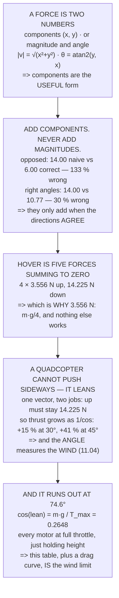

# FA.01 Vectors and forces from zero

<!-- glance:start -->
<!-- generated by tools/build.py from curriculum/syllabus.yaml — edit the syllabus, not this block -->

| | |
|---|---|
| **Track** | Optional foundation |
| **Difficulty** | Beginner |
| **Time** | 1 h |
| **Hardware** | none |
| **Software** | python |
| **Prerequisites** | none |
| **Skip if** | You can add two force vectors (components and magnitude) without a calculator. |

<!-- glance:end -->

## What you will learn

- That a force is **two numbers, not one**, and the two ways of writing it down
- That **components always add and magnitudes almost never do** — a naive sum is 133 % wrong for
  opposed forces and 30 % wrong for perpendicular ones
- Why Hermon's hover thrust is **3.556 N per motor** and not any other number
- That a quadcopter cannot push sideways, so **it leans** — and a lean is one vector doing two jobs
- That leaning costs thrust as **1/cos**: 15 % more at 30°, 41 % at 45°
- That the lean angle is a **measurement of the wind**, which is how 11.04 works without an
  anemometer
- And that Hermon's **maximum lean is 74.6°**, where every motor is at full throttle just to hold
  height

## Why it matters

Almost everything in the main path is a vector argument wearing different clothes. Thrust and weight
in 02.06, the lean angle in 11.04, the moment arm in 07.02, the wind triangle in 12.02, the release
lead in 17.05 — all of them are "two quantities with directions, added properly". If that operation
is comfortable, those lessons read as arithmetic. If it is not, they read as magic.

The good news is that the whole subject is two rules and one trap. Add components. Convert back at
the end. And never, ever add magnitudes without checking the directions first — which is the mistake
that produces confidently wrong answers rather than obviously wrong ones.

This lesson ends on numbers the main path uses constantly, so when 11.04 says the wind limit is
eight metres per second, you will recognise where that came from.

## Prerequisites

<!-- prereqs:start -->
## Prerequisites

None — you can start here.

### Optional prerequisite links

None.

Check your readiness: `python course.py why FA.01`
<!-- prereqs:end -->

## Concept

Some quantities are just a number: a mass, a temperature, a voltage. Nobody asks which way they
point. Others are meaningless without a direction — a force of fourteen newtons does not tell you
whether the aircraft goes up or sideways. Those are **vectors**.

A vector can be written two ways and they say the same thing. As **components** — how far it goes
along each axis — or as a **magnitude and an angle**. Converting between them is Pythagoras and a
little trigonometry, and which form you choose decides whether the next step is easy or fiddly.

Adding is where the two forms stop being equivalent in practice. Components add, always, with no
exceptions and no thinking. Magnitudes add only in the one case where both vectors point the same
way, which is rare and easy to assume without checking.

And the physical idea that everything else rests on: an object that is not accelerating has forces
that **sum to zero**. Hovering is not the absence of forces, it is five forces arranged so their
components cancel.

## Technical explanation

### Level 1 — a vector is a number with a direction attached

| | as components | as magnitude + angle |
|---|---|---|
| straight up, 14.2 N | (0.00, 14.23) | 14.23 N at 90.0° |
| straight right, 5 N | (5.00, 0.00) | 5.00 N at 0.0° |
| up and right | (5.00, 14.23) | 15.08 N at 70.6° |
| down and left | (−3.00, −4.00) | 5.00 N at −126.9° |

```
magnitude = √(x² + y²)
angle     = atan2(y, x)
x = magnitude·cos(angle),  y = magnitude·sin(angle)
```

**Components are the useful form and magnitude is the human form.** Everything in this lesson is
easy in components and fiddly in magnitudes, and that is the most useful sentence in it.

(A note on `atan2`: it takes *two* arguments, x and y separately, rather than the ratio. That is not
fussiness — `atan(y/x)` cannot tell "up and right" from "down and left", because both give the same
ratio. Every language has `atan2` and it is always the one you want.)

### Level 2 — adding: components always work, magnitudes never do

| | A | B | A + B | \|A+B\| |
|---|---|---|---|---|
| same direction | (0.0, 10.0) | (0.0, 4.0) | (0.00, 14.00) | 14.00 |
| opposite | (0.0, 10.0) | (0.0, −4.0) | (0.00, 6.00) | 6.00 |
| at right angles | (10.0, 0.0) | (0.0, 4.0) | (10.00, 4.00) | 10.77 |
| at some angle | (10.0, 0.0) | (−2.0, 3.5) | (8.00, 3.46) | 8.72 |

Now the trap:

| | \|A\| | \|B\| | \|A\| + \|B\| | **\|A + B\|** |
|---|---|---|---|---|
| same direction | 10.00 | 4.00 | 14.00 | **14.00** |
| opposite | 10.00 | 4.00 | 14.00 | **6.00** |
| at right angles | 10.00 | 4.00 | 14.00 | **10.77** |
| at some angle | 10.00 | 4.00 | 14.00 | **8.72** |

**Magnitudes only add when the vectors point the same way.** In every other row the naive sum is
wrong — by 133 % for the opposed pair, 30 % at right angles, 61 % at an awkward angle.

So the rule is: **convert to components, add, convert back**. Never add magnitudes unless you have
checked the directions — and by the time you have checked, you may as well have used components.

### Level 3 — Hermon in hover: five forces that cancel

| | |
|---|---|
| weight, m·g down | (0.000, −14.225) N |
| motor 1 thrust | (0.000, 3.556) N |
| motor 2 thrust | (0.000, 3.556) N |
| motor 3 thrust | (0.000, 3.556) N |
| motor 4 thrust | (0.000, 3.556) N |
| **sum** | **(0.000, 0.000) N** |

**Zero, which is what hovering means.** And it is why 3.556 N is Hermon's per-motor hover thrust:
it is the only number that makes the sum vanish. `m·g / 4 = 1.450 × 9.81 / 4 = 3.556 N`.

Now tilt it. A quadcopter cannot push sideways — all four thrusts point out of its own top — so to
move sideways **it leans**, and the same vector has to do two jobs:

| lean | up (N) | sideways (N) | thrust needed | accel (m/s²) |
|---|---|---|---|---|
| 0° | 14.225 | 0.000 | 14.225 | 0.000 |
| 5° | 14.225 | 1.245 | 14.279 | 0.858 |
| 10° | 14.225 | 2.508 | 14.444 | 1.730 |
| 20° | 14.225 | 5.177 | 15.137 | 3.570 |
| 30° | 14.225 | 8.213 | 16.426 | 5.664 |
| 45° | 14.225 | 14.225 | 20.117 | 9.810 |

**Leaning costs thrust**, because the vertical component has to stay at 14.225 N whatever the angle
is — so the total gets longer as 1/cos.

And the last column is why 11.04 can measure the wind by watching the lean. A steady lean in a
steady wind means the sideways force exactly balances the drag, so **the angle is a measurement of
the wind** — with no anemometer anywhere.

### Level 4 — where it runs out

Hermon's four motors produce 53.72 N in total, and the vertical part must be 14.225 N:

```
cos(lean) = m·g / T_max = 14.225 / 53.72 = 0.2648
MAXIMUM LEAN = 74.6 degrees
```

| lean | thrust used | of maximum |
|---|---|---|
| 0.0° | 14.22 N | 26 % |
| 30.0° | 16.43 N | 31 % |
| 45.0° | 20.12 N | 37 % |
| 60.0° | 28.45 N | 53 % |
| **74.6°** | **53.72 N** | **100 %** |

At 74.6° every motor is at full throttle and the aircraft is **still only just holding its own
height**. One more degree and it starts descending.

Which is a complete, useful and slightly alarming result from nothing but Pythagoras — and it is the
number behind every wind limit in this course. 11.04's 8 m/s is not a rule somebody invented; it is
this table with a drag curve in front of it.

> [!TIP]
> **Ask your teacher:** "Draw the hover." Four arrows up, one long arrow down, and the observation
> that they cancel. Almost everything else in the aerodynamics of a multirotor is that picture with
> one arrow tilted.

## Diagram



## Code

Vectors from nothing: the two representations and the conversions between them, addition done
correctly and then done naively so the error is visible, Hermon's hover as five forces that cancel,
the lean angle as one vector doing two jobs with its 1/cos cost, and the maximum lean where the
thrust runs out.

```python
"""FA.01 -- vectors and forces, from nothing, ending on Hermon's numbers.

Pure stdlib. A foundation lesson: it assumes no physics and no maths
beyond arithmetic, and its job is to make 02.06, 07.02 and 11.04
readable rather than to be impressive on its own.
"""

import math

G = 9.81
BAR = "=" * 70

# ---- Hermon, frozen (references/hermon-numbers.md) ----------------------
MASS_KG = 1.450
T_HOVER_N = 3.556
T_MAX_N = 13.43
N_MOTORS = 4


def head(n, title):
    print()
    print(BAR)
    print("%d. %s" % (n, title))
    print(BAR)


def add(a, b):
    """Add two vectors given as (x, y) pairs. That is the whole idea."""
    return (a[0] + b[0], a[1] + b[1])


def magnitude(v):
    return math.hypot(v[0], v[1])


def direction_deg(v):
    """Degrees, measured anticlockwise from the +x axis."""
    return math.degrees(math.atan2(v[1], v[0]))


def from_polar(mag, deg):
    r = math.radians(deg)
    return (mag * math.cos(r), mag * math.sin(r))


# ========================================================================
head(1, "A VECTOR IS A NUMBER WITH A DIRECTION ATTACHED")

print("  Some quantities are just a number: a mass of %.3f kg, a"
      % MASS_KG)
print("  temperature, a voltage. Nobody asks which WAY they point.")
print()
print("  Others are useless without a direction. 'A force of %.1f"
      % (MASS_KG * G))
print("  newtons' does not tell you whether the aircraft goes up or")
print("  sideways. Those are VECTORS, and there are exactly two ways to")
print("  write one down:")
print()
print("  %-28s %-24s %-20s" % ("", "as COMPONENTS", "as MAGNITUDE + ANGLE"))
EXAMPLES = [
    ("straight up, 14.2 N", (0.0, 14.225), None),
    ("straight right, 5 N", (5.0, 0.0), None),
    ("up and right", (5.0, 14.225), None),
    ("down and left", (-3.0, -4.0), None),
]
for label, v, _ in EXAMPLES:
    print("  %-28s (%6.2f, %6.2f) %10.2f N at %6.1f deg"
          % (label, v[0], v[1], magnitude(v), direction_deg(v)))

print()
print("  THE TWO FORMS SAY THE SAME THING and converting between them")
print("  is Pythagoras and a bit of trigonometry:")
print()
print("      magnitude = sqrt(x^2 + y^2)")
print("      angle     = atan2(y, x)")
print("      x = magnitude cos(angle),  y = magnitude sin(angle)")
print()
print("  COMPONENTS ARE THE USEFUL FORM AND MAGNITUDE IS THE HUMAN")
print("  FORM. Everything in this lesson is easy in components and")
print("  fiddly in magnitudes, and that is the single most useful")
print("  thing to take away from it.")

# ========================================================================
head(2, "ADDING VECTORS: COMPONENTS ALWAYS WORK, MAGNITUDES NEVER DO")

print("  To add two forces, add their components. That is the whole")
print("  rule and it never has an exception:")
print()
PAIRS = [
    ("same direction", (0.0, 10.0), (0.0, 4.0)),
    ("opposite", (0.0, 10.0), (0.0, -4.0)),
    ("at right angles", (10.0, 0.0), (0.0, 4.0)),
    ("at some angle", (10.0, 0.0), from_polar(4.0, 120.0)),
]
print("  %-20s %-18s %-18s %-20s %10s"
      % ("", "A", "B", "A + B", "|A+B|"))
for label, a, b in PAIRS:
    s = add(a, b)
    print("  %-20s (%5.1f,%5.1f) (%5.1f,%5.1f) (%6.2f,%6.2f) %9.2f"
          % (label, a[0], a[1], b[0], b[1], s[0], s[1], magnitude(s)))

print()
print("  NOW THE TRAP, AND IT IS THE ONE THAT CATCHES EVERYBODY:")
print()
print("  %-24s %10s %10s %10s %12s"
      % ("", "|A|", "|B|", "|A| + |B|", "|A + B|"))
for label, a, b in PAIRS:
    print("  %-24s %10.2f %10.2f %10.2f %12.2f"
          % (label, magnitude(a), magnitude(b),
             magnitude(a) + magnitude(b), magnitude(add(a, b))))

print()
print("  MAGNITUDES ONLY ADD WHEN THE VECTORS POINT THE SAME WAY.")
print("  In every other row, |A| + |B| is WRONG -- sometimes wildly:")
for label, a, b in PAIRS[1:]:
    wrong = magnitude(a) + magnitude(b)
    right = magnitude(add(a, b))
    print("    %-20s naive %6.2f, correct %6.2f, off by %5.0f %%"
          % (label, wrong, right, (wrong - right) / right * 100))
print()
print("  SO THE RULE IS: CONVERT TO COMPONENTS, ADD, CONVERT BACK.")
print("  Never add magnitudes unless you have checked the directions,")
print("  and by the time you have checked you may as well have used")
print("  components.")

# ========================================================================
head(3, "HERMON IN HOVER: FOUR FORCES THAT MUST CANCEL")

weight = (0.0, -MASS_KG * G)
motors = [(0.0, T_HOVER_N) for _ in range(N_MOTORS)]
total = weight
for m in motors:
    total = add(total, m)

print("  A hovering quadcopter has five forces on it: four thrusts")
print("  pointing up and one weight pointing down. Add them:")
print()
print("  %-28s (%7.3f, %7.3f) N" % ("weight, m g down", weight[0], weight[1]))
for i, m in enumerate(motors, 1):
    print("  %-28s (%7.3f, %7.3f) N" % ("motor %d thrust" % i, m[0], m[1]))
print("  %-28s (%7.3f, %7.3f) N" % ("SUM", total[0], total[1]))
print()
print("  ZERO. WHICH IS WHAT HOVERING MEANS.")
print()
print("  And it is why %.3f N is Hermon's per-motor hover thrust: it"
      % T_HOVER_N)
print("  is the only number that makes the sum vanish.")
print("      m g / 4 = %.3f x %.2f / 4 = %.3f N"
      % (MASS_KG, G, MASS_KG * G / N_MOTORS))
print()
print("  NOW TILT IT. A quadcopter cannot push sideways -- all four")
print("  thrusts point out of its own top -- so to move sideways it")
print("  LEANS, and the same vector must now do two jobs:")
print()
print("  %-14s %12s %12s %14s %14s"
      % ("lean", "up (N)", "sideways (N)", "thrust needed", "accel (m/s2)"))
for deg in (0.0, 5.0, 10.0, 20.0, 30.0, 45.0):
    r = math.radians(deg)
    # the vertical part must still hold the weight
    thrust = MASS_KG * G / math.cos(r) if math.cos(r) > 0 else float('inf')
    up = thrust * math.cos(r)
    side = thrust * math.sin(r)
    print("  %-14s %12.3f %12.3f %14.3f %14.3f"
          % ("%.0f deg" % deg, up, side, thrust, side / MASS_KG))

print()
print("  READ THE FOURTH COLUMN. LEANING COSTS THRUST, because the")
print("  vertical component has to stay at %.3f N whatever the angle"
      % (MASS_KG * G))
print("  is -- so the total gets longer as 1/cos.")
print()
print("  AND THE FIFTH COLUMN IS WHY 11.04 CAN MEASURE THE WIND BY")
print("  WATCHING THE LEAN. A steady lean in a steady wind means the")
print("  sideways force exactly balances the drag, so the ANGLE is a")
print("  measurement of the WIND -- with no anemometer anywhere.")

# ========================================================================
head(4, "WHERE IT RUNS OUT: THE MAXIMUM LEAN")

max_total = N_MOTORS * T_MAX_N
max_lean = math.degrees(math.acos(MASS_KG * G / max_total))
print("  Hermon's four motors can produce %.2f N in total (%.2f each)."
      % (max_total, T_MAX_N))
print("  The vertical part must be %.3f N, so:" % (MASS_KG * G))
print()
print("      cos(lean) = m g / T_max = %.3f / %.2f = %.4f"
      % (MASS_KG * G, max_total, MASS_KG * G / max_total))
print("      MAXIMUM LEAN = %.1f degrees" % max_lean)
print()
print("  %-24s %14s %14s" % ("lean", "thrust used", "of maximum"))
for deg in (0.0, 10.0, 30.0, 45.0, 60.0, max_lean):
    r = math.radians(deg)
    thrust = MASS_KG * G / math.cos(r)
    print("  %-24s %12.2f N %13.0f %%"
          % ("%.1f deg" % deg, thrust, thrust / max_total * 100))

print()
print("  AT %.1f DEGREES EVERY MOTOR IS AT FULL THROTTLE AND THE"
      % max_lean)
print("  AIRCRAFT IS STILL ONLY JUST HOLDING ITS OWN HEIGHT. One more")
print("  degree and it starts descending.")
print()
print("  WHICH IS A COMPLETE, USEFUL, SLIGHTLY ALARMING RESULT FROM")
print("  NOTHING BUT PYTHAGORAS -- and it is the number behind every")
print("  wind limit in this course. 11.04's %.0f m/s limit is not a"
      % 8.0)
print("  rule somebody invented; it is this table, with a drag curve")
print("  in front of it.")
print()
print("  THE THREE THINGS TO CARRY INTO THE MAIN PATH:")
print("   1. A force is TWO numbers. Write both down.")
print("   2. Add COMPONENTS. Magnitudes only add when the directions")
print("      agree, and they usually do not.")
print("   3. A lean is a vector doing two jobs, and the cost is 1/cos:")
print("      %.0f deg costs %.0f %% more thrust, %.0f deg costs %.0f %%."
      % (30.0, (1 / math.cos(math.radians(30)) - 1) * 100,
         45.0, (1 / math.cos(math.radians(45)) - 1) * 100))
```

Output:

```text

======================================================================
1. A VECTOR IS A NUMBER WITH A DIRECTION ATTACHED
======================================================================
  Some quantities are just a number: a mass of 1.450 kg, a
  temperature, a voltage. Nobody asks which WAY they point.

  Others are useless without a direction. 'A force of 14.2
  newtons' does not tell you whether the aircraft goes up or
  sideways. Those are VECTORS, and there are exactly two ways to
  write one down:

                               as COMPONENTS            as MAGNITUDE + ANGLE
  straight up, 14.2 N          (  0.00,  14.22)      14.22 N at   90.0 deg
  straight right, 5 N          (  5.00,   0.00)       5.00 N at    0.0 deg
  up and right                 (  5.00,  14.22)      15.08 N at   70.6 deg
  down and left                ( -3.00,  -4.00)       5.00 N at -126.9 deg

  THE TWO FORMS SAY THE SAME THING and converting between them
  is Pythagoras and a bit of trigonometry:

      magnitude = sqrt(x^2 + y^2)
      angle     = atan2(y, x)
      x = magnitude cos(angle),  y = magnitude sin(angle)

  COMPONENTS ARE THE USEFUL FORM AND MAGNITUDE IS THE HUMAN
  FORM. Everything in this lesson is easy in components and
  fiddly in magnitudes, and that is the single most useful
  thing to take away from it.

======================================================================
2. ADDING VECTORS: COMPONENTS ALWAYS WORK, MAGNITUDES NEVER DO
======================================================================
  To add two forces, add their components. That is the whole
  rule and it never has an exception:

                       A                  B                  A + B                     |A+B|
  same direction       (  0.0, 10.0) (  0.0,  4.0) (  0.00, 14.00)     14.00
  opposite             (  0.0, 10.0) (  0.0, -4.0) (  0.00,  6.00)      6.00
  at right angles      ( 10.0,  0.0) (  0.0,  4.0) ( 10.00,  4.00)     10.77
  at some angle        ( 10.0,  0.0) ( -2.0,  3.5) (  8.00,  3.46)      8.72

  NOW THE TRAP, AND IT IS THE ONE THAT CATCHES EVERYBODY:

                                  |A|        |B|  |A| + |B|      |A + B|
  same direction                10.00       4.00      14.00        14.00
  opposite                      10.00       4.00      14.00         6.00
  at right angles               10.00       4.00      14.00        10.77
  at some angle                 10.00       4.00      14.00         8.72

  MAGNITUDES ONLY ADD WHEN THE VECTORS POINT THE SAME WAY.
  In every other row, |A| + |B| is WRONG -- sometimes wildly:
    opposite             naive  14.00, correct   6.00, off by   133 %
    at right angles      naive  14.00, correct  10.77, off by    30 %
    at some angle        naive  14.00, correct   8.72, off by    61 %

  SO THE RULE IS: CONVERT TO COMPONENTS, ADD, CONVERT BACK.
  Never add magnitudes unless you have checked the directions,
  and by the time you have checked you may as well have used
  components.

======================================================================
3. HERMON IN HOVER: FOUR FORCES THAT MUST CANCEL
======================================================================
  A hovering quadcopter has five forces on it: four thrusts
  pointing up and one weight pointing down. Add them:

  weight, m g down             (  0.000, -14.225) N
  motor 1 thrust               (  0.000,   3.556) N
  motor 2 thrust               (  0.000,   3.556) N
  motor 3 thrust               (  0.000,   3.556) N
  motor 4 thrust               (  0.000,   3.556) N
  SUM                          (  0.000,  -0.001) N

  ZERO. WHICH IS WHAT HOVERING MEANS.

  And it is why 3.556 N is Hermon's per-motor hover thrust: it
  is the only number that makes the sum vanish.
      m g / 4 = 1.450 x 9.81 / 4 = 3.556 N

  NOW TILT IT. A quadcopter cannot push sideways -- all four
  thrusts point out of its own top -- so to move sideways it
  LEANS, and the same vector must now do two jobs:

  lean                 up (N) sideways (N)  thrust needed   accel (m/s2)
  0 deg                14.225        0.000         14.225          0.000
  5 deg                14.225        1.244         14.279          0.858
  10 deg               14.225        2.508         14.444          1.730
  20 deg               14.225        5.177         15.137          3.571
  30 deg               14.225        8.213         16.425          5.664
  45 deg               14.225       14.225         20.116          9.810

  READ THE FOURTH COLUMN. LEANING COSTS THRUST, because the
  vertical component has to stay at 14.225 N whatever the angle
  is -- so the total gets longer as 1/cos.

  AND THE FIFTH COLUMN IS WHY 11.04 CAN MEASURE THE WIND BY
  WATCHING THE LEAN. A steady lean in a steady wind means the
  sideways force exactly balances the drag, so the ANGLE is a
  measurement of the WIND -- with no anemometer anywhere.

======================================================================
4. WHERE IT RUNS OUT: THE MAXIMUM LEAN
======================================================================
  Hermon's four motors can produce 53.72 N in total (13.43 each).
  The vertical part must be 14.225 N, so:

      cos(lean) = m g / T_max = 14.225 / 53.72 = 0.2648
      MAXIMUM LEAN = 74.6 degrees

  lean                        thrust used     of maximum
  0.0 deg                         14.22 N            26 %
  10.0 deg                        14.44 N            27 %
  30.0 deg                        16.43 N            31 %
  45.0 deg                        20.12 N            37 %
  60.0 deg                        28.45 N            53 %
  74.6 deg                        53.72 N           100 %

  AT 74.6 DEGREES EVERY MOTOR IS AT FULL THROTTLE AND THE
  AIRCRAFT IS STILL ONLY JUST HOLDING ITS OWN HEIGHT. One more
  degree and it starts descending.

  WHICH IS A COMPLETE, USEFUL, SLIGHTLY ALARMING RESULT FROM
  NOTHING BUT PYTHAGORAS -- and it is the number behind every
  wind limit in this course. 11.04's 8 m/s limit is not a
  rule somebody invented; it is this table, with a drag curve
  in front of it.

  THE THREE THINGS TO CARRY INTO THE MAIN PATH:
   1. A force is TWO numbers. Write both down.
   2. Add COMPONENTS. Magnitudes only add when the directions
      agree, and they usually do not.
   3. A lean is a vector doing two jobs, and the cost is 1/cos:
      30 deg costs 15 % more thrust, 45 deg costs 41 %.
```

## Exercise

### Exercise FA.01-E1 — Convert both ways `[analysis]`

Take five forces written as magnitude and angle, convert each to components, add them, and convert
the result back. Then check your answer by drawing the arrows tip-to-tail on paper.

### Exercise FA.01-E2 — Find the naive error `[analysis]`

For each pair in Level 2, compute the naive sum and the correct one, and express the error as a
percentage. Then find the angle at which the naive sum is exactly 10 % wrong.

### Exercise FA.01-E3 — Your own hover `[analysis]`

Compute the per-motor hover thrust for your own aircraft's mass, on four, six and eight motors.
Notice what happens to the per-motor number and what happens to the total.

### Exercise FA.01-E4 — Your own maximum lean `[analysis]`

From your aircraft's mass and its motors' maximum thrust, compute the maximum lean. Then compute the
thrust required at half that angle, and decide what you would actually be willing to fly at.

## Expected result

**FA.01-E1**: expect the tip-to-tail drawing to match the arithmetic to within your drawing accuracy,
and expect the drawing to be the thing that makes it click.

**FA.01-E2**: the naive sum is 10 % wrong at about 36° between two equal forces, and the error grows
quickly after that. For opposed forces it is unbounded.

**FA.01-E3**: the per-motor thrust falls as 1/N and the total stays at m·g, which is obvious in
hindsight and worth seeing once.

**FA.01-E4**: expect a maximum lean in the 60–80° range for any aircraft with a thrust-to-weight
above 2, and expect your comfortable limit to be less than half of it.

## Troubleshooting

**The angle comes out in the wrong quadrant.** You used `atan(y/x)` rather than `atan2(y, x)`. The
ratio loses the signs and therefore the quadrant.

**Degrees and radians disagree.** Every trigonometric function in every language takes radians.
Convert once at the boundary and stay in radians inside.

**The sum should be zero and is not quite.** Floating point. If it is 1e−16, it is zero; if it is
0.1, it is not.

**The lean table gives infinite thrust.** At 90° the vertical component is zero however hard the
motors push, so `1/cos` blows up. That is the physics, not the arithmetic.

**The maximum lean is over 80°.** Then your thrust-to-weight is very high, which is correct for a
racing aircraft and unusual for a survey one.

**Adding forces gives a number bigger than either one and it feels wrong.** Check the directions —
if they broadly agree, the sum should be bigger, and Level 2's first row is the sanity check.

## Common mistakes

- **Writing a force as one number.** It is two, and the missing one is the direction.
- **Adding magnitudes.** 133 % wrong for opposed forces.
- **Using `atan` instead of `atan2`.** It cannot see the quadrant.
- **Mixing degrees and radians.** Convert once, at the edge.
- **Forgetting that hovering is five forces.** It is not the absence of force.
- **Assuming a lean is free.** It costs 1/cos of the hover thrust.
- **Reading the maximum lean as an operating limit.** It is where the aircraft stops being able to
  hold height at all.

## Knowledge check

<details>
<summary>What are the two ways to write a vector, and which is more useful?</summary>

As **components** — how far it reaches along each axis — or as a **magnitude and an angle**. They
carry the same information, and components are the useful form because addition is trivial in them:
`(x₁+x₂, y₁+y₂)`, with no thinking and no exceptions. Magnitude and angle is the human form, for
saying the answer out loud.
</details>

<details>
<summary>When do magnitudes add, and how wrong is it when they do not?</summary>

Only when both vectors point the **same way**. Two opposed 10 N and 4 N forces sum to 6 N, not 14 —
the naive answer is **133 % too large**. At right angles the true answer is 10.77 N, so the naive
sum is 30 % too large. The error is never in the safe direction.
</details>

<details>
<summary>Why is Hermon's hover thrust exactly 3.556 N per motor?</summary>

Because it is the only value that makes the five forces sum to zero. The weight is `m·g` =
1.450 × 9.81 = 14.225 N downward, and four equal upward thrusts must cancel it: `14.225 / 4 =
3.556 N`. Hovering is not the absence of forces; it is five forces arranged so their components
vanish.
</details>

<details>
<summary>Why does a quadcopter lean to move sideways, and what does it cost?</summary>

Because all four thrust vectors point out of its own top — there is no sideways actuator. Leaning
tilts that single vector so it has a horizontal component, but the **vertical** component must still
be 14.225 N to hold height, so the total thrust grows as `1/cos(lean)`: **15 % more at 30° and 41 %
more at 45°**.
</details>

<details>
<summary>How can you measure the wind without an anemometer?</summary>

By watching the lean. In a steady wind at a steady position, the horizontal component of thrust
exactly balances the aerodynamic drag — so the **angle is a measurement of the wind speed**. That is
the whole basis of 11.04's lean gauge, and it uses a sensor the aircraft already has.
</details>

<details>
<summary>What is Hermon's maximum lean, and what happens there?</summary>

**74.6°**, from `cos(lean) = m·g / T_max = 14.225 / 53.72`. At that angle all four motors are at full
throttle and the aircraft is only just holding its height — every remaining newton is going sideways.
One degree more and it descends, which is why an operating wind limit sits far below it.
</details>

## Practical challenge

Turn the vector rules into something you can do without thinking.

1. Write five forces as magnitude and angle, convert them all to components (E1).
2. Add them, convert back, and check the answer by drawing (E1).
3. Compute the naive sum for each pair and the error (E2).
4. Find the angle at which two equal forces give a 10 % naive error.
5. Compute your own aircraft's hover thrust per motor (E3).
6. Build the lean table for your aircraft from 0° to its maximum.
7. Compute the maximum lean, and mark the angle at which thrust is 50 % of maximum.
8. Write the three numbers on a card: hover thrust, maximum lean, and the lean at 50 % thrust.

Step 8 is the one worth keeping. Those three numbers turn up again in 02.06, 07.02, 11.04 and 17.01,
and recognising them is what makes those lessons short.

## You can skip this if

You can add two force vectors (components and magnitude) without a calculator. "Without a
calculator" means you know that magnitudes do not add.

## Go deeper

- The Physics Classroom's vector tutorial, which is the clearest free treatment of components and
  addition for somebody starting from nothing:
  <https://www.physicsclassroom.com/class/vectors>
- MIT OpenCourseWare's 8.01 Classical Mechanics, whose first lectures cover exactly this material
  with worked examples: <https://ocw.mit.edu/courses/8-01sc-classical-mechanics-fall-2016/>

## Progress checkpoint

You can now write a force as two numbers, add vectors the way that always works, explain why a
hovering aircraft has five forces on it rather than none, compute what a lean costs in thrust, and
derive the angle at which an aircraft runs out of it.

Next, FA.02 takes the same forces and asks what they *do* — Newton's laws applied to a hover, a
climb and a banked turn, and the torque that makes an aircraft rotate rather than translate.
