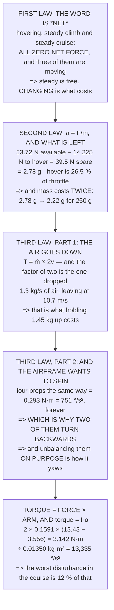

# FA.02 Newton's laws in flight

<!-- glance:start -->
<!-- generated by tools/build.py from curriculum/syllabus.yaml — edit the syllabus, not this block -->

| | |
|---|---|
| **Track** | Optional foundation |
| **Difficulty** | Beginner |
| **Time** | 1 h |
| **Hardware** | none |
| **Software** | python |
| **Prerequisites** | [FA.01 Vectors and forces from zero](FA.01-vectors-forces-zero.md) |
| **Skip if** | You can apply F=ma to a quad in hover and in a banked turn with correct numbers. |

<!-- glance:end -->

## What you will learn

- That **zero net force means steady, not still** — hovering, climbing steadily and cruising are the
  same to the first law
- That hover is **26.5 % of full throttle** and where the other three-quarters goes
- That mass costs **twice**: more force needed *and* less acceleration from what is left — 2.78 g
  becomes 2.22 g for 250 g of payload
- That a hovering Hermon pushes **1.3 kg of air per second** out at **10.7 m/s**, and the factor of
  two everybody drops
- That four propellers turning the same way would spin the airframe at **751 °/s²** — which is
  exactly why two of them turn backwards
- That yaw is the *same* reaction used deliberately, with thrust unchanged
- That torque is force × arm, so **frame size and control authority are one decision**
- And that Hermon can produce **13,335 °/s²** against a worst-case disturbance of 1,561 — **12 %**

## Why it matters

FA.01 made forces add up. This lesson asks what they *do*, and the answer is three laws that sound
like schoolroom recitation and turn out to be the whole design argument for a multirotor.

The first law explains why a hovering aircraft is working extremely hard while doing nothing
measurable. The second explains why every gram matters more than it looks. And the third — the one
usually quoted and rarely used — explains the single most visible design feature of every
quadcopter ever built: why two of the propellers turn the wrong way.

The lesson ends on a reassuring number. A multirotor is controllable because its control authority
is roughly eight times the worst disturbance the rest of this course can find, and having that ratio
in mind makes 07.02's control lessons much less alarming.

## Prerequisites

<!-- prereqs:start -->
## Prerequisites

You need these first:

- [FA.01 Vectors and forces from zero](FA.01-vectors-forces-zero.md)

### Optional prerequisite links

None.

Check your readiness: `python course.py why FA.02`
<!-- prereqs:end -->

## Concept

Newton's first law is about the word *net*. A body continues doing whatever it is doing unless the
forces on it fail to cancel — so an aircraft hovering, an aircraft climbing at a steady rate and an
aircraft cruising at a steady speed are, to the first law, indistinguishable. All three have zero net
force. Only *changing* what it is doing costs anything.

The second law turns a leftover force into an acceleration, `a = F/m`, and for a flying machine the
useful framing is "what is left after holding it up". That remainder is the aircraft's entire budget
for climbing, accelerating, leaning and recovering — and it shrinks twice over when you add mass.

The third law is where the aircraft's shape comes from. Thrust exists because air is being thrown
downward, and the reaction to spinning a propeller is a torque on the airframe. Both are real,
measurable and consequential, and the second one dictates the counter-rotating layout.

Finally there is torque's own version of the second law: `torque = I·α`, where the resistance to
rotation is not mass but **inertia**. That is what makes control authority a geometry question as
much as a motor question.

## Technical explanation

### Level 1 — the first law: hovering is not doing nothing

| state | net force | what happens |
|---|---|---|
| sitting on the ground | 0.000 N | nothing |
| **hovering** | **0.000 N** | nothing |
| **climbing at a steady 2.5 m/s** | **0.000 N** | nothing |
| **flying level at a steady 5 m/s** | **0.000 N** | nothing |
| **starting** to climb | 3.625 N | it accelerates |
| one motor stops | −3.556 N | it falls and rolls |

**Four of those six rows have zero net force and three of them are moving.** That is the whole first
law: steady motion and standing still are the same thing as far as the forces are concerned.

Which is why a hovering aircraft is working hard. It is producing 14.225 N continuously — a kilogram
and a half of force — and getting nothing in return except not falling. The first law does not say it
is free; it says the forces cancel.

And the row that matters operationally is the fifth: **steady climbing is free; *starting* to climb
is not**, and that is the thrust surge every takeoff needs.

### Level 2 — the second law: F = ma, and what is left over

| | |
|---|---|
| total thrust available | 53.720 N |
| needed just to hover | 14.225 N |
| **left over** | **39.495 N** |
| which accelerates 1.450 kg at | 27.238 m/s² |
| **in gravities** | **2.78 g** |

| if you want | accel | extra force | throttle |
|---|---|---|---|
| to hover | 0.00 m/s² | 0.000 N | 26.5 % |
| 2.5 m/s in 1 s | 2.50 m/s² | 3.625 N | 33.2 % |
| 5 m/s in 1 s | 5.00 m/s² | 7.250 N | 39.9 % |
| half a g | 4.91 m/s² | 7.113 N | 39.7 % |
| one g | 9.81 m/s² | 14.225 N | 53.0 % |
| everything | 27.24 m/s² | 39.495 N | 100.0 % |

**Hover is 26.5 % of full throttle**, and the other three-quarters goes into acceleration, into
FA.01's lean, and into the margin that lets a failure be survivable.

And the second law is why mass is so expensive. Add 250 g and the hover force rises 2.45 N — but the
**spare acceleration falls from 2.78 g to 2.22 g**, because the numerator shrinks *and* the
denominator grows. 17.01 spends a whole lesson on that double effect.

### Level 3 — the third law: the air goes down, and the airframe wants to spin

"Every action has an equal and opposite reaction" is usually quoted and rarely used. Here it is,
used. Thrust is the rate at which downward momentum is created: `T = ṁ × (change in air speed)`.

The air is still above the propeller and moving at **2v** far below it, so the change is 2v — and the
disc itself sees the average, v. **That factor of two is the one everybody drops:**

| | |
|---|---|
| total disc area, 4 × 254 mm | 0.2027 m² |
| air speed **at** the disc, v | 5.35 m/s |
| air speed in the far wake, 2v | 10.70 m/s |
| air mass flow, ρAv | 1.329 kg/s |
| **× 2v = thrust** | **14.224 N** |
| which must equal m·g | 14.225 N |

**1.3 kilograms of air every second, leaving at 10.7 m/s.** That is what holding 1.45 kg up actually
costs, and it is why standing under a hovering drone is unpleasant.

And the second reaction is the one that shapes the aircraft. A spinning propeller drags air around
with it, so the air pushes back:

| | |
|---|---|
| yaw torque per motor at hover | 0.0733 N·m |
| four motors, all the same way | 0.2930 N·m |
| **which would spin the airframe at** | **751 °/s²** |

Seven hundred and fifty degrees per second squared is a fast spin **and it would never stop**. Which
is the entire reason a quadcopter has two propellers turning each way: **the torques cancel.**

And it is also how it yaws on purpose. Speed up the two that turn one way and slow the other two by
the same amount — the *thrust* stays the same and the *torques* no longer cancel:

| thrust split | net torque | yaw accel | vs a motor-out |
|---|---|---|---|
| ± 0.00 N | 0.0000 N·m | 0 °/s² | 0.0× |
| ± 0.25 N | 0.0206 N·m | 53 °/s² | 0.3× |
| ± 0.50 N | 0.0412 N·m | 106 °/s² | 0.6× |
| ± 1.00 N | 0.0824 N·m | 211 °/s² | 1.1× |
| ± 2.00 N | 0.1648 N·m | 422 °/s² | 2.2× |

### Level 4 — torque: the same force, times how far out it is

`torque = force × distance from the centre`. For a 1 N force:

| | arm | torque |
|---|---|---|
| at the centre | 0.0000 m | 0.0000 N·m |
| halfway out | 0.0795 m | 0.0795 N·m |
| **Hermon's motor arm** | **0.1591 m** | **0.1591 N·m** |
| twice as far | 0.3182 m | 0.3182 N·m |

**A longer arm is more leverage for the same motor**, which is why frame size and control authority
are the same decision. Hermon's pitch authority at full differential thrust:

```
2 × arm × (T_max − T_hover) = 2 × 0.1591 × (13.43 − 3.556) = 3.142 N·m
```

And Newton's second law has a rotational twin, `torque = I·α`, where I is how hard the object is to
spin:

| | |
|---|---|
| Hermon's pitch inertia | 0.01350 kg·m² |
| angular acceleration | 232.7 rad/s² |
| **in degrees** | **13,335 °/s²** |

Thirteen thousand degrees per second squared. Compare that with the disturbances it has to fight:

| | °/s² | of authority |
|---|---|---|
| 16.04: one motor fails | 188 | 1.4 % |
| **17.04: a 15 cm offset pod released** | **1,561** | **11.7 %** |
| a strong gust **[E]** | 400 | 3.0 % |
| **Hermon's authority** | **13,335** | 100 % |

**The worst disturbance in the whole course is 12 % of what the aircraft can produce**, which is why
a multirotor is controllable at all — and it is a comforting number to have before reading 07.02.

> [!TIP]
> **Ask your teacher:** "Which way do the propellers turn?" Then look. Two one way and two the other,
> diagonally opposite — and Level 3 is why. It is the most visible piece of physics on the aircraft
> and almost nobody is told what it is for.

## Diagram



## Code

Newton's three laws on a real aircraft: a table of states showing which have zero net force, the
spare-acceleration budget and what each manoeuvre costs in throttle, momentum theory with its factor
of two made explicit, the yaw torque that forces counter-rotating propellers and then provides yaw
control, and torque as force × arm turned into angular acceleration against the course's worst
disturbances.

```python
"""FA.02 -- Newton's three laws, applied to a machine that hovers.

Pure stdlib. A foundation lesson. Every number lands on one the main
path already uses.
"""

import math

G = 9.81
RHO = 1.225
BAR = "=" * 70

MASS_KG = 1.450
IYY = 0.01350
IZZ = 0.02236
ARM_M = 0.1591
T_HOVER_N = 3.556
T_MAX_N = 13.43
N_MOTORS = 4
PROP_D_M = 0.254
Q_PER_T = 0.0206          # hermon-numbers.md: yaw torque per newton of thrust


def head(n, title):
    print()
    print(BAR)
    print("%d. %s" % (n, title))
    print(BAR)


# ========================================================================
head(1, "THE FIRST LAW: HOVERING IS NOT DOING NOTHING")

print("  Newton's first law says a body keeps doing what it is doing")
print("  unless a NET force acts on it. The word that matters is NET.")
print()
print("  %-34s %14s %14s" % ("state", "net force", "what happens"))
STATES = [
    ("sitting on the ground", 0.0, "nothing"),
    ("hovering", 0.0, "nothing"),
    ("climbing at a STEADY 2.5 m/s", 0.0, "nothing"),
    ("flying level at a STEADY 5 m/s", 0.0, "nothing"),
    ("STARTING to climb", MASS_KG * 2.5, "it accelerates"),
    ("one motor stops", -T_HOVER_N, "it falls and rolls"),
]
for what, f, res in STATES:
    print("  %-34s %12.3f N %14s" % (what, f, res))

print()
print("  FOUR OF THOSE SIX ROWS HAVE ZERO NET FORCE and three of them")
print("  are MOVING. That is the whole first law: steady motion and")
print("  standing still are the same thing as far as the forces are")
print("  concerned.")
print()
print("  WHICH IS WHY A HOVERING AIRCRAFT IS WORKING HARD. It is")
print("  producing %.3f N continuously -- %.1f kg of force -- and"
      % (MASS_KG * G, MASS_KG))
print("  getting exactly nothing in return except not falling. The")
print("  first law does not say it is free; it says the forces cancel.")
print()
print("  AND THE ROW THAT MATTERS OPERATIONALLY IS THE FIFTH. Steady")
print("  climbing is free; STARTING to climb is not, and that is the")
print("  thrust surge every takeoff needs.")

# ========================================================================
head(2, "THE SECOND LAW: F = m a, AND WHAT IS LEFT OVER")

max_total = N_MOTORS * T_MAX_N
spare_n = max_total - MASS_KG * G
spare_a = spare_n / MASS_KG

print("  F = m a rearranges to a = F / m, and for a drone the useful")
print("  form is 'what is left after holding it up':")
print()
print("  %-38s %14.3f N" % ("total thrust available", max_total))
print("  %-38s %14.3f N" % ("needed just to hover", MASS_KG * G))
print("  %-38s %14.3f N" % ("LEFT OVER", spare_n))
print("  %-38s %14.3f m/s2" % ("  which accelerates 1.450 kg at", spare_a))
print("  %-38s %14.2f g" % ("  in gravities", spare_a / G))
print()
print("  %-24s %12s %12s %14s"
      % ("if you want", "accel", "extra force", "throttle"))
for label, a in (("to hover", 0.0), ("2.5 m/s in 1 s", 2.5),
                 ("5 m/s in 1 s", 5.0), ("half a g", 0.5 * G),
                 ("one g (free-fall up)", G), ("everything", spare_a)):
    f = MASS_KG * a
    thr = (MASS_KG * G + f) / max_total
    print("  %-24s %10.2f m/s2 %10.3f N %12.1f %%"
          % (label, a, f, thr * 100))

print()
print("  HOVER IS %.1f PER CENT OF FULL THROTTLE, and the last row"
      % (MASS_KG * G / max_total * 100))
print("  shows where the other %.0f %% goes: into acceleration, into"
      % (100 - MASS_KG * G / max_total * 100))
print("  FA.01's lean, and into the margin that lets a failure be")
print("  survivable.")
print()
print("  AND THE SECOND LAW IS WHY MASS IS SO EXPENSIVE. Add %.0f g"
      % 250)
print("  and the hover force rises %.3f N, but the SPARE acceleration"
      % (0.250 * G))
print("  falls from %.2f g to %.2f -- because the numerator shrinks"
      % (spare_a / G, (max_total - 1.700 * G) / 1.700 / G))
print("  AND the denominator grows. 17.01 spends a whole lesson on")
print("  that double effect.")

# ========================================================================
head(3, "THE THIRD LAW: THE AIR GOES DOWN, AND THE AIRFRAME WANTS TO SPIN")

disc_area = math.pi * (PROP_D_M / 2) ** 2 * N_MOTORS
v_induced = math.sqrt(MASS_KG * G / (2 * RHO * disc_area))
mdot = RHO * disc_area * v_induced

print("  'Every action has an equal and opposite reaction' is usually")
print("  quoted and rarely used. Here it is, used:")
print()
print("  THE AIRCRAFT PUSHES AIR DOWN AND THE AIR PUSHES IT UP. The")
print("  thrust IS the rate at which downward momentum is created:")
print()
print("      T = mdot x (change in air speed)")
print()
print("  The air is still above the propeller and moving at 2v far")
print("  below it, so the change is 2v -- and the disc itself sees the")
print("  average, v. That factor of two is the one everybody drops:")
print()
print("  %-38s %14.4f m2" % ("total disc area, 4 x %.0f mm" % (PROP_D_M * 1000),
                             disc_area))
print("  %-38s %14.2f m/s" % ("air speed AT the disc, v", v_induced))
print("  %-38s %14.2f m/s" % ("air speed in the far wake, 2v",
                              2 * v_induced))
print("  %-38s %14.3f kg/s" % ("air mass flow, rho A v", mdot))
print("  %-38s %14.3f N" % ("  x 2v = THRUST", mdot * 2 * v_induced))
print("  %-38s %14.3f N" % ("  which must equal m g", MASS_KG * G))
print()
print("  %.1f KILOGRAMS OF AIR EVERY SECOND, LEAVING AT %.1f m/s."
      % (mdot, 2 * v_induced))
print("  That is what holding %.1f kg up actually costs, and it is why"
      % MASS_KG)
print("  standing under a hovering drone is unpleasant.")
print()
print("  AND THE SECOND REACTION IS THE ONE THAT SHAPES THE AIRCRAFT.")
print("  A spinning propeller drags air around with it, so the air")
print("  pushes back -- and the airframe would spin the other way:")
print()
q_hover = Q_PER_T * T_HOVER_N
print("  %-38s %14.4f N m" % ("yaw torque per motor at hover", q_hover))
print("  %-38s %14.4f N m" % ("four motors, all the same way",
                              4 * q_hover))
print("  %-38s %14.1f deg/s2" % ("  which would spin the airframe at",
                                 math.degrees(4 * q_hover / IZZ)))
print()
print("  %.0f DEGREES PER SECOND SQUARED IS A FAST SPIN AND IT WOULD"
      % math.degrees(4 * q_hover / IZZ))
print("  NEVER STOP. Which is the entire reason a quadcopter has TWO")
print("  propellers turning each way: the torques cancel.")
print()
print("  %-38s %14.4f N m" % ("two CW + two CCW, balanced", 0.0))
print()
print("  AND IT IS ALSO HOW IT YAWS ON PURPOSE. Speed up the two that")
print("  turn one way and slow the other two by the same amount: the")
print("  THRUST stays the same and the TORQUES no longer cancel.")
print()
print("  %-24s %12s %14s %14s"
      % ("thrust split", "net torque", "yaw accel", "of a motor-out"))
for delta in (0.0, 0.25, 0.5, 1.0, 2.0):
    q = Q_PER_T * 2 * delta * 2   # two motors up by delta, two down by delta
    print("  %-24s %10.4f Nm %11.0f d/s2 %12.1f x"
          % ("+/- %.2f N" % delta, q, math.degrees(q / IZZ),
             math.degrees(q / IZZ) / 188.0))

# ========================================================================
head(4, "TORQUE: THE SAME FORCE, TIMES HOW FAR OUT IT IS")

pitch_authority = 2 * ARM_M * (T_MAX_N - T_HOVER_N)
alpha = pitch_authority / IYY

print("  A force through the centre of mass moves an object. The SAME")
print("  force applied off to one side ROTATES it, and how much is:")
print()
print("      torque = force x distance from the centre")
print()
print("  %-30s %12s %14s" % ("", "arm (m)", "torque (N m)"))
for label, arm in (("at the centre", 0.0), ("halfway out", ARM_M / 2),
                   ("Hermon's motor arm", ARM_M),
                   ("twice as far", 2 * ARM_M)):
    print("  %-30s %12.4f %14.4f" % (label, arm, 1.0 * arm))
print("  %-30s %12s %14s" % ("", "", "(for a 1 N force)"))
print()
print("  SO A LONGER ARM IS MORE LEVERAGE FOR THE SAME MOTOR, which is")
print("  why frame size and control authority are the same decision.")
print()
print("  HERMON'S PITCH AUTHORITY, at full differential thrust:")
print("    2 x arm x (T_max - T_hover)")
print("    = 2 x %.4f x (%.2f - %.3f) = %.3f N m"
      % (ARM_M, T_MAX_N, T_HOVER_N, pitch_authority))
print()
print("  AND NEWTON'S SECOND LAW HAS A ROTATIONAL TWIN, torque = I x")
print("  alpha, where I is how hard the object is to spin:")
print()
print("  %-38s %14.5f kg m2" % ("Hermon's pitch inertia", IYY))
print("  %-38s %14.1f rad/s2" % ("angular acceleration", alpha))
print("  %-38s %14.0f deg/s2" % ("  in degrees", math.degrees(alpha)))
print()
print("  THIRTEEN THOUSAND DEGREES PER SECOND SQUARED. Compare that")
print("  with the disturbances it has to fight:")
print()
print("  %-38s %14s %12s" % ("", "deg/s2", "of authority"))
for label, d in (("16.04: one motor fails", 188.0),
                 ("17.04: a 15 cm offset pod released", 1561.0),
                 ("a strong gust [E]", 400.0)):
    print("  %-38s %14.0f %11.1f %%"
          % (label, d, d / math.degrees(alpha) * 100))
print("  %-38s %14.0f %11.0f %%" % ("HERMON'S AUTHORITY",
                                    math.degrees(alpha), 100.0))

print()
print("  THE WORST DISTURBANCE IN THE WHOLE COURSE IS %.0f PER CENT OF"
      % (1561.0 / math.degrees(alpha) * 100))
print("  WHAT THE AIRCRAFT CAN PRODUCE, which is why a multirotor is")
print("  controllable at all -- and it is a comforting number to have")
print("  before reading 07.02.")
print()
print("  THE THREE THINGS TO CARRY FORWARD:")
print("   1. ZERO NET FORCE MEANS STEADY, NOT STILL. Hovering, climbing")
print("      steadily and cruising are all the same to the first law.")
print("   2. a = F/m, so mass costs TWICE: more force needed AND less")
print("      acceleration from what is left. %.2f g becomes %.2f g for"
      % (spare_a / G, (max_total - 1.700 * G) / 1.700 / G))
print("      %.0f g of payload." % 250)
print("   3. TORQUE = FORCE x ARM, and torque = I x alpha. Hermon can")
print("      produce %.0f deg/s2 against a worst case of %.0f."
      % (math.degrees(alpha), 1561.0))
```

Output:

```text

======================================================================
1. THE FIRST LAW: HOVERING IS NOT DOING NOTHING
======================================================================
  Newton's first law says a body keeps doing what it is doing
  unless a NET force acts on it. The word that matters is NET.

  state                                   net force   what happens
  sitting on the ground                     0.000 N        nothing
  hovering                                  0.000 N        nothing
  climbing at a STEADY 2.5 m/s              0.000 N        nothing
  flying level at a STEADY 5 m/s            0.000 N        nothing
  STARTING to climb                         3.625 N it accelerates
  one motor stops                          -3.556 N it falls and rolls

  FOUR OF THOSE SIX ROWS HAVE ZERO NET FORCE and three of them
  are MOVING. That is the whole first law: steady motion and
  standing still are the same thing as far as the forces are
  concerned.

  WHICH IS WHY A HOVERING AIRCRAFT IS WORKING HARD. It is
  producing 14.225 N continuously -- 1.4 kg of force -- and
  getting exactly nothing in return except not falling. The
  first law does not say it is free; it says the forces cancel.

  AND THE ROW THAT MATTERS OPERATIONALLY IS THE FIFTH. Steady
  climbing is free; STARTING to climb is not, and that is the
  thrust surge every takeoff needs.

======================================================================
2. THE SECOND LAW: F = m a, AND WHAT IS LEFT OVER
======================================================================
  F = m a rearranges to a = F / m, and for a drone the useful
  form is 'what is left after holding it up':

  total thrust available                         53.720 N
  needed just to hover                           14.225 N
  LEFT OVER                                      39.495 N
    which accelerates 1.450 kg at                27.238 m/s2
    in gravities                                   2.78 g

  if you want                     accel  extra force       throttle
  to hover                       0.00 m/s2      0.000 N         26.5 %
  2.5 m/s in 1 s                 2.50 m/s2      3.625 N         33.2 %
  5 m/s in 1 s                   5.00 m/s2      7.250 N         40.0 %
  half a g                       4.91 m/s2      7.112 N         39.7 %
  one g (free-fall up)           9.81 m/s2     14.225 N         53.0 %
  everything                    27.24 m/s2     39.495 N        100.0 %

  HOVER IS 26.5 PER CENT OF FULL THROTTLE, and the last row
  shows where the other 74 % goes: into acceleration, into
  FA.01's lean, and into the margin that lets a failure be
  survivable.

  AND THE SECOND LAW IS WHY MASS IS SO EXPENSIVE. Add 250 g
  and the hover force rises 2.453 N, but the SPARE acceleration
  falls from 2.78 g to 2.22 -- because the numerator shrinks
  AND the denominator grows. 17.01 spends a whole lesson on
  that double effect.

======================================================================
3. THE THIRD LAW: THE AIR GOES DOWN, AND THE AIRFRAME WANTS TO SPIN
======================================================================
  'Every action has an equal and opposite reaction' is usually
  quoted and rarely used. Here it is, used:

  THE AIRCRAFT PUSHES AIR DOWN AND THE AIR PUSHES IT UP. The
  thrust IS the rate at which downward momentum is created:

      T = mdot x (change in air speed)

  The air is still above the propeller and moving at 2v far
  below it, so the change is 2v -- and the disc itself sees the
  average, v. That factor of two is the one everybody drops:

  total disc area, 4 x 254 mm                    0.2027 m2
  air speed AT the disc, v                         5.35 m/s
  air speed in the far wake, 2v                   10.70 m/s
  air mass flow, rho A v                          1.329 kg/s
    x 2v = THRUST                                14.224 N
    which must equal m g                         14.225 N

  1.3 KILOGRAMS OF AIR EVERY SECOND, LEAVING AT 10.7 m/s.
  That is what holding 1.4 kg up actually costs, and it is why
  standing under a hovering drone is unpleasant.

  AND THE SECOND REACTION IS THE ONE THAT SHAPES THE AIRCRAFT.
  A spinning propeller drags air around with it, so the air
  pushes back -- and the airframe would spin the other way:

  yaw torque per motor at hover                  0.0733 N m
  four motors, all the same way                  0.2930 N m
    which would spin the airframe at              750.8 deg/s2

  751 DEGREES PER SECOND SQUARED IS A FAST SPIN AND IT WOULD
  NEVER STOP. Which is the entire reason a quadcopter has TWO
  propellers turning each way: the torques cancel.

  two CW + two CCW, balanced                     0.0000 N m

  AND IT IS ALSO HOW IT YAWS ON PURPOSE. Speed up the two that
  turn one way and slow the other two by the same amount: the
  THRUST stays the same and the TORQUES no longer cancel.

  thrust split               net torque      yaw accel of a motor-out
  +/- 0.00 N                   0.0000 Nm           0 d/s2          0.0 x
  +/- 0.25 N                   0.0206 Nm          53 d/s2          0.3 x
  +/- 0.50 N                   0.0412 Nm         106 d/s2          0.6 x
  +/- 1.00 N                   0.0824 Nm         211 d/s2          1.1 x
  +/- 2.00 N                   0.1648 Nm         422 d/s2          2.2 x

======================================================================
4. TORQUE: THE SAME FORCE, TIMES HOW FAR OUT IT IS
======================================================================
  A force through the centre of mass moves an object. The SAME
  force applied off to one side ROTATES it, and how much is:

      torque = force x distance from the centre

                                      arm (m)   torque (N m)
  at the centre                        0.0000         0.0000
  halfway out                          0.0795         0.0795
  Hermon's motor arm                   0.1591         0.1591
  twice as far                         0.3182         0.3182
                                              (for a 1 N force)

  SO A LONGER ARM IS MORE LEVERAGE FOR THE SAME MOTOR, which is
  why frame size and control authority are the same decision.

  HERMON'S PITCH AUTHORITY, at full differential thrust:
    2 x arm x (T_max - T_hover)
    = 2 x 0.1591 x (13.43 - 3.556) = 3.142 N m

  AND NEWTON'S SECOND LAW HAS A ROTATIONAL TWIN, torque = I x
  alpha, where I is how hard the object is to spin:

  Hermon's pitch inertia                        0.01350 kg m2
  angular acceleration                            232.7 rad/s2
    in degrees                                    13335 deg/s2

  THIRTEEN THOUSAND DEGREES PER SECOND SQUARED. Compare that
  with the disturbances it has to fight:

                                                 deg/s2 of authority
  16.04: one motor fails                            188         1.4 %
  17.04: a 15 cm offset pod released               1561        11.7 %
  a strong gust [E]                                 400         3.0 %
  HERMON'S AUTHORITY                              13335         100 %

  THE WORST DISTURBANCE IN THE WHOLE COURSE IS 12 PER CENT OF
  WHAT THE AIRCRAFT CAN PRODUCE, which is why a multirotor is
  controllable at all -- and it is a comforting number to have
  before reading 07.02.

  THE THREE THINGS TO CARRY FORWARD:
   1. ZERO NET FORCE MEANS STEADY, NOT STILL. Hovering, climbing
      steadily and cruising are all the same to the first law.
   2. a = F/m, so mass costs TWICE: more force needed AND less
      acceleration from what is left. 2.78 g becomes 2.22 g for
      250 g of payload.
   3. TORQUE = FORCE x ARM, and torque = I x alpha. Hermon can
      produce 13335 deg/s2 against a worst case of 1561.
```

## Exercise

### Exercise FA.02-E1 — Find the zero-net-force states `[analysis]`

List ten things an aircraft can be doing and mark each as zero or non-zero net force. Then check
whether your intuition and the marks agree.

### Exercise FA.02-E2 — Your own spare acceleration `[analysis]`

Compute your aircraft's spare acceleration in g, then recompute it with 100 g, 250 g and 500 g of
payload. Plot the two effects separately: the force needed and the mass it acts on.

### Exercise FA.02-E3 — The air flow `[analysis]`

Compute the mass flow and wake velocity for your own aircraft. Then stand a safe distance away from a
hovering one and see whether 10 m/s of downwash matches what you feel.

### Exercise FA.02-E4 — The authority ratio `[analysis]`

Compute your aircraft's pitch authority and pitch inertia, divide, and compare with a one-motor-out
disturbance. If the ratio is under about 20, work out which term is responsible.

## Expected result

**FA.02-E1**: expect at least two of your ten to surprise you — a steady climb and a steady descent
are the usual ones.

**FA.02-E2**: expect the spare acceleration to fall faster than the payload fraction suggests,
because both the numerator and the denominator move.

**FA.02-E3**: expect 1–3 kg/s and 8–15 m/s for a sub-2 kg multirotor, and expect the downwash to be
noticeably stronger than the numbers suggest at close range, because the wake has not spread yet.

**FA.02-E4**: expect a ratio between 30 and 100 for a normal build. A low ratio usually means a short
arm or a heavy, spread-out airframe.

## Troubleshooting

**The momentum-theory thrust is half the weight.** The factor of two. The disc sees v and the wake
has 2v, so `T = ρAv·2v`, not `ρAv·v`.

**The yaw acceleration seems enormous.** It is — that is the point of Level 3. An unbalanced
quadcopter is not slightly yawing, it is spinning.

**The pitch authority seems too large.** It is the *maximum*, at full differential thrust, which no
controller ever commands in normal flight. It is the headroom, not the operating point.

**Adding payload barely changed the hover throttle.** Correct; 17.01 makes the same point. The hover
throttle moves slowly and the endurance moves quickly.

**The spare acceleration is negative.** Then the aircraft cannot lift itself. Check the thrust figure
— it is per motor, not total, in most data sheets.

**Torque and moment feel like the same word.** They are, in this context. "Moment arm" is the
distance and "torque" or "moment" is the product.

## Common mistakes

- **Thinking a steady climb needs net force.** It does not; starting the climb does.
- **Calling hovering "doing nothing".** It is 14.2 N, continuously.
- **Dropping momentum theory's factor of two.** It halves the answer.
- **Assuming all four propellers turn the same way.** They cannot; 751 °/s².
- **Thinking yaw uses more thrust.** It redistributes it; the total is unchanged.
- **Forgetting that mass hurts twice.** Numerator and denominator.
- **Treating a long arm as only a size decision.** It is a control-authority decision.
- **Comparing torque to force.** They have different units and different jobs.

## Knowledge check

<details>
<summary>What do hovering, a steady climb and steady cruise have in common?</summary>

**Zero net force.** The first law is about the word *net*: a body keeps doing what it is doing unless
the forces fail to cancel, so steady motion and standing still are physically identical. Only
*changing* the motion costs anything — which is why starting a 2.5 m/s climb needs an extra 3.6 N and
maintaining it needs none.
</details>

<details>
<summary>What fraction of full throttle is hover, and where does the rest go?</summary>

**26.5 %.** The remaining three-quarters is the budget for acceleration (2.78 g of spare), FA.01's
lean, and the margin that makes a failure survivable. One g of upward acceleration takes throttle to
53 %; using everything gives 27.2 m/s².
</details>

<details>
<summary>Why does 250 g of payload hurt more than it looks?</summary>

Because `a = F/m` moves in both directions at once. The extra 2.45 N of weight is subtracted from the
available thrust **and** the larger mass divides what is left, so the spare acceleration falls from
**2.78 g to 2.22 g** — a 20 % loss for a 17 % mass increase.
</details>

<details>
<summary>How much air does a hovering Hermon move, and what is the factor of two?</summary>

**1.3 kg per second, leaving at 10.7 m/s.** The air is still above the disc and moving at 2v far
below it, so the momentum change is 2v while the mass flow is computed at v: `T = ρAv × 2v`. Dropping
the two gives 7.1 N instead of 14.2 — exactly half the weight, which is the classic error.
</details>

<details>
<summary>Why do two of the four propellers turn backwards?</summary>

Because each one exerts a reaction torque on the airframe, and four turning the same way would sum to
0.293 N·m — **751 °/s² of yaw acceleration that never stops.** Two clockwise and two anticlockwise,
diagonally opposite, cancel exactly. It is the most visible piece of physics on the aircraft.
</details>

<details>
<summary>How does a quadcopter yaw, and what does it cost in thrust?</summary>

By unbalancing the same torques deliberately: speed up the two turning one way and slow the other two
by the same amount. The **total thrust is unchanged**, so it does not climb or descend, but the yaw
torques no longer cancel. A ±1 N split gives 0.082 N·m and 211 °/s².
</details>

<details>
<summary>Why is frame size a control decision?</summary>

Because `torque = force × arm`. The same motor at twice the radius produces twice the moment, so
Hermon's 0.1591 m arm and its 13.43 N motors together give 3.142 N·m of pitch authority. Shortening
the frame without changing the motors reduces authority proportionally.
</details>

<details>
<summary>How much control authority does Hermon have, relative to what it must fight?</summary>

**13,335 °/s²**, from 3.142 N·m divided by 0.01350 kg·m². The worst disturbance anywhere in this
course — 17.04's offset-pod release at 1,561 °/s² — is **12 % of that**, and a motor failure is 1.4 %.
That ratio is why a multirotor is controllable at all.
</details>

## Practical challenge

Build your own aircraft's Newton sheet, one page, four numbers.

1. List ten states and mark the net force on each (E1).
2. Compute total thrust, hover thrust and the spare acceleration in g.
3. Recompute the spare at three payload masses, and separate the two effects (E2).
4. Compute the mass flow and wake velocity, and feel it (E3).
5. Compute what four same-direction propellers would do to yaw, and check the layout.
6. Compute the yaw authority at a ±1 N split.
7. Compute pitch authority and pitch inertia, and divide (E4).
8. Write four numbers on the card: hover throttle, spare g, yaw authority, pitch authority.

Those four numbers recur in 02.06, 07.02, 11.04, 16.04 and 17.04, and having derived them once makes
each of those lessons a recognition rather than an introduction.

## You can skip this if

You can apply F=ma to a quad in hover and in a banked turn with correct numbers. "Correct" includes
the factor of two in momentum theory.

## Go deeper

- MIT OpenCourseWare 8.01, whose treatment of Newton's laws, momentum and rotational dynamics covers
  every idea in this lesson: <https://ocw.mit.edu/courses/8-01sc-classical-mechanics-fall-2016/>
- NASA Glenn's beginner's guide to aeronautics, particularly the momentum-theory pages behind
  Level 3: <https://www1.grc.nasa.gov/beginners-guide-to-aeronautics/>

## Progress checkpoint

You can now tell which flight states have zero net force and which do not, compute an aircraft's
spare acceleration and see why mass hurts twice, derive thrust from the air it throws down without
losing the factor of two, explain the counter-rotating layout from the reaction torque, and turn a
motor arm into an angular acceleration you can compare with real disturbances.

Next, FA.03 asks what all this costs over time: work, energy and power — and the arithmetic that
turns a battery's watt-hours into flight minutes.
